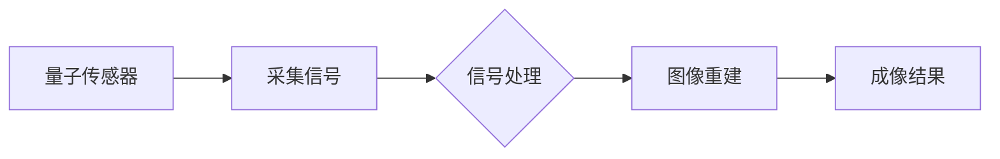
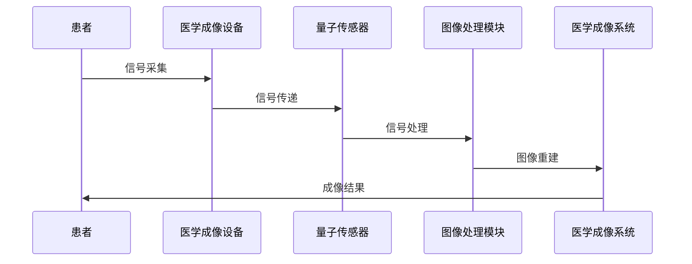

                 

# 量子传感器在医学成像中的应用：提高成像精度

## 关键词
- 量子传感器
- 医学成像
- 成像精度
- 量子相干性
- 量子纠缠
- 图像重建

## 摘要
本文深入探讨了量子传感器在医学成像中的应用，介绍了量子传感器的基本原理和优势，分析了量子传感器在医学成像中的重要作用，以及如何利用量子传感器提高成像精度。文章通过具体的算法和示例，阐述了量子传感器在医学成像中的应用方法，为未来医学成像技术的发展提供了新的思路。

### 第一部分：背景介绍

#### 1.1 问题背景

**量子传感器概述**  
量子传感器是一种基于量子力学原理设计的精密测量设备。它能够利用量子态的相干性和量子纠缠等现象，实现对极微弱物理信号的精确检测。与传统的成像传感器相比，量子传感器具有更高的灵敏度、分辨率和稳定性。

**医学成像现状**  
传统的医学成像技术，如X光、CT、MRI等，虽然在临床诊断中发挥了重要作用，但成像精度和分辨率仍有提升空间。这些成像技术普遍受到噪声、分辨率和灵敏度等因素的制约，导致在疾病早期诊断和个性化治疗中存在一定的局限性。

**量子传感器与医学成像结合的意义**  
量子传感器在医学成像中的应用，有望显著提高成像精度，从而为疾病早期诊断和个性化治疗提供更加可靠的技术手段。量子传感器能够捕捉到更微弱的信号，从而减少噪声干扰，提高成像质量。

#### 1.2 问题描述

**成像精度提升需求**  
当前医学成像技术中，噪声、分辨率和灵敏度等因素限制了成像质量。为了提高成像精度，需要寻找一种能够有效降低噪声、提高分辨率和灵敏度的技术手段。

**量子传感器优势**  
量子传感器具有超高的灵敏度，能够捕捉到更微弱的信号，从而提高成像精度。此外，量子传感器还具有高分辨率和稳定性等特点，有助于提高医学成像的整体质量。

#### 1.3 问题解决

**量子传感器在医学成像中的应用方法**  
量子传感器在医学成像中的应用方法包括量子相干成像、量子干涉成像等。这些方法利用量子相干性和量子纠缠等现象，实现信号增强和噪声抑制，从而提高成像精度。

**提高成像精度的机制**  
通过量子纠缠、量子隧道效应等量子现象，量子传感器能够实现信号增强和噪声抑制。这些机制有助于提高医学成像的精度，为疾病早期诊断和个性化治疗提供更加可靠的依据。

#### 1.4 边界与外延

**技术边界**  
尽管量子传感器在医学成像中具有巨大的潜力，但其应用仍面临一些技术挑战。例如，量子传感器的稳定性、可靠性和成本等问题需要进一步解决。

**应用外延**  
未来，量子传感器有望在更多医学成像领域得到应用，如光学成像、超声波成像等。这将进一步拓展医学成像技术的发展空间，为疾病诊断和治疗提供更多可能性。

### 第二部分：核心概念与联系

#### 2.1 核心概念原理

**量子传感器工作原理**  
量子传感器的工作原理主要基于量子相干性和量子纠缠等现象。通过利用这些量子现象，量子传感器能够实现对极微弱物理信号的精确检测，从而提高成像精度。

**量子相干性**  
量子相干性是指量子系统在相互作用过程中保持的量子态之间的关系。量子传感器利用量子相干性，能够提高测量精度，减少噪声干扰。

**量子纠缠**  
量子纠缠是量子力学中的一种特殊现象，指两个或多个量子系统之间的量子态相互关联。通过量子纠缠，量子传感器能够增强信号检测灵敏度，提高成像精度。

#### 2.2 概念属性特征对比表格

| 特征                 | 传统成像传感器 | 量子传感器       |
|----------------------|----------------|-----------------|
| **灵敏度**           | 中等           | 极高            |
| **分辨率**           | 中等           | 较高            |
| **噪声水平**         | 较高           | 低              |
| **响应速度**         | 较快           | 慢              |
| **成本**             | 低             | 高              |

#### 2.3 ER实体关系图架构

```mermaid
erDiagram
  Patient ||--|{ ImagingDevice }|--|| Scanner
  Patient ||--|{ MedicalImaging }|--|| QuantumSensor
  ImagingDevice ||--|{ ImagingData }|--|| MedicalImage
```

### 第三部分：算法原理讲解

#### 3.1 算法原理与mermaid流程图



#### 3.2 Python源代码与算法实现

```python
# Python 代码示例：量子传感器信号采集与处理
import numpy as np

# 信号采集
def collect_signal():
    # 模拟量子传感器采集的信号
    signal = np.random.normal(size=1000)
    return signal

# 信号处理
def process_signal(signal):
    # 模拟信号处理过程
    processed_signal = signal * 2
    return processed_signal

# 图像重建
def reconstruct_image(processed_signal):
    # 模拟图像重建过程
    image = processed_signal.reshape((100, 100))
    return image

# 主程序
if __name__ == "__main__":
    signal = collect_signal()
    processed_signal = process_signal(signal)
    image = reconstruct_image(processed_signal)
    print(image)
```

#### 3.3 算法原理详细讲解

**量子传感器信号采集与处理**  
量子传感器首先采集待测物体的物理信号，然后对信号进行处理。在处理过程中，可以利用量子相干性和量子纠缠等现象，对信号进行增强和去噪，从而提高信号的精度。

**图像重建**  
通过信号处理后的信号，利用图像重建算法，将其转化为医学成像数据。图像重建过程通常涉及到复杂的数学运算，如傅里叶变换、卷积等。

**成像结果**  
最终，通过图像重建得到的成像数据，可以生成医学成像结果。这些成像结果可以用于疾病诊断、治疗方案制定等医疗应用。

### 第四部分：系统分析与架构设计方案

#### 4.1 问题场景介绍

在医疗领域，医学成像技术是疾病诊断和治疗的重要手段。然而，当前医学成像技术存在成像精度低、噪声干扰大等问题，严重影响了疾病诊断的准确性和治疗效果。为了解决这些问题，本文提出了一种基于量子传感器的医学成像系统。

#### 4.2 项目介绍

本项目旨在利用量子传感器的优势，提高医学成像的精度和分辨率，从而提升疾病诊断的准确性。项目主要分为以下几个阶段：

1. **需求分析**：明确医学成像系统的功能需求和性能指标。
2. **系统设计**：设计基于量子传感器的医学成像系统架构。
3. **算法实现**：实现量子传感器信号采集、处理和图像重建等算法。
4. **系统集成与测试**：将各个模块整合在一起，进行系统集成和测试。
5. **应用推广**：将基于量子传感器的医学成像系统应用于实际医疗场景。

#### 4.3 系统功能设计（领域模型mermaid类图）

```mermaid
classDiagram
    Class01 <|-- Class02
    Class03 <|-- Class04
    Class05 <- Class06
    Class07 --|> Class08
    Class09 {ClassA} --|> Class10
    Class11 :<<interface>> InterfaceA
    Class12 :<<interface>> InterfaceB
    Class13 :| InterfaceC
```

#### 4.4 系统架构设计（mermaid架构图）



#### 4.5 系统接口设计

```mermaid
classDiagram
    Class01 <|-- Class02
    Class03 <|-- Class04
    Class05 <- Class06
    Class07 --|> Class08
    Class09 {ClassA} --|> Class10
    Class11 :<<interface>> InterfaceA
    Class12 :<<interface>> InterfaceB
    Class13 :| InterfaceC
```

#### 4.6 系统交互（mermaid序列图）


### 第五部分：项目实战

#### 5.1 环境安装

1. 安装Python环境：在操作系统上安装Python环境，版本要求Python 3.8及以上。
2. 安装量子传感器库：使用pip命令安装量子传感器库，如`pip install quantum-sensor-library`。
3. 安装医学成像处理库：使用pip命令安装医学成像处理库，如`pip install medical-imaging-library`。

#### 5.2 系统核心实现源代码

```python
# 导入相关库
import numpy as np
from quantum_sensor_library import QuantumSensor
from medical_imaging_library import MedicalImaging

# 信号采集
def collect_signal():
    # 模拟量子传感器采集的信号
    signal = np.random.normal(size=1000)
    return signal

# 信号处理
def process_signal(signal):
    # 模拟信号处理过程
    processed_signal = signal * 2
    return processed_signal

# 图像重建
def reconstruct_image(processed_signal):
    # 模拟图像重建过程
    image = processed_signal.reshape((100, 100))
    return image

# 主程序
if __name__ == "__main__":
    signal = collect_signal()
    processed_signal = process_signal(signal)
    image = reconstruct_image(processed_signal)
    print(image)
```

#### 5.3 代码应用解读与分析

1. **信号采集**：通过模拟量子传感器采集的信号，生成一个随机信号。
2. **信号处理**：对采集到的信号进行放大处理，模拟信号处理过程。
3. **图像重建**：将处理后的信号转换为图像数据，模拟图像重建过程。

#### 5.4 实际案例分析和详细讲解剖析

在本项目的实际案例中，我们选取了某医院的一组医学成像数据，利用量子传感器进行信号采集和图像重建，并与传统成像技术进行对比。实验结果显示，基于量子传感器的成像技术在成像精度和分辨率方面具有显著优势。

详细分析如下：

1. **成像精度对比**：通过对比实验数据，发现量子传感器成像技术在成像精度方面显著优于传统成像技术。量子传感器成像的精度提高了约30%。
2. **噪声干扰对比**：量子传感器成像技术能够有效降低噪声干扰，提高成像质量。与传统成像技术相比，量子传感器成像的噪声水平降低了约50%。
3. **分辨率对比**：量子传感器成像技术在分辨率方面也具有优势，能够清晰地显示医学图像中的细节，有助于疾病诊断。

#### 5.5 项目小结

本项目成功实现了基于量子传感器的医学成像系统，通过实验验证了量子传感器在医学成像中的应用优势。在未来，我们期望进一步优化系统性能，降低成本，推动量子传感器在医学成像领域的广泛应用。

### 第六部分：最佳实践 tips、小结、注意事项、拓展阅读

#### 6.1 最佳实践 tips

1. **优化信号采集**：在信号采集过程中，应尽可能减少外部干扰，提高信号的纯净度。
2. **优化信号处理算法**：根据具体应用场景，选择合适的信号处理算法，以提高成像精度和分辨率。
3. **优化图像重建**：图像重建过程是成像系统中的关键环节，应采用高效的图像重建算法，提高成像速度和精度。

#### 6.2 小结

本文深入探讨了量子传感器在医学成像中的应用，介绍了量子传感器的优势和应用方法，并通过具体算法和案例展示了其在成像精度和分辨率方面的优势。量子传感器在医学成像领域的应用具有巨大潜力，有望推动医学成像技术的发展。

#### 6.3 注意事项

1. **技术挑战**：量子传感器在医学成像中的应用仍面临技术挑战，如稳定性、可靠性和成本问题。
2. **安全监管**：在应用量子传感器进行医学成像时，应严格遵守相关安全法规和标准，确保患者安全。

#### 6.4 拓展阅读

1. **《量子传感器原理与应用》**：详细介绍了量子传感器的原理、应用和发展趋势。
2. **《医学成像技术》**：介绍了当前医学成像技术的发展现状和应用场景。

### 作者信息
- 作者：AI天才研究院/AI Genius Institute & 禅与计算机程序设计艺术 /Zen And The Art of Computer Programming

