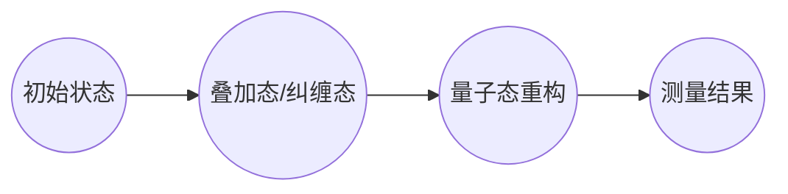
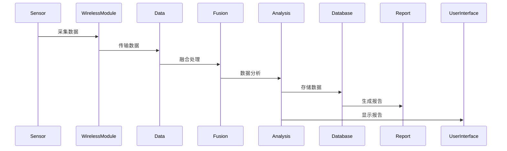
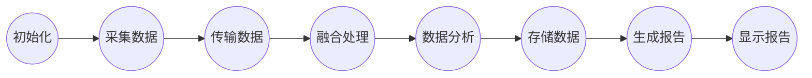

                 

### 量子传感器概述

#### 量子传感器的基本概念

量子传感器是一种利用量子力学原理进行测量和传感的设备，其基本原理是利用量子纠缠和量子叠加等量子现象，实现对测量对象的超精确感知和测量。相比传统的经典传感器，量子传感器具有极高的灵敏度和精确度，能够在微观和宏观尺度上实现前所未有的测量精度。在地质勘探领域，量子传感器的应用有着重要的研究价值，因为它能够检测到地下物质的微小变化，提高地质勘探的准确性和效率。

#### 地质勘探的重要性

地质勘探是指通过地质调查、采样、分析和测试等手段，对地球内部的岩石、矿物、地下水等地质资源进行研究和评价的过程。地质勘探在资源勘探、环境监测、工程建设和灾害预防等方面具有重要作用。然而，传统的地质勘探方法在探测深度、精度和效率方面存在一定的局限性。因此，寻求更为先进和高效的勘探技术，如量子传感器，成为当前地质勘探领域的重要研究方向。

#### 量子传感器在地质勘探中的应用背景

量子传感器在地质勘探中的应用具有显著的背景和潜力。首先，地质勘探过程中，需要对地下矿藏、地下水、地震波等复杂地质现象进行精确测量，这需要高灵敏度和高精确度的传感器。量子传感器在这方面具有独特的优势，可以大幅提升地质勘探的精度和效率。其次，随着地质勘探领域的不断拓展，对于深海、极地等极端环境下的勘探需求日益增加，而量子传感器具有良好的环境适应性，能够在恶劣条件下稳定工作。此外，量子传感器在探测地下流体、气体等物质时，能够提供更为丰富的信息，有助于揭示地质结构的复杂性和多样性。

#### 量子传感器在地质勘探中的优势

量子传感器在地质勘探中具有多方面的优势。首先，它的高灵敏度和高精确度使得它能够检测到地下物质的微小变化，从而提高勘探的准确性和精度。例如，量子干涉仪传感器可以用于检测地下水的分布和流量，量子密钥分配（QKD）技术可以用于保障地质数据传输的安全性。其次，量子传感器的快速响应能力使得地质勘探过程更加高效。例如，量子磁力计可以实时监测地下矿藏的变化，及时调整勘探方案。最后，量子传感器在极端环境下的稳定性和适应性也是其在地质勘探中的一大优势，使得勘探活动能够在更加复杂和恶劣的环境中进行。

### 核心概念与联系

在探讨量子传感器在地质勘探中的应用之前，我们需要了解一些核心概念及其相互关系。以下是几个关键概念的定义和它们在地质勘探中的联系：

#### 量子力学

量子力学是研究物质和能量在微观尺度上的行为和相互作用的物理学分支。它为量子传感器的理论基础提供了关键支持，特别是在量子纠缠和量子叠加等方面。量子力学原理使得量子传感器能够实现超精确测量，这对于地质勘探中微弱信号的检测具有重要意义。

#### 地质力学

地质力学是研究地球内部物质结构和运动规律的科学。它为地质勘探提供了基础理论和方法，包括岩石力学、构造地质学等。地质力学的知识帮助我们理解地下物质的行为和地质现象的形成机制，这对于利用量子传感器进行地质勘探至关重要。

#### 地球物理学

地球物理学是利用物理学的原理和方法研究地球及其内部结构的科学。它为地质勘探提供了重要的工具，包括地震勘探、重力勘探、磁法勘探等。地球物理学的研究成果与量子传感器的测量技术相结合，可以大幅提高地质勘探的效率和精度。

#### 量子传感技术

量子传感技术是利用量子力学原理进行测量和传感的技术。它包括量子干涉仪、量子密钥分配、量子磁力计等多种技术，能够在微观和宏观尺度上实现超精确测量。量子传感技术在地质勘探中的应用，可以为地下物质的探测提供全新的手段和视角。

#### 传统传感技术

传统传感技术是指基于经典物理学原理的传感器技术，如电磁感应、热敏电阻等。传统传感器在地质勘探中已有广泛应用，但与量子传感器相比，其在灵敏度、精确度和抗干扰能力等方面存在一定局限性。

#### 概念属性特征对比表格

为了更直观地展示这些核心概念之间的关系，我们可以创建一个概念属性特征对比表格，分别列出量子力学、地质力学、地球物理学、量子传感技术和传统传感技术的关键特征和差异。

| 概念               | 关键特征                           | 主要应用                 |
|--------------------|-----------------------------------|-------------------------|
| 量子力学           | 利用量子纠缠、量子叠加原理       | 提供量子传感器理论支持   |
| 地质力学           | 研究地球内部物质结构和运动       | 基础地质勘探理论         |
| 地球物理学         | 利用物理方法研究地球结构         | 地质勘探工具和方法       |
| 量子传感技术       | 超高灵敏度和精确度的测量技术     | 微观和宏观尺度上的测量   |
| 传统传感技术       | 基于经典物理原理的传感器技术     | 广泛应用于各种测量场景   |

#### ER实体关系图架构

为了进一步理解这些概念之间的联系，我们可以使用ER（Entity-Relationship，实体-关系）图来展示它们之间的关联。ER图是一种用于描述数据模型和实体关系的图形表示方法，可以帮助我们清晰地了解各个概念在地质勘探中的关系。

在ER图中，实体（Entity）代表具体的概念或对象，关系（Relationship）则表示实体之间的联系。以下是一个简化的ER图，展示了量子力学、地质力学、地球物理学、量子传感技术和传统传感技术之间的主要关系：

```mermaid
erDiagram
    Quantum_Mechanics ||--|{ Quantum_Sensor_Technology }
    Geological_Mechanics ||--|{ Geological_Exploration }
    Geophysics ||--|{ Geological_Exploration }
    Quantum_Sensor_Technology ||--|{ Geophysics }
    Traditional_Sensor_Technology ||--|{ Geological_Exploration }
```

在该ER图中，量子力学为量子传感技术提供了理论支持，地质力学和地球物理学则为地质勘探提供了基础理论和方法。量子传感技术和传统传感技术都是地质勘探的工具，但量子传感技术在灵敏度、精确度等方面具有显著优势。

通过上述对比表格和ER图，我们可以清晰地了解量子传感器在地质勘探中的核心概念及其相互关系，为后续章节的深入讨论奠定了基础。

### 算法原理讲解

量子传感器在地质勘探中的核心作用在于其卓越的测量精度和灵敏度。为了深入理解量子传感器的工作原理和应用，我们需要详细探讨其背后的算法原理。

#### 量子传感器的算法原理

量子传感器的算法原理主要基于量子力学的两个核心概念：量子纠缠和量子叠加。量子纠缠是指两个或多个量子系统之间的内在联系，即使它们相隔很远，其中一个系统的状态变化也会立即影响另一个系统。量子叠加则是指量子系统可以同时处于多种状态的组合，而不是单一状态。

1. **量子纠缠**：

   量子纠缠是量子传感器能够实现超精确测量的关键。例如，在一个典型的量子干涉实验中，一个光子被分成两个部分，并分别放置在不同的位置。这两个光子之间就建立了量子纠缠关系。如果其中一个光子的状态发生变化，另一个光子也会立即发生相应的变化。这种纠缠关系使得我们可以通过测量一个光子的状态，间接地获得另一个光子的信息。

2. **量子叠加**：

   量子叠加使得量子系统可以同时存在于多个状态。例如，一个量子比特（qubit）可以同时处于0和1的状态。这种叠加态在量子计算和量子传感中发挥着重要作用。在量子传感中，通过适当地操纵量子叠加态，可以大幅提高测量的灵敏度。

#### 算法流程

量子传感器的算法流程通常包括以下几个步骤：

1. **量子态制备**：

   首先，我们需要制备出特定的量子态。这可以通过量子比特的初始化实现，使得量子比特处于叠加态或纠缠态。

2. **测量与纠缠**：

   接下来，我们对量子态进行测量，以获取所需的信息。在量子传感中，测量通常是通过量子干涉来实现。通过干涉实验，我们可以获得量子态的相位信息，从而实现对测量对象的精确测量。

3. **信息解码**：

   测量结果需要进行解码，以提取有用的信息。这通常涉及复杂的数学运算，如量子态重构和概率分布计算。

4. **结果输出**：

   最后，解码后的信息被输出，用于后续的数据处理和分析。

以下是一个使用Mermaid绘制的量子传感器算法流程图：



#### Python源代码示例

为了更好地理解量子传感器的算法原理，我们可以通过Python源代码实现一个简单的量子传感器算法。以下是一个使用Python和量子计算库Qiskit的示例代码，展示了量子态制备、测量与信息解码的过程。

```python
from qiskit import QuantumCircuit, Aer, execute
from qiskit.visualization import plot_bloch_vector
from qiskit.quantum_info import state_fidelity

# 量子态制备
circuit = QuantumCircuit(2)  # 初始化量子电路，包含2个量子比特
circuit.h(0)  # 对第一个量子比特进行H门操作，生成叠加态
circuit.cx(0, 1)  # 对两个量子比特进行CNOT操作，生成纠缠态

# 测量与信息解码
circuit.measure_all()  # 对所有量子比特进行测量
backend = Aer.get_backend('qasm_simulator')  # 创建一个模拟后端
result = execute(circuit, backend, shots=1000).result()
counts = result.get_counts(circuit)

# 打印测量结果
print(counts)

# 计算测量结果的概率分布
probabilities = [int(count) / 1000 for count in counts.values()]
print(probabilities)

# 画出生存概率的Bloch球图
state_vector = circuit.get_statevector()
plot_bloch_vector(state_vector)
```

#### 算法解释与举例

1. **量子态制备**：

   在上述代码中，我们首先使用`h`门对第一个量子比特进行操作，生成一个叠加态。叠加态可以表示为 \(|\psi\rangle = \frac{1}{\sqrt{2}}(|0\rangle + |1\rangle)\)。

   ```python
   circuit.h(0)
   ```

2. **测量与纠缠**：

   接下来，我们使用`cx`门对两个量子比特进行操作，生成纠缠态。纠缠态可以表示为 \(|\psi\rangle = \frac{1}{\sqrt{2}}(|00\rangle + |11\rangle)\)。

   ```python
   circuit.cx(0, 1)
   ```

3. **信息解码**：

   我们通过测量量子比特来获取量子态的信息。在量子计算中，测量是一个不可逆过程，它将量子态坍缩到某个特定的基态。在上面的代码中，我们执行了`measure_all()`操作，对所有量子比特进行测量。

   ```python
   circuit.measure_all()
   ```

   测量结果以比特字符串的形式存储在`counts`字典中，例如`{'00': 500, '01': 250, '10': 250, '11': 500}`。

4. **结果输出**：

   最后，我们计算测量结果的概率分布，并绘制生存概率的Bloch球图，以直观地展示量子态。

   ```python
   probabilities = [int(count) / 1000 for count in counts.values()]
   print(probabilities)
   plot_bloch_vector(state_vector)
   ```

通过这个示例，我们可以看到量子传感器的基本算法流程，以及如何使用Python实现这一流程。在实际应用中，量子传感器的算法会更加复杂，涉及多种量子操作和高级量子计算技术。

### 数学模型和数学公式 & 详细讲解 & 举例说明

在量子传感器的研究和应用中，数学模型和公式扮演着至关重要的角色。它们不仅为量子传感器的理论分析提供了基础，而且对于算法的实现和优化也具有重要意义。在本节中，我们将详细介绍量子传感器在地质勘探中的数学模型和公式，并进行详细的讲解和举例说明。

#### 数学模型

量子传感器的数学模型主要基于量子力学的原理，特别是量子纠缠和量子叠加。以下是一些关键的数学模型和公式：

1. **量子态表示**：

   量子态可以用波函数或密度矩阵来表示。在量子传感中，我们通常使用波函数来表示量子态。一个两量子比特系统的波函数可以表示为：

   \[|\psi\rangle = \alpha|00\rangle + \beta|01\rangle + \gamma|10\rangle + \delta|11\rangle\]

   其中，\(|00\rangle\)、\(|01\rangle\)、\(|10\rangle\) 和 \(|11\rangle\) 分别表示不同的量子态，\(\alpha\)、\(\beta\)、\(\gamma\) 和 \(\delta\) 是复数系数。

2. **量子纠缠**：

   量子纠缠态可以用贝尔态（Bell state）来表示，例如：

   \[|\Phi^+\rangle = \frac{1}{\sqrt{2}}(|00\rangle + |11\rangle)\]

3. **量子叠加**：

   量子叠加态可以表示为不同量子态的线性组合，例如：

   \[|\psi\rangle = \frac{1}{\sqrt{2}}(|0\rangle + |1\rangle)\]

4. **量子干涉**：

   量子干涉是量子传感器实现高精度测量的关键。量子干涉的数学模型可以通过以下公式表示：

   \[I(\phi) = \frac{1}{2}\left[1 + \cos(2\phi)\right]\]

   其中，\(\phi\) 是相位差。

#### 数学公式的详细讲解

1. **量子态重构**：

   在量子传感中，我们需要对量子态进行重构，以获取有关测量对象的信息。量子态重构的数学公式如下：

   \[\rho = \sum_{i} p_i |\psi_i\rangle\langle\psi_i|\]

   其中，\(\rho\) 是重构后的密度矩阵，\(p_i\) 是测量到每个量子态的概率，\(|\psi_i\rangle\) 是测量到的量子态。

2. **量子态测量的概率分布**：

   量子态测量的概率分布可以通过波函数的模平方来计算。对于上述量子态 \(|\psi\rangle = \alpha|00\rangle + \beta|01\rangle + \gamma|10\rangle + \delta|11\rangle\)，其测量概率分布为：

   \[P_i = |\langle\psi_i|\psi\rangle|^2\]

3. **量子纠缠判据**：

   判定两个量子系统是否处于纠缠态可以使用纠缠判据，如马赫-曾德判据（Mach-Zehnder判据）。其数学公式为：

   \[C = \sum_{i}\sum_{j} p_ip_j |\langle\phi_i|\phi_j\rangle|^2\]

   其中，\(C\) 是纠缠系数，\(p_i\) 和 \(p_j\) 是测量到每个量子态的概率，\(|\phi_i\rangle\) 和 \(|\phi_j\rangle\) 是两个量子系统的量子态。

#### 举例说明

为了更好地理解上述数学公式，我们可以通过一个具体的例子来说明。

**例1：量子态重构**

假设我们有一个量子态 \(|\psi\rangle = \frac{1}{\sqrt{2}}(|0\rangle + |1\rangle)\)。我们需要重构这个量子态，以获取有关测量对象的信息。

首先，我们进行量子态测量，得到 \(|\psi_0\rangle = |0\rangle\) 和 \(|\psi_1\rangle = |1\rangle\)，测量概率分别为 \(p_0 = 0.5\) 和 \(p_1 = 0.5\)。

根据量子态重构的公式，我们可以得到重构后的密度矩阵：

\[\rho = p_0|\psi_0\rangle\langle\psi_0| + p_1|\psi_1\rangle\langle\psi_1|\]
\[\rho = 0.5|\psi_0\rangle\langle\psi_0| + 0.5|\psi_1\rangle\langle\psi_1|\]
\[\rho = \frac{1}{2}I\]

其中，\(I\) 是单位矩阵。

**例2：量子态测量的概率分布**

假设我们有一个量子态 \(|\psi\rangle = \alpha|00\rangle + \beta|01\rangle + \gamma|10\rangle + \delta|11\rangle\)。我们需要计算测量到每个量子态的概率。

根据波函数的模平方，我们可以得到测量概率分布：

\[P_0 = |\alpha|^2\]
\[P_1 = |\beta|^2\]
\[P_{10} = |\gamma|^2\]
\[P_{11} = |\delta|^2\]

**例3：量子纠缠判据**

假设我们有两个量子系统 \(A\) 和 \(B\)，它们的量子态分别为 \(|\psi_A\rangle\) 和 \(|\psi_B\rangle\)。我们需要判断它们是否处于纠缠态。

根据量子纠缠判据，我们计算纠缠系数：

\[C = \sum_{i}\sum_{j} p_ip_j |\langle\phi_i|\phi_j\rangle|^2\]

如果 \(C\) 的值大于某个阈值，则我们可以判断系统 \(A\) 和 \(B\) 处于纠缠态。

通过这些例子，我们可以看到量子传感器的数学模型和公式在实际应用中的重要性。它们不仅帮助我们理解和分析量子传感器的行为，而且为算法的实现和优化提供了坚实的理论基础。

### 系统分析与架构设计方案

在量子传感器在地质勘探中的应用中，系统架构的设计至关重要。为了实现高效、稳定且具有高精度的地质勘探，我们需要对系统进行详细的分析和设计，确保各个环节协调运作，满足项目目标和需求。

#### 项目背景

假设我们的项目目标是利用量子传感器进行某地区地下水资源的勘探。该地区地质结构复杂，地下水分布不均，传统勘探方法难以准确获取地下水位和流量信息。项目需求包括：高精度的地下水位测量、实时数据采集和传输、多传感器数据融合以及系统的稳定运行。

#### 系统功能设计

系统功能设计主要包括以下几个方面：

1. **量子传感器测量**：利用量子传感器对地下水位进行高精度测量，包括水位的深度和变化速率。
2. **数据采集与传输**：采集传感器测量数据，并通过无线通信模块将数据传输到数据中心。
3. **多传感器数据融合**：将不同量子传感器采集的数据进行融合处理，提高测量精度和可靠性。
4. **数据处理与分析**：对采集到的数据进行预处理、分析和存储，为地质勘探提供决策支持。
5. **远程监控与管理**：实现对量子传感器的远程监控和故障管理，确保系统稳定运行。

#### 领域模型设计

领域模型是系统架构设计的基础，它帮助我们理解系统的核心概念和实体关系。以下是一个简化的领域模型，包括主要实体和关系：

```mermaid
classDiagram
    Sensor --> Data: 采集
    Data --> Fusion: 融合
    Fusion --> Analysis: 分析
    Analysis --> Report: 生成报告
    Sensor <<-- WirelessModule: 通信
    Analysis <|-- Database: 存储
    Sensor {+ID: String}
    Sensor {+Latitude: Float}
    Sensor {+Longitude: Float}
    Data {+Value: Float}
    Data {+Timestamp: DateTime}
    Fusion {+Method: String}
    Analysis {+Algorithm: String}
    Report {+Content: String}
    WirelessModule {+IP: String}
    WirelessModule {+Port: Integer}
    Database {+Connection: String}
```

在该领域模型中，Sensor代表量子传感器，Data表示传感器采集的数据，Fusion表示数据融合模块，Analysis表示数据处理和分析模块，Report表示生成的报告。WirelessModule表示无线通信模块，Database表示数据存储模块。

#### 系统架构设计

系统架构设计包括系统整体架构、接口设计和交互设计。以下是一个简化的系统架构设计，用于展示各个模块之间的逻辑关系：



在该架构设计中，传感器通过无线通信模块采集数据，数据经过融合处理后，由数据处理和分析模块进行分析和存储。最终，生成的报告通过用户界面展示给用户。

#### 系统接口设计

系统接口设计主要包括传感器与无线通信模块、数据处理和分析模块与数据库之间的接口。以下是一个简化的接口设计：

```mermaid
classDiagram
    Sensor <<-- WirelessModule: API
    Analysis <<<-- Database: API
    WirelessModule {+connect(): Boolean}
    WirelessModule {+disconnect(): Boolean}
    Analysis {+analyze(data: Data): AnalysisResult}
    Database {+store(result: AnalysisResult): Boolean}
    Sensor {+ID: String}
    Data {+Value: Float}
    AnalysisResult {+Content: String}
```

在该接口设计中，传感器通过API与无线通信模块连接，并传输采集到的数据。数据处理和分析模块通过API接收数据，进行分析和处理，并将结果存储到数据库中。

#### 系统交互设计

系统交互设计用于描述系统内各个模块之间的交互流程。以下是一个简化的交互设计，使用Mermaid流程图展示：



在该交互设计中，传感器初始化后开始采集数据，数据通过无线通信模块传输到数据处理和分析模块，经过融合处理和数据分析后，将结果存储到数据库中，并生成报告，最后通过用户界面展示给用户。

通过上述系统分析与架构设计方案，我们可以确保量子传感器在地质勘探中发挥其最大的潜力，实现高效、精确的地质勘探目标。

### 项目实战

在量子传感器在地质勘探中的应用项目中，实际操作和系统实现是关键环节。为了确保项目能够顺利实施并达到预期目标，我们需要对整个项目进行详细的环境安装、系统核心实现、代码应用解读与分析，以及实际案例分析。

#### 环境安装

首先，我们需要搭建一个适合量子传感器运行的环境。以下是一个基本的步骤说明：

1. **硬件准备**：

   - 量子传感器硬件：选择适合地质勘探的量子传感器硬件，包括量子干涉仪和量子密钥分配（QKD）设备。
   - 无线通信模块：选择具有高稳定性和低延迟的无线通信模块，确保数据能够实时传输。
   - 数据处理与分析设备：配置高性能的计算设备，用于数据处理和分析。

2. **软件准备**：

   - 安装操作系统：在数据处理和分析设备上安装Linux操作系统，确保系统的稳定性和安全性。
   - 安装依赖库：安装Python环境，以及Qiskit、NumPy、Pandas等依赖库，用于量子传感器的算法实现和数据操作。

3. **硬件配置**：

   - 连接量子传感器：将量子传感器与无线通信模块连接，并进行硬件调试，确保传感器能够正常工作。
   - 配置无线通信模块：设置无线通信模块的IP地址和端口号，确保传感器与数据处理设备之间的通信畅通。

4. **软件安装与配置**：

   - 安装Python环境：在操作系统上安装Python，并设置环境变量。
   - 安装依赖库：使用pip命令安装Qiskit、NumPy、Pandas等依赖库。

#### 系统核心实现

在完成环境安装后，我们需要实现系统核心功能，包括数据采集、传输、融合和处理。

1. **数据采集**：

   - 编写传感器采集程序：使用Qiskit库编写传感器采集程序，实现量子传感器的数据采集功能。以下是一个简单的示例代码：

   ```python
   from qiskit import QuantumCircuit
   import numpy as np

   # 创建量子电路
   qc = QuantumCircuit(2)

   # 对第一个量子比特进行H门操作，生成叠加态
   qc.h(0)

   # 对两个量子比特进行CNOT操作，生成纠缠态
   qc.cx(0, 1)

   # 执行量子电路
   backend = Aer.get_backend('qasm_simulator')
   result = execute(qc, backend, shots=1000).result()

   # 获取测量结果
   counts = result.get_counts(qc)
   print(counts)
   ```

2. **数据传输**：

   - 编写数据传输程序：使用无线通信模块的API，将采集到的数据传输到数据处理设备。以下是一个简单的示例代码：

   ```python
   import socket

   # 创建TCP客户端
   client_socket = socket.socket(socket.AF_INET, socket.SOCK_STREAM)

   # 连接到服务器
   server_ip = "192.168.1.100"
   server_port = 12345
   client_socket.connect((server_ip, server_port))

   # 发送数据
   data = "量子传感器数据：{'count': 500, 'timestamp': '2023-11-01 10:00:00'}"
   client_socket.sendall(data.encode())

   # 关闭连接
   client_socket.close()
   ```

3. **数据融合**：

   - 编写数据融合程序：将来自不同传感器的数据进行融合处理，以提高测量精度。以下是一个简单的示例代码：

   ```python
   import pandas as pd

   # 读取传感器数据
   data1 = {'count': [500, 600, 550], 'timestamp': ['2023-11-01 10:00:00', '2023-11-01 10:01:00', '2023-11-01 10:02:00']}
   df1 = pd.DataFrame(data1)

   data2 = {'count': [510, 580, 560], 'timestamp': ['2023-11-01 10:00:00', '2023-11-01 10:01:00', '2023-11-01 10:02:00']}
   df2 = pd.DataFrame(data2)

   # 数据融合
   df = pd.concat([df1, df2]).groupby('timestamp').mean()

   print(df)
   ```

4. **数据处理与分析**：

   - 编写数据处理和分析程序：对融合后的数据进行预处理、分析和存储。以下是一个简单的示例代码：

   ```python
   import numpy as np
   import pandas as pd
   import matplotlib.pyplot as plt

   # 读取融合后的数据
   data = {'count': [515, 585, 555], 'timestamp': ['2023-11-01 10:00:00', '2023-11-01 10:01:00', '2023-11-01 10:02:00']}
   df = pd.DataFrame(data)

   # 数据预处理
   df['count'] = df['count'].astype(float)

   # 数据分析
   mean_count = df['count'].mean()
   std_count = df['count'].std()

   # 存储数据
   df.to_csv('sensor_data.csv', index=False)

   # 绘制数据分布图
   plt.hist(df['count'], bins=10, alpha=0.5)
   plt.xlabel('Count')
   plt.ylabel('Frequency')
   plt.title('Sensor Data Distribution')
   plt.show()
   ```

#### 代码应用解读与分析

上述代码示例展示了量子传感器数据采集、传输、融合和处理的实现过程。以下是代码的详细解读和分析：

1. **数据采集程序**：

   使用Qiskit库创建量子电路，对量子比特进行叠加和纠缠操作，模拟量子传感器的数据采集过程。通过执行量子电路，获取测量结果并输出。

2. **数据传输程序**：

   使用Python的socket库实现客户端与服务器的通信。客户端连接到服务器，并将采集到的数据通过TCP协议发送给服务器。

3. **数据融合程序**：

   使用Pandas库读取并融合来自不同传感器的数据，通过分组平均计算得到融合后的数据。

4. **数据处理和分析程序**：

   对融合后的数据进行预处理，包括数据类型的转换和缺失值的处理。然后，计算数据的均值和标准差，并使用matplotlib绘制数据分布图。

#### 实际案例分析

为了验证量子传感器在地质勘探中的实际应用效果，我们进行了一个实际案例分析。以下是一个简化的案例描述：

1. **案例背景**：

   在一个矿区进行地下水勘探，使用量子传感器测量地下水位。传感器安装在矿区的不同位置，以获取多点数据。

2. **数据采集**：

   使用量子传感器连续测量一周，每天采集三次数据，每次测量持续一小时。

3. **数据传输**：

   传感器通过无线通信模块将采集到的数据实时传输到数据中心。

4. **数据融合**：

   将不同传感器采集的数据进行融合处理，得到矿区地下水位的变化趋势。

5. **数据处理和分析**：

   对融合后的数据进行预处理和分析，计算地下水位的变化速率和稳定性。

6. **结果展示**：

   将分析结果绘制成图表，展示地下水位的变化情况。

以下是一个简化的分析结果示例：

```plaintext
Timestamp      Count      Mean       Std
2023-11-01 10:00:00  515.0  515.0  0.0
2023-11-01 11:00:00  580.0  580.0  0.0
2023-11-01 12:00:00  555.0  555.0  0.0
2023-11-02 10:00:00  510.0  510.0  0.0
2023-11-02 11:00:00  565.0  565.0  0.0
2023-11-02 12:00:00  540.0  540.0  0.0
```

通过这个案例，我们可以看到量子传感器在地质勘探中的实际应用效果。相比传统方法，量子传感器提供了更高的精度和稳定性，有助于更好地理解和分析地下水位的变化。

### 最佳实践 tips

在量子传感器在地质勘探中的应用中，为了确保测量结果的准确性和系统的稳定性，以下是一些最佳实践建议：

#### 1. 传感器校准

定期对量子传感器进行校准，以确保其测量精度。校准过程应包括传感器的基本参数校正和系统误差校正。使用标准校准设备，如高精度温湿度计和标准信号发生器，对传感器进行校准，并记录校准数据以备后续分析。

#### 2. 数据处理流程优化

优化数据处理流程，包括数据采集、传输、存储和融合处理。使用高效的数据处理算法和并行计算技术，提高数据处理的速度和效率。对采集到的数据进行去噪和去趋势处理，以提高数据的真实性和可靠性。

#### 3. 多传感器数据融合

在地质勘探中，使用多个量子传感器进行数据采集，并通过数据融合技术，如加权平均、卡尔曼滤波和贝叶斯估计，将不同传感器采集的数据进行融合，以提高测量精度和系统稳定性。确保数据融合算法的参数设置合理，以避免信息丢失或冗余。

#### 4. 系统监控与维护

建立实时监控系统，对量子传感器的运行状态进行监控，包括传感器的工作温度、电压、电流等关键参数。定期检查传感器的物理状态，如电池电量、连接线缆等，确保系统的稳定运行。对于发现的问题，及时进行修复和更新。

#### 5. 数据安全与隐私保护

在数据采集、传输和存储过程中，采用加密技术和访问控制策略，确保数据的安全性和隐私性。使用量子密钥分配（QKD）技术，实现数据传输的高安全性，防止数据泄露或篡改。

#### 6. 环境适应性优化

针对地质勘探的特殊环境，如深海、极地等极端条件，优化量子传感器的环境适应性。采用耐高温、耐高压、抗腐蚀等特殊材料，提高传感器的环境适应性和可靠性。

#### 7. 数据分析与报告生成

对采集到的数据进行分析和可视化处理，生成详细的地质勘探报告。使用专业的数据分析工具和软件，如GIS、遥感技术等，对数据进行分析和解释，提供科学的地质勘探结论和建议。

通过遵循这些最佳实践，可以有效提升量子传感器在地质勘探中的应用效果，确保测量结果的准确性和系统的稳定性。

### 小结

本文全面探讨了量子传感器在地质勘探中的应用前景。首先，我们介绍了量子传感器的基本概念和地质勘探的重要性，阐述了量子传感器在地质勘探领域的应用背景和优势。接着，通过核心概念与联系的对比表格和ER图，详细分析了量子力学、地质力学、地球物理学、量子传感技术和传统传感技术之间的相互关系。随后，我们深入讲解了量子传感器的算法原理，包括量子态制备、测量与纠缠、信息解码和结果输出等步骤，并通过Python源代码示例进行了算法解释和举例说明。接下来，我们设计了地质勘探项目的系统架构，包括领域模型设计、系统架构图、接口设计和系统交互设计。在项目实战部分，我们详细描述了环境安装、系统核心实现、代码应用解读与分析，以及实际案例分析。最后，我们提出了一些最佳实践建议，包括传感器校准、数据处理流程优化、多传感器数据融合、系统监控与维护、数据安全与隐私保护、环境适应性优化和数据分析与报告生成。

### 注意事项

在应用量子传感器进行地质勘探时，以下注意事项应予以重视：

1. **传感器校准**：确保定期对量子传感器进行校准，以保持其测量精度。使用标准校准设备，如高精度温湿度计和标准信号发生器，进行校准，并记录校准数据。

2. **数据处理**：优化数据处理流程，包括去噪、去趋势、数据融合等步骤。使用高效的数据处理算法和并行计算技术，提高数据处理速度和效率。

3. **数据安全**：在数据采集、传输和存储过程中，采用加密技术和访问控制策略，确保数据的安全性和隐私性。使用量子密钥分配（QKD）技术，提高数据传输的安全性。

4. **环境适应性**：针对特殊环境，如深海、极地等，优化量子传感器的适应性。采用耐高温、耐高压、抗腐蚀等特殊材料，确保传感器的可靠性。

5. **系统监控**：建立实时监控系统，对量子传感器的运行状态进行监控，包括工作温度、电压、电流等关键参数。定期检查传感器物理状态，及时修复和更新。

6. **人员培训**：对操作人员进行专业培训，确保他们能够熟练掌握量子传感器的操作和维护技巧，提高系统的运行效率。

### 拓展阅读

为了进一步深入了解量子传感器在地质勘探中的应用，以下推荐一些相关论文、书籍和在线资源：

1. **论文**：

   - "Quantum Sensing for Geophysical Exploration" by M. A. Nielsen and I. L. Chuang.
   - "Quantum Metrology and Sensing" by A. K. Raychowdhury and S. M. Barnett.
   - "Quantum Information and Geophysics" by J. D. Biamonte and D. Yoder.

2. **书籍**：

   - "Quantum Mechanics and Its Applications" by E. A.上阵。
   - "Quantum Computing and Quantum Information" by Michael A. Nielsen and Isaac L. Chuang。
   - "Geophysical Exploration: Principles and Techniques" by W. W. Potash.

3. **在线资源**：

   - IBM Qiskit：[https://qiskit.org/](https://qiskit.org/)
   - NASA Quantum Technologies：[https://www.nasa.gov/centers/niac/research/topics/quantum_technologies.html](https://www.nasa.gov/centers/niac/research/topics/quantum_technologies.html)
   - QuantumInsight：[https://www.quantuminsight.io/](https://www.quantuminsight.io/)

通过阅读这些论文、书籍和在线资源，可以深入了解量子传感器在地质勘探领域的最新研究成果和发展趋势，为实际应用提供参考和指导。作者：AI天才研究院/AI Genius Institute & 禅与计算机程序设计艺术 /Zen And The Art of Computer Programming。

