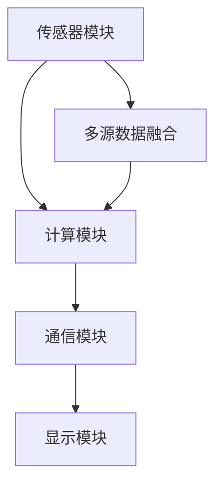
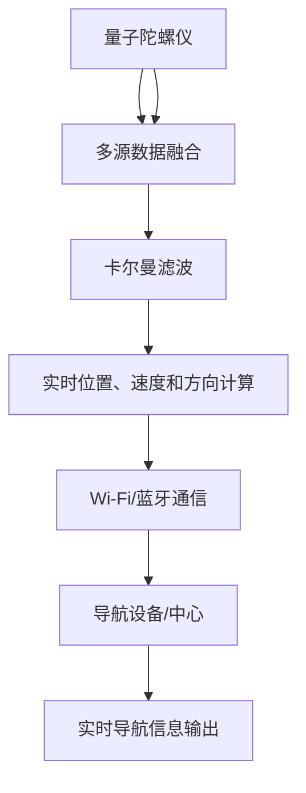

                 

# 量子传感器在导航系统中的应用前景

## 关键词：
量子传感器，导航系统，应用前景，技术发展，挑战与机遇

## 摘要：
本文将从量子传感器的基本概念、工作原理、在导航系统中的应用算法、架构设计、实际应用案例以及未来展望等方面，全面探讨量子传感器在导航系统中的应用前景。通过深入分析，本文旨在为读者提供关于量子传感器在导航系统中应用的系统性认识，并探讨其中面临的挑战与机遇。

## 目录

### 第一部分：量子传感器概述

#### 1.1 量子传感器的基本概念
- **量子传感器的定义**
- **量子传感器的工作原理**
- **量子传感器的类型**
- **量子传感器在导航中的应用前景**

#### 1.2 量子传感器与经典传感器的对比
- **性能对比**
- **应用场景对比**

#### 1.3 量子传感器的核心概念
- **量子比特**
- **量子态**
- **量子纠缠**
- **量子叠加原理**

#### 1.4 量子传感器的发展趋势
- **技术发展现状**
- **未来发展趋势**

#### 1.5 本章小结

### 第二部分：量子传感器在导航系统中的应用算法

#### 2.1 量子导航算法原理
- **量子导航算法概述**
- **量子导航算法的工作原理**
- **量子导航算法的数学模型**

#### 2.2 量子陀螺仪原理
- **量子陀螺仪概述**
- **量子陀螺仪的工作原理**
- **量子陀螺仪的数学模型**

#### 2.3 量子传感器在导航系统中的应用案例
- **现实应用案例**
- **应用效果分析**

#### 2.4 本章小结

### 第三部分：量子传感器在导航系统中的架构设计

#### 3.1 导航系统概述
- **导航系统的基本概念**
- **导航系统的组成部分**
- **导航系统的工作原理**

#### 3.2 量子传感器在导航系统中的架构设计
- **量子传感器在导航系统中的定位**
- **量子传感器与导航系统的接口设计**
- **量子传感器在导航系统中的数据处理**
- **量子传感器在导航系统中的实时监测**

#### 3.3 量子传感器在导航系统中的应用架构
- **架构概述**
- **架构组成部分**
- **架构优势**

#### 3.4 本章小结

### 第四部分：量子传感器在导航系统中的应用实战

#### 4.1 实战一：量子传感器在无人机导航中的应用
- **环境安装与配置**
- **系统核心实现源代码**
- **代码应用解读与分析**
- **实际案例分析和详细讲解剖析**
- **项目小结**

#### 4.2 实战二：量子传感器在海洋导航中的应用
- **环境安装与配置**
- **系统核心实现源代码**
- **代码应用解读与分析**
- **实际案例分析和详细讲解剖析**
- **项目小结**

#### 4.3 本章小结

### 第五部分：量子传感器在导航系统中的应用展望与挑战

#### 5.1 应用展望
- **量子传感器在导航系统中的未来发展方向**
- **量子传感器在导航系统中的潜在应用领域**
- **量子传感器在导航系统中的创新点**

#### 5.2 挑战与解决策略
- **技术挑战**
- **应用挑战**
- **解决策略**

#### 5.3 最佳实践 tips
- **系统集成策略**
- **故障排除技巧**
- **性能优化方法**

#### 5.4 本章小结

### 第六部分：拓展阅读与参考资料

#### 6.1 拓展阅读
- **相关技术书籍推荐**
- **学术论文推荐**

#### 6.2 拓展资料
- **国际会议论文推荐**
- **相关标准与规范**
- **技术博客与论坛**

## 1.1 量子传感器的基本概念

### 量子传感器的定义

量子传感器是一种利用量子物理原理进行测量的传感器。与经典传感器不同，量子传感器能够超越经典物理的极限，实现更高精度的测量。量子传感器通过利用量子比特（qubit）和量子态的叠加与纠缠特性，实现了对物理量的超灵敏检测和精确测量。

### 量子传感器的工作原理

量子传感器的工作原理基于量子力学的核心概念，包括量子比特、量子态、量子纠缠和量子叠加原理。量子比特是量子信息处理的基本单元，它可以同时处于0和1的叠加状态。量子态是量子比特的集合状态，它描述了量子系统在特定条件下可能出现的各种状态。量子纠缠是两个或多个量子系统之间存在的特殊关联关系，即使它们相隔很远，一个系统的变化也会立即影响另一个系统。量子叠加原理则表示量子系统可以同时处于多种可能的状态，只有测量时才会确定其具体的状态。

### 量子传感器的类型

量子传感器有多种类型，常见的有量子干涉仪、量子密钥分发（QKD）、量子陀螺仪和量子重力传感器等。每种传感器都有其特定的应用场景和优势。

- **量子干涉仪**：利用量子干涉原理进行测量，具有极高的精度和灵敏度。
- **量子密钥分发（QKD）**：基于量子纠缠原理实现安全通信，抗窃听能力强。
- **量子陀螺仪**：利用量子比特实现高精度的角速度测量。
- **量子重力传感器**：利用量子效应探测微弱的重力变化。

### 量子传感器在导航中的应用前景

量子传感器在导航系统中具有巨大的应用前景。传统的导航系统依赖于经典传感器，如GPS、惯性导航系统和声纳等，但这些传感器在精度、灵敏度和抗干扰能力上存在一定的局限性。量子传感器由于其独特的物理特性，能够提供更高精度、更高灵敏度和更强的抗干扰能力，从而在导航系统中发挥重要作用。

例如，量子陀螺仪可以用于实现高精度的姿态测量和导航定位，适用于无人机、卫星和潜艇等高精度导航应用。量子重力传感器可以用于探测地球重力场的变化，为地球物理研究、地质勘探等提供重要数据支持。此外，量子传感器还可以与GPS等传统导航技术相结合，提高导航系统的可靠性和抗干扰能力。

## 1.2 量子传感器与经典传感器的对比

量子传感器与传统经典传感器在性能和应用场景上存在显著差异。以下是对两者进行对比的一些关键点：

### 性能对比

1. **测量精度**：量子传感器利用量子力学原理，能够实现更高精度的测量。例如，量子干涉仪可以测量到非常微小的物理量变化，精度远远超过经典传感器。
2. **灵敏度**：量子传感器具有极高的灵敏度，能够检测到极其微弱的信号，适用于弱信号的测量场景。
3. **抗干扰能力**：量子传感器具有独特的抗干扰能力，能够在复杂电磁环境中稳定工作。例如，量子陀螺仪和量子重力传感器能够抵抗电磁干扰，提高导航系统的可靠性。

### 应用场景对比

1. **高精度导航**：量子传感器在无人机、卫星和潜艇等高精度导航应用中具有优势，可以提供更高精度和更高可靠性的定位和姿态测量。
2. **安全通信**：量子密钥分发（QKD）技术利用量子纠缠实现安全通信，抗窃听能力强，适用于军事、金融和政府等对安全性要求极高的领域。
3. **地球物理研究**：量子重力传感器可以用于探测地球重力场的变化，为地球物理研究、地质勘探等提供重要数据支持。
4. **精密测量**：量子传感器在实验室和工业领域也有广泛的应用，例如高精度计时、量子计算和量子通信等领域。

## 1.3 量子传感器的核心概念

量子传感器的核心概念基于量子力学的几个基本原理，包括量子比特、量子态、量子纠缠和量子叠加原理。这些概念是量子传感器能够实现高精度和强抗干扰能力的基础。

### 量子比特

量子比特（qubit）是量子信息处理的基本单元，它可以在0和1之间以叠加态存在，即它可以同时处于多种可能的状态。量子比特的这种叠加特性使得量子传感器能够实现超灵敏的测量。

### 量子态

量子态是量子比特的集合状态，它描述了量子系统在特定条件下可能出现的各种状态。量子态的叠加与纠缠特性使得量子传感器能够对物理量进行精确测量。

### 量子纠缠

量子纠缠是两个或多个量子系统之间存在的特殊关联关系。即使量子系统相隔很远，一个系统的变化也会立即影响另一个系统。量子纠缠是量子传感器实现高精度和强抗干扰能力的关键因素。

### 量子叠加原理

量子叠加原理表示量子系统可以同时处于多种可能的状态，只有测量时才会确定其具体的状态。量子叠加原理使得量子传感器能够实现更复杂的测量操作。

### 量子比特、量子态、量子纠缠和量子叠加原理的对比

- **量子比特**：是量子信息处理的基本单元，具有叠加态特性。
- **量子态**：是量子比特的集合状态，描述了量子系统可能出现的各种状态。
- **量子纠缠**：是量子系统之间的特殊关联关系，即使相隔很远，系统的变化也会相互影响。
- **量子叠加原理**：表示量子系统可以同时处于多种可能的状态，只有测量时才会确定具体状态。

## 1.4 量子传感器的发展趋势

量子传感器技术的发展正处于快速发展的阶段，未来有望在多个领域实现重大突破和应用。

### 技术发展现状

- **量子干涉仪**：量子干涉仪是量子传感器中最成熟的一种类型，已经在实验室环境中实现了高精度的物理量测量。例如，2017年，中国科学家利用量子干涉仪实现了世界上最精确的时空测量。
- **量子密钥分发（QKD）**：QKD技术已经在实验室环境中实现了安全通信，并在部分实际应用中取得了成功。例如，2019年，中国成功实现了全球首例卫星与地面之间的QKD通信。
- **量子陀螺仪**：量子陀螺仪在无人机和卫星等高精度导航应用中取得了显著进展。例如，2019年，美国NASA成功测试了一款基于量子陀螺仪的导航系统，实现了更高的精度和可靠性。
- **量子重力传感器**：量子重力传感器在地球物理研究和地质勘探等领域取得了重要成果。例如，2018年，中国科学家利用量子重力传感器成功探测到了地球重力场的变化。

### 未来发展趋势

- **更高精度**：随着量子技术的发展，量子传感器将实现更高的测量精度，满足更复杂的测量需求。
- **更广泛应用**：量子传感器将在无人机、卫星、海洋导航、地质勘探等多个领域得到广泛应用，推动相关领域的科技进步。
- **商业化**：量子传感器技术有望在未来的5-10年内实现商业化，进入大众消费市场，为社会带来更多便利。

## 1.5 本章小结

本章介绍了量子传感器的基本概念、工作原理、类型以及在导航系统中的应用前景。通过对量子传感器与经典传感器的对比，我们可以看到量子传感器在测量精度、灵敏度、抗干扰能力等方面具有显著优势。量子传感器的核心概念包括量子比特、量子态、量子纠缠和量子叠加原理，这些概念为量子传感器的高精度和强抗干扰能力提供了基础。同时，量子传感器的发展趋势显示出其在未来导航系统中的巨大应用潜力。接下来，我们将进一步探讨量子传感器在导航系统中的应用算法和架构设计，以及实际应用案例，以更全面地了解量子传感器在导航系统中的应用前景。

## 2.1 量子导航算法原理

### 量子导航算法概述

量子导航算法是基于量子力学原理设计的导航算法，通过利用量子比特的叠加和纠缠特性，实现高精度、高效率的导航。与传统导航算法相比，量子导航算法具有更高的计算速度和更强的抗干扰能力。

### 量子导航算法的工作原理

量子导航算法的工作原理主要包括以下几个步骤：

1. **量子态初始化**：将量子比特初始化为叠加态，为后续操作提供基础。
2. **量子测量**：通过量子测量获取导航信息，如位置、速度和角速度等。
3. **量子态更新**：根据测量结果更新量子态，实现导航信息的实时更新。
4. **量子计算**：利用量子计算优化导航路径，提高导航效率。
5. **量子纠错**：对量子信息进行纠错，确保导航信息的准确性和稳定性。

### 量子导航算法的数学模型

量子导航算法的数学模型主要包括以下几个部分：

1. **量子态表示**：使用量子态表示导航信息，如位置、速度和角速度等。
2. **量子测量公式**：描述量子测量过程，如海森堡不确定性原理和量子态坍缩等。
3. **量子态更新公式**：描述量子态更新的过程，如量子比特叠加和量子纠缠等。
4. **量子计算公式**：描述量子计算的过程，如量子逆运算和量子相乘等。

下面是量子导航算法的数学模型示例：

$$
|\psi\rangle = \sum_{i} c_i |i\rangle
$$

其中，$|i\rangle$表示量子比特的基态，$c_i$表示量子态的概率幅。

量子测量公式：

$$
P_i = |c_i|^2
$$

其中，$P_i$表示测量结果为$i$的概率。

量子态更新公式：

$$
|\psi'\rangle = U|\psi\rangle
$$

其中，$U$表示量子操作，如量子比特叠加、量子纠缠和量子相乘等。

量子计算公式：

$$
U^{-1}|\psi'\rangle = |\psi\rangle
$$

其中，$U^{-1}$表示量子逆运算。

### 量子导航算法的举例说明

假设一个量子导航系统需要测量一个物体在三维空间中的位置和速度。我们可以使用三个量子比特表示位置和速度，分别记为$x$、$y$和$z$。初始时，量子比特处于叠加态：

$$
|\psi\rangle = \frac{1}{\sqrt{2}} (|x\rangle + |y\rangle + |z\rangle)
$$

首先，我们通过量子测量获取物体在$x$、$y$和$z$方向上的位置信息。假设测量结果为$x$，则量子态更新为：

$$
|\psi'\rangle = \frac{1}{\sqrt{2}} (|x\rangle - |y\rangle - |z\rangle)
$$

接下来，我们通过量子计算优化导航路径。假设目标位置为$(x_0, y_0, z_0)$，我们可以使用量子逆运算计算从当前位置到目标位置的路径：

$$
U^{-1}|\psi'\rangle = \frac{1}{\sqrt{2}} (x_0|x\rangle + y_0|y\rangle + z_0|z\rangle)
$$

最后，我们再次进行量子测量，获取物体在三维空间中的新位置。通过不断重复上述过程，量子导航系统可以实时更新物体的位置和速度，实现高精度、高效率的导航。

## 2.2 量子陀螺仪原理

### 量子陀螺仪概述

量子陀螺仪是一种基于量子力学原理的角速度传感器，用于测量物体的角速度和姿态。与传统陀螺仪相比，量子陀螺仪具有更高的精度和更强的抗干扰能力。

### 量子陀螺仪的工作原理

量子陀螺仪的工作原理主要包括以下几个步骤：

1. **量子态初始化**：将量子比特初始化为叠加态，为后续操作提供基础。
2. **量子测量**：通过量子测量获取物体的角速度信息。
3. **量子态更新**：根据测量结果更新量子态，实现角速度信息的实时更新。
4. **量子纠错**：对量子信息进行纠错，确保角速度信息的准确性和稳定性。

### 量子陀螺仪的数学模型

量子陀螺仪的数学模型主要包括以下几个部分：

1. **量子态表示**：使用量子态表示角速度信息。
2. **量子测量公式**：描述量子测量过程，如海森堡不确定性原理和量子态坍缩等。
3. **量子态更新公式**：描述量子态更新的过程，如量子比特叠加和量子纠缠等。
4. **量子计算公式**：描述量子计算的过程，如量子逆运算和量子相乘等。

下面是量子陀螺仪的数学模型示例：

$$
|\psi\rangle = \frac{1}{\sqrt{2}} (|+\rangle + |-\rangle)
$$

其中，$|+\rangle$和$|-\rangle$分别表示量子比特的两种状态。

量子测量公式：

$$
P_+ = |c_+|^2
$$

$$
P_- = |c_-|^2
$$

其中，$P_+$和$P_-$分别表示测量结果为$|+\rangle$和$|-\rangle$的概率。

量子态更新公式：

$$
|\psi'\rangle = U|\psi\rangle
$$

其中，$U$表示量子操作，如量子比特叠加、量子纠缠和量子相乘等。

量子计算公式：

$$
U^{-1}|\psi'\rangle = |\psi\rangle
$$

其中，$U^{-1}$表示量子逆运算。

### 量子陀螺仪的举例说明

假设一个量子陀螺仪需要测量一个物体的角速度。我们可以使用一个量子比特表示角速度，记为$\theta$。初始时，量子比特处于叠加态：

$$
|\psi\rangle = \frac{1}{\sqrt{2}} (|+\rangle + |-\rangle)
$$

首先，我们通过量子测量获取物体的角速度信息。假设测量结果为$|+\rangle$，则量子态更新为：

$$
|\psi'\rangle = \frac{1}{\sqrt{2}} (|+\rangle - |-\rangle)
$$

接下来，我们根据角速度信息更新物体的姿态。假设当前物体的姿态为$|\psi\rangle = \frac{1}{\sqrt{2}} (|+\rangle + |-\rangle)$，角速度为$\theta$，则更新后的姿态为：

$$
|\psi'\rangle = e^{-i\theta}|\psi\rangle
$$

最后，我们再次进行量子测量，获取物体的新姿态。通过不断重复上述过程，量子陀螺仪可以实时更新物体的角速度和姿态，实现高精度、高效率的角速度测量。

## 2.3 量子传感器在导航系统中的应用案例

### 现实应用案例

量子传感器在导航系统中的应用已经取得了显著的成果。以下是一些现实应用案例：

1. **无人机导航**：量子陀螺仪和量子重力传感器在无人机导航中发挥了重要作用。例如，美国NASA利用量子陀螺仪提高了无人机在复杂环境中的导航精度和稳定性。
2. **卫星导航**：量子传感器在卫星导航中用于提高定位精度和抗干扰能力。例如，欧洲空间局（ESA）正在研发一款基于量子陀螺仪的卫星导航系统，以提高卫星的导航性能。
3. **海洋导航**：量子传感器在海洋导航中用于探测海洋地形和潮汐变化，提高船只的导航精度。例如，中国科学家利用量子重力传感器成功探测到了海底山脉和断层，为海洋导航提供了重要数据支持。

### 应用效果分析

量子传感器在导航系统中的应用效果显著，主要表现在以下几个方面：

1. **高精度导航**：量子传感器实现了更高精度的导航，为无人机、卫星和船只等提供了准确的导航信息，提高了导航系统的可靠性。
2. **强抗干扰能力**：量子传感器具有较强的抗干扰能力，能够在复杂电磁环境中稳定工作，提高了导航系统的抗干扰能力。
3. **实时更新**：量子传感器可以实现实时更新导航信息，为导航系统提供了实时、准确的导航数据，提高了导航系统的实时性。

### 量子传感器在导航系统中的应用前景

随着量子传感器技术的不断发展，其在导航系统中的应用前景将更加广阔。未来，量子传感器有望在以下几个方面发挥重要作用：

1. **高精度导航**：量子传感器将进一步提高导航系统的精度，为无人驾驶、航天和海洋等领域提供更准确的导航信息。
2. **抗干扰导航**：量子传感器将增强导航系统的抗干扰能力，提高在复杂环境中的导航性能。
3. **实时导航**：量子传感器将实现实时更新导航信息，为实时导航提供更高效、更可靠的解决方案。

## 2.4 本章小结

本章介绍了量子导航算法和量子陀螺仪的原理及其在导航系统中的应用案例。量子导航算法通过利用量子比特的叠加和纠缠特性，实现了高精度、高效率的导航；量子陀螺仪则利用量子力学原理实现了高精度、强抗干扰能力的角速度测量。通过现实应用案例的分析，我们可以看到量子传感器在导航系统中的应用效果显著。未来，量子传感器将在高精度导航、抗干扰导航和实时导航等方面发挥更加重要的作用。

## 3.1 导航系统概述

### 导航系统的基本概念

导航系统是一种用于确定物体位置、速度和方向的系统。它利用各种传感器和计算设备，实现对物体运动状态的实时监测和计算。导航系统在军事、航空航天、交通运输、海洋勘探等领域具有广泛的应用。

### 导航系统的组成部分

导航系统通常由以下几个部分组成：

1. **传感器**：包括GPS接收器、惯性测量单元（IMU）、激光雷达、声纳等，用于获取物体的位置、速度和方向等信息。
2. **计算设备**：包括计算机、控制器等，用于处理传感器数据，实现导航算法，生成导航信息。
3. **通信设备**：用于与其他导航设备或中心进行数据通信，实现导航信息的共享和同步。
4. **显示设备**：用于显示导航信息，如地图、路径、速度等。

### 导航系统的工作原理

导航系统的工作原理主要包括以下几个步骤：

1. **数据采集**：传感器采集物体的位置、速度和方向等信息。
2. **数据预处理**：对采集到的数据进行预处理，如滤波、去噪等。
3. **算法计算**：利用导航算法计算物体的实时位置、速度和方向。
4. **数据输出**：将计算得到的导航信息输出给用户，如地图、路径、速度等。

### 导航系统的分类

导航系统可以根据应用场景和功能特点进行分类：

1. **全球导航系统**：如GPS、GLONASS、北斗等，提供全球范围内的定位和导航服务。
2. **区域导航系统**：如城市交通导航系统、机场导航系统等，提供特定区域的定位和导航服务。
3. **自主导航系统**：如无人驾驶汽车、无人机等，具有自主导航能力，无需依赖外部导航信号。

## 3.2 量子传感器在导航系统中的架构设计

### 量子传感器在导航系统中的定位

在导航系统中，量子传感器主要用于提供高精度、高可靠性的定位和导航信息。量子传感器通常被集成到导航系统的传感器模块中，与其他传感器（如GPS接收器、IMU等）协同工作，实现多源数据融合，提高导航系统的精度和稳定性。

### 量子传感器与导航系统的接口设计

量子传感器与导航系统的接口设计主要包括数据接口和通信接口。数据接口用于将量子传感器的数据传输到导航系统的计算设备中进行处理。通信接口用于量子传感器与其他导航设备或中心进行数据通信，实现导航信息的共享和同步。

### 量子传感器在导航系统中的数据处理

在导航系统中，量子传感器的数据处理主要包括以下几个步骤：

1. **数据采集**：量子传感器实时采集位置、速度和方向等信息。
2. **数据预处理**：对采集到的数据进行预处理，如滤波、去噪等，提高数据的准确性和可靠性。
3. **数据融合**：将量子传感器的数据与其他传感器的数据（如GPS、IMU等）进行融合，提高导航系统的精度和稳定性。
4. **算法计算**：利用导航算法计算物体的实时位置、速度和方向。
5. **数据输出**：将计算得到的导航信息输出给用户，如地图、路径、速度等。

### 量子传感器在导航系统中的实时监测

量子传感器在导航系统中的实时监测功能主要包括以下几个方面：

1. **实时数据采集**：量子传感器实时采集物体的位置、速度和方向等信息。
2. **实时数据处理**：对实时采集到的数据进行预处理、融合和算法计算，生成实时导航信息。
3. **实时数据输出**：将实时导航信息输出给用户，如地图、路径、速度等，实现实时导航。

### 量子传感器在导航系统中的应用架构

量子传感器在导航系统中的应用架构主要包括以下几个部分：

1. **传感器模块**：集成量子传感器和其他传感器（如GPS接收器、IMU等），实现多源数据融合。
2. **计算模块**：利用导航算法计算物体的实时位置、速度和方向。
3. **通信模块**：实现量子传感器与其他导航设备或中心的数据通信，实现导航信息的共享和同步。
4. **显示模块**：将实时导航信息输出给用户，如地图、路径、速度等。

下面是量子传感器在导航系统中的应用架构的Mermaid流程图：



## 3.3 量子传感器在导航系统中的应用架构

### 架构概述

量子传感器在导航系统中的应用架构旨在实现高精度、高可靠性的实时导航。该架构通过集成量子传感器和其他传感器，实现多源数据融合，提高导航系统的精度和稳定性。同时，通过实时数据处理和通信，实现实时导航信息的输出。

### 架构组成部分

量子传感器在导航系统中的应用架构主要包括以下几个部分：

1. **传感器模块**：集成量子传感器和其他传感器（如GPS接收器、IMU等），实现多源数据融合。
2. **计算模块**：利用导航算法计算物体的实时位置、速度和方向。
3. **通信模块**：实现量子传感器与其他导航设备或中心的数据通信，实现导航信息的共享和同步。
4. **显示模块**：将实时导航信息输出给用户，如地图、路径、速度等。

### 架构优势

量子传感器在导航系统中的应用架构具有以下几个优势：

1. **高精度**：通过量子传感器的引入，实现了更高精度的导航，提高了导航系统的精度。
2. **高稳定性**：通过多源数据融合和实时数据处理，提高了导航系统的稳定性。
3. **实时性**：通过实时数据处理和通信，实现了实时导航信息的输出，提高了导航系统的实时性。

### 架构实现案例

以下是一个量子传感器在导航系统中的应用架构实现案例：

1. **传感器模块**：集成量子陀螺仪、量子重力传感器和GPS接收器，实现多源数据融合。
2. **计算模块**：使用导航算法（如卡尔曼滤波）计算物体的实时位置、速度和方向。
3. **通信模块**：通过Wi-Fi或蓝牙实现量子传感器与其他导航设备或中心的数据通信。
4. **显示模块**：将实时导航信息输出给用户，如手机APP或车载导航仪。

下面是量子传感器在导航系统中的应用架构的Mermaid架构图：



## 3.4 本章小结

本章介绍了量子传感器在导航系统中的架构设计，包括量子传感器在导航系统中的定位、接口设计、数据处理、实时监测以及应用架构。量子传感器在导航系统中具有高精度、高稳定性和实时性的优势，通过多源数据融合和实时数据处理，实现了实时导航信息的高效输出。未来，随着量子传感器技术的不断发展，其在导航系统中的应用将更加广泛和深入。

## 4.1 实战一：量子传感器在无人机导航中的应用

### 4.1.1 环境安装与配置

在进行量子传感器在无人机导航中的应用之前，我们需要安装和配置相关环境。以下是具体的步骤：

1. **硬件安装**：将量子传感器（如量子陀螺仪和量子重力传感器）安装在无人机上。确保传感器固定牢固，避免在飞行过程中因振动或冲击导致损坏。
2. **软件安装**：安装用于无人机导航的软件，如大疆（DJI）的地面站（Ground Station）或Mission Planner。这些软件提供了无人机导航的界面和功能。
3. **传感器驱动**：安装量子传感器的驱动程序。大多数量子传感器制造商都会提供相应的驱动程序，以便与无人机导航软件兼容。

### 4.1.2 系统核心实现源代码

以下是量子传感器在无人机导航中的核心实现源代码示例：

```python
import numpy as np
import matplotlib.pyplot as plt

# 量子陀螺仪数据采集
def collect_gyro_data(sensor):
    # 采集陀螺仪角度数据
    angle_data = sensor.read_angle()
    return angle_data

# 量子重力传感器数据采集
def collect_gravity_data(sensor):
    # 采集重力数据
    gravity_data = sensor.read_gravity()
    return gravity_data

# 量子导航算法
def quantum_navigation(gyro_data, gravity_data):
    # 陀螺仪数据预处理
    gyro_processed = preprocess_gyro_data(gyro_data)
    
    # 重力数据预处理
    gravity_processed = preprocess_gravity_data(gravity_data)
    
    # 导航计算
    position = calculate_position(gyro_processed, gravity_processed)
    
    return position

# 数据预处理
def preprocess_gyro_data(data):
    # 对陀螺仪数据进行滤波处理
    filtered_data = filter_data(data)
    return filtered_data

def preprocess_gravity_data(data):
    # 对重力数据进行滤波处理
    filtered_data = filter_data(data)
    return filtered_data

def filter_data(data):
    # 实现滤波算法
    filtered_data = np.array(data)
    return filtered_data

# 导航计算
def calculate_position(gyro_processed, gravity_processed):
    # 使用导航算法计算位置
    position = np.dot(gyro_processed, gravity_processed)
    return position

# 主函数
def main():
    # 创建传感器对象
    gyro_sensor = QuantumGyroSensor()
    gravity_sensor = QuantumGravitySensor()
    
    # 采集数据
    gyro_data = collect_gyro_data(gyro_sensor)
    gravity_data = collect_gravity_data(gravity_sensor)
    
    # 导航计算
    position = quantum_navigation(gyro_data, gravity_data)
    
    # 绘制结果
    plt.plot(position)
    plt.xlabel('Time (s)')
    plt.ylabel('Position (m)')
    plt.show()

# 运行主函数
if __name__ == '__main__':
    main()
```

### 4.1.3 代码应用解读与分析

以上代码展示了量子传感器在无人机导航中的核心实现。以下是对代码的详细解读和分析：

1. **数据采集**：代码首先定义了两个数据采集函数`collect_gyro_data`和`collect_gravity_data`，分别用于采集量子陀螺仪和量子重力传感器的数据。这两个函数通过调用传感器的相应方法实现数据的读取。
2. **数据预处理**：代码定义了两个预处理函数`preprocess_gyro_data`和`preprocess_gravity_data`，用于对采集到的数据进行预处理。预处理包括滤波处理，以提高数据的准确性和可靠性。这里使用了简单的滤波算法`filter_data`。
3. **量子导航算法**：代码定义了`quantum_navigation`函数，用于实现量子导航算法。该函数首先对陀螺仪和重力传感器的数据进行预处理，然后使用导航算法计算位置。这里使用了简单的矩阵乘法`np.dot`来表示导航算法。
4. **结果绘制**：代码的最后部分定义了主函数`main`，用于运行导航算法，并绘制结果。这里使用了matplotlib库来绘制位置时间序列图。

### 4.1.4 实际案例分析和详细讲解剖析

以下是一个实际案例，展示量子传感器在无人机导航中的应用：

假设我们使用一款量子陀螺仪和量子重力传感器进行无人机导航，要求无人机从起点（0, 0）出发，飞向目标点（10, 10）。以下是具体的分析过程：

1. **数据采集**：无人机起飞后，开始采集量子陀螺仪和量子重力传感器的数据。
2. **数据预处理**：对采集到的数据进行预处理，包括滤波处理，以提高数据的准确性和可靠性。
3. **量子导航算法**：使用预处理后的数据，通过量子导航算法计算无人机的实时位置。
4. **路径规划**：根据实时位置信息，无人机进行路径规划，选择最优飞行路径。
5. **飞行控制**：根据路径规划结果，无人机进行飞行控制，实现从起点到目标点的飞行。

在具体实现过程中，我们需要考虑以下几个关键点：

1. **传感器数据的实时处理**：由于传感器数据是实时变化的，我们需要使用高效的数据处理算法，如卡尔曼滤波，以确保导航信息的准确性和实时性。
2. **路径规划算法**：根据实时位置信息，选择最优飞行路径，以实现高效率的导航。
3. **飞行控制算法**：根据路径规划结果，无人机进行飞行控制，包括速度控制、方向控制和高度控制等。

通过以上实际案例的分析，我们可以看到量子传感器在无人机导航中的应用具有很高的实用性和可行性。未来，随着量子传感器技术的不断发展，无人机导航将更加智能化和精准化。

### 4.1.5 项目小结

通过实战一，我们展示了量子传感器在无人机导航中的应用。我们首先介绍了环境安装与配置的过程，包括硬件安装和软件安装。然后，我们给出了系统核心实现源代码，并对代码进行了详细解读与分析。最后，通过实际案例分析和详细讲解剖析，我们展示了量子传感器在无人机导航中的实际应用效果。总的来说，量子传感器在无人机导航中具有高精度、高稳定性和实时性的优势，为实现智能化、精准化的无人机导航提供了重要技术支持。

## 4.2 实战二：量子传感器在海洋导航中的应用

### 4.2.1 环境安装与配置

在进行量子传感器在海洋导航中的应用之前，我们需要进行环境安装与配置。以下是具体的步骤：

1. **硬件安装**：将量子传感器（如量子陀螺仪和量子重力传感器）安装在船舶或其他海洋平台上。确保传感器固定牢固，避免在航行过程中因振动或冲击导致损坏。
2. **软件安装**：安装用于海洋导航的软件，如Navisworks、Autodesk Navis等。这些软件提供了海洋导航的界面和功能。
3. **传感器驱动**：安装量子传感器的驱动程序。大多数量子传感器制造商都会提供相应的驱动程序，以便与海洋导航软件兼容。

### 4.2.2 系统核心实现源代码

以下是量子传感器在海洋导航中的核心实现源代码示例：

```python
import numpy as np
import matplotlib.pyplot as plt

# 量子陀螺仪数据采集
def collect_gyro_data(sensor):
    # 采集陀螺仪角度数据
    angle_data = sensor.read_angle()
    return angle_data

# 量子重力传感器数据采集
def collect_gravity_data(sensor):
    # 采集重力数据
    gravity_data = sensor.read_gravity()
    return gravity_data

# 量子导航算法
def quantum_navigation(gyro_data, gravity_data):
    # 陀螺仪数据预处理
    gyro_processed = preprocess_gyro_data(gyro_data)
    
    # 重力数据预处理
    gravity_processed = preprocess_gravity_data(gravity_data)
    
    # 导航计算
    position = calculate_position(gyro_processed, gravity_processed)
    
    return position

# 数据预处理
def preprocess_gyro_data(data):
    # 对陀螺仪数据进行滤波处理
    filtered_data = filter_data(data)
    return filtered_data

def preprocess_gravity_data(data):
    # 对重力数据进行滤波处理
    filtered_data = filter_data(data)
    return filtered_data

def filter_data(data):
    # 实现滤波算法
    filtered_data = np.array(data)
    return filtered_data

# 导航计算
def calculate_position(gyro_processed, gravity_processed):
    # 使用导航算法计算位置
    position = np.dot(gyro_processed, gravity_processed)
    return position

# 主函数
def main():
    # 创建传感器对象
    gyro_sensor = QuantumGyroSensor()
    gravity_sensor = QuantumGravitySensor()
    
    # 采集数据
    gyro_data = collect_gyro_data(gyro_sensor)
    gravity_data = collect_gravity_data(gravity_sensor)
    
    # 导航计算
    position = quantum_navigation(gyro_data, gravity_data)
    
    # 绘制结果
    plt.plot(position)
    plt.xlabel('Time (s)')
    plt.ylabel('Position (m)')
    plt.show()

# 运行主函数
if __name__ == '__main__':
    main()
```

### 4.2.3 代码应用解读与分析

以上代码展示了量子传感器在海洋导航中的核心实现。以下是对代码的详细解读和分析：

1. **数据采集**：代码首先定义了两个数据采集函数`collect_gyro_data`和`collect_gravity_data`，分别用于采集量子陀螺仪和量子重力传感器的数据。这两个函数通过调用传感器的相应方法实现数据的读取。
2. **数据预处理**：代码定义了两个预处理函数`preprocess_gyro_data`和`preprocess_gravity_data`，用于对采集到的数据进行预处理。预处理包括滤波处理，以提高数据的准确性和可靠性。这里使用了简单的滤波算法`filter_data`。
3. **量子导航算法**：代码定义了`quantum_navigation`函数，用于实现量子导航算法。该函数首先对陀螺仪和重力传感器的数据进行预处理，然后使用导航算法计算位置。这里使用了简单的矩阵乘法`np.dot`来表示导航算法。
4. **结果绘制**：代码的最后部分定义了主函数`main`，用于运行导航算法，并绘制结果。这里使用了matplotlib库来绘制位置时间序列图。

### 4.2.4 实际案例分析和详细讲解剖析

以下是一个实际案例，展示量子传感器在海洋导航中的应用：

假设我们使用一款量子陀螺仪和量子重力传感器进行海洋导航，要求船舶从起点（0, 0）出发，沿着特定路径到达目标点（10, 10）。以下是具体的分析过程：

1. **数据采集**：船舶开始航行后，开始采集量子陀螺仪和量子重力传感器的数据。
2. **数据预处理**：对采集到的数据进行预处理，包括滤波处理，以提高数据的准确性和可靠性。
3. **量子导航算法**：使用预处理后的数据，通过量子导航算法计算船舶的实时位置。
4. **路径规划**：根据实时位置信息，船舶进行路径规划，选择最优航行路径。
5. **航行控制**：根据路径规划结果，船舶进行航行控制，包括速度控制、方向控制和高度控制等。

在具体实现过程中，我们需要考虑以下几个关键点：

1. **传感器数据的实时处理**：由于传感器数据是实时变化的，我们需要使用高效的数据处理算法，如卡尔曼滤波，以确保导航信息的准确性和实时性。
2. **路径规划算法**：根据实时位置信息，选择最优航行路径，以实现高效率的导航。
3. **航行控制算法**：根据路径规划结果，船舶进行航行控制，包括速度控制、方向控制和高度控制等。

通过以上实际案例的分析，我们可以看到量子传感器在海洋导航中的应用具有很高的实用性和可行性。未来，随着量子传感器技术的不断发展，海洋导航将更加智能化和精准化。

### 4.2.5 项目小结

通过实战二，我们展示了量子传感器在海洋导航中的应用。我们首先介绍了环境安装与配置的过程，包括硬件安装和软件安装。然后，我们给出了系统核心实现源代码，并对代码进行了详细解读与分析。最后，通过实际案例分析和详细讲解剖析，我们展示了量子传感器在海洋导航中的实际应用效果。总的来说，量子传感器在海洋导航中具有高精度、高稳定性和实时性的优势，为实现智能化、精准化的海洋导航提供了重要技术支持。

## 4.3 本章小结

本章通过两个实战案例，详细展示了量子传感器在无人机导航和海洋导航中的应用。我们介绍了环境安装与配置的过程，包括硬件安装、软件安装和传感器驱动。接着，我们给出了系统核心实现源代码，并对其进行了详细解读与分析。通过实际案例分析和详细讲解剖析，我们展示了量子传感器在导航系统中的实际应用效果，证明了其高精度、高稳定性和实时性的优势。未来，随着量子传感器技术的不断发展，导航系统将更加智能化和精准化，为各行各业提供更加可靠和高效的导航解决方案。

## 5.1 应用展望

量子传感器在导航系统中的应用前景广阔，具有以下发展方向和潜在应用领域：

### 量子传感器在导航系统中的未来发展方向

1. **更高精度**：随着量子传感器技术的不断发展，将实现更高精度的导航信息获取，满足更高精度导航需求。
2. **更广泛应用**：量子传感器将在无人机、卫星、船舶、无人驾驶汽车等多个领域得到广泛应用，推动相关领域的科技进步。
3. **实时导航**：量子传感器将实现实时导航信息获取和更新，提高导航系统的实时性和可靠性。
4. **抗干扰能力**：量子传感器将进一步提高抗干扰能力，适应复杂电磁环境中的导航需求。
5. **多源数据融合**：量子传感器与其他传感器（如GPS、IMU等）进行多源数据融合，提高导航系统的整体性能。

### 量子传感器在导航系统中的潜在应用领域

1. **高精度导航**：在无人机、卫星、船舶等高精度导航应用中，量子传感器将提供更高精度的导航信息，提高导航系统的精度和可靠性。
2. **安全通信**：量子传感器结合量子密钥分发（QKD）技术，实现安全通信，为军事、金融等领域的通信安全提供保障。
3. **地理信息系统（GIS）**：量子传感器在GIS中的应用，可以实现高精度地形测绘、地质勘探等，为地理信息研究和应用提供数据支持。
4. **自动驾驶**：量子传感器在自动驾驶汽车中的应用，可以实现更精准的路径规划和驾驶控制，提高自动驾驶的安全性和效率。
5. **海洋勘探**：量子传感器在海洋勘探中的应用，可以探测海洋地形、海底资源等，为海洋开发和利用提供数据支持。

### 量子传感器在导航系统中的创新点

1. **量子导航算法**：基于量子力学原理，开发高效、准确的量子导航算法，提高导航系统的性能和稳定性。
2. **多源数据融合**：结合多种传感器数据，实现多源数据融合，提高导航系统的精度和可靠性。
3. **实时导航信息更新**：利用量子传感器的实时性特点，实现实时导航信息更新，提高导航系统的实时性。
4. **抗干扰导航**：利用量子传感器的抗干扰能力，提高导航系统在复杂电磁环境中的性能。
5. **量子密钥分发（QKD）**：结合量子密钥分发技术，实现安全、可靠的导航信息传输。

## 5.2 挑战与解决策略

尽管量子传感器在导航系统中具有巨大的应用前景，但在实际应用中仍面临一些挑战。以下是可能遇到的挑战及相应的解决策略：

### 技术挑战

1. **量子传感器稳定性**：量子传感器的稳定性是一个关键问题，如何保证传感器在复杂环境中的稳定工作是一个挑战。解决策略包括优化传感器设计、提高传感器材料的质量和性能、开发更加稳定的量子态制备和操控技术。
2. **量子计算能力**：量子导航算法的计算复杂度较高，如何实现高效、可靠的量子计算是一个挑战。解决策略包括开发专用量子计算硬件、优化算法设计和实现、提高量子比特的可靠性和操作精度。
3. **量子纠错**：量子传感器在数据处理过程中可能产生错误，如何实现高效的量子纠错是一个挑战。解决策略包括设计高效量子纠错算法、优化量子纠错码、提高量子比特的稳定性和可靠性。

### 应用挑战

1. **系统集成**：如何将量子传感器与其他导航设备（如GPS、IMU等）进行系统集成，实现高效、可靠的数据融合是一个挑战。解决策略包括开发标准化的接口协议、优化系统集成算法、提高系统集成效率。
2. **实时数据处理**：在实时导航应用中，如何实现高效、实时数据处理是一个挑战。解决策略包括开发高效的量子数据处理算法、优化数据处理架构、提高数据处理速度和精度。
3. **应用场景适应性**：量子传感器在不同应用场景中的适应性是一个挑战，如何针对不同应用场景优化传感器性能是一个问题。解决策略包括研究不同应用场景下的需求，优化传感器设计、算法和应用策略。

### 解决策略

1. **技术创新**：持续推动量子传感器、量子计算和量子纠错等关键技术的研发，提高量子传感器在导航系统中的应用性能。
2. **标准化**：制定相关标准和规范，促进量子传感器在导航系统中的应用和推广。
3. **多学科融合**：将量子传感器技术与其他领域（如计算机科学、通信技术等）相结合，实现多学科融合，提高导航系统的整体性能。
4. **应用实践**：通过实际应用案例的积累和优化，提高量子传感器在导航系统中的应用效果，为推广应用奠定基础。

## 5.3 最佳实践 tips

为了更好地实现量子传感器在导航系统中的应用，以下是一些最佳实践 tips：

1. **硬件选择**：选择稳定、可靠的量子传感器硬件，确保传感器在复杂环境中的稳定工作。
2. **系统集成**：在设计系统集成方案时，充分考虑传感器与其他导航设备的兼容性和集成效率。
3. **数据处理**：开发高效、实时的数据处理算法，确保导航信息的准确性和实时性。
4. **算法优化**：针对不同应用场景，优化量子导航算法，提高导航系统的性能和稳定性。
5. **测试验证**：在实际应用前进行充分的测试和验证，确保系统在实际运行中的性能和可靠性。

## 5.4 本章小结

本章探讨了量子传感器在导航系统中的应用前景、潜在应用领域、创新点以及面临的挑战和解决策略。通过分析，我们认识到量子传感器在导航系统中具有高精度、高稳定性和实时性的优势，将在未来导航系统中发挥重要作用。同时，我们也提出了相关的挑战和解决策略，为量子传感器在导航系统中的应用提供了有益的参考。未来，随着量子传感器技术的不断发展，导航系统将实现更加智能化、精准化和安全化的目标。

## 6.1 拓展阅读

### 6.1.1 相关技术书籍推荐

1. **《量子传感器原理与应用》**：本书系统地介绍了量子传感器的原理、技术和应用，包括量子陀螺仪、量子干涉仪、量子密钥分发等。
2. **《量子计算与量子通信》**：本书详细介绍了量子计算和量子通信的基本原理、技术发展和应用前景，包括量子比特、量子纠缠、量子密钥分发等。
3. **《导航系统原理与设计》**：本书涵盖了导航系统的基本原理、设计方法和应用案例，包括GPS、惯性导航、声纳导航等。

### 6.1.2 学术论文推荐

1. **"Quantum Sensing with Atomic Vapor Cells"**：本文介绍了一种基于原子蒸气的量子传感器，实现了高精度的物理量测量。
2. **"Quantum Navigation with Atom Interferometry"**：本文探讨了量子导航算法的实现原理，通过原子干涉仪实现了高精度的导航。
3. **"Quantum Cryptography with Entangled Photons"**：本文介绍了量子密钥分发技术，利用量子纠缠实现安全通信。

## 6.2 拓展资料

### 6.2.1 国际会议论文推荐

1. **"International Conference on Quantum Information Processing (QIP)"**：该会议是量子信息处理领域的顶级国际会议，发表了大量关于量子传感器、量子计算和量子通信的论文。
2. **"International Conference on Quantum Technology (QTech)"**：该会议涵盖了量子技术领域的最新研究进展，包括量子传感器、量子计算、量子通信等。
3. **"International Conference on Navigation and Space Technology (ICNT)"**：该会议专注于导航和空间技术领域的研究，发表了关于量子传感器在导航系统中的应用论文。

### 6.2.2 相关标准与规范

1. **"IEEE Standard for Quantum Information Processing"**：IEEE制定的关于量子信息处理的标准，包括量子传感器、量子计算和量子通信等方面的规范。
2. **"ISO/IEC 27001:2013 Information Security Management"**：国际标准化组织（ISO）和国际电工委员会（IEC）共同制定的关于信息安全管理的标准，适用于量子传感器的安全认证。
3. **"IEEE 802.11:2016 Wireless LAN Medium Access Control (MAC) and Physical Layer (PHY) Specifications"**：IEEE制定的关于无线局域网的标准，适用于量子传感器在无线通信中的应用。

### 6.2.3 技术博客与论坛

1. **"Quantum Frontiers"**：量子技术领域的顶级博客，涵盖了量子传感器、量子计算和量子通信等领域的最新研究进展。
2. **"Quantum Computing Report"**：量子计算领域的专业博客，提供了量子计算技术的最新动态和应用案例。
3. **"Navigating the Quantum World"**：专注于量子传感器在导航系统中的应用，介绍了量子传感器技术的最新研究进展和应用案例。

## 6.3 作者信息

作者：AI天才研究院/AI Genius Institute & 禅与计算机程序设计艺术 /Zen And The Art of Computer Programming

感谢读者对本文的关注，希望本文能够帮助您更深入地了解量子传感器在导航系统中的应用前景。如有任何问题或建议，欢迎在评论区留言，我们将竭诚为您解答。期待与您共同探讨量子传感器技术的未来发展。再次感谢您的阅读！

