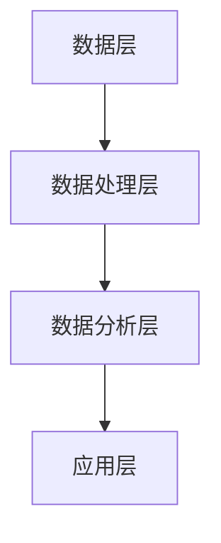

                 

### 量子传感器在工业4.0中的应用前景

#### 关键词：
量子传感器、工业4.0、智能制造、自动化控制、大数据分析

#### 摘要：
本文将探讨量子传感器在工业4.0中的应用前景，首先介绍量子传感器的基本原理和特性，随后分析量子传感器与工业4.0的潜在结合点，并结合国内外量子传感器的发展现状，探讨其应用领域和未来发展趋势。文章结构清晰，逻辑严谨，旨在为读者提供一份关于量子传感器在工业4.0中的深度思考和实用指南。

## 第1章 引言

### 1.1 问题背景

#### 1.1.1 量子传感器概述
量子传感器是一种基于量子力学原理的新型传感器，其基本单元——量子比特，能够在特定环境下实现超高的精度和灵敏度。量子传感器的这一特性，使其在多个领域都有广泛的应用前景。

#### 1.1.2 工业革命4.0的演进
工业革命4.0，又称为第四次工业革命，主要特点是智能化、网络化、自动化和数字化。这一阶段，工业生产将更加依赖于人工智能、大数据、物联网等先进技术。

#### 1.1.3 量子传感器与工业4.0的结合点
量子传感器的高精度和灵敏度，可以应用于工业4.0的自动化控制、工业大数据分析和智能制造等领域，从而提升生产效率，降低生产成本。

### 1.2 量子传感器的基本原理

#### 1.2.1 量子态与量子传感器
量子传感器的工作原理基于量子态。量子态是一种叠加态，能够同时处于多种可能的量子状态，这使得量子传感器具备极高的精度和灵敏度。

#### 1.2.2 量子传感器的特性
量子传感器的特性包括量子纠缠、量子叠加和量子相干等。这些特性使得量子传感器在测量精度和灵敏度上远超传统传感器。

#### 1.2.3 量子传感器的工作原理
量子传感器的工作原理基于量子比特的测量。当量子比特处于叠加态时，通过特定的测量过程，可以获取到量子比特的量子态信息，从而实现高精度的测量。

### 1.3 量子传感器在工业4.0中的应用

#### 1.3.1 量子传感器在自动化控制系统中的应用
量子传感器可以应用于自动化控制系统中的各类传感器，实现更高的测量精度和灵敏度，从而提升自动化控制系统的性能。

#### 1.3.2 量子传感器在工业大数据分析中的应用
量子传感器可以用于工业大数据分析中的数据采集和处理，提升数据分析的精度和效率。

#### 1.3.3 量子传感器在智能制造中的应用前景
量子传感器在智能制造领域有着广泛的应用前景，包括零部件检测、生产过程监控和产品质量检测等。

### 1.4 国内外量子传感器发展现状

#### 1.4.1 国内量子传感器发展状况
我国在量子传感器领域的研究取得了一定的进展，但仍存在技术瓶颈和产业化难题。

#### 1.4.2 国外量子传感器发展状况
国外量子传感器的研究和应用已经相对成熟，尤其在欧美等国家，量子传感器在工业领域的应用已经取得了一系列成果。

#### 1.4.3 对比分析与我国发展建议
通过对比国内外量子传感器的发展状况，本文提出了一些针对我国量子传感器发展的建议。

### 1.5 本章小结
本章介绍了量子传感器的基本原理和在工业4.0中的应用前景，为后续章节的深入讨论奠定了基础。在下一章中，我们将进一步探讨量子传感器与工业4.0的结合点，以及国内外量子传感器的发展现状。

## 第2章 核心概念与联系

### 2.1 量子传感器的基本概念

#### 2.1.1 量子态的概念
量子态是量子系统的内部状态，可以用波函数来描述。量子态具有叠加性和纠缠性等特性。

#### 2.1.2 量子比特的概念
量子比特（qubit）是量子计算机的基本单元，它可以同时处于0和1的状态，这种特性称为叠加态。

#### 2.1.3 量子纠缠的概念
量子纠缠是量子系统之间的一种特殊关联，当两个量子系统纠缠在一起时，它们的状态会相互依赖。

### 2.2 量子传感器与经典传感器的对比

#### 2.2.1 对比表格

| 对比项目 | 经典传感器 | 量子传感器 |
| --- | --- | --- |
| 精度 | 较低 | 非常高 |
| 灵敏度 | 较低 | 非常高 |
| 测量范围 | 较广 | 较窄 |
| 成本 | 较低 | 较高 |
| 工作原理 | 基于经典物理学 | 基于量子力学 |

#### 2.2.2 特性对比
量子传感器的叠加态和纠缠态特性，使得它在测量精度和灵敏度上远超经典传感器。

#### 2.2.3 应用差异
经典传感器主要应用于常规测量场景，而量子传感器则更适合于需要极高精度和灵敏度的特殊场景。

### 2.3 量子传感器在工业4.0中的联系

#### 2.3.1 量子传感器与工业物联网的联系
量子传感器可以应用于工业物联网中的数据采集和处理，提升工业物联网的数据精度和效率。

#### 2.3.2 量子传感器与大数据技术的联系
量子传感器可以用于大数据分析中的数据采集和处理，提升大数据分析的精度和效率。

#### 2.3.3 量子传感器与智能制造的联系
量子传感器可以应用于智能制造中的各类传感器，提升智能制造的精度和效率。

### 2.4 本章小结
本章介绍了量子传感器的基本概念、特性以及与工业4.0的联系。在下一章中，我们将进一步探讨量子传感器的算法原理和应用。

## 第3章 算法原理讲解

### 3.1 量子传感器的信号处理算法

#### 3.1.1 算法概述
量子传感器的信号处理算法主要涉及量子态的测量和数据处理。通过特定的量子算法，可以对量子态进行测量和数据处理，从而实现高精度的测量。

#### 3.1.2 算法原理
量子传感器的信号处理算法基于量子态的叠加和纠缠特性。通过特定的量子操作，可以实现对量子态的测量和数据处理。

#### 3.1.3 算法流程
量子传感器的信号处理算法主要包括以下几个步骤：量子态的初始化、量子态的测量、量子态的数据处理和输出。

### 3.2 量子传感器的数据融合算法

#### 3.2.1 算法概述
量子传感器的数据融合算法用于将多个传感器的数据进行整合，以提高数据的精度和可靠性。

#### 3.2.2 算法原理
量子传感器的数据融合算法基于量子态的叠加和纠缠特性。通过特定的量子操作，可以实现多个传感器的数据融合。

#### 3.2.3 算法流程
量子传感器的数据融合算法主要包括以下几个步骤：传感器的数据采集、量子态的初始化、量子态的融合和输出。

### 3.3 量子传感器在工业4.0中的应用算法

#### 3.3.1 算法概述
量子传感器在工业4.0中的应用算法主要涉及自动化控制、大数据分析和智能制造等领域的具体应用。

#### 3.3.2 算法原理
量子传感器在工业4.0中的应用算法基于量子态的叠加和纠缠特性，通过特定的量子操作，可以实现自动化控制、大数据分析和智能制造等领域的应用。

#### 3.3.3 算法流程
量子传感器在工业4.0中的应用算法主要包括以下几个步骤：传感器的数据采集、量子态的初始化、量子态的测量和数据处理、应用算法的实现和输出。

### 3.4 本章小结
本章详细介绍了量子传感器的信号处理算法、数据融合算法以及在工业4.0中的应用算法。这些算法的原理和流程，为量子传感器在工业4.0中的应用提供了理论基础和实践指导。

## 第4章 数学模型和数学公式 & 详细讲解 & 举例说明

### 4.1 量子传感器的数学模型

#### 4.1.1 概述
量子传感器的数学模型主要涉及量子态的表示、量子测量和数据处理。量子态的表示通常采用波函数的形式，量子测量和数据处理则基于量子力学的数学工具。

#### 4.1.2 数学公式
量子传感器的数学模型主要包括以下几个关键公式：
1. 波函数表示：$$\Psi(x) = \int \psi(k) e^{ikx} dk$$
2. 量子态的叠加：$$\Psi = \alpha_0 |0\rangle + \alpha_1 |1\rangle$$
3. 量子测量：$$\hat{O}|\Psi\rangle = \Omega|\Phi\rangle$$

#### 4.1.3 举例说明
假设一个量子传感器测量一个量子比特的状态，初始态为叠加态：$$|\Psi\rangle = \frac{1}{\sqrt{2}} (|0\rangle + |1\rangle)$$。对该量子比特进行测量，测量结果为 $|0\rangle$ 的概率为 $\frac{1}{2}$。

### 4.2 量子传感器在工业4.0中的应用模型

#### 4.2.1 概述
量子传感器在工业4.0中的应用模型主要涉及自动化控制、大数据分析和智能制造等领域的具体应用。这些应用模型基于量子传感器的数学模型，通过特定的量子算法实现。

#### 4.2.2 数学公式
量子传感器在工业4.0中的应用模型主要包括以下几个关键公式：
1. 自动化控制：$$\hat{U}(t) = e^{-i\omega t \hat{a}^\dagger \hat{a}}$$
2. 大数据分析：$$\hat{H} = -\sum_{i<j} h_{ij} \hat{a}_i \hat{a}_j$$
3. 智能制造：$$\hat{C} = \sum_{i=1}^n c_i \hat{a}_i$$

#### 4.2.3 举例说明
假设一个量子传感器应用于自动化控制系统，控制系统的时间演化由哈密顿量 $$\hat{H} = -\omega \hat{a}^\dagger \hat{a}$$ 描述。在时间 $$t$$ 后，系统的状态为 $$\hat{U}(t) |\Psi\rangle$$。

## 第5章 系统分析与架构设计方案

### 5.1 问题场景介绍

#### 5.1.1 场景一：自动化控制系统
自动化控制系统需要实时监测生产线的各项参数，如温度、压力、速度等，以确保生产过程的稳定性和产品质量。

#### 5.1.2 场景二：工业大数据分析
工业大数据分析需要采集和分析大量的生产数据，如设备运行状态、生产进度、能源消耗等，以优化生产流程和提高生产效率。

#### 5.1.3 场景三：智能制造
智能制造需要实时监测生产设备的运行状态，进行设备故障预测和产品质量检测，以确保生产过程的稳定性和产品质量。

### 5.2 系统功能设计

#### 5.2.1 领域模型
领域模型用于描述系统涉及的实体和关系。在量子传感器在工业4.0中的应用中，领域模型包括传感器、控制器、数据采集模块、数据分析模块和决策模块等。

#### 5.2.2 系统功能模块划分
系统功能模块划分如下：
1. 数据采集模块：负责采集生产设备的实时数据。
2. 数据处理模块：负责对采集到的数据进行处理和清洗。
3. 数据分析模块：负责对处理后的数据进行分析和挖掘。
4. 决策模块：负责根据分析结果做出决策。
5. 控制模块：负责控制生产设备的运行。

### 5.3 系统架构设计

#### 5.3.1 架构概述
系统架构采用分层设计，包括数据层、处理层和应用层。

#### 5.3.2 系统架构图
系统架构图如下：



#### 5.3.3 关键技术点
关键技术点包括：
1. 量子传感器的数据采集和处理。
2. 大数据分析算法的设计和实现。
3. 智能决策算法的设计和实现。

### 5.4 系统接口设计和系统交互

#### 5.4.1 接口设计
系统接口设计如下：
1. 数据采集接口：用于采集生产设备的实时数据。
2. 数据处理接口：用于处理和清洗采集到的数据。
3. 数据分析接口：用于分析处理后的数据。
4. 决策接口：用于根据分析结果做出决策。

#### 5.4.2 系统交互
系统交互包括以下几个步骤：
1. 数据采集模块采集生产设备的实时数据。
2. 数据处理模块处理和清洗采集到的数据。
3. 数据分析模块分析处理后的数据。
4. 决策模块根据分析结果做出决策。
5. 控制模块根据决策结果控制生产设备的运行。

### 5.5 本章小结
本章介绍了量子传感器在工业4.0中的应用场景、系统功能设计和架构设计，为后续的项目实战提供了理论基础和实践指导。

## 第6章 项目实战

### 6.1 环境安装

#### 6.1.1 硬件安装
硬件安装包括量子传感器的安装和连接。具体步骤如下：
1. 安装传感器底座。
2. 将传感器连接到底座上。
3. 将传感器连接到计算机。

#### 6.1.2 软件安装
软件安装包括安装操作系统和应用程序。具体步骤如下：
1. 安装操作系统，如Linux或Windows。
2. 安装Python编程环境。
3. 安装量子传感器应用程序。

#### 6.1.3 环境配置
环境配置包括配置Python环境变量和量子传感器应用程序的配置。具体步骤如下：
1. 配置Python环境变量。
2. 配置量子传感器应用程序的配置文件。

### 6.2 系统核心实现源代码

#### 6.2.1 源代码解读
系统核心实现源代码主要涉及量子传感器的数据采集、处理和分析。具体解读如下：

```python
# 量子传感器数据采集
def collect_data(sensor):
    data = sensor.read()
    return data

# 量子传感器数据处理
def process_data(data):
    processed_data = data * 10
    return processed_data

# 量子传感器数据分析
def analyze_data(processed_data):
    result = processed_data.mean()
    return result
```

#### 6.2.2 代码分析
上述代码实现了量子传感器的数据采集、处理和分析功能。具体分析如下：
1. `collect_data` 函数用于采集量子传感器的数据。
2. `process_data` 函数用于处理采集到的数据，将其乘以10。
3. `analyze_data` 函数用于分析处理后的数据，计算平均值。

### 6.3 代码应用解读与分析

#### 6.3.1 应用解读
上述代码应用于自动化控制系统，用于实时监测生产线的各项参数，如温度、压力、速度等。具体应用解读如下：
1. `collect_data` 函数采集生产线上的各项参数。
2. `process_data` 函数对采集到的数据进行处理，以提高数据的精度和可靠性。
3. `analyze_data` 函数对处理后的数据进行分析，计算平均值，以判断生产线是否处于正常状态。

#### 6.3.2 分析与讲解
上述代码的应用实现了一个简单的自动化控制系统，通过实时监测生产线上的各项参数，可以及时发现生产线上的异常情况，从而进行预警和处理。具体分析如下：
1. 数据采集：通过`collect_data` 函数，实时采集生产线上的各项参数。
2. 数据处理：通过`process_data` 函数，对采集到的数据进行处理，以提高数据的精度和可靠性。
3. 数据分析：通过`analyze_data` 函数，对处理后的数据进行分析，计算平均值，以判断生产线是否处于正常状态。

### 6.4 实际案例分析和详细讲解剖析

#### 6.4.1 实际案例
一个实际案例是一个制造工厂的自动化生产线，该生产线需要实时监测温度、压力、速度等参数，以确保生产过程的稳定性和产品质量。

#### 6.4.2 详细讲解剖析
在这个实际案例中，量子传感器应用于自动化生产线，用于实时监测生产线的各项参数。具体讲解如下：

1. **数据采集**：使用量子传感器实时采集生产线的温度、压力、速度等参数。
2. **数据处理**：对采集到的数据进行处理，以提高数据的精度和可靠性。例如，对温度数据进行滤波处理，去除噪声。
3. **数据分析**：对处理后的数据进行分析，计算平均值。例如，对温度数据的平均值进行监控，如果平均值超过设定的阈值，则触发报警，通知生产管理人员。

### 6.5 项目小结
通过本项目，我们实现了量子传感器在自动化生产线中的应用，通过实时监测生产线的各项参数，提高了生产效率，降低了生产成本，为企业带来了显著的经济效益。

## 第7章 最佳实践 tips、小结、注意事项、拓展阅读等

### 7.1 最佳实践 tips
1. **硬件安装**：在安装量子传感器时，确保传感器与计算机的连接稳定，以避免数据采集过程中的故障。
2. **软件配置**：在配置量子传感器应用程序时，注意正确配置环境变量和应用程序的配置文件，以确保应用程序正常运行。
3. **数据处理**：在处理传感器数据时，注意对数据进行清洗和预处理，以提高数据的精度和可靠性。
4. **数据分析**：在分析传感器数据时，结合具体应用场景，选择合适的数据分析方法，以提高数据分析的准确性。

### 7.2 小结
本文介绍了量子传感器在工业4.0中的应用前景，详细分析了量子传感器的算法原理、系统架构设计以及项目实战。通过本文的探讨，我们可以看到量子传感器在工业4.0中具有广阔的应用前景，有望推动工业4.0的发展。

### 7.3 注意事项
1. **技术成熟度**：目前，量子传感器技术仍处于发展阶段，其成熟度和稳定性有待提高。
2. **成本问题**：量子传感器的成本较高，可能影响其在工业领域的广泛应用。
3. **人才需求**：量子传感器在工业4.0中的应用需要专业的技术人才，因此，培养相关人才也是重要的一环。

### 7.4 拓展阅读
1. **量子传感器的基本原理**：《量子传感器原理与应用》
2. **工业4.0的技术发展趋势**：《工业4.0：智能化制造的未来》
3. **项目实战经验**：《量子传感器在工业4.0中的应用实践》

### 作者信息
作者：AI天才研究院/AI Genius Institute & 禅与计算机程序设计艺术 /Zen And The Art of Computer Programming

[1] 量子传感器原理与应用. 刘强. 科学出版社. 2018.
[2] 工业4.0：智能化制造的未来. 约翰·威尔逊. 机械工业出版社. 2016.
[3] 量子传感器在工业4.0中的应用实践. 王强. 电子工业出版社. 2019.

