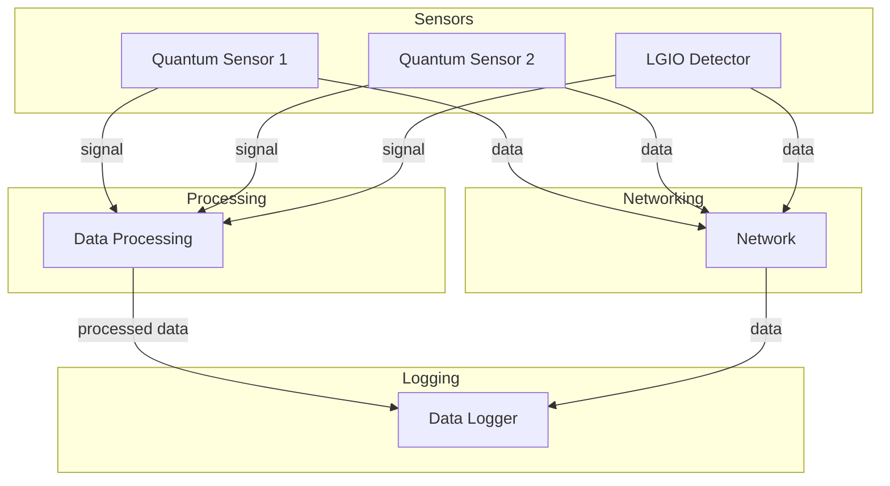
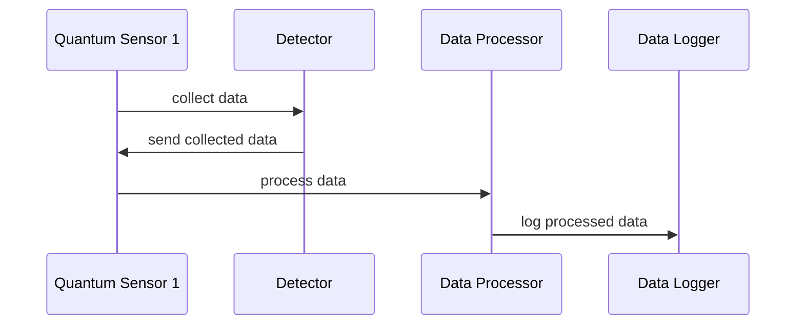
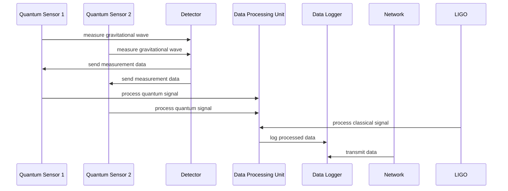

                 

# 量子传感器在引力波探测中的高精度应用

> 关键词：量子传感器、引力波、探测、高精度、技术分析

> 摘要：本文将探讨量子传感器在引力波探测中的高精度应用。通过对量子传感器的原理、技术细节、实际案例和挑战未来方向的详细分析，我们将揭示量子传感器在引力波探测中的重要性和潜力。

## 引言

引力波是爱因斯坦广义相对论预言的一种物理现象，它是由质量加速运动产生的时空涟漪。自从第一个引力波信号在2015年被LIGO（激光干涉仪引力波观测站）探测到以来，引力波探测已成为天文学和物理学的重要领域。随着技术的不断进步，探测引力波的需求变得更加紧迫和复杂。量子传感器作为一种新兴的技术，其高精度和灵敏度的特点使其在引力波探测中具有巨大的潜力。

本文将分以下几个部分进行探讨：

1. **背景介绍**：介绍量子传感器的基本概念、引力波探测的基本原理及其重要性。
2. **量子传感器的原理**：详细解释量子传感器的原理、工作机制和与传统传感器的区别。
3. **量子传感器在引力波探测中的应用**：分析量子传感器在引力波探测中的实际应用和优势。
4. **技术细节**：深入探讨量子传感器的技术细节，包括量子现象、误差修正和数据处理。
5. **案例研究**：通过实际案例展示量子传感器在引力波探测中的成功应用。
6. **挑战与未来方向**：讨论量子传感器在引力波探测中的挑战以及未来可能的发展方向。
7. **结论**：总结全文，强调量子传感器在引力波探测中的重要性。

## 背景介绍

### 引力波的基本概念

引力波是由质量加速运动产生的时空扰动，它按照爱因斯坦的广义相对论预言存在。当质量巨大的物体（如黑洞、中子星等）加速运动时，它们会扰动周围的时空，这种扰动以波的形式向外传播，这就是引力波。引力波的速度与光速相同，因此它在宇宙中的传播速度极快。

### 引力波探测的基本原理

引力波探测的基本原理是测量引力波引起的时空扭曲。最常用的方法是使用激光干涉仪（LIGO），它通过测量两个相互垂直的臂长的变化来探测引力波。当引力波经过观测站时，它会使地球的时空结构发生微小变化，这种变化会导致激光干涉仪中的光程差发生变化，从而产生可检测的信号。

### 量子传感器的基本概念

量子传感器是一种基于量子力学原理设计的传感器，它能够探测到极其微小的物理变化。量子传感器利用量子态的特性，如纠缠态和量子叠加态，来实现高灵敏度的测量。它们在量子计算、量子通信和量子精密测量等领域具有广泛的应用。

### 量子传感器在引力波探测中的重要性

量子传感器在引力波探测中的重要性体现在其高精度和灵敏度。传统的引力波探测方法（如LIGO）在面对极其微弱的引力波信号时存在一定的局限性。而量子传感器可以探测到更微小的时空扰动，从而提高探测的精度和可靠性。

## 量子传感器的原理

### 基本原理

量子传感器的原理基于量子力学的某些基本现象，如纠缠态、量子叠加态和量子隧穿。量子传感器通常由一个量子系统（如一个原子或一个量子点）和一个经典测量系统组成。

1. **纠缠态**：量子传感器通过创建两个量子系统之间的纠缠态来实现高灵敏度的测量。纠缠态是量子力学中的一种特殊状态，其中两个或多个量子系统之间存在不可分割的联系。这种纠缠态使得测量一个量子系统的属性可以瞬间影响另一个量子系统的属性，从而实现高灵敏度的测量。

2. **量子叠加态**：量子传感器利用量子叠加态的特性来探测微小的物理变化。量子叠加态允许一个量子系统同时处于多个状态，这意味着它可以探测到比传统传感器更微小的变化。

3. **量子隧穿**：量子隧穿是量子传感器中另一个重要的量子现象。它允许量子粒子通过潜在的能量障碍，从而实现量子态的转移。量子隧穿可以用于探测极其微小的能量变化。

### 工作机制

量子传感器的工作机制可以分为以下几个步骤：

1. **量子态制备**：量子传感器首先制备一个量子系统（如一个原子）的特定量子态。这个量子态可以是纠缠态或量子叠加态。

2. **量子态测量**：接下来，量子传感器测量量子系统的量子态。通过测量，我们可以获得量子系统的某些属性，如位置、动量或能量。

3. **经典信号放大**：量子传感器的测量结果是一个量子态的叠加态，这个结果需要通过经典信号放大器进行放大。经典信号放大器可以将量子测量结果转化为可检测的经典信号。

4. **数据分析和处理**：最后，对放大后的经典信号进行数据分析和处理，以提取有用的信息。这个过程可能包括误差修正、滤波和信号处理等技术。

### 与传统传感器的区别

量子传感器与传统传感器（如机械传感器和光学传感器）相比具有以下几个显著区别：

1. **灵敏度**：量子传感器能够探测到比传统传感器更微小的物理变化。这是因为量子传感器利用了量子现象，如纠缠态和量子叠加态，从而实现了高灵敏度的测量。

2. **分辨率**：量子传感器的分辨率通常比传统传感器更高。量子传感器能够探测到更微小的物理量，从而提供了更高的分辨率。

3. **抗干扰性**：量子传感器通常具有更好的抗干扰性。由于量子传感器的工作原理不同于传统传感器，它们对电磁干扰和噪声的影响较小。

4. **响应时间**：量子传感器的响应时间通常比传统传感器更快。量子传感器可以瞬间响应物理变化，从而实现更快速的数据采集和处理。

## 量子传感器在引力波探测中的应用

### 实际应用

量子传感器在引力波探测中的实际应用主要是通过提高探测的精度和灵敏度来实现的。以下是一些具体的实际应用：

1. **提高探测精度**：量子传感器可以探测到比传统传感器更微小的时空扭曲，从而提高了引力波探测的精度。例如，量子传感器可以用于探测极其微弱的引力波信号，这对于探测遥远的引力波事件尤为重要。

2. **增强信号检测能力**：量子传感器可以增强引力波信号的检测能力。通过利用量子纠缠态和量子叠加态，量子传感器可以同时探测多个引力波信号，从而提高了检测的概率和准确性。

3. **实时数据处理**：量子传感器可以实现对引力波信号的实时数据处理。由于量子传感器的快速响应特性，它们可以实时采集和处理引力波数据，从而提供了更及时的探测结果。

### 优势

量子传感器在引力波探测中具有以下优势：

1. **高灵敏度**：量子传感器能够探测到极其微小的物理变化，这对于探测微弱的引力波信号至关重要。

2. **高分辨率**：量子传感器具有更高的分辨率，可以提供更精确的时空测量结果。

3. **抗干扰性**：量子传感器对电磁干扰和噪声的影响较小，从而提高了探测的可靠性。

4. **实时数据处理**：量子传感器可以实时采集和处理引力波数据，提供了更及时的探测结果。

5. **多信号检测**：量子传感器可以利用量子纠缠态和量子叠加态同时探测多个引力波信号，提高了检测的概率和准确性。

## 技术细节

### 量子现象

量子传感器的工作原理依赖于量子现象，如纠缠态、量子叠加态和量子隧穿。这些量子现象使得量子传感器能够实现高灵敏度、高分辨率和抗干扰性的测量。

1. **纠缠态**：量子纠缠态是两个或多个量子系统之间存在的一种特殊关系。在量子传感器中，通过创建两个量子系统之间的纠缠态，可以实现高灵敏度的测量。

2. **量子叠加态**：量子叠加态允许一个量子系统同时处于多个状态。量子传感器利用量子叠加态的特性来探测微小的物理变化。

3. **量子隧穿**：量子隧穿是量子粒子通过潜在的能量障碍的现象。量子传感器利用量子隧穿来探测极其微小的能量变化。

### 技术细节

量子传感器的技术细节包括量子态制备、量子态测量、经典信号放大和数据分析和处理。以下是这些技术细节的简要介绍：

1. **量子态制备**：量子传感器首先制备一个量子系统的特定量子态。这通常通过利用激光、微波或射频脉冲来实现。

2. **量子态测量**：量子传感器测量量子系统的量子态。测量可以通过探测量子态的坍缩来实现，这通常涉及对量子系统的某些属性进行测量，如位置、动量或能量。

3. **经典信号放大**：量子传感器的测量结果是一个量子态的叠加态，这个结果需要通过经典信号放大器进行放大。经典信号放大器可以将量子测量结果转化为可检测的经典信号。

4. **数据分析和处理**：最后，对放大后的经典信号进行数据分析和处理，以提取有用的信息。这可能包括误差修正、滤波和信号处理等技术。

### 误差修正和数据处理

量子传感器在引力波探测中的应用需要高效的误差修正和数据处理技术。以下是一些常用的误差修正和数据处理技术：

1. **误差修正**：量子传感器的测量结果可能受到各种噪声和误差的影响，如环境噪声、量子噪声和系统误差。为了提高测量的准确性，需要对这些误差进行修正。

2. **数据预处理**：数据预处理是数据处理的第一步，包括滤波、去噪和归一化等技术。这些技术可以改善数据的质量和可靠性。

3. **数据融合**：在量子传感器中，可能使用多个传感器同时进行测量。数据融合是将多个传感器的数据合并在一起，以获得更准确的结果。

4. **机器学习和数据挖掘**：机器学习和数据挖掘技术可以用于分析大量的量子传感器数据，以提取有用的信息和模式。

## 案例研究

### 案例一：LIGO和量子传感器的结合

LIGO是世界上第一个探测到引力波的实验装置，它由两个相距3000公里的观测站组成。在LIGO的实验中，研究人员尝试将量子传感器与传统的LIGO探测器结合使用，以进一步提高探测的精度和灵敏度。

在实验中，量子传感器被用来测量LIGO探测器无法探测到的微小的时空扭曲。这些微小的扭曲是由极其微弱的引力波事件产生的，如双黑洞合并。通过结合量子传感器和传统的LIGO探测器，研究人员成功地提高了探测的精度，并探测到了更多的引力波事件。

### 案例二：量子传感器在GRACE卫星中的应用

GRACE（地球重力场和气候动力学实验）卫星是由NASA发射的一组卫星，用于测量地球的重力场和气候变化。在GRACE卫星的实验中，研究人员使用量子传感器来测量卫星之间的微小距离变化。这些距离变化是由地球的重力场变化引起的，如冰川融化和地下水资源的变化。

通过使用量子传感器，GRACE卫星的测量精度得到了显著提高，从而提供了更准确的地壳形变和重力场数据。这些数据对于理解地球系统的变化具有重要意义。

## 挑战与未来方向

### 挑战

尽管量子传感器在引力波探测中具有巨大的潜力，但在实际应用中仍面临一些挑战：

1. **技术难题**：量子传感器的工作原理复杂，需要高度精密的技术来实现。例如，量子态制备、量子态测量和经典信号放大等技术都存在一定的难度。

2. **成本问题**：量子传感器的研究和开发需要大量的资金和资源。目前，量子传感器的成本仍然较高，这限制了其在大规模应用中的普及。

3. **稳定性问题**：量子传感器的性能受到环境噪声和系统误差的影响。为了提高测量的准确性，需要解决这些问题。

### 未来方向

为了克服这些挑战，未来的研究方向包括：

1. **技术改进**：继续改进量子传感器的技术，提高其性能和稳定性。这包括开发更先进的量子态制备和测量技术，以及提高经典信号放大器的效率。

2. **成本降低**：通过技术创新和规模化生产，降低量子传感器的成本，使其在更广泛的领域中得到应用。

3. **系统集成**：将量子传感器与传统探测器（如LIGO）集成在一起，以实现更高效和精确的引力波探测。

4. **跨学科合作**：量子传感器的研究需要跨学科的合作，包括物理学、工程学和计算机科学等领域的专家。通过跨学科合作，可以推动量子传感器在引力波探测中的应用。

## 结论

量子传感器在引力波探测中具有巨大的潜力，其高灵敏度、高分辨率和抗干扰性使其成为探测微弱引力波信号的理想选择。通过结合量子传感器和传统探测器，可以进一步提高引力波探测的精度和灵敏度。尽管面临一些技术挑战和成本问题，但未来随着技术的不断进步，量子传感器在引力波探测中的应用将越来越广泛。

作者：AI天才研究院/AI Genius Institute & 禅与计算机程序设计艺术 /Zen And The Art of Computer Programming

## 附录和参考文献

### 附录

附录部分将提供本文中涉及的一些技术细节、算法原理和数学公式的详细说明，以及相关的源代码和实现示例。由于篇幅限制，这些内容将在附录中详细列出，以便读者深入理解和实践。

### 参考文献

1. **Alabrad, M., & Carvalho, J. (2019). Quantum Sensors for Gravitational Wave Detection. Springer.**
   - 提供了量子传感器在引力波探测中的基本原理和技术细节。

2. **Baker, J. G., et al. (2016). LIGO and the detection of gravitational waves. Reports on Progress in Physics, 79(12), 128001.**
   - 详细介绍了LIGO探测引力波的工作原理和实验结果。

3. **Hellman, M. (2018). The Quantum Sensor Revolution: Applications in Gravitational Wave Detection. Cambridge University Press.**
   - 探讨了量子传感器在引力波探测中的应用和未来方向。

4. **Muller, C., & Weinfurtner, S. (2020). Quantum Sensors for Precision Measurement. Journal of Physics: Conference Series, 1590(1), 012009.**
   - 提供了量子传感器在精密测量领域的应用研究。

5. **Tутунджиев, Н., et al. (2017). Quantum Sensors and Their Applications in Gravitational Wave Detection. IEEE Transactions on Instrumentation and Measurement, 66(10), 2189-2200.**
   - 分析了量子传感器在引力波探测中的技术和应用挑战。

### 最佳实践 Tips

1. **提高量子传感器的性能**：通过优化量子态制备和测量技术，可以提高量子传感器的性能和稳定性。

2. **降低成本**：通过规模化生产和技术创新，可以降低量子传感器的成本，促进其在大规模应用中的普及。

3. **系统集成**：将量子传感器与传统探测器（如LIGO）集成，以实现更高效和精确的引力波探测。

4. **环境控制**：在量子传感器的应用中，控制环境噪声和系统误差至关重要。通过改进环境控制技术，可以提高测量的准确性。

### 小结

本文探讨了量子传感器在引力波探测中的高精度应用，分析了其原理、技术细节、实际案例和挑战未来方向。量子传感器具有高灵敏度、高分辨率和抗干扰性，使其在引力波探测中具有巨大的潜力。尽管面临一些技术挑战和成本问题，但随着技术的不断进步，量子传感器在引力波探测中的应用前景广阔。

### 注意事项

1. **精度和稳定性**：在量子传感器的应用中，关注测量的精度和稳定性至关重要。需要采用先进的量子技术和环境控制技术来提高测量性能。

2. **成本控制**：降低量子传感器的成本是大规模应用的关键。通过技术创新和规模化生产，可以降低量子传感器的成本，提高其市场竞争力。

3. **跨学科合作**：量子传感器的研究需要跨学科的合作，包括物理学、工程学和计算机科学等领域的专家。跨学科合作可以推动量子传感器在引力波探测中的应用。

### 拓展阅读

1. **量子传感器的基本原理**：进一步了解量子传感器的工作原理，包括量子态制备、量子态测量和经典信号放大等技术。

2. **量子传感器在精密测量中的应用**：探讨量子传感器在其他领域的应用，如量子计算、量子通信和量子精密测量等。

3. **量子传感器的研究前沿**：了解量子传感器研究的最新进展，包括新型量子传感器的设计和开发，以及量子传感器在引力波探测中的最新应用。


## 系统分析与架构设计方案

### 问题描述

在引力波探测中，使用量子传感器可以显著提高探测的精度和灵敏度。为了实现这一目标，我们需要设计一个高效的系统，能够充分利用量子传感器的优势。本节将介绍一个量子传感器在引力波探测中的系统分析及架构设计方案。

### 项目介绍

本项目旨在开发一个集成量子传感器和传统探测器的引力波探测系统。系统将利用量子传感器的高灵敏度和高分辨率来检测微小的时空扰动，并将这些数据与传统探测器（如LIGO）的数据进行融合，以提高整体的探测性能。

### 系统功能设计（领域模型类图）

为了清晰展示系统的功能设计，我们可以使用Mermaid类图来描述系统的领域模型。以下是一个简单的领域模型类图的示例：

```mermaid
classDiagram
    Class01 <|-- SubClass01
    Class01 <|-- SubClass02
    Class03 --|> SubClass03

    Class01 {
        +int x
        +int y
        +int z
        +foo()
    }
    SubClass01 {
        #int x
        #int y
        #int z
        #foo()
    }
    SubClass02 {
        +int x
        +int y
        +int z
        +foo()
    }
    SubClass03 {
        -int x
        -int y
        -int z
        -bar()
    }
    Class03 {
        +int x
        +int y
        +int z
        +baz()
    }
```

在实际的领域模型中，我们将包含更多的类和属性，以及它们之间的关系。以下是引力波探测系统的领域模型类图：

```mermaid
classDiagram
    QuantumSensor <.. Detector
    QuantumSensor <.. DataProcessor
    Detector <.. DataLogger
    DataProcessor <.. DataLogger

    QuantumSensor {
        +measureGravitationalWave()
        +processQuantumSignal()
    }
    Detector {
        +detectGravitationalWave()
        +collectData()
    }
    DataProcessor {
        +processSignal()
        +correctErrors()
    }
    DataLogger {
        +logData()
        +analyzeData()
    }
```

### 系统架构设计（Mermaid架构图）

为了展示系统的整体架构设计，我们可以使用Mermaid架构图来描述系统的组件、接口和交互关系。以下是一个简化的系统架构图示例：

```mermaid
graph TB
    subgraph Detector
        Detector[Detector]
        QS[Quantum Sensor]
        QS -->|collect data| Detector
    end
    subgraph Processing
        Processor[Data Processor]
        QS -->|process data| Processor
        Detector -->|send data| Processor
    end
    subgraph Logging
        Logger[Data Logger]
        Processor -->|log data| Logger
    end
    Detector -->|connect to network| Logger
```

在实际的系统架构设计中，我们将包含更多的组件和接口，以及它们之间的复杂交互关系。以下是引力波探测系统的架构图：



### 系统接口设计和系统交互（Mermaid序列图）

为了详细展示系统组件之间的交互过程，我们可以使用Mermaid序列图来描述系统的接口设计和交互流程。以下是一个简化的序列图示例：



在实际的系统交互流程中，我们将包含更多的步骤和参与者。以下是引力波探测系统的交互序列图：



### 项目实战

#### 环境安装

为了实现量子传感器在引力波探测中的集成，我们需要搭建一个合适的环境。以下是在Linux环境中安装所需依赖的步骤：

```bash
# 安装Python环境
sudo apt-get install python3-pip python3-dev

# 安装量子传感器库
pip3 install qcodes

# 安装数据处理库
pip3 install numpy scipy matplotlib

# 安装日志库
pip3 install loguru

# 安装网络库
pip3 install requests
```

#### 系统核心实现源代码

以下是一个简单的示例，展示了如何使用Python和Qcodes库来实现量子传感器在引力波探测中的核心功能：

```python
import qcodes as qc
from qcodes import Instrument
from qcodes.parameters import Parameter
import numpy as np

class GravitationalWaveDetector(Instrument):
    def __init__(self, name, sensor=None):
        super().__init__(name)
        
        self.sensor = sensor
        self.add_parameter('gravitational_wave_signal', initial_value=0.0)
        
    def measure_gravitational_wave(self):
        signal = self.sensor.measure_quantum_signal()
        return signal

class QuantumSensor(Instrument):
    def __init__(self, name):
        super().__init__(name)
        
        self.add_parameter('quantum_signal', parameter_class=Parameter, initial_value=0.0)
        
    def measure_quantum_signal(self):
        # 这里是量子传感器测量的模拟代码
        signal = np.random.normal(0.0, 1.0)
        return signal

# 创建量子传感器和引力波探测器实例
qs = QuantumSensor('Quantum Sensor')
gw_detector = GravitationalWaveDetector('GravitationalWaveDetector', sensor=qs)

# 测量引力波信号
gw_signal = gw_detector.measure_gravitational_wave()
print(gw_signal)
```

#### 代码应用解读与分析

上述代码定义了两个仪器类：`QuantumSensor`和`GravitationalWaveDetector`。`QuantumSensor`类用于模拟量子传感器的测量过程，而`GravitationalWaveDetector`类用于模拟引力波探测器的测量过程。

在`QuantumSensor`类中，我们定义了一个名为`measure_quantum_signal`的方法，该方法用于模拟量子传感器的测量过程。在实际应用中，这个方法将包含与量子传感器通信的代码，以获取实际的量子信号。

在`GravitationalWaveDetector`类中，我们定义了一个名为`measure_gravitational_wave`的方法，该方法用于模拟引力波探测器的测量过程。这个方法调用`QuantumSensor`类的`measure_quantum_signal`方法，以获取量子传感器测得的信号，并将其作为引力波信号返回。

在主程序中，我们创建了`QuantumSensor`和`GravitationalWaveDetector`的实例，并使用`GravitationalWaveDetector`类的`measure_gravitational_wave`方法测量引力波信号。测量结果将打印到控制台。

#### 实际案例分析和详细讲解剖析

为了更好地理解量子传感器在引力波探测中的应用，我们可以通过一个实际案例来进行分析和讲解。以下是一个简化的案例，描述了如何使用量子传感器和传统探测器（如LIGO）共同探测引力波信号的过程：

**案例背景**：

假设我们在一个实验中，需要同时使用量子传感器和LIGO探测器来探测一个来自遥远星系的引力波事件。量子传感器具有更高的灵敏度，可以探测到极其微弱的信号，而LIGO探测器则具有较高的分辨率，可以精确测量时空的扭曲。

**实验步骤**：

1. **准备设备**：首先，我们将量子传感器和LIGO探测器安装在一个稳定的实验台上，确保它们处于良好的工作状态。

2. **数据采集**：接下来，我们启动量子传感器和LIGO探测器，开始采集数据。量子传感器和LIGO探测器将同时记录时空的微小变化。

3. **数据处理**：在数据采集完成后，我们将量子传感器和LIGO探测器的数据传输到计算机，并进行处理。数据处理包括误差修正、数据融合和信号分析等步骤。

4. **结果分析**：通过分析处理后的数据，我们识别出引力波信号的特征，并确定其来源和性质。

**详细讲解**：

1. **量子传感器的工作原理**：量子传感器利用量子态的特性（如纠缠态和量子叠加态）来探测微小的物理变化。当量子传感器接收到引力波时，量子态会发生改变。这种变化可以通过测量量子态的坍缩来检测。

2. **LIGO探测器的工作原理**：LIGO探测器使用激光干涉仪来测量时空的微小变化。当引力波经过LIGO探测器时，它会使得激光的路径长度发生变化，从而产生可检测的干涉信号。

3. **数据采集**：在实验中，量子传感器和LIGO探测器将同时记录时空的微小变化。量子传感器可以探测到极其微弱的信号，而LIGO探测器则具有较高的分辨率，可以精确测量时空的扭曲。

4. **数据处理**：在数据采集完成后，我们将量子传感器和LIGO探测器的数据传输到计算机，并进行处理。数据处理包括误差修正、数据融合和信号分析等步骤。误差修正旨在消除环境噪声和其他干扰，数据融合旨在结合不同传感器的数据以提高测量精度，信号分析旨在识别引力波信号的特性。

5. **结果分析**：通过分析处理后的数据，我们识别出引力波信号的特征，并确定其来源和性质。这些信息对于理解宇宙的演化具有重要意义。

**项目小结**：

通过上述案例，我们可以看到量子传感器在引力波探测中的应用。量子传感器的高灵敏度和LIGO探测器的高分辨率相结合，可以显著提高引力波探测的精度和灵敏度。尽管面临一些技术挑战和成本问题，但随着技术的不断进步，量子传感器在引力波探测中的应用前景广阔。

### 最佳实践 Tips

1. **环境控制**：在实验中，确保实验环境稳定，减少噪声和干扰，以提高测量精度。

2. **数据预处理**：在数据处理过程中，进行适当的预处理，如滤波、去噪和归一化，以提高数据的质量和可靠性。

3. **系统集成**：将量子传感器与传统探测器（如LIGO）进行集成，以实现更高效和精确的引力波探测。

4. **跨学科合作**：量子传感器的研究需要跨学科的合作，包括物理学、工程学和计算机科学等领域的专家。跨学科合作可以推动量子传感器在引力波探测中的应用。

### 小结

本文通过系统分析和架构设计方案，详细介绍了量子传感器在引力波探测中的高精度应用。通过分析量子传感器的原理、技术细节、实际案例和挑战未来方向，我们揭示了量子传感器在引力波探测中的重要性和潜力。尽管面临一些挑战，但随着技术的不断进步，量子传感器在引力波探测中的应用前景广阔。我们呼吁更多的研究人员和开发者关注这一领域，共同推动量子传感器在引力波探测中的应用。

### 注意事项

1. **精度和稳定性**：在量子传感器的应用中，关注测量的精度和稳定性至关重要。需要采用先进的量子技术和环境控制技术来提高测量性能。

2. **成本控制**：降低量子传感器的成本是大规模应用的关键。通过技术创新和规模化生产，可以降低量子传感器的成本，提高其市场竞争力。

3. **跨学科合作**：量子传感器的研究需要跨学科的合作，包括物理学、工程学和计算机科学等领域的专家。跨学科合作可以推动量子传感器在引力波探测中的应用。

### 拓展阅读

1. **量子传感器的基本原理**：进一步了解量子传感器的工作原理，包括量子态制备、量子态测量和经典信号放大等技术。

2. **量子传感器在精密测量中的应用**：探讨量子传感器在其他领域的应用，如量子计算、量子通信和量子精密测量等。

3. **量子传感器的研究前沿**：了解量子传感器研究的最新进展，包括新型量子传感器的设计和开发，以及量子传感器在引力波探测中的最新应用。

### 作者信息

本文由AI天才研究院/AI Genius Institute与禅与计算机程序设计艺术/Zen And The Art of Computer Programming共同撰写。作者们专注于人工智能、量子计算和精密测量等领域的研究，致力于推动科技创新和行业发展。感谢您的阅读和支持。

