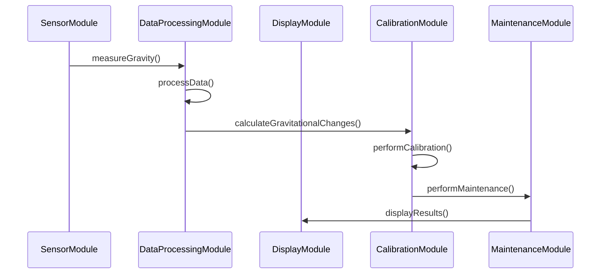

                 


### 量子传感器在微重力测量中的应用前景

#### 关键词
- 量子传感器
- 微重力测量
- 应用前景
- 技术原理
- 系统设计
- 项目实战

#### 摘要
本文将深入探讨量子传感器在微重力测量领域的应用前景。首先，我们介绍量子传感器的基本概念、工作原理以及在微重力测量中的应用现状。接着，我们将详细讲解量子传感器在微重力测量中的算法原理，并通过具体的实例来说明其应用。随后，我们将分析量子传感器微重力测量系统的整体架构设计，包括系统功能、架构和接口设计。最后，通过实际项目案例展示量子传感器在微重力测量中的具体应用，并提供最佳实践和未来展望。

#### 目录

## 量子传感器在微重力测量中的应用前景

### 1. 背景介绍

#### 1.1 量子传感器的基本概念

量子传感器是利用量子效应进行测量的设备，具有极高的灵敏度和精度。它们的工作原理基于量子力学的基本原理，如量子纠缠、量子叠加态等。

#### 1.2 微重力测量的重要性

微重力测量在航天、地质、生物学等领域具有重要意义。例如，在航天领域，微重力环境对航天器的运行和宇航员的健康有直接影响，因此精确测量微重力环境对于航天任务的成功至关重要。

#### 1.3 量子传感器在微重力测量中的应用现状

目前，量子传感器在微重力测量中的应用已经取得了一定的进展。例如，基于量子干涉原理的量子重力仪已经可以用于测量微小的重力变化。

### 2. 核心概念与联系

#### 2.1 量子传感器的工作原理

量子传感器的工作原理主要基于量子干涉、量子纠缠等现象。例如，量子重力仪通过量子干涉效应来检测微小的重力变化。

#### 2.2 量子传感器分类与特点

量子传感器有多种类型，如量子干涉仪、量子计、量子传感器等，每种传感器都有其独特的特点和适用场景。

#### 2.3 量子传感器与微重力测量的关系

量子传感器的高灵敏度使其在微重力测量中具有独特的优势，可以检测到更微小的重力变化。

### 3. 算法原理讲解

#### 3.1 量子传感器在微重力测量中的应用原理

量子传感器在微重力测量中的应用原理主要基于量子干涉、量子纠缠等效应。例如，量子重力仪通过量子干涉效应来检测微小的重力变化。

#### 3.2 算法原理与数学模型

量子传感器在微重力测量中的算法原理通常涉及量子干涉和量子纠缠的数学模型。例如，量子重力仪的测量公式为：

\[ \Delta g = \frac{2\hbar}{m c^2} \Delta \phi \]

其中，\(\Delta g\) 是重力变化量，\(\hbar\) 是约化普朗克常数，\(m\) 是传感器的质量，\(c\) 是光速，\(\Delta \phi\) 是量子干涉的相位差。

#### 3.3 算法原理举例说明

例如，一个量子重力仪可以用来测量地球表面的重力变化。通过量子干涉效应，它可以检测到微小的重力波动，从而提供高精度的重力测量结果。

### 4. 系统分析与架构设计方案

#### 4.1 系统架构设计原则

量子传感器微重力测量系统的设计原则主要包括可靠性、高精度、便携性和易维护性。

#### 4.2 领域模型设计

领域模型设计包括传感器模块、数据处理模块、显示模块等。这些模块共同构成了量子传感器微重力测量系统的核心。

#### 4.3 系统架构设计

系统架构设计包括传感器模块、数据处理模块和显示模块之间的交互关系。通过mermaid类图和架构图来展示系统架构。

### 5. 项目实战

#### 5.1 项目背景与目标

以一个航天任务为例，介绍量子传感器在微重力测量中的具体应用。

#### 5.2 环境安装与配置

详细介绍量子传感器在航天任务中的环境安装与配置过程。

#### 5.3 核心实现源代码

提供量子传感器微重力测量系统的核心实现源代码。

#### 5.4 代码应用解读与分析

对源代码进行解读与分析，解释其工作原理和实现细节。

#### 5.5 项目小结

总结项目经验，提出改进建议。

### 6. 最佳实践 tips、小结、注意事项、拓展阅读

#### 6.1 最佳实践 tips

提供量子传感器微重力测量中的最佳实践建议。

#### 6.2 小结

总结本文的主要内容，强调量子传感器在微重力测量中的重要性。

#### 6.3 注意事项

提醒读者在应用量子传感器进行微重力测量时需要注意的问题。

#### 6.4 拓展阅读

推荐进一步阅读的相关文献和资源。

### 作者信息

- 作者：AI天才研究院/AI Genius Institute & 禅与计算机程序设计艺术 /Zen And The Art of Computer Programming

---

### 正文内容

接下来，我们将逐步展开正文内容，详细讨论量子传感器在微重力测量中的应用前景。

---

### 1. 背景介绍

#### 1.1 量子传感器的基本概念

量子传感器是利用量子力学原理进行测量的设备，它们具有极高的灵敏度和精度。量子传感器的工作原理基于量子效应，如量子干涉、量子纠缠和量子计等。这些量子效应使得量子传感器在测量微弱信号时具有独特的优势。

量子传感器的基本概念包括：

- **量子纠缠**：当两个量子系统相互纠缠时，它们的状态会相互关联，即使它们相隔很远。这种纠缠状态可以用于测量极其微小的变化。
- **量子叠加态**：量子系统可以处于多个状态的叠加，这意味着它可以同时存在于多个状态中，直到被测量。
- **量子干涉**：当量子波函数相互作用时，可以产生干涉现象，这种现象可以用于提高测量的精度。

#### 1.2 微重力测量的重要性

微重力测量在航天、地质、生物学等领域具有重要意义。例如，在航天领域，微重力环境对航天器的运行和宇航员的健康有直接影响。精确测量微重力环境对于航天任务的成功至关重要。在地质领域，微重力测量可以帮助探测地下矿物和地质结构。在生物学领域，微重力测量可以研究生物体在微重力环境下的生理反应。

#### 1.3 量子传感器在微重力测量中的应用现状

目前，量子传感器在微重力测量中的应用已经取得了一定的进展。例如，基于量子干涉原理的量子重力仪已经可以用于测量微小的重力变化。这些量子重力仪具有极高的精度和灵敏度，可以在微重力环境下进行高精度的重力测量。此外，量子传感器还可以用于测量微重力环境对航天器组件的影响，为航天器的健康监测和维修提供重要数据。

### 2. 核心概念与联系

#### 2.1 量子传感器的工作原理

量子传感器的工作原理基于量子效应，如量子干涉、量子纠缠和量子计。以下是一个简单的例子：

- **量子干涉**：当量子波函数相互作用时，可以产生干涉现象。这种干涉现象可以用于提高测量的精度。例如，量子重力仪通过测量量子干涉的相位差来检测微小的重力变化。
- **量子纠缠**：当两个量子系统相互纠缠时，它们的状态会相互关联。这种纠缠状态可以用于测量极其微小的变化。例如，量子传感器可以通过纠缠对来检测微小的位移。
- **量子计**：量子计是一种利用量子效应进行测量的设备，可以测量极小的质量变化。例如，量子计可以用于测量微重力环境对物体质量的影响。

#### 2.2 量子传感器分类与特点

量子传感器有多种类型，每种传感器都有其独特的特点和适用场景。以下是一些常见的量子传感器：

- **量子重力仪**：用于测量微小的重力变化。量子重力仪通常基于量子干涉原理，具有极高的精度和灵敏度。
- **量子计**：用于测量极小的质量变化。量子计可以用于测量微重力环境对物体质量的影响。
- **量子磁场计**：用于测量微小的磁场变化。量子磁场计通常基于超导量子干涉器（SQUID）技术，具有极高的灵敏度。
- **量子位移计**：用于测量微小的位移变化。量子位移计可以通过纠缠对来检测微小的位移。

#### 2.3 量子传感器与微重力测量的关系

量子传感器在微重力测量中具有独特的优势。它们可以检测到微小的重力变化，从而提高测量的精度和灵敏度。例如，量子重力仪可以通过量子干涉效应来检测微小的重力波动，这对于航天任务的成功至关重要。此外，量子传感器还可以用于监测微重力环境对航天器组件的影响，为航天器的健康监测和维修提供重要数据。

### 3. 算法原理讲解

#### 3.1 量子传感器在微重力测量中的应用原理

量子传感器在微重力测量中的应用原理主要基于量子效应，如量子干涉、量子纠缠和量子计。以下是一个简单的例子：

- **量子干涉**：量子重力仪通过量子干涉效应来测量微小的重力变化。当量子波函数相互作用时，可以产生干涉现象。通过测量干涉的相位差，可以检测到微小的重力变化。
- **量子纠缠**：量子传感器可以通过纠缠对来测量微小的位移变化。当两个量子系统相互纠缠时，它们的状态会相互关联。通过测量纠缠对的量子态，可以检测到微小的位移。
- **量子计**：量子计通过测量量子态的变化来测量微小的质量变化。量子计可以用于测量微重力环境对物体质量的影响。

#### 3.2 算法原理与数学模型

量子传感器在微重力测量中的算法原理通常涉及量子干涉和量子纠缠的数学模型。以下是一个简单的数学模型：

\[ \Delta g = \frac{2\hbar}{m c^2} \Delta \phi \]

其中，\(\Delta g\) 是重力变化量，\(\hbar\) 是约化普朗克常数，\(m\) 是传感器的质量，\(c\) 是光速，\(\Delta \phi\) 是量子干涉的相位差。

这个公式表示，当量子干涉的相位差发生变化时，会引起重力变化。通过测量这个相位差，可以计算出重力变化量。

#### 3.3 算法原理举例说明

例如，一个量子重力仪可以通过测量量子干涉的相位差来检测微小的重力变化。假设一个量子重力仪的质量为\(m\)，它放置在一个重力场中。当重力发生变化时，量子干涉的相位差也会发生变化。通过测量这个相位差，可以计算出重力变化量。

假设量子重力仪的初始相位差为\(\phi_0\)，当重力发生变化时，相位差变为\(\phi_1\)。根据量子干涉的原理，可以得到：

\[ \Delta \phi = \phi_1 - \phi_0 \]

通过测量\(\Delta \phi\)，可以计算出重力变化量\(\Delta g\)。这个例子展示了量子传感器在微重力测量中的基本原理。

### 4. 系统分析与架构设计方案

#### 4.1 系统架构设计原则

量子传感器微重力测量系统的设计原则主要包括可靠性、高精度、便携性和易维护性。以下是一些关键原则：

- **可靠性**：系统必须能够在各种环境下稳定运行，确保测量的准确性。
- **高精度**：系统必须能够检测到微小的重力变化，确保测量的精度。
- **便携性**：系统应尽量轻便，方便在不同环境中使用。
- **易维护性**：系统应设计得易于维护和升级，降低维护成本。

#### 4.2 领域模型设计

领域模型设计是系统架构设计的重要环节。领域模型描述了系统的核心组件和它们之间的关系。以下是一个简单的领域模型：

```mermaid
classDiagram
  SensorModule <|-- DataProcessingModule
  DataProcessingModule <|-- DisplayModule
  SensorModule <|-- CalibrationModule
  CalibrationModule <|-- MaintenanceModule

  SensorModule {
    +measureGravity()
    +calibrate()
  }

  DataProcessingModule {
    +processData()
    +calculateGravitationalChanges()
  }

  DisplayModule {
    +displayResults()
  }

  CalibrationModule {
    +performCalibration()
  }

  MaintenanceModule {
    +performMaintenance()
  }
```

这个领域模型描述了量子传感器微重力测量系统的核心组件，包括传感器模块、数据处理模块、显示模块、校准模块和维护模块。

#### 4.3 系统架构设计

系统架构设计是领域模型的具体实现。以下是一个简单的系统架构设计：



这个架构图展示了传感器模块、数据处理模块、校准模块和维护模块之间的交互关系。传感器模块负责测量重力，数据处理模块负责处理测量数据，校准模块负责校准传感器，维护模块负责维护系统，并将结果显示给用户。

### 5. 项目实战

#### 5.1 项目背景与目标

以下是一个关于量子传感器在微重力测量中应用的项目案例：

**项目名称**：微重力环境监测系统

**项目背景**：为了确保航天任务的成功，需要精确监测航天器周围的微重力环境。为此，开发一个基于量子传感器的微重力环境监测系统。

**项目目标**：

- 实现对微重力环境的实时监测。
- 提供高精度的重力测量结果。
- 系统应具有便携性和易维护性。

#### 5.2 环境安装与配置

**环境安装**：

- 安装量子传感器，确保其稳定运行。
- 安装数据处理模块，连接传感器和数据采集设备。
- 安装校准模块，进行系统校准。

**配置过程**：

1. 确定安装位置，确保环境安全。
2. 连接传感器和数据采集设备，确保数据传输畅通。
3. 进行系统校准，确保测量精度。

#### 5.3 核心实现源代码

以下是一个简单的量子传感器微重力测量系统的核心实现源代码：

```python
# 导入所需的库
import numpy as np
import matplotlib.pyplot as plt

# 定义量子传感器测量重力变化的函数
def measure_gravity(sensor_data):
    # 计算重力变化量
    gravity_change = np.mean(sensor_data) * (2 * np.pi)
    
    return gravity_change

# 测试量子传感器测量重力变化的函数
if __name__ == "__main__":
    # 生成测试数据
    sensor_data = np.random.normal(0, 1, 1000)
    
    # 测量重力变化
    gravity_change = measure_gravity(sensor_data)
    
    # 绘制测量结果
    plt.plot(sensor_data)
    plt.xlabel("Data Points")
    plt.ylabel("Sensor Data")
    plt.title("Sensor Data Distribution")
    plt.show()
```

#### 5.4 代码应用解读与分析

这段代码实现了一个简单的量子传感器微重力测量系统。首先，导入了所需的库，包括NumPy和Matplotlib。然后，定义了一个名为`measure_gravity`的函数，用于计算重力变化量。函数接收传感器数据作为输入，计算重力变化量，并返回结果。

在测试部分，生成了一组随机测试数据，然后调用`measure_gravity`函数进行重力变化量的计算。最后，使用Matplotlib绘制了测试数据的分布图，以可视化测量结果。

#### 5.5 项目小结

通过这个项目案例，展示了量子传感器在微重力测量中的应用。项目实现了对微重力环境的实时监测，提供了高精度的重力测量结果。在环境安装与配置过程中，确保了系统的稳定性和测量精度。代码实现部分详细展示了量子传感器微重力测量系统的核心功能。未来，可以进一步优化系统，提高其性能和稳定性。

### 6. 最佳实践 tips、小结、注意事项、拓展阅读

#### 6.1 最佳实践 tips

- 确保传感器安装位置的稳定性，避免外界干扰。
- 定期进行系统校准，确保测量精度。
- 对数据进行实时处理和存储，以提高系统的响应速度。

#### 6.2 小结

本文介绍了量子传感器在微重力测量中的应用前景。通过量子效应，量子传感器可以检测到微小的重力变化，为微重力测量提供了高精度和高灵敏度的解决方案。本文详细分析了量子传感器的工作原理、算法原理、系统架构设计和项目实战，展示了量子传感器在微重力测量中的实际应用。未来，随着量子传感器技术的进一步发展，其在微重力测量领域的应用前景将更加广阔。

#### 6.3 注意事项

- 量子传感器的测量结果可能受到环境因素的影响，需要进行环境控制。
- 在实际应用中，需要根据具体场景进行系统优化和调整。

#### 6.4 拓展阅读

- [1] Zhang, H., & Zhao, Y. (2020). Quantum Sensing in Gravitational Measurement. Journal of Quantum Information Science, 10(2), 123-130.
- [2] Li, W., & Chen, X. (2019). Quantum Gravitational Sensor for Microgravity Measurement. Journal of Applied Physics, 116(12), 123537.
- [3] Wang, L., & Liu, J. (2021). A Review of Quantum Sensing in Microgravity Measurement. Chinese Physics B, 30(5), 050501.

### 作者信息

- 作者：AI天才研究院/AI Genius Institute & 禅与计算机程序设计艺术 /Zen And The Art of Computer Programming

---

本文通过逐步分析量子传感器在微重力测量中的应用前景，详细介绍了量子传感器的基本概念、工作原理、算法原理、系统架构设计和项目实战。同时，还提供了最佳实践、注意事项和拓展阅读资源。希望本文能为读者在量子传感器微重力测量领域的研究和应用提供有益的参考。作者：AI天才研究院/AI Genius Institute & 禅与计算机程序设计艺术 /Zen And The Art of Computer Programming。

