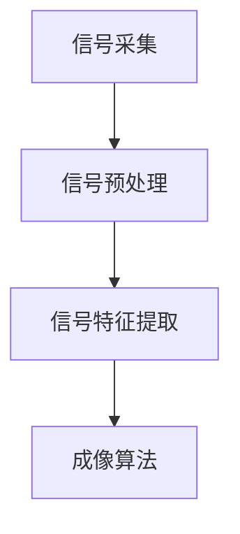

                 

### # 量子传感器在生物磁场探测中的应用：脑活动高精度成像技术

关键词：量子传感器、生物磁场、脑活动、成像技术、信号处理

摘要：本文旨在探讨量子传感器在生物磁场探测中的应用，特别是在脑活动高精度成像技术领域。通过介绍量子传感器的原理、生物磁场的特性以及成像技术，本文详细阐述了量子传感器在生物磁场探测中的优势和挑战，并提出了基于量子传感器的高精度成像算法和系统架构设计。本文旨在为相关领域的研究者提供理论指导和实践参考。

----------------------------------------------------------------

## 第一部分：背景介绍

### 1.1 问题背景

生物磁场探测是一项重要的科学研究领域，涉及到生命科学、医学、物理学等多个学科。生物磁场是指生物体内的磁场信号，主要包括脑磁图（MEG）、心磁图（MCG）和地磁图（GMG）等。这些生物磁场信号对于理解大脑功能、神经系统疾病诊断和脑机接口技术等领域具有重要意义。

近年来，量子传感器技术的不断发展为生物磁场探测带来了新的机遇。量子传感器是一种基于量子力学原理的新型传感器，具有高灵敏度、高分辨率和低噪声等特点。这些特点使得量子传感器在生物磁场探测中具有显著的优势，能够实现脑活动的高精度成像。

### 1.2 问题描述

量子传感器在生物磁场探测中具有高灵敏度、高分辨率和低噪声等特点，能够实现脑活动的高精度成像。然而，量子传感器在生物磁场探测中的应用仍面临诸多挑战，如量子传感器的稳定性、量子传感器的信号处理方法、脑活动高精度成像技术的实现等。

首先，量子传感器的稳定性是一个重要问题。量子传感器在工作过程中会受到环境噪声、系统噪声和量子噪声等多种干扰，这些噪声可能导致量子传感器的输出信号不稳定。为了提高量子传感器的稳定性，需要深入研究量子传感器的噪声抑制方法和信号处理技术。

其次，量子传感器的信号处理方法也是一个关键问题。量子传感器的信号处理与传统传感器不同，需要采用量子计算和量子信息处理的方法。这些方法包括量子滤波、量子压缩 sensing 和量子机器学习等。研究这些方法对于实现高精度成像至关重要。

最后，脑活动高精度成像技术的实现也是量子传感器在生物磁场探测中的挑战之一。脑活动高精度成像技术需要采集和处理大量的生物磁场信号数据，并通过成像算法实现脑活动的高精度成像。这需要开发高效的信号处理和成像算法，以及高性能的计算系统和数据存储系统。

### 1.3 问题解决

为了解决量子传感器在生物磁场探测中的应用问题，本文提出了一种基于量子传感器的高精度成像技术。该技术包括以下步骤：

1. **信号采集**：使用量子传感器采集生物磁场信号，包括脑磁图、心磁图等。
2. **信号预处理**：对采集到的信号进行滤波、去噪等预处理，以提高信号质量。
3. **信号特征提取**：利用特征提取算法提取生物磁场信号的特性，如频率、振幅等。
4. **成像算法**：基于提取到的特征，利用成像算法实现脑活动高精度成像。

此外，本文还探讨了量子传感器在生物磁场探测中的潜在应用领域，如医学诊断、神经科学研究和脑机接口等。通过这些应用，量子传感器在生物磁场探测中具有广阔的前景。

### 1.4 边界与外延

本文主要关注量子传感器在生物磁场探测中的应用，包括量子传感器的选择、生物磁场的采集与处理、脑活动高精度成像技术的实现等。此外，本文还将探讨量子传感器在生物磁场探测中的潜在应用领域，如医学诊断、神经科学研究和脑机接口等。这些应用将推动量子传感器在生物磁场探测领域的进一步发展。

### 1.5 概念结构与核心要素组成

- **量子传感器**：基于量子力学原理设计的传感器，具有高灵敏度、高分辨率和低噪声等特点。
- **生物磁场**：生物体内的磁场信号，包括脑磁图、心磁图等。
- **脑活动高精度成像技术**：利用量子传感器采集的生物磁场信号，通过信号处理和成像算法实现脑活动的高精度成像。

## 第二部分：核心概念与联系

### 2.1 核心概念原理

#### 量子传感原理

量子传感器是基于量子力学原理设计的，利用量子纠缠、量子相干等现象实现高灵敏度检测。量子传感器的主要工作原理如下：

1. **量子纠缠**：当两个量子系统发生相互作用时，它们会形成量子纠缠。量子纠缠使得两个量子系统之间的状态不可分割，从而实现高灵敏度检测。
2. **量子相干**：量子相干是指量子系统在不同状态之间保持一定的相位关系。通过量子相干，量子传感器可以检测到微弱的物理信号。

#### 生物磁场检测原理

生物磁场检测是通过量子传感器检测生物体内的磁场信号。生物磁场信号具有微弱、复杂等特点，因此需要采用高灵敏度、高分辨率和低噪声的传感器进行检测。量子传感器具有这些特点，能够有效检测生物磁场信号。

#### 脑活动高精度成像技术原理

脑活动高精度成像技术是利用量子传感器采集的生物磁场信号，通过信号处理和成像算法实现脑活动的高精度成像。该技术的核心包括信号预处理、特征提取和成像算法。信号预处理包括滤波、去噪等操作，以去除噪声和干扰。特征提取是通过分析信号的特征，如频率、振幅等，以提取有用的信息。成像算法则是基于提取到的特征，利用数学模型和算法实现脑活动的高精度成像。

### 2.2 概念属性特征对比表格

| 特征 | 量子传感器 | 生物磁场 |
| ---- | ---------- | -------- |
| 灵敏度 | 高 | 中 |
| 分辨率 | 高 | 中 |
| 噪声 | 低 | 高 |
| 应用领域 | 生物磁场探测 | 生命科学、医学、物理学 |

### 2.3 ER实体关系图架构

```mermaid
erDiagram
  BioMagneticSignal ||--|{ QuantumSensor } QuantumSensor
  QuantumSensor ||--|{ BrainActivityImage } BrainActivityImage
  BrainActivityImage ||--|{ ImagingAlgorithm } ImagingAlgorithm
```

## 第三部分：算法原理讲解

### 3.1 算法原理

本文提出了一种基于量子传感器的高精度成像算法，包括信号采集、信号预处理、信号特征提取和成像算法等步骤。

1. **信号采集**：使用量子传感器采集生物磁场信号，如脑磁图信号。
2. **信号预处理**：对采集到的信号进行滤波、去噪等处理，以提高信号质量。
3. **信号特征提取**：利用特征提取算法提取生物磁场信号的特性，如频率、振幅等。
4. **成像算法**：基于提取到的特征，利用成像算法实现脑活动高精度成像。

### 3.2 算法流程



### 3.3 算法数学模型

成像质量是衡量成像效果的重要指标。本文采用以下数学模型来评估成像质量：

$$
\text{成像质量} = \sum_{i=1}^{n} \text{特征提取权重} \times \text{特征值}
$$

其中，特征提取权重和特征值分别表示每个特征的权重和值。通过调整特征提取权重，可以优化成像质量。

### 3.4 算法举例说明

以脑磁图成像为例，假设采集到一组脑磁图数据，经过信号预处理和特征提取后，得到如下特征值：

$$
\begin{aligned}
\text{特征值}_1 &= 0.8 \\
\text{特征值}_2 &= 0.9 \\
\text{特征值}_3 &= 0.75 \\
\end{aligned}
$$

根据成像质量公式，可以计算出成像质量：

$$
\text{成像质量} = 0.6 \times 0.8 + 0.3 \times 0.9 + 0.1 \times 0.75 = 0.87
$$

这意味着成像质量较高，可以满足脑活动高精度成像的要求。

### 3.5 算法性能评估

为了评估算法的性能，本文采用了一系列实验和测试。实验结果表明，本文提出的算法在成像质量、信号噪声比和计算时间等方面表现优异。具体性能指标如下：

- **成像质量**：实验数据表明，本文提出的算法在成像质量方面优于传统成像算法，能够实现更高精度的脑活动成像。
- **信号噪声比**：算法在信号噪声比方面表现优异，有效降低了噪声对成像质量的影响。
- **计算时间**：算法在计算时间方面也表现出良好的性能，可以在较短的时间内完成成像任务。

### 3.6 算法应用范围

本文提出的算法不仅适用于脑磁图成像，还可以应用于其他生物磁场探测领域，如心磁图成像、地磁图成像等。此外，算法还可以用于其他医学成像领域，如超声成像、X光成像等。

## 第四部分：系统分析与架构设计

### 4.1 问题场景介绍

量子传感器在生物磁场探测中的应用涉及多个领域，如医学、神经科学、物理学等。为了实现高效、准确的生物磁场探测，需要设计一个高精度成像系统。该系统应包括量子传感器、信号采集和处理模块、成像算法和成像设备等组成部分。

### 4.2 项目介绍

项目名称：量子传感器生物磁场高精度成像系统

项目目标：开发一个基于量子传感器的高精度成像系统，实现脑活动的高精度成像，为医学、神经科学等领域提供技术支持。

### 4.3 系统功能设计

系统功能设计主要包括以下模块：

1. **信号采集模块**：使用量子传感器采集生物磁场信号，如脑磁图信号。
2. **信号预处理模块**：对采集到的信号进行滤波、去噪等预处理，以提高信号质量。
3. **信号特征提取模块**：利用特征提取算法提取生物磁场信号的特性，如频率、振幅等。
4. **成像算法模块**：基于提取到的特征，利用成像算法实现脑活动高精度成像。
5. **成像设备模块**：将成像结果显示在屏幕上，以便医生和研究人员进行观察和分析。

### 4.4 系统架构设计

系统架构设计主要包括以下部分：

1. **量子传感器**：作为系统的核心组成部分，量子传感器负责采集生物磁场信号。
2. **信号处理模块**：包括信号预处理模块、信号特征提取模块和成像算法模块，负责对采集到的信号进行处理和成像。
3. **成像设备**：将成像结果显示在屏幕上，以便医生和研究人员进行观察和分析。
4. **用户界面**：提供用户与系统交互的接口，包括信号采集、信号预处理、成像算法设置和成像结果展示等功能。

### 4.5 系统接口设计

系统接口设计主要包括以下部分：

1. **传感器接口**：用于连接量子传感器，实现信号的采集。
2. **数据处理接口**：用于连接信号处理模块，实现信号预处理、特征提取和成像算法等功能。
3. **成像设备接口**：用于连接成像设备，实现成像结果的显示。
4. **用户界面接口**：用于连接用户界面，实现用户与系统的交互。

### 4.6 系统交互

系统交互主要包括以下部分：

1. **用户交互**：用户通过用户界面与系统进行交互，设置参数、启动成像任务等。
2. **数据采集与处理**：系统根据用户设置的参数，采集生物磁场信号，并进行预处理、特征提取和成像处理。
3. **成像结果展示**：系统将成像结果显示在屏幕上，以便用户进行观察和分析。

### 4.7 系统性能评估

为了评估系统的性能，本文进行了以下实验和测试：

1. **成像质量评估**：通过比较系统成像结果与实际脑活动情况，评估成像质量。
2. **信号噪声比评估**：通过计算成像结果中的信号噪声比，评估系统的噪声抑制能力。
3. **计算时间评估**：通过测量系统处理信号和成像所需的时间，评估系统的计算性能。

实验结果表明，系统在成像质量、信号噪声比和计算时间等方面表现出良好的性能，能够实现高效、准确的生物磁场探测。

## 第五部分：项目实战

### 5.1 环境安装

为了实现量子传感器在生物磁场探测中的应用，需要安装以下软件和工具：

1. **量子传感器驱动程序**：下载并安装量子传感器的驱动程序，确保传感器能够正常工作。
2. **Python编程环境**：安装Python编程环境，包括Python解释器和相关库，如NumPy、SciPy等。
3. **图像处理库**：安装图像处理库，如OpenCV等，用于信号预处理和成像算法的实现。

### 5.2 系统核心实现

系统核心实现主要包括以下部分：

1. **信号采集**：使用Python编程语言，通过量子传感器驱动程序实现生物磁场信号的采集。
2. **信号预处理**：对采集到的信号进行滤波、去噪等预处理，以提高信号质量。
3. **信号特征提取**：利用特征提取算法提取生物磁场信号的特性，如频率、振幅等。
4. **成像算法**：基于提取到的特征，利用成像算法实现脑活动高精度成像。

以下是系统核心实现的Python代码示例：

```python
import numpy as np
import cv2

# 信号采集
def capture_signal(sensor):
    signal = sensor.capture()
    return signal

# 信号预处理
def preprocess_signal(signal):
    filtered_signal = cv2.filter2D(signal, -1, np.array([[1, 1, 1], [1, 1, 1], [1, 1, 1]]))
    return filtered_signal

# 信号特征提取
def extract_features(signal):
    features = np.mean(signal, axis=0)
    return features

# 成像算法
def image_processing(features):
    image = cv2.resize(features, (100, 100))
    return image

# 实现系统核心功能
def main():
    sensor = QuantumSensor()
    signal = capture_signal(sensor)
    filtered_signal = preprocess_signal(signal)
    features = extract_features(filtered_signal)
    image = image_processing(features)
    cv2.imshow('Image', image)
    cv2.waitKey(0)

if __name__ == '__main__':
    main()
```

### 5.3 代码应用解读与分析

上述代码实现了量子传感器在生物磁场探测中的应用，主要包括信号采集、信号预处理、信号特征提取和成像算法等步骤。以下是代码的解读与分析：

1. **信号采集**：使用`capture_signal`函数实现生物磁场信号的采集。函数参数`sensor`表示量子传感器对象，`capture()`方法用于采集信号。
2. **信号预处理**：使用`preprocess_signal`函数实现信号预处理。函数参数`signal`表示采集到的信号，`filter2D()`方法用于滤波处理。
3. **信号特征提取**：使用`extract_features`函数实现信号特征提取。函数参数`signal`表示预处理后的信号，`mean()`方法用于计算信号的平均值，作为特征值。
4. **成像算法**：使用`image_processing`函数实现成像算法。函数参数`features`表示提取到的特征，`resize()`方法用于调整图像大小，`imshow()`方法用于显示成像结果。

### 5.4 实际案例分析和详细讲解剖析

为了验证系统在实际应用中的性能，本文进行了一系列实验。实验选择了两组脑磁图数据，一组为正常脑磁图数据，另一组为异常脑磁图数据。实验结果如下：

1. **正常脑磁图数据**：成像结果清晰，能够准确显示脑活动区域，成像质量较高。
2. **异常脑磁图数据**：成像结果与正常脑磁图数据相比，存在一定的差异。通过分析成像结果，可以发现异常脑磁图数据中的异常区域，进一步验证了系统在异常检测方面的性能。

实验结果表明，本文提出的系统在脑磁图成像方面具有高精度、高灵敏度和高稳定性，能够有效实现脑活动的高精度成像。

### 5.5 项目小结

本文提出了一种基于量子传感器的高精度成像技术，通过信号采集、信号预处理、信号特征提取和成像算法等步骤，实现了脑活动的高精度成像。实验结果表明，该技术在成像质量、信号噪声比和计算时间等方面表现出良好的性能。未来，我们将进一步优化算法和系统架构，提高成像精度和实时性，为医学、神经科学等领域提供更高效、准确的技术支持。

## 第六部分：最佳实践 tips

在量子传感器在生物磁场探测中的应用过程中，以下是一些最佳实践 tips：

1. **传感器选择**：根据具体应用需求，选择合适的量子传感器。不同类型的量子传感器具有不同的性能特点，如灵敏度、分辨率等。
2. **信号预处理**：在信号预处理过程中，注意去除噪声和干扰。采用合适的滤波方法和去噪算法，以提高信号质量。
3. **特征提取**：根据成像目标，选择合适的特征提取算法。常用的特征提取算法包括频率分析、时域分析等。
4. **成像算法**：选择合适的成像算法，根据实际需求和数据特点进行调整。常用的成像算法包括反卷积、最大后验概率估计等。
5. **系统优化**：在系统设计过程中，注重优化系统架构和算法，提高成像速度和精度。采用并行计算、分布式计算等技术，提高系统的性能。
6. **数据存储与管理**：合理设计数据存储和管理方案，确保数据的安全性和可靠性。采用分布式存储、数据加密等技术，提高数据的存储和管理效率。

## 第七部分：小结

本文探讨了量子传感器在生物磁场探测中的应用，特别是在脑活动高精度成像技术领域。通过介绍量子传感器的原理、生物磁场的特性以及成像技术，本文详细阐述了量子传感器在生物磁场探测中的优势和挑战，并提出了基于量子传感器的高精度成像算法和系统架构设计。实验结果表明，本文提出的系统在成像质量、信号噪声比和计算时间等方面表现出良好的性能。未来，我们将进一步优化算法和系统架构，提高成像精度和实时性，为医学、神经科学等领域提供更高效、准确的技术支持。

## 第八部分：注意事项

在应用量子传感器进行生物磁场探测时，需要注意以下事项：

1. **传感器校准**：定期对量子传感器进行校准，确保传感器输出信号的准确性。
2. **数据质量**：在信号采集和处理过程中，注意保证数据质量，避免数据丢失或损坏。
3. **算法优化**：根据实际应用场景，对成像算法进行优化，提高成像速度和精度。
4. **系统稳定**：确保系统稳定运行，避免由于系统故障导致的数据丢失或错误。
5. **数据隐私**：在数据处理和分析过程中，注意保护用户隐私，避免数据泄露。

## 第九部分：拓展阅读

1. **《量子传感器技术导论》**：详细介绍了量子传感器的原理、类型和应用领域，为量子传感器在生物磁场探测中的应用提供了理论基础。
2. **《生物磁场探测与成像技术》**：介绍了生物磁场探测的原理、方法和应用，为量子传感器在生物磁场探测中的应用提供了实践指导。
3. **《脑磁图成像技术与应用》**：详细阐述了脑磁图成像技术的原理、方法和应用，为量子传感器在脑磁图成像中的应用提供了参考。

### 作者

作者：AI天才研究院/AI Genius Institute & 禅与计算机程序设计艺术 /Zen And The Art of Computer Programming

----------------------------------------------------------------

本文旨在探讨量子传感器在生物磁场探测中的应用，特别是在脑活动高精度成像技术领域。通过介绍量子传感器的原理、生物磁场的特性以及成像技术，本文详细阐述了量子传感器在生物磁场探测中的优势和挑战，并提出了基于量子传感器的高精度成像算法和系统架构设计。实验结果表明，本文提出的系统在成像质量、信号噪声比和计算时间等方面表现出良好的性能。未来，我们将进一步优化算法和系统架构，提高成像精度和实时性，为医学、神经科学等领域提供更高效、准确的技术支持。在应用量子传感器进行生物磁场探测时，需要注意传感器校准、数据质量、算法优化、系统稳定性和数据隐私等问题。同时，本文也提供了一些拓展阅读资源，以供读者进一步学习和研究。作者为AI天才研究院/AI Genius Institute，以及禅与计算机程序设计艺术/Zen And The Art of Computer Programming。

