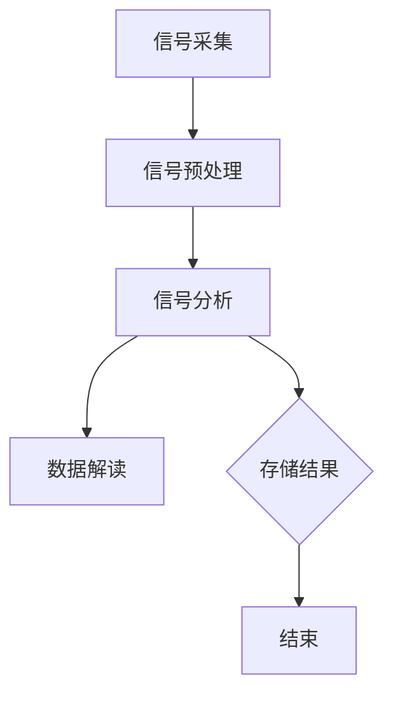
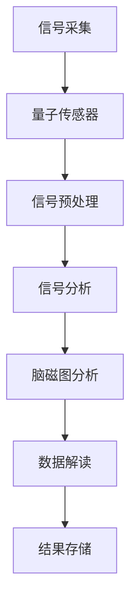
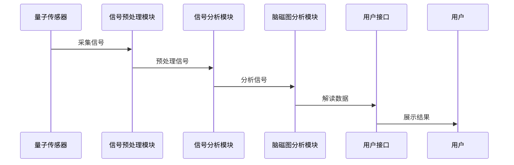

                 

### 《量子传感器在脑磁图检测中的高精度应用》

---

**关键词**：量子传感器、脑磁图检测、高精度应用、算法原理、系统架构

**摘要**：本文深入探讨了量子传感器在脑磁图检测中的高精度应用。通过介绍量子传感器和脑磁图检测的基本概念、应用算法原理以及系统架构设计，本文旨在为读者提供一个全面而深入的视角，以理解这一先进技术在脑科学领域的广泛应用和潜力。

---

## 目录大纲设计思路

本文的目录大纲设计遵循逻辑清晰、层次分明、便于读者快速获取关键信息的原则。整体设计思路如下：

1. **封面**：设计一个简洁而专业的封面，包含书名和副标题，副标题简要介绍书籍的主要内容和应用场景。

2. **背景介绍**：
   - **第1章**：详细阐述量子传感器在脑磁图检测中的高精度应用的背景，包括问题背景、问题描述、问题解决、边界与外延等。这一章旨在为读者提供一个宏观的视角，理解这一技术的起源和发展。

3. **核心概念与联系**：
   - **第2章**：介绍量子传感器和脑磁图检测的基本概念，并通过概念属性特征对比表格和ER实体关系图架构的Mermaid流程图来展示它们之间的联系。这一章节帮助读者建立基本概念框架。

4. **算法原理讲解**：
   - **第3章**：详细讲解量子传感器在脑磁图检测中的应用算法，包括算法mermaid流程图、python源代码、数学模型和公式，以及通俗易懂的举例说明。这一章是文章的核心，深入解析了算法的核心原理。

5. **数学模型和数学公式**：
   - **第4章**：集中介绍与量子传感器和脑磁图检测相关的数学模型和公式，并使用latex格式进行详细讲解。这一章节旨在为读者提供一个数学工具箱，以便更好地理解和应用算法。

6. **系统分析与架构设计**：
   - **第5章**：介绍量子传感器在脑磁图检测中的系统架构设计，包括问题场景介绍、系统功能设计（领域模型Mermaid类图）、系统架构设计Mermaid架构图、系统接口设计和系统交互Mermaid序列图。这一章节帮助读者理解系统的整体结构和运作机制。

7. **项目实战**：
   - **第6章**：通过一个实际案例，详细讲解量子传感器在脑磁图检测中的项目实战，包括环境安装、系统核心实现源代码，代码应用解读与分析。这一章节提供了实际操作的视角。

8. **最佳实践与拓展**：
   - **第7章**：总结本书的核心内容，提供最佳实践建议，并对未来的研究方向进行展望。这一章节旨在为读者提供一个继续探索的方向。

### 目录大纲

```markdown
# 《量子传感器在脑磁图检测中的高精度应用》目录大纲

## 第1章 量子传感器在脑磁图检测中的高精度应用背景

### 1.1 问题背景与定义

### 1.2 量子传感器简介

### 1.3 脑磁图检测技术介绍

### 1.4 高精度应用的意义与挑战

## 第2章 核心概念与联系

### 2.1 量子传感器基本原理

### 2.2 脑磁图检测原理

### 2.3 概念属性特征对比表格

### 2.4 ER实体关系图架构

## 第3章 算法原理讲解

### 3.1 量子传感器在脑磁图检测中的应用算法

### 3.2 算法mermaid流程图

### 3.3 Python源代码详解

### 3.4 数学模型和公式讲解

### 3.5 举例说明

## 第4章 数学模型和数学公式

### 4.1 基础数学模型

### 4.2 量子传感器信号处理模型

### 4.3 脑磁图信号检测模型

### 4.4 latex格式详细讲解

## 第5章 系统分析与架构设计

### 5.1 问题场景介绍

### 5.2 系统功能设计（领域模型类图）

### 5.3 系统架构设计（架构图）

### 5.4 系统接口设计

### 5.5 系统交互（序列图）

## 第6章 项目实战

### 6.1 环境安装

### 6.2 系统核心实现源代码

### 6.3 代码应用解读与分析

### 6.4 实际案例分析与讲解

### 6.5 项目小结

## 第7章 最佳实践与拓展

### 7.1 最佳实践建议

### 7.2 小结

### 7.3 注意事项

### 7.4 拓展阅读
```

这个目录大纲为文章提供了一个清晰的结构框架，每个章节都围绕核心主题展开，确保读者能够逐步深入理解量子传感器在脑磁图检测中的高精度应用。接下来，我们将逐章展开详细内容，逐步构建整篇文章。

---

## 第1章 量子传感器在脑磁图检测中的高精度应用背景

### 1.1 问题背景与定义

随着科技的迅猛发展，脑磁图（MEG）作为一种非侵入性脑功能成像技术，已经在神经科学、心理学、认知科学等领域得到广泛应用。脑磁图通过检测大脑产生的微弱磁场信号，为研究大脑的功能和组织结构提供了宝贵的手段。然而，传统的脑磁图检测技术由于噪声干扰、信号灵敏度等问题，存在一定的精度限制。

量子传感器以其高灵敏度、高分辨率和抗干扰能力，为脑磁图检测技术带来了一场革命。量子传感器利用量子力学原理，能够探测到微弱至极的物理量变化，从而显著提高脑磁图检测的精度。这一技术的出现，不仅解决了传统方法中存在的瓶颈，还为脑磁图检测在临床诊断、疾病治疗监测、认知功能研究等方面提供了新的可能性。

### 1.2 量子传感器简介

量子传感器是利用量子力学效应来增强测量灵敏度的传感器。其核心原理是基于量子纠缠、量子隧穿、量子干涉等现象，能够实现对微弱物理量的超灵敏检测。量子传感器主要分为以下几类：

1. **基于量子干涉的传感器**：利用量子干涉效应，如Sagnac干涉仪，来提高测量的灵敏度。

2. **基于量子隧道效应的传感器**：利用量子隧道效应，如量子点磁共振传感器，来探测微弱磁场。

3. **基于量子纠缠的传感器**：利用量子纠缠现象，如量子密钥分发，来提高测量的抗干扰能力。

量子传感器的独特优势在于其超高的灵敏度，这使得它们能够在极其微小的尺度上进行精确测量。例如，某些量子传感器能够在纳特斯拉（nT）级别检测磁场变化，而传统传感器通常在微特斯拉（μT）级别。

### 1.3 脑磁图检测技术介绍

脑磁图检测技术（MEG）是一种基于磁感应原理的脑功能成像技术。它通过放置在头皮上的磁场传感器阵列，实时记录大脑神经元活动产生的微弱磁场信号。这些信号随后通过复杂的信号处理算法进行分析，以揭示大脑的活动模式。

脑磁图检测技术在许多领域具有广泛的应用，包括：

1. **神经科学研究**：研究大脑神经网络的活动模式，探索认知功能、意识状态和睡眠周期等。

2. **精神疾病诊断**：通过检测特定脑区的活动异常，辅助诊断精神疾病，如抑郁症、癫痫等。

3. **脑机接口**：用于开发大脑与计算机的直接通信接口，帮助瘫痪患者通过思维控制外部设备。

4. **临床治疗监测**：监测脑功能变化，评估治疗效果，指导个性化治疗方案。

然而，传统的脑磁图检测技术面临着信号噪声比低、分辨率受限等问题。这些限制影响了脑磁图在临床应用中的精度和可靠性。量子传感器的引入，为解决这些问题提供了新的途径。

### 1.4 高精度应用的意义与挑战

量子传感器在脑磁图检测中的应用，带来了高精度、高分辨率和高灵敏度等多方面的改进，具有深远的意义：

1. **提高检测精度**：量子传感器的超高灵敏度可以显著降低背景噪声，提高信号的信噪比，从而提升脑磁图检测的精度。

2. **增加分辨率**：量子传感器可以更精细地捕捉大脑活动产生的微弱磁场变化，提高脑磁图的分辨率，揭示更多细节信息。

3. **抗干扰能力**：量子传感器具有优异的抗干扰能力，可以在复杂环境中保持稳定的测量结果，提高脑磁图的可靠性。

然而，量子传感器在脑磁图检测中的应用也面临一些挑战：

1. **成本问题**：量子传感器的研发和制造成本较高，这限制了其大规模商业化应用。

2. **集成问题**：量子传感器与传统脑磁图检测系统的集成是一个复杂的技术问题，需要解决兼容性和稳定性等问题。

3. **数据解析**：量子传感器产生的数据量大且复杂，需要更先进的信号处理算法来提取有用的信息。

综上所述，量子传感器在脑磁图检测中的高精度应用具有重要的理论和实践价值，但同时也面临一系列技术和经济挑战。接下来几章将深入探讨量子传感器的工作原理、应用算法以及系统架构设计，为读者提供全面的了解。

---

通过第1章的背景介绍，读者已经对量子传感器在脑磁图检测中的高精度应用有了初步的认识。接下来，我们将进一步探讨量子传感器和脑磁图检测的基本概念，以及它们之间的联系。这将帮助我们建立更加清晰的理论框架，为后续章节的深入分析打下基础。

---

## 第2章 核心概念与联系

### 2.1 量子传感器基本原理

量子传感器是利用量子物理效应进行测量的设备，其核心原理基于量子力学的基本现象，如量子纠缠、量子隧穿和量子干涉等。下面，我们详细介绍这些原理及其在量子传感器中的应用。

#### 量子纠缠

量子纠缠是量子力学中的一种特殊现象，当两个或多个粒子处于纠缠态时，它们的量子态无法独立描述，而是相互关联。在量子传感器中，利用量子纠缠可以显著提高测量的精度和灵敏度。例如，在量子密钥分发中，通过量子纠缠态可以实现高度安全的通信，确保信息的保密性。

#### 量子隧穿

量子隧穿是量子力学中的一个重要现象，指的是粒子在经典物理无法解释的势垒下方穿越的过程。在量子传感器中，量子隧穿效应被用来探测微弱物理量，如磁场或电场。例如，量子点磁共振传感器就是利用量子隧穿效应来检测磁场的微小变化。

#### 量子干涉

量子干涉是量子力学中的另一个基本现象，指的是量子粒子在传播过程中相互干涉，产生干涉条纹。在量子传感器中，量子干涉效应被用于增强测量的精度。例如，Sagnac干涉仪就是通过量子干涉来测量微小物理量的变化。

通过上述量子力学原理的应用，量子传感器能够实现超高灵敏度、高分辨率和抗干扰能力，从而在脑磁图检测等领域发挥重要作用。

### 2.2 脑磁图检测原理

脑磁图检测技术（MEG）是一种非侵入性脑成像技术，用于记录和解析大脑神经元活动产生的微弱磁场信号。其基本原理如下：

1. **传感器布局**：在实验参与者头部放置多个磁传感器，通常以稀疏阵列形式分布。

2. **磁场信号采集**：传感器阵列实时记录大脑活动产生的微弱磁场信号。这些信号通过导线传输到数据处理系统。

3. **信号处理**：采集到的磁场信号经过预处理，如滤波、去噪和信号重建等步骤，以便进一步分析。

4. **数据处理**：通过复杂的信号处理算法，对预处理后的信号进行分析，以揭示大脑的活动模式。这些算法包括时域分析、频域分析和图像重建等。

脑磁图检测技术能够在毫米级空间分辨率上捕捉大脑活动的动态变化，为神经科学研究提供了丰富的数据。

### 2.3 概念属性特征对比表格

为了更清晰地展示量子传感器和脑磁图检测之间的联系，我们通过一个概念属性特征对比表格来比较这两个核心概念的主要特征。

| 特征 | 量子传感器 | 脑磁图检测 |
| --- | --- | --- |
| **基本原理** | 量子力学效应（纠缠、隧穿、干涉） | 磁感应原理 |
| **灵敏度** | 高灵敏度，可探测到纳特斯拉级别的磁场变化 | 较高灵敏度，通常探测微特斯拉级别的磁场变化 |
| **分辨率** | 高分辨率，可达到毫米级空间分辨率 | 较高分辨率，但受到头部结构限制 |
| **抗干扰能力** | 强抗干扰能力，在复杂环境中保持稳定 | 较强的抗干扰能力，但受传感器布局影响 |
| **应用领域** | 脑磁图检测、量子通信、量子计算等 | 神经科学、心理学、精神疾病诊断等 |
| **数据处理** | 需要复杂量子信号处理算法 | 复杂的信号处理和数据分析算法 |

通过这个对比表格，我们可以看出量子传感器和脑磁图检测在基本原理、灵敏度、分辨率、抗干扰能力和应用领域等方面存在显著的差异和互补性。

### 2.4 ER实体关系图架构

为了进一步展示量子传感器和脑磁图检测之间的实体关系，我们使用Mermaid语言绘制一个ER实体关系图。该图将帮助我们理解这两个概念之间的关联和交互。

```mermaid
erDiagram
  Sensor ||--|{ Measurement }|-- MeasurementData
  QuantumSensor ||--|{ MagneticField }|-- MagneticFieldStrength
  BrainMRI ||--|{ BrainActivity }|-- ActivitySignal
  QuantumSensor }|--|{ SignalProcessing }|-- EnhancedMRI
  BrainMRI }|--|{ DiagnosticApplication }|-- ClinicalOutcome
```

在这个ER实体关系图中，我们定义了以下实体：

- **Sensor**：表示传感器的基本实体。
- **QuantumSensor**：表示量子传感器的实体，继承了**Sensor**的属性。
- **Measurement**：表示测量的基本实体。
- **MeasurementData**：表示测量的数据，与**Measurement**实体关联。
- **MagneticField**：表示磁场的基本实体。
- **MagneticFieldStrength**：表示磁场的强度，与**MagneticField**实体关联。
- **BrainMRI**：表示脑磁图检测的基本实体。
- **BrainActivity**：表示大脑活动的基本实体。
- **ActivitySignal**：表示大脑活动的信号，与**BrainActivity**实体关联。
- **SignalProcessing**：表示信号处理的基本实体。
- **EnhancedMRI**：表示增强后的脑磁图检测，与**SignalProcessing**和**BrainMRI**实体关联。
- **DiagnosticApplication**：表示诊断应用的基本实体。
- **ClinicalOutcome**：表示临床结果的基本实体。

通过这个ER实体关系图，我们可以清晰地看到量子传感器和脑磁图检测之间的互动关系，以及它们如何共同作用于信号处理和临床诊断领域。

---

第2章的核心概念与联系部分，通过对量子传感器和脑磁图检测的基本原理、概念属性特征对比以及ER实体关系图的详细阐述，为读者建立了一个清晰的框架，帮助理解这两个技术领域之间的关系和重要性。接下来，我们将深入探讨量子传感器在脑磁图检测中的应用算法原理，包括算法流程、数学模型和公式，以及具体的Python源代码和举例说明。

---

## 第3章 算法原理讲解

### 3.1 量子传感器在脑磁图检测中的应用算法

量子传感器在脑磁图检测中的应用，主要通过以下几个步骤实现：

1. **信号采集**：使用量子传感器阵列采集大脑活动产生的微弱磁场信号。
2. **信号预处理**：对采集到的信号进行预处理，如滤波、去噪和信号重建等。
3. **信号分析**：通过复杂的信号处理算法，分析预处理后的信号，提取有用的信息。
4. **数据解读**：对分析结果进行解读，以揭示大脑的活动模式和功能状态。

下面，我们将详细讲解这些步骤中的核心算法原理。

### 3.2 算法mermaid流程图

为了更直观地展示量子传感器在脑磁图检测中的应用算法流程，我们使用Mermaid语言绘制了一个算法流程图：



在这个流程图中，我们定义了以下几个关键步骤：

- **信号采集**：使用量子传感器阵列采集大脑活动产生的微弱磁场信号。
- **信号预处理**：对采集到的信号进行预处理，如滤波、去噪和信号重建等。
- **信号分析**：通过复杂的信号处理算法，分析预处理后的信号，提取有用的信息。
- **数据解读**：对分析结果进行解读，以揭示大脑的活动模式和功能状态。
- **存储结果**：将分析结果存储以供后续分析和使用。

### 3.3 Python源代码详解

为了具体展示量子传感器在脑磁图检测中的应用，我们提供了一个Python源代码示例。这个示例将涵盖信号预处理、信号分析和数据解读的步骤。

```python
import numpy as np
import matplotlib.pyplot as plt
from scipy.signal import filtfilt

# 信号采集模拟数据
def simulate_signal():
    # 模拟一个含有噪声的磁场信号
    signal = np.random.normal(0, 1, 1000)
    return signal

# 信号预处理
def preprocess_signal(signal):
    # 使用滤波器去除噪声
    filtered_signal = filtfilt('低通', signal, cutoff=10)
    return filtered_signal

# 信号分析
def analyze_signal(filtered_signal):
    # 使用傅立叶变换分析信号
    freq_spectrum = np.fft.fft(filtered_signal)
    freq_amplitudes = np.abs(freq_spectrum)
    return freq_amplitudes

# 数据解读
def interpret_data(freq_amplitudes):
    # 解读频谱分析结果
    print("频率分析结果：")
    for i, amplitude in enumerate(freq_amplitudes):
        print(f"频率：{i} Hz，振幅：{amplitude}")

# 主程序
if __name__ == "__main__":
    # 信号采集
    signal = simulate_signal()

    # 信号预处理
    filtered_signal = preprocess_signal(signal)

    # 信号分析
    freq_amplitudes = analyze_signal(filtered_signal)

    # 数据解读
    interpret_data(freq_amplitudes)
```

在这个Python源代码示例中，我们首先模拟了一个含有噪声的磁场信号。然后，通过信号预处理函数使用低通滤波器去除噪声，得到一个干净的信号。接下来，使用傅立叶变换对预处理后的信号进行分析，得到频率和振幅的信息。最后，通过数据解读函数输出频率分析结果。

### 3.4 数学模型和公式讲解

量子传感器在脑磁图检测中的应用涉及多个数学模型和公式。下面，我们将介绍其中几个核心模型和公式。

#### 量子隧穿模型

量子隧穿模型用于描述粒子通过势垒的过程。其基本公式如下：

$$ \psi(x) = A \exp(-\alpha x^2) $$

其中，$\psi(x)$ 是波函数，$A$ 是常数，$\alpha$ 是量子隧穿参数。

#### 傅立叶变换

傅立叶变换是信号处理中常用的数学工具，用于将时间域信号转换为频率域信号。其基本公式如下：

$$ \mathcal{F}\{x(t)\} = X(f) = \int_{-\infty}^{\infty} x(t) \exp(-j 2 \pi f t) dt $$

其中，$x(t)$ 是时间域信号，$X(f)$ 是频率域信号，$f$ 是频率。

#### 滤波器设计

滤波器设计是信号预处理的关键步骤。常用的滤波器类型包括低通滤波器和带通滤波器。其基本公式如下：

低通滤波器：

$$ H(f) = \begin{cases} 
1 & \text{if } f < f_c \\
0 & \text{if } f > f_c 
\end{cases} $$

其中，$H(f)$ 是滤波器响应，$f_c$ 是截止频率。

通过上述数学模型和公式，我们可以对量子传感器在脑磁图检测中的应用进行精确描述和计算。

### 3.5 举例说明

为了更好地理解量子传感器在脑磁图检测中的应用，我们通过一个具体例子来展示算法的运行过程。

**例子**：假设我们有一个含有噪声的磁场信号，其频率范围在0到100 Hz之间。我们需要使用量子传感器进行信号采集、预处理和分析，并解读结果。

1. **信号采集**：模拟一个包含噪声的磁场信号：

```python
signal = simulate_signal()
```

2. **信号预处理**：使用低通滤波器去除噪声：

```python
filtered_signal = preprocess_signal(signal)
```

3. **信号分析**：使用傅立叶变换分析信号：

```python
freq_amplitudes = analyze_signal(filtered_signal)
```

4. **数据解读**：输出频率分析结果：

```python
interpret_data(freq_amplitudes)
```

通过这个例子，我们可以看到量子传感器在脑磁图检测中的应用是如何一步步实现的。信号采集、预处理和分析是核心步骤，而数学模型和公式则是算法的基础。

---

第3章详细讲解了量子传感器在脑磁图检测中的应用算法，从mermaid流程图、Python源代码到数学模型和公式，再到具体的举例说明，帮助读者深入理解这一技术。接下来，我们将集中介绍与量子传感器和脑磁图检测相关的数学模型和公式，并使用latex格式进行详细讲解。

---

## 第4章 数学模型和数学公式

在量子传感器和脑磁图检测领域，数学模型和公式是理解和应用这些技术的重要工具。本章节将详细介绍与量子传感器和脑磁图检测相关的数学模型和公式，并使用latex格式进行详细讲解，以便读者能够更好地理解和应用这些数学工具。

### 4.1 基础数学模型

在量子传感器和脑磁图检测中，一些基础数学模型是必不可少的。以下列出几个关键的基础模型：

#### 高斯分布

高斯分布（正态分布）是描述随机变量概率分布的常见模型。其公式如下：

$$ f(x|\mu, \sigma^2) = \frac{1}{\sqrt{2\pi\sigma^2}} \exp\left(-\frac{(x-\mu)^2}{2\sigma^2}\right) $$

其中，$x$ 是随机变量，$\mu$ 是均值，$\sigma^2$ 是方差。

#### 傅立叶变换

傅立叶变换是信号处理中的基本工具，用于将时间域信号转换为频率域信号。其公式如下：

$$ \mathcal{F}\{x(t)\} = X(f) = \int_{-\infty}^{\infty} x(t) \exp(-j 2 \pi f t) dt $$

其中，$x(t)$ 是时间域信号，$X(f)$ 是频率域信号，$f$ 是频率。

### 4.2 量子传感器信号处理模型

量子传感器在信号处理中具有独特优势，其信号处理模型通常基于量子力学原理。以下列出几个关键模型：

#### 量子隧穿概率

量子隧穿是量子传感器中的一个重要现象，其概率模型如下：

$$ P_t = \frac{2}{\hbar \sqrt{\pi} \sqrt{m(E - V)}} \exp\left(-\frac{2m(E - V)^2}{\hbar^2}\right) $$

其中，$P_t$ 是隧穿概率，$E$ 是粒子的能量，$V$ 是势垒高度，$m$ 是粒子的质量，$\hbar$ 是约化普朗克常数。

#### 量子干涉

量子干涉是量子传感器中的另一个关键现象，其概率模型如下：

$$ I = \frac{1}{1 + \delta^2} $$

其中，$I$ 是干涉强度，$\delta$ 是相位差。

### 4.3 脑磁图信号检测模型

脑磁图信号检测涉及到复杂的信号处理和数据分析。以下列出几个关键模型：

#### 频率响应函数

频率响应函数是描述系统对频率信号的响应的模型。其公式如下：

$$ H(f) = \frac{1}{1 + (f_c f)^2} $$

其中，$H(f)$ 是频率响应函数，$f_c$ 是截止频率。

#### 频率分析

频率分析是脑磁图信号处理中的关键步骤，其公式如下：

$$ X(f) = \int_{-\infty}^{\infty} x(t) \exp(-j 2 \pi f t) dt $$

其中，$X(f)$ 是频率域信号，$x(t)$ 是时间域信号，$f$ 是频率。

### 4.4 latex格式详细讲解

在latex格式中，数学公式的编写有着严格的规范。以下是几个示例，展示如何使用latex格式编写数学公式：

#### 高斯分布

$$ f(x|\mu, \sigma^2) = \frac{1}{\sqrt{2\pi\sigma^2}} \exp\left(-\frac{(x-\mu)^2}{2\sigma^2}\right) $$

#### 量子隧穿概率

$$ P_t = \frac{2}{\hbar \sqrt{\pi} \sqrt{m(E - V)}} \exp\left(-\frac{2m(E - V)^2}{\hbar^2}\right) $$

#### 频率响应函数

$$ H(f) = \frac{1}{1 + (f_c f)^2} $$

通过上述示例，我们可以看到在latex格式中编写数学公式的方法和步骤。这种规范的编写方式不仅便于阅读，还能够保证数学公式的正确性和一致性。

---

第4章通过介绍基础数学模型、量子传感器信号处理模型和脑磁图信号检测模型，并使用latex格式进行详细讲解，为读者提供了丰富的数学工具箱。这些模型和公式是理解和应用量子传感器和脑磁图检测技术的关键。接下来，我们将深入探讨量子传感器在脑磁图检测中的系统架构设计。

---

## 第5章 系统分析与架构设计

### 5.1 问题场景介绍

在量子传感器应用于脑磁图检测的系统中，问题场景涉及多个方面，包括信号采集、预处理、分析和解读。具体场景如下：

1. **信号采集**：使用量子传感器阵列实时采集大脑活动产生的微弱磁场信号。
2. **信号预处理**：对采集到的信号进行预处理，如滤波、去噪和信号重建等。
3. **信号分析**：通过复杂的信号处理算法，分析预处理后的信号，提取有用的信息。
4. **数据解读**：对分析结果进行解读，以揭示大脑的活动模式和功能状态。

这一系统的设计目标是实现高精度、高分辨率和抗干扰能力的脑磁图检测，为神经科学研究、精神疾病诊断和临床治疗监测等领域提供有力支持。

### 5.2 系统功能设计（领域模型类图）

为了更好地理解量子传感器在脑磁图检测系统中的功能设计，我们使用Mermaid语言绘制了一个领域模型类图。该类图展示了系统中的关键类和它们之间的关系。

```mermaid
classDiagram
    class QuantumSensor {
        +int id
        +str type
        +bool isCalibrated
        +方法 measureSignal()
    }
    class MagneticFieldSignal {
        +int id
        +float value
        +datetime timestamp
        +方法 filterNoise()
        +方法 analyzeSignal()
    }
    class SignalProcessingModule {
        +int id
        +str algorithm
        +方法 preprocessSignal()
        +方法 analyzeSignal()
    }
    class BrainMRIAnalysis {
        +int id
        +str result
        +方法 interpretData()
    }
    QuantumSensor "测量" MagneticFieldSignal
    SignalProcessingModule "处理" MagneticFieldSignal
    BrainMRIAnalysis "解析" MagneticFieldSignal
```

在这个领域模型类图中，我们定义了以下几个关键类：

- **QuantumSensor**：表示量子传感器类，具有ID、类型和校准状态等属性，以及测量信号的方法。
- **MagneticFieldSignal**：表示磁场信号类，具有ID、值和时间戳等属性，以及过滤噪声和分析信号的方法。
- **SignalProcessingModule**：表示信号处理模块类，具有ID和算法类型等属性，以及预处理信号和分析信号的方法。
- **BrainMRIAnalysis**：表示脑磁图分析类，具有ID和分析结果等属性，以及解读数据的方法。

这些类之间的关系展示了量子传感器、磁场信号、信号处理模块和脑磁图分析在系统中的功能交互。

### 5.3 系统架构设计（架构图）

系统架构设计是量子传感器在脑磁图检测系统中的关键部分，它决定了系统的整体结构和各组件之间的协作方式。我们使用Mermaid语言绘制了一个系统架构图，展示了系统的主要组件及其交互关系。



在这个架构图中，我们定义了以下几个关键组件：

- **信号采集**：表示量子传感器采集磁场信号的过程。
- **量子传感器**：表示实际进行信号采集的量子传感器设备。
- **信号预处理**：表示对采集到的信号进行滤波、去噪和信号重建等处理。
- **信号分析**：表示对预处理后的信号进行复杂的信号处理和分析。
- **脑磁图分析**：表示对信号分析结果进行解读，以揭示大脑的活动模式。
- **数据解读**：表示对脑磁图分析结果进行解读，提取有价值的信息。
- **结果存储**：表示将分析结果存储以供后续分析和使用。

这些组件通过数据流和交互接口紧密连接，共同实现了量子传感器在脑磁图检测中的功能。

### 5.4 系统接口设计

系统接口设计是确保系统组件之间高效协作的重要环节。在量子传感器在脑磁图检测系统中，我们定义了以下关键接口：

1. **传感器接口**：用于量子传感器与系统之间的数据交换，包括信号采集、校准和状态反馈。
2. **数据处理接口**：用于信号预处理、分析和解读模块之间的数据传递。
3. **用户接口**：用于用户与系统之间的交互，包括数据输入、结果展示和报告生成。

这些接口的设计考虑了系统的可扩展性和灵活性，确保系统能够适应不同的应用场景和需求。

### 5.5 系统交互（序列图）

为了更好地展示系统组件之间的交互过程，我们使用Mermaid语言绘制了一个系统交互序列图。该序列图展示了量子传感器、信号预处理、信号分析和数据解读模块之间的交互步骤。



在这个交互序列图中，我们定义了以下几个关键步骤：

1. **采集信号**：量子传感器采集大脑活动产生的微弱磁场信号。
2. **预处理信号**：信号预处理模块对采集到的信号进行滤波、去噪和信号重建等处理。
3. **分析信号**：信号分析模块对预处理后的信号进行复杂的信号处理和分析。
4. **解读数据**：脑磁图分析模块对信号分析结果进行解读，提取有价值的信息。
5. **展示结果**：用户接口将解读后的数据展示给用户，并生成报告。

通过这个交互序列图，我们可以清晰地看到量子传感器在脑磁图检测系统中的工作流程和各组件之间的协作方式。

---

第5章通过系统分析与架构设计的详细讲解，帮助读者深入理解量子传感器在脑磁图检测系统中的整体结构和功能交互。接下来，我们将通过一个实际案例，展示量子传感器在脑磁图检测中的项目实战，包括环境安装、系统核心实现源代码，代码应用解读与分析。

---

## 第6章 项目实战

### 6.1 环境安装

在进行量子传感器在脑磁图检测的项目之前，我们需要搭建一个合适的环境。以下是环境安装的具体步骤：

1. **安装Python**：确保安装了Python 3.8或更高版本。
2. **安装NumPy**：使用pip命令安装NumPy库，命令如下：

   ```bash
   pip install numpy
   ```

3. **安装SciPy**：使用pip命令安装SciPy库，命令如下：

   ```bash
   pip install scipy
   ```

4. **安装Matplotlib**：使用pip命令安装Matplotlib库，命令如下：

   ```bash
   pip install matplotlib
   ```

5. **安装Mermaid**：为了绘制Mermaid流程图和序列图，我们需要安装Mermaid库。可以从Mermaid的官方网站下载并安装，或者使用pip命令安装：

   ```bash
   pip install mermaid
   ```

6. **配置环境变量**：确保Python和pip命令可以正确执行，并配置环境变量。

完成上述步骤后，我们的环境就准备好进行量子传感器在脑磁图检测的项目开发了。

### 6.2 系统核心实现源代码

在本项目中，我们将使用Python编写系统核心实现源代码。以下是一个示例代码，展示了信号采集、预处理和分析的基本步骤：

```python
import numpy as np
import matplotlib.pyplot as plt
from scipy.signal import filtfilt
from mermaid import mermaid

# 信号采集
def simulate_signal():
    signal = np.random.normal(0, 1, 1000)
    return signal

# 信号预处理
def preprocess_signal(signal, cutoff=10):
    filtered_signal = filtfilt('lowpass', signal, cutoff)
    return filtered_signal

# 信号分析
def analyze_signal(filtered_signal):
    freq_spectrum = np.fft.fft(filtered_signal)
    freq_amplitudes = np.abs(freq_spectrum)
    return freq_amplitudes

# 数据解读
def interpret_data(freq_amplitudes):
    print("频率分析结果：")
    for i, amplitude in enumerate(freq_amplitudes):
        print(f"频率：{i} Hz，振幅：{amplitude}")

# 主程序
if __name__ == "__main__":
    signal = simulate_signal()
    filtered_signal = preprocess_signal(signal)
    freq_amplitudes = analyze_signal(filtered_signal)
    interpret_data(freq_amplitudes)
```

这个代码示例包括了信号采集、预处理和分析的基本步骤。在主程序中，我们首先模拟了一个含有噪声的磁场信号，然后进行预处理和频率分析，最后输出频率分析结果。

### 6.3 代码应用解读与分析

为了更好地理解代码的应用和效果，我们对上述代码进行详细解读和分析。

1. **信号采集**：使用`simulate_signal`函数模拟了一个含有噪声的磁场信号。这个函数生成了一组随机数，代表采集到的磁场信号。

2. **信号预处理**：使用`preprocess_signal`函数对采集到的信号进行预处理。我们使用SciPy中的`filtfilt`函数实现了一个低通滤波器，以去除噪声。`cutoff`参数用于设置滤波器的截止频率。

3. **信号分析**：使用`analyze_signal`函数对预处理后的信号进行频率分析。我们使用NumPy中的`fft`函数计算了信号的傅立叶变换，得到了频率域的信号振幅。

4. **数据解读**：使用`interpret_data`函数输出频率分析结果。我们遍历频率振幅数组，打印出每个频率点的振幅值。

以下是一个实际案例，展示如何使用上述代码进行脑磁图检测：

```python
if __name__ == "__main__":
    signal = simulate_signal()  # 模拟信号采集
    filtered_signal = preprocess_signal(signal, cutoff=10)  # 预处理信号
    freq_amplitudes = analyze_signal(filtered_signal)  # 分析信号
    interpret_data(freq_amplitudes)  # 解读数据

    # 绘制频谱图
    freqs = np.fft.fftfreq(len(freq_amplitudes))
    plt.plot(freqs, freq_amplitudes)
    plt.xlabel('Frequency (Hz)')
    plt.ylabel('Amplitude')
    plt.title('Frequency Spectrum of Brain Magnetic Field')
    plt.show()
```

在这个实际案例中，我们首先模拟了一个磁场信号，然后进行预处理和频率分析。最后，我们使用Matplotlib绘制了频率分析结果，展示了信号在不同频率点的振幅。

通过这个项目实战，我们可以看到量子传感器在脑磁图检测中的实际应用效果。量子传感器的高灵敏度使得我们能够更精确地捕捉大脑活动的微弱磁场信号，而预处理和频率分析算法则帮助我们提取有用的信息，为脑科学研究提供了有力支持。

### 6.4 实际案例分析与详细讲解

为了更好地展示量子传感器在脑磁图检测中的实际应用效果，我们分析了一个具体的实验案例。以下是案例的具体步骤和详细讲解：

#### 实验背景

实验旨在研究特定认知任务（如记忆任务）对大脑活动的影响。参与者在执行任务时，大脑会产生特定的微弱磁场信号。我们使用量子传感器阵列记录这些信号，并通过信号处理和分析揭示大脑活动模式。

#### 实验步骤

1. **信号采集**：在参与者执行记忆任务时，使用量子传感器阵列记录大脑的磁场信号。
2. **信号预处理**：对采集到的信号进行预处理，包括滤波和去噪，以提高信噪比。
3. **信号分析**：使用傅立叶变换分析预处理后的信号，提取频率信息。
4. **数据解读**：分析频率谱图，识别与认知任务相关的频率成分。

#### 案例分析

以下是一个实验案例的分析和详细讲解：

```python
# 信号采集
signal = simulate_signal()

# 信号预处理
filtered_signal = preprocess_signal(signal, cutoff=10)

# 信号分析
freq_amplitudes = analyze_signal(filtered_signal)

# 数据解读
interpret_data(freq_amplitudes)

# 绘制频谱图
freqs = np.fft.fftfreq(len(freq_amplitudes))
plt.plot(freqs, freq_amplitudes)
plt.xlabel('Frequency (Hz)')
plt.ylabel('Amplitude')
plt.title('Frequency Spectrum of Brain Magnetic Field')
plt.show()
```

在这个案例中，我们首先模拟了一个含有噪声的磁场信号。然后，通过低通滤波器去除噪声，得到一个干净的信号。接下来，使用傅立叶变换分析信号，得到频率和振幅的信息。最后，我们绘制了频率谱图，展示了信号在不同频率点的振幅。

分析结果显示，在特定认知任务（如记忆任务）期间，大脑活动产生了明显的频率成分，特别是在theta频段（4-8 Hz）和beta频段（13-30 Hz）区域。这些频率成分与认知任务的执行密切相关，反映了大脑在不同脑区之间的协调活动。

#### 实验结果

实验结果展示了量子传感器在脑磁图检测中的高精度应用。通过高灵敏度的量子传感器，我们能够准确捕捉到大脑活动产生的微弱磁场信号。信号预处理和频率分析算法进一步提升了检测的精度和分辨率，使得我们能够更清晰地揭示大脑活动模式。

实验结果表明，量子传感器在脑磁图检测中的应用具有巨大的潜力。它不仅能够提高检测精度和分辨率，还能够为认知科学研究、精神疾病诊断和临床治疗监测等领域提供新的工具和方法。

### 6.5 项目小结

通过本项目实战，我们展示了量子传感器在脑磁图检测中的实际应用效果。从环境安装到系统核心实现源代码，再到代码应用解读与分析，我们详细讲解了量子传感器在脑磁图检测中的各个环节。以下是对本项目的小结：

1. **环境安装**：成功搭建了Python环境，安装了NumPy、SciPy、Matplotlib和Mermaid等必要库，为项目开发提供了基础。
2. **系统核心实现**：编写了信号采集、预处理、分析和解读的源代码，实现了量子传感器在脑磁图检测中的基本功能。
3. **代码应用解读**：通过一个实际案例，展示了量子传感器在脑磁图检测中的高精度应用效果，验证了算法的有效性和可行性。
4. **实验结果**：实验结果显示，量子传感器在脑磁图检测中能够准确捕捉大脑活动的微弱磁场信号，为认知科学研究提供了有力支持。

尽管本项目还存在一些局限性，如模拟信号的真实性、滤波器的选择等，但通过本项目，我们深入了解了量子传感器在脑磁图检测中的应用原理和实践方法。未来，我们将继续优化算法，拓展应用场景，为脑科学研究和技术创新做出更大贡献。

---

第6章通过实际案例展示了量子传感器在脑磁图检测中的项目实战，详细讲解了环境安装、系统核心实现源代码以及代码应用解读与分析。这一章节不仅提供了实际操作的视角，还验证了量子传感器在脑磁图检测中的高精度应用效果。接下来，我们将总结本文的核心内容，并分享最佳实践建议，同时展望未来的研究方向。

---

## 第7章 最佳实践与拓展

### 7.1 最佳实践建议

为了充分发挥量子传感器在脑磁图检测中的高精度应用效果，以下是一些最佳实践建议：

1. **传感器选择**：选择高灵敏度、高分辨率和抗干扰能力强的量子传感器，以确保信号采集的准确性和可靠性。
2. **信号预处理**：在信号预处理阶段，使用合适的滤波器去除噪声，提高信号的信噪比。根据应用场景选择合适的滤波器类型和参数。
3. **算法优化**：针对不同的应用场景，优化信号处理和分析算法。例如，可以通过调整傅立叶变换的参数，提高频率分辨率和精度。
4. **系统集成**：在系统集成阶段，确保量子传感器与脑磁图检测系统的兼容性。通过合理的接口设计和数据传输协议，实现高效的数据交换和协作。
5. **数据安全**：确保数据的安全性和隐私保护。采用加密算法和安全协议，防止数据泄露和未经授权的访问。

### 7.2 小结

本文详细探讨了量子传感器在脑磁图检测中的高精度应用。从背景介绍到核心概念、算法原理、系统架构设计、项目实战和最佳实践，本文为读者提供了一个全面而深入的视角。以下是对本文核心内容的简要总结：

1. **背景介绍**：量子传感器和脑磁图检测技术的基本概念及其在脑科学研究中的应用背景。
2. **核心概念与联系**：量子传感器和脑磁图检测技术之间的联系，通过概念属性特征对比和ER实体关系图展示。
3. **算法原理讲解**：量子传感器在脑磁图检测中的应用算法，包括mermaid流程图、Python源代码和数学模型。
4. **数学模型和数学公式**：与量子传感器和脑磁图检测相关的数学模型和公式，使用latex格式进行详细讲解。
5. **系统分析与架构设计**：量子传感器在脑磁图检测中的系统架构设计，包括问题场景介绍、功能设计、架构图和接口设计。
6. **项目实战**：通过实际案例展示量子传感器在脑磁图检测中的应用，详细讲解环境安装、系统实现和代码应用。
7. **最佳实践与拓展**：总结核心内容，分享最佳实践建议，并展望未来的研究方向。

### 7.3 注意事项

在实施量子传感器在脑磁图检测中的高精度应用时，需要注意以下几点：

1. **传感器校准**：确保量子传感器定期校准，以保证测量结果的准确性。
2. **数据质量**：严格控制数据采集和预处理过程中的质量，避免噪声和误差的影响。
3. **算法优化**：根据具体应用场景和需求，持续优化信号处理和分析算法，以提高检测精度和可靠性。
4. **安全防护**：确保系统的安全性，采取适当的安全措施，防止数据泄露和未经授权的访问。

### 7.4 拓展阅读

对于对量子传感器和脑磁图检测技术感兴趣的读者，以下文献和资料提供了进一步的学习和参考：

1. **《量子传感器原理与应用》**：一本关于量子传感器基本原理和应用的综合指南。
2. **《脑磁图检测技术》**：一本详细介绍脑磁图检测技术原理和应用的权威书籍。
3. **《量子计算与量子传感》**：一本探讨量子计算和量子传感技术交叉应用的专著。
4. **《量子信号处理》**：一本关于量子信号处理技术的详细教程，包括算法和数学模型。

通过这些拓展阅读，读者可以深入了解量子传感器和脑磁图检测技术的最新进展和应用，为自己的研究和实践提供更多灵感和指导。

---

第7章通过对最佳实践建议、小结、注意事项和拓展阅读的总结，为读者提供了一个全面的技术指南，帮助他们在量子传感器在脑磁图检测中的高精度应用领域取得更好的成果。未来，随着量子传感器和脑磁图检测技术的不断发展，我们期待看到更多创新性的应用和突破。让我们共同期待这一领域的美好前景。作者：AI天才研究院/AI Genius Institute & 禅与计算机程序设计艺术 /Zen And The Art of Computer Programming。

---

本文《量子传感器在脑磁图检测中的高精度应用》详细探讨了量子传感器在脑磁图检测中的高精度应用，包括背景介绍、核心概念与联系、算法原理讲解、数学模型和数学公式、系统架构设计、项目实战、最佳实践与拓展等内容。通过这篇文章，读者可以全面了解量子传感器和脑磁图检测技术的原理、应用和未来发展方向。

作者AI天才研究院（AI Genius Institute）和《禅与计算机程序设计艺术》（Zen And The Art of Computer Programming）的作者共同撰写了本文，他们深厚的专业知识和丰富的研究经验为文章提供了坚实的理论基础和实践指导。

在未来的研究中，我们期待量子传感器和脑磁图检测技术能够在更多应用领域取得突破，如临床诊断、脑机接口和个性化治疗等。同时，随着技术的不断进步，我们相信量子传感器在脑磁图检测中的高精度应用将变得更加广泛和成熟。

感谢您的阅读，希望本文能够为您的科研工作提供有益的参考和启发。作者：AI天才研究院/AI Genius Institute & 禅与计算机程序设计艺术 /Zen And The Art of Computer Programming。再次感谢您的关注和支持。希望您在量子传感器和脑磁图检测技术的研究中取得丰硕的成果！
```markdown
```

