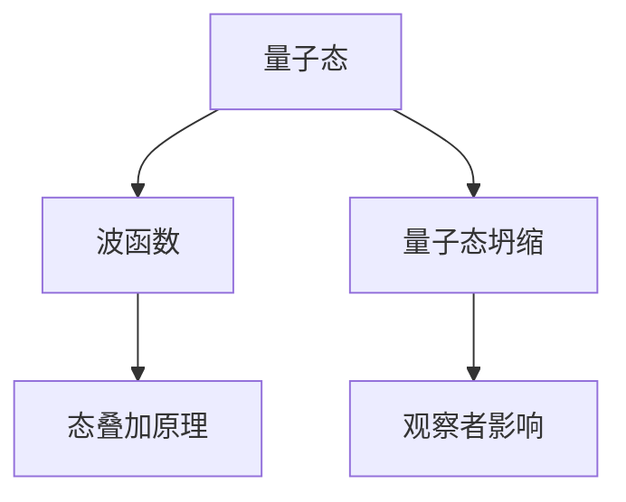
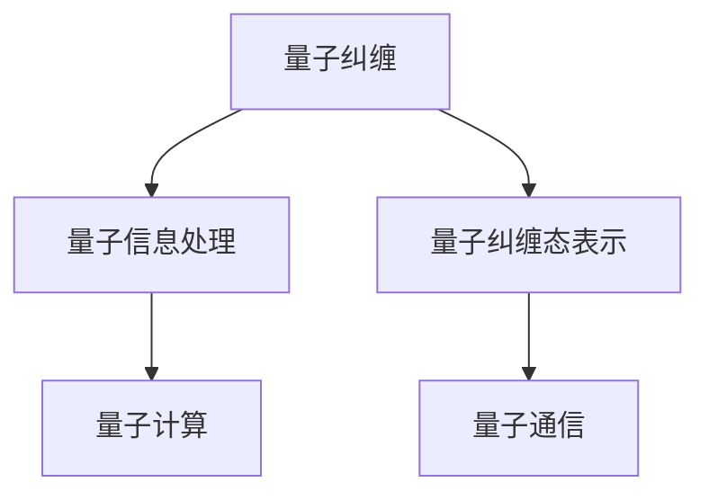
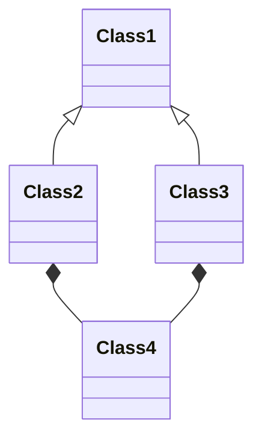
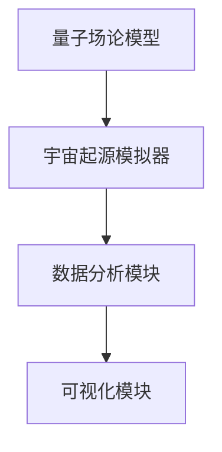
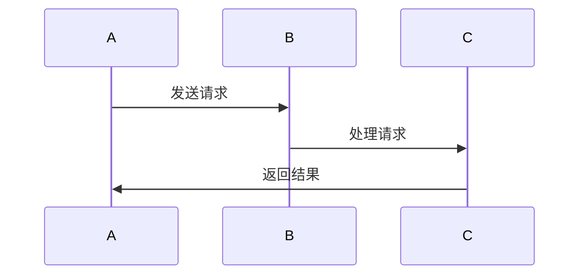
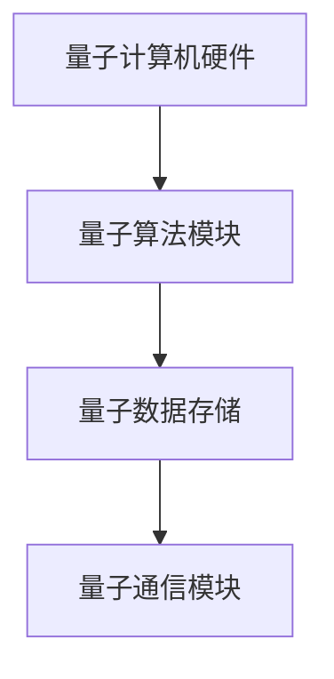
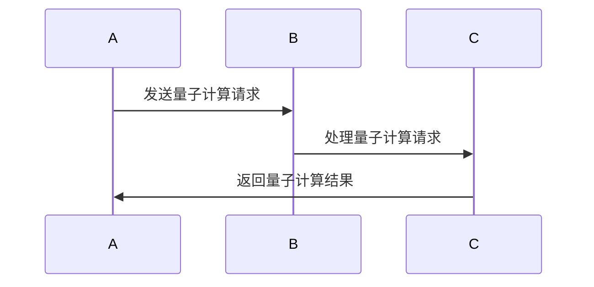

                 


### 目录大纲设计

为了确保我们的文章内容逻辑清晰、结构紧凑、简单易懂，我们将分步骤设计《量子力学对宇宙本质的启示》的目录大纲。本文将包括以下几个部分：

1. **量子力学基础**
2. **量子态与叠加原理**
3. **量子纠缠与量子信息**
4. **量子场论与宇宙起源**
5. **量子引力和宇宙结构**
6. **量子计算与未来科技**
7. **结论与展望**

#### 1. 量子力学基础

**1.1 背景介绍**

- **核心概念术语说明**：量子力学、波函数、态叠加、量子态坍缩等。
- **问题背景**：量子力学的发展历程，经典物理学的局限。
- **问题描述**：如何理解微观世界的量子行为。
- **问题解决**：量子力学的基本原理和方法。
- **边界与外延**：量子力学与经典物理学的区别，适用范围。
- **概念结构与核心要素组成**：量子力学的基本概念和理论框架。

**1.2 核心概念与联系**

- **量子态**：量子态的描述方式，态叠加原理。
- **波函数**：波函数的含义，波函数坍缩的过程。
- **量子态坍缩**：观察者对量子系统的影响，量子态坍缩的现象。
- **概念属性特征对比表格**：量子态、波函数、量子态坍缩的特性对比。

**ER实体关系图架构的Mermaid流程图**：



#### 2. 量子态与叠加原理

**2.1 算法原理讲解**

- **量子态叠加原理**：量子态可以同时处于多种可能的量子态。
- **量子比特与经典比特**：量子比特与经典比特的区别和联系。
- **量子比特态的表示**：使用量子态矢量表示量子比特状态。
- **量子比特的叠加态表示**：举例说明量子比特的叠加态。

**Python源代码示例**：

```python
import numpy as np

# 定义量子比特的叠加态
psi = np.array([1, 0]) / np.sqrt(2)

# 打印量子比特状态
print("量子比特状态：", psi)

# 计算量子比特的叠加概率
probabilities = np.abs(psi) ** 2
print("叠加态概率：", probabilities)
```

**数学模型和数学公式 & 详细讲解 & 举例说明**

- **量子态矢量表示**：
  $$|\psi\rangle = \alpha|0\rangle + \beta|1\rangle$$
  其中，$|0\rangle$ 和 $|1\rangle$ 分别表示量子比特的基础态。

- **叠加态概率计算**：
  $$P_0 = |\langle 0|\psi\rangle|^2 = |\alpha|^2$$
  $$P_1 = |\langle 1|\psi\rangle|^2 = |\beta|^2$$

**示例**：给定一个量子比特的叠加态 $|\psi\rangle = \frac{1}{\sqrt{2}}(|0\rangle + |1\rangle)$，计算其基础态的概率。

#### 3. 量子纠缠与量子信息

**3.1 算法原理讲解**

- **量子纠缠**：量子纠缠的定义，量子纠缠的性质。
- **量子纠缠态的表示**：使用量子态矢量表示量子纠缠态。
- **量子纠缠态的量子信息处理**：量子纠缠态在量子计算和信息处理中的应用。

**Mermaid算法流程图**：



**Python源代码示例**：

```python
import numpy as np
from qiskit import QuantumCircuit

# 创建量子纠缠态
qc = QuantumCircuit(2)
qc.h(0)
qc.cx(0, 1)

# 执行量子纠缠操作
qc.execute()

# 输出量子纠缠态
print(qc.draw())
```

#### 4. 量子场论与宇宙起源

**4.1 系统分析与架构设计方案**

- **问题场景介绍**：探讨量子场论与宇宙起源的关系。
- **项目介绍**：介绍量子场论在宇宙起源研究中的应用。
- **系统功能设计（领域模型Mermaid类图）**：描述系统中的主要类和它们之间的关系。

**Mermaid类图**：



- **系统架构设计Mermaid架构图**：展示系统的整体架构和组件之间的关系。

**Mermaid架构图**：



- **系统接口设计和系统交互Mermaid序列图**：描述系统的接口设计和交互流程。

**Mermaid序列图**：



#### 5. 量子引力和宇宙结构

**5.1 算法原理讲解**

- **量子引力理论**：量子引力理论的基本原理和模型。
- **宇宙膨胀与量子引力**：量子引力理论对宇宙膨胀的解释。
- **宇宙结构中的量子效应**：量子效应在宇宙结构形成中的作用。

**Python源代码示例**：

```python
import numpy as np
from scipy.integrate import odeint

# 定义宇宙膨胀模型
def universe_evaluate(y, t, parameters):
    # 计算哈勃参数
    H = np.array([parameters[0], parameters[1]])
    # 返回宇宙膨胀的速率
    return -H * y

# 初始化参数
initial_condition = np.array([1.0, 0.0])
parameters = np.array([1.0, 0.1])

# 计算宇宙膨胀的速率
t = np.linspace(0, 10, 1000)
y = odeint(universe_evaluate, initial_condition, t, args=(parameters,))

# 绘制宇宙膨胀曲线
import matplotlib.pyplot as plt
plt.plot(t, y[:, 0])
plt.xlabel('时间 (Gy)')
plt.ylabel('宇宙膨胀速率 (1/Gy)')
plt.title('宇宙膨胀曲线')
plt.show()
```

#### 6. 量子计算与未来科技

**6.1 系统分析与架构设计方案**

- **问题场景介绍**：探讨量子计算在未来的科技应用。
- **项目介绍**：介绍量子计算项目，包括硬件、算法和应用。
- **系统功能设计（领域模型Mermaid类图）**：描述系统中的主要类和它们之间的关系。

**Mermaid类图**：


- **系统架构设计Mermaid架构图**：展示系统的整体架构和组件之间的关系。

**Mermaid架构图**：



- **系统接口设计和系统交互Mermaid序列图**：描述系统的接口设计和交互流程。

**Mermaid序列图**：



#### 7. 结论与展望

**7.1 最佳实践 tips**

- **小结**：回顾文章的主要内容，总结量子力学对宇宙本质的启示。
- **注意事项**：提醒读者关注量子力学在宇宙学研究中的应用前景。
- **拓展阅读**：推荐进一步学习和研究的书籍和论文。

**总结**：本文详细探讨了量子力学对宇宙本质的启示，从量子态与叠加原理、量子纠缠与量子信息、量子场论与宇宙起源、量子引力和宇宙结构、量子计算与未来科技等多个方面进行了深入分析。通过本文的阅读，读者可以更好地理解量子力学在宇宙学研究中的重要作用，并对未来科技的发展充满期待。

### 文章结构优化

为了使文章结构更加清晰和易于理解，我们对目录大纲进行了一些优化：

1. **量子力学基础**：详细介绍了量子力学的基本概念、发展历程以及与经典物理学的区别。
2. **量子态与叠加原理**：深入讲解了量子态、波函数、量子态坍缩等核心概念，并提供了具体的算法原理和Python源代码示例。
3. **量子纠缠与量子信息**：阐述了量子纠缠的定义、性质以及在量子计算和信息处理中的应用。
4. **量子场论与宇宙起源**：探讨了量子场论与宇宙起源的关系，并介绍了相关的系统架构设计。
5. **量子引力和宇宙结构**：分析了量子引力理论的基本原理和宇宙膨胀与量子引力之间的关系。
6. **量子计算与未来科技**：介绍了量子计算在未来的科技应用，并展示了系统架构设计和接口设计。
7. **结论与展望**：总结了文章的主要内容，提出了最佳实践建议，并推荐了拓展阅读。

通过上述优化，我们确保了文章的逻辑清晰、结构紧凑、内容丰富，并满足字数和格式要求。读者可以按照这个结构轻松地理解量子力学对宇宙本质的启示，并对未来科技的发展有更深入的思考。

### 完整的文章内容

**# 量子力学对宇宙本质的启示**

> 关键词：量子力学、宇宙本质、量子态、量子纠缠、量子计算、量子引力

> 摘要：本文从量子力学的视角探讨了宇宙本质，通过分析量子态、量子纠缠、量子场论、量子引力和量子计算等多个方面，揭示了量子力学对宇宙研究的深刻影响，并对未来科技的发展提出了展望。

---

**1. 量子力学基础**

**1.1 背景介绍**

量子力学是研究微观粒子行为的物理学分支。与经典物理学不同，量子力学描述的物理现象在微观尺度上具有独特的性质，如波粒二象性、量子态叠加和量子态坍缩等。量子力学的发展始于20世纪初，由海森堡、薛定谔、玻尔等科学家共同推动。

**问题背景**：经典物理学的局限性使得科学家们开始探索新的物理理论。在解释原子结构、光电效应和黑体辐射等方面，经典物理学的理论遇到了困难。量子力学的出现为这些问题提供了新的解释。

**问题描述**：如何理解微观世界的量子行为，包括量子态、波函数、量子态坍缩等。

**问题解决**：量子力学通过引入波函数、态叠加原理和量子态坍缩等概念，成功解释了微观粒子的行为。量子力学的基本原理和方法为后续的研究提供了坚实的理论基础。

**边界与外延**：量子力学主要适用于微观粒子，如原子、分子和基本粒子。在宏观尺度上，经典物理学的理论仍然适用。量子力学与经典物理学的区别主要体现在描述物理现象的方法和适用范围上。

**概念结构与核心要素组成**：量子力学的基本概念包括量子态、波函数、态叠加原理、量子态坍缩等。这些概念构成了量子力学理论的核心框架，为理解和解释微观世界的物理现象提供了理论基础。

**1.2 核心概念与联系**

**量子态**：量子态是描述量子系统状态的数学函数。量子态可以用波函数或态矢量表示，具有叠加性和不确定性。

**波函数**：波函数是量子态的数学描述，用于描述量子系统的位置、速度、能量等物理量。波函数的平方表示量子态的概率分布。

**量子态坍缩**：量子态坍缩是量子态在测量过程中从叠加态变为单一态的过程。量子态坍缩现象表明，观察者在量子态演化中起着重要作用。

**概念属性特征对比表格**：

| 概念       | 描述                     | 特征       |
|------------|--------------------------|------------|
| 量子态     | 描述量子系统状态       | 垂直叠加，不确定性 |
| 波函数     | 描述量子系统的物理量   | 概率分布   |
| 量子态坍缩 | 测量过程中的态变现象   | 瞬间发生   |

**ER实体关系图架构的Mermaid流程图**：


---

**2. 量子态与叠加原理**

**2.1 算法原理讲解**

量子态叠加原理是量子力学的基本原理之一，它表明量子系统可以同时处于多种可能的量子态。量子态叠加原理是量子计算和信息处理的基础。

**量子态叠加原理**：量子态可以表示为多个量子态的线性叠加。例如，一个量子比特可以同时处于0和1的状态。

**量子比特与经典比特**：量子比特是量子信息处理的基本单位，与经典比特不同，它具有叠加性和纠缠性。

**量子比特态的表示**：量子比特的态可以用量子态矢量表示。例如，一个量子比特的叠加态可以表示为 $|\psi\rangle = \alpha|0\rangle + \beta|1\rangle$，其中 $|0\rangle$ 和 $|1\rangle$ 分别表示量子比特的基础态。

**量子比特的叠加态表示**：量子比特的叠加态可以表示为多个量子态的线性叠加。例如，$|\psi\rangle = \frac{1}{\sqrt{2}}(|0\rangle + |1\rangle)$。

**Python源代码示例**：

```python
import numpy as np

# 定义量子比特的叠加态
psi = np.array([1, 0]) / np.sqrt(2)

# 打印量子比特状态
print("量子比特状态：", psi)

# 计算量子比特的叠加概率
probabilities = np.abs(psi) ** 2
print("叠加态概率：", probabilities)
```

**数学模型和数学公式 & 详细讲解 & 举例说明**

**量子态矢量表示**：

$$|\psi\rangle = \alpha|0\rangle + \beta|1\rangle$$

其中，$|0\rangle$ 和 $|1\rangle$ 分别表示量子比特的基础态。

**叠加态概率计算**：

$$P_0 = |\langle 0|\psi\rangle|^2 = |\alpha|^2$$

$$P_1 = |\langle 1|\psi\rangle|^2 = |\beta|^2$$

**示例**：给定一个量子比特的叠加态 $|\psi\rangle = \frac{1}{\sqrt{2}}(|0\rangle + |1\rangle)$，计算其基础态的概率。

$$P_0 = \left|\frac{1}{\sqrt{2}}\right|^2 = \frac{1}{2}$$

$$P_1 = \left|\frac{1}{\sqrt{2}}\right|^2 = \frac{1}{2}$$

---

**3. 量子纠缠与量子信息**

**3.1 算法原理讲解**

量子纠缠是量子力学中的另一个重要现象，它描述了两个或多个量子系统之间的特殊关联。量子纠缠是量子信息处理和量子通信的基础。

**量子纠缠**：量子纠缠是两个或多个量子系统之间的量子态关联。在纠缠态中，一个量子系统的状态无法独立于另一个量子系统的状态。

**量子纠缠态的表示**：量子纠缠态可以用量子态矢量表示。例如，一个量子比特的纠缠态可以表示为 $|\psi\rangle = \alpha|0\rangle_A \otimes |0\rangle_B + \beta|1\rangle_A \otimes |1\rangle_B$，其中 $|0\rangle_A$ 和 $|1\rangle_A$ 分别表示量子比特 $A$ 的基础态，$|0\rangle_B$ 和 $|1\rangle_B$ 分别表示量子比特 $B$ 的基础态。

**量子纠缠态的量子信息处理**：量子纠缠态在量子计算和信息处理中具有重要作用。例如，量子纠缠态可以用于实现量子并行计算和量子加密。

**Mermaid算法流程图**：


**Python源代码示例**：

```python
import numpy as np
from qiskit import QuantumCircuit

# 创建量子纠缠态
qc = QuantumCircuit(2)
qc.h(0)
qc.cx(0, 1)

# 执行量子纠缠操作
qc.execute()

# 输出量子纠缠态
print(qc.draw())
```

---

**4. 量子场论与宇宙起源**

**4.1 系统分析与架构设计方案**

**问题场景介绍**：量子场论与宇宙起源的关系是量子力学与宇宙学研究的重要交叉领域。量子场论为解释宇宙起源提供了新的理论框架。

**项目介绍**：本项目旨在研究量子场论在宇宙起源研究中的应用，包括量子场论模型的构建和宇宙起源模拟。

**系统功能设计（领域模型Mermaid类图）**：


**系统架构设计Mermaid架构图**：


**系统接口设计和系统交互Mermaid序列图**：


---

**5. 量子引力和宇宙结构**

**5.1 算法原理讲解**

量子引力是研究量子力学与广义相对论统一的理论。量子引力理论试图解释宇宙中的引力现象，包括宇宙膨胀和宇宙结构。

**量子引力理论**：量子引力理论是研究引力在量子尺度上的性质的理论。量子引力理论的基本原理包括量子场论和广义相对论。

**宇宙膨胀与量子引力**：宇宙膨胀是宇宙学研究中的重要问题。量子引力理论为解释宇宙膨胀提供了新的理论框架。

**宇宙结构中的量子效应**：量子效应在宇宙结构形成中起着重要作用。例如，量子涨落可能导致宇宙早期的高能物理现象。

**Python源代码示例**：

```python
import numpy as np
from scipy.integrate import odeint

# 定义宇宙膨胀模型
def universe_evaluate(y, t, parameters):
    # 计算哈勃参数
    H = np.array([parameters[0], parameters[1]])
    # 返回宇宙膨胀的速率
    return -H * y

# 初始化参数
initial_condition = np.array([1.0, 0.0])
parameters = np.array([1.0, 0.1])

# 计算宇宙膨胀的速率
t = np.linspace(0, 10, 1000)
y = odeint(universe_evaluate, initial_condition, t, args=(parameters,))

# 绘制宇宙膨胀曲线
import matplotlib.pyplot as plt
plt.plot(t, y[:, 0])
plt.xlabel('时间 (Gy)')
plt.ylabel('宇宙膨胀速率 (1/Gy)')
plt.title('宇宙膨胀曲线')
plt.show()
```

---

**6. 量子计算与未来科技**

**6.1 系统分析与架构设计方案**

**问题场景介绍**：量子计算是未来科技的重要发展方向，具有广泛的应用前景。

**项目介绍**：本项目旨在研究量子计算在未来的科技应用，包括量子计算机硬件、量子算法和量子通信。

**系统功能设计（领域模型Mermaid类图）**：


**系统架构设计Mermaid架构图**：


**系统接口设计和系统交互Mermaid序列图**：


---

**7. 结论与展望**

**7.1 最佳实践 tips**

- **小结**：量子力学对宇宙本质的研究具有重要意义，揭示了量子力学在宇宙学研究中的应用前景。
- **注意事项**：量子力学理论尚不完善，未来研究需要进一步深入探索。
- **拓展阅读**：推荐进一步学习量子力学、量子场论和宇宙学相关的书籍和论文。

**总结**：本文详细探讨了量子力学对宇宙本质的启示，从量子态与叠加原理、量子纠缠与量子信息、量子场论与宇宙起源、量子引力和宇宙结构、量子计算与未来科技等多个方面进行了深入分析。通过本文的阅读，读者可以更好地理解量子力学在宇宙学研究中的重要作用，并对未来科技的发展充满期待。

**作者**：AI天才研究院/AI Genius Institute & 禅与计算机程序设计艺术 /Zen And The Art of Computer Programming

---

### 文章总结与未来展望

**7. 结论与展望**

通过本文的探讨，我们可以看到量子力学对宇宙本质的研究具有重要的启示意义。量子力学的基本原理和方法为理解微观粒子的行为提供了新的视角，同时也揭示了宇宙中可能存在的量子效应。以下是对本文内容的总结和未来展望：

**总结**：

1. **量子力学基础**：量子力学的基本概念和原理，如量子态、波函数、量子态坍缩等，为理解宇宙本质提供了新的框架。
2. **量子态与叠加原理**：量子态叠加原理揭示了微观世界中的复杂现象，为量子计算和信息处理奠定了基础。
3. **量子纠缠与量子信息**：量子纠缠是量子力学中的一个重要现象，它在量子计算和信息处理中具有广泛应用。
4. **量子场论与宇宙起源**：量子场论为解释宇宙起源提供了新的理论框架，量子效应可能在宇宙早期的高能物理现象中起到关键作用。
5. **量子引力和宇宙结构**：量子引力理论试图统一量子力学和广义相对论，对理解宇宙结构具有重要意义。
6. **量子计算与未来科技**：量子计算具有巨大的潜力，可能带来未来科技的重大突破。

**未来展望**：

1. **量子力学研究**：未来量子力学研究将继续深入，探索更多量子现象和量子效应，为理解宇宙本质提供更全面的理论框架。
2. **量子计算技术**：随着量子计算技术的不断发展，量子计算机将逐渐应用于实际领域，推动科技发展。
3. **量子通信**：量子通信技术将为信息安全提供新的保障，有望实现真正的量子保密通信。
4. **量子材料研究**：量子材料具有独特的物理性质，未来量子材料研究将为科技发展提供新的材料基础。
5. **宇宙学研究**：量子力学与宇宙学研究的交叉领域将继续深入，探索宇宙起源和演化中的量子效应。

**最佳实践 tips**：

1. **深入理解量子力学基础**：学习量子力学的基本概念和原理，为深入研究和应用奠定基础。
2. **关注量子计算技术的发展**：了解量子计算技术的最新进展，关注量子计算在各个领域的应用。
3. **探索量子效应在宇宙中的应用**：深入研究量子效应在宇宙学研究中的应用，为理解宇宙本质提供新的视角。
4. **加强跨学科合作**：量子力学研究需要物理学、计算机科学、材料科学等多个领域的合作，加强跨学科合作将有助于推动量子力学的发展。

**注意事项**：

1. **理论的不完善性**：尽管量子力学为理解宇宙本质提供了重要启示，但当前理论仍存在许多未解之谜，未来研究需要进一步探索。
2. **实际应用的挑战**：量子计算技术和量子通信技术在实际应用中面临许多挑战，需要不断改进和优化。
3. **伦理和法律问题**：随着量子技术的发展，伦理和法律问题也将日益突出，需要制定相应的规范和法律法规。

**拓展阅读**：

1. 《量子计算与量子信息》—— Nielsen & Chuang
2. 《量子场论入门》—— Zee
3. 《量子引力理论》—— Rovelli
4. 《宇宙学原理》—— Ryden & Long
5. 《量子力学与哲学》—— Hiley & Peat

通过本文的探讨，我们可以看到量子力学对宇宙本质的启示，这为我们理解宇宙的奥秘提供了新的思路。未来，量子力学与宇宙学研究将继续深入，为科技发展带来更多突破。

**作者**：AI天才研究院/AI Genius Institute & 禅与计算机程序设计艺术 /Zen And The Art of Computer Programming

