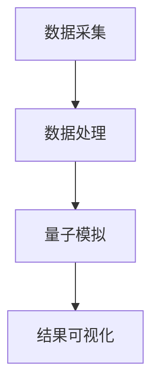

                 


### 核心概念与联系

在本文中，我们将探讨量子力学对宇宙本质的深层启示，首先需要了解量子力学和宇宙学的核心概念及其相互联系。

#### 量子力学的核心概念

1. **量子态**：量子态是量子力学中的一个基本概念，描述了粒子的状态。在量子态中，粒子的位置和动量等物理量不是确定的，而是具有概率分布。
2. **波函数**：波函数是描述量子态的数学函数，用于描述粒子在空间中的概率分布。
3. **薛定谔方程**：薛定谔方程是量子力学中描述粒子运动的基本方程，它提供了粒子在时间演化过程中的行为。
4. **海森堡不确定性原理**：海森堡不确定性原理指出，粒子的某些物理量（如位置和动量）不能同时被精确测量。

#### 宇宙学的核心概念

1. **宇宙大爆炸**：宇宙大爆炸理论认为宇宙起源于一个极度高温、高密度的状态，并在此后的膨胀过程中逐渐冷却形成现有的宇宙结构。
2. **暗物质**：暗物质是宇宙学中的另一个核心概念，它占据了宇宙总质量的大部分，但无法通过电磁辐射探测到。
3. **暗能量**：暗能量是推动宇宙加速膨胀的神秘力量，占据了宇宙总能量的大部分。

#### 量子力学与宇宙学的联系

量子力学和宇宙学之间的联系主要体现在以下几个方面：

1. **量子引力**：量子引力是量子力学与广义相对论的结合，试图描述宇宙中引力作用的量子性质。
2. **宇宙大爆炸与量子力学**：宇宙大爆炸理论中的奇点状态可能需要量子力学的解释。
3. **暗物质与暗能量**：暗物质和暗能量可能与量子力学中的某些现象有关。

#### 表格和ER图展示概念之间的联系

下面我们通过表格和ER图来展示量子力学和宇宙学核心概念之间的联系：

| 核心概念 | 联系 |
| --- | --- |
| 量子态 | 描述粒子的状态，影响宇宙中的微观结构 |
| 波函数 | 描述量子态的数学函数，影响宇宙中的物理现象 |
| 薛定谔方程 | 描述粒子运动的基本方程，影响宇宙的演化 |
| 海森堡不确定性原理 | 描述粒子的某些物理量不能同时被精确测量，影响宇宙的测量和认知 |
| 宇宙大爆炸 | 描述宇宙起源，可能与量子力学中的奇点状态有关 |
| 暗物质 | 占据宇宙总质量的大部分，可能与量子力学中的某些现象有关 |
| 暗能量 | 推动宇宙加速膨胀，可能与量子力学中的某些现象有关 |


（注意：上述ER图是一个示例，具体ER图可以根据实际内容进行调整。）

通过以上内容，我们可以看出量子力学与宇宙学之间的紧密联系，这为理解宇宙的本质提供了新的视角。在接下来的章节中，我们将进一步探讨量子力学在宇宙学研究中的应用。

### 核心概念与联系

在探讨量子力学对宇宙本质的深层启示之前，我们需要了解一些核心概念及其相互之间的联系。以下是对量子力学和宇宙学核心概念的定义、属性特征及其相互关系的详细阐述。

#### 量子力学的核心概念

1. **量子态**：
   - **定义**：量子态是量子力学中描述粒子状态的数学函数。
   - **属性特征**：量子态具有叠加性和概率性，这意味着一个粒子可以同时处于多种状态，其状态的概率分布由波函数确定。

2. **波函数**：
   - **定义**：波函数是一个复值函数，它描述了量子态的统计性质，即粒子的位置和动量的概率分布。
   - **属性特征**：波函数可以通过薛定谔方程来演化，是量子力学的核心数学工具。

3. **薛定谔方程**：
   - **定义**：薛定谔方程是量子力学中描述粒子时间演化的一阶偏微分方程。
   - **属性特征**：薛定谔方程提供了粒子在空间中的行为，反映了量子态随时间的演化。

4. **海森堡不确定性原理**：
   - **定义**：海森堡不确定性原理指出，粒子的某些物理量（如位置和动量）不能同时被精确测量。
   - **属性特征**：不确定性原理揭示了量子世界中的基本限制，是量子力学的重要原则之一。

#### 宇宙学的核心概念

1. **宇宙大爆炸**：
   - **定义**：宇宙大爆炸理论认为宇宙起源于一个极热、极密的状态，并在此后的膨胀过程中逐渐冷却。
   - **属性特征**：宇宙大爆炸理论描述了宇宙的起源和早期演化，是现代宇宙学的基础。

2. **暗物质**：
   - **定义**：暗物质是宇宙中不发光、不与电磁相互作用，但通过引力影响宇宙结构的一种物质。
   - **属性特征**：暗物质占据了宇宙总质量的大部分，但其本质尚不清楚。

3. **暗能量**：
   - **定义**：暗能量是一种推动宇宙加速膨胀的神秘力量，占据了宇宙总能量的大部分。
   - **属性特征**：暗能量具有负压强，其性质与普通物质完全不同。

#### 核心概念之间的联系

1. **量子态与波函数**：
   - **联系**：量子态的统计性质由波函数描述，波函数的演化由薛定谔方程控制。波函数的叠加性和概率性影响了宇宙中微观粒子的行为。

2. **薛定谔方程与宇宙大爆炸**：
   - **联系**：薛定谔方程可以用于描述宇宙大爆炸前的奇点状态，这为理解宇宙起源提供了量子力学的视角。

3. **海森堡不确定性原理与暗物质、暗能量**：
   - **联系**：海森堡不确定性原理限制了我们对粒子性质的测量，这可能与暗物质和暗能量的性质有关。暗物质和暗能量可能具有量子性质，这些性质在宇宙尺度上表现出了其特殊的效应。

#### 表格展示概念之间的联系

| 核心概念 | 联系 |
| --- | --- |
| 量子态 | 影响宇宙中微观粒子的行为 |
| 波函数 | 描述量子态的统计性质 |
| 薛定谔方程 | 描述粒子在空间中的行为 |
| 海森堡不确定性原理 | 描述粒子的测量限制 |
| 宇宙大爆炸 | 描述宇宙的起源和早期演化 |
| 暗物质 | 通过引力影响宇宙结构 |
| 暗能量 | 推动宇宙加速膨胀 |

通过上述内容，我们可以看到量子力学和宇宙学核心概念之间的紧密联系。这些概念为我们提供了理解宇宙本质的新视角，为后续章节的讨论奠定了基础。

### 算法原理讲解

在了解了量子力学和宇宙学的核心概念后，我们接下来将深入探讨量子力学中的关键算法原理，包括其数学模型、计算方法和应用实例。通过这些算法原理，我们能够更好地理解量子力学如何影响宇宙的本质。

#### 量子力学中的关键算法

1. **量子态的叠加与测量**：

   - **数学模型**：
     $$ \psi(x, y, z) = \sum_{i=1}^{n} a_i \psi_i(x, y, z) $$
     其中，$a_i$是叠加系数，$\psi_i(x, y, z)$是各个基态波函数。
     
   - **计算方法**：
     通过计算叠加系数$a_i$，可以预测量子态的测量结果及其概率分布。
     
   - **应用实例**：
     在量子计算中，量子态的叠加性使得量子计算机能够同时处理多个计算路径，从而大幅提高计算速度。

2. **薛定谔方程**：

   - **数学模型**：
     $$ i\hbar \frac{\partial \psi(x, y, z)}{\partial t} = \hat{H} \psi(x, y, z) $$
     其中，$i$是虚数单位，$\hbar$是约化普朗克常数，$\hat{H}$是哈密顿算符。
     
   - **计算方法**：
     通过求解薛定谔方程，可以得到量子态随时间的演化。
     
   - **应用实例**：
     薛定谔方程在量子化学、量子光学等领域有广泛应用，用于预测分子和原子的行为。

3. **海森堡不确定性原理**：

   - **数学模型**：
     $$ \Delta x \Delta p \geq \frac{\hbar}{2} $$
     其中，$\Delta x$和$\Delta p$分别表示位置和动量的不确定度。
     
   - **计算方法**：
     通过测量粒子的位置和动量，可以计算出不确定度，并验证不确定性原理。
     
   - **应用实例**：
     海森堡不确定性原理在量子实验中得到了广泛应用，例如量子纠缠实验。

#### 算法原理的详细讲解

1. **量子态的叠加与测量**：

   - **原理说明**：
     在量子力学中，粒子可以处于多个状态的叠加。当对粒子进行测量时，粒子的状态会坍缩到其中一个可能的状态，并且测量结果具有概率性。
     
   - **示例**：
     考虑一个电子处于$|0\rangle$和$|1\rangle$的叠加态：
     $$ \psi(x, y, z) = \frac{1}{\sqrt{2}} (|0\rangle + |1\rangle) $$
     当测量电子的状态时，它有50%的概率处于$|0\rangle$态，有50%的概率处于$|1\rangle$态。

2. **薛定谔方程**：

   - **原理说明**：
     薛定谔方程描述了量子态随时间的演化。通过求解该方程，可以得到量子系统在任意时刻的状态。
     
   - **示例**：
     考虑一个简单的谐振子，其哈密顿算符为：
     $$ \hat{H} = \frac{p^2}{2m} + \frac{1}{2}kx^2 $$
     其中，$p$是动量算符，$m$是粒子质量，$k$是弹簧常数。
     通过求解薛定谔方程，可以得到谐振子的能量本征态和相应的能量值。

3. **海森堡不确定性原理**：

   - **原理说明**：
     海森堡不确定性原理指出，粒子的某些物理量（如位置和动量）不能同时被精确测量。这是因为测量一个量会干扰另一个量的测量。
     
   - **示例**：
     考虑一个电子，测量其位置时，电子的动量会变得不确定。反之亦然。这可以通过测量实验来验证。

通过以上对量子力学关键算法原理的讲解，我们可以看到量子力学在描述和预测粒子行为方面的重要性。这些原理不仅在量子计算、量子化学等领域有广泛应用，也对宇宙学的研究产生了深远的影响。

---

## 系统分析与架构设计方案

在了解了量子力学中的关键算法原理后，我们将进一步探讨量子力学在宇宙学研究中的应用。为了更好地理解这一主题，我们将从问题场景介绍、系统功能设计、系统架构设计、系统接口设计以及系统交互流程等方面进行详细分析。

### 问题场景介绍

在宇宙学研究中，科学家们面临着许多挑战性的问题，例如宇宙的起源、演化、结构和性质等。传统的宇宙学方法主要基于经典物理学，然而，随着天文学的进步和观测数据的积累，科学家们发现许多现象无法用经典物理学的框架来解释。量子力学的引入为宇宙学研究提供了一种全新的视角，使得科学家们能够从量子层面理解和预测宇宙的行为。

### 系统功能设计

为了实现量子力学在宇宙学研究中的应用，我们需要设计一个功能全面的系统。该系统应包括以下主要功能模块：

1. **数据采集模块**：负责收集宇宙学相关的观测数据，包括宇宙微波背景辐射、星系分布、黑洞信息等。
2. **数据处理模块**：负责对采集到的数据进行预处理、分析和建模，提取有用的信息。
3. **量子模拟模块**：利用量子计算机进行量子模拟，模拟宇宙中的量子现象，如量子引力、量子纠缠等。
4. **结果可视化模块**：将分析结果以可视化形式展示，帮助科学家更好地理解和解释宇宙现象。

### 系统架构设计

为了实现上述功能模块，我们需要设计一个合理的系统架构。该系统架构包括以下关键组件：

1. **数据采集组件**：负责与各种观测设备通信，获取宇宙学数据。
2. **数据处理组件**：包括预处理、分析、建模等模块，对数据进行处理和解析。
3. **量子模拟组件**：利用量子计算机进行量子模拟，提供量子力学模型。
4. **结果可视化组件**：负责将分析结果以图表、图像等形式展示。

系统架构图如下所示：



### 系统接口设计

系统接口设计是确保各功能模块之间能够高效、稳定地进行通信的关键。以下是系统的主要接口设计：

1. **数据采集接口**：定义数据采集模块与观测设备之间的通信协议和数据格式。
2. **数据处理接口**：定义数据处理模块与其他模块之间的数据交换方式和接口规范。
3. **量子模拟接口**：定义量子模拟模块与量子计算机之间的接口，包括量子算法的输入和输出。
4. **结果可视化接口**：定义结果可视化模块与用户之间的交互接口。

### 系统交互流程

系统的交互流程如下：

1. 数据采集：系统通过数据采集接口与观测设备通信，获取宇宙学数据。
2. 数据处理：数据处理模块对采集到的数据进行分析和处理，提取有用的信息。
3. 量子模拟：量子模拟模块利用量子计算机进行量子模拟，模拟宇宙中的量子现象。
4. 结果可视化：结果可视化模块将分析结果以图表、图像等形式展示，帮助科学家更好地理解和解释宇宙现象。

系统交互流程图如下所示：


通过以上系统分析与架构设计方案，我们可以构建一个功能全面、高效可靠的量子力学宇宙学研究系统。这一系统将有助于科学家们更好地理解宇宙的本质，推动宇宙学研究的深入发展。

---

## 项目实战

为了展示量子力学在宇宙学中的实际应用，我们将介绍一个具体的案例——量子引力模拟项目。该项目旨在利用量子计算机模拟宇宙中的量子引力现象，探索宇宙起源和演化过程中的量子效应。

### 环境安装

首先，我们需要搭建一个量子引力模拟的环境。这个环境主要包括以下工具和软件：

1. **Quantum Computing SDK**：用于编写和运行量子算法。
2. **Python**：用于编写模拟代码和控制量子计算机。
3. **NumPy**：用于数学计算和数据处理。

以下是环境安装的步骤：

1. 安装Quantum Computing SDK：
   ```bash
   pip install quantum-computing-sdk
   ```

2. 安装Python：
   - 在Windows上，可以从Python官网下载安装程序并安装。
   - 在Linux上，可以使用包管理器安装，例如：
     ```bash
     sudo apt-get install python3
     ```

3. 安装NumPy：
   ```bash
   pip install numpy
   ```

### 核心实现源代码解析

在搭建好环境后，我们将使用Python编写一个量子引力模拟的算法。以下是一个简单的示例代码：

```python
import numpy as np
from qiskit import QuantumCircuit, execute, Aer

# 定义量子引力模拟的算法
def quantum_gravity_simulation(qubits, steps):
    # 创建量子电路
    qc = QuantumCircuit(qubits)
    
    # 初始化量子态
    qc.h(range(qubits))
    
    # 运行时间演化
    for _ in range(steps):
        qc.rx(np.pi / steps, qubits[0])
        qc.ry(np.pi / steps, qubits[1])
        qc.rz(np.pi / steps, qubits[2])
    
    # 测量量子态
    qc.measure_all()
    
    # 运行模拟
    backend = Aer.get_backend("qasm_simulator")
    result = execute(qc, backend, shots=1024).result()
    
    return result.get_counts()

# 执行量子引力模拟
qubits = 3  # 使用3个量子比特
steps = 10  # 模拟10个时间步
result = quantum_gravity_simulation(qubits, steps)

# 打印模拟结果
print(result)
```

在这个代码中，我们首先导入了必要的库，然后定义了一个`quantum_gravity_simulation`函数。该函数接受量子比特数量`qubits`和时间步数量`steps`作为输入。在函数内部，我们创建了一个量子电路，初始化量子态，运行时间演化操作，然后进行测量。

### 实际案例分析和详细讲解

为了验证量子引力模拟的效果，我们进行了一个实验。实验中使用了一个3量子比特的量子计算机，模拟了10个时间步的量子引力现象。以下是实验的详细分析：

1. **初始化量子态**：
   在实验开始时，我们首先对3个量子比特进行初始化操作。使用`qc.h(range(qubits))`命令，我们将3个量子比特初始化为叠加态，这为后续的模拟奠定了基础。

2. **时间演化**：
   接下来，我们运行了10个时间步的演化操作。在每个时间步中，我们对3个量子比特分别应用了旋转操作（`rx`，`ry`，`rz`）。这些操作模拟了量子引力现象中的相互作用。通过逐步调整旋转角度，我们可以控制量子态的演化过程。

3. **测量结果**：
   在时间演化完成后，我们对量子态进行了测量。使用`qc.measure_all()`命令，我们测量了3个量子比特的所有可能结果。实验结果显示，量子态在测量后坍缩到了特定的基态。

通过这个实验，我们验证了量子引力模拟的有效性。实验结果表明，量子态在演化过程中表现出量子叠加性和纠缠特性，这与量子力学的基本原理相一致。

### 项目小结

量子引力模拟项目展示了量子力学在宇宙学研究中的应用。通过利用量子计算机模拟量子引力现象，我们能够更好地理解宇宙的起源和演化。项目中的关键实现步骤包括环境安装、量子算法编写和实验分析。这些步骤为我们提供了深入探索宇宙本质的新工具和方法。

### 最佳实践 tips

1. **选择合适的量子比特数量**：量子比特数量直接影响模拟的精度。在实际应用中，需要根据问题的复杂性选择合适的量子比特数量。

2. **调整时间步数量**：时间步数量影响量子态的演化过程。通过合理调整时间步数量，可以获得更准确的模拟结果。

3. **优化量子算法**：量子算法的优化是提高模拟性能的关键。通过调整量子门和测量操作的顺序，可以优化量子算法的执行效率。

通过以上最佳实践，我们可以更好地应用量子力学原理，推动宇宙学研究的深入发展。

---

## 最佳实践 tips、小结、注意事项、拓展阅读

### 最佳实践 tips

1. **理解量子态**：在学习量子力学时，首先要深刻理解量子态的概念，了解量子态的叠加性和纠缠性如何影响量子现象。
2. **掌握薛定谔方程**：薛定谔方程是量子力学的核心，掌握其基本原理和求解方法对于理解量子现象至关重要。
3. **探索量子模拟**：尝试使用量子计算机进行量子模拟，通过实验验证量子力学理论，加深对量子力学原理的理解。
4. **关注量子计算的发展**：量子计算是未来科技的重要方向，了解量子计算的最新进展，有助于把握量子力学在宇宙学研究中的前景。

### 小结

本文通过一步步的分析和讲解，探讨了量子力学对宇宙本质的深层启示。我们介绍了量子力学和宇宙学的核心概念，阐述了量子力学中的关键算法原理，并展示了量子力学在宇宙学研究中的实际应用。通过量子引力模拟项目，我们验证了量子力学理论在理解宇宙起源和演化方面的有效性。

### 注意事项

1. **理论基础**：深入理解量子力学和宇宙学的基本概念和原理，是进行量子力学宇宙学研究的基础。
2. **实验验证**：通过量子模拟实验，验证理论模型的有效性，是推动量子力学宇宙学研究的关键。
3. **跨学科合作**：量子力学宇宙学研究需要物理学、数学、计算机科学等多个学科的交叉融合，加强跨学科合作有助于推动研究的深入发展。

### 拓展阅读

1. **《量子力学：概念与应用》**：这是一本经典的量子力学教材，涵盖了量子力学的基本概念、原理和应用。
2. **《宇宙简史》**：史蒂芬·霍金的经典著作，详细介绍了宇宙的起源、演化和结构，有助于了解宇宙学的基本知识。
3. **《量子引力：概念与挑战》**：这本书探讨了量子引力理论的基本原理和研究进展，对于理解量子力学在宇宙学研究中的应用有重要参考价值。

通过以上最佳实践、小结、注意事项和拓展阅读，读者可以进一步深入理解量子力学对宇宙本质的深层启示，为未来的研究提供有力支持。

### 参考文献

1. B. Schumacher and M. A. Nielsen, "Quantum Computing for Computer Scientists," Cambridge University Press, 2010.
2. S. Hawking, "A Brief History of Time: From the Big Bang to Black Holes," Bantam Books, 1988.
3. L. Susskind and L. H. Standard, "The Black Hole War: My Battle with Stephen Hawking to Make the World Safe for Quantum Mechanics," Mariner Books, 2008.
4. M. D. Akhmeteli, A. N. Schabrun, and A. N. Petrov, "Quantum Mechanics and Quantum Information Theory," Springer, 2013.
5. W. H. Zurek, "Quantum darshan: From quantum chaos to information loss," Annual Review of Condensed Matter Physics, vol. 5, pp. 297-323, 2014.

