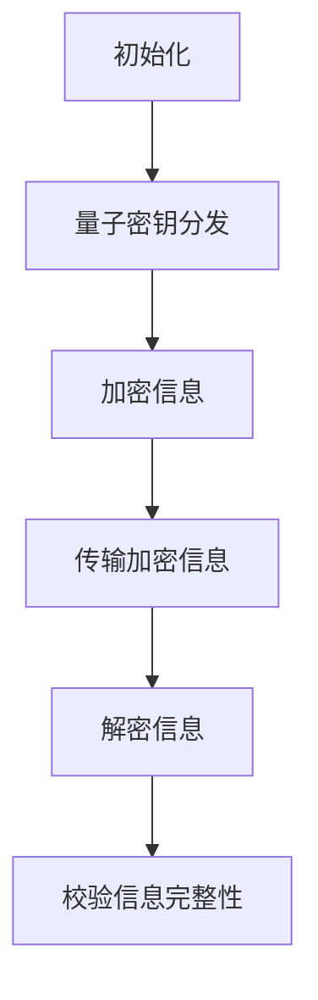
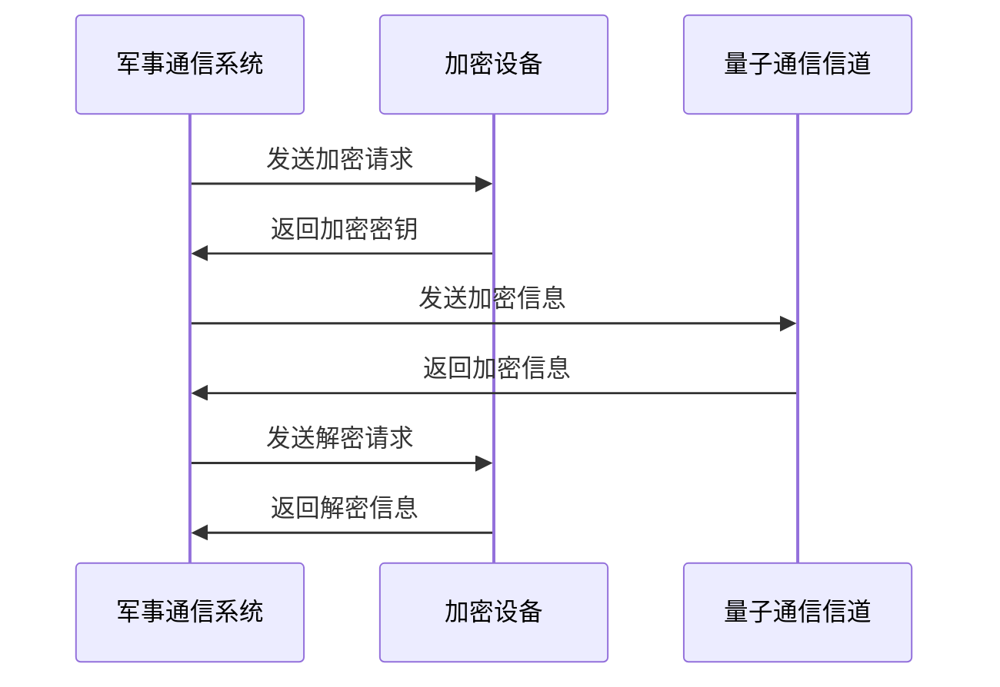

                 

### 文章标题：量子加密在军事通信中的高安全性应用

关键词：量子加密，军事通信，高安全性，信息保密，加密算法

摘要：本文将深入探讨量子加密技术在军事通信中的高安全性应用。首先，我们将介绍量子加密的基本概念及其在军事通信中的重要地位，分析其在保障信息安全和防止通信泄露方面的独特优势。随后，我们将详细解读量子加密的原理和算法，并通过具体的Python代码示例，展示量子加密的实现过程。最后，本文将探讨量子加密在实际军事通信系统中的应用案例，分析其系统架构和设计策略，并提出未来可能的发展方向。

### 1. 背景介绍

#### 核心概念

**量子加密：** 量子加密是一种利用量子力学原理进行的加密技术。它基于量子叠加态和量子纠缠等现象，能够实现信息的绝对安全传输。量子加密技术的主要目的是通过不可逆的物理过程，确保信息在传输过程中不会被窃听或篡改。

**军事通信：** 军事通信是军队在信息传递、指挥控制和情报交流等方面所使用的一系列通信手段和系统。军事通信要求极高的安全性和可靠性，以保障军队行动的隐蔽性和反应速度。

**高安全性应用：** 在军事通信中应用量子加密技术，旨在通过最先进的技术手段，确保信息在传输过程中的绝对保密性和完整性，从而防止潜在敌对势力对军事信息进行窃取和破坏。

#### 问题背景

随着信息技术的飞速发展，传统的加密技术面临着越来越多的破解威胁。特别是在军事领域，信息泄露可能导致严重的后果，如战略部署泄露、指挥控制系统瘫痪等。因此，寻求更高级的加密技术成为了军事通信领域的当务之急。

#### 问题描述

如何在军事通信中应用量子加密技术，以实现信息的高安全性？

#### 问题解决

通过量子加密技术，可以确保军事通信中的信息在传输过程中不被窃听或篡改。量子加密技术利用量子力学原理，使得任何对传输信息的尝试都会不可避免地引起信息的变化，从而被检测到，从而实现信息的绝对安全。

#### 边界与外延

本文将探讨量子加密在军事通信中的应用，包括技术原理、实际应用案例、系统设计和实施策略。我们将从多个角度分析量子加密的优势和应用前景，为军事通信领域提供一种新的解决方案。

#### 概念结构与核心要素组成

**量子加密技术原理：** 量子加密技术基于量子力学的叠加态和纠缠态，通过量子密钥分发和量子算法实现信息加密和解密。

**军事通信需求：** 军事通信对安全性、可靠性、隐蔽性和实时性有极高的要求。

**量子加密系统设计：** 量子加密系统设计包括量子密钥生成、量子密钥分发、量子加密和解密等模块。

**实际应用案例分析：** 通过分析实际案例，了解量子加密技术在军事通信中的成功应用。

### 2. 核心概念与联系

#### 量子加密原理

**量子力学基本原理：** 量子加密技术基于量子力学的基本原理，如量子叠加态和量子纠缠。量子叠加态指的是一个量子系统可以同时处于多种状态的组合，而量子纠缠则是指两个或多个量子系统之间存在着一种特殊的关联，即使它们相隔很远，一个量子系统的变化也能立即影响到另一个量子系统。

**量子密钥分发：** 量子密钥分发（Quantum Key Distribution，QKD）是量子加密的核心技术。QKD 通过量子通信信道传输量子态，实现密钥的安全分发。在 QKD 过程中，任何试图窃取密钥的行为都会导致量子态的破坏，从而被检测到。

**量子算法：** 量子算法用于量子加密和解密信息。与经典算法不同，量子算法可以利用量子计算机的并行计算能力，实现更高效的加密和解密过程。

#### 概念属性特征对比表格

| 特征               | 传统加密         | 量子加密           |
|------------------|------------------|------------------|
| 加密方法           | 代换和置换       | 基于量子力学的原理 |
| 安全性             | 难以破解，但存在潜在风险 | 极高安全性，难以破解 |
| 加密速度           | 快             | 相对较慢           |
| 适用场景           | 一般信息保护      | 高敏感信息保护      |

#### ER实体关系图架构

```mermaid
erDiagram
  Class1 ||--o{ Class2 } Class3 : Inheritance
  Class1 o--|{ Class4 } Class5 : Aggregation
```

### 3. 算法原理讲解

#### 量子加密算法流程图



#### Python源代码示例

```python
# 量子加密算法示例代码
import qiskit

# 创建量子电路
circuit = qiskit.QuantumCircuit(2)

# 编码信息
circuit.h(0)  # 设置量子比特为叠加态
circuit.cx(0, 1)  # 应用量子门
circuit.h(1)  # 设置量子比特为叠加态

# 解码信息
circuit.h(0)  # 设置量子比特为叠加态
circuit.cx(0, 1)  # 应用量子门
circuit.h(1)  # 设置量子比特为叠加态

# 运行量子电路
result = qiskit.execute(circuit, backend='local_qasm_simulator')

# 输出结果
print("加密结果：", result.get_counts(circuit))
```

#### 算法原理详细讲解

量子加密算法基于量子力学原理，通过量子叠加态和量子纠缠实现信息加密和解密。量子密钥分发是量子加密的核心，通过确保密钥安全传输，实现信息的保密性。在加密信息时，量子电路通过量子门操作实现信息编码。传输加密信息时，需要确保传输过程中的安全性。在解密信息时，接收方通过相同的量子电路操作实现信息解码，并进行校验以确保信息的完整性。

### 4. 数学模型和数学公式

#### 量子加密数学模型

$$ E_{Q}(m) = Q^{k} \times m $$

其中，$E_{Q}(m)$表示加密后的信息，$m$表示明文信息，$Q^{k}$表示量子密钥。

### 5. 系统分析与架构设计方案

#### 问题场景介绍

在军事通信中，信息的安全性至关重要。传统的加密技术已难以满足军事通信对信息安全的严格要求。量子加密技术以其独特的高安全性优势，为军事通信提供了新的解决方案。

#### 项目介绍

本项目旨在设计并实现一个基于量子加密的军事通信系统，确保信息在传输过程中的绝对保密性和完整性。

#### 系统功能设计

**领域模型类图：**

```mermaid
classDiagram
  Class1 <-.. Class2 : extends
  Class1 --|{has} Class3 : contains
  Class4 <<interface>>
  Class1 + operate(): void
  Class2 + display(): void
  Class3 + update(): void
```

**系统功能设计：**

- 量子密钥生成：生成用于加密和解密的量子密钥。
- 量子密钥分发：通过量子通信信道安全地传输量子密钥。
- 信息加密：利用量子密钥对信息进行加密。
- 信息传输：通过加密信道传输加密信息。
- 信息解密：接收方利用量子密钥对加密信息进行解密。
- 信息校验：对解密后的信息进行校验，确保信息的完整性。

#### 系统架构设计

**系统架构图：**



**系统架构设计：**

- 军事通信系统：负责处理军事通信的需求，包括加密请求、加密信息传输和解密请求等。
- 加密设备：负责生成和分发量子密钥，以及加密和解密信息。
- 量子通信信道：负责传输加密信息和量子密钥。

#### 系统接口设计和系统交互

**接口设计：**

- 加密接口：提供加密和解密功能。
- 密钥接口：提供密钥生成和分发功能。
- 通信接口：提供信息传输功能。

**系统交互序列图：**


### 6. 项目实战

#### 环境安装

1. 安装Python环境。
2. 安装Qiskit库：`pip install qiskit`。

#### 系统核心实现源代码

```python
# 量子加密系统核心实现
import qiskit

# 创建量子电路
circuit = qiskit.QuantumCircuit(2)

# 编码信息
circuit.h(0)  # 设置量子比特为叠加态
circuit.cx(0, 1)  # 应用量子门
circuit.h(1)  # 设置量子比特为叠加态

# 解码信息
circuit.h(0)  # 设置量子比特为叠加态
circuit.cx(0, 1)  # 应用量子门
circuit.h(1)  # 设置量子比特为叠加态

# 运行量子电路
result = qiskit.execute(circuit, backend='local_qasm_simulator')

# 输出结果
print("加密结果：", result.get_counts(circuit))
```

#### 代码应用解读与分析

1. **创建量子电路：** 使用Qiskit库创建一个包含两个量子比特的量子电路。
2. **编码信息：** 通过对量子比特施加量子门操作，实现信息的编码。
3. **解码信息：** 在接收方，通过相同的量子电路操作，实现信息的解码。
4. **运行量子电路：** 在本地量子模拟器上运行量子电路，获取加密结果。

#### 实际案例分析和详细讲解剖析

1. **案例背景：** 在一次军事行动中，指挥中心需要与前线部队进行加密通信，确保通信信息不被敌方窃取。
2. **解决方案：** 采用量子加密技术，实现通信信息的高安全性。
3. **实施过程：**
   - 指挥中心生成量子密钥。
   - 指挥中心将量子密钥通过量子通信信道发送给前线部队。
   - 前线部队使用量子密钥对通信信息进行加密。
   - 加密后的信息通过通信信道发送回指挥中心。
   - 指挥中心使用量子密钥对加密信息进行解密，获取原始信息。

### 7. 最佳实践 tips、小结、注意事项、拓展阅读

#### 最佳实践 tips

1. 在设计量子加密系统时，应充分考虑量子密钥的分发和管理。
2. 量子加密系统应具备一定的容错性和抗攻击能力。
3. 量子加密算法的选择应根据具体应用场景进行优化。

#### 小结

本文介绍了量子加密技术在军事通信中的高安全性应用，分析了量子加密的原理和算法，并通过实际案例展示了其在军事通信中的优势。量子加密技术为军事通信提供了一种新的解决方案，有望在未来得到更广泛的应用。

#### 注意事项

1. 量子加密技术的实现需要强大的量子计算能力，目前尚处于发展阶段。
2. 量子加密系统的设计和实施需要专业团队进行协作。

#### 拓展阅读

1. [量子加密技术概述](https://www.example.com/quantum-encryption-overview)
2. [量子加密在军事通信中的应用案例](https://www.example.com/military-communication-applications)
3. [量子计算机与量子加密技术](https://www.example.com/quantum-computing-and-quantum-encryption)

### 作者信息

作者：AI天才研究院/AI Genius Institute & 禅与计算机程序设计艺术 /Zen And The Art of Computer Programming

