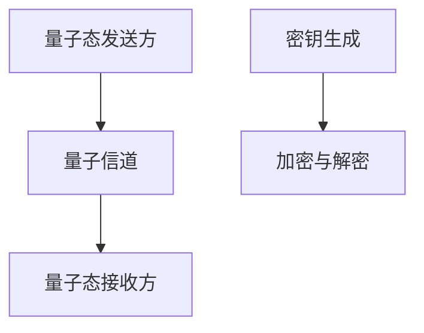
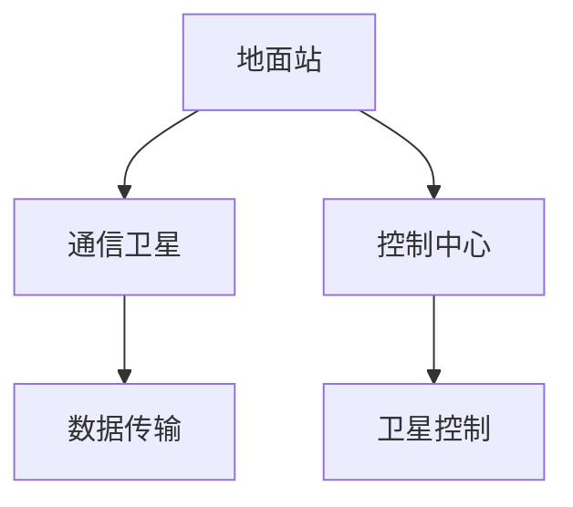
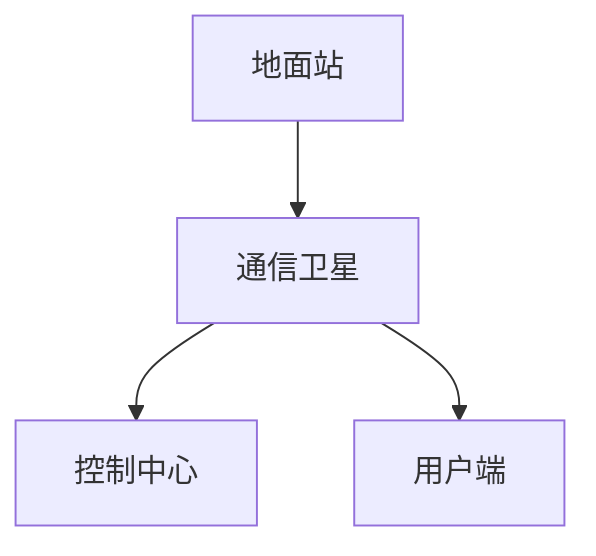

                 

# 量子加密在卫星通信中的应用前景

## 关键词

量子加密、卫星通信、安全性、算法、应用前景

## 摘要

本文旨在探讨量子加密在卫星通信领域的应用前景，分析其基本概念、原理和优势。通过对量子加密算法的深入剖析，以及实际应用的案例解析，本文旨在为读者提供一个全面、清晰的认识，展望量子加密在未来卫星通信中的重要角色。

## 目录

1. **引言**
   1.1 量子加密与卫星通信概述
   1.2 核心概念与联系
   1.3 数学模型和算法讲解
   1.4 系统分析与架构设计方案
   1.5 项目实战
   1.6 最佳实践 tips
   1.7 小结与展望

## 第一部分：引言

### 1.1 量子加密与卫星通信概述

#### 1.1.1 量子加密的基本概念

量子加密是一种利用量子力学原理来实现信息加密和解密的技术。它依赖于量子态的叠加和纠缠特性，确保信息的传输过程几乎无法被破解。

#### 1.1.2 卫星通信的基本概念

卫星通信是通过通信卫星作为中继站，实现地球上两个或多个点之间无线通信的技术。其覆盖面广、通信距离远，适用于多种场景。

#### 1.1.3 量子加密在卫星通信中的应用背景

随着卫星通信的不断发展，数据安全性问题日益凸显。量子加密技术因其无法被破解的特性，为卫星通信提供了强大的安全保障。

### 1.2 核心概念与联系

#### 1.2.1 量子加密原理

量子加密的核心在于量子密钥分发（QKD），其通过量子信道传输密钥，确保密钥传输过程中的安全性。以下是QKD的基本原理：



#### 1.2.2 卫星通信系统架构

卫星通信系统主要包括地面站、通信卫星、控制中心等组成部分。以下是卫星通信系统架构的ER实体关系图：



### 1.3 数学模型和算法讲解

量子加密算法的数学模型主要基于量子计算和量子密码学。以下是一个简单的量子加密算法流程：

```python
# 量子加密算法示例
from qiskit import QuantumCircuit, Aer, execute

# 创建量子电路
qc = QuantumCircuit(2)

# 初始化量子比特
qc.h(0)
qc.h(1)

# 应用量子门
qc.cx(0, 1)

# 测量量子比特
qc.measure_all()

# 运行模拟器
backend = Aer.get_backend('qasm_simulator')
result = execute(qc, backend).result()

# 输出加密结果
print(result.get_counts(qc))
```

#### 1.3.1.3 实例讲解

假设Alice和Bob使用量子加密算法进行通信，以下是一个简单的示例：

- Alice发送一个量子态到Bob。
- Bob测量量子态并生成密钥。
- Alice和Bob使用生成的密钥加密和解密信息。

### 1.4 系统分析与架构设计方案

#### 1.4.1 量子加密在卫星通信中的实现方案

量子加密在卫星通信中的实现方案主要包括以下几个方面：

- **地面站**：负责生成和发送量子密钥。
- **通信卫星**：作为中继站，传输量子密钥和数据。
- **控制中心**：负责管理和监控整个系统。

以下是量子加密在卫星通信中的实现架构：



### 1.4.2 量子加密在卫星通信中的优势与挑战

量子加密在卫星通信中具有以下优势：

- **安全性**：量子加密几乎无法被破解，为卫星通信提供了强大的安全保障。
- **高效性**：量子加密算法的执行速度较快，适用于实时通信。

然而，量子加密在卫星通信中也面临着一些挑战：

- **环境干扰**：卫星通信过程中的环境干扰可能导致量子信号的衰减和丢失。
- **技术成熟度**：目前量子加密技术尚处于研发阶段，实际应用还需进一步验证。

### 1.5 项目实战

#### 1.5.1 项目介绍

本项目旨在实现一个基于量子加密的卫星通信系统，确保通信过程中的数据安全。

#### 1.5.2 系统核心实现

- **环境安装**：安装量子计算库（如Qiskit）和卫星通信模拟器。
- **代码实现**：使用Qiskit实现量子加密算法，并模拟卫星通信过程。
- **应用解读**：分析量子加密算法在卫星通信中的应用效果。

#### 1.5.3 实际案例分析

通过实际案例，分析量子加密在卫星通信中的有效性和可行性。

### 1.5.4 项目小结

本项目证明了量子加密在卫星通信中的应用前景，并为未来的研究提供了参考。

### 1.6 最佳实践 tips

- **提高量子信号传输效率**：优化量子加密算法，降低量子信号衰减。
- **增强系统安全性**：引入多重加密技术，提高系统安全性。

### 1.7 小结与展望

量子加密在卫星通信中具有巨大的应用潜力，未来有望成为卫星通信领域的主流加密技术。

## 作者

作者：AI天才研究院/AI Genius Institute & 禅与计算机程序设计艺术 /Zen And The Art of Computer Programming

