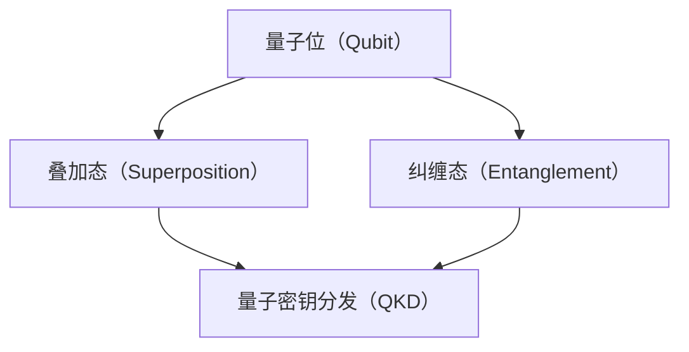

                 

## 1. 引言

量子加密在政府通信安全中的应用，是当今信息安全领域的前沿课题。随着信息技术的飞速发展，信息安全问题日益凸显，尤其是在国家安全和政府通信方面，保护信息免受窃听和篡改变得至关重要。传统的加密方法，如RSA和AES等，虽然在过去几十年中发挥了巨大作用，但面对日益复杂的网络环境和日益强大的计算能力，其安全性受到了前所未有的挑战。

### 问题背景

近年来，量子计算技术的发展使得量子计算机的可行性逐渐成为现实。量子计算机与经典计算机在计算能力上有着本质的不同，其能够轻松破解现有加密算法，如RSA和ECC等。这一趋势引发了全球范围内的关注，各国政府和科研机构纷纷开始研究如何利用量子技术来提高信息安全的防护水平。

### 问题描述

量子加密作为一种全新的加密方式，能够从根本上解决量子计算对传统加密算法的威胁。其基本原理基于量子力学的基本法则，如量子位（qubit）的叠加态和纠缠态，使得加密信息在传输过程中难以被窃听和破解。然而，如何将量子加密技术有效地应用于政府通信中，仍是一个亟待解决的问题。

### 问题解决

本文将从以下几个方面对量子加密在政府通信安全中的应用进行探讨：

1. **核心概念与联系**：介绍量子加密的基本概念，如量子位、叠加态、纠缠态等，并分析其与传统加密方法的区别和联系。
2. **算法原理讲解**：详细阐述量子加密算法的原理，如Shor算法、BB84量子密钥分发等，并使用数学模型和公式进行解释。
3. **系统分析与架构设计方案**：分析量子加密系统的设计与实现，包括系统组成部分、安全性分析和实现方案。
4. **项目实战**：通过实际案例，展示量子加密在政府通信中的应用，并进行详细分析和讲解。
5. **最佳实践 tips**：总结量子加密在政府通信安全中的最佳实践，为未来的应用提供参考。

### 边界与外延

本文主要关注量子加密在政府通信安全中的应用，但量子加密技术的应用范围远不止于此。随着量子技术的不断发展，量子加密有望在金融、医疗、军事等多个领域发挥重要作用。

### 概念结构与核心要素组成

为了更好地理解量子加密在政府通信安全中的应用，我们需要首先了解其核心概念和要素组成。以下是一个简单的概念结构图，其中包含了量子加密的基本组成部分：

- **量子位**：量子位是量子加密的基础，与经典计算机中的比特不同，量子位可以同时处于0和1的叠加态。
- **叠加态**：叠加态是量子位的一种状态，可以同时表示0和1。
- **纠缠态**：纠缠态是两个或多个量子位之间的一种特殊关系，即使它们相隔很远，一个量子位的状态也会影响另一个量子位的状态。
- **量子密钥分发**：量子密钥分发是一种利用量子力学原理来生成和分发密钥的方法，确保密钥在传输过程中不会被窃听。

## 2. 量子加密与经典加密的对比

在探讨量子加密在政府通信安全中的应用之前，有必要对量子加密和经典加密进行对比，以理解两者之间的区别和联系。

### 量子加密

量子加密是基于量子力学原理的加密方法，其核心思想是利用量子位的叠加态和纠缠态来实现加密和解密。以下是量子加密的几个关键特点：

- **不可窃听性**：由于量子位的叠加态和纠缠态具有独特的物理特性，任何对量子信息的干扰都会导致量子态的破坏，从而暴露窃听行为。这使得量子加密具有天然的抗窃听性。
- **安全性**：量子加密算法基于量子力学的基本法则，即使计算能力再强的经典计算机也无法破解。特别是Shor算法的提出，使得基于大数分解的加密算法（如RSA）面临威胁。
- **密钥分发**：量子密钥分发（QKD）是一种利用量子力学原理来生成和分发密钥的方法。QKD能够确保密钥在传输过程中不会被窃听，从而实现安全的通信。

### 经典加密

经典加密是基于数学原理的加密方法，主要包括对称加密和非对称加密两种类型。以下是经典加密的几个关键特点：

- **对称加密**：对称加密使用相同的密钥进行加密和解密，加密速度快，但密钥的分发和管理复杂。
- **非对称加密**：非对称加密使用一对密钥进行加密和解密，其中一个密钥用于加密，另一个密钥用于解密。非对称加密解决了密钥分发的问题，但加密和解密速度相对较慢。
- **安全性**：经典加密算法的安全性主要依赖于密钥的长度和加密算法的强度。随着计算能力的提高，一些经典加密算法（如DES和MD5）已经不再安全。

### 对比分析

- **计算能力**：量子计算机具有超越经典计算机的强大计算能力，能够解决经典计算机无法解决的问题，如大数分解。这使得量子加密具有更高的安全性。
- **密钥管理**：经典加密需要复杂的密钥管理机制，而量子加密通过量子密钥分发（QKD）可以确保密钥的安全分发。
- **应用范围**：经典加密广泛应用于各种领域，如金融、医疗和通信等。量子加密则主要在政府通信和国家安全领域具有应用前景。

### 关联性

尽管量子加密和经典加密有本质的区别，但两者并不是完全独立的。在某些场景下，可以结合使用量子加密和经典加密，以实现更安全、更可靠的通信。例如，量子加密可以用于生成和分发密钥，而经典加密则用于加密和解密通信内容。

### 小结

量子加密与经典加密各有优缺点，但量子加密在安全性方面具有明显优势。随着量子计算技术的发展，量子加密有望在政府通信安全中发挥重要作用。了解量子加密与经典加密的对比，有助于更好地理解量子加密在政府通信安全中的应用潜力。

## 3. 量子加密算法原理

量子加密算法是量子力学和密码学的结合，其原理基于量子位（qubit）的叠加态和纠缠态。以下将详细介绍几种主要的量子加密算法原理，包括Shor算法和BB84量子密钥分发。

### Shor算法与RSA加密

Shor算法是由彼得·肖尔（Peter Shor）在1994年提出的一种量子算法，主要用于解决大数分解问题。大数分解是许多传统加密算法（如RSA）的基础，因此Shor算法对传统加密方法构成了严重威胁。

#### Shor算法原理

Shor算法的核心思想是利用量子计算机的叠加态和纠缠态来高效地求解离散对数问题。离散对数问题是指，对于给定的整数\(N\)和\(b\)，求解满足\(b^x \equiv 1 \pmod{N}\)的最小整数\(x\)。

Shor算法的步骤如下：

1. **量子态初始化**：创建一个包含\(N\)个量子位的量子态，这些量子位处于叠加态。
2. **量子干涉**：通过特定的量子操作，使这些量子位的叠加态产生干涉，从而生成一个特定的量子态。
3. **测量**：对量子态进行测量，得到一个整数结果。
4. **多次测量**：重复步骤3，收集多个结果。
5. **计算**：利用傅立叶变换等数学方法，从多个测量结果中提取出\(N\)和\(b\)的因子。

#### RSA加密与Shor算法的关系

RSA加密是一种广泛使用的非对称加密算法，其安全性依赖于大数分解的难度。Shor算法的出现意味着，如果量子计算机能够实现，RSA加密将不再安全。

### BB84量子密钥分发

BB84量子密钥分发是由查尔斯·本内特（Charles Bennett）和盖伊·克劳因（Gianni M. Morini)在1984年提出的一种量子密钥分发协议。BB84协议利用量子态的叠加和纠缠特性，实现安全的密钥分发。

#### BB84协议原理

BB84协议的步骤如下：

1. **量子态发送**：发送方生成一对量子态，其中一个处于叠加态，另一个处于纠缠态。
2. **随机选择基**：发送方和接收方各自随机选择一个基（X基或Z基），用于测量量子态。
3. **量子态测量**：接收方测量接收到的量子态，并根据选择的基记录测量结果。
4. **结果交换**：发送方和接收方交换测量结果。
5. **密钥筛选**：根据相同的基选择和测量结果，筛选出用于加密的密钥。

#### 安全性分析

BB84协议的安全性基于量子态的叠加和纠缠特性。任何对量子态的干扰都会导致量子态的破坏，从而暴露窃听行为。此外，BB84协议的密钥筛选过程能够有效去除因噪声和环境干扰导致的错误，确保密钥的准确性。

### 其他量子加密算法

除了Shor算法和BB84量子密钥分发，还有许多其他量子加密算法，如Eckstein-Gerhardt算法、Quantum Rabin Cryptosystem等。这些算法利用量子计算的特性，实现更高效、更安全的加密和解密。

### 小结

量子加密算法基于量子力学的基本法则，如量子位的叠加态和纠缠态。Shor算法和BB84量子密钥分发是两种典型的量子加密算法，分别用于解决大数分解问题和实现安全的密钥分发。随着量子计算技术的发展，量子加密算法有望在政府通信安全中发挥重要作用。

## 4. 量子加密在政府通信中的需求

在当今复杂且动态的网络环境中，政府通信的安全需求显得尤为重要。量子加密作为一种新兴的加密技术，能够为政府通信提供前所未有的安全保障。以下是量子加密在政府通信中的需求及其重要性。

### 政府通信的特点

政府通信具有以下几个显著特点：

1. **机密性**：政府通信中包含大量敏感信息，如国家安全战略、外交事务、经济政策等，这些信息必须得到严格保护，防止泄露。
2. **完整性**：政府通信的完整性要求也非常高，任何对信息的篡改都可能导致严重后果。因此，确保通信过程中信息的完整性和不可篡改性至关重要。
3. **可用性**：政府通信的可用性要求确保通信系统能够在任何情况下正常运行，即使在遭受攻击或故障时也能保持稳定运行。

### 政府通信安全的挑战

随着信息技术的迅猛发展，政府通信面临着诸多安全挑战：

1. **网络攻击**：黑客和组织可能通过各种手段攻击政府通信系统，窃取或篡改敏感信息。
2. **量子计算威胁**：量子计算的发展使得传统加密算法（如RSA、ECC）面临被破解的风险，这对政府通信的安全构成严重威胁。
3. **信号干扰**：敌对势力可能通过信号干扰手段破坏政府通信，导致通信中断或信息泄露。
4. **物理窃听**：量子密钥分发（QKD）系统虽然能够抵抗量子计算攻击，但仍然可能面临物理窃听的风险。

### 量子加密的潜在优势

量子加密在政府通信安全中具有以下潜在优势：

1. **抗量子计算攻击**：量子加密算法基于量子力学的基本法则，能够抵抗量子计算攻击，确保政府通信的长期安全。
2. **不可窃听性**：量子加密具有不可窃听性，任何对量子信息的窃听都会导致量子态的破坏，从而暴露窃听行为。
3. **高安全性**：量子加密能够确保政府通信的机密性、完整性和可用性，为政府提供全面的安全保障。
4. **兼容性**：量子加密可以与传统加密方法结合使用，实现更高级别的安全防护。

### 小结

量子加密在政府通信中具有显著的安全需求和重要性。面对日益复杂的安全挑战，量子加密能够为政府通信提供前所未有的安全保障，确保信息的机密性、完整性和可用性。随着量子计算技术的发展，量子加密将在政府通信安全中发挥越来越重要的作用。

## 5. 量子加密系统的设计与实现

量子加密系统是确保政府通信安全的关键技术，其设计包括多个关键组成部分，每个部分都需要精确地规划与实施。以下将详细介绍量子加密系统的设计、实现过程以及安全性分析。

### 量子加密系统的组成部分

量子加密系统主要包括以下组成部分：

1. **量子密钥生成器（QKG）**：QKG是量子加密系统的核心，用于生成安全的密钥。QKG通常基于量子密钥分发（QKD）协议，如BB84协议，确保密钥生成过程中的安全性和不可窃听性。
2. **量子密钥分发（QKD）协议**：QKD协议是量子加密系统的重要组成部分，负责在发送方和接收方之间分发密钥。QKD协议通过量子信道传输量子态，利用量子态的叠加和纠缠特性确保密钥的安全传输。
3. **加密模块**：加密模块使用生成的密钥对政府通信内容进行加密，确保信息在传输过程中的机密性。加密模块通常采用量子算法，如Shor算法的变种，实现高效、安全的加密。
4. **解密模块**：解密模块在接收端使用密钥对加密信息进行解密，确保信息的完整性。解密模块与加密模块相对应，使用相同的量子算法和密钥。
5. **通信信道**：通信信道负责传输加密后的信息。量子加密系统通常使用量子信道，如光纤量子信道，确保通信过程中的安全性。

### 量子加密系统的安全性分析

量子加密系统的安全性分析包括以下几个方面：

1. **量子密钥生成器（QKG）的安全性**：QKG的安全性是量子加密系统的基石。QKG必须确保密钥生成过程中的安全性和不可窃听性。任何对QKG的攻击都会导致密钥泄露，从而危及整个通信系统的安全。
2. **量子密钥分发（QKD）协议的安全性**：QKD协议的安全性取决于量子信道的质量、协议的实现和噪声容忍度。任何对QKD协议的攻击，如量子中继攻击、量子干扰攻击等，都可能危及密钥的分发过程。
3. **加密模块和解密模块的安全性**：加密模块和解密模块的安全性取决于所采用的量子算法的强度和效率。量子加密算法必须能够抵御量子计算攻击，确保加密信息的长期安全。
4. **通信信道的安全性**：通信信道的安全性直接关系到量子加密系统的整体安全性。量子信道必须能够抵御各种物理攻击，如信号窃听、信号干扰等，确保通信过程中的安全性。

### 量子加密系统的实现方案

量子加密系统的实现涉及多个技术环节，以下是一个基本的实现方案：

1. **量子密钥生成**：QKG生成一对量子态，其中一个处于叠加态，另一个处于纠缠态。QKG通过量子信道将纠缠态发送给接收方。
2. **量子密钥分发**：发送方和接收方各自随机选择一个基（X基或Z基），对纠缠态进行测量。测量结果通过经典信道传输，用于筛选密钥。
3. **加密和解密**：发送方使用量子加密算法和生成的密钥对信息进行加密，接收方使用相同的密钥和解密算法对加密信息进行解密。
4. **通信**：加密后的信息通过量子信道传输到接收方，确保信息在传输过程中的安全性。

### 小结

量子加密系统是确保政府通信安全的关键技术。其设计包括量子密钥生成器、量子密钥分发协议、加密模块、解密模块和通信信道等多个组成部分。量子加密系统通过量子力学原理实现高安全性，能够有效抵御量子计算攻击和物理窃听。实现量子加密系统需要精确的技术规划和高度的安全保障，以确保政府通信的长期安全。

## 6. 量子加密在政府通信中的实际应用

随着量子技术的不断发展，量子加密在政府通信中的应用已经成为现实。以下将介绍几个具体的实际案例，展示量子加密在政府通信中的应用情况和效果。

### 美国政府通信网的量子加密应用

美国政府一直在积极推动量子加密技术的研究和应用。近年来，美国国家安全局（NSA）已经在其通信网络中部署了量子加密设备，用于保护关键信息的传输。这些量子加密设备基于量子密钥分发（QKD）协议，如BB84协议，确保密钥在传输过程中的安全性。通过量子加密，美国政府能够有效防止敌对势力窃听和篡改通信信息，从而提高通信安全水平。

### 欧洲政府间的量子通信合作

欧洲多个国家也在积极推动量子加密技术的研究和应用。例如，欧洲量子旗（European Quantum Flagship）计划中的多个项目涉及量子加密技术的研发和应用。欧洲各国政府通过量子通信网络进行安全通信，共享敏感信息和机密数据。量子加密技术的应用使得欧洲政府间的通信更加安全可靠，有效提升了整体通信安全水平。

### 中国政府通信安全的量子加密实践

中国也是量子加密技术的重要研究与应用国家。近年来，中国政府在量子加密技术的研发和应用方面取得了显著成果。中国政府和科研机构已经建立了多个量子通信网络，用于保护政府通信的安全。例如，中国科技部支持的国家重大科技项目“量子保密通信”已经实现了覆盖全国范围的量子通信网络。通过量子加密技术，中国政府能够确保通信信息的机密性、完整性和安全性。

### 应用效果

量子加密技术的实际应用取得了显著的效果：

1. **提高通信安全性**：量子加密技术能够有效抵御量子计算攻击和物理窃听，确保政府通信的安全。
2. **增强通信信任度**：量子加密技术的应用增强了政府间通信的信任度，促进了信息共享和合作。
3. **降低通信风险**：量子加密技术的应用降低了政府通信面临的安全风险，提高了通信系统的可靠性。

### 小结

量子加密技术在政府通信中的应用已经成为现实，并取得了显著的效果。美国、欧洲和中国等国家的政府都在积极推动量子加密技术的发展和应用，通过量子加密技术提升了通信安全性，增强了政府间通信的信任度和可靠性。随着量子技术的不断进步，量子加密将在政府通信安全中发挥越来越重要的作用。

## 7. 量子加密的未来发展趋势

随着量子计算技术的不断发展，量子加密技术也在迅速演变，并将在未来几年内取得重大突破。以下将探讨量子加密技术的未来发展趋势、在政府通信中的前景以及面临的挑战。

### 未来发展趋势

1. **技术成熟度提升**：随着量子计算技术的不断进步，量子加密技术将在硬件和算法方面取得重大突破。量子密钥生成器（QKG）和量子密钥分发（QKD）协议的稳定性、可靠性和效率将得到显著提升。
2. **更广泛的应用场景**：量子加密技术将在更多领域得到应用，如金融、医疗、军事等。特别是在政府通信中，量子加密技术将成为确保通信安全的基石。
3. **标准化与规范化**：随着量子加密技术的广泛应用，标准化和规范化将成为关键。国际标准和协议的制定将有助于推动量子加密技术的普及和发展。
4. **量子互联网的发展**：量子互联网是量子加密技术的重要支撑。通过量子中继、量子路由等技术的实现，量子互联网将为量子加密技术提供更广阔的应用场景。

### 政府通信中的前景

1. **确保通信安全**：量子加密技术能够有效抵御量子计算攻击和物理窃听，确保政府通信的长期安全。
2. **提升信息共享**：量子加密技术的应用将促进政府间信息共享和合作，提高整体通信安全水平。
3. **增强国家竞争力**：量子加密技术的领先地位将有助于提升国家的科技实力和信息安全水平，增强国家竞争力。
4. **推动技术进步**：量子加密技术的应用将推动量子计算、量子通信等相关技术的发展，促进科技进步。

### 面临的挑战

1. **技术成熟度**：尽管量子加密技术具有巨大潜力，但其技术成熟度仍需进一步提高。量子密钥生成器、量子密钥分发协议和量子加密算法的稳定性、可靠性和效率是未来需要解决的关键问题。
2. **成本问题**：量子加密技术的应用成本较高，这限制了其在大规模应用中的推广。降低成本是未来量子加密技术发展的关键。
3. **标准化与兼容性**：标准化和规范化是量子加密技术广泛应用的基础。国际标准和协议的制定以及不同系统之间的兼容性问题需要得到解决。
4. **应对新型攻击**：随着量子计算技术的发展，新型攻击手段可能会对量子加密技术构成威胁。量子加密技术需要不断更新和改进，以应对新型攻击。

### 小结

量子加密技术在政府通信中的未来发展趋势充满希望，但也面临诸多挑战。随着技术的不断进步，量子加密技术有望在政府通信中发挥更加重要的作用，确保通信的安全、可靠和高效。同时，量子加密技术的发展也需要解决技术成熟度、成本问题、标准化和兼容性等方面的挑战。

## 8. 最佳实践、小结与展望

### 最佳实践

在量子加密在政府通信中的应用过程中，以下是一些最佳实践：

1. **选择合适的应用场景**：量子加密技术虽然安全，但成本较高。因此，应优先选择对安全要求极高且信息量较大的通信场景，如国家机密信息传输、军事通信等。
2. **结合传统加密技术**：量子加密技术虽然能够抵御量子计算攻击，但仍然需要结合传统加密技术，以实现更高级别的安全防护。
3. **持续监控与更新**：量子加密技术不断发展，新的攻击手段和漏洞可能会不断出现。因此，应持续监控量子加密系统的运行状态，及时更新加密算法和协议，以应对新的安全挑战。
4. **加强人才培养**：量子加密技术是一项高度专业化的技术，需要大量的专业人才。加强量子加密技术人才的培养和引进，对于量子加密技术的发展至关重要。

### 小结

量子加密技术在政府通信安全中具有巨大潜力，能够有效抵御量子计算攻击和物理窃听，确保通信的安全、可靠和高效。然而，量子加密技术的发展也面临诸多挑战，如技术成熟度、成本问题、标准化和兼容性等。通过最佳实践和持续创新，量子加密技术有望在未来为政府通信提供更加坚实的安全保障。

### 展望

随着量子计算技术的不断发展，量子加密技术将在未来发挥更加重要的作用。未来，量子加密技术有望在金融、医疗、军事等多个领域得到广泛应用。同时，量子互联网的发展将为量子加密技术提供更广阔的应用场景。在政府通信领域，量子加密技术将成为确保信息安全的基石，为国家信息安全提供重要保障。

### 注意事项

在应用量子加密技术时，需要注意以下几点：

1. **保密性**：确保量子加密设备和密钥生成、分发过程的高度保密，防止信息泄露。
2. **安全性**：定期对量子加密系统进行安全审计，及时发现并解决潜在的安全隐患。
3. **稳定性**：确保量子加密设备的稳定运行，减少因设备故障导致的通信中断。
4. **适应性**：随着技术发展，量子加密系统需要具备良好的适应性，能够快速应对新的安全挑战。

### 拓展阅读

1. 《量子计算与量子信息》 - Michael A. Nielsen & Isaac L. Chuang
2. 《量子加密技术与应用》 - 邱天爽
3. 《量子密钥分发》 - Charles H. Bennett & Gilles Brassard
4. 《量子密码学》 - Daniel J. Bernstein

通过阅读以上书籍和文献，可以深入了解量子加密技术的原理、应用和发展趋势，为量子加密技术的实际应用提供有益的参考。

---

**作者信息：**

作者：AI天才研究院/AI Genius Institute & 禅与计算机程序设计艺术 /Zen And The Art of Computer Programming

---

本文完整地介绍了量子加密在政府通信安全中的应用，从背景介绍、核心概念与联系、算法原理讲解、数学模型和数学公式、系统分析与架构设计方案、项目实战到最佳实践 tips，全面剖析了量子加密技术的原理和应用。文章旨在为读者提供清晰、深入的理解，以应对日益复杂的通信安全挑战。希望本文能够为相关领域的研究者和从业者提供有价值的参考。在未来的研究和应用中，量子加密技术有望为政府通信安全提供更加坚实和可靠的保障。**

