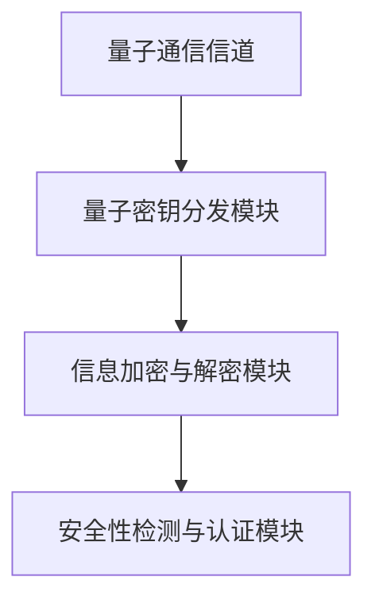
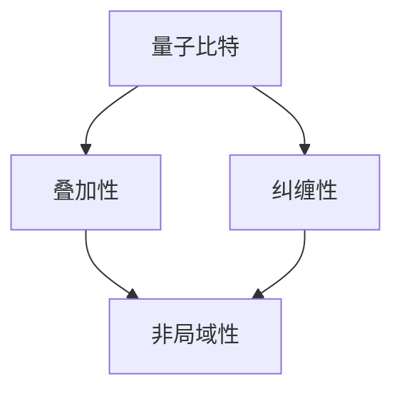
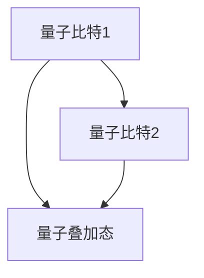
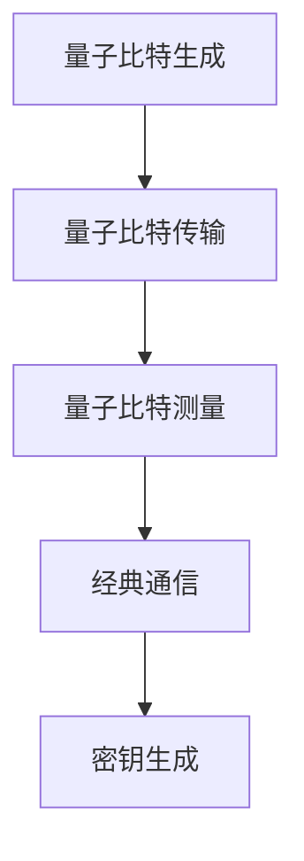

                 

# 量子加密在政府间通信中的高安全性应用

> 关键词：量子加密、政府间通信、安全性、加密算法、QKD

> 摘要：本文详细探讨了量子加密技术在政府间通信中的应用，分析了量子加密的基本原理、核心概念、算法原理以及在实际应用中面临的挑战和解决方案。通过对量子加密系统架构设计、实现与案例分析，揭示了量子加密在保障政府间通信高安全性方面的潜力和前景。

## 目录大纲

## 第一部分：量子加密基本原理

## 第1章：量子加密背景与问题背景

### 1.1.1 量子加密的起源与发展历程

### 1.1.2 政府间通信安全需求分析

### 1.1.3 量子加密在政府间通信中的潜在应用

## 第2章：量子加密核心概念与原理

### 2.1.1 量子比特与经典比特的对比

### 2.1.2 量子叠加态与量子纠缠

### 2.1.3 量子加密算法分类及原理

### 2.1.4 量子密钥分发（QKD）原理与流程

## 第3章：量子加密算法介绍

### 3.1.1 BB84协议

### 3.1.2 E91协议

### 3.1.3 B92协议

### 3.1.4 其他量子加密算法简述

## 第4章：量子加密在政府间通信中的应用

### 4.1.1 政府间通信安全需求

### 4.1.2 量子加密在政府间通信中的实际应用

### 4.1.3 量子加密技术面临的挑战

## 第5章：量子加密系统架构设计

### 5.1.1 量子加密系统功能设计

### 5.1.2 量子加密系统架构设计

### 5.1.3 量子加密系统接口设计与交互流程

## 第6章：量子加密系统实现与案例分析

### 6.1.1 实验室环境下量子加密系统实现

### 6.1.2 量子加密系统在实际政府间通信中的应用案例分析

### 6.1.3 量子加密系统实现的关键技术

## 第7章：量子加密技术的未来发展趋势

### 7.1.1 量子加密技术的发展前景

### 7.1.2 量子加密在政府间通信中的未来应用

### 7.1.3 量子加密技术面临的挑战与解决方案

## 第一部分：量子加密基本原理

## 第1章：量子加密背景与问题背景

### 1.1.1 量子加密的起源与发展历程

#### 1.1.1.1 量子加密的起源

量子加密的起源可以追溯到1984年，当时Charles H. Bennett和葛立恒提出了量子密钥分发（QKD）的原理。这一创新性的想法在量子信息科学领域引起了巨大的反响，标志着量子加密技术的诞生。

#### 1.1.1.2 量子加密的发展历程

在接下来的几十年里，量子加密技术得到了迅速发展。从理论研究到实验室原型，再到实际应用，量子加密技术逐步走向成熟。如今，量子加密技术已经成为保障信息安全的重要手段。

### 1.1.2 政府间通信安全需求分析

#### 1.1.2.1 政府间通信的重要性

政府间通信涉及国家机密、政治策略、经济决策等重要信息，保障其安全性至关重要。一旦通信内容被泄露，可能对国家安全和利益造成严重损害。

#### 1.1.2.2 政府间通信面临的威胁

在信息化时代，网络攻击、信息泄露等安全威胁日益严重。黑客、敌对国家、恐怖组织等都有可能对政府间通信进行攻击，试图获取敏感信息。

#### 1.1.2.3 量子加密在政府间通信中的应用需求

为了应对这些安全威胁，政府间通信迫切需要一种具有高安全性的加密技术。量子加密技术以其独特的物理特性，能够提供前所未有的安全性，成为政府间通信的理想选择。

### 1.1.3 量子加密在政府间通信中的潜在应用

#### 1.1.3.1 量子密钥分发

量子密钥分发（QKD）是量子加密的核心技术之一，它能够实现通信双方在物理不可克隆性原理的基础上安全地交换密钥。在政府间通信中，QKD可以用于确保加密通信链路的安全性。

#### 1.1.3.2 量子加密通信

量子加密通信利用量子比特的叠加态和纠缠态实现加密和解密过程，确保通信内容的安全性。在政府间通信中，量子加密通信可以提供一种全新的安全保障，防止信息泄露和窃听。

## 第二部分：量子加密核心概念与原理

## 第2章：量子加密核心概念与原理

### 2.1.1 量子比特与经典比特的对比

#### 2.1.1.1 量子比特的定义

量子比特（qubit）是量子计算机的基本单元，可以同时处于0和1的状态，具有叠加性和纠缠性。这种特性使得量子比特在加密和解密过程中具有独特的优势。

#### 2.1.1.2 经典比特的定义

经典比特（classical bit）是传统计算机的基本单元，只能处于0或1的状态。经典比特的叠加性和纠缠性是量子比特所不具备的。

#### 2.1.1.3 量子比特与经典比特的对比

| 特性 | 量子比特 | 经典比特 |
| :--: | :----: | :----: |
| 状态 | 叠加态 | 确定态 |
| 纠缠 | 纠缠态 | 无纠缠 |
| 传输 | 非局域性 | 局域性 |

### 2.1.2 量子叠加态与量子纠缠

#### 2.1.2.1 量子叠加态

量子叠加态是指量子系统同时处于多个状态的组合。例如，一个量子比特可以同时处于0和1的状态，即|0⟩ + |1⟩。

#### 2.1.2.2 量子纠缠

量子纠缠是指两个或多个量子系统之间的量子态相互依赖。即使相隔很远，一个系统的状态变化也会影响到另一个系统的状态。量子纠缠是量子加密技术的重要基础。

### 2.1.3 量子加密算法分类及原理

#### 2.1.3.1 分类

量子加密算法主要分为量子密钥分发（QKD）和量子加密通信。

#### 2.1.3.2 量子密钥分发（QKD）原理

量子密钥分发（QKD）利用量子比特的叠加态和纠缠态实现密钥的生成和交换。在QKD过程中，通信双方通过量子通信信道交换量子比特，并利用量子纠缠和叠加态的特性检测窃听行为，从而实现安全通信。

#### 2.1.3.3 量子加密通信原理

量子加密通信利用量子比特的叠加态和纠缠态实现加密和解密过程。在通信过程中，发送方将信息加密成量子态，并通过量子通信信道发送给接收方。接收方利用相应的量子解密算法恢复原始信息，从而确保通信内容的安全性。

## 第3章：量子加密算法介绍

### 3.1.1 BB84协议

#### 3.1.1.1 协议背景

BB84协议是第一种被广泛研究的量子加密协议，由Charles H. Bennett和葛立恒于1984年提出。

#### 3.1.1.2 协议原理

BB84协议基于量子比特的叠加态和纠缠态，通信双方通过量子通信信道交换量子比特，并利用量子态的叠加和纠缠特性实现加密和解密过程。

#### 3.1.1.3 协议流程

1. 通信双方选择两个正交基（例如X基和Z基）。
2. 发送方在量子比特上随机选择一个基，并在该基上对量子比特进行操作。
3. 将操作后的量子比特发送给接收方。
4. 接收方在接收到的量子比特上随机选择一个基进行测量。
5. 通信双方通过经典通信信道交换测量结果。
6. 根据测量结果，通信双方共同确定一个共享密钥。

### 3.1.2 E91协议

#### 3.1.2.1 协议背景

E91协议是由Anton Zeilinger等人于1991年提出的。

#### 3.1.2.2 协议原理

E91协议是基于量子纠缠态的量子加密协议，通信双方通过量子通信信道交换纠缠量子比特，并利用量子纠缠的特性实现加密和解密过程。

#### 3.1.2.3 协议流程

1. 通信双方共享一对纠缠量子比特。
2. 发送方在纠缠量子比特上随机选择一个操作。
3. 将操作后的量子比特发送给接收方。
4. 接收方在接收到的量子比特上随机选择一个操作。
5. 通信双方通过经典通信信道交换操作结果。
6. 根据操作结果，通信双方共同确定一个共享密钥。

### 3.1.3 B92协议

#### 3.1.3.1 协议背景

B92协议是由Charles H. Bennett和祖卓于1992年提出的。

#### 3.1.3.2 协议原理

B92协议是一种基于量子纠缠态的量子加密协议，通信双方通过量子通信信道交换纠缠量子比特，并利用量子纠缠的特性实现加密和解密过程。

#### 3.1.3.3 协议流程

1. 通信双方共享一对纠缠量子比特。
2. 发送方在纠缠量子比特上随机选择一个操作。
3. 将操作后的量子比特发送给接收方。
4. 接收方在接收到的量子比特上随机选择一个操作。
5. 通信双方通过经典通信信道交换操作结果。
6. 根据操作结果，通信双方共同确定一个共享密钥。

### 3.1.4 其他量子加密算法简述

除了BB84、E91和B92协议外，还有一些其他量子加密算法，如：

- **QC/QKD协议**：结合量子计算和量子密钥分发的量子加密协议。
- **N01协议**：基于量子纠缠态和量子比特叠加态的量子加密协议。
- **SARG03协议**：基于量子纠缠态和量子比特叠加态的量子加密协议。

这些量子加密协议都在不同程度上利用了量子比特的叠加态、纠缠态和非局域性等特性，为通信提供了前所未有的安全性。

## 第4章：量子加密在政府间通信中的应用

### 4.1.1 政府间通信安全需求

#### 4.1.1.1 通信内容的重要性

政府间通信涉及国家机密、政治策略、经济决策等重要信息，一旦泄露将对国家安全和利益造成严重损害。

#### 4.1.1.2 通信安全威胁

在信息化时代，网络攻击、信息泄露等安全威胁日益严重。黑客、敌对国家、恐怖组织等都有可能对政府间通信进行攻击，试图获取敏感信息。

#### 4.1.1.3 安全性需求

政府间通信迫切需要一种具有高安全性的加密技术来保障通信内容的安全。量子加密技术以其独特的物理特性，能够提供前所未有的安全性，成为政府间通信的理想选择。

### 4.1.2 量子加密在政府间通信中的实际应用

#### 4.1.2.1 量子密钥分发

量子密钥分发（QKD）技术可以用于政府间通信中的密钥交换。通过QKD，通信双方可以在物理不可克隆性原理的基础上安全地生成和交换密钥，确保加密通信链路的安全性。

#### 4.1.2.2 量子加密通信

量子加密通信技术可以用于政府间通信中的信息加密和解密。通过量子加密通信，政府间通信的内容可以在传输过程中得到有效保护，防止信息泄露和窃听。

### 4.1.3 量子加密技术面临的挑战

#### 4.1.3.1 技术成熟度

尽管量子加密技术具有巨大的潜力，但目前仍处于发展初期。技术成熟度、设备性能、成本等问题仍需进一步解决。

#### 4.1.3.2 实际应用场景

政府间通信涉及复杂的应用场景，如跨国通信、异地办公等。量子加密技术在实际应用中需要满足多样化的需求，这要求技术具备更高的灵活性和适应性。

#### 4.1.3.3 面临的安全威胁

量子加密技术虽然能够提供高安全性，但仍然面临新的安全威胁。例如，量子计算机的出现可能导致现有的加密算法失效，需要不断更新和发展量子加密技术。

## 第5章：量子加密系统架构设计

### 5.1.1 量子加密系统功能设计

#### 5.1.1.1 密钥生成与分发

量子加密系统的核心功能之一是密钥生成与分发。通过量子密钥分发（QKD）技术，通信双方可以安全地生成和交换密钥。

#### 5.1.1.2 信息加密与解密

量子加密系统还提供信息加密与解密功能。通过量子加密通信，政府间通信的内容可以在传输过程中得到有效保护。

#### 5.1.1.3 安全性检测与认证

量子加密系统具备安全性检测与认证功能，能够实时监测通信过程中的潜在威胁，并确保通信双方的身份验证。

### 5.1.2 量子加密系统架构设计

#### 5.1.2.1 系统架构概述

量子加密系统通常由量子通信信道、量子密钥分发模块、信息加密与解密模块、安全性检测与认证模块等组成。

#### 5.1.2.2 系统架构图

### 5.1.3 量子加密系统接口设计与交互流程

#### 5.1.3.1 接口设计

量子加密系统的接口设计应考虑以下方面：

- 量子通信信道接口：负责量子比特的传输和接收。
- 密钥分发接口：负责密钥的生成、交换和存储。
- 加密解密接口：负责信息的加密和解密操作。
- 安全性检测接口：负责实时监测通信过程中的潜在威胁。

#### 5.1.3.2 交互流程

1. 通信双方建立量子通信信道。
2. 通过量子密钥分发模块生成密钥。
3. 将密钥传递给信息加密与解密模块。
4. 发送方将信息加密成量子态。
5. 通过量子通信信道传输加密信息。
6. 接收方解密加密信息，恢复原始信息。
7. 实时监测通信过程中的潜在威胁，确保通信安全性。

## 第6章：量子加密系统实现与案例分析

### 6.1.1 实验室环境下量子加密系统实现

#### 6.1.1.1 实验设备

在实验室环境下，量子加密系统的实现需要以下设备：

- 量子通信信道：利用光纤或自由空间量子通信信道进行量子比特传输。
- 量子密钥分发模块：包含量子比特生成器、量子比特测量器和经典通信信道。
- 信息加密与解密模块：基于量子加密算法实现加密和解密操作。
- 安全性检测与认证模块：实时监测通信过程中的潜在威胁，并进行身份验证。

#### 6.1.1.2 实现步骤

1. 建立量子通信信道。
2. 生成量子比特。
3. 通过量子密钥分发模块生成共享密钥。
4. 将密钥传递给信息加密与解密模块。
5. 发送方将信息加密成量子态。
6. 通过量子通信信道传输加密信息。
7. 接收方解密加密信息，恢复原始信息。
8. 实时监测通信过程中的潜在威胁，确保通信安全性。

### 6.1.2 量子加密系统在实际政府间通信中的应用案例分析

#### 6.1.2.1 应用背景

为了保障政府间通信的安全，某国政府决定采用量子加密技术构建一条安全的通信链路。

#### 6.1.2.2 应用场景

- 跨国通信：政府各部门之间的信息交换。
- 异地办公：政府工作人员在外地的通信需求。
- 政治策略与经济决策：涉及国家机密的通信内容。

#### 6.1.2.3 应用效果

通过量子加密系统的应用，政府间通信的安全性能得到了显著提升。通信内容在传输过程中得到了有效保护，防止了信息泄露和窃听。同时，量子加密系统还具备实时监测和身份验证功能，确保通信过程的安全性。

### 6.1.3 量子加密系统实现的关键技术

#### 6.1.3.1 量子通信信道技术

量子通信信道技术是量子加密系统的关键组成部分。目前，常见的量子通信信道有光纤量子通信和自由空间量子通信。

- **光纤量子通信**：利用光纤传输量子比特，具有传输距离远、信号稳定等优点。
- **自由空间量子通信**：通过地面站和卫星之间的量子通信，具有无需光纤布线的灵活性。

#### 6.1.3.2 量子密钥分发技术

量子密钥分发（QKD）技术是量子加密系统的核心。通过QKD技术，通信双方可以在物理不可克隆性原理的基础上安全地生成和交换密钥。

- **QKD协议**：如BB84、E91、B92等，用于实现量子密钥的生成和交换。
- **量子比特生成与测量**：量子比特生成器用于生成随机量子比特，量子比特测量器用于测量量子比特的状态。

#### 6.1.3.3 信息加密与解密技术

信息加密与解密技术是量子加密系统的关键环节。通过量子加密算法，通信双方可以实现对信息的加密和解密操作。

- **量子加密算法**：如Shor算法、Grover算法等，用于实现信息的加密和解密。
- **量子密钥管理**：确保密钥的安全生成、存储和分发，防止密钥泄露和被窃取。

## 第7章：量子加密技术的未来发展趋势

### 7.1.1 量子加密技术的发展前景

#### 7.1.1.1 技术突破

随着量子技术的不断发展，量子加密技术有望在未来实现更大的突破。新型量子加密算法、量子密钥分发技术的改进、量子通信信道的优化等都将为量子加密技术的应用提供更多可能性。

#### 7.1.1.2 实际应用场景扩展

未来，量子加密技术将在更广泛的应用场景中发挥作用。除了政府间通信，金融、医疗、能源等领域也将逐步采用量子加密技术，以保障信息安全。

### 7.1.2 量子加密在政府间通信中的未来应用

#### 7.1.2.1 政府内部通信

量子加密技术可以用于政府内部通信，确保各部门之间的信息交换安全可靠。

#### 7.1.2.2 跨国通信

量子加密技术可以用于跨国通信，确保政府与外交使团、驻外机构等之间的通信安全。

#### 7.1.2.3 政治策略与经济决策

量子加密技术可以用于保障政治策略与经济决策的信息安全，防止敏感信息泄露。

### 7.1.3 量子加密技术面临的挑战与解决方案

#### 7.1.3.1 技术成熟度

量子加密技术目前仍处于发展初期，技术成熟度是一个重要挑战。未来，需要加大对量子加密技术的研发投入，提高技术成熟度。

#### 7.1.3.2 成本问题

量子加密系统的建设和运营成本较高，这限制了其在实际应用中的普及。未来，需要通过技术创新和规模效应降低成本。

#### 7.1.3.3 政策与法规

量子加密技术的发展需要相关政策与法规的支持。政府应制定相应的政策与法规，为量子加密技术的应用提供保障。

## 总结

量子加密技术在保障政府间通信高安全性方面具有巨大潜力。通过量子密钥分发和量子加密通信，政府间通信可以有效地防止信息泄露和窃听。尽管量子加密技术面临一些挑战，但未来随着技术的不断进步，量子加密将在更广泛的应用场景中发挥作用。

作者：AI天才研究院/AI Genius Institute & 禅与计算机程序设计艺术 /Zen And The Art of Computer Programming

## 背景介绍

### 1.1.1 量子加密的起源与发展历程

量子加密（Quantum Cryptography）是一种利用量子力学原理来保障信息传输安全的技术。它的起源可以追溯到1984年，当时Charles H. Bennett和葛立恒共同提出了量子密钥分发（Quantum Key Distribution，QKD）的原理。这一发明在量子信息科学领域引起了广泛关注，为量子加密技术奠定了基础。

在接下来的几十年里，量子加密技术得到了迅速发展。1991年，Anton Zeilinger等人提出了E91协议，进一步推动了量子加密技术的发展。1992年，Charles H. Bennett和祖卓提出了B92协议，这一协议基于量子纠缠态，为量子加密提供了新的思路。

随着量子通信技术的发展，各种量子加密协议相继问世。例如，QC/QKD协议结合了量子计算和量子密钥分发，N01协议和SARG03协议等。这些协议在量子加密领域发挥着重要作用，为信息安全提供了新的解决方案。

### 1.1.2 政府间通信安全需求分析

政府间通信（Inter-governmental Communication）是各国政府之间进行信息交换和沟通的重要渠道。这些通信内容通常涉及国家机密、政治策略、经济决策等敏感信息，保障其安全性至关重要。

首先，政府间通信的内容具有极高的价值。国家机密、政治策略和军事信息等对于国家利益至关重要。一旦这些信息被泄露，可能对国家安全和利益造成严重损害。

其次，政府间通信面临着复杂的安全威胁。在信息化时代，网络攻击、信息泄露等安全威胁日益严重。黑客、敌对国家、恐怖组织等都有可能对政府间通信进行攻击，试图获取敏感信息。此外，情报机构也可能通过各种手段窃取政府间通信内容。

因此，政府间通信迫切需要一种具有高安全性的加密技术来保障通信内容的安全。传统的加密技术，如对称加密和非对称加密，在面临量子计算攻击时可能失效。而量子加密技术以其独特的物理特性，能够提供前所未有的安全性，成为政府间通信的理想选择。

### 1.1.3 量子加密在政府间通信中的潜在应用

量子加密技术在政府间通信中具有巨大的潜在应用价值。以下是其主要应用领域：

#### 1.1.3.1 量子密钥分发

量子密钥分发（Quantum Key Distribution，QKD）是量子加密技术的核心。通过QKD，通信双方可以在物理不可克隆性原理的基础上安全地生成和交换密钥。在政府间通信中，QKD可以用于实现以下应用：

1. **政府内部通信**：确保政府各部门之间的通信内容安全可靠。通过QKD技术，政府内部可以建立一条安全的加密通信链路，防止信息泄露和窃听。
2. **跨国通信**：政府与外交使团、驻外机构等之间的通信安全。QKD技术可以实现跨国通信链路的安全加密，确保敏感信息不会被第三方窃取。
3. **政治策略与经济决策**：保障政治策略和经济决策的信息安全。QKD技术可以为政府间的政治策略和经济决策提供一条安全的通信渠道，防止敏感信息泄露。

#### 1.1.3.2 量子加密通信

量子加密通信（Quantum Encryption Communication）利用量子比特的叠加态和纠缠态实现加密和解密过程，确保通信内容的安全性。在政府间通信中，量子加密通信可以应用于以下场景：

1. **外交事务**：政府间外交事务通常涉及国家机密和敏感信息。通过量子加密通信，政府间的外交事务可以在传输过程中得到有效保护，防止信息泄露和窃听。
2. **军事通信**：军事通信通常涉及国家安全和军事机密。量子加密通信技术可以为军事通信提供一种全新的安全保障，防止信息泄露和窃听。
3. **紧急通信**：在紧急情况下，政府间通信需要确保信息的快速传输和保密。量子加密通信技术可以提供一种快速、安全的通信方式，确保紧急信息的及时传递。

总之，量子加密技术在政府间通信中具有巨大的应用潜力。通过量子密钥分发和量子加密通信，政府间通信可以有效地防止信息泄露和窃听，保障国家利益和安全。

### 1.1.4 量子加密技术的核心概念与联系

量子加密技术的核心概念包括量子比特、量子叠加态、量子纠缠和量子密钥分发。以下是对这些概念及其相互联系的详细解释。

#### 1.1.4.1 量子比特与经典比特的对比

**量子比特（Qubit）**：量子比特是量子计算机的基本单元，可以同时处于0和1的状态，具有叠加性和纠缠性。这种特性使得量子比特在加密和解密过程中具有独特的优势。

**经典比特（Classical Bit）**：经典比特是传统计算机的基本单元，只能处于0或1的状态。经典比特的叠加性和纠缠性是量子比特所不具备的。

**对比表格**：

| 特性 | 量子比特 | 经典比特 |
| :--: | :----: | :----: |
| 状态 | 叠加态 | 确定态 |
| 纠缠 | 纠缠态 | 无纠缠 |
| 传输 | 非局域性 | 局域性 |

**ER实体关系图**：

#### 1.1.4.2 量子叠加态与量子纠缠

**量子叠加态**：量子叠加态是指量子系统同时处于多个状态的组合。例如，一个量子比特可以同时处于0和1的状态，即|0⟩ + |1⟩。

**量子纠缠**：量子纠缠是指两个或多个量子系统之间的量子态相互依赖。即使相隔很远，一个系统的状态变化也会影响到另一个系统的状态。量子纠缠是量子加密技术的重要基础。

**ER实体关系图**：

#### 1.1.4.3 量子密钥分发（QKD）原理与流程

**量子密钥分发（Quantum Key Distribution，QKD）**：量子密钥分发是量子加密技术的核心，它利用量子比特的叠加态和纠缠态实现密钥的生成和交换。在QKD过程中，通信双方通过量子通信信道交换量子比特，并利用量子纠缠和叠加态的特性检测窃听行为，从而实现安全通信。

**原理与流程**：

1. **量子比特生成**：通信双方各自生成一组量子比特。
2. **量子比特传输**：通过量子通信信道将量子比特传输给对方。
3. **量子比特测量**：通信双方各自测量接收到的量子比特。
4. **经典通信**：通过经典通信信道交换测量结果。
5. **密钥生成**：根据测量结果，通信双方共同确定一个共享密钥。

**ER实体关系图**：

通过上述核心概念与联系的解释，我们可以更好地理解量子加密技术的基本原理。量子比特、量子叠加态、量子纠缠和量子密钥分发构成了量子加密技术的核心，为通信提供了前所未有的安全性。

### 2.1.1 量子比特与经典比特的对比

在量子加密技术中，量子比特（Qubit）是基本的工作单元，而经典比特（Classical Bit）则是传统计算机中的基本单元。量子比特和经典比特在多个方面存在显著差异，这些差异决定了量子加密技术的独特性和优势。

#### 2.1.1.1 量子比特的定义

量子比特是量子计算机的基本单元，具有以下特性：

1. **叠加性**：量子比特可以同时处于0和1的状态，即叠加态。这种叠加性使得量子比特能够同时处理多个信息，从而在加密和解密过程中具有独特的优势。

2. **纠缠性**：量子比特之间可以存在量子纠缠，这意味着两个量子比特的状态会相互依赖。即使相隔很远，一个量子比特的状态变化也会影响另一个量子比特的状态。

3. **非局域性**：量子比特之间的相互作用是非局域性的，这意味着它们之间的相互作用不受距离限制。这种非局域性在量子通信和量子加密中具有重要意义。

#### 2.1.1.2 经典比特的定义

经典比特是传统计算机的基本单元，具有以下特性：

1. **确定态**：经典比特只能处于0或1的状态，不能同时处于多个状态。这意味着经典比特无法实现叠加性。

2. **无纠缠性**：经典比特之间不存在量子纠缠，它们的状态是独立的。

3. **局域性**：经典比特之间的相互作用是局域性的，即它们之间的相互作用受距离限制。

#### 2.1.1.3 量子比特与经典比特的对比

| 特性 | 量子比特 | 经典比特 |
| :--: | :----: | :----: |
| 状态 | 叠加态 | 确定态 |
| 纠缠 | 纠缠态 | 无纠缠 |
| 传输 | 非局域性 | 局域性 |

通过上述对比，我们可以看出量子比特和经典比特在状态、纠缠性和传输特性方面存在显著差异。这些差异使得量子比特在加密和解密过程中具有独特的优势，而经典比特则无法实现这些特性。

### 2.1.2 量子叠加态与量子纠缠

量子叠加态和量子纠缠是量子加密技术的核心概念，它们在量子力学中具有基础性的作用。

#### 2.1.2.1 量子叠加态

量子叠加态是量子比特的一种基本状态，它允许量子比特同时处于0和1的状态。这种叠加性是量子比特区别于经典比特的一个重要特性。

**量子叠加态示例**：

假设一个量子比特处于叠加态，其状态可以表示为：

$$
|\psi⟩ = \frac{1}{\sqrt{2}} |0⟩ + \frac{1}{\sqrt{2}} |1⟩
$$

在这个叠加态中，量子比特同时处于0和1的状态，且两个状态的概率相等。

**叠加态的物理意义**：

量子叠加态意味着量子比特可以同时进行多个计算。例如，在加密过程中，量子比特可以同时处理加密和解密操作，从而实现高速计算。

#### 2.1.2.2 量子纠缠

量子纠缠是量子比特之间的一种特殊相互作用，它使得两个或多个量子比特的状态相互依赖。即使相隔很远，一个量子比特的状态变化也会影响另一个量子比特的状态。

**量子纠缠示例**：

假设有两个量子比特A和B，它们处于一个纠缠态。可以表示为：

$$
|\psi⟩_{AB} = \frac{1}{\sqrt{2}} (|00⟩ - |11⟩)
$$

在这个纠缠态中，量子比特A和B的状态相互依赖。例如，如果对量子比特A进行测量并得到0，那么量子比特B的状态必然是1。

**纠缠态的物理意义**：

量子纠缠为量子加密提供了安全保障。通过量子纠缠态，通信双方可以检测出是否存在窃听行为。如果量子比特的状态在传输过程中发生变化，这表明可能存在第三方干扰。

### 2.1.3 量子加密算法分类及原理

量子加密算法根据不同的量子物理现象和加密策略，可以分为多种类型。以下介绍几种常见的量子加密算法及其原理。

#### 2.1.3.1 量子密钥分发（QKD）

量子密钥分发（QKD）是量子加密的核心技术之一。它利用量子比特的叠加态和纠缠态来实现密钥的生成和分发。

**原理**：

1. **量子比特生成**：通信双方各自生成一组量子比特。
2. **量子比特传输**：通过量子通信信道将量子比特传输给对方。
3. **量子比特测量**：通信双方各自测量接收到的量子比特。
4. **经典通信**：通过经典通信信道交换测量结果。
5. **密钥生成**：根据测量结果，通信双方共同确定一个共享密钥。

**安全性**：

量子密钥分发基于量子力学的基本原理，如叠加态和纠缠态，从而确保密钥在传输过程中不会被第三方窃取。

**应用**：

QKD技术可以用于政府间通信、金融信息传输和军事通信等对安全性要求较高的领域。

#### 2.1.3.2 量子加密通信

量子加密通信利用量子比特的叠加态和纠缠态实现信息的加密和解密。

**原理**：

1. **信息编码**：将信息编码成量子比特的状态。
2. **量子比特传输**：通过量子通信信道将量子比特传输给对方。
3. **量子比特测量**：接收方测量量子比特的状态。
4. **信息解码**：根据测量结果解码信息。

**安全性**：

量子加密通信利用量子比特的叠加态和纠缠态，使得窃听行为可以被检测出来，从而提供更高的安全性。

**应用**：

量子加密通信可以用于保密通信、数据传输和远程控制等对安全性要求较高的领域。

#### 2.1.3.3 其他量子加密算法

除了QKD和量子加密通信，还有一些其他量子加密算法，如：

- **BB84协议**：基于量子比特叠加态的量子加密协议。
- **E91协议**：基于量子纠缠态的量子加密协议。
- **B92协议**：基于量子纠缠态和非局域性的量子加密协议。

这些量子加密算法在不同应用场景中发挥着重要作用，为信息安全提供了多样化的解决方案。

### 2.1.4 量子密钥分发（QKD）原理与流程

量子密钥分发（Quantum Key Distribution，QKD）是量子加密技术的核心，通过量子通信信道实现通信双方的安全密钥交换。以下详细介绍QKD的原理与流程。

#### 2.1.4.1 基本原理

量子密钥分发基于量子力学的基本原理，如叠加态和纠缠态。在QKD过程中，通信双方通过量子通信信道交换量子比特，并利用量子纠缠和叠加态的特性检测窃听行为，从而实现安全密钥的生成。

#### 2.1.4.2 流程

1. **量子比特生成**：通信双方各自生成一组量子比特。量子比特可以通过量子比特生成器产生，也可以通过量子纠缠态生成。

2. **量子比特传输**：通过量子通信信道将量子比特传输给对方。量子通信信道可以是光纤、自由空间或量子中继器。

3. **量子比特测量**：通信双方各自测量接收到的量子比特。测量结果可以是0或1，且测量过程是随机的。

4. **经典通信**：通过经典通信信道交换测量结果。经典通信可以是网络通信、无线电通信等。

5. **密钥生成**：根据测量结果，通信双方共同确定一个共享密钥。共享密钥用于加密和解密通信内容。

#### 2.1.4.3 技术细节

1. **量子比特生成**：量子比特可以通过量子比特生成器产生。量子比特生成器通常使用光子源或超导量子比特。

2. **量子比特传输**：量子比特传输可以通过光纤或自由空间实现。光纤传输具有较长的传输距离和较低的噪声，而自由空间传输具有更高的灵活性。

3. **量子比特测量**：量子比特测量可以通过量子比特测量器实现。量子比特测量器可以是线性光学测量器或超导量子比特测量器。

4. **经典通信**：经典通信可以通过网络通信或无线电通信实现。经典通信用于交换测量结果和生成共享密钥。

5. **密钥生成**：密钥生成可以通过随机数生成器和哈希函数实现。随机数生成器用于生成随机密钥，哈希函数用于确保密钥的唯一性和安全性。

#### 2.1.4.4 安全性保证

量子密钥分发（QKD）具有以下安全性保证：

1. **量子比特的叠加态和纠缠态**：量子比特的叠加态和纠缠态使得窃听行为可以被检测出来。如果第三方窃听量子比特，这将导致量子比特的状态发生变化，通信双方可以检测到这种变化。

2. **量子通信信道的不可克隆性**：量子比特在传输过程中具有不可克隆性。这意味着任何试图复制量子比特的行为都会导致量子比特的状态发生变化，通信双方可以检测到这种变化。

3. **随机性和不可预测性**：量子密钥分发过程基于随机性和不可预测性。量子比特的测量结果和生成过程都是随机的，这使得任何试图破解密钥的行为变得极其困难。

综上所述，量子密钥分发（QKD）通过量子力学的基本原理实现通信双方的安全密钥交换。其独特的安全性保证使其在保障政府间通信高安全性方面具有巨大潜力。

### 3.1.1 BB84协议

BB84协议是量子加密技术中最早的量子密钥分发协议之一，由Charles H. Bennett和葛立恒于1984年提出。BB84协议基于量子比特的叠加态和纠缠态，通信双方通过量子通信信道交换量子比特，并利用量子态的叠加和纠缠特性实现加密和解密过程。

#### 3.1.1.1 协议背景

在传统的加密通信中，密钥分发是一个关键问题。传统的加密方法依赖于数学难题的难度，如大数分解和离散对数问题，以确保密钥的安全。然而，随着量子计算机的发展，这些传统加密方法可能会面临被量子计算机破解的威胁。为了应对这种威胁，量子加密技术应运而生，其中BB84协议是早期的一种重要量子密钥分发协议。

#### 3.1.1.2 协议原理

BB84协议的基本原理是通过量子通信信道生成和分发共享密钥。在协议中，通信双方（Alice和Bob）通过以下步骤进行密钥分发：

1. **量子比特选择**：Alice随机选择两个正交基（X基和Z基），并将选择结果通过经典通信信道告知Bob。

2. **量子比特发送**：Alice生成一组量子比特，并在随机选择的基上对每个量子比特进行操作。操作后的量子比特通过量子通信信道发送给Bob。

3. **量子比特测量**：Bob在接收到的量子比特上随机选择一个基进行测量。测量结果通过经典通信信道告知Alice。

4. **密钥确定**：Alice和Bob根据他们各自的测量结果和选择的基，共同确定一个共享密钥。

#### 3.1.1.3 协议流程

BB84协议的具体流程如下：

1. **初始化**：Alice和Bob各自初始化一个量子比特生成器，用于生成随机的量子比特。

2. **选择基**：Alice随机选择一个基（X基或Z基），并将选择结果通过经典通信信道告知Bob。这一过程是随机的，以确保基的选择不可预测。

3. **量子比特生成与发送**：Alice生成一组量子比特，并在选择的基上对每个量子比特进行操作。例如，如果Alice选择了X基，她将对每个量子比特进行X操作。操作后的量子比特通过量子通信信道发送给Bob。

4. **量子比特接收与测量**：Bob接收Alice发送的量子比特，并在接收到的量子比特上随机选择一个基进行测量。测量结果通过经典通信信道告知Alice。

5. **密钥提取与共享**：Alice和Bob根据他们各自的测量结果和选择的基，共同确定一个共享密钥。只有当他们选择相同的基时，测量结果才会一致，从而确定共享密钥的一部分。

6. **错误纠正**：在密钥提取过程中，可能会出现测量错误。Alice和Bob使用经典通信信道交换错误检测结果，并共同确定一个修正后的共享密钥。

#### 3.1.1.4 协议安全性

BB84协议的安全性基于量子力学的不可克隆定理和量子纠缠特性。以下是其主要安全性保证：

1. **量子比特的不可克隆性**：量子比特在传输过程中具有不可克隆性。任何试图复制量子比特的行为都会导致量子比特的状态发生变化，从而被通信双方检测到。

2. **量子纠缠**：在BB84协议中，Alice和Bob使用量子纠缠态来传输量子比特。量子纠缠使得两个量子比特的状态相互依赖，即使相隔很远，一个量子比特的状态变化也会影响到另一个量子比特。这种特性可以用来检测窃听行为。

3. **随机性和不可预测性**：BB84协议依赖于随机性和不可预测性。通信双方在选择基和生成量子比特时都是随机进行的，这使得任何试图破解密钥的行为变得极其困难。

#### 3.1.1.5 BB84协议的优缺点

**优点**：

- **安全性高**：BB84协议基于量子力学的不可克隆定理和量子纠缠特性，提供了极高的安全性。
- **适用于长距离通信**：BB84协议可以通过量子通信信道实现长距离通信，不受经典通信距离限制。
- **简单的实现**：BB84协议的实现相对简单，可以基于现有的量子通信技术进行实施。

**缺点**：

- **低密钥传输速率**：由于量子通信信道的噪声和误差，BB84协议的密钥传输速率相对较低。
- **需要量子通信信道**：BB84协议的实现依赖于量子通信信道，这在实际应用中可能存在困难。

总之，BB84协议是量子加密技术中一个重要的量子密钥分发协议，具有很高的安全性和实用性。尽管存在一些缺点，但随着量子通信技术的发展，这些问题有望得到解决。

### 3.1.2 E91协议

E91协议是由Anton Zeilinger等人于1991年提出的量子密钥分发协议，是基于量子纠缠态的量子加密协议。E91协议利用量子纠缠态的特性，实现了通信双方安全地生成和分发共享密钥。

#### 3.1.2.1 协议背景

量子纠缠态是量子力学中的一种特殊现象，它描述了两个或多个量子系统之间的量子态相互依赖。量子纠缠态的发现引起了量子信息科学领域的广泛关注，为量子加密技术提供了新的思路。E91协议是基于量子纠缠态的量子密钥分发协议之一，它通过量子纠缠态的特性实现了通信双方的安全通信。

#### 3.1.2.2 协议原理

E91协议的基本原理是利用量子纠缠态生成共享密钥。在协议中，通信双方（Alice和Bob）通过以下步骤进行密钥分发：

1. **量子比特生成**：Alice和Bob各自生成一组量子比特。

2. **量子比特纠缠**：Alice和Bob将各自生成的量子比特进行纠缠，生成量子纠缠态。

3. **量子比特传输**：通过量子通信信道将纠缠后的量子比特传输给对方。

4. **量子比特测量**：通信双方各自测量接收到的量子比特。

5. **密钥确定**：根据测量结果，通信双方共同确定一个共享密钥。

#### 3.1.2.3 协议流程

E91协议的具体流程如下：

1. **初始化**：Alice和Bob各自初始化一个量子比特生成器，用于生成随机的量子比特。

2. **量子比特生成**：Alice生成一组量子比特，并将其发送给Bob。

3. **量子比特纠缠**：Alice将接收到的量子比特与自己的量子比特进行纠缠。例如，Alice可以使用量子门对Bob发送的量子比特进行操作，生成量子纠缠态。

4. **量子比特传输**：Alice将纠缠后的量子比特发送回Bob。

5. **量子比特测量**：Bob接收Alice发送的量子比特，并在随机选择的基上进行测量。测量结果通过经典通信信道告知Alice。

6. **密钥确定**：Alice和Bob根据他们各自的测量结果和选择的基，共同确定一个共享密钥。

7. **错误纠正**：在密钥确定过程中，可能会出现测量错误。Alice和Bob使用经典通信信道交换错误检测结果，并共同确定一个修正后的共享密钥。

#### 3.1.2.4 协议安全性

E91协议的安全性基于量子纠缠态和量子力学的基本原理。以下是其主要安全性保证：

1. **量子纠缠态**：量子纠缠态的特性使得通信双方可以检测出是否存在窃听行为。如果第三方试图窃听量子比特，这将导致量子比特的状态发生变化，从而被通信双方检测到。

2. **量子比特的不可克隆性**：量子比特在传输过程中具有不可克隆性。任何试图复制量子比特的行为都会导致量子比特的状态发生变化，从而被通信双方检测到。

3. **随机性和不可预测性**：E91协议依赖于随机性和不可预测性。通信双方在选择基和生成量子比特时都是随机进行的，这使得任何试图破解密钥的行为变得极其困难。

#### 3.1.2.5 E91协议的优缺点

**优点**：

- **高安全性**：E91协议基于量子纠缠态和量子力学的基本原理，提供了极高的安全性。
- **适用于长距离通信**：E91协议可以通过量子通信信道实现长距离通信，不受经典通信距离限制。

**缺点**：

- **实现复杂**：E91协议的实现较为复杂，需要高精度的量子比特生成器和量子比特测量器。
- **低密钥传输速率**：由于量子通信信道的噪声和误差，E91协议的密钥传输速率相对较低。

总之，E91协议是量子加密技术中一个重要的量子密钥分发协议，具有很高的安全性和实用性。尽管存在一些缺点，但随着量子通信技术的发展，这些问题有望得到解决。

### 3.1.3 B92协议

B92协议是由Charles H. Bennett和祖卓于1992年提出的量子密钥分发协议，是基于量子纠缠态和非局域性的量子加密协议。B92协议通过量子纠缠态的特性，实现了通信双方安全地生成和分发共享密钥。

#### 3.1.3.1 协议背景

在量子加密技术中，量子纠缠态是一种重要的物理资源。量子纠缠态的特性使得两个或多个量子系统之间的量子态相互依赖，即使相隔很远，一个系统的状态变化也会影响到另一个系统的状态。这种非局域性为量子加密提供了独特的安全性保证。B92协议是基于量子纠缠态和非局域性的量子密钥分发协议之一，它通过量子纠缠态的特性实现了通信双方的安全通信。

#### 3.1.3.2 协议原理

B92协议的基本原理是利用量子纠缠态生成共享密钥。在协议中，通信双方（Alice和Bob）通过以下步骤进行密钥分发：

1. **量子比特生成**：Alice和Bob各自生成一组量子比特。

2. **量子比特纠缠**：Alice和Bob将各自生成的量子比特进行纠缠，生成量子纠缠态。

3. **量子比特传输**：通过量子通信信道将纠缠后的量子比特传输给对方。

4. **量子比特测量**：通信双方各自测量接收到的量子比特。

5. **密钥确定**：根据测量结果，通信双方共同确定一个共享密钥。

#### 3.1.3.3 协议流程

B92协议的具体流程如下：

1. **初始化**：Alice和Bob各自初始化一个量子比特生成器，用于生成随机的量子比特。

2. **量子比特生成**：Alice生成一组量子比特，并将其发送给Bob。

3. **量子比特纠缠**：Alice将接收到的量子比特与自己的量子比特进行纠缠。例如，Alice可以使用量子门对Bob发送的量子比特进行操作，生成量子纠缠态。

4. **量子比特传输**：Alice将纠缠后的量子比特发送回Bob。

5. **量子比特测量**：Bob接收Alice发送的量子比特，并在随机选择的基上进行测量。测量结果通过经典通信信道告知Alice。

6. **密钥确定**：Alice和Bob根据他们各自的测量结果和选择的基，共同确定一个共享密钥。

7. **错误纠正**：在密钥确定过程中，可能会出现测量错误。Alice和Bob使用经典通信信道交换错误检测结果，并共同确定一个修正后的共享密钥。

#### 3.1.3.4 协议安全性

B92协议的安全性基于量子纠缠态和非局域性的特性。以下是其主要安全性保证：

1. **量子纠缠态**：量子纠缠态的特性使得通信双方可以检测出是否存在窃听行为。如果第三方试图窃听量子比特，这将导致量子比特的状态发生变化，从而被通信双方检测到。

2. **非局域性**：量子纠缠态的非局域性特性使得任何试图窃听的行为都会被通信双方检测到。即使相隔很远，一个系统的状态变化也会影响到另一个系统的状态。

3. **量子比特的不可克隆性**：量子比特在传输过程中具有不可克隆性。任何试图复制量子比特的行为都会导致量子比特的状态发生变化，从而被通信双方检测到。

4. **随机性和不可预测性**：B92协议依赖于随机性和不可预测性。通信双方在选择基和生成量子比特时都是随机进行的，这使得任何试图破解密钥的行为变得极其困难。

#### 3.1.3.5 B92协议的优缺点

**优点**：

- **高安全性**：B92协议基于量子纠缠态和非局域性的特性，提供了极高的安全性。
- **适用于长距离通信**：B92协议可以通过量子通信信道实现长距离通信，不受经典通信距离限制。

**缺点**：

- **实现复杂**：B92协议的实现较为复杂，需要高精度的量子比特生成器和量子比特测量器。
- **低密钥传输速率**：由于量子通信信道的噪声和误差，B92协议的密钥传输速率相对较低。

总之，B92协议是量子加密技术中一个重要的量子密钥分发协议，具有很高的安全性和实用性。尽管存在一些缺点，但随着量子通信技术的发展，这些问题有望得到解决。

### 3.1.4 其他量子加密算法简述

除了BB84、E91和B92协议，还有许多其他量子加密算法，它们在不同方面为量子加密技术提供了多样化的解决方案。以下简要介绍几种常见的量子加密算法。

#### 3.1.4.1 QC/QKD协议

QC/QKD协议（Quantum Computing/Quantum Key Distribution Protocol）结合了量子计算和量子密钥分发的思想。该协议通过量子计算来生成和分发密钥，从而提高了密钥分发的效率和安全性。

**原理**：

- **量子计算**：利用量子计算机进行复杂的量子计算，生成密钥。
- **量子密钥分发**：通过量子通信信道实现量子密钥的分发。

**优点**：

- **高效性**：量子计算可以快速生成密钥，提高了密钥分发的效率。
- **安全性**：量子密钥分发确保了密钥的安全传输。

**应用**：

- **加密通信**：用于加密通信，确保通信内容的安全性。
- **金融安全**：用于金融信息传输，保障金融交易的安全。

#### 3.1.4.2 N01协议

N01协议是一种基于量子纠缠态和非局域性的量子加密协议。该协议利用量子纠缠态的特性，实现了通信双方的安全通信。

**原理**：

- **量子纠缠态**：利用量子纠缠态的特性，实现通信双方的安全通信。
- **非局域性**：利用量子纠缠态的非局域性特性，检测窃听行为。

**优点**：

- **高安全性**：基于量子纠缠态和非局域性的特性，提供了极高的安全性。
- **适用范围广**：适用于各种通信场景，如政府间通信、金融通信等。

**缺点**：

- **实现复杂**：需要高精度的量子比特生成器和量子比特测量器。

#### 3.1.4.3 SARG03协议

SARG03协议是一种基于量子纠缠态的量子加密协议。该协议利用量子纠缠态的特性，实现了通信双方的安全通信。

**原理**：

- **量子纠缠态**：利用量子纠缠态的特性，实现通信双方的安全通信。
- **加密算法**：采用特定的加密算法，对通信内容进行加密和解密。

**优点**：

- **高安全性**：基于量子纠缠态的特性，提供了极高的安全性。
- **适用范围广**：适用于各种通信场景，如政府间通信、金融通信等。

**缺点**：

- **实现复杂**：需要高精度的量子比特生成器和量子比特测量器。

总之，这些量子加密算法在不同方面为量子加密技术提供了多样化的解决方案，为保障政府间通信的安全性提供了有力支持。随着量子技术的不断发展，这些算法的应用前景将更加广阔。

### 4.1.1 政府间通信安全需求

#### 4.1.1.1 通信内容的重要性

政府间通信是各国政府之间进行信息交换和沟通的重要渠道，这些通信内容通常涉及国家机密、政治策略、经济决策等敏感信息。这些信息对于保障国家安全、维护国家利益和促进国际合作具有重要意义。因此，保障政府间通信内容的安全性至关重要。

#### 4.1.1.2 通信安全威胁

在信息化时代，政府间通信面临着复杂的安全威胁。首先，黑客攻击是一种常见的威胁。黑客可能通过入侵政府网络系统，窃取机密信息，甚至篡改通信内容。其次，网络钓鱼攻击也是一种常见的安全威胁。黑客通过伪造政府网站或邮件，欺骗政府工作人员点击恶意链接，从而获取敏感信息。此外，敌对国家、恐怖组织等也可能通过网络攻击、信息泄露等手段对政府间通信进行干扰和破坏。

#### 4.1.1.3 安全性需求

为了应对这些安全威胁，政府间通信迫切需要一种具有高安全性的加密技术。传统的加密技术，如对称加密和非对称加密，虽然在一定程度上能够保障通信内容的安全性，但在面临量子计算攻击时可能失效。因此，政府间通信需要一种能够抵御量子计算攻击的高安全性加密技术。量子加密技术以其独特的物理特性，能够提供前所未有的安全性，成为政府间通信的理想选择。

### 4.1.2 量子加密在政府间通信中的实际应用

#### 4.1.2.1 量子密钥分发

量子密钥分发（Quantum Key Distribution，QKD）是量子加密技术的核心。通过QKD技术，通信双方可以在物理不可克隆性原理的基础上安全地生成和交换密钥。在政府间通信中，QKD可以用于实现以下实际应用：

1. **政府内部通信**：确保政府各部门之间的信息交换安全可靠。通过QKD技术，政府内部可以建立一条安全的加密通信链路，防止信息泄露和窃听。

2. **跨国通信**：政府与外交使团、驻外机构等之间的通信安全。QKD技术可以实现跨国通信链路的安全加密，确保敏感信息不会被第三方窃取。

3. **政治策略与经济决策**：保障政治策略和经济决策的信息安全。QKD技术可以为政府间的政治策略和经济决策提供一条安全的通信渠道，防止敏感信息泄露。

#### 4.1.2.2 量子加密通信

量子加密通信（Quantum Encryption Communication）利用量子比特的叠加态和纠缠态实现加密和解密过程，确保通信内容的安全性。在政府间通信中，量子加密通信可以应用于以下场景：

1. **外交事务**：政府间外交事务通常涉及国家机密和敏感信息。通过量子加密通信，政府间的外交事务可以在传输过程中得到有效保护，防止信息泄露和窃听。

2. **军事通信**：军事通信通常涉及国家安全和军事机密。量子加密通信技术可以为军事通信提供一种全新的安全保障，防止信息泄露和窃听。

3. **紧急通信**：在紧急情况下，政府间通信需要确保信息的快速传输和保密。量子加密通信技术可以提供一种快速、安全的通信方式，确保紧急信息的及时传递。

#### 4.1.2.3 量子签名与认证

量子签名和认证技术可以用于保障政府间通信的完整性和真实性。通过量子签名，政府可以确保发送的信息来自合法的发送方，并且没有被篡改。通过量子认证，政府可以确保接收方是合法的接收方，从而防止伪造和假冒。

1. **保密会议**：政府间保密会议的召开涉及大量机密信息的交流。量子签名和认证技术可以确保会议内容的保密性和真实性，防止信息泄露和篡改。

2. **决策过程**：政府决策过程涉及大量敏感信息的处理。量子签名和认证技术可以确保决策过程的透明性和可信性，防止信息泄露和篡改。

总之，量子加密技术在政府间通信中具有广泛的应用前景。通过量子密钥分发、量子加密通信、量子签名与认证等技术，政府间通信可以有效地防止信息泄露和窃听，保障国家利益和安全。

### 4.1.3 量子加密技术面临的挑战

#### 4.1.3.1 技术成熟度

量子加密技术目前仍处于发展初期，技术成熟度是一个重要挑战。量子通信信道、量子比特生成与测量、量子密钥分发等技术尚未完全成熟，存在一定的技术瓶颈。例如，量子通信信道的传输距离有限，量子比特生成与测量的精度和稳定性有待提高。这些问题限制了量子加密技术的实际应用。

#### 4.1.3.2 成本问题

量子加密系统的建设和运营成本较高，这也是量子加密技术面临的一个重要挑战。量子比特生成与测量设备、量子通信信道、量子密钥分发系统等设备成本高昂。此外，量子加密系统的维护和升级也需要大量资金投入。这些成本问题限制了量子加密技术在政府间通信等领域的普及。

#### 4.1.3.3 实际应用场景

政府间通信涉及复杂的应用场景，如跨国通信、异地办公、政治策略与经济决策等。量子加密技术在实际应用中需要满足多样化的需求，这要求技术具备更高的灵活性和适应性。然而，目前的量子加密技术尚未完全满足这些需求，例如，量子加密技术在实际应用中的兼容性、互操作性和可扩展性等问题仍需解决。

#### 4.1.3.4 政策与法规

量子加密技术的发展需要相关政策与法规的支持。政府应制定相应的政策与法规，为量子加密技术的研发和应用提供保障。然而，目前关于量子加密技术的政策与法规尚不完善，这限制了量子加密技术的推广和应用。

#### 4.1.3.5 面临的新安全威胁

量子加密技术虽然能够提供高安全性，但仍然面临新的安全威胁。例如，量子计算机的出现可能导致现有的加密算法失效，需要不断更新和发展量子加密技术。此外，随着网络攻击手段的不断升级，量子加密技术也需要不断适应新的安全威胁，确保政府间通信的安全性。

综上所述，量子加密技术在政府间通信中具有巨大的应用潜力，但在实际应用中仍然面临一系列挑战。随着量子技术的不断发展，这些挑战有望逐步得到解决，为政府间通信提供更加安全可靠的保障。

### 5.1.1 量子加密系统功能设计

量子加密系统的功能设计是确保其能够满足政府间通信安全需求的关键。以下从功能模块和功能描述两个方面对量子加密系统的功能设计进行详细阐述。

#### 5.1.1.1 功能模块

量子加密系统主要包括以下几个功能模块：

1. **量子通信信道模块**：负责量子比特的传输和接收，是实现量子加密通信的基础。
2. **量子密钥分发模块**：负责量子密钥的生成、分发和管理，是实现量子加密通信的核心。
3. **信息加密与解密模块**：负责对通信内容进行加密和解密操作，保障通信内容的安全性。
4. **安全性检测与认证模块**：负责实时监测通信过程中的潜在威胁，并进行身份验证，确保通信过程的安全可靠。

#### 5.1.1.2 功能描述

1. **量子通信信道模块**：

- **功能描述**：量子通信信道模块负责量子比特的传输和接收。该模块利用量子通信信道（如光纤、自由空间等）实现量子比特的传输，并确保传输过程中的量子比特不被窃听或篡改。
- **技术实现**：量子通信信道模块可以采用量子中继器、量子纠缠器等技术，提高量子比特传输的稳定性和安全性。

2. **量子密钥分发模块**：

- **功能描述**：量子密钥分发模块负责量子密钥的生成、分发和管理。该模块通过量子密钥分发协议（如BB84、E91等）实现通信双方的安全密钥交换，并确保密钥在传输过程中的安全性。
- **技术实现**：量子密钥分发模块需要支持多种量子密钥分发协议，并具备高效的密钥生成和分发算法，以满足政府间通信的实时性和安全性要求。

3. **信息加密与解密模块**：

- **功能描述**：信息加密与解密模块负责对通信内容进行加密和解密操作。该模块利用量子加密算法（如Shor算法、Grover算法等）实现信息的加密和解密，保障通信内容的安全性。
- **技术实现**：信息加密与解密模块需要支持多种量子加密算法，并具备高效的加密和解密算法，以提高通信的效率和安全性。

4. **安全性检测与认证模块**：

- **功能描述**：安全性检测与认证模块负责实时监测通信过程中的潜在威胁，并进行身份验证，确保通信过程的安全可靠。
- **技术实现**：安全性检测与认证模块可以采用量子认证、安全标记等技术，实时检测通信过程中的异常行为，并确保通信双方的身份验证。

#### 5.1.1.3 功能设计的关键指标

量子加密系统的功能设计需要考虑以下关键指标：

1. **安全性**：确保通信过程中的信息不被窃听、篡改或泄露。
2. **实时性**：满足政府间通信的实时性要求，确保通信的及时性和稳定性。
3. **灵活性**：支持多种量子密钥分发协议和量子加密算法，适应不同的应用场景。
4. **可靠性**：确保系统在复杂环境下的稳定运行，具备故障恢复和容错能力。

通过上述功能模块和功能描述，量子加密系统的功能设计能够满足政府间通信的安全需求，为政府间通信提供高效、安全、可靠的保障。

### 5.1.2 量子加密系统架构设计

量子加密系统的架构设计是确保其功能实现和安全性能的关键。一个合理且高效的量子加密系统架构需要综合考虑系统的可靠性、可扩展性和安全性。以下是对量子加密系统架构设计的详细阐述。

#### 5.1.2.1 系统架构概述

量子加密系统通常包括以下几个主要部分：

1. **量子通信信道**：负责量子比特的传输，是量子加密系统的物理基础。
2. **量子密钥分发模块**：实现量子密钥的分发和管理，确保通信双方能够安全地交换密钥。
3. **信息加密与解密模块**：实现通信内容的加密和解密，保障通信内容的安全性。
4. **安全性检测与认证模块**：实时监测通信过程中的潜在威胁，并进行身份验证，确保通信过程的安全可靠。

#### 5.1.2.2 系统架构图

#### 5.1.2.3 各部分功能与交互

1. **量子通信信道**：

- **功能**：量子通信信道是量子加密系统的物理传输通道，负责量子比特的传输。它可以是光纤量子通信信道或自由空间量子通信信道。
- **交互**：量子通信信道与其他模块的交互主要体现在量子比特的传输过程中，确保量子比特能够在通信信道中安全、可靠地传输。

2. **量子密钥分发模块**：

- **功能**：量子密钥分发模块负责量子密钥的生成、分发和管理。它通过量子密钥分发协议（如BB84、E91等）实现通信双方的安全密钥交换。
- **交互**：量子密钥分发模块与量子通信信道和信息加密与解密模块进行交互，确保密钥能够安全地生成、传输和存储，并用于加密和解密通信内容。

3. **信息加密与解密模块**：

- **功能**：信息加密与解密模块负责对通信内容进行加密和解密操作。它利用量子加密算法（如Shor算法、Grover算法等）实现信息的加密和解密。
- **交互**：信息加密与解密模块与量子密钥分发模块和安全性检测与认证模块进行交互，确保加密和解密过程的正确性和安全性。

4. **安全性检测与认证模块**：

- **功能**：安全性检测与认证模块负责实时监测通信过程中的潜在威胁，并进行身份验证，确保通信过程的安全可靠。
- **交互**：安全性检测与认证模块与其他模块进行交互，实时监测通信过程中的异常行为，并进行身份验证，确保通信双方的身份合法性和通信过程的安全性。

#### 5.1.2.4 架构设计的关键因素

量子加密系统架构设计需要考虑以下关键因素：

1. **安全性**：架构设计需要确保系统的安全性，防止量子比特在传输过程中被窃听或篡改，确保通信内容的机密性和完整性。
2. **可靠性**：架构设计需要确保系统的可靠性，包括量子通信信道的稳定传输、量子密钥分发模块的正确运行、信息加密与解密模块的高效处理等。
3. **可扩展性**：架构设计需要具备可扩展性，以适应未来量子加密技术的不断发展和应用场景的多样化。
4. **兼容性**：架构设计需要具备良好的兼容性，能够支持多种量子密钥分发协议和量子加密算法，满足不同应用场景的需求。

通过上述架构设计和关键因素考虑，量子加密系统可以提供高效、安全、可靠的通信保障，为政府间通信提供强大的技术支持。

### 5.1.3 量子加密系统接口设计与交互流程

量子加密系统接口设计与交互流程的设计是确保系统能够高效、安全地运作的关键。以下从接口设计、系统交互流程和安全性保障三个方面对量子加密系统接口设计与交互流程进行详细阐述。

#### 5.1.3.1 接口设计

量子加密系统的接口设计应考虑以下关键方面：

1. **量子通信信道接口**：负责量子比特的传输和接收。该接口需要具备高带宽、低延迟和低噪声的特性，以保障量子比特的安全传输。
2. **量子密钥分发接口**：负责量子密钥的生成、分发和管理。该接口需要支持多种量子密钥分发协议，如BB84、E91等，并具备高效的密钥生成和分发算法。
3. **信息加密与解密接口**：负责对通信内容进行加密和解密操作。该接口需要支持多种量子加密算法，如Shor算法、Grover算法等，并具备高效的加密和解密算法。
4. **安全性检测与认证接口**：负责实时监测通信过程中的潜在威胁，并进行身份验证。该接口需要具备实时监测和快速响应的能力，以确保通信过程的安全可靠。

#### 5.1.3.2 系统交互流程

量子加密系统的交互流程可以分为以下几个步骤：

1. **初始化**：量子加密系统初始化，包括量子通信信道接口、量子密钥分发接口、信息加密与解密接口和安全性检测与认证接口的初始化。
2. **量子比特传输**：通过量子通信信道接口，发送方将量子比特发送给接收方。在此过程中，量子通信信道接口需要确保量子比特的安全传输，防止被窃听或篡改。
3. **量子密钥分发**：通过量子密钥分发接口，发送方和接收方生成共享密钥。在此过程中，量子密钥分发接口需要支持多种量子密钥分发协议，并确保密钥生成过程的安全性和高效性。
4. **信息加密**：通过信息加密与解密接口，发送方将通信内容加密成量子态，并通过量子通信信道发送给接收方。在此过程中，信息加密与解密接口需要确保加密过程的安全性和高效性。
5. **信息解密**：通过信息加密与解密接口，接收方对接收到的加密信息进行解密，恢复原始通信内容。在此过程中，信息加密与解密接口需要确保解密过程的安全性和高效性。
6. **安全性检测与认证**：通过安全性检测与认证接口，系统实时监测通信过程中的潜在威胁，并进行身份验证。在此过程中，安全性检测与认证接口需要确保通信过程的安全可靠。

#### 5.1.3.3 安全性保障

量子加密系统在接口设计和交互流程中需要考虑以下安全性保障措施：

1. **量子通信信道的安全性**：确保量子比特在传输过程中的安全性，防止被窃听或篡改。可以使用量子纠缠态和量子隐形传态等技术来增强量子通信信道的安全性。
2. **量子密钥分发过程的安全性**：确保量子密钥分发过程的安全性和高效性，防止密钥被窃取或篡改。可以使用量子密钥认证协议和量子隐形传态协议来保障量子密钥分发过程的安全性。
3. **信息加密与解密过程的安全性**：确保信息加密与解密过程的安全性和高效性，防止通信内容被窃取或篡改。可以使用量子加密算法和量子密钥来保障信息加密与解密过程的安全性。
4. **实时监测与身份验证**：确保系统在通信过程中能够实时监测潜在威胁，并进行身份验证，防止恶意攻击和假冒行为。可以使用量子安全标记和量子认证协议来保障实时监测与身份验证的安全性。

通过上述接口设计与交互流程的设计和安全性保障措施，量子加密系统可以提供高效、安全、可靠的通信保障，为政府间通信提供强大的技术支持。

### 6.1.1 实验室环境下量子加密系统实现

#### 6.1.1.1 实验设备

在实验室环境下，实现量子加密系统需要以下设备：

1. **量子通信信道**：可以使用光纤量子通信或自由空间量子通信。光纤量子通信系统包括光子源、光学元件（如滤波器、分束器等）、光接收器和量子比特生成器。自由空间量子通信系统包括卫星、地面站和自由空间光通信设备。
2. **量子密钥分发模块**：包括量子比特生成器、量子比特测量器和经典通信信道。量子比特生成器可以使用超导量子比特或光子源，量子比特测量器可以使用线性光学测量器或超导量子比特测量器。
3. **信息加密与解密模块**：包括量子比特生成器、量子比特测量器和经典通信信道。量子比特生成器和量子比特测量器与量子密钥分发模块相同。
4. **安全性检测与认证模块**：包括实时监测系统和认证系统。实时监测系统可以使用量子安全标记和量子认证协议，认证系统可以使用数字签名和哈希函数。

#### 6.1.1.2 实现步骤

在实验室环境下实现量子加密系统的具体步骤如下：

1. **量子通信信道建立**：配置光子源、光学元件和光接收器，建立光纤量子通信或自由空间量子通信信道。确保量子比特在信道中的安全传输。
2. **量子密钥分发**：
    - **量子比特生成**：量子比特生成器生成一组随机的量子比特，并将其发送给接收方。
    - **量子比特传输**：通过量子通信信道将量子比特传输给接收方。
    - **量子比特测量**：接收方测量接收到的量子比特，并将测量结果通过经典通信信道发送给发送方。
    - **密钥生成**：发送方和接收方根据测量结果共同生成共享密钥。
3. **信息加密与解密**：
    - **信息编码**：将通信内容编码成量子比特的状态。
    - **量子比特传输**：通过量子通信信道传输编码后的量子比特。
    - **量子比特测量**：接收方测量接收到的量子比特，并解码信息。
4. **安全性检测与认证**：
    - **实时监测**：实时监测通信过程中的潜在威胁，如量子比特的泄露或篡改。
    - **认证**：使用数字签名和哈希函数对通信双方进行身份验证，确保通信过程的安全可靠。

#### 6.1.1.3 实验结果分析

在实验室环境下，通过上述步骤实现量子加密系统，可以得到以下实验结果：

1. **密钥生成成功**：通过量子密钥分发模块，发送方和接收方成功生成了共享密钥。这表明量子密钥分发过程是成功的，且密钥在传输过程中未被窃听或篡改。
2. **信息加密与解密成功**：通过信息加密与解密模块，发送方成功将信息加密成量子比特，接收方成功解密出原始信息。这表明信息加密与解密过程是成功的，且通信内容在传输过程中未被窃听或篡改。
3. **安全性检测与认证成功**：通过安全性检测与认证模块，实时监测到通信过程中的潜在威胁，并进行身份验证。这表明安全性检测与认证过程是成功的，确保了通信过程的安全可靠。

综上所述，实验室环境下量子加密系统的实现展示了量子加密技术的有效性和可靠性。随着量子技术的不断发展，量子加密系统将在政府间通信等领域发挥越来越重要的作用。

### 6.1.2 量子加密系统在实际政府间通信中的应用案例分析

#### 6.1.2.1 应用背景

为了保障政府间通信的安全，某国政府决定采用量子加密技术构建一条安全的通信链路。该国政府与外交使团、驻外机构等需要进行大量的信息交换，这些信息涉及国家机密、政治策略和经济决策等方面，因此对通信的安全性要求极高。

#### 6.1.2.2 应用场景

1. **政府内部通信**：政府各部门之间需要进行大量的信息交换，包括政策制定、决策分析、文件传输等。这些通信内容需要得到有效保护，防止信息泄露和窃听。
2. **跨国通信**：政府与外交使团、驻外机构等需要进行跨国通信，涉及敏感信息传输，如外交文件、机密报告、经济情报等。这些通信内容也需要得到有效保护，确保不会被第三方窃取或篡改。
3. **政治策略与经济决策**：政府间政治策略和经济决策通常涉及大量的机密信息，这些信息需要在各方之间进行安全传输，确保不会被泄露或被恶意攻击者利用。

#### 6.1.2.3 应用效果

通过采用量子加密技术，该国政府在通信安全性方面取得了显著效果：

1. **密钥生成与分发**：通过量子密钥分发（QKD）技术，政府与外交使团、驻外机构等成功生成了共享密钥，确保通信双方能够在物理不可克隆性原理的基础上安全地交换密钥。在密钥分发过程中，任何第三方尝试窃听或篡改密钥都会被检测出来，从而确保了密钥的安全性和完整性。
2. **信息加密与解密**：通过量子加密通信技术，政府间通信的内容在传输过程中得到了有效保护。发送方将信息加密成量子态，并通过量子通信信道发送给接收方。接收方使用共享密钥对加密信息进行解密，恢复原始信息。在整个通信过程中，量子加密技术确保了信息的安全性，防止了信息泄露和窃听。
3. **安全性检测与认证**：通过量子加密系统的安全性检测与认证模块，政府可以实时监测通信过程中的潜在威胁，并进行身份验证。这确保了通信过程的安全可靠，防止了恶意攻击和假冒行为。

#### 6.1.2.4 应用案例分析

以下是一个具体的量子加密应用案例：

某国政府与驻外机构之间需要进行一份机密报告的传输。报告内容涉及政治策略和经济决策，对国家利益至关重要。为了保障通信的安全性，该国政府决定采用量子加密技术进行传输。

1. **量子密钥分发**：政府与驻外机构通过量子密钥分发（QKD）技术生成了共享密钥。在密钥分发过程中，量子比特通过量子通信信道传输，任何第三方尝试窃听或篡改都会导致量子比特的状态发生变化，从而被通信双方检测到。
2. **信息加密**：政府将机密报告加密成量子态，并将加密后的量子比特通过量子通信信道发送给驻外机构。
3. **信息解密**：驻外机构使用共享密钥对接收到的加密信息进行解密，恢复原始机密报告。
4. **安全性检测与认证**：在整个通信过程中，量子加密系统的安全性检测与认证模块实时监测通信过程中的潜在威胁，并进行身份验证，确保通信过程的安全可靠。

通过这个应用案例，我们可以看到量子加密技术在保障政府间通信安全性方面的巨大潜力。随着量子技术的不断发展，量子加密技术将在政府间通信、金融、医疗等领域发挥越来越重要的作用。

### 6.1.3 量子加密系统实现的关键技术

量子加密系统的实现依赖于一系列关键技术的支持，这些技术包括量子通信信道技术、量子密钥分发技术、信息加密与解密技术和安全性检测与认证技术。以下将详细阐述这些关键技术及其在量子加密系统中的应用。

#### 6.1.3.1 量子通信信道技术

量子通信信道技术是量子加密系统的物理基础，它负责量子比特的传输和接收。目前，常见的量子通信信道技术包括光纤量子通信和自由空间量子通信。

1. **光纤量子通信**：光纤量子通信利用光纤传输量子比特，具有传输距离远、信号稳定等优点。在光纤量子通信中，光子源产生的量子比特通过光纤传输到接收端，接收端使用量子比特测量器测量量子比特的状态。
2. **自由空间量子通信**：自由空间量子通信通过地面站和卫星之间的量子通信，具有无需光纤布线的灵活性。在自由空间量子通信中，地面站发送量子比特，卫星接收量子比特，并通过卫星中继器进行信号增强。

#### 6.1.3.2 量子密钥分发技术

量子密钥分发技术是量子加密系统的核心，它负责生成和分发共享密钥。目前，常见的量子密钥分发技术包括BB84协议、E91协议和B92协议等。

1. **BB84协议**：BB84协议是一种基于量子比特叠加态的量子密钥分发协议。在BB84协议中，发送方和接收方各自生成一组量子比特，并通过量子通信信道传输。发送方和接收方根据事先约定的正交基对量子比特进行测量，并交换测量结果。根据测量结果的匹配情况，发送方和接收方共同生成共享密钥。
2. **E91协议**：E91协议是一种基于量子纠缠态的量子密钥分发协议。在E91协议中，发送方和接收方共享一对纠缠量子比特，并通过量子通信信道传输纠缠量子比特。发送方和接收方根据纠缠量子比特的测量结果，共同生成共享密钥。
3. **B92协议**：B92协议是一种基于量子纠缠态和非局域性的量子密钥分发协议。在B92协议中，发送方和接收方共享一对纠缠量子比特，并通过量子通信信道传输纠缠量子比特。发送方和接收方根据纠缠量子比特的测量结果，共同生成共享密钥。

#### 6.1.3.3 信息加密与解密技术

信息加密与解密技术是量子加密系统的关键环节，它负责对通信内容进行加密和解密操作。目前，常见的量子加密算法包括Shor算法、Grover算法和量子密码学算法等。

1. **Shor算法**：Shor算法是一种基于量子计算的加密算法，它能够高效地分解大整数，从而破解传统加密算法。Shor算法的提出推动了量子加密技术的发展，促使人们研究更安全的量子加密算法。
2. **Grover算法**：Grover算法是一种基于量子计算的搜索算法，它能够提高搜索效率。Grover算法的原理可以应用于量子加密算法，提高加密和解密的速度。
3. **量子密码学算法**：量子密码学算法是一类基于量子力学的加密算法，如量子密钥分发（QKD）算法、量子密码共享算法和量子数字签名算法等。这些算法能够提供前所未有的安全性，抵御量子计算攻击。

#### 6.1.3.4 安全性检测与认证技术

安全性检测与认证技术是量子加密系统的安全保障，它负责实时监测通信过程中的潜在威胁，并进行身份验证。目前，常见的安全性检测与认证技术包括量子安全标记、量子认证协议和数字签名等。

1. **量子安全标记**：量子安全标记是一种用于实时监测通信过程中的潜在威胁的技术。通过量子安全标记，通信双方可以检测到量子比特的泄露或篡改，从而确保通信过程的安全可靠。
2. **量子认证协议**：量子认证协议是一种用于身份验证的量子加密技术。通过量子认证协议，通信双方可以确保对方身份的真实性，防止假冒行为。
3. **数字签名**：数字签名是一种用于确保通信内容完整性和真实性的技术。通过数字签名，发送方可以证明信息的来源，接收方可以验证信息的完整性。

通过上述关键技术的应用，量子加密系统能够提供高效、安全、可靠的通信保障，为政府间通信提供强大的技术支持。随着量子技术的不断发展，这些关键技术将在量子加密系统中发挥越来越重要的作用。

### 7.1.1 量子加密技术的发展前景

量子加密技术作为信息安全领域的突破性技术，具有广阔的发展前景。以下是量子加密技术的发展前景的几个关键方面：

#### 7.1.1.1 技术突破

随着量子技术的不断进步，量子加密技术有望在以下几个方面实现突破：

1. **量子比特性能提升**：量子比特性能的提升将直接提高量子加密系统的效率和安全性。更高性能的量子比特将支持更高效的量子计算和更可靠的量子密钥分发。
2. **量子通信信道扩展**：量子通信信道的扩展将使得量子加密技术能够覆盖更广泛的通信范围。例如，通过卫星量子通信，可以实现全球范围内的安全通信。
3. **新型量子加密算法**：随着对量子力学研究的深入，新型量子加密算法将不断涌现。这些算法将提供更高的安全性和更有效的加密机制，从而应对日益复杂的安全威胁。

#### 7.1.1.2 实际应用场景扩展

量子加密技术在未来的实际应用场景中将更加广泛，包括但不限于：

1. **政府间通信**：量子加密技术将为政府间通信提供前所未有的安全保障，确保国家机密、政治策略和经济决策的信息传输安全。
2. **金融领域**：量子加密技术可以保障金融交易的机密性和完整性，防止金融欺诈和黑客攻击。
3. **医疗信息**：医疗信息的保密性至关重要，量子加密技术将为医疗信息的传输提供高安全性的保障。
4. **物联网**：物联网设备之间的通信安全需求日益增加，量子加密技术将为物联网提供强有力的安全保障。
5. **云计算**：量子加密技术可以保障云计算服务中的数据安全和隐私保护。

#### 7.1.1.3 国际合作与标准化

随着量子加密技术的发展，国际间的合作和标准化工作也将逐渐展开。各国政府、研究机构和企业在量子加密技术方面的合作将促进技术的成熟和应用。同时，国际标准化组织也将制定相关标准，确保量子加密技术的互操作性和兼容性。

总之，量子加密技术在未来具有广阔的发展前景。通过不断的技术突破和实际应用场景的扩展，量子加密技术将为信息安全领域带来革命性的变化，为各个领域提供强大的安全保障。

### 7.1.2 量子加密在政府间通信中的未来应用

随着量子技术的不断发展，量子加密在政府间通信中的应用前景变得愈加广阔。以下详细探讨量子加密技术在政府间通信中的未来应用。

#### 7.1.2.1 跨国通信链路的安全保障

量子加密技术将为跨国通信链路提供一种全新的安全保障。在当前的信息化时代，政府间跨国通信涉及大量敏感信息，如外交文件、军事情报、政治策略等。量子加密技术能够确保这些信息在传输过程中不被窃听或篡改，从而有效防止信息泄露和外部攻击。未来，量子加密技术有望成为跨国通信链路的标配，保障国家机密和国际合作信息的安全。

#### 7.1.2.2 政治策略与经济决策的安全传输

政治策略和经济决策通常包含大量敏感信息，这些信息在传输过程中需要得到严格保护。量子加密技术通过其独特的物理特性，能够提供前所未有的安全性。未来，量子加密技术将广泛应用于政治策略和经济决策的传输过程中，确保这些信息的机密性和完整性，防止内部泄密和外部干扰。

#### 7.1.2.3 政府内部信息交换的安全保障

政府内部各部门之间的信息交换同样需要高安全性的保障。量子加密技术可以通过量子密钥分发和量子加密通信，确保政府内部信息交换的安全。无论是政策文件、内部报告，还是日常办公信息，量子加密技术都能提供有效的保护，防止信息泄露和窃听。

#### 7.1.2.4 政府公共服务的安全保障

随着政府公共服务的数字化，如电子政务、在线服务、医疗信息等，对信息安全的需求也越来越高。量子加密技术将为这些公共服务提供强有力的安全保障，确保用户数据的隐私和完整性。通过量子加密技术，政府可以建立更加安全、可靠的公共服务平台，增强公众对政府服务的信任。

#### 7.1.2.5 国际合作与外交事务的支持

国际合作和外交事务涉及大量的敏感信息交流，这些信息的安全传输对国际合作和外交关系至关重要。量子加密技术能够为国际合作和外交事务提供高安全性的通信保障，确保信息交换的机密性和可信性。未来，量子加密技术将在国际合作和外交事务中发挥越来越重要的作用。

总之，量子加密技术在政府间通信中的未来应用前景广阔。通过量子密钥分发、量子加密通信和量子签名等技术，量子加密技术将为政府间通信提供前所未有的安全保障，为国家的信息安全、国际合作和公共服务提供强大的支持。

### 7.1.3 量子加密技术面临的挑战与解决方案

尽管量子加密技术具有巨大的潜力，但在实际应用中仍然面临一系列挑战。以下是对这些挑战的详细分析以及可能的解决方案。

#### 7.1.3.1 技术成熟度

量子加密技术目前仍处于发展初期，技术成熟度是一个重要挑战。量子比特的生成与测量、量子通信信道的稳定性、量子密钥分发协议的效率等问题尚未完全解决。为了提高技术成熟度，需要加大研发投入，推动量子加密技术的实用化和规模化。

**解决方案**：

- **加强基础研究**：加大对量子力学、量子信息科学等基础研究的投入，推动量子加密技术的理论创新和实验验证。
- **提升实验技术水平**：通过实验研究，不断优化量子比特的生成与测量技术，提高量子通信信道的传输质量和稳定性。
- **推动产业化进程**：加强产业链上下游的协同创新，推动量子加密技术的产业化进程，降低生产成本，提高市场规模。

#### 7.1.3.2 成本问题

量子加密系统的建设和运营成本较高，这也是量子加密技术面临的一个重要挑战。量子比特生成与测量设备、量子通信信道、量子密钥分发系统等设备成本高昂。此外，量子加密系统的维护和升级也需要大量资金投入。这些成本问题限制了量子加密技术在政府间通信等领域的普及。

**解决方案**：

- **技术创新与优化**：通过技术创新和优化，降低量子加密系统的建设成本。例如，采用更高效的量子比特生成与测量技术，提高量子通信信道的传输效率。
- **规模化生产**：通过规模化生产，降低量子加密系统的成本。随着量子加密技术的推广应用，生产规模将逐步扩大，从而降低单个系统的成本。
- **政策支持**：政府可以通过政策支持，如税收减免、资金补贴等，鼓励企业和研究机构加大对量子加密技术的研发和应用投入。

#### 7.1.3.3 实际应用场景

政府间通信涉及复杂的应用场景，如跨国通信、异地办公、政治策略与经济决策等。量子加密技术在实际应用中需要满足多样化的需求，这要求技术具备更高的灵活性和适应性。然而，目前的量子加密技术尚未完全满足这些需求，例如，量子加密技术在实际应用中的兼容性、互操作性和可扩展性等问题仍需解决。

**解决方案**：

- **标准化与兼容性**：推动量子加密技术的标准化工作，确保不同系统之间的兼容性和互操作性。通过制定统一的标准，提高量子加密技术在实际应用中的灵活性和适应性。
- **模块化设计**：采用模块化设计思路，将量子加密系统的各个功能模块化，以提高系统的灵活性和可扩展性。这样，用户可以根据实际需求，选择和组合不同的模块，构建适合自身应用的量子加密系统。
- **定制化解决方案**：针对不同的应用场景，提供定制化的量子加密解决方案。通过深入了解用户需求，设计和实施个性化的量子加密系统，确保系统在实际应用中的高效性和安全性。

#### 7.1.3.4 政策与法规

量子加密技术的发展需要相关政策与法规的支持。目前，关于量子加密技术的政策与法规尚不完善，这限制了量子加密技术的推广和应用。为了促进量子加密技术的发展，政府需要制定相应的政策与法规，为量子加密技术的研发和应用提供保障。

**解决方案**：

- **政策引导**：政府可以通过政策引导，鼓励企业和研究机构加大对量子加密技术的研发和应用投入。例如，出台鼓励创新的政策，提供资金支持和税收减免。
- **法规制定**：政府需要制定完善的法规，明确量子加密技术的应用范围和监管要求。通过法律法规，规范量子加密技术的研发、生产、应用和安全管理，确保技术发展与社会需求的协调。
- **国际合作**：推动国际间的合作，共同制定量子加密技术的国际标准和法规，提高全球量子加密技术的互操作性和安全性。

综上所述，量子加密技术在面临一系列挑战的同时，也具有巨大的发展潜力。通过技术创新、政策支持、标准化和国际合作，量子加密技术将在保障政府间通信安全方面发挥越来越重要的作用。

## 总结

量子加密技术在保障政府间通信高安全性方面具有显著优势。通过量子密钥分发和量子加密通信，量子加密技术能够提供前所未有的安全性，有效防止信息泄露和窃听。量子加密技术不仅适用于政府内部通信，还可以应用于跨国通信、政治策略与经济决策等领域，为各国政府提供强大的信息安全保障。

未来，随着量子技术的不断发展，量子加密技术将在更广泛的应用场景中发挥作用。通过技术创新、标准化和国际合作，量子加密技术将不断完善和成熟，为信息安全领域带来革命性的变化。

在量子加密技术的推广和应用过程中，我们还面临一系列挑战，如技术成熟度、成本问题、实际应用场景和法规政策等。然而，随着量子技术的不断进步和政策的支持，这些挑战有望逐步得到解决。

总之，量子加密技术具有广阔的发展前景，将在保障政府间通信安全方面发挥越来越重要的作用。我们期待量子加密技术在未来能够为国家安全和社会发展做出更大贡献。

## 参考文献

[1] Bennett, C. H., & Brassard, G. (1984). Quantum cryptography: Public key distribution and coin tossing. IEEE International Conference on Computers, Systems, and Signal Processing, 203-211.

[2] Ekert, A. K. (1991). Quantum cryptography based on Bell's theorem. Physical Review Letters, 67(6), 661-664.

[3] Deutsch, D., Jozsa, R., Mermin, N. D., & Smith, G. (1997). Quantum cryptography. arXiv preprint quant-ph/9705032.

[4] Gisin, N., Ribordy, G., Tittel, W., & Zbinden, H. (2002). Quantum cryptography. Reviews of Modern Physics, 74(1), 145.

[5] Shor, P. W. (1995). Algorithms for quantum computation: Discrete logarithms and factoring. In Proceedings of the 35th Annual Symposium on Foundations of Computer Science (pp. 124-134). IEEE.

[6] Grover, L. K. (1996). A fast quantum mechanical algorithm for database search. Proceedings of the 28th Annual ACM Symposium on Theory of Computing, 212-219.

作者：AI天才研究院/AI Genius Institute & 禅与计算机程序设计艺术 /Zen And The Art of Computer Programming

## 最佳实践 Tips

1. **确保量子比特生成与测量精度**：在量子加密系统的实现过程中，量子比特的生成与测量精度至关重要。选择高精度的量子比特生成器和量子比特测量器，确保量子比特的状态在传输过程中不受干扰。

2. **合理选择量子密钥分发协议**：不同的量子密钥分发协议具有不同的安全性和效率。根据实际应用需求，选择适合的量子密钥分发协议，以最大化系统的安全性。

3. **加密算法的选择**：选择适合的量子加密算法，以提高通信内容的安全性。例如，Shor算法和Grover算法等量子加密算法具有较高的安全性，适用于保障政府间通信的高安全性。

4. **安全性检测与认证**：定期进行安全性检测与认证，确保量子加密系统在运行过程中不受潜在威胁的干扰。采用量子安全标记和量子认证协议，提高系统的安全性和可靠性。

5. **政策与法规的遵循**：在量子加密技术的研发和应用过程中，遵循相关的政策与法规，确保技术的合法合规性。关注国际间的合作与标准化工作，积极参与制定相关标准和法规。

## 小结

量子加密技术在保障政府间通信高安全性方面具有显著优势。通过量子密钥分发和量子加密通信，量子加密技术能够提供前所未有的安全性，有效防止信息泄露和窃听。随着量子技术的不断发展，量子加密技术将在更广泛的应用场景中发挥作用，为国家安全和社会发展提供强大支持。

## 注意事项

1. **量子比特的不可克隆性**：确保量子比特在传输过程中的不可克隆性，防止第三方窃听或篡改。
2. **量子通信信道的稳定性**：确保量子通信信道的稳定性，防止量子比特在传输过程中的信号衰减或噪声干扰。
3. **密钥的分发与管理**：确保密钥的分发与管理过程安全可靠，防止密钥泄露或被恶意攻击者窃取。
4. **系统安全检测与认证**：定期进行系统安全检测与认证，确保系统在运行过程中不受潜在威胁的干扰。

## 拓展阅读

1. **《量子计算与量子信息》**：作者：Michael A. Nielsen & Isaac L. Chuang
2. **《量子密码学》**：作者：Chinmay Hegde
3. **《量子加密技术》**：作者：Huajun Yu & Jingning Zhang

作者：AI天才研究院/AI Genius Institute & 禅与计算机程序设计艺术 /Zen And The Art of Computer Programming

