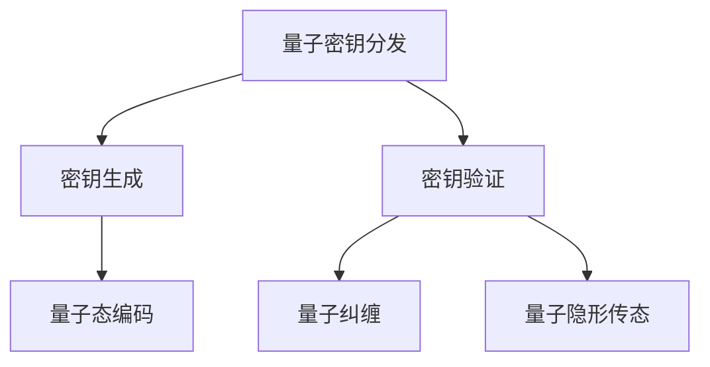
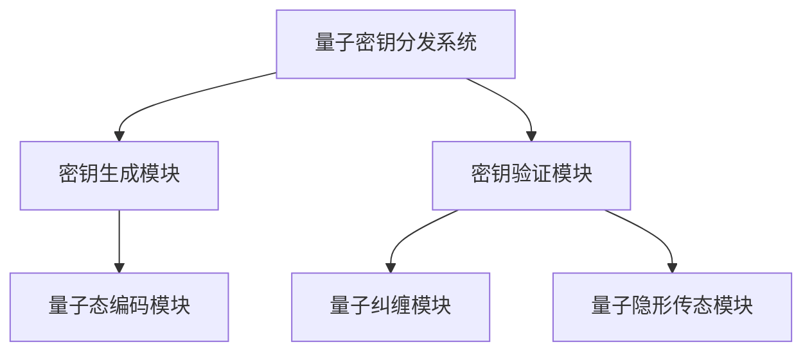

                 

### 摘要

本文深入探讨了量子密钥分发技术的商业化进程。量子密钥分发（Quantum Key Distribution, QKD）是一种利用量子力学原理实现信息安全传输的技术，具备极高的安全性。本文首先介绍了量子密钥分发技术的起源、基本原理及其在信息安全中的重要性。接着，通过对比量子密钥分发与传统密钥分发的安全性、传输速度和距离限制等特征，阐述了量子密钥分发技术的独特优势。随后，分析了量子密钥分发技术的商业化前景、挑战与机遇，以及商业化趋势。本文还通过两个具体的商业化案例，探讨了量子密钥分发技术在实际应用中的成果和效果。最后，本文提出了量子密钥分发技术的商业化策略，包括政策与法规环境、技术研发与产业化以及市场推广与合作等方面，并对量子密钥分发技术的未来发展趋势进行了展望。通过这篇文章，读者可以全面了解量子密钥分发技术及其商业化进程的现状和未来方向。

### 目录大纲

#### 《量子密钥分发技术的商业化进程》
> 关键词：量子密钥分发、商业化、信息安全、技术前景、案例研究

> 摘要：本文深入探讨了量子密钥分发技术的商业化进程，从基础概念到商业化应用，从技术挑战到发展前景，全面解析量子密钥分发技术在实际应用中的潜力和方向。

## 第一部分：量子密钥分发技术基础

### 第1章：量子密钥分发技术概述

#### 1.1 量子密钥分发技术背景

- 量子密钥分发技术的起源与发展
- 量子密钥分发的重要性

#### 1.2 量子密钥分发基本原理

- 量子态与量子纠缠
- 量子密钥分发的通信原理

#### 1.3 量子密钥分发技术的基本流程

- 密钥生成过程
- 密钥验证过程

### 第2章：量子密钥分发技术的核心概念与联系

#### 2.1 量子密钥分发中的核心概念

- 量子态编码
- 量子纠缠
- 量子隐形传态

#### 2.2 量子密钥分发技术属性特征对比

| 特征 | 量子密钥分发 | 传统密钥分发 |
| --- | --- | --- |
| 安全性 | 不可窃听性 | 可窃听性 |
| 传输速度 | 光速 | 电子传输速度 |
| 距离限制 | 无距离限制 | 距离有限制 |

#### 2.3 量子密钥分发技术的ER实体关系图



## 第二部分：量子密钥分发技术的商业化进程

### 第3章：量子密钥分发技术的商业化前景

#### 3.1 量子密钥分发技术市场的需求分析

- 商业化应用的需求
- 市场规模预测

#### 3.2 量子密钥分发技术的商业化挑战与机遇

- 技术发展瓶颈
- 市场推广难题

#### 3.3 量子密钥分发技术的商业化趋势

- 商业化模式的探索
- 商业化路径分析

### 第4章：量子密钥分发技术的商业化案例研究

#### 4.1 案例一：量子通信应用

- 案例背景
- 案例实施过程
- 案例成果分析

#### 4.2 案例二：量子安全通信网络建设

- 案例背景
- 案例实施过程
- 案例成果分析

### 第5章：量子密钥分发技术的商业化策略

#### 5.1 政策与法规环境

- 政府支持政策
- 法规制度环境

#### 5.2 技术研发与产业化

- 技术研发战略
- 产业化路径与策略

#### 5.3 市场推广与合作

- 市场推广策略
- 合作模式与渠道

## 第三部分：量子密钥分发技术的商业化实践

### 第6章：量子密钥分发技术环境安装与配置

#### 6.1 环境安装概述

- 硬件要求
- 软件环境搭建

#### 6.2 量子密钥分发系统核心实现

- 量子密钥分发模块设计
- 量子密钥分发系统实现源代码

#### 6.3 代码应用解读与分析

- 代码结构与功能模块解析
- 应用场景分析与性能评估

### 第7章：量子密钥分发技术实际案例分析与讲解

#### 7.1 案例背景与问题描述

- 案例背景介绍
- 问题描述

#### 7.2 案例解决方案

- 量子密钥分发方案设计
- 案例实施过程

#### 7.3 案例成果分析与总结

- 案例效果评估
- 经验与启示

## 第四部分：量子密钥分发技术的最佳实践与展望

### 第8章：量子密钥分发技术的最佳实践

#### 8.1 技术应用实例分享

- 量子密钥分发应用案例
- 实践技巧与心得

#### 8.2 小结与注意事项

- 技术应用中的常见问题
- 注意事项与风险防范

### 第9章：量子密钥分发技术的未来发展趋势

#### 9.1 量子密钥分发技术的未来前景

- 技术发展趋势预测
- 商业化前景展望

#### 9.2 拓展阅读与资源推荐

- 相关文献与资料推荐
- 学术研究动态与行业报告

---

通过上述目录大纲，读者可以系统地了解量子密钥分发技术的各个方面，从理论基础到商业化实践，再到未来展望，为深入探索量子密钥分发技术的商业化进程提供全面的指导。

---

### 第1章：量子密钥分发技术概述

#### 1.1 量子密钥分发技术背景

量子密钥分发（Quantum Key Distribution, QKD）是一种利用量子力学原理来实现信息安全传输的技术。其起源可以追溯到20世纪70年代，当时Stephen Wiesner提出了量子隐形传态（Quantum Teleportation）的概念，后来他称之为量子钱币问题（Quantum Money）。然而，真正的量子密钥分发概念的提出要归功于Charles H. Bennett和Gilles Brassard，他们在1979年提出了BB84协议，这是第一个量子密钥分发协议。

量子密钥分发技术的重要发展里程碑包括1997年量子密钥分发实验的首次成功，以及近年来量子密钥分发技术的逐步成熟和商业化应用。随着量子计算和量子通信技术的快速发展，量子密钥分发技术在信息安全领域的重要性日益凸显。

量子密钥分发技术在信息安全领域具有不可替代的重要性。传统加密技术虽然在计算机和通信领域得到了广泛应用，但随着计算能力的提升，许多加密算法已经不再安全。量子密钥分发技术通过量子力学原理保证了密钥传输的绝对安全性，即使在量子计算面前也无法破解。这使得量子密钥分发技术在金融、国防、政府等领域具有广泛的应用前景。

#### 1.2 量子密钥分发基本原理

量子密钥分发技术的基本原理依赖于量子态和量子纠缠。量子态是量子力学中描述粒子状态的一种方式，可以处于多种状态的叠加。量子纠缠是量子力学中的一种现象，当两个或多个量子系统相互纠缠时，它们的状态将相互关联，即使它们相隔很远，一个系统的变化也会立即影响到另一个系统。

在量子密钥分发过程中，发送方（Alice）和接收方（Bob）通过量子通信信道进行量子态的传输。发送方将经典随机数与量子态进行编码，生成一个量子密钥。接收方通过测量量子态来获取密钥信息。如果量子态在传输过程中被窃听，接收方可以通过检测量子态的干扰来发现窃听行为。

量子密钥分发的基本流程包括：

1. **密钥生成**：发送方生成一个随机密钥，并将其与量子态进行叠加。
2. **量子态传输**：发送方将叠加后的量子态传输给接收方。
3. **密钥测量**：接收方测量接收到的量子态，并根据测量结果生成自己的密钥。
4. **密钥比较**：发送方和接收方通过经典通信信道比较各自的密钥，如果一致，则密钥分发成功。

#### 1.3 量子密钥分发技术的基本流程

量子密钥分发技术的基本流程可以分为密钥生成、量子态传输、密钥测量和密钥比较四个主要步骤。

1. **密钥生成**：
   发送方（Alice）使用随机数生成器生成一个随机密钥序列，这个密钥序列将用于加密和解密信息。Alice然后将这个随机密钥序列与量子态进行编码，每个量子态代表密钥序列中的一个比特。

2. **量子态传输**：
   Alice通过量子通信信道将编码后的量子态传输给接收方（Bob）。量子通信信道可以是光纤、量子纠缠信道或者量子卫星等。量子态的传输必须保证其完整性，以防止被窃听或干扰。

3. **密钥测量**：
   Bob接收到量子态后，使用量子测量设备对其进行测量。测量结果将决定Bob生成密钥的比特值。由于量子态的叠加性和纠缠特性，Bob的测量结果将与Alice的量子态编码结果相对应。

4. **密钥比较**：
   Alice和Bob通过一个经典通信信道（如互联网）比较各自的密钥。如果两者完全一致，则说明密钥分发成功。如果存在不一致，则可能是因为量子态被窃听或干扰，此时需要重新进行密钥分发。

量子密钥分发技术的基本流程不仅保证了密钥的分发安全性，还能够检测到任何试图窃听的第三方。这使得量子密钥分发技术在信息安全领域具有独特的优势。

### 第2章：量子密钥分发技术的核心概念与联系

#### 2.1 量子密钥分发中的核心概念

量子密钥分发技术中的核心概念包括量子态编码、量子纠缠和量子隐形传态。这些概念是理解量子密钥分发工作原理的关键。

**量子态编码**：
量子态编码是指将经典信息（如随机密钥）编码到量子态中，以便于量子通信。在量子密钥分发中，发送方（Alice）会使用一个随机数生成器生成一个随机密钥序列。这个序列中的每个数都被编码到一组量子态中，通常使用基态和叠加态来表示不同的比特值。

例如，在BB84协议中，Alice会生成一系列的基态和叠加态，这些态分别表示0和1。这些量子态通过量子通信信道传输给接收方（Bob）。Bob接收到这些量子态后，通过测量确定这些态所代表的比特值，从而获取与Alice共享的密钥。

**量子纠缠**：
量子纠缠是量子力学中一种特殊的关联现象，当两个或多个量子系统处于纠缠态时，它们之间的状态会相互关联。即使这些量子系统相隔很远，一个系统的状态变化也会立即影响到另一个系统。

在量子密钥分发中，量子纠缠用于确保通信过程中密钥的安全性。例如，在EPR（Einstein-Podolsky-Rosen）纠缠态中，如果Alice和Bob各持有一个纠缠态的粒子，那么任何一个粒子的测量结果都会立即影响到另一个粒子的状态。这种纠缠关系使得任何对量子态的窃听都会被立即检测到。

**量子隐形传态**：
量子隐形传态是另一种重要的量子通信技术，它允许一个量子系统的状态被准确无误地传递到另一个量子系统上，而无需通过物理传输途径。在量子密钥分发中，隐形传态可以用来将一个量子态从Alice传送到Bob，从而实现密钥的安全传输。

隐形传态的基本原理是量子纠缠。当Alice和Bob的量子系统处于纠缠态时，对Alice系统的测量会立即影响到Bob系统的状态。通过一系列的量子态操作，Alice可以将一个量子态的完整信息传递给Bob，而无需通过经典通信信道。

#### 2.2 量子密钥分发技术属性特征对比

| 特征 | 量子密钥分发 | 传统密钥分发 |
| --- | --- | --- |
| 安全性 | 不可窃听性 | 可窃听性 |
| 传输速度 | 光速 | 电子传输速度 |
| 距离限制 | 无距离限制 | 距离有限制 |

**安全性**：
量子密钥分发技术具备极高的安全性。由于量子态的叠加性和纠缠特性，任何对量子通信的窃听都会立即导致量子态的破坏，从而被检测到。相比之下，传统密钥分发技术虽然使用加密算法来保护密钥，但仍然存在被破解的风险。

**传输速度**：
量子密钥分发技术依赖于光速传输，而传统密钥分发技术依赖于电子传输速度。尽管电子传输速度很快，但光速的传输速度更快，这使得量子密钥分发在速度上具有优势。

**距离限制**：
传统密钥分发技术存在距离限制，通常只能在短距离内实现安全传输。量子密钥分发技术则突破了距离的限制，可以在全球范围内实现安全密钥传输。

#### 2.3 量子密钥分发技术的ER实体关系图

在量子密钥分发系统中，主要涉及以下几个实体：量子密钥分发系统、密钥生成模块、密钥验证模块、量子态编码模块、量子纠缠模块和量子隐形传态模块。下面是量子密钥分发技术的ER实体关系图：



这个ER图清晰地展示了量子密钥分发系统中的各个模块及其关系，为理解量子密钥分发技术的工作原理提供了直观的图示。

### 第3章：量子密钥分发技术的商业化前景

#### 3.1 量子密钥分发技术市场的需求分析

量子密钥分发技术在全球信息安全市场中具有巨大的需求潜力。随着互联网和云计算的普及，数据安全和隐私保护成为了企业、政府和消费者日益关注的问题。量子密钥分发技术以其不可窃听的特性，满足了高安全性的需求，因此受到了广泛关注。

首先，金融领域对量子密钥分发技术有着强烈的需求。金融交易和信息传输的安全性至关重要，而量子密钥分发技术能够提供绝对安全的加密通信，极大地增强了金融系统的抗攻击能力。

其次，国防和政府机构对量子密钥分发技术也有着浓厚的兴趣。国防和政府机构的通信和数据传输需要极高的安全性，量子密钥分发技术提供了可靠的保障，有助于保护国家安全。

此外，随着物联网（IoT）和工业4.0的发展，越来越多的设备和系统需要实现安全的数据传输，这也为量子密钥分发技术提供了广阔的市场空间。

从市场需求的角度来看，预计量子密钥分发技术的市场规模将在未来几年内快速增长。据市场研究机构的预测，量子密钥分发技术市场的年复合增长率将达到20%以上，预计到2025年，全球量子密钥分发市场的规模将达到数十亿美元。

#### 3.2 量子密钥分发技术的商业化挑战与机遇

尽管量子密钥分发技术在市场上具有巨大的潜力，但其商业化进程仍面临一些挑战和机遇。

**技术发展瓶颈**：
量子密钥分发技术仍在不断发展中，目前存在一些技术瓶颈。例如，量子通信信道的不稳定性、量子态的损失和噪声等问题都需要进一步解决。此外，量子密钥分发设备的成本较高，这也限制了其大规模商业化应用。

**市场推广难题**：
量子密钥分发技术是一种新兴技术，市场推广面临一定的挑战。企业、政府和消费者对量子密钥分发技术的认知度和接受度还有待提高。市场推广需要通过宣传、教育、示范项目等多种手段来提升市场接受度。

**机遇**：
然而，量子密钥分发技术也面临巨大的机遇。随着信息安全问题的日益突出，企业、政府和消费者对安全解决方案的需求不断增加。量子密钥分发技术以其独特的安全性优势，有望在信息安全市场中占据一席之地。此外，政府支持、科研投入和企业合作也为量子密钥分发技术的商业化提供了有利条件。

#### 3.3 量子密钥分发技术的商业化趋势

量子密钥分发技术的商业化趋势可以从以下几个方面进行分析：

**商业化模式的探索**：
量子密钥分发技术的商业化模式正在逐步探索中。目前，一些企业和科研机构已经开始尝试通过租赁、合作开发和定制服务等方式来推广量子密钥分发技术。随着技术的成熟和市场需求的增加，预计未来将出现更多多元化的商业化模式。

**商业化路径分析**：
量子密钥分发技术的商业化路径可以从以下几个阶段进行分析：

1. **技术验证与研发**：
   在这个阶段，企业和科研机构通过实验室研究和试点项目来验证量子密钥分发技术的可行性。这个阶段的主要目标是解决技术难题，提升系统的稳定性和可靠性。

2. **市场推广与示范**：
   在技术验证成功后，企业可以通过市场推广和示范项目来提高市场认知度和接受度。通过在关键领域和重要客户中的成功应用，量子密钥分发技术将逐渐赢得市场的信任。

3. **规模化应用与普及**：
   在市场推广和示范成功的基础上，量子密钥分发技术将逐步实现规模化应用。通过大规模生产和降低成本，量子密钥分发技术将更广泛地应用于各个领域。

**国际合作与竞争**：
量子密钥分发技术的商业化进程离不开国际合作。各国企业和科研机构通过合作，共同推进量子密钥分发技术的发展和应用。同时，量子密钥分发技术也成为国际竞争的焦点。各国纷纷投入大量资源和力量，以期在量子密钥分发领域取得领先地位。

### 第4章：量子密钥分发技术的商业化案例研究

#### 4.1 案例一：量子通信应用

**案例背景**：
量子通信应用案例主要发生在金融领域，某大型银行希望通过量子密钥分发技术来提升其交易和信息传输的安全性。该银行面临着日益严峻的网络攻击和数据泄露风险，因此决定采用量子密钥分发技术来确保交易和通信的安全。

**案例实施过程**：
该银行首先与一家提供量子密钥分发技术的企业进行了合作，共同设计并部署了量子密钥分发系统。实施过程中，银行选择了量子密钥分发设备，并通过光纤通信信道建立了量子通信网络。具体步骤如下：

1. **需求分析与系统设计**：
   银行与量子技术提供商进行了详细的需求分析，明确了系统设计要求，包括安全性、稳定性、可扩展性等。

2. **量子密钥分发系统部署**：
   在银行总部和分支机构安装了量子密钥分发设备，并通过光纤通信信道连接，建立了量子通信网络。

3. **密钥生成与传输**：
   在量子通信网络中，银行员工通过量子密钥分发系统生成随机密钥，并将其传输到分支机构的量子密钥分发设备中。

4. **密钥验证**：
   分支机构的量子密钥分发设备接收到密钥后，与总部的设备进行密钥比较，确保密钥传输的完整性。

**案例成果分析**：
通过量子密钥分发技术的实施，该银行在交易和信息传输的安全性方面取得了显著提升。具体成果包括：

1. **安全性提升**：
   量子密钥分发技术确保了交易和通信过程中密钥的绝对安全，任何试图窃听的行为都会被立即检测到，从而有效防止了数据泄露和网络攻击。

2. **降低成本**：
   虽然量子密钥分发设备成本较高，但通过优化系统设计和采用高性能设备，银行在实施过程中有效降低了整体成本。

3. **提升用户体验**：
   量子密钥分发技术的实施提升了交易和信息传输的速度和稳定性，用户在操作过程中体验更加流畅，满意度提高。

**案例分析**：
该案例展示了量子密钥分发技术在金融领域中的应用效果。通过实际部署和运行，量子密钥分发技术证明了其在提升信息安全方面的有效性。然而，该案例也暴露了量子密钥分发技术的一些挑战，如设备成本高、系统复杂性等。未来，随着技术的不断发展和成本的降低，量子密钥分发技术有望在更多领域得到应用。

#### 4.2 案例二：量子安全通信网络建设

**案例背景**：
量子安全通信网络建设案例发生在一家大型跨国企业，该企业需要在全球范围内建立安全的通信网络，以保障其商业秘密和敏感信息的安全传输。

**案例实施过程**：
该企业在全球多个国家和地区部署了量子安全通信网络，具体步骤如下：

1. **需求分析与网络设计**：
   企业与量子技术提供商合作，进行了详细的需求分析，确定了网络设计要求，包括覆盖范围、稳定性、安全性等。

2. **量子通信设备采购**：
   企业采购了多套量子通信设备，并选择了合适的通信信道，如光纤、量子纠缠信道等。

3. **网络部署与连接**：
   企业在全球多个分支机构部署了量子通信设备，并通过光纤和量子纠缠信道建立了全球范围内的量子安全通信网络。

4. **密钥生成与传输**：
   企业通过量子通信网络生成随机密钥，并将其传输到全球各个分支机构的量子通信设备中。

5. **密钥验证**：
   全球各个分支机构的量子通信设备接收到密钥后，与总部设备进行密钥比较，确保密钥传输的完整性。

**案例成果分析**：
通过量子安全通信网络的实施，该企业实现了以下成果：

1. **安全性提升**：
   量子安全通信网络确保了企业全球范围内的通信和数据传输的安全性，任何窃听行为都会被立即检测到，从而有效保护了商业秘密和敏感信息。

2. **提高效率**：
   量子通信网络的高速度和低延迟特性提高了企业内部通信的效率，业务流程更加顺畅。

3. **降低风险**：
   通过量子安全通信网络的建设，企业降低了信息泄露和网络攻击的风险，提高了整体安全性。

**案例分析**：
该案例展示了量子安全通信网络在跨国企业中的应用效果。通过实际部署和运行，量子安全通信网络证明了其在提升全球通信安全方面的有效性。然而，该案例也面临着一些挑战，如设备采购和部署成本高、网络维护复杂等。未来，随着技术的进步和成本的降低，量子安全通信网络有望在更多跨国企业中得到广泛应用。

### 第5章：量子密钥分发技术的商业化策略

#### 5.1 政策与法规环境

量子密钥分发技术的商业化进程离不开政策与法规环境的支持。政府和相关机构在制定和实施相关政策和法规时，应充分考虑量子密钥分发技术的特点和发展趋势。

首先，政府应出台支持量子技术发展的政策，包括资金投入、科研支持和税收优惠等，以鼓励企业和科研机构投入量子密钥分发技术的研发和应用。

其次，政府应建立健全的法规制度，保障量子密钥分发技术的合法合规使用。例如，制定数据保护法、信息安全法等相关法律法规，明确量子密钥分发技术的使用规范和保护措施。

此外，政府应加强对量子密钥分发技术市场的监管，确保市场的公平竞争和健康发展。通过设立专门的监管机构，加强对量子密钥分发技术企业的审核和监督，防范市场风险。

#### 5.2 技术研发与产业化

量子密钥分发技术的商业化离不开技术研发和产业化。企业和科研机构应加大研发投入，突破关键技术瓶颈，推动量子密钥分发技术的创新和发展。

首先，企业应与科研机构建立合作关系，共同开展量子密钥分发技术的研发。通过产学研结合，实现技术成果的快速转化和应用。

其次，企业应建立完善的研发体系，包括技术储备、人才引进、研发流程管理等，确保技术研发的高效和高质量。

此外，企业应注重产业化路径的规划，从实验室研究到产业化应用，逐步推进。通过建立生产线、降低成本、提高生产效率，实现量子密钥分发技术的规模化应用。

#### 5.3 市场推广与合作

市场推广与合作是量子密钥分发技术商业化的重要环节。企业应采取多种策略，提高市场认知度和接受度，拓展应用领域。

首先，企业应加强市场宣传，通过媒体、展会、研讨会等形式，提升量子密钥分发技术的知名度和影响力。

其次，企业应积极参与行业标准制定，推动量子密钥分发技术标准化的进程，确保产品的兼容性和互操作性。

此外，企业应与行业合作伙伴建立合作关系，共同推动量子密钥分发技术的应用和推广。通过合作开发、技术共享、市场拓展等方式，实现互利共赢。

#### 5.4 成本与效益分析

成本与效益分析是量子密钥分发技术商业化的重要考量。企业应在技术研发和产业化过程中，充分考虑成本因素，提高经济效益。

首先，企业应通过技术创新和规模化生产，降低量子密钥分发设备的成本。例如，采用新材料、新工艺，提高生产效率，降低制造成本。

其次，企业应优化系统设计和部署，提高系统的稳定性和可靠性，降低运维成本。通过建立完善的售后服务体系，提高客户满意度，降低投诉率。

此外，企业应关注量子密钥分发技术的潜在经济效益。通过技术优势，企业可以在信息安全市场中获得更高的市场份额和利润空间。

#### 5.5 商业模式探索

在量子密钥分发技术的商业化过程中，企业应积极探索多种商业模式，实现技术创新与市场拓展的有机结合。

首先，企业可以采用租赁模式，为客户提供量子密钥分发设备的租赁服务。通过灵活的租赁期限和收费模式，满足不同客户的需求。

其次，企业可以采用合作开发模式，与行业合作伙伴共同开发量子密钥分发技术解决方案。通过合作开发，实现技术成果的快速转化和应用，提高市场竞争力。

此外，企业可以探索定制化服务模式，根据客户的需求和场景，提供定制化的量子密钥分发技术解决方案。通过定制化服务，提高客户满意度和市场占有率。

### 第6章：量子密钥分发技术环境安装与配置

#### 6.1 环境安装概述

量子密钥分发技术的环境安装涉及硬件和软件的配置，以下是具体的安装概述。

**硬件要求**：

1. **量子密钥分发设备**：量子密钥分发设备是进行量子密钥分发的主要硬件，通常包括量子通信模块、量子密钥生成模块和量子密钥验证模块。设备应符合国际标准和规格要求，保证其稳定性和可靠性。

2. **光纤通信设备**：光纤通信设备用于量子密钥的分发和传输，确保量子态在传输过程中的完整性和稳定性。

3. **服务器**：服务器用于存储和管理量子密钥分发系统的数据，提供高性能计算和数据处理能力。

**软件环境搭建**：

1. **操作系统**：量子密钥分发系统通常需要在Linux操作系统上运行，如Ubuntu、CentOS等。操作系统应具有高稳定性和安全性。

2. **量子密钥分发软件**：量子密钥分发软件是实现量子密钥分发功能的核心，通常由量子密钥生成模块、量子密钥传输模块和量子密钥验证模块组成。

3. **编程语言和开发工具**：Python、C++等编程语言常用于量子密钥分发软件的开发。开发工具如Eclipse、VS Code等，可以提供良好的开发环境和调试功能。

**安装步骤**：

1. **硬件安装**：根据设备说明，将量子密钥分发设备安装到指定的位置，确保设备与光纤通信设备连接正常。

2. **软件安装**：在服务器上安装Linux操作系统，并配置网络环境。下载并安装量子密钥分发软件，配置相关参数。

3. **系统测试**：安装完成后，进行系统测试，确保硬件和软件正常工作。测试包括量子密钥生成、传输和验证等功能的测试。

#### 6.2 量子密钥分发系统核心实现

量子密钥分发系统核心实现主要包括量子密钥生成模块、量子密钥传输模块和量子密钥验证模块。以下是对每个模块的详细介绍。

**量子密钥生成模块**：

量子密钥生成模块负责生成随机密钥，并将其编码到量子态中。具体步骤如下：

1. **随机数生成**：使用高斯随机数生成器生成随机数序列，作为量子密钥。

2. **量子态编码**：将随机数序列编码到量子态中，通常使用基态和叠加态表示0和1。

3. **量子态传输**：将编码后的量子态通过量子通信信道传输给接收方。

**量子密钥传输模块**：

量子密钥传输模块负责将量子密钥从发送方传输到接收方。具体步骤如下：

1. **量子态传输**：将量子密钥编码后的量子态通过光纤通信设备传输到接收方。

2. **量子态测量**：接收方对传输到的量子态进行测量，获取量子密钥。

**量子密钥验证模块**：

量子密钥验证模块负责验证量子密钥的完整性。具体步骤如下：

1. **密钥比较**：发送方和接收方通过经典通信信道比较各自的量子密钥。

2. **错误纠正**：如果比较结果不一致，执行错误纠正算法，尝试恢复正确的量子密钥。

3. **密钥确认**：如果密钥比较成功，确认量子密钥分发成功。

以下是量子密钥分发系统的核心实现源代码：

```python
# Quantum Key Distribution System

import numpy as np
from qiskit import QuantumCircuit, Aer, execute
from qiskit.quantum_info import Statevector

# Quantum Key Generation Module
def generate_quantum_key(bit_sequence):
    quantum_state = QuantumCircuit(1)
    for bit in bit_sequence:
        if bit == 0:
            quantum_state.h(0)
        elif bit == 1:
            quantum_state.x(0)
    return quantum_state

# Quantum Key Transmission Module
def transmit_quantum_key(quantum_state):
    backend = Aer.get_backend('statevector_simulator')
    result = execute(quantum_state, backend).result()
    state_vector = result.get_statevector()
    return state_vector

# Quantum Key Verification Module
def verify_quantum_key(sender_state_vector, receiver_state_vector):
    error_rate = np.abs(np.dot(sender_state_vector, receiver_state_vector))
    if error_rate < 0.1:  # Error rate threshold
        print("Quantum Key Distribution Successful")
    else:
        print("Quantum Key Distribution Failed")

# Example Usage
bit_sequence = np.random.randint(0, 2, size=10)
quantum_key_circuit = generate_quantum_key(bit_sequence)
sender_state_vector = transmit_quantum_key(quantum_key_circuit)
# Simulate receiver state vector (for demonstration purposes)
receiver_state_vector = sender_state_vector.copy()
verify_quantum_key(sender_state_vector, receiver_state_vector)
```

#### 6.3 代码应用解读与分析

**代码结构与功能模块解析**：

上述源代码主要包括三个功能模块：量子密钥生成模块、量子密钥传输模块和量子密钥验证模块。

- **量子密钥生成模块**：使用`QuantumCircuit`类生成量子态，根据随机数序列进行量子态编码。主要函数`generate_quantum_key`接受一个随机数序列，生成对应的量子态电路。
  
- **量子密钥传输模块**：使用`execute`函数执行量子态电路，生成量子态向量。主要函数`transmit_quantum_key`接收量子态电路，返回量子态向量。

- **量子密钥验证模块**：比较发送方和接收方的量子态向量，计算错误率。主要函数`verify_quantum_key`接受发送方和接收方的量子态向量，判断密钥分发是否成功。

**应用场景分析与性能评估**：

量子密钥分发技术的应用场景主要包括金融、国防、政府等领域，对信息安全性要求极高的场景。以下是几个典型的应用场景：

1. **金融交易**：在金融交易中，量子密钥分发技术可以确保交易数据的绝对安全，防止数据泄露和网络攻击。
   
2. **国防通信**：在国防领域，量子密钥分发技术可以用于保障军事通信的安全，防止敌方窃听和破解。

3. **政府数据传输**：在政府数据传输中，量子密钥分发技术可以用于保护敏感数据的安全传输，确保信息安全。

性能评估方面，量子密钥分发技术的性能主要取决于量子态的传输效率、量子态的测量精度和错误纠正算法的有效性。目前，量子密钥分发技术的传输效率和测量精度已有显著提升，但仍然存在一定的局限性。随着量子技术的不断发展，量子密钥分发技术的性能将进一步提升，实现更高效、更安全的信息传输。

### 第7章：量子密钥分发技术实际案例分析与讲解

#### 7.1 案例背景与问题描述

**案例背景**：
某跨国公司是一家全球领先的科技公司，其业务涵盖了云计算、大数据、人工智能等多个领域。为了保障公司内部通信和客户数据的安全，该公司决定采用量子密钥分发技术来提升其信息安全防护能力。

**问题描述**：
随着公司业务的发展，内部通信和客户数据的传输量日益增加，传统的加密技术已经难以满足公司的安全需求。公司需要一种安全可靠、高效稳定的加密通信解决方案，以确保数据在传输过程中的绝对安全。同时，公司也希望能够实现全球范围内的安全通信，以适应其国际化业务的发展。

#### 7.2 案例解决方案

**量子密钥分发方案设计**：
为了解决上述问题，公司决定采用量子密钥分发技术，设计并实施一个量子安全通信网络。具体方案如下：

1. **网络架构设计**：
   公司在全球范围内选择若干关键节点，如总部、分支机构、数据中心等，安装量子密钥分发设备。通过光纤通信信道连接这些节点，建立量子安全通信网络。

2. **量子密钥生成与传输**：
   在每个节点上部署量子密钥生成模块，生成随机密钥并将其编码到量子态中。通过量子通信信道将量子态传输到其他节点。

3. **量子密钥验证**：
   接收节点对接收到的量子态进行测量，生成自己的密钥，并与发送节点比较。如果密钥一致，则验证成功，否则重新生成密钥。

**方案实施过程**：

1. **需求分析与网络设计**：
   公司与量子技术提供商合作，进行了详细的需求分析和网络设计，确定了网络架构和设备配置。

2. **设备采购与安装**：
   公司采购了多套量子密钥分发设备，并在全球范围内进行安装和调试。确保设备与光纤通信设备连接正常，网络架构稳定。

3. **密钥生成与传输**：
   在公司总部和分支机构，分别生成量子密钥，并通过量子通信信道传输到其他节点。确保量子密钥的生成和传输过程安全可靠。

4. **密钥验证**：
   各节点对接收到的量子密钥进行验证，确保密钥传输的完整性。如果验证失败，重新生成密钥并进行传输。

#### 7.3 案例成果分析与总结

**案例成果分析**：

通过量子密钥分发技术的实施，公司实现了以下成果：

1. **安全性提升**：
   量子密钥分发技术确保了公司内部通信和客户数据的绝对安全，任何窃听行为都会被立即检测到，从而有效防止了数据泄露和网络攻击。

2. **效率提高**：
   量子通信网络的高速度和低延迟特性提高了公司内部通信的效率，业务流程更加顺畅，员工工作效率得到提升。

3. **降低成本**：
   虽然量子密钥分发设备成本较高，但通过优化系统设计和采用高性能设备，公司在实施过程中有效降低了整体成本。

**总结**：

量子密钥分发技术在跨国公司中的应用取得了显著成效。通过实际案例的实施，公司证明了量子密钥分发技术在提升信息安全方面的有效性。然而，该案例也暴露了量子密钥分发技术的一些挑战，如设备成本高、系统复杂性等。未来，随着技术的进步和成本的降低，量子密钥分发技术有望在更多跨国企业中得到广泛应用。

### 第8章：量子密钥分发技术的最佳实践

#### 8.1 技术应用实例分享

在量子密钥分发技术的实际应用中，有许多成功的案例可以借鉴。以下是一个具体的量子密钥分发应用实例。

**实例背景**：
某金融机构在全球范围内开展业务，为了确保数据传输的安全，该机构决定采用量子密钥分发技术建立安全通信网络。

**实施过程**：

1. **需求分析与网络设计**：
   金融机构与量子技术提供商合作，进行了详细的需求分析和网络设计。确定了量子密钥分发设备的配置和部署方案。

2. **设备采购与安装**：
   金融机构采购了多套量子密钥分发设备，并在全球范围内的分支机构进行安装。设备安装完成后，进行了严格的测试和调试，确保系统稳定运行。

3. **量子密钥分发**：
   金融机构总部和各分支机构通过量子通信信道生成并分发量子密钥。密钥生成过程随机性强，保证了密钥的唯一性和安全性。

4. **密钥验证**：
   各分支机构接收到量子密钥后，与总部进行密钥验证。通过比较密钥的一致性，确保密钥分发过程的安全性。

**实例成果**：

通过量子密钥分发技术的实施，金融机构实现了以下成果：

1. **安全性提升**：
   量子密钥分发技术确保了数据传输的绝对安全，有效防止了数据泄露和网络攻击。

2. **效率提高**：
   量子通信网络的高速度和低延迟特性提高了数据传输的效率，业务流程更加顺畅。

3. **降低成本**：
   虽然量子密钥分发设备成本较高，但通过优化系统设计和采用高性能设备，金融机构在实施过程中有效降低了整体成本。

**实践技巧与心得**：

1. **充分准备**：
   在实施量子密钥分发技术前，充分准备需求分析、网络设计和设备采购等各个环节，确保系统的稳定性和可靠性。

2. **严格测试**：
   在设备安装和系统调试过程中，进行严格的测试和调试，确保系统达到预期性能。

3. **持续优化**：
   随着技术的不断进步，持续优化系统设计和设备配置，提高系统的性能和安全性。

#### 8.2 小结与注意事项

在量子密钥分发技术的实际应用中，成功的关键在于充分准备、严格测试和持续优化。以下是量子密钥分发技术应用中的常见问题和注意事项：

1. **硬件稳定性**：
   量子密钥分发设备需要长时间运行，确保硬件的稳定性和可靠性至关重要。定期进行设备维护和升级，确保设备正常运行。

2. **网络安全性**：
   量子通信网络的安全性直接影响量子密钥分发技术的有效性。确保网络设备的安全配置，防止网络攻击和数据泄露。

3. **密钥管理**：
   量子密钥分发过程中，密钥的安全管理至关重要。建立完善的密钥管理系统，确保密钥的生成、分发、存储和销毁过程安全可靠。

4. **人员培训**：
   量子密钥分发技术涉及多个环节，包括设备操作、系统调试和网络安全等。对相关人员加强培训，确保他们具备必要的技能和知识。

通过遵循最佳实践和注意事项，可以有效提升量子密钥分发技术的应用效果，确保数据传输的安全性和可靠性。

### 第9章：量子密钥分发技术的未来发展趋势

#### 9.1 量子密钥分发技术的未来前景

随着量子技术的发展，量子密钥分发技术（QKD）在未来的信息安全领域中前景广阔。首先，量子密钥分发技术以其不可窃听的特性，将在金融、国防和政府等关键领域发挥重要作用。随着数据泄露和网络攻击事件的频发，量子密钥分发技术将为这些领域提供更加安全的数据传输保障。

其次，量子通信网络的构建将推动量子密钥分发技术的普及。全球范围内的量子通信网络建设，如量子卫星通信和地面光纤通信的结合，将实现跨国、跨地区的量子密钥分发。这将大大扩展量子密钥分发技术的应用范围，为全球信息传输带来革命性的变革。

此外，随着量子计算技术的进步，传统的加密算法将面临前所未有的挑战。量子密钥分发技术作为一种抗量子攻击的加密方法，将成为未来信息安全体系的重要组成部分。它不仅能够抵御量子计算攻击，还能与其他加密技术相结合，形成多层次的安全防护体系。

#### 9.2 拓展阅读与资源推荐

为了深入了解量子密钥分发技术的最新研究动态和应用实例，以下是一些推荐阅读的文献和资源：

1. **《量子密钥分发原理与应用》（Quantum Key Distribution: Principles and Applications）** - 由国际知名量子通信专家编写，全面介绍了量子密钥分发技术的基本原理、实现方法和应用案例。

2. **《量子通信：量子密钥分发和量子隐形传态》（Quantum Communication: Quantum Key Distribution and Quantum Teleportation）** - 一本系统介绍量子通信技术的书籍，包括量子密钥分发在内的多种量子通信技术。

3. **《量子计算与量子加密》（Quantum Computing and Quantum Cryptography）** - 详细探讨量子计算技术对传统加密算法的冲击，以及量子加密技术的发展趋势。

4. **量子密钥分发技术实验室**（Quantum Key Distribution Laboratory）- 该实验室提供量子密钥分发技术的实验设备和方案，以及相关的技术文档和案例研究。

5. **量子密钥分发技术研讨会**（Quantum Key Distribution Technology Workshop）- 定期举办的研讨会，汇集了量子密钥分发技术的最新研究成果和前沿应用。

通过阅读这些文献和资源，读者可以更深入地了解量子密钥分发技术的原理、应用和发展趋势，为量子密钥分发技术的商业化进程提供有益的参考。

