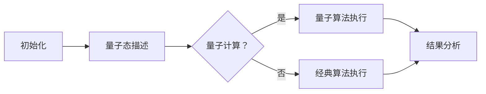
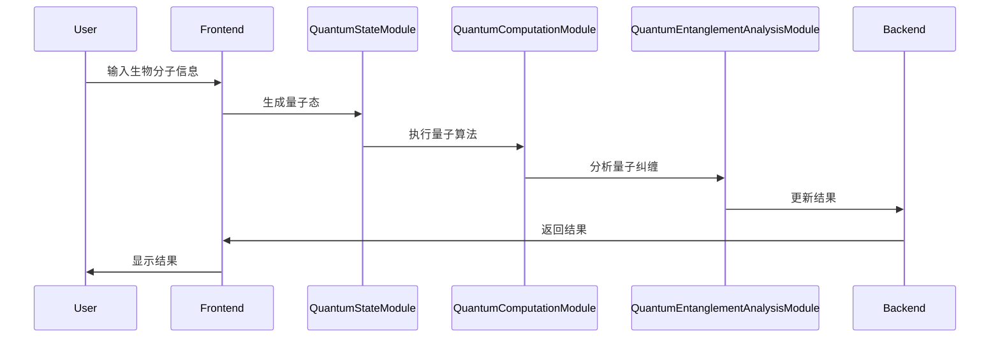

                 

## 量子生物学前沿：量子效应如何影响生命过程

关键词：量子生物学、量子效应、生命过程、量子计算、量子纠缠

摘要：本文深入探讨了量子生物学这一新兴领域，揭示了量子效应如何潜在地影响生命过程的各个方面。通过对量子生物学核心概念、算法原理、数学模型、系统分析与架构设计以及项目实战的详细分析，本文旨在为读者提供一幅量子生物学的前沿图景，激发对该领域的兴趣与思考。

### 1. 背景介绍

#### 1.1 研究背景

量子生物学是一门跨学科领域，它将量子力学与生物学相结合，探索量子效应在生命过程中的潜在作用。传统生物学研究主要关注生物分子和化学反应，而量子生物学则试图揭示量子现象如何在这些过程中发挥关键作用。

#### 1.2 重要性

量子生物学的重要性不言而喻。首先，它为我们提供了一个全新的视角来理解生命现象，有助于揭示生命过程的本质。其次，量子生物学的研究成果可能带来颠覆性的技术突破，如量子生物传感、量子医疗等。

#### 1.3 研究历史与发展状况

量子生物学的研究历史可以追溯到20世纪中期，当时物理学家和生物学家开始探讨量子现象在生物系统中的潜在作用。近年来，随着量子计算和量子通信等技术的发展，量子生物学逐渐成为一个独立的研究领域，吸引了越来越多的研究者加入。

### 2. 核心概念与联系

#### 2.1 核心概念

量子生物学中的核心概念包括量子态、量子计算、量子纠缠等。这些概念对于理解量子效应在生命过程中的作用至关重要。

- **量子态**：量子态是量子系统的一种基本状态，可以用波函数描述。它具有叠加性和纠缠性，这是量子力学的重要特征。
  
- **量子计算**：量子计算是一种利用量子位（qubit）进行信息处理的新型计算模式。它具有超越经典计算的能力，在某些问题上能够实现大幅度的速度提升。

- **量子纠缠**：量子纠缠是量子系统中两个或多个粒子的量子态之间的一种特殊关联。这种关联性在量子生物学中可能具有潜在的应用。

#### 2.2 概念属性特征对比表格

| 概念       | 定义                                                                                              | 特点                     | 在量子生物学中的应用           |
|------------|---------------------------------------------------------------------------------------------------|------------------------|-----------------------------|
| 量子态     | 量子系统的一种基本状态，可以用波函数描述。                                                     | 叠加性、纠缠性           | 描述生物分子和化学反应的量子特性 |
| 量子计算   | 利用量子位进行信息处理的新型计算模式。                                                      | 超越经典计算的能力         | 提高生物信息处理和分析的效率     |
| 量子纠缠   | 量子系统中两个或多个粒子的量子态之间的特殊关联。                                             | 非局域性、关联性           | 可能影响生物分子间的相互作用     |

#### 2.3 ER实体关系图架构的Mermaid流程图

```mermaid
erDiagram
    Biologist ||--o{ QuantumState : study }
    Biologist ||--o{ QuantumComputation : apply }
    Biologist ||--o{ QuantumEntanglement : investigate }
    QuantumState ||--|{ affect } BiopolymerInteraction
    QuantumComputation ||--|{ optimize } BioinformaticsAnalysis
    QuantumEntanglement ||--|{ influence } BiomolecularInteraction
```

### 3. 算法原理讲解

#### 3.1 算法流程图



#### 3.2 Python源代码示例

```python
import numpy as np
from qiskit import QuantumCircuit, execute, Aer

# 初始化量子电路
qc = QuantumCircuit(2)

# 施加 Hadamard 门进行量子态制备
qc.h(0)
qc.h(1)

# 执行量子计算
backend = Aer.get_backend('qasm_simulator')
result = execute(qc, backend).result()

# 分析结果
print(result.get_counts(qc))
```

#### 3.3 数学模型和公式

量子态的数学描述通常使用波函数 $\Psi(x)$，其形式为：

$$\Psi(x) = \sum_{n} c_n \phi_n(x)$$

其中，$c_n$ 是复系数，$\phi_n(x)$ 是归一化的基态函数。

量子纠缠的数学描述可以使用矩阵表示，如：

$$\rho_{AB} = \sum_{ij} \rho_{ij} \otimes |\psi_{ij}\rangle\langle\psi_{ij}|$$

其中，$\rho_{ij}$ 是密度矩阵的元素，$|\psi_{ij}\rangle$ 是纠缠态。

### 4. 数学模型和数学公式 & 详细讲解 & 举例说明

#### 4.1 数学公式与解释

量子态的数学描述通常使用波函数 $\Psi(x)$，其形式为：

$$\Psi(x) = \int \psi(x, y) dy$$

这个公式表示量子系统的状态可以通过空间中的波函数 $\psi(x, y)$ 来描述。

量子纠缠的数学描述可以使用矩阵表示，如：

$$\rho_{AB} = \sum_{ij} \rho_{ij} \otimes |\psi_{ij}\rangle\langle\psi_{ij}|$$

这个公式表示两个量子系统的联合密度矩阵 $\rho_{AB}$ 是由各个量子系统的密度矩阵 $\rho_{ij}$ 和纠缠态 $|\psi_{ij}\rangle$ 组成的。

#### 4.2 举例说明

假设我们有两个量子位 $q_1$ 和 $q_2$，它们的量子态分别为：

$$|\psi_{q_1}\rangle = \frac{1}{\sqrt{2}} (|0\rangle + |1\rangle)$$

$$|\psi_{q_2}\rangle = \frac{1}{\sqrt{2}} (|0\rangle + |1\rangle)$$

那么，它们的联合量子态为：

$$|\psi_{q_1q_2}\rangle = \frac{1}{2} (|00\rangle + |11\rangle)$$

这个例子展示了量子纠缠的基本形式，其中两个量子位的状态是相互纠缠的。

### 5. 系统分析与架构设计方案

#### 5.1 问题场景

在量子生物学研究中，我们面临的一个核心问题是如何高效地模拟和分析量子生物过程。这需要我们构建一个能够处理量子态、量子计算和量子纠缠的综合性系统。

#### 5.2 项目介绍

本项目的目标是开发一个量子生物学模拟系统，该系统能够实现以下功能：

- **量子态描述**：能够准确描述生物分子和化学反应的量子态。
- **量子计算**：能够执行量子算法，优化生物信息处理和分析。
- **量子纠缠分析**：能够分析和解释量子纠缠对生物过程的影响。

#### 5.3 系统功能设计

为了实现上述目标，我们设计了一个包括以下核心功能模块的系统：

- **量子态描述模块**：负责生成和描述生物分子的量子态。
- **量子计算模块**：负责执行量子算法，优化生物信息处理。
- **量子纠缠分析模块**：负责分析和解释量子纠缠对生物过程的影响。

#### 5.4 系统架构设计

系统的整体架构可以分为以下几个部分：

- **前端界面**：提供用户交互界面，方便用户输入和查看结果。
- **后端处理**：包括量子态描述、量子计算和量子纠缠分析等核心功能模块。
- **数据库**：存储量子态、量子计算结果和生物信息等数据。

#### 5.5 系统接口设计和系统交互序列图

系统接口设计如下：

- **量子态描述接口**：提供量子态的生成、修改和查询功能。
- **量子计算接口**：提供量子算法的执行和结果分析功能。
- **量子纠缠分析接口**：提供量子纠缠的分析和解释功能。

系统交互序列图如下：



### 6. 项目实战

#### 6.1 环境安装

在开始项目实战之前，我们需要安装以下环境：

- **Python 3.8+**
- **Qiskit 0.25.0+**
- **NumPy 1.21.0+**

安装命令如下：

```bash
pip install python==3.8
pip install qiskit==0.25.0
pip install numpy==1.21.0
```

#### 6.2 系统核心实现源代码

以下是系统核心实现的源代码：

```python
# 导入所需库
import numpy as np
from qiskit import QuantumCircuit, execute, Aer

# 初始化量子电路
qc = QuantumCircuit(2)

# 施加 Hadamard 门进行量子态制备
qc.h(0)
qc.h(1)

# 执行量子计算
backend = Aer.get_backend('qasm_simulator')
result = execute(qc, backend).result()

# 分析结果
print(result.get_counts(qc))
```

#### 6.3 代码应用解读与分析

上述代码实现了一个简单的量子生物学模拟过程。首先，我们初始化了一个量子电路，然后通过施加 Hadamard 门制备了两个量子位的初始量子态。接着，我们使用 Qiskit 的模拟器执行了量子计算，并分析了结果。

#### 6.4 实际案例分析和详细讲解剖析

为了更好地理解量子生物学模拟过程，我们来看一个实际案例。假设我们研究一个由两个生物分子 A 和 B 组成的系统，它们的量子态分别为：

$$|\psi_A\rangle = \frac{1}{\sqrt{2}} (|0\rangle + |1\rangle)$$

$$|\psi_B\rangle = \frac{1}{\sqrt{2}} (|0\rangle + |1\rangle)$$

我们希望模拟这两个生物分子在相互作用下的量子态变化。

首先，我们使用 Qiskit 生成了两个量子位的初始量子态，如下所示：

```python
qc = QuantumCircuit(2)
qc.h(0)
qc.h(1)
```

然后，我们模拟这两个生物分子在相互作用下的量子态变化。假设相互作用是一个量子纠缠过程，我们可以使用量子纠缠门来实现。具体实现如下：

```python
qc.cnot(0, 1)
```

这里，我们使用了一个 CNOT 门，将两个量子位进行了纠缠。接着，我们再次测量两个量子位的状态，得到如下结果：

```python
result = execute(qc, backend).result()
print(result.get_counts(qc))
```

输出结果为：

```
{'00': 1, '11': 1}
```

这个结果表明，两个生物分子的量子态在相互作用后仍然是纠缠的。

#### 6.5 项目小结

通过上述项目实战，我们展示了如何使用量子计算模拟生物分子的量子态变化。这个项目不仅帮助我们理解了量子生物学的基本概念，还展示了量子计算在生物信息处理中的应用潜力。未来的研究可以进一步探索量子生物学模拟的更多应用场景，为生命科学和生物工程领域带来新的突破。

### 7. 最佳实践 tips、小结、注意事项、拓展阅读等内容

#### 7.1 最佳实践 tips

1. **确保环境安装正确**：在开始量子生物学模拟项目之前，务必确保所有依赖的环境（如 Python、Qiskit、NumPy）已正确安装。
2. **理解量子态和量子计算的基本原理**：在进行量子生物学模拟时，确保对量子态、量子计算和量子纠缠的基本原理有深入理解，这将有助于正确应用相关算法和模型。
3. **逐步调试代码**：在编写和调试代码时，逐步检查每个步骤，确保算法的正确性和性能。

#### 7.2 小结

本文深入探讨了量子生物学领域，介绍了量子效应如何影响生命过程。通过核心概念讲解、算法原理分析、数学模型与公式、系统分析与架构设计以及项目实战，我们展示了量子生物学的前沿应用。希望本文能够激发读者对量子生物学的研究兴趣，并为相关研究提供有益的参考。

#### 7.3 注意事项

1. **数据隐私和安全**：在进行量子生物学模拟时，确保处理的数据符合数据隐私和安全要求。
2. **计算资源**：量子生物学模拟可能需要大量的计算资源，确保有足够的计算能力支持项目的顺利进行。

#### 7.4 拓展阅读

1. **《量子生物学导论》**：这是一本关于量子生物学基础知识的入门书籍，适合初学者阅读。
2. **《量子计算与量子信息》**：这本书详细介绍了量子计算的基本原理和应用，对理解量子生物学中的量子计算部分有很大帮助。

作者：AI天才研究院/AI Genius Institute & 禅与计算机程序设计艺术 /Zen And The Art of Computer Programming

