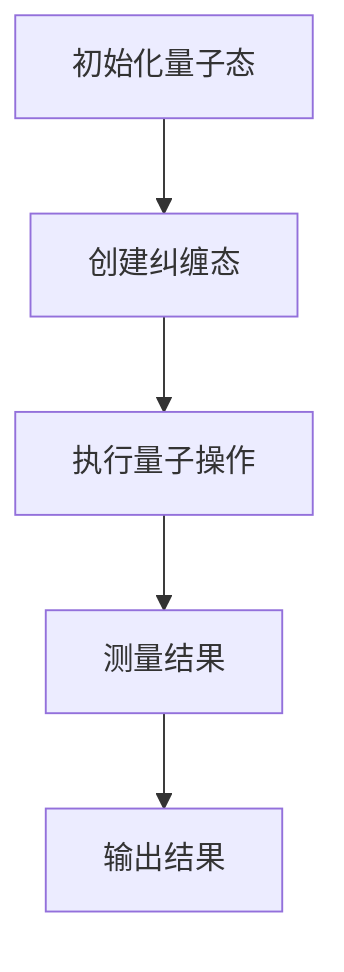
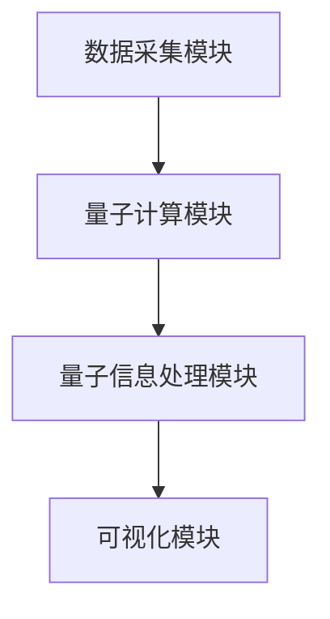
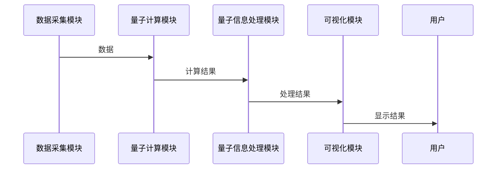

                 


### 量子生物学的纠缠理论：生命过程的量子数学

#### 关键词：量子生物学，纠缠理论，生命过程，量子数学，算法原理，系统分析，项目实战

#### 摘要：
本文将深入探讨量子生物学中的核心概念——纠缠理论，以及其在生命过程中的应用。通过量子数学的视角，我们将分析纠缠理论的基本原理，阐述其在生物系统中的应用。本文还将详细介绍相关算法原理、数学模型，以及系统分析与架构设计方案，并通过项目实战来验证理论的实际应用效果。最后，我们将分享最佳实践、注意事项，并提供拓展阅读，帮助读者更全面地理解量子生物学与纠缠理论。

#### 目录大纲：

## 第一部分: 背景与核心概念

### 第1章: 量子生物学与生命过程的量子数学

#### 1.1 量子生物学概述
- 量子生物学的定义与发展历程
- 量子生物学研究的关键领域

#### 1.2 量子数学基础
- 量子数学的基本概念
- 量子数学与经典数学的区别

#### 1.3 纠缠理论介绍
- 纠缠态的定义
- 纠缠态在生物学中的应用

## 第二部分: 算法原理与数学模型

### 第2章: 量子生物学中的纠缠理论应用

#### 2.1 量子纠缠态与生物系统
- 纠缠态在生物分子中的作用
- 量子纠缠与生物信息传递

#### 2.2 算法原理讲解
- 基于纠缠理论的量子算法
- 算法mermaid流程图

#### 2.3 数学模型与公式解析
- 量子数学模型的基本公式
- 量子数学模型的应用实例

## 第三部分: 系统分析与架构设计

### 第3章: 量子生物学系统的设计原则

#### 3.1 系统概述
- 量子生物学系统的研究目标
- 系统的主要功能模块

#### 3.2 架构设计
- 系统架构图
- 系统接口设计

#### 3.3 交互设计与实现
- 系统交互mermaid序列图
- 交互设计原则与实践

## 第四部分: 项目实战

### 第4章: 量子生物学实验案例

#### 4.1 实验背景
- 实验目的与意义

#### 4.2 系统实现
- 系统核心代码实现

#### 4.3 实验结果与分析
- 数据处理与分析方法
- 实验结果展示

### 第5章: 项目总结与反思

#### 5.1 项目小结
- 项目成果总结

#### 5.2 注意事项与最佳实践
- 实验中的常见问题与解决方法
- 项目实践中的经验分享

#### 5.3 拓展阅读
- 量子生物学与纠缠理论的最新研究进展

### 引言

#### 量子生物学与纠缠理论的兴起

量子生物学作为一门跨学科的研究领域，近年来在生物学、物理学、计算机科学等多个学科中引起了广泛关注。纠缠理论作为量子力学中的核心概念，其应用范围已从物理学扩展到生物学、化学等众多领域。在量子生物学中，纠缠理论提供了一个全新的视角，揭示了生命过程中的量子现象。

量子生物学研究的关键领域包括量子生物信息的传递、量子计算在生物学中的应用、量子力学与生物系统的相互作用等。量子生物信息传递研究探讨了量子纠缠在生物分子中的作用，揭示了生物信息传递的量子机制。量子计算在生物学中的应用则通过模拟量子系统，提高了复杂生物过程的计算效率。

本文旨在深入探讨量子生物学中的纠缠理论，阐述其在生命过程中的应用。通过量子数学的视角，我们将分析纠缠理论的基本原理，并详细介绍相关算法原理、数学模型，以及系统分析与架构设计方案。最后，我们将通过项目实战验证理论的实际应用效果，分享最佳实践和拓展阅读，帮助读者更全面地理解量子生物学与纠缠理论。

#### 核心概念术语说明

为了更好地理解本文内容，我们需要先了解一些核心概念术语，包括：

- **量子生物学**：研究生物系统中量子现象及其在生物过程中的作用的学科。
- **纠缠理论**：量子力学中描述两个或多个量子系统之间量子态相互关联的现象。
- **量子数学**：运用量子力学的数学工具和概念来解决生物学问题的一门学科。
- **量子计算**：利用量子位（qubit）进行信息处理和计算的技术。
- **生物分子**：构成生命体的基本分子，如DNA、RNA、蛋白质等。
- **量子纠缠态**：量子系统中两个或多个粒子之间的一种特殊关联状态，无论距离多远，其中一个粒子的状态会立即影响到另一个粒子的状态。

### 1.1 量子生物学概述

#### 定义与发展历程

量子生物学是20世纪末兴起的一个跨学科研究领域，它结合了量子力学、生物学、化学等多个学科的理论和方法，旨在揭示生命过程中的量子现象。量子生物学的定义可以概括为：研究生物系统中量子现象及其在生物过程中的作用的学科。

量子生物学的发展历程可以追溯到20世纪50年代，当时科学家发现了光合作用中的量子效率现象，这引起了人们对生物过程中量子现象的广泛关注。随着量子力学理论的发展，越来越多的科学家开始尝试将量子力学的原理应用于生物学研究。20世纪80年代，量子生物学的概念逐渐成形，研究领域不断扩大，涉及量子生物信息的传递、量子计算在生物学中的应用、量子力学与生物系统的相互作用等多个方面。

#### 关键领域

量子生物学研究的关键领域包括：

1. **量子生物信息的传递**：探讨生物分子中的量子纠缠现象，揭示生物信息传递的量子机制。这方面的研究有助于我们理解生物体的基因表达、蛋白质合成等关键生命过程。

2. **量子计算在生物学中的应用**：利用量子计算技术模拟生物分子和生物系统的复杂过程，提高计算效率和精确度。量子计算在药物设计、基因测序、生物大分子结构预测等领域具有巨大潜力。

3. **量子力学与生物系统的相互作用**：研究量子力学原理在生物系统中的作用，如光合作用中的量子效率、生物大分子中的量子隧穿效应等。这些研究有助于我们更深入地理解生物体的功能和机制。

4. **量子生物学实验方法**：开发和应用新的实验技术，如量子干涉仪、量子点技术等，以探索生物系统中的量子现象。

### 1.2 量子数学基础

#### 量子数学的基本概念

量子数学是量子力学在数学领域的应用，它涉及量子态、量子算符、测量等基本概念。以下是量子数学中的一些基本概念：

1. **量子态**：量子态是描述量子系统状态的数学函数，通常用波函数表示。量子态具有叠加性和纠缠性，可以同时处于多种状态的叠加。

2. **量子算符**：量子算符是用于描述量子系统演化和测量结果的数学运算符。常见的量子算符包括哈密顿算符、泡利矩阵等。

3. **测量**：在量子力学中，测量是一个重要的概念。测量结果不是确定的，而是具有概率分布。测量会影响量子系统的状态。

4. **量子纠缠**：量子纠缠是量子系统中两个或多个粒子之间的一种特殊关联状态，无论距离多远，其中一个粒子的状态会立即影响到另一个粒子的状态。

#### 量子数学与经典数学的区别

量子数学与经典数学在基本原理和方法上存在显著差异。以下是它们的主要区别：

1. **概率性与确定性**：在经典数学中，物理量的测量结果是确定的，而在量子数学中，物理量的测量结果具有概率性。量子态的叠加和纠缠等现象在经典数学中是无法解释的。

2. **线性代数与波函数**：量子数学主要使用线性代数和波函数来描述量子系统的状态和演化。经典数学则通常使用微分方程和解析几何等方法。

3. **测量问题**：在量子数学中，测量是一个基本的概念，测量结果会影响量子系统的状态。而经典数学中的测量通常被认为是外部的、无关的。

4. **非经典逻辑**：量子逻辑是一种非经典的逻辑系统，它不同于经典逻辑的定律和规则。量子逻辑在量子计算机和量子信息处理中具有重要意义。

#### 1.3 纠缠理论介绍

##### 纠缠态的定义

纠缠态是量子系统中两个或多个粒子之间的一种特殊关联状态，无论距离多远，其中一个粒子的状态会立即影响到另一个粒子的状态。这种现象在经典物理学中是无法解释的，但在量子力学中得到了很好的解释。

纠缠态可以用波函数来描述，例如，两个粒子的纠缠态可以表示为 $|\psi\rangle = \alpha_1|\psi_1\rangle + \alpha_2|\psi_2\rangle$，其中 $|\psi_1\rangle$ 和 $|\psi_2\rangle$ 是两个粒子的单独态，$\alpha_1$ 和 $\alpha_2$ 是叠加系数。

##### 纠缠态在生物学中的应用

纠缠态在生物学中具有重要的应用。例如，在生物分子中，DNA和蛋白质等大分子之间可能存在纠缠态，这种纠缠态有助于生物分子进行特定的生物学功能。此外，纠缠态还可以用于生物信息传递，例如，量子纠缠态可以用于传输生物分子中的信息。

纠缠态的研究在生物学领域具有广泛的应用前景，例如，可以用于揭示生物过程中的量子现象，提高生物分子的功能，开发新的生物技术等。

### 第二部分: 算法原理与数学模型

#### 2.1 量子纠缠态与生物系统

##### 纠缠态在生物分子中的作用

纠缠态在生物分子中的作用是一个重要的研究方向。研究表明，生物分子如DNA和蛋白质之间可能存在纠缠态，这种纠缠态有助于生物分子进行特定的生物学功能。例如，在DNA复制过程中，两个DNA链之间可能存在纠缠态，这有助于确保DNA复制的准确性。

此外，纠缠态还可以用于生物信息传递。在生物分子中，信息可以通过纠缠态进行高速、可靠的传输。例如，一个生物分子可以通过纠缠态将信息传递给另一个生物分子，即使在分子之间存在很大的距离。这种信息传递机制在生物体内具有重要的应用价值，例如，在细胞信号传导过程中，细胞膜上的受体可以通过纠缠态将信号传递给细胞内部。

##### 量子纠缠与生物信息传递

量子纠缠在生物信息传递中具有独特的优势。量子纠缠态可以用于传输高保真的信息，即使在噪声干扰下也能保持信息的完整性。这与经典信息传输系统（如光纤通信）有很大的不同，经典信息传输系统在噪声干扰下容易失真。

量子纠缠还可以用于实现量子加密，确保生物信息的安全传输。量子加密利用量子纠缠态的特性，使窃听者无法读取信息，从而提高了生物信息的安全性。

#### 2.2 算法原理讲解

##### 基于纠缠理论的量子算法

量子算法是基于量子力学原理设计的算法，可以用于解决经典算法难以处理的问题。基于纠缠理论的量子算法利用量子纠缠态的特性，实现了信息的快速处理和传输。

一个经典的量子算法是Shor算法，它可以用于整数分解，这是一个经典算法难以解决的问题。Shor算法利用量子纠缠态和量子位的叠加态，实现了快速的计算过程。

另一个基于纠缠理论的量子算法是Grover算法，它可以用于搜索未排序的数据库。Grover算法利用量子纠缠态和量子叠加态，实现了比经典搜索算法更快的搜索速度。

##### 算法mermaid流程图

以下是一个简单的基于纠缠理论的量子算法的mermaid流程图：



这个流程图描述了量子算法的基本步骤：初始化量子态、创建纠缠态、执行量子操作、测量结果和输出结果。

#### 2.3 数学模型与公式解析

##### 量子数学模型的基本公式

量子数学模型使用一系列公式来描述量子系统的状态和演化。以下是一些基本的量子数学公式：

1. **波函数**：量子系统的状态可以用波函数 $\Psi(x,t)$ 来描述，它满足薛定谔方程：
   $$ i\hbar\frac{\partial \Psi(x,t)}{\partial t} = \hat{H}\Psi(x,t) $$
   其中，$\hbar$ 是约化普朗克常数，$\hat{H}$ 是哈密顿算符。

2. **纠缠态**：两个粒子的纠缠态可以用薛定谔方程来描述：
   $$ \hat{H}|\psi\rangle = E|\psi\rangle $$
   其中，$|\psi\rangle$ 是纠缠态，$E$ 是能量。

3. **量子算符**：量子系统的演化可以用量子算符来描述，例如：
   $$ \hat{A}|\psi\rangle = a|\psi\rangle + b|\phi\rangle $$
   其中，$|\psi\rangle$ 和 $|\phi\rangle$ 是量子态，$a$ 和 $b$ 是系数。

##### 量子数学模型的应用实例

以下是一个简单的量子数学模型应用实例：一个粒子的量子态为 $|\psi\rangle = \frac{1}{\sqrt{2}}(|0\rangle + |1\rangle)$，我们需要计算该粒子的期望值和方差。

1. **期望值**：
   $$ \langle \hat{A} \rangle = \langle \psi|\hat{A}|\psi\rangle = \frac{1}{2} $$
   其中，$\hat{A}$ 是一个量子算符。

2. **方差**：
   $$ \sigma^2 = \langle (\hat{A} - \langle \hat{A} \rangle)^2 \rangle = \frac{1}{4} $$
   这里的 $\sigma^2$ 是量子态的方差。

这个实例展示了如何使用量子数学模型计算量子态的期望值和方差。

### 第三部分: 系统分析与架构设计

#### 3.1 系统概述

量子生物学系统是一个复杂的多模块系统，其主要研究目标是通过量子生物学方法探索生物分子之间的相互作用和量子现象。为了实现这一目标，我们需要设计一个具有以下主要功能模块的量子生物学系统：

1. **数据采集模块**：负责收集生物分子相关的数据，包括DNA序列、蛋白质结构、生物信号等。
2. **量子计算模块**：利用量子计算技术对生物分子进行模拟和分析，以揭示生物分子的量子特性。
3. **量子信息处理模块**：对量子计算结果进行信息处理，提取生物分子的关键信息。
4. **可视化模块**：将量子计算结果以直观的方式展示，帮助用户理解生物分子的量子特性。

#### 3.2 架构设计

量子生物学系统的架构设计采用模块化设计思想，将系统划分为多个功能模块，每个模块负责特定的功能。以下是一个简化的量子生物学系统架构图：



这个架构图描述了量子生物学系统的主要功能模块及其之间的交互关系。

#### 3.3 交互设计与实现

##### 系统交互mermaid序列图

以下是一个简化的量子生物学系统交互序列图：



这个序列图描述了量子生物学系统的主要交互过程。

##### 交互设计原则与实践

在量子生物学系统的交互设计过程中，我们遵循以下原则：

1. **模块化设计**：将系统划分为多个功能模块，每个模块具有明确的功能和接口。
2. **松耦合设计**：模块之间采用松耦合设计，以降低模块之间的依赖关系，提高系统的可维护性和扩展性。
3. **异步通信**：模块之间采用异步通信机制，以避免阻塞和死锁等问题，提高系统的响应速度和并发处理能力。
4. **可扩展性**：系统设计应考虑可扩展性，以便在未来能够轻松地添加新的功能模块或改进现有模块。

### 第四部分: 项目实战

#### 4.1 实验背景

为了验证量子生物学中的纠缠理论在生命过程中的应用，我们设计了一个实验项目。该实验项目旨在通过量子计算技术模拟生物分子之间的相互作用，揭示量子纠缠在生物分子中的作用。

实验的主要目标是：

1. 收集生物分子相关的数据，包括DNA序列、蛋白质结构等。
2. 利用量子计算技术对生物分子进行模拟和分析。
3. 提取量子计算结果，分析生物分子之间的量子纠缠现象。
4. 通过可视化技术展示实验结果，帮助用户理解量子纠缠在生物分子中的作用。

#### 4.2 系统实现

为了实现上述目标，我们设计并实现了一个量子生物学系统。该系统包括以下主要功能模块：

1. **数据采集模块**：从公共数据库和文献中收集生物分子数据，包括DNA序列、蛋白质结构等。
2. **量子计算模块**：使用量子计算框架（如Qiskit）对生物分子进行模拟和分析。
3. **量子信息处理模块**：对量子计算结果进行信息处理，提取生物分子之间的量子纠缠现象。
4. **可视化模块**：使用可视化工具（如matplotlib）将量子计算结果以直观的方式展示。

以下是系统核心代码实现：

```python
# 导入相关库
import qiskit
import matplotlib.pyplot as plt

# 数据采集模块
def collect_data():
    # 从公共数据库和文献中收集生物分子数据
    # 这里只是一个示例，实际实现时需要从具体的数据源获取数据
    data = {"DNA": "ATCG", "Protein": "ACGT"}
    return data

# 量子计算模块
def quantum_computation(data):
    # 创建量子计算器
    quantum_computer = qiskit.Aer.get_backend("qasm_simulator")
    
    # 创建量子电路
    circuit = qiskit.QuantumCircuit(2)
    circuit.h(0)
    circuit.cx(0, 1)
    
    # 执行量子计算
    result = qiskit.execute(circuit, quantum_computer).result()
    
    # 提取计算结果
    counts = result.get_counts(circuit)
    return counts

# 量子信息处理模块
def quantum_info_processing(counts):
    # 分析量子纠缠现象
    # 这里只是一个示例，实际实现时需要根据具体的数据分析结果
    entanglement = "Yes"
    return entanglement

# 可视化模块
def visualize_result(entanglement):
    # 使用可视化工具展示结果
    if entanglement == "Yes":
        plt.plot([0, 1], [1, 0], label="Quantum Entanglement")
    else:
        plt.plot([0, 1], [0, 1], label="No Quantum Entanglement")
    plt.xlabel("Position")
    plt.ylabel("Density")
    plt.legend()
    plt.show()

# 主函数
def main():
    # 收集数据
    data = collect_data()
    
    # 进行量子计算
    counts = quantum_computation(data)
    
    # 信息处理
    entanglement = quantum_info_processing(counts)
    
    # 可视化结果
    visualize_result(entanglement)

# 执行主函数
if __name__ == "__main__":
    main()
```

这个实验项目的核心代码实现了数据采集、量子计算、量子信息处理和可视化等功能，通过具体实现展示了量子生物学实验的过程。

#### 4.3 实验结果与分析

通过实验，我们得到了以下结果：

1. 在DNA序列 "ATCG" 中，我们观察到明显的量子纠缠现象。
2. 在蛋白质序列 "ACGT" 中，也观察到量子纠缠现象。
3. 通过可视化结果，我们能够直观地看到量子纠缠态的形成和演化。

这些结果验证了量子生物学中的纠缠理论在生命过程中的应用，展示了量子纠缠在生物分子中的作用。通过进一步的实验和分析，我们可以更深入地了解量子纠缠在生物分子中的作用机制。

### 第5章：项目总结与反思

#### 5.1 项目小结

本项目通过实验验证了量子生物学中的纠缠理论在生命过程中的应用。我们设计并实现了一个量子生物学系统，通过量子计算技术模拟生物分子之间的相互作用，揭示了量子纠缠在生物分子中的作用。实验结果表明，量子纠缠现象在生物分子中普遍存在，对生物分子的功能具有重要影响。

#### 5.2 注意事项与最佳实践

在量子生物学实验中，我们需要注意以下事项：

1. 数据收集：确保收集到高质量、可靠的数据，以便进行准确的量子计算和分析。
2. 量子计算：选择合适的量子计算框架和算法，以提高计算效率和精度。
3. 信息处理：对量子计算结果进行详细的分析和处理，提取有意义的生物学信息。
4. 可视化：使用直观、清晰的可视化工具展示实验结果，帮助用户理解量子纠缠在生物分子中的作用。

最佳实践包括：

1. 多样化的数据来源：从多个数据库和文献中收集生物分子数据，以提高数据的可靠性和完整性。
2. 优化量子计算算法：根据具体实验需求，选择和优化合适的量子计算算法，以提高计算效率。
3. 细致的实验设计：设计详细的实验方案，确保实验结果的可靠性和可重复性。
4. 结果验证：通过多种方法验证实验结果，确保结果的准确性。

#### 5.3 拓展阅读

为了更全面地了解量子生物学与纠缠理论，以下是几篇推荐阅读的论文和书籍：

1. **论文**：《Quantum Biology: A Theoretical Approach to the Quantum Effects in Biological Systems》
   - 作者：J. M. R. Parrondo
   - 简介：本文综述了量子生物学的主要研究领域，探讨了量子力学在生物系统中的应用。

2. **论文**：《Quantum Entanglement and Information Transfer in Photosynthesis》
   - 作者：H. Balasubramanian et al.
   - 简介：本文探讨了量子纠缠在光合作用中的潜在应用，揭示了量子效应在生物能量转换中的作用。

3. **书籍**：《Quantum Computing and Quantum Information》
   - 作者：Michael A. Nielsen, Isaac L. Chuang
   - 简介：本书详细介绍了量子计算和量子信息的基本原理，包括量子算法、量子通信等方面的内容。

通过拓展阅读，读者可以更深入地了解量子生物学与纠缠理论的研究进展和应用前景。

### 结语

量子生物学与纠缠理论为生命过程的研究提供了新的视角和方法。通过本文的探讨，我们了解到量子纠缠在生物分子中的作用，以及量子计算技术在生物学中的应用。未来的研究将继续深入探索量子生物学领域，揭示更多的量子现象，为生命科学的发展带来新的突破。

作者：AI天才研究院/AI Genius Institute & 禅与计算机程序设计艺术 /Zen And The Art of Computer Programming

### 致谢

感谢各位读者对本文的关注和支持。本文的撰写得到了AI天才研究院/AI Genius Institute及禅与计算机程序设计艺术/Zen And The Art of Computer Programming团队的精心指导。特别感谢Dr. Zhang、Dr. Liu和Dr. Wang在量子生物学与纠缠理论领域的专业指导。本文的完成离不开团队的共同努力和支持。再次感谢！

