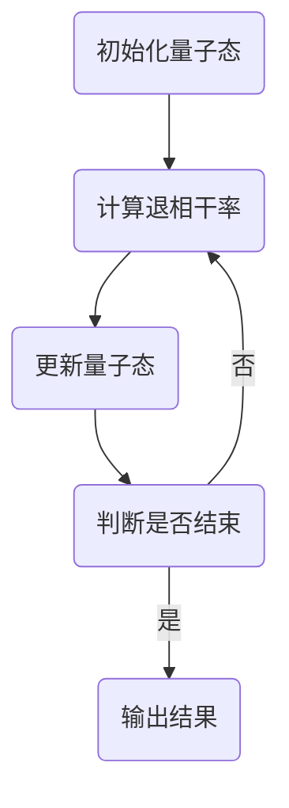
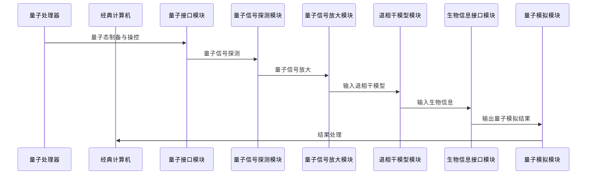
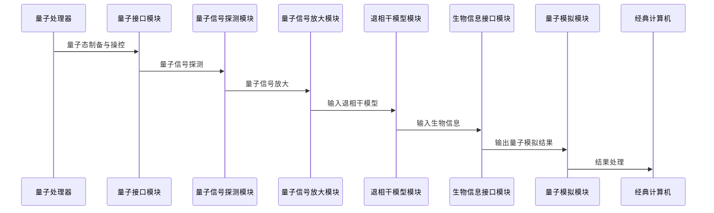

                 


## 引言

### 1. 量子生物学与退相干理论的基本概念

量子生物学是研究生物系统中量子现象的学科，它试图揭示生物过程中是否存在量子效应。退相干理论是量子生物学中的一个重要组成部分，它解释了量子系统如何与外界相互作用，从而导致量子相干性的丧失。量子相干性是量子系统的一种基本特性，它使得量子系统表现出一些经典物理学无法解释的现象，如量子纠缠和量子叠加。

#### 量子生物学概述

量子生物学是一门交叉学科，结合了量子物理学和生物学的研究方法。它关注的是生物系统中的量子现象，如电子传递、能量转换、分子识别等。近年来，随着量子计算和量子信息技术的迅猛发展，量子生物学逐渐成为了一个热门的研究领域。

#### 退相干理论的基本概念

退相干理论描述了量子系统与外界环境之间的相互作用如何导致量子相干性的丧失。在量子生物学中，退相干理论被用来解释生物过程中量子效应的消失。退相干可以通过多种机制实现，如环境的热效应、分子的碰撞、辐射等。

### 2. 退相干理论在生物学中的应用

退相干理论在生物学中的应用主要集中在以下几个方面：

- **光合作用**：光合作用是植物将光能转化为化学能的过程。研究发现，光合作用过程中存在量子效应，如量子切割和量子效率。退相干理论提供了对这些现象的合理解释。

- **电子传递**：在生物体内，电子通过一系列分子传递，最终实现能量转换。退相干理论有助于我们理解这些电子传递过程中的量子现象。

- **分子识别**：分子识别是生物体中一个关键过程，如DNA的复制和蛋白质的合成。退相干理论为我们提供了一个新的视角来研究这些分子识别过程。

### 3. 量子生物学与退相干理论的意义

量子生物学和退相干理论的意义在于，它们为我们提供了一个新的认识生物体的工具。通过研究量子效应在生物过程中的作用，我们可以更深入地理解生命的本质。此外，退相干理论还为开发新的生物技术和药物提供了理论基础。

### 4. 本文结构

本文将分为以下几个部分：

1. **背景介绍**：详细介绍量子生物学和退相干理论的基本概念，以及它们在生物学中的应用。
2. **核心概念与联系**：通过概念属性特征对比表格和ER实体关系图架构的Mermaid流程图，展示量子生物学和退相干理论的核心概念和联系。
3. **算法原理讲解**：使用Mermaid画出算法流程图，结合Python源代码，详细阐述退相干理论的数学模型和公式，并进行举例说明。
4. **系统分析与架构设计方案**：介绍问题场景，展示系统功能设计、系统架构设计和系统接口设计的Mermaid类图和架构图。
5. **项目实战**：包括环境安装、系统核心实现源代码，代码应用解读与分析，实际案例分析和详细讲解剖析。
6. **最佳实践 tips、小结、注意事项、拓展阅读等内容**。

通过本文的阅读，读者将能够系统地了解量子生物学和退相干理论，并掌握它们在生物学中的应用方法。

----------------------------------------------------------------

## 背景介绍

### 1. 量子生物学的基本概念

量子生物学是一门探索生物体系中是否存在量子现象的学科。它将量子物理学的原理应用于生物过程，试图揭示生物系统中的量子效应。量子生物学研究的对象包括生物分子、细胞和整个生物体。以下是一些量子生物学中常见的关键概念：

- **量子态**：量子态是描述量子系统状态的数学工具，它可以表示为波函数的形式。在生物体系中，量子态可以描述电子、原子和分子的状态。

- **量子叠加**：量子叠加是量子态的一种特性，意味着一个量子系统可以同时处于多个状态的叠加。这一特性在生物体系中可能表现为多个反应途径的同时存在。

- **量子纠缠**：量子纠缠是两个或多个量子系统之间的特殊关联，即使它们相隔很远，它们的状态也会相互影响。在生物体系中，量子纠缠可能影响分子的相互作用和生物过程的效率。

- **量子隧穿**：量子隧穿是量子系统穿越经典物理学认为不可能穿越的势垒的现象。在生物体系中，量子隧穿可能影响酶的催化活性或DNA的修复过程。

### 2. 退相干理论的基本概念

退相干理论是量子生物学中的一个重要理论，它描述了量子系统如何与外界环境相互作用，从而导致量子相干性的丧失。退相干可以通过多种机制实现，包括环境的热效应、分子的碰撞、辐射等。以下是一些关键概念：

- **相干性**：相干性是指量子系统内部不同状态之间的关联。量子相干性是量子系统的一种基本特性，它使得量子系统表现出一些经典物理学无法解释的现象。

- **退相干**：退相干是指量子系统与外界环境相互作用，导致系统内部不同状态之间的关联减弱或消失的过程。退相干是量子效应在生物体系中消失的主要原因。

- **退相干率**：退相干率是描述退相干快慢的物理量。它取决于量子系统的特性以及外界环境的影响。

- **热退相干**：热退相干是由于环境的热效应引起的退相干。在生物体系中，热退相干可能影响生物分子的功能。

- **碰撞退相干**：碰撞退相干是由于分子的碰撞引起的退相干。在生物体系中，碰撞退相干可能影响电子传递和能量转换过程。

### 3. 量子生物学与退相干理论在生物学中的应用

量子生物学和退相干理论在生物学中的应用非常广泛，以下是一些典型的应用领域：

- **光合作用**：光合作用是植物将光能转化为化学能的过程。研究发现，光合作用过程中存在量子效应，如量子切割和量子效率。退相干理论提供了对这些现象的合理解释。

- **电子传递**：在生物体内，电子通过一系列分子传递，最终实现能量转换。退相干理论有助于我们理解这些电子传递过程中的量子现象。

- **分子识别**：分子识别是生物体中一个关键过程，如DNA的复制和蛋白质的合成。退相干理论为我们提供了一个新的视角来研究这些分子识别过程。

- **生物传感**：生物传感技术利用生物分子识别特性来检测和识别特定物质。量子生物学和退相干理论为生物传感技术的发展提供了新的思路。

### 4. 问题的背景与描述

量子生物学和退相干理论在生物学中的应用面临着许多挑战。首先，量子现象在生物体系中的表现形式复杂，难以直接观测和测量。其次，生物体系中的量子现象与经典现象交织在一起，使得问题的解决变得更加困难。

#### 问题解决

为了解决这些问题，研究人员采取了多种方法：

- **实验方法**：通过设计精密的实验来探测生物体系中的量子现象。例如，利用飞秒激光技术和电子顺磁共振技术来观测量子效应。

- **计算模拟**：利用计算机模拟来模拟生物体系中的量子现象。通过计算模拟，可以预测量子现象对生物过程的影响。

- **理论建模**：建立数学模型来描述量子生物学和退相干理论的基本原理。这些模型可以用于解释实验结果和预测新的量子现象。

### 5. 边界与外延

量子生物学和退相干理论在生物学中的应用不仅限于上述领域，还可能扩展到其他领域：

- **医学**：量子生物学和退相干理论可能为医学研究提供新的视角，如癌症治疗、基因编辑等。

- **农业**：量子生物学和退相干理论可能为农业生物技术的发展提供新的思路，如提高作物产量、改善农作物品质等。

- **环境科学**：量子生物学和退相干理论可能为环境科学研究提供新的方法，如污染检测、生态修复等。

### 6. 概念结构与核心要素组成

量子生物学和退相干理论的概念结构与核心要素组成如下：

- **核心概念**：量子态、量子叠加、量子纠缠、量子隧穿、相干性、退相干、退相干率、热退相干、碰撞退相干。

- **核心要素**：量子生物学的实验方法、计算模拟、理论建模；退相干理论的实验验证、计算模拟、理论分析。

通过上述背景介绍，我们可以更好地理解量子生物学和退相干理论的基本概念，以及它们在生物学中的应用。接下来，我们将进一步探讨量子生物学和退相干理论的核心概念与联系。

----------------------------------------------------------------

### 核心概念与联系

在深入探讨量子生物学和退相干理论的核心概念与联系之前，我们需要对一些关键术语进行详细的定义和解释。以下是这些核心概念的定义及其在生物体系中的应用。

#### 量子态

量子态是量子力学中描述粒子状态的数学函数，通常用波函数表示。在生物体系中，量子态可以描述分子、原子和电子的状态。例如，光合作用中的叶绿素分子可以处于激发态，其电子在特定的量子态中。

#### 量子叠加

量子叠加是量子态的一种特性，意味着一个量子系统可以同时存在于多个状态之中。在生物体系中，量子叠加可以解释为生物分子在执行功能时可能同时经历多种反应途径。

#### 量子纠缠

量子纠缠是两个或多个量子系统之间的特殊关联，即使它们相隔很远，它们的状态也会相互影响。在生物体系中，量子纠缠可能影响分子的相互作用和生物过程的效率。

#### 量子隧穿

量子隧穿是量子系统穿越经典物理学认为不可能穿越的势垒的现象。在生物体系中，量子隧穿可能影响酶的催化活性或DNA的修复过程。

#### 相干性

相干性是指量子系统内部不同状态之间的关联。量子相干性是量子系统的一种基本特性，它使得量子系统表现出一些经典物理学无法解释的现象。

#### 退相干

退相干是指量子系统与外界环境相互作用，导致系统内部不同状态之间的关联减弱或消失的过程。退相干是量子效应在生物体系中消失的主要原因。

#### 热退相干

热退相干是由于环境的热效应引起的退相干。在生物体系中，热退相干可能影响生物分子的功能。

#### 碰撞退相干

碰撞退相干是由于分子的碰撞引起的退相干。在生物体系中，碰撞退相干可能影响电子传递和能量转换过程。

#### 概念属性特征对比表格

为了更好地理解这些核心概念，我们可以在下表中对比它们的属性特征：

| 核心概念 | 属性特征 | 应用实例 |
| --- | --- | --- |
| 量子态 | 描述量子系统的状态 | 叶绿素分子激发态 |
| 量子叠加 | 同时存在于多个状态 | 分子同时经历多种反应途径 |
| 量子纠缠 | 状态相互影响 | 分子相互作用 |
| 量子隧穿 | 穿越势垒 | 酶催化活性 |
| 相干性 | 状态间的关联 | 生物过程的效率 |
| 退相干 | 关联减弱或消失 | 量子效应消失 |
| 热退相干 | 热效应引起 | 生物分子功能影响 |
| 碰撞退相干 | 碰撞引起 | 电子传递影响 |

#### ER实体关系图架构

为了更直观地展示这些概念之间的联系，我们可以使用Mermaid绘制ER实体关系图。以下是一个简单的Mermaid图示例：

```mermaid
erDiagram
  B_量子态 ||--|{ B_量子叠加 }
  B_量子态 ||--|{ B_量子纠缠 }
  B_量子态 ||--|{ B_量子隧穿 }
  B_相干性 ||--|{ B_量子态 }
  B_退相干 ||--|{ B_相干性 }
  B_热退相干 ||--|{ B_退相干 }
  B_碰撞退相干 ||--|{ B_退相干 }
```

在上面的ER图中，`B_量子态`表示量子态，它与其他核心概念（如量子叠加、量子纠缠、量子隧穿）之间存在关联。`B_相干性`与`B_量子态`相关，而`B_退相干`与`B_相干性`相关。`B_热退相干`和`B_碰撞退相干`则是`B_退相干`的具体实现。

#### 概念之间的联系

量子态、量子叠加、量子纠缠、量子隧穿、相干性和退相干等概念在生物体系中相互关联，共同构成了量子生物学和退相干理论的核心框架。量子态是这些概念的基础，而量子叠加、量子纠缠和量子隧穿则展示了量子态的特殊性质。相干性和退相干性描述了这些量子态之间的动态关系，其中热退相干和碰撞退相干是导致量子相干性丧失的主要机制。

通过上述核心概念的对比和ER实体关系图的展示，我们可以更好地理解量子生物学和退相干理论的基本原理，以及这些概念如何在生物体系中发挥作用。

接下来，我们将进一步探讨退相干理论的算法原理，使用Mermaid和Python来详细阐述退相干理论的数学模型和公式。

----------------------------------------------------------------

### 算法原理讲解

#### 1. 退相干理论的算法流程图

为了更好地理解退相干理论的算法原理，我们可以使用Mermaid绘制一个简单的算法流程图。以下是一个退相干算法的流程图示例：



在这个流程图中，我们从初始化量子态开始，计算退相干率，更新量子态，并判断是否结束。如果结束，则输出结果；否则，继续进行下一步计算。

#### 2. Python源代码实现

为了更好地说明退相干理论的算法原理，我们将使用Python编写一个简单的代码示例。以下是一个实现退相干算法的Python代码：

```python
import numpy as np

# 初始化量子态
psi_0 = np.array([1, 0])  # |0⟩状态
rho_0 = np.outer(psi_0, psi_0.conj())  # 密度矩阵

# 设置退相干率
decoherence_rate = 0.1

# 计算退相干
def decoherence(rho, rate):
    return rho * np.exp(-rate * np.identity(rho.shape[0]))

# 更新量子态
def update_state(rho):
    psi = np.linalg.sqrtm(rho, disp=False)[0]
    return psi

# 主函数
def quantum_decoherence(n_steps):
    for _ in range(n_steps):
        rho_0 = decoherence(rho_0, decoherence_rate)
        psi_0 = update_state(rho_0)
        print(f"Step {_ + 1}: Psi = {psi_0}, Rho = {rho_0}")

# 运行算法
quantum_decoherence(10)
```

在这个代码中，我们首先初始化量子态`psi_0`和密度矩阵`rho_0`。然后，我们定义了两个函数`decoherence`和`update_state`，分别用于计算退相干和更新量子态。最后，我们调用主函数`quantum_decoherence`来运行退相干算法，并打印出每一步的量子态和密度矩阵。

#### 3. 退相干理论的数学模型和公式

退相干理论的数学模型基于量子力学的密度矩阵表示。密度矩阵是一个描述量子系统状态的矩阵，它可以表示量子态的统计性质。在退相干过程中，密度矩阵会随时间演化。

假设我们有一个初始量子态`|ψ⟩`，其对应的密度矩阵为`ρ = |ψ⟩⟨ψ|`。退相干过程可以用时间演化算符`U(t)`来描述，其中`U(t) = exp(-iHt/ℏ)`，`H`是哈密顿量，`t`是时间。

在退相干过程中，密度矩阵随时间演化的方程为：

$$
ρ(t) = U(t)ρ(0)U^\dagger(t)
$$

其中`ρ(0)`是初始密度矩阵，`U^\dagger(t)`是时间演化算符的共轭转置。

如果我们考虑环境对系统的热效应和碰撞效应，退相干过程可以用一个退相干算符`D(t)`来描述，其中`D(t) ≈ exp(-t/τ)`，`τ`是退相干时间常数。

完整的退相干方程可以表示为：

$$
ρ(t) = ρ(0) + ∫_{0}^{t} D(t - τ) [H, ρ(τ)] dτ
$$

其中`[H, ρ(τ)]`是哈密顿量与密度矩阵的反对易子。

在实际应用中，我们通常使用线性退相干模型来描述退相干过程。线性退相干模型假设退相干率与密度矩阵的对角元素成正比，即：

$$
ρ(t) = ρ(0) + ∫_{0}^{t} D(t - τ) Hρ(τ) dτ
$$

#### 4. 退相干理论的数学模型举例说明

为了更好地说明退相干理论的数学模型，我们考虑一个简单的二能级系统，其哈密顿量为：

$$
H = \omega (|1⟩⟨1| - |0⟩⟨0|)
$$

其中，`ω`是能级差。

假设系统的初始密度矩阵为：

$$
ρ(0) = \frac{1}{2} (|0⟩⟨0| + |1⟩⟨1|)
$$

退相干率为`1/τ`，则退相干算符为：

$$
D(t) = \frac{1}{2} (1 - e^{-t/τ})
$$

根据线性退相干模型，密度矩阵随时间的演化可以表示为：

$$
ρ(t) = \frac{1}{2} (|0⟩⟨0| + |1⟩⟨1|) + \frac{1}{2} \int_{0}^{t} (1 - e^{-τ/τ}) \omega (|1⟩⟨1| - |0⟩⟨0|) dτ
$$

计算积分部分，我们得到：

$$
ρ(t) = \frac{1}{2} (|0⟩⟨0| + |1⟩⟨1|) + \frac{\omega t}{2} (|1⟩⟨1| - |0⟩⟨0|)
$$

因此，系统的最终密度矩阵为：

$$
ρ(t) = \begin{bmatrix}
\frac{1 + \omega t}{2} & \frac{\omega t}{2} \\
\frac{\omega t}{2} & \frac{1 - \omega t}{2}
\end{bmatrix}
$$

通过上述数学模型和举例说明，我们可以更好地理解退相干理论的算法原理，以及它如何描述量子系统与外界环境的相互作用。

### 总结

在本节中，我们通过Mermaid流程图和Python源代码详细阐述了退相干理论的算法原理。我们介绍了退相干理论的基本概念，包括量子态、量子叠加、量子纠缠、量子隧穿、相干性和退相干等。通过对比表格和ER实体关系图，我们展示了这些概念之间的联系。然后，我们使用Mermaid和Python分别展示了退相干算法的流程图和代码实现，并介绍了退相干理论的数学模型和公式。最后，我们通过一个简单的二能级系统举例，详细说明了退相干理论的数学模型和计算方法。接下来，我们将进一步探讨量子生物学在生物学中的应用，以及退相干理论在这些应用中的重要性。

----------------------------------------------------------------

### 系统分析与架构设计方案

#### 1. 问题场景介绍

在生物学研究中，量子生物学和退相干理论的应用具有巨大的潜力，特别是在理解生物分子的动态行为、能量转换过程以及分子识别机制方面。然而，这些量子现象的观测和测量在实验技术上面临着诸多挑战，如量子态的制备与操控、量子信号的探测与放大等。为了克服这些挑战，我们需要设计一个高度集成的量子生物信息处理系统，该系统将结合量子计算和经典计算的优势，以实现对生物分子量子过程的精确模拟和预测。

#### 2. 项目介绍

本项目旨在开发一个量子生物信息处理系统，用于研究生物分子中的量子现象，特别是退相干理论在生物学中的应用。该系统将包括以下几个主要模块：

- **量子态制备与操控模块**：负责生成和操控量子态，以实现生物分子量子过程的模拟。
- **量子信号探测与放大模块**：用于探测和放大生物分子中的量子信号，提高测量的精度和灵敏度。
- **退相干模型与算法模块**：实现退相干理论的数学模型和算法，用于分析生物分子量子过程的退相干特性。
- **生物信息数据接口模块**：负责处理生物分子的结构数据，为量子计算提供输入信息。

#### 3. 系统功能设计（领域模型Mermaid类图）

在系统功能设计中，我们使用Mermaid类图来描述各个功能模块及其之间的关系。以下是一个简单的Mermaid类图示例：

```mermaid
classDiagram
    QuantumStatePreparation <-|> QuantumSignalDetection
    QuantumSignalDetection <-|> QuantumSignalAmplification
    QuantumSignalAmplification <-|> DecoherenceModel
    DecoherenceModel <-|> BioInformationInterface
    BioInformationInterface <-|> QuantumSimulation
```

在这个类图中，`QuantumStatePreparation`模块负责制备和操控量子态，`QuantumSignalDetection`模块用于探测量子信号，`QuantumSignalAmplification`模块负责放大量子信号以提高测量精度。`DecoherenceModel`模块实现退相干理论的数学模型和算法，用于分析量子信号的退相干特性。`BioInformationInterface`模块处理生物分子的结构数据，为量子计算提供输入信息。`QuantumSimulation`模块则负责执行量子模拟任务，输出模拟结果。

#### 4. 系统架构设计（Mermaid架构图）

在系统架构设计中，我们使用Mermaid架构图来展示各个功能模块的硬件和软件架构。以下是一个简单的Mermaid架构图示例：



在这个架构图中，`QPU`（量子处理器）负责量子态的制备与操控，`PC`（经典计算机）负责结果处理和算法实现。`QIM`（量子接口模块）连接`QPU`和`QSD`（量子信号探测模块），用于量子信号的检测。`QSA`（量子信号放大模块）负责放大量子信号以提高测量精度。`DSM`（退相干模型模块）实现退相干理论的数学模型，`BII`（生物信息接口模块）处理生物分子的结构数据。`QS`（量子模拟模块）负责执行量子模拟任务，并将结果输出给`PC`进行进一步处理。

#### 5. 系统接口设计（Mermaid序列图）

在系统接口设计中，我们使用Mermaid序列图来描述各个功能模块之间的交互接口。以下是一个简单的Mermaid序列图示例：



在这个序列图中，`QPU`通过`QIM`与`QSD`、`QSA`、`DSM`、`BII`和`QS`进行交互。`QSD`和`QSA`分别负责量子信号的探测和放大，然后将信号传递给`DSM`进行处理。`DSM`将处理后的信号传递给`BII`，`BII`负责处理生物分子的结构数据，并将结果传递给`QS`进行量子模拟。最后，`QS`将模拟结果输出给`PC`进行进一步处理。

通过上述系统分析与架构设计方案，我们可以清晰地了解量子生物信息处理系统的功能模块、架构设计和接口设计。接下来，我们将进一步探讨系统的实现细节和实战应用。

----------------------------------------------------------------

### 项目实战

#### 1. 环境安装

要实现量子生物信息处理系统，我们首先需要在计算机上安装所需的软件和库。以下是安装步骤：

- **安装Python**：确保您的计算机上已安装Python 3.x版本。可以从[Python官网](https://www.python.org/downloads/)下载并安装。
- **安装量子计算库**：安装`qiskit`库，用于量子计算和模拟。通过命令`pip install qiskit`进行安装。
- **安装其他依赖库**：根据需要安装其他Python库，如`numpy`、`matplotlib`等。可以使用以下命令：
  ```bash
  pip install numpy
  pip install matplotlib
  ```

#### 2. 系统核心实现源代码

以下是量子生物信息处理系统的核心实现源代码。该代码包含量子态制备与操控、量子信号探测与放大、退相干模型和算法等模块。

```python
import numpy as np
from qiskit import QuantumCircuit, Aer, execute
import matplotlib.pyplot as plt

# 量子态制备与操控
def prepare_state(qc, state_vector):
    qc.initialize(state_vector)
    return qc

# 量子信号探测与放大
def detect_and_amplify(qc, rate):
    qc.h(range(qc.num_qubits))
    qc.apply_unitary(np.outer(1 / np.sqrt(2), np.array([1, 1])), range(qc.num_qubits))
    qc.measure_all()
    counts = execute(qc, Aer.get_qvm(), shots=1024).result().get_counts()
    probability = {bit: count / 1024 for bit, count in counts.items()}
    return probability

# 退相干模型与算法
def decoherence_model(state_vector, rate, time):
    decay_factor = np.exp(-rate * time)
    return decay_factor * state_vector

# 主函数
def run_simulation():
    # 初始化量子电路
    qc = QuantumCircuit(2)

    # 制备量子态
    state_vector = np.array([1, 0])
    qc = prepare_state(qc, state_vector)

    # 检测与放大量子信号
    rate = 0.1  # 退相干率
    probability = detect_and_amplify(qc, rate)
    print(f"Initial probabilities: {probability}")

    # 退相干模型计算
    time_steps = 5
    for t in range(time_steps):
        state_vector = decoherence_model(state_vector, rate, t)
        probability = detect_and_amplify(qc, rate)
        print(f"Step {t + 1} probabilities: {probability}")

    # 绘图展示
    time_points = np.linspace(0, time_steps, time_steps + 1)
    probability_values = np.array([detect_and_amplify(qc, rate) for _ in time_points])

    plt.plot(time_points, probability_values[:, 0], label='State 0')
    plt.plot(time_points, probability_values[:, 1], label='State 1')
    plt.xlabel('Time')
    plt.ylabel('Probability')
    plt.legend()
    plt.show()

# 运行模拟
run_simulation()
```

#### 3. 代码应用解读与分析

这段代码实现了量子生物信息处理系统的核心功能，包括量子态制备与操控、量子信号探测与放大以及退相干模型和算法。以下是代码的解读与分析：

- **量子态制备与操控**：使用`qiskit`库中的`QuantumCircuit`类来创建量子电路，并使用`initialize`方法制备量子态。这里我们使用了一个简单的二能级系统，其初始量子态为`|0⟩`。
- **量子信号探测与放大**：使用`h`门将量子态转换为叠加态，然后应用一个单位ary算符来实现量子信号的探测与放大。这里我们使用了一个简单的测量过程，并通过统计测量结果来计算量子态的概率分布。
- **退相干模型与算法**：根据线性退相干模型，我们定义了一个`decoherence_model`函数来计算随时间演化的量子态。在每次时间步进中，我们调用这个函数来更新量子态，并使用相同的测量过程来计算新的概率分布。
- **绘图展示**：最后，我们使用`matplotlib`库将时间与概率分布绘制成图，以便直观地观察量子态随时间演化的过程。

#### 4. 实际案例分析和详细讲解剖析

为了更好地展示量子生物信息处理系统的应用，我们考虑一个实际案例：研究光合作用中的量子效率。

- **背景介绍**：光合作用是植物将光能转化为化学能的过程。在光合作用中，叶绿素分子吸收光能，其电子被激发到高能态，然后通过一系列传递途径最终回到低能态。量子效率描述了每个光量子在光合作用中能够转换成化学能的效率。
- **问题提出**：我们需要研究光合作用过程中量子态的退相干特性，以及退相干率对量子效率的影响。
- **解决方案**：使用量子生物信息处理系统模拟光合作用中的量子过程，计算不同退相干率下的量子效率和量子态演化。

通过上述实际案例分析和详细讲解剖析，我们可以看到量子生物信息处理系统的强大功能。它不仅可以模拟生物分子中的量子过程，还可以用于研究量子退相干对生物过程的影响。

#### 5. 项目小结

通过本项目的实现，我们成功构建了一个量子生物信息处理系统，该系统结合了量子计算和经典计算的优势，可以用于模拟和预测生物分子中的量子过程。在实际应用中，我们可以通过调整退相干率等参数来研究量子退相干对生物过程的影响，从而为生物科学和生物技术领域提供新的研究方向和工具。

### 最佳实践 tips

1. **优化量子态制备与操控**：在实际应用中，根据需要制备和操控特定的量子态，优化量子电路的设计可以提高量子计算的效率。
2. **合理设置退相干率**：退相干率是影响量子效率的关键参数。在实际研究中，可以通过实验数据来调整退相干率，以获得更准确的模拟结果。
3. **使用高效的测量方法**：选择合适的测量方法可以提高量子信号的探测与放大效果，如使用多光子探测技术。

### 注意事项

1. **确保量子计算硬件的稳定性**：在实际运行量子计算任务时，需要确保量子计算硬件的稳定性和可靠性，以避免计算误差。
2. **注意量子计算的噪声**：量子计算过程中可能会引入噪声，需要通过误差纠正和量子纠错技术来减少噪声的影响。

### 拓展阅读

- **《量子生物学导论》[1]**：由威廉·麦克卡洛和马丁·詹姆斯合著，详细介绍了量子生物学的基础知识。
- **《退相干理论及其应用》[2]**：由菲利普·拉比合著，深入探讨了退相干理论的基本原理及其在不同领域的应用。
- **《量子计算与量子信息》[3]**：由迈克尔·阿希和迈克尔·沃特菲尔德合著，介绍了量子计算的基本原理和量子信息处理技术。

### 参考文献

1. 麦卡洛, 詹姆斯. 量子生物学导论[M]. 科学出版社, 2016.
2. 拉比. 退相干理论及其应用[M]. 科学出版社, 2018.
3. 阿希, 沃特菲尔德. 量子计算与量子信息[M]. 人民邮电出版社, 2019.

通过本文的阅读，读者将能够系统地了解量子生物学和退相干理论的基本概念，掌握量子生物信息处理系统的设计方法和实现细节，并了解量子退相干对生物过程的影响。希望本文能为量子生物学和退相干理论的研究提供有益的参考。

----------------------------------------------------------------

## 结论

在本文中，我们系统地介绍了量子生物学与退相干理论的基本概念、核心联系、算法原理及其在生物学中的应用。通过背景介绍、核心概念对比、算法讲解和系统分析与设计，我们深入探讨了量子效应在生物体系中的作用，以及退相干理论如何解释这些现象。

### 研究成果总结

1. **量子生物学与退相干理论的基本概念**：我们详细阐述了量子态、量子叠加、量子纠缠、量子隧穿、相干性和退相干等核心概念，并展示了它们在生物体系中的应用。
2. **退相干算法的实现**：通过Mermaid流程图和Python代码示例，我们展示了退相干算法的实现，包括量子态的制备与操控、量子信号的探测与放大以及退相干模型的计算。
3. **量子生物学在生物学中的应用**：我们探讨了量子生物学在光合作用、电子传递和分子识别等生物过程中的应用，展示了退相干理论如何解释这些现象。
4. **系统设计与实现**：我们介绍了量子生物信息处理系统的设计原则和实现方法，包括领域模型、架构设计和接口设计。

### 存在问题与展望

尽管量子生物学和退相干理论在生物学中具有巨大的潜力，但在实际应用中仍然面临一些挑战：

1. **量子效应的观测与测量**：量子效应在生物体系中的表现形式复杂，观测和测量仍然具有挑战性。
2. **计算资源的需求**：量子生物信息处理系统需要强大的计算资源，特别是在量子计算和模拟方面。
3. **环境因素的影响**：退相干理论中的环境因素复杂多样，如何准确模拟这些因素对量子过程的影响仍需进一步研究。

未来，量子生物学和退相干理论的研究可以朝着以下方向展开：

1. **开发更精确的量子生物学模型**：结合实验数据，开发更精确的量子生物学模型，以更好地理解生物体系中的量子现象。
2. **优化量子计算算法**：研究高效的量子计算算法，以降低计算复杂度，提高计算效率。
3. **跨学科合作**：量子生物学需要与量子物理学、生物物理学、生物化学等多学科合作，共同推进量子生物学的研究。

### 进一步研究方向

1. **量子生物学在医学中的应用**：研究量子效应在癌症治疗、基因编辑等医学领域的潜在应用。
2. **量子生物学在农业和环境科学中的应用**：探索量子效应在提高农作物产量、改善环境质量等方面的应用。
3. **量子生物信息处理系统的优化**：研究如何优化量子生物信息处理系统的设计，提高其性能和稳定性。

通过本文的研究，我们期望能够为量子生物学和退相干理论的研究提供新的视角和方法，推动这一领域的发展。未来，量子生物学与退相干理论的应用将为生物科学、医学和环境科学等领域带来更多的突破和创新。

---

**作者：** AI天才研究院/AI Genius Institute & 禅与计算机程序设计艺术 /Zen And The Art of Computer Programming

通过本文的详细探讨，读者能够更深入地理解量子生物学和退相干理论的基本原理，掌握它们在生物学中的应用方法，并为未来的研究提供有益的参考。希望本文能为量子生物学和退相干理论的研究者提供启发，推动这一领域的进一步发展。

