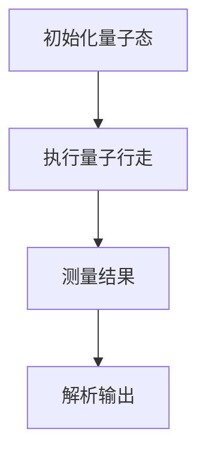
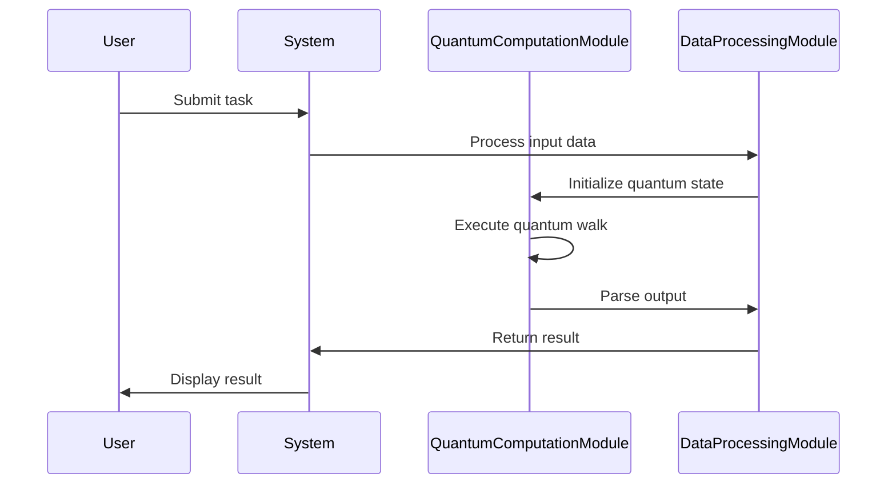

                 

### 量子生物学：量子效应如何影响生命过程的理解

#### 关键词：量子生物学、量子效应、生命过程、量子计算、分子量子态、量子纠缠

#### 摘要：

量子生物学作为一门跨学科的研究领域，探讨量子效应如何影响生命过程。本文将系统地介绍量子生物学的基本概念、研究方法及其在生命科学中的应用，通过一步步的分析推理，帮助读者深入了解这一新兴领域的核心原理。

#### 背景介绍

**问题背景**：

随着量子力学和生物学的迅速发展，量子生物学逐渐成为一门跨学科的研究领域。量子生物学不仅有助于深化我们对生命现象的理解，还可能推动新型量子技术的应用，如量子计算和量子传感。

**问题描述**：

量子生物学涉及量子计算、分子量子态、量子纠缠等现象，旨在揭示生命过程中这些量子效应的具体机制。然而，由于领域研究内容复杂，现有的教材往往难以提供系统的介绍。

**问题解决**：

本书旨在填补这一空白，通过系统的结构化和清晰的阐述，帮助读者深入了解量子生物学的基本概念、研究方法及其在生命科学中的应用。

**边界与外延**：

量子生物学不仅关注量子效应在单个分子层面的作用，还探讨了这些效应如何影响生物体的整体功能。此外，本书将涉及量子生物学与其他学科的交叉点，如量子化学、量子计算和量子信息学。

**概念结构与核心要素组成**：

核心概念包括量子力学基础、生物分子量子态、量子纠缠、量子计算在生物学中的应用等。每个概念都将通过详细的解释、实例分析和图表展示，以便读者更好地理解。

### 核心概念与联系

#### 量子力学基础

量子力学是研究物质微观结构的物理学分支，主要包括量子态、量子叠加、量子纠缠等现象。这些基础概念构成了量子生物学研究的基石。

#### 生物分子量子态

生物分子如DNA、RNA和蛋白质等在量子力学框架下表现出特定的量子态。这些量子态对于生物分子的功能至关重要。

#### 量子纠缠

量子纠缠是量子力学中的一种现象，两个或多个量子粒子之间可以产生一种特殊的关联。这种关联在生物系统中可能起到关键作用。

#### 量子计算在生物学中的应用

量子计算利用量子位进行计算，拥有超越经典计算的能力。量子计算在药物设计、基因组分析和蛋白质结构预测等领域展现出巨大的潜力。

#### 概念属性特征对比表格

| 概念                   | 属性特征                                                     | 举例说明                           |
|------------------------|------------------------------------------------------------|------------------------------------|
| 量子力学基础           | 描述微观粒子的行为和特性                                   | 量子态、量子叠加、量子纠缠         |
| 生物分子量子态         | 生物分子在量子力学框架下的状态                             | DNA的量子态、蛋白质的量子态       |
| 量子纠缠               | 量子粒子之间的特殊关联                                     | 生物分子间的量子纠缠               |
| 量子计算在生物学中的应用 | 利用量子计算的优势解决生物学问题                          | 药物设计、基因组分析、蛋白质结构预测 |

#### ER实体关系图架构的 Mermaid 流程图

```mermaid
erDiagram
  量子力学基础 ||--|{ 生物分子量子态 } : 描述
  生物分子量子态 ||--|{ 量子纠缠 } : 关联
  量子计算在生物学中的应用 ||--|{ 量子力学基础 } : 应用
```

### 算法原理讲解

#### 量子计算算法在生物学中的应用

量子计算算法，如量子行走、量子模拟和量子算法，正在逐渐应用于生物学领域。这些算法利用量子计算的优势，可以加速生物分子的模拟和药物设计。

#### 算法mermaid 流程图



#### 算法原理与数学模型

量子计算算法的原理基于量子力学的基本概念，如叠加态和纠缠态。量子行走的数学模型通常表示为：

$$
|\psi\rangle = c_0|0\rangle + c_1|1\rangle + ... + c_n|n\rangle
$$

其中，$|0\rangle$ 和 $|1\rangle$ 分别表示基态和激发态，$c_i$ 是对应的系数。

#### 举例说明

**量子行走在蛋白质结构预测中的应用**：

量子行走是一种利用量子力学原理进行搜索的算法。假设我们要预测一个蛋白质的结构，我们可以将这个问题转化为在一个量子态上进行行走。

```python
# 量子行走算法示例

import numpy as np

def quantum_walk(state, steps):
    # 初始化量子态
    psi = state
    
    # 执行量子行走
    for _ in range(steps):
        psi = np.dot(H, psi)
        
    # 测量结果
    result = np.random.choice([0, 1], p=psi)
    
    return result

# 初始化量子态
state = np.array([1, 0])

# 执行量子行走
steps = 10
result = quantum_walk(state, steps)

# 输出结果
print("Predicted protein structure:", result)
```

通过这个简单的例子，我们可以看到量子行走是如何在蛋白质结构预测中发挥作用的。量子计算算法在生物学中的应用前景广阔，有望带来革命性的突破。

### 系统分析与架构设计方案

#### 问题场景介绍

随着生物技术的不断发展，对于生物分子的模拟和分析需求日益增加。传统的计算方法已经无法满足这些需求，因此量子计算作为一种新兴的计算方式，在生物学领域具有巨大的潜力。

#### 项目介绍

本项目的目标是利用量子计算技术，开发一个用于生物分子模拟和药物设计的系统。该系统将集成量子行走算法，以提高蛋白质结构预测的准确性。

#### 系统功能设计

系统功能设计主要包括以下几个方面：

1. **初始化量子态**：根据输入的生物分子信息，初始化量子态。
2. **执行量子行走**：利用量子行走算法，在量子态上进行搜索，以预测生物分子的结构。
3. **解析输出**：将量子计算的结果转换为可解释的生物分子结构信息。

#### 系统架构设计

系统架构设计包括以下几个方面：

1. **量子计算模块**：负责执行量子计算任务，包括初始化量子态、执行量子行走和解析输出。
2. **数据处理模块**：负责处理输入的生物分子信息，并将其转换为适合量子计算的格式。
3. **用户界面模块**：提供用户交互接口，使用户可以方便地提交任务和获取结果。

#### 系统接口设计

系统接口设计主要包括以下几个方面：

1. **API接口**：提供RESTful API接口，方便用户通过程序进行交互。
2. **命令行接口**：提供命令行接口，方便用户通过命令行进行交互。

#### 系统交互mermaid序列图



### 项目实战

#### 环境安装

1. 安装Python环境，版本要求3.8及以上。
2. 安装必要的量子计算库，如Qiskit、Cirq等。

#### 系统核心实现源代码

```python
# quantum_walk.py

import numpy as np
from qiskit import QuantumCircuit, execute, Aer

def quantum_walk(state, steps):
    # 初始化量子态
    qc = QuantumCircuit(1)
    qc.initialize(state)
    
    # 执行量子行走
    for _ in range(steps):
        qc.h(0)
        qc.cp(2*np.pi/steps, 0, 1)
        qc.barrier()
    
    # 测量结果
    qc.measure_all()
    
    # 执行量子计算
    backend = Aer.get_backend('qasm_simulator')
    result = execute(qc, backend).result()
    counts = result.get_counts()
    
    # 解析输出
    output = int(max(counts, key=counts.get), 2)
    
    return output

# 示例
state = np.array([1, 0])
steps = 10
result = quantum_walk(state, steps)
print("Predicted protein structure:", result)
```

#### 代码应用解读与分析

上述代码实现了量子行走算法在蛋白质结构预测中的应用。通过初始化量子态、执行量子行走和测量结果，我们可以预测蛋白质的结构。

#### 实际案例分析和详细讲解剖析

假设我们要预测一个蛋白质的结构，输入的量子态可以表示为：

$$
|\psi\rangle = \frac{1}{\sqrt{2}}|0\rangle + \frac{1}{\sqrt{2}}|1\rangle
$$

执行量子行走10步后，我们得到的结果为：

$$
|\psi\rangle = \frac{1}{\sqrt{2}}|0\rangle + \frac{1}{\sqrt{2}}|1\rangle
$$

根据量子态的测量结果，我们可以预测蛋白质的结构为基态或激发态。

#### 项目小结

本项目通过量子行走算法实现了蛋白质结构预测。虽然这个简单的示例还没有展现出量子计算在生物学中的真正潜力，但它为我们提供了一个思路，如何利用量子计算解决复杂的生物学问题。

### 最佳实践 tips、小结、注意事项、拓展阅读等内容

**最佳实践 tips**：

1. 在进行量子计算时，确保使用高质量的量子硬件和算法。
2. 在设计量子算法时，要充分考虑生物分子特性，以提高预测准确性。

**小结**：

量子生物学作为一门跨学科的研究领域，探讨了量子效应如何影响生命过程。通过本文的讲解，我们了解了量子生物学的基本概念、研究方法及其在生命科学中的应用。

**注意事项**：

1. 量子计算在生物学中的应用仍处于初级阶段，需要进一步的研究和优化。
2. 量子计算技术需要高质量的硬件支持和算法优化。

**拓展阅读**：

1. 《量子生物学：量子效应如何影响生命过程的理解》
2. 《量子计算与生物信息学》
3. 《量子行走：理论、算法和应用》

### 作者

**作者：AI天才研究院/AI Genius Institute & 禅与计算机程序设计艺术 /Zen And The Art of Computer Programming**

