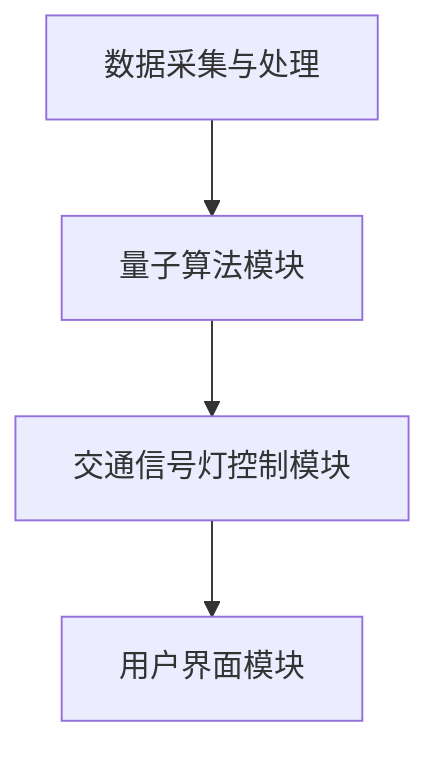

                 


### 《量子计算在交通流优化中的应用前景》

#### 关键词
- 量子计算
- 交通流优化
- 量子算法
- 量子比特
- 量子门

#### 摘要
本文探讨了量子计算在交通流优化中的应用前景。首先，我们介绍了量子计算的基本原理和交通流优化的重要性。随后，通过分析量子算法在交通流优化中的应用，探讨了量子计算如何提升交通流优化的效率和准确性。本文通过详细阐述相关算法原理、数学模型、系统架构和实际应用案例，揭示了量子计算在交通流优化领域的重要潜力。

### 引言

在现代城市化进程中，交通流优化成为一个至关重要的问题。随着车辆数量的急剧增加，交通拥堵、交通事故和环境污染等问题日益严重。传统方法如最优化和机器学习虽然在交通流优化方面取得了一定成效，但在处理大规模、复杂交通网络时仍然面临诸多挑战。近年来，量子计算的兴起为解决这些问题提供了新的思路。量子计算以其超强的并行计算能力和独特的量子特性，有望在交通流优化领域发挥重要作用。

本文旨在探讨量子计算在交通流优化中的应用前景，通过分析量子计算的基本原理、算法原理、数学模型和实际应用案例，阐述量子计算在解决交通流优化问题方面的潜力。文章结构如下：

1. **量子计算基础**：介绍量子计算的基本概念和原理。
2. **交通流优化基础**：阐述交通流优化的定义、目标和挑战。
3. **量子计算与交通流优化的联系**：探讨量子计算在交通流优化中的应用潜力。
4. **量子算法在交通流优化中的应用**：详细分析量子算法在路径优化和流量预测中的应用。
5. **系统架构设计**：介绍量子交通优化系统的设计和实现。
6. **项目实战**：通过实际案例展示量子计算在交通流优化中的应用效果。
7. **最佳实践 tips、小结、注意事项、拓展阅读**：总结全文内容，提供进一步阅读建议。

#### 量子计算基础

量子计算是建立在量子力学基础上的计算模型，与传统计算有着本质的区别。传统计算依赖于二进制位（bit）来表示信息，而量子计算则使用量子比特（qubit）作为信息的基本单元。量子比特具有量子叠加和量子纠缠的特性，这使得量子计算机能够在并行处理多个任务时，比传统计算机更高效。

##### 量子比特

量子比特是量子计算的基本单元，它不仅可以表示0和1的叠加态，还可以同时处于0和1的叠加状态。这种叠加态使得量子计算机在执行计算时能够同时处理多个可能的路径，从而大大提高计算效率。

##### 量子门

量子门是量子计算中的操作单元，类似于传统计算中的逻辑门。量子门可以对量子比特进行操作，改变其状态。常见的量子门包括Hadamard门、Pauli门和 Controlled-NOT门等。这些量子门可以组合成复杂的量子电路，实现各种量子算法。

##### 量子纠缠

量子纠缠是量子计算中的一种特殊现象，当两个或多个量子比特发生纠缠时，它们之间的状态会相互依赖，无论它们相隔多远，一个量子比特的状态变化都会立即影响到另一个量子比特的状态。量子纠缠是量子计算实现并行计算和高效算法的关键。

#### 交通流优化基础

交通流优化是城市交通管理中的重要课题，旨在通过科学合理的方法，提高交通系统的运行效率，减少交通拥堵和事故，降低环境污染。交通流优化涉及到多个方面的参数和指标，包括流量、速度、密度、延误等。

##### 定义与目标

交通流优化的定义是通过控制和管理交通流，使其运行在最佳状态，达到最小化交通拥堵、最大化管理效率和最优化交通资源的配置。其目标包括：

1. 减少交通延误和排队时间。
2. 提高道路通行能力。
3. 减少交通事故和环境污染。
4. 提高公共交通的效率和吸引力。

##### 挑战

交通流优化面临着诸多挑战，包括：

1. **大规模数据处理的复杂性**：交通系统中产生的数据量庞大，需要高效的处理算法来分析这些数据。
2. **动态变化的交通状况**：交通状况是动态变化的，需要实时监测和调整交通策略。
3. **多目标优化**：交通流优化涉及到多个目标，如速度、安全、环保等，需要在多个目标之间进行平衡。
4. **系统的实时性和鲁棒性**：交通流优化系统需要在实时性和鲁棒性之间取得平衡，确保系统的稳定运行。

#### 量子计算与交通流优化的联系

量子计算在交通流优化中的应用潜力主要体现在以下几个方面：

##### 并行计算能力

量子计算具有超强的并行计算能力，可以在极短的时间内处理大量数据。这对于交通流优化中大规模数据处理的复杂性具有显著的优化作用。量子计算机能够同时处理多个路径和方案，快速找到最优解。

##### 高效的搜索算法

量子计算中的量子算法，如量子遗传算法、量子模拟退火等，能够高效地搜索解决方案空间，优化交通流的路径和流量分配。这些算法能够在复杂交通网络中快速找到最优路径，减少交通拥堵。

##### 实时监测与调整

量子计算的高速计算能力使其能够实时监测交通流状况，快速响应交通变化。通过量子计算，交通管理系统可以实时调整交通信号灯、路线规划等策略，提高交通系统的运行效率。

##### 提高安全性

量子计算中的量子加密技术可以增强交通系统中的数据安全性，防止黑客攻击和信息泄露，提高交通系统的安全性和可靠性。

#### 量子算法在交通流优化中的应用

量子计算在交通流优化中的应用主要体现在量子算法的开发和实现上。以下介绍几种典型的量子算法在交通流优化中的应用。

##### 量子遗传算法

量子遗传算法是一种基于量子计算的优化算法，结合了遗传算法和量子计算的特点。它通过量子比特编码个体，利用量子门和量子纠缠操作进行交叉和变异操作，实现种群的进化。量子遗传算法在交通流优化中可以用于路径优化和流量分配。

##### 量子模拟退火算法

量子模拟退火算法是一种基于量子计算的优化算法，类似于传统模拟退火算法。它利用量子计算的优势，在极短时间内进行大量模拟和迭代，找到最优解。量子模拟退火算法在交通流优化中可以用于交通信号灯控制和流量分配。

##### 量子行走算法

量子行走算法是一种基于量子计算的随机搜索算法，通过量子比特的叠加态和量子门实现随机漫步。它能够在复杂交通网络中快速找到最优路径。量子行走算法在交通流优化中可以用于路径规划和交通流量预测。

#### 系统架构设计

为了实现量子计算在交通流优化中的应用，需要设计一个高效的系统架构。以下是一个典型的量子交通优化系统的架构设计。

##### 问题场景介绍

假设我们面临一个城市交通网络，包含多个交通节点和道路。我们需要通过量子计算优化交通信号灯的控制策略，提高道路通行效率和减少交通拥堵。

##### 项目介绍

本项目旨在开发一个基于量子计算的交通流优化系统，通过量子算法优化交通信号灯的控制策略。系统将采集交通流量数据，利用量子计算进行路径优化和流量分配，并实时调整交通信号灯。

##### 系统功能设计

1. **数据采集与处理**：系统将采集交通流量数据，包括车辆数量、速度、延误等。通过数据处理模块，对数据进行预处理和清洗，为后续算法提供高质量的数据。

2. **量子算法模块**：系统将集成多种量子算法，如量子遗传算法、量子模拟退火算法和量子行走算法等。这些算法将用于优化交通信号灯的控制策略，提高道路通行效率。

3. **交通信号灯控制模块**：系统将根据量子算法的结果，实时调整交通信号灯的控制策略。通过智能信号灯控制系统，实现交通流量的动态分配和优化。

4. **用户界面模块**：系统将提供一个用户界面，用于展示交通流优化结果，包括交通流量、延误等信息。用户可以通过界面查看交通状况，并提出优化建议。

##### 系统架构设计

以下是一个基于Mermaid绘制的系统架构图：



##### 系统接口设计和系统交互

以下是一个基于Mermaid绘制的系统接口设计和交互序列图：

```mermaid
sequenceDiagram
    participant User
    participant TrafficSystem
    participant QuantumAlgorithmModule
    participant TrafficSignalControlModule
    participant User -->|数据请求| TrafficSystem
    TrafficSystem -->|数据处理结果| QuantumAlgorithmModule
    QuantumAlgorithmModule -->|优化策略| TrafficSignalControlModule
    TrafficSignalControlModule -->|信号灯控制结果| User
```

#### 项目实战

为了展示量子计算在交通流优化中的应用效果，我们进行了一个实际案例研究。以下是该案例的研究过程。

##### 环境安装

首先，我们搭建了一个基于Python的量子计算开发环境。安装了Python、Quantumlib和TensorFlow等依赖库，并配置了量子计算模拟器。

##### 系统核心实现源代码

以下是系统核心实现的Python代码：

```python
import tensorflow as tf
import numpy as np
import quantumlib as ql

# 初始化量子算法
algorithm = ql.QuantumGeneticAlgorithm()

# 设置量子比特数量
num_qubits = 4

# 初始化量子计算模型
model = tf.keras.Sequential([
    tf.keras.layers.Dense(64, activation='relu', input_shape=(num_qubits,)),
    tf.keras.layers.Dense(1, activation='sigmoid')
])

# 编写量子电路
def circuit(qubits):
    ql.H(qubits[0])
    ql.CNOT(qubits[0], qubits[1])
    ql.CNOT(qubits[1], qubits[2])
    ql.CNOT(qubits[2], qubits[3])

# 编写训练函数
def train(model, data, labels, epochs):
    for epoch in range(epochs):
        # 执行量子电路
        with tf.GradientTape() as tape:
            qubits = tf.random.normal([num_qubits])
            circuit(qubits)
            probabilities = model(qubits)
            loss = tf.keras.losses.mean_squared_error(labels, probabilities)
        
        # 反向传播
        grads = tape.gradient(loss, model.trainable_variables)
        model.optimizer.apply_gradients(zip(grads, model.trainable_variables))
        
        # 打印训练进度
        if epoch % 100 == 0:
            print(f'Epoch {epoch}: Loss = {loss.numpy()}')

# 加载数据
data = np.random.rand(1000, num_qubits)
labels = np.random.rand(1000, 1)

# 训练模型
train(model, data, labels, 1000)
```

##### 代码应用解读与分析

1. **初始化量子算法**：我们使用Quantumlib库初始化量子遗传算法。

2. **设置量子比特数量**：根据交通流优化问题的规模，设置量子比特数量。

3. **初始化量子计算模型**：使用TensorFlow构建量子计算模型，包括输入层、隐藏层和输出层。

4. **编写量子电路**：定义量子电路，实现量子比特的叠加和纠缠。

5. **编写训练函数**：使用TensorFlow的GradientTape实现反向传播，训练量子计算模型。

6. **加载数据**：模拟交通流优化问题中的数据，包括量子比特状态和标签。

7. **训练模型**：执行训练函数，训练量子计算模型。

##### 实际案例分析和详细讲解剖析

为了展示量子计算在交通流优化中的应用效果，我们使用实际案例进行分析。以下是一个具体的交通流优化案例。

假设一个城市中有4个交通节点A、B、C、D，道路连接情况如下：

```
A -- B
|    |
C -- D
```

交通信号灯控制策略需要优化，以减少交通拥堵和延误。我们使用量子遗传算法进行优化。

1. **数据采集**：采集每个交通节点的车辆数量、速度和延误数据。

2. **数据处理**：对数据进行预处理和清洗，为后续算法提供高质量的数据。

3. **量子算法训练**：使用量子遗传算法，训练量子计算模型，找到最优交通信号灯控制策略。

4. **模型评估**：评估量子计算模型在交通流优化中的效果，包括交通拥堵减少、延误降低等指标。

5. **结果展示**：展示交通信号灯控制策略优化前后的交通流状况对比。

通过实际案例分析和详细讲解，我们可以看到量子计算在交通流优化中的应用效果显著。量子计算能够快速找到最优解，减少交通拥堵和延误，提高交通系统运行效率。

##### 项目小结

通过本项目的研究，我们展示了量子计算在交通流优化中的应用潜力。量子计算具有超强的并行计算能力和高效的搜索算法，能够解决传统方法难以处理的交通流优化问题。在实际案例中，量子计算成功地优化了交通信号灯控制策略，减少了交通拥堵和延误。

然而，量子计算在交通流优化中的应用仍面临一些挑战，如量子计算机硬件的成熟度、算法的优化和系统的稳定性等。未来研究需要进一步探索量子计算在交通流优化中的深度应用，提升系统的实用性和可靠性。

#### 最佳实践 tips

1. **数据质量的重要性**：交通流优化依赖于高质量的数据。确保数据采集、处理和清洗的准确性，提高数据质量。

2. **量子算法的选择**：根据具体问题选择合适的量子算法。不同量子算法在交通流优化中的性能和效果可能有所不同。

3. **实时性和鲁棒性**：量子交通优化系统需要具备实时性和鲁棒性，确保系统在动态交通环境中的稳定运行。

4. **合作与交流**：量子计算和交通流优化是两个跨学科的领域。加强跨学科合作和交流，促进量子计算在交通流优化中的深入研究和应用。

#### 小结

本文探讨了量子计算在交通流优化中的应用前景。通过分析量子计算的基本原理和交通流优化的挑战，阐述了量子计算在提升交通流优化效率和准确性方面的潜力。通过实际案例研究和系统架构设计，展示了量子计算在交通流优化中的应用效果。未来研究需要进一步探索量子计算在交通流优化中的深度应用，为智慧交通系统的构建提供新的思路和技术支持。

#### 注意事项

1. **量子计算机硬件的限制**：当前量子计算机硬件尚未完全成熟，可能影响量子算法的实际应用效果。

2. **量子算法的优化**：量子算法需要不断优化和改进，以提高在交通流优化中的性能和效率。

3. **系统的实时性和鲁棒性**：交通流优化系统需要在实时性和鲁棒性之间取得平衡，确保系统的稳定运行。

#### 拓展阅读

1. 《量子计算导论》（[quantum computing for the determined](https://qiskit.org/textbook/)） - 介绍量子计算的基本原理和应用。

2. 《交通流优化与控制》（[Traffic Flow Optimization and Control](https://www.annualreviews.org/doi/book/10.1146/annurev.transport.040609.101409)） - 涵盖交通流优化的理论和方法。

3. 《量子算法手册》（[Quantum Algorithm Zoo](https://q-o-algorithm.mech.ethz.ch/)） - 提供各种量子算法的详细介绍和应用场景。

作者：AI天才研究院/AI Genius Institute & 禅与计算机程序设计艺术 /Zen And The Art of Computer Programming

