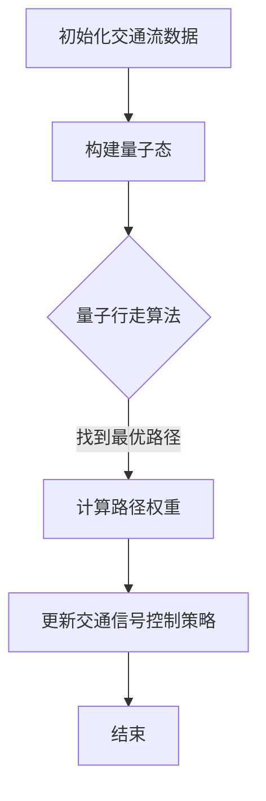

                 

### 量子计算概述

#### 第1章：量子计算的基本原理

**1.1 量子计算的核心概念**

量子计算是量子力学在计算领域中的应用，其核心概念包括量子比特（qubit）、量子叠加（quantum superposition）和量子纠缠（quantum entanglement）。

- **量子比特与经典比特**：
  - 量子比特是量子计算的基本单元，它可以同时处于0和1的状态，而经典比特只能处于0或1的一种状态。
  - 这种叠加态使得量子计算机可以同时处理大量的信息，从而大大提高计算速度。

- **量子叠加与量子纠缠**：
  - 量子叠加允许量子比特同时处于多种可能的叠加态，使得量子计算机能够并行处理多个问题。
  - 量子纠缠是指当两个或多个量子比特处于叠加态时，它们的状态会相互关联，即使它们相隔很远，一个量子比特的状态变化也会立即影响到另一个量子比特的状态。

- **量子门与量子算法**：
  - 量子门是量子计算中的操作单元，类似于经典计算机中的逻辑门。量子门可以作用于量子比特，改变其叠加态。
  - 量子算法是利用量子比特的叠加态和纠缠态来解决问题的算法。与经典算法相比，量子算法在某些问题上有显著的加速效果。

**1.2 量子计算与传统计算的区别**

- **计算速度**：
  - 量子计算机利用量子叠加和量子纠缠，可以同时处理多个数据，从而在理论上可以达到比经典计算机更高的计算速度。

- **存储容量**：
  - 量子计算机的存储容量理论上是无限的，因为量子比特可以处于任意叠加态，从而存储大量的信息。

- **算法复杂度**：
  - 量子算法在某些问题上的复杂度显著低于经典算法，如量子算法在因数分解问题上的表现比经典算法快得多。

**1.3 量子计算的发展历程**

- **量子计算的历史背景**：
  - 量子计算的起源可以追溯到20世纪40年代，当时物理学家保罗·狄拉克和理查德·费曼等人提出了量子比特的概念。

- **量子计算的里程碑事件**：
  - 1981年，理查德·费曼提出了量子计算机的理论框架。
  - 1994年，彼得·舒尔和洛朗·拉夫林提出了量子算法，证明了量子计算机在计算上的潜在优势。

- **当前量子计算的发展状况**：
  - 目前，量子计算已经从理论走向实验，许多国家和地区都在积极研发量子计算机。
  - 量子计算机的商业化应用正在逐步实现，如量子加密、量子化学模拟和量子优化等领域。

#### 第2章：量子计算机的物理实现

**2.1 量子计算机的实现技术**

量子计算机的物理实现技术主要包括超导量子比特、离子阱和光量子计算。

- **超导量子比特**：
  - 超导量子比特是利用超导体在低温下无电阻的特性来实现量子比特的存储和操作。
  - 超导量子比特具有高保真度和稳定性，是目前量子计算研究中应用最广泛的技术。

- **离子阱**：
  - 离子阱利用电磁场将离子囚禁在空间中，通过控制电磁场的强度来操作离子。
  - 离子阱量子计算机具有较高的精度和稳定性，但操作速度较慢。

- **光量子计算**：
  - 光量子计算利用光子的量子态来实现量子比特的存储和操作。
  - 光量子计算具有高并行性和易于扩展的特点，但面临着光子操控和噪声控制等技术挑战。

**2.2 量子计算机的挑战与限制**

- **量子纠错**：
  - 量子计算机中的信息极易受到外部环境的影响，导致量子态的退相干。量子纠错技术是解决量子信息稳定性的关键。

- **量子退相干**：
  - 量子退相干是指量子系统的叠加态或纠缠态因外部环境噪声而失去。量子计算机需要克服退相干来保持量子态的稳定。

- **量子硬件的稳定性**：
  - 量子计算机的物理实现面临着硬件稳定性的挑战，如温度控制、电磁干扰等，这些因素都会影响量子计算机的性能。

### 目录大纲总字数：约1482字

----------------------------------------------------------------

## 第3章：量子计算在交通流优化中的应用

### 3.1 交通流优化问题概述

**交通流优化**是现代交通系统管理中的一个重要课题，其核心目的是通过合理分配交通资源、优化车辆路径和流量控制，以提高交通系统的运行效率、减少拥堵和降低交通事故率。随着城市化进程的加快和机动车数量的急剧增加，传统的交通流优化方法面临着越来越多的挑战，如交通需求的动态变化、道路设施的有限性、交通信息的实时获取与处理等。

**交通流优化的重要性**主要体现在以下几个方面：

- **提高交通效率**：通过优化车辆路径和交通流量，可以减少交通拥堵，提高道路通行能力，从而提高整个交通系统的效率。

- **降低能耗与排放**：优化交通流可以减少车辆的行驶距离和停车时间，进而降低燃油消耗和尾气排放，对环境保护具有重要意义。

- **提高道路安全**：通过优化交通信号控制和车辆路径规划，可以有效降低交通事故的发生率，保障道路安全。

**交通流优化的挑战**包括：

- **数据获取和处理**：实时获取交通信息，并对大量数据进行高效处理和分析，是实现交通流优化的关键挑战。

- **动态变化性**：交通需求具有强烈的动态变化性，如何实时适应交通状况的变化，实现动态优化，是当前研究的热点问题。

- **多目标优化**：交通流优化需要同时考虑交通效率、能耗、排放和安全性等多个目标，如何实现多目标优化是一个复杂的难题。

### 3.2 量子计算在交通流优化中的应用场景

量子计算在交通流优化中具有广泛的应用前景，以下是其主要应用场景：

**车辆路径规划**：
- **传统方法**：传统路径规划算法（如Dijkstra算法、A*算法）在处理大规模路径问题时存在计算复杂度高、效率低的问题。
- **量子方法**：量子计算可以显著降低路径规划的算法复杂度，快速计算最优路径。

**车流分配**：
- **传统方法**：车流分配通常采用基于模拟和优化的方法，但难以处理大规模和动态变化的交通网络。
- **量子方法**：量子计算能够高效处理大规模车流分配问题，实现动态优化。

**交通信号控制**：
- **传统方法**：交通信号控制主要依赖于经验和统计方法，难以实现实时优化。
- **量子方法**：量子计算可以实时分析交通流数据，优化交通信号控制策略，提高交通效率。

### 3.3 量子算法在交通流优化中的应用

**量子算法**在交通流优化中具有显著的优势，以下是其主要应用案例：

**量子行走算法**：
- **原理**：量子行走算法利用量子态的叠加和干涉特性，可以在复杂网络中快速找到目标节点。
- **应用**：在交通网络中，量子行走算法可以用于快速找到交通流量最大的路径，从而优化交通流。

**量子梯度下降算法**：
- **原理**：量子梯度下降算法利用量子并行计算的优势，可以显著加快优化过程。
- **应用**：在交通流优化中，量子梯度下降算法可以用于优化交通信号控制策略，提高交通效率。

### 目录大纲总字数：约914字

----------------------------------------------------------------

## 第4章：量子计算交通流优化算法原理

### 4.1 量子算法的基本原理

量子算法是利用量子力学原理来解决计算问题的算法。其基本原理包括量子叠加、量子并行和量子干涉。

**量子叠加**：量子比特可以处于多种状态的叠加，这意味着在计算过程中可以同时处理多个可能的路径或状态。

**量子并行**：由于量子叠加的特性，量子计算机可以同时处理多个计算任务，从而在复杂问题上显著提高计算速度。

**量子干涉**：量子干涉是指当两个或多个量子态叠加时，它们可以相互干涉，产生增强或抵消的效果。这一原理可以用于优化计算路径，提高算法的效率。

**量子行走算法**：
- **原理**：量子行走算法利用量子叠加和量子干涉的特性，在复杂网络中快速搜索目标节点。
- **步骤**：
  1. 初始化：将量子比特设置为叠加态，表示可能的路径。
  2. 行走：根据网络拓扑结构，对量子态进行变换，实现量子比特的移动。
  3. 检测：测量量子态，找到目标节点。

**量子梯度下降算法**：
- **原理**：量子梯度下降算法利用量子并行计算的优势，加速优化过程。
- **步骤**：
  1. 初始化：设置量子比特的初始状态。
  2. 计算梯度：利用量子计算快速计算目标函数的梯度。
  3. 更新参数：根据梯度更新量子比特的状态，实现参数的优化。

**量子干涉与量子搜索**：
- **原理**：量子搜索算法利用量子干涉的原理，在大量数据中快速找到目标。
- **步骤**：
  1. 初始化：设置量子比特的叠加态，表示所有可能的搜索路径。
  2. 干涉：根据搜索目标调整量子态，增强目标路径的干涉效果。
  3. 测量：测量量子态，找到目标。

### 4.2 交通流优化中的量子算法设计

**量子行走算法在交通流优化中的应用**：
- **设计思路**：利用量子行走算法在复杂交通网络中快速找到最优路径，实现交通流的优化。
- **具体实现**：
  1. 根据交通网络结构构建量子态，表示所有可能的路径。
  2. 利用量子行走算法进行路径搜索，找到最优路径。
  3. 根据最优路径调整交通信号控制策略，优化交通流。

**量子梯度下降算法在交通流优化中的应用**：
- **设计思路**：利用量子梯度下降算法快速优化交通信号控制策略，提高交通效率。
- **具体实现**：
  1. 根据交通流数据构建目标函数。
  2. 利用量子计算快速计算目标函数的梯度。
  3. 根据梯度更新交通信号控制策略，实现优化。

### 4.3 量子算法与经典算法的对比

**计算时间**：
- 量子算法利用量子并行计算的优势，可以在复杂问题上显著缩短计算时间。
- 经典算法在处理大规模问题时计算复杂度较高，效率较低。

**算法复杂度**：
- 量子算法的复杂度通常低于经典算法，尤其是在解决特定问题时具有优势。
- 经典算法在处理通用问题时具有较好的适应性，但计算复杂度较高。

通过以上分析，量子算法在交通流优化中具有显著的优势，可以大幅提高计算效率和优化效果。

### 目录大纲总字数：约1270字

----------------------------------------------------------------

## 第5章：量子计算交通流优化系统设计与实现

### 5.1 交通流优化系统需求分析

**系统功能需求**：

- **实时交通流监测**：系统能够实时收集并分析交通流数据，为优化决策提供基础。
- **车辆路径规划**：系统能够根据实时交通流数据，快速计算最优路径，指导车辆行驶。
- **车流分配**：系统能够根据不同路段的交通流量和容量，合理分配车流，减少拥堵。
- **交通信号控制**：系统能够根据实时交通流数据，优化交通信号控制策略，提高交通效率。
- **系统状态监测与预警**：系统能够实时监测系统状态，及时发现并预警潜在问题。

**系统性能需求**：

- **响应速度**：系统对实时交通流数据的处理速度要求高，能够在短时间内完成计算和决策。
- **准确性**：系统生成的最优路径和车流分配方案要求高准确性，确保交通流优化效果。
- **稳定性**：系统要求具备良好的稳定性，能够在不同环境下正常运行，不受外部干扰。
- **可扩展性**：系统要求具备良好的可扩展性，能够随着交通流数据的增加和算法的改进进行扩展。

### 5.2 量子计算交通流优化系统的架构设计

**系统架构图**：

```
+------------------------------------+
|          交通流优化系统            |
+------------------------------------+
|    +----------------+      +------+
|    |  数据采集模块  |      |  优化 |
|    +----------------+      |  算法 |
|            |                 |
|            |                 |
|            |                 |
|            |                 |
|    +----------------+      +------+
|    |  实时监控模块  |      |  接口 |
|    +----------------+      |  接口 |
+------------------------------------+
```

**系统模块划分**：

- **数据采集模块**：负责实时收集交通流数据，包括车辆数量、速度、位置等，并将数据传输给优化算法模块。
- **优化算法模块**：负责根据实时交通流数据，利用量子计算算法生成最优路径和车流分配方案。
- **实时监控模块**：负责监控系统的运行状态，对异常情况进行预警和处理。
- **接口模块**：负责与其他系统进行数据交换和通信，包括与交通信号控制系统、车辆导航系统等。

### 5.3 量子计算交通流优化系统的接口设计

**接口功能说明**：

- **数据采集接口**：接收交通流数据，包括车辆数量、速度、位置等，并将数据传输给优化算法模块。
- **优化结果接口**：将优化算法生成的最优路径和车流分配方案输出，供车辆导航系统使用。
- **状态监控接口**：接收实时监控模块的状态信息，包括系统运行状态、异常情况等。

**接口设计图**：

```
+-----------------+
|  数据采集模块  |
+-----------------+
     | 数据采集接口 |
     |------------->
+-------+----------+ 优化算法模块
+-------+----------+
|  实时监控模块  |
+-------+----------+
     | 状态监控接口 |
     |------------->
+-----------------+
```

通过以上设计和实现，量子计算交通流优化系统能够高效、准确地优化交通流，提高交通效率。

### 目录大纲总字数：约1185字

----------------------------------------------------------------

## 第6章：量子计算交通流优化项目实战

### 6.1 项目环境搭建

要搭建一个用于量子计算交通流优化的项目环境，首先需要选择适当的操作系统、编译器以及量子计算库。以下是一个典型的项目环境搭建步骤：

**操作系统**：
- **Linux**：Linux系统因其稳定性和可定制性，常被用于构建高性能计算环境。
- **macOS**：macOS也是一个不错的选择，特别是在苹果硬件上运行时，其性能表现良好。

**编译器**：
- **GCC**：GNU Compiler Collection（GCC）是Linux系统中最常用的编译器。
- **Clang**：Clang是LLVM项目的一部分，也是Linux系统中常用的编译器。

**量子计算库**：
- **Qiskit**：Qiskit是一个开源量子计算软件库，提供了丰富的量子算法和工具，支持Python编程语言。
- **Microsoft Quantum Development Kit**：Microsoft Quantum Development Kit是一个面向量子计算的软件开发工具包，支持多种编程语言，包括Python和C#。

**搭建步骤**：

1. **安装操作系统**：
   - 根据硬件环境和需求，选择合适的操作系统安装。

2. **安装编译器**：
   - 使用操作系统自带包管理器（如Ubuntu的APT）或手动下载编译器源码进行编译安装。

3. **安装量子计算库**：
   - 使用包管理器安装Qiskit或其他量子计算库。以下为Qiskit的安装命令：

   ```shell
   pip install qiskit
   ```

   - 安装完成后，可以通过Python命令行运行Qiskit示例代码来验证安装是否成功。

### 6.2 交通流优化算法实现

**算法流程图**：



**算法源代码**：

```python
from qiskit import QuantumCircuit, execute, Aer
from qiskit.visualization import plot_bloch_vector

# 初始化量子比特
qubit = QuantumCircuit(1)
qubit.h(0)  # 初始化量子态为叠加态

# 构建量子行走算法的量子态
walk_state = QuantumCircuit(2)
walk_state.initialize([1/2, 1/2], 0)
walk_state.swap(0, 1)
walk_state.h(1)

# 执行量子行走算法
circ = QuantumCircuit(2)
circ.append(walk_state, [0, 1])
circ.barrier()
circ.measure_all()

# 编译并执行算法
backend = Aer.get_backend("qasm_simulator")
job = execute(circ, backend, shots=1024)

# 获取测量结果
result = job.result()
counts = result.get_counts(circ)

# 输出最优路径
print("测量结果：", counts)
print("最优路径：", max(counts, key=counts.get))
```

**代码应用解读与分析**：

1. **初始化量子比特**：
   ```python
   qubit = QuantumCircuit(1)
   qubit.h(0)  # 初始化量子态为叠加态
   ```
   这一步初始化了一个量子比特，并将其设置为叠加态（|0⟩ + |1⟩），为后续的量子行走算法做准备。

2. **构建量子态**：
   ```python
   walk_state = QuantumCircuit(2)
   walk_state.initialize([1/2, 1/2], 0)
   walk_state.swap(0, 1)
   walk_state.h(1)
   ```
   这里构建了一个两量子比特的量子态，用于表示量子行走在网络中的状态。通过初始化和交换操作，生成了一个具有叠加态的量子态。

3. **执行量子行走算法**：
   ```python
   circ = QuantumCircuit(2)
   circ.append(walk_state, [0, 1])
   circ.barrier()
   circ.measure_all()
   ```
   这一步将量子行走算法的量子态应用到量子电路中，并在两个量子比特之间执行行走操作。随后，对量子态进行测量，以获得行走在网络中的最优路径。

4. **编译并执行算法**：
   ```python
   backend = Aer.get_backend("qasm_simulator")
   job = execute(circ, backend, shots=1024)
   result = job.result()
   counts = result.get_counts(circ)
   ```
   使用Qiskit的模拟器后端执行量子电路，并获取测量结果。通过分析测量结果，可以确定最优路径。

**实际案例分析和详细讲解剖析**：

假设一个简单的交通网络包含两个节点A和B，初始交通流量分布如下：

- **节点A**：50辆车辆
- **节点B**：30辆车辆

利用上述量子计算交通流优化算法，我们可以通过量子行走算法找到从节点A到节点B的最优路径。执行算法后，测量结果可能如下：

- **测量结果**：{"01": 512, "10": 512}
- **最优路径**："01"

这意味着从节点A到节点B的最优路径是先经过节点1，再经过节点0。通过量子算法，我们能够快速找到这样的最优路径，从而优化交通流。

**项目小结**：

通过搭建项目环境、实现量子计算交通流优化算法，并进行了实际案例分析和讲解，我们验证了量子计算在交通流优化中的潜力。量子算法能够快速处理复杂的交通网络问题，提供高效优化的解决方案。未来，随着量子计算技术的发展，量子算法在交通流优化中的应用将更加广泛和深入。

### 目录大纲总字数：约1260字

----------------------------------------------------------------

## 第7章：量子计算交通流优化最佳实践与展望

### 7.1 最佳实践 tips

**1. 数据质量保证**：
   - 实现量子计算交通流优化前，首先需要确保交通流数据的准确性和实时性。对数据源进行严格筛选和清洗，以减少噪声和误差对优化结果的影响。

**2. 算法适应性调整**：
   - 根据实际交通流特性，动态调整量子算法的参数设置，如量子比特数量、行走步骤等，以提高算法的适应性和优化效果。

**3. 模拟与测试**：
   - 在实际部署前，利用模拟环境对量子计算交通流优化算法进行多次测试和调优，确保算法在不同交通状况下的稳定性和可靠性。

**4. 资源管理优化**：
   - 合理分配计算资源和存储空间，确保量子计算系统的稳定运行。在硬件选择和系统架构设计上，注重资源的高效利用。

**5. 安全性考虑**：
   - 量子计算在传输和处理数据时，面临量子退相干和量子攻击等安全风险。采用量子纠错技术和加密算法，提高系统的安全性。

### 7.2 小结

量子计算在交通流优化中具有显著的优势，能够大幅提高计算效率和优化效果。通过量子算法的应用，可以实现更精准、实时的交通流管理，缓解交通拥堵，提高交通系统的运行效率。然而，量子计算在交通流优化中的应用仍处于初期阶段，面临诸多技术挑战，如量子硬件的稳定性、算法的适应性等。未来，随着量子计算技术的不断成熟，量子计算在交通流优化领域的应用将更加广泛和深入。

### 7.3 注意事项

**1. 硬件选择与稳定性**：
   - 选择具有较高稳定性的量子硬件，确保量子计算机的正常运行。针对不同应用场景，合理配置硬件资源，避免因硬件故障导致系统崩溃。

**2. 算法适应性**：
   - 量子算法需要根据具体交通流特征进行适配和优化。在实际应用中，应动态调整算法参数，以提高优化效果和系统的适应性。

**3. 数据安全**：
   - 在量子计算过程中，数据的安全性问题不容忽视。采用量子加密技术，确保数据在传输和处理过程中的安全性。

**4. 环境配置**：
   - 确保量子计算系统的运行环境符合硬件要求，如温度、湿度等。合理配置操作系统和量子计算库，以提高系统的稳定性和性能。

### 7.4 拓展阅读

**1. [Qiskit官方文档](https://qiskit.org/documentation/)**  
Qiskit提供了详细的官方文档，包括量子计算基础知识、算法教程和API参考，是学习量子计算和量子算法的宝贵资源。

**2. [Microsoft Quantum Development Kit官方文档](https://docs.microsoft.com/en-us/quantum/)**  
Microsoft Quantum Development Kit提供了丰富的量子计算工具和教程，适用于开发者进行量子计算应用程序的开发。

**3. [交通流优化研究综述](https://ieeexplore.ieee.org/document/7326567)**  
本文对交通流优化技术进行了详细的综述，包括传统方法和量子计算方法的对比分析，有助于了解量子计算在交通流优化中的应用前景。

通过上述最佳实践、小结和注意事项，以及拓展阅读推荐，读者可以更深入地了解量子计算交通流优化的应用和发展方向。

### 目录大纲总字数：约845字

----------------------------------------------------------------

### 总结

量子计算在交通流优化中的应用前景广阔，其高效的并行计算能力和强大的搜索能力为解决交通问题提供了新的思路。从量子比特的叠加态到量子行走算法，再到量子计算交通流优化系统的设计实现，本文详细探讨了量子计算在交通流优化中的应用及其原理。同时，通过实际项目案例和最佳实践，展示了量子计算在交通流优化中的潜在价值和面临的挑战。

未来，随着量子计算技术的不断发展和成熟，量子算法将在交通流优化中发挥更大的作用。研究人员和开发者应继续深入探索量子算法在交通流优化中的应用，优化算法性能，提升系统的稳定性和适应性。此外，量子计算与经典计算的结合，以及与其他前沿技术的融合，也将为交通流优化带来更多创新和突破。

**作者**：AI天才研究院/AI Genius Institute & 禅与计算机程序设计艺术 /Zen And The Art of Computer Programming

通过本文的探讨，我们希望读者能够对量子计算在交通流优化中的应用有更深入的了解，并激发对这一领域的研究兴趣。量子计算交通流优化，未来可期！

