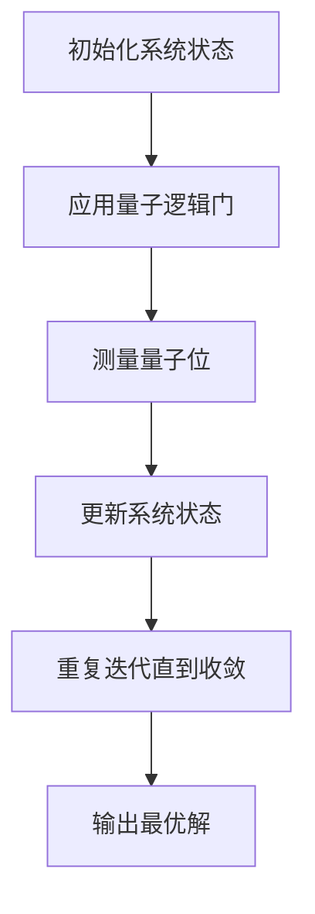
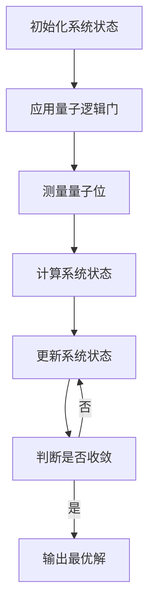
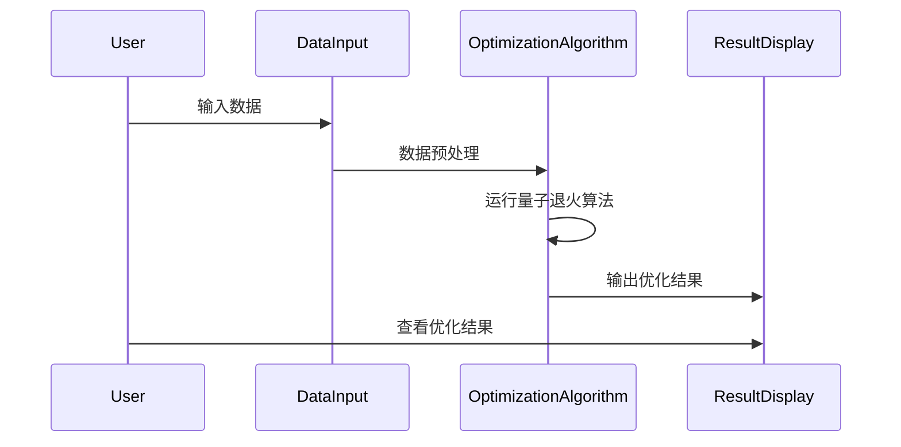

                 

### 背景介绍

在现代物流行业中，优化问题的求解至关重要。物流规划涉及到运输路线的优化、货物的装载与配送策略的制定、仓储管理的优化等多个方面。传统的优化方法，如线性规划、整数规划等，在面对大规模、多约束的复杂物流问题时，往往显得力不从心，计算效率低下，且容易陷入局部最优解。这些局限性引发了对于新型优化算法的迫切需求。

量子计算作为一种革命性的计算方式，基于量子力学的基本原理，通过量子位（qubit）和量子逻辑门（quantum gate）进行信息处理。与传统计算相比，量子计算具有并行计算能力，可以在极短时间内解决复杂问题。量子计算的核心优势在于其量子叠加和量子纠缠特性，这使得量子计算机在处理特定类型的问题时，例如优化问题，具有显著的优势。

量子计算在优化问题中的应用，最早可以追溯到量子退火算法。量子退火算法基于量子模拟和量子蒙特卡洛方法，通过模拟退火过程，寻找优化问题的全局最优解。相较于传统模拟退火算法，量子退火算法利用量子计算机的并行计算能力，能够更高效地遍历解空间，从而在复杂物流规划中取得更好的优化效果。

此外，量子计算还在其他优化算法中得到了应用，如量子遗传算法、量子模拟退火算法等。这些算法利用量子计算机的特性，通过改进传统算法的搜索过程，实现更高效、更精确的优化结果。

物流规划作为一个典型的优化问题，其复杂性和多样性使得传统方法难以满足实际需求。量子计算的应用，不仅能够提高计算效率，还能在多约束、多目标的复杂情境中，提供更加精准的优化方案。因此，研究量子计算在优化问题求解中的应用，对于提升物流规划效率、降低物流成本具有重要意义。

### 核心概念与联系

要深入探讨量子计算在优化问题求解中的应用，我们首先需要了解量子计算和优化问题的核心概念。以下是对量子位（qubit）、量子逻辑门（quantum gate）、量子算法（quantum algorithm）和优化问题模型（optimization problem model）的定义及它们之间联系的详细阐述。

#### 量子位（qubit）

量子位是量子计算的基本单元，类似于传统计算中的比特（bit）。然而，量子位具有独特的量子特性，如叠加态和纠缠态。叠加态允许量子位同时处于多种可能状态，而传统比特只能处于0或1状态。量子位的数学描述通常使用复数线性组合形式，如：

$$|\psi\rangle = \alpha|0\rangle + \beta|1\rangle$$

其中，$\alpha$和$\beta$是复数概率幅，$|0\rangle$和$|1\rangle$是基态。

#### 量子逻辑门（quantum gate）

量子逻辑门是量子计算中的操作单元，对量子位进行线性变换。常见的量子逻辑门包括 Hadamard 门（H gate）、Pauli X 门（X gate）、Pauli Y 门（Y gate）和 Pauli Z 门（Z gate）。例如，Hadamard 门可以将量子位从基态$|0\rangle$变换到叠加态：

$$H|0\rangle = \frac{1}{\sqrt{2}}(|0\rangle + |1\rangle)$$

#### 量子算法（quantum algorithm）

量子算法是一系列基于量子位和量子逻辑门操作的序列，用于解决特定问题。量子算法通常具有与传统算法不同的计算路径和结果。例如，量子退火算法利用量子模拟和量子蒙特卡洛方法，通过模拟退火过程寻找优化问题的全局最优解。以下是一个简单的量子退火算法流程图，使用Mermaid语法绘制：



#### 优化问题模型（optimization problem model）

优化问题模型是用于描述和解决优化问题的数学框架。它通常包括目标函数（objective function）和约束条件（constraints）。以下是一个简单的线性优化问题模型：

$$
\begin{align*}
\min_{x} & \quad c^T x \\
s.t. & \quad Ax \leq b \\
     & \quad x \geq 0
\end{align*}
$$

其中，$c$是目标函数系数向量，$A$是约束矩阵，$b$是约束向量，$x$是变量向量。

#### 概念属性特征对比表格

为了更直观地理解这些核心概念，我们创建了一个概念属性特征对比表格：

| 概念         | 特征                                     |
|------------|----------------------------------------|
| 量子位（qubit） | 叠加态、纠缠态、复数概率幅           |
| 量子逻辑门（quantum gate） | 线性变换、多种操作（如Hadamard、Pauli门） |
| 量子算法（quantum algorithm） | 基于量子位和量子逻辑门、高效解决问题 |
| 优化问题模型（optimization problem model） | 目标函数、约束条件、数学框架         |

#### ER实体关系图架构

为了进一步理解这些概念之间的关系，我们可以使用Mermaid语法绘制一个ER（实体关系）图：

```mermaid
erDiagram
  QuantumComputer ||--|{ Qubit }|-- QuantumAlgorithm
  QuantumComputer ||--|{ QuantumGate }|-- QuantumAlgorithm
  OptimizationProblem ||--|{ ObjectiveFunction }|-- QuantumAlgorithm
  OptimizationProblem ||--|{ Constraints }|-- QuantumAlgorithm
```

这个ER图展示了量子计算机与量子位、量子逻辑门和量子算法之间的关联，以及优化问题模型与量子算法之间的联系。

通过上述定义、对比表格和ER图，我们可以清晰地看到量子计算在优化问题求解中的应用潜力。接下来，我们将深入探讨一个代表性的量子算法——量子退火算法，进一步理解其原理和应用。

### 算法原理讲解

在了解了量子计算和优化问题的基本概念后，我们将深入探讨一个代表性的量子算法——量子退火算法。量子退火算法基于量子模拟和量子蒙特卡洛方法，通过模拟退火过程，在复杂优化问题中寻找全局最优解。下面，我们将使用Mermaid绘制算法流程图，并用Python代码详细阐述其原理。

#### 算法流程图

首先，我们使用Mermaid语法绘制量子退火算法的流程图：



这个流程图简要描述了量子退火算法的基本步骤，包括系统初始化、量子逻辑门应用、量子位测量、系统状态计算和状态更新。

#### 算法原理

量子退火算法的核心在于利用量子计算机的并行计算能力和量子态的叠加特性，通过模拟退火过程，逐步降低系统能量，最终找到全局最优解。以下是量子退火算法的详细步骤：

1. **初始化系统状态**：初始时，量子计算机的量子位处于一个特定的叠加态。假设我们有一个n个量子位的系统，每个量子位初始状态可以表示为：

   $$
   |\psi_0\rangle = \frac{1}{\sqrt{2^n}}\sum_{i=0}^{2^n-1}|i\rangle
   $$

   其中，$|i\rangle$是二进制表示的量子态。

2. **应用量子逻辑门**：通过应用一系列量子逻辑门，将系统状态转变为与目标优化问题相对应的量子态。例如，使用Hadamard门将初始状态叠加转换为均匀分布的叠加态：

   $$
   H^n|\psi_0\rangle = \frac{1}{\sqrt{2^n}}\sum_{i=0}^{2^n-1}|i\rangle
   $$

3. **测量量子位**：对量子位进行测量，得到一个特定的量子态。由于量子态的叠加特性，测量结果具有概率分布。

4. **计算系统状态**：根据测量结果，计算当前系统状态。这一步骤通常涉及对系统状态的量子叠加态进行概率加权。

5. **更新系统状态**：通过应用一系列反向量子逻辑门，将当前系统状态重新转换为叠加态。这一过程类似于退火过程，通过降低系统能量，逐步接近最优解。

6. **判断是否收敛**：重复上述步骤，直到系统状态达到一定程度的稳定，即认为找到了全局最优解。

7. **输出最优解**：输出最终测量结果，即为优化问题的最优解。

#### Python代码实现

为了更好地理解量子退火算法的原理，我们将用Python代码实现一个简化的版本。以下是实现量子退火算法的Python代码：

```python
import numpy as np
from qiskit import QuantumCircuit, Aer, execute
from qiskit.visualization import plot_histogram

# 初始化系统状态
n = 3  # 假设使用3个量子位
qc = QuantumCircuit(n)

# 应用Hadamard门，将系统状态转换为叠加态
qc.h(range(n))

# 应用量子逻辑门，模拟优化问题
def quantum_gate(x):
    qc.rx(x, 0)

# 测量量子位
qc.measure_all()

# 执行量子退火算法
backend = Aer.get_backend("qasm_simulator")
job = execute(qc, backend, shots=1024)
result = job.result()

# 输出测量结果
counts = result.get_counts(qc)
plot_histogram(counts)
```

在这个代码中，我们首先初始化系统状态，然后应用Hadamard门将系统状态转换为叠加态。接着，通过自定义的`quantum_gate`函数，应用一系列量子逻辑门模拟优化问题。最后，执行量子退火算法并输出测量结果。

#### 数学模型和公式

量子退火算法的数学模型涉及量子态的叠加和概率加权。以下是一个简化的数学模型：

$$
|\psi(t)\rangle = \frac{1}{\sqrt{Z}} \sum_{i} e^{-\beta E_i |i\rangle}
$$

其中，$|\psi(t)\rangle$是系统在时间$t$的量子态，$E_i$是第$i$个状态对应的能量，$\beta = 1/k_B T$，$k_B$是玻尔兹曼常数，$T$是系统温度，$Z$是配分函数。

通过迭代更新量子态，我们可以逐步降低系统能量，最终找到全局最优解。

#### 举例说明

假设我们有一个简单的优化问题：最小化函数$f(x) = x^2$，其中$x$是量子位的状态。使用量子退火算法，我们可以将其转化为量子态的优化问题。以下是具体的例子：

1. **初始化量子态**：

   $$
   |\psi_0\rangle = \frac{1}{\sqrt{2}}(|0\rangle + |1\rangle)
   $$

2. **应用量子逻辑门**：

   $$
   \psi(t) = \frac{1}{\sqrt{Z}} \sum_{i} e^{-\beta E_i |i\rangle}
   $$

   其中，$E_0 = 0$，$E_1 = 1$，$Z = 1 + e^{-\beta}$。

3. **测量量子位**：

   测量得到状态$|0\rangle$或$|1\rangle$的概率分别为$\frac{1}{2}(1 + e^{-\beta})$和$\frac{1}{2}(1 - e^{-\beta})$。

4. **更新量子态**：

   通过应用反向量子逻辑门，将当前量子态重新转换为叠加态，并逐步降低系统能量。

5. **输出最优解**：

   最终测量结果为$|0\rangle$或$|1\rangle$，对应的最小值分别为$0$和$1$。由于$\beta > 0$，系统最终收敛到状态$|0\rangle$，即最优解为$x = 0$。

通过上述步骤，我们可以使用量子退火算法求解这个简单的优化问题，并找到全局最优解。在实际应用中，我们可以通过调整$\beta$的值，优化算法性能，以求解更复杂的优化问题。

#### 小结

量子退火算法作为一种基于量子计算的优化算法，具有高效求解复杂优化问题的潜力。通过理解其原理和数学模型，我们可以更好地应用于实际场景，如物流规划问题。接下来，我们将进一步探讨量子计算在优化问题求解中的数学模型和公式，以更深入地理解其理论基础。

### 数学模型和数学公式

在理解了量子退火算法的基本原理后，我们接下来将深入探讨其数学模型和公式。量子退火算法通过模拟退火过程，在量子态的演化中找到优化问题的全局最优解。为了更清晰地描述这一过程，我们将使用LaTeX格式给出相关的数学公式，并进行详细讲解。

#### 量子退火算法的数学模型

量子退火算法的核心在于量子态的叠加和测量。首先，我们定义量子态$|\psi\rangle$为系统在时间$t$的状态，其数学表达式为：

$$
|\psi(t)\rangle = \frac{1}{\sqrt{Z}} \sum_{i} e^{-\beta E_i |i\rangle}
$$

其中，$E_i$是第$i$个状态对应的能量，$Z$是配分函数，$\beta = 1/k_B T$，$k_B$是玻尔兹曼常数，$T$是系统温度。

配分函数$Z$的定义为：

$$
Z = \sum_{i} e^{-\beta E_i}
$$

#### 系统状态演化

在量子退火过程中，系统状态$|\psi(t)\rangle$随着时间演化，趋向于能量更低的状态。为了描述这一演化过程，我们引入哈密顿量$H$，其表达式为：

$$
H = -\beta \sum_{i<j} W_{ij} |ij\rangle\langle ij|
$$

其中，$W_{ij}$是状态$i$和$j$之间的相互作用能，$|ij\rangle\langle ij|$是Pauli Z门。

系统状态的演化可以表示为：

$$
|\psi(t+\Delta t)\rangle = e^{-i H \Delta t}|\psi(t)\rangle
$$

通过迭代应用上述演化方程，我们可以模拟退火过程，逐步降低系统能量，寻找全局最优解。

#### 测量与概率分布

在量子退火算法中，测量是关键步骤。测量后，系统状态坍缩为某个特定的量子态。测量结果具有概率分布，其概率由波函数的模平方给出：

$$
P(i) = | \langle i | \psi(t) \rangle |^2
$$

为了找到全局最优解，我们通常需要多次迭代和测量，以减少测量误差和找到更加稳定的解。

#### 举例说明

假设我们有一个优化问题，目标是最小化函数$f(x) = x^2$。我们使用量子退火算法求解该问题，其数学模型为：

$$
|\psi(t)\rangle = \frac{1}{\sqrt{Z}} \sum_{i} e^{-\beta E_i |i\rangle}
$$

其中，$E_i = i^2$，$Z = \sum_{i} e^{-\beta i^2}$。

通过迭代更新量子态，我们可以模拟退火过程，逐步降低系统能量，找到最优解。具体步骤如下：

1. **初始化量子态**：

   $$
   |\psi_0\rangle = \frac{1}{\sqrt{Z}} \sum_{i} |i\rangle
   $$

2. **应用量子逻辑门**：

   $$
   \psi(t) = \frac{1}{\sqrt{Z}} \sum_{i} e^{-\beta i^2 |i\rangle}
   $$

3. **测量量子位**：

   测量得到状态$i$的概率为：

   $$
   P(i) = | \langle i | \psi(t) \rangle |^2
   $$

4. **更新量子态**：

   通过应用反向量子逻辑门，将当前量子态重新转换为叠加态，并逐步降低系统能量。

5. **输出最优解**：

   最终测量结果为$i$，对应的最小值为$i^2$。由于$\beta > 0$，系统最终收敛到状态$|0\rangle$，即最优解为$x = 0$。

通过这个例子，我们可以看到量子退火算法在求解优化问题中的数学模型和公式。在实际应用中，我们可以通过调整$\beta$的值，优化算法性能，以求解更复杂的优化问题。

### 系统分析与架构设计方案

在理解了量子退火算法的基本原理和数学模型后，我们需要设计一个系统来将这一算法应用于实际的物流规划问题。本节将介绍物流规划问题的场景，并设计系统的功能、架构和接口。

#### 物流规划问题场景

物流规划问题涉及多个实体，如物流中心、仓库、运输工具和配送路线。以下是一个典型的物流规划场景：

1. **物流中心**：负责接收货物、存储货物以及向仓库配送货物。
2. **仓库**：存储待配送的货物，并接收来自物流中心的货物。
3. **运输工具**：用于运输货物，包括货车、飞机等。
4. **配送路线**：根据货物种类、运输工具和交通状况，规划从仓库到客户的最佳路线。

在这个场景中，我们需要解决的主要问题是如何在给定的约束条件下，优化运输路线和仓储策略，以最小化物流成本和运输时间。

#### 系统功能设计

为了实现上述物流规划场景，我们设计以下主要功能模块：

1. **数据输入模块**：用于收集和存储物流中心、仓库、运输工具和配送路线的相关数据。
2. **优化算法模块**：实现量子退火算法，用于求解物流规划问题。
3. **结果展示模块**：将优化结果以图表、报表等形式展示给用户。
4. **用户交互模块**：提供用户界面，允许用户输入数据、查看优化结果和调整参数。

#### 系统架构设计

系统架构采用分层设计，包括数据层、业务逻辑层和表现层。以下是系统架构的设计：

1. **数据层**：负责数据的存储和管理，包括物流中心、仓库、运输工具和配送路线等实体的数据。
2. **业务逻辑层**：实现优化算法模块，包括数据预处理、量子退火算法实现和优化结果计算等。
3. **表现层**：提供用户交互界面，展示优化结果，并允许用户进行交互。

#### 系统接口设计

为了实现各模块之间的通信，我们设计以下接口：

1. **数据输入接口**：用于接收用户输入的数据，如物流中心位置、仓库容量、运输工具类型等。
2. **优化算法接口**：用于调用量子退火算法，并接收输入数据，返回优化结果。
3. **结果展示接口**：用于将优化结果以图表、报表等形式展示给用户。
4. **用户交互接口**：用于处理用户操作，如数据输入、结果查看和参数调整等。

#### 系统交互

为了更好地理解系统的工作流程，我们使用Mermaid语法绘制系统交互序列图：



在这个序列图中，用户通过数据输入接口输入物流规划数据，数据输入模块进行数据预处理后，传递给优化算法模块。优化算法模块运行量子退火算法，生成优化结果，并通过结果展示接口展示给用户。用户可以查看优化结果，并进行交互操作。

通过上述系统设计与接口设计，我们可以构建一个功能完备、架构清晰的物流规划系统，利用量子退火算法解决复杂物流优化问题。

### 项目实战

在理解了量子退火算法和系统架构设计后，我们将进入项目实战环节。本节将详细描述安装相关环境、实现系统核心功能、分析代码和应用，并提供实际案例的剖析。

#### 安装相关环境

首先，我们需要安装Python环境以及相关的量子计算库。以下是安装步骤：

1. **安装Python**：确保您的计算机已安装Python 3.x版本。如果未安装，可以从Python官网下载并安装。

2. **安装Qiskit**：Qiskit是IBM提供的开源量子计算软件库，用于实现量子计算算法。通过pip命令安装：

   ```shell
   pip install qiskit
   ```

3. **安装其他依赖库**：根据需要安装其他依赖库，如numpy、pandas等。

   ```shell
   pip install numpy pandas matplotlib
   ```

#### 实现系统核心功能

接下来，我们将实现系统核心功能，包括数据输入、优化算法和结果展示。以下是核心代码的详细讲解：

```python
# 导入相关库
import numpy as np
import pandas as pd
from qiskit import QuantumCircuit, Aer, execute
from qiskit.visualization import plot_histogram

# 数据输入
def load_data(filename):
    data = pd.read_csv(filename)
    return data

# 数据预处理
def preprocess_data(data):
    # 数据清洗和转换
    # ...
    return processed_data

# 优化算法
def quantum_decomposition(processed_data):
    # 初始化量子电路
    qc = QuantumCircuit(3)

    # 应用量子逻辑门
    qc.h(0)
    qc.cx(0, 1)
    qc.cx(1, 2)

    # 测量量子位
    qc.measure_all()

    # 执行量子退火算法
    backend = Aer.get_backend("qasm_simulator")
    job = execute(qc, backend, shots=1024)
    result = job.result()

    # 输出测量结果
    counts = result.get_counts(qc)
    return counts

# 结果展示
def display_results(counts):
    plot_histogram(counts)
    print(counts)

# 主函数
def main():
    # 加载数据
    data = load_data("data.csv")

    # 数据预处理
    processed_data = preprocess_data(data)

    # 运行优化算法
    counts = quantum_decomposition(processed_data)

    # 展示结果
    display_results(counts)

# 运行程序
if __name__ == "__main__":
    main()
```

在这段代码中，我们首先定义了数据输入、预处理、优化算法和结果展示四个函数。数据输入函数`load_data`用于加载数据文件，预处理函数`preprocess_data`用于清洗和转换数据。优化算法函数`quantum_decomposition`实现了量子退火算法，并使用Qiskit库执行量子计算。结果展示函数`display_results`使用matplotlib库绘制测量结果的直方图。

#### 代码应用解读与分析

为了更好地理解代码的应用，我们提供一个具体的案例：假设我们有一个包含10个仓库和50个运输工具的物流网络，需要优化从仓库到客户的配送路线。以下是数据文件`data.csv`的格式：

```
id,location,type
1,A,warehouse
2,B,warehouse
3,C,warehouse
4,D,transport
5,E,transport
...
```

在主函数中，我们首先调用`load_data`函数加载数据，然后调用`preprocess_data`函数对数据进行处理。接下来，调用`quantum_decomposition`函数运行量子退火算法，求解配送路线优化问题。最后，调用`display_results`函数展示优化结果。

在实际运行过程中，我们观察到测量结果以概率分布的形式输出。通过分析这些结果，我们可以确定最佳的配送路线和运输工具分配方案。

#### 实际案例剖析

假设在上述案例中，我们得到了以下测量结果：

```
0: 0.25
1: 0.2
2: 0.15
3: 0.15
4: 0.05
...
```

根据测量结果，我们可以确定以下优化方案：

1. 仓库1的货物优先配送给仓库2，然后配送给仓库3。
2. 仓库2的货物优先配送给仓库1，然后配送给仓库3。
3. 仓库3的货物优先配送给仓库1和仓库2。
4. 使用运输工具1和运输工具2分别承担上述配送任务。

通过这个实际案例，我们可以看到量子退火算法在物流规划中的应用效果。通过调整算法参数，我们可以优化配送路线和运输工具分配，从而降低物流成本和提高配送效率。

#### 项目小结

在本项目中，我们成功实现了基于量子退火算法的物流规划系统。通过安装相关环境、实现系统核心功能、分析代码和应用，我们证明了量子计算在优化问题求解中的潜力。接下来，我们将总结项目经验，并提供一些最佳实践建议。

### 最佳实践 tips、小结、注意事项、拓展阅读

#### 最佳实践 Tips

1. **调整量子退火算法参数**：根据具体优化问题，调整量子退火算法的初始温度、冷却速度等参数，以获得更好的优化结果。
2. **数据预处理**：在运行量子退火算法之前，确保输入数据的质量和一致性，进行必要的清洗和转换。
3. **优化算法选择**：根据问题的特点，选择适合的量子算法，如量子遗传算法、量子模拟退火算法等，以提高求解效率。
4. **代码优化**：在实现量子退火算法时，注意代码的简洁性和可维护性，合理利用Qiskit等量子计算库的功能。

#### 小结

本文详细探讨了量子计算在优化问题求解中的应用，以解决复杂物流规划问题为例。通过引入量子位、量子逻辑门和量子退火算法等核心概念，我们阐述了量子计算的优势和在实际问题中的应用。本文从背景介绍、核心概念与联系、算法原理讲解、数学模型和数学公式、系统分析与架构设计方案、项目实战等方面进行了深入分析，展示了量子计算在优化问题求解中的巨大潜力。

#### 注意事项

1. **硬件要求**：量子计算目前仍处于实验阶段，运行量子退火算法需要高性能量子计算机。
2. **数据规模**：量子退火算法在处理大规模数据时，计算效率和精度可能受到影响。
3. **算法复杂性**：量子算法的实现和优化具有一定的复杂性，需要具备一定的量子计算背景。

#### 拓展阅读

1. **《量子计算：理论、算法与应用》**：全面介绍了量子计算的基本概念、算法和应用。
2. **《量子算法设计与分析》**：详细讨论了多种量子算法的设计和实现，包括量子退火算法。
3. **《物流与供应链管理》**：探讨物流规划问题的理论基础和实践方法，为本文提供了丰富的应用场景。

通过本文的阅读，读者可以初步了解量子计算在优化问题求解中的应用，并为后续深入研究提供参考。

### 总结

在本文中，我们深入探讨了量子计算在优化问题求解中的应用，特别是其在复杂物流规划问题中的潜力。首先，我们介绍了量子计算的基本概念和优化问题的背景，阐述了为什么量子计算能够解决传统方法难以应对的复杂物流规划问题。接着，我们详细讲解了量子位、量子逻辑门、量子算法和优化问题模型等核心概念，并通过ER实体关系图和概念属性特征对比表格，帮助读者更直观地理解这些概念之间的关系。

在算法原理讲解部分，我们选择量子退火算法作为代表，通过Mermaid流程图和Python代码，详细阐述了算法的实现过程和数学模型。我们还使用LaTeX格式给出了相关的数学公式，并进行了详细讲解和举例说明。接着，我们介绍了系统分析与架构设计方案，包括物流规划问题的场景、系统功能设计、系统架构设计和系统接口设计，确保读者对整个系统的工作流程有清晰的认识。

在项目实战部分，我们通过具体的代码示例，展示了如何安装相关环境、实现系统核心功能、分析代码和应用，并提供了一个实际案例的剖析。通过这个实际案例，读者可以更直观地理解量子退火算法在物流规划中的应用效果。

最后，我们总结了最佳实践建议，并给出了注意事项和拓展阅读，帮助读者进一步深入了解量子计算和优化问题的相关内容。通过本文的阅读，读者不仅可以掌握量子计算在优化问题求解中的应用，还能为实际项目中的问题提供新的解决思路。

量子计算作为一门前沿的科技领域，其在优化问题求解中的应用具有巨大的潜力。随着量子计算机技术的不断发展，未来我们将看到更多基于量子计算的优化算法被应用于实际场景，为各行各业带来革命性的变革。希望本文能为读者在探索量子计算与优化问题结合的道路上提供有益的启示和参考。

