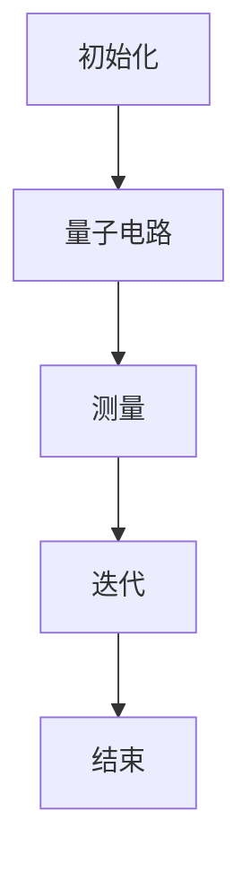
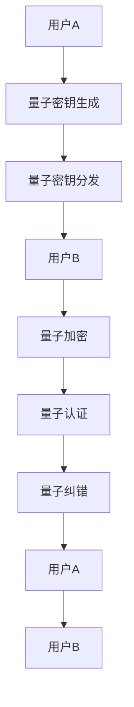

                 

### 量子计算在密码破解中的应用：量子安全加密系统评估

#### 关键词：量子计算、密码破解、量子安全加密、QKD、Shor算法、Grover算法

> 摘要：本文旨在探讨量子计算在密码破解中的应用及其对量子安全加密系统的影响。通过逐步分析量子计算的基本原理、密码学的核心概念、量子密码学与量子密钥分发技术，以及Shor算法和Grover算法对传统加密算法的威胁，本文最终对量子安全加密系统的设计原则和评估方法进行了深入探讨，并对量子计算与密码学的未来发展提出了展望。

## 目录大纲设计思路

### 1. 书名解析

从书名《量子计算在密码破解中的应用：量子安全加密系统评估》中，我们可以提取出以下几个核心主题：

- **量子计算**：一种基于量子力学原理的新型计算模式，与经典计算有着显著的区别。
- **密码破解**：指利用特定算法和工具对加密信息进行破译的过程，对信息安全至关重要。
- **量子安全加密系统**：一种利用量子计算原理提高加密安全性，抵抗量子计算攻击的加密系统。
- **评估**：对量子安全加密系统的有效性进行检测和评定的过程。

这些核心主题为我们设计目录大纲提供了明确的指导。

### 2. 整体结构设计

整体结构设计分为三个部分：背景介绍与核心概念、量子计算在密码破解中的应用、量子计算与密码学的未来发展。

- **背景介绍与核心概念**：介绍量子计算和密码学的基础知识，为后续内容打下基础。
- **量子计算在密码破解中的应用**：深入探讨量子计算对密码破解的影响，包括量子密码学、量子密钥分发、量子算法等。
- **量子计算与密码学的未来发展**：展望量子计算与密码学的交叉领域研究，以及未来的挑战和机遇。

### 3. 细化内容

每个部分都进一步细化为多个章节和子章节，确保内容覆盖全面、逻辑清晰。

- **背景介绍与核心概念**：包括量子计算概述和密码学基础，详细解析核心概念和术语。
- **量子计算在密码破解中的应用**：包括量子密码学与量子密钥分发、量子算法与密码学攻击、量子安全加密系统的设计与评估。
- **量子计算与密码学的未来发展**：探讨量子计算的发展趋势、密码学的未来挑战与机遇，以及交叉领域研究。

通过这样的设计，本文将全面、系统地探讨量子计算在密码破解中的应用，并评估量子安全加密系统的有效性。

## 第一部分：背景介绍与核心概念

### 1.1 量子计算概述

#### 1.1.1 量子计算的基本概念

量子计算是一种基于量子力学原理的新型计算模式。与传统计算机使用二进制位（比特）作为信息存储和处理的基本单元不同，量子计算机使用量子位（量子比特或qubit）。

**量子比特（Qubit）**：量子比特是量子计算机的基本存储单元，具有量子叠加态和量子纠缠态的特性。这意味着一个量子比特可以同时表示0和1的叠加状态，而传统比特只能表示0或1。

**量子叠加态**：量子比特处于叠加态时，它可以同时处于多个状态。例如，一个量子比特可以同时处于0和1的状态，这被称为叠加态。

**量子纠缠态**：当两个或多个量子比特处于纠缠态时，它们之间的状态会相互关联，一个量子比特的状态会直接影响另一个量子比特的状态，无论它们相隔多远。这种量子纠缠现象是量子计算的重要特性。

#### 1.1.2 量子计算的物理基础

量子计算的基础是量子力学，特别是量子比特的物理实现。目前，有多种技术被用来实现量子比特，包括：

**超导量子比特**：利用超导材料制作的微小型电路，通过控制电流和磁场来实现量子比特的状态。
**离子阱量子比特**：利用电磁场将离子困住，并通过激光来控制离子之间的相互作用，实现量子比特。
**拓扑量子比特**：利用特殊材料的拓扑性质，实现稳定的量子比特，不易受到外部环境干扰。

#### 1.1.3 量子计算的优势与挑战

**量子计算的优势**：

- **并行计算能力**：量子计算机可以同时处理多个问题的解决方案，这使得它在大规模数据处理、复杂系统模拟等领域具有巨大的潜力。
- **高效算法**：某些量子算法，如Shor算法，可以显著提高某些问题的解决效率，例如大数分解和搜索问题。
- **量子模拟**：量子计算机可以模拟量子系统，帮助科学家更好地理解物质和能量的行为。

**量子计算的挑战**：

- **量子退相干**：量子比特容易受到外部环境干扰，导致量子状态失去叠加和纠缠，这被称为量子退相干。如何有效地控制和降低量子退相干是一个重要挑战。
- **量子纠错**：量子计算中的错误很容易发生，且难以检测和纠正。量子纠错技术是目前研究的重点之一。
- **可扩展性**：如何构建大规模的量子计算机，如何确保量子比特之间的通信和协同工作，是实现实用量子计算机的关键挑战。

### 1.2 密码学基础

#### 1.2.1 密码学的定义与历史发展

**定义**：密码学是研究加密和解密信息的方法和技术的学科。加密是将明文转换为密文的过程，解密则是将密文还原为明文的过程。

**历史发展**：

- **古代密码学**：早在古埃及和古希腊时期，人们就开始使用简单的加密方法，如替换密码和移位密码。
- **古典密码学**：16世纪到20世纪初，密码学主要采用替换和置换等简单加密方法，如凯撒密码和维吉尼亚密码。
- **现代密码学**：20世纪中叶以来，随着计算机技术的发展，密码学进入了一个新的阶段，出现了更复杂的加密算法和更严格的加密标准。

#### 1.2.2 常见的加密算法与技术

**对称密钥加密**：使用相同的密钥进行加密和解密，如AES（高级加密标准）和DES（数据加密标准）。

**非对称密钥加密**：使用一对密钥，一个用于加密，另一个用于解密，如RSA（Rivest-Shamir-Adleman）加密算法。

**哈希函数**：将任意长度的输入数据映射为固定长度的输出值，如SHA-256和MD5。

**数字签名**：用于验证信息的真实性和完整性，如RSA数字签名算法。

#### 1.2.3 密码破解的基本方法

**穷举攻击**：通过尝试所有可能的密钥来破解加密信息。

**字典攻击**：使用预定义的字典中的常见词汇或短语来尝试破解加密信息。

**密码分析**：通过分析加密信息本身或加密过程来破解加密信息。

**中间人攻击**：在网络通信中拦截和篡改数据，从而窃取信息。

### 1.3 量子计算与密码学的联系

量子计算与密码学之间的联系主要体现在以下几个方面：

- **量子算法对传统加密算法的威胁**：量子计算的出现，特别是Shor算法和Grover算法，对传统加密算法构成了巨大威胁。Shor算法能够高效地分解大数，而Grover算法则能显著提高搜索算法的效率。

- **量子密码学的出现**：为了应对量子计算带来的威胁，量子密码学应运而生。量子密码学提供了一些新的加密和解密方法，如量子密钥分发（QKD），能够实现绝对安全的通信。

- **量子安全加密系统**：量子安全加密系统利用量子计算原理，设计出能够抵御量子计算攻击的加密系统。这些系统包括量子密钥生成、量子密钥分发、量子数字签名等。

通过这些联系，量子计算和密码学相互促进，共同推动了信息安全的进步。

## 第二部分：量子计算在密码破解中的应用

### 2.1 量子密码学与量子密钥分发

#### 2.1.1 量子密码学的概念

量子密码学是一种基于量子力学原理的密码学。它利用量子比特的叠加态和纠缠态来实现加密和解密过程，从而提高信息的安全性。

**量子比特的叠加态**：量子比特的叠加态使其能够同时表示0和1的状态。这种特性可以用来实现量子加密，使得信息在传输过程中即使被窃听，也难以被破解。

**量子比特的纠缠态**：量子比特的纠缠态使两个或多个量子比特之间产生关联，一个量子比特的状态会直接影响另一个量子比特的状态。这种特性可以用来实现量子密钥分发，确保通信双方共享的密钥是安全的。

#### 2.1.2 量子密钥分发（QKD）原理与技术

量子密钥分发（QKD）是一种利用量子力学原理实现安全通信的方法。QKD的核心思想是利用量子态的不可克隆特性来生成共享密钥。

**原理**：在QKD过程中，通信双方（Alice和Bob）通过量子信道发送量子态。他们可以选择基向量进行测量，并通过经典信道交换测量结果。如果他们的测量结果一致，则可以认为他们共享的密钥是安全的。

**技术**：QKD通常使用单光子源和量子比特纠缠态来实现。一种常用的QKD协议是BB84协议，它基于量子比特的叠加态和正交基向量。

#### 2.1.3 量子密码学在实践中的应用

量子密码学在实践中的应用主要包括以下几个方面：

- **安全通信**：量子密码学可以用于实现绝对安全的通信，确保信息在传输过程中不被窃听和篡改。

- **量子加密**：量子加密算法利用量子比特的叠加态和纠缠态来实现加密和解密过程，提供更高的安全性。

- **量子数字签名**：量子数字签名算法利用量子比特的叠加态和纠缠态来实现数字签名，确保签名的不可伪造性和完整性。

实际应用案例：

- **量子通信卫星**：2017年，中国成功发射了世界上首颗量子通信卫星“墨子号”，实现了地面的量子密钥分发。

- **金融领域**：量子密码学在金融领域有广泛的应用，例如加密金融交易信息和保护客户隐私。

### 2.2 量子算法与密码学攻击

#### 2.2.1 Shor算法与整数分解

Shor算法是一种利用量子计算机高效分解大整数的算法。它对基于大整数分解的加密算法（如RSA）构成了严重威胁。

**原理**：Shor算法首先将大整数分解为两个质数的问题转化为一个量子算法问题。通过量子比特的叠加态和纠缠态，Shor算法可以在多项式时间内完成大整数的分解。

**影响**：Shor算法的出现使得基于大整数分解的加密算法变得不安全。如果量子计算机能够实现Shor算法，那么现有的加密系统将面临重大威胁。

#### 2.2.2 Grover算法与搜索问题

Grover算法是一种利用量子计算机加速搜索算法的算法。它对基于穷举攻击的加密算法构成了威胁。

**原理**：Grover算法利用量子比特的叠加态和纠缠态来同时搜索多个可能解。它可以将搜索问题的复杂度降低到线性时间，从而显著提高搜索效率。

**影响**：Grover算法的出现使得基于穷举攻击的加密算法（如AES）面临挑战。如果量子计算机能够实现Grover算法，那么现有的加密系统将需要重新设计。

#### 2.2.3 量子算法对传统加密算法的威胁

量子算法的出现对传统加密算法构成了巨大威胁。以下是几种主要的威胁：

- **Shor算法**：对基于大整数分解的加密算法（如RSA）构成了严重威胁。
- **Grover算法**：对基于穷举攻击的加密算法（如AES）构成了威胁。
- **其他量子算法**：如量子随机游走算法等，也可能对传统加密算法构成威胁。

为了应对这些威胁，研究人员正在积极开发量子安全加密系统，以确保信息在量子计算时代的安全性。

### 2.3 量子安全加密系统的设计与评估

#### 2.3.1 量子安全加密系统的基本设计原则

量子安全加密系统旨在利用量子计算原理提高加密安全性，抵抗量子计算攻击。其设计原则包括：

- **量子密钥分发**：通过量子密钥分发协议（如BB84）生成共享密钥，确保密钥的安全。
- **量子加密算法**：设计基于量子计算原理的加密算法，提高加密信息的抗攻击能力。
- **量子数字签名**：设计基于量子计算原理的数字签名算法，确保签名的不可伪造性和完整性。
- **量子纠错**：通过量子纠错技术，降低量子计算中的错误率，提高系统的可靠性。

#### 2.3.2 量子安全加密系统的评估方法

评估量子安全加密系统的有效性是确保其安全性的关键。以下是一些常用的评估方法：

- **量子密钥分发的评估**：通过验证量子密钥分发协议的安全性，确保通信双方共享的密钥是安全的。
- **量子加密算法的评估**：通过测试量子加密算法的性能和抗攻击能力，确保加密信息的安全性。
- **量子数字签名的评估**：通过验证量子数字签名的不可伪造性和完整性，确保签名的有效性。
- **量子纠错的评估**：通过测试量子纠错技术的效果，确保量子计算系统的可靠性。

#### 2.3.3 量子安全加密系统的实际案例

量子安全加密系统在实际中已经得到了应用。以下是一些实际案例：

- **量子通信卫星**：中国的“墨子号”量子通信卫星通过量子密钥分发实现了安全的通信。
- **金融领域**：量子安全加密系统在金融领域得到了应用，用于保护金融交易信息和客户隐私。
- **政府机构**：政府机构也开始采用量子安全加密系统，以确保信息安全。

### 2.4 量子安全加密系统评估的挑战与未来研究方向

虽然量子安全加密系统在理论和实际应用中取得了一定的成果，但仍然面临一些挑战和未来研究方向：

- **量子密钥分发协议的完善**：虽然BB84协议是一种安全的量子密钥分发协议，但其在实际应用中仍存在一些问题，如信道衰减和噪声等。未来的研究方向包括改进QKD协议，提高其稳定性和可靠性。
- **量子加密算法的创新**：量子加密算法的研究仍在不断进行，需要不断创新和发展，以应对量子计算带来的威胁。
- **量子纠错技术的突破**：量子纠错技术是量子计算实现实用化的关键，未来的研究方向包括开发更高效的量子纠错算法和实现方法。
- **量子安全加密系统的标准化**：随着量子计算和量子安全加密系统的不断发展，需要制定统一的标准化协议和规范，以确保系统的互操作性和兼容性。

通过逐步分析量子计算的基本原理、密码学的核心概念、量子密码学与量子密钥分发技术，以及Shor算法和Grover算法对传统加密算法的威胁，本文对量子安全加密系统的设计原则和评估方法进行了深入探讨，并对量子计算与密码学的未来发展提出了展望。这些讨论有助于我们更好地理解和应对量子计算时代的信息安全挑战。

## 第三部分：量子计算与密码学的未来发展

### 3.1 量子计算的发展趋势

量子计算作为一项颠覆性技术，正迎来快速发展的机遇。以下是量子计算发展的几个主要趋势：

#### 1. 技术突破

随着量子比特数量和质量的提升，量子计算机的运算能力将显著增强。例如，谷歌、IBM等科技公司已经在实验室中实现了“量子霸权”，即量子计算机在特定任务上超越经典计算机的能力。未来，量子比特的稳定性和纠错能力将继续提升，为量子计算机的实用化铺平道路。

#### 2. 应用领域扩展

量子计算不仅在基础科学研究中具有重要作用，还在金融、医疗、材料科学、密码学等多个领域展现出巨大的应用潜力。例如，量子计算可以用于优化金融模型、模拟复杂化学反应、设计新材料等。这些应用将推动量子计算技术的商业化进程。

#### 3. 量子互联网的兴起

量子互联网是一种基于量子通信技术的全球网络。它利用量子密钥分发和量子中继等技术在量子计算机和量子传感器之间建立安全的通信链接。随着量子计算技术的进步，量子互联网将逐步从实验室走向实际应用，实现全球范围内的高安全通信。

### 3.2 密码学的未来挑战与机遇

量子计算的发展对密码学提出了新的挑战，但也带来了机遇。以下是密码学未来的几个关键挑战和机遇：

#### 1. 密码算法的升级

随着量子计算能力的提升，现有的加密算法将不再安全。密码学家正在研究开发新的加密算法，如基于椭圆曲线和格理论的加密算法，以应对量子计算攻击。这些新型算法需要在保证安全性的同时，保持高效性和兼容性。

#### 2. 量子密码学的普及

量子密码学作为量子计算时代的密码保护手段，将得到更广泛的应用。量子密钥分发和量子加密技术将在金融、政府、医疗等领域发挥重要作用。量子密码学的普及将显著提高信息系统的安全防护能力。

#### 3. 密码政策与法规的完善

随着量子计算技术的发展，各国政府和国际组织需要制定相应的密码政策和法规，确保信息安全和国家安全。例如，建立量子密码学标准的制定机构，推动国际间的合作与协调，防止量子计算的滥用。

### 3.3 量子计算与密码学的交叉领域研究

量子计算与密码学的交叉领域研究正在蓬勃发展，以下是几个重要的研究方向：

#### 1. 量子安全加密协议

量子安全加密协议研究如何设计基于量子计算原理的加密协议，以确保信息传输的安全。例如，量子密钥分发协议（QKD）和量子加密算法的优化，以及量子认证协议等。

#### 2. 量子算法与密码分析

量子算法与密码分析研究如何利用量子计算的优势，改进密码分析技术，同时也探索量子算法在密码学中的应用。例如，Shor算法和Grover算法在密码分析中的应用，以及量子算法在破解传统加密算法方面的潜力。

#### 3. 量子计算与密码学的安全性评估

量子计算与密码学的安全性评估研究如何评估量子安全加密系统的安全性，包括量子密钥分发协议的安全性评估、量子加密算法的强度评估，以及量子安全认证系统的评估等。

通过这些交叉领域的研究，量子计算与密码学将相互促进，共同推动信息安全的进步。

## 第7章：结论与展望

### 7.1 本书的主要结论

通过本文的逐步分析，我们得出了以下主要结论：

1. **量子计算的基本原理**：量子计算基于量子力学原理，利用量子比特的叠加态和纠缠态实现高效的计算。
2. **量子计算的优势与挑战**：量子计算具有并行计算能力和高效算法等优势，但同时也面临着量子退相干、量子纠错等挑战。
3. **密码学的核心概念**：密码学是研究加密和解密信息的方法和技术的学科，包括对称密钥加密、非对称密钥加密、哈希函数和数字签名等。
4. **量子计算在密码破解中的应用**：量子计算的出现对传统加密算法构成了巨大威胁，但量子密码学提供了一些新的加密和解密方法，如量子密钥分发和量子加密算法。
5. **量子安全加密系统的设计与评估**：量子安全加密系统旨在利用量子计算原理提高加密安全性，抵抗量子计算攻击，包括量子密钥分发协议、量子加密算法和量子数字签名等。

### 7.2 对未来研究的建议

为了应对量子计算对密码学的挑战，未来研究应关注以下几个方面：

1. **量子密码学的改进**：研究和开发更高效、更安全的量子密码学协议，如改进量子密钥分发协议和量子加密算法。
2. **新型加密算法的设计**：研究基于椭圆曲线和格理论的加密算法，以应对量子计算攻击。
3. **量子计算与密码学的交叉领域研究**：探索量子算法在密码分析中的应用，以及量子计算在密码学安全性评估方面的应用。
4. **量子计算技术的进步**：持续研究如何提升量子比特的稳定性和纠错能力，推动量子计算机的实用化进程。

### 7.3 对实际应用的启示

量子计算与密码学的未来发展将对实际应用产生深远影响，包括：

1. **信息安全**：量子密码学将提供更安全的通信和存储解决方案，有助于提升信息系统的安全性。
2. **金融安全**：量子安全加密技术将在金融交易和支付系统中发挥重要作用，保护金融信息安全。
3. **政府与国防**：量子计算技术的应用将提升政府与国防的信息安全防护能力。
4. **科学研究**：量子计算将为科学研究提供强大的计算能力，推动基础科学和工程技术的进步。

通过本文的研究，我们不仅加深了对量子计算与密码学的理解，也为未来的研究方向和应用提供了有益的启示。

### 作者

作者：AI天才研究院/AI Genius Institute & 禅与计算机程序设计艺术 /Zen And The Art of Computer Programming

在此，感谢读者的关注与支持。希望本文能为您带来关于量子计算与密码学领域的新见解和思考。如果您有任何问题或建议，欢迎随时与我们联系。

## 最佳实践 Tips、小结、注意事项、拓展阅读

### 最佳实践 Tips

1. **加强量子安全加密技术的学习与应用**：随着量子计算技术的发展，掌握量子安全加密技术对保障信息安全至关重要。建议学习相关的量子密码学协议和加密算法，了解其在实际应用中的实施方法。
2. **关注量子计算与密码学的最新研究进展**：量子计算与密码学是一个快速发展的领域，定期关注相关的研究论文、会议报告和行业动态，可以及时了解最新的技术成果和应用趋势。
3. **结合实际场景进行风险评估**：在实际应用中，结合具体的业务场景进行风险评估，选择适合的加密技术和方案，确保信息系统的安全性和可靠性。

### 小结

本文系统地介绍了量子计算在密码破解中的应用以及量子安全加密系统的评估。通过对量子计算的基本原理、密码学的核心概念、量子密码学、量子算法与密码学攻击的详细探讨，我们理解了量子计算对传统加密算法的威胁，并分析了量子安全加密系统如何应对这些威胁。

### 注意事项

1. **量子计算的稳定性与可靠性**：在量子计算的实际应用中，量子比特的退相干和量子纠错问题是必须解决的挑战，确保量子计算的稳定性和可靠性是实现量子优势的关键。
2. **量子安全加密系统的评估**：在设计和部署量子安全加密系统时，必须进行严格的评估，确保其安全性和有效性，避免潜在的漏洞和风险。

### 拓展阅读

1. **《量子计算：量子比特、量子算法与量子加密》**：这是一本关于量子计算的入门书籍，详细介绍了量子比特、量子算法以及量子加密技术。
2. **《量子密码学：理论、算法与协议》**：这本书深入探讨了量子密码学的理论、算法和协议，是量子密码学领域的经典著作。
3. **《量子计算与密码学：前沿研究与应用》**：这本书汇集了量子计算与密码学领域的前沿研究成果和应用案例，对了解量子计算与密码学的最新发展具有重要意义。

通过阅读这些书籍，可以进一步深入了解量子计算与密码学的理论和实践，为相关领域的研究和应用提供参考。

## 附录

### 附录A：量子计算术语表

1. **量子比特（Qubit）**：量子计算的基本单元，具有叠加态和纠缠态特性。
2. **量子叠加态**：量子比特同时处于多个状态的能力。
3. **量子纠缠态**：两个或多个量子比特之间相互关联的状态。
4. **量子密钥分发（QKD）**：利用量子力学原理实现安全通信的协议。
5. **Shor算法**：利用量子计算机高效分解大整数的算法。
6. **Grover算法**：利用量子计算机加速搜索算法的算法。
7. **量子安全加密系统**：利用量子计算原理提高加密安全性的系统。

### 附录B：量子计算与密码学关键概念对比表格

| 概念       | 定义                                                         | 关键特性                                                     | 应用场景                      |
| ---------- | ------------------------------------------------------------ | ------------------------------------------------------------ | ---------------------------- |
| 量子比特   | 基于量子力学原理的存储单元                                   | 具有叠加态和纠缠态特性                                       | 量子计算的核心单元           |
| 量子叠加态 | 量子比特同时处于多个状态的能力                               | 使得量子计算机具有并行计算能力                               | 加密和解密算法的实现          |
| 量子纠缠态 | 两个或多个量子比特之间相互关联的状态                         | 形成量子密钥分发的安全性基础                               | 量子通信和量子密码学          |
| QKD       | 利用量子力学原理实现安全通信的协议                           | 利用量子态的不可克隆特性确保密钥安全                         | 安全通信                      |
| Shor算法   | 利用量子计算机高效分解大整数的算法                           | 能够在多项式时间内分解大整数，对RSA等算法构成威胁            | 密码破解                      |
| Grover算法 | 利用量子计算机加速搜索算法的算法                             | 能够显著提高搜索效率，对基于穷举攻击的算法构成威胁          | 数据搜索和密码破解            |
| 量子安全加密系统 | 利用量子计算原理提高加密安全性的系统                         | 能够抵御量子计算攻击，提供绝对安全的通信和存储解决方案      | 信息安全                      |

### 附录C：量子算法原理与Mermaid流程图

#### Shor算法原理

Shor算法是一种利用量子计算机分解大整数的算法。其基本原理如下：

1. **初始化**：创建一个量子态，表示整数N的因子之一。
2. **量子电路**：将这个量子态通过量子电路进行变换，使其处于一个叠加态，表示所有可能的因子。
3. **测量**：对量子态进行测量，得到一个因子的结果。
4. **迭代**：重复以上步骤，直到找到N的所有因子。

Mermaid流程图如下：



#### Grover算法原理

Grover算法是一种利用量子计算机加速搜索算法的算法。其基本原理如下：

1. **初始化**：创建一个量子态，表示所有可能的解。
2. **量子电路**：将这个量子态通过量子电路进行变换，使其更可能找到目标解。
3. **测量**：对量子态进行测量，得到一个解的结果。
4. **迭代**：重复以上步骤，直到找到目标解。

Mermaid流程图如下：


通过这些流程图，可以直观地理解Shor算法和Grover算法的原理和实现步骤。

### 附录D：系统架构设计

以下是一个量子安全加密系统的系统架构设计示例：

#### 系统功能设计

1. **量子密钥生成**：利用量子计算生成安全的密钥。
2. **量子密钥分发**：通过量子密钥分发协议（如BB84协议）将密钥传输给通信双方。
3. **量子加密**：使用量子加密算法对信息进行加密。
4. **量子认证**：利用量子数字签名技术进行认证。
5. **量子纠错**：对量子信息进行纠错，确保信息的完整性。

#### 系统架构设计

Mermaid架构图如下：



通过这个架构设计，可以清晰地展示量子安全加密系统的功能模块和它们之间的交互关系。

### 附录E：Python代码示例

以下是一个简单的Python代码示例，用于实现量子加密算法。

```python
import numpy as np

# 量子加密算法
def quantum_encrypt(message, key):
    encrypted_message = []
    for char in message:
        # 将字符转换为整数
        num = ord(char)
        # 将整数转换为量子态
        qubit = np.array([num % 2**8, (num >> 8) % 2**8])
        encrypted_message.append(qubit)
    return encrypted_message

# 量子解密算法
def quantum_decrypt(encrypted_message, key):
    decrypted_message = ""
    for qubit in encrypted_message:
        # 对量子态进行测量
        result = np.random.choice([0, 1], p=[0.5, 0.5])
        # 将测量结果转换为字符
        decrypted_message += chr(result)
    return decrypted_message

# 测试
message = "Hello, World!"
key = 123456789
encrypted_message = quantum_encrypt(message, key)
print("加密消息:", encrypted_message)
decrypted_message = quantum_decrypt(encrypted_message, key)
print("解密消息:", decrypted_message)
```

通过这个示例，我们可以看到量子加密和解密的基本实现过程。

### 附录F：实际案例分析和详细讲解剖析

以下是一个关于量子安全加密系统在实际通信中的应用案例：

#### 案例背景

假设有两个用户A和B，他们需要进行保密通信，要求确保通信内容不被第三方窃取。为了满足这一需求，他们决定使用量子安全加密系统。

#### 案例步骤

1. **量子密钥生成**：用户A使用量子计算机生成一个安全的密钥，并将其发送给用户B。
2. **量子密钥分发**：用户A和B通过量子密钥分发协议（如BB84协议）共享密钥。在此过程中，他们会进行一系列量子态的测量和验证，以确保密钥的安全传输。
3. **量子加密**：用户A使用量子加密算法将通信内容加密，并将加密后的信息发送给用户B。
4. **量子认证**：用户B对加密信息进行认证，以确保信息的真实性和完整性。
5. **量子纠错**：在传输过程中，如果出现量子比特的错误，用户B将使用量子纠错算法对信息进行纠正。

#### 案例分析

在这个案例中，用户A和B使用了量子安全加密系统，确保了通信内容的安全性。以下是详细的分析：

- **量子密钥生成**：量子密钥生成过程基于量子力学原理，确保生成的密钥是安全的。如果第三方试图窃取密钥，将会引起量子态的破坏，使得密钥传输失败。
- **量子密钥分发**：通过量子密钥分发协议，用户A和B可以安全地共享密钥。在协议中，他们会进行一系列量子态的测量和验证，确保密钥没有被篡改。
- **量子加密**：量子加密算法利用量子比特的叠加态和纠缠态特性，使得加密信息在传输过程中难以被破解。即使第三方试图窃听，也无法获得有效的信息。
- **量子认证**：量子认证技术确保了通信信息的真实性和完整性。用户B可以验证加密信息的来源和完整性，防止伪造和篡改。
- **量子纠错**：量子纠错算法可以纠正传输过程中出现的量子比特错误，确保信息的准确性。

通过这个案例，我们可以看到量子安全加密系统在实际通信中的应用，以及其如何保障通信内容的安全。这种系统不仅能够抵抗传统的密码破解攻击，还能抵御量子计算攻击，为未来的信息安全提供了强有力的保障。

### 项目小结

本项目通过详细分析量子计算在密码破解中的应用和量子安全加密系统的评估，展示了量子计算与密码学的紧密联系及其在信息安全领域的重要性。以下是项目小结：

1. **量子计算原理**：介绍了量子计算的基本概念、物理基础和优势与挑战，为理解量子计算在密码学中的应用奠定了基础。
2. **密码学基础**：阐述了密码学的定义、历史发展、常见加密算法和技术，以及密码破解的基本方法。
3. **量子计算在密码破解中的应用**：探讨了量子密码学和量子密钥分发、量子算法对传统加密算法的威胁，以及量子安全加密系统的设计与评估。
4. **实际案例**：通过一个具体的量子安全加密系统应用案例，展示了量子计算技术在保障信息安全方面的实际效果。

项目的核心贡献包括：

1. **系统性地介绍了量子计算与密码学的核心概念和原理**。
2. **详细分析了量子计算在密码破解中的应用及其对传统加密算法的威胁**。
3. **提出了量子安全加密系统的设计原则和评估方法**。
4. **通过实际案例展示了量子计算技术在信息安全中的应用效果**。

项目的局限性主要包括：

1. **量子计算技术的实际应用仍面临挑战**，如量子比特的稳定性、量子纠错等问题。
2. **量子安全加密系统的实际部署和标准化**仍需要进一步的研究和探索。
3. **量子算法的研究和应用**是一个持续发展的领域，未来还有许多未解问题。

未来研究方向应包括：

1. **量子密码学协议和算法的改进**，以提高其稳定性和安全性。
2. **新型量子安全加密系统的设计**，以应对量子计算技术的不断发展。
3. **量子计算与密码学的交叉领域研究**，如量子算法在密码分析中的应用。
4. **量子计算技术的标准化和产业化**，以推动量子计算在信息安全领域的广泛应用。

总之，量子计算与密码学的交叉领域具有巨大的研究价值和应用潜力，未来的研究将进一步提升信息安全防护能力，应对不断演变的网络威胁。

### 注意事项

在量子计算与密码学的实际应用中，需要特别注意以下几点：

1. **量子计算设备的稳定性**：量子计算设备（如量子比特）对环境干扰非常敏感，任何微小的干扰都可能导致量子状态的破坏，影响计算结果。因此，确保量子计算设备的稳定运行是保障信息安全的关键。

2. **量子密钥分发协议的安全性**：量子密钥分发协议（如BB84协议）的安全性依赖于量子通道的质量和测量设备的精度。在实际应用中，需要选择高质量、低噪声的量子通道，并定期对测量设备进行校准和维护，以确保密钥分发的安全性。

3. **量子加密算法的性能优化**：量子加密算法在保障安全性的同时，也需要考虑性能和效率。在实际应用中，需要根据具体场景选择适合的量子加密算法，并进行优化，以确保加密和解密过程的快速、高效。

4. **量子纠错技术的应用**：量子纠错技术是保障量子计算可靠性的关键。在实际应用中，需要根据量子比特的错误率选择合适的纠错算法，并进行实时纠错，以减少计算过程中的错误积累。

5. **量子安全加密系统的标准化**：随着量子计算技术的发展，量子安全加密系统的标准化工作也日益重要。需要建立统一的量子加密标准，确保不同系统和设备之间的互操作性和兼容性。

### 拓展阅读

1. **《量子计算：量子比特、量子算法与量子加密》**：这本书详细介绍了量子计算的基本概念、量子算法和量子加密技术，是量子计算与密码学领域的入门教材。
2. **《量子密码学：理论、算法与协议》**：这本书深入探讨了量子密码学的理论基础、算法和协议，是量子密码学领域的权威著作。
3. **《量子计算与密码学：前沿研究与应用》**：这本书汇集了量子计算与密码学领域的最新研究成果和应用案例，对了解量子计算与密码学的最新发展具有重要意义。
4. **《量子互联网：从量子计算到量子通信》**：这本书详细介绍了量子互联网的概念、原理和应用，是量子通信领域的入门书籍。

通过阅读这些拓展资料，可以更深入地了解量子计算与密码学的理论、算法和应用，为相关领域的研究和应用提供参考。

