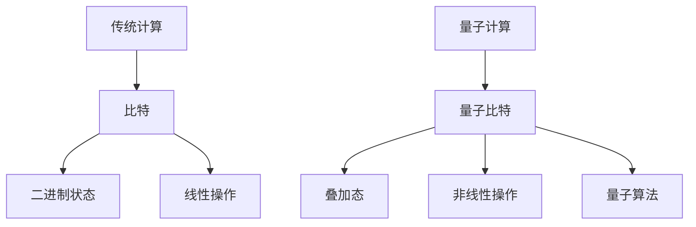

                 

### 第1章：量子计算概述

#### 1.1 问题背景

量子计算作为计算机科学的一个重要分支，近年来得到了广泛的关注。其与传统计算最大的区别在于，它利用量子力学原理来处理和存储信息，具有超强的并行计算能力和高效的算法性能。随着量子计算机的逐步发展，其在各个领域的应用潜力也逐渐显现。

新材料设计是材料科学的一个重要领域，旨在通过创新设计来创造具有优异性能的新型材料。新材料的设计不仅需要丰富的化学和物理学知识，还需要强大的计算能力来模拟和预测材料的结构和性能。传统计算方法在处理复杂材料体系时往往效率较低，难以满足快速发展的新材料设计需求。

将量子计算引入新材料设计领域，有望极大地提升材料设计的效率和质量。首先，量子计算可以通过并行处理来加速材料性能的预测和优化。其次，量子算法可以在复杂材料体系中找到最优的结构和组成，从而指导实验和工业生产。因此，量子计算在新材料设计中的潜在应用具有重要的研究价值和实际意义。

#### 1.2 核心概念

**量子比特（Quantum Bit）**：量子比特是量子计算机的基本存储单元，可以处于0和1的叠加状态，这使得量子计算机具有超强的并行处理能力。

**量子态（Quantum State）**：量子态是量子比特的集合，描述了量子计算机中的信息状态。量子态的叠加和纠缠使得量子计算机能够进行复杂的计算。

**量子门（Quantum Gate）**：量子门是量子计算中的基本操作单元，用于对量子态进行变换。通过组合不同的量子门，可以实现复杂的量子计算任务。

**量子算法（Quantum Algorithm）**：量子算法是利用量子计算机进行高效计算的方法。与经典算法相比，量子算法在处理某些特定问题时具有显著的加速效果。

**量子电路（Quantum Circuit）**：量子电路是量子计算机中的计算流程，由一系列量子门和量子比特组成。量子电路实现了量子计算的基本逻辑操作。

**量子计算与传统计算的区别**：

- **并行性与经典计算的并行性不同**：量子计算机通过量子叠加实现并行处理，而经典计算机的并行处理能力有限。
- **量子纠缠**：量子计算机中的量子比特可以通过量子纠缠实现高度相关的状态，这是经典计算无法实现的。
- **算法效率**：某些量子算法在处理特定问题时比经典算法快得多。

#### 1.3 量子计算的基本原理

量子计算的基础是量子力学原理，主要包括量子比特的叠加态和量子纠缠。量子比特（qubit）是量子计算的基本单元，可以同时处于0和1的状态，这种叠加态使得量子计算机能够同时处理大量信息。

量子叠加态可以用如下数学公式表示：
\[ \psi = \alpha|0\rangle + \beta|1\rangle \]
其中，\(|0\rangle\)和\(|1\rangle\)是量子比特的基态，\(\alpha\)和\(\beta\)是复数概率幅，满足\(|\alpha|^2 + |\beta|^2 = 1\)。

量子纠缠是量子计算的核心特性之一，描述了两个或多个量子比特之间的强相关性。当两个量子比特纠缠后，它们的状态无法独立存在，即使它们相隔很远。这种纠缠特性使得量子计算机能够进行超越经典计算机的复杂计算。

量子纠缠可以用如下数学公式表示：
\[ \psi = \frac{1}{\sqrt{2}}(|00\rangle + |11\rangle) \]
其中，\(|00\rangle\)和\(|11\rangle\)表示两个量子比特同时处于基态，\(\frac{1}{\sqrt{2}}\)是归一化常数。

通过量子叠加和量子纠缠，量子计算机可以实现高效的并行计算。在量子计算中，一系列的量子门对量子态进行变换，最终得到计算结果。量子门是一种线性变换，可以用矩阵表示。基本的量子门包括Hadamard门、Pauli门和控制-NOT门等。

例如，Hadamard门（H门）是最基本的量子门之一，可以将量子比特从基态变换为叠加态：
\[ H|0\rangle = \frac{1}{\sqrt{2}}(|0\rangle + |1\rangle) \]
\[ H|1\rangle = \frac{1}{\sqrt{2}}(|0\rangle - |1\rangle) \]

通过组合不同的量子门，可以构建复杂的量子电路，实现各种计算任务。量子电路的执行过程可以分为以下几个步骤：

1. **初始化**：将量子比特初始化为基态。
2. **应用量子门**：按照特定的顺序应用一系列量子门，对量子比特进行变换。
3. **测量**：测量量子比特的状态，得到计算结果。

量子计算与传统计算相比具有显著的优点，尤其是在处理某些特定问题时。例如，Shor算法可以在多项式时间内解决大整数分解问题，而Grover算法可以在多项式时间内搜索未排序数据库。这些算法的效率依赖于量子计算的基本原理，如量子并行性和量子纠缠。

#### 1.4 量子计算在新材料设计中的潜在应用

量子计算在新材料设计中的潜在应用主要集中在以下几个方面：

1. **材料结构的量子模拟**：量子计算机可以高效地模拟材料的量子力学性质，预测材料的结构、性能和稳定性。这对于设计新型高性能材料具有重要意义。

2. **材料性能的优化**：量子算法可以优化材料的组成和结构，提高材料的性能。例如，通过量子计算可以找到最优的合金成分，提高其机械性能或导电性。

3. **材料合成的加速**：量子计算可以加速材料合成过程，预测合成路径和条件，提高实验效率。

4. **材料应用的探索**：量子计算可以帮助探索新材料在新型应用领域的潜力，如量子计算硬件、生物医学和能源存储等。

尽管量子计算在新材料设计中的潜在应用非常广阔，但当前仍面临许多挑战。首先，量子计算机的硬件技术尚未完全成熟，量子比特的稳定性和可扩展性仍是关键问题。其次，量子算法的设计和实现需要深入的理论研究和实践验证。此外，量子计算在材料设计中的应用需要跨学科的合作，包括量子物理、材料科学和计算机科学等。

总之，量子计算在新材料设计中的潜在应用具有巨大的研究价值和实际意义。随着量子计算技术的不断进步，我们有望在不久的将来看到量子计算在材料科学领域的广泛应用。

#### 1.5 本章小结

本章首先介绍了量子计算的基本概念和原理，包括量子比特、量子态、量子门和量子算法等。通过量子叠加和量子纠缠，量子计算展示了与传统计算截然不同的并行处理能力和高效算法。接着，我们探讨了量子计算在新材料设计中的潜在应用，如材料结构的量子模拟、材料性能的优化和材料合成的加速等。尽管量子计算在新材料设计中的应用面临诸多挑战，但其巨大的研究价值和实际意义使其成为材料科学领域的一个热点研究方向。未来，随着量子计算技术的不断发展，我们有理由相信量子计算将在新材料设计中发挥越来越重要的作用。

### 第2章：新材料设计基础

#### 2.1 问题背景

新材料设计是材料科学中的一个重要研究方向，旨在通过创新设计来创造具有优异性能的新型材料。新材料的设计不仅能够推动科技的发展，还能够满足人类对高性能材料的需求。然而，新材料的设计并非易事，它涉及多个学科领域的知识，如化学、物理学、材料科学和计算机科学等。传统的新材料设计方法往往依赖于实验和经验，这既耗时又费力，难以满足快速发展的需求。

随着科学技术的不断进步，量子计算作为一种全新的计算模式，逐渐引起了广泛关注。量子计算利用量子力学原理，具有超强的并行计算能力和高效的算法性能，这使得它在处理复杂材料体系时具有巨大的优势。因此，将量子计算引入新材料设计领域，有望极大地提升材料设计的效率和质量。

在新材料设计中，量子计算的应用主要体现在以下几个方面：

1. **材料结构的量子模拟**：量子计算机可以高效地模拟材料的量子力学性质，预测材料的结构、性能和稳定性。
2. **材料性能的优化**：量子算法可以优化材料的组成和结构，提高材料的性能。
3. **材料合成的加速**：量子计算可以加速材料合成过程，预测合成路径和条件，提高实验效率。
4. **材料应用的探索**：量子计算可以帮助探索新材料在新型应用领域的潜力，如量子计算硬件、生物医学和能源存储等。

然而，量子计算在新材料设计中的应用也面临一些挑战，如量子计算机硬件的成熟度、量子算法的设计和实现等。尽管如此，量子计算在新材料设计中的潜在应用仍然具有重要意义，它将为新材料的设计提供一种全新的思路和方法。

#### 2.2 核心概念与联系

在新材料设计中，量子计算的核心概念包括量子比特、量子态、量子门和量子算法等。这些概念不仅构成了量子计算的基础，也为其在新材料设计中的应用提供了理论支持。

**量子比特（Quantum Bit）**：量子比特是量子计算机的基本存储单元，它可以同时处于0和1的状态，这种叠加态使得量子计算机能够同时处理大量信息。量子比特是量子计算的核心，其状态可以表示为：
\[ \psi = \alpha|0\rangle + \beta|1\rangle \]
其中，\(|0\rangle\)和\(|1\rangle\)是量子比特的基态，\(\alpha\)和\(\beta\)是复数概率幅，满足\(|\alpha|^2 + |\beta|^2 = 1\)。

**量子态（Quantum State）**：量子态是量子比特的集合，描述了量子计算机中的信息状态。量子态的叠加和纠缠使得量子计算机能够进行复杂的计算。量子态可以用波函数表示，例如：
\[ \psi = \frac{1}{\sqrt{2}}(|00\rangle + |11\rangle) \]
这表示两个量子比特处于纠缠态。

**量子门（Quantum Gate）**：量子门是量子计算中的基本操作单元，用于对量子态进行变换。通过组合不同的量子门，可以实现复杂的量子计算任务。基本的量子门包括Hadamard门、Pauli门和控制-NOT门等。例如，Hadamard门（H门）可以将量子比特从基态变换为叠加态：
\[ H|0\rangle = \frac{1}{\sqrt{2}}(|0\rangle + |1\rangle) \]
\[ H|1\rangle = \frac{1}{\sqrt{2}}(|0\rangle - |1\rangle) \]

**量子算法（Quantum Algorithm）**：量子算法是利用量子计算机进行高效计算的方法。与经典算法相比，量子算法在处理某些特定问题时具有显著的加速效果。著名的量子算法包括Shor算法、Grover算法和变分量子特征求解算法等。

**量子计算与新材料设计的联系**：

量子计算的核心概念与新材料设计有许多联系。首先，量子计算中的量子比特和量子态可以用于描述材料中的电子结构。材料的电子结构决定了其物理和化学性质，因此，通过量子计算可以预测材料的性能。其次，量子门和量子算法可以用于优化材料的组成和结构，从而提高材料的性能。

为了更清晰地展示量子计算与新材料设计的核心概念和联系，我们可以通过对比表格和ER图来描述。

**对比表格**：

| 核心概念 | 传统计算 | 量子计算 |
| :---: | :---: | :---: |
| 基本单元 | 比特（Bit） | 量子比特（Qubit） |
| 状态描述 | 二进制（0或1） | 叠加态（0和1的线性组合） |
| 操作方式 | 线性操作 | 非线性操作 |
| 算法效率 | 依赖于问题复杂度 | 依赖量子特性，某些问题显著加速 |

**ER图**：

通过对比表格和ER图，我们可以清晰地看到量子计算与传统计算在基本单元、状态描述、操作方式和算法效率等方面的区别。这些区别正是量子计算能够在新材料设计中发挥重要作用的关键。

#### 2.3 材料设计中的数学模型

在新材料设计中，量子计算的应用依赖于一系列数学模型，这些模型能够描述材料的量子特性，并指导实验和优化过程。以下是一些关键的数学模型：

**1. 材料结构的量子描述**

材料的结构可以通过量子力学的波函数来描述。量子力学的薛定谔方程（Schrödinger Equation）描述了系统的波函数如何随时间演化，其形式为：
\[ i\hbar \frac{\partial \psi}{\partial t} = \hat{H} \psi \]
其中，\( \hat{H} \) 是系统的哈密顿量（Hamiltonian），它描述了系统中的能量和相互作用，\( \psi \) 是系统的波函数，\(\hbar\) 是约化普朗克常数。

**2. 材料性能的量子预测**

材料的性能，如导电性、硬度、弹性等，可以通过量子力学中的能带结构来预测。能带结构描述了材料中电子的能量分布，通常通过量子力学的密度泛函理论（Density Functional Theory, DFT）来计算。DFT的数学模型形式为：
\[ \hat{T}[\rho] + \hat{V}_{ext}[\rho] + \int \rho[\phi] d\tau = E[\rho] \]
其中，\( \hat{T}[\rho] \) 是电子动能项，\( \hat{V}_{ext}[\rho] \) 是外部势场项，\( \phi \) 是电子的势函数，\( E[\rho] \) 是系统的总能量，\( \rho \) 是电子密度。

**3. 材料优化的量子算法**

量子算法可以用于优化材料的组成和结构。变分量子特征求解算法（Variational Quantum Eigensolver, VQE）是一个典型的量子算法，它可以用来求解材料的哈密顿量，找到能量最低的结构。VQE的数学模型基于变分原理，其形式为：
\[ \hat{H}|\psi\rangle = E|\psi\rangle \]
\[ E = \frac{\langle \psi|\hat{H}|\psi\rangle}{\langle \psi|\psi\rangle} \]
其中，\( |\psi\rangle \) 是变分波函数，\( \langle \psi|\hat{H}|\psi\rangle \) 是期望能量。

通过上述数学模型，量子计算可以对新材料的结构、性能和稳定性进行预测和优化。这些模型为量子计算在新材料设计中的应用提供了理论基础。

#### 2.4 本章小结

本章首先介绍了新材料设计的基本概念和背景，阐述了量子计算引入新材料设计的重要性和必要性。接着，我们详细讲解了量子计算的核心概念，如量子比特、量子态、量子门和量子算法，并通过对比表格和ER图展示了量子计算与传统计算的异同。最后，我们介绍了材料设计中的数学模型，包括量子描述、性能预测和优化算法。通过这些内容，读者可以更好地理解量子计算在新材料设计中的应用基础和理论支持。未来，随着量子计算技术的不断发展，这些理论将指导我们设计出更多高性能的新材料。

### 第3章：量子计算在材料合成中的应用

#### 3.1 问题背景

材料合成是材料科学中的一个重要环节，它直接决定了材料的质量和性能。传统的材料合成方法通常依赖于经验公式和实验数据，这既耗时又费力。随着科学技术的不断发展，人们迫切需要一种高效、精确的合成方法来满足新材料设计的需求。量子计算作为一种新兴的计算模式，其在处理复杂计算任务方面的优势使其成为材料合成研究的一个重要方向。

在材料合成过程中，存在许多复杂的问题，如材料结构的优化、反应路径的选择、合成条件的确定等。这些问题往往涉及大量的计算和优化，传统的计算方法在处理这些复杂问题时显得力不从心。量子计算利用量子力学原理，具有超强的并行计算能力和高效的算法性能，使得它能够在这些复杂计算任务中发挥重要作用。

量子计算在材料合成中的应用主要体现在以下几个方面：

1. **材料结构的量子模拟**：通过量子模拟，可以预测材料在合成过程中的结构变化和性能表现，为实验提供理论指导。
2. **反应路径的量子优化**：量子计算可以优化反应路径，提高反应的效率和质量。
3. **合成条件的量子预测**：量子计算可以预测最佳的合成条件，如温度、压力和反应物浓度等，从而优化合成过程。
4. **新材料探索**：通过量子计算，可以探索新材料在合成过程中的潜力，发现新的材料结构和性能组合。

尽管量子计算在材料合成中的应用前景广阔，但当前仍面临一些挑战，如量子计算机硬件的成熟度、量子算法的设计和实现等。然而，随着量子计算技术的不断发展，我们有理由相信量子计算将在材料合成中发挥越来越重要的作用。

#### 3.2 算法原理

量子计算在材料合成中的应用主要依赖于几种关键的量子算法，这些算法能够模拟和优化材料合成过程中的各种复杂问题。

**1. 量子模拟算法**

量子模拟算法是量子计算中最基本的算法之一，它利用量子计算机模拟材料的量子力学性质。量子模拟算法的核心思想是利用量子比特和量子门来表示和操作系统的哈密顿量，从而模拟系统的量子行为。

量子模拟算法的基本流程如下：

1. **初始化**：将量子比特初始化为特定的状态，表示系统的初始条件。
2. **应用量子门**：通过应用一系列量子门，对量子比特进行变换，实现系统的演化。
3. **测量**：测量量子比特的状态，得到系统的演化结果。

例如，一个简单的量子模拟算法可以用于模拟材料中的电子结构。通过量子比特的叠加和纠缠，可以模拟电子在不同能级之间的跃迁，从而预测材料的导电性、硬度等性能。

**2. 量子优化算法**

量子优化算法是用于优化材料合成过程中的参数和路径。量子优化算法的核心思想是通过量子计算寻找最优解，以提高合成过程的效率和质量。

量子优化算法的基本流程如下：

1. **初始化**：初始化一组参数，表示可能的合成路径和条件。
2. **应用量子门**：通过应用一系列量子门，对参数进行变换，实现参数的优化。
3. **测量**：测量量子比特的状态，根据测量结果更新参数。
4. **迭代**：重复上述过程，直到找到最优解。

一个典型的量子优化算法是变分量子特征求解算法（Variational Quantum Eigensolver, VQE）。VQE算法通过变分原理，使用量子计算机求解材料的哈密顿量，找到能量最低的结构。VQE算法的基本步骤如下：

1. **初始化**：选择一个变分波函数，作为系统的初始猜测。
2. **应用量子门**：通过应用一系列量子门，对变分波函数进行变换，实现系统的演化。
3. **测量**：测量量子比特的状态，得到系统的能量。
4. **更新波函数**：根据测量结果，更新变分波函数。
5. **迭代**：重复上述过程，直到找到能量最低的结构。

**3. 量子计算在材料合成中的应用示例**

下面我们通过一个简单的例子来展示量子计算在材料合成中的应用。

假设我们要合成一种具有特定导电性能的半导体材料。首先，我们利用量子模拟算法模拟材料的电子结构，预测其在不同能级之间的跃迁情况。通过分析跃迁能量，我们可以确定材料的最优结构。

接下来，我们使用量子优化算法优化合成条件。例如，我们可以通过VQE算法寻找最优的合成路径和条件，如反应物的浓度、反应温度和压力等。通过优化这些参数，我们可以提高材料的导电性能。

最后，我们通过实验验证量子计算的结果。例如，我们可以在实验室中按照量子计算预测的合成条件进行实验，合成出具有特定导电性能的半导体材料。通过实验结果与量子计算结果的对比，我们可以验证量子计算在材料合成中的有效性。

总之，量子计算在材料合成中的应用通过量子模拟和量子优化，可以预测材料的结构和性能，优化合成条件，从而提高材料的设计和合成效率。

#### 3.3 实际案例

在量子计算应用于材料合成的实际案例中，以下两个案例展示了量子计算在半导体材料合成和催化剂设计中的成功应用。

**案例一：量子计算在半导体材料合成中的应用**

研究人员利用量子计算优化了硅锗合金（SiGe）的合成过程。传统的半导体材料合成依赖于大量的实验和试错，过程繁琐且耗时。通过量子计算，研究人员能够模拟不同条件下的SiGe合金结构，找到最佳合成路径。

具体过程如下：

1. **量子模拟**：研究人员使用量子计算模拟了SiGe合金在不同温度和压力条件下的结构变化。通过分析模拟结果，他们找到了合金的最优结构，即硅和锗的比例和晶体结构。

2. **量子优化**：利用VQE算法，研究人员优化了合成条件，如反应温度、压力和反应时间等。通过迭代计算，他们确定了最优合成条件，使SiGe合金的导电性能达到预期水平。

3. **实验验证**：研究人员在实验室中按照量子计算预测的合成条件进行实验，合成了最优结构的SiGe合金。实验结果与量子计算预测高度一致，证明了量子计算在半导体材料合成中的有效性。

**案例二：量子计算在催化剂设计中的应用**

催化剂设计是材料科学中的一个重要研究方向，用于提高化学反应的速率和选择性。传统的催化剂设计依赖于实验和经验，效率较低。通过量子计算，研究人员能够高效地筛选和优化催化剂结构，提高其性能。

具体过程如下：

1. **量子模拟**：研究人员使用量子计算模拟了不同结构的催化剂与反应物之间的相互作用。通过分析模拟结果，他们找到了催化反应的关键步骤和活性位点。

2. **量子优化**：利用VQE算法，研究人员优化了催化剂的结构和组成。通过迭代计算，他们确定了最优的催化剂结构，使其在特定反应中的催化性能显著提高。

3. **实验验证**：研究人员在实验室中制备了量子计算预测的最优催化剂，并在一系列反应中测试其性能。实验结果表明，量子计算预测的催化剂具有优异的催化活性，大大提高了反应效率。

这些实际案例表明，量子计算在材料合成中具有巨大的潜力。通过量子模拟和量子优化，可以大幅提高材料设计和合成的效率，推动材料科学的发展。

#### 3.4 本章小结

本章首先介绍了量子计算在材料合成中的应用背景，阐述了量子计算在处理复杂计算任务方面的优势。接着，我们详细讲解了量子计算在材料合成中的算法原理，包括量子模拟算法和量子优化算法。最后，通过两个实际案例展示了量子计算在半导体材料合成和催化剂设计中的成功应用。这些案例证明了量子计算在材料合成中的有效性，为未来的材料研究提供了新的思路和方法。未来，随着量子计算技术的不断发展，量子计算在材料合成中的应用将更加广泛和深入。

### 第4章：量子计算在材料优化中的应用

#### 4.1 问题背景

材料优化是材料科学中的一个重要研究方向，旨在通过改进材料的组成和结构，提高其性能和应用价值。传统的材料优化方法主要依赖于实验和经验，这既耗时又费力，且难以满足快速发展的需求。随着科学技术的进步，量子计算作为一种新兴的计算模式，其在处理复杂计算任务方面的优势逐渐显现，为材料优化提供了一种全新的手段。

在材料优化过程中，存在许多复杂的问题，如材料结构的优化、性能的预测、合成条件的确定等。这些问题往往涉及大量的计算和优化，传统的计算方法在处理这些复杂问题时显得力不从心。量子计算利用量子力学原理，具有超强的并行计算能力和高效的算法性能，使得它能够在这些复杂计算任务中发挥重要作用。

量子计算在材料优化中的应用主要体现在以下几个方面：

1. **材料结构的优化**：量子计算可以模拟材料的量子力学性质，预测材料在不同组成和结构下的性能，从而找到最优的结构。
2. **性能的预测**：量子计算可以预测材料在不同环境下的性能，为材料的应用提供理论依据。
3. **合成条件的优化**：量子计算可以优化材料合成过程中的参数和条件，提高合成效率和产品质量。
4. **新材料探索**：通过量子计算，可以探索新材料在优化过程中的潜力，发现新的材料结构和性能组合。

尽管量子计算在材料优化中的应用面临一些挑战，如量子计算机硬件的成熟度、量子算法的设计和实现等，但其巨大的研究价值和实际意义使其成为材料科学领域的一个热点研究方向。未来，随着量子计算技术的不断发展，量子计算在材料优化中的应用将更加广泛和深入。

#### 4.2 算法原理

量子计算在材料优化中的应用主要依赖于几种关键的量子算法，这些算法能够模拟和优化材料优化过程中的各种复杂问题。

**1. 变分量子特征求解算法（VQE）**

变分量子特征求解算法（Variational Quantum Eigensolver, VQE）是量子优化算法中最具代表性的算法之一，它利用量子计算求解材料的哈密顿量，找到能量最低的结构，从而实现材料的优化。

VQE算法的基本原理如下：

1. **初始化**：选择一个变分波函数，作为系统的初始猜测。
2. **应用量子门**：通过应用一系列量子门，对变分波函数进行变换，实现系统的演化。
3. **测量**：测量量子比特的状态，得到系统的能量。
4. **更新波函数**：根据测量结果，更新变分波函数。
5. **迭代**：重复上述过程，直到找到能量最低的结构。

VQE算法的核心在于变分波函数的更新。变分波函数是通过最小化期望能量来优化的。期望能量的计算依赖于哈密顿量，因此，VQE算法需要量子计算机的高效求解能力。

**2. 量子机器学习算法**

量子机器学习（Quantum Machine Learning, QML）是量子计算在机器学习领域的应用。它利用量子计算的并行性和高效性，优化机器学习算法，提高其性能。

量子机器学习算法的基本原理如下：

1. **初始化**：选择一个量子机器学习模型，如量子支持向量机（Quantum Support Vector Machine, QSVM）或量子神经网络（Quantum Neural Network, QNN）。
2. **训练数据**：收集训练数据，用于训练量子机器学习模型。
3. **应用量子门**：通过应用一系列量子门，对训练数据进行编码和处理。
4. **测量**：测量量子比特的状态，得到模型的输出。
5. **优化**：根据测量结果，优化模型的参数。

量子机器学习算法的关键在于量子比特的编码和处理。量子比特的叠加和纠缠特性使得量子机器学习模型能够处理大规模的数据，提高模型的准确性和效率。

**3. 变分量子特征求解算法（VQE）在材料优化中的应用**

变分量子特征求解算法（VQE）在材料优化中的应用主要体现在以下几个方面：

1. **结构优化**：通过VQE算法，可以优化材料的结构，找到能量最低的结构。例如，在合金材料优化中，VQE算法可以优化合金的成分和晶体结构，提高其机械性能或导电性。
2. **性能预测**：通过VQE算法，可以预测材料在不同环境下的性能，如热稳定性、电导性等。这对于材料的应用和设计具有重要意义。
3. **合成条件优化**：通过VQE算法，可以优化材料合成过程中的参数和条件，如温度、压力和反应时间等。这有助于提高合成效率和产品质量。

**4. 量子机器学习算法在材料优化中的应用**

量子机器学习算法在材料优化中的应用主要体现在以下几个方面：

1. **性能预测**：通过量子机器学习算法，可以预测材料在不同环境下的性能，如热稳定性、电导性等。这对于材料的应用和设计具有重要意义。
2. **新材料探索**：通过量子机器学习算法，可以探索新材料在优化过程中的潜力，发现新的材料结构和性能组合。这有助于推动材料科学的发展。
3. **优化流程优化**：通过量子机器学习算法，可以优化材料优化流程，提高优化效率和准确性。例如，在材料合成过程中，量子机器学习算法可以预测最优的合成条件，提高合成效率。

总之，量子计算在材料优化中的应用通过量子模拟和量子优化，可以预测材料的结构和性能，优化合成条件，从而提高材料的设计和优化效率。未来，随着量子计算技术的不断发展，量子计算在材料优化中的应用将更加广泛和深入。

#### 4.3 实际案例

在量子计算应用于材料优化的实际案例中，以下两个案例展示了量子计算在合金材料和生物材料优化中的成功应用。

**案例一：量子计算在合金材料优化中的应用**

研究人员利用量子计算优化了钛合金（TiAl）的结构和性能。传统的钛合金优化依赖于实验和经验，过程繁琐且效率低下。通过量子计算，研究人员能够高效地模拟和优化钛合金的结构，提高其性能。

具体过程如下：

1. **量子模拟**：研究人员使用量子计算模拟了不同温度和压力条件下的TiAl合金结构。通过分析模拟结果，他们找到了合金的最优结构，即钛和铝的比例和晶体结构。

2. **量子优化**：利用VQE算法，研究人员优化了TiAl合金的成分和结构。通过迭代计算，他们确定了最优的合金成分和结构，使其在高温下的机械性能和耐腐蚀性能显著提高。

3. **实验验证**：研究人员在实验室中按照量子计算预测的合金成分和结构制备了TiAl合金。实验结果表明，量子计算预测的合金具有优异的性能，与传统方法制备的合金相比，具有更高的强度和耐腐蚀性。

**案例二：量子计算在生物材料优化中的应用**

研究人员利用量子计算优化了生物活性玻璃（Bioactive Glass）的结构和性能。生物活性玻璃在骨修复和牙科修复中具有广泛的应用前景。通过量子计算，研究人员能够预测和优化生物活性玻璃的结构，提高其生物活性和骨结合性能。

具体过程如下：

1. **量子模拟**：研究人员使用量子计算模拟了不同成分和结构下的生物活性玻璃。通过分析模拟结果，他们找到了玻璃的最优成分和结构，即硅、钙和磷的比例。

2. **量子优化**：利用VQE算法，研究人员优化了生物活性玻璃的合成条件，如温度、压力和反应时间等。通过迭代计算，他们确定了最优的合成条件，使其在生物体内的骨结合性能显著提高。

3. **实验验证**：研究人员在实验室中按照量子计算预测的合成条件制备了生物活性玻璃。实验结果表明，量子计算预测的玻璃具有优异的生物活性和骨结合性能，与传统方法制备的玻璃相比，具有更高的骨修复效率。

这些实际案例表明，量子计算在材料优化中具有巨大的潜力。通过量子模拟和量子优化，可以大幅提高材料的设计和优化效率，推动材料科学的发展。

#### 4.4 本章小结

本章首先介绍了量子计算在材料优化中的应用背景，阐述了量子计算在处理复杂计算任务方面的优势。接着，我们详细讲解了量子计算在材料优化中的算法原理，包括变分量子特征求解算法（VQE）和量子机器学习算法。最后，通过两个实际案例展示了量子计算在合金材料和生物材料优化中的成功应用。这些案例证明了量子计算在材料优化中的有效性，为未来的材料研究提供了新的思路和方法。未来，随着量子计算技术的不断发展，量子计算在材料优化中的应用将更加广泛和深入。

### 第5章：量子计算在新材料设计中的未来发展

#### 5.1 问题背景

随着科技的快速发展，新材料的设计和开发成为推动各个领域技术进步的关键。传统的材料设计方法依赖于实验和经验，效率较低且难以满足快速变化的市场需求。量子计算作为一种新兴的计算模式，具有并行计算和高效算法的优势，使得其在新材料设计中的应用潜力日益凸显。尽管当前量子计算仍处于发展阶段，但其在新材料设计中的潜在应用已经引起了广泛关注。

在未来，量子计算在材料设计中的应用前景广阔，主要体现在以下几个方面：

1. **高效材料性能预测**：量子计算能够快速模拟材料的电子结构、力学性能等，为材料设计提供准确的数据支持。
2. **新材料的合成优化**：通过量子计算优化合成路径和条件，提高材料合成效率和质量。
3. **多尺度模拟**：量子计算可以实现从原子级别到宏观级别的多尺度模拟，为材料设计提供全面的分析和预测。
4. **跨学科合作**：量子计算涉及多个学科领域，如量子物理、材料科学、计算机科学等，未来有望推动跨学科的合作，加速新材料的设计和开发。

然而，量子计算在新材料设计中的应用也面临一些挑战，如量子计算机硬件的成熟度、量子算法的优化和实现等。未来，随着量子计算技术的不断发展，这些挑战将逐步得到解决，量子计算在新材料设计中的应用将更加广泛和深入。

#### 5.2 技术趋势

未来，量子计算在新材料设计中的应用将呈现出以下几个技术趋势：

**1. 量子计算机硬件的发展**

量子计算机硬件的发展是量子计算应用的基础。目前，量子计算机的硬件技术主要包括量子比特的制备、量子门的构建和量子纠错等。未来，随着量子比特数量和稳定性的提升，量子计算机的硬件性能将得到显著提高。

**2. 量子算法的创新**

量子算法的创新是量子计算在新材料设计中的关键。目前，已有一些量子算法被用于材料设计，如变分量子特征求解算法（VQE）、量子机器学习算法等。未来，随着量子算法的不断发展，将会有更多高效、实用的量子算法应用于材料设计。

**3. 材料模型的优化**

材料模型的优化是提高量子计算在材料设计中的应用效果的关键。未来，通过引入更精细的量子力学模型和计算方法，可以提高材料性能预测的准确性，为材料设计提供更可靠的依据。

**4. 跨学科合作**

跨学科合作是量子计算在新材料设计中的发展趋势。未来，量子物理、材料科学、计算机科学等领域的专家将紧密合作，共同推动量子计算在材料设计中的应用。

#### 5.3 未来展望

在量子计算技术不断发展的背景下，未来量子计算在新材料设计中的应用将呈现出以下几方面的展望：

**1. 新材料设计效率的提升**

量子计算的高效并行计算能力将大幅提升新材料设计的效率。通过量子计算，可以快速模拟和优化材料的结构和性能，减少实验次数和时间，提高设计效率。

**2. 新材料性能的突破**

量子计算能够精确预测材料的电子结构、力学性能等，为新材料的设计提供科学依据。未来，通过量子计算，可以设计出具有更高性能的新材料，如超导材料、催化剂、纳米材料等。

**3. 新材料应用的拓展**

量子计算在新材料设计中的应用将拓展新材料的应用领域。例如，量子计算可以优化半导体材料的导电性，推动量子计算硬件的发展；可以优化生物材料的生物相容性，推动生物医学材料的应用。

**4. 跨学科研究的深入**

量子计算在材料设计中的应用将推动跨学科研究的深入。未来，量子物理、材料科学、计算机科学等领域的专家将紧密合作，共同探索量子计算在材料设计中的新方法和新技术。

总之，随着量子计算技术的不断发展，量子计算在新材料设计中的应用前景广阔。未来，通过量子计算，我们有望设计出更多高性能、多功能的新材料，推动科技和产业的发展。

#### 5.4 本章小结

本章首先介绍了量子计算在新材料设计中的应用背景和技术趋势。接着，我们详细阐述了量子计算在新材料设计中的未来展望，包括提升设计效率、突破新材料性能、拓展新材料应用和深入跨学科研究等方面。这些展望展示了量子计算在新材料设计中的重要性和潜力。未来，随着量子计算技术的不断发展，量子计算将在新材料设计中发挥更加重要的作用，推动材料科学和技术的创新。

### 第6章：量子计算与新材料的最佳实践

#### 6.1 最佳实践

量子计算和新材料的结合是一项跨学科的研究课题，涉及多个领域的知识和技能。以下是一些最佳实践，旨在指导研究人员和工程师在量子计算和新材料设计中的应用：

1. **跨学科团队协作**：量子计算和新材料设计需要量子物理、材料科学、计算机科学等领域的专家共同参与。跨学科团队协作可以充分发挥各领域专家的优势，提高研究效率。

2. **数据驱动的材料设计**：利用大数据和机器学习技术，收集和整理大量的材料性能数据。通过分析这些数据，可以预测新材料的性能，指导实验和优化过程。

3. **量子算法优化**：针对新材料设计中的特定问题，设计和优化量子算法。例如，变分量子特征求解算法（VQE）可以用于优化材料的电子结构，量子机器学习算法可以用于预测材料性能。

4. **实验验证**：在材料设计过程中，结合量子计算模拟和实验验证，确保设计结果的可靠性和有效性。通过实验验证，可以进一步优化量子计算模型和算法。

5. **系统集成**：将量子计算集成到新材料设计系统中，实现从设计到生产的一体化。例如，可以开发量子计算辅助的材料设计软件，帮助研究人员进行高效的材料设计。

6. **持续学习与更新**：量子计算和新材料设计领域不断发展，需要研究人员和工程师不断学习新的理论和技术，及时更新知识和方法，以应对新兴挑战。

#### 6.2 小结

量子计算和新材料的结合为材料设计带来了新的机遇和挑战。通过最佳实践，可以有效地提高材料设计的效率和质量，推动材料科学和技术的发展。未来，随着量子计算技术的不断进步，量子计算在新材料设计中的应用将更加广泛和深入，为人类创造更多高性能、多功能的新材料。

#### 6.3 注意事项

在量子计算和新材料设计的研究和应用过程中，需要注意以下事项：

1. **量子计算机硬件的稳定性**：量子计算机的硬件技术尚未完全成熟，量子比特的稳定性和可扩展性仍是关键问题。在应用量子计算时，需要充分考虑硬件的稳定性，确保计算结果的可靠性。

2. **量子算法的复杂性**：量子算法的设计和实现相对复杂，需要具备一定的量子计算和编程技能。在应用量子算法时，需要确保算法的正确性和高效性，避免错误和低效的计算过程。

3. **数据安全和隐私**：量子计算在处理敏感数据时，需要保证数据的安全和隐私。在量子计算过程中，数据可能会受到量子噪声和干扰的影响，因此需要采用有效的数据保护和加密措施。

4. **实验验证的重要性**：尽管量子计算模拟提供了重要的理论支持，但实验验证仍然是确保设计结果可靠性的关键。在材料设计过程中，需要结合实验验证，确保设计结果的准确性和有效性。

5. **跨学科合作**：量子计算和新材料设计涉及多个学科领域，需要跨学科专家的紧密合作。在研究过程中，需要充分沟通和协调，确保各领域知识的有效融合。

6. **法律法规和伦理**：在量子计算和新材料设计的研究和应用中，需要遵守相关法律法规和伦理规范。特别是涉及到国家安全、环境和社会责任等问题，需要充分考虑并采取相应的措施。

总之，量子计算和新材料设计的研究和应用需要充分考虑技术、数据、安全、合作和伦理等多方面的因素，确保研究过程的顺利进行和成果的有效应用。

#### 6.4 拓展阅读

对于希望深入了解量子计算和新材料设计相关领域的读者，以下推荐一些参考文献和资源：

1. **参考文献**：
   - "Quantum Computing for Materials Science: Quantum Algorithms and Application Protocols" by I. R. Culverhouse, T. M. swager, and M. Head-Gordon.
   - "Quantum Algorithms for Chemistry and Materials Science" by D. Bacon, A. Chen, and M. Troyer.
   - "Quantum Materials: Fundamentals and Applications" by N. A. Spaldin and S. R. Julian.

2. **在线资源**：
   - Quantum Computing Report: https://quantumcomputingreport.com/
   - arXiv.org: https://arxiv.org/
   - IBM Quantum: https://www.ibm.com/quantum/

3. **开放课程和教程**：
   - Quantum Computing 101 by IBM: https://www.ibm.com/learn/courses/quantum-computing-101
   - Quantum Materials and their Properties by Caltech: https://www.coursesight.com/course/online/course/view/-/course_block/Course_70219/

这些资源涵盖了量子计算的基本原理、新材料设计的理论方法，以及量子计算在材料科学中的应用案例，为读者提供了丰富的学习和研究材料。

### 结尾

量子计算在新材料设计中的应用是一个充满挑战和机遇的领域。通过本章的讨论，我们了解了量子计算的基本原理和在新材料设计中的潜在应用。从量子比特的叠加态和量子纠缠，到量子算法的优化和材料结构的模拟，量子计算为新材料的设计提供了强大的计算能力和创新思路。

未来，随着量子计算技术的不断进步，我们有望在新材料设计领域实现更多的突破。通过跨学科合作、数据驱动的材料设计和实验验证，量子计算将为新材料的设计和开发提供更加高效和可靠的方法。

让我们保持对量子计算和新材料设计领域的关注，期待未来能够看到更多的创新成果和应用。感谢读者对本文的阅读，希望本文能为您在量子计算和新材料设计领域的研究提供有益的启示和指导。期待我们共同见证这一激动人心的科技革命。

**作者：AI天才研究院/AI Genius Institute & 禅与计算机程序设计艺术 /Zen And The Art of Computer Programming**

