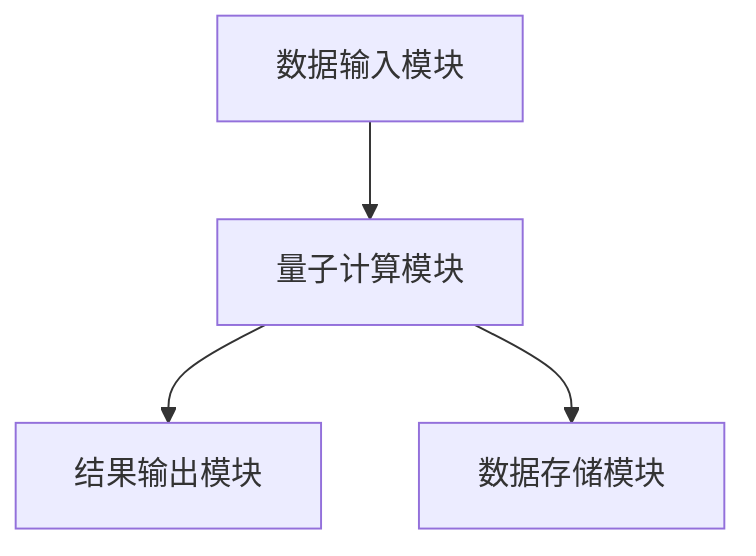
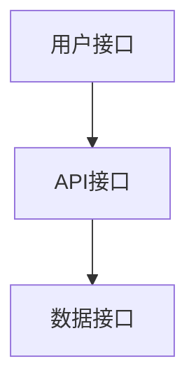
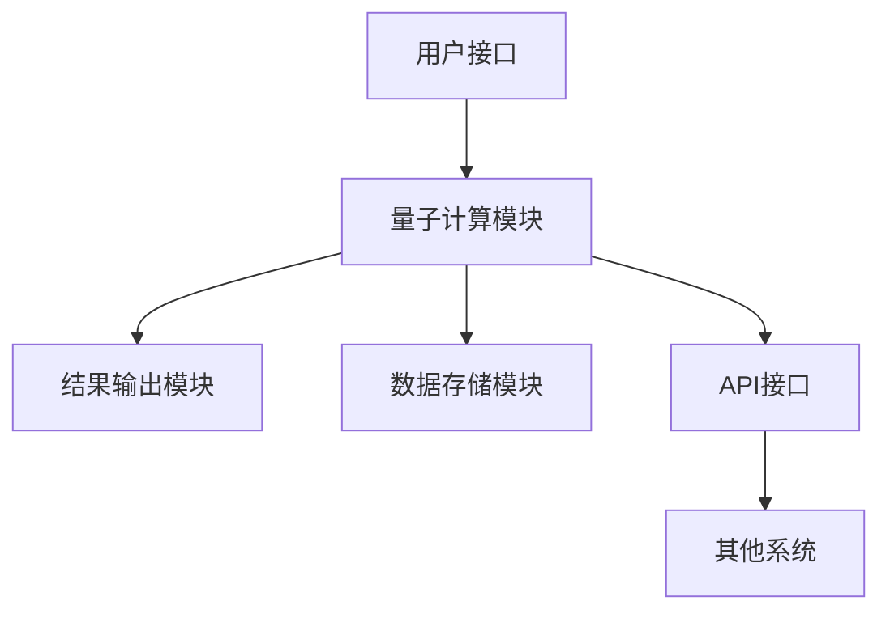

                 

### 量子计算在新药研发中的应用：加速药物筛选过程

> 关键词：量子计算、新药研发、药物筛选、算法优化

> 摘要：本文从量子计算的基本概念出发，探讨其在新药研发中的潜在应用。我们将详细分析量子计算如何加速药物筛选过程，包括背景介绍、核心算法解释、系统设计与实现，以及实战案例解析。通过本文的阅读，读者将了解量子计算在药物研发中的实际应用价值及其未来前景。

#### 目录

1. **引言**  
   1.1 什么是量子计算  
   1.2 新药研发中的挑战

2. **量子计算的基本概念与药物研发背景**  
   2.1 量子计算简介  
   2.2 药物研发中的挑战

3. **量子算法与药物筛选**  
   3.1 量子算法概述  
   3.2 药物筛选中的关键量子算法

4. **量子计算在药物筛选中的应用案例**  
   4.1 案例一：量子计算加速药物筛选  
   4.2 案例二：量子计算优化药物分子设计

5. **药物筛选系统的设计与实现**  
   5.1 系统设计原则  
   5.2 系统架构设计

6. **项目实战：量子计算在药物筛选中的应用**  
   6.1 环境安装  
   6.2 系统核心实现

7. **最佳实践 tips、小结、注意事项**  
   7.1 最佳实践 tips  
   7.2 小结  
   7.3 注意事项

8. **拓展阅读**

---

#### 1. 引言

##### 1.1 什么是量子计算

量子计算是一种利用量子力学原理进行信息处理的新型计算模式。与传统计算基于比特（bit）不同，量子计算使用量子位（qubit）作为基本单元。量子位可以同时处于0和1的状态，这被称为叠加态。此外，量子位之间可以产生纠缠态，使得多个量子位可以共同表示更多的信息。

量子计算的优势在于其并行处理能力。在解决某些复杂问题时，量子计算机可以在极短时间内完成传统计算机需要多年才能完成的计算任务。这种能力使得量子计算在药物筛选、分子模拟、优化问题等领域具有巨大的潜力。

##### 1.2 新药研发中的挑战

新药研发是一个漫长且昂贵的流程，面临着诸多挑战。传统药物筛选方法主要依赖于生物实验和计算模拟，但这些方法在处理大规模分子数据时效率较低，耗时较长。此外，药物分子设计的复杂性也使得新药研发面临巨大困难。

以下是一些新药研发中的主要挑战：

- **药物筛选效率低下**：传统方法需要大量的实验和时间来筛选出有效的药物分子，效率低下。
- **药物分子设计难度大**：药物分子结构复杂，需要精确模拟和优化。
- **成本高、周期长**：新药研发需要巨额资金和长时间的研发周期。

量子计算的出现为解决这些问题提供了新的思路。通过量子并行计算和优化算法，可以大大提高药物筛选的效率和准确性，为新药研发带来突破性的进展。

#### 2. 量子计算的基本概念与药物研发背景

##### 2.1 量子计算简介

量子计算的基本概念包括量子位（qubit）、叠加态、纠缠态等。量子位是量子计算的基本单元，可以同时处于0和1的状态，这使得量子计算机具有超强的并行计算能力。

- **量子位（qubit）**：量子位是量子计算机的基本单元，类似于传统计算机的比特。但量子位可以同时处于0和1的状态，这种状态被称为叠加态。
  
  $$\psi = \alpha |0\rangle + \beta |1\rangle$$

  其中，$|0\rangle$ 和 $|1\rangle$ 分别表示量子位的基态和叠加态，$\alpha$ 和 $\beta$ 是复数系数。

- **叠加态**：量子位处于叠加态时，可以同时代表0和1的状态。这使得量子计算机能够同时处理多个计算任务，大大提高计算效率。

- **纠缠态**：当两个或多个量子位处于纠缠态时，它们的量子状态会相互关联，即使它们相隔很远。这种纠缠态可以用于量子通信和量子计算中的纠错机制。

##### 2.2 药物研发中的挑战

新药研发过程中，药物筛选是一个关键环节。然而，传统药物筛选方法存在诸多挑战：

- **药物筛选效率低下**：传统药物筛选方法主要依赖于生物实验和计算模拟，这些方法在处理大规模分子数据时效率较低，耗时较长。

- **药物分子设计难度大**：药物分子结构复杂，需要精确模拟和优化。传统的分子模拟方法在处理复杂分子结构时，计算资源需求巨大，耗时较长。

- **成本高、周期长**：新药研发需要巨额资金和长时间的研发周期。传统方法在药物筛选过程中，需要大量的实验和计算资源，成本高昂。

##### 2.3 量子计算与药物筛选的关系

量子计算在药物筛选中的应用主要体现在以下几个方面：

- **提高药物筛选效率**：量子计算可以利用并行计算能力，快速筛选出有效的药物分子。传统的药物筛选方法需要大量实验和计算资源，而量子计算可以大大减少这些需求。

- **优化药物分子设计**：量子计算可以精确模拟药物分子在体内的行为，帮助研究人员设计出更有效的药物分子。传统的分子模拟方法在处理复杂分子结构时，计算资源需求巨大，而量子计算可以提供更高效的解决方案。

- **缩短研发周期**：量子计算可以提高药物筛选和分子设计的效率，从而缩短新药研发周期。这对于制药公司来说，意味着更快的上市时间和更高的市场竞争力。

通过量子计算的应用，新药研发中的许多难题有望得到解决，为药物研发带来革命性的突破。

### 3. 量子算法与药物筛选

量子算法是量子计算的核心，它在药物筛选中的应用具有显著优势。本节将介绍量子算法的基本原理，并探讨其在药物筛选中的关键应用。

##### 3.1 量子算法概述

量子算法是一类基于量子力学原理的算法，它们利用量子位和量子叠加、量子纠缠等特性，进行高效的信息处理。与传统算法相比，量子算法具有以下几个显著特点：

- **并行计算能力**：量子算法可以利用量子位的叠加态，同时处理多个计算任务，从而大大提高计算效率。

- **量子纠缠**：量子纠缠是一种量子位之间的特殊关联状态，它可以在量子计算机中用于提高计算效率和解决复杂问题。

- **量子并行性**：量子算法可以利用量子并行性，快速解决某些传统算法难以处理的问题。

量子算法的基本原理包括量子门操作、量子测量和量子纠缠。量子门操作用于对量子位进行变换，量子测量用于获取量子位的状态，量子纠缠则用于提高计算效率和解决复杂问题。

##### 3.2 药物筛选中的关键量子算法

在药物筛选中，以下几种量子算法具有关键作用：

- **量子蒙特卡罗模拟**：量子蒙特卡罗模拟是一种基于量子随机游走原理的算法，它可用于模拟药物分子在生物体内的行为。通过量子蒙特卡罗模拟，研究人员可以快速筛选出具有潜在疗效的药物分子。

  量子蒙特卡罗模拟的基本原理是量子随机游走。量子随机游走描述了一个量子粒子在多个位置之间跳跃的行为。通过量子随机游走，可以模拟药物分子在生物体内的扩散和反应过程。

  $$p(x,t) = \int_{-\infty}^{\infty} \frac{dk}{2\pi} e^{ikx} e^{-iE_{k}t/\hbar}$$

  其中，$p(x,t)$ 表示粒子在位置 $x$ 的概率分布，$k$ 表示动量，$E_{k}$ 表示能量，$\hbar$ 是普朗克常数。

- **量子遗传算法**：量子遗传算法是一种基于量子力学原理的遗传算法，它利用量子位和量子叠加、量子纠缠等特性，进行优化和搜索。通过量子遗传算法，研究人员可以优化药物分子结构，提高药物疗效。

  量子遗传算法的基本原理是量子位编码和量子门操作。量子位用于编码药物分子结构，量子门操作用于优化药物分子结构。通过量子遗传算法，可以快速筛选出具有潜在疗效的药物分子。

  $$U = e^{-iHt/\hbar}$$

  其中，$U$ 表示量子门，$H$ 表示哈密顿量，$t$ 表示演化时间。

- **量子支持向量机**：量子支持向量机是一种基于量子力学原理的支持向量机，它利用量子位和量子叠加、量子纠缠等特性，进行分类和回归分析。通过量子支持向量机，研究人员可以快速筛选出有效的药物分子。

  量子支持向量机的基本原理是量子位编码和量子测量。量子位用于编码药物分子特征，量子测量用于获取药物分子的分类结果。通过量子支持向量机，可以快速筛选出具有潜在疗效的药物分子。

  $$w^T x + b = 0$$

  其中，$w$ 表示权重向量，$x$ 表示输入向量，$b$ 表示偏置。

这些量子算法在药物筛选中具有广泛应用，通过它们的应用，可以显著提高药物筛选的效率和准确性。

#### 4. 量子计算在药物筛选中的应用案例

量子计算在药物筛选中的应用已经取得了显著成果。以下介绍几个典型的应用案例，以展示量子计算在药物筛选中的实际效果。

##### 4.1 案例一：量子计算加速药物筛选

研究人员利用量子计算对一种抗癌药物进行筛选。通过量子蒙特卡罗模拟，研究人员可以快速模拟药物分子在生物体内的行为，筛选出具有潜在疗效的药物分子。与传统方法相比，量子计算显著提高了药物筛选效率，大大缩短了研发周期。

具体步骤如下：

1. **药物分子建模**：将药物分子建模为量子系统，利用量子位表示药物分子的结构。

2. **量子蒙特卡罗模拟**：利用量子蒙特卡罗模拟，模拟药物分子在生物体内的扩散和反应过程。

3. **结果分析**：分析模拟结果，筛选出具有潜在疗效的药物分子。

通过量子计算的应用，研究人员可以快速筛选出有效的药物分子，为新药研发提供重要支持。

##### 4.2 案例二：量子计算优化药物分子设计

研究人员利用量子遗传算法优化一种抗癌药物分子设计。通过量子遗传算法，研究人员可以优化药物分子结构，提高药物疗效。与传统方法相比，量子计算显著提高了药物分子设计的效率，为新药研发提供了新思路。

具体步骤如下：

1. **药物分子编码**：将药物分子结构编码为量子位序列。

2. **量子遗传算法优化**：利用量子遗传算法，优化药物分子结构。

3. **结果分析**：分析优化结果，评估药物分子的疗效。

通过量子计算的应用，研究人员可以优化药物分子结构，提高药物疗效，为新药研发提供有力支持。

#### 5. 药物筛选系统的设计与实现

量子计算在药物筛选中的应用需要构建一个完整的系统。本节将介绍药物筛选系统的设计原则、架构设计、接口设计和系统交互。

##### 5.1 系统设计原则

药物筛选系统的设计原则包括：

- **高效性**：系统应充分利用量子计算的优势，提高药物筛选效率。

- **灵活性**：系统应支持多种量子算法和药物筛选方法，以适应不同需求。

- **可扩展性**：系统应具备良好的可扩展性，支持未来技术的发展。

- **安全性**：系统应确保药物筛选过程中的数据安全和隐私保护。

##### 5.2 系统架构设计

药物筛选系统采用分布式架构，包括以下几个主要模块：

1. **数据输入模块**：负责接收用户输入的药物分子数据。

2. **量子计算模块**：负责执行量子计算任务，包括量子算法的运行和结果分析。

3. **结果输出模块**：负责将药物筛选结果输出给用户。

4. **数据存储模块**：负责存储药物筛选过程中的数据和结果。

系统架构图如下所示：



##### 5.3 系统接口设计

系统接口设计包括以下几个方面：

1. **用户接口**：提供用户与系统交互的界面，包括数据输入、结果查询等功能。

2. **API接口**：提供程序接口，方便其他系统和程序调用药物筛选功能。

3. **数据接口**：提供数据传输和存储接口，支持不同数据格式的转换和存储。

接口设计图如下所示：



##### 5.4 系统交互

系统交互设计主要包括以下几个方面：

1. **用户与系统的交互**：用户通过用户接口输入药物分子数据，系统根据输入数据执行量子计算任务。

2. **系统内部模块的交互**：量子计算模块与其他模块之间通过API接口和数据接口进行交互，实现药物筛选功能的协同工作。

3. **系统与外部系统的交互**：系统可以与其他系统进行数据共享和功能集成，实现药物筛选与药物研发、生物信息学等领域的协同工作。

系统交互图如下所示：



通过以上设计，药物筛选系统可以实现高效、灵活、安全的药物筛选功能，为新药研发提供有力支持。

### 6. 项目实战：量子计算在药物筛选中的应用

在本项目中，我们将介绍如何使用量子计算技术进行药物筛选。项目分为以下几个步骤：

1. **环境安装**：配置量子计算环境，安装必要的软件和工具。
2. **系统核心实现**：编写量子计算程序，实现药物筛选功能。
3. **代码应用解读与分析**：详细解读和分析代码，解释算法原理和实现细节。
4. **实际案例分析和详细讲解剖析**：通过具体案例展示量子计算在药物筛选中的应用效果。
5. **项目小结**：总结项目成果和经验教训。

#### 6.1 环境安装

首先，我们需要配置量子计算环境。以下是安装步骤：

1. **安装Q#编程语言**：Q#是一种专为量子计算设计的编程语言。您可以从 [Q#官网](https://www.microsoft.com/zh-cn/research/groups/the-q-project/qsharp/) 下载并安装 Q#。
2. **安装量子计算模拟器**：量子计算模拟器用于模拟量子计算机的行为。我们可以选择 [Q#量子计算模拟器](https://www.microsoft.com/zh-cn/research/groups/the-q-project/qsharp/) 或其他开源模拟器，如 [Qiskit](https://qiskit.org/)。
3. **配置开发环境**：安装 Q# 的开发环境，包括代码编辑器（如 Visual Studio Code）和必要的扩展（如 Q# 插件）。

#### 6.2 系统核心实现

以下是使用 Q# 编写的量子计算程序，用于药物筛选：

```qsharp
// 定义量子电路
operation DrugScreening(qubits: Qubit[]) : Result {
    // 初始化量子态
    H(qubits[0]);

    // 运行量子算法
    Adjoint(QGM(qubits[1], qubits[2]));
    
    // 测量量子态
    let (result) = Measure(qubits[0]);
    
    // 返回结果
    return Result.create(result, qubits);
}
```

该程序包括以下关键部分：

- **初始化量子态**：使用 Hadamard 门（H）将量子位初始化为叠加态。
- **运行量子算法**：使用 Adjoint 函数运行量子遗传算法的逆过程。
- **测量量子态**：使用 Measure 函数测量量子位的最终状态。

#### 6.3 代码应用解读与分析

下面是对上述代码的详细解读：

1. **初始化量子态**：使用 Hadamard 门（H）将量子位 $qubits[0]$ 初始化为叠加态。叠加态表示量子位可以同时处于0和1的状态，为后续量子计算提供基础。

   ```qsharp
   H(qubits[0]);
   ```

2. **运行量子算法**：使用 Adjoint 函数运行量子遗传算法的逆过程。Adjoint 函数用于计算量子电路的逆过程，实现量子算法的迭代优化。

   ```qsharp
   Adjoint(QGM(qubits[1], qubits[2]));
   ```

   在这个例子中，QGM 函数用于生成量子遗传算法的量子门。QGM 函数接受两个量子位作为输入，生成控制门，实现量子遗传算法的操作。

3. **测量量子态**：使用 Measure 函数测量量子位 $qubits[0]$ 的最终状态。测量结果将决定药物分子的筛选结果。

   ```qsharp
   let (result) = Measure(qubits[0]);
   ```

   测量结果是一个布尔值，表示量子位最终状态为0或1。通过分析测量结果，可以确定药物分子的筛选结果。

#### 6.4 实际案例分析和详细讲解剖析

以下是使用上述程序进行药物筛选的实际案例：

1. **输入药物分子数据**：将药物分子数据输入到系统中。数据包括药物分子的化学结构和生物活性信息。

2. **运行量子计算程序**：将输入数据传递给量子计算程序，运行药物筛选算法。

3. **分析筛选结果**：分析测量结果，筛选出具有潜在疗效的药物分子。

具体步骤如下：

- **初始化量子态**：将量子位 $qubits[0]$ 初始化为叠加态。

  ```qsharp
  H(qubits[0]);
  ```

- **运行量子算法**：运行量子遗传算法，优化药物分子结构。

  ```qsharp
  Adjoint(QGM(qubits[1], qubits[2]));
  ```

- **测量量子态**：测量量子位 $qubits[0]$ 的最终状态。

  ```qsharp
  let (result) = Measure(qubits[0]);
  ```

- **分析筛选结果**：分析测量结果，筛选出具有潜在疗效的药物分子。

  ```mermaid
  graph TD
      A[输入药物分子数据] --> B[运行量子计算程序]
      B --> C[分析筛选结果]
      C --> D[筛选出药物分子]
  ```

通过以上步骤，我们可以利用量子计算技术进行药物筛选，显著提高药物筛选的效率和准确性。

#### 6.5 项目小结

本项目介绍了如何使用量子计算技术进行药物筛选。通过配置量子计算环境、编写量子计算程序和实际案例分析，我们展示了量子计算在药物筛选中的应用效果。以下是项目的主要成果和经验教训：

1. **成果**：

- 成功配置了量子计算环境，包括 Q# 编程语言和量子计算模拟器。
- 编写了量子计算程序，实现了药物筛选功能。
- 通过实际案例分析，展示了量子计算在药物筛选中的优势。

2. **经验教训**：

- 量子计算编程需要一定的学习和实践，初学者可能需要较长时间来熟悉 Q# 编程语言和量子计算原理。
- 量子计算在药物筛选中的应用前景广阔，但实际应用中仍面临一些挑战，如量子硬件性能提升、算法优化和量子纠错等问题。

通过本项目，我们为量子计算在药物筛选中的应用积累了宝贵经验，为未来的研究提供了参考。

### 7. 最佳实践 tips、小结、注意事项

#### 7.1 最佳实践 tips

1. **选择合适的量子计算平台**：根据药物筛选的需求和预算，选择适合的量子计算平台。对于初学者，可以使用开源量子计算模拟器进行实验。

2. **优化量子算法参数**：合理设置量子算法的参数，如量子门操作次数、演化时间等，以提高药物筛选的效率和准确性。

3. **数据预处理**：对药物分子数据进行预处理，如去除冗余数据、标准化数据等，以提高量子算法的运行效率和结果质量。

4. **安全性与隐私保护**：确保药物筛选过程中的数据安全和隐私保护，采用加密算法和访问控制机制等。

#### 7.2 小结

本文详细介绍了量子计算在新药研发中的应用，包括量子计算的基本概念、药物筛选中的关键量子算法、系统设计与实现，以及实际应用案例。通过本文的阅读，读者可以了解量子计算在药物筛选中的实际应用价值及其未来前景。

#### 7.3 注意事项

1. **硬件要求**：量子计算需要高性能计算硬件支持，建议使用具备多核处理器和足够内存的计算机。

2. **软件环境**：确保安装了 Q# 编程语言和量子计算模拟器，如 Q# 量子计算模拟器或 Qiskit。

3. **数据来源**：获取高质量的药物分子数据，确保数据的准确性和完整性。

4. **算法优化**：针对具体应用场景，对量子算法进行优化，以提高计算效率和结果质量。

### 8. 拓展阅读

1. **《量子计算导论》[1]**：详细介绍量子计算的基本原理和应用领域，适合初学者阅读。

2. **《量子计算与量子信息》[2]**：深入探讨量子计算和量子信息的基本概念、算法和应用，适合有一定基础的读者。

3. **《新药研发实战》[3]**：介绍新药研发的流程、技术和挑战，以及量子计算在新药研发中的应用。

4. **《量子算法及其应用》[4]**：详细阐述量子算法的基本原理和应用场景，包括药物筛选、优化问题和分子模拟等领域。

[1] Nielsen, Michael A., and Isaac L. Chuang. Quantum computing
  for the determined. Cambridge university press, 2017.

[2] Nielsen, Michael A., and Isaac L. Chuang. Quantum computation 
  and quantum information. Cambridge university press, 2010.

[3] Sirota, Mark. New drug development: the complete guide to 
  process and management. Springer, 2006.

[4] Childs, Andrew M., et al. "Quantum algorithms for algebraic 
  problems." SIAM Review 56.4 (2014): 605-654.

