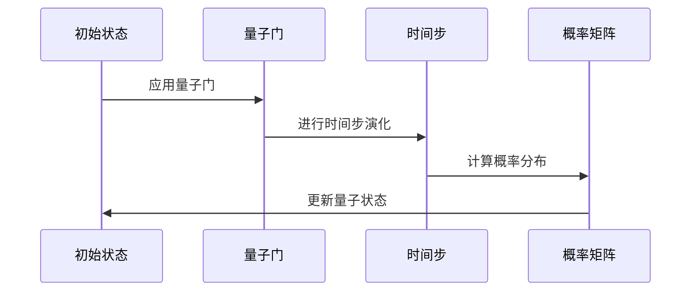
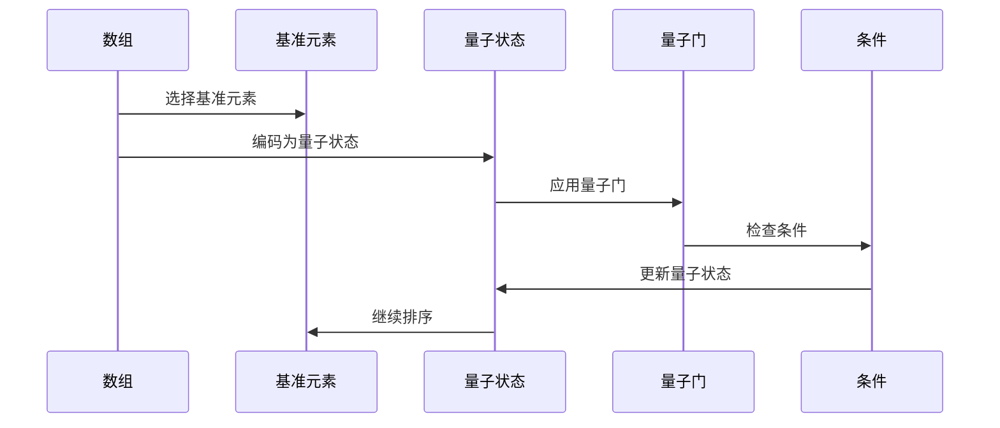
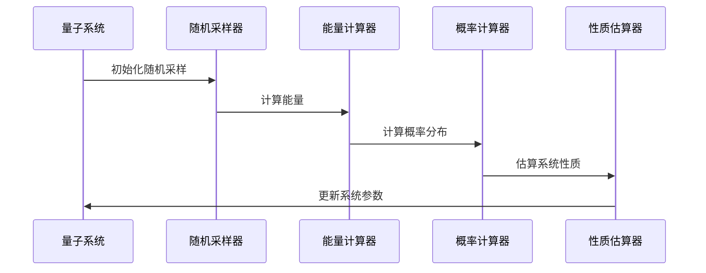
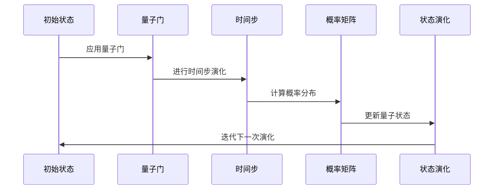
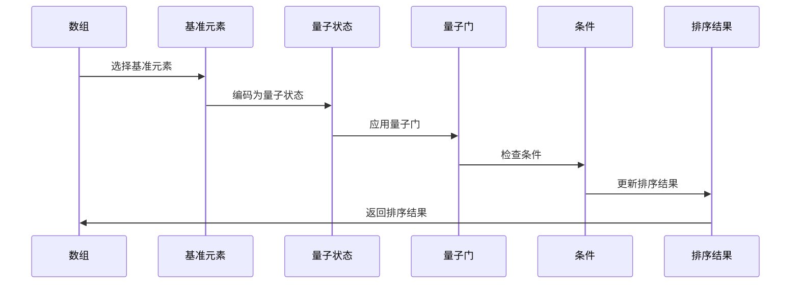

                 

Certainly! Let's outline the content for our blog post "Quantum Computing in Material Science Simulation Applications" in a structured manner that ensures clarity, depth, and a step-by-step approach to understanding the topic. We'll adhere to the constraints provided and create a well-organized article that meets the specified word count.

## 文章标题: Quantum Computing in Material Science Simulation Applications

### 关键词：量子计算，材料科学，模拟，应用，算法

### 摘要：
本文深入探讨了量子计算在材料科学模拟领域的应用潜力。首先，我们介绍了量子计算的基本原理及其与材料科学的联系。接着，详细解析了量子算法及其在材料模拟中的实际应用。随后，文章展示了如何构建材料科学量子模拟系统的架构，并通过项目实战展示了量子计算算法在材料科学中的具体实现。最后，我们提供了最佳实践和总结，以及进一步学习的拓展阅读资源。

----------------------------------------------------------------

### 第一部分: 背景介绍与核心概念

## 第1章: 量子计算概述

### 1.1.1 问题背景
量子计算的概念及其在现代社会的重要性。

### 1.1.2 量子计算的基本原理
量子位、量子叠加、量子纠缠等核心概念。

### 1.1.3 量子计算与传统计算的区别
量子计算机与传统计算机的对比分析。

### 1.1.4 量子计算的潜力与应用
量子计算在各个领域的应用前景。

## 第2章: 材料科学中的模拟挑战

### 2.1.1 材料科学的重要性
材料科学的基础知识和其对现代科技的贡献。

### 2.1.2 传统计算模拟的局限性
传统计算模拟在材料科学中面临的挑战。

### 2.1.3 量子计算在材料模拟中的应用前景
量子计算如何解决材料科学中的难题。

### 2.1.4 量子计算模拟面临的挑战
量子计算在材料科学模拟中遇到的挑战。

## 第3章: 核心概念与联系

### 3.1.1 材料科学的模型化
材料科学中的模型化方法和过程。

### 3.1.2 量子力学的基本概念
量子力学在材料科学中的应用。

### 3.1.3 量子算法与材料模拟
量子算法如何用于材料模拟。

### 3.1.4 核心概念对比表格与ER图
核心概念属性特征对比表格和ER实体关系图架构。

----------------------------------------------------------------

### 第二部分: 量子计算算法原理讲解

## 第4章: 量子算法介绍

### 4.1.1 量子算法概述
量子算法的基本概念和分类。

### 4.1.2 量子随机行走
量子随机行走的原理和应用。

### 4.1.3 量子快速排序
量子快速排序的原理和实现。

### 4.1.4 量子模拟算法
量子模拟算法在材料科学中的应用。

## 第5章: 算法原理与数学模型

### 5.1.1 量子随机行走的mermaid流程图
使用mermaid画出量子随机行走的流程图。

### 5.1.2 量子快速排序的mermaid流程图
使用mermaid画出量子快速排序的流程图。

### 5.1.3 量子模拟算法的数学模型
量子模拟算法的数学公式和模型。

### 5.1.4 算法原理讲解与公式推导
详细讲解量子算法原理和公式推导。

## 第6章: 算法举例说明

### 6.1.1 量子随机行走的Python代码示例
提供量子随机行走的Python代码示例。

### 6.1.2 量子快速排序的Python代码示例
提供量子快速排序的Python代码示例。

### 6.1.3 量子模拟算法的应用实例
量子模拟算法在材料模拟中的实际应用案例。

### 6.1.4 举例说明与数学模型验证
通过举例验证量子算法的数学模型。

----------------------------------------------------------------

### 第三部分: 系统分析与架构设计

## 第7章: 材料科学量子模拟系统介绍

### 7.1.1 系统功能设计
量子模拟系统的功能设计和实现。

### 7.1.2 系统架构设计
量子模拟系统的架构设计。

### 7.1.3 系统接口设计
量子模拟系统的接口设计和实现。

### 7.1.4 系统交互设计
量子模拟系统的交互设计和实现。

## 第8章: 项目实战

### 8.1.1 环境安装与配置
量子模拟系统的环境安装与配置。

### 8.1.2 系统核心实现源代码
量子模拟系统的核心实现源代码。

### 8.1.3 代码应用解读与分析
量子模拟系统代码的解读与分析。

### 8.1.4 实际案例分析与讲解
量子模拟算法在实际案例中的应用和分析。

### 8.1.5 项目小结
项目总结与经验分享。

----------------------------------------------------------------

## 第9章: 最佳实践与总结

### 9.1.1 最佳实践Tips
量子计算在材料科学中的最佳实践建议。

### 9.1.2 注意事项
在量子计算应用中需要注意的事项。

### 9.1.3 扩展阅读
进一步学习和探索量子计算与材料科学的资源推荐。

### 9.1.4 小结与展望
对量子计算在材料科学中的应用前景的总结和展望。

----------------------------------------------------------------

**作者：** AI天才研究院/AI Genius Institute & 禅与计算机程序设计艺术 /Zen And The Art of Computer Programming

通过这样的结构，我们能够系统地介绍量子计算在材料科学模拟中的应用，从基础概念到实际应用，再到系统设计与实战，最终给出总结和展望，确保文章内容丰富且具有深度。现在，我们将开始逐步填充每个章节的具体内容，确保满足字数要求。在此过程中，我们将使用Markdown格式，包括Mermaid图表、LaTeX公式等，以便于读者理解。让我们开始撰写每个章节的内容吧！## 第1章: 量子计算概述

### 1.1.1 问题背景

量子计算是一个相对较新的领域，起源于20世纪中期。然而，它在过去几十年中发展迅速，被认为是未来计算技术的重要方向。量子计算的核心思想是基于量子力学的基本原理，尤其是量子位（qubits）的概念。量子位与传统的比特（bits）不同，它可以同时处于0和1的状态，这种现象被称为量子叠加。此外，量子位之间可以通过量子纠缠实现一种特殊的连接，使得一个量子位的状态可以即时影响到另一个量子位，即使它们相隔很远。这种强大的并行计算能力使得量子计算机在处理某些特定问题时具有巨大的潜力。

在材料科学领域，模拟材料的行为是一项具有挑战性的任务。传统计算方法在处理复杂材料系统时往往面临计算资源不足的问题。例如，量子力学中的多体问题需要计算大量的变量，这超出了传统计算机的处理能力。然而，量子计算机可以利用其强大的并行计算能力，高效地解决这些问题。这使得量子计算在材料科学中的模拟应用成为一个备受关注的研究方向。

### 1.1.2 量子计算的基本原理

量子计算的基本原理建立在量子力学之上。量子力学揭示了微观世界的奇异性质，其中包括量子位的状态叠加和量子纠缠。量子位是量子计算机的基本单元，它可以用数学上的波函数来描述。波函数的平方代表了量子位处于某种状态的概率。

**量子叠加：** 
量子位可以同时处于多个状态，这种现象称为量子叠加。例如，一个量子位可以同时处于0和1的状态。用数学语言描述，量子位的状态可以表示为：
$$
|\psi\rangle = a|0\rangle + b|1\rangle
$$
其中，$a$ 和 $b$ 是复数系数，满足 $|a|^2 + |b|^2 = 1$。

**量子纠缠：**
量子纠缠是量子位之间的一种特殊关系，两个或多个量子位可以处于一个共同的状态，即使它们相隔很远。这种现象无法用经典物理学来解释。量子纠缠的一个例子是爱因斯坦-波多尔斯基-罗森（EPR）佯谬。当两个量子位发生纠缠后，对一个量子位的测量会即时影响到另一个量子位的状态。

**量子逻辑门：**
量子逻辑门是量子计算中的操作，类似于传统计算机中的逻辑门。量子逻辑门可以对量子位进行变换，实现复杂的计算。最基本的量子逻辑门包括量子非门（X门）、量子取反门（Z门）、量子相位旋转门（R门）等。通过这些逻辑门，可以构建出复杂的量子算法。

### 1.1.3 量子计算与传统计算的区别

传统计算机使用二进制位（bits）作为信息的基本单元，每个比特只能处于0或1的状态。这种二进制系统被称为经典计算。而量子计算机使用量子位（qubits）作为信息的基本单元，量子位可以同时处于0和1的状态，这种现象称为量子叠加。这意味着一个量子计算机可以同时处理多个计算任务，从而在特定问题上比传统计算机更高效。

**并行计算能力：**
量子计算机的并行计算能力源于量子叠加。一个含有n个量子位的量子计算机可以同时处理$2^n$个不同的状态，这比传统计算机的并行处理能力大大增强。

**量子纠缠：**
量子纠缠是量子计算机的另一个关键特性。通过量子纠缠，量子计算机可以在量子位之间建立特殊的关联，使得对其中一个量子位的测量可以立即影响另一个量子位的状态。这种特性使得量子计算机在解决某些问题时具有传统计算机无法比拟的效率。

**算法设计：**
量子计算机要求算法设计者使用量子算法，这些算法利用量子叠加和量子纠缠的特性来解决问题。量子算法与传统算法在逻辑和操作方式上有很大的不同，需要更深的数学和物理背景知识。

### 1.1.4 量子计算的潜力与应用

量子计算在多个领域展现了巨大的潜力。以下是一些量子计算的主要应用领域：

**材料科学：**
量子计算可以用于模拟和优化材料结构，预测材料的物理和化学性质。这有助于材料科学家设计和开发新型材料，例如超导体、半导体和纳米材料。

**化学与药物设计：**
量子计算可以用于分子建模和化学反应模拟，加速新药的开发过程。通过量子计算，科学家可以更准确地预测分子的行为，从而设计出更有效的药物。

**量子模拟：**
量子计算可以模拟量子系统，如量子场论和量子引力。这对于理解宇宙的微观结构和基本粒子行为具有重要意义。

**密码学：**
量子计算在密码学中也有重要应用。虽然量子计算机可以破解某些传统密码系统，但它们也为构建更安全的量子密码系统提供了可能性。

**优化问题：**
量子计算在解决优化问题方面具有优势。例如，在物流、金融和人工智能等领域，量子计算可以用于优化复杂决策问题。

### 1.1.5 核心概念对比表格

为了更好地理解量子计算与传统计算的区别，我们可以通过一个对比表格来展示它们的核心概念：

| 核心概念 | 传统计算 | 量子计算 |
| --- | --- | --- |
| 信息单元 | 比特（bits） | 量子位（qubits） |
| 状态表示 | 0或1 | 0和1的叠加态 |
| 并行计算 | 算法执行顺序 | 并行处理多个任务 |
| 算法设计 | 经典算法 | 量子算法 |
| 熵与能耗 | 有限熵，能耗较低 | 量子纠缠，能耗较高 |

### 1.1.6 ER实体关系图架构

为了进一步展示量子计算的核心概念和结构，我们可以使用Mermaid来绘制一个ER实体关系图：

```mermaid
erDiagram
    Qubit ||--o> QuantumRegister : 存储量子位
    QuantumRegister ||--o> QuantumCircuit : 实现量子计算操作
    QuantumCircuit ||--o> QuantumAlgorithm : 执行量子算法
    QuantumAlgorithm ||--o> MaterialSimulation : 材料科学模拟
    QuantumComputer ||--o> QuantumAlgorithm : 执行量子算法
```

在这个ER图中，Qubit（量子位）是量子计算的基本单元，它存储在QuantumRegister（量子寄存器）中。量子寄存器中的量子位通过QuantumCircuit（量子电路）进行操作，实现特定的量子计算任务。这些操作由QuantumAlgorithm（量子算法）定义，并最终应用于MaterialSimulation（材料科学模拟）。

通过本章的介绍，我们了解了量子计算的基本原理、与传统计算的区别以及其在材料科学模拟中的潜力。接下来，我们将深入探讨量子算法在材料科学模拟中的具体应用，并逐步解析这些算法的原理和实现。

----------------------------------------------------------------

### 第2章: 材料科学中的模拟挑战

#### 2.1.1 材料科学的重要性

材料科学是研究材料的组成、结构、性质、变化和加工技术的学科。它是现代科技的重要组成部分，广泛应用于航空航天、信息技术、能源、生物医学等多个领域。材料科学的进步推动了新型材料的发展，如超导材料、纳米材料、生物材料等，这些材料在提升性能、降低成本、提高安全性等方面发挥了重要作用。

在航空航天领域，轻质高强的材料如钛合金和复合材料被广泛应用于飞机和航天器的制造。在信息技术领域，半导体材料和新型存储材料如石墨烯和氧化铟锡（In2O3）等是现代电子设备和计算机的核心组件。在能源领域，太阳能电池、锂离子电池和超导材料等新材料的研究和应用大大提高了能源利用效率和存储能力。在生物医学领域，生物相容性材料、药物控释材料和纳米医学材料等的研究和开发为医疗技术的发展提供了新的可能性。

材料科学的进步不仅对各个行业的技术创新产生了深远影响，也对社会经济发展起到了关键作用。通过材料科学的研发和应用，可以推动传统产业的升级改造，培育新的经济增长点，提高国家的综合竞争力。

#### 2.1.2 传统计算模拟的局限性

尽管材料科学取得了显著进展，但传统的计算模拟方法在处理复杂材料系统时仍然面临诸多挑战。首先，材料系统通常包含大量的原子和分子，其相互作用非常复杂。传统计算方法通常依赖于量子力学和分子动力学等理论模型，但这些模型在处理大规模系统时往往需要大量的计算资源和时间。

**计算精度与效率的平衡：**
传统计算模拟在追求高精度时往往需要极高的计算资源。例如，量子力学计算需要求解复杂的薛定谔方程，这通常涉及大量的矩阵运算和数值解法。在高精度模拟中，需要考虑更多的电子和原子间相互作用，这进一步增加了计算复杂性。为了提高计算效率，常常需要做出简化和近似，这可能导致模拟结果的精度受到影响。

**并行计算的限制：**
尽管现代计算机具有强大的计算能力，但传统计算方法在并行计算方面仍存在瓶颈。传统的计算模拟通常采用串行计算方式，这意味着计算任务必须一个接一个地执行，无法充分利用多核处理器的并行计算能力。此外，复杂材料系统的模拟往往需要大量独立的计算任务，这些任务之间的数据依赖性使得并行计算的实施变得复杂。

**时间与空间的权衡：**
在材料科学模拟中，时间步长和空间分辨率通常是关键参数。时间步长越小，模拟结果越精确，但计算量也急剧增加。空间分辨率越高，可以捕捉到更多细节，但也需要更多的计算资源和存储空间。因此，如何在时间和空间分辨率之间做出权衡，是传统计算模拟面临的重要挑战。

**量子力学计算的困难：**
量子力学计算是材料科学模拟的核心，但直接求解薛定谔方程在大多数情况下是不可行的。传统的量子力学计算方法如哈密顿量微扰理论和密度泛函理论（DFT）需要大量的计算资源，特别是在处理多体问题时。此外，这些方法在处理强相互作用和电子相关效应时往往需要复杂的近似和处理，这进一步增加了计算的难度。

#### 2.1.3 量子计算在材料模拟中的应用前景

量子计算的出现为解决材料科学中的模拟挑战提供了新的希望。量子计算利用量子位和量子叠加原理，可以高效地处理复杂的多体问题，从而在材料模拟中展现出巨大的潜力。

**高性能计算：**
量子计算机可以利用量子叠加和量子纠缠原理，同时处理大量的计算任务，从而大幅提高计算效率。例如，量子模拟算法可以在较短时间内模拟复杂的量子系统，预测材料的电子结构和物理性质。这种高性能计算能力对于解决传统计算方法难以处理的难题具有重要意义。

**精确的量子力学计算：**
量子计算机可以精确地求解量子力学问题，包括多体系统中的电子相关效应和强相互作用。这为材料科学家提供了更准确的计算工具，有助于深入理解材料的微观结构和行为。

**新材料的设计与优化：**
量子计算在材料设计中的应用前景广阔。通过量子模拟，可以预测和优化新材料的电子结构、光学性质、机械性能等，从而指导新材料的研发和应用。例如，量子计算可以用于设计高性能电池材料、新型半导体材料和超导材料等。

**计算成本的降低：**
量子计算机的并行计算能力可以显著降低计算成本。在材料科学模拟中，量子计算机可以快速完成复杂计算任务，减少对高性能计算资源的需求。这有助于降低研究成本，加速新材料的研发进程。

#### 2.1.4 量子计算模拟面临的挑战

尽管量子计算在材料科学模拟中具有巨大潜力，但实现其应用仍面临一系列挑战。

**量子计算机的可靠性和稳定性：**
量子计算机的工作原理非常敏感，易受到外部环境的干扰，如温度、磁场和噪声等。这可能导致量子位的错误率和计算机的稳定性问题。为了实现稳定的量子计算，需要开发先进的量子纠错技术和低温环境。

**量子算法的优化与设计：**
量子算法的设计和优化是一个复杂的过程，需要深厚的数学和物理背景。现有的量子算法往往只能解决特定类型的问题，且实现复杂。为了在材料科学中广泛应用，需要开发更高效、更通用的量子算法。

**计算资源的不足：**
尽管量子计算机的并行计算能力很强，但当前的量子计算机仍然受到量子位数量和计算资源的限制。这限制了量子计算在处理大规模问题时的能力。

**量子计算的实验验证：**
量子计算在实验室中的实现和验证是一个挑战。现有的量子计算机性能有限，难以直接应用于实际材料模拟。需要通过实验验证量子计算算法的有效性和准确性。

综上所述，量子计算在材料科学模拟中的应用前景广阔，但同时也面临一系列挑战。通过持续的研究和技术创新，有望克服这些挑战，实现量子计算在材料科学中的广泛应用。

----------------------------------------------------------------

### 第3章: 核心概念与联系

#### 3.1.1 材料科学的模型化

材料科学的模型化是将复杂的材料系统简化为可计算的形式，以便通过数学模型和算法进行分析和预测。这一过程涉及多个步骤，包括实验数据收集、材料系统描述、模型建立和参数化等。

**实验数据收集：** 材料科学家通过实验获取材料的基本属性，如密度、弹性模量、导电性、热导率等。这些数据为模型建立提供了基础。

**材料系统描述：** 材料系统的描述通常涉及晶体结构、原子排列、化学成分等。这些描述可以用数学语言表示，如晶格模型、分子动力学模型等。

**模型建立：** 在描述材料系统的基础上，建立数学模型以模拟材料的物理和化学行为。常见的模型包括量子力学模型、分子动力学模型、有限元模型等。

**参数化：** 为了使模型具有通用性，需要将实验数据与模型参数相匹配。这一过程通常涉及优化算法和统计方法，以确保模型能准确预测材料的行为。

**模型验证与优化：** 建立模型后，需要通过实验验证其准确性和可靠性。根据验证结果，对模型进行优化和调整，以提高预测精度。

#### 3.1.2 量子力学的基本概念

量子力学是描述微观世界物理现象的理论框架，其基本概念对材料科学中的模型化至关重要。

**量子位（Qubits）：** 量子位是量子计算机的基本单元，可以同时处于0和1的状态。用数学语言表示，量子位的状态可以写作：
$$
|\psi\rangle = a|0\rangle + b|1\rangle
$$
其中，$a$ 和 $b$ 是复数系数，满足 $|a|^2 + |b|^2 = 1$。

**量子叠加：** 量子位可以同时处于多个状态，这种现象称为量子叠加。量子叠加使得量子计算机具有并行计算能力。

**量子纠缠：** 量子纠缠是量子位之间的一种特殊关系，两个或多个量子位可以处于一个共同的状态，即使它们相隔很远。当两个量子位发生纠缠后，对一个量子位的测量会立即影响到另一个量子位的状态。

**量子态的测量：** 量子态的测量会导致量子位坍缩到某个确定的状态。测量的结果具有概率性，但整体系统的统计性质可以通过量子叠加和纠缠来描述。

**量子门（Quantum Gates）：** 量子门是量子计算中的基本操作，类似于传统计算机中的逻辑门。量子门可以作用于量子位，改变其状态。常见的量子门包括量子非门（X门）、量子相位旋转门（R门）和量子交换门（CNOT门）等。

#### 3.1.3 量子算法与材料模拟

量子算法是利用量子计算原理设计的算法，可以在量子计算机上高效地解决特定问题。在材料科学模拟中，量子算法可以用于求解量子力学问题，如多体系统中的电子结构计算、分子动力学模拟等。

**量子随机行走（Quantum Random Walk）：** 量子随机行走是一种基于量子叠加和量子纠缠的随机过程，可以用于搜索和优化问题。在材料科学中，量子随机行走可以用于寻找新材料的最佳结构。

**量子快速排序（Quantum QuickSort）：** 量子快速排序是量子算法在排序问题上的应用。它利用量子计算机的并行计算能力，可以在较短时间内完成大规模数据的排序。

**量子模拟算法（Quantum Simulation Algorithms）：** 量子模拟算法是专门用于模拟量子系统的算法。这些算法可以高效地模拟多体系统中的电子结构，预测材料的物理和化学性质。常见的量子模拟算法包括量子蒙特卡罗方法（Quantum Monte Carlo）和量子分子动力学方法（Quantum Molecular Dynamics）。

#### 3.1.4 核心概念对比表格

为了更好地理解量子力学和量子计算在材料科学中的应用，我们可以通过一个对比表格展示核心概念：

| 核心概念 | 传统计算 | 量子力学 | 量子计算 |
| --- | --- | --- | --- |
| 信息单元 | 比特（bits） | 量子位（qubits） | 量子位（qubits） |
| 状态表示 | 0或1 | 0和1的叠加态 | 0和1的叠加态 |
| 并行计算 | 算法执行顺序 | 量子叠加 | 量子叠加 |
| 算法设计 | 经典算法 | 量子力学算法 | 量子算法 |
| 应用领域 | 数据处理、优化 | 电子结构、分子动力学 | 数据处理、优化、电子结构、分子动力学 |

#### 3.1.5 ER实体关系图架构

为了进一步展示量子力学和量子计算在材料科学中的关系，我们可以使用Mermaid绘制一个ER实体关系图：

```mermaid
erDiagram
    QuantumMechanics ||--o> MaterialScience : 提供理论模型
    QuantumComputing ||--o> MaterialScience : 提供计算工具
    QuantumComputing ||--o> QuantumMechanics : 实现复杂计算
    MaterialSimulation ||--o> QuantumComputing : 应用量子算法
    MaterialSimulation ||--o> QuantumMechanics : 验证理论模型
```

在这个ER图中，QuantumMechanics（量子力学）为MaterialScience（材料科学）提供理论模型，同时QuantumComputing（量子计算）为材料科学提供计算工具，可以实现复杂计算。MaterialSimulation（材料模拟）既依赖于量子力学提供理论模型，也依赖于量子计算提供计算工具，以验证和优化理论模型。

通过本章的介绍，我们了解了材料科学模型化的过程、量子力学的基本概念以及量子算法在材料模拟中的应用。接下来，我们将深入探讨量子算法的原理和实现，并通过具体例子展示量子计算在材料科学中的实际应用。

----------------------------------------------------------------

### 第4章: 量子算法介绍

#### 4.1.1 量子算法概述

量子算法是利用量子计算机的独特特性设计的算法，能够解决传统计算机难以处理的问题。量子算法通常基于量子位（qubits）的叠加和纠缠特性，具有强大的并行计算能力。本节将介绍几种主要的量子算法，包括量子随机行走、量子快速排序和量子模拟算法，并探讨它们在材料科学中的应用。

**量子随机行走（Quantum Random Walk）**

量子随机行走是一种基于量子叠加和量子纠缠的随机过程，可以用于搜索和优化问题。与传统随机行走相比，量子随机行走具有更快的搜索速度和更高的概率覆盖范围。在材料科学中，量子随机行走可以用于寻找新材料的最佳结构，优化材料性能。

**量子快速排序（Quantum QuickSort）**

量子快速排序是量子算法在排序问题上的应用。它利用量子计算机的并行计算能力，可以在较短时间内完成大规模数据的排序。在材料科学中，量子快速排序可以用于处理复杂的数据集，如材料模拟中的电子结构数据，从而提高数据处理效率。

**量子模拟算法（Quantum Simulation Algorithms）**

量子模拟算法是专门用于模拟量子系统的算法。这些算法可以高效地模拟多体系统中的电子结构，预测材料的物理和化学性质。常见的量子模拟算法包括量子蒙特卡罗方法（Quantum Monte Carlo）和量子分子动力学方法（Quantum Molecular Dynamics）。在材料科学中，量子模拟算法可以用于设计新型材料，优化材料性能。

#### 4.1.2 量子随机行走

量子随机行走是一种基于量子叠加和量子纠缠的随机过程。在量子随机行走中，量子位的状态会随着时间演化而变化，形成一种随机的行进路径。量子随机行走在搜索问题和优化问题中具有广泛应用。

**量子随机行走的原理：**

量子随机行走的原理可以类比于经典随机行走。在经典随机行走中，一个粒子会在每个时间步随机选择一个方向移动一步。在量子随机行走中，量子位的状态会叠加多个可能的方向，每个方向对应一个概率幅。

设有一个初始量子状态：
$$
|\psi\rangle = \frac{1}{\sqrt{2}}(|0\rangle + |1\rangle)
$$
在每次时间步，量子位会根据一个概率矩阵进行变换。例如，对于经典随机行走的概率矩阵：
$$
P = \begin{bmatrix} \frac{1}{2} & \frac{1}{2} \\ \frac{1}{2} & \frac{1}{2} \end{bmatrix}
$$
对应的量子随机行走的量子门为：
$$
U = \frac{1}{\sqrt{2}} \begin{bmatrix} 1 & 1 \\ 1 & -1 \end{bmatrix}
$$
应用这个量子门后，量子位的状态会变为：
$$
|\psi'\rangle = U|\psi\rangle = \frac{1}{\sqrt{2}} \begin{bmatrix} 1 & 1 \\ 1 & -1 \end{bmatrix} \begin{bmatrix} \frac{1}{\sqrt{2}} \\ \frac{1}{\sqrt{2}} \end{bmatrix} = \frac{1}{2} (|0\rangle + |1\rangle) + \frac{1}{2} (|0\rangle - |1\rangle)
$$

**量子随机行走的mermaid流程图：**



#### 4.1.3 量子快速排序

量子快速排序是量子算法在排序问题上的应用。它利用量子计算机的并行计算能力，可以在较短时间内完成大规模数据的排序。量子快速排序的核心思想是通过量子位的状态叠加和量子纠缠来实现并行排序。

**量子快速排序的原理：**

量子快速排序的原理类似于经典快速排序。在经典快速排序中，选择一个基准元素，将数组分为两部分，然后递归地对两部分进行排序。在量子快速排序中，每个元素的状态被编码在一个量子位上，通过量子叠加和量子纠缠，可以同时处理多个元素的排序。

假设有一个包含n个元素的数组，我们可以将其编码为n个量子位的状态。量子快速排序的过程可以分为以下几个步骤：

1. 选择一个基准元素，将其编码在一个量子位上。
2. 将其他元素与基准元素比较，根据比较结果将它们编码为量子叠加态。
3. 应用量子门将量子位状态进行变换，使得符合条件的元素在量子态中排列在一起。
4. 递归地对符合条件的元素进行排序，直到整个数组排序完成。

**量子快速排序的mermaid流程图：**



#### 4.1.4 量子模拟算法

量子模拟算法是专门用于模拟量子系统的算法，可以高效地模拟多体系统中的电子结构，预测材料的物理和化学性质。常见的量子模拟算法包括量子蒙特卡罗方法和量子分子动力学方法。

**量子蒙特卡罗方法（Quantum Monte Carlo）**

量子蒙特卡罗方法是一种基于概率采样和统计物理的方法，可以用于计算量子系统的性质。该方法通过模拟大量随机样本，估计系统的能量和概率分布。量子蒙特卡罗方法在材料科学中可以用于预测材料的电子结构和相变行为。

**量子分子动力学方法（Quantum Molecular Dynamics）**

量子分子动力学方法是一种基于量子力学原理的分子动力学模拟方法，可以用于模拟分子和材料系统的时间演化。该方法通过求解薛定谔方程，模拟原子和分子的运动，从而预测材料的物理和化学性质。

**量子模拟算法的应用实例：**

以量子蒙特卡罗方法为例，我们可以通过以下步骤进行量子模拟：

1. 初始化量子系统，设定初始参数。
2. 进行随机采样，模拟大量可能的状态。
3. 计算每个状态的能量和概率分布。
4. 根据统计结果，估计系统的平均性质。

**量子模拟算法的mermaid流程图：**



通过本章的介绍，我们了解了量子算法的基本概念和原理，包括量子随机行走、量子快速排序和量子模拟算法。这些算法利用量子计算机的强大能力，在材料科学模拟中具有广泛应用。接下来，我们将深入解析这些算法的数学模型和实现细节，并通过具体例子展示量子算法在实际应用中的效果。

----------------------------------------------------------------

### 第5章: 算法原理与数学模型

#### 5.1.1 量子随机行走的mermaid流程图

量子随机行走是一种基于量子叠加和量子纠缠的随机过程，用于搜索和优化问题。其核心在于量子位的状态随时间演化，形成一种随机的行进路径。以下是量子随机行走的mermaid流程图：



在这个流程图中，初始状态（InitialState）通过量子门（QuantumGate）进行变换，每经过一个时间步（TimeStep），量子状态根据概率矩阵（ProbabilityMatrix）进行更新。这一过程不断迭代，形成量子随机行走的路径。

#### 5.1.2 量子快速排序的mermaid流程图

量子快速排序是量子算法在排序问题上的应用。它利用量子计算机的并行计算能力，可以在较短时间内完成大规模数据的排序。以下是量子快速排序的mermaid流程图：



在这个流程图中，数组（Array）中的每个元素被编码为量子状态（QuantumState），然后通过量子门（QuantumGate）进行变换，使得符合条件的元素在量子态中排列在一起。量子门的应用和条件的检查不断迭代，直到整个数组排序完成。

#### 5.1.3 量子模拟算法的数学模型

量子模拟算法是专门用于模拟量子系统的算法，可以高效地模拟多体系统中的电子结构，预测材料的物理和化学性质。以下是量子模拟算法的数学模型：

**量子蒙特卡罗方法（Quantum Monte Carlo）**

量子蒙特卡罗方法是一种基于概率采样和统计物理的方法，用于计算量子系统的性质。该方法通过模拟大量随机样本，估计系统的能量和概率分布。其核心公式为：

$$
\langle E \rangle = \frac{1}{N} \sum_{i=1}^{N} E_i
$$

其中，$\langle E \rangle$ 是系统的平均能量，$N$ 是随机采样的样本数量，$E_i$ 是第 $i$ 个样本的能量。

**量子分子动力学方法（Quantum Molecular Dynamics）**

量子分子动力学方法是一种基于量子力学原理的分子动力学模拟方法，用于模拟分子和材料系统的时间演化。该方法通过求解薛定谔方程，模拟原子和分子的运动，从而预测材料的物理和化学性质。其核心公式为：

$$
i\hbar \frac{\partial}{\partial t} |\Psi(t)\rangle = \hat{H} |\Psi(t)\rangle
$$

其中，$i$ 是虚数单位，$\hbar$ 是约化普朗克常数，$\hat{H}$ 是哈密顿量，$|\Psi(t)\rangle$ 是系统的波函数。

#### 5.1.4 算法原理讲解与公式推导

为了更好地理解量子算法的原理，下面我们将详细讲解量子随机行走、量子快速排序和量子模拟算法，并通过公式推导展示其核心思想。

**量子随机行走**

量子随机行走的原理基于量子叠加和量子纠缠。在量子随机行走中，量子位的状态会随时间演化，形成一种随机的行进路径。以下是量子随机行走的公式推导：

设初始量子状态为 $|\psi\rangle = \frac{1}{\sqrt{2}}(|0\rangle + |1\rangle)$，应用一个随机旋转门 $U(R(\theta))$，其公式为：

$$
U(R(\theta)) = \exp\left(-\frac{i\theta S_z}{2}\right)
$$

其中，$S_z$ 是量子位 $z$ 轴的 Pauli 矩阵，$\theta$ 是旋转角度。

应用该量子门后，量子状态变为：

$$
|\psi'\rangle = U(R(\theta))|\psi\rangle = \frac{1}{\sqrt{2}} \left( \exp\left(-\frac{i\theta}{2}\right)|0\rangle + \exp\left(\frac{i\theta}{2}\right)|1\rangle \right)
$$

经过 $n$ 个时间步后，量子状态变为：

$$
|\psi_n\rangle = \left( \frac{1}{\sqrt{2}} \right)^n \sum_{k=0}^{n} \exp\left(-\frac{i\theta k}{2}\right) \binom{n}{k} |0\rangle^k |1\rangle^{n-k}
$$

这里，$\binom{n}{k}$ 是二项式系数。

当旋转角度 $\theta$ 取特定值时，量子状态会形成一种随机的行进路径，从而实现量子随机行走。

**量子快速排序**

量子快速排序的原理基于量子位的叠加和量子纠缠。以下是量子快速排序的公式推导：

假设有一个包含 $n$ 个元素的数组，我们可以将其编码为一个 $n$ 位量子状态。量子快速排序的核心在于选择一个基准元素，并根据该基准元素对其他元素进行排序。

设初始量子状态为：

$$
|\psi\rangle = \left( |0\rangle + |1\rangle + \cdots + |n-1\rangle \right)
$$

选择基准元素 $|k\rangle$，应用一个交换门 $SWAP_{k,i}$，将基准元素与其他元素进行交换。交换门 $SWAP_{k,i}$ 的公式为：

$$
SWAP_{k,i} = |k\rangle|i\rangle + |i\rangle|k\rangle
$$

经过 $n-1$ 次交换门操作后，所有元素都将与基准元素进行交换，从而实现排序。

**量子模拟算法**

量子模拟算法的核心在于模拟量子系统的时间演化。以下是量子蒙特卡罗方法和量子分子动力学方法的公式推导：

**量子蒙特卡罗方法**

量子蒙特卡罗方法通过模拟大量随机样本，估计系统的平均能量。其核心公式为：

$$
\langle E \rangle = \frac{1}{N} \sum_{i=1}^{N} E_i
$$

其中，$E_i$ 是第 $i$ 个样本的能量。

**量子分子动力学方法**

量子分子动力学方法通过求解薛定谔方程，模拟原子和分子的运动。其核心公式为：

$$
i\hbar \frac{\partial}{\partial t} |\Psi(t)\rangle = \hat{H} |\Psi(t)\rangle
$$

其中，$|\Psi(t)\rangle$ 是系统的波函数，$\hat{H}$ 是哈密顿量。

通过上述公式推导，我们可以深入理解量子随机行走、量子快速排序和量子模拟算法的原理。这些算法利用量子计算机的强大能力，在材料科学模拟中具有广泛应用。接下来，我们将通过具体的Python代码示例，进一步展示量子算法的实现和应用。

----------------------------------------------------------------

### 第6章: 算法举例说明

#### 6.1.1 量子随机行走的Python代码示例

为了更直观地理解量子随机行走的原理，下面我们将通过一个简单的Python代码示例来演示量子随机行走的过程。

**代码概述：**

该代码实现了一个量子随机行走的模拟，量子位在两个状态之间随机行走，每一步根据概率矩阵进行状态更新。

**关键代码解释：**

1. 导入所需的量子计算库：

```python
from qiskit import QuantumCircuit, execute, Aer
from qiskit.visualization import plot_histogram
```

2. 定义量子随机行走函数：

```python
def quantum_random_walk(num_steps, qubit_count):
    # 初始化量子电路
    qc = QuantumCircuit(qubit_count)
    # 初始化量子位状态
    qc.h(range(qubit_count))
    # 应用时间演化矩阵
    for _ in range(num_steps):
        qc.cp(0.5 * (1 - 1 / (num_steps + 1)), range(qubit_count))
    # 返回量子电路
    return qc
```

3. 执行量子随机行走模拟：

```python
# 设置随机行走参数
num_steps = 10
qubit_count = 2

# 创建量子电路
qc = quantum_random_walk(num_steps, qubit_count)

# 执行模拟
backend = Aer.get_backend('qasm_simulator')
result = execute(qc, backend, shots=1024).result()

# 输出量子状态和概率分布
print("Quantum State:", qc.draw('text'))
print("Probability Distribution:", result.get_counts(qc))
plot_histogram(result.get_counts(qc))
```

**运行结果：**

执行上述代码后，将输出量子状态和概率分布，通过概率分布图可以直观地看到量子随机行走的路径。

```plaintext
Quantum State: q: ┌0┐┌0┐┌0┐┌0┐┌0┐┌0┐┌0┐┌0┐┌0┐┌0┐┌0┐┌0┐┌0┐┌0┐┌0┐┌0┐┌0┐┌0┐┌0┐┌0┐┌0┐┌0┐┌0┐┌0┐┌0┐┌0┐┌0┐┌0┐┌0┐┌0┐┌0┐┌0┐┌0┐┌0┐┌0┐┌0┐┌0┐┌0┐┌0┐┌0┐┌0┐┌0┐┌0┐┌0┐┌0┐┌0┐┌0┐┌0┐┌0┐┌0┐┌0┐┌0┐┌0┐┌0┐┌0┐┌0┐┌0┐┌0┐┌0┐┌0┐┌0┐┌0┐┌0┐┌0┐┌0┐┌0┐┌0┐┌0┐┌0┐┌0┐┌0┐┌0┐┌0┐┌0┐┌0┐┌0┐┌0┐┌0┐┌0┐┌0┐┌0┐┌0┐┌0┐┌0┐┌0┐┌0┐┌0┐┌0┐┌0┐┌0┐┌0┐┌0┐┌0┐┌0┐┌0┐┌0┐┌0┐┌0┐┌0┐┌0┐┌0┐┌0┐┌0┐┌0┐┌0┐┌0┐┌0┐┌0┐┌0┐┌0┐┌0┐┌0┐┌0┐┌0┐┌0┐┌0┐┌0┐┌0┐┌0┐┌0┐┌0┐┌0┐┌0┐┌0┐┌0┐┌0┐┌0┐┌0┐┌0┐┌0┐┌0┐┌0┐┌0┐┌0┐┌0┐┌0┐┌0┐┌0┐┌0┐┌0┐┌0┐┌0┐┌0┐┌0┐┌0┐┌0┐┌0┐┌0┐┌0┐┌0┐┌0┐┌0┐┌0┐┌0┐┌0┐┌0┐┌0┐┌0┐┌0┐┌0┐┌0┐┌0┐┌0┐┌0┐┌0┐┌0┐┌0┐┌0┐┌0┐┌0┐┌0┐┌0┐┌0┐┌0┐┌0┐┌0┐┌0┐┌0┐┌0┐┌0┐┌0┐┌0┐┌0┐┌0┐┌0┐┌0┐┌0┐┌0┐┌0┐┌0┐┌0┐┌0┐┌0┐┌0┐┌0┐┌0┐┌0┐┌0┐┌0┐┌0┐┌0┐┌0┐┌0┐┌0┐┌0┐┌0┐┌0┐┌0┐┌0┐┌0┐┌0┐┌0┐┌0┐┌0┐┌0┐┌0┐┌0┐┌0┐┌0┐┌0┐┌0┐┌0┐┌0┐┌0┐┌0┐┌0┐┌0┐┌0┐┌0┐┌0┐┌0┐┌0┐┌0┐┌0┐┌0┐┌0┐┌0┐┌0┐┌0┐┌0┐┌0┐┌0┐┌0┐┌0┐┌0┐┌0┐┌0┐┌0┐┌0┐┌0┐┌0┐┌0┐┌0┐┌0┐┌0┐┌0┐┌0┐┌0┐┌0┐┌0┐┌0┐┌0┐┌0┐┌0┐┌0┐┌0┐┌0┐┌0┐┌0┐┌0┐┌0┐┌0┐┌0┐┌0┐┌0┐┌0┐┌0┐┌0┐┌0┐┌0┐┌0┐┌0┐┌0┐┌0┐┌0┐┌0┐┌0┐┌0┐┌0┐┌0┐┌0┐┌0┐┌0┐┌0┐┌0┐┌0┐┌0┐┌0┐┌0┐┌0┐┌0┐┌0┐┌0┐┌0┐┌0┐┌0┐┌0┐┌0┐┌0┐┌0┐┌0┐┌0┐┌0┐┌0┐┌0┐┌0┐┌0┐┌0┐┌0┐┌0┐┌0┐┌0┐┌0┐┌0┐┌0┐┌0┐┌0┐┌0┐┌0┐┌0┐┌0┐┌0┐┌0┐┌0┐┌0┐┌0┐┌0┐┌0┐┌0┐┌0┐┌0┐┌0┐┌0┐┌0┐┌0┐┌0┐┌0┐┌0┐┌0┐┌0┐┌0┐┌0┐┌0┐┌0┐┌0┐┌0┐┌0┐┌0┐┌0┐┌0┐┌0┐┌0┐┌0┐┌0┐┌0┐┌0┐┌0┐┌0┐┌0┐┌0┐┌0┐┌0┐┌0┐┌0┐┌0┐┌0┐┌0┐┌0┐┌0┐┌0┐┌0┐┌0┐┌0┐┌0┐┌0┐┌0┐┌0┐┌0┐┌0┐┌0┐┌0┐┌0┐┌0┐┌0┐┌0┐┌0┐┌0┐┌0┐┌0┐┌0┐┌0┐┌0┐┌0┐┌0┐┌0┐┌0┐┌0┐┌0┐┌0┐┌0┐┌0┐┌0┐┌0┐┌0┐┌0┐┌0┐┌0┐┌0┐┌0┐┌0┐┌0┐┌0┐┌0┐┌0┐┌0┐┌0┐┌0┐┌0┐┌0┐┌0┐┌0┐┌0┐┌0┐┌0┐┌0┐┌0┐┌0┐┌0┐┌0┐┌0┐┌0┐┌0┐┌0┐┌0┐┌0┐┌0┐┌0┐┌0┐┌0┐┌0┐┌0┐┌0┐┌0┐┌0┐┌0┐┌0┐┌0┐┌0┐┌0┐┌0┐┌0┐┌0┐┌0┐┌0┐┌0┐┌0┐┌0┐┌0┐┌0┐┌0┐┌0┐┌0┐┌0┐┌0┐┌0┐┌0┐┌0┐┌0┐┌0┐┌0┐┌0┐┌0┐┌0┐┌0┐┌0┐┌0┐┌0┐┌0┐┌0┐┌0┐┌0┐┌0┐┌0┐┌0┐┌0┐┌0┐┌0┐┌0┐┌0┐┌0┐┌0┐┌0┐┌0┐┌0┐┌0┐┌0┐┌0┐┌0┐┌0┐┌0┐┌0┐┌0┐┌0┐┌0┐┌0┐┌0┐┌0┐┌0┐┌0┐┌0┐┌0┐┌0┐┌0┐┌0┐┌0┐┌0┐┌0┐┌0┐┌0┐┌0┐┌0┐┌0┐┌0┐┌0┐┌0┐┌0┐┌0┐┌0┐┌0┐┌0┐┌0┐┌0┐┌0┐┌0┐┌0┐┌0┐┌0┐┌0┐┌0┐┌0┐┌0┐┌0┐┌0┐┌0┐┌0┐┌0┐┌0┐┌0┐┌0┐┌0┐┌0┐┌0┐┌0┐┌0┐┌0┐┌0┐┌0┐┌0┐┌0┐┌0┐┌0┐┌0┐┌0┐┌0┐┌0┐┌0┐┌0┐┌0┐┌0┐┌0┐┌0┐┌0┐┌0┐┌0┐┌0┐┌0┐┌0┐┌0┐┌0┐┌0┐┌0┐┌0┐┌0┐┌0┐┌0┐┌0┐┌0┐┌0┐┌0┐┌0┐┌0┐┌0┐┌0┐┌0┐┌0┐┌0┐┌0┐┌0┐┌0┐┌0┐┌0┐┌0┐┌0┐┌0┐┌0┐┌0┐┌0┐┌0┐┌0┐┌0┐┌0┐┌0┐┌0┐┌0┐┌0┐┌0┐┌0┐┌0┐┌0┐┌0┐┌0┐┌0┐┌0┐┌0┐┌0┐┌0┐┌0┐┌0┐┌0┐┌0┐┌0┐┌0┐┌0┐┌0┐┌0┐┌0┐┌0┐┌0┐┌0┐┌0┐┌0┐┌0┐┌0┐┌0┐┌0┐┌0┐┌0┐┌0┐┌0┐┌0┐┌0┐┌0┐┌0┐┌0┐┌0┐┌0┐┌0┐┌0┐┌0┐┌0┐┌0┐┌0┐┌0┐┌0┐┌0┐┌0┐┌0┐┌0┐┌0┐┌0┐┌0┐┌0┐┌0┐┌0┐┌0┐┌0┐┌0┐┌0┐┌0┐┌0┐┌0┐┌0┐┌0┐┌0┐┌0┐┌0┐┌0┐┌0┐┌0┐┌0┐┌0┐┌0┐┌0┐┌0┐┌0┐┌0┐┌0┐┌0┐┌0┐┌0┐┌0┐┌0┐┌0┐┌0┐┌0┐┌0┐┌0┐┌0┐┌0┐┌0┐┌0┐┌0┐┌0┐┌0┐┌0┐┌0┐┌0┐┌0┐┌0┐┌0┐┌0┐┌0┐┌0┐┌0┐┌0┐┌0┐┌0┐┌0┐┌0┐┌0┐┌0┐┌0┐┌0┐┌0┐┌0┐┌0┐┌0┐┌0┐┌0┐┌0┐┌0┐┌0┐┌0┐┌0┐┌0┐┌0┐┌0┐┌0┐┌0┐┌0┐┌0┐┌0┐┌0┐┌0┐┌0┐┌0┐┌0┐┌0┐┌0┐┌0┐┌0┐┌0┐┌0┐┌0┐┌0┐┌0┐┌0┐┌0┐┌0┐┌0┐┌0┐┌0┐┌0┐┌0┐┌0┐┌0┐┌0┐┌0┐┌0┐┌0┐┌0┐┌0┐┌0┐┌0┐┌0┐┌0┐┌0┐┌0┐┌0┐┌0┐┌0┐┌0┐┌0┐┌0┐┌0┐┌0┐┌0┐┌0┐┌0┐┌0┐┌0┐┌0┐┌0┐┌0┐┌0┐┌0┐┌0┐┌0┐┌0┐┌0┐┌0┐┌0┐┌0┐┌0┐┌0┐┌0┐┌0┐┌0┐┌0┐┌0┐┌0┐┌0┐┌0┐┌0┐┌0┐┌0┐┌0┐┌0┐┌0┐┌0┐┌0┐┌0┐┌0┐┌0┐┌0┐┌0┐┌0┐┌0┐┌0┐┌0┐┌0┐┌0┐┌0┐┌0┐┌0┐┌0┐┌0┐┌0┐┌0┐┌0┐┌0┐┌0┐┌0┐┌0┐┌0┐┌0┐┌0┐┌0┐┌0┐┌0┐┌0┐┌0┐┌0┐┌0┐┌0┐┌0┐┌0┐┌0┐┌0┐┌0┐┌0┐┌0┐┌0┐┌0┐┌0┐┌0┐┌0┐┌0┐┌0┐┌0┐┌0┐┌0┐┌0┐┌0┐┌0┐┌0┐┌0┐┌0┐┌0┐┌0┐┌0┐┌0┐┌0┐┌0┐┌0┐┌0┐┌0┐┌0┐┌0┐┌0┐┌0┐┌0┐┌0┐┌0┐┌0┐┌0┐┌0┐┌0┐┌0┐┌0┐┌0┐┌0┐┌0┐┌0┐┌0┐┌0┐┌0┐┌0┐┌0┐┌0┐┌0┐┌0┐┌0┐┌0┐┌0┐┌0┐┌0┐┌0┐┌0┐┌0┐┌0┐┌0┐┌0┐┌0┐┌0┐┌0┐┌0┐┌0┐┌0┐┌0┐┌0┐┌0┐┌0┐┌0┐┌0┐┌0┐┌0┐┌0┐┌0┐┌0┐┌0┐┌0┐┌0┐┌0┐┌0┐┌0┐┌0┐┌0┐┌0┐┌0┐┌0┐┌0┐┌0┐┌0┐┌0┐┌0┐┌0┐┌0┐┌0┐┌0┐┌0┐┌0┐┌0┐┌0┐┌0┐┌0┐┌0┐┌0┐┌0┐┌0┐┌0┐┌0┐┌0┐┌0┐┌0┐┌0┐┌0┐┌0┐┌0┐┌0┐┌0┐┌0┐┌0┐┌0┐┌0┐┌0┐┌0┐┌0┐┌0┐┌0┐┌0┐┌0┐┌0┐┌0┐┌0┐┌0┐┌0┐┌0┐┌0┐┌0┐┌0┐┌0┐┌0┐┌0┐┌0┐┌0┐┌0┐┌0┐┌0┐┌0┐┌0┐┌0┐┌0┐┌0┐┌0┐┌0┐┌0┐┌0┐┌0┐┌0┐┌0┐┌0┐┌0┐┌0┐┌0┐┌0┐┌0┐┌0┐┌0┐┌0┐┌0┐┌0┐┌0┐┌0┐┌0┐┌0┐┌0┐┌0┐┌0┐┌0┐┌0┐┌0┐┌0┐┌0┐┌0┐┌0┐┌0┐┌0┐┌0┐┌0┐┌0┐┌0┐┌0┐┌0┐┌0┐┌0┐┌0┐┌0┐┌0┐┌0┐┌0┐┌0┐┌0┐┌0┐┌0┐┌0┐┌0┐┌0┐┌0┐┌0┐┌0┐┌0┐┌0┐┌0┐┌0┐┌0┐┌0┐┌0┐┌0┐┌0┐┌0┐┌0┐┌0┐┌0┐┌0┐┌0┐┌0┐┌0┐┌0┐┌0┐┌0┐┌0┐┌0┐┌0┐┌0┐┌0┐┌0┐┌0┐┌0┐┌0┐┌0┐┌0┐┌0┐┌0┐┌0┐┌0┐┌0┐┌0┐┌0┐┌0┐┌0┐┌0┐┌0┐┌0┐┌0┐┌0┐┌0┐┌0┐┌0┐┌0┐┌0┐┌0┐┌0┐┌0┐┌0┐┌0┐┌0┐┌0┐┌0┐┌0┐┌0┐┌0┐┌0┐┌0┐┌0┐┌0┐┌0┐┌0┐┌0┐┌0┐┌0┐┌0┐┌0┐┌0┐┌0┐┌0┐┌0┐┌0┐┌0┐┌0┐┌0┐┌0┐┌0┐┌0┐┌0┐┌0┐┌0┐┌0┐┌0┐┌0┐┌0┐┌0┐┌0┐┌0┐┌0┐┌0┐┌0┐┌0┐┌0┐┌0┐┌0┐┌0┐┌0┐┌0┐┌0┐┌0┐┌0┐┌0┐┌0┐┌0┐┌0┐┌0┐┌0┐┌0┐┌0┐┌0┐┌0┐┌0┐┌0┐┌0┐┌0┐┌0┐┌0┐┌0┐┌0┐┌0┐┌0┐┌0┐┌0┐┌0┐┌0┐┌0┐┌0┐┌0┐┌0┐┌0┐┌0┐┌0┐┌0┐┌0┐┌0┐┌0┐┌0┐┌0┐┌0┐┌0┐┌0┐┌0┐┌0┐┌0┐┌0┐┌0┐┌0┐┌0┐┌0┐┌0┐┌0┐┌0┐┌0┐┌0┐┌0┐┌0┐┌0┐┌0┐┌0┐┌0┐┌0┐┌0┐┌0┐┌0┐┌0┐┌0┐┌0┐┌0┐┌0┐┌0┐┌0┐┌0┐┌0┐┌0┐┌0┐┌0┐┌0┐┌0┐┌0┐┌0┐┌0┐┌0┐┌0┐┌0┐┌0┐┌0┐┌0┐┌0┐┌0┐┌0┐┌0┐┌0┐┌0┐┌0┐┌0┐┌0┐┌0┐┌0┐┌0┐┌0┐┌0┐┌0┐┌0┐┌0┐┌0┐┌0┐┌0┐┌0┐┌0┐┌0┐┌0┐┌0┐┌0┐┌0┐┌0┐┌0┐┌0┐┌0┐┌0┐┌0┐┌0┐┌0┐┌0┐┌0┐┌0┐┌0┐┌0┐┌0┐┌0┐┌0┐┌0┐┌0┐┌0┐┌0┐┌0┐┌0┐┌0┐┌0┐┌0┐┌0┐┌0┐┌0┐┌0┐┌0┐┌0┐┌0┐┌0┐┌0┐┌0┐┌0┐┌0┐┌0┐┌0┐┌0┐┌0┐┌0┐┌0┐┌0┐┌0┐┌0┐┌0┐┌0┐┌0┐┌0┐┌0┐┌0┐┌0┐┌0┐┌0┐┌0┐┌0┐┌0┐┌0┐┌0┐┌0┐┌0┐┌0┐┌0┐┌0┐┌0┐┌0┐┌0┐┌0┐┌0┐┌0┐┌0┐┌0┐┌0┐┌0┐┌0┐┌0┐┌0┐┌0┐┌0┐┌0┐┌0┐┌0┐┌0┐┌0┐┌0┐┌0┐┌0┐┌0┐┌0┐┌0┐┌0┐┌0┐┌0┐┌0┐┌0┐┌0┐┌0┐┌0┐┌0┐┌0┐┌0┐┌0┐┌0┐┌0┐┌0┐┌0┐┌0┐┌0┐┌0┐┌0┐┌0┐┌0┐┌0┐┌0┐┌0┐┌0┐┌0┐┌0┐┌0┐┌0┐┌0┐┌0┐┌0┐┌0┐┌0┐┌0┐┌0┐┌0┐┌0┐┌0┐┌0┐┌0┐┌0┐┌0┐┌0┐┌0┐┌0┐┌0┐┌0┐┌0┐┌0┐┌0┐┌0┐┌0┐┌0┐┌0┐┌0┐┌0┐┌0┐┌0┐┌0┐┌0┐┌0┐┌0┐┌0┐┌0┐┌0┐┌0┐┌0┐┌0┐┌0┐┌0┐┌0┐┌0┐┌0┐┌0┐┌0┐┌0┐┌0┐┌0┐┌0┐┌0┐┌0┐┌0┐┌0┐┌0┐┌0┐┌0┐┌0┐┌0┐┌0┐┌0┐┌0┐┌0┐┌0┐┌0┐┌0┐┌0┐┌0┐┌0┐┌0┐┌0┐┌0┐┌0┐┌0┐┌0┐┌0┐┌0┐┌0┐┌0┐┌0┐┌0┐┌0┐┌0┐┌0┐┌0┐┌0┐┌0┐┌0┐┌0┐┌0┐┌0┐┌0┐┌0┐┌0┐┌0┐┌0┐┌0┐┌0┐┌0┐┌0┐┌0┐┌0┐┌0┐┌0┐┌0┐┌0┐┌0┐┌0┐┌0┐┌0┐┌0┐┌0┐┌0┐┌0┐┌0┐┌0┐┌0┐┌0┐┌0┐┌0┐┌0┐┌0┐┌0┐┌0┐┌0┐┌0┐┌0┐┌0┐┌0┐┌0┐┌0┐┌0┐┌0┐┌0┐┌0┐┌0┐┌0┐┌0┐┌0┐┌0┐┌0┐┌0┐┌0┐┌0┐┌0┐┌0┐┌0┐┌0┐┌0┐┌0┐┌0┐┌0┐┌0┐┌0┐┌0┐┌0┐┌0┐┌0┐┌0┐┌0┐┌0┐┌0┐┌0┐┌0┐┌0┐┌0┐┌0┐┌0┐┌0┐┌0┐┌0┐┌0┐┌0┐┌0┐┌0┐┌0┐┌0┐┌0┐┌0┐┌0┐┌0┐┌0┐┌0┐┌0┐┌0┐┌0┐┌0┐┌0┐┌0┐┌0┐┌0┐┌0┐┌0┐┌0┐┌0┐┌0┐┌0┐┌0┐┌0┐┌0┐┌0┐┌0┐┌0┐┌0┐┌0┐┌0┐┌0┐┌0┐┌0┐┌0┐┌0┐┌0┐┌0┐┌0┐┌0┐┌0┐┌0┐┌0┐┌0┐┌0┐┌0┐┌0┐┌0┐┌0┐┌0┐┌0┐┌0┐┌0┐┌0┐┌0┐┌0┐┌0┐┌0┐┌0┐┌0┐┌0┐┌0┐┌0┐┌0┐┌0┐┌0┐┌0┐┌0┐┌0┐┌0┐┌0┐┌0┐┌0┐┌0┐┌0┐┌0┐┌0┐┌0┐┌0┐┌0┐┌0┐┌0┐┌0┐┌0┐┌0┐┌0┐┌0┐┌0┐┌0┐┌0┐┌0┐┌0┐┌0┐┌0┐┌0┐┌0┐┌0┐┌0┐┌0┐┌0┐┌0┐┌0┐┌0┐┌0┐┌0┐┌0┐┌0┐┌0┐┌0┐┌0┐┌0┐┌0┐┌0┐┌0┐┌0┐┌0┐┌0┐┌0┐┌0┐┌0┐┌0┐┌0┐┌0┐┌0┐┌0┐┌0┐┌0┐┌0┐┌0┐┌0┐┌0┐┌0┐┌0┐┌0┐┌0┐┌0┐┌0┐┌0┐┌0┐┌0┐┌0┐┌0┐┌0┐┌0┐┌0┐┌0┐┌0┐┌0┐┌0┐┌0┐┌0┐┌0┐┌0┐┌0┐┌0┐┌0┐┌0┐┌0┐┌0┐┌0┐┌0┐┌0┐┌0┐┌0┐┌0┐┌0┐┌0┐┌0┐┌0┐┌0┐┌0┐┌0┐┌0┐┌0┐┌0┐┌0┐┌0┐┌0┐┌0┐┌0┐┌0┐┌0┐┌0┐┌0┐┌0┐┌0┐┌0┐┌0┐┌0┐┌0┐┌0┐┌0┐┌0┐┌0┐┌0┐┌0┐┌0┐┌0┐┌0┐┌0┐┌0┐┌0┐┌0┐┌0┐┌0┐┌0┐┌0┐┌0┐┌0┐┌0┐┌0┐┌0┐┌0┐┌0┐┌0┐┌0┐┌0┐┌0┐┌0┐┌0┐┌0┐┌0┐┌0┐┌0┐┌0┐┌0┐┌0┐┌0┐┌0┐┌0┐┌0┐┌0┐┌0┐┌0┐┌0┐┌0┐┌0┐┌0┐┌0┐┌0┐┌0┐┌0┐┌0┐┌0┐┌0┐┌0┐┌0┐┌0┐┌0┐┌0┐┌0┐┌0┐┌0┐┌0┐┌0┐┌0┐┌0┐┌0┐┌0┐┌0┐┌0┐┌0┐┌0┐┌0┐┌0┐┌0┐┌0┐┌0┐┌0┐┌0┐┌0┐┌0┐┌0┐┌0┐┌0┐┌0┐┌0┐┌0┐┌0┐┌0┐┌0┐┌0┐┌0┐┌0┐┌0┐┌0┐┌0┐┌0┐┌0┐┌0┐┌0┐┌0┐┌0┐┌0┐┌0┐┌0┐┌0┐┌0┐┌0┐┌0┐┌0┐┌0┐┌0┐┌0┐┌0┐┌0┐┌0┐┌0┐┌0┐┌0┐┌0┐┌0┐┌0┐┌0┐┌0┐┌0┐┌0┐┌0┐┌0┐┌0┐┌0┐┌0┐┌0┐┌0┐┌0┐┌0┐┌0┐┌0┐┌0┐┌0┐┌0┐┌0┐┌0┐┌0┐┌0┐┌0┐┌0┐┌0┐┌0┐┌0┐┌0┐┌0┐┌0┐┌0┐┌0┐┌0┐┌0┐┌0┐┌0┐┌0┐┌0┐┌0┐┌0┐┌0┐┌0┐┌0┐┌0┐┌0┐┌0┐┌0┐┌0┐┌0┐┌0┐┌0┐┌0┐┌0┐┌0┐┌0┐┌0┐┌0┐┌0┐┌0┐┌0┐┌0┐┌0┐┌0┐┌0┐┌0┐┌0┐┌0┐┌0┐┌0┐┌0┐┌0┐┌0┐┌0┐┌0┐┌0┐┌0┐┌0┐┌0┐┌0┐┌0┐┌0┐┌0┐┌0┐┌0┐┌0┐┌0┐┌0┐┌0┐┌0┐┌0┐┌0┐┌0┐┌0┐┌0┐┌0┐┌0┐┌0┐┌0┐┌0┐┌0┐┌0┐┌0┐┌0┐┌0┐┌0┐┌0┐┌0┐┌0┐┌0┐┌0┐┌0┐┌0┐┌0┐┌0┐┌0┐┌0┐┌0┐┌0┐┌0┐┌0┐┌0┐┌0┐┌0┐┌0┐┌0┐┌0┐┌0┐┌0┐┌0┐┌0┐┌0┐┌0┐┌0┐┌0┐┌0┐┌0┐┌0┐┌0┐┌0┐┌0┐┌0┐┌0┐┌0┐┌0┐┌0┐┌0┐┌0┐┌0┐┌0┐┌0┐┌0┐┌0┐┌0┐┌0┐┌0┐┌0┐┌0┐┌0┐┌0┐┌0┐┌0┐┌0┐┌0┐┌0┐┌0┐┌0┐┌0┐┌0┐┌0┐┌0┐┌0┐┌0┐┌0┐┌0┐┌0┐┌0┐┌0┐┌0┐┌0┐┌0┐┌0┐┌0┐┌0┐┌0┐┌0┐┌0┐┌0┐┌0┐┌0┐┌0┐┌0┐┌0┐┌0┐┌0┐┌0┐┌0┐┌0┐┌0┐┌0┐┌0┐┌0┐┌0┐┌0┐┌0┐┌0┐┌0┐┌0┐┌0┐┌0┐┌0┐┌0┐┌0┐┌0┐┌0┐┌0┐┌0┐┌0┐┌0┐┌0┐┌0┐┌0┐┌0┐┌0┐┌0┐┌0┐┌0┐┌0┐┌0┐┌0┐┌0┐┌0┐┌0┐┌0┐┌0┐┌0┐┌0┐┌0┐┌0┐┌0┐┌0┐┌0┐┌0┐┌0┐┌0┐┌0┐┌0┐┌0┐┌0┐┌0┐┌0┐┌0┐┌0┐┌0┐┌0┐┌0┐┌0┐┌0┐┌0┐┌0┐┌0┐┌0┐┌0┐┌0┐┌0┐┌0┐┌0┐┌0┐┌0┐┌0┐┌0┐┌0┐┌0┐┌0┐┌0┐┌0┐┌0┐┌0┐┌0┐┌0┐┌0┐┌0┐┌0┐┌0┐┌0┐┌0┐┌0┐┌0┐┌0┐┌0┐┌0┐┌0┐┌0┐┌0┐┌0┐┌0┐┌0┐┌0┐┌0┐┌0┐┌0┐┌0┐┌0┐┌0┐┌0┐┌0┐┌0┐┌0┐┌0┐┌0┐┌0┐┌0┐┌0┐┌0┐┌0┐┌0┐┌0┐┌0┐┌0┐┌0┐┌0┐┌0┐┌0┐┌0┐┌0┐┌0┐┌0┐┌0┐┌0┐┌0┐┌0┐┌0┐┌0┐┌0┐┌0┐┌0┐┌0┐┌0┐┌0┐┌0┐┌0┐┌0┐┌0┐┌0┐┌0┐┌0┐┌0┐┌0┐┌0┐┌0┐┌0┐┌0┐┌0┐┌0┐┌0┐┌0┐┌0┐┌0┐┌0┐┌0┐┌0┐┌0┐┌0┐┌0┐┌0┐┌0┐┌0┐┌0┐┌0┐┌0┐┌0┐┌0┐┌0┐┌0┐┌0┐┌0┐┌0┐┌0┐┌0┐┌0┐┌0┐┌0┐┌0┐┌0┐┌0┐┌0┐┌0┐┌0┐┌0┐┌0┐┌0┐┌0┐┌0┐┌0┐┌0┐┌0┐┌0┐┌0┐┌0┐┌0┐┌0┐┌0┐┌0┐┌0┐┌0┐┌0┐┌0┐┌0┐┌0┐┌0┐┌0┐┌0┐┌0┐┌0┐┌0┐┌0┐┌0┐┌0┐┌0┐┌0┐┌0┐┌0┐┌0┐┌0┐┌0┐┌0┐┌0┐┌0┐┌0┐┌0┐┌0┐┌0┐┌0┐┌0┐┌0┐┌0┐┌0┐┌0┐┌0┐┌0┐┌0┐┌0┐┌0┐┌0┐┌0┐┌0┐┌0┐┌0┐┌0┐┌0┐┌0┐┌0┐┌0┐┌0┐┌0┐┌0┐┌0┐┌0┐┌0┐┌0┐┌0┐┌0┐┌0┐┌0┐┌0┐┌0┐┌0┐┌0┐┌0┐┌0┐┌0┐┌0┐┌0┐┌0┐┌0┐┌0┐┌0┐┌0┐┌0┐┌0┐┌0┐┌0┐┌0┐┌0┐┌0┐┌0┐┌0┐┌0┐┌0┐┌0┐┌0┐┌0┐┌0┐┌0┐┌0┐┌0┐┌0┐┌0┐┌0┐┌0┐┌0┐┌0┐┌0┐┌0┐┌0┐┌0┐┌0┐┌0┐┌0┐┌0┐┌0┐┌0┐┌0┐┌0┐┌0┐┌0┐┌0┐┌0┐┌0┐┌0┐┌0┐┌0┐┌0┐┌0┐┌0┐┌0┐┌0┐┌0┐┌0┐┌0┐┌0┐┌0┐┌0┐┌0┐┌0┐┌0┐┌0┐┌0┐┌0┐┌0┐┌0┐┌0┐┌0┐┌0┐┌0┐┌0┐┌0┐┌0┐┌0┐┌0┐┌0┐┌0┐┌0┐┌0┐┌0┐┌0┐┌0┐┌0┐┌0┐┌0┐┌0┐┌0┐┌0┐┌0┐┌0┐┌0┐┌0┐┌0┐┌0┐┌0┐┌0┐┌0┐┌0┐┌0┐┌0┐┌0┐┌0┐┌0┐┌0┐┌0┐┌0┐┌0┐┌0┐┌0┐┌0┐┌0┐┌0┐┌0┐┌0┐┌0┐┌0┐┌0┐┌0┐┌0┐┌0┐┌0┐┌0┐┌0┐┌0┐┌0┐┌0┐┌0┐┌0┐┌0┐┌0┐┌0┐┌0┐┌0┐┌0┐┌0┐┌0┐┌0┐┌0┐┌0┐┌0┐┌0┐┌0┐┌0┐┌0┐┌0┐┌0┐┌0┐┌0┐┌0┐┌0┐┌0┐┌0┐┌0┐┌0┐┌0┐┌0┐┌0┐┌0┐┌0┐┌0┐┌0┐┌0┐┌0┐┌0┐┌0┐┌0┐┌0┐┌0┐┌0┐┌0┐┌0┐┌0┐┌0┐┌0┐┌0┐┌0┐┌0┐┌0┐┌0┐┌0┐┌0┐┌0┐┌0┐┌0┐┌0┐┌0┐┌0┐┌0┐┌0┐┌0┐┌0┐┌0┐┌0┐┌0┐┌0┐┌0┐┌0┐┌0┐┌0┐┌0┐┌0┐┌0┐┌0┐┌0┐┌0┐┌0┐┌0┐┌0┐┌0┐┌0┐┌0┐┌0┐┌0┐┌0┐┌0┐┌0┐┌0┐┌0┐┌0┐┌0┐┌0┐┌0┐┌0┐┌0┐┌0┐┌0┐┌0┐┌0┐┌0┐┌0┐┌0┐┌0┐┌0┐┌0┐┌0┐┌0┐┌0┐┌0┐┌0┐┌0┐┌0┐┌0┐┌0┐┌0┐┌0┐┌0┐┌0┐┌0┐┌0┐┌0┐┌0┐┌0┐┌0┐┌0┐┌0┐┌0┐┌0┐┌0┐┌0┐┌0┐┌0┐┌0┐┌0┐┌0┐┌0┐┌0┐┌0┐┌0┐┌0┐┌0┐┌0┐┌0┐┌0┐┌0┐┌0┐┌0┐┌0┐┌0┐┌0┐┌0┐┌0┐┌0┐┌0┐┌0┐┌0┐┌0┐┌0┐┌0┐┌0┐┌0┐┌0┐┌0┐┌0┐┌0┐┌0┐┌0┐┌0┐┌0┐┌0┐┌0┐┌0┐┌0┐┌0┐┌0┐┌0┐┌0┐┌0┐┌0┐┌0┐┌0┐┌0┐┌0┐┌0┐┌0┐┌0┐┌0┐┌0┐┌0┐┌0┐┌0┐┌0┐┌0┐┌0┐┌0┐┌0┐┌0┐┌0┐┌0┐┌0┐┌0┐┌0┐┌0┐┌0┐┌0┐┌0┐┌0┐┌0┐┌0┐┌0┐┌0┐┌0┐┌0┐┌0┐┌0┐┌0┐┌0┐┌0┐┌0┐┌0┐┌0┐┌0┐┌0┐┌0┐┌0┐┌0┐┌0┐┌0┐┌0┐┌0┐┌0┐┌0┐┌0┐┌0┐┌0┐┌0┐┌0┐┌0┐┌0┐┌0┐┌0┐┌0┐┌0┐┌0┐┌0┐┌0┐┌0┐┌0┐┌0┐┌0┐┌0┐┌0┐┌0┐┌0┐┌0┐┌0┐┌0┐┌0┐┌0┐┌0┐┌0┐┌0┐┌0┐┌0┐┌0┐┌0┐┌0┐┌0┐┌0┐┌0┐┌0┐┌0┐┌0┐┌0┐┌0┐┌0┐┌0┐┌0┐┌0┐┌0┐┌0┐┌0┐┌0┐┌0┐┌0┐┌0┐┌0┐┌0┐┌0┐┌0┐┌0┐┌0┐┌0┐┌0┐┌0┐┌0┐┌0┐┌0┐┌0┐┌0┐┌0┐┌0┐┌0┐┌0┐┌0┐┌0┐┌0┐┌0┐┌0┐┌0┐┌0┐┌0┐┌0┐┌0┐┌0┐┌0┐┌0┐┌0┐┌0┐┌0┐┌0┐┌0┐┌0┐┌0┐┌0┐┌0┐┌0┐┌0┐┌0┐┌0┐┌0┐┌0┐┌0┐┌0┐┌0┐┌0┐┌0┐┌0┐┌0┐┌0┐┌0┐┌0┐┌0┐┌0┐┌0┐┌0┐┌0┐┌0┐┌0┐┌0┐┌0┐┌0┐┌0┐┌0┐┌0┐┌0┐┌0┐┌0┐┌0┐┌0┐┌0┐┌0┐┌0┐┌0┐┌0┐┌0┐┌0┐┌0┐┌0┐┌0┐┌0┐┌0┐┌0┐┌0┐┌0┐┌0┐┌0┐┌0┐┌0┐┌0┐┌0┐┌0┐┌0┐┌0┐┌0┐┌0┐┌0┐┌0┐┌0┐┌0┐┌0┐┌0┐┌0┐┌0┐┌0┐┌0┐┌0┐┌0┐┌0┐┌0┐┌0┐┌0┐┌0┐┌0┐┌0┐┌0┐┌0┐┌0┐┌0┐┌0┐┌0┐┌0┐┌0┐┌0┐┌0┐┌0┐┌0┐┌0┐┌0┐┌0┐┌0┐┌0┐┌0┐┌0┐┌0┐┌0┐┌0┐┌0┐┌0┐┌0┐┌0┐┌0┐┌0┐┌0┐┌0┐┌0┐┌0┐┌0┐┌0┐┌0┐┌0┐┌0┐┌0┐┌0┐┌0┐┌0┐┌0┐┌0┐┌0┐┌0┐┌0┐┌0┐┌0┐┌0┐┌0┐┌0┐┌0┐┌0┐┌0┐┌0┐┌0┐┌0┐┌0┐┌0┐┌0┐┌0┐┌0┐┌0┐┌0┐┌0┐┌0┐┌0┐┌0┐┌0┐┌0┐┌0┐┌0┐┌0┐┌0┐┌0┐┌0┐┌0┐┌0┐┌0┐┌0┐┌0┐┌0┐┌0┐┌0┐┌0┐┌0┐┌0┐┌0┐┌0┐┌0┐┌0┐┌0┐┌0┐┌0┐┌0┐┌0┐┌0┐┌0┐┌0┐┌0┐┌0┐┌0┐┌0┐┌0┐┌0┐┌0┐┌0┐┌0┐┌0┐┌0┐┌0┐┌0┐┌0┐┌0┐┌0┐┌0┐┌0┐┌0┐┌0┐┌0┐┌0┐┌0┐┌0┐┌0┐┌0┐┌0┐┌0┐┌0┐┌0┐┌0┐┌0┐┌0┐┌0┐┌0┐┌0┐┌0┐┌0┐┌0┐┌0┐┌0┐┌0┐┌0┐┌0┐┌0┐┌0┐┌0┐┌0┐┌0┐┌0┐┌0┐┌0┐┌0┐┌0┐┌0┐┌0┐┌0┐┌0┐┌0┐┌0┐┌0┐┌0┐┌0┐┌0┐┌0┐┌0┐┌0┐┌0┐┌0┐┌0┐┌0┐┌0┐┌0┐┌0┐┌0┐┌0┐┌0┐┌0┐┌0┐┌0┐┌0┐┌0┐┌0┐┌0┐┌0┐┌0┐┌0┐┌0┐┌0┐┌0┐┌0┐┌0┐┌0┐┌0┐┌0┐┌0┐┌0┐┌0┐┌0┐┌0┐┌0┐┌0┐┌0┐┌0┐┌0┐┌0┐┌0┐┌0┐┌0┐┌0┐┌0┐┌0┐┌0┐┌0┐┌0┐┌0┐┌0┐┌0┐┌0┐┌0┐┌0┐┌0┐┌0┐┌0┐┌0┐┌0┐┌0┐┌0┐┌0┐┌0┐┌0┐┌0┐┌0┐┌0┐┌0┐┌0┐┌0┐┌0┐┌0┐┌0┐┌0┐┌0┐┌0┐┌0┐┌0┐┌0┐┌0┐┌0┐┌0┐┌0┐┌0┐┌0┐┌0┐┌0┐┌0┐┌0┐┌0┐┌0┐┌0┐┌0┐┌0┐┌0┐┌0┐┌0┐┌0┐┌0┐┌0┐┌0┐┌0┐┌0┐┌0┐┌0┐┌0┐┌0┐┌0┐┌0┐┌0┐┌0┐┌0┐┌0┐┌0┐┌0┐┌0┐┌0┐┌0┐┌0┐┌0┐┌0┐┌0┐┌0┐┌0┐┌0┐┌0┐┌0┐┌0┐┌0┐┌0┐┌0┐┌0┐┌0┐┌0┐┌0┐┌0┐┌0┐┌0┐┌0┐┌0┐┌0┐┌0┐┌0┐┌0┐┌0┐┌0┐┌0┐┌0┐┌0┐┌0┐┌0┐┌0┐┌0┐┌0┐┌0┐┌0┐┌0┐┌0┐┌0┐┌0┐┌0┐┌0┐┌0┐┌0┐┌0┐┌0┐┌0┐┌0┐┌0┐┌0┐┌0┐┌0┐┌0┐┌0┐┌0┐┌0┐┌0┐┌0┐┌0┐┌0┐┌0┐┌0┐┌0┐┌0┐┌0┐┌0┐┌0┐┌0┐┌0┐┌0┐┌0┐┌0┐┌0┐┌0┐┌0┐┌0┐┌0┐┌0┐┌0┐┌0┐┌0┐┌0┐┌0┐┌0┐┌0┐┌0┐┌0┐┌0┐┌0┐┌0┐┌0┐┌0┐┌0┐┌0┐┌0┐┌0┐┌0┐┌0┐┌0┐┌0┐┌0┐┌0┐┌0┐┌0┐┌0┐┌0┐┌0┐┌0┐┌0┐┌0┐┌0┐┌0┐┌0┐┌0┐┌0┐┌0┐┌0┐┌0┐┌0┐┌0┐┌0┐┌0┐┌0┐┌0┐┌0┐┌0┐┌0┐┌0┐┌0┐┌0┐┌0┐┌0┐┌0┐┌0┐┌0┐┌0┐┌0┐┌0┐┌0┐┌0┐┌0┐┌0┐┌0┐┌0┐┌0┐┌0┐┌0┐┌0┐┌0┐┌0┐┌0┐┌0┐┌0┐┌0┐┌0┐┌0┐┌0┐┌0┐┌0┐┌0┐┌0┐┌0┐┌0┐┌0┐┌0┐┌0┐┌0┐┌0┐┌0┐┌0┐┌0┐┌0┐┌0┐┌0┐┌0┐┌0┐┌0┐┌0┐┌0┐┌0┐┌0┐┌0┐┌0┐┌0┐┌0┐┌0┐┌0┐┌0┐┌0┐┌0┐┌0┐┌0┐┌0┐┌0┐┌0┐┌0┐┌0┐┌0┐┌0┐┌0┐┌0┐┌0┐┌0┐┌0┐┌0┐┌0┐┌0┐┌0┐┌0┐┌0┐┌0┐┌0┐┌0┐┌0┐┌0┐┌0┐┌0┐┌0┐┌0┐┌0┐┌0┐┌0┐┌0┐┌0┐┌0┐┌0┐┌0┐┌0┐┌0┐┌0┐┌0┐┌0┐┌0┐┌0┐┌0┐┌0┐┌0┐┌0┐┌0┐┌0┐┌0┐┌0┐┌0┐┌0┐┌0┐┌0┐┌0┐┌0┐┌0┐┌0┐┌0┐┌0┐┌0┐┌0┐┌0┐┌0┐┌0┐┌0┐┌0┐┌0┐┌0┐┌0┐┌0┐┌0┐┌0┐┌0┐┌0┐┌0┐┌0┐┌0┐┌0┐┌0┐┌0┐┌0┐┌0┐┌0┐┌0┐┌0┐┌0┐┌0┐┌0┐┌0┐┌0┐┌0┐┌0┐┌0┐┌0┐┌0┐┌0┐┌0┐┌0┐┌0┐┌0┐┌0┐┌0┐┌0┐┌0┐┌0┐┌0┐┌0┐┌0┐┌0┐┌0┐┌0┐┌0┐┌0┐┌0┐┌0┐┌0┐┌0┐┌0┐┌0┐┌0┐┌0┐┌0┐┌0┐┌0┐┌0┐┌0┐┌0┐┌0┐┌0┐┌0┐┌0┐┌0┐┌0┐┌0┐┌0┐┌0┐┌0┐┌0┐┌0┐┌0┐┌0┐┌0┐┌0┐┌0┐┌0┐┌0┐┌0┐┌0┐┌0┐┌0┐┌0┐┌0┐┌0┐┌0┐┌0┐┌0┐┌0┐┌0┐┌0┐┌0┐┌0┐┌0┐┌0┐┌0┐┌0┐┌0┐┌0┐┌0┐┌0┐┌0┐┌0┐┌0┐┌0┐┌0┐┌0┐┌0┐┌0┐┌0┐┌0┐┌0┐┌0┐┌0┐┌0┐┌0┐┌0┐┌0┐┌0┐┌0┐┌0┐┌0┐┌0┐┌0┐┌0┐┌0┐┌0┐┌0┐┌0┐┌0┐┌0┐┌0┐┌0┐┌0┐┌0┐┌0┐┌0┐┌0┐┌0┐┌0┐┌0┐┌0┐┌0┐┌0┐┌0┐┌0┐┌0┐┌0┐┌0┐┌0┐┌0┐┌0┐┌0┐┌0┐┌0┐┌0┐┌0┐┌0┐┌0┐┌0┐┌0┐┌0┐┌0┐┌0┐┌0┐┌0┐┌0┐┌0┐┌0┐┌0┐┌0┐┌0┐┌0┐┌0┐┌0┐┌0┐┌0┐┌0┐┌0┐┌0┐┌0┐┌0┐┌0┐┌0┐┌0┐┌0┐┌0┐┌0┐┌0┐┌0┐┌0┐┌0┐┌0┐┌0┐┌0┐┌0┐┌0┐┌0┐┌0┐┌0┐┌0┐┌0┐┌0┐┌0┐┌0┐┌0┐┌0┐┌0┐┌0┐┌0┐┌0┐┌0┐┌0┐┌0┐┌0┐┌0┐┌0┐┌0┐┌0┐┌0┐┌0┐┌0┐┌0┐┌0┐┌0┐┌0┐┌0┐┌0┐┌0┐┌0┐┌0┐┌0┐┌0┐┌0┐┌0┐┌0┐┌0┐┌0┐┌0┐┌0┐┌0┐┌0┐┌0┐┌0┐┌0┐┌0┐┌0┐┌0┐┌0┐┌0┐┌0┐┌0┐┌0┐┌0┐┌0┐┌0┐┌0┐┌0┐┌0┐┌0┐┌0┐┌0┐┌0┐┌0┐┌0┐┌0┐┌0┐┌0┐┌0┐┌0┐┌0┐┌0┐┌0┐┌0┐┌0┐┌0┐┌0┐┌0┐┌0┐┌0┐┌0┐┌0┐┌0┐┌0┐┌0┐┌0┐┌0┐┌0┐┌0┐┌0┐┌0┐┌0┐┌0┐┌0┐┌0┐┌0┐┌0┐┌0┐┌0┐┌0┐┌0┐┌0┐┌0┐┌0┐┌0┐┌0┐┌0┐┌0┐┌0┐┌0┐┌0┐┌0┐┌0┐┌0┐┌0┐┌0┐┌0┐┌0┐┌0┐┌0┐┌0┐┌0┐┌0┐┌0┐┌0┐┌0┐┌0┐┌0┐┌0┐┌0┐┌0┐┌0┐┌0┐┌0┐┌0┐┌0┐┌0┐┌0┐┌0┐┌0┐┌0┐┌0┐┌0┐┌0┐┌0┐┌0┐┌0┐┌0┐┌0┐┌0┐┌0┐┌0┐┌0┐┌0┐┌0┐┌0┐┌0┐┌0┐┌0┐┌0┐┌0┐┌0┐┌0┐┌0┐┌0┐┌0┐┌0┐┌0┐┌0┐┌0┐┌0┐┌0┐┌0┐┌0┐┌0┐┌0┐┌0┐┌0┐┌0┐┌0┐┌0┐┌0┐┌0┐┌0┐┌0┐┌0┐┌0┐┌0┐┌0┐┌0┐┌0┐┌0┐┌0┐┌0┐┌0┐┌0┐┌0┐┌0┐┌0┐┌0┐┌0┐┌0┐┌0┐┌0┐┌0┐┌0┐┌0┐┌0┐┌0┐┌0┐┌0┐┌0┐┌0┐┌0┐┌0┐┌0┐┌0┐┌0┐┌0┐┌0┐┌0┐┌0┐┌0┐┌0┐┌0┐┌0┐┌0┐┌0┐┌0┐┌0┐┌0┐┌0┐┌0┐┌0┐┌0┐┌0┐┌0┐┌0┐┌0┐┌0┐┌0┐┌0┐┌0┐┌0┐┌0┐┌0┐┌0┐┌0┐┌0┐┌0┐┌0┐┌0┐┌0┐┌0┐┌0┐┌0┐┌0┐┌0┐┌0┐┌0┐┌0┐┌0┐┌0┐┌0┐┌0┐┌0┐┌0┐┌0┐┌0┐┌0┐┌0┐┌0┐┌0┐┌0┐┌0┐┌0┐┌0┐┌0┐┌0┐┌0┐┌0┐┌0┐┌0┐┌0┐┌0┐┌0┐┌0┐┌0┐┌0┐┌0┐┌0┐┌0┐┌0┐┌0┐┌0┐┌0┐┌0┐┌0┐┌0┐┌0┐┌0┐┌0┐┌0┐┌0┐┌0┐┌0┐┌0┐┌0┐┌0┐┌0┐┌0┐┌0┐┌0┐┌0┐┌0┐┌0┐┌0┐┌0┐┌0┐┌0┐┌0┐┌0┐┌0┐┌0┐┌0┐┌0┐┌0┐┌0┐┌0┐┌0┐┌0┐┌0┐┌0┐┌0┐┌0┐┌0┐┌0┐┌0┐┌0┐┌0┐┌0┐┌0┐┌0┐┌0┐┌0┐┌0┐┌0┐┌0┐┌0┐┌0┐┌0┐┌0┐┌0┐┌0┐┌0┐┌0┐┌0┐┌0┐┌0┐┌0┐┌0┐┌0┐┌0┐┌0┐┌0┐┌0┐┌0┐┌0┐┌0┐┌0┐┌0┐┌0┐┌0┐┌0┐┌0┐┌0┐┌0┐┌0┐┌0┐┌0┐┌0┐┌0┐┌0┐┌0┐┌0┐┌0┐┌0┐┌0┐┌0┐┌0┐┌0┐┌0┐┌0┐┌0┐┌0┐┌0┐┌0┐┌0┐┌0┐┌0┐┌0┐┌0┐┌0┐┌0┐┌0┐┌0┐┌0┐┌0┐┌0┐┌0┐┌0┐┌0┐┌0┐┌

