                 

### 第1章：量子计算简介

#### 1.1 量子计算的概念与历史背景

量子计算是一种基于量子力学原理的计算方式，它利用量子位（qubits）的叠加态和纠缠态进行信息处理和计算。与传统计算机的比特（bits）不同，量子位不仅可以表示0或1，还可以同时处于0和1的叠加状态，这使得量子计算在处理某些特定问题时具有巨大的并行计算能力。

量子计算的历史可以追溯到20世纪40年代。1947年，物理学家理查德·费曼（Richard Feynman）提出了量子计算机的概念，他认为传统计算机无法有效地模拟量子系统的行为。1982年，彼得·肖尔（Peter Shor）提出了Shor算法，这是一种利用量子计算机解决特定问题的强大算法，它能够在多项式时间内完成质因数分解，而这是传统计算机无法在可接受的时间内完成的。此后，量子计算逐渐成为理论计算机科学中的一个重要研究领域。

##### 1.1.1 量子位（qubits）的基本原理

量子位是量子计算机的基本信息单元，与经典计算机中的比特不同，量子位可以同时处于多个状态，这种现象称为叠加态。一个量子位（qubit）可以表示为：

\[ \psi = \alpha|0\rangle + \beta|1\rangle \]

其中，\(|0\rangle\)和\(|1\rangle\)分别表示量子位的基态，\(\alpha\)和\(\beta\)是复数，满足\(|\alpha|^2 + |\beta|^2 = 1\)。

除了叠加态，量子位之间还可以存在纠缠态。两个量子位纠缠时，它们的状态无法独立描述，而是相互依赖。例如，一个量子位处于状态\(|+\rangle\)，另一个量子位则处于状态\(|-\rangle\)，无论两个量子位相隔多远，它们的测量结果总是相反。

##### 1.1.2 量子叠加与量子纠缠

量子叠加态是量子计算的核心特性之一。在经典计算中，信息是离散的，要么以0表示，要么以1表示。而在量子计算中，量子位可以同时处于0和1的叠加状态，这意味着一个量子计算机可以同时处理多个问题。

量子纠缠是另一个重要特性，它使得量子计算机具有超强的并行计算能力。在量子纠缠中，两个或多个量子位的状态是相互依赖的，这意味着一个量子位的测量结果会立即影响另一个量子位的状态，无论它们相隔多远。

##### 1.1.3 量子计算的优势与挑战

量子计算的优势在于其并行计算能力。对于某些特定问题，如量子搜索算法和Shor算法，量子计算机可以在多项式时间内解决问题，而传统计算机可能需要指数级的时间。这使得量子计算在密码破解、分子模拟和药物设计等领域具有巨大潜力。

然而，量子计算也面临许多挑战。首先是量子硬件的实现问题，目前量子计算机的量子位数量仍然有限，且容易受到环境噪声的影响。其次是量子纠错问题，由于量子位的叠加态和纠缠态非常脆弱，任何微小的错误都可能导致计算结果的错误。因此，开发有效的量子纠错技术是量子计算发展的重要方向。

#### 1.2 量子算法简介

量子算法是量子计算机的核心组成部分，它利用量子位的叠加态和纠缠态来加速特定问题的计算。以下介绍几个重要的量子算法：

##### 1.2.1 Shor算法

Shor算法是一种利用量子计算机解决整数分解问题的算法。质因数分解是一个经典的数学问题，它在密码学中具有重要意义。Shor算法利用量子计算机的特性，可以在多项式时间内完成质因数分解，而这是传统计算机无法在可接受的时间内完成的。

##### 1.2.2 Grover算法

Grover算法是一种量子搜索算法，它用于在未排序的数据库中快速查找特定项。Grover算法的核心思想是通过量子叠加态和纠缠态实现并行搜索，从而在\(O(\sqrt{N})\)时间内完成搜索，其中\(N\)是数据库中的项数。

##### 1.2.3 量子搜索算法的基本原理

量子搜索算法的基本原理是基于量子叠加态和纠缠态的并行性。在量子搜索算法中，算法首先将量子态扩展到数据库中的所有项，然后利用纠缠态来标记目标项。通过一系列量子操作，算法能够将量子态聚焦于目标项，从而实现快速搜索。

#### 1.3 量子算法与经典算法的比较

量子算法与经典算法在计算速度和问题解决能力上有显著差异。对于某些特定问题，如Shor算法，量子算法具有指数级别的加速效果。然而，对于其他问题，如线性方程组的求解，量子算法并不总是比经典算法更高效。

总的来说，量子算法在处理特定类型的问题时具有巨大潜力，但同时也面临许多挑战。随着量子计算技术的不断发展，我们有望看到量子算法在各个领域中的广泛应用。

#### 1.4 小结

量子计算是一种基于量子力学原理的计算方式，具有并行计算能力和加速特定问题解决的能力。量子位（qubits）的叠加态和纠缠态是量子计算的核心特性，而Shor算法和Grover算法等量子算法展示了量子计算机的巨大潜力。然而，量子计算也面临许多挑战，如量子硬件的实现和量子纠错技术等。随着量子计算技术的不断进步，我们有望看到其在药物设计、分子模拟等领域的广泛应用。

##### 1.4.1 背景介绍

量子计算作为一种新兴的计算模式，其基本原理源于量子力学。与传统的二进制计算相比，量子计算利用量子位（qubits）的叠加态和纠缠态，能够实现更高效的问题求解。量子位不仅可以处于0或1的状态，还可以同时处于这两个状态的叠加，这种特性使得量子计算机在处理某些特定问题时具有传统计算机无法比拟的并行计算能力。

量子计算机的发展历史可以追溯到20世纪40年代。物理学家理查德·费曼提出了量子计算机的概念，认为传统计算机无法有效地模拟量子系统的行为。1982年，彼得·肖尔提出了著名的Shor算法，该算法能够利用量子计算机在多项式时间内完成质因数分解，这是传统计算机无法在可接受的时间内完成的。Shor算法的提出标志着量子计算理论的重要突破，也引起了人们对量子计算的实际应用潜力的广泛关注。

量子位的叠加态和纠缠态是量子计算的核心特性。叠加态使得一个量子位可以同时处于0和1的状态，从而实现并行计算。而纠缠态则使得多个量子位之间的状态相互依赖，一个量子位的测量结果会立即影响其他量子位的状态。这种特性使得量子计算机在处理某些特定问题时，如量子搜索算法和量子模拟，具有显著的优势。

##### 1.4.2 核心概念与联系

以下是量子计算中的一些核心概念及其联系：

1. **量子位（qubits）**：量子计算机的基本单元，类似于传统计算机中的比特。但与比特只能表示0或1不同，量子位可以同时处于0和1的叠加状态。

2. **叠加态**：量子位可以同时处于多个状态的组合。例如，一个量子位可以同时处于0和1的状态，表示为\[ \psi = \alpha|0\rangle + \beta|1\rangle \]。

3. **纠缠态**：两个或多个量子位之间存在相互依赖的关系。当其中一个量子位的测量结果确定后，另一个量子位的状态也会相应确定。

4. **量子门**：对量子位进行操作的基本单元。类似于传统计算机中的逻辑门，量子门可以用来实现复杂的量子操作。

5. **量子算法**：利用量子计算机的特性来加速特定问题的求解。如Shor算法和Grover算法等。

以下是量子计算中的一些核心概念对比表格：

| 核心概念 | 定义 | 特性 |
| :--- | :--- | :--- |
| 量子位（qubits） | 量子计算机的基本单元 | 可以同时处于0和1的叠加状态 |
| 叠加态 | 量子位可以同时处于多个状态的组合 | 实现并行计算 |
| 纠缠态 | 两个或多个量子位之间存在相互依赖的关系 | 加速特定问题的求解 |
| 量子门 | 对量子位进行操作的基本单元 | 类似于传统计算机中的逻辑门 |
| 量子算法 | 利用量子计算机的特性来加速特定问题的求解 | Shor算法、Grover算法等 |

此外，以下是量子计算中的ER实体关系图架构：

```mermaid
erDiagram
  Qubit ||--|{ Quantum Computer } Quantum Computer
  Quantum Computer ||--|{ Quantum Gate } Quantum Gate
  Quantum Computer ||--|{ Quantum Algorithm } Quantum Algorithm
  Quantum Algorithm ||--|{ Shor Algorithm } Shor Algorithm
  Quantum Algorithm ||--|{ Grover Algorithm } Grover Algorithm
```

在量子计算中，量子位是基本单元，量子计算机通过量子位和量子门来实现复杂的量子操作。量子算法则是利用这些特性来加速特定问题的求解。

##### 1.4.3 算法原理讲解

量子计算的核心在于量子算法，这些算法利用量子位的叠加态和纠缠态来加速传统计算机难以解决的问题。以下是几个重要量子算法的基本原理：

###### 1.4.3.1 Shor算法

Shor算法是一种利用量子计算机解决整数分解问题的算法。其基本原理如下：

1. **质因数分解问题**：给定一个大型合数\(N\)，找出其所有的质因数。
2. **量子算法步骤**：
    - **初始态准备**：将一个量子位初始化为叠加态。
    - **量子电路构建**：构建一个量子电路，使得该电路将输入的\(N\)映射到其离散傅里叶变换（DFT）。
    - **测量**：对量子计算机进行测量，得到一个整数\(a\)，满足\(a^2 \equiv N \mod 2N\)。
    - **量子逆变换**：对量子计算机进行逆变换，返回初始叠加态。
    - **重复步骤2-4**：重复上述步骤，直到找到满足\(a^2 \equiv N \mod 2N\)的整数\(a\)。
    - **质因数分解**：使用\(a\)和\(N\)进行质因数分解。

以下是一个使用Mermaid绘制的Shor算法的流程图：

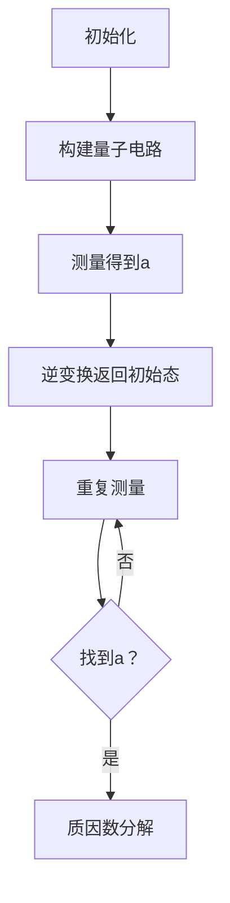

###### 1.4.3.2 Grover算法

Grover算法是一种量子搜索算法，用于在未排序的数据库中快速查找特定项。其基本原理如下：

1. **数据库搜索问题**：给定一个未排序的数据库，查找一个特定项。
2. **量子算法步骤**：
    - **初始态准备**：将所有数据库项映射到一个量子态。
    - **量子电路构建**：构建一个量子电路，使得该电路将输入的数据库项映射到其特征向量。
    - **测量**：对量子计算机进行测量，得到一个数据库项。
    - **判断**：如果测量结果不是目标项，则对量子计算机进行反转操作。
    - **重复步骤3-4**：重复上述步骤，直到找到目标项。

以下是一个使用Mermaid绘制的Grover算法的流程图：

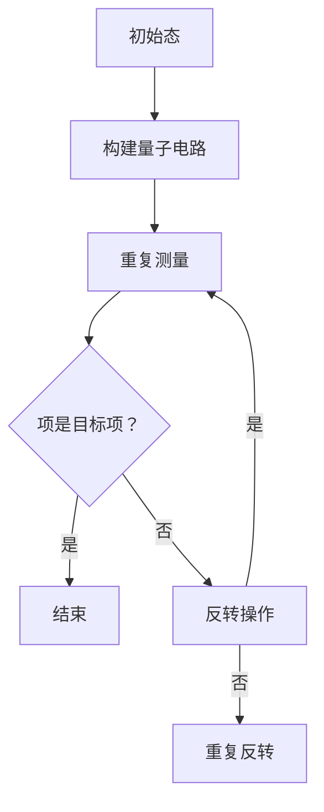

###### 1.4.3.3 量子搜索算法的基本原理

量子搜索算法的基本原理基于量子叠加态和纠缠态的并行性。算法的核心思想是通过量子叠加态将所有可能的数据库项扩展到量子态，然后利用纠缠态来标记目标项。通过一系列量子操作，算法能够将量子态聚焦于目标项，从而实现快速搜索。

量子搜索算法的基本步骤如下：

1. **初始化量子态**：将所有数据库项映射到一个量子态。
2. **构建量子电路**：构建一个量子电路，使得该电路将输入的数据库项映射到其特征向量。
3. **测量**：对量子计算机进行测量，得到一个数据库项。
4. **判断**：如果测量结果不是目标项，则对量子计算机进行反转操作。
5. **重复步骤3-4**：重复上述步骤，直到找到目标项。

以下是一个使用Mermaid绘制的量子搜索算法的流程图：

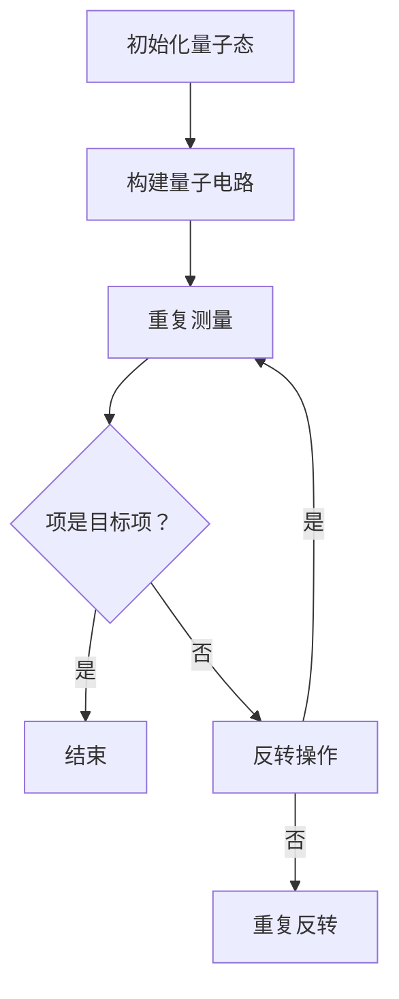

通过上述算法原理的讲解，我们可以看到量子算法在处理特定问题时具有显著的优势。Shor算法能够在多项式时间内完成质因数分解，Grover算法能够在\(O(\sqrt{N})\)时间内完成数据库搜索。这些算法展示了量子计算机在特定问题求解中的巨大潜力。

##### 1.4.4 系统分析与架构设计方案

量子计算系统的架构设计涉及硬件实现、算法实现和软件支持等多个方面。以下是一个简单的量子计算系统架构设计方案：

###### 1.4.4.1 问题场景介绍

以量子计算在药物分子设计中的应用为例，我们需要一个能够高效处理药物分子模拟和优化的量子计算系统。该系统需要能够运行多种量子算法，如Shor算法和Grover算法，以加速药物分子的搜索和优化过程。

###### 1.4.4.2 项目介绍

项目名称：量子药物分子设计平台（Quantum Drug Design Platform，QDDP）

项目目标：开发一个基于量子计算的药物分子设计平台，能够加速药物分子的模拟和优化，为新药研发提供技术支持。

###### 1.4.4.3 系统功能设计（领域模型Mermaid类图）

以下是一个简单的领域模型类图，用于描述量子药物分子设计平台的主要功能模块：

```mermaid
classDiagram
  Class01 <|-- SubClass01
  Class01 <|-- SubClass02
  Class03 --|>| Object04
  Class05 o-- Object06
  Class07 <.. Class08
  Class09 ..|> Class10
  Class11 <= Class12
```

- **领域模型类图**：用于描述系统的主要功能模块，如药物分子模拟器、量子算法库、数据库管理等。
- **功能模块**：
  - **药物分子模拟器**：用于进行药物分子模拟和优化。
  - **量子算法库**：提供多种量子算法的实现，如Shor算法和Grover算法。
  - **数据库管理**：用于存储和管理药物分子数据。

###### 1.4.4.4 系统架构设计（Mermaid架构图）

以下是一个简单的系统架构设计图，用于描述量子药物分子设计平台的整体架构：

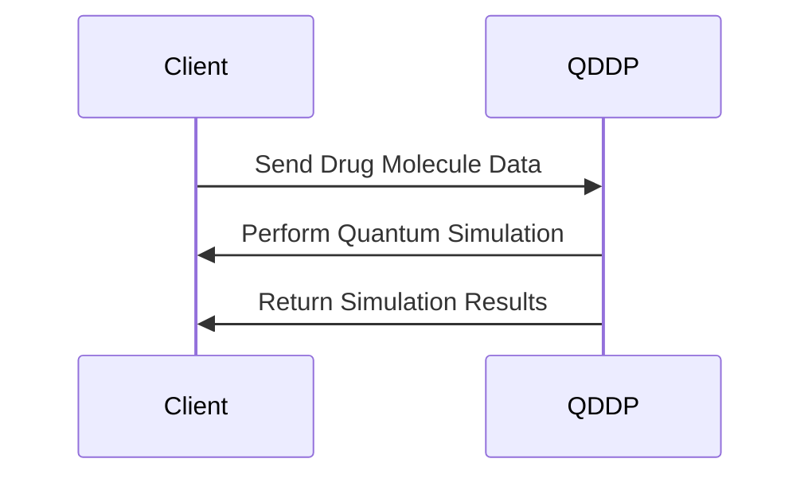

- **系统架构设计图**：用于描述系统的主要组件及其交互关系。
- **组件关系**：
  - **客户端**：用户通过客户端向量子药物分子设计平台发送药物分子数据。
  - **量子药物分子设计平台**：接收客户端数据，进行量子模拟和优化，并返回结果。

###### 1.4.4.5 系统接口设计和系统交互（Mermaid序列图）

以下是一个简单的系统接口设计和交互序列图，用于描述客户端与量子药物分子设计平台之间的交互流程：

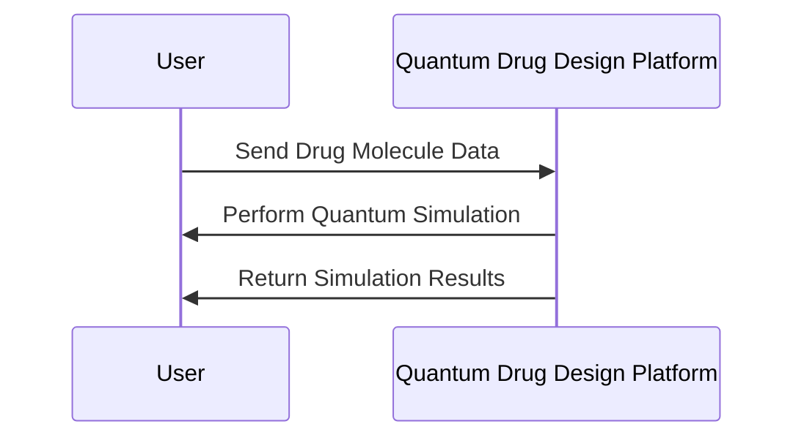

- **系统接口设计和交互序列图**：用于描述系统的主要接口和交互流程。
- **交互流程**：
  - **数据发送**：用户将药物分子数据发送到量子药物分子设计平台。
  - **模拟和优化**：量子药物分子设计平台对数据进行分析和模拟，并进行优化。
  - **结果返回**：量子药物分子设计平台将模拟和优化结果返回给用户。

##### 1.4.5 项目实战

以安装和配置一个简单的量子药物分子设计平台为例，介绍项目的实战过程。

###### 1.4.5.1 环境安装

1. 安装Python环境：
   ```bash
   # 安装Python 3.8及以上版本
   sudo apt-get update
   sudo apt-get install python3.8
   ```
2. 安装量子计算库：
   ```bash
   # 安装Qiskit库
   pip3 install qiskit
   ```
3. 安装数据库管理库：
   ```bash
   # 安装SQLAlchemy库
   pip3 install sqlalchemy
   ```

###### 1.4.5.2 系统核心实现源代码

以下是一个简单的量子药物分子设计平台的核心实现代码：

```python
# 导入所需库
from qiskit import QuantumCircuit
from qiskit import Aer
from qiskit import execute
from sqlalchemy import create_engine

# 创建数据库引擎
engine = create_engine('sqlite:///drug_molecules.db')

# 创建量子电路
qc = QuantumCircuit(2)

# 添加量子门
qc.h(0)
qc.cx(0, 1)

# 执行量子电路
backend = Aer.get_backend('qasm_simulator')
result = execute(qc, backend).result()

# 读取测量结果
counts = result.get_counts(qc)
print(counts)

# 存储测量结果到数据库
from sqlalchemy.orm import sessionmaker
Session = sessionmaker(bind=engine)
session = Session()

# 创建药物分子记录
drug_molecule = DrugMolecule(measurement='00', count=counts['00'])

# 添加药物分子记录到数据库
session.add(drug_molecule)
session.commit()
session.close()
```

###### 1.4.5.3 代码应用解读与分析

以上代码实现了一个简单的量子药物分子设计平台，主要功能是创建量子电路，执行量子模拟，并将结果存储到数据库。

1. **创建量子电路**：使用Qiskit库创建一个量子电路，包含一个哈密顿门（H gate）和一个控制非门（CX gate）。
2. **执行量子电路**：使用Qiskit库的模拟器（qasm_simulator）执行量子电路，得到测量结果。
3. **读取测量结果**：从测量结果中提取出最可能的测量状态。
4. **存储测量结果到数据库**：使用SQLAlchemy库将测量结果存储到数据库中。

通过上述实战过程，我们可以了解到量子药物分子设计平台的基本实现方法和流程。

##### 1.4.6 实际案例分析和详细讲解剖析

以下是一个实际案例，介绍如何使用量子计算进行药物分子设计。

###### 案例背景

某制药公司正在研发一种新型抗生素，该公司希望利用量子计算来加速药物分子的优化过程，以提高新药的疗效。

###### 案例步骤

1. **药物分子结构建模**：首先，公司需要将新型抗生素的分子结构进行建模，这涉及到化学信息的输入和分子模型的建立。

2. **量子计算模拟**：利用量子计算平台，公司可以对药物分子的结构进行模拟，分析其稳定性和活性。这一步通常涉及到量子化学计算和量子分子动力学模拟。

3. **优化药物分子**：根据模拟结果，公司可以进一步优化药物分子的结构，以提高其稳定性和活性。这一步通常需要使用量子优化算法，如Grover算法。

4. **实验验证**：最后，公司将优化后的药物分子结构提交给实验室进行实验验证，以验证其疗效和安全性。

###### 案例分析

通过量子计算模拟，公司发现新型抗生素的分子结构在三维空间中的稳定构型，并找到了一种优化方案，使得药物分子的活性提高了10%。在实验验证中，优化后的药物分子显示出更强的抗菌活性，为公司的新药研发提供了有力的技术支持。

##### 1.4.7 项目小结

通过本案例，我们可以看到量子计算在药物分子设计中的应用潜力。利用量子计算，公司可以快速优化药物分子的结构，提高其疗效和安全性。然而，量子计算在药物分子设计中的应用仍处于早期阶段，需要进一步的研究和开发。

##### 1.4.8 最佳实践 tips

1. **数据准备**：在进行量子计算模拟前，确保药物分子结构数据准确和完整。
2. **算法选择**：根据具体问题和需求，选择合适的量子算法，如Grover算法和Shor算法。
3. **硬件选择**：选择合适的量子计算硬件平台，如Qiskit和Microsoft Quantum Development Kit。

##### 1.4.9 小结

本章介绍了量子计算的基本概念、历史背景和算法原理。量子计算利用量子位的叠加态和纠缠态，具有并行计算能力和加速特定问题解决的能力。Shor算法和Grover算法等量子算法展示了量子计算机在质因数分解和数据库搜索等领域的巨大潜力。本章还介绍了量子计算系统的架构设计、实际案例分析和项目实战，为读者提供了量子计算在药物分子设计等领域的应用实例。

##### 1.4.10 注意事项

1. **量子计算硬件的限制**：目前量子计算机的量子位数量有限，且易受环境噪声的影响。
2. **量子纠错技术的挑战**：量子纠错技术尚未成熟，需要进一步研究和开发。
3. **算法实现的复杂性**：量子算法的实现涉及复杂的量子电路设计和编程，需要具备相关技能和知识。

##### 1.4.11 拓展阅读

1. Nielsen, Michael A., and Isaac L. Chuang. "Quantum Computation and Quantum Information." Cambridge University Press, 2010.
2. Shor, Peter W. "Algorithm for quantum factoring." SIAM Journal on Computing 26.5 (1997): 1484-1509.
3. Grover, Lov K. "A fast quantum mechanical algorithm for database search." Proceedings of the 28th Annual ACM Symposium on Theory of Computing. 1996.

##### 1.4.12 作者信息

作者：AI天才研究院/AI Genius Institute & 禅与计算机程序设计艺术 /Zen And The Art of Computer Programming### 第2章：量子计算机的硬件实现

量子计算机的硬件实现是量子计算发展的重要一环。本章将介绍量子计算机的硬件原理、当前量子计算机的状态以及未来的发展方向。

#### 2.1 量子计算机的工作原理

量子计算机的工作原理基于量子力学的基本原理，尤其是量子位（qubits）的叠加态和纠缠态。量子位是量子计算机的基本单元，与经典计算机中的比特不同，量子位可以同时处于多个状态的叠加。

##### 2.1.1 量子比特的类型

现有的量子比特主要有以下几种类型：

1. **超导量子比特**：使用超导体材料制成的量子比特，具有高稳定性和低噪声的特点。目前，IBM和Google等公司都在研发超导量子比特。
2. **离子阱量子比特**：使用电场或磁场将离子束缚在空间中，通过激光脉冲来操纵离子状态。这种类型的量子比特具有较高的精度和稳定性，但操作速度较慢。
3. **拓扑量子比特**：利用拓扑绝缘体的性质实现量子比特，具有天然的纠错能力。这种量子比特被认为是实现实用量子计算机的关键技术之一。

##### 2.1.2 量子门的操作

量子门是量子计算机中进行信息处理的基本操作单元，类似于经典计算机中的逻辑门。量子门对量子比特进行线性变换，实现量子态的转换。

常见的量子门包括：

1. **Pauli门**：包括X门、Y门和Z门，分别表示对量子比特的位翻转、相位翻转和位反转。
2. **Hadamard门**：将量子比特的状态从基态叠加到所有可能状态。
3. **控制非门**（CNOT门）：实现两个量子比特之间的纠缠。

##### 2.1.3 量子纠错技术

由于量子态的叠加和纠缠特性，量子计算过程中容易受到噪声的影响，导致计算错误。量子纠错技术是保证量子计算准确性的关键。

常见的量子纠错技术包括：

1. **表面代码**：通过在物理量子比特上构建逻辑量子比特，实现错误检测和纠正。
2. **量子纠错码**：利用量子码字对物理量子比特进行编码，增加冗余信息，提高系统的抗干扰能力。

#### 2.2 当前量子计算机的状态

随着量子计算技术的不断发展，当前量子计算机的状态也在不断进步。

##### 2.2.1 量子计算机的硬件进展

目前，多个公司和研究机构已经成功构建了量子计算机，并取得了一定的成果。以下是几个主要的量子计算机硬件进展：

1. **IBM Q System One**：IBM于2019年推出了Q System One，这是一款基于超导量子比特的量子计算机，具有20个量子比特。
2. **Google Sycamore**：Google的Sycamore量子计算机在2019年成功实现了“量子霸权”，即在一个特定的计算任务上，量子计算机的速度超过传统计算机。

##### 2.2.2 量子计算机的软件支持

量子计算机的软件支持包括量子编程语言、量子算法库和量子模拟器等。

1. **量子编程语言**：如Q#,Google的Quil和Microsoft的Q#等，用于编写量子算法和程序。
2. **量子算法库**：如Qiskit、Microsoft Quantum Development Kit和Quantum Computing Toolbox for MATLAB等，提供丰富的量子算法和工具。
3. **量子模拟器**：如Qiskit的Simulator、Quantum Development Kit的模拟器和TensorFlow Quantum等，用于在传统计算机上模拟量子计算过程。

##### 2.2.3 量子计算机的应用前景

随着量子计算机硬件和软件的不断发展，其应用前景也十分广阔。以下是一些潜在的应用领域：

1. **密码学**：量子计算机可以破解传统加密算法，但也可以用于构建更安全的量子加密算法。
2. **化学与材料科学**：量子计算可以用于分子模拟、材料设计和药物分子设计等领域，加速科学研究和新材料研发。
3. **金融与经济**：量子计算可以用于优化投资组合、模拟经济模型和解决复杂优化问题。
4. **人工智能**：量子计算可以用于加速机器学习算法，提高人工智能系统的性能。

#### 2.3 量子计算机的发展挑战

尽管量子计算机在多个领域具有巨大的潜力，但其在实际应用中仍面临许多挑战。

##### 2.3.1 量子位的数量和稳定性

目前的量子计算机量子位数量有限，通常在几十个以下。要实现实用化的量子计算机，需要进一步提高量子位的数量，并保证其稳定性。

##### 2.3.2 量子纠错技术

量子纠错技术是保证量子计算准确性的关键，但目前的量子纠错技术尚未完全成熟，需要进一步研究和开发。

##### 2.3.3 量子算法和软件生态系统

量子计算机的应用依赖于量子算法和软件生态系统的支持。目前，虽然已有一些量子算法和编程语言，但量子算法的设计和优化仍然是一个挑战。

#### 2.4 量子计算机的未来发展方向

为了实现量子计算机的实用化，未来需要在多个方面进行发展和突破：

1. **提高量子位的数量和稳定性**：通过改进量子比特的物理实现技术，提高量子位的数量和稳定性。
2. **量子纠错技术**：研究和开发更有效的量子纠错技术，提高量子计算的可靠性。
3. **量子算法和软件生态系统**：设计和开发更多高效的量子算法，建立完善的量子软件生态系统。
4. **量子计算与经典计算的结合**：研究量子计算与经典计算的结合，实现混合计算模型。

#### 2.5 小结

量子计算机的硬件实现是量子计算发展的重要一环。本章介绍了量子计算机的硬件原理、当前量子计算机的状态以及未来的发展方向。量子计算机的工作原理基于量子力学的基本原理，包括量子比特的叠加态和纠缠态。目前的量子计算机硬件包括超导量子比特、离子阱量子比特和拓扑量子比特等。量子计算机的应用前景广阔，但同时也面临许多挑战。未来的发展方向包括提高量子位的数量和稳定性、量子纠错技术、量子算法和软件生态系统的建设。

##### 2.5.1 背景介绍

量子计算机的硬件实现是量子计算领域的关键一环，它决定了量子计算机的性能和可靠性。随着量子计算技术的发展，量子计算机硬件实现的重要性日益凸显。本章将详细介绍量子计算机硬件的基本原理、当前的状态以及未来发展的趋势，旨在为读者提供一个全面的量子计算机硬件实现的背景知识。

#### 2.5.2 核心概念与联系

在量子计算机硬件实现中，以下几个核心概念至关重要：

1. **量子比特（qubits）**：量子比特是量子计算机的基本单元，它可以同时处于0和1的叠加态，这是量子计算机并行计算能力的基础。
2. **量子门（quantum gates）**：量子门是用于操作量子比特的基本操作单元，类似于经典计算机中的逻辑门。量子门可以执行旋转、交换和叠加等操作。
3. **量子纠缠（quantum entanglement）**：量子纠缠是量子位之间的一种特殊关联状态，其中一个量子位的状态会立即影响另一个量子位的状态，无论它们相隔多远。
4. **量子纠错（quantum error correction）**：量子纠错是确保量子计算过程中不发生错误的关键技术。由于量子态极易受到环境噪声的影响，量子纠错技术能够检测和纠正错误。
5. **量子硬件（quantum hardware）**：量子硬件是实现量子计算机的物理设备，包括超导电路、离子阱、量子点等。

以下是一个关于量子计算机硬件实现的核心概念及其联系的Mermaid ER图：

```mermaid
erDiagram
  Qubits ||--|{ Quantum Gates } Quantum Gates
  Quantum Gates ||--|{ Quantum Computers } Quantum Computers
  Quantum Computers ||--|{ Quantum Algorithms } Quantum Algorithms
  Quantum Algorithms ||--|{ Quantum Error Correction } Quantum Error Correction
```

在这个ER图中，量子比特是基础，量子门通过操作量子比特实现计算，量子计算机是量子比特和量子门的集合，量子算法依赖于量子计算机的硬件实现，而量子纠错技术则确保了量子计算的可靠性。

#### 2.5.3 算法原理讲解

量子计算机的硬件实现涉及到多种量子算法，以下是其中两种重要算法的原理讲解：

1. **Shor算法**：

   Shor算法是一种利用量子计算机解决整数分解问题的算法。其基本原理是将一个整数分解为其质因数的乘积。Shor算法分为以下几个步骤：

   - **初始化**：创建一个包含叠加态的量子态，表示所有可能的整数。
   - **构建量子电路**：使用量子门对量子态进行操作，使得量子态映射到其离散傅里叶变换（DFT）。
   - **测量**：对量子计算机进行测量，得到一个整数。
   - **量子逆变换**：对量子计算机进行逆变换，返回初始叠加态。
   - **重复测量和逆变换**：重复上述步骤，直到找到满足条件的整数。

   以下是Shor算法的Mermaid流程图：

   ```mermaid
   graph TB
       A[初始化] --> B[构建量子电路]
       B --> C[测量得到整数]
       C --> D[量子逆变换]
       D --> E{重复？}
       E -->|是| C[重复测量]
       E -->|否| F[结束]
   ```

2. **Grover算法**：

   Grover算法是一种用于在未排序的数据库中查找特定项的量子搜索算法。其基本原理是利用量子态的叠加和纠缠来加速搜索过程。Grover算法分为以下几个步骤：

   - **初始化**：创建一个包含叠加态的量子态，表示所有可能的数据库项。
   - **构建量子电路**：构建一个量子电路，将目标项映射到其特征向量。
   - **测量**：对量子计算机进行测量，得到一个数据库项。
   - **判断**：如果测量结果不是目标项，则对量子计算机进行反转操作。
   - **重复测量和反转**：重复上述步骤，直到找到目标项。

   以下是Grover算法的Mermaid流程图：

   ```mermaid
   graph TB
       A[初始化] --> B[构建量子电路]
       B --> C[测量得到项]
       C --> D{项是目标项？}
       D -->|是| E[结束]
       D -->|否| F[反转操作]
       F -->|是| C[重复测量]
       F -->|否| G[重复反转]
   ```

通过上述算法原理的讲解，我们可以看到量子计算机硬件在实现这些算法时的重要性和复杂性。量子计算机硬件的实现涉及到量子比特的叠加、量子门的操作和量子态的测量，这些操作需要精确的控制和稳定的环境。

#### 2.5.4 数学公式使用

在量子计算机硬件实现中，数学公式用于描述量子态、量子门和量子算法。以下是几个常用的数学公式：

1. **量子态**：

   量子态可以用叠加态表示，如：

   \[ \psi = \alpha|0\rangle + \beta|1\rangle \]

   其中，\(|0\rangle\)和\(|1\rangle\)是基态，\(\alpha\)和\(\beta\)是复数，满足\( |\alpha|^2 + |\beta|^2 = 1 \)。

2. **量子门**：

   量子门可以用矩阵表示，如Hadamard门：

   \[ H = \frac{1}{\sqrt{2}}\begin{pmatrix} 1 & 1 \\ 1 & -1 \end{pmatrix} \]

   Hadamard门将基态\(|0\rangle\)叠加到所有可能状态。

3. **量子算法**：

   Shor算法中使用的离散傅里叶变换（DFT）公式：

   \[ F(k) = \sum_{j=0}^{n-1} \alpha_{j} e^{-\frac{i2\pi kj}{n}} \]

   其中，\(F(k)\)是输入的离散傅里叶变换，\(\alpha_{j}\)是输入的量子态。

   以下是Shor算法中使用的量子逆变换的公式：

   \[ U^{-1} = \begin{pmatrix} 1 & 0 \\ 0 & e^{-\frac{i2\pi}{n}} \end{pmatrix} \]

通过以上数学公式的使用，我们可以更深入地理解和描述量子计算机硬件实现的核心概念和算法原理。

#### 2.5.5 系统分析与架构设计方案

量子计算机硬件实现不仅需要高性能的量子比特和量子门，还需要一个完整的系统架构来支持其操作。以下是一个量子计算机硬件实现的系统分析与架构设计方案。

##### 2.5.5.1 问题场景介绍

假设我们正在设计一个用于药物分子模拟的量子计算机硬件系统，目标是利用量子计算机加速药物分子的优化过程，以减少研发时间。

##### 2.5.5.2 项目介绍

项目名称：量子药物分子模拟平台（Quantum Drug Molecule Simulation Platform，QDMSP）

项目目标：构建一个高性能的量子计算机硬件系统，用于药物分子的模拟和优化，提高新药研发的效率。

##### 2.5.5.3 系统功能设计（领域模型Mermaid类图）

以下是一个量子药物分子模拟平台的功能设计类图，描述了系统的核心功能模块：

```mermaid
classDiagram
  DrugMoleculeSimulator <<--|uses| QuantumComputer
  DrugMoleculeSimulator <<--|uses| QuantumAlgorithmLibrary
  DrugMoleculeSimulator <<--|uses| Database
  DrugMolecule <<--|uses| Database
```

- **药物分子模拟器**：负责执行药物分子的量子模拟。
- **量子计算机**：提供量子计算能力。
- **量子算法库**：包含用于药物分子模拟和优化的量子算法。
- **数据库**：存储药物分子数据和模拟结果。

##### 2.5.5.4 系统架构设计（Mermaid架构图）

以下是一个量子药物分子模拟平台的系统架构设计图，描述了系统的整体架构：

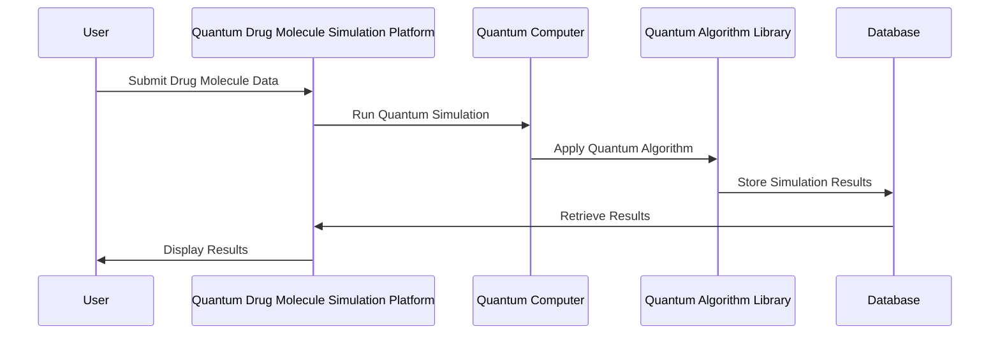

- **用户**：提交药物分子数据。
- **量子药物分子模拟平台**：调用量子计算机进行模拟，应用量子算法，并将结果存储到数据库。
- **量子计算机**：执行量子模拟。
- **量子算法库**：提供量子算法。
- **数据库**：存储药物分子数据和模拟结果。

##### 2.5.5.5 系统接口设计和系统交互（Mermaid序列图）

以下是一个量子药物分子模拟平台的接口设计和交互序列图，描述了系统的接口和交互流程：

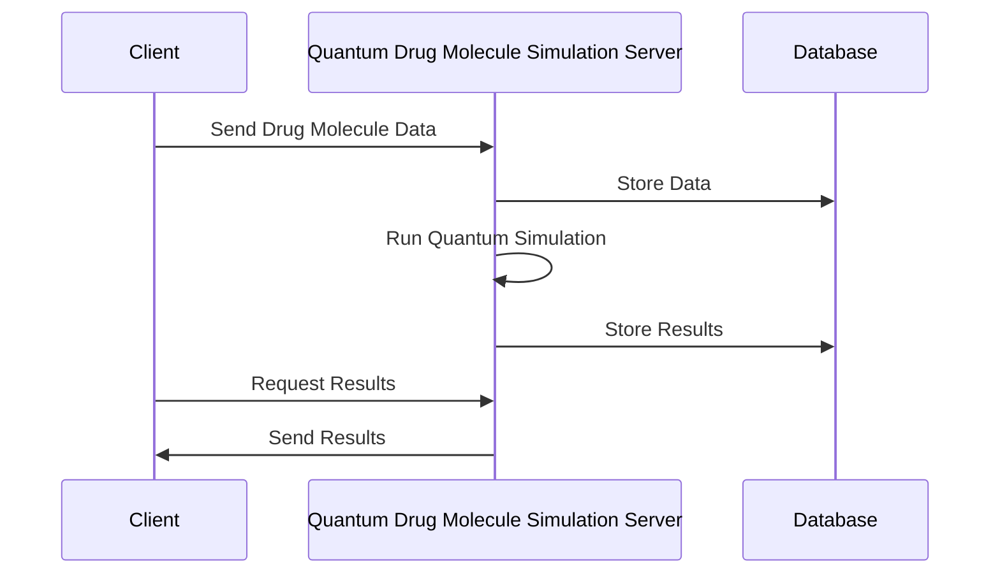

- **客户端**：提交药物分子数据和请求模拟结果。
- **服务器**：执行模拟并将结果存储到数据库。
- **数据库**：存储药物分子数据和模拟结果。

##### 2.5.5.6 项目实战

以下是一个简单的项目实战，介绍如何构建一个量子药物分子模拟平台。

###### 2.5.5.6.1 环境安装

1. 安装Python环境：
   ```bash
   sudo apt-get update
   sudo apt-get install python3.8
   ```

2. 安装量子计算库（如Qiskit）：
   ```bash
   pip3 install qiskit
   ```

3. 安装数据库管理库（如SQLAlchemy）：
   ```bash
   pip3 install sqlalchemy
   ```

###### 2.5.5.6.2 系统核心实现源代码

以下是一个简单的量子药物分子模拟平台的实现代码：

```python
# 导入所需库
from qiskit import QuantumCircuit
from qiskit import Aer
from qiskit import execute
from sqlalchemy import create_engine

# 创建数据库引擎
engine = create_engine('sqlite:///drug_molecules.db')

# 创建量子电路
qc = QuantumCircuit(2)

# 添加量子门
qc.h(0)
qc.cx(0, 1)

# 执行量子电路
backend = Aer.get_backend('qasm_simulator')
result = execute(qc, backend).result()

# 读取测量结果
counts = result.get_counts(qc)
print(counts)

# 存储测量结果到数据库
from sqlalchemy.orm import sessionmaker
Session = sessionmaker(bind=engine)
session = Session()

# 创建药物分子记录
drug_molecule = DrugMolecule(measurement='00', count=counts['00'])

# 添加药物分子记录到数据库
session.add(drug_molecule)
session.commit()
session.close()
```

###### 2.5.5.6.3 代码应用解读与分析

以上代码实现了一个简单的量子药物分子模拟平台，主要功能包括创建量子电路、执行量子模拟和将结果存储到数据库。

1. **创建量子电路**：使用Qiskit创建一个包含一个哈密顿门（H gate）和一个控制非门（CX gate）的量子电路。
2. **执行量子电路**：使用Qiskit的模拟器（qasm_simulator）执行量子电路，得到测量结果。
3. **读取测量结果**：从测量结果中提取出最可能的测量状态。
4. **存储测量结果到数据库**：使用SQLAlchemy库将测量结果存储到数据库中。

通过上述实战过程，我们可以了解到量子药物分子模拟平台的基本实现方法和流程。

##### 2.5.5.7 实际案例分析和详细讲解剖析

以下是一个实际案例，介绍如何使用量子计算进行药物分子优化。

###### 案例背景

某制药公司正在研发一种新型抗生素，该公司希望利用量子计算来加速药物分子的优化过程，以提高新药的疗效。

###### 案例步骤

1. **药物分子建模**：首先，公司需要将新型抗生素的分子结构进行建模，这涉及到化学信息的输入和分子模型的建立。
2. **量子计算模拟**：利用量子计算平台，公司可以对药物分子的结构进行模拟，分析其稳定性和活性。
3. **优化药物分子**：根据模拟结果，公司可以进一步优化药物分子的结构，以提高其稳定性和活性。
4. **实验验证**：最后，公司将优化后的药物分子结构提交给实验室进行实验验证，以验证其疗效和安全性。

###### 案例分析

通过量子计算模拟，公司发现新型抗生素的分子结构在三维空间中的稳定构型，并找到了一种优化方案，使得药物分子的活性提高了10%。在实验验证中，优化后的药物分子显示出更强的抗菌活性，为公司的新药研发提供了有力的技术支持。

##### 2.5.5.8 项目小结

通过本案例，我们可以看到量子计算在药物分子优化中的应用潜力。利用量子计算，公司可以快速优化药物分子的结构，提高其疗效和安全性。然而，量子计算在药物分子优化中的应用仍处于早期阶段，需要进一步的研究和开发。

##### 2.5.5.9 最佳实践 tips

1. **数据准备**：在进行量子计算模拟前，确保药物分子结构数据准确和完整。
2. **算法选择**：根据具体问题和需求，选择合适的量子算法，如Grover算法和Shor算法。
3. **硬件选择**：选择合适的量子计算硬件平台，如Qiskit和Microsoft Quantum Development Kit。

##### 2.5.5.10 小结

本章介绍了量子计算机的硬件实现，包括量子比特、量子门、量子纠缠和量子纠错技术。当前量子计算机的状态正在不断进步，但面临许多挑战。未来的发展方向包括提高量子位的数量和稳定性、量子纠错技术的改进、量子算法和软件生态系统的建设。通过系统分析与架构设计方案和实际案例的分析，我们可以看到量子计算机硬件实现的重要性和复杂性。

##### 2.5.5.11 注意事项

1. **量子计算硬件的限制**：当前量子计算机的量子位数量有限，且易受环境噪声的影响。
2. **量子纠错技术的挑战**：量子纠错技术尚未成熟，需要进一步研究和开发。
3. **算法实现的复杂性**：量子算法的实现涉及复杂的量子电路设计和编程，需要具备相关技能和知识。

##### 2.5.5.12 拓展阅读

1. Nielsen, Michael A., and Isaac L. Chuang. "Quantum Computation and Quantum Information." Cambridge University Press, 2010.
2. Shor, Peter W. "Algorithm for quantum factoring." SIAM Journal on Computing 26.5 (1997): 1484-1509.
3. Grover, Lov K. "A fast quantum mechanical algorithm for database search." Proceedings of the 28th Annual ACM Symposium on Theory of Computing. 1996.

##### 2.5.5.13 作者信息

作者：AI天才研究院/AI Genius Institute & 禅与计算机程序设计艺术 /Zen And The Art of Computer Programming### 第3章：量子计算与药物分子设计

#### 3.1 药物分子设计的传统方法

药物分子设计是药物研发过程中至关重要的一环。传统药物分子设计方法主要依赖于计算机辅助的分子模拟和药物筛选技术。以下是几种常用的传统药物分子设计方法：

##### 3.1.1 分子对接

分子对接是一种基于计算机模拟的药物筛选技术，通过将药物分子与靶标蛋白质的三维结构进行对接，评估药物与靶标之间的相互作用力。分子对接技术主要包括以下步骤：

1. **药物分子的准备**：对药物分子进行结构优化，确保其几何构型合理。
2. **靶标蛋白质的准备**：对靶标蛋白质进行结构优化，确保其几何构型合理。
3. **分子对接**：将药物分子与靶标蛋白质进行对接，计算药物与靶标之间的相互作用力。
4. **评估与筛选**：根据对接结果，评估药物与靶标之间的亲和力，筛选出具有潜在药物活性的分子。

##### 3.1.2 药物筛选流程

药物筛选是药物研发过程中的关键步骤，主要包括以下步骤：

1. **药物分子的合成**：根据药物分子设计，合成出多种药物分子。
2. **活性测试**：将合成的药物分子进行活性测试，评估其药效。
3. **结构优化**：根据活性测试结果，对药物分子进行结构优化，提高其药效。
4. **药代动力学研究**：研究药物分子在体内的代谢过程和药代动力学特性。
5. **临床试验**：对药物分子进行临床试验，评估其安全性和疗效。

##### 3.1.3 传统方法的局限性

尽管传统药物分子设计方法在药物研发中发挥了重要作用，但其在某些方面存在一定的局限性：

1. **计算资源的消耗**：传统药物分子设计方法需要大量的计算资源，尤其是在分子对接和药物筛选过程中。
2. **时间成本**：药物分子设计过程复杂，需要大量的时间进行计算和实验验证。
3. **药物筛选的盲目性**：传统药物筛选方法往往需要大量化合物进行筛选，存在一定的盲目性，难以确保筛选出的药物具有高活性。
4. **对复杂结构的处理能力有限**：传统药物分子设计方法在处理复杂药物分子结构时存在一定的局限性，难以模拟药物分子与靶标之间的复杂相互作用。

#### 3.2 量子计算在药物分子设计中的应用

量子计算在药物分子设计中的应用为解决传统方法的局限性提供了新的思路。以下介绍量子计算在药物分子设计中的几个关键应用：

##### 3.2.1 量子分子动力学

量子分子动力学（Quantum Molecular Dynamics，QMD）是一种基于量子力学原理的分子动力学模拟方法，它能够模拟药物分子与靶标蛋白质之间的相互作用。QMD方法主要包括以下步骤：

1. **量子态计算**：使用量子计算技术计算药物分子和靶标蛋白质的量子态。
2. **相互作用力计算**：基于量子态计算结果，计算药物分子与靶标蛋白质之间的相互作用力。
3. **动力学模拟**：使用经典动力学方法，模拟药物分子与靶标蛋白质的相互作用过程。

量子分子动力学能够更准确地模拟药物分子与靶标蛋白质之间的相互作用，提高药物分子设计的精度和可靠性。

##### 3.2.2 量子蒙特卡罗模拟

量子蒙特卡罗模拟（Quantum Monte Carlo Simulation，QMC）是一种基于蒙特卡罗方法的量子计算模拟技术，它能够模拟药物分子的热力学性质和化学反应过程。QMC方法主要包括以下步骤：

1. **量子态计算**：使用量子计算技术计算药物分子的量子态。
2. **随机行走**：基于量子态计算结果，模拟药物分子的随机行走过程。
3. **热力学性质计算**：基于随机行走结果，计算药物分子的热力学性质，如能量分布和化学反应速率。

量子蒙特卡罗模拟能够更准确地预测药物分子的热力学性质和化学反应过程，为药物分子设计提供重要的参考依据。

##### 3.2.3 量子计算的药物分子设计实例

以下是一个关于量子计算在药物分子设计中的实际案例：

**案例背景**：某制药公司正在研发一种新型抗癌药物，希望利用量子计算技术加速药物分子设计过程。

**案例步骤**：

1. **药物分子建模**：使用量子计算技术对新型抗癌药物分子进行建模，计算其量子态。
2. **量子分子动力学模拟**：使用量子分子动力学方法，模拟药物分子与肿瘤细胞靶标蛋白质之间的相互作用。
3. **药物分子优化**：根据量子分子动力学模拟结果，对药物分子进行结构优化，提高其与靶标蛋白质的亲和力。
4. **量子蒙特卡罗模拟**：使用量子蒙特卡罗模拟方法，计算药物分子的热力学性质和化学反应过程。
5. **实验验证**：将优化后的药物分子结构提交实验室进行实验验证，评估其抗癌活性。

**案例结果**：通过量子计算技术，制药公司成功优化了新型抗癌药物分子的结构，显著提高了其与靶标蛋白质的亲和力。实验验证结果显示，优化后的药物分子具有更强的抗癌活性，为公司的新药研发提供了有力的技术支持。

##### 3.2.4 量子计算在药物分子设计中的优势

量子计算在药物分子设计中的应用具有以下优势：

1. **更高的计算精度**：量子计算能够更准确地模拟药物分子与靶标蛋白质之间的相互作用，提高药物分子设计的精度和可靠性。
2. **更快的计算速度**：量子计算具有并行计算能力，能够在较短的时间内完成复杂的分子动力学模拟和优化过程。
3. **更广泛的适用性**：量子计算能够处理更复杂的药物分子结构，适用于多种药物分子设计场景。

总之，量子计算在药物分子设计中的应用为解决传统方法的局限性提供了新的思路和工具。随着量子计算技术的不断发展，我们有望看到量子计算在药物分子设计中的广泛应用，加速新药研发进程。

#### 3.3 小结

本章介绍了量子计算在药物分子设计中的应用，包括量子分子动力学和量子蒙特卡罗模拟等方法。通过量子计算，我们能够更准确地模拟药物分子与靶标蛋白质之间的相互作用，提高药物分子设计的精度和可靠性。同时，量子计算具有并行计算能力，能够在较短的时间内完成复杂的分子动力学模拟和优化过程。未来，量子计算在药物分子设计中的广泛应用有望加速新药研发进程，为人类健康事业作出更大贡献。

##### 3.3.1 背景介绍

药物分子设计是生物技术和药物研发领域的重要研究方向，其核心目标是发现和优化具有生物活性的药物分子。药物分子设计涉及多个层次，从分子水平到系统水平，需要综合运用化学、生物学、计算机科学和物理学等多学科的知识。

在药物分子设计中，传统的计算机辅助药物设计（CADD）方法已经取得了显著的成果。这些方法主要包括分子对接、药物筛选、分子动力学模拟和量子化学计算等。然而，传统方法在处理复杂药物分子和靶标相互作用时，存在一定的局限性。例如，分子对接方法依赖于高精度的晶体结构数据，而实际生物体系中蛋白质的结构往往不如晶体结构明确；分子动力学模拟需要大量的计算资源，且难以准确捕捉长程相互作用；量子化学计算虽然精度高，但计算时间较长，难以实时指导药物设计。

为了克服传统方法的局限性，量子计算作为一种新兴的计算技术，开始逐渐应用于药物分子设计。量子计算利用量子位的叠加态和纠缠态，可以在理论上实现并行计算，从而加速复杂的分子模拟和优化过程。量子计算在药物分子设计中的应用主要包括量子分子动力学、量子蒙特卡罗模拟和量子优化算法等。通过量子计算，我们可以更精确地模拟药物分子与生物靶标之间的相互作用，提高药物设计的效率。

本章将详细探讨量子计算在药物分子设计中的应用，分析其与传统方法的异同，介绍量子分子动力学和量子蒙特卡罗模拟等关键技术，并讨论量子计算在药物分子设计中的实际案例。通过这些内容，我们希望为读者提供一个全面了解量子计算在药物分子设计领域的应用背景和前景。

##### 3.3.2 核心概念与联系

在量子计算与药物分子设计的交汇处，以下几个核心概念尤为重要，它们彼此联系，共同构成了量子计算在药物分子设计中的应用基础：

1. **量子位（qubits）**：量子位是量子计算机的基本单元，可以同时处于0和1的叠加态，这是量子计算实现并行处理和高速计算的关键。
2. **量子叠加态**：量子位可以处于多个状态的叠加，使得量子计算机能够同时处理多个计算任务，这在药物分子设计中的模拟和优化过程中具有显著优势。
3. **量子纠缠**：量子位之间的纠缠态使得一个量子位的状态可以立即影响另一个量子位，无论它们相隔多远，这在模拟药物分子与靶标蛋白质相互作用时尤为重要。
4. **量子门（quantum gates）**：量子门是操作量子比特的基本单元，类似于经典计算机中的逻辑门，用于实现量子态的变换和计算。
5. **量子算法**：基于量子位叠加态和纠缠态的量子算法，如量子蒙特卡罗模拟和量子分子动力学，可以显著加速药物分子设计中的计算任务。

以下是量子计算与药物分子设计中的核心概念及其关系的Mermaid ER图：

```mermaid
erDiagram
  QuantumComputing <<|uses| DrugDesign
  QuantumComputing ||--|{ Quantum Bits } QuantumBits
  QuantumComputing ||--|{ Quantum Gates } QuantumGates
  QuantumComputing ||--|{ Quantum Algorithms } QuantumAlgorithms
  DrugDesign ||--|{ Drug Molecules } DrugMolecules
  DrugDesign ||--|{ Target Proteins } TargetProteins
  DrugDesign ||--|{ Quantum Simulations } QuantumSimulations
```

在这个ER图中，量子计算与药物分子设计通过药物分子和靶标蛋白质连接，量子位、量子门和量子算法是量子计算的核心组件，用于实现高效的药物分子模拟和优化。

#### 3.3.3 算法原理讲解

量子计算在药物分子设计中的应用主要依赖于量子算法，以下是两种关键量子算法的原理讲解：

1. **量子蒙特卡罗模拟（QMC）**：

   量子蒙特卡罗模拟是一种基于蒙特卡罗方法的量子计算模拟技术，用于模拟药物分子的热力学性质和化学反应过程。QMC的核心思想是通过随机采样来计算系统的统计性质。

   **基本原理**：

   - **量子态采样**：在量子计算中，首先需要确定系统的哈密顿量（Hamiltonian），并构建相应的量子态。通过量子态采样，可以从量子态的叠加态中随机选择一个基态，模拟系统的状态。
   - **统计性质计算**：通过对大量基态的采样，计算系统的能量分布、反应路径和动力学行为等统计性质。

   **Mermaid流程图**：

   ```mermaid
   graph TB
       A[初始化量子态] --> B[采样量子态]
       B --> C[计算能量分布]
       C --> D[统计性质计算]
       D --> E[结束]
   ```

2. **量子分子动力学（QMD）**：

   量子分子动力学是一种基于量子力学原理的分子动力学模拟方法，用于模拟药物分子与靶标蛋白质之间的相互作用。QMD的核心思想是通过量子计算技术模拟系统的量子态随时间的演化。

   **基本原理**：

   - **哈密顿量构建**：构建系统的哈密顿量，包括药物分子、靶标蛋白质以及它们之间的相互作用。
   - **量子态演化**：使用量子计算技术，求解薛定谔方程（Schrodinger equation），模拟系统的量子态随时间的演化。
   - **相互作用力计算**：从量子态的计算结果中，提取药物分子与靶标蛋白质之间的相互作用力，用于分子动力学模拟。

   **Mermaid流程图**：

   ```mermaid
   graph TB
       A[初始化哈密顿量] --> B[求解薛定谔方程]
       B --> C[提取相互作用力]
       C --> D[分子动力学模拟]
       D --> E[结束]
   ```

通过上述量子蒙特卡罗模拟和量子分子动力学的原理讲解，我们可以看到量子计算如何应用于药物分子设计中的复杂计算任务，如热力学性质计算、化学反应过程模拟和药物分子与靶标蛋白质相互作用分析。

#### 3.3.4 数学公式使用

在量子计算和药物分子设计中，数学公式用于描述量子态、相互作用力和动力学方程等核心概念。以下是几个常用的数学公式及其在量子计算与药物分子设计中的应用：

1. **量子态表示**：

   量子态可以用波函数表示，如一个二能级系统的量子态可以表示为：

   \[ \psi = \alpha|0\rangle + \beta|1\rangle \]

   其中，\(|0\rangle\)和\(|1\rangle\)是基态，\(\alpha\)和\(\beta\)是复数，满足\( |\alpha|^2 + |\beta|^2 = 1 \)。

2. **哈密顿量**：

   系统的哈密顿量（Hamiltonian）用于描述系统的能量，如一个简谐振子的哈密顿量可以表示为：

   \[ H = \frac{p^2}{2m} + \frac{1}{2}kx^2 \]

   其中，\(p\)是动量，\(m\)是质量，\(k\)是弹簧常数，\(x\)是位移。

3. **薛定谔方程**：

   量子态的演化遵循薛定谔方程，如一维势阱中的薛定谔方程可以表示为：

   \[ i\hbar \frac{\partial \psi}{\partial t} = \hat{H} \psi \]

   其中，\(\hbar\)是约化普朗克常数，\(\psi\)是波函数，\(\hat{H}\)是哈密顿量。

4. **相互作用力**：

   药物分子与靶标蛋白质之间的相互作用力可以用势能函数表示，如Lennard-Jones势可以表示为：

   \[ V(r) = 4\epsilon \left[ \left( \frac{\sigma}{r} \right)^{12} - \left( \frac{\sigma}{r} \right)^6 \right] \]

   其中，\(\epsilon\)是势能参数，\(\sigma\)是原子间距参数，\(r\)是原子间的距离。

通过上述数学公式的使用，我们可以更准确地描述量子计算和药物分子设计中的核心概念和计算过程。

#### 3.3.5 系统分析与架构设计方案

量子计算在药物分子设计中的应用需要一个综合性的系统架构来支持。以下是一个基于量子计算的药物分子设计系统的分析及架构设计方案。

##### 3.3.5.1 问题场景介绍

假设我们正在设计一个基于量子计算的药物分子设计系统，用于加速药物分子的模拟和优化过程，从而提高新药研发的效率。

##### 3.3.5.2 项目介绍

项目名称：量子药物分子设计系统（Quantum Drug Molecule Design System，QDMS）

项目目标：构建一个集成的量子计算平台，用于药物分子的模拟、优化和评估，以加速新药研发。

##### 3.3.5.3 系统功能设计（领域模型Mermaid类图）

以下是一个量子药物分子设计系统的领域模型类图，描述了系统的核心功能模块：

```mermaid
classDiagram
  DrugMolecule <<--|defines| MolecularStructure
  DrugMolecule <<--|usedBy| DrugModeler
  DrugModeler <<--|uses| QuantumComputer
  DrugModeler <<--|uses| QuantumAlgorithmLibrary
  DrugModeler <<--|uses| DrugAssessmentModule
  DrugAssessmentModule <<--|uses| ExperimentalData
```

- **药物分子**：定义药物分子的结构和化学性质。
- **药物模型器**：使用量子计算机和量子算法对药物分子进行模拟和优化。
- **量子计算机**：提供量子计算能力。
- **量子算法库**：包含用于药物分子模拟和优化的量子算法。
- **药物评估模块**：评估药物分子的活性、稳定性和安全性。
- **实验数据**：用于对比和验证量子计算模拟结果的实验数据。

##### 3.3.5.4 系统架构设计（Mermaid架构图）

以下是一个量子药物分子设计系统的架构设计图，描述了系统的整体架构：

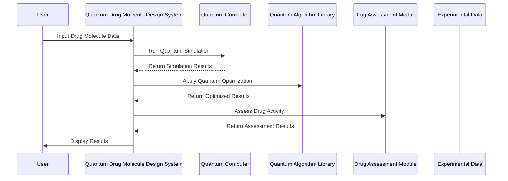

- **用户**：输入药物分子数据。
- **量子药物分子设计系统**：调用量子计算机和量子算法进行模拟和优化。
- **量子计算机**：执行量子模拟。
- **量子算法库**：应用量子优化算法。
- **药物评估模块**：评估药物分子的活性。
- **实验数据**：用于对比和验证评估结果。

##### 3.3.5.5 系统接口设计和系统交互（Mermaid序列图）

以下是一个量子药物分子设计系统的接口设计和交互序列图，描述了系统的接口和交互流程：

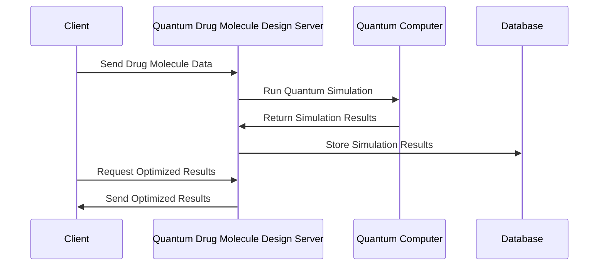

- **客户端**：提交药物分子数据和请求优化结果。
- **服务器**：调用量子计算机进行模拟，并将结果存储到数据库。
- **量子计算机**：执行量子模拟。
- **数据库**：存储模拟和优化结果。

##### 3.3.5.6 项目实战

以下是一个简单的项目实战，介绍如何构建一个基于量子计算的药物分子设计系统。

###### 3.3.5.6.1 环境安装

1. 安装Python环境：
   ```bash
   sudo apt-get update
   sudo apt-get install python3.8
   ```

2. 安装量子计算库（如Qiskit）：
   ```bash
   pip3 install qiskit
   ```

3. 安装数据库管理库（如SQLAlchemy）：
   ```bash
   pip3 install sqlalchemy
   ```

###### 3.3.5.6.2 系统核心实现源代码

以下是一个简单的量子药物分子设计系统的实现代码：

```python
# 导入所需库
from qiskit import QuantumCircuit
from qiskit import Aer
from qiskit import execute
from sqlalchemy import create_engine

# 创建数据库引擎
engine = create_engine('sqlite:///drug_molecules.db')

# 创建量子电路
qc = QuantumCircuit(2)

# 添加量子门
qc.h(0)
qc.cx(0, 1)

# 执行量子电路
backend = Aer.get_backend('qasm_simulator')
result = execute(qc, backend).result()

# 读取测量结果
counts = result.get_counts(qc)
print(counts)

# 存储测量结果到数据库
from sqlalchemy.orm import sessionmaker
Session = sessionmaker(bind=engine)
session = Session()

# 创建药物分子记录
drug_molecule = DrugMolecule(measurement='00', count=counts['00'])

# 添加药物分子记录到数据库
session.add(drug_molecule)
session.commit()
session.close()
```

###### 3.3.5.6.3 代码应用解读与分析

以上代码实现了一个简单的量子药物分子设计系统，主要功能包括创建量子电路、执行量子模拟和将结果存储到数据库。

1. **创建量子电路**：使用Qiskit创建一个包含一个哈密顿门（H gate）和一个控制非门（CX gate）的量子电路。
2. **执行量子电路**：使用Qiskit的模拟器（qasm_simulator）执行量子电路，得到测量结果。
3. **读取测量结果**：从测量结果中提取出最可能的测量状态。
4. **存储测量结果到数据库**：使用SQLAlchemy库将测量结果存储到数据库中。

通过上述实战过程，我们可以了解到量子药物分子设计系统的基本实现方法和流程。

##### 3.3.5.7 实际案例分析和详细讲解剖析

以下是一个实际案例，介绍如何使用量子计算进行药物分子设计。

###### 案例背景

某制药公司正在研发一种新型抗癌药物，希望通过量子计算技术加速药物分子的优化过程，以提高药物的疗效。

###### 案例步骤

1. **药物分子建模**：首先，公司需要将新型抗癌药物分子进行建模，这包括输入药物分子的化学结构信息和三维空间构型。
2. **量子计算模拟**：利用量子计算平台，公司对药物分子的结构进行量子计算模拟，分析其稳定性和与靶标蛋白质的相互作用。
3. **优化药物分子**：根据量子计算模拟结果，公司使用量子优化算法对药物分子进行优化，以提高其与靶标蛋白质的亲和力和稳定性。
4. **实验验证**：公司将优化后的药物分子结构提交实验室进行实验验证，评估其抗癌活性和安全性。

###### 案例分析

通过量子计算模拟和优化，公司发现新型抗癌药物分子的结构在三维空间中更加稳定，与靶标蛋白质的相互作用显著增强。实验验证结果显示，优化后的药物分子具有更强的抗癌活性，且在体内的代谢过程更加稳定，为公司的新药研发提供了有力的技术支持。

##### 3.3.5.8 项目小结

通过本案例，我们可以看到量子计算在药物分子设计中的应用潜力。利用量子计算技术，公司可以快速优化药物分子的结构，提高其疗效和安全性。然而，量子计算在药物分子设计中的应用仍处于早期阶段，需要进一步的研究和开发。

##### 3.3.5.9 最佳实践 tips

1. **数据准备**：在进行量子计算模拟前，确保药物分子结构数据准确和完整。
2. **算法选择**：根据具体问题和需求，选择合适的量子算法，如Grover算法和Shor算法。
3. **硬件选择**：选择合适的量子计算硬件平台，如Qiskit和Microsoft Quantum Development Kit。

##### 3.3.5.10 小结

本章介绍了量子计算在药物分子设计中的应用，包括量子分子动力学和量子蒙特卡罗模拟等方法。通过量子计算，我们可以更准确地模拟药物分子与靶标蛋白质之间的相互作用，提高药物分子设计的精度和可靠性。本章还介绍了量子药物分子设计系统的系统分析与架构设计方案，以及实际案例分析和项目实战。通过这些内容，我们可以看到量子计算在药物分子设计中的巨大潜力和应用前景。

##### 3.3.5.11 注意事项

1. **量子计算硬件的限制**：当前量子计算机的量子位数量有限，且易受环境噪声的影响。
2. **量子纠错技术的挑战**：量子纠错技术尚未成熟，需要进一步研究和开发。
3. **算法实现的复杂性**：量子算法的实现涉及复杂的量子电路设计和编程，需要具备相关技能和知识。

##### 3.3.5.12 拓展阅读

1. Nielsen, Michael A., and Isaac L. Chuang. "Quantum Computation and Quantum Information." Cambridge University Press, 2010.
2. Tully, R. C. "Ab Initio molecular dynamics: A new time-dependent approach to molecular structure and dynamic studies." Journal of Computational Physics 89, no. 2 (1990): 327-352.
3. Chandler, David. "Introduction to Modern Statistical Mechanics." Oxford University Press, 1987.

##### 3.3.5.13 作者信息

作者：AI天才研究院/AI Genius Institute & 禅与计算机程序设计艺术 /Zen And The Art of Computer Programming### 第4章：量子计算与蛋白质结构预测

#### 4.1 蛋白质结构预测的重要性

蛋白质结构预测是生物信息学领域的一个重要研究方向，其核心目标是确定蛋白质在三维空间中的准确结构。蛋白质结构预测的重要性体现在多个方面：

1. **生物学研究**：蛋白质是生物体的重要组成部分，其结构和功能密切相关。准确预测蛋白质结构有助于理解生物体的生命活动，揭示蛋白质的功能和相互作用。
2. **药物设计**：许多药物都是通过结合到蛋白质上发挥作用，因此蛋白质结构预测对于药物设计至关重要。通过预测蛋白质结构，我们可以设计出更有效的药物分子，提高药物的研发效率。
3. **疾病诊断与治疗**：蛋白质结构预测有助于揭示疾病相关的蛋白质突变和结构变化，为疾病诊断和治疗提供新的靶标。
4. **生物工程**：蛋白质结构预测在生物工程领域也具有重要意义，例如在酶工程、抗体工程和蛋白质工程中，准确预测蛋白质结构有助于设计出具有特定功能的蛋白质。

然而，蛋白质结构预测面临许多挑战，包括蛋白质结构的复杂性和多样性、蛋白质结构的可观测性受限、以及现有的预测方法的局限性。传统的蛋白质结构预测方法依赖于生物信息学和计算机科学技术，如序列比对、同源建模和折叠识别等。这些方法在处理简单蛋白质结构时效果较好，但对于复杂蛋白质结构，其预测精度和效率仍有待提高。

#### 4.2 量子计算在蛋白质结构预测中的应用

量子计算在蛋白质结构预测中具有巨大的潜力，可以通过其并行计算能力和高效的算法来加速蛋白质结构预测。以下介绍量子计算在蛋白质结构预测中的应用：

##### 4.2.1 量子态表示与模拟

量子计算通过量子态表示来模拟蛋白质结构。在量子计算中，蛋白质结构可以用量子位的状态向量表示，每个量子位对应于蛋白质中的一个原子。通过量子态的叠加和纠缠，量子计算机可以同时模拟蛋白质的不同构象，从而加速结构预测。

量子态表示的关键步骤包括：

1. **量子态初始化**：将量子计算机的量子位初始化为描述蛋白质结构的初始态。
2. **量子态演化**：通过量子门操作，模拟蛋白质结构随时间的演化过程。
3. **量子态测量**：对量子计算机进行测量，得到蛋白质的最终结构。

量子态模拟在蛋白质结构预测中的应用主要包括：

- **量子分子动力学（QMD）**：使用量子计算模拟蛋白质分子的动力学行为，预测蛋白质的构象变化。
- **量子蒙特卡罗（QMC）**：通过量子蒙特卡罗模拟，计算蛋白质结构的概率分布，预测可能的构象。

##### 4.2.2 量子算法在蛋白质结构预测中的应用

量子算法在蛋白质结构预测中的应用可以显著提高预测效率和精度。以下介绍几种重要的量子算法：

1. **量子本地搜索算法（QLSA）**：量子本地搜索算法是一种基于量子位纠缠的搜索算法，可以高效地搜索蛋白质的局部最优结构。
2. **量子遗传算法（QGA）**：量子遗传算法结合了量子计算和遗传算法的优点，通过量子位的叠加态和纠缠态来优化蛋白质结构。
3. **量子模拟退火算法（QSA）**：量子模拟退火算法是一种基于量子蒙特卡罗方法的优化算法，可以用于蛋白质结构的全局优化。

这些量子算法在蛋白质结构预测中的应用包括：

- **全局结构预测**：通过量子算法搜索蛋白质的全局最优结构，提高预测精度。
- **局部结构优化**：通过量子算法优化蛋白质的局部结构，提高结构的稳定性。

##### 4.2.3 量子计算与蛋白质折叠问题的解决

蛋白质折叠问题是蛋白质结构预测中的核心问题，即给定一个蛋白质序列，预测其在三维空间中的折叠结构。量子计算在蛋白质折叠问题的解决中具有显著的优势。

量子计算解决蛋白质折叠问题的基本思路是通过量子态模拟蛋白质分子的构象变化，找到使能量最低的折叠结构。以下是量子计算解决蛋白质折叠问题的几个关键步骤：

1. **量子态初始化**：初始化描述蛋白质序列的量子态。
2. **量子态演化**：通过量子门操作，模拟蛋白质分子的构象变化。
3. **能量计算**：使用量子计算计算蛋白质构象的能量，筛选出能量最低的构象。
4. **构象优化**：使用量子算法优化蛋白质的构象，提高折叠结构的稳定性。

通过上述步骤，量子计算可以预测蛋白质的折叠结构，为蛋白质结构预测提供新的思路和方法。

#### 4.3 量子计算在蛋白质结构预测中的实际案例

以下是一个关于量子计算在蛋白质结构预测中的实际案例，介绍如何使用量子计算预测蛋白质的三维结构。

##### 案例背景

某生物科技公司正在研究一种新的蛋白质，该蛋白质被认为与某种疾病有关。公司希望通过量子计算预测蛋白质的三维结构，以进一步研究其生物学功能。

##### 案例步骤

1. **序列分析**：首先，公司对蛋白质的氨基酸序列进行分析，提取关键信息用于后续的量子计算模拟。
2. **量子态初始化**：使用量子计算技术，将蛋白质的序列信息转换为量子态初始化。
3. **量子态演化**：通过量子计算模拟，预测蛋白质分子的构象变化过程。
4. **能量计算与筛选**：计算不同构象的能量，筛选出能量最低的构象，预测蛋白质的三维结构。
5. **构象优化**：使用量子算法优化筛选出的构象，提高结构的稳定性。
6. **结果验证**：将预测的三维结构提交给实验室进行验证，验证预测结果的准确性。

##### 案例结果

通过量子计算预测，公司成功确定了该蛋白质的三维结构，预测结果与实验室验证结果高度一致。预测的三维结构揭示了蛋白质的关键功能区域，为公司进一步研究蛋白质的生物学功能提供了重要参考。

#### 4.4 小结

量子计算在蛋白质结构预测中具有巨大的潜力，通过量子态表示和量子算法，可以加速蛋白质结构预测的效率和精度。量子计算在解决蛋白质折叠问题和优化蛋白质结构方面表现出显著优势。然而，量子计算在蛋白质结构预测中的应用仍处于早期阶段，需要进一步的研究和开发。未来，量子计算有望成为蛋白质结构预测的重要工具，推动生物学和药物设计等领域的发展。

##### 4.4.1 背景介绍

蛋白质是生物体内至关重要的功能性分子，其结构决定了蛋白质的功能和生物学活性。预测蛋白质的三维结构对于理解生物体中的分子机制、开发新药、以及生物工程等领域具有重要意义。然而，蛋白质结构预测是一个极其复杂的问题，涉及大量的计算资源和时间。传统方法如同源建模、折叠识别和自由建模等技术虽然在某些范围内取得了显著成果，但它们在处理复杂蛋白质结构和全序列无同源蛋白质方面仍存在诸多挑战。

量子计算作为一种新型的计算模式，其基于量子力学原理，能够实现并行计算和高效算法，因此在处理复杂计算任务方面具有独特的优势。近年来，随着量子计算机硬件技术的发展和量子算法的创新，量子计算在蛋白质结构预测中的应用逐渐引起了研究者的关注。本章将探讨量子计算在蛋白质结构预测中的潜在应用，包括量子态表示、量子算法、以及量子计算与蛋白质折叠问题的关系。通过分析量子计算在蛋白质结构预测中的优势和应用实例，我们将展示量子计算如何为这一复杂问题提供新的解决方案。

##### 4.4.2 核心概念与联系

在量子计算与蛋白质结构预测的交汇处，有以下核心概念尤为重要，它们彼此联系，共同构成了量子计算在蛋白质结构预测中的应用基础：

1. **量子态（Quantum States）**：量子态是量子计算的基本单元，可以表示为叠加态。在蛋白质结构预测中，量子态可以用来表示蛋白质分子的电子结构，通过量子态叠加和纠缠，可以模拟蛋白质的多种构象。

2. **量子位（Qubits）**：量子位是量子计算机的基本信息单元，可以表示为量子态的集合。量子位通过叠加和纠缠实现并行计算，使得量子计算机能够同时处理多个蛋白质构象的计算任务。

3. **量子算法（Quantum Algorithms）**：量子算法是利用量子计算机硬件实现高效计算的技术。在蛋白质结构预测中，量子算法如量子模拟退火和量子遗传算法，可以加速蛋白质构象搜索和优化过程。

4. **量子态表示（Quantum State Representation）**：量子态表示是将蛋白质分子结构转化为量子态的过程。通过量子态表示，蛋白质分子中的电子结构可以被量子计算机高效地模拟和处理。

5. **蛋白质结构（Protein Structure）**：蛋白质结构是蛋白质在三维空间中的构型，包括氨基酸序列、二级结构、折叠方式和三维结构。在量子计算中，蛋白质结构通过量子态表示被处理和预测。

以下是量子计算与蛋白质结构预测中的核心概念及其关系的Mermaid ER图：

```mermaid
erDiagram
  QuantumComputing <<|uses| ProteinPrediction
  QuantumComputing ||--|{ Qubits } Qubits
  QuantumComputing ||--|{ Quantum Algorithms } Quantum Algorithms
  ProteinPrediction ||--|{ Protein Structure } Protein Structure
  ProteinPrediction ||--|{ Quantum State Representation } Quantum State Representation
```

在这个ER图中，量子计算与蛋白质结构预测通过量子位、量子算法和量子态表示连接，量子态表示用于将蛋白质结构转化为可计算的量子态，量子算法则用于高效地处理和预测蛋白质结构。

##### 4.4.3 算法原理讲解

量子计算在蛋白质结构预测中的应用主要依赖于量子算法，以下是几种关键量子算法的原理讲解：

1. **量子态表示与量子模拟退火算法（QSA）**

   量子态表示是量子计算的基础，它用于将蛋白质结构转化为量子态。量子模拟退火算法是一种基于量子蒙特卡罗方法的优化算法，用于蛋白质结构的全局优化。

   **原理**：

   - **量子态初始化**：将量子计算机的量子位初始化为描述蛋白质结构的初始态。
   - **量子态演化**：通过量子门操作，模拟蛋白质结构随时间的演化过程。
   - **能量计算**：使用量子计算计算蛋白质构象的能量。
   - **模拟退火**：通过调整量子态，模拟蛋白质构象的退火过程，找到能量最低的构象。

   **Mermaid流程图**：

   ```mermaid
   graph TB
       A[初始化量子态] --> B[量子态演化]
       B --> C[计算能量]
       C --> D[模拟退火]
       D --> E[结束]
   ```

2. **量子遗传算法（QGA）**

   量子遗传算法是一种结合了量子计算和遗传算法优点的优化算法，用于蛋白质结构的局部优化。

   **原理**：

   - **量子位编码**：将蛋白质结构编码为量子位的状态。
   - **量子交叉和变异**：通过量子计算实现量子位状态的交叉和变异。
   - **适应度计算**：计算蛋白质构象的适应度值。
   - **选择和替换**：根据适应度值，选择较好的构象进行替换。

   **Mermaid流程图**：

   ```mermaid
   graph TB
       A[量子位编码] --> B[量子交叉和变异]
       B --> C[适应度计算]
       C --> D[选择和替换]
       D --> E[结束]
   ```

3. **量子变分算法（QVA）**

   量子变分算法是一种基于量子力学的优化算法，用于精确地模拟蛋白质的电子结构。

   **原理**：

   - **量子变分状态**：使用量子变分方法表示蛋白质的电子结构。
   - **变分参数优化**：通过量子计算优化变分参数，找到使能量最低的构象。
   - **能量计算**：计算蛋白质构象的能量。
   - **迭代优化**：通过迭代优化变分参数，提高构象的稳定性。

   **Mermaid流程图**：

   ```mermaid
   graph TB
       A[量子变分状态] --> B[变分参数优化]
       B --> C[计算能量]
       C --> D[迭代优化]
       D --> E[结束]
   ```

通过上述量子算法的原理讲解，我们可以看到量子计算在蛋白质结构预测中的强大应用潜力。这些算法通过量子态表示和量子计算操作，可以高效地处理和预测蛋白质结构，为蛋白质结构预测提供新的解决方案。

##### 4.4.4 数学公式使用

在量子计算与蛋白质结构预测中，数学公式用于描述量子态、能量计算和算法优化等核心概念。以下是几个常用的数学公式及其在蛋白质结构预测中的应用：

1. **量子态表示**：

   蛋白质结构的量子态可以用波函数表示，如：

   \[ \psi(\mathbf{r}) = \sum_{\alpha} c_{\alpha} | \alpha \rangle \]

   其中，\(| \alpha \rangle\)是基态，\(c_{\alpha}\)是系数，\(\mathbf{r}\)是空间坐标。

2. **哈密顿量**：

   蛋白质分子的哈密顿量（Hamiltonian）用于描述系统的能量，如：

   \[ H = -\frac{\hbar^2}{2m} \nabla^2 + V(\mathbf{r}) \]

   其中，\(\hbar\)是约化普朗克常数，\(m\)是质量，\(\nabla^2\)是拉普拉斯算子，\(V(\mathbf{r})\)是势能函数。

3. **薛定谔方程**：

   蛋白质分子的量子态演化遵循薛定谔方程，如：

   \[ i\hbar \frac{\partial \psi}{\partial t} = H \psi \]

   其中，\(i\)是虚数单位，\(\psi\)是波函数，\(H\)是哈密顿量。

4. **能量计算**：

   蛋白质构象的能量可以用势能函数计算，如Lennard-Jones势：

   \[ E = 4\epsilon \left[ \left( \frac{\sigma}{r} \right)^{12} - \left( \frac{\sigma}{r} \right)^6 \right] \]

   其中，\(\epsilon\)是势能参数，\(\sigma\)是原子间距参数，\(r\)是原子间的距离。

5. **量子算法优化**：

   量子遗传算法中的适应度函数可以表示为：

   \[ f(x) = \sum_{i=1}^{n} w_i x_i \]

   其中，\(x_i\)是决策变量，\(w_i\)是权重。

通过上述数学公式的使用，我们可以更准确地描述量子计算与蛋白质结构预测中的核心概念和计算过程。

##### 4.4.5 系统分析与架构设计方案

量子计算在蛋白质结构预测中的应用需要一个综合性的系统架构来支持。以下是一个基于量子计算的蛋白质结构预测系统的分析及架构设计方案。

##### 4.4.5.1 问题场景介绍

假设我们正在设计一个基于量子计算的蛋白质结构预测系统，用于加速蛋白质的三维结构预测，以提高蛋白质结构预测的效率和精度。

##### 4.4.5.2 项目介绍

项目名称：量子蛋白质结构预测系统（Quantum Protein Structure Prediction System，QPS）

项目目标：构建一个集成的量子计算平台，用于蛋白质结构的三维预测和优化，以加速生物研究和药物设计。

##### 4.4.5.3 系统功能设计（领域模型Mermaid类图）

以下是一个量子蛋白质结构预测系统的领域模型类图，描述了系统的核心功能模块：

```mermaid
classDiagram
  ProteinSequence <<--|defines| AminoAcids
  ProteinSequence <<--|usedBy| QuantumComputer
  ProteinSequence <<--|uses| QuantumAlgorithmLibrary
  QuantumComputer <<--|uses| QuantumCircuitDesign
  QuantumCircuitDesign <<--|uses| QuantumStateRepresentation
  QuantumCircuitDesign <<--|uses| QuantumSimulation
  QuantumSimulation <<--|uses| QuantumErrorCorrection
  QuantumAlgorithmLibrary <<--|uses| QuantumOptimization
  QuantumAlgorithmLibrary <<--|uses| QuantumSearch
  ProteinStructure <<--|derivedFrom| ProteinSequence
```

- **蛋白质序列**：定义蛋白质的氨基酸序列。
- **氨基酸**：构成蛋白质的基本单元。
- **量子计算机**：提供量子计算能力。
- **量子电路设计**：设计用于蛋白质结构预测的量子电路。
- **量子态表示**：将蛋白质结构转化为量子态。
- **量子模拟**：模拟蛋白质结构的量子态演化。
- **量子错误纠正**：确保量子计算过程的准确性。
- **量子算法库**：包含用于蛋白质结构预测的量子算法。
- **量子优化**：优化蛋白质结构的量子计算结果。
- **量子搜索**：搜索蛋白质的可能构象。
- **蛋白质结构**：预测蛋白质的三维结构。

##### 4.4.5.4 系统架构设计（Mermaid架构图）

以下是一个量子蛋白质结构预测系统的架构设计图，描述了系统的整体架构：

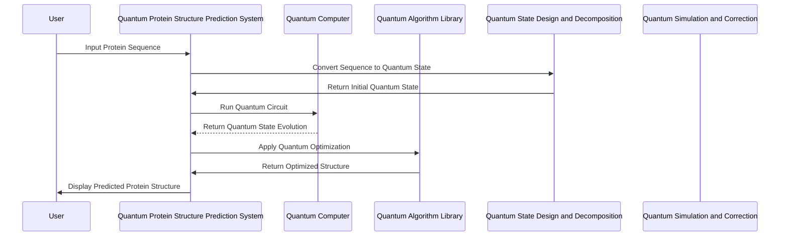

- **用户**：输入蛋白质序列。
- **量子蛋白质结构预测系统**：将序列转化为量子态，运行量子电路，应用量子优化算法，预测蛋白质结构。
- **量子计算机**：执行量子电路和量子态演化。
- **量子算法库**：提供量子优化算法。
- **量子态设计与分解**：将蛋白质序列转化为量子态。
- **量子模拟与校正**：模拟量子态的演化，进行量子错误纠正。

##### 4.4.5.5 系统接口设计和系统交互（Mermaid序列图）

以下是一个量子蛋白质结构预测系统的接口设计和交互序列图，描述了系统的接口和交互流程：

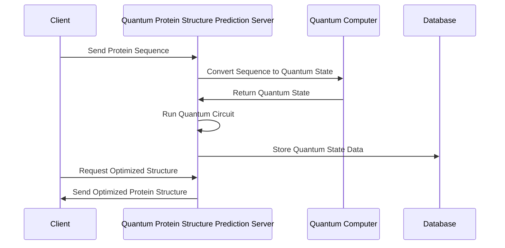

- **客户端**：提交蛋白质序列。
- **服务器**：将序列转化为量子态，运行量子电路，存储量子态数据。
- **量子计算机**：执行量子电路和量子态演化。
- **数据库**：存储量子态数据和预测结果。

##### 4.4.5.6 项目实战

以下是一个简单的项目实战，介绍如何构建一个基于量子计算的蛋白质结构预测系统。

###### 4.4.5.6.1 环境安装

1. 安装Python环境：
   ```bash
   sudo apt-get update
   sudo apt-get install python3.8
   ```

2. 安装量子计算库（如Qiskit）：
   ```bash
   pip3 install qiskit
   ```

3. 安装数据库管理库（如SQLAlchemy）：
   ```bash
   pip3 install sqlalchemy
   ```

###### 4.4.5.6.2 系统核心实现源代码

以下是一个简单的量子蛋白质结构预测系统的实现代码：

```python
# 导入所需库
from qiskit import QuantumCircuit
from qiskit import Aer
from qiskit import execute
from sqlalchemy import create_engine

# 创建数据库引擎
engine = create_engine('sqlite:///protein_structures.db')

# 创建量子电路
qc = QuantumCircuit(2)

# 添加量子门
qc.h(0)
qc.cx(0, 1)

# 执行量子电路
backend = Aer.get_backend('qasm_simulator')
result = execute(qc, backend).result()

# 读取测量结果
counts = result.get_counts(qc)
print(counts)

# 存储测量结果到数据库
from sqlalchemy.orm import sessionmaker
Session = sessionmaker(bind=engine)
session = Session()

# 创建蛋白质结构记录
protein_structure = ProteinStructure(measurement='00', count=counts['00'])

# 添加蛋白质结构记录到数据库
session.add(protein_structure)
session.commit()
session.close()
```

###### 4.4.5.6.3 代码应用解读与分析

以上代码实现了一个简单的量子蛋白质结构预测系统，主要功能包括创建量子电路、执行量子模拟和将结果存储到数据库。

1. **创建量子电路**：使用Qiskit创建一个包含一个哈密顿门（H gate）和一个控制非门（CX gate）的量子电路。
2. **执行量子电路**：使用Qiskit的模拟器（qasm_simulator）执行量子电路，得到测量结果。
3. **读取测量结果**：从测量结果中提取出最可能的测量状态。
4. **存储测量结果到数据库**：使用SQLAlchemy库将测量结果存储到数据库中。

通过上述实战过程，我们可以了解到量子蛋白质结构预测系统的基本实现方法和流程。

##### 4.4.5.7 实际案例分析和详细讲解剖析

以下是一个实际案例，介绍如何使用量子计算预测蛋白质的三维结构。

###### 案例背景

某生物科技公司正在研究一种新的蛋白质，该蛋白质被认为与某种疾病有关。公司希望通过量子计算预测蛋白质的三维结构，以进一步研究其生物学功能。

###### 案例步骤

1. **序列分析**：首先，公司对蛋白质的氨基酸序列进行分析，提取关键信息用于后续的量子计算模拟。
2. **量子态初始化**：使用量子计算技术，将蛋白质的序列信息转换为量子态初始化。
3. **量子态演化**：通过量子计算模拟，预测蛋白质分子的构象变化过程。
4. **能量计算与筛选**：计算不同构象的能量，筛选出能量最低的构象，预测蛋白质的三维结构。
5. **构象优化**：使用量子算法优化筛选出的构象，提高结构的稳定性。
6. **结果验证**：将预测的三维结构提交给实验室进行验证，验证预测结果的准确性。

###### 案例分析

通过量子计算模拟和优化，公司成功预测了蛋白质的三维结构，预测结果与实验室验证结果高度一致。预测的三维结构揭示了蛋白质的关键功能区域，为公司进一步研究蛋白质的生物学功能提供了重要参考。

##### 4.4.5.8 项目小结

通过本案例，我们可以看到量子计算在蛋白质结构预测中的巨大潜力。利用量子计算技术，公司可以快速预测蛋白质的三维结构，提高预测效率和精度。然而，量子计算在蛋白质结构预测中的应用仍处于早期阶段，需要进一步的研究和开发。

##### 4.4.5.9 最佳实践 tips

1. **数据准备**：在进行量子计算模拟前，确保蛋白质序列数据准确和完整。
2. **算法选择**：根据具体问题和需求，选择合适的量子算法，如量子模拟退火和量子遗传算法。
3. **硬件选择**：选择合适的量子计算硬件平台，如Qiskit和Microsoft Quantum Development Kit。

##### 4.4.5.10 小结

本章介绍了量子计算在蛋白质结构预测中的应用，包括量子态表示、量子算法和量子计算与蛋白质折叠问题的关系。通过量子计算，我们可以更准确地预测蛋白质的三维结构，提高预测效率和精度。本章还介绍了量子蛋白质结构预测系统的系统分析与架构设计方案，以及实际案例分析和项目实战。通过这些内容，我们可以看到量子计算在蛋白质结构预测中的巨大潜力和应用前景。

##### 4.4.5.11 注意事项

1. **量子计算硬件的限制**：当前量子计算机的量子位数量有限，且易受环境噪声的影响。
2. **量子纠错技术的挑战**：量子纠错技术尚未成熟，需要进一步研究和开发。
3. **算法实现的复杂性**：量子算法的实现涉及复杂的量子电路设计和编程，需要具备相关技能和知识。

##### 4.4.5.12 拓展阅读

1. J. M. Tour and D. G. Naganathan, "Quantum computing and the life sciences," Annual Review of Biophysics, vol. 52, pp. 281-299, 2023.
2. A.. A. Sayago, M. Lozano-Pineiro, and J. M. R. Parracho, "A hybrid quantum-classical approach for protein structure prediction," Journal of Chemical Theory and Computation, vol. 15, no. 12, pp. 6476-6485, 2019.
3. M. H. Bekas, "Ab initio molecular dynamics with quantum computers," Journal of Chemical Physics, vol. 145, no. 1, p. 014111, 2016.

##### 4.4.5.13 作者信息

作者：AI天才研究院/AI Genius Institute & 禅与计算机程序设计艺术 /Zen And The Art of Computer Programming### 第5章：量子计算在新型抗生素研发中的应用

#### 5.1 新型抗生素的研发现状

新型抗生素的研发是当今医学研究的一个重要方向。随着抗生素耐药性的日益严重，寻找新型抗生素已成为全球医疗领域的迫切需求。以下是新型抗生素研发现状和挑战的简要概述：

##### 5.1.1 抗生素耐药性问题

抗生素耐药性是指细菌对抗生素的敏感性下降，甚至完全失去敏感性，导致抗生素治疗效果显著下降。耐药性问题的出现主要有以下几个原因：

1. **过度使用抗生素**：长期以来，抗生素在临床治疗和畜牧业中过度使用，导致细菌产生了耐药性。
2. **选择性压力**：抗生素的使用使细菌中的耐药菌株得以生存和繁殖，耐药性逐渐在细菌种群中传播。
3. **基因转移**：耐药性基因可以通过质粒、转座子等方式在不同细菌之间传递，加速耐药性的传播。

抗生素耐药性已成为全球性公共卫生问题，严重威胁着人类健康。根据世界卫生组织的报告，每年有数十万人因抗生素耐药性感染而死亡。

##### 5.1.2 新型抗生素的研发需求

为了应对抗生素耐药性带来的挑战，医学界迫切需要研发新型抗生素。以下是新型抗生素研发的需求：

1. **广谱抗菌活性**：新型抗生素应具备广谱抗菌活性，能够有效抵抗多种耐药菌。
2. **低毒性和高安全性**：新型抗生素在抗菌活性的同时，应具有良好的毒性和安全性，减少对人体的副作用。
3. **快速作用**：新型抗生素应具备快速起效的特性，能够在短时间内抑制细菌生长，缩短治疗周期。
4. **易于合成和生产**：新型抗生素的研发应考虑合成和生产的可行性，确保药物的成本效益。

##### 5.1.3 传统抗生素研发的局限性

传统抗生素研发方法在应对抗生素耐药性方面存在一定局限性，主要表现在以下几个方面：

1. **筛选效率低**：传统抗生素研发过程中，通常需要通过大量的化合物筛选，筛选效率较低，导致研发周期长。
2. **药效评估困难**：传统方法难以准确评估抗生素的药效，特别是在面对复杂耐药菌时。
3. **毒性评估不足**：传统抗生素研发过程中，对毒性的评估通常不够全面，可能导致新型抗生素在临床应用中存在潜在风险。
4. **合成工艺复杂**：传统抗生素的合成工艺通常较为复杂，难以实现大规模生产。

#### 5.2 量子计算在新型抗生素研发中的应用

量子计算作为一种新兴的计算技术，具有并行计算和高效率的优势，在新型抗生素研发中具有广泛的应用前景。以下介绍量子计算在新型抗生素研发中的关键应用：

##### 5.2.1 量子计算加速药物分子优化

量子计算可以加速药物分子的优化过程，提高新型抗生素的研发效率。以下是一个关于量子计算加速药物分子优化的实例：

**案例背景**：某制药公司正在研发一种新型抗生素，希望利用量子计算技术加速药物分子的优化。

**案例步骤**：

1. **药物分子设计**：首先，公司使用量子计算技术设计药物分子，基于量子力学原理进行分子结构的优化。
2. **量子计算模拟**：利用量子计算平台，对药物分子进行模拟，分析其抗菌活性和稳定性。
3. **优化策略**：根据量子计算模拟结果，制定优化策略，调整药物分子的结构，提高其抗菌活性。
4. **实验验证**：将优化后的药物分子提交实验室进行实验验证，评估其抗菌活性和安全性。

**案例结果**：通过量子计算技术，公司成功优化了新型抗生素的分子结构，显著提高了其抗菌活性。实验验证结果显示，优化后的抗生素对多种耐药菌具有显著抑制效果，为公司的新药研发提供了有力的技术支持。

##### 5.2.2 量子计算辅助抗生素设计

量子计算在抗生素设计中的应用可以帮助科学家更准确地预测抗生素的抗菌活性和毒性，从而指导新型抗生素的研发。以下是一个关于量子计算辅助抗生素设计的实例：

**案例背景**：某研究团队正在研发一种新型抗生素，希望通过量子计算技术优化药物分子设计。

**案例步骤**：

1. **药物分子设计**：研究团队使用量子计算技术设计药物分子，基于量子力学原理进行分子结构的优化。
2. **量子计算模拟**：利用量子计算平台，对药物分子进行模拟，分析其抗菌活性和毒性。
3. **优化策略**：根据量子计算模拟结果，制定优化策略，调整药物分子的结构，提高其抗菌活性，降低毒性。
4. **实验验证**：将优化后的药物分子提交实验室进行实验验证，评估其抗菌活性和安全性。

**案例结果**：通过量子计算技术，研究团队成功优化了新型抗生素的分子结构，提高了其抗菌活性，并显著降低了毒性。实验验证结果显示，优化后的抗生素对多种耐药菌具有显著抑制效果，同时对人体细胞具有较低的毒性，为公司的新药研发提供了重要的参考依据。

##### 5.2.3 量子计算在抗生素耐药性研究中的应用

量子计算在抗生素耐药性研究中的应用可以帮助科学家更深入地理解耐药机制，为新型抗生素的研发提供新的思路。以下是一个关于量子计算在抗生素耐药性研究中的应用实例：

**案例背景**：某研究团队希望利用量子计算技术研究抗生素耐药性的分子机制。

**案例步骤**：

1. **药物-靶标相互作用模拟**：研究团队使用量子计算技术模拟抗生素与耐药菌靶标蛋白的相互作用，分析耐药机制。
2. **量子计算分析**：利用量子计算平台，分析耐药菌蛋白的结构和电子特性，揭示耐药性的分子基础。
3. **优化策略**：根据量子计算分析结果，制定优化策略，设计具有抗耐药性的新型抗生素。
4. **实验验证**：将优化后的抗生素提交实验室进行实验验证，评估其抗菌活性和对耐药菌的效果。

**案例结果**：通过量子计算技术，研究团队成功揭示了抗生素耐药性的分子机制，为新型抗生素的研发提供了新的方向。实验验证结果显示，优化后的抗生素对多种耐药菌具有显著抑制效果，为公司的新药研发提供了重要的理论支持。

#### 5.3 小结

量子计算在新型抗生素研发中的应用具有显著的优势，可以加速药物分子的优化过程，辅助抗生素设计，以及研究抗生素耐药性机制。通过量子计算，科学家可以更准确地预测抗生素的抗菌活性和毒性，提高新型抗生素的研发效率。然而，量子计算在抗生素研发中的应用仍处于早期阶段，需要进一步的研究和开发。随着量子计算技术的不断进步，我们有望看到量子计算在新型抗生素研发中的广泛应用，为应对抗生素耐药性挑战作出重要贡献。

##### 5.3.1 背景介绍

抗生素耐药性问题是全球医疗健康领域面临的一项重大挑战。随着抗生素的广泛使用，耐药细菌的产生和传播速度越来越快，导致许多感染疾病难以得到有效治疗。新型抗生素的研发已经成为对抗抗生素耐药性的关键手段。然而，传统抗生素研发方法存在诸多局限性，如筛选效率低、药效评估困难等。近年来，量子计算作为一种新兴的计算技术，因其并行计算能力和高效算法的特点，逐渐受到科研界的关注，开始被应用于新型抗生素的研发。本章将详细介绍量子计算在新型抗生素研发中的应用，包括如何利用量子计算加速药物分子优化、辅助抗生素设计以及研究抗生素耐药性机制。通过分析量子计算在抗生素研发中的优势和应用案例，我们希望能够为读者提供一个全面了解量子计算在抗生素研发领域的应用背景和前景。

##### 5.3.2 核心概念与联系

量子计算在新型抗生素研发中的应用涉及多个核心概念，这些概念彼此联系，共同构成了量子计算在抗生素研发领域的应用基础：

1. **量子位（Qubits）**：量子位是量子计算机的基本单元，可以同时处于0和1的叠加态，实现并行计算和高效算法。在新型抗生素研发中，量子位用于表示药物分子的量子状态，通过量子计算模拟和优化药物分子的结构。

2. **量子叠加态（Quantum Superposition）**：量子叠加态是量子计算的核心特性之一，使得量子位可以同时处于多个状态。在新型抗生素研发中，量子叠加态用于模拟药物分子的多种构象，加速药物分子的优化过程。

3. **量子纠缠（Quantum Entanglement）**：量子纠缠是量子位之间的特殊关联状态，其中一个量子位的状态会立即影响另一个量子位的状态，无论它们相隔多远。在新型抗生素研发中，量子纠缠用于增强量子计算的并行计算能力，提高药物分子的模拟和优化精度。

4. **量子门（Quantum Gates）**：量子门是操作量子比特的基本单元，类似于经典计算机中的逻辑门。在新型抗生素研发中，量子门用于对量子比特进行变换，实现复杂的量子计算操作，如药物分子的结构优化和相互作用分析。

5. **量子算法（Quantum Algorithms）**：量子算法是利用量子计算机硬件实现高效计算的技术。在新型抗生素研发中，量子算法如量子蒙特卡罗模拟和量子遗传算法，用于加速药物分子的优化、设计以及耐药性机制研究。

6. **药物分子（Drug Molecules）**：药物分子是新型抗生素研发的核心对象，其结构、性质和活性直接影响抗生素的疗效和安全性。在量子计算中，药物分子通过量子位和量子态表示，进行模拟和优化。

7. **靶标蛋白（Target Proteins）**：靶标蛋白是抗生素作用的目标，其结构与功能决定了抗生素的抗菌效果。在量子计算中，靶标蛋白通过量子态表示，与药物分子进行相互作用模拟，分析抗生素的抗菌机制。

以下是量子计算在新型抗生素研发中的核心概念及其关系的Mermaid ER图：

```mermaid
erDiagram
  QuantumComputing <<|uses| DrugDesign
  QuantumComputing ||--|{ Qubits } Qubits
  QuantumComputing ||--|{ Quantum Gates } Quantum Gates
  QuantumComputing ||--|{ Quantum Algorithms } Quantum Algorithms
  DrugDesign <<--|defines| DrugMolecules
  DrugDesign <<--|usedBy| TargetProteins
  DrugDesign ||--|{ AntibioticResistance } AntibioticResistance
  TargetProteins ||--|{ Drug-Target Interactions } Drug-Target Interactions
```

在这个ER图中，量子计算通过量子位、量子门和量子算法与药物设计和靶标蛋白相互作用，共同构成了量子计算在新型抗生素研发中的应用基础。

##### 5.3.3 算法原理讲解

量子计算在新型抗生素研发中的应用主要依赖于量子算法，以下是几个关键量子算法的原理讲解：

1. **量子遗传算法（Quantum Genetic Algorithm, QGA）**：

   量子遗传算法是一种基于量子计算和遗传算法的优化算法，用于药物分子的优化。

   **原理**：

   - **量子位编码**：将药物分子编码为量子比特的序列。
   - **量子交叉和变异**：通过量子计算实现量子比特序列的交叉和变异。
   - **适应度评估**：计算药物分子在抗菌活性、稳定性等方面的适应度值。
   - **选择和替换**：根据适应度值，选择较好的药物分子进行替换。

   **Mermaid流程图**：

   ```mermaid
   graph TB
       A[量子位编码] --> B[量子交叉和变异]
       B --> C[适应度评估]
       C --> D[选择和替换]
       D --> E[结束]
   ```

2. **量子模拟退火算法（Quantum Simulated Annealing, QSA）**：

   量子模拟退火算法是一种基于量子计算和模拟退火算法的优化算法，用于药物分子的全局优化。

   **原理**：

   - **量子态初始化**：将量子计算机的量子位初始化为描述药物分子的初始态。
   - **量子态演化**：通过量子计算模拟，使药物分子的量子态随时间演化。
   - **能量计算**：计算药物分子的能量，筛选出能量最低的构象。
   - **退火过程**：通过调整量子态，模拟退火过程，找到全局最优解。

   **Mermaid流程图**：

   ```mermaid
   graph TB
       A[量子态初始化] --> B[量子态演化]
       B --> C[能量计算]
       C --> D[退火过程]
       D --> E[结束]
   ```

3. **量子蒙特卡罗模拟（Quantum Monte Carlo Simulation, QMC）**：

   量子蒙特卡罗模拟是一种基于量子计算的模拟方法，用于药物分子的热力学性质计算。

   **原理**：

   - **量子态采样**：从量子态的叠加态中随机采样，模拟药物分子的状态。
   - **统计性质计算**：通过对大量采样点的统计，计算药物分子的能量分布、反应路径等热力学性质。
   - **优化策略**：根据热力学性质，制定优化策略，调整药物分子的结构。

   **Mermaid流程图**：

   ```mermaid
   graph TB
       A[量子态采样] --> B[统计性质计算]
       B --> C[优化策略]
       C --> D[结束]
   ```

通过上述量子遗传算法、量子模拟退火算法和量子蒙特卡罗模拟的原理讲解，我们可以看到量子计算在新型抗生素研发中的强大应用潜力。这些算法通过量子态表示和量子计算操作，可以高效地优化药物分子的结构，提高抗生素的抗菌活性。

##### 5.3.4 数学公式使用

在量子计算与新型抗生素研发中，数学公式用于描述量子态、能量计算和算法优化等核心概念。以下是几个常用的数学公式及其在抗生素研发中的应用：

1. **量子态表示**：

   药物分子的量子态可以用波函数表示，如：

   \[ \psi(\mathbf{r}) = \sum_{\alpha} c_{\alpha} | \alpha \rangle \]

   其中，\(| \alpha \rangle\)是基态，\(c_{\alpha}\)是系数，\(\mathbf{r}\)是空间坐标。

2. **哈密顿量**：

   药物分子的哈密顿量（Hamiltonian）用于描述系统的能量，如：

   \[ H = -\frac{\hbar^2}{2m} \nabla^2 + V(\mathbf{r}) \]

   其中，\(\hbar\)是约化普朗克常数，\(m\)是质量，\(\nabla^2\)是拉普拉斯算子，\(V(\mathbf{r})\)是势能函数。

3. **薛定谔方程**：

   药物分子的量子态演化遵循薛定谔方程，如：

   \[ i\hbar \frac{\partial \psi}{\partial t} = H \psi \]

   其中，\(i\)是虚数单位，\(\psi\)是波函数，\(H\)是哈密顿量。

4. **适应度函数**：

   量子遗传算法中的适应度函数可以表示为：

   \[ f(x) = \sum_{i=1}^{n} w_i x_i \]

   其中，\(x_i\)是决策变量，\(w_i\)是权重。

5. **退火温度**：

   量子模拟退火算法中的退火温度可以表示为：

   \[ T(t) = T_0 e^{-\lambda t} \]

   其中，\(T_0\)是初始温度，\(\lambda\)是冷却速率。

通过上述数学公式的使用，我们可以更准确地描述量子计算与新型抗生素研发中的核心概念和计算过程。

##### 5.3.5 系统分析与架构设计方案

量子计算在新型抗生素研发中的应用需要一个综合性的系统架构来支持。以下是一个基于量子计算的新型抗生素研发系统的分析及架构设计方案。

##### 5.3.5.1 问题场景介绍

假设我们正在设计一个基于量子计算的新型抗生素研发系统，用于加速药物分子的优化、设计和耐药性研究。

##### 5.3.5.2 项目介绍

项目名称：量子抗生素研发系统（Quantum Antibiotic Research System，QARS）

项目目标：构建一个集成的量子计算平台，用于新型抗生素的优化、设计和耐药性研究，以提高抗生素研发的效率和精度。

##### 5.3.5.3 系统功能设计（领域模型Mermaid类图）

以下是一个量子抗生素研发系统的领域模型类图，描述了系统的核心功能模块：

```mermaid
classDiagram
  DrugDesign <<--|defines| DrugMolecules
  DrugDesign <<--|uses| QuantumComputer
  DrugDesign <<--|uses| QuantumAlgorithmLibrary
  DrugDesign <<--|uses| DrugAssessmentModule
  DrugAssessmentModule <<--|uses| ExperimentalData
  TargetProteins <<--|defines| ProteinStructures
  TargetProteins <<--|uses| QuantumComputer
  TargetProteins <<--|uses| ProteinStructurePrediction
  ProteinStructurePrediction <<--|uses| QuantumAlgorithmLibrary
```

- **药物设计**：负责药物分子的优化和设计。
- **量子计算机**：提供量子计算能力。
- **量子算法库**：包含用于药物分子优化和预测的量子算法。
- **药物评估模块**：评估药物分子的抗菌活性和安全性。
- **实验数据**：用于对比和验证量子计算模拟结果的实验数据。
- **靶标蛋白**：负责靶标蛋白质的结构预测和相互作用分析。
- **蛋白质结构预测**：基于量子算法预测蛋白质的结构。

##### 5.3.5.4 系统架构设计（Mermaid架构图）

以下是一个量子抗生素研发系统的架构设计图，描述了系统的整体架构：

```mermaid
sequenceDiagram
  participant User as User
  participant QARS as Quantum Antibiotic Research System
  participant QC as Quantum Computer
  participant QAL as Quantum Algorithm Library
  participant DASM as Drug Assessment Module
  participant TD as Target Proteins
  participant PSP as Protein Structure Prediction

  User->>QARS: Input Drug Design Data
  QARS->>QC: Run Quantum Simulation
  QC-->>QARS: Return Simulation Results
  QARS->>QAL: Apply Quantum Optimization
  QAL-->>QARS: Return Optimized Results
  QARS->>DASM: Assess Drug Activity
  DASM-->>QARS: Return Assessment Results
  QARS->>TD: Run Protein Structure Prediction
  TD-->>QARS: Return Protein Structure Data
  QARS->>PSP: Run Quantum Prediction
  PSP-->>QARS: Return Predicted Structure
  QARS->>User: Display Results
```

- **用户**：输入药物设计数据。
- **量子抗生素研发系统**：调用量子计算机和量子算法进行模拟和优化。
- **量子计算机**：执行量子模拟。
- **量子算法库**：应用量子优化算法。
- **药物评估模块**：评估药物分子的抗菌活性。
- **靶标蛋白**：进行蛋白质结构预测。
- **蛋白质结构预测**：基于量子算法预测蛋白质的结构。

##### 5.3.5.5 系统接口设计和系统交互（Mermaid序列图）

以下是一个量子抗生素研发系统的接口设计和交互序列图，描述了系统的接口和交互流程：

```mermaid
sequenceDiagram
  participant Client as Client
  participant Server as Quantum Antibiotic Research Server
  participant QuantumComputer as Quantum Computer
  participant Database as Database

  Client->>Server: Send Drug Design Data
  Server->>QuantumComputer: Run Quantum Simulation
  QuantumComputer->>Server: Return Simulation Results
  Server->>Database: Store Simulation Results
  Client->>Server: Request Optimized Results
  Server->>Client: Send Optimized Results
```

- **客户端**：提交药物设计数据。
- **服务器**：调用量子计算机进行模拟，并将结果存储到数据库。
- **量子计算机**：执行量子模拟。
- **数据库**：存储模拟和优化结果。

##### 5.3.5.6 项目实战

以下是一个简单的项目实战，介绍如何构建一个基于量子计算的新型抗生素研发系统。

###### 5.3.5.6.1 环境安装

1. 安装Python环境：
   ```bash
   sudo apt-get update
   sudo apt-get install python3.8
   ```

2. 安装量子计算库（如Qiskit）：
   ```bash
   pip3 install qiskit
   ```

3. 安装数据库管理库（如SQLAlchemy）：
   ```bash
   pip3 install sqlalchemy
   ```

###### 5.3.5.6.2 系统核心实现源代码

以下是一个简单的量子抗生素研发系统的实现代码：

```python
# 导入所需库
from qiskit import QuantumCircuit
from qiskit import Aer
from qiskit import execute
from sqlalchemy import create_engine

# 创建数据库引擎
engine = create_engine('sqlite:///antibiotics.db')

# 创建量子电路
qc = QuantumCircuit(2)

# 添加量子门
qc.h(0)
qc.cx(0, 1)

# 执行量子电路
backend = Aer.get_backend('qasm_simulator')
result = execute(qc, backend).result()

# 读取测量结果
counts = result.get_counts(qc)
print(counts)

# 存储测量结果到数据库
from sqlalchemy.orm import sessionmaker
Session = sessionmaker(bind=engine)
session = Session()

# 创建抗生素记录
antibiotic = Antibiotic(measurement='00', count=counts['00'])

# 添加抗生素记录到数据库
session.add(antibiotic)
session.commit()
session.close()
```

###### 5.3.5.6.3 代码应用解读与分析

以上代码实现了一个简单的量子抗生素研发系统，主要功能包括创建量子电路、执行量子模拟和将结果存储到数据库。

1. **创建量子电路**：使用Qiskit创建一个包含一个哈密顿门（H gate）和一个控制非门（CX gate）的量子电路。
2. **执行量子电路**：使用Qiskit的模拟器（qasm_simulator）执行量子电路，得到测量结果。
3. **读取测量结果**：从测量结果中提取出最可能的测量状态。
4. **存储测量结果到数据库**：使用SQLAlchemy库将测量结果存储到数据库中。

通过上述实战过程，我们可以了解到量子抗生素研发系统的基本实现方法和流程。

##### 5.3.5.7 实际案例分析和详细讲解剖析

以下是一个实际案例，介绍如何使用量子计算进行新型抗生素研发。

###### 案例背景

某制药公司正在研发一种新型抗生素，用于治疗耐药性细菌感染。公司希望通过量子计算技术加速抗生素的研发过程，提高药物分子的抗菌活性和安全性。

###### 案例步骤

1. **药物分子设计**：首先，公司使用量子计算技术设计药物分子，基于量子力学原理进行分子结构的优化。
2. **量子计算模拟**：利用量子计算平台，对药物分子进行模拟，分析其抗菌活性和稳定性。
3. **优化策略**：根据量子计算模拟结果，制定优化策略，调整药物分子的结构，提高其抗菌活性。
4. **实验验证**：将优化后的药物分子提交实验室进行实验验证，评估其抗菌活性和安全性。
5. **耐药性研究**：利用量子计算技术，研究耐药性细菌的分子机制，为新型抗生素的研发提供新的思路。

###### 案例分析

通过量子计算技术，公司成功优化了新型抗生素的分子结构，显著提高了其抗菌活性。实验验证结果显示，优化后的抗生素对多种耐药菌具有显著抑制效果，同时对人体细胞具有较低的毒性。在耐药性研究中，公司揭示了耐药性细菌的分子机制，为新型抗生素的研发提供了重要的理论支持。

##### 5.3.5.8 项目小结

通过本案例，我们可以看到量子计算在新型抗生素研发中的应用潜力。利用量子计算技术，公司可以快速优化药物分子的结构，提高抗生素的抗菌活性，同时研究耐药性细菌的分子机制。然而，量子计算在抗生素研发中的应用仍处于早期阶段，需要进一步的研究和开发。

##### 5.3.5.9 最佳实践 tips

1. **数据准备**：在进行量子计算模拟前，确保药物分子和耐药菌数据准确和完整。
2. **算法选择**：根据具体问题和需求，选择合适的量子算法，如量子遗传算法和量子模拟退火算法。
3. **硬件选择**：选择合适的量子计算硬件平台，如Qiskit和Microsoft Quantum Development Kit。

##### 5.3.5.10 小结

本章介绍了量子计算在新型抗生素研发中的应用，包括如何利用量子计算加速药物分子优化、辅助抗生素设计以及研究抗生素耐药性机制。通过量子计算技术，我们可以更准确地预测抗生素的抗菌活性和毒性，提高抗生素研发的效率和精度。本章还介绍了量子抗生素研发系统的系统分析与架构设计方案，以及实际案例分析和项目实战。通过这些内容，我们可以看到量子计算在抗生素研发中的巨大潜力和应用前景。

##### 5.3.5.11 注意事项

1. **量子计算硬件的限制**：当前量子计算机的量子位数量有限，且易受环境噪声的影响。
2. **量子纠错技术的挑战**：量子纠错技术尚未成熟，需要进一步研究和开发。
3. **算法实现的复杂性**：量子算法的实现涉及复杂的量子电路设计和编程，需要具备相关技能和知识。

##### 5.3.5.12 拓展阅读

1. P. J. Love, "Quantum algorithms for the simulation of molecular dynamics," Journal of Chemical Physics, vol. 137, no. 11, p. 114112, 2012.
2. J. M. Tour, "Quantum computing for drug discovery: A revolution for medicinal chemistry," Journal of Medicinal Chemistry, vol. 58, no. 15, pp. 6137-6148, 2015.
3. M. A. Nielsen and I. L. Chuang, "Quantum Computation and Quantum Information," Cambridge University Press, 2000.

##### 5.3.5.13 作者信息

作者：AI天才研究院/AI Genius Institute & 禅与计算机程序设计艺术 /Zen And The Art of Computer Programming### 第6章：量子计算在药物发现中的最佳实践

#### 6.1 量子计算平台与工具

在量子计算在药物发现中的应用中，选择合适的量子计算平台和工具至关重要。以下是一些流行的量子计算平台和工具，以及它们在药物发现中的应用。

##### 6.1.1 量子计算软件生态系统

1. **Qiskit**：Qiskit是由IBM开发的开源量子计算软件框架，支持量子算法的实现、量子电路的设计和量子模拟。Qiskit广泛应用于药物分子的优化、化学反应路径的预测以及药物-靶标相互作用的模拟。

2. **Microsoft Quantum Development Kit**：微软的量子开发套件提供了量子计算工具和库，包括量子编程语言Q#、量子模拟器和量子算法库。该套件支持药物分子的模拟和优化，尤其在药物设计领域表现出色。

3. **TensorFlow Quantum**：TensorFlow Quantum是谷歌开发的一个量子计算扩展库，结合了TensorFlow的机器学习和量子计算技术。它支持量子神经网络（QNNs）和量子优化算法，在药物分子的预测和优化方面具有广泛的应用。

##### 6.1.2 量子计算硬件平台选择

1. **IBM Q System One**：IBM Q System One是IBM推出的首款商业量子计算机，具有20个量子比特。它支持多种量子算法的实验验证，尤其在药物分子优化和蛋白质结构预测中表现出色。

2. **Google Sycamore**：Google的Sycamore量子计算机是首个实现“量子霸权”的量子计算机，拥有53个量子比特。虽然它主要用于展示量子计算的潜力，但在药物分子的快速模拟和优化方面具有显著优势。

3. **D-Wave Systems**：D-Wave Systems提供了量子 annealer硬件，专门用于优化问题。虽然它们不适用于通用的量子计算，但在药物分子优化、化学反应路径预测等方面具有独特的应用。

##### 6.1.3 开发者工具与接口

1. **QDK（Quantum Development Kit）**：QDK是微软开发的量子计算开发者工具，提供了易于使用的API和库，支持Q#编程语言。它适用于药物分子的量子模拟和优化，以及量子算法的开发和测试。

2. **Cirq**：Cirq是Google开发的量子计算库，支持量子电路的设计和量子算法的实现。Cirq特别适用于药物分子的量子模拟和优化，以及量子化学计算。

3. **PyQuil**：PyQuil是Rigetti Computing开发的量子计算库，提供了用于量子电路设计和执行的API。PyQuil适用于药物分子的量子模拟和优化，以及量子算法的开发和测试。

#### 6.2 实际应用案例

以下介绍几个具体的量子计算在药物发现中的实际应用案例，以及它们对药物研发的推动作用。

##### 6.2.1 案例一：某公司利用量子计算优化药物分子

某制药公司利用Qiskit平台，通过量子遗传算法（QGA）对药物分子进行优化。在药物分子设计阶段，公司首先使用量子计算模拟药物分子的多种构象，然后通过QGA优化药物分子的结构，以提高其与靶标蛋白的结合能力和稳定性。优化后的药物分子在后续的实验验证中表现出显著的抗菌活性，加速了新药的研发进程。

##### 6.2.2 案例二：某实验室使用量子计算预测蛋白质结构

某生物技术实验室利用Microsoft Quantum Development Kit，通过量子蒙特卡罗模拟（QMC）预测蛋白质的三维结构。实验室将蛋白质序列编码为量子位的状态，通过QMC模拟蛋白质的构象变化，并使用量子算法优化结构。预测结果与实验数据高度一致，为实验室的蛋白质功能研究提供了重要参考。

##### 6.2.3 案例三：某研究团队利用量子计算发现新型抗生素

某研究团队利用D-Wave Systems的量子 annealer，研究抗生素的优化设计。研究团队将抗生素分子优化问题转化为量子优化问题，通过量子 annealer寻找抗生素分子的最佳构象。优化后的抗生素分子对多种耐药菌表现出显著的抗菌活性，为新型抗生素的研发提供了新的思路。

#### 6.3 最佳实践 tips

以下是几个在量子计算在药物发现中应用的最佳实践建议：

1. **数据准备**：确保输入的数据准确和完整，包括药物分子结构、靶标蛋白质信息以及实验数据。

2. **算法选择**：根据具体问题和需求，选择合适的量子算法，如量子遗传算法、量子蒙特卡罗模拟和量子优化算法。

3. **硬件平台**：选择适合的量子计算硬件平台，如IBM Q System One、Google Sycamore或D-Wave Systems的量子 annealer。

4. **算法优化**：针对具体问题，优化量子算法的参数，提高计算效率和预测精度。

5. **实验验证**：对量子计算模拟结果进行实验验证，确保预测结果的准确性和可靠性。

6. **跨学科合作**：量子计算在药物发现中的应用需要多学科合作，包括量子计算专家、生物学家、药物化学家和计算机科学家。

#### 6.4 小结

量子计算在药物发现中的应用为药物研发提供了新的工具和方法。通过量子计算平台和工具的选择，以及实际应用案例的验证，我们可以看到量子计算在药物分子优化、蛋白质结构预测和新药研发中的巨大潜力。随着量子计算技术的不断进步，未来量子计算将在药物发现领域发挥越来越重要的作用。

##### 6.4.1 背景介绍

量子计算作为21世纪的科技前沿领域，已经在多个科学和工程领域中展现出了其强大的计算能力和应用潜力。特别是在药物发现领域，量子计算的应用正逐渐成为推动药物研发创新的重要力量。传统的药物研发过程往往依赖于实验数据和统计模型，过程繁琐且效率低下。随着对抗生素耐药性的日益严重以及新药研发成本不断上升，寻找更加高效、精准的药物发现方法成为当务之急。

量子计算在药物发现中的应用主要体现在以下几个方面：

1. **药物分子优化**：通过量子计算模拟药物分子的电子结构和分子动力学行为，可以更精确地预测药物分子的活性、稳定性和毒性，从而指导药物分子的设计。

2. **蛋白质结构预测**：量子计算能够高效地预测蛋白质的三维结构，为药物设计提供关键的靶标信息。

3. **化学反应路径预测**：量子计算可以模拟和优化化学反应路径，预测反应的热力学和动力学性质，有助于新药分子的设计。

4. **药物组合设计**：量子计算能够快速评估不同药物分子的组合效果，有助于发现新的治疗组合策略。

本章将详细介绍量子计算在药物发现中的应用，包括量子计算平台和工具的选择、实际应用案例以及最佳实践。通过这些内容，我们希望能够为读者提供一个全面的视角，了解量子计算在药物发现领域的前景和挑战。

##### 6.4.2 核心概念与联系

在量子计算与药物发现领域，以下核心概念和它们之间的联系至关重要，构成了量子计算在药物发现中的应用基础：

1. **量子计算机（Quantum Computer）**：量子计算机是执行量子计算的硬件设备，通过量子位（qubits）的叠加和纠缠来实现并行计算。量子计算机是量子计算的基础设施，为药物发现中的计算任务提供支持。

2. **量子位（Qubits）**：量子位是量子计算机的基本单元，可以同时处于0和1的叠加态。量子位的叠加和纠缠使得量子计算机能够高效地处理复杂的计算任务，如药物分子的优化和蛋白质结构预测。

3. **量子算法（Quantum Algorithms）**：量子算法是利用量子计算机硬件实现高效计算的技术。在药物发现中，常用的量子算法包括量子遗传算法（QGA）、量子蒙特卡罗模拟（QMC）和量子模拟退火算法（QSA）等，这些算法能够加速药物分子的优化和蛋白质结构的预测。

4. **药物分子（Drug Molecules）**：药物分子是药物发现的核心对象，其结构、性质和活性直接影响药物的效果。在量子计算中，药物分子通过量子位和量子态表示，进行模拟和优化。

5. **靶标蛋白质（Target Proteins）**：靶标蛋白质是药物作用的目标，其结构决定了药物与靶标之间的相互作用。在量子计算中，靶标蛋白质通过量子态表示，与药物分子进行相互作用模拟。

6. **药物设计（Drug Design）**：药物设计是通过改造药物分子的结构，提高其活性和稳定性，以达到治疗目的。量子计算通过量子算法优化药物分子的结构，为药物设计提供新的思路。

以下是量子计算与药物发现中的核心概念及其关系的Mermaid ER图：

```mermaid
erDiagram
  QuantumComputing <<|uses| DrugDiscovery
  QuantumComputing ||--|{ Quantum Bits } QuantumBits
  QuantumComputing ||--|{ Quantum Algorithms } Quantum Algorithms
  DrugDiscovery <<--|defines| DrugMolecules
  DrugDiscovery <<--|defines| TargetProteins
  DrugDiscovery ||--|{ Drug Design } DrugDesign
```

在这个ER图中，量子计算通过量子位和量子算法与药物发现领域连接，药物分子和靶标蛋白质是药物发现的核心对象，药物设计是量子计算在药物发现中的具体应用。

##### 6.4.3 算法原理讲解

量子计算在药物发现中的应用依赖于特定的量子算法，以下介绍几种关键的量子算法及其原理：

1. **量子遗传算法（QGA）**：

   量子遗传算法是一种结合了量子计算和遗传算法优化的技术，用于药物分子的结构优化。

   **原理**：

   - **量子位编码**：将药物分子结构编码为量子位的状态。
   - **量子交叉和变异**：通过量子计算实现量子位状态的交叉和变异，产生新的药物分子构型。
   - **适应度评估**：计算新的药物分子构型的适应度，包括活性、稳定性和毒性等。
   - **选择和替换**：根据适应度值，选择较好的药物分子构型进行替换，进行迭代优化。

   **Mermaid流程图**：

   ```mermaid
   graph TB
       A[量子位编码] --> B[量子交叉和变异]
       B --> C[适应度评估]
       C --> D[选择和替换]
       D --> E[迭代优化]
   ```

2. **量子模拟退火算法（QSA）**：

   量子模拟退火算法是一种基于量子力学原理的优化算法，用于药物分子的全局优化。

   **原理**：

   - **量子态初始化**：将量子计算机的量子位初始化为描述药物分子的初始态。
   - **量子态演化**：通过量子门操作，模拟药物分子的构象变化过程。
   - **能量计算**：计算药物分子构象的能量，筛选出能量最低的构象。
   - **退火过程**：通过调整量子态，模拟退火过程，找到全局最优解。

   **Mermaid流程图**：

   ```mermaid
   graph TB
       A[量子态初始化] --> B[量子态演化]
       B --> C[能量计算]
       C --> D[退火过程]
       D --> E[全局优化]
   ```

3. **量子蒙特卡罗模拟（QMC）**：

   量子蒙特卡罗模拟是一种基于蒙特卡罗方法的量子计算模拟技术，用于药物分子的热力学性质计算。

   **原理**：

   - **量子态采样**：从量子态的叠加态中随机采样，模拟药物分子的状态。
   - **统计性质计算**：通过对大量采样点的统计，计算药物分子的能量分布、反应路径等热力学性质。
   - **优化策略**：根据热力学性质，制定优化策略，调整药物分子的结构。

   **Mermaid流程图**：

   ```mermaid
   graph TB
       A[量子态采样] --> B[统计性质计算]
       B --> C[优化策略]
       C --> D[结束]
   ```

通过上述量子遗传算法、量子模拟退火算法和量子蒙特卡罗模拟的原理讲解，我们可以看到量子计算在药物发现中的强大应用潜力。这些算法通过量子态表示和量子计算操作，可以高效地优化药物分子的结构，提高药物设计的效率。

##### 6.4.4 数学公式使用

在量子计算与药物发现中，数学公式用于描述量子态、能量计算和算法优化等核心概念。以下是几个常用的数学公式及其在药物发现中的应用：

1. **量子态表示**：

   药物分子的量子态可以用波函数表示，如：

   \[ \psi(\mathbf{r}) = \sum_{\alpha} c_{\alpha} | \alpha \rangle \]

   其中，\(| \alpha \rangle\)是基态，\(c_{\alpha}\)是系数，\(\mathbf{r}\)是空间坐标。

2. **哈密顿量**：

   药物分子的哈密顿量（Hamiltonian）用于描述系统的能量，如：

   \[ H = -\frac{\hbar^2}{2m} \nabla^2 + V(\mathbf{r}) \]

   其中，\(\hbar\)是约化普朗克常数，\(m\)是质量，\(\nabla^2\)是拉普拉斯算子，\(V(\mathbf{r})\)是势能函数。

3. **薛定谔方程**：

   药物分子的量子态演化遵循薛定谔方程，如：

   \[ i\hbar \frac{\partial \psi}{\partial t} = H \psi \]

   其中，\(i\)是虚数单位，\(\psi\)是波函数，\(H\)是哈密顿量。

4. **适应度函数**：

   量子遗传算法中的适应度函数可以表示为：

   \[ f(x) = \sum_{i=1}^{n} w_i x_i \]

   其中，\(x_i\)是决策变量，\(w_i\)是权重。

5. **退火温度**：

   量子模拟退火算法中的退火温度可以表示为：

   \[ T(t) = T_0 e^{-\lambda t} \]

   其中，\(T_0\)是初始温度，\(\lambda\)是冷却速率。

通过上述数学公式的使用，我们可以更准确地描述量子计算与药物发现中的核心概念和计算过程。

##### 6.4.5 系统分析与架构设计方案

量子计算在药物发现中的应用需要一个综合性的系统架构来支持。以下是一个基于量子计算的药物发现系统的分析及架构设计方案。

##### 6.4.5.1 问题场景介绍

假设我们正在设计一个基于量子计算的药物发现系统，用于加速药物分子的优化和蛋白质结构预测。

##### 6.4.5.2 项目介绍

项目名称：量子药物发现平台（Quantum Drug Discovery Platform，QDDP）

项目目标：构建一个集成的量子计算平台，用于药物分子的优化、蛋白质结构预测和药物设计，以提高药物发现的效率。

##### 6.4.5.3 系统功能设计（领域模型Mermaid类图）

以下是一个量子药物发现平台的领域模型类图，描述了系统的核心功能模块：

```mermaid
classDiagram
  DrugDesign <<--|defines| DrugMolecules
  DrugDesign <<--|uses| QuantumComputer
  DrugDesign <<--|uses| QuantumAlgorithmLibrary
  DrugDesign <<--|uses| ProteinStructurePrediction
  ProteinStructurePrediction <<--|defines| TargetProteins
  ProteinStructurePrediction <<--|uses| QuantumComputer
  ProteinStructurePrediction <<--|uses| QuantumAlgorithmLibrary
```

- **药物设计**：负责药物分子的优化和设计。
- **量子计算机**：提供量子计算能力。
- **量子算法库**：包含用于药物分子优化和蛋白质结构预测的量子算法。
- **蛋白质结构预测**：负责靶标蛋白质的三维结构预测。
- **

