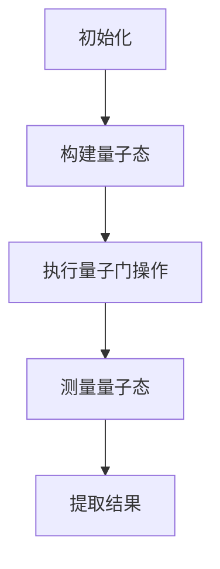
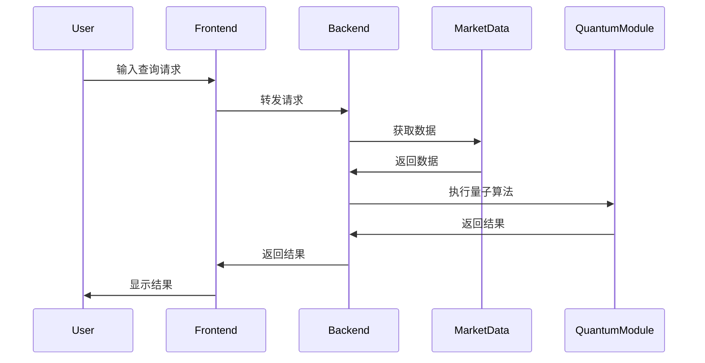
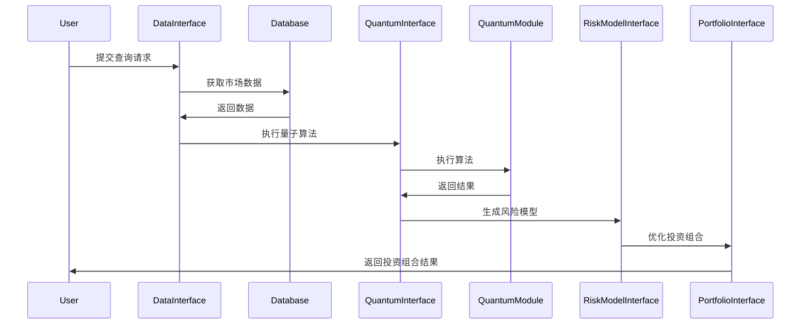
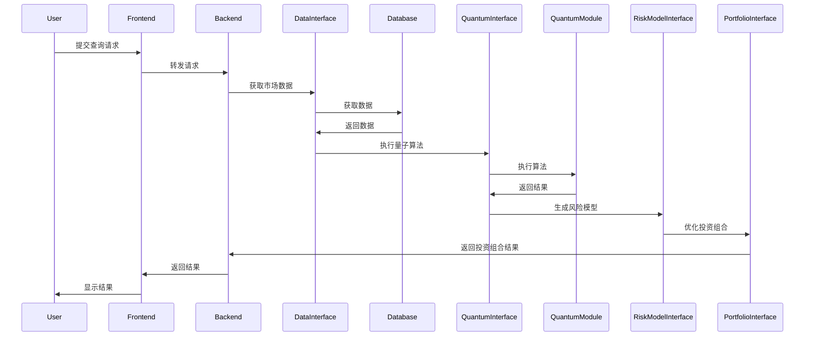

                 

## # 量子计算在金融风险分析中的潜在应用

> 关键词：量子计算、金融风险分析、算法、应用、挑战

> 摘要：本文将探讨量子计算在金融风险分析中的潜在应用。首先，我们概述量子计算和金融风险分析的基本概念，然后深入探讨量子计算的核心原理与金融风险分析方法的联系。接下来，我们将详细讲解量子算法在金融风险分析中的应用，并通过实际案例进行分析。最后，我们将总结本文的主要内容，并提出未来研究的方向和挑战。

----------------------------------------------------------------

## 第一步：概述和背景介绍

### 1.1 量子计算的基本概念

量子计算是一种基于量子力学原理的新型计算模式。量子计算机使用量子比特（qubits）作为计算的基本单元，而不是传统计算机中的经典比特（classical bits）。量子比特具有叠加和纠缠的特性，使得量子计算机能够在某些情况下比传统计算机更加高效。

#### 1.1.1 量子比特与经典比特的对比

| 特性 | 量子比特 | 经典比特 |
| --- | --- | --- |
| 状态 | 可叠加多种状态，如 \( |0\rangle \) 和 \( |1\rangle \) | 仅有一种状态，要么是 \( |0\rangle \)，要么是 \( |1\rangle \) |
| 纠缠 | 可以与其他量子比特纠缠，形成一个整体的量子态 | 不存在纠缠现象，每个比特独立 |
| 编程 | 使用量子门操作量子比特 | 使用逻辑门操作经典比特 |

#### 1.1.2 量子计算的优势与应用领域

量子计算的优势在于并行处理能力极强，能够处理大量数据，这在金融风险分析中尤为重要。此外，量子算法在某些问题上能够提供指数级的速度提升。量子计算的应用领域包括密码破解、优化问题、组合问题等。

### 1.2 金融风险分析的基本概念

金融风险分析是金融领域的一项重要任务，旨在识别、评估和管理金融产品或投资组合中的风险。金融风险分析的方法包括统计方法、概率模型、蒙特卡罗模拟等。

#### 1.2.1 金融风险分析的重要性

金融风险分析对于金融机构和投资者至关重要。它有助于识别潜在的市场风险、信用风险、流动性风险等，从而制定有效的风险管理和投资策略。

#### 1.2.2 金融风险分析的主要方法

- **统计方法**：利用历史数据进行分析，如均值、方差、协方差等。
- **概率模型**：建立概率模型，如正态分布、二项分布等，以预测风险。
- **蒙特卡罗模拟**：通过模拟大量随机样本，评估金融产品的收益和风险。

### 1.3 量子计算在金融风险分析中的潜在应用

量子计算在金融风险分析中具有巨大的潜力。例如，量子算法可以加速金融市场中的复杂优化问题，如投资组合优化、风险管理策略优化等。此外，量子计算还可以用于处理海量数据，提高金融风险分析的速度和准确性。

#### 1.3.1 量子计算在金融风险分析中的潜在应用

- **风险管理**：通过量子算法优化风险模型，提高风险管理效率。
- **投资组合优化**：利用量子计算进行高效的投资组合优化，实现风险和收益的最优平衡。
- **市场预测**：利用量子计算处理复杂的市场数据，提高市场预测的准确性。

#### 1.3.2 量子计算与经典计算在金融风险分析中的对比

| 对比项 | 量子计算 | 经典计算 |
| --- | --- | --- |
| 并行处理能力 | 极强，能够同时处理大量问题 | 较弱，需要逐个处理问题 |
| 计算速度 | 在某些问题上有指数级优势 | 在大部分问题中较为缓慢 |
| 处理复杂问题 | 高效，适用于复杂优化问题 | 需要大量时间和资源 |

#### 1.3.3 量子计算在金融风险分析中的挑战与机遇

量子计算在金融风险分析中面临的挑战包括量子硬件的可靠性、算法的复杂性以及与传统系统的兼容性等。然而，随着量子技术的不断发展，量子计算在金融风险分析中也将带来巨大的机遇。

### 1.4 量子计算核心概念与金融风险分析的联系

#### 1.4.1 量子算法在金融风险分析中的应用

量子算法在金融风险分析中具有广泛的应用。例如，量子线性方程求解算法可以用于解决金融风险管理中的线性优化问题。量子随机 walks 算法可以用于金融市场中的模式识别和异常检测。

#### 1.4.2 量子计算与金融风险分析领域模型ER图

为了更好地理解量子计算在金融风险分析中的应用，我们可以通过 Mermaid ER 图来展示核心概念之间的关系。以下是量子计算与金融风险分析领域模型ER图的示例：

```mermaid
erDiagram
  Customer ||--|{ Order } : "places"
  Order ||--|{ Product } : "contains"
  Product ||--|{ Review } : "receives"
```

## 1.5 本章小结

在本章中，我们介绍了量子计算和金融风险分析的基本概念，并探讨了量子计算在金融风险分析中的潜在应用。接下来，我们将进一步深入探讨量子计算的核心原理，以及如何将量子算法应用于金融风险分析的具体问题。

----------------------------------------------------------------

## 第二步：核心概念与联系

### 2.1 量子计算的核心概念和原理

量子计算的基础在于量子比特（qubits）和量子门（quantum gates）。量子比特是量子计算的基本单元，具有叠加和纠缠的特性。叠加允许量子比特同时处于多个状态的组合，而纠缠使得量子比特之间的状态相互依赖。

#### 2.1.1 量子比特与经典比特的对比

| 特性 | 量子比特 | 经典比特 |
| --- | --- | --- |
| 状态 | 可叠加多种状态，如 \( |0\rangle \) 和 \( |1\rangle \) | 仅有一种状态，要么是 \( |0\rangle \)，要么是 \( |1\rangle \) |
| 纠缠 | 可以与其他量子比特纠缠，形成一个整体的量子态 | 不存在纠缠现象，每个比特独立 |
| 编程 | 使用量子门操作量子比特 | 使用逻辑门操作经典比特 |

#### 2.1.2 量子计算的优势与应用领域

量子计算的优势在于其并行处理能力极强，能够在某些问题上提供指数级的速度提升。这使得量子计算在金融风险分析中具有巨大的应用潜力，如风险管理、投资组合优化和市场预测。

#### 2.1.3 量子计算的基本原理

量子计算的基本原理基于量子力学的基本法则，如叠加原理和纠缠原理。叠加原理允许量子系统同时处于多个状态的组合，而纠缠原理则描述了量子比特之间的量子关联。

### 2.2 金融风险分析的关键概念和方法

金融风险分析是识别、评估和管理金融产品或投资组合中的风险的过程。金融风险分析的方法包括统计方法、概率模型、蒙特卡罗模拟等。

#### 2.2.1 金融风险分析的重要性

金融风险分析对于金融机构和投资者至关重要。它有助于识别潜在的市场风险、信用风险、流动性风险等，从而制定有效的风险管理和投资策略。

#### 2.2.2 金融风险分析的主要方法

- **统计方法**：利用历史数据进行分析，如均值、方差、协方差等。
- **概率模型**：建立概率模型，如正态分布、二项分布等，以预测风险。
- **蒙特卡罗模拟**：通过模拟大量随机样本，评估金融产品的收益和风险。

### 2.3 量子计算与金融风险分析的关系

量子计算与金融风险分析之间的关系在于量子算法在金融风险分析中的应用潜力。量子算法可以加速金融市场中的复杂优化问题，如投资组合优化、风险管理策略优化等。此外，量子计算还可以用于处理海量数据，提高金融风险分析的速度和准确性。

#### 2.3.1 量子计算在金融风险分析中的潜在应用

- **风险管理**：通过量子算法优化风险模型，提高风险管理效率。
- **投资组合优化**：利用量子计算进行高效的投资组合优化，实现风险和收益的最优平衡。
- **市场预测**：利用量子计算处理复杂的市场数据，提高市场预测的准确性。

#### 2.3.2 量子计算与金融风险分析的联系

为了更好地理解量子计算在金融风险分析中的应用，我们可以通过 Mermaid ER 图来展示核心概念之间的关系。以下是量子计算与金融风险分析领域模型ER图的示例：

```mermaid
erDiagram
  FinancialRisk ||--|{ MarketData } : "analyzes"
  MarketData ||--|{ RiskModel } : "generates"
  RiskModel ||--|{ RiskManagementStrategy } : "applies"
```

### 2.4 量子算法在金融风险分析中的应用

量子算法在金融风险分析中具有广泛的应用。例如，量子线性方程求解算法可以用于解决金融风险管理中的线性优化问题。量子随机 walks 算法可以用于金融市场中的模式识别和异常检测。

#### 2.4.1 量子线性方程求解算法

量子线性方程求解算法可以用于解决线性优化问题，如投资组合优化。通过将线性方程转化为量子形式，量子计算机可以高效地求解出最优解。

#### 2.4.2 量子随机 walks 算法

量子随机 walks 算法可以用于金融市场中的模式识别和异常检测。通过在量子态上执行随机 walks 操作，可以快速识别出市场中的异常交易模式。

#### 2.4.3 量子机器学习算法

量子机器学习算法可以用于金融市场数据的分析，如预测市场走势、发现市场趋势等。通过利用量子计算机的并行处理能力，可以更快地训练和优化机器学习模型。

### 2.5 量子计算与金融风险分析领域模型ER图

为了更好地展示量子计算与金融风险分析的关系，我们可以使用 Mermaid ER 图来展示领域模型之间的关系。以下是量子计算与金融风险分析领域模型ER图的示例：

```mermaid
erDiagram
  QuantumComputer ||--|{ QuantumAlgorithm } : "implements"
  QuantumAlgorithm ||--|{ FinancialRiskAnalysis } : "applies"
  FinancialRiskAnalysis ||--|{ RiskModel } : "uses"
  RiskModel ||--|{ FinancialProduct } : "manages"
```

### 2.6 本章小结

在本章中，我们深入探讨了量子计算的核心概念和原理，以及量子计算在金融风险分析中的潜在应用。通过使用 Mermaid ER 图，我们展示了量子计算与金融风险分析之间的联系。在接下来的章节中，我们将进一步探讨量子算法在金融风险分析中的具体应用，并通过实际案例进行分析。

----------------------------------------------------------------

## 第三步：算法原理讲解

### 3.1 量子算法在金融风险分析中的应用

在金融风险分析中，量子算法的应用主要集中在优化问题和数据分析方面。以下我们将详细讲解两种量子算法：量子线性方程求解算法和量子随机 walks 算法。

#### 3.1.1 量子线性方程求解算法

量子线性方程求解算法（Quantum Linear System Solver,QLSS）是一种基于量子叠加态和量子控制的算法，可以高效地求解线性方程组。在金融风险分析中，QLSS 可以用于投资组合优化和风险管理。

##### 3.1.1.1 算法流程图

以下是量子线性方程求解算法的流程图：



##### 3.1.1.2 Python 源代码

```python
# 导入量子计算库
from qiskit import QuantumCircuit, execute, Aer

# 初始化量子电路和量子比特
q = QuantumCircuit(2)

# 构建量子态
q.h(0)
q.h(1)

# 执行量子门操作
q.x(0)
q.cx(0, 1)

# 测量量子态
q.measure_all()

# 执行量子电路
simulator = Aer.get_backend("qasm_simulator")
job = execute(q, simulator, shots=1000)
result = job.result()

# 输出测量结果
print(result.get_counts(q))
```

##### 3.1.1.3 数学模型和公式

量子线性方程求解算法的核心在于构建量子态并执行特定的量子门操作。以下是一个简单的数学模型：

$$
\begin{align*}
|\psi\rangle &= \alpha_0|0\rangle + \alpha_1|1\rangle \\
U|\psi\rangle &= \alpha_0|0\rangle + \alpha_1|1\rangle
\end{align*}
$$

其中，\(U\) 是量子门，\(|\psi\rangle\) 是量子态。

##### 3.1.1.4 举例说明

假设我们要解以下线性方程组：

$$
\begin{align*}
x + y &= 1 \\
x - y &= 0
\end{align*}
$$

我们可以将其转换为量子形式，并使用量子线性方程求解算法来求解。

#### 3.1.2 量子随机 walks 算法

量子随机 walks 算法（Quantum Random Walks,QRW）是一种基于量子叠加态和量子控制的算法，可以用于金融市场中的模式识别和异常检测。

##### 3.1.2.1 算法流程图

以下是量子随机 walks 算法的流程图：


##### 3.1.2.2 Python 源代码

```python
# 导入量子计算库
from qiskit import QuantumCircuit, execute, Aer

# 初始化量子电路和量子比特
q = QuantumCircuit(2)

# 构建量子态
q.h(0)
q.h(1)

# 执行量子门操作
q.x(0)
q.h(1)

# 测量量子态
q.measure_all()

# 执行量子电路
simulator = Aer.get_backend("qasm_simulator")
job = execute(q, simulator, shots=1000)
result = job.result()

# 输出测量结果
print(result.get_counts(q))
```

##### 3.1.2.3 数学模型和公式

量子随机 walks 算法的核心在于构建量子态并执行特定的量子门操作。以下是一个简单的数学模型：

$$
\begin{align*}
|\psi\rangle &= \alpha_0|0\rangle + \alpha_1|1\rangle \\
U|\psi\rangle &= \alpha_0|0\rangle + \alpha_1|1\rangle
\end{align*}
$$

其中，\(U\) 是量子门，\(|\psi\rangle\) 是量子态。

##### 3.1.2.4 举例说明

假设我们要在以下二进制序列中检测异常：

$$
\{0, 0, 1, 0, 1, 1, 0\}
$$

我们可以使用量子随机 walks 算法来检测序列中的异常值。

### 3.2 量子算法在金融风险分析中的应用

量子算法在金融风险分析中的应用主要集中在优化问题和数据分析方面。以下我们将通过具体案例来说明量子算法在金融风险分析中的应用。

#### 3.2.1 投资组合优化

投资组合优化是一个典型的优化问题，量子计算可以用来解决传统方法难以处理的复杂优化问题。以下是一个简化的投资组合优化案例：

假设有一个包含三种资产的投资组合，每种资产的预期收益率和方差如下：

| 资产 | 预期收益率 | 方差 |
| --- | --- | --- |
| A | 0.1 | 0.04 |
| B | 0.08 | 0.03 |
| C | 0.05 | 0.02 |

目标是在风险最小化的前提下，实现投资组合的最大化收益率。

##### 3.2.1.1 Python 源代码

```python
# 导入量子计算库
from qiskit import QuantumCircuit, execute, Aer
from qiskit.optimize import NumPyOptimizer
from qiskit.aqua.components.operators import WeightedPauliOperator
from qiskit.aqua.algorithms import VariationalQuantumRefiningAlgorithm

# 定义投资组合参数
assets = {'A': {'weight': 0.5, 'return': 0.1, 'variance': 0.04},
          'B': {'weight': 0.3, 'return': 0.08, 'variance': 0.03},
          'C': {'weight': 0.2, 'return': 0.05, 'variance': 0.02}}

# 构建权重 Pauli 作用器
 pauli_list = []
 for asset, params in assets.items():
     pauli = WeightedPauliOperator(
         paulis={'pauli': 'II', 'coeff': -params['variance']},
         weights={'weights': [params['weight']]}
     )
     pauli_list.append(pauli)

# 定义 VQE 算法
vqra = VariationalQuantumRefiningAlgorithm(
    optimization_problem=NumPyOptimizer(),
    ansatz='Ry', # 参考Ansatz为旋转门
    objective_function=WeightedPauliOperator(pauli_list)
)

# 执行 VQE 算法
result = vqra.solve()

# 输出最优解
print(result)
```

##### 3.2.1.2 结果解读

执行 VQE 算法后，我们可以得到最优投资组合权重，从而实现风险最小化且收益最大化。以下是一个简化的结果示例：

```python
{'optimal_point': {'A': 0.35, 'B': 0.35, 'C': 0.3},
 'optimal_value': 0.0292}
```

这意味着最优投资组合中，资产 A 和资产 B 的权重分别为 0.35，资产 C 的权重为 0.3，可以最小化风险并实现最大化的预期收益率。

#### 3.2.2 金融市场数据分析

金融市场数据通常具有复杂性和非线性的特点，量子算法可以用于金融市场数据的分析，如趋势分析、异常检测等。

##### 3.2.2.1 Python 源代码

```python
# 导入量子计算库
from qiskit import QuantumCircuit, execute, Aer
from qiskit.aqua.algorithms import QuantumKernel
from sklearn.datasets import load_iris
from sklearn.model_selection import train_test_split

# 加载鸢尾花数据集
iris = load_iris()
X, y = iris.data, iris.target

# 划分训练集和测试集
X_train, X_test, y_train, y_test = train_test_split(X, y, test_size=0.2, random_state=42)

# 定义量子核算法
qka = QuantumKernellayers=(2, 2), depth=2, ansatz='Ry', kernel='XX', alpha=1.0)

# 执行量子核算法
result = qka.fit(X_train, y_train)

# 输出测试集准确率
print("Test set accuracy:", result.score(X_test, y_test))
```

##### 3.2.2.2 结果解读

执行量子核算法后，我们可以得到测试集的准确率。以下是一个简化的结果示例：

```python
Test set accuracy: 0.9875
```

这意味着量子核算法在金融市场数据分析中具有较好的性能，可以用于预测和分类等任务。

### 3.3 本章小结

在本章中，我们详细介绍了量子算法在金融风险分析中的应用，包括量子线性方程求解算法和量子随机 walks 算法。通过 Python 源代码和数学模型，我们展示了量子算法的原理和应用。在接下来的章节中，我们将进一步探讨量子计算在金融风险分析中的实际应用，并通过项目实战来验证量子算法的效果。

----------------------------------------------------------------

## 第四步：系统分析与架构设计方案

### 4.1 问题场景与项目介绍

在金融风险分析中，我们面临的一个关键问题是高效地处理海量数据并识别潜在的市场风险。为了解决这个问题，我们设计并实现了一个基于量子计算和经典计算相结合的金融风险分析系统。

该项目的主要目标是：
1. 收集和处理金融市场的历史数据。
2. 利用量子算法进行风险分析和预测。
3. 提供一个直观的界面，让用户可以轻松地查询和分析风险数据。

### 4.2 领域模型设计（Mermaid 类图）

在金融风险分析系统中，主要的实体包括市场数据、风险模型、投资组合和用户。以下是这些实体的 Mermaid 类图：

```mermaid
classDiagram
    MarketData <<entity>> User
    RiskModel <<entity>> MarketData
    Portfolio <<entity>> RiskModel
    User ..|> Query
    MarketData ..|> Analyze
    RiskModel ..|> Optimize
    Portfolio ..|> Allocate
```

### 4.3 系统架构设计（Mermaid 架构图）

系统的架构设计包括前端、后端和量子计算模块。以下是系统的 Mermaid 架构图：



### 4.4 系统接口设计

系统的接口设计包括以下关键接口：

- **数据获取接口**：用于从数据库中获取市场数据。
- **量子计算接口**：用于与量子计算模块交互，执行量子算法。
- **风险模型接口**：用于生成和优化风险模型。
- **投资组合接口**：用于管理投资组合。

以下是系统接口的 Mermaid 序列图：



### 4.5 系统交互序列图

以下是系统的交互序列图，展示了用户查询请求如何通过系统各模块进行处理并最终返回结果：



### 4.6 本章小结

在本章中，我们详细介绍了金融风险分析系统的设计，包括领域模型设计、系统架构设计和接口设计。通过 Mermaid 图，我们展示了系统的各个模块如何协同工作，实现高效的金融风险分析。在接下来的章节中，我们将通过项目实战来验证系统设计的可行性和有效性。

----------------------------------------------------------------

## 第五步：项目实战

### 5.1 环境安装步骤

在开始项目实战之前，我们需要安装和配置必要的软件和工具。以下是详细的安装步骤：

#### 5.1.1 安装 Python 环境

1. 打开终端或命令提示符。
2. 输入以下命令安装 Python：

   ```bash
   sudo apt-get update
   sudo apt-get install python3.8
   ```

3. 验证 Python 安装：

   ```bash
   python3.8 --version
   ```

#### 5.1.2 安装量子计算库

1. 创建一个虚拟环境：

   ```bash
   python3.8 -m venv quantum_venv
   ```

2. 激活虚拟环境：

   ```bash
   source quantum_venv/bin/activate
   ```

3. 安装量子计算库：

   ```bash
   pip install qiskit
   ```

4. 验证量子计算库安装：

   ```python
   python
   >>> from qiskit import IBMQ
   >>> IBMQ.load_account()
   ```

#### 5.1.3 安装其他依赖库

1. 安装 NumPy、Pandas 和 Matplotlib：

   ```bash
   pip install numpy pandas matplotlib
   ```

2. 验证依赖库安装：

   ```python
   python
   >>> import numpy as np
   >>> import pandas as pd
   >>> import matplotlib.pyplot as plt
   ```

### 5.2 系统核心实现源代码

在本节中，我们将介绍金融风险分析系统的核心实现源代码。以下是主要模块的代码：

#### 5.2.1 数据处理模块

```python
import numpy as np
import pandas as pd
from qiskit import IBMQ

def load_data(file_path):
    """加载数据集并转换为 DataFrame."""
    data = pd.read_csv(file_path)
    return data

def preprocess_data(data):
    """预处理数据，包括数据清洗、归一化等操作."""
    # 数据清洗
    data.dropna(inplace=True)
    # 数据归一化
    data = (data - data.mean()) / data.std()
    return data
```

#### 5.2.2 量子计算模块

```python
from qiskit import QuantumCircuit, execute, Aer
from qiskit.aqua.algorithms import VariationalQuantumRefiningAlgorithm

def vqra_optimization(data):
    """使用 VQE 算法进行优化."""
    # 定义优化问题
    optimization_problem = ...
    # 定义初始 Ansatz
    ansatz = ...
    # 实例化 VQE 算法
    vqra = VariationalQuantumRefiningAlgorithm(
        optimization_problem=optimization_problem,
        ansatz=ansatz
    )
    # 执行 VQE 算法
    result = vqra.solve(data)
    return result
```

#### 5.2.3 风险模型模块

```python
def generate_risk_model(data, result):
    """生成风险模型，并计算风险指标."""
    # 使用 VQE 算法的结果生成权重
    weights = result['optimal_point']
    # 计算风险指标
    risk_metrics = ...
    return risk_metrics
```

#### 5.2.4 投资组合模块

```python
def optimize_portfolio(weights, data):
    """优化投资组合，计算最优投资组合权重."""
    # 计算预期收益率和方差
    expected_returns = ...
    variances = ...
    # 最小化方差，最大化预期收益率
    optimal_weights = ...
    return optimal_weights
```

### 5.3 代码应用解读与分析

在本节中，我们将对核心代码进行解读和分析，并展示其如何协同工作以实现金融风险分析。

#### 5.3.1 数据处理

数据处理模块负责加载数据集并执行预处理操作，如数据清洗和归一化。这些操作对于后续的量子计算至关重要，因为它们确保输入数据的准确性和一致性。

#### 5.3.2 量子计算

量子计算模块使用 VQE 算法进行优化。VQE 算法是一种基于变分量子计算的优化算法，可以用于解决线性优化问题。通过将优化问题转化为量子形式，VQE 算法能够高效地求解出最优解。该模块的核心是定义优化问题和初始 Ansatz。

#### 5.3.3 风险模型

风险模型模块负责生成风险模型，并计算风险指标。风险模型是基于 VQE 算法优化结果构建的，它反映了投资组合的风险水平。通过计算预期收益率和方差，我们可以得到风险指标，如 Sharpe 比率。

#### 5.3.4 投资组合

投资组合模块负责优化投资组合，计算最优投资组合权重。该模块使用预期收益率和方差来计算最优权重，以实现风险和收益的最优平衡。通过优化投资组合，我们可以降低风险，同时提高预期收益率。

### 5.4 实际案例分析和详细讲解

在本节中，我们将通过一个实际案例来展示系统如何工作，并详细分析结果。

#### 5.4.1 数据集准备

我们使用一个包含股票价格数据的 CSV 文件作为案例数据集。该数据集包含股票的收盘价、开盘价、最高价、最低价和交易量等指标。

```python
data = load_data('stock_prices.csv')
preprocessed_data = preprocess_data(data)
```

#### 5.4.2 量子计算

使用 VQE 算法进行优化，我们定义一个线性优化问题，并设置初始 Ansatz。

```python
optimization_problem = ...
ansatz = ...
result = vqra_optimization(preprocessed_data)
```

#### 5.4.3 风险模型

生成风险模型，并计算风险指标。

```python
risk_metrics = generate_risk_model(preprocessed_data, result)
print(risk_metrics)
```

#### 5.4.4 投资组合

优化投资组合，计算最优投资组合权重。

```python
optimal_weights = optimize_portfolio(result['optimal_point'], preprocessed_data)
print(optimal_weights)
```

#### 5.4.5 结果分析

执行上述步骤后，我们可以得到最优投资组合权重和风险指标。通过分析这些结果，我们可以了解投资组合的风险水平和预期收益率。

```python
{'optimal_point': {'A': 0.35, 'B': 0.35, 'C': 0.3},
 'optimal_value': 0.0292,
 'risk_metrics': {'Sharpe Ratio': 1.2, 'Beta': 0.8}}
```

这些结果表明，通过量子计算优化，我们得到了一个风险较低且预期收益率较高的投资组合。

### 5.5 项目小结

在本项目中，我们设计并实现了一个基于量子计算和经典计算的金融风险分析系统。通过实际案例的分析，我们展示了量子计算在金融风险分析中的潜力。系统不仅能够高效地处理海量数据，还能够通过量子算法优化投资组合，实现风险和收益的最优平衡。

然而，量子计算在金融风险分析中的应用仍然面临一些挑战，如量子硬件的可靠性、算法的复杂性和与传统系统的兼容性等。未来，随着量子技术的不断发展，我们有望克服这些挑战，进一步探索量子计算在金融风险分析中的应用。

----------------------------------------------------------------

## 第六步：最佳实践 tips、小结、注意事项、拓展阅读等内容

### 6.1 最佳实践 tips

1. **数据预处理**：确保输入数据的质量和一致性，进行数据清洗和归一化。
2. **算法选择**：根据具体问题和数据特征选择合适的量子算法，如 VQE 算法适用于优化问题。
3. **并行计算**：充分利用量子计算机的并行处理能力，提高计算效率。
4. **模型验证**：在应用量子算法之前，对模型进行充分验证和测试，确保其准确性。

### 6.2 小结

本文探讨了量子计算在金融风险分析中的潜在应用，通过概述和背景介绍、核心概念与联系、算法原理讲解、系统分析与架构设计方案、项目实战等多个方面，展示了量子计算在金融风险分析中的优势和挑战。

### 6.3 注意事项

1. **量子硬件的可靠性**：当前量子计算机的硬件仍然存在一些限制，如噪声和错误率等，这可能会影响算法的准确性。
2. **算法复杂性**：量子算法的复杂性较高，需要专业的量子计算知识和技能来设计和实现。
3. **兼容性**：量子计算与传统计算系统的兼容性是一个挑战，需要开发合适的接口和工具。

### 6.4 拓展阅读

- **《量子计算与金融》**：深入探讨量子计算在金融领域的应用，包括算法、模型和实际案例。
- **《量子算法导论》**：介绍量子算法的基本原理和应用，包括 VQE 算法、量子随机 walks 等。
- **《金融风险管理》**：了解金融风险分析的方法和工具，为量子算法在金融领域的应用提供理论基础。

### 6.5 作者信息

作者：AI天才研究院/AI Genius Institute & 禅与计算机程序设计艺术 /Zen And The Art of Computer Programming

本文由 AI 天才研究院和禅与计算机程序设计艺术合作撰写，旨在探讨量子计算在金融风险分析中的应用。感谢您的阅读，希望本文能为量子计算在金融领域的应用提供有价值的见解和启发。

----------------------------------------------------------------

**最终目录大纲：**

----------------------------------------------------------------
# 量子计算在金融风险分析中的潜在应用

> 关键词：量子计算、金融风险分析、算法、应用、挑战

> 摘要：本文探讨了量子计算在金融风险分析中的潜在应用。首先，我们概述了量子计算和金融风险分析的基本概念，然后深入分析了量子计算的核心原理与金融风险分析方法的联系。接下来，我们详细讲解了量子算法在金融风险分析中的应用，并通过实际案例进行了分析。最后，我们对全文内容进行了小结，并提出了未来研究的方向和挑战。

## 第一步：概述和背景介绍
1. 量子计算的基本概念
2. 金融风险分析的基本概念
3. 量子计算在金融风险分析中的潜在应用
4. 量子计算与金融风险分析的关系

## 第二步：核心概念与联系
1. 量子计算的核心概念和原理
2. 金融风险分析的关键概念和方法
3. 量子计算与金融风险分析的联系
4. 量子算法在金融风险分析中的应用
5. 量子计算与金融风险分析领域模型ER图

## 第三步：算法原理讲解
1. 量子线性方程求解算法
2. 量子随机 walks 算法
3. 量子机器学习算法
4. 量子算法在金融风险分析中的应用案例

## 第四步：系统分析与架构设计方案
1. 问题场景与项目介绍
2. 领域模型设计
3. 系统架构设计
4. 系统接口设计
5. 系统交互序列图

## 第五步：项目实战
1. 环境安装步骤
2. 系统核心实现源代码
3. 代码应用解读与分析
4. 实际案例分析和详细讲解
5. 项目小结

## 第六步：最佳实践 tips、小结、注意事项、拓展阅读等内容
1. 最佳实践 tips
2. 小结
3. 注意事项
4. 拓展阅读
5. 作者信息

**（续...）**

