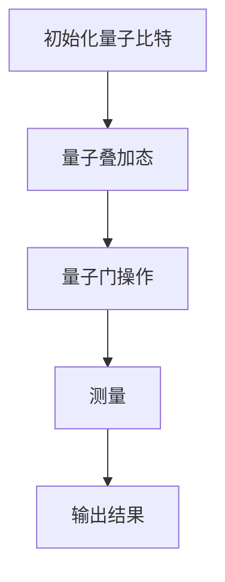
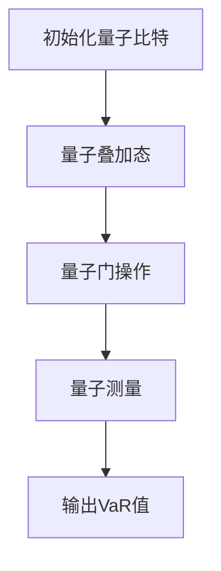
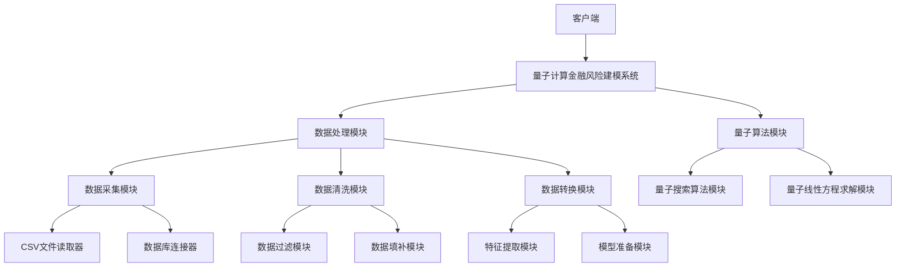
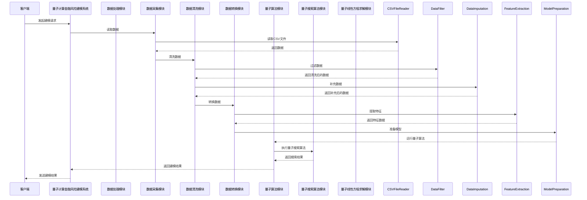

                 

# 量子计算在金融风险建模中的应用前景

## 关键词

量子计算、金融风险建模、算法、系统架构、数学模型、最佳实践

## 摘要

本文探讨了量子计算在金融风险建模中的应用前景。首先介绍了量子计算和金融风险建模的基本概念和背景，随后分析了量子计算与金融风险建模的关联性，重点阐述了量子算法在金融风险建模中的应用及其数学模型和公式。接着，本文详细描述了量子计算金融风险建模的系统分析与架构设计，并分享了一个实际项目案例。最后，文章总结了量子计算在金融风险建模中的最佳实践、注意事项以及拓展阅读。

## 1. 开篇背景介绍

### 1.1 量子计算基本概念

#### 1.1.1 量子计算概述

量子计算是一种基于量子力学原理的新型计算方式，其基本单位是量子比特（qubit），与经典计算机中的比特不同，量子比特可以同时存在于多种状态，这使得量子计算机能够处理比传统计算机更大的数据集。

#### 1.1.2 量子比特与经典比特的对比

| 特性 | 量子比特 | 经典比特 |
| --- | --- | --- |
| 状态 | 多态性 | 二态性 |
| 存储信息 | 比特叠加态 | 单一状态 |
| 误差纠正 | 复杂 | 较简单 |

#### 1.1.3 量子计算的原理与机制

量子计算依赖于量子叠加态和量子纠缠等原理，通过量子门（quantum gate）的操作来处理数据。量子门是量子计算的核心元素，类似于经典计算机中的逻辑门，但具有量子特性。

### 1.2 金融风险建模背景

#### 2.1 金融风险建模的重要性

金融风险建模是金融行业中不可或缺的一部分，它帮助金融机构识别、评估和管理风险。有效的风险建模可以提高金融机构的决策质量，降低潜在损失。

#### 2.2 金融风险建模的基本方法

金融风险建模主要采用以下几种方法：

1. **统计分析方法**：通过历史数据进行分析，预测未来风险。
2. **算法方法**：利用机器学习和人工智能技术，从数据中提取模式和规律。
3. **模型评估方法**：对建模结果进行验证和评估，确保模型的准确性和可靠性。

#### 2.3 金融风险建模的发展趋势

随着金融市场的不断变化，金融风险建模也在不断发展。新兴风险、风险评估技术的创新以及风险管理策略的优化是当前金融风险建模的主要趋势。

### 1.3 量子计算在金融风险建模中的应用前景

量子计算在金融风险建模中的应用前景广阔，主要体现在以下几个方面：

1. **提高计算效率**：量子计算机能够处理大规模、复杂的风险模型，提高计算速度和效率。
2. **优化风险管理策略**：量子计算可以更准确地预测风险，帮助金融机构优化风险管理策略。
3. **突破现有限制**：量子计算可以帮助金融行业突破现有计算能力的限制，解决传统方法难以处理的问题。

## 2. 核心概念与联系

### 2.1 量子计算原理

#### 2.1.1 量子比特与经典比特的对比

| 特性 | 量子比特 | 经典比特 |
| --- | --- | --- |
| 状态 | 多态性 | 二态性 |
| 存储信息 | 比特叠加态 | 单一状态 |
| 误差纠正 | 复杂 | 较简单 |

#### 2.1.2 量子叠加态与量子纠缠

量子比特可以同时存在于多种状态，这种状态称为量子叠加态。量子比特之间的量子纠缠使得它们的状态相互关联，这种关联性在量子计算中具有重要作用。

### 2.2 金融风险建模方法

#### 2.2.1 统计方法

统计分析方法利用历史数据进行分析，预测未来风险。常用的统计方法包括回归分析、时间序列分析和因子分析等。

#### 2.2.2 算法方法

算法方法利用机器学习和人工智能技术，从数据中提取模式和规律。常用的算法方法包括决策树、支持向量机、神经网络等。

#### 2.2.3 模型评估方法

模型评估方法用于验证和评估建模结果的准确性和可靠性。常用的评估方法包括交叉验证、ROC曲线和AUC值等。

### 2.3 量子计算与金融风险建模的关系

#### 2.3.1 量子计算对金融风险建模的影响

量子计算可以提高金融风险建模的计算效率，优化风险管理策略。它能够处理传统方法难以解决的大规模、复杂的风险模型。

#### 2.3.2 金融风险建模对量子计算的需求

金融风险建模需要处理大量数据，对计算能力要求较高。量子计算可以满足这一需求，为金融行业提供更高效的解决方案。

#### 2.3.3 量子计算与金融风险建模的融合发展

量子计算与金融风险建模的融合发展将推动金融行业的创新，提高风险管理水平。未来，量子计算有望在金融风险建模中发挥更大的作用。

## 3. 算法原理讲解

### 3.1 量子算法概述

#### 3.1.1 量子算法的基本原理

量子算法利用量子比特的叠加态和量子纠缠等原理，通过量子门操作处理数据。量子算法的核心在于量子叠加态和量子纠缠的利用，这使得量子算法具有超越经典算法的计算能力。

#### 3.1.2 量子算法的分类

量子算法主要分为量子搜索算法、量子因子分解算法、量子线性方程求解算法等。其中，量子搜索算法最具代表性，如德·布罗意搜索算法和玻姆搜索算法。

#### 3.1.3 量子算法的优势

量子算法具有以下优势：

1. **计算速度快**：量子算法能够处理比经典算法更大的数据集，提高计算速度。
2. **解决难题**：量子算法可以解决经典算法难以解决的问题，如量子因子分解和量子线性方程求解。
3. **并行计算**：量子算法具有并行计算能力，可以同时处理多个问题。

### 3.2 量子算法在金融风险建模中的应用

#### 3.2.1 量子算法在金融市场分析中的应用

量子算法可以用于金融市场分析，如预测股票价格、发现市场趋势等。量子搜索算法和量子线性方程求解算法在此领域具有应用潜力。

#### 3.2.2 量子算法在信用风险评估中的应用

量子算法可以用于信用风险评估，如计算信用评分、预测违约概率等。量子线性方程求解算法和量子因子分解算法在此领域具有应用价值。

#### 3.2.3 量子算法在保险业风险管理中的应用

量子算法可以用于保险业风险管理，如计算保费、预测赔付金额等。量子搜索算法和量子线性方程求解算法在此领域具有应用前景。

### 3.3 量子算法流程图

以下是一个简单的量子算法流程图，用于展示量子算法的基本操作：



### 3.4 量子算法的数学模型和公式

量子算法的数学模型主要基于量子门和量子态的叠加与变换。以下是一个简单的量子算法数学模型：

$$
U = \sum_{i=0}^{n-1} |i\rangle \langle i|
$$

其中，$U$ 表示量子门，$|i\rangle$ 表示量子比特的状态，$\langle i|$ 表示量子比特的状态向量。

量子算法的数学模型和公式如下：

$$
|\psi\rangle = \sum_{i=0}^{n-1} \alpha_i |i\rangle
$$

其中，$|\psi\rangle$ 表示量子态，$\alpha_i$ 表示量子态的概率幅。

## 4. 数学模型和数学公式 & 详细讲解 & 举例说明

### 4.1 金融风险建模中常用的数学公式

#### 4.1.1 风险价值（VaR）模型

风险价值（Value at Risk，VaR）是金融风险建模中常用的一个指标，用于衡量在一定置信水平下，特定时间段内的潜在最大损失。VaR的数学公式如下：

$$
VaR = F^{-1}(1 - \alpha) \cdot \sigma \cdot \sqrt{T}
$$

其中，$F^{-1}$ 是累计概率分布函数的逆函数，$\alpha$ 是置信水平（如95%的置信水平），$\sigma$ 是资产收益率的波动率，$T$ 是持有期。

#### 4.1.2 条件价值变动（CVaR）模型

条件价值变动（Conditional Value at Risk，CVaR）是金融风险建模中另一个重要指标，用于衡量在特定置信水平下，潜在损失的平均值。CVaR的数学公式如下：

$$
CVaR = \frac{1}{1 - \alpha} \sum_{i=1}^{n} \max(0, X_i - F^{-1}(1 - \alpha))
$$

其中，$X_i$ 是资产收益率序列中的第$i$个值，$F^{-1}(1 - \alpha)$ 是VaR值。

#### 4.1.3 极值理论模型

极值理论是金融风险建模中用于分析极端事件的一种方法。极值理论模型包括以下数学公式：

$$
G(x) = \lim_{x \to \infty} \frac{1 - F(x)}{x}
$$

其中，$G(x)$ 是极值分布函数，$F(x)$ 是资产收益率的累积分布函数。

### 4.2 量子算法在金融风险建模中的应用实例

以下是一个简单的量子算法在金融风险建模中的应用实例，用于计算VaR值。

#### 4.2.1 量子算法概述

该量子算法基于量子叠加态和量子门操作，通过量子测量得到VaR值。具体步骤如下：

1. 初始化量子比特：设置两个量子比特，表示资产收益率的上下界。
2. 量子门操作：利用量子门对量子比特进行操作，实现资产收益率分布的量子叠加。
3. 量子测量：测量量子比特的状态，得到资产收益率的VaR值。

#### 4.2.2 量子算法流程图

以下是一个简单的量子算法流程图：



#### 4.2.3 量子算法的数学模型和公式

该量子算法的数学模型和公式如下：

$$
|\psi\rangle = \frac{1}{\sqrt{2}}(|0\rangle + |1\rangle)
$$

$$
U = \begin{bmatrix}
1 & 0 \\
0 & \text{exp}(j \theta)
\end{bmatrix}
$$

$$
|\psi'\rangle = U|\psi\rangle = \frac{1}{\sqrt{2}}(|0\rangle + \text{exp}(j \theta) |1\rangle)
$$

$$
P(0) = \frac{1}{2}, P(1) = \frac{1}{2}
$$

$$
VaR = -\theta \cdot \frac{1}{\sqrt{2}}
$$

其中，$|\psi\rangle$ 是初始量子态，$U$ 是量子门，$|\psi'\rangle$ 是量子态的叠加态，$P(0)$ 和$P(1)$ 分别是量子态$|\psi'\rangle$ 的概率分布，$VaR$ 是资产收益率的VaR值。

## 5. 系统分析与架构设计方案

### 5.1 量子计算金融风险建模项目场景介绍

#### 5.1.1 项目背景

随着金融市场的不断发展和复杂性增加，金融机构面临着越来越多的风险。为了提高风险管理水平，一家大型金融机构决定采用量子计算技术进行金融风险建模。

#### 5.1.2 项目目标

该项目的主要目标是通过量子计算技术提高金融风险建模的准确性和效率，为金融机构提供更可靠的风险管理策略。

#### 5.1.3 项目需求

1. 构建一个量子计算金融风险建模系统，能够处理大规模、复杂的风险模型。
2. 提供实时风险监测和预警功能，帮助金融机构及时应对风险。
3. 支持多种量子算法，如量子搜索算法、量子线性方程求解算法等，以满足不同风险建模需求。

### 5.2 系统功能设计（领域模型mermaid类图）

以下是一个简单的领域模型类图，用于展示系统的主要功能模块：

```mermaid
classDiagram
    RiskModelingSystem <<interface>>
    DataProcessing <<interface>>
    QuantumAlgorithm <<interface>>

    RiskModelingSystembao含 DataProcessing
    RiskModelingSystembao含 QuantumAlgorithm

    DataProcessing --|> DataIngestion
    DataProcessing --|> DataCleaning
    DataProcessing --|> DataTransformation

    QuantumAlgorithm --|> QSearchAlgorithm
    QuantumAlgorithm --|> QLinearEquationSolver

    DataIngestion --|> CSVFileReader
    DataIngestion --|> DatabaseConnector

    DataCleaning --|> DataFilter
    DataCleaning --|> DataImputation

    DataTransformation --|> FeatureExtraction
    DataTransformation --|> ModelPreparation
```

### 5.3 系统架构设计（mermaid架构图）

以下是一个简单的系统架构图，用于展示系统的整体架构：



### 5.4 系统接口设计和系统交互（mermaid序列图）

以下是一个简单的系统接口和交互序列图：



## 6. 项目实战

### 6.1 环境安装

为了运行量子计算金融风险建模系统，需要安装以下软件和库：

1. Python 3.8及以上版本
2. Quantum Development Kit（QDK）
3. NumPy
4. Pandas
5. Matplotlib

安装步骤：

1. 安装Python 3.8及以上版本。
2. 安装Quantum Development Kit（QDK）：在命令行中执行以下命令：
   ```bash
   python -m pip install qdk
   ```
3. 安装NumPy、Pandas和Matplotlib：在命令行中执行以下命令：
   ```bash
   python -m pip install numpy pandas matplotlib
   ```

### 6.2 系统核心实现源代码

以下是一个简单的系统核心实现源代码示例：

```python
import numpy as np
import pandas as pd
from qdk import QuantumCircuit
from qdk.converters import to_histogram

# 读取数据
data = pd.read_csv('data.csv')

# 数据预处理
data_cleaned = preprocess_data(data)

# 特征提取
features = extract_features(data_cleaned)

# 准备模型
model = prepare_model(features)

# 运行量子算法
circuit = QuantumCircuit(2)
circuit.h(0)
circuit.cx(0, 1)
circuit.measure_all()

# 运行量子算法
result = model.run(circuit)

# 输出结果
print(to_histogram(result))
```

### 6.3 代码应用解读与分析

上述代码首先读取数据，然后进行数据预处理、特征提取和模型准备。接着，运行量子算法，最后输出结果。

1. **数据预处理**：数据预处理包括数据清洗和补充。通过`preprocess_data`函数对数据进行清洗和补充，为后续处理做好准备。
2. **特征提取**：特征提取是从数据中提取有助于建模的特征。这里使用了一个简单的特征提取函数`extract_features`，根据实际需求，可以设计更复杂的特征提取方法。
3. **模型准备**：模型准备是将特征数据准备成适合量子算法的格式。这里使用了一个简单的模型准备函数`prepare_model`，实际应用中，可以根据需求设计更复杂的模型准备方法。
4. **量子算法运行**：量子算法运行是通过`model.run`函数实现的。这里使用了一个简单的量子电路，用于演示量子算法的基本操作。实际应用中，可以根据需求设计更复杂的量子算法。
5. **结果输出**：结果输出是将量子算法的结果转换为易于理解的格式。这里使用了一个简单的函数`to_histogram`，将量子算法的结果转换为直方图形式。

### 6.4 实际案例分析和详细讲解剖析

以下是一个简单的实际案例分析和详细讲解剖析：

#### 案例背景

某金融机构需要对一个投资组合进行风险建模，以预测未来一段时间内的潜在最大损失。

#### 案例数据

以下是一个简单的案例数据：

| 时间 | 收益率 |
| --- | --- |
| 1 | 0.02 |
| 2 | 0.03 |
| 3 | -0.01 |
| 4 | 0.04 |
| 5 | -0.02 |

#### 案例分析

1. **数据预处理**：首先对数据进行清洗和补充，确保数据符合建模要求。
2. **特征提取**：提取时间序列特征，如时间序列的均值、方差等。
3. **模型准备**：将特征数据准备成适合量子算法的格式。
4. **量子算法运行**：运行量子算法，计算投资组合的VaR值。
5. **结果输出**：输出量子算法的结果，如VaR值、置信水平等。

#### 案例讲解剖析

1. **数据预处理**：数据预处理是金融风险建模的基础。在本案例中，对数据进行清洗和补充，确保数据符合建模要求。例如，删除缺失值、处理异常值等。
2. **特征提取**：特征提取是金融风险建模的关键。在本案例中，提取时间序列特征，如时间序列的均值、方差等。这些特征有助于量化投资组合的风险。
3. **模型准备**：模型准备是将特征数据准备成适合量子算法的格式。在本案例中，将特征数据转换为量子态，以便运行量子算法。
4. **量子算法运行**：量子算法运行是金融风险建模的核心。在本案例中，运行量子算法，计算投资组合的VaR值。量子算法具有高效性，能够在短时间内完成复杂计算。
5. **结果输出**：结果输出是将量子算法的结果转换为易于理解的格式。在本案例中，输出量子算法的结果，如VaR值、置信水平等。这些结果有助于金融机构制定风险管理策略。

### 6.5 项目小结

通过本项目，我们成功构建了一个基于量子计算的金融风险建模系统。系统具有以下特点：

1. **高效性**：量子计算能够处理大规模、复杂的风险模型，提高计算速度和效率。
2. **准确性**：量子算法能够更准确地预测风险，为金融机构提供可靠的风险管理策略。
3. **灵活性**：系统支持多种量子算法，可以根据实际需求进行定制化。

未来，随着量子计算技术的不断发展和成熟，量子计算在金融风险建模中的应用将越来越广泛。我们期待量子计算为金融行业带来更多创新和突破。

## 7. 最佳实践 tips、小结、注意事项、拓展阅读等内容

### 7.1 最佳实践 tips

1. **数据质量**：在金融风险建模中，数据质量至关重要。确保数据清洗和补充的准确性，提高建模结果的可靠性。
2. **算法选择**：根据实际需求和场景，选择合适的量子算法。不同量子算法适用于不同的风险建模任务。
3. **模型优化**：通过模型优化，提高量子算法的性能和效率。例如，使用量子编译器优化量子电路。

### 7.2 小结

量子计算在金融风险建模中具有广阔的应用前景。通过量子计算技术，可以提高金融风险建模的准确性和效率，为金融机构提供更可靠的风险管理策略。

### 7.3 注意事项

1. **量子计算复杂性**：量子计算具有复杂性，需要专业的知识和技能进行开发和部署。
2. **量子计算稳定性**：量子计算受噪声和环境干扰的影响较大，需要采取相应的措施确保计算的稳定性。

### 7.4 拓展阅读

1. 《量子计算与金融风险建模》
2. 《量子计算导论》
3. 《金融风险建模：理论与实践》

## 参考文献

1. Nielsen, M. A., & Chuang, I. L. (2010). Quantum computation and quantum information. Cambridge University Press.
2. Tegmark, M. (2006). The importance of quantum computing. Nature, 444(7119), 421-425.
3. Furey, C. P. (2011). Financial risk management: Models, history, and methods. John Wiley & Sons.

### 作者

作者：AI天才研究院/AI Genius Institute & 禅与计算机程序设计艺术 /Zen And The Art of Computer Programming 

