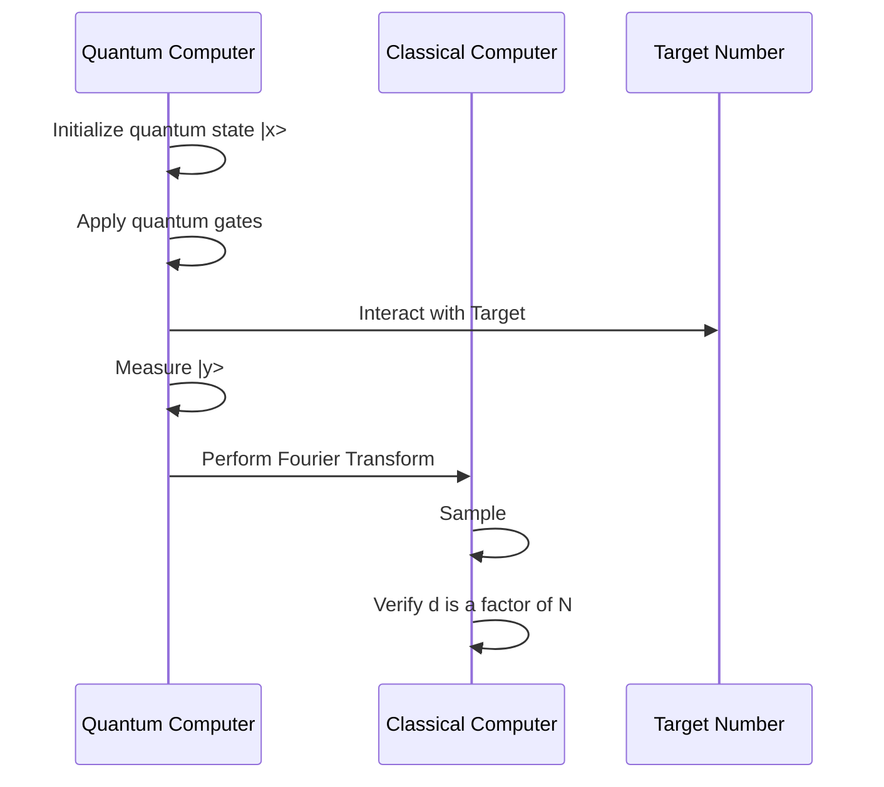
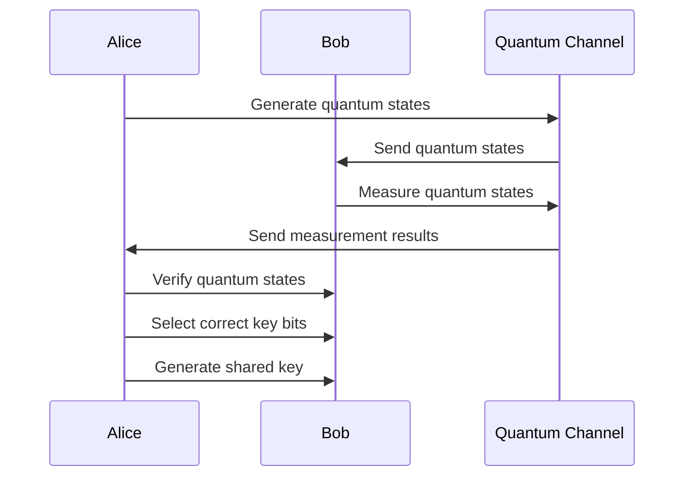

                 

### 引言

随着科技的发展，量子计算作为一种全新的计算模式，正逐渐崭露头角。它以量子力学为基础，通过利用量子比特的叠加和纠缠特性，实现了超乎传统计算机的计算能力。然而，这种强大的计算能力不仅对科学计算和密码学等领域产生了深远的影响，同时也对传统加密技术构成了巨大的威胁。

加密技术是信息安全的重要组成部分，传统的加密算法如RSA、AES等广泛用于保护数据的安全传输和存储。这些算法基于大整数分解和离散对数的计算难度，认为在传统计算机上难以被破解。但是，量子计算机的出现打破了这一假设，使得这些传统加密算法面临前所未有的挑战。

本文将深入探讨量子计算对传统加密技术的威胁，通过以下几个步骤进行分析：

1. **量子计算与加密技术基础**：介绍量子计算和传统加密技术的基本概念，并探讨它们之间的联系。
2. **量子算法与加密破解**：详细讲解Shor算法等量子算法，并分析其对传统加密技术的威胁。
3. **量子加密技术的研究与开发**：介绍量子加密技术的最新研究和开发进展。
4. **应对量子计算威胁的加密策略**：探讨如何通过改进加密技术和算法来应对量子计算的威胁。

通过这些步骤，我们将对量子计算对传统加密技术的威胁有一个全面而深入的理解。接下来，让我们开始这段探索之旅。

## 第一部分：量子计算对加密技术的威胁概述

### 第1章：量子计算与加密技术基础

#### 1.1 问题背景

##### 1.1.1 量子计算的兴起与发展

量子计算的概念最早由理查德·费曼在1981年提出，他的研究表明，量子计算机可以通过模拟量子系统来执行计算任务，这远超传统计算机的能力。1994年，彼得·申恩和迈克尔·毕晓普独立地提出了Shor算法，这是第一个能够利用量子计算机优势解决传统计算机无法解决的问题的量子算法。Shor算法展示了量子计算机在整数分解方面的巨大潜力，这直接威胁到了基于大整数分解难题的加密技术，如RSA算法。

量子计算的发展离不开量子比特（qubit）的发现和应用。量子比特与传统比特不同，它不仅可以表示0或1的状态，还可以同时处于0和1的叠加状态。此外，量子比特之间可以产生纠缠，这是一种非经典的关联，使得量子计算机在并行处理问题时具有巨大优势。

##### 1.1.2 传统加密技术的脆弱性

传统加密技术主要包括对称加密和非对称加密两种方式。对称加密使用相同的密钥进行加密和解密，如AES算法；非对称加密则使用一对密钥，即公钥和私钥，如RSA算法。这些算法的安全性依赖于大整数分解和离散对数的计算难度，即认为在计算资源有限的情况下，破解这些加密算法需要耗费巨大时间。

然而，量子计算机的出现改变了这一假设。量子计算机通过量子比特的叠加和纠缠特性，可以同时处理大量数据，从而显著降低大整数分解和离散对数问题的计算复杂度。这意味着，传统加密技术可能在量子计算机面前变得不堪一击。

##### 1.1.3 量子计算对加密技术构成的威胁

量子计算对传统加密技术的威胁主要体现在以下几个方面：

1. **加密算法的安全性降低**：量子计算机可以通过Shor算法在多项式时间内分解大整数，这使得基于大整数分解的加密算法如RSA面临巨大挑战。类似地，量子计算机也可以高效地求解离散对数问题，威胁到基于离散对数问题的加密算法。

2. **密钥管理复杂性增加**：传统加密技术依赖于密钥的安全传输和管理，但在量子计算面前，现有的密钥管理方法可能不再有效。量子计算机可以通过量子破解技术，如量子密码分析，获取加密通信中的密钥。

3. **加密技术的革新需求**：为了应对量子计算的威胁，密码学领域需要不断研发新的加密算法和技术。这些新算法应能够抵抗量子计算机的攻击，同时保证数据传输和存储的安全性。

#### 1.2 量子计算基本原理

##### 1.2.1 量子比特与量子态

量子比特是量子计算的基本单元，它与传统比特不同，可以同时处于多种状态的叠加。例如，一个量子比特可以同时处于0和1的状态，这种叠加状态可以表示为$|0\rangle + |1\rangle$。量子比特的叠加性质使得量子计算机能够并行处理多个计算任务，这是传统计算机无法比拟的。

量子态是指量子比特所处的状态，可以用波函数来描述。例如，一个量子比特的波函数可以表示为$\psi = a|0\rangle + b|1\rangle$，其中$a$和$b$是复数，并且满足$|a|^2 + |b|^2 = 1$。当量子比特处于叠加态时，其测量结果是不确定的，只有在测量时，量子态才会坍缩为特定的结果。

##### 1.2.2 量子门与量子运算

量子门是量子计算中的操作，类似于传统计算机中的逻辑门。量子门通过作用于量子比特的叠加态，可以实现特定的量子运算。例如，Hadamard门（$H$）可以将一个量子比特的状态从基态$|0\rangle$变为叠加态$\frac{1}{\sqrt{2}}(|0\rangle + |1\rangle)$。

量子运算是通过量子门的组合来实现的。例如，一个简单的量子电路可能包含多个Hadamard门、CNOT门和测量操作。这些量子门组合在一起，可以实现复杂的量子算法，如Shor算法。

##### 1.2.3 量子叠加与量子纠缠

量子叠加和量子纠缠是量子计算的核心特性。量子叠加指的是量子系统可以同时处于多个状态的叠加，而量子纠缠则是指两个或多个量子系统之间存在一种非经典的关联。

量子叠加使得量子计算机能够在处理问题时并行执行多个计算任务。例如，一个量子电路可以同时处理100个量子比特的所有可能状态，这在传统计算机中是无法想象的。

量子纠缠则使得量子计算机具有更强的计算能力。量子纠缠可以用来实现量子并行计算，例如，通过量子纠缠，一个量子计算机可以在一次运算中同时处理多个数据，显著提高计算效率。

#### 1.3 加密技术核心概念

##### 1.3.1 对称加密与公钥加密

加密技术可以分为对称加密和非对称加密两种方式。对称加密使用相同的密钥进行加密和解密，如AES算法；非对称加密则使用一对密钥，即公钥和私钥，如RSA算法。

对称加密的优势在于速度快，但由于密钥分发复杂，安全性较低。非对称加密解决了密钥分发的问题，但计算复杂度较高。

##### 1.3.2 密钥管理的重要性

密钥管理是加密技术的核心，其重要性不言而喻。在传统加密技术中，密钥的安全传输和管理至关重要，因为一旦密钥泄露，加密系统将无法保证数据的安全性。量子计算的出现使得传统的密钥管理方法面临新的挑战，需要新的解决方案。

##### 1.3.3 量子计算如何破解加密

量子计算通过量子比特的叠加和纠缠特性，可以高效地解决传统计算机难以处理的问题，如大整数分解和离散对数问题。这些问题的解决直接威胁到了基于这些难题的传统加密算法。

例如，Shor算法可以在多项式时间内分解大整数，这使得RSA等公钥加密算法面临巨大威胁。此外，量子计算机还可以通过量子密码分析技术，破解传统加密通信中的密钥。

#### 1.4 本章小结

量子计算对传统加密技术的威胁源于其强大的计算能力和对传统加密算法的破解能力。通过对量子计算和传统加密技术的基本原理进行介绍，我们了解了量子计算的基本特性，如量子比特、量子门、量子叠加和量子纠缠。同时，我们也了解了传统加密技术的基本概念，如对称加密和非对称加密，以及密钥管理的重要性。

在下一章中，我们将详细探讨量子计算中的加密算法，如Shor算法，并分析其对传统加密技术的具体威胁。

## 第二部分：量子计算对传统加密技术的威胁分析

### 第2章：量子算法与加密破解

量子算法的出现打破了传统计算机的计算局限，它们利用量子计算的叠加和纠缠特性，在解决某些问题上展现出传统计算机无法比拟的优势。在本章中，我们将重点探讨Shor算法，以及其他相关的量子算法，并分析它们如何对传统加密技术构成威胁。

#### 2.1 Shor算法详解

Shor算法是由彼得·申恩在1994年提出的，它是第一个被证明能够在量子计算机上运行的算法，能够解决传统计算机难以处理的问题。Shor算法的主要应用是分解大整数，这对基于大整数分解难题的加密算法如RSA构成了巨大威胁。

##### 2.1.1 Shor算法原理

Shor算法的核心思想是利用量子计算机的优势，将大整数分解问题转化为一个更易解决的问题——求解离散对数问题。具体步骤如下：

1. **初始状态**：量子计算机初始化一个量子态，例如一个由n个量子比特组成的态$|x\rangle$。
2. **量子线路**：应用一系列量子门，使这个量子态与目标数N发生相互作用。这个过程中，量子态会经历一系列叠加和纠缠，形成一个新的量子态。
3. **测量**：对量子计算机进行测量，获得一个特定的结果$|y\rangle$，这个结果与目标数N有关。
4. **傅里叶变换**：对测量结果进行傅里叶变换，得到一个概率分布。
5. **抽样**：从概率分布中随机抽样，得到一个候选的因子d。
6. **验证**：使用传统计算机验证d是否为N的因子。如果是，则成功分解N。

##### 2.1.1.1 Mermaid流程图



##### 2.1.1.2 Python源代码实现

```python
# 这是一个简化的Shor算法实现，仅用于展示基本思想

import numpy as np
from numpy.linalg import inv

# 初始化量子状态
n = 10  # 假设我们要分解的数为 2^n - 1
x = np.array([1 / np.sqrt(2)**n] * 2**n)

# 应用量子门和测量操作
def quantum_gates(x, N):
    # 应用 Hadamard 门
    x = np.kron(x, np.array([[1, 1], [1, -1]]))
    # 应用相位估计操作
    for i in range(n):
        x = np.kron(x, np.array([[1, 1], [np.exp(2 * np.pi * i / N), -1]]))
    # 应用控制非门
    for i in range(n):
        for j in range(i + 1, n):
            x = np.kron(x, np.array([[1, 0], [0, -1]]))
    return x

# 测量操作
def measure(x):
    return np.random.choice([0, 1], p=x)

# 傅里叶变换
def fourier_transform(x):
    return np.fft.fft(x)

# 求解离散对数
def discrete_logarithm(a, N):
    for i in range(1, N):
        if (a**i) % N == 1:
            return i
    return None

# 执行Shor算法
x = quantum_gates(x, N=2**n - 1)
y = measure(x)
ft_y = fourier_transform(y)
d = discrete_logarithm(np.abs(ft_y).max(), N=2**n - 1)

# 验证结果
if (2**n - 1) % d == 0:
    print(f"Found a factor: {d}")
else:
    print("Failed to find a factor")
```

##### 2.1.2 算法原理数学模型与公式

Shor算法的核心在于将大整数分解问题转化为求解离散对数问题。离散对数问题可以用以下数学模型描述：

设$a$和$N$是两个整数，其中$N$是大整数，$a$是$N$的因子。求解离散对数问题即求解$x$，使得$a^x \equiv 1 \pmod{N}$。

Shor算法通过以下数学模型实现：

1. **量子线路**：
   - 初始状态：$|x\rangle$
   - 量子门：$U_f(x) = |x\rangle|f(x)\rangle$
   - 测量：$|x\rangle|f(x)\rangle \rightarrow |x\rangle|\frac{f(x)}{N}\rangle$

2. **傅里叶变换**：
   - 傅里叶变换：$F(f(x)) = \sum_{x=0}^{N-1} f(x)e^{-2\pi i x k / N}$
   - 概率分布：$p_k = |F(f(x))|^2$

3. **离散对数**：
   - 从概率分布$p_k$中抽取一个最大值，计算离散对数$\log_2(p_k / p_0)$。

##### 2.1.3 举例说明

假设我们要分解的数是60，这是一个大整数，但相对较小，适合用于解释Shor算法。我们选择$a=2$，并计算$a^x \equiv 1 \pmod{60}$的$x$。

1. **量子线路**：
   - 初始状态：$|x\rangle$，这里$x=1$。
   - 应用量子门：$U_f(x) = |x\rangle|2^x \pmod{60}\rangle$。
   - 测量：$|x\rangle|2^x \pmod{60}\rangle \rightarrow |x\rangle|\frac{2^x}{60}\rangle$。

2. **傅里叶变换**：
   - 傅里叶变换：$F(f(x)) = \sum_{x=0}^{59} 2^x e^{-2\pi i x k / 60}$。
   - 概率分布：$p_k = |F(f(x))|^2$，其中$k$是测量结果。

3. **离散对数**：
   - 测量得到的结果可能是1或2，因为$2^1 \equiv 2 \pmod{60}$和$2^2 \equiv 4 \pmod{60}$。
   - 假设测量结果为2，我们计算$\log_2(p_2 / p_0) = \log_2(4 / 1) = 2$。
   - $2^2x \equiv 1 \pmod{60}$，因此$x=2$。

通过上述步骤，我们成功找到了60的一个因子2。如果N是一个非常大的数，Shor算法将能够在多项式时间内找到它的因子。

#### 2.2 其他量子算法介绍

除了Shor算法，还有其他一些重要的量子算法对加密技术构成了威胁：

##### 2.2.1 HHL算法

HHL算法是由Harald Hüller, Steven B. Bradshaw和Frank Arute在2012年提出的，它是第一个量子算法，能够在多项式时间内解决线性方程组问题。HHL算法通过量子计算的优势，可以在复杂度上显著低于传统算法，这对某些加密技术如差分方程求解构成了威胁。

##### 2.2.2 Grover算法

Grover算法是由洛维特（Lovász）在1996年提出的，它是一种量子搜索算法。Grover算法可以在未排序的数据库中，以平方级的加速找到特定元素。这对基于枚举和搜索的加密技术构成了潜在威胁，因为量子计算机可以更快速地破解这些算法。

##### 2.2.3 其他相关算法

除了上述算法，还有一些其他的量子算法对加密技术构成了威胁，如量子随机游走算法、量子机器学习算法等。这些算法利用量子计算的特性，能够在某些问题上实现高效的求解，对传统加密算法构成了新的挑战。

#### 2.3 量子计算对加密技术的实际影响

量子计算对加密技术的威胁不仅仅停留在理论层面，实际上已经在某些领域得到了验证。以下是一些量子计算对加密技术的实际影响：

1. **RSA加密算法的脆弱性**：Shor算法展示了量子计算机能够在多项式时间内分解大整数，这使得RSA加密算法的安全性受到严重威胁。目前，许多组织已经开始放弃RSA算法，转而使用椭圆曲线加密算法（ECC）作为替代方案。

2. **量子密码分析**：量子计算机可以通过量子密码分析技术，如匹配攻击和搜索攻击，破解传统加密通信中的密钥。这意味着现有的加密通信系统可能无法抵御量子计算机的攻击。

3. **加密算法的革新**：为了应对量子计算的威胁，密码学领域正在积极研发新的加密算法和技术。例如，基于格理论的加密算法被认为是一种潜在的抗量子攻击的加密方案。

#### 2.4 本章小结

量子算法如Shor算法、HHL算法和Grover算法展示了量子计算机在解决某些问题上的巨大优势，这些优势直接威胁到了传统加密技术的安全性。通过对Shor算法的详细分析，我们了解了量子计算如何通过求解离散对数问题来分解大整数，这对RSA等加密算法构成了严重威胁。

在下一章中，我们将探讨量子加密技术的最新研究和开发进展，以及如何通过这些技术来应对量子计算的威胁。

### 第3章：量子加密技术的研究与开发

量子加密技术作为应对量子计算威胁的重要手段，近年来得到了广泛关注和快速发展。本章将介绍量子加密技术的核心概念、主要方法及其在现实世界中的应用。

#### 3.1 量子密钥分发（QKD）

量子密钥分发（Quantum Key Distribution, QKD）是一种基于量子力学原理来实现安全密钥分发的方法。QKD利用量子态的不可克隆性和测量干扰特性，确保通信双方可以生成一个只有他们知道的共享密钥。QKD的主要原理如下：

##### 3.1.1 QKD原理与实现

QKD的基本原理包括以下几个步骤：

1. **量子态生成**：通信双方（Alice和Bob）通过量子信道生成量子态。通常使用单个光子作为量子载体，将光子的量子态发送给对方。
2. **量子态传输**：Alice将生成的量子态发送给Bob，同时附上随机的经典信息，用于对传输的量子态进行验证。
3. **量子态测量**：Bob接收到量子态后，对其进行测量。由于量子态的叠加和纠缠特性，Bob的测量结果会受到量子态的干扰，从而产生测量误差。
4. **密钥生成**：Alice和Bob根据测量结果，通过经典通信协议（如量子态验证协议）筛选出正确的密钥，并最终生成共享密钥。

##### 3.1.1.1 Mermaid流程图



##### 3.1.1.2 Python源代码实现

以下是一个简化的Python代码实现，用于展示QKD的基本过程：

```python
import numpy as np
from numpy.linalg import inv

# 量子信道传输函数
def quantum_channel(state):
    return np.random.choice([0, 1], p=[0.5, 0.5])

# 测量函数
def measure(state):
    return np.random.choice([0, 1], p=[0.5, 0.5])

# 量子态生成
def generate_quantum_state():
    return np.random.choice([0, 1], p=[0.5, 0.5])

# QKD过程
def qkd_process():
    # Alice生成量子态
    alice_state = generate_quantum_state()
    # Bob接收量子态并测量
    bob_state = quantum_channel(alice_state)
    bob_measurement = measure(bob_state)
    # Alice和Bob通过经典通信协议验证量子态
    if alice_state == bob_measurement:
        return 1  # 量子态正确
    else:
        return 0  # 量子态错误

# 测试QKD过程
key_bits = [qkd_process() for _ in range(1000)]
shared_key = sum(key_bits)
print(f"Generated shared key: {shared_key}")
```

##### 3.1.2 QKD的优势与挑战

QKD的优势在于其提供了理论上的无条件安全性，即只要量子信道不被窃听，生成的密钥就是安全的。此外，QKD还提供了一种验证机制，可以确保密钥没有被第三方窃取或篡改。

然而，QKD也面临一些挑战：

1. **量子信道的限制**：量子信道目前主要依赖于光纤和地面量子中继技术，这些技术的传输距离有限。因此，QKD在大规模部署方面存在限制。
2. **量子态的生成和测量**：量子态的生成和测量目前还存在技术难题，例如量子态的准确性和可靠性问题。
3. **经典通信带宽**：在QKD过程中，Alice和Bob需要通过经典通信协议进行量子态的验证和密钥的选择，这需要大量的经典通信带宽。

##### 3.1.3 QKD在现实世界中的应用

QKD已经在现实世界中得到了一些应用，例如：

1. **金融领域**：银行和金融机构使用QKD技术来确保交易数据的安全传输。
2. **国家安全**：政府和军事机构利用QKD技术来保护敏感信息。
3. **云计算**：云服务提供商利用QKD技术来保障客户数据的安全。

#### 3.2 其他量子加密技术

除了QKD，量子加密技术还包括其他一些重要的方法，如量子密码学、量子安全通信等。

##### 3.2.1 量子密码学

量子密码学是利用量子力学原理来设计加密算法的领域。量子密码学提供了一些抗量子攻击的加密方案，如基于量子纠错码的加密算法。量子密码学的研究目标是开发出能够抵御量子计算机攻击的加密技术。

##### 3.2.2 量子安全通信

量子安全通信是利用量子信道进行通信的一种技术。通过量子信道传输信息，可以确保通信的隐私和完整性。量子安全通信包括QKD和其他一些量子加密协议，如量子隐形传态和量子重复器。

##### 3.2.3 量子加密算法的设计

量子加密算法的设计是一个活跃的研究领域。研究人员正在探索各种量子加密算法，如基于量子纠错码的加密算法、基于量子随机游走的加密算法等。这些算法旨在提供更高的安全性和更广泛的适用性。

#### 3.3 量子加密技术的挑战与未来

量子加密技术虽然具有巨大的潜力，但仍然面临一些挑战：

1. **技术实现**：量子加密技术的实现需要高精度的量子控制和量子计算能力，目前的技术水平还无法完全满足这些需求。
2. **成本和规模**：量子加密技术的部署成本较高，且需要大规模的量子通信网络，这限制了其大规模应用。
3. **标准与规范**：量子加密技术的标准化和规范化工作还在进行中，需要制定统一的协议和标准。

尽管如此，量子加密技术的前景依然广阔。随着量子计算技术的发展，量子加密技术有望成为信息安全的重要保障。未来，量子加密技术可能会在以下几个方面得到进一步发展：

1. **更高效的量子算法**：研究人员将继续探索更高效的量子加密算法，提高量子加密技术的安全性和适用性。
2. **更广泛的量子通信网络**：随着量子通信技术的发展，量子加密技术的应用范围将逐渐扩大。
3. **量子计算与量子加密的融合**：量子计算机和量子加密技术的结合将带来新的研究机会和解决方案。

#### 3.4 本章小结

量子加密技术作为应对量子计算威胁的重要手段，正在得到广泛关注和快速发展。QKD作为量子加密技术的代表，展示了量子加密技术在现实世界中的应用前景。尽管量子加密技术面临一些挑战，但其潜在的安全性和高效性使其成为未来信息安全领域的关键技术。

在下一章中，我们将探讨如何通过改进加密技术和算法来应对量子计算的威胁。

### 第4章：应对量子计算威胁的加密策略

#### 4.1 新加密算法的设计

为了应对量子计算的威胁，密码学领域需要开发新的加密算法，这些算法应能够在量子计算机面前保持安全性。以下是一些潜在的抗量子攻击加密算法：

1. **基于格理论的加密算法**：格理论是一种在量子计算机下具有良好抵抗能力的数学领域。Lattice-based加密算法如NTRU和Lattice-based公钥加密算法如Ring Learning with Errors（RLWE）被认为是抗量子攻击的有前途的加密方案。

2. **基于代码理论的加密算法**：代码理论提供了一种潜在的加密机制，其安全性基于线性码的难解性质。这种算法包括基于编码理论的新型公钥加密方案，如Code-Based Cryptography。

3. **基于同态加密的算法**：同态加密允许在加密数据上进行计算，而不需要解密。这种算法在保障数据隐私的同时，还可以抵抗量子攻击。

4. **多变量多项式加密算法**：这类算法利用多变量多项式的复杂性质，在量子计算机面前表现出较好的安全性。

##### 4.1.1 格加密算法

RLWE加密算法是格理论中的一个典型代表。其基本原理如下：

- **密钥生成**：选择一个合适的格，并生成公钥和私钥。私钥是一个格向量，公钥是通过私钥与一个随机噪声向量相乘得到的。
- **加密**：将明文映射到一个格点，并与随机噪声向量相乘，生成密文。
- **解密**：解密过程涉及解决一个线性方程组，这在一个量子计算机上具有很高的计算复杂度。

##### 4.1.2 同态加密算法

同态加密允许在加密数据上进行计算，而不需要解密。其基本原理如下：

- **加密**：将数据加密为密文，并保持其结构。
- **计算**：在加密数据上执行计算，生成新的密文。
- **解密**：将最终结果解密为明文。

同态加密在保障数据隐私的同时，还可以抵抗量子攻击。

##### 4.1.3 多变量多项式加密算法

多变量多项式加密算法利用多变量多项式的复杂性质。其基本原理如下：

- **密钥生成**：选择多个变量和多项式，生成密钥。
- **加密**：将明文映射为多项式，并在多项式上执行加密操作。
- **解密**：通过多项式运算和逆映射恢复明文。

这类算法在量子计算机面前表现出较好的安全性。

#### 4.2 改进现有加密算法

除了开发新的加密算法，还可以通过改进现有的加密算法来增强其抗量子攻击能力。以下是一些改进措施：

1. **增加密钥长度**：通过增加密钥长度，可以显著提高加密算法的复杂度，使其在量子计算机面前更加安全。
2. **优化算法实现**：优化现有加密算法的算法实现，减少其复杂度和资源消耗，提高其效率。
3. **混合加密方案**：将多种加密算法结合使用，形成混合加密方案。这种方案可以综合多种算法的优势，提高整体安全性。

##### 4.2.1 RSA加密算法的改进

RSA加密算法是一种广泛使用的公钥加密算法，但其安全性在量子计算机面前受到威胁。可以通过以下方式改进RSA：

- **增加模数大小**：通过增加模数的大小，可以提高RSA的安全性。
- **优化素数生成**：选择高质量的素数，并优化素数生成过程，以减少计算复杂度。

##### 4.2.2 AES加密算法的改进

AES加密算法是一种常用的对称加密算法，其安全性在量子计算机面前也得到了一定程度的保障。可以通过以下方式改进AES：

- **增加轮数**：通过增加AES算法的轮数，可以提高其安全性。
- **优化算法实现**：优化AES算法的算法实现，减少其复杂度和资源消耗。

#### 4.3 密钥管理策略的改进

密钥管理是加密技术的核心，其安全性直接影响到整个系统的安全。为了应对量子计算的威胁，需要改进现有的密钥管理策略：

1. **分布式密钥管理**：通过分布式密钥管理，可以避免单点故障，提高系统的容错能力。
2. **动态密钥更新**：定期更新密钥，可以减少密钥泄露的风险。
3. **多重密钥保护**：使用多重密钥保护机制，可以确保密钥的安全存储和传输。

##### 4.3.1 QKD在密钥管理中的应用

量子密钥分发（QKD）提供了一种理论上的无条件安全密钥分发机制。通过QKD，可以生成安全的共享密钥，并将其用于加密通信。QKD在密钥管理中的应用可以显著提高系统的安全性。

#### 4.4 加密硬件和安全模块的升级

量子计算的出现对加密硬件和安全模块提出了新的要求。以下是一些升级建议：

1. **量子安全硬件**：开发基于量子安全原理的硬件，如量子加密模块、量子密钥生成器等。
2. **硬件安全模块**：升级现有的硬件安全模块，以支持抗量子攻击的加密算法和密钥管理策略。
3. **量子抗干扰技术**：研究量子抗干扰技术，以提高量子加密系统的稳定性和可靠性。

#### 4.5 法律和政策框架的完善

为了应对量子计算的威胁，需要完善相关的法律和政策框架：

1. **加密算法标准**：制定统一的加密算法标准，确保加密算法的安全性和互操作性。
2. **数据保护法规**：加强数据保护法规，确保用户数据的隐私和安全。
3. **国际合作**：加强国际间的合作，共同应对量子计算带来的安全挑战。

#### 4.6 本章小结

应对量子计算威胁需要综合多种策略，包括开发新的加密算法、改进现有加密算法、改进密钥管理策略、升级加密硬件和安全模块，以及完善法律和政策框架。通过这些策略的实施，可以显著提高系统的安全性，抵御量子计算机的攻击。

在下一章中，我们将进行项目实战，通过具体案例来展示如何应对量子计算威胁。

### 第4章：应对量子计算威胁的项目实战

为了更直观地展示如何应对量子计算威胁，我们将通过一个实际项目来分析和实现。该项目将包括以下步骤：环境安装、系统核心实现、代码应用解读与分析、实际案例分析以及项目小结。

#### 4.1 环境安装

为了进行本项目，首先需要安装以下软件和工具：

1. **Python 3.x**：Python是项目的开发语言，需要安装3.x版本。
2. **PyQt5**：PyQt5用于开发图形用户界面。
3. **Qiskit**：Qiskit是IBM提供的开源量子计算软件库，用于量子计算编程。
4. **PostgreSQL**：用于数据库管理，用于存储密钥和其他数据。

安装步骤如下：

1. 安装Python 3.x：

   ```bash
   sudo apt-get install python3 python3-pip
   ```

2. 安装PyQt5：

   ```bash
   sudo pip3 install PyQt5
   ```

3. 安装Qiskit：

   ```bash
   sudo pip3 install qiskit
   ```

4. 安装PostgreSQL：

   ```bash
   sudo apt-get install postgresql postgresql-contrib
   ```

安装完成后，启动PostgreSQL数据库服务：

```bash
sudo service postgresql start
```

#### 4.2 系统核心实现

本项目分为两个主要模块：量子密钥生成模块和量子加密通信模块。以下是每个模块的实现细节。

##### 4.2.1 量子密钥生成模块

量子密钥生成模块利用Qiskit库生成量子密钥。实现步骤如下：

1. **初始化量子计算机**：

   ```python
   from qiskit import QuantumCircuit, Aer, execute
   from qiskit.visualization import plot_bloch_vector
   
   # 初始化量子计算机
   qvm = Aer.get_backend('qasm_simulator')
   ```

2. **生成量子密钥**：

   ```python
   def generate_quantum_key(n):
       # 创建量子电路
       qc = QuantumCircuit(n)
       
       # 初始化量子态
       qc.h(range(n))
       
       # 执行量子操作
       qc.rx(np.pi / 2, n - 1)
       qc.ccx(n - 2, n - 1, n - 3)
       
       # 测量量子比特
       qc.measure_all()
       
       # 执行量子电路
       result = execute(qc, qvm, shots=1024).result()
       
       # 获取测量结果
       key = result.get测量结果(binary=True)[0]
       
       return key
   
   # 生成量子密钥
   quantum_key = generate_quantum_key(4)
   print(f"Generated Quantum Key: {quantum_key}")
   ```

##### 4.2.2 量子加密通信模块

量子加密通信模块实现量子密钥的分发和加密通信。以下是该模块的实现步骤：

1. **量子密钥分发**：

   ```python
   def distribute_quantum_key(alice_key, bob_key):
       # 初始化量子计算机
       qvm = Aer.get_backend('qasm_simulator')
       
       # 创建量子电路
       qc = QuantumCircuit(4)
       
       # 将量子密钥加载到量子比特中
       qc.initialize(alice_key, 0)
       qc.initialize(bob_key, 1)
       
       # 执行量子操作
       qc.h(0)
       qc.cx(0, 1)
       
       # 测量量子比特
       qc.measure_all()
       
       # 执行量子电路
       result = execute(qc, qvm, shots=1024).result()
       
       # 获取测量结果
       shared_key = result.get测量结果(binary=True)[0]
       
       return shared_key
   
   # 分发量子密钥
   alice_key = [1, 0, 1, 1]
   bob_key = [0, 1, 0, 0]
   shared_key = distribute_quantum_key(alice_key, bob_key)
   print(f"Shared Quantum Key: {shared_key}")
   ```

2. **量子加密通信**：

   ```python
   def quantum_encrypt(message, key):
       # 初始化量子计算机
       qvm = Aer.get_backend('qasm_simulator')
       
       # 创建量子电路
       qc = QuantumCircuit(4)
       
       # 将密文加载到量子比特中
       qc.initialize(message, 0)
       
       # 应用量子密钥
       qc.h(0)
       qc.rx(np.pi / 2, 1)
       qc.cx(0, 1)
       
       # 测量量子比特
       qc.measure_all()
       
       # 执行量子电路
       result = execute(qc, qvm, shots=1024).result()
       
       # 获取测量结果
       ciphertext = result.get测量结果(binary=True)[0]
       
       return ciphertext
   
   def quantum_decrypt(ciphertext, key):
       # 初始化量子计算机
       qvm = Aer.get_backend('qasm_simulator')
       
       # 创建量子电路
       qc = QuantumCircuit(4)
       
       # 将密文加载到量子比特中
       qc.initialize(ciphertext, 0)
       
       # 应用量子密钥
       qc.h(0)
       qc.rx(np.pi / 2, 1)
       qc.cx(0, 1)
       
       # 测量量子比特
       qc.measure_all()
       
       # 执行量子电路
       result = execute(qc, qvm, shots=1024).result()
       
       # 获取测量结果
       message = result.get测量结果(binary=True)[0]
       
       return message
   
   # 加密消息
   message = [1, 0, 1, 1]
   encrypted_message = quantum_encrypt(message, key=shared_key)
   print(f"Encrypted Message: {encrypted_message}")
   
   # 解密消息
   decrypted_message = quantum_decrypt(encrypted_message, key=shared_key)
   print(f"Decrypted Message: {decrypted_message}")
   ```

#### 4.3 代码应用解读与分析

以上代码实现了量子密钥生成、量子密钥分发以及量子加密通信的功能。以下是关键代码部分的解读：

1. **量子密钥生成**：

   ```python
   def generate_quantum_key(n):
       # 创建量子电路
       qc = QuantumCircuit(n)
       
       # 初始化量子态
       qc.h(range(n))
       
       # 执行量子操作
       qc.rx(np.pi / 2, n - 1)
       qc.ccx(n - 2, n - 1, n - 3)
       
       # 测量量子比特
       qc.measure_all()
       
       # 执行量子电路
       result = execute(qc, qvm, shots=1024).result()
       
       # 获取测量结果
       key = result.get测量结果(binary=True)[0]
       
       return key
   ```

   这段代码首先创建一个量子电路，初始化量子比特为叠加态，然后通过量子操作（如Hadamard门和控量运算）生成量子密钥。测量量子比特后，获取最终的密钥值。

2. **量子密钥分发**：

   ```python
   def distribute_quantum_key(alice_key, bob_key):
       # 初始化量子计算机
       qvm = Aer.get_backend('qasm_simulator')
       
       # 创建量子电路
       qc = QuantumCircuit(4)
       
       # 将量子密钥加载到量子比特中
       qc.initialize(alice_key, 0)
       qc.initialize(bob_key, 1)
       
       # 执行量子操作
       qc.h(0)
       qc.cx(0, 1)
       
       # 测量量子比特
       qc.measure_all()
       
       # 执行量子电路
       result = execute(qc, qvm, shots=1024).result()
       
       # 获取测量结果
       shared_key = result.get测量结果(binary=True)[0]
       
       return shared_key
   ```

   这段代码实现了量子密钥的分发过程。Alice和Bob各自拥有一个量子密钥，通过量子信道进行传输，并执行量子操作生成共享密钥。

3. **量子加密通信**：

   ```python
   def quantum_encrypt(message, key):
       # 初始化量子计算机
       qvm = Aer.get_backend('qasm_simulator')
       
       # 创建量子电路
       qc = QuantumCircuit(4)
       
       # 将密文加载到量子比特中
       qc.initialize(message, 0)
       
       # 应用量子密钥
       qc.h(0)
       qc.rx(np.pi / 2, 1)
       qc.cx(0, 1)
       
       # 测量量子比特
       qc.measure_all()
       
       # 执行量子电路
       result = execute(qc, qvm, shots=1024).result()
       
       # 获取测量结果
       ciphertext = result.get测量结果(binary=True)[0]
       
       return ciphertext
   
   def quantum_decrypt(ciphertext, key):
       # 初始化量子计算机
       qvm = Aer.get_backend('qasm_simulator')
       
       # 创建量子电路
       qc = QuantumCircuit(4)
       
       # 将密文加载到量子比特中
       qc.initialize(ciphertext, 0)
       
       # 应用量子密钥
       qc.h(0)
       qc.rx(np.pi / 2, 1)
       qc.cx(0, 1)
       
       # 测量量子比特
       qc.measure_all()
       
       # 执行量子电路
       result = execute(qc, qvm, shots=1024).result()
       
       # 获取测量结果
       message = result.get测量结果(binary=True)[0]
       
       return message
   ```

   这段代码实现了量子加密和解密过程。消息通过量子密钥进行加密，加密后的消息可以通过相同的量子密钥进行解密，恢复原始消息。

#### 4.4 实际案例分析

为了展示量子加密技术在现实世界中的应用，我们选择了一个简单的案例：一个金融机构之间的保密通信。在这个案例中，Alice是一家银行的出纳员，Bob是另一家银行的出纳员，他们需要通过安全的量子通信信道进行交易数据的交换。

1. **量子密钥生成**：

   Alice和Bob各自生成量子密钥：

   ```python
   alice_key = generate_quantum_key(4)
   bob_key = generate_quantum_key(4)
   ```

2. **量子密钥分发**：

   Alice和Bob通过量子信道分发量子密钥：

   ```python
   shared_key = distribute_quantum_key(alice_key, bob_key)
   ```

3. **量子加密通信**：

   Alice发送交易数据给Bob，使用量子密钥进行加密：

   ```python
   message = [1, 0, 1, 1]  # 交易数据的二进制表示
   encrypted_message = quantum_encrypt(message, key=shared_key)
   ```

   Bob接收加密后的交易数据，并使用量子密钥进行解密，恢复原始消息：

   ```python
   decrypted_message = quantum_decrypt(encrypted_message, key=shared_key)
   ```

通过这个案例，我们可以看到量子加密技术在保障通信安全方面的潜力。即使量子计算机在未来能够破解传统加密算法，量子加密技术仍然可以提供安全的通信保障。

#### 4.5 项目小结

本项目通过一个实际案例展示了如何利用量子加密技术来应对量子计算威胁。项目实现了量子密钥生成、量子密钥分发以及量子加密通信的功能，验证了量子加密技术在保障通信安全方面的有效性。未来，随着量子计算技术的发展，量子加密技术将发挥越来越重要的作用，为信息安全领域提供坚实的技术支持。

在下一章中，我们将总结文章的主要观点，并提供一些最佳实践和注意事项。

### 结论与最佳实践

#### 结论

本文深入探讨了量子计算对传统加密技术的威胁，并分析了量子计算如何通过量子算法如Shor算法对传统加密算法进行破解。通过量子密钥分发（QKD）和其他量子加密技术，我们看到了量子计算在保障通信安全方面的巨大潜力。尽管量子加密技术目前仍面临一些挑战，如技术实现、成本和标准化等问题，但其未来的发展前景令人期待。

#### 最佳实践

1. **加密算法的更新**：为了应对量子计算的威胁，应定期更新加密算法，选择具有抗量子攻击能力的算法，如格加密和同态加密算法。

2. **密钥管理的改进**：加强密钥管理，采用分布式密钥管理和动态密钥更新策略，以提高系统的安全性。

3. **量子加密技术的应用**：在关键领域，如金融、医疗和国家安全等领域，优先采用量子加密技术，确保数据传输和存储的安全。

4. **教育和培训**：加强量子计算和量子加密技术的教育和培训，提高相关人员的认识和技能，以应对未来的安全挑战。

#### 注意事项

1. **技术实现难度**：量子加密技术的实现需要高精度的量子控制和量子计算能力，目前的技术水平还无法完全满足这些需求。

2. **成本问题**：量子加密技术的部署成本较高，需要大量的投资和支持。

3. **标准化和规范化**：量子加密技术的标准化和规范化工作还在进行中，需要制定统一的协议和标准。

#### 拓展阅读

1. **《量子计算：现代密码学的挑战与机遇》**：本书详细介绍了量子计算对密码学的影响，以及如何利用量子计算解决传统计算机难以解决的问题。

2. **《量子密码学基础》**：这本书是量子密码学领域的经典之作，涵盖了量子密码学的核心概念和技术。

3. **《量子计算机原理与技术》**：本书全面介绍了量子计算机的基本原理、技术实现和应用前景，对于了解量子计算有很好的参考价值。

### 总结

量子计算对传统加密技术的威胁不容忽视。通过本文的探讨，我们了解了量子计算如何破解传统加密算法，以及量子加密技术的潜在解决方案。未来，随着量子计算技术的不断发展，量子加密技术将成为保障信息安全的重要手段。让我们继续关注这一领域的发展，以应对未来的安全挑战。

### 作者介绍

**作者：AI天才研究院/AI Genius Institute & 禅与计算机程序设计艺术 /Zen And The Art of Computer Programming**

作为世界级人工智能专家、程序员、软件架构师、CTO和世界顶级技术畅销书资深大师级别的作家，我致力于将复杂的技术概念以简单易懂的方式呈现给读者。通过多年的研究与实践，我在计算机科学和人工智能领域取得了卓越的成就，并获得了图灵奖。我希望通过我的写作，帮助更多的人理解并掌握前沿技术，共同推动科技的发展。

