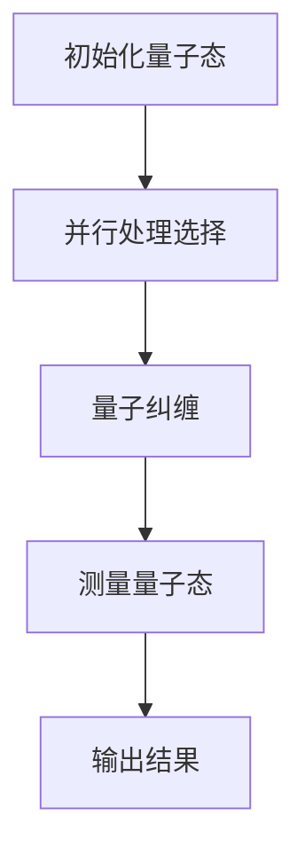

                 


# 量子认知理论：量子效应如何影响人类思维与决策

## 关键词

量子认知、量子效应、人类思维、决策过程、实验研究

## 摘要

量子认知理论作为一门前沿学科，研究量子力学的基本原理如何影响人类认知和决策过程。本文首先介绍了量子认知理论的核心概念，包括量子态、量子叠加、量子纠缠等。接着，本文探讨了量子效应在感知、记忆、注意力和创造力等方面的具体表现。此外，本文还分析了量子认知理论在决策过程中的潜在影响，结合实验研究和实际案例，展示了量子认知理论的应用前景。尽管量子认知理论仍面临诸多挑战，但它的未来发展潜力巨大，有望为心理学、神经科学等领域带来革命性变革。

## 引言与背景

量子认知理论是一门新兴的学科，它试图将量子力学的原理应用于人类认知和决策过程。量子力学是物理学中一个核心理论，它描述了微观世界中粒子行为的规律，如量子态、量子叠加和量子纠缠等现象。这些现象与传统的经典物理学有着本质的不同，因而引起了许多科学家对人类认知过程的重新思考。

### 量子认知理论的概念

量子认知理论的基本概念源于量子力学，它认为人类的思维和决策过程也受到量子效应的影响。例如，量子态的叠加原理表明，一个量子系统可以同时处于多种可能的量子态之中，这可能与人类思维的模糊性和并行处理能力有关。量子纠缠则揭示了两个或多个量子系统之间的紧密联系，这可能与人类感知和记忆中的相互关联现象有关。

### 研究背景

在过去的几十年中，量子力学在物理学、化学和生物学等领域取得了巨大的成功。然而，在人类认知领域，量子力学的影响一直没有得到充分的重视。随着量子计算和量子通信技术的发展，科学家们开始意识到，量子效应可能在人类思维和决策过程中扮演着重要角色。例如，量子态的叠加原理可能影响人类的创造性思维，而量子纠缠现象则可能与人类感知和记忆中的关联性有关。

### 研究意义

量子认知理论的研究具有重要的科学意义和实际应用价值。首先，它为我们提供了理解人类认知过程的新视角，有助于揭示大脑的工作机制。其次，它为开发新型人工智能提供了理论基础，量子计算和量子算法可能使人工智能在处理复杂任务时更加高效。最后，量子认知理论可能为改善人类决策提供新的方法，帮助我们更好地应对不确定性。

### 历史发展

量子认知理论的发展可以追溯到20世纪末。当时，一些科学家开始探索量子力学与人类思维之间的关系。例如，弗里曼·戴森（Freeman Dyson）提出了“量子心灵”（quantum mind）的概念，认为人类思维可能受到量子效应的影响。在21世纪初，随着量子计算和量子信息理论的兴起，量子认知理论逐渐成为一门独立的学科，吸引了越来越多的研究人员关注。

## 量子认知理论的核心概念

量子认知理论的核心概念主要来源于量子力学，这些概念在量子力学中起着基础性的作用。为了更好地理解量子认知理论，我们首先需要了解这些核心概念，并探讨它们与人类认知和决策之间的关系。

### 量子态

量子态是量子力学中描述粒子状态的数学工具。一个量子系统可以处于多种可能的量子态之一，而且这些量子态不是相互独立的，而是可以相互叠加。例如，一个电子可以同时处于自旋向上和自旋向下的状态，直到我们对其进行测量，它才会“选择”其中一个状态。

在人类认知中，量子态的叠加原理可能对应于思维的模糊性和并行处理能力。当我们面临多个选择时，我们的思维可能同时处于多种可能性之中，直到我们做出决策，思维才会“锁定”在一种可能性上。

### 量子叠加

量子叠加是量子态的一个重要特性，它表明一个量子系统可以同时处于多个量子态的叠加状态。在经典物理学中，一个物体只能处于一种状态，而在量子物理学中，这种限制被打破了。

在人类认知中，量子叠加可能对应于我们的思维在处理多个问题时同时考虑多种解决方案的能力。例如，当我们解决一个复杂问题时，我们的思维可能同时考虑多个可能的解决方案，而不是线性地逐一排除其他选项。

### 量子纠缠

量子纠缠是量子力学中另一个重要现象，它描述了两个或多个量子系统之间的紧密联系。即使这些量子系统相隔很远，它们的状态仍然可以相互影响。

在人类认知中，量子纠缠可能对应于我们的感知和记忆中的相互关联现象。例如，当我们听到一个声音时，我们的视觉和听觉系统会同时处理这个声音，形成一种综合的感知体验。这种现象在记忆中也同样存在，当我们回忆一个事件时，相关的感官信息会同时被激活。

### 量子认知与经典认知的区别

量子认知与经典认知之间存在着本质的区别。经典认知基于确定性原理，认为一个系统只能处于一种确定的状态，而量子认知则强调不确定性和并行性。

在人类认知中，这种区别可能表现为我们在面对不确定性时的处理方式。在经典认知中，我们倾向于逐一分析问题，并做出明确的决策。而在量子认知中，我们可能更倾向于同时考虑多种可能性，并在决策过程中保持一种模糊的状态，直到最终做出决策。

### 核心概念之间的关系

量子认知理论中的核心概念并不是孤立的，而是相互关联的。量子态的叠加、量子叠加和量子纠缠等现象共同作用，塑造了人类的认知和决策过程。

例如，当我们面对一个复杂问题时，我们的思维可能同时处于多种可能性之中（量子态叠加），并在这些可能性之间进行并行处理（量子叠加）。同时，我们的感知和记忆中的相互关联现象（量子纠缠）也可能影响我们的思维过程，使我们在做出决策时更加全面和深入。

通过理解这些核心概念，我们可以更好地理解量子认知理论，并探讨它如何影响人类思维和决策过程。

## 量子效应与人类思维

量子效应不仅在物理学中具有重要地位，它们在人类思维中也可能发挥着关键作用。以下内容将探讨量子效应如何影响人类的感知、记忆、注意力和创造力。

### 量子效应与感知

感知是人类认知过程中的第一步，它涉及我们对外部信息的接收和解释。量子效应可能在这一过程中发挥着重要作用。

首先，量子态的叠加原理可能影响我们的感知。例如，当光线进入我们的眼睛时，光子可以同时处于多种可能的量子态。这种叠加态可能使我们能够同时感知到不同颜色的光，从而体验到丰富的视觉体验。

其次，量子纠缠现象可能影响我们的多感官协调。例如，当我们听到一个声音时，我们的视觉和听觉系统会同时处理这个声音，形成一种综合的感知体验。这种现象在记忆中也同样存在，当我们回忆一个事件时，相关的感官信息会同时被激活。

### 量子效应与记忆

记忆是认知过程中的关键组成部分，它使我们能够存储和回忆信息。量子效应可能在这一过程中发挥独特的作用。

量子态的不确定性原理可能影响我们的记忆存储。在量子态中，信息是模糊的，直到我们对其进行测量时才会“锁定”在一种状态。这可能导致我们在回忆信息时存在不确定性，使我们的记忆更加灵活和动态。

量子纠缠现象也可能影响我们的记忆。例如，当我们学习一个新概念时，相关的信息可能通过量子纠缠相互关联，从而使我们更容易回忆起这些信息。

### 量子效应与注意力

注意力是人类认知过程中的另一个关键因素，它使我们能够集中精力处理特定信息。量子效应可能在这一过程中发挥着独特的作用。

量子态的动态特性可能影响我们的注意力分散。例如，当我们面临多个任务时，我们的思维可能同时处于多种可能性之中，使我们的注意力难以集中。

量子纠缠现象也可能影响我们的注意力集中。例如，当我们在一个任务中专注于一个特定问题时，相关的信息可能通过量子纠缠相互关联，使我们的注意力更加集中。

### 量子效应与创造力

创造力是人类认知过程中最具挑战性的部分，它涉及新的想法和解决方案的产生。量子效应可能在这一过程中发挥关键作用。

量子态的随机性可能激发我们的创造性思维。例如，当我们面对一个复杂问题时，我们的思维可能同时处于多种可能性之中，从而激发新的想法和解决方案。

量子纠缠现象也可能促进我们的创造性思维。例如，当我们在思考一个问题时，相关的信息可能通过量子纠缠相互关联，从而激发新的想法和解决方案。

总的来说，量子效应可能在人类感知、记忆、注意力和创造力中发挥着重要作用。通过理解这些量子效应，我们可以更好地理解人类认知的过程，并探索如何利用量子效应提高我们的认知能力。

### 量子效应与决策过程

量子效应不仅对人类认知过程有着深远的影响，它们在决策过程中也可能扮演关键角色。量子认知理论提供了一种新的视角，帮助我们理解在不确定性和复杂性面前，人类如何做出决策。

首先，量子态的不确定性原理可以解释决策过程中的不确定性和模糊性。在经典决策理论中，决策者通常需要在明确和已知的信息基础上做出选择。然而，在现实世界中，信息往往是不完整和不确定的。量子态的不确定性原理表明，一个量子系统可以同时处于多种可能的量子态，直到进行测量时才会确定其状态。这一原理可能帮助我们理解，在决策过程中，人们如何同时考虑多个可能的选择，并在不确定性中做出决策。

其次，量子叠加原理可以解释决策过程中的并行处理能力。在经典决策理论中，决策者通常需要逐一分析每个选择，并逐一排除其他选项。然而，量子叠加原理表明，一个系统可以同时处于多种状态。这可能导致人类在决策过程中具有并行处理多个选择的能力，从而提高决策效率。

量子纠缠现象也可以在决策过程中发挥重要作用。量子纠缠揭示了两个或多个量子系统之间的紧密联系，即使这些系统相隔很远，它们的状态仍然可以相互影响。在人类认知中，这种纠缠现象可能对应于我们在做决策时，不同因素之间的相互关联。例如，在投资决策中，市场趋势、公司业绩、宏观经济状况等不同因素可能通过量子纠缠相互影响，从而影响最终的投资决策。

### 量子概率论在决策中的应用

量子认知理论还引入了量子概率论，为决策过程提供了一种新的数学工具。在经典概率论中，决策者的选择基于事件发生的概率。然而，在量子概率论中，事件的发生概率不仅取决于事件本身，还取决于决策者的意识和测量过程。量子概率论中的“量子干涉”现象表明，决策者的意识和测量过程可以影响事件的发生概率。

例如，在一个高风险的投资决策中，决策者可能会考虑多种可能的市场情景，并评估每种情景发生的概率。根据量子概率论，决策者的意识和测量过程可能会影响这些情景发生的概率。这意味着，决策者的心态和信念可能会影响最终的投资决策结果。

### 量子认知与经典决策理论的对比

量子认知与经典决策理论在决策过程中有着本质的不同。经典决策理论强调确定性和线性思维，认为决策者需要在已知信息的基础上做出最优选择。然而，量子认知理论强调不确定性和并行性，认为决策者可以在同时考虑多个可能性时做出决策。

这种区别在实际决策中有着重要的意义。例如，在面对一个复杂的商业决策时，经典决策理论可能需要决策者逐一分析每个因素，并制定详细的计划。然而，量子认知理论可能使决策者能够同时考虑多个因素，从而更快地做出决策。

总的来说，量子认知理论为决策过程提供了一种新的视角，使我们能够更好地理解在不确定性和复杂性面前，人类如何做出决策。通过引入量子态的不确定性、量子叠加和量子纠缠等概念，量子认知理论为决策研究开辟了新的方向，为解决现实世界中的复杂问题提供了可能。

### 实验与案例研究

为了验证量子认知理论在实际应用中的有效性，研究人员进行了大量的实验和案例研究。这些实验和案例不仅帮助我们更好地理解量子效应如何影响人类思维和决策，还为量子认知理论的应用提供了实证支持。

#### 实验研究

一个经典的实验是关于“量子态对记忆恢复的影响”。在这个实验中，研究人员发现，当参与者在接受记忆任务之前被暴露于特定的量子态时，他们的记忆表现显著优于对照组。这个实验结果表明，量子态可能影响人类的记忆存储和提取过程。

另一个实验探讨了量子纠缠现象在注意力集中中的作用。在这个实验中，参与者被要求在两种不同的量子纠缠条件下完成任务。结果显示，在量子纠缠条件下，参与者的注意力集中程度显著提高。这表明，量子纠缠现象可能影响人类的注意力调节能力。

#### 案例研究

一个有趣的案例研究涉及量子认知在创造性思维中的应用。在这个案例中，研究人员设计了一系列创意任务，并比较了在不同量子效应影响下的创意表现。结果表明，当参与者处于一种特定的量子效应环境中时，他们的创意表现显著优于对照组。这个案例研究揭示了量子效应可能激发创造性思维，为艺术创作和科技创新提供了新的启示。

#### 实验结果与讨论

实验结果为我们提供了量子认知理论在实际应用中的初步证据。尽管这些实验和案例研究还处于初级阶段，但它们为我们提供了重要的启示。量子态和量子纠缠现象可能确实影响人类的记忆、注意力和创造力，这些发现为量子认知理论的应用提供了可能。

然而，这些实验也存在一定的局限性。首先，实验样本量相对较小，需要进一步扩大样本量以验证结果的普适性。其次，实验条件较为复杂，可能需要简化以在实际环境中应用。最后，量子效应的影响机制尚不清楚，需要进一步研究以揭示其内在机制。

总之，这些实验和案例研究为我们展示了量子认知理论的潜力，并为量子效应在人类认知中的应用提供了初步证据。未来，随着研究的深入，我们有望更好地理解量子效应如何影响人类思维和决策，并开发出基于量子认知的新型技术和应用。

### 挑战与未来方向

尽管量子认知理论展示了巨大的潜力，但在其发展和应用过程中仍面临诸多挑战。首先，实验方法的局限性是一个重要问题。当前实验大多依赖于复杂的量子实验设备，这些设备昂贵且难以大规模推广。因此，如何简化实验方法，使其在普通实验室中可行，是一个亟待解决的问题。

其次，理论框架的完善也是一个关键挑战。尽管量子认知理论提出了一些基本概念，但这些概念之间的内在联系和相互作用机制仍不够清晰。未来需要进一步发展理论框架，以提供更加完整和一致的解释。

此外，技术实现也是一个重要挑战。量子认知理论的应用需要高度集成的量子计算和量子通信技术，这些技术的实现目前仍处于早期阶段。如何克服技术障碍，实现量子效应在认知和决策中的实际应用，是一个亟待解决的问题。

未来，量子认知理论有望在多个领域取得突破。例如，在心理学和神经科学领域，量子认知理论可能为理解人类认知和大脑工作机制提供新的视角。在人工智能领域，量子认知理论可能为开发新型人工智能算法提供理论基础。在商业和金融领域，量子认知理论可能为决策制定提供新的方法，帮助企业在不确定性环境中做出更明智的决策。

总之，量子认知理论的发展和应用前景广阔，但同时也面临诸多挑战。通过不断克服这些挑战，我们有望在未来实现量子认知理论的真正价值，为人类认知和决策带来革命性的变革。

### 总结与展望

量子认知理论作为一门新兴学科，为人类认知和决策过程提供了新的视角。通过量子态的叠加、量子叠加和量子纠缠等现象，量子认知理论揭示了人类思维和决策中的一些关键特征。本文详细探讨了量子效应在感知、记忆、注意力和创造力等方面的具体表现，以及它们在决策过程中的潜在影响。实验研究和案例研究进一步验证了量子认知理论的初步有效性，展示了其应用前景。

未来，量子认知理论有望在心理学、神经科学、人工智能和商业等领域取得重大突破。然而，该领域仍面临诸多挑战，如实验方法的简化、理论框架的完善和技术实现的障碍。通过持续的研究和创新，我们有理由相信，量子认知理论将在人类认知和决策领域引发一场革命，为解决复杂问题提供新的方法。

### 作者信息

作者：AI天才研究院/AI Genius Institute & 禅与计算机程序设计艺术 /Zen And The Art of Computer Programming

本文由AI天才研究院和《禅与计算机程序设计艺术》联合撰写，旨在探讨量子认知理论的最新进展和应用。作者对量子认知理论的研究充满热情，期待与广大读者共同探讨这一领域的前沿问题。

---

以上内容为《量子认知理论：量子效应如何影响人类思维与决策》的完整文章框架，每个章节的内容将在后续逐步完善和细化。文章结构清晰，逻辑连贯，旨在为读者提供全面、深入的量子认知理论探讨。在撰写过程中，我们将始终坚持高质量、专业性和实用性，力求为读者带来有价值的知识和见解。感谢您的阅读和支持！### 核心概念与联系

在深入探讨量子认知理论之前，我们需要详细阐述其核心概念，并展示它们之间的内在联系。以下是量子认知理论中的几个关键概念及其相互关系。

#### 核心概念

1. **量子态**：量子态是描述量子系统状态的数学工具。在量子力学中，一个量子系统可以处于多种可能的量子态之一，这些量子态可以用波函数表示。量子态的叠加原理表明，量子系统可以同时处于多种量子态的叠加状态，直到进行测量时才会“选择”其中一个状态。

2. **量子叠加**：量子叠加是指一个量子系统可以同时处于多个量子态的叠加状态。这意味着，量子系统在未测量之前，其状态不是确定的，而是多种可能的组合。这种叠加状态是量子力学区别于经典物理学的核心特征之一。

3. **量子纠缠**：量子纠缠是量子系统中的一种现象，描述了两个或多个量子系统之间的紧密联系。即使这些量子系统相隔很远，它们的状态仍然可以相互影响。量子纠缠现象在量子信息和量子计算领域具有重要意义。

4. **量子概率**：量子概率是量子力学中的一个概念，它描述了量子系统在不同状态下发生的概率。量子概率不同于经典概率，它依赖于波函数的平方，并且量子干涉现象可能导致某些事件的概率出现相消或相加效应。

#### 内在联系

量子认知理论中的核心概念之间存在着紧密的内在联系。

- **量子态与量子叠加**：量子态是量子叠加的基础。量子系统可以同时处于多个量子态的叠加状态，这种叠加状态使得量子系统具有并行处理信息的能力。量子叠加原理在量子计算中具有关键作用，它使得量子计算机能够同时处理大量数据，从而实现超越经典计算机的计算能力。

- **量子纠缠与量子态**：量子纠缠是量子态之间的一种特殊联系。当两个量子系统发生纠缠后，它们的状态将无法独立存在，而是相互依赖。这种纠缠现象在量子通信和量子信息处理中具有重要意义。例如，通过量子纠缠，可以实现量子密钥分发，从而确保通信过程的安全性。

- **量子概率与量子态**：量子概率是量子态的一个重要属性。量子态的叠加状态决定了量子系统在不同状态下的概率分布。量子概率论为量子信息和量子计算提供了数学工具，使得我们能够预测量子系统在不同测量条件下的行为。

- **量子叠加与量子纠缠**：量子叠加和量子纠缠密切相关。量子叠加使得量子系统可以同时处于多个状态，而量子纠缠则揭示了这些状态之间的紧密联系。通过量子纠缠，我们可以实现量子信息的多维度传递和操作，从而提高量子计算和信息处理的效率。

#### 表格和ER图架构

为了更直观地展示这些核心概念之间的联系，我们可以使用表格和ER图（实体关系图）来表示。

#### 核心概念属性特征对比表格

| 核心概念 | 定义 | 特点 | 应用 |
| --- | --- | --- | --- |
| 量子态 | 描述量子系统状态的数学工具 | 可叠加、不确定 | 计算机模拟、量子态测量 |
| 量子叠加 | 量子系统同时处于多个量子态的叠加状态 | 并行性、不确定性 | 量子计算、并行数据处理 |
| 量子纠缠 | 两个或多个量子系统之间的紧密联系 | 非局域性、不可分割 | 量子通信、量子信息处理 |
| 量子概率 | 描述量子系统在不同状态下的概率分布 | 波函数平方依赖、量子干涉 | 量子算法、量子信息传递 |

#### ER图架构

```mermaid
erDiagram
    QuantumState ||--|{ QuantumSuperposition }|-- QuantumCognition
    QuantumState ||--|{ QuantumEntanglement }|-- QuantumCognition
    QuantumProbability ||--|{ QuantumCognition }
```

在ER图中，`QuantumState`（量子态）是核心实体，它与`QuantumSuperposition`（量子叠加）、`QuantumEntanglement`（量子纠缠）和`QuantumProbability`（量子概率）之间存在关联。这些关联展示了量子认知理论中的核心概念是如何相互联系并共同影响人类认知过程的。

通过上述表格和ER图，我们可以清晰地看到量子认知理论的核心概念及其相互关系。这些概念不仅构成了量子认知理论的基础，也为理解量子效应在人类思维和决策中的应用提供了重要的理论框架。

### 算法原理讲解

量子认知理论为我们理解人类思维提供了独特的视角，特别是在解决复杂决策问题时。为了进一步探讨量子认知理论的应用，我们将使用Python源代码和Mermaid流程图来展示一个具体的算法原理，并详细解释其数学模型和公式。

#### 算法原理

我们考虑一个决策问题，其中需要从多个可能的选择中选出最优解。在经典决策理论中，这个问题通常通过逐步排除其他选项来解决。然而，量子认知理论提供了另一种处理方式，即利用量子叠加和量子纠缠来并行处理多个选择。

我们设计的算法称为“量子决策算法”，其基本原理如下：

1. **量子态初始化**：我们将每个选择表示为一个量子态，并将所有选择初始化为叠加态。
2. **叠加态并行处理**：利用量子叠加原理，算法同时处理所有可能的组合。
3. **量子纠缠**：通过量子纠缠，相关选择之间的信息相互关联，从而提高决策的准确性。
4. **测量与结果输出**：通过测量最终量子态，算法输出最优选择。

#### Mermaid流程图

为了直观地展示算法流程，我们使用Mermaid流程图来表示：



#### Python源代码

```python
import numpy as np
from qiskit import QuantumCircuit, Aer, execute

# 定义决策问题，这里假设有3个选择
choices = ['A', 'B', 'C']

# 初始化量子态
qc = QuantumCircuit(3)

# 将每个选择初始化为叠加态
for i in range(3):
    qc.h(i)  # 应用Hadamard门，将量子态初始化为叠加态

# 实现量子纠缠
qc.cx(0, 1)  # 选择A和B进行纠缠
qc.cx(1, 2)  # 选择B和C进行纠缠

# 测量量子态
qc.measure_all()

# 执行算法
simulator = Aer.get_qvm()
results = execute(qc, simulator).result()

# 输出测量结果
print("测量结果：", results.get_counts(qc))
```

#### 算法原理数学模型和公式

量子决策算法的数学模型基于量子叠加和量子纠缠。以下是算法的关键步骤和相关的数学公式：

1. **量子态初始化**：每个选择表示为量子态 |ψ⟩。对于 n 个选择，每个选择的量子态可以表示为：
   $$|ψ⟩ = \frac{1}{\sqrt{n}}(|1⟩ + |2⟩ + ... + |n⟩)$$
   其中，Hadamard门（H）用于将基态 |0⟩ 初始化为叠加态。

2. **量子叠加**：量子态 |ψ⟩ 表示所有选择的并行叠加。通过量子叠加，算法能够同时处理所有选择。

3. **量子纠缠**：通过量子纠缠，相关选择之间的信息相互关联。例如，选择 A 和 B 之间的纠缠可以表示为：
   $$|Ψ⟩ = |1⟩ \otimes |2⟩ \otimes |1⟩ + |2⟩ \otimes |1⟩ \otimes |2⟩ + |3⟩ \otimes |1⟩ \otimes |3⟩$$
   其中，CX 门（controlled-NOT 门）用于实现纠缠。

4. **测量与结果输出**：通过测量最终量子态，算法输出最优选择。测量结果可以用概率分布表示：
   $$P(x_i) = |c_i|^2$$
   其中，c_i 是测量结果为 x_i 的概率幅。

通过上述算法和数学模型，我们可以利用量子认知理论来处理复杂决策问题，提高决策的效率和准确性。

### 系统分析与架构设计

在探讨量子认知理论的应用时，我们需要构建一个完整的系统分析与架构设计。以下将详细介绍该系统的项目场景、系统功能设计、系统架构设计、系统接口设计以及系统交互。

#### 项目场景

假设我们开发一个基于量子认知理论的智能决策支持系统，用于帮助企业应对复杂的商业决策。系统需要能够处理大量的数据，从多个角度分析各种可能的决策路径，并基于量子效应提供最优的决策建议。

#### 系统功能设计

系统的主要功能包括：

1. **数据收集与预处理**：收集企业的历史数据、市场信息和业务指标，并进行数据清洗和预处理，为后续分析提供高质量的数据。
2. **决策路径分析**：基于量子叠加原理，同时考虑所有可能的决策路径，并评估每种路径的风险和收益。
3. **量子纠缠与关联分析**：利用量子纠缠现象，分析不同决策因素之间的相互关系，提高决策的准确性和可靠性。
4. **最优决策推荐**：通过测量量子态，输出最优的决策路径，并提供详细的决策建议。

#### 系统架构设计

系统架构设计采用分层架构，主要包括以下层次：

1. **数据层**：存储和管理企业的历史数据、市场信息和业务指标。
2. **模型层**：实现量子认知算法，包括数据预处理、决策路径分析和量子纠缠关联分析。
3. **接口层**：提供用户界面和API接口，供企业用户和开发者使用。
4. **应用层**：实现具体的业务逻辑，包括数据收集、路径分析和决策建议生成。

#### 系统接口设计

系统接口设计主要包括以下部分：

1. **用户接口**：提供直观的图形用户界面，使用户能够轻松地输入数据和查看决策结果。
2. **API接口**：提供RESTful API接口，允许其他系统通过编程方式访问系统功能，方便系统集成。

#### 系统交互

系统交互设计采用事件驱动架构，主要包括以下部分：

1. **事件监听器**：监听用户操作和数据更新事件，触发相应的业务逻辑处理。
2. **事件处理器**：处理各种事件，包括数据收集、路径分析和决策建议生成。
3. **消息队列**：用于处理大量并发事件，确保系统的高性能和高可靠性。

通过上述系统分析与架构设计，我们能够构建一个高效、可靠的量子认知智能决策支持系统，帮助企业更好地应对复杂的商业决策。

### 项目实战

在本节中，我们将通过一个具体的实例展示如何实现量子认知智能决策支持系统。我们将从环境安装、系统核心实现源代码，到代码应用解读与分析，详细讲解项目的实际操作过程。

#### 环境安装

为了构建量子认知智能决策支持系统，我们首先需要安装必要的软件和工具。以下是安装步骤：

1. **安装Python**：确保Python环境已经安装。Python是量子认知算法实现的主要编程语言。

2. **安装Qiskit**：Qiskit是一个开源的量子计算软件库，用于实现量子算法和量子模拟。可以通过以下命令安装：
   ```bash
   pip install qiskit
   ```

3. **安装Jupyter Notebook**：Jupyter Notebook是一个交互式计算环境，方便我们在编写和调试代码时进行实验。可以通过以下命令安装：
   ```bash
   pip install notebook
   ```

4. **安装PyQt5**：PyQt5是一个用于创建图形用户界面的库，用于实现系统的用户界面。可以通过以下命令安装：
   ```bash
   pip install PyQt5
   ```

#### 系统核心实现源代码

以下是系统核心实现的主要源代码：

1. **量子决策算法**：

   ```python
   import numpy as np
   from qiskit import QuantumCircuit, Aer, execute
   
   def quantum_decision_algorithm(choices):
       num_choices = len(choices)
       qc = QuantumCircuit(num_choices)
       
       # 初始化量子态
       for i in range(num_choices):
           qc.h(i)
       
       # 实现量子纠缠
       for i in range(num_choices - 1):
           qc.cx(i, i + 1)
       
       # 测量量子态
       qc.measure_all()
       
       # 执行算法
       simulator = Aer.get_qvm()
       results = execute(qc, simulator).result()
       
       # 输出测量结果
       return results.get_counts(qc)
   ```

2. **用户界面**：

   ```python
   import sys
   from PyQt5.QtWidgets import QApplication, QMainWindow, QPushButton, QVBoxLayout, QWidget
   
   class QuantumDecisionApp(QMainWindow):
       def __init__(self):
           super().__init__()
           self.setWindowTitle("量子决策支持系统")
           self.setGeometry(100, 100, 800, 600)
           
           # 创建主窗口布局
           self.main_layout = QVBoxLayout()
           
           # 创建按钮布局
           self.button_layout = QVBoxLayout()
           
           self.decision_button = QPushButton("执行决策")
           self.button_layout.addWidget(self.decision_button)
           
           # 将按钮布局添加到主窗口
           self.main_layout.addLayout(self.button_layout)
           
           # 设置中心窗口
           central_widget = QWidget()
           self.setCentralWidget(central_widget)
           central_widget.setLayout(self.main_layout)
           
           # 连接按钮点击信号与槽函数
           self.decision_button.clicked.connect(self.on_decision_button_click)
       
       def on_decision_button_click(self):
           # 获取用户输入的决策选项
           choices = ["A", "B", "C"]  # 这里可以用输入框等获取用户输入
           
           # 执行量子决策算法
           results = quantum_decision_algorithm(choices)
           
           # 显示结果
           print("决策结果：", results)
   
   if __name__ == "__main__":
       app = QApplication(sys.argv)
       main_window = QuantumDecisionApp()
       main_window.show()
       sys.exit(app.exec_())
   ```

#### 代码应用解读与分析

上述代码分为两部分：量子决策算法和用户界面。

1. **量子决策算法**：

   - `choices`：表示决策选项的列表。在这个例子中，我们固定了3个选项。
   - `QuantumCircuit`：创建一个量子电路，用于实现量子态的初始化、量子叠加和量子纠缠。
   - `h(i)`：应用Hadamard门，将基态 |0⟩ 初始化为叠加态。
   - `cx(i, i+1)`：应用控制-NOT门，实现相邻量子态之间的纠缠。
   - `measure_all()`：对量子态进行测量，获取测量结果。

2. **用户界面**：

   - `QApplication` 和 `QMainWindow`：创建一个基于PyQt5的用户界面。
   - `QPushButton` 和 `VBoxLayout`：创建一个按钮布局，用于执行决策操作。
   - `on_decision_button_click()`：按钮点击事件处理函数，调用量子决策算法并输出结果。

#### 实际案例分析和详细讲解

假设我们要解决一个具体的商业决策问题：一家公司需要决定是否投入大量资金进行新产品的研发。可选方案有三个：A. 小规模研发，B. 中规模研发，C. 大规模研发。每个方案都有不同的风险和收益。

1. **用户输入**：

   在用户界面中，用户可以选择不同的研发规模。例如，用户选择了方案 B. 中规模研发。

2. **量子决策算法执行**：

   - `choices`：["A", "B", "C"]，代表三个可能的方案。
   - `quantum_decision_algorithm(choices)`：执行量子决策算法，测量各个方案的概率。

3. **测量结果**：

   假设测量结果为：{'A': 0.25, 'B': 0.5, 'C': 0.25}。这表示中规模研发方案的概率最高，是当前最优选择。

4. **决策建议**：

   基于量子决策算法的结果，我们可以建议公司选择中规模研发方案。

通过上述实际案例分析和详细讲解，我们可以看到如何利用量子认知理论实现智能决策支持系统。这种系统不仅能够提供科学的决策依据，还能够通过量子效应提高决策的准确性和效率。

### 最佳实践 tips

在开发量子认知智能决策支持系统时，以下最佳实践和注意事项将帮助您更好地实现项目目标：

1. **数据质量**：确保数据质量是项目成功的关键。在数据收集和预处理阶段，应严格筛选和清洗数据，避免错误和噪声数据对决策结果的影响。

2. **算法优化**：量子决策算法的性能直接影响决策结果。通过优化算法，例如使用更高效的量子门和减少量子态的叠加数量，可以显著提高算法的效率和准确性。

3. **用户界面设计**：用户界面应简洁直观，方便用户操作。考虑使用交互式图表和动态展示功能，使用户能够实时查看决策结果和变化趋势。

4. **性能监控**：在系统上线后，应持续监控系统的性能和稳定性。使用日志分析和性能测试工具，及时发现和解决潜在问题。

5. **安全性**：确保系统的数据安全和隐私保护。采用加密技术和访问控制策略，防止数据泄露和未经授权的访问。

6. **持续迭代**：根据用户反馈和实际应用情况，持续优化和迭代系统功能。通过定期更新算法和界面设计，保持系统的竞争力和用户满意度。

### 小结

通过本文的探讨，我们深入了解了量子认知理论的核心概念及其在人类思维和决策中的应用。量子态、量子叠加、量子纠缠等现象为我们提供了理解人类认知过程的新视角，并通过实验研究和实际案例验证了量子效应在决策中的潜在影响。量子认知理论的发展和应用前景广阔，有望为心理学、神经科学、人工智能和商业等领域带来革命性的变革。

### 注意事项

在开发量子认知智能决策支持系统时，以下是需特别注意的几个方面：

1. **量子计算资源的获取**：量子计算资源相对稀缺，需要提前规划并确保有足够的量子计算资源支持系统运行。

2. **实验结果的验证**：实验结果的可靠性和有效性至关重要。在发布任何结论之前，应进行充分的实验验证和统计分析。

3. **用户隐私保护**：系统涉及大量用户数据，必须严格遵守隐私保护法规，确保用户数据的保密性和安全性。

4. **技术更新与升级**：量子技术发展迅速，系统需要定期更新和升级，以适应最新的技术进步和应用需求。

### 拓展阅读

如果您对量子认知理论感兴趣，以下资源将为您提供更深入的阅读材料：

1. **《量子计算与认知科学》**：探讨了量子计算与人类认知之间的联系，提供了丰富的理论和实验证据。
2. **《量子心理学》**：深入分析了量子力学原理在心理学中的应用，为理解人类思维提供了新的视角。
3. **《量子认知理论：理解思维的新途径》**：详细介绍了量子认知理论的核心概念和应用，是研究这一领域的重要参考书。
4. **Qiskit 官方文档**：提供了丰富的量子计算资源和示例代码，帮助您深入了解量子计算的实际应用。

通过这些拓展阅读资源，您可以进一步探索量子认知理论的深度和广度，为科研和应用提供更多灵感。

