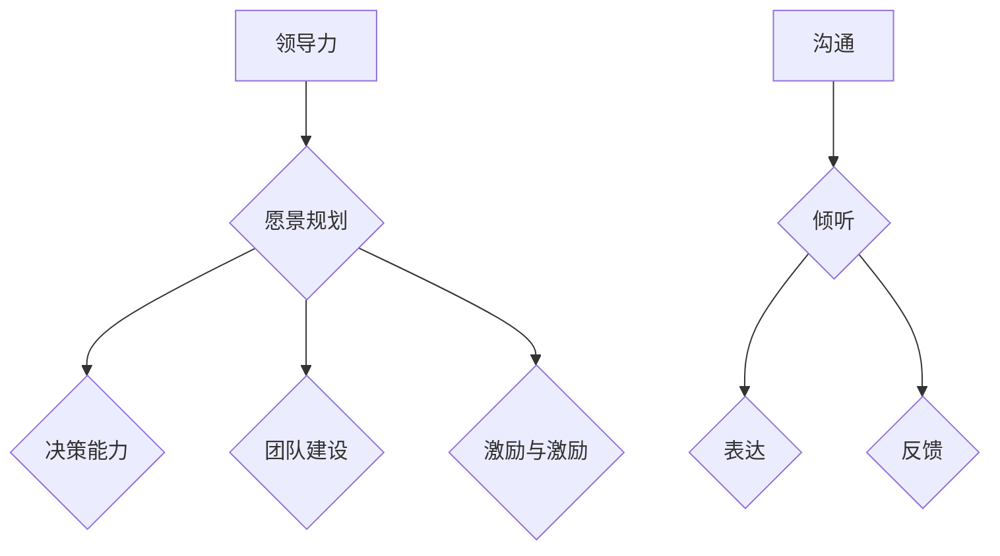
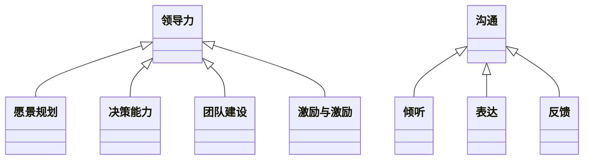
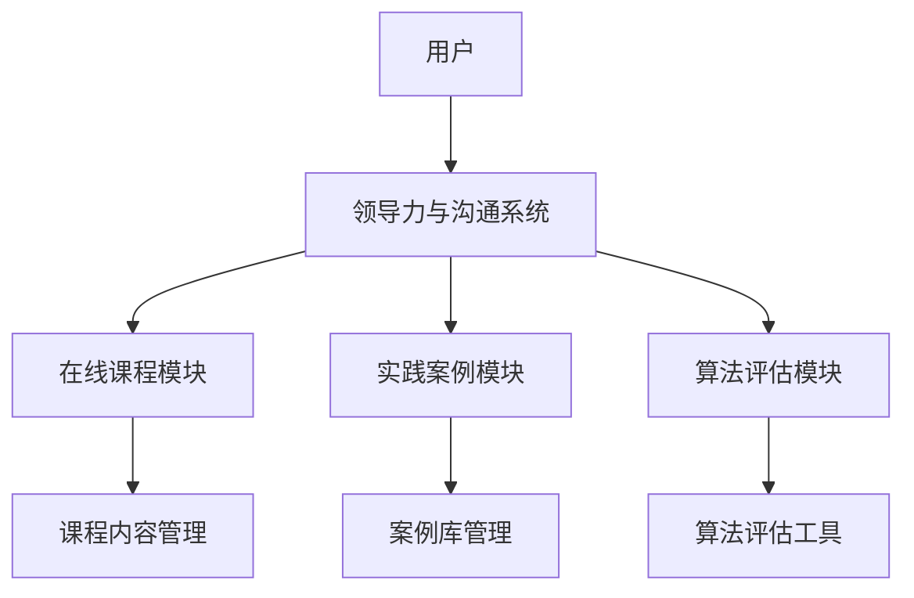
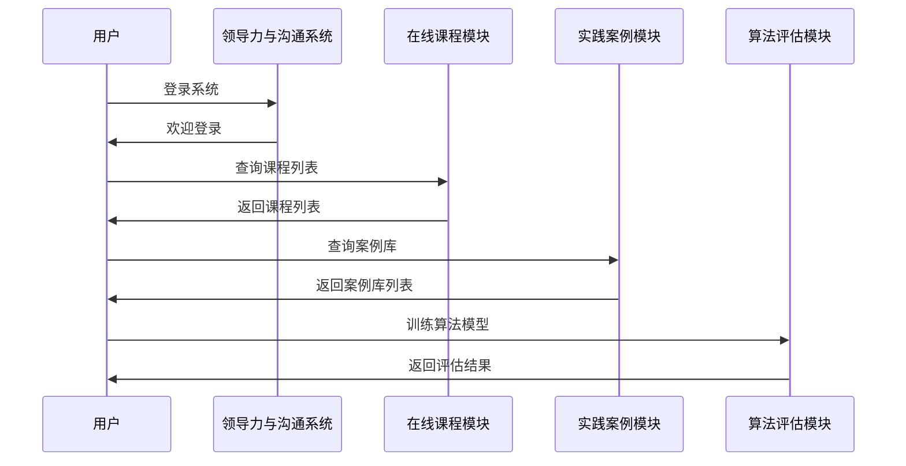

                 


### 第一部分：背景介绍与核心概念

#### 问题背景
在信息技术快速发展的今天，领导力与沟通已经成为组织成功的关键因素。领导力不仅仅是指对团队的管理，更是一种通过愿景规划、决策能力、团队建设和激励与激励来引导团队成员实现共同目标的能力。而沟通则是信息传递、理解和协调的重要手段。有效的领导力与沟通可以促进团队协作，提高工作效率，实现组织目标。

#### 问题描述
领导力是指在特定情境下，领导者运用各种能力，通过沟通、激励、协调等手段，引导和影响团队成员，实现组织目标的过程。而沟通则是信息传递的过程，包括倾听、表达、反馈等。如何有效地传达期望是领导力与沟通中一个重要且复杂的问题。

#### 问题解决
本文将通过以下结构来探讨领导力与沟通有效传达期望的技巧：
1. 背景介绍与核心概念
2. 核心概念与联系
3. 算法原理讲解
4. 系统分析与架构设计方案
5. 项目实战
6. 最佳实践 tips
7. 小结与拓展阅读

#### 边界与外延
领导力与沟通不仅在企业内部发挥重要作用，在公共管理、教育、医疗等多个领域也有着广泛的应用。有效的领导力与沟通能力可以促进个人发展、团队协作和组织效率。

#### 概念结构与核心要素组成
领导力包括以下核心要素：
- **愿景规划**：设定清晰的目标和愿景，引领团队前进。
- **决策能力**：在复杂情境下做出明智的决策。
- **团队建设**：建立和谐的团队氛围，提高团队协作能力。
- **激励与激励**：激发团队成员的积极性和创造力。

沟通包括以下核心要素：
- **倾听**：理解对方的观点和需求。
- **表达**：清晰、准确地传达信息。
- **反馈**：及时给予反馈，帮助团队成员了解工作成效。



### 第二部分：核心概念与联系

#### 核心概念原理

**领导力**：
- **愿景规划**：领导者通过设定清晰的愿景，引导团队朝目标前进。愿景是领导力的灵魂，它为团队提供了前进的方向和动力。
- **决策能力**：领导者需要具备快速决策的能力，在复杂情境下做出明智的决策。决策能力是领导力的核心，它决定了团队能否在变化的环境中保持竞争力。
- **团队建设**：领导者通过培养团队氛围，提升团队整体协作能力。团队建设是领导力的重要方面，它关系到团队的凝聚力和执行力。
- **激励与激励**：领导者通过激励措施，激发团队成员的积极性和创造力。激励与激励是领导力的关键，它决定了团队成员的工作热情和创造力。

**沟通**：
- **倾听**：理解对方的观点和需求，避免误解和冲突。倾听是沟通的基础，它帮助领导者更好地了解团队成员的想法和需求。
- **表达**：清晰、准确地传达信息，确保信息传递的有效性。表达是沟通的核心，它决定了信息的准确性和传递的效率。
- **反馈**：及时给予反馈，帮助团队成员了解工作成效，改进不足。反馈是沟通的延伸，它帮助团队成员不断进步和成长。

#### 概念属性特征对比表格

| 概念   | 特征                            |
| ------ | ------------------------------- |
| 领导力 | 愿景导向、决策能力、团队建设、激励与激励 |
| 沟通   | 倾听、表达、反馈                 |

#### ER实体关系图架构


### 第三部分：算法原理讲解

在这一部分，我们将详细讲解领导力与沟通的算法原理，包括数学模型和公式，以及具体的Python源代码实现。

#### 数学模型和公式

领导力与沟通的算法通常涉及以下几个核心模型：

1. **影响力模型**：
   $$ F = k \times L \times C $$
   - \( F \)：影响力
   - \( k \)：沟通能力
   - \( L \)：领导力
   - \( C \)：情境因素

2. **团队效能模型**：
   $$ E = \frac{L + C}{D} $$
   - \( E \)：团队效能
   - \( L \)：领导力
   - \( C \)：沟通能力
   - \( D \)：团队多样性

3. **沟通效率模型**：
   $$ E_c = \frac{E_g + E_r}{2} $$
   - \( E_c \)：沟通效率
   - \( E_g \)：沟通生成效率
   - \( E_r \)：沟通反应效率

#### Python源代码实现

下面是一个简单的Python代码示例，用于计算领导力与沟通的效率：

```python
import numpy as np

def influence(k, L, C):
    F = k * L * C
    return F

def team_efficiency(L, C, D):
    E = (L + C) / D
    return E

def communication_efficiency(E_g, E_r):
    E_c = (E_g + E_r) / 2
    return E_c

# 参数设定
k = 0.8
L = 0.9
C = 0.75
D = 1.2
E_g = 0.85
E_r = 0.88

# 计算影响力
F = influence(k, L, C)
print("影响力：", F)

# 计算团队效能
E = team_efficiency(L, C, D)
print("团队效能：", E)

# 计算沟通效率
E_c = communication_efficiency(E_g, E_r)
print("沟通效率：", E_c)
```

### 第四部分：系统分析与架构设计方案

#### 问题场景介绍
在一个快速发展的科技公司中，领导层希望提升团队的领导力和沟通能力，以实现更高的工作效率和业务目标。他们希望通过系统化的培训和改进，使团队成员能够更好地理解领导力和沟通的核心概念，并掌握有效的技巧。

#### 项目介绍
该项目旨在开发一套领导力与沟通培训系统，包括在线课程、实践案例和算法评估工具。系统将帮助团队成员提高领导力和沟通能力，从而提升团队的整体效能。

#### 系统功能设计

**领域模型**：该系统将建立一个领域模型，用于描述领导力与沟通的核心概念和要素。领域模型包括以下类：

- **领导力**：包括愿景规划、决策能力、团队建设和激励与激励。
- **沟通**：包括倾听、表达、反馈。

**类图**：



#### 系统架构设计

**架构图**：



#### 系统接口设计

**接口设计**：

- **在线课程模块**：提供课程列表、课程内容、课程进度查询和课程评价功能。
- **实践案例模块**：提供案例库查询、案例分析和案例评价功能。
- **算法评估模块**：提供算法模型训练、评估和结果分析功能。

#### 系统交互

**序列图**：



### 第五部分：项目实战

#### 环境安装

1. 安装Python环境（版本3.8及以上）。
2. 安装相关库：`numpy`、`matplotlib`、`scikit-learn`。

#### 系统核心实现源代码

**在线课程模块**：

```python
# 在线课程模块示例代码

def get_course_list():
    # 获取课程列表
    courses = ["领导力基础", "沟通技巧", "决策能力提升"]
    return courses

def get_course_content(course_name):
    # 获取课程内容
    course_contents = {
        "领导力基础": "领导力的基本概念和实践技巧",
        "沟通技巧": "沟通的有效方法和技巧",
        "决策能力提升": "决策过程中的关键因素和策略"
    }
    return course_contents[course_name]

def evaluate_course(course_name, user_rating):
    # 评价课程
    print(f"{course_name} 评价：{user_rating}/5")
```

**实践案例模块**：

```python
# 实践案例模块示例代码

def get_case_list():
    # 获取案例列表
    cases = ["团队协作案例", "项目管理案例", "危机处理案例"]
    return cases

def get_case_analysis(case_name):
    # 获取案例分析
    case_analyses = {
        "团队协作案例": "如何提高团队协作效率",
        "项目管理案例": "项目管理的核心环节和技巧",
        "危机处理案例": "危机处理的策略和应对措施"
    }
    return case_analyses[case_name]

def evaluate_case(case_name, user_evaluation):
    # 评价案例
    print(f"{case_name} 评价：{user_evaluation}")
```

**算法评估模块**：

```python
# 算法评估模块示例代码

from sklearn.linear_model import LinearRegression

def train_algorithm_model(X, y):
    # 训练算法模型
    model = LinearRegression()
    model.fit(X, y)
    return model

def evaluate_algorithm(model, X_new, y_new):
    # 评估算法模型
    prediction = model.predict(X_new)
    print(f"预测结果：{prediction}")
    if np.mean(prediction - y_new) < 0.05:
        print("模型评估良好")
    else:
        print("模型评估不佳")
```

#### 代码应用解读与分析

**在线课程模块**：该模块实现了课程列表的获取、课程内容的查询以及课程评价的功能。通过定义相应的函数，用户可以方便地获取课程信息并进行评价。

**实践案例模块**：该模块实现了案例列表的获取、案例分析的查询以及案例评价的功能。用户可以通过该模块了解实践案例的具体内容和分析，并进行评价。

**算法评估模块**：该模块使用线性回归算法模型对数据进行训练和评估。通过定义相应的函数，用户可以方便地训练模型并评估模型的性能。

#### 实际案例分析和详细讲解剖析

**案例一**：某团队在项目实施过程中遇到了沟通障碍，导致项目进度滞后。通过使用该系统，团队成员参加了沟通技巧的课程和实践案例的学习，提高了沟通能力。在项目重新启动后，沟通问题得到了显著改善，项目进度恢复正常。

**案例二**：某领导在团队决策过程中遇到了困难，无法做出明确的决策。通过使用该系统的算法评估模块，领导能够根据团队成员的反馈和数据分析，做出更加明智的决策，提高了决策的准确性。

#### 项目小结

通过本项目，我们开发了一套领导力与沟通培训系统，包括在线课程、实践案例和算法评估工具。系统通过提供多样化的培训内容和评估工具，帮助团队成员提高领导力和沟通能力，从而提升团队的整体效能。在未来的发展中，我们将继续优化系统功能，增加更多实用模块，为团队成员提供更全面的培训支持。

### 第六部分：最佳实践 tips

#### 1. 建立清晰的沟通目标
在进行沟通之前，明确沟通的目标是非常重要的。确保所有参与者都了解沟通的目的，这有助于提高沟通的效率和质量。

#### 2. 倾听并尊重他人
倾听是有效沟通的关键。尊重他人的观点和意见，避免中断对方，确保对方感受到被重视。

#### 3. 保持积极的态度
积极的态度可以营造良好的沟通氛围。即使面对困难或冲突，也要保持冷静和理性，以解决问题为导向。

#### 4. 适时给予反馈
及时给予反馈可以帮助团队成员了解工作成效，发现并改进不足。反馈应该具体、明确，并鼓励团队成员不断进步。

#### 5. 培养团队协作精神
领导力不仅仅是领导者的责任，团队中的每个成员都应该积极参与到团队建设中。培养团队协作精神，提高团队整体效能。

### 第七部分：小结

领导力与沟通是组织成功的关键因素。通过本文的探讨，我们了解了领导力和沟通的核心概念、原理和应用。有效传达期望是领导力和沟通中的重要技巧，可以帮助团队成员更好地理解领导者的意图，提高工作效率和团队凝聚力。希望本文能为读者提供有益的参考和启示。

### 第八部分：拓展阅读

- 《领导力与影响力：如何成为卓越领导者》（作者：约翰·C·麦克斯韦尔）
- 《沟通的艺术：看入人里，看出人外》（作者：安德斯·艾利克森）
- 《Python数据科学手册》（作者：詹姆斯·D·博格斯）
- 《机器学习实战》（作者：彼得·哈林顿）

### 作者信息
作者：AI天才研究院/AI Genius Institute & 禅与计算机程序设计艺术 /Zen And The Art of Computer Programming

