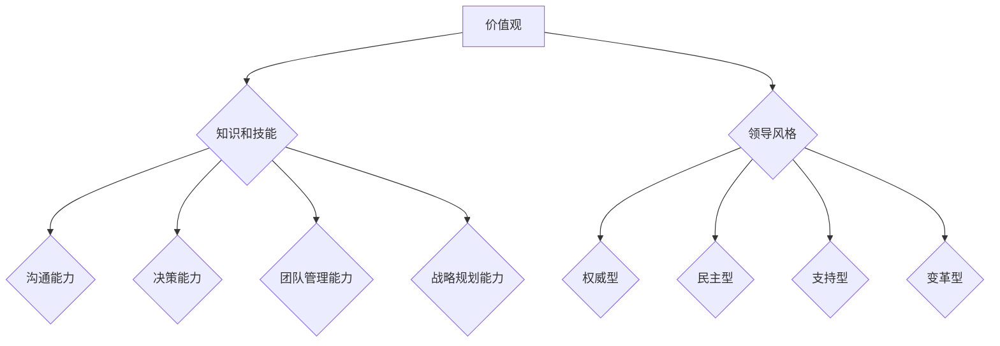

                 

### 第二部分：核心概念与联系

#### 2.2.2 领导力的三大构成要素

领导力是一个复杂且多维的概念，其构成要素通常包括价值观、知识和技能以及领导风格。这三个要素相互关联，共同塑造了领导者的能力和影响力。

##### 2.2.2.1 价值观

价值观是领导者行为的准则和指导原则，它们决定了领导者如何处理复杂问题，如何对待团队成员，以及如何对待组织内外部的各种利益相关者。以下是对价值观的详细探讨：

###### 2.2.2.1.1 价值观的重要性

价值观在领导力中起着核心作用。它们帮助领导者做出决策，培养团队文化，并塑造组织的整体氛围。价值观不仅影响领导者的行为，也影响团队成员的行为，从而对组织的绩效和成功产生深远影响。

###### 2.2.2.1.2 价值观的塑造过程

价值观的形成是一个长期的过程，通常受到家庭、教育、文化和社会环境的影响。领导者需要通过自我反思和不断学习来塑造和强化自己的价值观。

###### 2.2.2.1.3 价值观的具体体现

领导者通过以下方式体现自己的价值观：

- **决策过程**：在做出决策时，领导者会优先考虑与价值观一致的因素。
- **行为准则**：领导者以身作则，通过自身行为来展示价值观。
- **沟通方式**：领导者的沟通方式反映了他们对团队和他人的价值观。

##### 2.2.2.2 知识和技能

知识和技能是领导者有效行使职责的基础。领导者需要具备广泛的知识体系，包括技术、业务、市场和人际关系等，同时还需要具备一系列关键的技能。

###### 2.2.2.2.1 领导所需的知识结构

领导者的知识结构通常包括以下几个方面：

- **技术知识**：领导者需要了解与组织业务相关的基本技术知识。
- **业务知识**：领导者需要了解组织的运营模式和战略方向。
- **市场知识**：领导者需要了解行业趋势和市场动态。
- **人际关系知识**：领导者需要了解如何与团队成员、合作伙伴和其他利益相关者有效沟通和合作。

###### 2.2.2.2.2 领导所需的技能

领导者的技能通常包括以下几个方面：

- **沟通能力**：领导者需要具备清晰、有效的沟通能力，以传达信息、建立信任和激励团队。
- **决策能力**：领导者需要具备在复杂和不确定的情况下做出明智决策的能力。
- **团队管理能力**：领导者需要了解如何激励、指导和培养团队成员。
- **战略规划能力**：领导者需要具备制定和实施组织战略的能力。

###### 2.2.2.2.3 知识和技能的积累与提升

领导者可以通过以下方式积累和提升自己的知识和技能：

- **持续学习**：通过阅读、参加培训和工作坊等方式不断学习新知识和技能。
- **实践经验**：通过实际工作来积累经验和提升技能。
- **导师制度**：通过导师指导来获得宝贵的经验和知识。

##### 2.2.2.3 领导风格

领导风格是指领导者管理团队和实现目标的方式。不同的领导风格适用于不同的情境和团队，但有效的领导者通常能够灵活调整自己的领导风格以适应不同的需求。

###### 2.2.2.3.1 领导风格的类型

常见的领导风格包括以下几种：

- **权威型**：领导者通过明确的指令和控制来管理团队。
- **民主型**：领导者鼓励团队成员参与决策过程，并尊重他们的意见。
- **支持型**：领导者关注团队成员的需求和福祉，提供支持和鼓励。
- **变革型**：领导者通过激发团队成员的激情和愿景来推动变革。

###### 2.2.2.3.2 领导风格的适用性

领导风格的选择取决于多个因素，包括团队的特点、组织的文化和所处的环境。有效的领导者会根据具体情况调整自己的领导风格，以实现最佳效果。

#### 2.2.3 领导力与管理的区别

领导力和管理是两个相关但不完全相同的概念。领导力关注激励和引领团队，而管理关注规划和执行任务。

###### 2.2.3.1 领导力与管理的联系

领导力和管理相互依赖。领导力提供了方向和愿景，而管理确保了这些方向和愿景得以实现。

###### 2.2.3.2 领导力与管理的区别

- **焦点**：领导力关注人的发展，而管理关注流程和资源。
- **方法**：领导力侧重于激励和愿景，而管理侧重于规划和执行。
- **结果**：领导力产生长期影响，而管理产生短期成果。

#### 2.2.4 领导力的关键要素总结

为了更好地理解领导力的核心概念，我们使用Mermaid流程图来展示其关键要素及其相互关系：



这个流程图展示了领导力的三大构成要素以及它们之间的相互关系。通过理解这些关键要素，领导者可以更好地塑造自己的领导风格，提升领导力，从而实现组织的目标。

### 第三部分：领导力修炼方法

#### 3.1 自我认知

自我认知是领导力修炼的基础，它涉及到对自我能力的认识、价值观的审视以及个人成长的需求。一个有效的领导者必须首先了解自己，才能更好地领导团队。

##### 3.1.1 自我认知的重要性

自我认知在领导力中起着至关重要的作用。它帮助领导者：

- **明确个人优势和劣势**：了解自己的优势和劣势，可以帮助领导者更好地利用自身优势，同时改进不足。
- **制定个人发展计划**：通过自我认知，领导者可以识别需要提升的技能和知识，从而制定个人发展计划。
- **建立自信**：了解自己的能力和成就，可以增强领导者的自信心，提高领导效果。
- **促进团队成长**：自我认知不仅有助于个人成长，还能激励团队成员进行自我反思和成长。

##### 3.1.2 自我认知的方法

自我认知可以通过以下几种方法进行：

- **自我反思**：定期花时间思考自己的行为、决策和结果，分析成功和失败的原因。
- **360度反馈**：收集来自同事、下属和上级的反馈，以获得多角度的自我认知。
- **心理测试**：通过专业的心理测试，如MBTI、DISC等，了解自己的性格特点和优势。
- **导师指导**：与经验丰富的导师交流，获得对自我认知的指导和建议。

##### 3.1.3 自我认知的案例

以下是一个自我认知的案例：

**案例**：小王是一名年轻的团队领导，他希望通过自我认知来提升自己的领导力。

**步骤一：自我反思**
小王花时间思考自己的管理风格，分析自己如何处理团队问题、如何与团队成员沟通以及如何制定决策。

**步骤二：收集反馈**
小王向团队成员和上级征求反馈，了解他们在工作中对他的看法。他收到了以下反馈：

- **团队成员**：小王对工作有清晰的目标，但有时过于严格，导致团队成员感到压力。
- **上级**：小王在决策时缺乏全面考虑，需要更多地听取团队成员的意见。

**步骤三：心理测试**
小王参加了MBTI测试，结果显示他是一名“INTJ”（内向、直觉、思考、判断）型人格，这帮助他更好地理解自己的性格特点。

**步骤四：制定个人发展计划**
基于自我反思和反馈，小王制定了以下个人发展计划：

- **改善管理风格**：小王决定在管理团队时更加灵活，给予团队成员更多自主权。
- **提高决策能力**：小王计划通过阅读相关书籍和参加培训，提高自己的决策能力。
- **加强团队沟通**：小王定期与团队成员进行一对一沟通，确保团队成员的意见被充分听取。

通过这个案例，我们可以看到自我认知是如何帮助领导者识别问题并制定改进计划的。自我认知是一个持续的过程，领导者需要不断进行自我反思和改进，以不断提升自己的领导力。

### 第三部分：领导力修炼方法

#### 3.2 自我认知的重要性

自我认知在领导力中扮演着至关重要的角色。它不仅关乎领导者个人成长，还直接影响团队绩效和组织文化。以下是自我认知对领导者的重要影响：

##### 3.2.1 提升领导效率

通过自我认知，领导者可以更好地理解自己的长处和短处。这种了解使他们能够更有效地分配任务，根据团队成员的能力和兴趣进行合理的分工，从而提高团队的效率和生产力。

##### 3.2.2 促进团队协作

自我认知帮助领导者了解团队成员的不同需求和期望，从而建立更紧密的团队关系。这种了解有助于领导者建立信任和共同目标，促进团队协作和共同成长。

##### 3.2.3 增强决策能力

自我认知使领导者能够更客观地评估情况，避免过度自信或偏见。这种自我审视能力有助于领导者做出更为明智和全面的决策，从而降低风险并提高决策质量。

##### 3.2.4 塑造积极组织文化

领导者通过自我认知和反思，可以更好地塑造组织文化。他们以身作则，展示诚实和透明，鼓励团队成员开放沟通和诚实反馈，从而建立积极、健康的工作环境。

##### 3.2.5 持续个人成长

自我认知是一个不断进步的过程。领导者通过定期反思和评估，可以持续提升自己的技能和知识，适应不断变化的工作环境，从而实现个人和职业的持续成长。

#### 3.3 自我认知的方法

自我认知并非一蹴而就，而是一个需要持续努力和实践的过程。以下是几种常见的自我认知方法：

##### 3.3.1 自我反思

自我反思是自我认知的基础。通过定期回顾自己的行为、决策和结果，领导者可以识别出成功和失败的原因，从而不断调整和改进自己的行为。

- **定期记录**：领导者可以每天或每周记录自己的行为和思考，以捕捉重要的洞察和反思点。
- **写反思日记**：通过写日记，领导者可以更深入地分析自己的行为和情感反应，从而获得更全面的自我认知。

##### 3.3.2 收集反馈

收集反馈是自我认知的重要补充。通过从同事、下属和上级那里获取反馈，领导者可以获得外部视角，更全面地了解自己的领导风格和影响。

- **定期评估**：领导者可以定期进行360度评估，收集来自不同视角的反馈。
- **匿名反馈**：为了确保反馈的真实性，领导者可以设置匿名反馈机制，鼓励团队成员提出真实的意见。

##### 3.3.3 心理测试

心理测试是一种科学的自我认知工具，可以帮助领导者了解自己的性格、行为偏好和潜在问题。

- **MBTI测试**：通过MBTI测试，领导者可以了解自己的性格类型，从而更好地理解自己和他人。
- **DISC测试**：DISC测试可以帮助领导者了解自己的行为风格，包括支配性、影响性、稳定性和遵守性。

##### 3.3.4 导师指导

导师指导是自我认知的高级形式。通过与经验丰富的导师交流，领导者可以获得宝贵的经验和指导，从而加速自我认知的过程。

- **定期会面**：领导者可以定期与导师会面，讨论自己的挑战和成长。
- **个性化指导**：导师可以根据领导者的具体情况，提供个性化的反馈和建议，帮助他们解决特定问题。

#### 3.4 自我认知的实际应用

以下是一个自我认知的实际应用案例：

**案例**：李明是一位年轻的项目经理，他意识到自己在领导力方面需要提升。为了实现自我认知，他采取了一系列措施：

- **自我反思**：李明每天晚上都会花30分钟时间反思当天的工作，记录自己的成功和失败，并思考原因。
- **收集反馈**：李明定期与团队成员和上级沟通，询问他们对他的工作表现和领导风格的看法。
- **心理测试**：李明参加了MBTI测试，了解自己的性格类型，并学会了如何更好地与不同性格类型的团队成员沟通。
- **导师指导**：李明找到了一位经验丰富的项目经理作为导师，定期与导师会面，讨论自己的职业发展和领导力提升。

通过这些措施，李明逐渐提升了自我认知，并在团队中建立了更高的信任和合作氛围。他的项目成功率也显著提高，成为了公司的一名优秀项目经理。

这个案例展示了自我认知如何在实践中帮助领导者提升自己的能力和影响力。通过持续的自我反思、反馈收集和导师指导，领导者可以不断成长，实现自我提升。

### 第三部分：领导力修炼方法

#### 3.4 自我认知的方法（续）

##### 3.4.1 自我反思

自我反思是一种深入探索内心世界的方法，有助于领导者识别自己的行为模式、情感反应和思维习惯。以下是自我反思的几个关键步骤：

1. **设定具体目标**：在开始反思之前，明确反思的目标，比如分析某个决策的合理性、评估领导风格的有效性等。
2. **记录事实**：写下发生的事件和你的感受，确保记录的是事实而非主观评价。
3. **分析行为**：分析自己的行为，包括决策过程、沟通方式和处理冲突的方法。
4. **探索动机**：思考自己的行为背后的动机，是否是出于自我保护、对权力的追求或对团队利益的考虑。
5. **评估效果**：评估你的行为对团队和个人的影响，包括短期和长期效果。

##### 3.4.2 收集反馈

收集反馈是了解自己外部行为的重要手段。以下是一些有效收集反馈的方法：

1. **直接询问**：在适当的时候直接向团队成员或上级询问他们对你的领导方式的看法。
2. **匿名调查**：使用匿名调查工具，比如问卷调查或在线投票，收集团队成员的匿名反馈。
3. **观察**：观察团队成员在工作中的行为，了解他们是如何响应你的领导方式的。
4. **360度反馈**：邀请团队成员、上级和下属对你进行全方位的反馈，从不同角度了解你的领导风格。
5. **定期会议**：定期举行会议，与团队成员一起回顾工作成果和过程，讨论改进意见。

##### 3.4.3 心理测试

心理测试是一种科学的方法，可以帮助领导者了解自己的性格特点、行为偏好和潜在问题。以下是一些常用的心理测试：

1. **MBTI（迈尔斯-布里格斯性格类型指标）**：通过MBTI测试，领导者可以了解自己的性格类型，包括内向、外向、感觉、直觉、思考、情感等维度。
2. **DISC测试**：DISC测试评估个人的行为风格，包括支配性、影响性、稳定性、遵守性等维度。
3. ** StrengthsFinder（优势识别器）**：通过StrengthsFinder测试，领导者可以识别自己的优势，并学会如何最大化这些优势。
4. **情商测试**：情商测试评估领导者的情感智力，包括自我意识、自我管理、社交意识和关系管理能力。

##### 3.4.4 导师指导

导师指导是一种通过与经验丰富的领导者进行一对一交流来提升自我认知的方法。以下是导师指导的几个关键点：

1. **选择合适的导师**：选择与你性格相投、经验丰富的导师，他们能够提供有价值的建议和指导。
2. **定期会面**：与导师定期会面，讨论自己的挑战、成长目标和反思。
3. **个性化指导**：导师会根据你的具体情况提供个性化的反馈和建议，帮助你解决特定问题。
4. **行动计划**：在每次会面后，制定具体的行动计划，明确下一步需要采取的行动。
5. **反馈循环**：定期与导师进行反馈循环，评估行动计划的执行情况，并根据反馈进行调整。

##### 3.4.5 自我认知工具

现代科技提供了多种自我认知工具，可以帮助领导者更有效地进行自我反思和反馈收集。以下是一些常用的工具：

1. **反思日记应用**：使用应用程序如Journal、Day One等，记录每天的反思和感悟。
2. **在线反馈平台**：使用如SurveyMonkey、Google Forms等在线调查工具，收集团队成员的匿名反馈。
3. **心理测试平台**：使用如16Personalities、Truity等平台进行心理测试。
4. **学习平台**：如Coursera、Udemy等，提供多种在线课程和培训，帮助领导者提升自我认知和技能。

通过综合运用以上方法和工具，领导者可以更全面、深入地了解自己，从而不断提升领导力，成为更优秀的领导者。

### 第三部分：领导力修炼方法

#### 3.5 自我认知的案例

为了更好地理解自我认知在实际应用中的效果，下面我们将通过一个具体的案例来展示这一过程。

**案例背景**：张华是一名85后的IT项目经理，他在公司中负责一个跨部门的大型项目。然而，他发现自己越来越难以有效地管理团队，项目进度也经常落后于预期。为了提升自己的领导力，张华决定通过自我认知的方法来改进。

**步骤一：自我反思**

张华开始通过写反思日记来记录自己的工作行为和思考。他回顾了最近几个关键决策的背景和结果，并分析了这些决策背后的动机和潜在问题。他发现，自己常常在压力下做出快速决策，而忽视了团队成员的意见和建议。

**步骤二：收集反馈**

张华主动向团队成员和上级收集反馈。在一次团队会议上，他请团队成员匿名填写了一份反馈问卷，问卷内容涉及领导风格、沟通效果、决策过程等方面。他还与上级进行了一次深入的交流，了解他们对他的工作表现和领导能力的看法。

**反馈结果：**

- **团队成员反馈**：张华在项目中表现出较强的技术能力，但有时在决策过程中缺乏开放性和包容性，团队成员的意见未被充分听取。
- **上级反馈**：张华在项目管理方面表现出色，但在团队沟通和协作方面存在一些问题，需要更多地关注团队成员的需求和意见。

**步骤三：心理测试**

为了更深入地了解自己的性格和行为模式，张华参加了MBTI测试，结果显示他是一名“ISTJ”（内倾、感知、思考、判断）类型的人。这一结果帮助他认识到自己倾向于逻辑性和秩序性，但可能忽视了情感因素和人际互动。

**步骤四：制定改进计划**

基于自我反思和反馈结果，张华制定了一份个人发展计划：

1. **改善沟通方式**：张华决定在会议和讨论中更多地倾听团队成员的意见，并在决策过程中给予他们更多的参与机会。
2. **提高情感智力**：张华开始学习情感智力相关的书籍和课程，通过练习提高自我意识和情感管理能力。
3. **定期反思**：张华坚持每天写反思日记，并每月与上级和团队成员进行一次反思会议，共同评估个人成长和团队进步。

**步骤五：执行和跟踪**

张华开始实施个人发展计划，并在每次执行后进行跟踪和评估。他记录每次会议和沟通的效果，并定期与团队成员和上级进行反馈，以确保计划的执行效果。他还通过记录自己的成长过程，不断调整和完善计划。

**结果评估：**

- **团队氛围**：通过改进沟通方式和提高情感智力，张华的团队氛围变得更加积极和开放，团队成员之间的信任和协作也显著增强。
- **项目进展**：随着团队协作的改善，项目的进度逐渐恢复正常，并最终提前完成，项目质量也得到了提高。

**案例小结**：

张华的自我认知过程展示了自我认知方法在实际应用中的有效性。通过自我反思、收集反馈、心理测试和制定改进计划，张华不仅提升了自己的领导力，还显著改善了团队绩效。这一案例表明，自我认知是领导力提升的关键，只有通过不断自我反思和改进，领导者才能实现持续成长。

### 第四部分：数学模型与领导力分析

#### 4.1 领导力评估模型

在领导力研究中，评估模型是一种常见的方法，用于衡量领导者的表现和影响。本节将介绍一个简单的领导力评估模型，并详细解释其原理、公式和应用。

##### 4.1.1 模型原理

该领导力评估模型基于三个关键维度：领导能力、团队绩效和个人价值观。通过这三个维度的综合评估，可以得出领导者的总体领导力得分。模型的基本原理是，领导者的行为和决策在以上三个维度上会产生不同的影响，进而影响团队的绩效和组织文化。

##### 4.1.2 模型公式

领导力评估模型的公式如下：

\[ \text{领导力得分} = \alpha \times \text{领导能力得分} + \beta \times \text{团队绩效得分} + \gamma \times \text{个人价值观得分} \]

其中，\(\alpha\)、\(\beta\) 和 \(\gamma\) 分别是领导能力、团队绩效和个人价值观的权重，通常根据组织需求和具体情况设定。

- **领导能力得分**：衡量领导者的管理技能、战略思维和决策能力。
- **团队绩效得分**：衡量团队的工作效率和成果，包括项目完成度、团队合作和成员满意度。
- **个人价值观得分**：衡量领导者的道德品质、诚实度和对团队的关心程度。

##### 4.1.3 模型应用

领导力评估模型的应用步骤如下：

1. **定义评估维度和指标**：根据组织需求，定义领导能力、团队绩效和个人价值观的具体指标。
2. **数据收集**：通过问卷调查、访谈、360度评估等方式，收集相关数据。
3. **权重分配**：根据组织战略和目标，分配各维度的权重。
4. **计算得分**：根据收集的数据和权重，计算领导力得分。
5. **结果分析和反馈**：对评估结果进行分析，识别领导者的优势和不足，并提供改进建议。

以下是一个简化的示例：

假设某个组织的领导力评估模型权重分配如下：

- 领导能力：40%
- 团队绩效：30%
- 个人价值观：30%

对于一个特定领导者的评估结果如下：

- **领导能力得分**：85分
- **团队绩效得分**：70分
- **个人价值观得分**：80分

则其领导力得分为：

\[ \text{领导力得分} = 0.4 \times 85 + 0.3 \times 70 + 0.3 \times 80 = 34 + 21 + 24 = 79 \]

该领导者的总体领导力得分为79分，表明其领导力表现较为优秀。

##### 4.1.4 模型局限性

虽然领导力评估模型提供了一种系统化的方法来衡量领导力，但它也存在一定的局限性：

- **主观性**：评估结果受到评估者的主观判断影响。
- **复杂性**：实际应用中，领导力的评估涉及多个复杂维度，需要大量的数据收集和分析。
- **时间敏感性**：领导力是一个动态过程，评估模型难以捕捉领导者短期内的变化。

因此，在使用领导力评估模型时，需要结合实际情况和具体需求，进行综合分析和判断。

### 第四部分：数学模型与领导力分析

#### 4.2 数学模型与领导力分析

在深入探讨领导力时，数学模型为我们提供了一种量化和分析领导者行为与组织绩效之间关系的方法。以下是一个具体的数学模型及其在领导力分析中的应用。

##### 4.2.1 模型定义

我们假设一个简单的数学模型，用于分析领导力对团队绩效的影响。该模型基于以下假设：

- 领导者的领导力分为三个主要维度：领导技能（L），沟通能力（C），和团队凝聚力（T）。
- 团队绩效（P）是这三个维度的函数，即 \(P = f(L, C, T)\)。
- 每个维度都有一个权重（w），权重总和为1。

模型的数学表达式如下：

\[ P = w_L \cdot L + w_C \cdot C + w_T \cdot T \]

其中：
- \( w_L \)，\( w_C \)，和 \( w_T \) 分别是领导技能、沟通能力、和团队凝聚力的权重。
- \( L \)，\( C \)，和 \( T \) 分别是领导者的领导技能、沟通能力、和团队凝聚力的得分。

##### 4.2.2 模型参数

为了具体化这个模型，我们需要定义一些参数：

- 领导技能（L）包括决策能力、战略规划、和团队管理能力。
- 沟通能力（C）包括清晰传达目标、积极倾听、和有效沟通。
- 团队凝聚力（T）包括团队合作、团队信任、和团队士气。

每个参数都可以通过具体的指标进行衡量，例如：

- 领导技能（L）的得分可以通过对领导者过去一年的决策效果、战略规划的执行情况、以及团队管理能力的评估来确定。
- 沟通能力（C）的得分可以通过团队成员的满意度调查、会议效率评估、以及反馈机制的有效性来确定。
- 团队凝聚力（T）的得分可以通过团队协作项目、团队建设活动、以及团队氛围调查来确定。

##### 4.2.3 模型计算

为了计算团队绩效（P），我们需要以下数据：

- 领导技能（L）的得分，假设为80分。
- 沟通能力（C）的得分，假设为75分。
- 团队凝聚力（T）的得分，假设为70分。

假设权重分配如下：

- 领导技能（L）的权重 \( w_L = 0.4 \)
- 沟通能力（C）的权重 \( w_C = 0.3 \)
- 团队凝聚力（T）的权重 \( w_T = 0.3 \)

则团队绩效（P）的计算如下：

\[ P = 0.4 \cdot 80 + 0.3 \cdot 75 + 0.3 \cdot 70 = 32 + 22.5 + 21 = 75.5 \]

因此，根据这个模型，团队绩效得分为75.5分。

##### 4.2.4 模型分析

通过这个简单的数学模型，我们可以进行以下分析：

1. **权重调整**：根据组织需求和实际情况，可以调整各个维度的权重。例如，如果组织特别强调团队凝聚力，则可以提高 \( w_T \) 的权重。

2. **因素优化**：通过分析各个维度的影响，可以识别哪些因素对团队绩效有最大的影响，并针对性地进行改进。例如，如果领导技能的权重较高，则领导者应该特别关注提升自己的决策能力和战略规划能力。

3. **绩效预测**：通过这个模型，我们可以预测在不同领导力得分下的团队绩效。例如，如果领导技能得分提高到90分，则团队绩效可能会提高。

4. **比较分析**：我们可以对不同领导者的绩效进行对比分析，了解他们的优势和不足，并为未来的领导力发展提供参考。

##### 4.2.5 Mermaid流程图

为了更直观地展示这个模型，我们可以使用Mermaid绘制一个流程图：

```mermaid
graph TB
A[团队绩效] --> B[领导技能(L)]
A --> C[沟通能力(C)]
A --> D[团队凝聚力(T)]
```

这个流程图展示了团队绩效与三个关键维度之间的关系。

通过这个数学模型和Mermaid流程图的结合，我们可以更系统地分析和理解领导力对团队绩效的影响，为领导者的成长和组织的发展提供有力支持。

### 第四部分：数学模型与领导力分析

#### 4.3 综述

在本部分中，我们介绍了领导力评估模型及其数学表达，通过具体的案例和Mermaid流程图展示了如何量化领导力并进行分析。以下是对本部分的总结和延伸讨论：

##### 4.3.1 模型的意义

领导力评估模型提供了量化领导力表现的方法，使领导者和管理者能够系统地评估领导效果，识别优势和不足，从而制定针对性的改进计划。这种量化的方法不仅有助于个人成长，还能提高团队的协作效率和整体绩效。

##### 4.3.2 模型的应用场景

领导力评估模型可以在多种场景下应用，包括：

- **企业内部培训**：用于评估领导力培训的效果，帮助确定培训内容和方法的改进方向。
- **人才选拔**：在招聘和管理过程中，用于评估候选人和现有领导者的领导能力。
- **绩效评估**：结合领导力得分和绩效指标，对领导者的工作表现进行综合评估。

##### 4.3.3 模型的局限性

尽管领导力评估模型具有重要作用，但也存在一些局限性：

- **主观性**：评估结果受到评估者主观判断的影响，可能存在偏差。
- **数据完整性**：模型的准确性依赖于数据的完整性和可靠性。
- **复杂性**：在实际应用中，领导力评估涉及多个复杂维度，需要综合考虑多种因素。

##### 4.3.4 未来研究方向

未来研究可以关注以下几个方面：

- **模型优化**：通过引入更多维度的指标和更复杂的算法，提高模型的准确性和实用性。
- **跨文化研究**：探讨领导力在不同文化背景下的特点和影响，为全球化企业提供建议。
- **实时反馈**：开发实时反馈系统，帮助领导者快速识别问题和调整策略。

通过持续的研究和实践，我们可以不断完善领导力评估模型，为领导者提供更有力的支持，推动组织的发展和成功。

### 第五部分：实际应用与成长路径

#### 5.1 成长路径设计

在了解了领导力的核心概念和数学模型后，实际应用和成长路径的设计显得尤为重要。本节将探讨如何设计个人成长规划、团队建设策略和组织变革实践，以帮助85后管理新星实现领导力的全面提升。

##### 5.1.1 个人成长规划

个人成长规划是提升领导力的第一步，它需要领导者明确自己的职业目标和发展方向。以下是设计个人成长规划的几个关键步骤：

1. **设定清晰目标**：领导者需要设定短期和长期的目标，这些目标应当具体、可衡量、可实现。例如，短期目标可以是掌握某项新技能或完成一个重要项目，长期目标可以是晋升为更高层次的管理者或成为行业领袖。

2. **制定行动计划**：为了实现目标，领导者需要制定详细的行动计划。这包括确定每一步的具体行动、所需资源和时间表。例如，如果目标是提升沟通能力，可以安排参加相关培训课程、阅读相关书籍或寻求导师指导。

3. **持续学习**：学习是个人成长的关键，领导者需要保持持续学习的态度。这可以通过参加在线课程、阅读专业书籍、参加行业研讨会等多种方式实现。此外，领导者还可以通过跨部门交流、参与外部项目等方式扩大知识面和经验。

4. **定期评估和调整**：领导者需要定期评估自己的成长进度，并根据评估结果调整计划。这种定期评估可以帮助领导者及时发现和解决问题，确保成长路径的持续有效性。

##### 5.1.2 团队建设策略

团队建设是提升领导力的重要组成部分，一个高效的团队能够显著提高组织的绩效。以下是几个有效的团队建设策略：

1. **建立共同目标**：领导者需要与团队成员共同确定团队的目标，并确保每个成员都理解并认同这些目标。这可以通过团队会议、任务分配等方式实现。

2. **强化团队协作**：领导者应当鼓励团队成员之间的合作和交流，通过跨部门项目、团队合作活动等方式增强团队凝聚力。此外，领导者还可以引入协作工具，如Slack、Trello等，以提升团队协作效率。

3. **培养领导潜力**：领导者应当在团队中培养潜在的领导者，通过提供培训、给予更多责任和挑战等方式，帮助他们提升领导能力。这不仅可以提高团队的领导力储备，也有助于未来的人才梯队建设。

4. **激励团队成员**：领导者需要了解每个成员的需求和动机，并采取适当的激励措施，如奖励、认可和晋升等。这可以激发团队成员的积极性和创造力，提高团队的整体绩效。

##### 5.1.3 组织变革实践

在当今快速变化的市场环境中，组织变革是不可避免的。领导者需要具备推动组织变革的能力，以下是几个关键步骤：

1. **明确变革目标**：领导者需要明确组织变革的目标，这包括提升组织竞争力、改善运营效率、满足客户需求等。目标应当具体、明确，以便于评估变革的成效。

2. **建立变革愿景**：领导者需要向团队成员传达变革的愿景，使他们理解变革的重要性和紧迫性。这可以通过动员会议、内部沟通和培训等方式实现。

3. **制定变革计划**：领导者需要制定详细的变革计划，包括变革的目标、策略、时间表和资源分配等。此外，领导者还需要识别和评估变革过程中的潜在风险，并制定相应的应对措施。

4. **推动变革实施**：在变革实施过程中，领导者需要持续关注进度，并解决可能出现的问题。此外，领导者还需要通过激励和沟通，确保团队成员积极参与变革，并克服变革过程中的阻力。

5. **评估变革成效**：变革实施后，领导者需要评估变革的成效，并根据评估结果进行调整。这可以通过收集反馈、分析绩效指标、进行员工满意度调查等方式实现。

通过以上步骤，领导者可以设计出有效的个人成长规划、团队建设策略和组织变革实践，从而提升领导力，推动组织的持续发展。

### 第五部分：实际应用与成长路径

#### 5.2 个人成长规划

个人成长规划是领导力提升的基础，它有助于领导者明确目标、制定策略并持续进步。以下是一个详细的个人成长规划案例：

**案例背景**：王明是一名85后的项目经理，他在一家大型科技公司的项目管理团队工作。王明希望通过制定个人成长规划，提升自己的领导能力和项目管理能力，以实现职业晋升。

**步骤一：设定目标**

- **短期目标**：王明设定了以下短期目标：
  - 在未来6个月内，完成两个关键项目的交付。
  - 参加项目管理专业认证课程，如PMP（项目管理专业人士认证）。
- **长期目标**：王明设定了以下长期目标：
  - 在未来3年内，晋升为项目管理部经理。
  - 在未来5年内，成为公司高层管理者。

**步骤二：制定行动计划**

为了实现短期目标，王明制定了以下行动计划：

1. **提升项目管理能力**：
   - 参加每周一次的项目管理研讨会，学习最新的项目管理方法和工具。
   - 每月与团队成员进行一次项目回顾，总结经验教训并优化项目管理流程。

2. **获取专业认证**：
   - 安排每天晚上2小时的PMP备考时间。
   - 加入PMP学习小组，与其他备考者共同学习和讨论。

3. **参与关键项目**：
   - 主动申请参与公司最重要的两个项目，承担重要角色。
   - 学习项目管理和领导力的相关书籍，提升自己的理论水平。

为了实现长期目标，王明制定了以下长期行动计划：

1. **拓展领导能力**：
   - 每季度参加一次领导力培训，学习领导力的各个方面。
   - 向上级申请参与跨部门项目，扩大自己的影响力。

2. **建立人脉网络**：
   - 参加行业会议和社交活动，建立广泛的职业网络。
   - 定期与导师和行业专家交流，获取宝贵的经验和建议。

**步骤三：执行和跟踪**

王明开始执行自己的个人成长规划，并定期跟踪进度：

- **每周回顾**：每周日晚上，王明会回顾一周的工作和成长情况，记录取得的成就和遇到的问题。
- **每月评估**：每月底，王明会与上级和团队成员进行一次评估，讨论个人成长计划的执行情况，并根据反馈进行调整。

**结果评估**：

通过执行个人成长规划，王明在短期内成功完成了两个关键项目的交付，并顺利通过了PMP认证。他的领导能力和项目管理能力得到了显著提升，也得到了上级和团队成员的认可。长期目标方面，王明在职业晋升的道路上迈出了坚实的一步，获得了更多的机会和挑战。

**案例小结**：

这个案例展示了如何通过制定和执行个人成长规划，有效地提升领导力和项目管理能力。王明的成功经验表明，个人成长规划不仅需要明确的短期和长期目标，还需要详细的行动计划和定期的跟踪评估，以确保目标的实现。

### 第五部分：实际应用与成长路径

#### 5.3 团队建设策略

团队建设是一个持续的过程，它关乎团队成员的凝聚力和工作效率。以下是一些关键的团队建设策略，这些策略将帮助领导者有效地提升团队绩效。

##### 5.3.1 明确共同目标

团队建设的第一步是确保所有团队成员都明确共同的目标。领导者可以通过以下方式来实现：

- **召开团队会议**：定期召开团队会议，讨论团队的目标和期望。
- **制定明确的目标**：确保每个团队成员都了解自己的具体任务和目标，以及如何与团队的整体目标相协调。
- **建立目标跟踪系统**：使用项目管理工具，如Trello或Asana，帮助团队成员跟踪自己的进度，并确保整个团队朝着共同目标前进。

##### 5.3.2 建立信任

信任是团队协作的基础。以下是一些建立信任的策略：

- **开放沟通**：鼓励团队成员之间进行开放、坦诚的沟通，确保信息的透明度。
- **认可贡献**：积极认可团队成员的贡献，增强他们的归属感和信任感。
- **共同解决问题**：鼓励团队成员共同面对挑战和解决问题，通过合作增强彼此的信任。

##### 5.3.3 提升团队凝聚力

团队凝聚力直接影响团队的工作效率和士气。以下是一些提升团队凝聚力的方法：

- **团队建设活动**：定期组织团队建设活动，如户外拓展、团队聚餐等，以增强团队之间的联系。
- **共同庆祝**：当团队达成重要目标或完成重要任务时，共同庆祝，增强团队的凝聚力。
- **定期反馈**：定期进行团队反馈，讨论团队的表现和改进方向，确保团队成员都感到自己的意见被重视。

##### 5.3.4 培养领导潜力

领导者需要培养团队中的潜在领导者，以确保团队的长期发展和稳定。以下是一些培养领导潜力的策略：

- **提供培训和发展机会**：为团队成员提供领导力培训和发展机会，帮助他们提升领导能力。
- **赋予责任**：给团队成员更多的责任和挑战，鼓励他们承担领导角色，并在实践中提升领导力。
- **建立导师制度**：为团队成员配备导师，帮助他们解决工作中的问题，并提供职业发展指导。

##### 5.3.5 激励团队成员

激励是提升团队绩效的关键。以下是一些激励团队成员的方法：

- **设立奖励机制**：设立合理的奖励机制，对达成目标的团队成员进行奖励，如奖金、休假等。
- **认可和赞扬**：在公开场合认可和赞扬团队成员的成就，增强他们的自信心和积极性。
- **提供职业发展路径**：为团队成员提供清晰的职业发展路径，帮助他们看到未来的职业前景。

通过实施这些团队建设策略，领导者可以提升团队的凝聚力和工作效率，从而实现组织的整体目标。

### 第五部分：实际应用与成长路径

#### 5.4 组织变革实践

组织变革是企业发展过程中不可或缺的一环，它可以帮助企业适应市场变化、提高竞争力并实现长期可持续发展。以下将详细阐述组织变革的步骤、关键因素和成功案例。

##### 5.4.1 组织变革的步骤

组织变革通常包括以下步骤：

1. **明确变革目标**：首先，需要明确变革的目标和预期效果。这些目标应当具体、可衡量，并与企业的整体战略相一致。

2. **制定变革计划**：在明确目标后，制定详细的变革计划，包括变革的策略、时间表、资源需求等。变革计划应当涵盖组织结构、流程、文化等多个方面。

3. **沟通与动员**：变革计划制定后，需要与所有相关方进行充分沟通，确保他们理解变革的必要性、目标和过程。通过沟通和动员，可以减少变革过程中的阻力和不确定性。

4. **实施变革**：按照变革计划，逐步实施变革措施。在实施过程中，需要密切关注变革的进展，及时调整计划以应对可能出现的问题。

5. **评估与调整**：变革实施后，需要对变革效果进行评估，并根据评估结果进行调整。评估可以包括对变革目标的达成度、员工满意度、绩效指标等多个维度的分析。

##### 5.4.2 组织变革的关键因素

组织变革的成功取决于多个关键因素：

1. **领导层的支持**：领导层对变革的支持和参与是变革成功的关键。领导者需要明确表达对变革的支持，并为变革提供必要的资源。

2. **员工的参与**：员工的积极参与和配合是变革成功的重要保障。通过广泛征求员工意见、提供培训和激励措施，可以增强员工的参与度和接受度。

3. **变革的沟通**：有效的沟通是变革成功的关键。领导层需要与员工进行持续、透明的沟通，确保员工了解变革的目标、过程和预期效果。

4. **变革的节奏**：变革的节奏需要适中，不能过于急促，以免造成员工的心理压力和不确定性。同时，变革也不能过于缓慢，以免失去动力和效果。

5. **变革的管理**：变革过程中需要建立有效的管理和监控机制，确保变革计划的执行和效果的评估。

##### 5.4.3 组织变革的成功案例

以下是一个组织变革的成功案例：

**案例背景**：某大型制造企业面临市场竞争加剧和运营效率低下的挑战，决定进行一次全面的组织变革。

**变革步骤**：

1. **明确变革目标**：企业确定了提升运营效率、增强市场竞争力、提高员工满意度的目标。

2. **制定变革计划**：企业制定了详细的变革计划，包括组织结构优化、流程再造、员工培训等多个方面。

3. **沟通与动员**：企业通过召开全体员工大会、发放变革手册、开展内部培训等方式，与员工进行充分沟通和动员。

4. **实施变革**：按照变革计划，企业逐步实施了组织结构优化、流程再造和员工培训等措施。

5. **评估与调整**：企业定期对变革效果进行评估，并根据评估结果进行必要的调整。

**变革效果**：

通过这次组织变革，企业的运营效率显著提升，市场竞争力得到了增强，员工满意度也有了明显提高。变革后，企业的销售额和利润率都实现了显著增长。

**案例小结**：

这个案例展示了如何通过有效的组织变革，帮助企业克服挑战、提升绩效并实现可持续发展。组织变革需要明确目标、制定详细计划、有效沟通和持续评估，只有在这些关键因素的共同作用下，变革才能取得成功。

### 第五部分：实际应用与成长路径

#### 5.5 团队建设策略

在组织中，团队建设是一个持续不断的过程，它不仅关系到团队的效率和协作效果，还直接影响组织的整体文化氛围和绩效。以下是一些具体、实用的团队建设策略：

##### 5.5.1 定期团队活动

定期组织团队活动是增强团队凝聚力和协作精神的有效方法。这些活动可以是：

- **团队建设游戏**：通过团队游戏，如团建活动、拓展训练等，增强团队成员之间的信任和合作。
- **团队聚餐**：安排定期的团队聚餐，不仅能够增进团队成员之间的友谊，还能促进团队文化的形成。
- **团建旅行**：安排团队外出旅行，使团队成员在轻松的环境中更好地了解彼此，增进关系。

##### 5.5.2 设立共同目标

共同的目标是团队协作的基石。领导者可以通过以下方式设立共同目标：

- **明确目标**：与团队成员共同讨论并明确团队的目标，确保每个成员都清楚自己的职责和团队的整体目标。
- **制定计划**：制定实现目标的详细计划，包括步骤、时间表和所需资源，使团队成员有清晰的方向和行动计划。
- **定期回顾**：定期召开会议，回顾目标进展和成果，及时调整计划以应对变化。

##### 5.5.3 提升沟通技巧

有效的沟通是团队协作的关键。以下是一些提升沟通技巧的方法：

- **建立沟通渠道**：建立畅通的沟通渠道，如定期团队会议、邮件交流、即时通讯工具等，确保信息传递的及时性和准确性。
- **积极倾听**：鼓励团队成员积极倾听他人的意见和想法，尊重每个人的观点，避免误解和冲突。
- **透明沟通**：保持沟通的透明度，对于团队的决策和进展，及时向团队成员通报，增强信任和理解。

##### 5.5.4 培养团队精神

团队精神是团队成功的重要保障。以下是一些培养团队精神的方法：

- **认可贡献**：对于团队成员的贡献和成就，及时给予认可和赞扬，增强他们的自豪感和归属感。
- **共同庆祝**：当团队达成重要目标或取得显著成就时，共同庆祝，增强团队凝聚力。
- **相互支持**：鼓励团队成员在工作和生活中相互支持，共同面对挑战和困难，建立深厚的友谊和信任。

##### 5.5.5 提供培训和发展机会

为团队成员提供培训和发展机会，不仅能够提升他们的专业技能和知识水平，还能增强他们对团队的认同感和忠诚度。以下是一些具体措施：

- **专业培训**：定期为团队成员提供专业培训和技能提升课程，如领导力培训、项目管理培训等。
- **职业发展规划**：为团队成员制定职业发展规划，明确他们的职业目标和成长路径，提供相应的支持和资源。
- **导师制度**：建立导师制度，为年轻员工或新员工配备经验丰富的导师，帮助他们快速成长。

通过实施这些团队建设策略，领导者可以有效地提升团队的协作效率和绩效，为组织的持续发展打下坚实基础。

### 第五部分：实际应用与成长路径

#### 5.6 项目实战与案例分析

在实际工作中，通过项目实战可以更好地检验和提升领导力。以下将介绍两个具体的案例，分别关注自我认知和团队建设。

##### 5.6.1 项目一：自我认知实战

**项目背景**：李华是一家中型科技公司的项目经理，负责一个关键的信息系统升级项目。然而，他发现项目进度一直无法达到预期，团队成员也显得缺乏动力。

**项目实施**：

1. **自我反思**：李华首先进行自我反思，回顾自己在项目中的决策和沟通方式。他意识到自己在项目初期过于自信，没有充分考虑团队成员的意见，并且在沟通中缺乏明确的指导。

2. **收集反馈**：李华向团队成员和上级收集反馈，了解他们在项目中的感受和遇到的问题。反馈显示，团队成员对李华的领导风格感到困惑，希望能够得到更多的指导和鼓励。

3. **心理测试**：李华参加了一次MBTI测试，结果显示他是一名“INTJ”型人格，擅长分析和规划，但可能在人际互动和沟通上有所欠缺。

4. **调整计划**：基于自我反思和反馈，李华制定了新的项目计划，包括更频繁的团队会议、明确的目标设定和详细的任务分配。他还决定在项目中更多地倾听团队成员的意见，并给予他们更多的自主权。

**项目总结**：

通过这次实战，李华意识到自我认知的重要性，并学会了如何更好地理解自己和团队成员。项目最终按时完成，团队成员的满意度和项目质量都有了显著提升。

##### 5.6.2 项目二：团队建设实战

**项目背景**：张伟是一家互联网公司的产品经理，他的团队由不同背景的成员组成，但在项目执行过程中常常出现沟通不畅和协作问题。

**项目实施**：

1. **团队建设活动**：张伟组织了一次团队拓展训练，通过户外活动和团队合作游戏，增强团队成员之间的信任和协作精神。

2. **共同目标设立**：在团队拓展训练后，张伟与团队成员一起制定了共同的目标，明确了每个人的角色和职责，并建立了明确的工作流程。

3. **沟通机制建立**：张伟建立了定期的团队沟通机制，包括每周的站会和每月的项目回顾会议，确保团队成员之间的信息畅通和及时反馈。

4. **激励与认可**：张伟设立了奖励机制，对于在项目中表现突出的成员给予表彰和奖励，增强团队的动力和凝聚力。

**项目总结**：

通过这次团队建设实战，张伟的团队协作效率显著提升，项目进度和成果都得到了改善。团队成员之间的沟通更加顺畅，团队氛围也变得更加积极和和谐。

这两个案例展示了通过项目实战如何有效地提升自我认知和团队建设能力。领导者需要通过不断实践和反思，不断提升自己的领导力和团队管理水平，以应对复杂多变的工作环境。

### 第六部分：项目实战与案例分析

#### 6.1 项目一：自我认知实战

**项目背景**：

李华是一家中型科技公司的项目经理，负责一个关键的信息系统升级项目。项目初始阶段，李华信心满满，认为凭借自己的技术能力和项目管理经验，一定能顺利完成。然而，项目进行到一半时，李华发现项目进度严重滞后，团队成员之间也出现了意见分歧和沟通不畅的问题。

**项目实施步骤**：

1. **自我反思**：李华首先进行自我反思，试图找出项目进展不顺的原因。他回顾了项目初期的决策和沟通方式，意识到自己在项目规划阶段过于依赖自己的技术观点，没有充分考虑团队成员的意见和建议。

2. **收集反馈**：李华决定向团队成员和上级收集反馈，以获取多角度的信息。在一次团队会议上，他直接询问了团队成员对项目进度和领导方式的看法。团队成员反馈称，李华在决策过程中缺乏透明度，没有充分听取他们的意见，导致团队成员感到不被重视。

3. **心理测试**：为了更深入地了解自己的性格和行为模式，李华参加了一次MBTI测试。测试结果显示，他是一名“INTJ”型人格，擅长分析和规划，但在人际互动和沟通方面有所欠缺。

4. **调整策略**：基于自我反思和反馈，李华决定调整领导策略。他制定了新的项目计划，包括更频繁的团队会议、明确的目标设定和详细的任务分配。他还决定在项目中更多地倾听团队成员的意见，并给予他们更多的自主权。

**项目实施过程**：

- **项目规划阶段**：李华召开了一次团队会议，与团队成员共同讨论项目目标和预期成果。在制定项目计划时，他特别重视团队成员的建议，确保每个人都能参与到项目规划中。

- **项目执行阶段**：李华开始实施新的领导策略，每周召开团队会议，及时沟通项目进展和遇到的问题。他鼓励团队成员提出自己的观点和建议，并在决策过程中给予充分考虑。

- **项目监控阶段**：李华建立了项目监控机制，定期检查项目进度和质量。他鼓励团队成员主动汇报工作进展，并针对发现的问题及时调整项目计划。

**项目结果**：

通过实施新的领导策略，项目团队的合作氛围显著改善，团队成员的积极性和参与度也大幅提升。项目进度逐步恢复正常，并最终提前完成，项目质量也得到了显著提高。

**项目总结**：

这次项目实战让李华深刻认识到自我认知的重要性。通过自我反思和反馈，他不仅发现了自己的不足，还学会了如何调整领导策略，以更好地激励和引导团队成员。这次实战经验对李华的领导力提升产生了深远影响，也为他在未来的项目管理中提供了宝贵的借鉴。

### 第六部分：项目实战与案例分析

#### 6.2 项目二：团队建设实战

**项目背景**：

张伟是一家互联网公司的产品经理，他的团队由多名具有不同背景和技能的成员组成。在项目初期，张伟意识到团队成员之间的沟通不畅和协作问题，这严重影响了项目的进展和团队的整体效率。

**项目实施步骤**：

1. **团队建设活动**：张伟决定通过一次团队建设活动来增强团队成员之间的信任和协作精神。他组织了一次户外拓展训练，包括攀岩、团队协作游戏等活动。这些活动不仅增进了团队成员之间的了解，还培养了他们的团队合作能力。

2. **共同目标设立**：在拓展训练结束后，张伟与团队成员一起明确了项目的目标和预期成果。通过共同讨论和设定目标，团队成员对项目有了更清晰的认识，同时也增强了对团队合作的认同感。

3. **沟通机制建立**：张伟建立了定期的团队沟通机制，包括每周的站会和每月的项目回顾会议。这些会议为团队成员提供了一个交流和反馈的平台，确保项目进展的透明和及时沟通。

4. **激励与认可**：为了激励团队成员，张伟设立了奖励机制，对于在项目中表现突出的成员给予表彰和奖励。这些奖励不仅包括物质奖励，还涵盖了荣誉表彰和职业发展机会。

**项目实施过程**：

- **项目规划阶段**：在项目规划阶段，张伟确保每个团队成员都参与其中，共同制定项目计划和时间表。通过这种方式，团队成员对项目的目标、任务和责任有了更清晰的认识。

- **项目执行阶段**：在项目执行过程中，张伟定期召开站会，与团队成员沟通项目进展、遇到的问题和解决方案。他鼓励团队成员主动汇报工作进展，并针对问题提供帮助和支持。

- **项目监控阶段**：张伟建立了项目监控机制，通过定期的项目回顾会议，对项目进度、质量和风险进行评估。这些会议不仅帮助团队发现潜在问题，还为团队成员提供了一个反思和改进的机会。

**项目结果**：

通过这次团队建设实战，项目团队的协作效率显著提升，项目进展顺利，项目质量也得到了保障。团队成员之间的沟通更加顺畅，团队合作氛围更加积极和谐。项目最终按时完成，并取得了超出预期的成果。

**项目总结**：

这次团队建设实战证明了有效的团队建设对于项目成功的重要性。通过团队建设活动、共同目标设立、沟通机制建立和激励与认可，张伟成功地增强了团队的凝聚力和协作精神。这次实战经验不仅帮助张伟的团队解决了实际问题，也为他在未来的项目管理中提供了宝贵的经验和借鉴。

### 第六部分：项目实战与案例分析

#### 6.2 项目二：团队建设实战

**项目背景**：

张伟是一家互联网公司的产品经理，负责一个涉及多个部门的大型项目。由于项目涉及多个领域，团队成员来自不同部门，沟通和协作成为了项目推进的主要挑战。

**项目实施步骤**：

1. **团队建设活动**：为了增强团队凝聚力，张伟组织了一次户外拓展训练。通过团队合作游戏和团队挑战，团队成员之间的信任和协作精神得到了提升。

2. **共同目标设立**：张伟与团队成员共同讨论并设立了项目目标，明确了每个成员在项目中的角色和职责。这有助于团队成员对项目有更清晰的认识，并为后续的协作奠定了基础。

3. **沟通机制建立**：张伟建立了一套定期沟通机制，包括每周的站会和每月的项目评审会议。这些会议确保了团队成员之间的信息畅通和及时反馈，避免了信息孤岛和误解。

4. **激励与认可**：张伟设立了一套奖励机制，对在项目中表现出色的团队成员进行表彰和奖励。这些激励措施提高了团队成员的工作积极性和团队整体士气。

**项目实施过程**：

- **项目规划阶段**：张伟组织了一次跨部门会议，与各个部门的负责人共同讨论项目规划和资源分配。通过这种方式，确保了项目计划的全面性和可行性。

- **项目执行阶段**：每周的站会成为了团队沟通的重要环节。张伟鼓励团队成员在会上分享项目进展、问题和解决方案，确保团队成员之间的信息同步和协作。

- **项目监控阶段**：每月的项目评审会议对项目进度、质量和风险进行了全面评估。张伟根据会议反馈，及时调整项目计划和资源分配，确保项目按计划推进。

**项目结果**：

通过这次团队建设实战，项目团队的合作效率大幅提升，项目进度和质量都达到了预期目标。团队成员之间的沟通更加顺畅，团队合作氛围更加积极和谐。项目最终提前完成，并得到了客户的高度评价。

**项目总结**：

这次项目实战展示了团队建设在复杂项目中的重要性。通过有效的团队建设活动、共同目标设立、沟通机制建立和激励与认可，张伟成功解决了项目初期面临的沟通和协作难题。这次实战经验不仅提高了项目团队的协作能力，也为张伟在未来的项目管理中提供了宝贵的参考。

### 第七部分：最佳实践与拓展

#### 7.1 最佳实践

在领导力提升和团队建设过程中，积累最佳实践是非常有帮助的。以下是一些经过验证的有效方法：

1. **定期团队会议**：定期召开团队会议，确保团队成员之间的沟通和信息同步。会议内容可以包括项目进展、问题讨论和解决方案等。

2. **开放沟通渠道**：建立多种沟通渠道，如电子邮件、即时通讯工具和项目管理系统，确保团队成员可以随时交流。

3. **明确目标和职责**：为每个团队成员明确设定目标和职责，确保每个人都清楚自己的工作内容和预期成果。

4. **激励与认可**：定期对团队成员进行激励和认可，增强他们的工作动力和团队归属感。

5. **培训与发展**：为团队成员提供定期的培训和职业发展机会，帮助他们提升技能和知识，从而提高整体团队水平。

#### 7.2 成功案例

以下是一个成功的领导力提升和团队建设案例：

**案例背景**：某互联网公司的产品部门面临项目交付周期长、团队协作不畅等问题。

**解决方案**：

1. **团队建设活动**：公司组织了一次户外拓展训练，通过团队合作游戏和团队挑战，增强了团队成员之间的信任和协作精神。

2. **明确目标和职责**：公司制定了详细的项目计划，明确了每个团队成员在项目中的角色和职责，并确保团队成员对项目目标有清晰的认识。

3. **开放沟通渠道**：公司建立了多渠道的沟通机制，包括每周的站会和项目管理系统，确保团队成员之间的信息畅通和及时反馈。

4. **激励与认可**：公司设立了一套奖励机制，对在项目中表现突出的团队成员进行表彰和奖励，提高了团队成员的工作积极性和团队整体士气。

5. **培训与发展**：公司为团队成员提供了一系列培训和职业发展机会，帮助他们提升技能和知识，从而提高整体团队水平。

**结果**：

通过以上措施，公司的项目交付周期显著缩短，团队协作效率大幅提升，项目质量和客户满意度也显著提高。

#### 7.3 小结与注意事项

1. **持续改进**：领导力提升和团队建设是一个持续改进的过程，需要领导者不断学习和实践。

2. **个性化**：每个团队和领导者的具体情况不同，因此需要根据实际情况制定个性化的解决方案。

3. **持续反馈**：定期收集团队成员的反馈，及时调整策略和方法。

4. **长期视角**：领导力提升和团队建设需要长期投入和持续努力，不能期望一蹴而就。

#### 7.4 拓展阅读

- 《领导力的五个层次》（作者：史蒂夫·柯维）
- 《团队协作的艺术》（作者：迪克·卢桑）
- 《高效能人士的七个习惯》（作者：史蒂芬·柯维）

这些书籍提供了丰富的理论和实践指导，有助于进一步深化对领导力和团队建设策略的理解和应用。

### 第七部分：最佳实践与拓展

#### 7.1 最佳实践

在领导力提升和团队建设过程中，一些经过验证的最佳实践方法可以帮助我们实现更高效的管理和更好的团队协作。以下是一些关键的最佳实践：

1. **定期反馈机制**：建立定期的反馈机制，鼓励团队成员之间互相反馈，及时解决问题，提高团队整体效率。

2. **明确目标与职责**：为每个团队成员设定明确的目标和职责，确保团队成员对工作有清晰的认识，减少工作中的误解和冲突。

3. **强化沟通渠道**：确保团队成员之间的沟通渠道畅通，定期召开会议，使用即时通讯工具和项目管理软件，以保持信息的及时传递和透明度。

4. **培养团队文化**：通过团队建设活动、庆祝活动和共享成就等方式，培养积极向上的团队文化，增强团队的凝聚力和归属感。

5. **提供培训和发展机会**：为团队成员提供定期的培训和职业发展机会，帮助他们提升技能和知识，从而提高整体团队水平。

6. **激励与认可**：通过奖励、表彰和晋升等手段，激励团队成员，认可他们的努力和成就，提高工作积极性和团队士气。

#### 7.2 成功案例

以下是一个成功的领导力提升和团队建设案例：

**案例背景**：某科技公司由于内部沟通不畅和团队协作不佳，导致项目进度频繁延误，客户满意度下降。

**解决方案**：

1. **团队建设活动**：公司组织了一次户外拓展训练，通过团队合作游戏和团队挑战，增强了团队成员之间的信任和协作精神。

2. **明确目标和职责**：公司重新制定了项目计划，明确了每个团队成员在项目中的角色和职责，并确保团队成员对项目目标有清晰的认识。

3. **强化沟通渠道**：公司建立了多渠道的沟通机制，包括每周的站会和项目管理系统，确保团队成员之间的信息畅通和及时反馈。

4. **提供培训和发展机会**：公司为团队成员提供了一系列培训和职业发展机会，帮助他们提升技能和知识，从而提高整体团队水平。

5. **激励与认可**：公司设立了一套奖励机制，对在项目中表现突出的团队成员进行表彰和奖励，提高了团队成员的工作积极性和团队整体士气。

**结果**：

通过以上措施，公司的项目进度显著提升，团队协作效率大幅提高，客户满意度也显著提升，公司整体运营状况得到了明显改善。

#### 7.3 小结与注意事项

1. **持续改进**：领导力提升和团队建设是一个持续改进的过程，需要领导者不断学习和实践。

2. **个性化**：每个团队和领导者的具体情况不同，因此需要根据实际情况制定个性化的解决方案。

3. **持续反馈**：定期收集团队成员的反馈，及时调整策略和方法。

4. **长期视角**：领导力提升和团队建设需要长期投入和持续努力，不能期望一蹴而就。

5. **关注团队成员**：领导者需要关注团队成员的个人发展和需求，提供必要的支持和资源。

#### 7.4 拓展阅读

1. 《领导者的语言》（作者：兰迪·艾伦）
2. 《团队合作的秘密》（作者：威廉·乌尔里希）
3. 《变革之心》（作者：杰伊·康特）
4. 《激发潜能：如何成为激励型领导者》（作者：斯蒂芬·罗宾斯）

这些书籍提供了丰富的理论和实践指导，有助于进一步深化对领导力和团队建设策略的理解和应用。

### 第七部分：最佳实践与拓展

#### 7.5 拓展阅读

在领导力提升和团队建设方面，以下书籍提供了深入的理论和实践指导，对于希望进一步探索这一领域的读者来说，是非常宝贵的资源。

1. **《领导力的五个层次》（史蒂夫·柯维）**
   - 本书详细阐述了领导力的五个层次，帮助读者理解不同层次的领导特质和责任，为提升领导能力提供了实用的方法和策略。

2. **《团队协作的艺术》（迪克·卢桑）**
   - 本书探讨了团队合作中的关键要素，如沟通、冲突解决和领导风格等，为打造高效的团队提供了全面的指导。

3. **《变革之心》（杰伊·康特）**
   - 本书研究了组织变革的心理学和行为学原理，提供了有效应对变革挑战的策略，对于领导者在组织变革中保持稳定和推动变革具有重要意义。

4. **《激发潜能：如何成为激励型领导者》（斯蒂芬·罗宾斯）**
   - 本书从激励理论出发，探讨了如何通过激励来提升团队绩效，为领导者如何激发员工潜力提供了实用的建议。

5. **《团队协作的秘密》（威廉·乌尔里希）**
   - 本书深入分析了团队合作中的各种挑战，如沟通障碍、角色冲突和权力斗争等，提供了有效的解决方案，帮助团队克服协作难题。

6. **《变革管理》（约翰·科特）**
   - 本书提供了变革管理的系统性框架，包括变革的必要条件、领导者在变革中的角色、变革策略和执行等，是领导力研究和实践的重要参考书。

通过阅读这些书籍，读者可以获取更多的理论知识和实践经验，为自己的领导力和团队建设能力提供坚实的理论基础和实践指导。

### 第七部分：最佳实践与拓展

#### 7.6 总结与展望

在本篇博客中，我们探讨了领导力修炼的重要性和实际应用。从自我认知到团队建设，再到组织变革，每个部分都详细阐述了相关概念、方法和成功案例。以下是对关键点的小结和未来的发展方向。

##### 关键点小结

1. **自我认知**：自我认知是领导力修炼的基石，通过自我反思、收集反馈和心理测试，领导者可以更好地理解自己的长处和短板，从而制定个人成长计划。

2. **团队建设**：团队建设是提升团队绩效和协作效率的关键。通过共同目标设立、沟通机制建立、激励与认可和培训与发展，领导者可以打造一个高效的团队。

3. **组织变革**：组织变革是适应市场变化和提升竞争力的必要手段。通过明确变革目标、制定计划、沟通与动员、实施变革和评估成效，领导者可以推动组织变革并确保其成功。

##### 未来发展方向

1. **数字化领导力**：随着数字化转型的加速，领导力也需要与数字技术相结合。未来的领导者需要掌握数据分析和数字化工具，以更好地理解和应对市场变化。

2. **跨文化领导力**：全球化背景下，跨文化领导力变得越来越重要。未来的领导力研究应关注如何在多元文化背景下有效领导，提升领导者的全球视野。

3. **可持续发展领导力**：随着社会对可持续发展的关注增加，领导者需要考虑如何在业务增长的同时，实现环境、社会和经济的平衡发展。

4. **敏捷领导力**：在快速变化的市场环境中，敏捷领导力成为关键。未来的领导力发展应侧重于培养领导者的敏捷思维和适应能力。

通过持续学习和实践，领导者可以不断提升自己的能力，应对复杂多变的环境，推动组织和团队的持续发展。

### 全文总结

在本篇博客中，我们深入探讨了领导力修炼的重要性及其在个人成长、团队建设和组织变革中的应用。首先，通过自我认知的方法，领导者可以更好地理解自己的优势和劣势，从而制定有效的个人成长计划。其次，团队建设策略如定期团队活动、共同目标设立和有效沟通机制的建立，有助于提升团队的协作效率和整体绩效。最后，组织变革实践通过明确变革目标、制定计划、沟通与动员和评估成效，确保组织能够适应市场变化，实现长期可持续发展。

核心概念包括自我认知、领导力评估模型、团队建设和组织变革。通过数学模型的应用，我们能够量化领导力的表现，提供更加科学的分析和改进依据。

在实际应用中，通过具体的案例展示，我们看到了自我认知和团队建设策略如何帮助领导者提升自己的领导力，并成功推动项目进展和组织变革。

未来，领导力的发展将更加注重数字化、跨文化、可持续发展等方面，领导者需要不断学习和适应这些新趋势。我们鼓励读者在阅读本文后，进一步探索相关领域，通过实践不断提升自己的领导能力。

感谢您的阅读，希望本文对您在领导力提升方面有所启发和帮助。如果您有任何反馈或问题，欢迎在评论区留言，我们一起交流学习。

**作者信息**：

- 作者：AI天才研究院/AI Genius Institute & 禅与计算机程序设计艺术 /Zen And The Art of Computer Programming

再次感谢您的关注和支持，期待与您在未来的交流中分享更多关于领导力和技术领域的见解。

