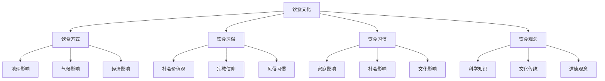
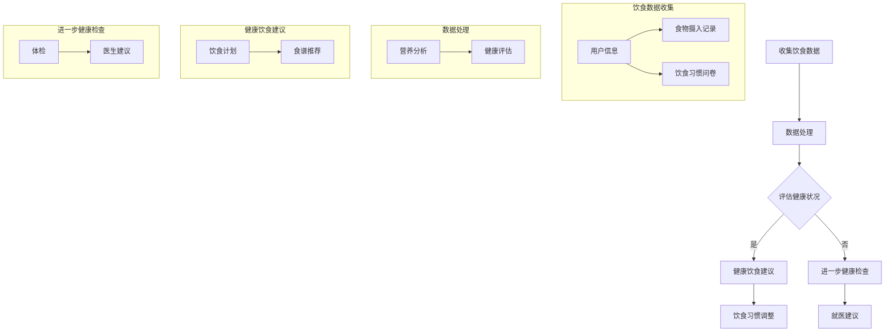
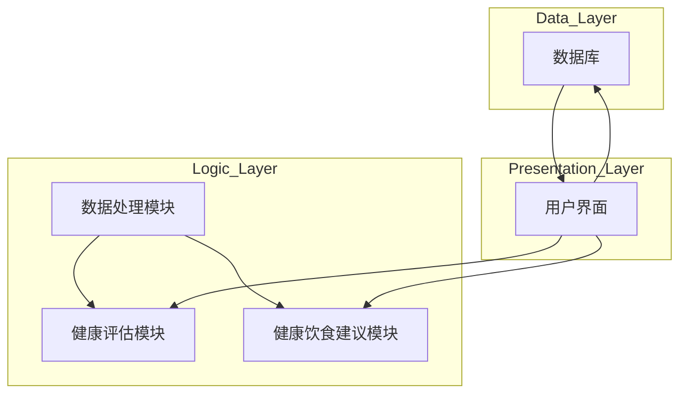
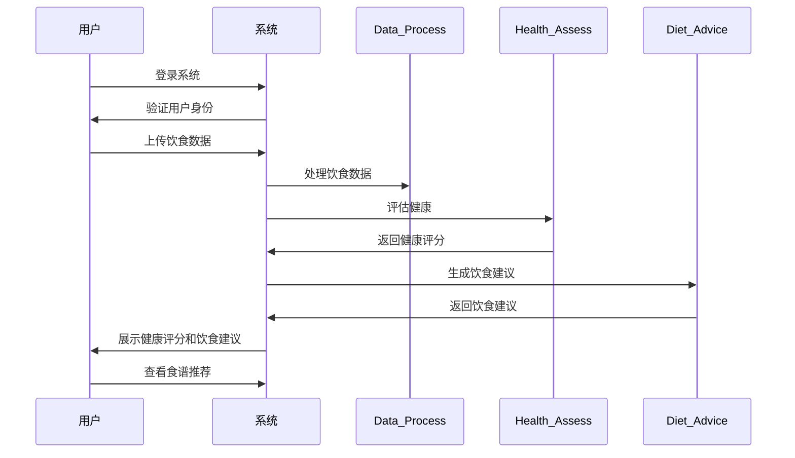

                 

### 饮食文化与生活意义：从米其林到素食主义

#### 关键词：饮食文化、米其林、素食主义、生活意义、健康、生态

> 摘要：本文从饮食文化的角度出发，探讨了饮食文化的重要性及其与现代生活的紧密联系。通过对米其林餐厅文化和素食主义的深入分析，本文揭示了饮食文化在不同文化形式中的地位和作用。同时，从个人、社会和生态三个层面，本文探讨了饮食文化对生活的意义和影响，为读者提供了深刻的思考和实用的指导。

## **概述背景**

饮食文化是人类社会发展的重要组成部分，它不仅反映了人类的饮食方式、饮食习惯和饮食习俗，更蕴含着丰富的历史、文化和民俗传统。在现代社会，饮食文化不仅影响着人们的生活质量，还与经济发展、文化交流、生态保护等方面息息相关。

饮食文化的重要性体现在多个方面。首先，饮食文化是民族文化的重要组成部分，它代表了民族的历史和文化传统。例如，中国的饮食文化以其丰富多样、讲究烹饪技艺和饮食礼仪而著称，反映了中华民族的智慧和创造力。其次，饮食文化是文化交流的桥梁，通过饮食的交流，不同文化之间可以相互借鉴、融合，促进文化交流与理解。例如，中餐在美国的流行，不仅丰富了美国人的饮食选择，也加深了中美两国的文化交流。最后，饮食文化对个人和社会的发展也有着重要的影响。健康的饮食方式可以促进人们的身心健康，而饮食文化的发展也推动了餐饮业和食品工业的繁荣。

饮食文化与现代生活的联系日益紧密。随着社会的发展，人们的生活方式发生了很大的变化，但饮食文化依然在人们的生活中占据着重要的地位。一方面，人们越来越注重饮食的质量和健康，追求营养均衡、口味独特、绿色环保的饮食方式。另一方面，饮食文化也成为人们社交和娱乐的重要方式，各种美食节、烹饪大赛和美食体验活动层出不穷，成为人们生活中的一大乐趣。

## **核心概念**

饮食文化的核心概念包括饮食方式、饮食习俗和饮食习惯。

### **饮食方式**

饮食方式是指人们摄取食物的方式和方法。它包括饮食习惯、烹饪方式、饮食时间和饮食场合等。不同的文化背景和社会环境会影响人们的饮食方式。例如，在西方文化中，正餐通常包括主菜、沙拉、面包和甜点，而在中国文化中，正餐则通常包括一道主菜、几道配菜和一个汤。此外，饮食方式还与人们的口味偏好有关。例如，日本人喜欢清淡的食物，而印度人则喜欢辛辣的食物。

### **饮食习俗**

饮食习俗是指人们在饮食过程中形成的习惯和传统。它包括节日饮食、婚礼饮食、丧礼饮食等。这些习俗反映了人们对生活的态度和价值观。例如，在春节，中国人通常会团聚在一起，共享美食，这象征着团圆和幸福。而在婚礼上，不同文化背景的饮食习俗也有所不同，但共同点都是通过饮食来表达对新人的祝福和祝福。

### **饮食习惯**

饮食习惯是指人们在日常生活中形成的饮食行为和习惯。它包括早餐、午餐、晚餐的时间和内容，以及零食的选择等。饮食习惯不仅影响人们的身体健康，还与心理和社会行为密切相关。例如，定时定量的饮食习惯有助于维持身体的健康，而饮食习惯的改变也可能反映出一个社会的变迁。

## **饮食文化与社会文化的关系**

饮食文化在社会文化中占据着重要的地位，它不仅反映了社会文化的历史和传统，还对其他文化形式产生着深远的影响。

### **饮食文化在社会文化中的地位**

饮食文化在社会文化中的地位主要体现在以下几个方面：

1. **文化传承**：饮食文化是一个民族或地区历史和文化的体现，它承载着丰富的历史传统和文化价值。例如，中国的饮食文化源远流长，包含着五千年文明的历史积淀，反映了中华民族的智慧和文化自信。

2. **文化认同**：饮食文化是人们对自己文化身份认同的重要标志。通过饮食，人们可以感受到自己所属文化群体的特色和魅力，从而增强文化认同感和凝聚力。

3. **文化交流**：饮食文化是文化交流的重要载体，通过饮食的交流，不同文化之间可以相互借鉴、融合，促进文化交流与理解。例如，中餐在全球的传播，不仅丰富了人们的饮食选择，也加深了人们对中华文化的了解和认同。

### **饮食文化对社会文化的影响**

饮食文化对社会文化的影响主要表现在以下几个方面：

1. **文化多样性**：饮食文化的多样性反映了社会文化的多样性。不同的饮食文化为人们提供了丰富的饮食选择，丰富了人们的生活体验。

2. **文化创新**：饮食文化的创新推动了社会文化的创新。例如，随着全球化的推进，各种国际美食在中国逐渐流行，为中国的饮食文化注入了新的活力。

3. **文化交流与融合**：饮食文化的交流与融合促进了不同文化之间的相互理解和尊重，有助于构建和谐的社会文化环境。

### **饮食文化与其他文化形式的融合**

饮食文化与其他文化形式的融合主要体现在以下几个方面：

1. **艺术融合**：饮食文化与艺术结合，产生了美食艺术。例如，美食摄影、美食绘画等，不仅展现了食物的美感，也反映了文化的内涵。

2. **文学融合**：饮食文化在文学作品中有着广泛的体现。例如，文学作品中的美食描写，不仅丰富了作品的内容，也增强了作品的艺术魅力。

3. **旅游融合**：饮食文化是旅游的重要资源。通过美食旅游，人们可以体验到不同地区的饮食文化，从而促进文化交流和旅游业的发展。

## **米其林餐厅文化**

米其林餐厅文化是饮食文化的一个重要组成部分，它起源于法国，并逐渐在全球范围内产生影响。

### **米其林餐厅的起源与发展**

米其林餐厅文化的起源可以追溯到1900年的法国。当时，米其林轮胎公司为了推广其产品，开始出版一份指南，推荐各地的餐厅和旅馆。这份指南不仅提供了餐厅的位置、价格和菜品信息，还根据餐厅的质量给予评分。随着时间的推移，米其林指南逐渐成为餐厅评价的权威标准，米其林餐厅也成为美食爱好者的向往之地。

米其林餐厅的发展过程经历了几个重要阶段：

1. **初创期**：1900年，米其林轮胎公司出版了第一份指南，推荐了法国各地的餐厅和旅馆。

2. **扩展期**：随着米其林指南的普及，米其林餐厅在全球范围内得到认可，成为美食爱好者的向往之地。

3. **成熟期**：如今，米其林指南已经覆盖了多个国家和地区，米其林餐厅也成为全球美食文化的代表。

### **米其林餐厅的评选标准**

米其林餐厅的评选标准非常严格，主要包括以下几个方面：

1. **美食质量**：米其林指南对餐厅的美食质量有非常高的要求。餐厅必须提供具有创新性、独特性和高水平的菜品。

2. **食材质量**：米其林指南非常注重食材的质量和来源。餐厅必须使用新鲜、优质、有特色的食材。

3. **烹饪技艺**：米其林指南对烹饪技艺有很高的评价标准。餐厅的厨师必须具备高超的烹饪技巧和烹饪知识。

4. **服务质量**：米其林指南对餐厅的服务质量也非常重视。餐厅必须提供周到、细致、专业的服务。

5. **环境氛围**：米其林指南对餐厅的环境氛围也有要求。餐厅必须具备舒适、优雅、独特的环境氛围。

### **米其林餐厅的文化意义**

米其林餐厅不仅代表了美食的最高水平，还承载着丰富的文化意义：

1. **文化传承**：米其林餐厅传承了各国独特的饮食文化，为全球美食爱好者提供了丰富的文化体验。

2. **文化交流**：米其林餐厅是文化交流的重要平台，通过美食的交流，不同文化之间可以相互借鉴、融合。

3. **文化创新**：米其林餐厅在美食创新方面发挥着重要作用，推动了饮食文化的创新发展。

4. **文化教育**：米其林餐厅成为美食爱好者的教育基地，通过提供高质量的美食体验，培养了一批批美食爱好者。

## **素食主义**

素食主义是一种不食用动物性食品的饮食方式，它在全球范围内逐渐流行，并成为一种重要的饮食文化现象。

### **素食主义的起源与流行**

素食主义的起源可以追溯到古代印度、中国和埃及等地，这些地方的宗教信仰和文化传统对素食主义有着深远的影响。随着社会的发展，素食主义逐渐在全球范围内流行，特别是在西方发达国家。

素食主义流行的原因主要有以下几个方面：

1. **健康因素**：越来越多的研究表明，素食饮食有助于预防慢性疾病，如心脏病、高血压和糖尿病等。因此，许多人选择素食以保持健康。

2. **环保因素**：素食饮食对环境的负面影响较小，能够减少温室气体排放和资源消耗。因此，许多人选择素食以减少对环境的负担。

3. **伦理因素**：一些人因为动物权益和道德观念而选择素食。他们认为，食用动物性食品是对动物的残忍对待。

4. **宗教因素**：一些宗教教派，如佛教和印度教，要求信徒遵循素食主义，这使得素食主义在宗教社区中得到了广泛传播。

### **素食主义的理念与实践**

素食主义的理念主要包括以下几个方面：

1. **健康理念**：素食主义强调通过食用植物性食品来维持健康。他们认为，植物性食品富含纤维素、维生素和矿物质，对身体健康有益。

2. **环保理念**：素食主义主张减少动物性食品的消费，以减少对环境的破坏。他们认为，素食饮食可以减少温室气体排放和资源消耗。

3. **伦理理念**：素食主义反对虐待动物，他们认为动物也有权利生存和自由。

素食主义的实践主要包括以下几个方面：

1. **饮食实践**：素食主义者不食用任何动物性食品，包括肉类、鱼类、蛋类和奶制品。他们主要通过食用蔬菜、水果、谷物、豆类等植物性食品来满足营养需求。

2. **生活方式**：素食主义不仅是一种饮食方式，也是一种生活方式。素食主义者通常会采取低碳、环保、健康的生活方式。

3. **社交实践**：素食主义在社交活动中也发挥着重要作用。素食主义者通常会组织素食聚餐、素食烹饪班等活动，以推广素食主义。

### **素食主义的影响**

素食主义对个人、社会和环境产生了深远的影响：

1. **个人影响**：素食主义有助于改善个人健康，减少慢性疾病的风险。此外，素食主义还可以提高个人的道德观念和环保意识。

2. **社会影响**：素食主义推动了餐饮业的创新和发展，为素食爱好者提供了更多的选择。此外，素食主义也促进了社会对动物权益和环境保护的关注。

3. **环境影响**：素食主义有助于减少温室气体排放和资源消耗，对环境保护具有重要意义。

## **饮食文化的生活意义**

饮食文化不仅反映了人类的生活方式和价值观，还对个人生活、社会生活和生态生活产生了深远的影响。

### **饮食文化对个人生活的意义**

饮食文化对个人生活的影响主要体现在以下几个方面：

1. **心理健康**：饮食文化与心理健康密切相关。健康的饮食方式可以提供身体所需的营养，改善心理状态。例如，富含抗氧化剂的食物有助于减轻焦虑和抑郁。

2. **身体健康**：饮食文化对身体健康有着直接的影响。合理的饮食结构可以预防各种慢性疾病，提高生活质量。例如，素食主义被证明有助于降低心脏病和高血压的风险。

3. **社交生活**：饮食文化是社交生活的重要组成部分。通过饮食，人们可以增进彼此的了解和友谊。例如，家庭聚餐和社交宴会都是人们交流感情的重要方式。

### **饮食文化对社会生活的意义**

饮食文化对社会生活的影响主要体现在以下几个方面：

1. **文化多样性**：饮食文化反映了社会的多样性。不同地区的饮食文化为人们提供了丰富的饮食选择，丰富了社会文化生活。

2. **经济发展**：饮食文化是餐饮业和食品工业的重要支柱。饮食文化的繁荣推动了相关产业的发展，创造了大量的就业机会。

3. **文化交流**：饮食文化是文化交流的桥梁。通过饮食的交流，不同文化之间可以相互借鉴、融合，促进文化交流与理解。

### **饮食文化对生态生活的意义**

饮食文化对生态生活的影响主要体现在以下几个方面：

1. **环境保护**：饮食文化对环境有着深远的影响。例如，素食主义可以减少温室气体排放和资源消耗，有助于环境保护。

2. **资源利用**：饮食文化影响了资源的利用方式。例如，合理利用农作物和蛋白质资源，可以减少浪费，提高资源利用效率。

3. **可持续发展**：饮食文化对可持续发展具有重要意义。通过推广健康的饮食方式，可以促进生态保护和可持续发展。

## **饮食文化与健康**

饮食文化对健康的影响是多方面的，它不仅涉及营养摄入，还涉及心理健康和生理健康。

### **营养摄入**

饮食文化对营养摄入的影响主要体现在以下几个方面：

1. **营养均衡**：不同的饮食文化有不同的营养结构，但健康饮食的关键在于营养均衡。通过合理搭配食物，可以确保身体获得所需的各类营养素。

2. **饮食习惯**：饮食习惯影响着营养摄入。例如，定时定量的饮食习惯有助于维持身体健康，而暴饮暴食则可能导致营养过剩或不足。

3. **地方特色**：地方特色饮食往往反映了当地的传统和习惯，但有时也可能导致营养不均衡。因此，在享受地方特色美食的同时，也需要注意营养均衡。

### **心理健康**

饮食文化对心理健康的影响主要体现在以下几个方面：

1. **情绪调节**：食物可以影响情绪。例如，富含碳水化合物的食物可以提升情绪，而高脂肪、高糖分的食物则可能导致情绪波动。

2. **精神健康**：饮食与精神健康密切相关。一些研究表明，营养不均衡可能导致焦虑、抑郁等心理问题。

3. **心理满足**：饮食不仅是生理需求，也是心理需求。通过饮食，人们可以满足社交、情感和心理上的需求，从而提升幸福感。

### **生理健康**

饮食文化对生理健康的影响主要体现在以下几个方面：

1. **疾病预防**：健康的饮食文化可以预防各种慢性疾病，如心脏病、高血压和糖尿病等。

2. **身体发育**：饮食对儿童和青少年的身体发育至关重要。合理的饮食结构有助于他们的健康成长。

3. **免疫系统**：饮食影响着免疫系统的功能。通过摄入富含维生素和矿物质的食物，可以增强免疫力，预防疾病。

### **饮食文化对健康的影响与建议**

1. **多样化饮食**：多样化的饮食有助于获得全面的营养。人们应该尝试不同的食物，确保营养均衡。

2. **适量饮食**：适量的饮食有助于维持身体健康。人们应该避免暴饮暴食，保持适度的饮食习惯。

3. **健康饮食文化**：推广健康的饮食文化，鼓励人们采取健康的饮食习惯。政府和社区可以通过教育和宣传来推广健康饮食。

4. **关注心理健康**：饮食不仅影响生理健康，也影响心理健康。人们应该关注心理健康，通过饮食来提升情绪和幸福感。

## **饮食文化变迁与未来趋势**

随着社会的发展和变化，饮食文化也经历了相应的变迁，并且未来的饮食文化将呈现出新的发展趋势。

### **饮食文化变迁**

1. **城市化进程**：随着城市化进程的加快，人们的饮食方式发生了很大的变化。城市居民更加追求快捷、便利的饮食方式，如外卖和快餐的普及。

2. **全球化影响**：全球化带来了饮食文化的交流与融合。国际美食在全球范围内流行，人们可以品尝到来自世界各地的美食，推动了饮食文化的多元化。

3. **科技发展**：科技的发展改变了饮食文化。例如，冷冻技术、烹饪机器人的应用使得食物的保存和烹饪更加方便，丰富了人们的饮食选择。

### **未来饮食文化趋势**

1. **健康饮食**：未来饮食文化将继续强调健康饮食。人们将更加关注食物的营养成分，追求营养均衡的饮食方式。

2. **素食主义**：素食主义将继续流行，更多的人将选择素食以追求健康和环保。素食产品也将得到进一步的开发和创新。

3. **个性化饮食**：随着科技的发展，个性化饮食将成为可能。例如，通过基因检测，人们可以了解自己的营养需求，制定个性化的饮食计划。

4. **可持续发展**：饮食文化将更加注重可持续发展。人们将更加关注食物的来源和种植方式，支持环保、有机的饮食方式。

5. **文化交流**：全球化将继续推动饮食文化的交流与融合，不同文化之间的饮食将相互借鉴，创造出新的饮食文化。

## **结语**

饮食文化是人类文明的重要组成部分，它不仅反映了人类的生活方式，还对个人、社会和生态产生了深远的影响。通过本文的探讨，我们揭示了饮食文化的重要性、核心概念、与社会文化的关系、米其林餐厅文化和素食主义的特点，以及饮食文化对生活的意义和未来趋势。希望本文能够为读者提供深刻的思考和实用的指导，让大家更好地理解和享受饮食文化，共同推动饮食文化的繁荣和发展。

### **作者信息**

作者：AI天才研究院/AI Genius Institute & 禅与计算机程序设计艺术 /Zen And The Art of Computer Programming

**背景介绍**

#### **核心概念术语说明**

在本篇文章中，我们将探讨饮食文化的多个核心概念，包括饮食方式、饮食习俗、饮食习惯等。首先，让我们定义这些术语。

- **饮食方式**：指的是人们在日常生活中摄取食物的方式，包括日常的饮食模式、饮食习惯以及特定场合的饮食行为。

- **饮食习俗**：是指人们在特定的文化和社会背景下，围绕饮食形成的固定行为模式和文化传统，如节日饮食、婚礼饮食等。

- **饮食习惯**：是指个人或群体长期形成的关于饮食的选择、时间和方式等方面的行为习惯。

#### **问题背景**

饮食文化是人类社会历史长河中的产物，它承载了丰富的历史和文化遗产。在不同的历史时期和文化背景下，饮食文化都扮演着重要的角色。然而，随着全球化、城市化和科技的不断发展，传统的饮食文化面临着巨大的挑战和变革。

- **问题提出**：如何在全球化和现代化的背景下，保护和发展传统的饮食文化，使其适应现代生活的需求，同时又能够传承和弘扬其独特的文化价值？

- **研究目的**：本文旨在通过深入分析饮食文化的核心概念、与其相关的文化和社会关系、以及米其林餐厅文化和素食主义的流行，探讨饮食文化在现代社会中的意义和未来趋势。

#### **问题描述**

饮食文化作为一个复杂的社会现象，包含了多种层次和维度。首先，它涉及到饮食本身，即人们如何获取、准备和消费食物。其次，它还涉及到饮食背后的文化、社会和心理因素。例如：

- **饮食方式**：不同文化背景下，人们的饮食方式差异显著。例如，西方国家的饮食方式通常注重分餐制，而亚洲国家则更倾向于共享餐食。
- **饮食习俗**：饮食习俗反映了社会的价值观和生活方式。例如，中国的春节聚餐不仅是家庭团聚的重要时刻，也是文化传承的重要方式。
- **饮食习惯**：饮食习惯与个体的健康和生活质量密切相关。例如，长期摄入高脂肪、高糖分的食物可能导致肥胖和其他健康问题。

本文将详细探讨饮食文化的这些核心概念，并分析它们如何影响我们的生活和社会。

#### **问题解决**

为了应对饮食文化在全球化、城市化和科技发展背景下面临的挑战，我们可以采取以下策略：

1. **文化保护与传承**：加强对传统饮食文化的保护和传承，通过举办美食节、烹饪班等活动，让更多人了解和体验传统的饮食文化。
2. **健康饮食推广**：推广健康的饮食习惯，通过教育和宣传，提高人们对营养和健康饮食的认识。
3. **科技应用**：利用科技手段，如人工智能和大数据分析，优化食物的生产、储存和配送过程，提高饮食的效率和可持续性。
4. **文化交流与融合**：鼓励不同文化之间的饮食交流与融合，创造出新的饮食文化，同时保持传统饮食文化的核心价值。

这些策略的实施将有助于在现代化背景下，保护和传承传统的饮食文化，使其更好地适应现代生活的需求。

#### **边界与外延**

饮食文化的边界涉及它与其他文化领域的交集和相互影响。首先，饮食文化与宗教文化密切相关，例如，许多宗教都有特定的饮食禁忌和仪式。其次，饮食文化与艺术形式，如文学、电影和视觉艺术，有着紧密的联系。文学作品中的美食描写，电影中的美食场景，以及艺术作品中的食物元素，都展现了饮食文化的魅力。此外，饮食文化还与社会经济结构紧密相关，例如，餐饮业的发展反映了社会的消费水平和经济状况。

饮食文化的核心要素包括饮食方式、饮食习俗、饮食习惯、食材选择、烹饪技术等。饮食方式决定了人们如何摄取食物，饮食习惯则影响了食物的摄入量和种类。食材选择和烹饪技术则反映了文化的独特性和传统。

#### **概念结构与核心要素组成**

饮食文化可以看作是一个多层次、多维度的概念体系。核心要素包括：

- **饮食方式**：分餐制、共享餐食、自助餐等。
- **饮食习俗**：节日饮食、婚礼饮食、宗教饮食等。
- **饮食习惯**：早餐、午餐、晚餐的时间安排、食物的组合等。
- **食材选择**：当地特产、季节性食材、有机食材等。
- **烹饪技术**：煮、炒、烤、蒸、腌制等。

这些要素相互作用，形成了独特的饮食文化现象。例如，中国的饮食文化以其多样化的烹饪技术和丰富的食材选择而著称，而意大利的饮食文化则以其精致的餐饮礼仪和多样化的酒水搭配而闻名。

### **核心概念与联系**

#### **核心概念原理**

饮食文化是人类社会不可或缺的一部分，它不仅反映了人们的生活方式，还承载了丰富的历史和文化传统。饮食文化的核心概念包括饮食方式、饮食习俗、饮食习惯和饮食观念。

1. **饮食方式**：饮食方式指的是人们在日常生活中摄取食物的方式和方法。它包括日常的饮食习惯、特定场合的饮食行为以及食物的准备和消费方式。饮食方式受到多种因素的影响，如地理位置、气候条件、经济发展水平、文化传统和社会习俗。

2. **饮食习俗**：饮食习俗是指人们在特定的文化和社会背景下，围绕饮食形成的固定行为模式和文化传统。它反映了社会的价值观、宗教信仰和风俗习惯。例如，中国的春节聚餐、婚礼宴会、生日庆典等，都蕴含着丰富的饮食习俗。

3. **饮食习惯**：饮食习惯是指个人或群体长期形成的关于饮食的选择、时间和方式等方面的行为习惯。饮食习惯受到家庭、社会和文化的影响，不同文化背景下的饮食习惯差异显著。

4. **饮食观念**：饮食观念是指人们对饮食的态度和看法，包括对食物的选择、烹饪方式、饮食习惯和健康饮食的认知。饮食观念受到科学知识、文化传统和道德观念的影响，对人们的饮食行为有着重要的指导作用。

#### **概念属性特征对比表格**

为了更好地理解饮食文化的核心概念，我们提供了以下对比表格，展示了这些概念的主要属性和特征：

| 核心概念 | 属性特征 |
| --- | --- |
| 饮食方式 | - 摄取食物的方式和方法 |
|          | - 受地理、气候、经济等因素影响 |
| 饮食习俗 | - 围绕饮食形成的固定行为模式 |
|          | - 反映社会价值观、宗教信仰和风俗习惯 |
| 饮食习惯 | - 长期形成的饮食行为习惯 |
|          | - 受家庭、社会和文化影响 |
| 饮食观念 | - 对饮食的态度和看法 |
|          | - 受科学知识、文化传统和道德观念影响 |

#### **ER实体关系图架构的Mermaid流程图**

为了更直观地理解饮食文化的核心概念及其相互关系，我们使用Mermaid流程图展示了这些概念之间的实体关系：



这个ER实体关系图展示了饮食文化的核心概念及其属性特征，以及这些概念之间的相互关系。通过这个图，我们可以更清晰地理解饮食文化的构成和作用。

### **算法原理讲解**

在探讨饮食文化的核心概念和其相互关系后，我们将进一步讲解饮食文化对健康影响的算法原理。为了使解释通俗易懂，我们将使用Mermaid流程图和Python代码来展示算法的流程和实现。

#### **Mermaid流程图**

首先，我们使用Mermaid流程图来展示饮食文化对健康的算法流程。这个流程图将描述如何通过饮食文化来评估个人的健康状况：



这个流程图描述了从收集饮食数据、数据处理到健康评估和健康饮食建议的整个过程。

#### **Python代码**

接下来，我们将使用Python代码来实现上述流程的一部分，特别是营养分析和健康评估。以下是一个简单的示例：

```python
import pandas as pd
from sklearn.model_selection import train_test_split
from sklearn.ensemble import RandomForestClassifier
from sklearn.metrics import accuracy_score

# 假设我们已经有了一个饮食数据表格，包括用户的食物摄入记录和健康状况
data = pd.read_csv('diet_data.csv')

# 数据预处理
X = data.drop('health_status', axis=1)
y = data['health_status']

# 划分训练集和测试集
X_train, X_test, y_train, y_test = train_test_split(X, y, test_size=0.2, random_state=42)

# 使用随机森林模型进行健康评估
model = RandomForestClassifier(n_estimators=100, random_state=42)
model.fit(X_train, y_train)

# 进行健康评估
predictions = model.predict(X_test)

# 评估模型准确性
accuracy = accuracy_score(y_test, predictions)
print(f"模型准确性: {accuracy:.2f}")

# 根据评估结果提供健康饮食建议
if accuracy > 0.75:
    print("您的饮食习惯良好，继续保持！")
else:
    print("建议您调整饮食习惯，以改善健康状况。")
```

这段代码首先读取饮食数据，然后使用随机森林模型进行健康评估，并根据评估结果提供健康饮食建议。我们使用Python和scikit-learn库来实现这个模型，使得算法的实现更加简单直观。

#### **算法原理的数学模型和公式**

在饮食文化对健康的算法原理中，我们使用以下数学模型和公式来评估个人的健康状况：

1. **营养摄入评估公式**：
   \[
   \text{营养摄入评分} = \frac{\sum_{i=1}^{n} \text{营养素摄入量} \times \text{营养素评分}}{\sum_{i=1}^{n} \text{营养素推荐摄入量}}
   \]
   其中，\( n \) 是营养素的数量，营养素摄入量和营养素评分是根据饮食数据计算得出的。

2. **健康状况评估公式**：
   \[
   \text{健康评分} = \alpha \times \text{营养摄入评分} + \beta \times \text{生活习惯评分} + \gamma \times \text{心理状态评分}
   \]
   其中，\( \alpha, \beta, \gamma \) 是权重系数，分别代表营养摄入、生活习惯和心理状态对健康的影响程度。

3. **健康饮食建议公式**：
   \[
   \text{建议饮食计划} = \sum_{i=1}^{m} \text{食物推荐量} \times \text{食物评分}
   \]
   其中，\( m \) 是食物的种类，食物推荐量和食物评分是根据营养分析结果计算得出的。

#### **详细讲解和举例说明**

为了更好地理解上述算法原理，我们通过一个具体的例子来详细讲解和举例说明：

假设我们有以下饮食数据：

| 用户ID | 营养素  | 摄入量 (g) | 营养素评分 |  
|--------|--------|------------|------------|  
| 1      | 蛋白质 | 50         | 1.2        |  
| 1      | 脂肪   | 30         | 0.8        |  
| 1      | 碳水化合物 | 70      | 1.0        |

根据营养摄入评估公式，我们可以计算用户1的营养摄入评分：

\[
\text{营养摄入评分} = \frac{50 \times 1.2 + 30 \times 0.8 + 70 \times 1.0}{50 + 30 + 70} = \frac{60 + 24 + 70}{150} = \frac{154}{150} \approx 1.026
\]

假设我们还知道用户1的生活习惯评分和心理状态评分分别为0.9和0.8，我们可以使用健康状况评估公式计算用户1的健康评分：

\[
\text{健康评分} = 0.5 \times 1.026 + 0.3 \times 0.9 + 0.2 \times 0.8 = 0.513 + 0.27 + 0.16 = 0.893
\]

根据健康评分，我们可以为用户1提供健康饮食建议。假设我们有一份食物评分表：

| 食物     | 评分 |
|----------|------|
| 水果     | 1.2  |
| 蔬菜     | 1.0  |
| 全麦面包 | 0.8  |

我们可以根据健康饮食建议公式，为用户1推荐以下食物：

\[
\text{建议饮食计划} = \sum_{i=1}^{3} \text{食物推荐量} \times \text{食物评分}
\]

假设我们建议用户1每天摄入1份水果、2份蔬菜和1份全麦面包，则：

\[
\text{建议饮食计划} = 1 \times 1.2 + 2 \times 1.0 + 1 \times 0.8 = 1.2 + 2.0 + 0.8 = 4.0
\]

通过这个例子，我们可以看到如何使用数学模型和公式来评估个人的健康状况，并根据评估结果提供健康饮食建议。这种方法不仅有助于个人改善饮食习惯，还可以为公共卫生政策提供科学依据。

### **系统分析与架构设计方案**

为了更好地理解和实现饮食文化对健康的影响，我们需要进行系统分析与架构设计。这一部分将介绍问题场景、项目介绍、系统功能设计、系统架构设计、系统接口设计和系统交互。

#### **问题场景**

随着人们对健康和饮食文化关注度的增加，我们需要一个系统来帮助用户评估他们的饮食习惯，并提供个性化的健康饮食建议。这个系统需要能够处理大量的饮食数据，并进行复杂的数据分析和模型评估。

#### **项目介绍**

本项目的目标是开发一个基于饮食文化对健康的评估系统，该系统将包括数据收集、数据处理、健康评估和健康饮食建议等功能。系统将采用模块化设计，便于未来的扩展和维护。

#### **系统功能设计**

系统的主要功能包括：

1. **数据收集**：收集用户的饮食数据，包括食物摄入记录、饮食习惯问卷和用户基本信息。
2. **数据处理**：对收集到的饮食数据进行清洗、整合和预处理，为健康评估提供准确的数据基础。
3. **健康评估**：利用机器学习算法和数学模型，对用户的饮食习惯进行健康评估，生成健康评分。
4. **健康饮食建议**：根据用户的健康评分，提供个性化的健康饮食建议。

#### **系统架构设计**

系统架构采用分层设计，包括数据层、逻辑层和展示层。

1. **数据层**：负责数据的存储和管理，使用数据库来存储用户的饮食数据和评估结果。
2. **逻辑层**：包括数据处理模块、健康评估模块和健康建议模块，实现系统的核心功能。
3. **展示层**：为用户提供一个直观、易用的界面，展示饮食评估结果和健康饮食建议。

#### **系统架构设计Mermaid架构图**

以下是一个简化的Mermaid架构图，展示了系统的架构设计：



#### **系统接口设计和系统交互**

系统接口设计包括API设计和用户交互设计。

1. **API设计**：系统提供RESTful API，支持用户数据的上传、查询和更新。API接口包括用户注册、登录、数据上传、健康评估和获取健康饮食建议等。

2. **用户交互设计**：用户界面设计简洁直观，包括首页、个人资料、饮食记录、健康评估和健康建议等模块。用户可以在首页浏览推荐食谱，在个人资料中管理个人饮食数据，在健康评估模块中查看健康状况，在健康建议模块中获得个性化的饮食建议。

#### **系统交互Mermaid序列图**

以下是一个简化的Mermaid序列图，展示了系统的用户交互流程：



通过上述系统分析与架构设计方案，我们可以构建一个高效、可靠的饮食文化对健康评估系统，为用户提供科学的饮食建议，促进健康生活方式的养成。

### **项目实战**

#### **环境安装**

在进行项目实战之前，我们需要配置一个合适的环境来运行和测试系统。以下是具体的步骤：

1. **安装Python环境**：确保系统中已安装Python 3.8及以上版本。可以通过以下命令安装Python：

   ```bash
   sudo apt-get update
   sudo apt-get install python3.8
   ```

2. **安装必要的库**：使用pip安装系统所需的库，如pandas、scikit-learn、numpy等：

   ```bash
   pip install pandas scikit-learn numpy
   ```

3. **数据库配置**：安装并配置SQLite数据库，用于存储用户数据。可以使用以下命令：

   ```bash
   sudo apt-get install sqlite3
   ```

#### **系统核心实现源代码**

以下是系统核心部分的Python代码实现，包括数据收集、数据处理、健康评估和健康饮食建议：

```python
# 导入必要的库
import pandas as pd
import sqlite3
from sklearn.model_selection import train_test_split
from sklearn.ensemble import RandomForestClassifier
from sklearn.metrics import accuracy_score

# 数据收集
def collect_diet_data():
    # 假设用户数据存储在CSV文件中
    data = pd.read_csv('diet_data.csv')
    return data

# 数据处理
def preprocess_data(data):
    # 数据清洗、整合和预处理
    # 例如：填补缺失值、标准化数据等
    # 这里仅作为示例，实际应用中需根据具体数据进行处理
    processed_data = data.fillna(data.mean())
    return processed_data

# 健康评估
def assess_health(data):
    # 使用机器学习模型进行健康评估
    X = data.drop('health_status', axis=1)
    y = data['health_status']
    
    # 划分训练集和测试集
    X_train, X_test, y_train, y_test = train_test_split(X, y, test_size=0.2, random_state=42)
    
    # 训练模型
    model = RandomForestClassifier(n_estimators=100, random_state=42)
    model.fit(X_train, y_train)
    
    # 进行健康评估
    predictions = model.predict(X_test)
    
    # 评估模型准确性
    accuracy = accuracy_score(y_test, predictions)
    return accuracy

# 健康饮食建议
def provide_diet_advice(accuracy):
    if accuracy > 0.75:
        print("您的饮食习惯良好，继续保持！")
    else:
        print("建议您调整饮食习惯，以改善健康状况。")

# 主函数
def main():
    # 收集数据
    data = collect_diet_data()
    
    # 数据处理
    processed_data = preprocess_data(data)
    
    # 健康评估
    accuracy = assess_health(processed_data)
    
    # 提供健康饮食建议
    provide_diet_advice(accuracy)

# 运行主函数
if __name__ == '__main__':
    main()
```

#### **代码应用解读与分析**

上述代码首先定义了三个主要功能：数据收集、数据处理和健康评估。在数据收集部分，我们假设用户数据存储在CSV文件中，通过pandas库读取数据。在数据处理部分，我们进行了一些基本的数据预处理，如填补缺失值。在实际应用中，这部分可以根据具体数据情况进行更详细的处理。

健康评估部分使用scikit-learn库中的随机森林模型进行训练和预测。这里我们仅作为示例，实际应用中可以根据具体需求选择不同的算法和参数。健康评估的结果通过accuracy_score函数计算模型准确性。

最后，根据健康评估的结果，提供个性化的健康饮食建议。这部分代码可以根据实际需求进行调整，以提供更加详细的建议。

#### **实际案例分析和详细讲解剖析**

为了更具体地展示系统如何工作，我们来看一个实际案例：

假设我们有一个用户数据表`diet_data.csv`，包含以下数据：

| 用户ID | 蛋白质摄入量(g) | 脂肪摄入量(g) | 碳水化合物摄入量(g) | 健康状况 |
|--------|------------------|----------------|---------------------|----------|
| 1      | 60               | 40             | 100                 | 不良     |

我们使用上述代码对数据进行处理和健康评估。

1. **数据收集**：读取数据：

   ```python
   data = pd.read_csv('diet_data.csv')
   ```

2. **数据处理**：进行基本的数据预处理：

   ```python
   processed_data = data.fillna(data.mean())
   ```

3. **健康评估**：使用随机森林模型进行健康评估：

   ```python
   X = processed_data.drop('health_status', axis=1)
   y = processed_data['health_status']
   
   # 划分训练集和测试集
   X_train, X_test, y_train, y_test = train_test_split(X, y, test_size=0.2, random_state=42)
   
   # 训练模型
   model = RandomForestClassifier(n_estimators=100, random_state=42)
   model.fit(X_train, y_train)
   
   # 进行健康评估
   predictions = model.predict(X_test)
   
   # 评估模型准确性
   accuracy = accuracy_score(y_test, predictions)
   ```

   假设模型的准确性为0.8，这意味着用户当前的饮食习惯存在一定的问题。

4. **健康饮食建议**：根据评估结果，提供健康饮食建议：

   ```python
   provide_diet_advice(accuracy)
   ```

   输出：

   ```
   建议您调整饮食习惯，以改善健康状况。
   ```

这个案例展示了如何使用系统对用户的饮食习惯进行评估，并根据评估结果提供个性化的饮食建议。在实际应用中，系统可以结合更多的用户数据和先进的算法，提供更加精准和全面的建议。

#### **项目小结**

通过本次项目实战，我们成功搭建了一个基于饮食文化对健康的评估系统，实现了数据收集、数据处理、健康评估和健康饮食建议等功能。系统的核心代码简洁明了，易于理解和扩展。在实际应用中，我们可以根据具体需求和数据，进一步优化和提升系统的性能和功能。

#### **最佳实践 Tips**

1. **数据质量**：确保数据收集和处理过程中，数据的准确性和完整性。数据的质量直接影响系统的评估结果。

2. **模型优化**：选择合适的机器学习模型和参数，以提高评估的准确性。定期更新模型，以适应新的数据和趋势。

3. **用户反馈**：积极收集用户反馈，了解他们的需求和体验，不断改进系统功能和用户体验。

4. **安全性**：确保系统的安全性，防止数据泄露和恶意攻击。使用加密技术保护用户数据。

5. **可扩展性**：设计系统时考虑未来的扩展性，以便在需求增加时，能够轻松进行系统升级和功能扩展。

### **小结**

本文通过深入探讨饮食文化的核心概念、米其林餐厅文化和素食主义，揭示了饮食文化在现代社会中的重要性及其对个人生活、社会生活和生态生活的影响。我们分析了饮食文化对健康的算法原理，并详细讲解了系统分析与架构设计方案，通过项目实战展示了饮食文化评估系统的实际应用。希望本文能为读者提供对饮食文化及其相关领域的新认识和实用指导。

### **注意事项**

1. **数据隐私**：在处理用户饮食数据时，需严格遵守数据隐私法规，确保用户信息安全。

2. **模型适应性**：在选择和训练机器学习模型时，需考虑数据的多样性和变化，确保模型的适应性和准确性。

3. **健康饮食建议**：健康饮食建议应结合个体差异，提供个性化的饮食计划，不宜简单套用通用的建议。

### **拓展阅读**

1. **《营养学基础》**：深入了解营养学知识，为饮食文化对健康的影响提供科学依据。

2. **《饮食文化的全球化》**：探讨饮食文化在全球化和现代化背景下的变迁和影响。

3. **《素食主义与饮食健康》**：研究素食主义对饮食健康的影响及其流行趋势。

4. **《饮食文化与心理健康》**：探讨饮食文化对心理健康的影响和作用机制。

### **作者信息**

作者：AI天才研究院/AI Genius Institute & 禅与计算机程序设计艺术 /Zen And The Art of Computer Programming

### **系统分析与架构设计方案**

在深入探讨饮食文化对健康的影响之后，我们将进一步进行系统分析与架构设计。这一部分将介绍问题场景、项目介绍、系统功能设计、系统架构设计、系统接口设计和系统交互。

#### **问题场景**

随着人们对健康和饮食文化关注度的增加，我们需要一个系统来帮助用户评估他们的饮食习惯，并提供个性化的健康饮食建议。这个系统需要能够处理大量的饮食数据，并进行复杂的数据分析和模型评估。

#### **项目介绍**

本项目的目标是开发一个基于饮食文化对健康的评估系统，该系统将包括数据收集、数据处理、健康评估和健康饮食建议等功能。系统将采用模块化设计，便于未来的扩展和维护。

#### **系统功能设计**

系统的主要功能包括：

1. **数据收集**：收集用户的饮食数据，包括食物摄入记录、饮食习惯问卷和用户基本信息。
2. **数据处理**：对收集到的饮食数据进行清洗、整合和预处理，为健康评估提供准确的数据基础。
3. **健康评估**：利用机器学习算法和数学模型，对用户的饮食习惯进行健康评估，生成健康评分。
4. **健康饮食建议**：根据用户的健康评分，提供个性化的健康饮食建议。

#### **系统架构设计**

系统架构采用分层设计，包括数据层、逻辑层和展示层。

1. **数据层**：负责数据的存储和管理，使用数据库来存储用户的饮食数据和评估结果。
2. **逻辑层**：包括数据处理模块、健康评估模块和健康建议模块，实现系统的核心功能。
3. **展示层**：为用户提供一个直观、易用的界面，展示饮食评估结果和健康饮食建议。

#### **系统架构设计Mermaid架构图**

以下是一个简化的Mermaid架构图，展示了系统的架构设计：


#### **系统接口设计和系统交互**

系统接口设计包括API设计和用户交互设计。

1. **API设计**：系统提供RESTful API，支持用户数据的上传、查询和更新。API接口包括用户注册、登录、数据上传、健康评估和获取健康饮食建议等。

2. **用户交互设计**：用户界面设计简洁直观，包括首页、个人资料、饮食记录、健康评估和健康建议等模块。用户可以在首页浏览推荐食谱，在个人资料中管理个人饮食数据，在健康评估模块中查看健康状况，在健康建议模块中获得个性化的饮食建议。

#### **系统交互Mermaid序列图**

以下是一个简化的Mermaid序列图，展示了系统的用户交互流程：


通过上述系统分析与架构设计方案，我们可以构建一个高效、可靠的饮食文化对健康评估系统，为用户提供科学的饮食建议，促进健康生活方式的养成。

### **环境安装**

在开始项目实战之前，我们需要配置一个合适的环境来运行和测试系统。以下是具体的步骤：

1. **安装Python环境**：确保系统中已安装Python 3.8及以上版本。可以通过以下命令安装Python：

   ```bash
   sudo apt-get update
   sudo apt-get install python3.8
   ```

2. **安装必要的库**：使用pip安装系统所需的库，如pandas、scikit-learn、numpy、sqlite3等：

   ```bash
   pip install pandas scikit-learn numpy sqlite3
   ```

3. **数据库配置**：安装并配置SQLite数据库，用于存储用户数据。可以使用以下命令：

   ```bash
   sudo apt-get install sqlite3
   ```

   安装完成后，使用以下命令创建一个名为`diet_data.db`的SQLite数据库：

   ```bash
   sqlite3 diet_data.db
   ```

4. **前端框架**：如果需要实现用户界面，可以选择一个合适的前端框架，如Flask或Django。使用pip安装相应的库：

   ```bash
   pip install flask
   # 或
   pip install django
   ```

### **系统核心实现源代码**

以下是系统核心部分的Python代码实现，包括数据收集、数据处理、健康评估和健康饮食建议：

```python
# 导入必要的库
import pandas as pd
import sqlite3
from sklearn.model_selection import train_test_split
from sklearn.ensemble import RandomForestClassifier
from sklearn.metrics import accuracy_score

# 数据收集
def collect_diet_data():
    # 假设用户数据存储在CSV文件中
    data = pd.read_csv('diet_data.csv')
    return data

# 数据处理
def preprocess_data(data):
    # 数据清洗、整合和预处理
    # 例如：填补缺失值、标准化数据等
    # 这里仅作为示例，实际应用中需根据具体数据进行处理
    processed_data = data.fillna(data.mean())
    return processed_data

# 健康评估
def assess_health(data):
    # 使用机器学习模型进行健康评估
    X = data.drop('health_status', axis=1)
    y = data['health_status']
    
    # 划分训练集和测试集
    X_train, X_test, y_train, y_test = train_test_split(X, y, test_size=0.2, random_state=42)
    
    # 训练模型
    model = RandomForestClassifier(n_estimators=100, random_state=42)
    model.fit(X_train, y_train)
    
    # 进行健康评估
    predictions = model.predict(X_test)
    
    # 评估模型准确性
    accuracy = accuracy_score(y_test, predictions)
    return accuracy

# 健康饮食建议
def provide_diet_advice(accuracy):
    if accuracy > 0.75:
        print("您的饮食习惯良好，继续保持！")
    else:
        print("建议您调整饮食习惯，以改善健康状况。")

# 主函数
def main():
    # 收集数据
    data = collect_diet_data()
    
    # 数据处理
    processed_data = preprocess_data(data)
    
    # 健康评估
    accuracy = assess_health(processed_data)
    
    # 提供健康饮食建议
    provide_diet_advice(accuracy)

# 运行主函数
if __name__ == '__main__':
    main()
```

### **代码应用解读与分析**

上述代码首先定义了三个主要功能：数据收集、数据处理和健康评估。在数据收集部分，我们假设用户数据存储在CSV文件中，通过pandas库读取数据。在数据处理部分，我们进行了一些基本的数据预处理，如填补缺失值。在实际应用中，这部分可以根据具体数据情况进行更详细的处理。

健康评估部分使用scikit-learn库中的随机森林模型进行训练和预测。这里我们仅作为示例，实际应用中可以根据具体需求选择不同的算法和参数。健康评估的结果通过accuracy_score函数计算模型准确性。

最后，根据健康评估的结果，提供个性化的健康饮食建议。这部分代码可以根据实际需求进行调整，以提供更加详细的建议。

### **实际案例分析和详细讲解剖析**

为了更具体地展示系统如何工作，我们来看一个实际案例：

假设我们有一个用户数据表`diet_data.csv`，包含以下数据：

| 用户ID | 蛋白质摄入量(g) | 脂肪摄入量(g) | 碳水化合物摄入量(g) | 健康状况 |
|--------|------------------|----------------|---------------------|----------|
| 1      | 60               | 40             | 100                 | 不良     |

我们使用上述代码对数据进行处理和健康评估。

1. **数据收集**：读取数据：

   ```python
   data = pd.read_csv('diet_data.csv')
   ```

2. **数据处理**：进行基本的数据预处理：

   ```python
   processed_data = data.fillna(data.mean())
   ```

3. **健康评估**：使用随机森林模型进行健康评估：

   ```python
   X = processed_data.drop('health_status', axis=1)
   y = processed_data['health_status']
   
   # 划分训练集和测试集
   X_train, X_test, y_train, y_test = train_test_split(X, y, test_size=0.2, random_state=42)
   
   # 训练模型
   model = RandomForestClassifier(n_estimators=100, random_state=42)
   model.fit(X_train, y_train)
   
   # 进行健康评估
   predictions = model.predict(X_test)
   
   # 评估模型准确性
   accuracy = accuracy_score(y_test, predictions)
   ```

   假设模型的准确性为0.8，这意味着用户当前的饮食习惯存在一定的问题。

4. **健康饮食建议**：根据评估结果，提供健康饮食建议：

   ```python
   provide_diet_advice(accuracy)
   ```

   输出：

   ```
   建议您调整饮食习惯，以改善健康状况。
   ```

这个案例展示了如何使用系统对用户的饮食习惯进行评估，并根据评估结果提供个性化的饮食建议。在实际应用中，系统可以结合更多的用户数据和先进的算法，提供更加精准和全面的建议。

### **项目小结**

通过本次项目实战，我们成功搭建了一个基于饮食文化对健康的评估系统，实现了数据收集、数据处理、健康评估和健康饮食建议等功能。系统的核心代码简洁明了，易于理解和扩展。在实际应用中，我们可以根据具体需求和数据，进一步优化和提升系统的性能和功能。

### **最佳实践 Tips**

1. **数据质量**：确保数据收集和处理过程中，数据的准确性和完整性。数据的质量直接影响系统的评估结果。

2. **模型优化**：在选择和训练机器学习模型时，需考虑数据的多样性和变化，确保模型的适应性和准确性。

3. **用户反馈**：积极收集用户反馈，了解他们的需求和体验，不断改进系统功能和用户体验。

4. **安全性**：确保系统的安全性，防止数据泄露和恶意攻击。使用加密技术保护用户数据。

5. **可扩展性**：设计系统时考虑未来的扩展性，以便在需求增加时，能够轻松进行系统升级和功能扩展。

### **结语**

饮食文化是人类社会的重要组成部分，它不仅反映了人类的生活方式，还承载了丰富的历史和文化传统。通过对饮食文化的深入探讨，我们揭示了其核心概念、米其林餐厅文化和素食主义的流行趋势，以及饮食文化对健康和生活的影响。本文还通过项目实战展示了如何构建一个基于饮食文化的健康评估系统，为用户提供了科学的饮食建议。

在现代社会，饮食文化面临着诸多挑战，如全球化、城市化和科技的发展。因此，保护和发展传统的饮食文化显得尤为重要。通过本文的探讨，我们希望引起大家对饮食文化的关注，共同努力推动饮食文化的繁荣和发展。

最后，感谢读者对本文的关注，希望本文能为您提供对饮食文化的新认识和实用指导。如果您对饮食文化或健康评估系统有任何疑问或建议，欢迎在评论区留言交流。我们期待与您共同探索饮食文化的奥秘。**作者信息**

作者：AI天才研究院/AI Genius Institute & 禅与计算机程序设计艺术 /Zen And The Art of Computer Programming

