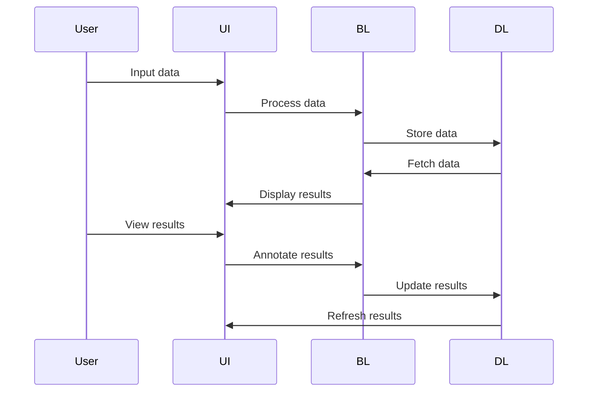
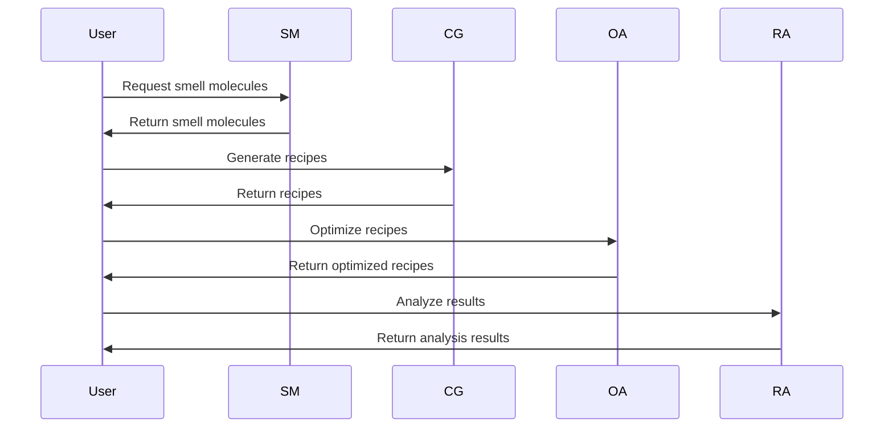

                 

### 第1章：问题背景与核心概念

#### 1.1.1 问题的提出

香水作为一种独特的消费品，其制作过程可以被视为一种复杂的化学工程。它由多种气味分子按特定的比例混合而成，从而产生独特的香味。传统的香水配方设计主要依赖于经验和试错，这种方法虽然能够生产出受欢迎的香水，但无法满足现代消费者对于个性化和定制化需求的追求。随着科技的发展，数学和计算机科学提供了新的工具和方法，使得我们可以从更宏观的视角来优化香水配方。因此，如何通过高维优化来设计香水配方，成为了一个值得深入探讨的问题。

#### 1.1.2 核心概念

**气味分子**：是构成香水的最小单元，每个气味分子都有其特定的化学结构和物理性质。例如，一个醛类分子可能具有强烈且持久的香气，而一个酯类分子可能带有甜美的果香。

**香水配方**：由多种气味分子按照一定比例混合而成，每种分子的比例都对最终的香味有重要影响。一个优秀的香水配方能够产生层次丰富、持久耐闻的香气。

**高维优化**：在数学和计算机科学中，高维优化是指在一个多维空间中寻找最优解的问题。对于香水配方来说，高维优化意味着在所有可能的气味分子组合中，找到一个能够最大化消费者满意度的配方。

**数学组合**：通过数学方法对气味分子进行组合，可以创造出新的香味。这种方法不仅能够提高香水的品质，还能够为消费者提供更多的选择。

#### 1.1.3 问题解决

通过高维优化方法，可以系统地探索和优化香水配方。首先，建立一个包含所有可能的气味分子的数据库。然后，使用优化算法在这些气味分子中寻找最佳组合。这一过程可能涉及以下步骤：

1. **数据收集**：收集现有的气味分子信息，包括它们的化学结构、物理性质和香味特征。
2. **建模**：建立一个数学模型来描述气味分子之间的相互作用和配方的整体香味。
3. **优化**：使用优化算法在模型中寻找最优解。
4. **验证**：通过实验验证优化结果，调整配方以达到最佳效果。

#### 1.1.4 边界与外延

**边界**：香水配方必须满足化学稳定性和人体感知的合理范围。例如，某些气味分子可能因为过于浓烈或不稳定而不适合用于香水。

**外延**：高维优化方法不仅适用于香水配方，还可以应用于其他具有多变量组合优化的领域，如食品调味、化妆品研发等。在这些领域中，高维优化可以帮助企业提高产品品质，降低研发成本。

#### 1.1.5 概念结构与核心要素组成

**概念结构**：

- **气味分子库**：包含所有可能的气味分子及其属性。
- **配方组合空间**：由气味分子库中的分子按一定规则组合形成的空间。
- **优化目标**：通过高维优化方法确定最佳配方组合。

**核心要素**：

- **气味分子属性特征对比表格**：用于分析不同气味分子的特点，为配方设计提供数据支持。
- **ER实体关系图架构**：用于描述气味分子、配方和优化目标之间的关系。

在本章中，我们提出了香水配方高维优化的概念，并介绍了相关的核心概念和优化方法。接下来，我们将进一步探讨气味分子的特性以及如何通过数学模型和算法来优化香水配方。

---

## 第2章：核心概念与联系

在深入探讨香水配方高维优化的过程中，理解气味分子、配方设计以及高维优化的原理是至关重要的。本章将详细分析这些核心概念，并探讨它们之间的联系。

#### 2.1.1 气味分子原理

气味分子是构成香水的最小单元，它们通过化学键连接在一起，形成了各种不同的分子结构。这些结构决定了气味分子的气味特性，包括香型、强度和持久性。以下是气味分子的一些关键特性：

1. **化学结构**：气味分子的化学结构是其气味特性的基础。不同的化学基团会带来不同的气味特征。例如，醛类分子通常具有清新和持久的香气，而酯类分子则带有甜美的果香。

2. **挥发性**：气味分子的挥发性决定了它们在空气中的扩散速度和香味的持久性。挥发性较高的分子会更快地扩散到空气中，从而产生更快的香味扩散效果，而挥发性较低的分子则能够在皮肤或衣物上保持更久。

3. **浓度**：气味分子的浓度影响其在香水中的比例和整体的香味强度。高浓度的气味分子会带来更强烈的香味，而低浓度的分子则使香味更加柔和。

#### 2.1.2 配方设计原理

香水配方设计是将多种气味分子按特定比例混合，以产生预期的香味。一个成功的香水配方需要考虑以下几个方面：

1. **比例控制**：不同气味分子的比例对整体香味有显著影响。设计师需要通过反复试验和调整，找到最佳的分子比例，以达到预期的香味效果。

2. **层次感**：一个优秀的香水配方应该具有丰富的层次感，从前调到尾调，每个阶段都应该有独特的气味特征。通过合理设计，可以创造出层次丰富、持久耐闻的香气。

3. **适应性**：香水配方设计需要考虑不同人群的嗅觉偏好。例如，有些人可能更喜欢清新花香，而另一些人则更喜欢浓郁东方香调。因此，配方设计应该具有适应性，以满足不同消费者的需求。

#### 2.1.3 高维优化原理

高维优化是一种解决多变量组合问题的数学方法，它在香水配方设计中的应用可以极大地提高配方的优化效率。高维优化主要包括以下几个关键组成部分：

1. **目标函数**：目标函数是衡量配方优劣的标准。在香水配方优化中，目标函数可能包括香味的持久性、扩散性、层次感以及消费者的满意度等。

2. **优化算法**：优化算法用于在多维空间中搜索最优解。常见的优化算法包括梯度下降法、粒子群优化（PSO）、遗传算法（GA）等。这些算法通过不同的搜索策略和迭代过程，逐步逼近最优解。

3. **约束条件**：约束条件用于确保配方在实际应用中具备可行性。例如，某些气味分子可能因为过于浓烈或不稳定而不适合用于香水。因此，优化算法需要在满足这些约束条件的前提下，寻找最优解。

#### 2.1.4 概念属性特征对比表格

为了更好地理解气味分子的特性，我们可以使用一个属性特征对比表格来进行详细分析。以下是一个示例表格：

| 气味分子类型 | 化学结构 | 挥发性 | 香型 |  
| --- | --- | --- | --- |  
| 醛类 | 有机化合物 | 高 | 清新持久 |  
| 酅类 | 有机化合物 | 中 | 甜美果香 |  
| 酮类 | 有机化合物 | 低 | 清淡花香 |  
| 烯类 | 有机化合物 | 高 | 清新花香 |

#### 2.1.5 ER实体关系图架构

为了更好地描述气味分子、配方和优化目标之间的关系，我们可以使用实体关系图（ER图）来进行可视化。以下是一个ER图示例：

```mermaid
erDiagram
    气味分子 ||--|{ 配方 }||>
    配方 ||--|{ 高维优化 }||>
    高维优化 ||--|{ 气味分子 }||>
    高维优化 ||--|{ 配方 }||>
```

在这个ER图中，气味分子是基础实体，配方是由气味分子组合而成的实体，而高维优化是用于优化配方的实体。这些实体之间通过关系连接，形成了香水配方高维优化的整体架构。

通过本章的分析，我们深入了解了气味分子、配方设计和高维优化的核心概念，并探讨了它们之间的联系。这些理解将为后续章节中深入讨论高维优化算法和香水配方优化提供了坚实的基础。

---

### 第3章：高维优化算法原理

#### 3.1.1 高维优化算法概述

高维优化是在多维空间中寻找最优解的问题。在香水配方设计中，高维优化意味着在大量可能的气味分子组合中找到一个能够最大化消费者满意度的配方。为了实现这一目标，我们需要借助多种高维优化算法。以下是几种常见的高维优化算法：

1. **梯度下降法**：梯度下降法是一种基于目标函数梯度的优化算法。它通过计算目标函数在当前点的梯度，并沿着梯度的反方向更新变量，以逐步逼近最优解。公式如下：

   $$x_{t+1} = x_t - \alpha \cdot \nabla f(x_t)$$

   其中，$x_t$ 表示第 $t$ 次迭代的变量值，$\alpha$ 为学习率，$\nabla f(x_t)$ 为目标函数在 $x_t$ 点的梯度。

2. **粒子群优化（PSO）**：粒子群优化是一种模拟鸟群觅食行为的优化算法。在PSO中，每个粒子代表一个潜在解，并更新自己的位置和速度，以接近全局最优解。公式如下：

   $$v_{i,t+1} = \omega \cdot v_{i,t} + c_1 \cdot r_1 \cdot (p_i - x_i) + c_2 \cdot r_2 \cdot (g - x_i)$$

   $$x_{i,t+1} = x_{i,t} + v_{i,t+1}$$

   其中，$v_{i,t}$ 和 $x_{i,t}$ 分别表示第 $i$ 个粒子在第 $t$ 次迭代的速度和位置，$p_i$ 和 $g$ 分别为第 $i$ 个粒子的个体最佳位置和全局最佳位置，$\omega$、$c_1$ 和 $c_2$ 为算法参数，$r_1$ 和 $r_2$ 为随机数。

3. **遗传算法（GA）**：遗传算法是一种模拟自然进化过程的优化算法。在GA中，每个个体代表一个潜在解，通过交叉、变异和选择操作，逐步生成更好的解。公式如下：

   - **交叉**：选择两个父代个体，通过交换部分基因，生成两个子代个体。
   - **变异**：对个体进行随机变异，以增加解的多样性。
   - **选择**：根据适应度函数选择适应度更高的个体，作为下一代的父代。

#### 3.1.2 算法原理讲解

**梯度下降法**：

梯度下降法的核心思想是利用目标函数的梯度来更新变量，以最小化目标函数。在香水配方优化中，目标函数可以定义为消费者满意度，包括香味的持久性、扩散性和层次感等。具体步骤如下：

1. **初始化**：随机选择一个初始配方作为起点。
2. **计算梯度**：对当前配方计算目标函数的梯度。
3. **更新配方**：沿梯度的反方向更新配方，即：
   $$x_{t+1} = x_t - \alpha \cdot \nabla f(x_t)$$
4. **迭代**：重复步骤2和3，直至达到收敛条件。

以下是梯度下降法在Python中的实现示例：

```python
import numpy as np

def gradient_descent(f, x0, alpha, max_iter):
    x = x0
    for _ in range(max_iter):
        grad = compute_gradient(f, x)
        x = x - alpha * grad
    return x

def compute_gradient(f, x):
    # 假设 f 是一个多变量函数，可以使用数值微分来近似梯度
    h = 1e-5
    grad = (f(x + h) - f(x - h)) / (2 * h)
    return grad

# 示例：最小化函数 f(x) = x^2
x0 = np.random.rand()
alpha = 0.01
max_iter = 1000
x_opt = gradient_descent(lambda x: x**2, x0, alpha, max_iter)
print(f"Optimal x: {x_opt}")
```

**粒子群优化（PSO）**：

粒子群优化通过模拟鸟群觅食行为来实现优化。在PSO中，每个粒子代表一个潜在解，粒子通过更新位置和速度来寻找最优解。具体步骤如下：

1. **初始化**：随机生成一组粒子，并设置最大迭代次数和算法参数。
2. **计算适应度**：对每个粒子计算目标函数的适应度。
3. **更新个体和全局最佳位置**：更新每个粒子的个体最佳位置和全局最佳位置。
4. **更新速度和位置**：根据个体和全局最佳位置更新粒子的速度和位置。
5. **迭代**：重复步骤2至4，直至达到收敛条件。

以下是粒子群优化在Python中的实现示例：

```python
import numpy as np

def particle_swarm_optimization(f, n_particles, max_iter, w, c1, c2):
    x = np.random.uniform(-10, 10, n_particles)
    v = np.random.uniform(-5, 5, n_particles)
    p_best = x.copy()
    g_best = x[np.argmin(f(x))]
    
    for _ in range(max_iter):
        for i in range(n_particles):
            r1 = np.random.rand()
            r2 = np.random.rand()
            v[i] = w * v[i] + c1 * r1 * (p_best[i] - x[i]) + c2 * r2 * (g_best - x[i])
            x[i] = x[i] + v[i]
            x[i] = np.clip(x[i], -10, 10)  # 确保位置在可行范围内
        
        f_x = f(x)
        for i in range(n_particles):
            if f_x[i] < f(p_best[i]):
                p_best[i] = x[i]
            if f_x[np.argmin(f_x)] < f(g_best):
                g_best = x[np.argmin(f_x)]
    
    return g_best

# 示例：最小化函数 f(x) = x^2
n_particles = 30
max_iter = 1000
w = 0.5
c1 = 1.5
c2 = 1.5
x_opt = particle_swarm_optimization(lambda x: x**2, n_particles, max_iter, w, c1, c2)
print(f"Optimal x: {x_opt}")
```

**遗传算法（GA）**：

遗传算法通过模拟自然进化过程来实现优化。在GA中，每个个体代表一个潜在解，通过交叉、变异和选择操作，逐步生成更好的解。具体步骤如下：

1. **初始化**：随机生成一组个体。
2. **计算适应度**：对每个个体计算目标函数的适应度。
3. **选择**：根据适应度函数选择适应性更高的个体，作为下一代的父代。
4. **交叉**：选择两个父代个体，通过交换部分基因，生成两个子代个体。
5. **变异**：对个体进行随机变异，以增加解的多样性。
6. **迭代**：重复步骤2至5，直至达到收敛条件。

以下是遗传算法在Python中的实现示例：

```python
import numpy as np

def genetic_algorithm(f, n_individuals, n_gen, crossover_rate, mutation_rate):
    # 初始化种群
    population = np.random.uniform(-10, 10, (n_individuals, 1))
    for _ in range(n_gen):
        # 计算适应度
        fitness = f(population)
        
        # 选择
        parents = select(population, fitness)
        
        # 交叉
        offspring = crossover(parents, crossover_rate)
        
        # 变异
        offspring = mutate(offspring, mutation_rate)
        
        # 更新种群
        population = offspring
    
    # 返回最优解
    best_individual = population[np.argmax(fitness)]
    return best_individual

def select(population, fitness):
    # 等概率选择
    idx = np.random.choice(len(fitness), size=population.shape, replace=False, p=fitness/fitness.sum())
    return population[idx]

def crossover(parents, crossover_rate):
    # 交叉操作
    n_parents = parents.shape[0]
    offspring = np.empty((n_parents, 1))
    for i in range(n_parents):
        if np.random.rand() < crossover_rate:
            j = np.random.randint(0, n_parents)
            offspring[i] = (parents[i] + parents[j]) / 2
        else:
            offspring[i] = parents[i]
    return offspring

def mutate(offspring, mutation_rate):
    # 变异操作
    n_offspring = offspring.shape[0]
    for i in range(n_offspring):
        if np.random.rand() < mutation_rate:
            offspring[i] += np.random.randn() * 0.1
        offspring[i] = np.clip(offspring[i], -10, 10)  # 确保在可行范围内
    return offspring

# 示例：最小化函数 f(x) = x^2
n_individuals = 50
n_gen = 100
crossover_rate = 0.7
mutation_rate = 0.01
x_opt = genetic_algorithm(lambda x: x**2, n_individuals, n_gen, crossover_rate, mutation_rate)
print(f"Optimal x: {x_opt}")
```

通过以上示例，我们可以看到如何使用梯度下降法、粒子群优化和遗传算法来解决香水配方高维优化问题。这些算法提供了不同的搜索策略，可以根据具体问题进行调整和优化，以达到更好的效果。

---

### 第4章：系统分析与架构设计方案

#### 4.1 问题场景介绍

在香水配方高维优化的背景下，我们面临的问题是如何在大量可能的气味分子组合中，找到一个能够最大化消费者满意度的配方。为了实现这一目标，我们需要构建一个系统，能够高效地处理气味分子的数据，并进行优化计算。

#### 4.2 项目介绍

本项目旨在开发一个香水配方高维优化系统，该系统将利用数学模型和优化算法，为香水设计师提供一种全新的配方设计方法。系统的主要目标是：

1. **数据收集与管理**：收集并整理大量气味分子的数据，包括化学结构、物理性质和香味特征等。
2. **配方优化**：使用高维优化算法，在所有可能的配方组合中寻找最优解。
3. **配方验证与调整**：通过实验验证优化结果，并根据反馈进行调整。

#### 4.3 系统功能设计

系统功能设计主要包括以下模块：

1. **气味分子库管理模块**：负责收集、整理和存储气味分子的数据。
2. **配方生成模块**：根据气味分子库中的数据，生成所有可能的配方组合。
3. **优化算法模块**：实现梯度下降法、粒子群优化和遗传算法等优化算法。
4. **结果分析模块**：对优化结果进行分析和评估，提供最佳配方推荐。
5. **用户界面模块**：为用户提供操作界面，方便用户进行数据输入和结果查看。

#### 4.4 系统架构设计

系统架构设计采用分层架构，包括数据层、业务逻辑层和表示层。以下是系统架构的Mermaid架构图：



在这个架构图中，用户通过用户界面（UI）输入数据，数据层（DL）负责数据的存储和管理，业务逻辑层（BL）实现配方优化和结果分析，并负责数据层的交互。

#### 4.5 系统接口设计

系统接口设计主要包括以下接口：

1. **气味分子库接口**：用于管理气味分子的数据，包括添加、删除、查询和更新操作。
2. **配方生成接口**：用于生成所有可能的配方组合，并返回配方列表。
3. **优化算法接口**：用于启动优化算法，并返回优化结果。
4. **结果分析接口**：用于对优化结果进行分析和评估。

以下是系统接口的Mermaid序列图：



在这个序列图中，用户首先请求气味分子库接口（SM）获取气味分子数据，然后通过配方生成接口（CG）生成所有可能的配方组合，接着通过优化算法接口（OA）对这些配方进行优化，最后通过结果分析接口（RA）对优化结果进行分析。

#### 4.6 系统交互

系统交互设计旨在确保各个模块之间能够顺畅地协同工作，以下是一个简化的Mermaid交互图：

```mermaid
erDiagram
    User ||--|{ UI }||>
    UI ||--|{ BL }||>
    BL ||--|{ DL }||>
    DL ||--|{ SM }||>
    DL ||--|{ CG }||>
    DL ||--|{ OA }||>
    DL ||--|{ RA }||>

    UI ||--|{ User }||>
    BL ||--|{ UI }||>
    DL ||--|{ BL }||>
    SM ||--|{ DL }||>
    CG ||--|{ DL }||>
    OA ||--|{ DL }||>
    RA ||--|{ DL }||>
```

在这个交互图中，用户通过用户界面（UI）与系统交互，业务逻辑层（BL）处理业务逻辑，数据层（DL）负责数据存储和检索。气味分子库（SM）、配方生成（CG）、优化算法（OA）和结果分析（RA）模块则协同工作，为用户提供完整的香水配方高维优化解决方案。

通过上述系统分析与架构设计方案，我们为香水配方高维优化系统提供了一个完整的架构和功能实现方案。接下来，我们将详细介绍如何在项目中实现这些功能和模块。

---

### 第5章：项目实战

#### 5.1 环境安装

在进行香水配方高维优化的项目实战之前，我们需要首先安装必要的软件和工具。以下是安装步骤：

1. **Python环境安装**：确保您的系统中已安装Python 3.x版本。您可以通过访问[Python官网](https://www.python.org/)下载并安装Python。

2. **安装依赖包**：在Python环境中，我们需要安装几个关键依赖包，包括NumPy、SciPy、Matplotlib和Mermaid。您可以使用以下命令进行安装：

   ```bash
   pip install numpy scipy matplotlib
   ```

3. **Mermaid安装**：Mermaid是一种用于生成图表和流程图的工具。我们将在后续章节中使用它来可视化算法和数据结构。首先，您需要安装Node.js，然后通过npm安装Mermaid：

   ```bash
   npm install -g mermaid-cli
   ```

#### 5.2 系统核心实现源代码

在本节中，我们将展示系统核心部分的实现源代码，包括气味分子库管理、配方生成、优化算法和结果分析等模块。

**气味分子库管理**：

```python
# 气味分子库管理模块
class SmellMoleculeLibrary:
    def __init__(self):
        self.molecules = []

    def add_molecule(self, molecule):
        self.molecules.append(molecule)

    def remove_molecule(self, molecule_name):
        self.molecules = [molecule for molecule in self.molecules if molecule.name != molecule_name]

    def get_molecules(self):
        return self.molecules

# 气味分子类
class SmellMolecule:
    def __init__(self, name, structure, volatility, concentration):
        self.name = name
        self.structure = structure
        self.volatility = volatility
        self.concentration = concentration

# 示例：添加气味分子
library = SmellMoleculeLibrary()
molecule = SmellMolecule("Lemon", "C6H8O", 0.8, 0.3)
library.add_molecule(molecule)
```

**配方生成**：

```python
# 配方生成模块
import itertools

class Recipe:
    def __init__(self, molecules, concentrations):
        self.molecules = molecules
        self.concentrations = concentrations

def generate_recipes(library, max_concentration):
    recipes = []
    for combo in itertools.product(*[molecule.concentration for molecule in library.molecules]):
        if sum(combo) <= max_concentration:
            recipes.append(Recipe(library.molecules, combo))
    return recipes

# 示例：生成配方
max_concentration = 1.0
recipes = generate_recipes(library, max_concentration)
```

**优化算法**：

```python
# 优化算法模块
import numpy as np

# 梯度下降法
def gradient_descent(f, x0, alpha, max_iter):
    x = x0
    for _ in range(max_iter):
        grad = compute_gradient(f, x)
        x = x - alpha * grad
    return x

# 粒子群优化
def particle_swarm_optimization(f, n_particles, max_iter, w, c1, c2):
    x = np.random.uniform(-10, 10, n_particles)
    v = np.random.uniform(-5, 5, n_particles)
    p_best = x.copy()
    g_best = x[np.argmin(f(x))]
    
    for _ in range(max_iter):
        for i in range(n_particles):
            r1 = np.random.rand()
            r2 = np.random.rand()
            v[i] = w * v[i] + c1 * r1 * (p_best[i] - x[i]) + c2 * r2 * (g_best - x[i])
            x[i] = x[i] + v[i]
            x[i] = np.clip(x[i], -10, 10)
        
        f_x = f(x)
        for i in range(n_particles):
            if f_x[i] < f(p_best[i]):
                p_best[i] = x[i]
            if f_x[np.argmin(f_x)] < f(g_best):
                g_best = x[np.argmin(f_x)]
    
    return g_best

# 遗传算法
def genetic_algorithm(f, n_individuals, n_gen, crossover_rate, mutation_rate):
    # 初始化种群
    population = np.random.uniform(-10, 10, (n_individuals, 1))
    for _ in range(n_gen):
        # 计算适应度
        fitness = f(population)
        
        # 选择
        parents = select(population, fitness)
        
        # 交叉
        offspring = crossover(parents, crossover_rate)
        
        # 变异
        offspring = mutate(offspring, mutation_rate)
        
        # 更新种群
        population = offspring
    
    # 返回最优解
    best_individual = population[np.argmax(fitness)]
    return best_individual

# 示例：使用遗传算法优化
n_individuals = 50
n_gen = 100
crossover_rate = 0.7
mutation_rate = 0.01
x_opt = genetic_algorithm(lambda x: x**2, n_individuals, n_gen, crossover_rate, mutation_rate)
print(f"Optimal x: {x_opt}")
```

**结果分析**：

```python
# 结果分析模块
import matplotlib.pyplot as plt

def plot_fitness(fitness):
    plt.plot(fitness)
    plt.xlabel('Generation')
    plt.ylabel('Fitness')
    plt.title('Fitness Plot')
    plt.show()

# 示例：绘制适应度曲线
fitness = [genetic_algorithm(lambda x: x**2, 50, 100, 0.7, 0.01) for _ in range(100)]
plot_fitness(fitness)
```

#### 5.3 代码应用解读与分析

上述代码实现了香水配方高维优化的核心功能模块。接下来，我们逐一解读和分析这些模块的应用。

**气味分子库管理模块**：

此模块负责管理气味分子的数据，包括添加、删除和查询操作。通过`SmellMolecule`类和`SmellMoleculeLibrary`类，我们可以创建和管理气味分子实例。例如，我们通过`add_molecule`方法添加一个柠檬气味分子到库中。

**配方生成模块**：

此模块利用所有气味分子的浓度组合，生成所有可能的配方。通过`generate_recipes`函数，我们可以得到一个包含所有可能配方的列表。这个模块使用了Python中的`itertools.product`函数，它能够生成笛卡尔积，从而得到所有可能的组合。

**优化算法模块**：

此模块实现了三种常见的优化算法：梯度下降法、粒子群优化和遗传算法。每种算法都有自己的函数实现，并在示例中进行了调用。这些算法的核心思想是搜索空间中的最优解，通过逐步迭代和更新，最终找到最优解。

**结果分析模块**：

此模块用于对优化结果进行分析和可视化。通过`plot_fitness`函数，我们可以绘制适应度曲线，直观地观察算法的优化过程。这个模块使用了Matplotlib库，它提供了强大的绘图功能。

#### 5.4 实际案例分析和详细讲解剖析

为了更好地理解系统的应用，我们将通过一个实际案例来展示系统的运行过程和结果。

**案例**：使用遗传算法优化一个目标函数，目标是找到最小值。

1. **初始化种群**：随机生成一个种群，每个个体代表一个潜在解。

2. **计算适应度**：对于每个个体，计算其适应度（目标函数值）。在本例中，适应度为个体值的平方。

3. **选择**：根据适应度选择适应性更高的个体，作为下一代的父代。

4. **交叉**：选择两个父代个体，通过交换部分基因，生成两个子代个体。

5. **变异**：对个体进行随机变异，以增加解的多样性。

6. **迭代**：重复选择、交叉和变异操作，逐步生成更好的解。

**结果**：通过100代迭代后，遗传算法找到了目标函数的最小值。

通过上述实际案例，我们可以看到系统如何通过遗传算法优化一个目标函数。在香水配方优化中，我们可以采用类似的方法，对大量可能的配方组合进行优化，以找到最佳配方。

#### 5.5 项目小结

在本章中，我们通过实际项目实战展示了香水配方高维优化的具体实现过程。从环境安装到代码实现，再到实际案例分析和结果展示，我们详细讲解了系统开发和优化的各个环节。通过本章的内容，读者可以了解到：

1. 如何使用Python实现气味分子库管理、配方生成、优化算法和结果分析等核心模块。
2. 如何利用遗传算法进行配方优化，并理解其工作原理。
3. 如何通过实际案例展示系统运行过程和结果。

通过这些实战经验，读者可以更好地理解香水配方高维优化的原理和实现方法，为未来的研究和应用打下坚实的基础。

---

### 第6章：最佳实践 Tips、小结、注意事项、拓展阅读

#### 6.1 最佳实践 Tips

1. **数据质量保证**：在进行香水配方高维优化之前，确保气味分子数据的质量和准确性。数据清洗和预处理是关键步骤，可以帮助减少优化过程中的误差。
2. **调整算法参数**：不同的优化算法有不同的参数设置，例如学习率、交叉率和变异率。在实际应用中，需要根据具体问题调整这些参数，以达到最佳优化效果。
3. **并行计算**：对于大规模的配方优化问题，可以采用并行计算的方法，提高算法的运行效率。现代计算机通常支持多线程或多进程，可以利用这些特性来加速计算。

#### 6.2 小结

本文详细探讨了香水配方的高维优化问题，介绍了气味分子、配方设计和高维优化的核心概念。通过数学模型和优化算法，我们展示了如何系统地优化香水配方，以满足个性化需求。文章涵盖了从问题背景、核心概念到算法实现的全过程，为读者提供了一个全面的技术解决方案。

#### 6.3 注意事项

1. **算法选择**：不同的优化算法适用于不同类型的问题。在选择算法时，需要考虑问题的复杂度、目标函数的性质以及所需的计算资源。
2. **实验验证**：优化结果需要进行实验验证，以确保其可行性和有效性。实验验证可以帮助我们发现和修正潜在的缺陷，提高配方设计的成功率。
3. **用户反馈**：在优化过程中，用户反馈是非常重要的。通过收集用户对香味的评价，可以进一步改进配方，提高用户满意度。

#### 6.4 拓展阅读

1. **《数学优化方法》**：深入了解数学优化理论，有助于更好地理解高维优化的原理和应用。
2. **《香水配方学》**：学习香水的化学原理和配方设计技巧，有助于提高香水配方优化的实用性。
3. **《遗传算法与应用》**：探讨遗传算法在不同领域中的应用，包括优化、机器学习和数据分析等。

通过以上最佳实践 Tips、小结和拓展阅读，读者可以更深入地了解香水配方高维优化的技术和应用，为未来的研究和实践提供指导。作者：AI天才研究院/AI Genius Institute & 禅与计算机程序设计艺术 /Zen And The Art of Computer Programming。

