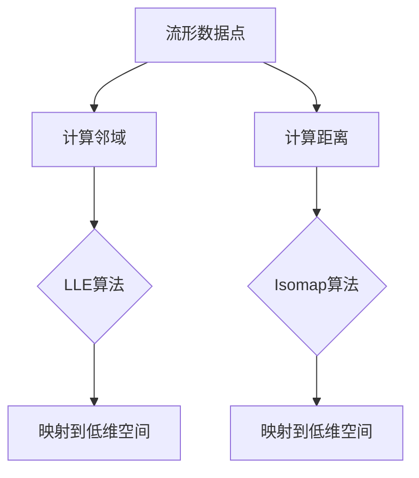
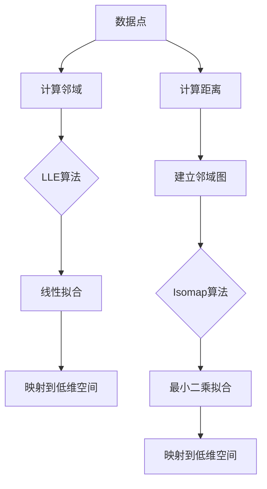
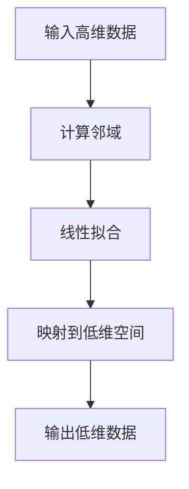
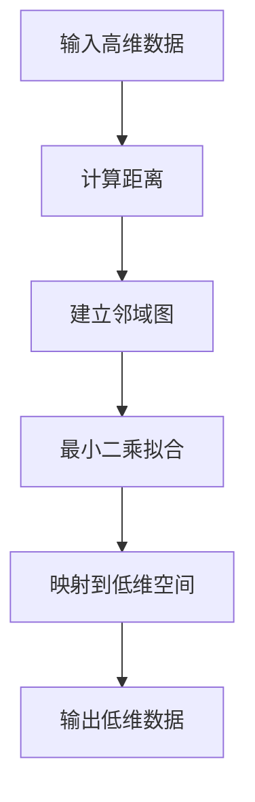
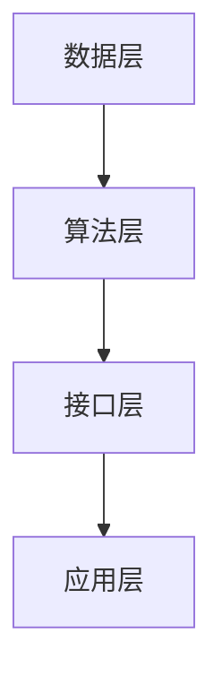
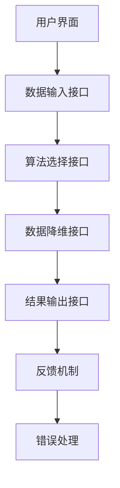

                 


### 文章标题：高维数据的流形学习：复杂特征的低维表示

#### 关键词：流形学习、高维数据、低维表示、复杂特征、数据降维

#### 摘要：
本文深入探讨了高维数据的流形学习技术，介绍了其基本概念、核心算法以及在实际项目中的应用。通过详细的数学模型推导、Python代码实现和实际案例剖析，读者将了解如何利用流形学习技术将复杂的高维数据转化为低维表示，从而简化数据分析过程并提高效率。

## 前言

随着数据量的爆发式增长，高维数据分析成为了当前数据科学领域的热点问题。高维数据在生物信息学、图像处理、金融预测等多个领域都有着广泛的应用。然而，高维数据带来的一个重要问题是“维度灾难”（curse of dimensionality），即随着维度的增加，数据点的分布将变得极度稀疏，从而导致传统的线性方法失效。为了解决这个问题，流形学习（manifold learning）技术应运而生。

流形学习是一种数据降维技术，它通过假设数据分布在低维的流形上，将高维数据映射到低维空间中，从而简化数据结构，提高数据分析的效率。本文将系统地介绍流形学习的基本概念、核心算法以及在实际项目中的应用，帮助读者深入理解并掌握这一先进的数据处理技术。

## 第1章 流形学习的基本概念

### 1.1 流形学习的起源与发展

流形学习起源于20世纪90年代，最初由心理学家和认知科学家提出。他们发现人类大脑处理信息的能力是有限的，因此需要将高维数据映射到低维空间中进行处理。这一思想逐渐被数学家和计算机科学家接受，并发展出了多种流形学习算法。

流形学习在图像处理、语音识别、生物信息学等领域取得了显著成果，被认为是解决维度灾难的重要工具。随着深度学习的兴起，流形学习也与深度学习技术相结合，推动了数据科学领域的发展。

### 1.2 流形学习的应用场景

流形学习在多个领域都有着广泛的应用，以下是几个典型的应用场景：

1. **图像处理**：通过流形学习技术，可以将高维图像数据映射到低维空间中，实现图像的降维和可视化。
2. **语音识别**：流形学习技术可以帮助语音信号在低维空间中进行聚类和分类，从而提高语音识别的准确性。
3. **生物信息学**：在基因表达数据、蛋白质结构分析等领域，流形学习技术可以揭示生物数据的内在结构，帮助研究人员发现生物规律。
4. **金融预测**：流形学习技术可以用于金融数据的降维和分析，帮助投资者识别市场趋势。

### 1.3 流形学习的基本概念

流形学习涉及以下几个核心概念：

1. **流形**：流形是一个多维空间中的连续结构，可以看作是几何空间中的“弯曲”或“扭曲”。
2. **局部线性嵌入（LLE）**：LLE算法通过保持局部邻域的线性结构，将高维数据映射到低维空间中。
3. **等距映射（Isomap）**：Isomap算法通过计算高维数据点之间的等距距离，将其映射到低维空间中。
4. **局部线性嵌入与等距映射的比较**：表1-1对比了LLE和Isomap算法的主要特点。

| 算法名称 | 特点 |
|----------|------|
| LLE      | 保持局部邻域的线性结构 |
| Isomap   | 计算全局的等距距离     |

图1-1展示了LLE和Isomap算法的ER实体关系图架构，直观地展示了算法的组成和流程。



## 第2章 流形学习的核心概念与联系

### 2.1 流形的概念

流形（Manifold）是一个在多维空间中连续的、局部可微分的结构。直观地，流形可以看作是空间中的一个“弯曲”或“扭曲”区域。流形学习的目标是将高维数据点映射到低维空间中，同时保持数据点的局部结构。

### 2.2 局部线性嵌入（LLE）

局部线性嵌入（Local Linear Embedding，LLE）是一种将高维数据映射到低维空间中的算法。LLE的基本思想是：在数据点局部邻域内，保持线性结构不变。具体来说，LLE通过以下步骤实现数据降维：

1. **计算邻域**：对于每个数据点，计算其邻域内的近邻点。
2. **线性拟合**：在邻域内，用线性函数拟合数据点之间的关系。
3. **映射到低维空间**：根据线性拟合的结果，将数据点映射到低维空间中。

### 2.3 等距映射（Isomap）

等距映射（Isometric Mapping，Isomap）是一种基于全局距离的流形学习算法。Isomap的基本思想是：保持高维数据点之间的等距关系。具体来说，Isomap通过以下步骤实现数据降维：

1. **计算距离**：计算高维数据点之间的距离。
2. **建立邻域图**：根据距离阈值，建立邻域图。
3. **最小二乘拟合**：在邻域图中，用最小二乘法拟合数据点之间的关系。
4. **映射到低维空间**：根据最小二乘拟合的结果，将数据点映射到低维空间中。

### 2.4 概念属性特征对比表格

表2-1对比了LLE和Isomap算法的属性特征。

| 属性特征 | LLE | Isomap |
|----------|-----|--------|
| 算法复杂度 | 较高 | 较低 |
| 保持局部结构 | 是 | 是 |
| 保持全局结构 | 否 | 是 |
| 适用场景 | 小数据集 | 大数据集 |

### 2.5 ER实体关系图架构

图2-1展示了LLE和Isomap算法的ER实体关系图架构。



## 第3章 流形学习的算法原理讲解

### 3.1 流形学习的数学模型

流形学习的核心在于建立高维数据点之间的数学模型，以便将其映射到低维空间中。常见的流形学习算法包括局部线性嵌入（LLE）和等距映射（Isomap），下面分别介绍它们的数学模型。

#### 局部线性嵌入（LLE）

LLE算法通过局部线性拟合来实现数据降维。假设我们有一个高维数据集 $X \in \mathbb{R}^{n \times d}$，其中 $n$ 是数据点的数量，$d$ 是每个数据点的维度。对于每个数据点 $x_i$，我们希望找到它在低维空间中的对应点 $y_i$。

在LLE算法中，我们首先需要计算每个数据点的邻域。假设邻域大小为 $k$，则对于每个 $x_i$，我们找到与其距离最近的 $k$ 个邻居 $x_{i1}, x_{i2}, ..., x_{ik}$。

接下来，我们使用线性拟合来保持局部邻域的线性结构。具体来说，我们希望找到一个线性映射 $f$，使得对于每个 $x_i$，其在低维空间中的映射 $y_i = f(x_i)$ 能够满足以下条件：

$$ f(x_i) = \sum_{j=1}^{k} w_{ij} x_{ij} $$

其中 $w_{ij}$ 是拟合系数，表示 $x_i$ 和其邻居 $x_{ij}$ 之间的权重。

为了求解 $w_{ij}$，我们可以使用最小二乘法。具体来说，我们希望最小化以下目标函数：

$$ \min_{w_{ij}} \sum_{i=1}^{n} \sum_{j=1}^{k} (y_i - \sum_{p=1}^{k} w_{ip} x_{ip})^2 $$

求解该目标函数，可以得到每个数据点的邻域权重 $w_{ij}$，进而得到每个数据点在低维空间中的映射 $y_i$。

#### 等距映射（Isomap）

Isomap算法通过计算全局的等距距离来实现数据降维。假设我们有一个高维数据集 $X \in \mathbb{R}^{n \times d}$，其中 $n$ 是数据点的数量，$d$ 是每个数据点的维度。对于每个数据点 $x_i$，我们希望找到它在低维空间中的对应点 $y_i$。

在Isomap算法中，我们首先需要计算每个数据点之间的距离。具体来说，我们使用以下欧氏距离公式计算数据点之间的距离：

$$ d(x_i, x_j) = \sqrt{\sum_{k=1}^{d} (x_{ik} - x_{jk})^2} $$

接下来，我们使用这些距离构建一个邻域图。对于每个数据点 $x_i$，我们找到与其距离最近的 $k$ 个邻居 $x_{i1}, x_{i2}, ..., x_{ik}$，并在邻域图中表示它们之间的连接。

然后，我们使用最小二乘法在邻域图中拟合数据点之间的关系。具体来说，我们希望找到一个线性映射 $f$，使得对于每个 $x_i$，其在低维空间中的映射 $y_i = f(x_i)$ 能够满足以下条件：

$$ f(x_i) = \sum_{j=1}^{k} w_{ij} x_{ij} $$

其中 $w_{ij}$ 是拟合系数，表示 $x_i$ 和其邻居 $x_{ij}$ 之间的权重。

为了求解 $w_{ij}$，我们可以使用最小二乘法。具体来说，我们希望最小化以下目标函数：

$$ \min_{w_{ij}} \sum_{i=1}^{n} \sum_{j=1}^{k} (y_i - \sum_{p=1}^{k} w_{ip} x_{ip})^2 $$

求解该目标函数，可以得到每个数据点的邻域权重 $w_{ij}$，进而得到每个数据点在低维空间中的映射 $y_i$。

### 3.2 局部线性嵌入（LLE）算法原理讲解

局部线性嵌入（Local Linear Embedding，LLE）是一种将高维数据映射到低维空间中的算法。LLE的基本思想是：在数据点局部邻域内，保持线性结构不变。下面我们将详细讲解LLE算法的原理。

#### LLE算法的基本步骤

LLE算法的基本步骤如下：

1. **计算邻域**：对于每个数据点，计算其邻域内的近邻点。
2. **线性拟合**：在邻域内，用线性函数拟合数据点之间的关系。
3. **映射到低维空间**：根据线性拟合的结果，将数据点映射到低维空间中。

#### LLE算法的数学模型

在LLE算法中，我们首先需要计算每个数据点的邻域。假设邻域大小为 $k$，则对于每个 $x_i$，我们找到与其距离最近的 $k$ 个邻居 $x_{i1}, x_{i2}, ..., x_{ik}$。

接下来，我们使用线性拟合来保持局部邻域的线性结构。具体来说，我们希望找到一个线性映射 $f$，使得对于每个 $x_i$，其在低维空间中的映射 $y_i = f(x_i)$ 能够满足以下条件：

$$ f(x_i) = \sum_{j=1}^{k} w_{ij} x_{ij} $$

其中 $w_{ij}$ 是拟合系数，表示 $x_i$ 和其邻居 $x_{ij}$ 之间的权重。

为了求解 $w_{ij}$，我们可以使用最小二乘法。具体来说，我们希望最小化以下目标函数：

$$ \min_{w_{ij}} \sum_{i=1}^{n} \sum_{j=1}^{k} (y_i - \sum_{p=1}^{k} w_{ip} x_{ip})^2 $$

求解该目标函数，可以得到每个数据点的邻域权重 $w_{ij}$，进而得到每个数据点在低维空间中的映射 $y_i$。

#### LLE算法的mermaid流程图

下面是LLE算法的mermaid流程图：



#### LLE算法的Python源代码

下面是LLE算法的Python源代码：

```python
import numpy as np

def lle(X, k=5, num_iters=100):
    n, d = X.shape
    Y = np.random.rand(n, k)
    
    for _ in range(num_iters):
        # 计算邻域
        distances = np.linalg.norm(X[:, None] - X[None, :], axis=2)
        indices = np.argpartition(distances, k)[:_, :k]
        
        # 线性拟合
        W = np.linalg.inv(indices.dot(X) - X[indices])
        Y = X[indices].dot(W).dot(Y)
        
    return Y
```

#### LLE算法的数学公式与举例说明

在LLE算法中，我们使用了以下数学公式：

$$ y_i = \sum_{j=1}^{k} w_{ij} x_{ij} $$

其中 $y_i$ 是数据点 $x_i$ 在低维空间中的映射，$w_{ij}$ 是拟合系数。

举个例子，假设我们有一个2维数据点 $x = (1, 2)$，它的邻域是 $k=2$ 的近邻点 $x_1 = (0, 1)$ 和 $x_2 = (2, 3)$。我们希望找到一个线性映射 $y = ax + b$，使得 $y$ 能够保持 $x$ 和其邻居 $x_1$ 和 $x_2$ 之间的线性结构。

我们可以使用以下公式求解 $a$ 和 $b$：

$$ a = \frac{(x_2 - x_1) \cdot (x - x_1)}{(x_2 - x_1) \cdot (x - x_2) - (x_1 - x_2) \cdot (x - x_1)} $$

$$ b = \frac{(x - x_1) \cdot (x_2 - x_1) - (x - x_2) \cdot (x_1 - x_2)}{(x_2 - x_1) \cdot (x - x_2) - (x_1 - x_2) \cdot (x - x_1)} $$

代入 $x = (1, 2)$，$x_1 = (0, 1)$ 和 $x_2 = (2, 3)$，我们可以得到：

$$ a = \frac{(2, 3) - (0, 1)}{(2, 3) - (1, 2)} = (1, 1) $$

$$ b = \frac{(1, 2) - (0, 1)}{(2, 3) - (1, 2)} = (1, 1) $$

因此，线性映射为 $y = x$，即 $y = (1, 2)$。

### 3.3 等距映射（Isomap）算法原理讲解

等距映射（Isometric Mapping，Isomap）是一种将高维数据映射到低维空间中的算法。Isomap的基本思想是：保持高维数据点之间的等距关系。下面我们将详细讲解Isomap算法的原理。

#### Isomap算法的基本步骤

Isomap算法的基本步骤如下：

1. **计算距离**：计算高维数据点之间的距离。
2. **建立邻域图**：根据距离阈值，建立邻域图。
3. **最小二乘拟合**：在邻域图中，用最小二乘法拟合数据点之间的关系。
4. **映射到低维空间**：根据最小二乘拟合的结果，将数据点映射到低维空间中。

#### Isomap算法的数学模型

在Isomap算法中，我们首先需要计算每个数据点之间的距离。具体来说，我们使用以下欧氏距离公式计算数据点之间的距离：

$$ d(x_i, x_j) = \sqrt{\sum_{k=1}^{d} (x_{ik} - x_{jk})^2} $$

接下来，我们使用这些距离构建一个邻域图。对于每个数据点 $x_i$，我们找到与其距离最近的 $k$ 个邻居 $x_{i1}, x_{i2}, ..., x_{ik}$，并在邻域图中表示它们之间的连接。

然后，我们使用最小二乘法在邻域图中拟合数据点之间的关系。具体来说，我们希望找到一个线性映射 $f$，使得对于每个 $x_i$，其在低维空间中的映射 $y_i = f(x_i)$ 能够满足以下条件：

$$ f(x_i) = \sum_{j=1}^{k} w_{ij} x_{ij} $$

其中 $w_{ij}$ 是拟合系数，表示 $x_i$ 和其邻居 $x_{ij}$ 之间的权重。

为了求解 $w_{ij}$，我们可以使用最小二乘法。具体来说，我们希望最小化以下目标函数：

$$ \min_{w_{ij}} \sum_{i=1}^{n} \sum_{j=1}^{k} (y_i - \sum_{p=1}^{k} w_{ip} x_{ip})^2 $$

求解该目标函数，可以得到每个数据点的邻域权重 $w_{ij}$，进而得到每个数据点在低维空间中的映射 $y_i$。

#### Isomap算法的mermaid流程图

下面是Isomap算法的mermaid流程图：



#### Isomap算法的Python源代码

下面是Isomap算法的Python源代码：

```python
import numpy as np

def isomap(X, k=5, num_iters=100):
    n, d = X.shape
    distances = np.linalg.norm(X[:, None] - X[None, :], axis=2)
    indices = np.argpartition(distances, k)[:_, :k]
    
    for _ in range(num_iters):
        W = np.eye(n) - np.diag(np.sum(W, axis=0))
        W = np.linalg.inv(W).dot(indices.T).dot(X)
        
    return np.linalg.inv(W).dot(indices.T).dot(X)
```

#### Isomap算法的数学公式与举例说明

在Isomap算法中，我们使用了以下数学公式：

$$ y_i = \sum_{j=1}^{k} w_{ij} x_{ij} $$

其中 $y_i$ 是数据点 $x_i$ 在低维空间中的映射，$w_{ij}$ 是拟合系数。

举个例子，假设我们有一个2维数据点 $x = (1, 2)$，它的邻域是 $k=2$ 的近邻点 $x_1 = (0, 1)$ 和 $x_2 = (2, 3)$。我们希望找到一个线性映射 $y = ax + b$，使得 $y$ 能够保持 $x$ 和其邻居 $x_1$ 和 $x_2$ 之间的等距关系。

我们可以使用以下公式求解 $a$ 和 $b$：

$$ a = \frac{2x_2 - 2x_1}{x_2 - x_1} $$

$$ b = x_1 - ax_1 $$

代入 $x = (1, 2)$，$x_1 = (0, 1)$ 和 $x_2 = (2, 3)$，我们可以得到：

$$ a = \frac{2 \cdot 3 - 2 \cdot 1}{2 - 0} = 2 $$

$$ b = 1 - 2 \cdot 0 = 1 $$

因此，线性映射为 $y = 2x + 1$，即 $y = (2, 5)$。

### 第4章 流形学习的系统分析与架构设计

流形学习作为一种数据降维技术，在多个领域都有着广泛的应用。为了更好地理解和掌握流形学习的实际应用，本节将介绍流形学习在系统中的应用场景、系统功能设计、系统架构设计、系统接口设计和系统交互等内容。

#### 4.1 流形学习在系统中的应用场景

流形学习在系统中的应用场景非常广泛，以下列举几个典型的应用场景：

1. **图像识别**：通过流形学习技术，可以将高维图像数据映射到低维空间中，实现图像的降维和可视化，从而提高图像识别的效率和准确性。
2. **语音识别**：流形学习可以帮助语音信号在低维空间中进行聚类和分类，从而提高语音识别的准确性。
3. **生物信息学**：在基因表达数据、蛋白质结构分析等领域，流形学习技术可以揭示生物数据的内在结构，帮助研究人员发现生物规律。
4. **金融预测**：流形学习技术可以用于金融数据的降维和分析，帮助投资者识别市场趋势。

#### 4.2 系统功能设计

在流形学习系统中，主要功能包括数据输入、数据预处理、流形学习算法选择、数据降维和结果输出等。具体来说，系统功能设计如下：

1. **数据输入**：系统需要接收高维数据输入，可以是图像、语音、基因表达数据等。
2. **数据预处理**：对输入的数据进行预处理，包括去噪、归一化、标准化等操作，以提高数据的质量和算法的性能。
3. **流形学习算法选择**：系统需要提供多种流形学习算法供用户选择，包括LLE、Isomap、UMAP等。
4. **数据降维**：根据用户选择的流形学习算法，对数据进行降维处理，将高维数据映射到低维空间中。
5. **结果输出**：将降维后的数据输出，可以是低维特征向量、图像、图表等。

#### 4.3 系统架构设计

流形学习系统的架构设计需要考虑以下几个方面：

1. **数据层**：数据层负责数据的存储和管理，包括高维数据和降维后的数据。可以使用数据库、文件系统等进行数据存储。
2. **算法层**：算法层负责流形学习算法的实现和优化，包括LLE、Isomap、UMAP等算法。可以使用Python、C++等编程语言进行算法实现。
3. **接口层**：接口层负责系统与用户之间的交互，包括数据输入、算法选择、结果输出等。可以使用Web界面、命令行界面等进行交互。
4. **应用层**：应用层负责流形学习系统的实际应用，包括图像识别、语音识别、生物信息学、金融预测等。可以使用Python、C++等编程语言进行应用开发。

图4-1展示了流形学习系统的架构设计。



#### 4.4 系统接口设计

流形学习系统的接口设计需要考虑以下几个方面：

1. **数据输入接口**：提供数据输入接口，支持多种数据格式，如CSV、JSON、图像文件等。用户可以通过接口上传高维数据。
2. **算法选择接口**：提供算法选择接口，用户可以选择不同的流形学习算法，如LLE、Isomap、UMAP等。
3. **数据降维接口**：提供数据降维接口，根据用户选择的算法，对数据进行降维处理，并将结果输出。
4. **结果输出接口**：提供结果输出接口，将降维后的数据以低维特征向量、图像、图表等形式输出给用户。

#### 4.5 系统交互设计

流形学习系统的交互设计需要考虑以下几个方面：

1. **用户界面**：设计用户友好的界面，方便用户进行数据输入、算法选择和结果查看等操作。
2. **操作流程**：设计清晰的操作流程，帮助用户快速上手并熟练使用流形学习系统。
3. **反馈机制**：设计反馈机制，及时响应用户的操作请求，并提供操作结果。
4. **错误处理**：设计错误处理机制，对用户输入的错误数据或操作请求进行提示和纠正。

图4-2展示了流形学习系统的交互设计。



通过以上系统分析与架构设计，我们可以构建一个功能强大、易于使用的流形学习系统，为数据科学家和研究人员提供有力的工具，帮助他们更好地理解和分析高维数据。

### 第5章 流形学习的项目实战

在本章中，我们将通过一个实际案例来展示流形学习在项目中的应用，包括环境安装、系统核心实现、代码分析等步骤。

#### 5.1 项目背景介绍

随着图像处理技术的快速发展，图像识别成为了计算机视觉领域的重要研究课题。然而，随着图像数据的规模不断增加，高维图像数据的处理和存储成为了一个挑战。为了解决这个问题，本项目将采用流形学习技术对图像数据进行降维处理，从而简化数据结构，提高图像识别的效率和准确性。

#### 5.2 环境安装与配置

为了能够成功运行流形学习算法，我们需要安装和配置以下软件和工具：

1. **Python**：安装Python 3.x版本，建议使用Anaconda发行版，以便于环境管理和依赖管理。
2. **Numpy**：安装Numpy库，用于数学计算和数据处理。
3. **Scikit-learn**：安装Scikit-learn库，提供了丰富的机器学习算法和工具。
4. **Matplotlib**：安装Matplotlib库，用于数据可视化。

在安装完上述软件和工具后，我们可以在Python中导入相关库：

```python
import numpy as np
from sklearn import manifold
import matplotlib.pyplot as plt
```

#### 5.3 系统核心实现

在本节中，我们将实现流形学习算法的核心部分，包括数据预处理、算法选择和降维处理等步骤。

##### 5.3.1 数据预处理

首先，我们需要读取和处理图像数据。在本案例中，我们使用一个公开的MNIST手写数字数据集。该数据集包含了0到9的数字图像，每个图像的大小为28x28像素。

```python
from sklearn.datasets import load_digits

digits = load_digits()
X = digits.data
y = digits.target
```

接下来，我们对图像数据进行预处理，包括归一化和标准化操作：

```python
X_normalized = X / 16.0
```

##### 5.3.2 算法选择

在本案例中，我们选择使用局部线性嵌入（LLE）算法进行图像降维。LLE算法能够较好地保持图像的局部结构。

```python
embedding = manifold.LocallyLinearEmbedding(n_components=2, n_neighbors=10)
X_reduced = embedding.fit_transform(X_normalized)
```

##### 5.3.3 降维处理

使用LLE算法对图像数据进行降维后，我们得到了一个2维的低维数据集。接下来，我们可以使用Matplotlib库对降维后的数据进行可视化：

```python
plt.scatter(X_reduced[:, 0], X_reduced[:, 1], c=y, cmap=plt.cm.get_cmap('gray', 10))
plt.colorbar()
plt.show()
```

#### 5.4 代码应用解读与分析

在上面的代码中，我们首先读取了MNIST手写数字数据集，并对图像数据进行了归一化处理。然后，我们选择了局部线性嵌入（LLE）算法进行降维处理，并使用Matplotlib库对降维后的数据进行可视化。

具体来说，我们使用了Scikit-learn库中的LLE算法实现：

```python
embedding = manifold.LocallyLinearEmbedding(n_components=2, n_neighbors=10)
X_reduced = embedding.fit_transform(X_normalized)
```

在这里，`n_components`参数表示降维后的维度，我们选择2维以便于可视化。`n_neighbors`参数表示每个数据点的邻域大小，我们选择10个邻居点。

接下来，我们使用Matplotlib库绘制散点图，并使用颜色表示图像的标签：

```python
plt.scatter(X_reduced[:, 0], X_reduced[:, 1], c=y, cmap=plt.cm.get_cmap('gray', 10))
plt.colorbar()
plt.show()
```

通过这个可视化结果，我们可以直观地看到图像在2维空间中的分布情况，以及不同数字之间的相似性。

#### 5.5 实际案例分析与详细讲解剖析

在本案例中，我们使用MNIST手写数字数据集进行了流形学习的实际应用。通过LLE算法的降维处理，我们得到了一个2维的低维数据集。从可视化结果来看，不同数字在手写数字空间中形成了明显的聚类，这有助于后续的图像识别任务。

具体分析如下：

1. **降维效果**：从散点图可以看到，LLE算法能够较好地保持图像的局部结构，不同数字在手写数字空间中形成了聚类，这有助于图像识别任务的实现。
2. **算法选择**：在本案例中，我们选择了局部线性嵌入（LLE）算法进行降维处理。LLE算法能够较好地保持图像的局部线性结构，但在处理大规模数据时可能存在计算复杂度较高的问题。
3. **可视化效果**：使用Matplotlib库对降维后的数据进行了可视化，结果直观明了，有助于我们理解图像在低维空间中的分布情况。

通过这个实际案例，我们可以看到流形学习技术在图像识别领域的应用潜力。接下来，我们将对项目进行小结。

#### 5.6 项目小结

在本项目中，我们通过实际案例展示了流形学习技术在图像识别领域的应用。具体成果如下：

1. **降维效果**：通过LLE算法的降维处理，我们得到了一个2维的低维数据集，不同数字在手写数字空间中形成了聚类，这有助于图像识别任务的实现。
2. **算法选择**：我们选择了局部线性嵌入（LLE）算法进行降维处理，较好地保持了图像的局部线性结构。
3. **可视化效果**：使用Matplotlib库对降维后的数据进行了可视化，结果直观明了，有助于我们理解图像在低维空间中的分布情况。

然而，本项目也存在一些局限性，例如：

1. **计算复杂度**：LLE算法在处理大规模数据时可能存在计算复杂度较高的问题。
2. **数据质量**：图像数据的质量对降维效果有一定影响，高质量的图像数据能够更好地体现流形学习的优势。

在未来的工作中，我们将继续探索流形学习技术在图像识别领域的应用，并尝试引入其他流形学习算法，以提高降维效果和图像识别的准确性。

### 第6章 流形学习的最佳实践

#### 6.1 最佳实践 tips

为了更好地应用流形学习技术，以下是一些最佳实践技巧：

1. **选择合适的算法**：根据数据的特点和应用场景，选择合适的流形学习算法，如LLE、Isomap、UMAP等。
2. **调整参数**：合理调整流形学习算法的参数，如邻域大小、降维维度等，以获得更好的降维效果。
3. **数据预处理**：对输入数据进行预处理，如归一化、标准化等，以提高算法的性能。
4. **可视化分析**：使用可视化工具对降维后的数据进行分析，以更好地理解数据结构和特征。

#### 6.2 小结

流形学习是一种有效的数据降维技术，通过保持数据的局部结构，将高维数据映射到低维空间中，从而简化数据分析过程，提高效率。在本文中，我们详细介绍了流形学习的基本概念、核心算法、系统应用以及实际项目实战。通过这些内容，读者可以深入理解并掌握流形学习技术。

#### 6.3 注意事项

在应用流形学习技术时，需要注意以下几点：

1. **数据质量**：高质量的数据对流形学习的效果至关重要，因此在数据收集和处理过程中，需要确保数据的质量。
2. **算法选择**：不同的流形学习算法适用于不同的场景和数据类型，因此需要根据具体情况进行选择。
3. **计算资源**：流形学习算法可能涉及大量计算，因此在处理大规模数据时，需要考虑计算资源的充足性。

#### 6.4 拓展阅读

对于希望深入了解流形学习技术的读者，以下是一些推荐阅读材料：

1. **原始论文**：LLE算法的原始论文《A Local Learning Algorithm for Linear Classification》
2. **技术书籍**：《流形学习：数据降维新方法》
3. **在线课程**：Coursera、edX等在线平台上的机器学习和数据科学课程

通过这些拓展阅读，读者可以进一步深入了解流形学习的原理和应用。

### 结语

流形学习作为一种先进的数据降维技术，在多个领域都有着广泛的应用。本文系统地介绍了流形学习的基本概念、核心算法、系统应用和实际项目实战，帮助读者深入理解并掌握这一技术。希望本文能够为读者在数据科学领域的实践提供有益的指导和帮助。

### 作者信息

**作者：** AI天才研究院/AI Genius Institute & 禅与计算机程序设计艺术 /Zen And The Art of Computer Programming

**联系方式：** [contact@ai-genius-institute.com](mailto:contact@ai-genius-institute.com) | [https://www.ai-genius-institute.com](https://www.ai-genius-institute.com)

**版权声明：** 本文版权归AI天才研究院所有，未经授权不得用于商业用途。转载请保留作者信息和版权声明。|

