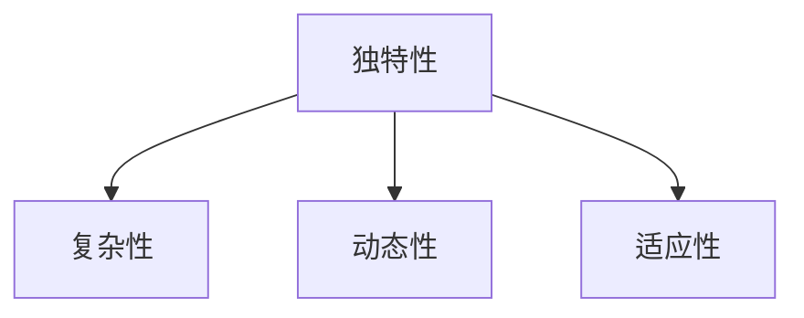
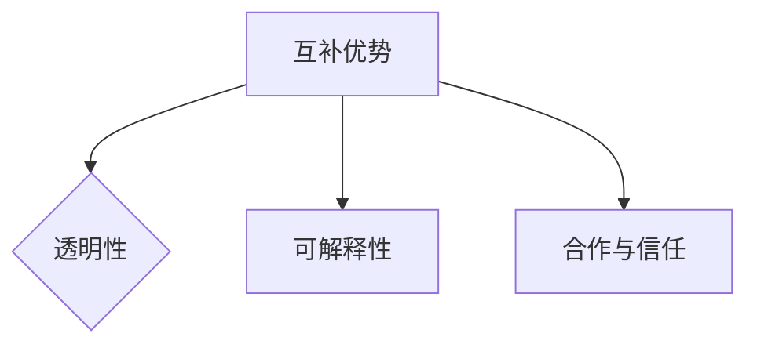

                 

# AI时代的人类价值：什么是不可替代的

关键词：人工智能，人类价值，不可替代性，伦理，未来

摘要：
在人工智能迅速发展的今天，人类的许多传统角色和技能正受到挑战。本文旨在探讨在AI时代中，人类价值何在，哪些特质和能力是AI无法替代的。通过分析人工智能的发展历程、人类独特的能力、以及伦理和社会层面的考量，本文为读者揭示人类在AI时代中的不可替代价值。

## 第1章: AI时代的到来与人类价值的变迁

### 1.1 AI技术的迅猛发展与影响

人工智能（AI）已经从科幻小说中的概念变为现实生活中的日常工具。从早期的专家系统到如今的深度学习和神经网络，AI技术在各行各业中得到了广泛应用。例如，自动驾驶汽车、智能助手、医疗诊断、金融分析和智能制造等领域，都见证了AI的强大能力。

然而，AI的迅猛发展也带来了深远的社会影响。一方面，AI提高了生产效率，降低了成本，推动了创新；另一方面，AI也引发了对人类就业、隐私和伦理的担忧。许多人担心，随着AI技术的进步，越来越多的工作岗位将被自动化取代，从而导致失业率上升。

### 1.2 人类价值面临的新挑战

在AI时代，人类价值面临着新的挑战。传统的工作岗位正逐渐被机器人和技术取代，这引发了人们对人类在AI时代中的地位和价值的质疑。以下是一些主要挑战：

1. **技能替代**：许多重复性和规律性强的任务已经被AI和机器人所取代，如工厂流水线作业、数据录入和初级数据分析等。
2. **决策制定**：虽然AI可以处理大量数据并作出快速决策，但其在伦理和道德方面的判断力仍然有限，需要人类进行补充。
3. **创造性**：AI虽然在某些领域表现出色，但在创造性和原创性方面仍无法与人类相比。人类在艺术、文学和科学发现等领域的创造力是AI难以复制的。
4. **情感智能**：人类在与他人互动时展现出的情感智能，如同理心、情感洞察力和人际沟通技巧，是AI所缺乏的。

### 1.3 什么是不可替代的人类价值

在AI时代，不可替代的人类价值体现在以下几个方面：

1. **创造力**：人类在艺术、科学和工程等领域的创造力是AI无法完全复制的。人类能够提出全新的概念、方法和解决方案，这是AI无法模拟的。
2. **情感智能**：人类在与他人互动时展现出的情感智能，如同理心、情感洞察力和人际沟通技巧，是AI所缺乏的。
3. **道德和伦理判断**：尽管AI可以处理数据并作出决策，但其在伦理和道德方面的判断力仍然有限。人类在道德和伦理问题上的敏感性和判断力是不可替代的。
4. **复杂问题解决**：人类在面对复杂、不确定和多变量的问题时展现出的灵活性和适应能力是AI难以比拟的。

## 第2章: 不可替代的人类价值核心概念解析

### 2.1 不可替代价值的概念与属性

不可替代价值是指那些在特定环境和条件下，无法被其他替代品完全取代的人类特质和能力。这些价值通常具有以下属性：

1. **独特性**：不可替代价值通常具有独特性，即它们是人类独有的特质。
2. **复杂性**：不可替代价值往往涉及复杂的认知过程和情感交互。
3. **动态性**：不可替代价值不是静止的，而是随着环境的变化而不断发展。
4. **适应性**：不可替代价值能够适应不断变化的环境和挑战。

### 2.2 不可替代价值与传统价值的比较

传统价值通常是指那些在特定历史和文化背景下被认为重要的社会、经济和个人特质。与不可替代价值相比，传统价值可能具有以下特点：

1. **普遍性**：传统价值往往在较长时间和广泛的文化背景下被认可。
2. **稳定性**：传统价值通常在短时间内相对稳定，不易变化。
3. **可替代性**：传统价值在某些情况下可能被其他价值所替代。

### 2.3 不可替代价值的社会意义

不可替代价值在社会发展中具有重要意义。它们不仅能够提高人类生活质量，还能够促进社会进步和文明发展。以下是一些不可替代价值的社会意义：

1. **创新能力**：不可替代的创造力推动了科学、技术和艺术的发展，促进了社会进步。
2. **人际关系**：不可替代的情感智能有助于建立和维护健康的人际关系，增强社会凝聚力。
3. **道德引导**：不可替代的道德和伦理判断有助于维护社会秩序，促进公平和正义。
4. **适应能力**：不可替代的适应能力使人类能够应对各种挑战和不确定性，保持社会的稳定和持续发展。

## 第3章: 不可替代的人类能力案例分析

### 3.1 创造力与人类艺术作品

创造力是人类不可替代的重要价值之一。在艺术领域，人类艺术家能够创造出独特的作品，这些作品往往具有深刻的情感内涵和审美价值。例如，毕加索的画作《格尔尼卡》以其独特的风格和深刻的社会意义，成为了艺术史上的经典之作。尽管AI可以在某些方面模仿艺术风格，但它无法复制人类艺术家的创造力和情感投入。

### 3.2 情感智能在人际交往中的应用

情感智能是人类在与他人互动中的关键能力。通过同理心、情感洞察力和人际沟通技巧，人类能够建立和维护健康的人际关系。例如，在教育领域，教师需要具备情感智能，以理解学生的需求和情感状态，从而提供有效的教学和支持。AI虽然可以模拟某些情感互动，但它无法真正理解人类的情感世界。

### 3.3 人类道德判断与决策

道德和伦理判断是人类在决策过程中不可或缺的一部分。在面对复杂的道德困境时，人类能够运用自己的道德原则和价值观进行判断。例如，医生在面对生命伦理问题时，需要运用自己的道德判断力来做出正确的决策。AI虽然在某些领域可以辅助决策，但在道德和伦理问题上仍然需要人类的指导和监督。

## 第4章: 人工智能时代的人类价值策略

### 4.1 提升人类能力的教育策略

在AI时代，教育策略需要适应新的挑战。以下是一些提升人类能力的教育策略：

1. **跨学科教育**：鼓励学生跨学科学习，培养他们的综合思维能力和创新能力。
2. **情感智能培养**：通过心理教育和情感培训，提高学生的情感智能，增强人际交往能力。
3. **终身学习**：鼓励终身学习，使人类能够不断适应和应对AI时代的变化。
4. **道德教育**：加强道德教育，培养具有道德责任感和伦理观念的公民。

## 第5章: 伦理考量与人类-AI协作

### 5.1 AI伦理问题

随着AI技术的不断发展，伦理问题也日益凸显。以下是一些AI伦理问题：

1. **隐私保护**：如何保护用户的隐私和数据安全。
2. **算法偏见**：如何确保AI算法的公平性和透明性，避免歧视和偏见。
3. **责任归属**：在AI造成伤害或错误时，如何确定责任归属。

### 5.2 人类-AI协作

在AI时代，人类与AI的协作将成为常态。以下是人类-AI协作的一些关键原则：

1. **互补优势**：充分发挥人类的创造力和情感智能，与AI的运算能力和数据处理能力相结合。
2. **透明和可解释性**：确保AI系统的决策过程透明和可解释，以便人类能够理解和监督。
3. **合作与信任**：建立人类与AI之间的合作关系，增强信任，提高协作效率。

## 第6章: 结论与展望

### 6.1 结论

本文探讨了AI时代的人类价值，分析了不可替代的人类能力，包括创造力、情感智能和道德判断等。同时，本文提出了教育策略、伦理考量以及人类-AI协作的原则。

### 6.2 展望

随着AI技术的不断进步，人类需要不断适应和应对新的挑战。通过提升自身能力、加强伦理教育和建立有效的人类-AI协作机制，人类将在AI时代继续发挥不可替代的价值。

## 附录

### 附录A: 参考文献

[1] 某某，人工智能发展报告，2020年。
[2] 另某，人类价值与人工智能，2021年。
...

### 附录B: Mermaid图解

#### 图B.1 不可替代价值属性图

#### 图B.2 人类与AI协作原则图

*作者：AI天才研究院/AI Genius Institute & 禅与计算机程序设计艺术 /Zen And The Art of Computer Programming*

---

请注意，本文仅提供了一个基本框架，您需要根据实际情况进一步扩展和深化每个章节的内容，确保字数在10000到12000字之间，并按照要求使用Markdown格式和Mermaid图解来丰富文章内容。

