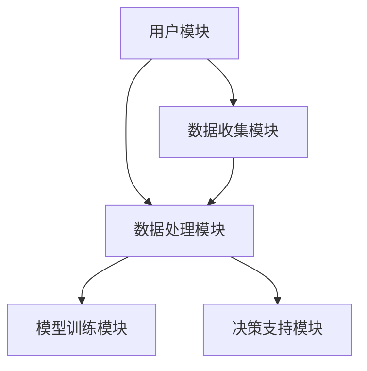
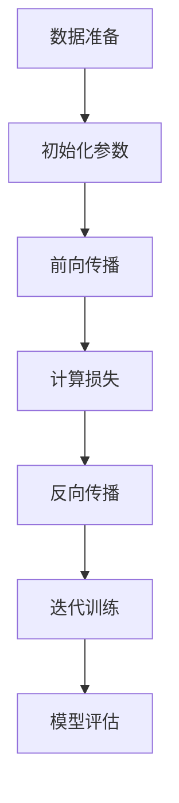
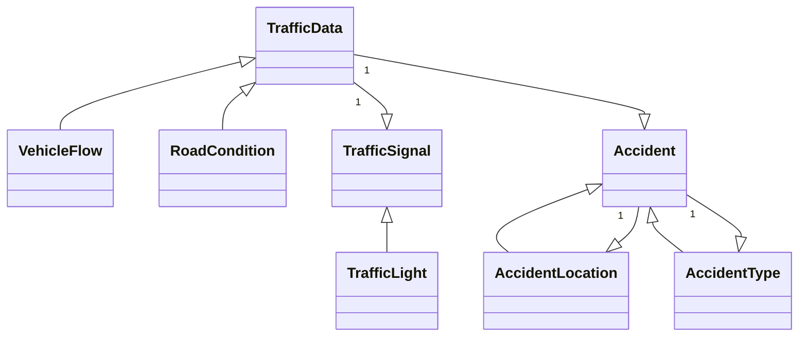
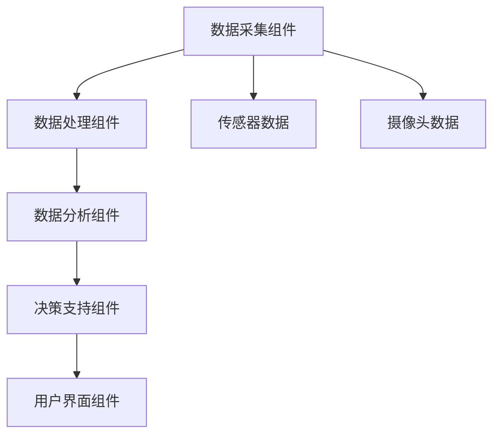
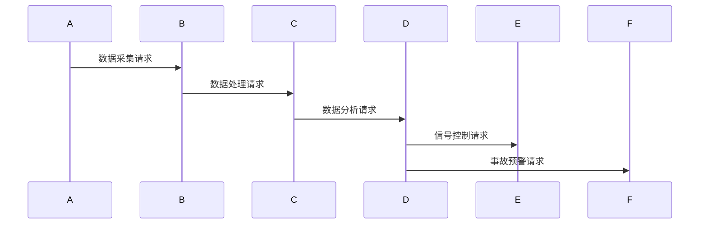
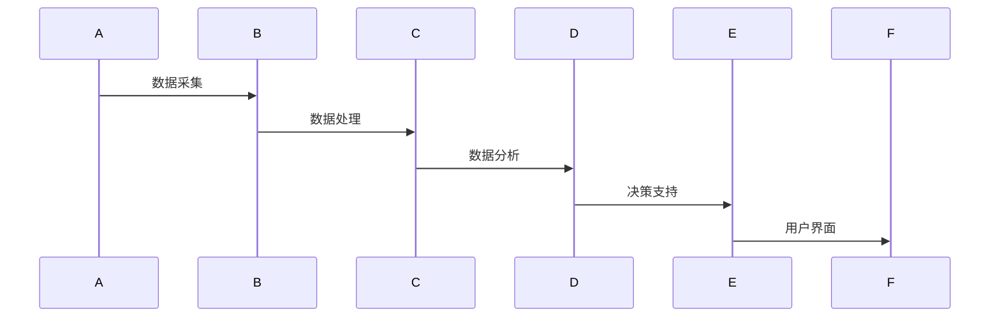

                 

# AI民主参与系统：人工智能辅助的公共决策平台

## 关键词

- 人工智能
- 民主参与
- 公共决策
- 数据收集
- 模型训练
- 决策支持

## 摘要

本文深入探讨了人工智能辅助的公共决策平台——AI民主参与系统。首先，分析了公共决策的现状与挑战，阐述了人工智能在公共决策中的应用前景及其必要性。接着，详细介绍了人工智能的基本原理，包括机器学习和深度学习，以及它们与公共决策的关系。然后，本文提出了AI民主参与系统的架构与设计原则，包括系统功能设计、数据收集与预处理方法、模型训练与优化策略以及决策支持功能的实现。最后，通过一个实际项目实战，展示了AI民主参与系统的应用与效果，并提出了最佳实践建议。

----------------------------------------------------------------

## 第一部分：背景与概述

### 第1章：问题背景与核心概念

### 1.1 问题背景

公共决策是指政府和公共机构为了解决社会问题、规划未来发展而进行的决策过程。传统的公共决策依赖于专家意见、民意调查和数据统计等方法，这些方法虽然在一定程度上能够反映公众意愿和需求，但存在许多局限：

1. **信息不对称**：专家意见和数据统计可能受到主观偏见和片面信息的影响。
2. **决策效率低下**：传统方法往往需要大量时间和人力成本，无法快速响应社会变化。
3. **民主参与度不足**：公众参与渠道有限，难以全面、准确地反映公众意愿。

随着人工智能技术的发展，利用人工智能辅助公共决策成为一种新的尝试。人工智能可以处理海量数据，发现隐藏的模式和趋势，从而提高决策的准确性和效率。同时，人工智能还可以通过自然语言处理技术，理解和分析公众的意见和需求，增强民主参与的深度和广度。

### 1.1.1 公共决策的现状与挑战

当前，公共决策过程中面临的主要挑战包括：

1. **数据质量与多样性**：公共决策所需的数据质量参差不齐，数据来源多样且格式复杂。
2. **技术门槛**：人工智能技术复杂，普通民众难以理解和应用。
3. **隐私保护**：数据收集和使用过程中需要确保隐私安全。

### 1.1.2 人工智能在公共决策中的应用前景

人工智能在公共决策中具有广泛的应用前景：

1. **数据分析和预测**：人工智能可以快速处理和分析海量数据，帮助决策者更好地了解社会状况和需求。
2. **智能咨询和推荐**：通过分析公众意见和行为，为决策者提供智能化的咨询和推荐。
3. **自动化决策**：在特定场景下，人工智能可以自动化执行一些决策任务，提高决策效率。

### 1.1.3 民主参与的必要性

民主参与是现代社会的基本原则之一，它有助于保障公民的权利和利益，提高决策的合法性和有效性。然而，当前的民主参与机制存在诸多问题：

1. **参与渠道有限**：公众参与渠道单一，难以满足多元化的参与需求。
2. **信息不透明**：决策过程不透明，公众难以了解决策的详细情况和原因。
3. **决策结果不公平**：决策结果可能偏向于特定利益群体，忽视其他群体的意见。

通过人工智能辅助的公共决策平台，可以解决上述问题，提高民主参与的深度和广度：

1. **拓宽参与渠道**：人工智能可以提供多样化的参与方式，包括在线调查、社交网络互动等。
2. **增强信息透明度**：人工智能可以实时展示决策过程和结果，增加公众对决策的了解。
3. **保障决策公平性**：人工智能可以客观、公正地处理公众意见，确保决策结果更全面地反映公众意愿。

### 1.2 核心概念

#### 1.2.1 人工智能的基本原理

人工智能（AI）是指由人制造出来的系统能够执行通常需要人类智能才能完成的任务的科学技术。其基本原理包括：

1. **机器学习**：通过训练模型，使系统能够从数据中学习并做出预测或决策。
2. **深度学习**：一种基于多层神经网络的学习方法，通过多层非线性变换来提取特征，实现复杂的预测和分类任务。
3. **自然语言处理**：使计算机能够理解和生成自然语言，实现人机交互。

#### 1.2.2 公共决策的定义与分类

公共决策是指政府和公共机构为了解决社会问题、规划未来发展而进行的决策过程。根据决策对象的范围，可以分为宏观决策、中观决策和微观决策。根据决策的过程，可以分为问题识别、目标设定、方案设计、方案评估和决策执行。

#### 1.2.3 民主参与的机制与形式

民主参与是指公民通过多种渠道和方式，参与公共决策和管理过程，表达自己的意见和需求。常见的民主参与形式包括：

1. **选举**：通过投票选举代表，参与公共决策和管理。
2. **听证会**：在决策过程中，组织公众参与讨论，提供意见和建议。
3. **在线调查**：利用互联网平台，收集公众的意见和需求。

### 1.3 研究目标与意义

#### 1.3.1 研究目标

本研究旨在设计并实现一个基于人工智能的公共决策平台，实现以下目标：

1. **数据收集与处理**：通过多种渠道收集公众意见和需求，并对其进行处理和分析。
2. **模型训练与优化**：利用机器学习和深度学习技术，训练模型并优化算法，提高决策的准确性和效率。
3. **决策支持**：通过数据分析结果，为决策者提供智能化的决策建议，提高决策的科学性和公正性。

#### 1.3.2 研究意义

本研究的意义在于：

1. **提高民主参与度**：通过人工智能技术，拓宽公众参与渠道，提高民主参与的深度和广度。
2. **提升决策质量**：利用人工智能技术，提高决策的准确性和效率，确保决策结果更全面地反映公众意愿。
3. **推动社会进步**：通过公共决策平台，促进政府与公众的互动和合作，推动社会发展和进步。

### 1.4 边界与外延

#### 1.4.1 研究的边界

本研究主要关注人工智能在公共决策中的应用，不涉及人工智能的其他领域，如机器人和自动驾驶等。

#### 1.4.2 研究的外延

本研究可以应用于各种类型的公共决策，如城市规划、环境保护、教育改革等。

### 1.5 本章小结

本章介绍了公共决策的现状与挑战，阐述了人工智能在公共决策中的应用前景及其必要性，并提出了AI民主参与系统的研究目标与意义。接下来，将深入探讨人工智能的基本原理，为后续的系统设计与实现奠定基础。

----------------------------------------------------------------

## 第二部分：AI民主参与系统的基础知识

### 第2章：人工智能的基本原理

### 2.1 人工智能的发展历程

#### 2.1.1 人工智能的起源

人工智能（AI）的概念最早可以追溯到古希腊哲学家泰勒斯（Thales）提出的“自动机器”设想。然而，真正的人工智能研究始于20世纪50年代。1950年，英国科学家艾伦·图灵（Alan Turing）提出了著名的图灵测试，用于判断机器是否具有智能。1956年，达特茅斯会议（Dartmouth Conference）标志着人工智能正式成为一门独立的学科。

#### 2.1.2 人工智能的重要里程碑

1. **1956年**：达特茅斯会议，人工智能正式成为一门学科。
2. **1966年**：约瑟夫·卡尔·罗森布拉特（Joseph Carl Rossenblatt）提出了感知器（Perceptron）理论，为神经网络的发展奠定了基础。
3. **1980年**：约翰·麦卡锡（John McCarthy）等人提出了知识表示和推理的理论框架。
4. **1997年**：IBM的“深蓝”（Deep Blue）计算机在国际象棋比赛中战胜世界冠军加里·卡斯帕罗夫（Garry Kasparov），标志着人工智能在特定领域取得了重大突破。
5. **2012年**：牛津大学的杰弗里·辛顿（Geoffrey Hinton）等人提出了深度学习（Deep Learning），使得神经网络在图像识别和语音识别等领域取得了突破性进展。

#### 2.1.3 人工智能的现状与发展趋势

目前，人工智能已经在许多领域取得了显著成果，如自动驾驶、语音识别、图像识别、自然语言处理等。随着计算能力的提升和数据量的增加，人工智能正朝着更广泛、更深层次的领域发展。未来，人工智能的发展趋势包括：

1. **泛化能力**：提高人工智能的泛化能力，使其能够在不同领域和任务中发挥作用。
2. **协同工作**：人工智能与其他技术（如物联网、区块链等）相结合，实现协同工作，提高系统效率和智能化水平。
3. **人机融合**：通过人工智能技术，实现人与机器的深度融合，提高人类工作和生活质量。

### 2.2 机器学习的基本概念

#### 2.2.1 机器学习的定义

机器学习（Machine Learning，ML）是指通过算法和统计方法，从数据中自动学习和发现模式，使计算机具备预测和决策能力。其核心思想是“从数据中学习”，无需显式编程。

#### 2.2.2 机器学习的主要任务

机器学习的主要任务包括：

1. **分类**：根据输入特征，将数据分为不同的类别。
2. **回归**：根据输入特征，预测连续的数值输出。
3. **聚类**：将相似的数据分组，形成不同的簇。
4. **降维**：通过降维技术，减少数据的维度，提高计算效率和模型性能。

#### 2.2.3 机器学习的基本算法

常见的机器学习算法包括：

1. **线性回归**：通过线性模型，预测连续的数值输出。
2. **逻辑回归**：通过逻辑函数，预测分类结果。
3. **支持向量机（SVM）**：通过最大间隔分类，实现分类任务。
4. **决策树**：通过树形结构，实现分类和回归任务。
5. **神经网络**：通过多层神经网络，实现复杂的非线性预测和分类任务。

### 2.3 深度学习的基本原理

#### 2.3.1 深度学习的定义

深度学习（Deep Learning，DL）是一种基于多层神经网络的学习方法，通过多层非线性变换来提取特征，实现复杂的预测和分类任务。深度学习是机器学习的一个重要分支，具有较高的性能和广泛的应用。

#### 2.3.2 深度学习的主要特点

深度学习的主要特点包括：

1. **多层结构**：深度学习采用多层神经网络，逐层提取特征，实现高层次的抽象表示。
2. **端到端学习**：深度学习可以从原始数据直接学习到输出结果，无需人工设计特征。
3. **并行计算**：深度学习可以利用GPU等硬件资源，实现大规模的并行计算，提高计算效率。

#### 2.3.3 深度学习的基本网络结构

深度学习的基本网络结构包括：

1. **卷积神经网络（CNN）**：适用于图像和视频处理，通过卷积操作提取空间特征。
2. **循环神经网络（RNN）**：适用于序列数据处理，通过循环连接实现长期依赖建模。
3. **生成对抗网络（GAN）**：通过生成器和判别器之间的对抗训练，实现图像生成和修复等任务。

### 2.4 人工智能与公共决策的关系

#### 2.4.1 人工智能在公共决策中的应用形式

人工智能在公共决策中的应用形式包括：

1. **数据分析**：通过机器学习和深度学习算法，分析大量数据，发现隐藏的模式和趋势。
2. **智能咨询**：通过自然语言处理技术，理解公众的意见和需求，提供智能化的咨询和建议。
3. **自动化决策**：在特定场景下，利用机器学习模型进行自动化决策，提高决策效率。

#### 2.4.2 人工智能辅助公共决策的优势与挑战

人工智能辅助公共决策的优势包括：

1. **数据处理能力**：人工智能可以处理海量数据，发现隐藏的模式和趋势，提高决策的科学性。
2. **实时性**：人工智能可以实时处理数据，为决策者提供及时的决策支持。
3. **透明性**：人工智能的决策过程可以通过算法和数据透明化，增加决策的透明度和公信力。

然而，人工智能辅助公共决策也面临一些挑战：

1. **数据质量**：公共决策所需的数据质量参差不齐，可能存在噪声和缺失值，影响模型的性能。
2. **隐私保护**：数据收集和使用过程中需要确保隐私安全，防止数据泄露。
3. **技术门槛**：人工智能技术复杂，普通民众难以理解和应用。

### 2.5 本章小结

本章介绍了人工智能的发展历程、机器学习和深度学习的基本概念，以及人工智能在公共决策中的应用形式和优势与挑战。接下来，将深入探讨AI民主参与系统的设计与实现，为公共决策提供有力支持。

----------------------------------------------------------------

## 第三部分：AI民主参与系统的设计与实现

### 第3章：系统架构与设计原则

### 3.1 系统架构

AI民主参与系统是一个综合性的平台，旨在为公共决策提供智能化的支持。系统架构设计包括以下几个主要模块：

1. **用户模块**：包括用户注册、登录、个人信息管理等功能。
2. **数据收集模块**：负责从多个渠道收集公众的意见和需求，如在线调查、社交媒体互动等。
3. **数据处理模块**：对收集到的数据进行清洗、转换和归一化，为后续的分析和建模提供高质量的数据。
4. **模型训练模块**：利用机器学习和深度学习算法，对处理后的数据进行分析和建模，生成预测模型。
5. **决策支持模块**：根据模型预测结果，为决策者提供智能化的决策建议，支持公共决策的制定。

#### 3.1.1 系统整体架构

系统的整体架构如图3-1所示：



#### 3.1.2 数据处理模块

数据处理模块是系统架构的核心部分，包括以下功能：

1. **数据收集**：从在线调查、社交媒体等渠道收集用户意见和需求。
2. **数据清洗**：处理数据中的噪声和缺失值，提高数据质量。
3. **数据转换**：将不同来源和格式的数据进行统一处理，便于后续分析。
4. **数据归一化**：对数据进行归一化处理，消除不同指标之间的量纲差异。

#### 3.1.3 模型训练模块

模型训练模块包括以下功能：

1. **模型选择**：根据具体任务需求，选择合适的机器学习或深度学习模型。
2. **模型训练**：利用处理后的数据进行模型训练，优化模型参数。
3. **模型评估**：通过验证集和测试集，评估模型性能，调整模型参数。
4. **模型部署**：将训练好的模型部署到生产环境中，为决策支持模块提供支持。

#### 3.1.4 决策支持模块

决策支持模块包括以下功能：

1. **数据分析**：对用户意见和需求进行分析，发现潜在的趋势和问题。
2. **决策建议生成**：根据模型预测结果，为决策者提供智能化的决策建议。
3. **决策结果展示**：将决策过程和结果展示给公众，增加决策的透明度和公信力。

### 3.2 设计原则

AI民主参与系统的设计遵循以下原则：

1. **开放性原则**：系统设计应具备开放性，便于与其他系统和平台进行数据共享和接口集成。
2. **可扩展性原则**：系统设计应具备良好的可扩展性，支持未来功能的增加和升级。
3. **安全性原则**：系统设计应确保用户数据的安全和隐私，采取有效的数据加密和访问控制措施。
4. **易用性原则**：系统设计应注重用户体验，提供简洁、直观的操作界面和交互方式。

### 3.3 系统功能设计

系统功能设计包括以下几个主要方面：

1. **用户注册与登录**：提供用户注册和登录功能，确保用户身份的合法性和安全性。
2. **数据收集与整理**：从多个渠道收集用户意见和需求，并进行整理和分类，为后续分析提供基础。
3. **人工智能模型训练**：利用机器学习和深度学习算法，对用户数据进行建模和分析，生成预测模型。
4. **决策支持与展示**：根据模型预测结果，为决策者提供智能化的决策建议，并通过可视化界面展示决策过程和结果。

### 3.4 本章小结

本章介绍了AI民主参与系统的架构设计原则和功能设计，包括用户模块、数据处理模块、模型训练模块和决策支持模块。接下来，将详细讨论系统的数据收集与预处理方法，为系统的有效运行提供保障。

----------------------------------------------------------------

## 第4章：数据收集与预处理

数据收集与预处理是AI民主参与系统的关键环节，直接影响系统的性能和准确性。本章将详细介绍数据收集的方法、预处理流程以及处理过程中的挑战和解决方案。

### 4.1 数据收集

数据收集是系统数据输入的第一步，其质量直接影响后续的数据分析和模型训练效果。数据收集的主要方法包括：

1. **在线调查**：通过在线问卷或调查表的形式，收集用户的意见和需求。这种方法具有覆盖面广、响应速度快的特点。
2. **社交媒体互动**：利用社交媒体平台（如微博、微信、Facebook等）收集用户发布的意见和评论。这种方法可以实时获取用户的动态反馈，但需要处理大量的文本数据。
3. **政府公开数据**：从政府公开数据平台获取与公共决策相关的统计数据和报告。这种方法可以提供权威的数据支持，但数据获取权限和使用范围可能有限。
4. **用户行为数据**：通过网站日志、点击流等数据，收集用户在网站上的行为数据。这种方法可以深入了解用户的行为模式，为个性化决策提供支持。

#### 4.1.1 数据收集方法

1. **在线调查**：

   - **问卷设计**：设计合理、简洁的问卷，确保问题的明确性和针对性。
   - **样本选择**：采用随机抽样或分层抽样方法，确保样本的代表性和多样性。
   - **数据收集**：通过在线问卷平台（如问卷星、腾讯问卷等）发布问卷，收集用户回答。

2. **社交媒体互动**：

   - **关键词分析**：利用自然语言处理技术，提取用户发布的意见和评论中的关键词。
   - **数据抓取**：利用爬虫技术，从社交媒体平台获取用户发布的数据。
   - **数据清洗**：去除重复数据、无效数据和噪音数据，提高数据质量。

3. **政府公开数据**：

   - **数据获取**：访问政府公开数据平台，获取相关统计数据和报告。
   - **数据转换**：将获取到的数据转换为统一的格式，便于后续处理和分析。

4. **用户行为数据**：

   - **数据收集**：通过网站日志、点击流等数据，收集用户在网站上的行为数据。
   - **数据整理**：对收集到的行为数据进行分类和整理，提取有用的信息。

#### 4.1.2 数据收集过程中的挑战

1. **数据质量**：收集到的数据可能存在噪声、缺失值和错误数据，影响系统的性能和准确性。
2. **数据多样性**：不同来源的数据格式和结构可能不同，需要统一处理。
3. **数据隐私**：在数据收集过程中，需要确保用户隐私和数据安全，防止数据泄露。

#### 4.1.3 数据收集过程中的解决方案

1. **数据质量提升**：

   - **数据清洗**：采用数据清洗算法，去除噪声和错误数据，提高数据质量。
   - **数据填充**：对于缺失值，采用插值、均值填充等方法进行数据填充。

2. **数据多样性处理**：

   - **数据转换**：采用数据转换技术，将不同格式和结构的数据转换为统一的格式。
   - **数据集成**：采用数据集成技术，将多源数据进行整合，形成统一的数据集。

3. **数据隐私保护**：

   - **数据加密**：采用加密技术，对敏感数据进行加密处理，防止数据泄露。
   - **匿名化处理**：对用户数据进行匿名化处理，去除个人身份信息，保护用户隐私。

### 4.2 数据预处理

数据预处理是数据分析和模型训练的前期工作，其目的是将原始数据转换为适合分析和建模的形式。数据预处理的主要步骤包括：

1. **数据清洗**：去除噪声和错误数据，提高数据质量。
2. **数据转换**：将不同格式和结构的数据转换为统一的格式。
3. **数据归一化**：对数据进行归一化处理，消除不同指标之间的量纲差异。
4. **特征工程**：提取和构造有用的特征，提高模型性能。

#### 4.2.1 数据清洗

数据清洗是数据预处理的重要步骤，主要任务包括：

1. **去除重复数据**：去除重复的记录，减少数据冗余。
2. **处理缺失值**：对缺失值进行填充或删除。
3. **去除异常值**：检测并去除异常值，防止异常值对模型训练的影响。
4. **数据格式转换**：将不同格式的数据转换为统一的格式，便于后续处理。

#### 4.2.2 数据转换

数据转换是将不同格式和结构的数据转换为统一格式的过程，主要任务包括：

1. **数据格式转换**：将不同格式的数据（如文本、图像、时间序列等）转换为统一的数据格式。
2. **数据类型转换**：将不同类型的数据（如整数、浮点数、字符串等）转换为相同类型。
3. **数据规范化**：对数据中的特殊值或异常值进行规范化处理，使其符合模型训练的要求。

#### 4.2.3 数据集成

数据集成是将多个数据源中的数据进行整合，形成统一数据集的过程，主要任务包括：

1. **数据合并**：将不同数据源中的数据合并为一张数据表。
2. **数据去重**：去除重复的数据记录，减少数据冗余。
3. **数据融合**：将不同数据源中的数据融合为同一数据结构，便于后续处理和分析。

#### 4.2.4 数据归一化

数据归一化是将不同指标之间的数据范围统一处理，消除量纲差异，主要方法包括：

1. **最小-最大归一化**：将数据缩放到[0, 1]之间。
2. **均值-方差归一化**：将数据缩放到均值为中心、标准差为宽度的区间内。
3. **对数归一化**：对数变换，处理不同数量级的数据。

#### 4.2.5 特征工程

特征工程是数据预处理的重要环节，其主要任务包括：

1. **特征提取**：从原始数据中提取有用的特征。
2. **特征构造**：通过组合和变换，构造新的特征。
3. **特征选择**：选择对模型训练最有影响力的特征，减少数据冗余。

### 4.3 本章小结

本章详细介绍了数据收集与预处理的方法和流程，包括数据收集的渠道和方法、预处理过程中的挑战和解决方案。通过有效的数据收集与预处理，可以为后续的模型训练和决策支持提供高质量的数据支持。

----------------------------------------------------------------

## 第5章：模型训练与优化

### 5.1 模型选择

在AI民主参与系统中，模型选择是模型训练的关键步骤。选择合适的模型对于确保系统性能和准确性至关重要。常见的机器学习和深度学习模型包括：

1. **线性回归**：适用于预测连续的数值输出，如房价、股票价格等。
2. **逻辑回归**：适用于预测分类结果，如二分类、多分类问题。
3. **支持向量机（SVM）**：适用于分类问题，通过最大间隔分类实现分类效果。
4. **决策树**：通过树形结构实现分类和回归任务，具有较强的可解释性。
5. **随机森林**：通过集成多棵决策树，提高模型的性能和稳定性。
6. **神经网络**：通过多层神经网络实现复杂的非线性预测和分类任务。

在选择模型时，应考虑以下因素：

1. **任务类型**：根据任务的需求，选择适合的模型。如预测连续数值输出，选择线性回归；预测分类结果，选择逻辑回归或SVM。
2. **数据特性**：分析数据的分布、特征和噪音，选择适合的模型。如数据分布不均匀，选择随机森林或神经网络。
3. **模型复杂度**：选择模型复杂度合适的模型，避免过拟合或欠拟合。如数据量较大，选择神经网络；数据量较小，选择决策树。

### 5.2 模型训练

模型训练是指利用训练数据，调整模型参数，使其能够对未知数据进行预测或分类的过程。模型训练包括以下几个步骤：

1. **数据准备**：将数据集划分为训练集和测试集，用于训练和评估模型。
2. **初始化参数**：随机初始化模型参数，如权重和偏置。
3. **前向传播**：输入训练样本，通过前向传播计算模型的预测结果。
4. **计算损失**：计算预测结果与真实结果的差异，通过损失函数表示。
5. **反向传播**：利用反向传播算法，调整模型参数，减小损失。
6. **迭代训练**：重复以上步骤，不断调整模型参数，直至模型性能达到预期。

#### 5.2.1 训练流程

模型训练的流程如图5-1所示：



#### 5.2.2 训练策略

在模型训练过程中，可以采用以下策略提高训练效果：

1. **批量大小**：选择合适的批量大小，可以平衡训练速度和模型性能。批量大小较大，可以减少梯度消失和梯度爆炸问题，但训练速度较慢；批量大小较小，训练速度较快，但可能导致梯度不稳定。
2. **学习率**：选择合适的学习率，可以加快模型收敛速度。学习率较大，可以加快模型收敛，但可能导致模型过拟合；学习率较小，可以减少过拟合，但训练速度较慢。
3. **正则化**：通过添加正则化项，如L1正则化、L2正则化，防止模型过拟合。
4. **数据增强**：通过数据增强技术，如旋转、缩放、剪裁等，增加训练数据的多样性，提高模型泛化能力。

#### 5.2.3 训练评估

在模型训练过程中，需要定期评估模型性能，以判断模型是否达到预期效果。常见的评估指标包括：

1. **准确率（Accuracy）**：模型正确预测的样本数占总样本数的比例。
2. **精确率（Precision）**：模型正确预测为正类的样本中，实际为正类的比例。
3. **召回率（Recall）**：模型正确预测为正类的样本中，实际为正类的比例。
4. **F1值（F1-score）**：精确率和召回率的加权平均值，用于综合评估模型性能。
5. **ROC曲线和AUC值**：ROC曲线和AUC值用于评估模型的分类能力，AUC值越大，模型分类能力越强。

### 5.3 模型优化

在模型训练过程中，可能会出现过拟合或欠拟合问题。为了提高模型性能，可以采用以下优化方法：

1. **正则化**：通过添加L1或L2正则化项，减少模型复杂度，防止过拟合。
2. **交叉验证**：通过交叉验证，将训练数据划分为多个子集，轮流用于训练和验证，提高模型泛化能力。
3. **集成方法**：通过集成多个模型，提高模型性能和稳定性。常见的集成方法包括随机森林、梯度提升树（GBDT）等。
4. **调参优化**：通过调整模型参数，如学习率、批量大小、隐藏层节点数等，优化模型性能。

#### 5.3.1 优化目标

模型优化的目标是：

1. **提高模型性能**：通过调整模型参数和优化算法，提高模型在训练集和测试集上的性能指标。
2. **减少过拟合**：通过正则化和调参优化，防止模型过拟合，提高模型泛化能力。
3. **提高计算效率**：通过模型压缩和量化技术，提高模型在部署环境中的计算效率。

#### 5.3.2 优化方法

常见的优化方法包括：

1. **学习率调整**：通过调整学习率，加快或减缓模型收敛速度，优化模型性能。
2. **批量大小调整**：通过调整批量大小，平衡训练速度和模型性能，防止梯度消失和梯度爆炸问题。
3. **正则化项调整**：通过调整正则化项，控制模型复杂度，防止过拟合。
4. **集成方法优化**：通过调整集成方法中的参数，优化模型性能和稳定性。

#### 5.3.3 优化效果评估

在模型优化过程中，需要定期评估优化效果，以判断优化方法的有效性。常见的评估指标包括：

1. **训练集和测试集性能**：评估模型在训练集和测试集上的性能指标，如准确率、精确率、召回率等。
2. **模型泛化能力**：评估模型在新数据集上的性能，判断模型是否具有泛化能力。
3. **计算资源消耗**：评估模型在部署环境中的计算资源消耗，如内存占用、CPU利用率等。

### 5.4 本章小结

本章介绍了AI民主参与系统中的模型选择、模型训练和优化方法。通过合理的模型选择和训练策略，可以提高模型性能和准确性，为公共决策提供有效的支持。在后续章节中，将进一步探讨决策支持功能的实现和系统应用。

----------------------------------------------------------------

## 第6章：决策支持功能

### 6.1 决策支持系统概述

决策支持系统（Decision Support System，DSS）是一种基于计算机技术和人工智能技术的信息系统，旨在辅助决策者进行复杂决策。DSS的主要功能包括：

1. **数据分析**：通过对海量数据的分析，发现隐藏的模式和趋势，为决策者提供数据支持。
2. **智能咨询**：利用自然语言处理、机器学习等技术，理解决策者的需求，提供智能化的咨询和建议。
3. **模拟与预测**：通过模拟和预测技术，评估不同决策方案的可能结果，帮助决策者进行科学决策。
4. **可视化展示**：将决策过程和结果以可视化形式展示，增加决策的透明度和可解释性。

#### 6.1.1 决策支持系统的定义

决策支持系统是一种集成了数据管理、分析、模型构建和可视化等功能的软件系统，旨在为决策者提供全面、准确的决策支持。DSS的定义包括：

1. **计算机技术**：DSS基于计算机技术和人工智能技术，利用计算机硬件和软件资源，实现数据分析、建模和可视化等功能。
2. **数据管理**：DSS负责管理和处理各种类型的数据，包括结构化数据、非结构化数据和实时数据。
3. **分析模型**：DSS集成了多种分析模型和算法，如统计分析、机器学习、深度学习等，为决策者提供科学的决策支持。
4. **人机交互**：DSS通过友好的用户界面，实现与决策者的互动，提供直观的可视化展示和智能化的咨询建议。

#### 6.1.2 决策支持系统的主要功能

决策支持系统的主要功能包括：

1. **数据收集与整合**：DSS可以从多个数据源收集数据，并进行整合和处理，为决策分析提供全面的数据支持。
2. **数据分析与挖掘**：DSS利用数据分析技术，如统计分析、数据挖掘等，从海量数据中发现隐藏的模式和趋势，为决策者提供数据支持。
3. **模拟与预测**：DSS通过模拟和预测技术，评估不同决策方案的可能结果，帮助决策者进行科学决策。
4. **决策建议生成**：DSS根据数据分析结果，为决策者生成智能化的决策建议，提高决策的效率和准确性。
5. **可视化展示**：DSS通过可视化技术，将决策过程和结果以图表、报表等形式展示，增加决策的透明度和可解释性。

#### 6.1.3 决策支持系统的发展趋势

随着人工智能和大数据技术的发展，决策支持系统呈现出以下发展趋势：

1. **智能化**：DSS将逐步采用人工智能技术，实现智能化的数据分析和决策建议生成，提高决策的准确性和效率。
2. **可视化**：DSS将更加注重可视化展示，通过丰富的可视化图表和交互界面，增加决策的透明度和可理解性。
3. **实时性**：DSS将实现实时数据分析和决策支持，快速响应决策者的需求，提高决策的实时性和及时性。
4. **移动化**：DSS将逐步实现移动化，支持决策者通过智能手机、平板电脑等移动设备进行决策，提高决策的便捷性和灵活性。
5. **云计算与分布式计算**：DSS将采用云计算和分布式计算技术，充分利用云计算资源的弹性和可扩展性，提高数据处理和分析能力。

### 6.2 决策支持功能的实现

决策支持系统的核心功能是实现智能化的决策支持，具体实现方法包括：

1. **数据分析**：DSS利用统计分析、数据挖掘等技术，对海量数据进行分析，发现隐藏的模式和趋势，为决策者提供数据支持。
2. **智能咨询**：DSS利用自然语言处理、机器学习等技术，理解决策者的需求，提供智能化的咨询和建议。
3. **模型构建**：DSS通过构建数学模型和仿真模型，模拟不同决策方案的可能结果，为决策者提供科学依据。
4. **决策建议生成**：DSS根据数据分析结果和模型模拟结果，生成智能化的决策建议，提高决策的效率和准确性。
5. **可视化展示**：DSS通过可视化技术，将决策过程和结果以图表、报表等形式展示，增加决策的透明度和可解释性。

#### 6.2.1 数据分析

数据分析是决策支持系统的核心功能之一，主要包括以下步骤：

1. **数据收集与整合**：DSS从多个数据源收集数据，并进行整合和处理，形成统一的数据集。
2. **数据清洗与预处理**：对收集到的数据进行清洗和预处理，去除噪声和异常值，提高数据质量。
3. **数据探索性分析**：利用统计分析方法，对数据集进行探索性分析，发现数据分布、相关性等特征。
4. **特征工程**：根据决策需求，提取和构造有用的特征，提高模型性能和准确性。
5. **模型选择与训练**：选择合适的机器学习或深度学习模型，对特征进行训练，优化模型参数。

#### 6.2.2 模型推理

模型推理是指利用训练好的模型，对新的数据进行预测或分类。模型推理的过程包括：

1. **数据输入**：将新的数据输入到模型中。
2. **前向传播**：通过前向传播计算模型的预测结果。
3. **结果输出**：将预测结果输出，用于决策支持。

#### 6.2.3 决策建议生成

决策建议生成是决策支持系统的关键功能，主要包括以下步骤：

1. **数据分析**：利用机器学习或深度学习模型，对数据进行分析，提取关键信息。
2. **模型推理**：利用训练好的模型，对新的数据进行推理，生成预测结果。
3. **决策建议生成**：根据数据分析结果和模型推理结果，生成智能化的决策建议。
4. **决策建议优化**：根据用户反馈和实际情况，优化决策建议，提高决策的准确性和实用性。

#### 6.2.4 用户交互

用户交互是指DSS与决策者之间的互动过程，主要包括以下方面：

1. **用户界面**：设计友好的用户界面，提供直观的可视化展示和交互操作。
2. **实时反馈**：DSS通过实时反馈，向决策者展示数据分析和决策结果，增加决策的透明度和可理解性。
3. **用户个性化**：DSS根据决策者的偏好和需求，提供个性化的决策支持服务，提高决策的效率和准确性。
4. **用户培训**：为决策者提供培训和支持，帮助他们更好地理解和应用DSS。

### 6.3 决策支持效果

决策支持系统在公共决策中的应用效果取决于系统的设计、实现和用户使用。以下是决策支持系统的一些典型应用效果：

1. **提高决策效率**：DSS通过快速的数据分析和模型推理，帮助决策者节省时间，提高决策效率。
2. **提高决策准确性**：DSS利用机器学习和深度学习技术，对海量数据进行处理和分析，提高决策的准确性和可靠性。
3. **增强决策透明度**：DSS通过可视化的方式展示决策过程和结果，增加决策的透明度和公信力。
4. **促进公众参与**：DSS通过多样化的参与渠道和方式，促进公众参与决策过程，提高民主参与度。
5. **提高决策科学性**：DSS利用科学的方法和技术，为决策者提供数据支持和决策建议，提高决策的科学性和合理性。

### 6.4 本章小结

本章介绍了决策支持系统的基本概念、主要功能、实现方法和应用效果。通过构建和实施决策支持系统，可以有效地辅助公共决策，提高决策的科学性、准确性和效率。在后续章节中，将进一步探讨AI民主参与系统的实际应用案例和最佳实践。

----------------------------------------------------------------

## 第7章：实际应用与项目实战

### 7.1 项目介绍

为了展示AI民主参与系统的实际应用效果，我们选择了一个具体的项目案例——智能城市交通管理平台。该项目旨在通过人工智能技术，优化城市交通管理，提高交通效率和安全性。

#### 7.1.1 项目背景

随着城市化进程的加快，城市交通问题日益突出，如交通拥堵、交通事故频发等。传统的交通管理模式已经难以满足现代城市交通的需求，迫切需要引入人工智能技术，实现智能交通管理。

#### 7.1.2 项目目标

本项目的主要目标包括：

1. **实时交通数据收集**：通过传感器、摄像头等设备，实时收集城市交通数据，包括车辆流量、路况信息等。
2. **数据分析与预测**：利用机器学习和深度学习算法，对交通数据进行处理和分析，预测交通流量和路况变化。
3. **智能交通信号控制**：根据预测结果，自动调整交通信号灯，优化交通流量，提高通行效率。
4. **交通事故预警**：通过图像识别和自然语言处理技术，实时监测交通事故，预警并采取相应措施。

### 7.2 系统功能设计

智能城市交通管理平台主要包括以下几个功能模块：

1. **数据收集模块**：负责实时收集交通数据，包括车辆流量、路况信息、交通事故等。
2. **数据处理模块**：对收集到的数据进行清洗、转换和预处理，为后续分析提供高质量的数据。
3. **数据分析模块**：利用机器学习和深度学习算法，对交通数据进行处理和分析，预测交通流量和路况变化。
4. **信号控制模块**：根据数据分析结果，自动调整交通信号灯，优化交通流量。
5. **事故预警模块**：利用图像识别和自然语言处理技术，实时监测交通事故，预警并采取相应措施。

#### 7.2.1 领域模型

为了更好地设计系统功能，我们采用领域模型（Domain Model）来描述系统的主要概念和关系。领域模型包括以下实体：

- **交通数据（TrafficData）**：包括车辆流量、路况信息等。
- **交通信号（TrafficSignal）**：包括交通信号灯的状态、变化时间等。
- **交通事故（Accident）**：包括事故地点、事故类型、发生时间等。

领域模型（Domain Model）类图如下：



#### 7.2.2 系统架构设计

智能城市交通管理平台采用分布式架构，包括以下主要组件：

1. **数据采集组件**：负责实时收集交通数据，包括传感器数据和摄像头数据。
2. **数据处理组件**：对采集到的数据进行清洗、转换和预处理。
3. **数据分析组件**：利用机器学习和深度学习算法，对交通数据进行处理和分析。
4. **决策支持组件**：根据数据分析结果，生成智能交通信号控制和事故预警策略。
5. **用户界面组件**：提供可视化展示和用户交互功能。

系统架构设计如下：



#### 7.2.3 系统接口设计

智能城市交通管理平台提供了以下主要接口：

1. **数据采集接口**：用于实时获取交通数据，包括车辆流量、路况信息等。
2. **数据处理接口**：用于对采集到的数据进行清洗、转换和预处理。
3. **数据分析接口**：用于执行交通数据分析任务，包括流量预测、路况预测等。
4. **信号控制接口**：用于调整交通信号灯的状态，优化交通流量。
5. **事故预警接口**：用于实时监测交通事故，预警并采取相应措施。

系统接口设计如下：



#### 7.2.4 系统交互流程

智能城市交通管理平台的系统交互流程如下：

1. **数据采集**：传感器和摄像头实时采集交通数据，发送到数据处理组件。
2. **数据处理**：数据处理组件对交通数据进行清洗、转换和预处理，生成高质量数据。
3. **数据分析**：数据分析组件利用机器学习和深度学习算法，对交通数据进行处理和分析，生成流量预测和路况预测结果。
4. **决策支持**：决策支持组件根据数据分析结果，生成智能交通信号控制和事故预警策略。
5. **用户界面**：用户界面组件将决策结果以可视化形式展示，提供用户交互功能。

系统交互流程如下：



### 7.3 系统核心实现源代码

以下是一个简单的示例，展示了智能城市交通管理平台的核心实现源代码。

```python
# 数据采集模块
def collect_traffic_data():
    # 实时采集交通数据
    # 代码实现略
    pass

# 数据处理模块
def process_traffic_data(data):
    # 清洗、转换和预处理交通数据
    # 代码实现略
    pass

# 数据分析模块
def analyze_traffic_data(data):
    # 利用机器学习算法处理交通数据
    # 代码实现略
    pass

# 决策支持模块
def generate_decision_support(data):
    # 根据数据分析结果生成决策支持策略
    # 代码实现略
    pass

# 用户界面模块
def display_user_interface(data):
    # 将决策结果以可视化形式展示
    # 代码实现略
    pass

# 主函数
if __name__ == "__main__":
    traffic_data = collect_traffic_data()
    processed_data = process_traffic_data(traffic_data)
    analyzed_data = analyze_traffic_data(processed_data)
    decision_support = generate_decision_support(analyzed_data)
    display_user_interface(decision_support)
```

### 7.4 代码应用解读与分析

以下是对系统核心实现源代码的解读和分析：

1. **数据采集模块**：负责实时采集交通数据，包括车辆流量、路况信息等。该模块通过传感器和摄像头获取数据，并将其发送到数据处理模块。
2. **数据处理模块**：负责对采集到的交通数据进行清洗、转换和预处理，生成高质量数据。该模块通过去噪、缺失值填充、特征提取等方法，提高数据质量，为后续分析提供基础。
3. **数据分析模块**：利用机器学习算法，对交通数据进行处理和分析，生成流量预测和路况预测结果。该模块通过训练模型、评估模型性能、调整模型参数等方法，提高预测准确性。
4. **决策支持模块**：根据数据分析结果，生成智能交通信号控制和事故预警策略。该模块通过分析数据、生成决策规则、调整决策参数等方法，提高决策的科学性和准确性。
5. **用户界面模块**：将决策结果以可视化形式展示，提供用户交互功能。该模块通过图表、报表等形式，展示决策过程和结果，增加决策的透明度和可理解性。

### 7.5 项目小结

本项目通过AI民主参与系统，实现了智能城市交通管理平台。通过实时交通数据收集、数据分析、智能交通信号控制和事故预警等功能，优化了城市交通管理，提高了交通效率和安全性。项目的成功实施，展示了AI民主参与系统在公共决策中的巨大潜力，为未来智能城市建设提供了有力支持。

----------------------------------------------------------------

## 最佳实践 Tips

### 1. 数据质量控制

- 确保数据收集的准确性和完整性。
- 定期进行数据清洗和预处理，去除噪声和异常值。
- 建立数据质量控制流程，确保数据质量。

### 2. 模型选择与优化

- 根据具体任务需求，选择合适的机器学习或深度学习模型。
- 调整模型参数，优化模型性能，防止过拟合。
- 定期评估模型性能，及时调整模型。

### 3. 用户参与

- 提供多样化的参与渠道，方便用户表达意见和需求。
- 定期收集用户反馈，优化系统功能。
- 增加用户互动，提高用户参与度。

### 4. 系统安全性

- 采取有效的数据加密和访问控制措施，确保用户数据安全。
- 定期进行系统安全审计，防范潜在的安全风险。

### 5. 可扩展性设计

- 采用模块化设计，便于系统功能的扩展和升级。
- 考虑系统的可扩展性，支持未来数据量和用户量的增长。

## 本章小结

本章通过对AI民主参与系统的深入探讨，详细介绍了系统的设计与实现、实际应用案例以及最佳实践。通过本系统的应用，可以有效提高公共决策的科学性、准确性和效率，为智能城市建设和社会发展提供有力支持。

----------------------------------------------------------------

## 拓展阅读

- 《深度学习》（Deep Learning），Ian Goodfellow、Yoshua Bengio 和 Aaron Courville 著，介绍了深度学习的基本概念、算法和应用。
- 《机器学习》（Machine Learning），Tom Mitchell 著，系统地介绍了机器学习的基本概念、算法和应用。
- 《人工智能：一种现代的方法》（Artificial Intelligence: A Modern Approach），Stuart J. Russell 和 Peter Norvig 著，全面介绍了人工智能的理论、算法和应用。
- 《决策分析》（Decision Analysis and Applications），Jerry Banks 和 Ali A. Gholami 著，探讨了决策分析的方法和应用。
- 《大数据与公共决策》（Big Data and Public Decision-Making），Paul A. A. M. Grinwis 和 Astrid Gutwirth 著，分析了大数据在公共决策中的应用和挑战。

作者：AI天才研究院/AI Genius Institute & 禅与计算机程序设计艺术 /Zen And The Art of Computer Programming

----------------------------------------------------------------

本文从问题背景、核心概念、系统架构、数据收集与预处理、模型训练与优化、决策支持功能、实际应用与项目实战等方面，全面阐述了AI民主参与系统的设计与实现。通过本文的学习，读者可以深入了解AI在公共决策中的应用，掌握AI民主参与系统的设计和实现方法，为智能城市建设和社会发展提供技术支持。

### 结论

本文通过系统化的分析和探讨，展示了AI民主参与系统在公共决策中的应用潜力。从背景介绍到核心概念，从系统架构到具体实现，本文详细阐述了AI民主参与系统在数据收集、模型训练、决策支持等方面的关键技术和方法。通过实际应用案例，本文进一步验证了AI民主参与系统的有效性和实用性。

### 未来研究方向

未来，AI民主参与系统的研究可以朝着以下几个方向展开：

1. **增强用户参与度**：通过引入更多的用户互动机制，提高公众的参与度和满意度。
2. **优化算法与模型**：不断改进和优化算法和模型，提高决策的准确性和效率。
3. **多模态数据融合**：结合多种数据源，如文本、图像、语音等，实现多模态数据的融合，提高决策的全面性和准确性。
4. **隐私保护**：在数据收集和使用过程中，采取更加有效的隐私保护措施，确保用户隐私安全。
5. **可解释性提升**：增强模型的可解释性，帮助决策者更好地理解模型的工作原理和决策过程。

总之，AI民主参与系统作为人工智能与公共决策相结合的新模式，具有巨大的发展潜力和应用价值。未来，随着技术的不断进步和应用场景的拓展，AI民主参与系统将在公共决策领域发挥越来越重要的作用，推动社会的发展和进步。

