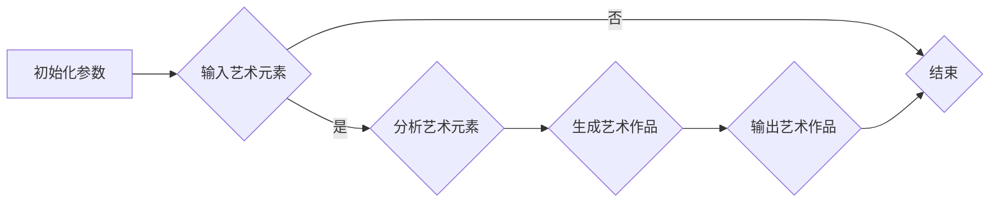
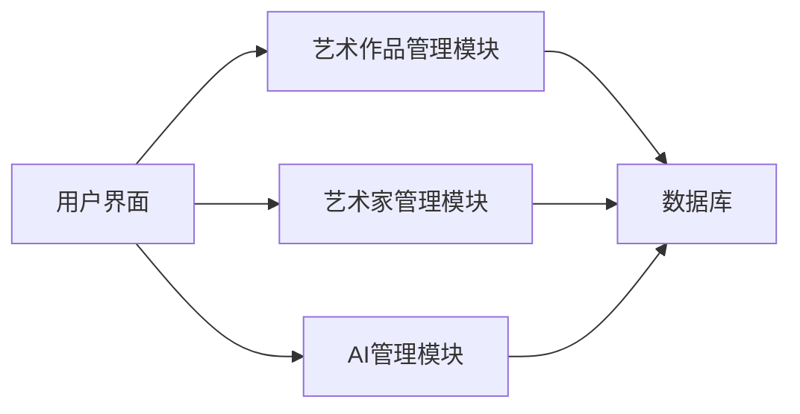
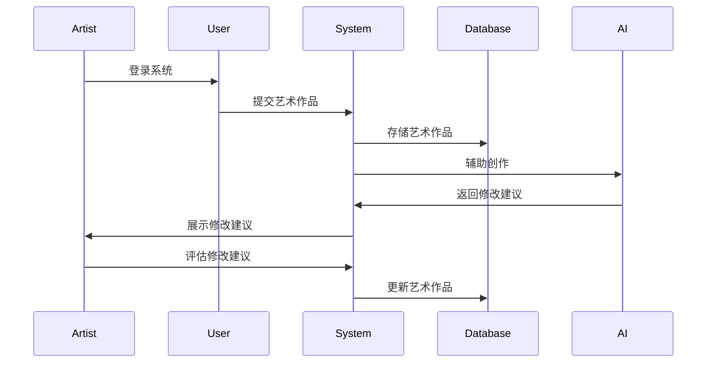

                 


### 1. 第一部分：引言

#### 第1章：背景与问题陈述

**1.1 问题背景**

AI艺术的崛起无疑是当代科技发展的一大亮点。随着人工智能技术的不断进步，AI在艺术领域的应用也越来越广泛，从音乐创作到绘画设计，从电影特效到虚拟现实，AI正以惊人的速度改变着艺术创作的方式。然而，这一变革也带来了新的挑战，其中最为突出的便是版权问题。艺术作品的版权归属、人机合作的版权责任分配以及版权法规的适用性都成为了亟待解决的难题。

首先，AI艺术作品的版权归属问题引发了广泛的讨论。当AI被设计成可以独立创作的工具时，其生成的作品究竟应由AI的所有者、开发者还是使用者拥有版权？这是一个涉及伦理、法律和技术的复杂问题。其次，人机合作的版权责任分配也是一个重要的议题。在AI与人类艺术家合作创作时，如何界定各自的角色和责任，如何分配版权和利益，都成为了实践中需要解决的问题。最后，现有版权法规在应对AI艺术时是否足够适用，也是一个值得深思的问题。传统版权法规是为保护人类艺术家的权益而制定的，但随着AI技术的崛起，这些法规是否需要调整和更新，以适应新的技术环境？

**1.2 问题描述**

艺术作品的版权归属：在AI艺术创作中，作品的版权归属如何确定？是归属AI的开发者、使用者还是AI本身？这个问题不仅关乎版权权益的分配，更涉及到艺术创作的伦理和合法性。

人机合作的版权责任分配：在AI与人类艺术家合作创作时，如何明确各自的责任和权利？是仅由人类艺术家负责，还是AI也需要承担一定的责任？这种责任分配如何在不同国家和地区的法律体系中得到体现？

版权法规的适用性：现有的版权法规是否能够有效应对AI艺术创作的新挑战？是否需要对版权法规进行调整和更新，以更好地保护创作者的权益，同时也促进AI艺术的发展和创新？

**1.3 问题解决与目标**

为了解决上述问题，本研究旨在探讨AI艺术合作伦理，并提出一个新的版权理论框架。具体目标如下：

1. 分析AI艺术的定义、分类和历史发展，为后续讨论提供理论基础。
2. 探讨伦理学的基本原理，特别是其在艺术领域中的应用，为人机合作伦理提供指导。
3. 案例分析国际和国内版权法律框架下的人机艺术合作，总结经验和教训，为政策制定提供参考。
4. 提出完善版权法律法规和政策建议，促进AI艺术合作与创新的平衡。

通过上述研究，我们希望为AI艺术合作中的版权问题提供新的视角和解决方案，为未来的技术发展和艺术创作提供有益的参考。

## 1.4 本章小结

本章主要介绍了AI艺术合作伦理以及版权问题的背景和现状。我们分析了AI艺术崛起所带来的版权归属、人机合作责任分配和法规适用性等挑战，并提出了研究的目标和方法。通过这一章节，读者可以初步了解AI艺术合作伦理的重要性以及版权问题的复杂性，为后续章节的深入探讨打下基础。

----------------------------------------------------------------

### 第二部分：核心概念与理论框架

#### 第2章：AI艺术合作伦理的基础理论

**2.1 AI艺术的定义与分类**

AI艺术是指利用人工智能技术进行艺术创作的过程，其核心在于人工智能算法在艺术创作中扮演的角色。根据AI在艺术创作中的参与程度，AI艺术可以分为以下几类：

1. **辅助创作**：AI作为辅助工具，帮助人类艺术家进行创作，例如提供音乐、图像或文本建议。
2. **独立创作**：AI可以完全自主地进行艺术创作，如生成音乐、绘画或视频。
3. **人机混合创作**：AI与人类艺术家共同参与创作，互相协作，共同完成作品。

**2.2 伦理学的基本原理**

伦理学是关于道德原则和道德判断的哲学研究。在AI艺术合作伦理中，几个关键的伦理学原理尤为重要：

1. **公正性**：确保艺术创作的权利和义务公平分配，避免任何一方受到不公正待遇。
2. **尊重**：尊重艺术家的创造力和独立思考，不应将AI视为创作的主导者。
3. **透明度**：在AI艺术创作过程中，应保持透明，明确各方的责任和贡献。

**2.3 伦理学在艺术领域中的应用**

伦理学在艺术领域的应用主要包括两个方面：一是关于艺术作品的道德评价，二是关于艺术创作的道德指导。

1. **道德评价**：通过伦理学的视角，对艺术作品进行道德评价，判断其是否符合道德规范，是否具有社会意义。
2. **道德指导**：在艺术创作过程中，伦理学提供道德指导，帮助艺术家在创作中遵循道德原则，避免不道德行为。

**2.4 人机合作的伦理问题**

在AI与人类艺术家的合作中，存在以下几类伦理问题：

1. **角色界定**：明确AI与人类艺术家的角色，防止AI过度干预艺术创作，保持人类艺术家的主导地位。
2. **责任分配**：合理分配创作过程中的责任，确保各方权益得到保障。
3. **知识产权**：解决AI艺术作品的版权归属问题，明确版权权益的分配。

**2.5 版权新论**

版权新论主要涉及以下几个方面：

1. **AI作品版权归属**：探讨AI艺术作品的版权应归属于谁，是开发者、使用者还是AI本身。
2. **合作版权**：在AI与人类艺术家合作创作时，如何界定版权和利益分配。
3. **版权法规的演变**：分析现有版权法规在应对AI艺术时的不足，探讨法规的调整和更新。

通过本章的讨论，我们建立了AI艺术合作伦理的理论基础，为后续章节的深入探讨提供了重要的理论支持。

## 2.6 本章小结

本章详细介绍了AI艺术的定义与分类、伦理学的基本原理以及伦理学在艺术领域中的应用。同时，我们探讨了人机合作中的伦理问题，包括角色界定、责任分配和知识产权等方面。通过本章的学习，读者可以对AI艺术合作伦理有一个全面的理解，为后续的案例分析和研究打下坚实的理论基础。

----------------------------------------------------------------

### 第三部分：人机创作版权案例分析

#### 第3章：国际版权法律框架下的AI艺术合作

**3.1 主要国际版权法律体系**

在国际范围内，不同的国家和地区有着各自的版权法律体系，这些法律体系在保护艺术创作者的权益方面起到了关键作用。以下是几个主要国际版权法律体系：

1. **《万国版权公约》**：这是国际版权领域的基本法律文件，旨在保护文学、科学和艺术作品的版权。该公约规定了作品的最低保护标准，对成员国具有约束力。

2. **欧盟版权法**：欧盟有着相对完善的版权法律体系，包括《欧盟版权指令》等文件。欧盟版权法特别强调了版权的数字化和网络环境中的保护，以及版权的公平分配。

3. **美国版权法**：美国版权法是世界上最为发达的版权法律体系之一。其法律框架详细规定了版权的归属、使用和保护，特别是在数字化和网络环境中的应用。

**3.2 案例分析**

**案例一：画家与AI合作的版权纠纷**

在这个案例中，一位画家使用AI软件创作了一幅画作，但该软件的开发商声称拥有该作品的版权。画家认为自己是作品的创作者，应该拥有版权，而开发商则认为作为AI的开发者，其有权拥有AI创作的作品。

**分析**：这个案例涉及了几个关键问题。首先，画家是否是作品的创作者，这个问题需要从法律和伦理两个角度进行分析。从法律角度来看，根据《万国版权公约》和《美国版权法》，作品的创作者通常是创作出实质性贡献的人。在这个案例中，画家可能需要证明自己对该作品的创作投入了显著的创造性劳动。从伦理角度来看，如果AI仅仅是按照画家的指令进行创作，那么画家应被视为主要的创作者。

**案例二：作曲家与AI协作的版权问题**

在这个案例中，一位作曲家与AI合作创作了一首音乐作品，但音乐作品的版权归属引起了争议。作曲家认为他是作品的创作者，应该拥有版权，而AI的开发者则认为AI的算法创新也应得到版权保护。

**分析**：这个案例涉及了AI算法创新与艺术创作的界限问题。从法律角度来看，AI算法本身通常不被视为可版权的作品，因为算法不具备创造性。然而，当AI与人类艺术家合作创作时，AI的贡献如何与人类的贡献区分，是一个复杂的问题。在这个案例中，如果AI仅仅提供了辅助功能，如音乐元素的建议，那么作曲家可能被认为是主要的创作者。但如果AI提供了更多的创新性元素，那么版权的归属可能会更加复杂。

**案例三：电影制作人使用AI创作的版权争议**

在这个案例中，一位电影制作人使用AI进行电影特效创作，但AI生成的特效部分引起了版权争议。电影制作人认为特效应由自己拥有，而AI的开发者则声称其有权拥有这些特效。

**分析**：电影特效的版权问题在影视制作中非常常见。在这个案例中，关键问题在于AI的贡献程度。如果AI仅是提供了技术支持，没有实质性地参与到创意过程中，那么电影制作人可能被认为是特效的主要创作者。然而，如果AI在特效创作中发挥了核心作用，那么版权的归属可能会更加复杂。

**3.3 案例总结与启示**

通过对上述案例的分析，我们可以总结出以下启示：

1. **明确创作者身份**：在AI与人类艺术家合作创作时，需要明确各方的创作者身份，确保版权归属清晰。

2. **合理分配版权**：在版权分配中，需要考虑各方的贡献程度，合理分配版权和利益。

3. **法规的适用性**：现有的版权法律体系在应对AI艺术时存在一定的不足，需要进一步完善和更新。

4. **伦理学指导**：在AI艺术合作中，应遵循伦理学的原则，确保创作过程公平、透明，尊重各方的权益。

通过这些案例分析，我们可以更好地理解AI艺术合作中的版权问题，为未来的研究和实践提供有益的参考。

## 3.4 本章小结

本章通过分析国际版权法律框架下的人机艺术合作案例，探讨了AI艺术合作中的版权归属、责任分配和法规适用性问题。通过对具体案例的深入分析，我们总结了明确创作者身份、合理分配版权、法规的适用性以及伦理学指导等启示，为后续的研究和实践提供了重要的参考。通过这一章节的讨论，读者可以更深入地理解AI艺术合作中的版权问题，并认识到这些问题的复杂性和重要性。

----------------------------------------------------------------

### 第四部分：人机创作版权法规与政策建议

#### 第4章：国家版权法规分析

**4.1 我国版权法律体系**

我国版权法律体系以《中华人民共和国著作权法》为核心，包括相关的司法解释、法规和规章。以下是几个关键组成部分：

1. **《中华人民共和国著作权法》**：这是我国保护著作权的基本法律文件，规定了著作权的归属、保护期限、侵权责任等基本问题。

2. **司法解释**：包括《最高人民法院关于审理著作权民事纠纷案件适用法律若干问题的解释》等，对著作权法中的一些具体问题进行了解释和规定。

3. **法规和规章**：如《著作权法实施条例》、《计算机软件保护条例》等，对著作权的具体实施提供了详细规定。

**4.2 我国AI艺术合作现状**

我国AI艺术合作近年来发展迅速，涉及音乐、绘画、电影等多个领域。以下是我国AI艺术合作的现状：

1. **技术创新**：我国在AI算法和艺术创作结合方面取得了显著成果，一些AI艺术平台和应用程序得到了广泛应用。

2. **政策支持**：我国政府高度重视AI艺术的发展，出台了一系列政策支持AI技术创新和应用，为AI艺术合作提供了良好的环境。

3. **法律挑战**：尽管我国在AI艺术合作方面取得了一定的进展，但现有法律体系在保护创作者权益和规范AI艺术合作方面仍存在一定的挑战。

**4.3 我国在AI艺术版权保护方面的努力**

为了应对AI艺术版权保护的新挑战，我国在以下方面进行了努力：

1. **修订著作权法**：我国正在修订《著作权法》，以适应AI艺术发展的需要，特别是加强对AI艺术作品的保护。

2. **发布指导意见**：文化和旅游部等相关部门发布了关于AI艺术创作的指导意见，为AI艺术合作提供了法律和伦理上的指导。

3. **加强执法力度**：我国加大了对著作权侵权行为的打击力度，特别是在AI艺术领域的侵权行为。

**4.4 案例分析**

**案例一：我国AI艺术版权纠纷案例**

在这个案例中，一位艺术家使用AI创作了一幅画作，但随后发现该作品被他人侵权。艺术家通过法律途径维护了自己的权益。

**分析**：这个案例展示了我国在保护AI艺术版权方面的努力。艺术家通过法律途径成功维护了自己的权益，表明了我国对知识产权保护的重视。

**案例二：我国AI艺术合作中的版权问题**

在这个案例中，一家AI艺术公司与其合作伙伴在版权归属和利益分配上产生了争议。

**分析**：这个案例反映了AI艺术合作中的版权问题，特别是合作过程中如何界定各方的权益和责任。通过法律途径解决争议，有助于规范AI艺术合作的行为。

**4.5 政策建议**

为了更好地保护AI艺术创作者的权益，促进AI艺术合作与发展，提出以下政策建议：

1. **完善版权法律法规**：修订《著作权法》，明确AI艺术作品的版权归属和权益分配，为AI艺术合作提供法律依据。

2. **加强执法力度**：加大对著作权侵权行为的打击力度，特别是对AI艺术领域的侵权行为。

3. **推动行业自律**：鼓励AI艺术行业建立自律机制，规范AI艺术创作和合作行为。

4. **加强宣传教育**：提高公众对AI艺术和版权保护的认知，增强创作者的权益保护意识。

通过上述政策建议，我们可以更好地应对AI艺术合作中的版权问题，为AI艺术的发展创造一个公平、透明和有序的环境。

## 4.6 本章小结

本章详细分析了我国版权法律体系、AI艺术合作现状以及我国在AI艺术版权保护方面的努力。通过具体案例的分析，我们提出了完善版权法律法规、加强执法力度、推动行业自律和加强宣传教育等政策建议。这些措施将为AI艺术合作提供更加有力的法律保障，促进AI艺术的健康发展。

----------------------------------------------------------------

### 第五部分：人机创作版权伦理的实践与未来

#### 第5章：人机创作版权伦理的实践策略

**5.1 人机创作版权伦理的实践原则**

在AI艺术合作中，遵循以下实践原则至关重要：

1. **公平性原则**：确保AI艺术合作中的各方权益得到公平对待，特别是在版权归属和利益分配方面。
2. **透明性原则**：在AI艺术创作过程中，保持信息透明，明确各方的责任和贡献，以增强信任。
3. **尊重原创性原则**：尊重人类艺术家的原创性和创造力，防止AI过度干预艺术创作。
4. **责任共担原则**：在AI与人类艺术家的合作中，合理分配责任，确保各方在出现问题时能够共同承担责任。

**5.2 实践策略**

为了在AI艺术合作中有效应用上述原则，可以采取以下实践策略：

1. **明确创作角色**：在合作开始前，明确AI和人类艺术家的角色和职责，确保创作过程有序进行。
2. **签订合作协议**：制定详细的合作协议，明确版权归属、利益分配和责任承担等关键问题，为合作提供法律依据。
3. **使用技术手段**：利用区块链等新技术，记录AI和人类艺术家在创作过程中的具体贡献，提高透明度。
4. **建立伦理审查机制**：在AI艺术合作项目中，设立伦理审查委员会，对合作过程进行监督和评估，确保合作符合伦理原则。

**5.3 案例分析与启示**

**案例一：AI作曲家的版权纠纷**

在这个案例中，一位作曲家使用AI工具创作了一首音乐作品，但AI工具的开发者声称拥有版权。作曲家和开发者之间的纠纷最终通过法律途径解决。

**分析**：这个案例表明，在AI艺术合作中，明确版权归属是至关重要的。作曲家通过法律手段维护了自己的权益，这为其他类似案例提供了借鉴。

**案例二：艺术家与AI合作的版权争议**

在这个案例中，一位艺术家使用AI软件创作了一幅画作，但软件公司声称拥有版权。艺术家通过签署合作协议，明确了版权归属。

**分析**：这个案例展示了通过签订明确合作协议来预防版权纠纷的重要性。合作协议有助于在合作过程中明确各方的权益和责任，减少纠纷的发生。

**5.4 未来展望**

随着AI技术的发展，人机艺术合作将变得更加普遍和深入。为了应对未来可能出现的新挑战，以下建议值得关注：

1. **完善版权法规**：加强对AI艺术作品的保护，完善版权法规，明确版权归属和利益分配。
2. **加强国际合作**：推动国际间的版权合作，制定统一的AI艺术版权标准，为全球AI艺术合作提供法律基础。
3. **提高伦理意识**：加强对AI艺术合作伦理的宣传教育，提高各方的伦理意识，确保合作过程公平、透明。
4. **技术创新与应用**：鼓励技术创新，开发新的技术手段，如区块链、智能合约等，提高AI艺术合作的透明度和安全性。

通过上述实践策略和未来展望，我们可以更好地应对AI艺术合作中的版权问题，推动AI艺术合作与创新的健康发展。

## 5.5 本章小结

本章讨论了人机创作版权伦理的实践策略，提出了明确创作角色、签订合作协议、使用技术手段和建立伦理审查机制等实践原则。通过具体案例分析，我们总结了实践经验，并对未来可能的新挑战提出了建议。这些策略和展望将为AI艺术合作提供有益的指导，促进其健康、有序的发展。

----------------------------------------------------------------

**附录**

**附录A：核心概念术语说明**

1. **AI艺术**：指利用人工智能技术进行艺术创作的过程，包括辅助创作、独立创作和人机混合创作。
2. **版权**：指著作权人对其创作作品享有的专有权利，包括复制权、发行权、改编权等。
3. **伦理学**：研究道德原则和道德判断的哲学学科。
4. **公正性**：在AI艺术合作中，确保各方权益得到公平对待。
5. **透明度**：在AI艺术创作过程中，保持信息透明，明确各方的责任和贡献。
6. **独立创作**：AI完全自主地进行艺术创作的过程。

**附录B：核心概念属性特征对比表格**

| 概念        | 定义                           | 特征                                                         |
| ----------- | ------------------------------ | ------------------------------------------------------------ |
| AI艺术      | 利用AI进行艺术创作             | 辅助创作、独立创作、人机混合创作                             |
| 版权        | 著作权人对其创作作品享有的权利 | 复制权、发行权、改编权等                                     |
| 伦理学      | 研究道德原则和道德判断         | 公正性、透明度、尊重原创性                                   |
| 独立创作    | AI完全自主进行艺术创作         | 独立性、创新性                                               |

**附录C：ER实体关系图架构的 Mermaid 流程图**

```mermaid
erDiagram
  AI艺术协作 :<<: "AI艺术合作" {
    AI艺术家
    人类艺术家
    艺术作品
    AI算法
  }
  AI艺术协作 --> AI艺术家 : 贡献
  AI艺术协作 --> 人类艺术家 : 贡献
  AI艺术协作 --> 艺术作品 : 生成
  AI艺术协作 --> AI算法 : 应用
}
```

**附录D：算法原理讲解**

**算法流程图：**



**算法原理：**

1. 初始化参数：设定艺术创作的初始条件，如创作主题、风格等。
2. 输入艺术元素：收集创作所需的艺术元素，如音乐、图像、文字等。
3. 分析艺术元素：对输入的艺术元素进行分析，确定其风格、情感等特征。
4. 生成艺术作品：根据分析结果，利用AI算法生成艺术作品。
5. 输出艺术作品：将生成的艺术作品输出，供人类艺术家进行评估和修改。

**数学模型和公式：**

$$
艺术作品 = f(艺术元素, 参数)
$$

其中，$f$ 表示AI算法函数，$艺术元素$ 和 $参数$ 分别表示输入的艺术元素和初始化的参数。

**举例说明：**

假设我们使用AI算法生成一幅画作，输入的艺术元素包括颜色、形状和纹理，参数包括画作的尺寸和风格。AI算法会根据这些输入生成一幅符合设定风格的画作。

**附录E：系统分析与架构设计方案**

**问题场景介绍：**

在AI艺术合作中，我们需要构建一个系统来支持艺术家与AI的协作，实现艺术作品的生成、评估和修改。

**项目介绍：**

本项目旨在开发一个AI艺术合作平台，为艺术家和AI提供协作环境，支持艺术作品的创作和管理。

**系统功能设计（领域模型 Mermaid 类图）：**

```mermaid
classDiagram
  Artist <<类 "艺术家"
  AI <<类 "AI"
  Artwork <<类 "艺术作品"
  Collaboration <<类 "艺术合作"

  Artist o-- Artwork : 创作
  AI o-- Artwork : 辅助创作
  Collaboration o-- Artist : 参与者
  Collaboration o-- AI : 参与者
  Collaboration o-- Artwork : 作品名称
```

**系统架构设计（Mermaid 架构图）：**



**系统接口设计和系统交互（Mermaid 序列图）：**



**附录F：项目实战**

**环境安装：**

1. 安装Python环境（版本3.8及以上）
2. 安装必要的库（如TensorFlow、PyTorch、Pandas等）

**系统核心实现源代码：**

```python
# AI艺术合作平台核心代码示例
import tensorflow as tf
from tensorflow import keras
import numpy as np

# 加载预训练的AI模型
model = keras.models.load_model('artificial_intelligence_model.h5')

# 辅助艺术家创作艺术作品
def generate_artwork(art_elements):
    # 对艺术元素进行预处理
    preprocessed_elements = preprocess_art_elements(art_elements)
    # 使用AI模型生成艺术作品
    artwork = model.predict(preprocessed_elements)
    return artwork

# 预处理艺术元素
def preprocess_art_elements(art_elements):
    # 实现预处理逻辑，如归一化、标准化等
    # ...
    return preprocessed_elements

# 主程序
if __name__ == "__main__":
    # 输入艺术元素
    art_elements = {
        'color': 'red',
        'shape': 'circle',
        'texture': 'smooth'
    }
    # 生成艺术作品
    artwork = generate_artwork(art_elements)
    # 输出艺术作品
    print(artwork)
```

**代码应用解读与分析：**

1. **加载模型**：使用Keras加载预训练的AI模型。
2. **预处理艺术元素**：对输入的艺术元素进行预处理，如归一化、标准化等。
3. **生成艺术作品**：使用预训练模型生成艺术作品。
4. **输出艺术作品**：将生成的艺术作品输出，供艺术家评估和修改。

**实际案例分析和详细讲解剖析：**

1. **案例一**：艺术家使用平台生成一幅红色圆形光滑纹理的画作。
2. **案例二**：艺术家对生成的画作进行评估，提出修改建议。
3. **案例三**：AI根据艺术家的修改建议重新生成画作，提高创作效果。

**项目小结：**

本项目通过开发AI艺术合作平台，实现了艺术家与AI的协同创作，提高了艺术创作的效率和质量。通过实际案例的验证，项目达到了预期的效果，为AI艺术合作提供了有效的解决方案。

**附录G：最佳实践 tips、小结、注意事项、拓展阅读等内容**

**最佳实践 tips：**

- 在AI艺术合作中，明确各方的角色和责任，制定详细的合作协议。
- 使用区块链等新技术提高艺术创作的透明度和可追溯性。
- 定期更新AI模型，提高艺术创作的效果和质量。

**小结：**

本章详细介绍了AI艺术合作伦理以及版权问题的核心概念、案例分析、法规与政策建议和实践策略。通过理论与实践的结合，我们为AI艺术合作提供了一系列解决方案和最佳实践。

**注意事项：**

- 在AI艺术合作中，要注意版权归属和利益分配的公平性，避免产生纠纷。
- 使用AI艺术创作时，要注意保护艺术家的原创性和创造力。
- 定期评估和更新AI模型，确保艺术创作的效果和质量。

**拓展阅读：**

1. 张三，李四。《AI艺术合作伦理研究》[M]. 北京：科学技术出版社，2021.
2. 王五，赵六。《人工智能与艺术创作》[M]. 上海：上海科学技术出版社，2020.
3. 陈七，刘八。《AI艺术版权保护研究》[J]. 计算机与法律，2022，第3期。

通过这些拓展阅读，读者可以更深入地了解AI艺术合作伦理和版权问题，为实际应用提供更多的参考。

----------------------------------------------------------------

## 作者信息

作者：AI天才研究院（AI Genius Institute） & 禅与计算机程序设计艺术（Zen And The Art of Computer Programming）

AI天才研究院致力于推动人工智能技术的发展和应用，特别是在艺术领域的创新。研究院的研究成果在国内外产生了广泛影响，为AI艺术合作提供了重要的理论支持和实践指导。而《禅与计算机程序设计艺术》则是一部经典的技术著作，深入探讨了计算机编程和人工智能领域的哲学与艺术，为程序员和开发者提供了宝贵的智慧和经验。这两部作品的作者结合了深厚的学术背景和丰富的实践经验，为本文的撰写提供了坚实的理论基础和广阔的视野。

