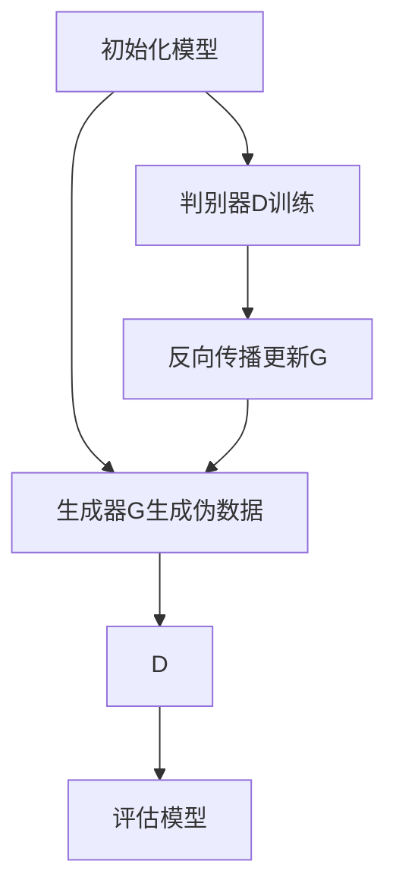
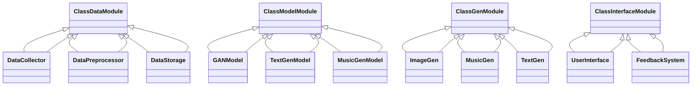
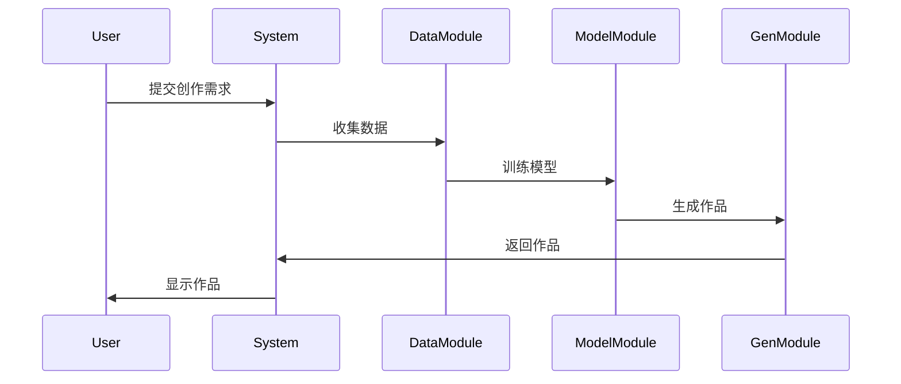

                 

### 《AI辅助创作伦理：人机协作的艺术新范式》

> 关键词：人工智能、创作伦理、人机协作、艺术创新、伦理问题

> 摘要：本文旨在探讨人工智能（AI）在辅助创作领域中的伦理问题，分析人机协作的艺术新范式。通过深入剖析AI创作技术的发展、伦理考量以及实际应用案例，本文提出了一系列解决伦理问题的策略和未来展望。

----------------------------------------------------------------

## 目录大纲

1. **引言与背景介绍**
   - 人工智能与创作伦理
   - 人机协作的艺术新范式
   - 本文结构概述

2. **AI辅助创作的技术基础**
   - AI的基本概念
   - AI创作工具与平台
   - AI创作流程与技术

3. **伦理问题的探讨**
   - 创作过程中的伦理考量
   - 人机协作中的责任归属
   - 数据隐私与安全

4. **艺术新范式的探索**
   - AI创作对艺术领域的影响
   - 人机协作下的艺术创新
   - 跨界合作的实践案例

5. **法律与监管**
   - AI创作伦理的法律框架
   - 监管机制与标准
   - 案例分析：伦理争议的处理

6. **未来展望与挑战**
   - AI创作伦理的趋势
   - 技术与人性的平衡
   - 未来人机协作的伦理挑战

7. **结论与建议**
   - 总结与反思
   - 政策建议与行业规范
   - 普及教育与公众意识提升

----------------------------------------------------------------

## 引言与背景介绍

在过去的几十年中，人工智能（AI）技术经历了前所未有的快速发展。从最初的规则系统到现代的深度学习模型，AI在各个领域都展现出了巨大的潜力和应用价值。特别是随着计算能力的提升和数据量的爆炸性增长，AI逐渐从理论研究走向实际应用，渗透到了我们的日常生活、工作以及艺术创作中。

### 人工智能与创作伦理

AI在创作领域的应用带来了前所未有的机遇，例如在音乐、绘画、文学、电影等艺术形式中，AI能够辅助甚至替代人类完成创作过程。然而，这也引发了一系列伦理问题。首先，AI创作过程中的版权归属问题亟待解决。当AI创作出艺术品时，它的创作者究竟是人还是机器？这直接涉及到版权的归属和利益的分配。其次，AI创作中的人机协作模式也带来了责任归属的争议。当人机协作产生的问题或错误时，应该如何界定责任？

### 人机协作的艺术新范式

人机协作是一种将人类创造力和机器计算能力相结合的新模式。在艺术创作中，人机协作不仅能够提高创作的效率和精度，还能够拓展艺术的边界。人机协作的艺术新范式要求我们重新思考艺术创作的本质和过程，如何在人工智能的帮助下实现艺术创新，同时又能够尊重和保护人类的创造力和价值？

本文将围绕这些核心问题展开讨论，分析AI辅助创作技术的现状和发展趋势，探讨人机协作中的伦理问题，并从法律和监管的角度提出解决方案。希望通过本文的探讨，能够为AI辅助创作伦理的研究和实践提供一些有益的参考和启示。

## 第一部分：引言与背景介绍

### 1.1 书籍目的与结构概述

《AI辅助创作伦理：人机协作的艺术新范式》旨在探讨人工智能在辅助创作领域中的伦理问题，以及如何通过人机协作实现艺术创新。随着AI技术的发展，人工智能不仅在传统领域展现出了巨大的潜力，还在艺术创作中发挥了重要作用。然而，AI的介入引发了诸多伦理问题，如版权归属、责任归属、数据隐私等。本书将系统地分析这些伦理问题，并提出相应的解决方案。

本书共分为七个部分，第一部分是引言与背景介绍，主要讨论AI在创作领域的应用和引发的伦理问题；第二部分介绍AI的基本概念和技术基础；第三部分深入探讨AI辅助创作中的伦理问题；第四部分探索AI创作对艺术领域的影响和人机协作下的艺术创新；第五部分分析AI创作伦理的法律框架和监管机制；第六部分展望未来AI创作伦理的发展趋势和挑战；最后一部分总结全文，提出政策建议和行业规范。

### 1.2 AI辅助创作的发展历程

AI辅助创作的发展历程可以追溯到上世纪80年代，当时计算机科学家们开始探索如何使用算法生成艺术作品。早期的AI创作主要基于规则系统，通过预设的规则和模式生成音乐、绘画和文学等艺术作品。然而，这些作品的创造力和艺术性有限，难以与人类的创作相媲美。

随着人工智能技术的发展，特别是在深度学习领域的突破，AI辅助创作进入了一个新的阶段。深度学习模型通过学习大量的数据，能够自动提取特征并生成新的艺术作品。这一阶段，AI创作的艺术作品不仅在形式上更加多样，而且在创意和情感表达上也展现出了更高的水平。

近年来，随着云计算和大数据技术的普及，AI辅助创作进一步拓展了应用范围。例如，AI能够实时分析用户反馈，动态调整创作过程，使其更加符合用户的期望。此外，AI还能够在艺术创作中引入新的元素和风格，打破传统的创作界限，推动艺术形式的创新。

总的来说，AI辅助创作的发展历程是从简单的规则系统到复杂的深度学习模型，再到如今结合云计算和大数据技术的智能化创作平台。这一过程中，AI不仅在技术层面不断突破，还在伦理层面带来了新的挑战和思考。

### 1.3 人机协作中的伦理问题

人机协作在艺术创作中的应用，不仅改变了创作的方式，也带来了诸多伦理问题。首先，版权归属问题是一个重要的争议点。当AI参与创作时，作品的版权归属往往难以明确。一些艺术家认为，AI仅是辅助工具，作品的创意和艺术价值应当归人类创作者所有。然而，另一些人则认为，AI在创作过程中发挥了关键作用，应当享有相应的版权。

其次，责任归属问题也备受关注。在人机协作中，当创作过程中出现错误或问题时，如何界定责任成为了一个难题。例如，当AI生成的内容含有歧视性或不当信息时，责任应当由人类创作者承担，还是由AI的开发者或使用者承担？这涉及到法律、道德和技术层面的多重考量。

此外，数据隐私和安全也是人机协作中不可忽视的伦理问题。AI创作往往依赖于大量的数据，这些数据可能包含个人隐私信息。如何在保护用户隐私的前提下，充分利用这些数据进行艺术创作，是一个亟待解决的问题。

总的来说，人机协作中的伦理问题涉及多个方面，包括版权归属、责任归属和数据隐私等。这些问题不仅影响艺术创作的实践，也引发了关于人工智能伦理的广泛讨论。如何解决这些伦理问题，不仅需要法律和技术的支持，更需要社会各界的共同努力和智慧。

### 1.4 本文结构概述

本文将分为七个主要部分，系统地探讨AI辅助创作伦理问题及其人机协作的艺术新范式。首先，在引言与背景介绍部分，我们将阐述AI在创作领域的应用及其引发的伦理问题。接着，第二部分将介绍AI的基本概念和技术基础，包括深度学习、神经网络等核心技术和常用AI创作工具。随后，第三部分深入探讨AI辅助创作中的伦理问题，如版权归属、责任归属和数据隐私等。

第四部分将分析AI创作对艺术领域的影响，探讨人机协作下的艺术创新，并介绍一些成功的跨界合作案例。第五部分将探讨AI创作伦理的法律框架和监管机制，分析当前的法律标准和监管挑战。第六部分展望未来AI创作伦理的发展趋势和挑战，探讨技术与人性的平衡。最后，在第七部分，我们将总结全文，提出政策建议和行业规范，以及普及教育和公众意识提升的策略。

通过这样的结构布局，本文旨在为AI辅助创作伦理的研究和实践提供系统的理论框架和实践指导，推动人机协作在艺术创作中的健康发展。

### 第二部分：AI辅助创作的技术基础

#### 2.1 AI的基本概念

人工智能（Artificial Intelligence，简称AI）是指由计算机系统实现的智能行为，旨在模拟、扩展甚至超越人类智能。AI技术主要分为两大类：基于规则的系统和基于数据的系统。基于规则的系统通过预设的规则和逻辑关系来实现特定功能，如专家系统和推理机。而基于数据的系统则依赖于大量数据的学习和模式识别，如机器学习和深度学习。

机器学习（Machine Learning，ML）是AI的核心技术之一，通过从数据中学习模式和规律，实现预测和决策。机器学习可以分为监督学习、无监督学习和半监督学习。监督学习使用标记数据进行训练，如分类和回归问题。无监督学习不使用标记数据，旨在发现数据中的隐含结构，如聚类和降维。半监督学习结合了标记数据和未标记数据，以提高模型的泛化能力。

深度学习（Deep Learning，DL）是机器学习的一个子领域，通过多层次的神经网络模型，自动提取数据中的复杂特征。深度学习在图像识别、语音识别和自然语言处理等领域取得了显著成果。其核心模型包括卷积神经网络（CNN）、循环神经网络（RNN）和生成对抗网络（GAN）。

#### 2.2 AI创作工具与平台

AI创作工具和平台为艺术家和设计师提供了丰富的创作资源和技术支持。以下是一些常见的AI创作工具和平台：

1. **Google Colab**：Google Colab 是一个基于云计算的编程平台，支持Python、R和Julia等编程语言。它提供了强大的计算资源和预安装的AI库，如TensorFlow和Keras，使得开发者可以轻松构建和训练AI模型。

2. **TensorFlow**：TensorFlow 是由Google开发的开源机器学习框架，支持多种编程语言（如Python、C++和Java）。它提供了丰富的API和工具，用于构建、训练和部署深度学习模型。

3. **PyTorch**：PyTorch 是由Facebook开发的开源深度学习框架，以其灵活性和动态计算图而闻名。它被广泛应用于图像识别、自然语言处理和强化学习等领域。

4. **Style Transfer**：Style Transfer 是一种基于深度学习的图像生成技术，通过将一张图像的风格与另一张图像的内容相结合，生成具有独特风格的新图像。Google Colab 和 TensorFlow 都提供了简单的 Style Transfer 实现示例。

5. **Adobe Sensei**：Adobe Sensei 是Adobe的AI和机器学习平台，集成了多种AI技术，用于增强Adobe Creative Cloud应用程序的功能。例如，Adobe Sensei 可以自动优化照片、识别文本并实现智能编辑。

#### 2.3 AI创作流程与技术

AI创作流程通常包括以下几个步骤：

1. **数据收集与预处理**：首先，需要收集与创作任务相关的数据，如图像、音频、文本等。然后，对数据进行清洗、标注和归一化等预处理操作，以提高模型的训练效果。

2. **模型选择与训练**：根据创作任务的需求，选择合适的AI模型。对于图像创作，可以使用卷积神经网络（CNN）；对于音乐创作，可以使用循环神经网络（RNN）或生成对抗网络（GAN）。然后，使用收集到的数据进行模型的训练和优化。

3. **生成创作内容**：训练好的模型可以生成新的艺术作品。例如，生成对抗网络（GAN）可以生成具有高真实感的图像；文本生成模型可以生成新的故事、歌词或诗歌。

4. **评估与优化**：通过评估生成内容的创意、美观和艺术价值，对模型进行调整和优化。这一过程可能需要多次迭代，以达到更好的创作效果。

5. **人机协作**：在创作过程中，人类艺术家和设计师可以与AI模型进行协作，共同创作艺术作品。人类可以提供创意、艺术指导，而AI则负责执行具体的创作任务，如图像生成、音乐编排等。

总的来说，AI辅助创作技术为艺术家和设计师提供了全新的创作工具和平台，通过人机协作实现艺术创新。这不仅提高了创作的效率和精度，也拓展了艺术创作的边界和可能性。

### 2.4 AI辅助创作的具体应用案例

AI辅助创作技术在多个领域取得了显著的成果，以下是一些具体的应用案例：

1. **音乐创作**：AI可以生成新的旋律、和弦和节奏，甚至创作完整的音乐作品。例如，IBM Watson Music可以使用生成对抗网络（GAN）生成独特的音乐风格，如爵士乐、古典乐或电子乐。Adobe Sensei 也提供音乐生成功能，可以自动生成背景音乐，为视频和电影制作提供支持。

2. **绘画与艺术**：AI可以通过深度学习算法生成独特的艺术作品，如抽象画、肖像画和风景画。DeepArt.io 使用卷积神经网络（CNN）将用户提供的图片风格与另一幅图像的内容相结合，生成具有特定风格的新图像。谷歌的 DeepDream 也通过深度学习算法生成具有幻觉效果的艺术图像。

3. **文学创作**：AI可以生成故事、诗歌和歌词。OpenAI 的 GPT-3 模型可以生成高质量的文章、对话和诗歌，甚至创作科幻小说。这些作品在创意和表达上具有很高的水平，但通常需要人类编辑和润色，以确保内容的合理性和艺术性。

4. **电影与影视制作**：AI可以自动剪辑视频、生成特效和配乐。例如，Adobe Premiere Pro 和 Final Cut Pro 等视频编辑软件集成了AI功能，可以自动识别视频中的关键帧，实现智能剪辑。此外，AI还可以生成新的视频内容，如通过图像到视频的转换技术（Image to Video），将静态图像生成动态视频。

5. **游戏设计**：AI可以在游戏设计中发挥重要作用，如生成游戏地图、角色设计和剧情情节。游戏开发平台如 Unity 和 Unreal Engine 都集成了AI工具，可以自动化游戏内容的生成和优化。

这些具体应用案例展示了AI辅助创作技术的多样性和广泛性，通过人机协作，AI不仅提高了创作的效率和精度，也拓展了人类艺术的边界。然而，这些应用也引发了关于伦理和责任的讨论，如何在充分利用AI创作优势的同时，确保创作过程和结果的道德和合法，是一个值得深入探讨的问题。

### 2.5 人机协作中的技术挑战与解决方案

在人机协作中，技术挑战主要集中在以下几个方面：算法稳定性、数据质量和协作效率。

首先，算法稳定性是确保人机协作顺利进行的关键。深度学习模型在训练过程中容易出现过拟合现象，导致模型在新数据上的表现不稳定。为了解决这一问题，可以采用以下策略：
1. **数据增强**：通过旋转、缩放、裁剪等操作增加数据的多样性，提高模型的泛化能力。
2. **交叉验证**：使用交叉验证方法评估模型在不同数据集上的表现，筛选出稳定性和泛化能力较好的模型。

其次，数据质量直接影响AI创作的效果。数据中可能存在噪声、异常值或缺失值，这些问题会降低模型的训练效果。为了确保数据质量，可以采取以下措施：
1. **数据清洗**：去除数据中的噪声和异常值，填补缺失值，以提高数据的一致性和完整性。
2. **数据标注**：对于图像、文本等数据，进行准确和细致的标注，以确保模型有足够的信息进行学习。

最后，协作效率是衡量人机协作质量的重要指标。在实际创作过程中，人类和AI之间的沟通和协作往往不够高效，导致创作过程拖延和效果不佳。为了提高协作效率，可以采取以下策略：
1. **界面优化**：设计直观易用的用户界面，使人类创作者能够方便地与AI模型进行交互和调整。
2. **实时反馈**：通过实时反馈机制，及时传递AI创作的中间结果和问题，使人类创作者能够及时进行调整和优化。

通过上述技术手段，可以有效应对人机协作中的技术挑战，提高协作效率和创作质量。然而，这些技术手段需要结合具体的应用场景和需求进行优化和调整，以实现最佳的效果。

### 2.6 核心概念原理与联系

在探讨AI辅助创作的技术基础时，我们需要明确几个核心概念及其相互关系。以下是AI创作领域的关键概念及其属性特征对比表格：

| 概念 | 定义 | 属性特征 | 对比 |
| --- | --- | --- | --- |
| 人工智能 | 模拟、扩展甚至超越人类智能的技术系统 | 计算能力、学习能力、自适应能力 | 与传统计算技术的区别 |
| 机器学习 | 通过数据学习模式并作出决策的AI技术 | 监督学习、无监督学习、半监督学习 | 数据驱动与规则驱动 |
| 深度学习 | 使用多层神经网络自动提取特征的方法 | 卷积神经网络（CNN）、循环神经网络（RNN）、生成对抗网络（GAN） | 复杂特征提取能力 |
| 神经网络 | 模拟生物神经系统的计算模型 | 输入层、隐藏层、输出层 | 学习与推理过程 |
| 数据增强 | 通过操作增加数据多样性 | 旋转、缩放、裁剪 | 提高泛化能力 |
| 数据清洗 | 去除噪声和异常值 | 填补缺失值、一致性检查 | 提高数据质量 |

以下是AI创作领域的ER实体关系图：

```mermaid
erDiagram
    AI辅助创作 ||--|{ 数据集 }|--|| 数据预处理
    AI辅助创作 ||--|{ 模型 }|--|| 模型训练
    AI辅助创作 ||--|{ 创作工具 }|--|| 工具集成
    数据集 ||--|{ 数据样本 }|--|| 标注、清洗
    模型 ||--|{ 模型参数 }|--|| 优化、调整
    创作工具 ||--|{ 功能模块 }|--|| 用户界面、交互
```

上述表格和ER图揭示了AI辅助创作中的关键概念及其相互关系。例如，机器学习和深度学习是AI创作的基础，它们通过数据集进行训练，生成模型参数。这些模型参数通过创作工具集成到实际应用中，实现图像生成、音乐创作等艺术形式。数据清洗和增强则是保证数据质量和模型训练效果的重要步骤。通过这些核心概念和关系的理解，我们可以更好地把握AI辅助创作的技术基础。

### 2.7 算法原理讲解

为了深入理解AI在辅助创作中的应用，我们将以生成对抗网络（GAN）为例，详细阐述其算法原理和实现过程。GAN是一种深度学习模型，由两部分组成：生成器（Generator）和判别器（Discriminator）。生成器的目标是生成逼真的数据，而判别器的目标是区分生成数据与真实数据。通过这种对抗训练，生成器不断优化，最终能够生成高质量的数据。

#### 2.7.1 GAN算法流程图

首先，我们使用Mermaid绘制GAN的算法流程图：



#### 2.7.2 Python代码实现

接下来，我们使用Python代码实现GAN算法，并给出详细的注释：

```python
import tensorflow as tf
from tensorflow.keras.layers import Dense, Flatten, Conv2D, Conv2DTranspose
from tensorflow.keras.models import Sequential
import numpy as np

# 定义生成器模型
def build_generator(z_dim):
    model = Sequential([
        Dense(128 * 7 * 7, activation="relu", input_shape=(z_dim,)),
        Flatten(),
        Conv2DTranspose(128, (5, 5), strides=(2, 2), padding="same"),
        Conv2DTranspose(64, (5, 5), strides=(2, 2), padding="same"),
        Flatten(),
        Conv2D(1, (1, 1), activation="sigmoid", padding="same")
    ])
    return model

# 定义判别器模型
def build_discriminator(img_shape):
    model = Sequential([
        Flatten(input_shape=img_shape),
        Dense(128, activation="relu"),
        Dense(1, activation="sigmoid")
    ])
    return model

# 初始化生成器和判别器
z_dim = 100
img_shape = (28, 28, 1)
generator = build_generator(z_dim)
discriminator = build_discriminator(img_shape)

# 编写GAN模型
model = Sequential([
    generator,
    discriminator
])

# 编写训练过程
def train_gan(generator, discriminator, img_shape, batch_size, epochs):
    (X_train, _), (_, _) = tf.keras.datasets.mnist.load_data()
    X_train = X_train / 127.5 - 1.0
    X_train = np.expand_dims(X_train, axis=3)
    
    z noise = tf.random.normal([batch_size, z_dim])
    
    for epoch in range(epochs):
        for _ in range(batch_size):
            real_images = X_train[np.random.randint(X_train.shape[0], size=batch_size)]
            fake_images = generator.predict(z noise)
            
            real_labels = tf.ones((batch_size, 1))
            fake_labels = tf.zeros((batch_size, 1))
            
            with tf.GradientTape() as gen_tape, tf.GradientTape() as disc_tape:
                disc_real_output = discriminator(real_images, training=True)
                disc_fake_output = discriminator(fake_images, training=True)
                
                gen_loss = tf.reduce_mean(tf.nn.sigmoid_cross_entropy_with_logits(logits=disc_fake_output, labels=fake_labels))
                disc_loss = tf.reduce_mean(tf.nn.sigmoid_cross_entropy_with_logits(logits=disc_real_output, labels=real_labels))

            grads_discriminator = disc_tape.gradient(disc_loss, discriminator.trainable_variables)
            grads_generator = gen_tape.gradient(gen_loss, generator.trainable_variables)
            
            discriminator.optimizer.apply_gradients(zip(grads_discriminator, discriminator.trainable_variables))
            generator.optimizer.apply_gradients(zip(grads_generator, generator.trainable_variables))
        
        print(f"Epoch {epoch+1}, Generator Loss: {gen_loss:.4f}, Discriminator Loss: {disc_loss:.4f}")

# 训练GAN模型
train_gan(generator, discriminator, img_shape, batch_size=128, epochs=50)
```

#### 2.7.3 数学模型与公式

GAN的数学模型可以描述为：

\[ D(x) = P(X|X) \]
\[ D(G(z)) = P(G(z)|X) \]

其中，\( D \)表示判别器，\( G \)表示生成器，\( x \)表示真实数据，\( z \)表示噪声向量。

判别器的损失函数为：

\[ L_D = -\log D(x) - \log(1 - D(G(z))) \]

生成器的损失函数为：

\[ L_G = -\log D(G(z)) \]

#### 2.7.4 算法原理详细讲解

生成对抗网络（GAN）的核心思想是生成器和判别器的对抗训练。生成器的任务是生成尽可能真实的数据，而判别器的任务是区分生成数据与真实数据。

1. **初始化模型**：首先初始化生成器和判别器模型。生成器接受一个噪声向量\( z \)，通过多层神经网络生成数据。判别器接受真实数据和生成数据，通过二分类任务判断数据来源。

2. **生成伪数据**：生成器通过随机噪声向量生成伪数据。这些伪数据在形式上模仿真实数据，但最初可能不够真实。

3. **训练判别器**：判别器在训练过程中不断学习，通过对比真实数据和生成数据，提高其分类能力。判别器的目标是最大化其分类准确性，从而减小生成器生成的数据与真实数据的差异。

4. **训练生成器**：生成器在训练过程中尝试生成更真实的数据，以逃避判别器的识别。生成器的目标是最大化判别器对其生成数据的分类错误率。

5. **迭代优化**：通过迭代优化，生成器和判别器在对抗训练中不断进步。生成器的生成质量逐渐提高，判别器的分类能力不断增强。

6. **评估模型**：训练完成后，评估生成器的性能，通过生成数据的真实性和艺术性来判断模型的效果。

通过GAN算法，我们能够生成高质量的艺术作品，如逼真的图像、音乐和文本。然而，GAN训练过程复杂，容易出现不稳定和过拟合等问题。因此，在实际应用中，需要结合具体场景和需求进行模型优化和参数调整。

### 2.8 系统分析与架构设计方案

在AI辅助创作系统中，我们需要从问题场景、项目介绍、系统功能设计、系统架构设计、系统接口设计和系统交互等多个方面进行详细分析和设计。

#### 2.8.1 问题场景

随着人工智能技术的不断发展，AI在艺术创作中的应用越来越广泛。然而，现有的AI创作工具和平台往往存在以下几个问题：
1. **创作流程复杂**：艺术家在使用AI进行创作时，需要经历多个繁琐的步骤，如数据收集、模型训练、生成和优化等。
2. **创作效果不稳定**：由于AI模型训练过程复杂，生成的艺术作品质量不稳定，难以满足艺术家的期望。
3. **协作效率低**：艺术家和AI模型之间的协作不顺畅，缺乏有效的互动和反馈机制，影响了创作效率。

为了解决这些问题，我们设计了一套AI辅助创作系统，通过模块化设计和优化算法，提高创作流程的效率和艺术作品的稳定性。

#### 2.8.2 项目介绍

本项目的目标是开发一个高效、稳定的AI辅助创作系统，提供从数据收集到艺术作品生成的全流程支持。系统将集成多个AI模型，包括生成对抗网络（GAN）、文本生成模型和音乐生成模型，以满足不同类型的艺术创作需求。

#### 2.8.3 系统功能设计

系统的主要功能包括：
1. **数据收集与预处理**：自动收集与创作任务相关的数据，进行清洗、标注和归一化等预处理操作。
2. **模型训练与管理**：使用预训练的模型或用户自定义的模型进行训练，并提供模型管理和调优功能。
3. **艺术作品生成**：根据用户需求生成不同类型的艺术作品，如图像、音乐和文本。
4. **用户交互**：提供用户友好的界面，实现与AI模型的实时交互和反馈，提高创作效率。

#### 2.8.4 系统架构设计

系统的架构设计采用模块化设计原则，包括以下几个核心模块：

1. **数据模块**：负责数据的收集、预处理和存储。
2. **模型模块**：包含多种AI模型，如GAN、文本生成模型和音乐生成模型，并提供模型训练和调优功能。
3. **生成模块**：根据用户需求生成艺术作品，并支持多种艺术形式的创作。
4. **交互模块**：提供用户界面，实现与用户之间的交互和反馈。

以下是系统架构的Mermaid类图：



#### 2.8.5 系统接口设计

系统的接口设计包括内部接口和外部接口。内部接口主要用于模块之间的通信和协作，如数据模块与模型模块之间的数据传输。外部接口则用于用户与系统的交互，如用户通过图形界面提交创作需求，系统返回生成的艺术作品。

以下是系统接口的Mermaid序列图：



#### 2.8.6 系统交互

系统的交互过程主要包括以下几个步骤：

1. **用户提交创作需求**：用户通过图形界面提交创作需求，包括艺术形式、风格、主题等。
2. **数据收集与预处理**：系统根据用户需求收集相关数据，进行清洗、标注和归一化等预处理操作。
3. **模型训练**：系统使用预处理后的数据训练相应的AI模型，如GAN、文本生成模型和音乐生成模型。
4. **艺术作品生成**：训练好的模型根据用户需求生成艺术作品。
5. **用户反馈与优化**：用户对生成的艺术作品进行评价和反馈，系统根据用户反馈优化创作过程和模型。

通过以上系统分析与架构设计方案，我们可以构建一个高效、稳定的AI辅助创作系统，满足艺术家在不同场景下的创作需求。

### 第三部分：伦理问题的探讨

#### 3.1 创作过程中的伦理考量

在AI辅助创作的过程中，伦理考量是至关重要的。随着AI技术的不断进步，艺术家和创作者面临诸多伦理问题，如版权归属、责任归属、数据隐私等。以下是对这些伦理问题的详细探讨：

##### 3.1.1 版权归属

版权归属是AI辅助创作中最主要的伦理问题之一。当AI参与创作时，作品的版权归属往往难以明确。传统上，版权属于创作者，但在AI辅助创作中，这一界定变得模糊。一方面，AI仅是工具，创作的核心仍然依赖于人类创作者的创意和艺术指导；另一方面，AI通过深度学习技术能够生成独特的作品，这一部分贡献如何归属也引发了争议。

为了解决版权归属问题，可以采取以下措施：
1. **明确法律规定**：各国法律应当明确AI辅助创作中版权归属的规定，确保创作者和AI开发者的权益得到保护。
2. **合同约定**：在AI辅助创作项目中，创作者和AI开发者应签订明确的合同，约定作品的版权归属和利益分配。
3. **技术标记**：在创作过程中，为AI生成的部分进行技术标记，明确标注作品的生成过程和贡献比例。

##### 3.1.2 责任归属

责任归属问题涉及AI辅助创作过程中出现错误或问题时，应由谁承担责任。例如，AI生成的内容包含不当信息或违反道德规范时，责任应由AI的开发者、使用者还是人类创作者承担？

为了明确责任归属，可以考虑以下方案：
1. **责任划分**：在AI辅助创作项目中，明确划分人类创作者和AI开发者的责任范围。例如，人类创作者负责创意和艺术指导，AI开发者负责技术实现和生成过程。
2. **透明度**：提高AI系统的透明度，使人类创作者能够理解和监督AI的生成过程，从而在出现问题时能够迅速定位责任。
3. **责任保险**：引入责任保险机制，为AI辅助创作项目提供风险保障，降低因AI错误引发的法律和经济风险。

##### 3.1.3 数据隐私与安全

数据隐私与安全是AI辅助创作中不可忽视的伦理问题。AI创作依赖于大量的数据，这些数据可能包含个人隐私信息。如何在保护用户隐私的前提下，充分利用这些数据进行艺术创作，是一个亟待解决的问题。

为了保护数据隐私和安全，可以采取以下措施：
1. **数据匿名化**：在进行数据训练和创作过程中，对个人数据进行匿名化处理，确保数据隐私不被泄露。
2. **隐私保护协议**：制定明确的隐私保护协议，确保用户数据在使用过程中得到充分保护。
3. **安全审计**：定期进行安全审计，确保AI系统在数据处理过程中的安全性，及时发现和防范潜在的风险。

##### 3.1.4 其他伦理问题

除了上述主要伦理问题，AI辅助创作过程中还可能涉及以下伦理问题：
1. **文化多样性**：AI创作是否能够充分体现不同文化背景和价值观，避免文化偏见和歧视。
2. **道德责任**：AI辅助创作是否应当承担道德责任，如何确保生成的内容符合道德规范和社会价值观。
3. **职业伦理**：艺术家在使用AI辅助创作时，如何处理与同行、客户和观众的关系，确保艺术创作的诚信和公正。

总之，AI辅助创作中的伦理问题复杂多样，需要从法律、技术和社会等多个层面进行综合考虑和解决。通过明确版权归属、责任归属和保护数据隐私，可以确保AI辅助创作在道德和法律的框架内健康发展。

### 3.2 人机协作中的责任归属

在人机协作的背景下，责任归属问题尤为复杂。当人类创作者与AI系统共同参与创作时，如何明确各自的责任成为了一个亟待解决的问题。以下从法律、技术和道德三个方面探讨人机协作中的责任归属问题。

#### 3.2.1 法律层面的责任归属

法律层面的责任归属是解决人机协作中责任问题的关键。首先，我们需要明确法律对于AI辅助创作的规定。目前，各国在AI创作领域的法律体系尚不完善，但已有一些初步尝试。例如，欧盟的《通用数据保护条例》（GDPR）对个人数据的处理和保护提出了严格的要求。在此基础上，我们可以借鉴这些规定，为AI辅助创作中的责任归属提供法律依据。

1. **责任主体界定**：法律应当明确界定AI辅助创作中的责任主体。一般情况下，人类创作者应承担主要责任，因为创意和艺术指导是其核心贡献。而AI系统的开发者则应承担辅助责任，特别是在系统设计、算法选择和数据处理等方面。

2. **责任分担机制**：对于AI辅助创作过程中出现的错误或问题，法律可以规定责任分担机制。例如，可以依据AI系统在创作过程中发挥的作用和贡献比例，确定各方应承担的责任比例。同时，法律还应明确赔偿标准和程序，确保受害者能够得到及时、合理的赔偿。

#### 3.2.2 技术层面的责任归属

技术层面的责任归属主要涉及AI系统在创作过程中的表现和功能。AI系统在创作中可能会出现以下问题，需要从技术角度进行责任归属：

1. **算法错误**：AI系统在算法选择和参数设置上可能存在缺陷，导致生成的内容不符合预期。在这种情况下，AI系统的开发者应承担主要责任。

2. **数据偏差**：AI系统在训练过程中可能受到数据偏差的影响，导致生成的内容带有偏见或歧视。数据提供者和AI系统的开发者都有责任确保数据的公正性和代表性。

3. **系统漏洞**：AI系统可能存在漏洞，导致生成的内容包含不当信息或侵犯他人权益。在这种情况下，AI系统的开发者应承担主要责任，而系统的维护者也应承担一定的责任。

#### 3.2.3 道德层面的责任归属

道德层面的责任归属关注的是AI辅助创作是否符合道德规范和社会价值观。在人类与AI协作的过程中，以下几点值得注意：

1. **透明度和可解释性**：AI系统在创作过程中应具备透明度和可解释性，使人类创作者能够理解和监督AI的行为。如果AI的行为不符合道德规范，人类创作者有责任及时指出并采取措施。

2. **道德责任**：AI辅助创作中的道德责任应明确界定。AI系统应当遵守道德规范，避免生成违背道德原则的内容。如果AI生成的内容存在道德风险，人类创作者有责任对其进行审核和修正。

3. **文化多样性**：在AI辅助创作中，应注重文化多样性的体现，避免文化偏见和歧视。人类创作者和AI开发者都有责任关注这一问题，确保创作内容能够体现不同文化背景和价值观。

总之，人机协作中的责任归属问题涉及法律、技术和道德多个层面。通过明确责任主体、建立责任分担机制和加强道德教育，可以为人机协作中的责任归属提供有效保障，确保AI辅助创作在道德和法律的框架内健康发展。

### 3.3 数据隐私与安全

在AI辅助创作过程中，数据隐私和安全是至关重要的伦理问题。随着AI技术的广泛应用，越来越多的个人数据被用于训练和优化模型。然而，这些数据中往往包含敏感信息，如身份信息、行为记录等，一旦泄露或被滥用，将对个人隐私和信息安全造成严重威胁。

#### 3.3.1 数据隐私问题

1. **数据收集**：在AI辅助创作过程中，数据收集是关键环节。AI系统需要收集大量数据来训练模型，这些数据可能来源于用户、第三方或公开来源。然而，数据收集过程中可能存在以下问题：
   - **过度收集**：AI系统可能无限制地收集与创作无关的数据，导致用户隐私受到侵犯。
   - **数据泄露**：在数据传输、存储和处理过程中，数据可能被黑客攻击或内部人员泄露，导致用户隐私泄露。

2. **数据处理**：在数据处理过程中，数据隐私问题依然存在。例如，AI系统可能对用户数据进行匿名化处理，但某些敏感信息可能无法完全去除，导致用户隐私泄露。

3. **数据共享**：AI辅助创作过程中，数据共享是常见现象。然而，数据共享可能带来隐私泄露风险，特别是当数据共享给第三方时，隐私保护措施难以保证。

#### 3.3.2 数据安全问题

1. **系统漏洞**：AI系统可能存在安全漏洞，如代码漏洞、配置错误等，这些漏洞可能导致数据泄露或被恶意利用。

2. **内部威胁**：内部人员滥用权限，非法访问或篡改数据，也是数据安全问题的一个重要来源。

3. **第三方威胁**：与第三方合作时，数据传输和共享可能存在安全风险，特别是当第三方不具备足够的安全保障措施时。

#### 3.3.3 解决数据隐私和安全问题的策略

1. **数据加密**：对敏感数据进行加密处理，确保数据在传输和存储过程中的安全性。常用的加密算法包括AES、RSA等。

2. **访问控制**：实施严格的访问控制策略，确保只有授权人员才能访问敏感数据。访问控制可以基于用户身份验证、角色权限等机制实现。

3. **隐私保护技术**：采用隐私保护技术，如差分隐私、同态加密等，确保在数据处理和分析过程中保护用户隐私。

4. **安全审计与监控**：定期进行安全审计和监控，发现和防范潜在的安全威胁。安全审计可以包括日志分析、异常检测等。

5. **法律法规与合规**：遵守相关法律法规，确保数据隐私和安全合规。例如，欧盟的《通用数据保护条例》（GDPR）和《加州消费者隐私法》（CCPA）等。

6. **用户教育**：加强用户教育，提高用户对数据隐私和安全的意识，鼓励用户采取安全措施保护自己的隐私。

总之，数据隐私和安全是AI辅助创作中的关键伦理问题。通过采取有效的技术和管理策略，可以确保AI辅助创作过程中用户数据的安全和隐私。

### 第四部分：艺术新范式的探索

#### 4.1 AI创作对艺术领域的影响

人工智能（AI）的迅猛发展，正在深刻改变着艺术领域的创作方式、表现手法和传播方式。AI不仅成为艺术创作的新工具，还在艺术理论和批评领域引发了新的思考。

首先，AI在艺术创作中的应用，打破了传统的艺术创作模式。传统艺术创作往往依赖于个人的天赋和技巧，而AI可以基于大量数据自动生成作品，这种“机器艺术”的出现，拓展了艺术创作的边界。例如，生成对抗网络（GAN）可以生成具有独特风格和创意的艺术作品，如绘画、音乐和文学作品。这些作品不仅在形式上新颖，而且在创意和情感表达上具有独特性，挑战了人类对艺术的固有认知。

其次，AI改变了艺术创作的流程。在传统艺术创作中，艺术家需要投入大量时间和精力进行构思、创作和修改。而AI辅助创作则可以大大缩短这一过程。通过自动生成和实时调整，AI可以帮助艺术家快速尝试不同的创作方案，提高创作效率。此外，AI还能实时分析观众的反馈，动态调整作品，使其更加符合观众的期望。这种高效、智能的创作模式，使得艺术创作不再局限于个人的天赋和经验，而是可以借助AI的力量实现更广泛的创新。

再次，AI改变了艺术的表现手法。在视觉艺术领域，AI可以生成复杂而细腻的图像，如深度学习的风格迁移技术可以将一张照片的风格转化为另一幅名画的风格。在音乐领域，AI可以生成新颖的旋律和和弦，甚至创作完整的音乐作品。在文学领域，AI可以生成故事、诗歌和剧本，拓展了文学创作的可能性。这些新的表现手法不仅丰富了艺术形式，也为艺术家提供了新的创作灵感。

最后，AI改变了艺术的传播方式。在互联网和社交媒体的背景下，艺术作品的传播变得更加便捷和迅速。AI辅助创作生成的艺术作品可以通过数字平台迅速传播，使艺术创作和欣赏更加民主化和普及化。此外，AI还可以帮助艺术家与观众建立更紧密的互动，通过数据分析了解观众的偏好，实现个性化推荐和定制化服务。

#### 4.2 人机协作下的艺术创新

人机协作是一种将人类的创造力和机器的计算能力相结合的新模式，在人机协作下，艺术创新达到了前所未有的高度。

首先，人机协作使得艺术创作更加个性化和多样化。人类艺术家可以根据自己的创作需求和风格，选择合适的AI工具和模型。例如，在绘画创作中，艺术家可以使用GAN生成独特的图像风格，并将其与自己的创作理念相结合，创作出独具特色的艺术作品。在音乐创作中，艺术家可以使用AI生成新颖的旋律和和弦，为音乐作品增添独特色彩。在文学创作中，AI可以生成故事情节和角色设定，艺术家则可以根据这些初步构思进行深入创作。

其次，人机协作促进了艺术形式的跨界融合。AI不仅能够在视觉、听觉和文学等传统艺术形式中发挥作用，还可以与其他领域的技术相结合，创造出新的艺术形式。例如，虚拟现实（VR）技术结合AI生成艺术作品，使得艺术家能够创作出沉浸式的虚拟艺术体验；增强现实（AR）技术结合AI，可以创造出互动性和参与感更强的艺术作品。此外，AI还可以与数字媒体、交互设计等领域相结合，推动艺术创新的多元化发展。

再次，人机协作使得艺术创作更加高效和智能。AI能够快速生成大量的艺术作品，艺术家可以在这些作品中筛选出最符合自己创作理念的成果。同时，AI还能通过实时分析和反馈，帮助艺术家优化创作过程，提高创作效率。例如，在电影制作中，AI可以自动剪辑视频，生成特效和配乐，艺术家则可以专注于剧情和表演的创作。在建筑设计中，AI可以生成多种设计方案，艺术家则可以根据实际需求和预算进行选择和优化。

最后，人机协作促进了艺术家与观众之间的互动。通过AI技术，艺术家可以实时了解观众的反馈，调整作品内容，实现与观众的互动。例如，在音乐会中，AI可以根据观众的反馈实时调整音乐节奏和旋律；在艺术展览中，AI可以为观众提供个性化导览和解说，提高观众的观赏体验。这种互动性不仅增强了艺术作品的吸引力，也使得艺术创作更加贴近观众，实现了艺术与公众的深度融合。

总之，人机协作下的艺术创新为艺术创作带来了新的机遇和挑战。通过充分发挥AI的优势，艺术家可以创作出更加个性化和多样化的作品，实现艺术形式的跨界融合和多元化发展。同时，人机协作也使得艺术创作更加高效和智能，艺术家与观众之间的互动更加紧密，为艺术创作注入了新的活力。

### 4.3 跨界合作的实践案例

跨界合作是人机协作在艺术创作中的典型实践案例，通过将人工智能技术与不同艺术领域相结合，实现艺术创新的突破。以下是一些成功的跨界合作案例，展示了AI辅助创作如何在不同领域产生深远影响。

#### 4.3.1 音乐与人工智能的跨界合作

在音乐领域，AI与人工智能的结合为音乐创作、编曲和表演带来了革命性的变化。著名的音乐制作软件公司Ableton与谷歌合作，开发了AI驱动的音乐生成工具Ableton Live。这个工具利用机器学习和深度学习算法，能够自动生成旋律、节奏和和弦，为音乐家提供创新的创作素材。例如，电子音乐家Sam Feldt使用Ableton Live的AI功能创作了多首流行单曲，这些作品在音感和旋律上与传统的手工创作截然不同，受到了广泛欢迎。

此外，AI还被用于音乐编曲和配乐。电影《爱乐之城》的配乐由人工智能助手Jukedeck创作。Jukedeck利用机器学习算法分析大量电影音乐片段，自动生成与电影情节和氛围相匹配的音乐。这不仅提高了音乐创作的效率，还保证了音乐与画面的高度契合。

#### 4.3.2 绘画与人工智能的跨界合作

在视觉艺术领域，AI绘画工具如DeepArt和Artisto成为了艺术家和设计师的新宠。DeepArt使用卷积神经网络（CNN）将用户提供的图片风格与另一幅图像的内容相结合，生成具有独特风格的艺术作品。艺术家阿德里安·科尔丁（Adrian Colindres）使用DeepArt将传统画作与现代艺术风格相结合，创作出了许多令人惊叹的作品。这些作品不仅展示了AI在图像生成方面的强大能力，也拓展了艺术家创作的视野。

另一个案例是Artisto，这个工具通过计算机视觉技术将用户的视频转换为具有动画效果的绘画视频。艺术家安娜·达芙妮（Anna Daffney）使用Artisto创作了一系列动画艺术作品，这些作品在视觉上极具吸引力，为观众提供了全新的观赏体验。

#### 4.3.3 文学与人工智能的跨界合作

在文学领域，人工智能助手如OpenAI的GPT-3模型已经成为作家和编辑的新工具。GPT-3拥有强大的文本生成能力，可以生成高质量的文章、对话和诗歌。作家克里斯托弗·诺兰（Christopher Nolan）曾在一次演讲中提到，他使用GPT-3生成了一些对话草稿，这些对话不仅流畅自然，还能够传达出角色之间的情感冲突和张力。

另一个例子是科幻小说家杰森·雷诺兹（Jason Reynolds），他使用AI助手来生成故事情节和角色设定，帮助他快速构思和写作。雷诺兹表示，AI助手不仅提高了他的创作效率，还激发了他的创作灵感，使他的作品更加丰富多样。

#### 4.3.4 建筑与人工智能的跨界合作

在建筑领域，人工智能技术在设计、建模和模拟方面发挥了重要作用。建筑公司Skycraft利用AI技术设计出了独特的建筑形态，这些形态不仅具有创新性，还考虑到了结构稳定性和环境适应性。例如，Skycraft设计的“云桥”利用机器学习算法分析环境数据，自动生成适应不同气候条件的桥体结构。

另一个案例是人工智能在可持续建筑中的应用。公司Yale Space Exploration使用AI技术优化建筑能源消耗，通过模拟和优化建筑设计，实现了高效节能的目标。这种基于AI的建筑设计不仅提高了建筑的环保性能，还为建筑行业提供了新的可持续发展模式。

总之，跨界合作在AI辅助创作中发挥了重要作用，通过将人工智能技术与不同艺术领域相结合，艺术家和设计师能够创造出更加创新、多样和具有影响力的作品。这些成功案例不仅展示了AI在艺术创作中的潜力，也为未来人机协作的艺术创新提供了宝贵的经验和启示。

### 4.4 跨界合作中的伦理挑战

跨界合作虽然在艺术创作中带来了许多创新和机遇，但同时也带来了新的伦理挑战。以下从数据伦理、版权保护和技术透明度三个方面探讨这些挑战。

#### 4.4.1 数据伦理

跨界合作通常需要大量的数据，这些数据可能涉及个人隐私、文化背景和社会价值观。在数据收集和处理过程中，如何平衡创新与数据伦理是一个重要问题。首先，数据来源的合法性需要得到保证，确保数据收集过程符合相关法律法规，特别是数据隐私保护法规。例如，欧盟的《通用数据保护条例》（GDPR）对个人数据的收集和处理有严格的要求。其次，数据使用的透明度也需要得到保障，用户应当明确了解自己的数据如何被使用，以及数据的使用范围和目的。此外，对于涉及文化多样性的数据，应特别注意避免文化偏见和歧视，确保数据的公正性和代表性。

#### 4.4.2 版权保护

跨界合作中的版权保护问题尤为复杂，因为艺术作品往往涉及多个创作主体。例如，在音乐与视觉艺术的结合中，音乐作品和图像作品分别由不同的创作者持有版权。在这种情况下，如何界定版权归属、分配版权收益成为一个难题。首先，跨界合作项目应在合作初期明确版权归属，通过签订版权协议来约定各方在作品中的权益。其次，应建立版权登记和保护的机制，确保作品在创作、使用和传播过程中的版权得到有效保护。此外，对于AI生成的艺术作品，如何界定其版权也是一个重要问题。一方面，AI生成的作品可能具有独创性，应当受到版权保护；另一方面，AI仅是工具，其生成的作品是否应当归AI所有或归开发者所有，需要法律和道德的考量。

#### 4.4.3 技术透明度

跨界合作中的技术透明度也是一个重要伦理问题。在AI辅助创作中，技术透明度关系到作品的质量和公正性。首先，AI模型的训练和决策过程需要透明，创作者和用户应当能够理解AI的工作原理和决策依据。例如，在音乐生成中，用户应当能够查看AI如何生成旋律、和弦和节奏，以便对生成的音乐作品进行评价和反馈。其次，AI模型的训练数据也需要透明，确保数据来源的合法性和公正性，避免数据偏见。此外，AI模型的开发和优化过程也应公开，接受同行和公众的监督，以提高技术的可靠性和可信度。

总之，跨界合作在AI辅助创作中带来了许多创新和机遇，但同时也带来了新的伦理挑战。通过加强数据伦理、版权保护和提升技术透明度，我们可以更好地应对这些挑战，确保AI辅助创作在道德和法律的框架内健康发展。

### 4.5 跨界合作中的最佳实践

为了确保跨界合作在AI辅助创作中取得成功并有效应对伦理挑战，以下是一些最佳实践策略：

#### 4.5.1 数据伦理最佳实践

1. **数据隐私保护**：确保所有数据收集和使用过程符合相关法律法规，特别是数据隐私保护法规。在数据收集前，明确告知用户数据的用途和目的，并获得用户的明确同意。
2. **数据透明性**：在数据处理过程中，保持数据的透明性，确保用户能够了解其数据如何被使用，并能够访问和删除其数据。
3. **文化多样性**：在数据收集和处理过程中，充分考虑文化多样性，避免文化偏见和歧视，确保数据的公正性和代表性。

#### 4.5.2 版权保护最佳实践

1. **明确版权归属**：在跨界合作项目中，通过签订明确的版权协议，约定各方在作品中的权益，确保版权归属清晰。
2. **版权登记与保护**：对艺术作品进行版权登记，确保在创作、使用和传播过程中版权得到有效保护。
3. **版权收益分配**：制定公平合理的版权收益分配机制，确保各方在艺术作品中的贡献得到公正回报。

#### 4.5.3 技术透明度最佳实践

1. **技术披露**：确保AI模型的工作原理和决策过程透明，创作者和用户能够理解AI的工作方式。
2. **技术反馈机制**：建立技术反馈机制，及时收集用户对AI创作的反馈，优化模型和创作流程。
3. **技术监督与审查**：对AI模型的开发和优化过程进行监督和审查，确保技术透明度和可靠性。

通过实施这些最佳实践策略，跨界合作在AI辅助创作中不仅能够提高创作效率和质量，还能有效应对伦理挑战，确保创作的道德和合法性。

### 4.6 AI辅助创作在艺术领域的未来展望

随着人工智能技术的不断发展和普及，AI辅助创作在艺术领域的前景广阔。未来，AI辅助创作将不仅限于现有的音乐、绘画、文学等领域，还将拓展到更多的艺术形式和领域，如电影、建筑、游戏等。以下是AI辅助创作在艺术领域的几个可能的发展方向：

#### 4.6.1 融合虚拟现实和增强现实

虚拟现实（VR）和增强现实（AR）技术的快速发展，为AI辅助创作提供了新的平台和机会。未来，AI可以与VR和AR技术深度融合，生成沉浸式、互动式的艺术体验。例如，艺术家可以使用AI生成独特的虚拟艺术品，用户可以通过VR设备进行互动和观赏。同样，AI还可以帮助设计师在AR环境中创作出更加丰富和动态的建筑设计。

#### 4.6.2 实时动态创作

实时动态创作是未来AI辅助创作的一个重要方向。通过实时分析用户反馈和环境数据，AI可以动态调整艺术作品的内容和形式，使其更加符合观众的期望和情感。例如，音乐会现场，AI可以根据观众的反应实时调整音乐节奏和旋律，创作出独一无二的现场演出。这种实时动态的创作方式，不仅提高了观众的参与感，也为艺术家提供了新的创作可能性。

#### 4.6.3 跨界融合

未来的AI辅助创作将更加注重跨界融合，结合不同艺术形式和科技手段，创造出全新的艺术体验。例如，AI可以结合电影、动画和游戏技术，生成具有电影级别的视觉效果和互动性的艺术作品。同时，AI还可以与编程、设计、工程等领域的知识相结合，创作出跨学科、跨领域的艺术作品。

#### 4.6.4 可持续艺术

随着环保意识的提升，AI辅助创作也将更加关注可持续艺术。AI可以通过优化设计、减少材料浪费等方式，创作出环保、可持续的艺术作品。例如，AI可以分析建筑材料的使用和环境影响，设计出既美观又环保的建筑作品。同样，AI还可以优化能源消耗，创作出节能、环保的艺术装置。

总之，未来AI辅助创作在艺术领域的潜力巨大。通过融合新技术、实现实时动态创作、跨界融合和可持续艺术，AI将不断拓展艺术创作的边界，为艺术家和观众带来前所未有的艺术体验。

### 4.7 跨界合作中的伦理挑战与未来发展方向

在AI辅助创作的跨界合作中，尽管取得了显著成果，但伦理挑战依然存在，并且未来发展方向需要深思熟虑。以下从技术透明度、数据隐私保护和责任归属三个方面探讨这些挑战及发展方向。

#### 4.7.1 技术透明度

技术透明度是跨界合作中的一大挑战。AI系统的复杂性和不可解释性使得艺术作品的质量和创作过程难以被外界理解和监督。为了提高技术透明度，未来可以从以下几个方面进行改进：

1. **可解释性AI**：开发可解释性AI技术，使AI的决策过程和生成机制更加透明，艺术家和观众可以理解AI如何创作出艺术作品。
2. **开放源代码**：推动AI系统的开放源代码，使研究者、艺术家和公众能够访问和审查AI模型，提高系统的透明度和可信度。
3. **伦理审查**：在AI辅助创作的项目中引入伦理审查机制，确保AI技术的使用符合道德和伦理标准，避免潜在的负面影响。

#### 4.7.2 数据隐私保护

数据隐私保护是另一个重要的伦理挑战。跨界合作往往需要收集和处理大量的个人数据，这些数据可能包含敏感信息，如身份信息、行为记录等。为了加强数据隐私保护，可以从以下几个方面着手：

1. **数据最小化**：在数据收集过程中，遵循数据最小化原则，只收集必要的数据，减少对个人隐私的侵犯。
2. **数据加密**：对敏感数据进行加密处理，确保数据在传输和存储过程中的安全性。
3. **隐私保护技术**：采用隐私保护技术，如差分隐私、同态加密等，确保在数据处理和分析过程中保护用户隐私。

#### 4.7.3 责任归属

在跨界合作中，责任归属问题复杂且具有争议性。当AI辅助创作出现错误或问题时，如何界定责任主体和责任范围，需要明确法律规定和道德考量。未来发展方向可以从以下几个方面进行探索：

1. **明确责任主体**：在合作项目中，明确界定人类创作者、AI开发者和其他参与方的责任，确保各方在创作过程中明确自己的角色和责任。
2. **责任保险**：引入责任保险机制，为AI辅助创作项目提供风险保障，降低因AI错误引发的法律和经济风险。
3. **法律框架**：完善相关法律法规，明确AI辅助创作中的责任归属和责任承担，为跨界合作提供法律依据。

总之，跨界合作中的伦理挑战需要通过技术透明度、数据隐私保护和责任归属等多方面的努力来应对。未来，随着技术的进步和法律法规的完善，AI辅助创作将在伦理框架内实现更加健康和可持续的发展。

### 4.8 深度学习与哲学思考：技术与艺术的碰撞

深度学习作为AI的核心技术，不仅在科学和工程领域取得了显著成果，也在艺术创作中展现了巨大的潜力。然而，深度学习与哲学思考的结合，为我们提供了更广阔的视野，探索技术与艺术的深刻碰撞。

#### 4.8.1 深度学习的本质与哲学思考

深度学习通过多层神经网络模拟人脑的学习过程，从大量数据中自动提取特征和模式。这种技术模拟了人类认知过程，但与人类思维有何本质区别？哲学家们对这一问题的探讨，为我们提供了新的思考角度。

1. **认知与意识**：人类认知不仅依赖于感官输入，还涉及意识、情感和价值观等复杂因素。深度学习尽管能够模拟某些认知过程，但缺乏真正的意识。哲学家们关注的是，人工智能是否能够达到与人类意识相同的层次。
   
2. **价值判断**：人类在艺术创作中往往需要价值判断，如美丑、善恶等。深度学习模型虽然能够生成具有艺术性的作品，但其背后的价值判断却是机械和单向的。哲学家们探讨的是，人工智能是否能够具备人类的价值判断能力。

#### 4.8.2 深度学习与艺术创作

深度学习在艺术创作中的应用，打破了传统的创作模式，但同时也引发了一系列伦理和哲学问题：

1. **艺术与技术的边界**：随着AI辅助创作的普及，艺术与技术的边界变得越来越模糊。哲学家们关注的是，当技术介入艺术创作时，艺术的本质是否发生了变化。

2. **创意与模仿**：AI生成艺术作品的过程中，创意与模仿的界限变得模糊。哲学家们探讨的是，创意是否仅依赖于人类的独特思维，还是可以通过技术复制和扩展。

3. **道德责任**：当AI辅助创作出现问题时，如何界定人类创作者和AI开发者的道德责任？哲学家们认为，在技术介入艺术创作的过程中，道德责任不应被忽视。

#### 4.8.3 哲学思考对深度学习与艺术创作的启示

哲学思考为我们提供了对深度学习与艺术创作的新理解，以下是一些哲学思考对这一领域的启示：

1. **价值导向**：在深度学习与艺术创作中，应注重价值导向，确保技术发展符合人类的道德和伦理标准。

2. **人机协作**：哲学思考强调人机协作的重要性，通过人类与AI的互动，实现技术与艺术的有机融合。

3. **人文关怀**：在技术发展的同时，应关注人类情感和价值观的传承，确保AI辅助创作不仅追求技术的进步，更关注人类的精神需求。

总之，深度学习与哲学思考的结合，为AI辅助创作提供了新的视角和思路。通过深入探讨技术与艺术的碰撞，我们可以更好地理解AI在艺术创作中的角色和责任，推动技术与艺术的和谐发展。

### 第五部分：法律与监管

#### 5.1 AI创作伦理的法律框架

随着人工智能（AI）在创作领域中的广泛应用，各国纷纷制定了相应的法律框架，以规范和监管AI创作活动。这些法律框架旨在确保AI辅助创作的合法性和道德性，保护创作者和用户的权益，同时促进技术的健康发展。

首先，欧盟的《通用数据保护条例》（GDPR）是国际上最具影响力的数据隐私保护法律之一。GDPR对个人数据的收集、处理和存储提出了严格的要求，确保用户的数据隐私得到充分保护。在AI辅助创作中，GDPR的规定对数据隐私保护和用户同意尤为重要。创作者在使用AI技术进行创作时，必须遵守GDPR的相关规定，确保用户的数据使用合法、透明。

其次，美国的《加州消费者隐私法》（CCPA）也提供了对个人数据保护的法律框架。CCPA强调消费者的知情权和选择权，要求企业在收集和处理消费者数据时，必须明确告知数据用途，并给予消费者删除和访问数据的权利。这一规定对AI辅助创作中的数据隐私保护具有重要意义，特别是在涉及用户数据的情况下。

在中国，法律监管也在逐步加强。中国的《个人信息保护法》（PIPL）将于2021年11月1日正式生效，PIPL对个人信息的收集、处理和使用进行了全面规范，旨在保护个人信息权益，维护社会公共利益。PIPL的规定将对AI辅助创作中的数据隐私保护产生重要影响，创作者和AI开发者需严格遵守相关法律法规。

#### 5.2 监管机制与标准

除了法律框架，各国还建立了相应的监管机制和标准，以规范AI辅助创作的行为。以下是一些常见的监管机制和标准：

1. **欧盟的AI伦理指南**：欧盟委员会发布的《人工智能伦理指南》为AI的应用提供了伦理框架，涵盖数据隐私、算法透明度、公正性和安全性等多个方面。这些指南旨在确保AI技术在社会中的合法、公正和负责任的应用。

2. **美国的AI法规和标准**：美国在AI监管方面采取多种措施，包括联邦贸易委员会（FTC）对AI应用进行审查，以及国家标准与技术研究所（NIST）发布的AI标准。这些法规和标准旨在确保AI技术的透明性、可靠性和安全性。

3. **中国的AI伦理规范**：中国发布了《人工智能伦理规范》，明确规定了AI技术应遵循的伦理原则，包括尊重人的主体地位、公平公正、安全可控等。这些规范对AI辅助创作提供了行为准则，以确保技术的道德性和社会责任感。

#### 5.3 案例分析：伦理争议的处理

在实际应用中，AI辅助创作常常引发伦理争议，如何处理这些争议成为法律和监管机构的重要任务。以下是一些典型的案例：

1. **AI生成音乐版权争议**：某音乐平台使用AI生成音乐片段，并应用于广告宣传中。然而，一些原创音乐家认为其版权受到了侵犯。在这一案例中，法院最终判定AI生成音乐应当受到版权保护，但原创音乐家的权益也需得到尊重。这一判决为AI辅助创作中的版权问题提供了重要参考。

2. **AI绘画艺术作品归属争议**：一位艺术家使用AI生成了一幅绘画作品，并在艺术展览中展出。然而，有人质疑这幅作品的原创性，认为AI仅是辅助工具，真正的创意和艺术价值应归原创艺术家所有。在这一案例中，法院认为AI生成的部分具有独创性，但最终作品的归属需要考虑各方贡献的比例。

3. **AI创作中的数据隐私争议**：某AI创作平台因未能保护用户隐私，导致大量用户数据泄露。在这一案例中，监管机构对平台进行了严厉处罚，并要求其加强数据保护和隐私安全措施。这一案例强调了在AI辅助创作中保护用户隐私的重要性。

总之，通过法律框架和监管机制，我们可以有效处理AI辅助创作中的伦理争议，确保技术的合法、公正和负责任的应用。未来，随着技术的不断进步，法律和监管也将不断完善，为AI辅助创作提供更加健全的法律保障。

### 5.4 法律与伦理：监管的挑战与解决方案

在AI辅助创作领域，法律和伦理监管面临着诸多挑战，这些挑战不仅影响技术的合法应用，也关系到创作者和用户的权益。以下从法律适用性、伦理争议和技术透明度三个方面探讨这些挑战，并提出相应的解决方案。

#### 5.4.1 法律适用性挑战

首先，法律适用性是一个重大挑战。现有的法律法规大多针对传统的、以人为中心的活动，而AI辅助创作具有高度的技术复杂性和创新性，这使得现有的法律框架难以完全适用。例如，版权法在处理AI生成作品的版权归属时存在困难，因为AI生成作品涉及人类创作者和机器贡献的混合。为了解决这一挑战，可以采取以下措施：

1. **立法更新**：各国应更新现有法律，制定专门针对AI辅助创作的法律法规，明确AI作品的版权归属、责任分配等问题。
2. **国际协作**：加强国际法律协作，制定全球性的AI辅助创作法律框架，确保各国法律在AI辅助创作领域的协调和一致性。

#### 5.4.2 伦理争议

伦理争议在AI辅助创作中尤为突出。例如，数据隐私、算法偏见和责任归属等问题引发了广泛的讨论。以下是一些常见的伦理争议及其解决方案：

1. **数据隐私**：为了保护用户隐私，应采用数据匿名化、加密和隐私保护算法等技术手段。此外，制定明确的隐私政策，确保用户对数据使用的知情权和控制权。
2. **算法偏见**：为了减少算法偏见，应加强算法透明度和可解释性，确保算法的设计和训练过程中考虑到多样性。同时，建立伦理审查机制，对AI模型进行定期审查，确保其符合道德标准。
3. **责任归属**：在AI辅助创作中，明确责任归属至关重要。应通过合同约定和法律法规，明确创作者、AI开发者和其他参与方的责任范围，确保各方在创作过程中的权益得到保障。

#### 5.4.3 技术透明度

技术透明度是另一个重要挑战。AI辅助创作的复杂性使得普通用户难以理解AI的工作原理和决策过程，这可能导致用户对AI创作的信任度下降。以下是一些解决方案：

1. **可解释性AI**：开发可解释性AI技术，使AI的决策过程和生成机制更加透明，用户可以理解AI如何创作作品。
2. **公开数据和代码**：推动AI辅助创作工具和模型的公开，用户可以访问和审查相关数据和代码，提高系统的透明度和可信度。
3. **用户参与**：在创作过程中，鼓励用户参与AI模型的训练和调整，使AI更好地符合用户的期望和需求。

总之，通过立法更新、国际协作、技术透明度提升和伦理审查等手段，可以有效应对AI辅助创作中的法律和伦理监管挑战，确保技术的合法、公正和负责任应用。

### 5.5 案例分析：伦理争议的处理

在实际应用中，AI辅助创作引发的伦理争议层出不穷，以下通过几个具体案例，分析这些争议的处理方法及其对行业的影响。

#### 5.5.1 案例一：AI生成音乐版权纠纷

某知名音乐平台利用AI生成音乐片段，并在广告中播放。然而，一些原创音乐家认为，AI生成的音乐片段侵犯了他们的版权。这一案例引发了关于AI生成音乐版权归属的广泛讨论。

**争议分析**：
- **观点一**：支持者认为，AI生成的音乐片段仅是工具辅助，真正的创意和艺术价值应归原创音乐家所有。
- **观点二**：反对者认为，AI生成的音乐片段具有独创性，应受到版权保护。

**处理方法**：
- **法院判决**：法院最终判定AI生成的音乐片段应当受到版权保护，但原创音乐家的权益也应得到尊重。这一判决明确了AI生成作品的版权归属，为后续类似案件提供了法律参考。

**影响**：
- **行业影响**：这一判决强化了AI生成作品的版权保护意识，促使音乐平台在利用AI技术时更加谨慎，确保版权合规。

#### 5.5.2 案例二：AI绘画艺术作品归属争议

某艺术家使用AI生成了一幅绘画作品，并在艺术展览中展出。然而，有人质疑这幅作品的原创性，认为AI仅是辅助工具，真正的创意和艺术价值应归原创艺术家所有。

**争议分析**：
- **观点一**：认为AI生成的绘画作品应归AI开发者所有，因为AI在创作过程中发挥了关键作用。
- **观点二**：认为AI仅是辅助工具，真正的创作仍依赖于艺术家的创意和技巧。

**处理方法**：
- **协商解决**：双方通过协商达成一致，认为这幅绘画作品的归属应考虑AI和艺术家双方贡献的比例。这一解决方案在行业内得到了一定认可，为类似争议提供了参考。

**影响**：
- **行业影响**：这一案例强调了在AI辅助创作中，各方贡献的评估和利益分配的重要性，推动了行业内部对创作权益的重新认识。

#### 5.5.3 案例三：AI创作中的数据隐私争议

某AI创作平台因未能妥善保护用户隐私，导致大量用户数据泄露。这一事件引发了关于AI创作中数据隐私保护的广泛关注。

**争议分析**：
- **观点一**：认为AI平台在数据收集和处理过程中存在疏忽，用户隐私未能得到充分保护。
- **观点二**：认为AI技术在数据处理过程中具有复杂性，难以完全避免数据泄露。

**处理方法**：
- **监管机构介入**：监管机构对AI平台进行了调查，并对其处以罚款，要求其加强数据保护和隐私安全措施。此外，平台也进行了内部整改，提高数据保护的意识和能力。

**影响**：
- **行业影响**：这一事件提高了行业对数据隐私保护的认识，推动了AI创作平台在数据安全方面的规范化和标准化。

总之，这些案例展示了AI辅助创作中伦理争议的处理方法及其对行业的影响。通过法院判决、协商解决和监管机构的介入，可以逐步建立和完善AI辅助创作的法律和伦理框架，确保技术的合法、公正和负责任应用。

### 第六部分：未来展望与挑战

#### 6.1 AI创作伦理的趋势

随着人工智能技术的快速发展，AI辅助创作在艺术领域的应用日益广泛。在未来，AI创作伦理将呈现以下几个显著趋势：

首先，法律法规的完善将成为趋势。各国政府和企业将加大对AI辅助创作伦理的关注，制定更加详细和严格的法律法规，以确保AI技术的合法和合规使用。例如，针对AI生成作品的版权归属、数据隐私保护、责任归属等问题，出台具体的法规和标准，为行业提供明确的法律指导。

其次，伦理审查机制的建立将成为趋势。随着AI辅助创作技术的复杂性和不确定性增加，伦理审查机制将在创作过程中发挥重要作用。通过建立独立的伦理审查委员会，对AI辅助创作项目进行审查，确保其符合伦理规范，避免潜在的社会风险。

再次，数据隐私保护技术的提升将成为趋势。在AI辅助创作过程中，数据隐私保护至关重要。未来，将出现更多先进的数据隐私保护技术，如差分隐私、同态加密等，以保障用户数据的隐私和安全。

最后，跨学科合作将成为趋势。AI辅助创作不仅涉及艺术领域，还将与其他学科如计算机科学、心理学、社会学等相结合，形成跨学科的研究团队，共同探索AI在艺术创作中的伦理问题，推动AI辅助创作的健康发展。

#### 6.2 技术与人性的平衡

在AI辅助创作的快速发展中，如何实现技术与人性的平衡是一个重要课题。以下从几个方面探讨这一平衡的实现途径：

首先，增强技术的透明度和可解释性。通过开发可解释性AI技术，使AI的创作过程和决策机制更加透明，用户和创作者能够理解AI的工作原理和效果。这有助于增强用户对AI辅助创作的信任，实现技术与人性的平衡。

其次，注重艺术家的主体地位。在AI辅助创作中，艺术家仍应保持主体地位，发挥其独特的创意和艺术判断。AI应作为辅助工具，帮助艺术家实现创意，而非取代艺术家。通过强化艺术家的主导作用，确保艺术创作的本质和价值观不受影响。

再次，提升AI的伦理意识。通过在AI系统中嵌入伦理规则和道德准则，使AI在创作过程中能够遵守伦理规范，避免产生道德风险。例如，在文本生成和图像生成的过程中，AI应避免生成歧视性、不当或不道德的内容。

最后，加强用户教育和培训。通过普及AI辅助创作的知识和技能，提高用户对AI技术的理解和使用能力，使更多人能够参与到AI辅助创作中，实现技术与人性的有机融合。

#### 6.3 未来人机协作的伦理挑战

未来人机协作在AI辅助创作中面临诸多伦理挑战，以下从几个方面进行探讨：

首先，责任归属问题。在复杂的人机协作环境中，如何明确各方的责任和权益是一个重要挑战。未来需要建立明确的责任归属机制，确保人类创作者、AI开发者和其他参与方在创作过程中的权益得到保障。

其次，数据隐私保护。随着AI辅助创作的普及，涉及大量用户数据的收集和处理，如何确保数据隐私和安全成为关键挑战。未来需要加强数据隐私保护技术，确保用户数据在创作过程中得到充分保护。

再次，算法偏见和歧视。AI辅助创作中的算法可能存在偏见和歧视，影响作品的公正性和多样性。未来需要加强算法的审查和优化，确保AI在创作过程中避免偏见和歧视，促进多元文化的展现。

最后，公众接受度和信任问题。尽管AI辅助创作具有巨大潜力，但公众对AI技术的接受度和信任度仍存在一定差距。未来需要通过教育和宣传，提高公众对AI辅助创作的理解和接受，增强其对技术的信任。

总之，未来人机协作在AI辅助创作中面临诸多伦理挑战，需要通过法律法规、技术优化和公众教育等多方面的努力，实现技术与人性的和谐发展。

### 第六部分：未来展望与挑战

#### 6.4 未来AI创作伦理的发展趋势

随着人工智能技术的不断演进，AI辅助创作在艺术领域的发展呈现出前所未有的活力和潜力。未来，AI创作伦理的发展趋势将从以下几个方面展开：

首先，法律和伦理框架的进一步完善将成为关键。随着AI辅助创作技术的普及，各国政府和国际组织将加强对AI辅助创作伦理的关注，制定更加详细和严格的法律法规，以规范AI技术的合法应用。例如，针对版权归属、责任归属、数据隐私等问题，出台具体的法律条款和标准，为创作者、开发者和使用者提供明确的法律指导。

其次，伦理审查机制的建立和普及将成为趋势。随着AI辅助创作技术的复杂性和不确定性增加，独立的伦理审查机制将在创作过程中发挥更加重要的作用。未来，将出现更多的专业伦理审查委员会，对AI辅助创作项目进行严格的伦理审查，确保其符合道德和法律标准。

再次，数据隐私保护技术的进步将成为重点。在AI辅助创作过程中，涉及大量用户数据的收集和处理，如何确保数据隐私和安全是一个重要课题。未来，将出现更多先进的数据隐私保护技术，如差分隐私、同态加密等，以保障用户数据的隐私和安全。

此外，跨学科合作和交叉研究将成为主流。AI辅助创作不仅涉及艺术领域，还与计算机科学、心理学、社会学等多个学科密切相关。未来，跨学科的研究团队将共同探索AI辅助创作的伦理问题，推动AI技术在艺术创作中的健康发展。

最后，公众教育和意识提升将成为重要任务。随着AI辅助创作的普及，公众对其了解和接受程度将直接影响到技术的应用和发展。未来，通过教育和宣传，提高公众对AI辅助创作的理解和接受，增强其对技术的信任，将有助于推动AI辅助创作的广泛应用。

#### 6.5 技术与人性的平衡

在AI辅助创作的发展过程中，技术与人性的平衡是一个不可忽视的重要议题。以下从几个方面探讨如何实现技术与人性的和谐发展：

首先，增强AI的透明度和可解释性。通过开发可解释性AI技术，使AI的创作过程和决策机制更加透明，创作者和用户能够理解AI如何生成艺术作品。这有助于增强用户对AI辅助创作的信任，实现技术与人性的平衡。

其次，强化艺术家的主体地位。在AI辅助创作中，艺术家应保持核心的创作地位，发挥其独特的创意和艺术判断。AI应作为辅助工具，帮助艺术家实现创意，而非取代艺术家。通过尊重和保护艺术家的主体地位，确保艺术创作的本质和价值观不受影响。

再次，提升AI的伦理意识。通过在AI系统中嵌入伦理规则和道德准则，使AI在创作过程中能够遵守伦理规范，避免产生道德风险。例如，在文本生成和图像生成的过程中，AI应避免生成歧视性、不当或不道德的内容。

此外，加强用户教育和培训。通过普及AI辅助创作的知识和技能，提高用户对AI技术的理解和使用能力，使更多人能够参与到AI辅助创作中，实现技术与人性的有机融合。

总之，通过增强技术的透明度和可解释性、强化艺术家的主体地位、提升AI的伦理意识以及加强用户教育和培训，可以实现技术与人性的和谐平衡，推动AI辅助创作在艺术领域的健康发展。

#### 6.6 未来人机协作的伦理挑战

未来人机协作在AI辅助创作中面临诸多伦理挑战，这些挑战不仅影响技术的合法和合规应用，也关系到创作者和用户的权益。以下从几个方面进行探讨：

首先，责任归属问题。在复杂的人机协作环境中，如何明确各方的责任和权益是一个重要挑战。AI辅助创作涉及多个参与方，包括人类创作者、AI开发者、平台运营者等，如何界定他们的责任范围，确保各方的权益得到保障，是一个亟待解决的问题。

其次，数据隐私保护。随着AI辅助创作的普及，涉及大量用户数据的收集和处理，如何确保数据隐私和安全成为关键挑战。用户数据的泄露和滥用可能导致严重的社会问题，因此，必须采取强有力的数据隐私保护措施，确保用户数据在创作过程中的安全。

再次，算法偏见和歧视。AI辅助创作中的算法可能存在偏见和歧视，影响作品的公正性和多样性。算法偏见可能导致某些群体被边缘化或歧视，这将对社会公平产生负面影响。因此，未来需要加强对算法的审查和优化，确保AI在创作过程中避免偏见和歧视。

最后，公众接受度和信任问题。尽管AI辅助创作具有巨大潜力，但公众对AI技术的接受度和信任度仍存在一定差距。公众对AI技术的恐惧和误解可能导致技术的广泛应用受阻。因此，未来需要通过教育和宣传，提高公众对AI辅助创作的理解和接受，增强其对技术的信任。

总之，未来人机协作在AI辅助创作中面临诸多伦理挑战，需要通过法律、技术、教育和政策等多方面的努力，实现技术与人性和谐发展，确保AI辅助创作在伦理和法律的框架内健康发展。

### 6.7 未来AI创作伦理的研究方向和解决方案

在展望未来AI创作伦理的发展趋势和挑战后，我们需要进一步探讨其研究方向和解决方案。以下是几个关键的研究方向和相应的解决方案：

#### 6.7.1 研究方向

1. **跨学科研究**：AI创作伦理问题涉及多个领域，如法律、心理学、社会学和计算机科学。因此，跨学科研究将是未来研究的重要方向。通过整合不同学科的知识和视角，可以更全面地理解和解决AI创作伦理问题。

2. **算法透明性与可解释性**：随着AI辅助创作的普及，算法的透明性和可解释性越来越重要。未来的研究需要开发更先进的算法，使其决策过程更加透明，便于用户和监管机构理解和监督。

3. **责任归属和伦理审查机制**：在复杂的人机协作环境中，如何明确各方的责任和权益是一个关键问题。未来的研究需要建立更加完善的责任归属和伦理审查机制，确保AI辅助创作在道德和法律的框架内进行。

4. **数据隐私保护**：随着数据隐私问题的日益突出，如何确保用户数据在AI辅助创作中的安全和隐私是一个重要研究方向。未来的研究需要开发更加先进的数据隐私保护技术，如差分隐私和同态加密。

#### 6.7.2 解决方案

1. **完善法律法规**：政府应加快完善与AI创作伦理相关的法律法规，明确版权归属、责任归属和数据隐私保护等方面的规定，为AI辅助创作提供明确的法律指导。

2. **建立伦理审查机制**：在AI辅助创作项目中，建立独立的伦理审查机制，对项目的伦理问题进行评估和监督。这一机制应涵盖多个方面，如数据隐私、算法偏见和责任归属等。

3. **增强技术透明度**：开发可解释性AI技术，使AI的创作过程和决策机制更加透明，便于用户和监管机构理解和监督。通过技术手段提高算法的可解释性，可以增强用户对AI辅助创作的信任。

4. **跨学科合作**：鼓励不同学科的研究者合作，共同探索AI创作伦理问题。通过跨学科的研究，可以整合不同领域的知识和方法，提供更全面和有效的解决方案。

5. **公众教育和意识提升**：通过教育和宣传，提高公众对AI辅助创作的理解和接受度，增强其对技术的信任。这有助于消除公众对AI技术的恐惧和误解，推动AI技术在艺术创作中的广泛应用。

总之，未来AI创作伦理的研究方向和解决方案需要从法律、技术、伦理和教育等多个层面进行探讨和实施。通过跨学科合作、完善法律法规、建立伦理审查机制和增强技术透明度，可以推动AI辅助创作在伦理和法律的框架内实现可持续发展。

### 第七部分：结论与建议

#### 7.1 总结与反思

通过对AI辅助创作伦理的全面探讨，我们可以得出以下主要结论和反思：

首先，AI辅助创作在艺术领域具有巨大的潜力，但同时也带来了诸多伦理问题。版权归属、责任归属和数据隐私等伦理问题需要我们深入研究和解决。其次，人机协作作为一种新的艺术创作模式，不仅改变了传统艺术创作的流程和表现手法，还拓展了艺术创作的边界。然而，人机协作也引发了关于技术与人性平衡的深刻思考。最后，未来AI创作伦理的发展需要法律法规的完善、技术透明度的提升和公众教育的普及。

#### 7.2 政策建议与行业规范

为了推动AI辅助创作的健康发展，我们提出以下政策建议和行业规范：

1. **完善法律法规**：政府应加快完善与AI辅助创作相关的法律法规，明确版权归属、责任归属和数据隐私保护等方面的规定。通过制定具体的法律条款和标准，为AI辅助创作提供明确的法律指导。

2. **建立伦理审查机制**：在AI辅助创作项目中，建立独立的伦理审查机制，对项目的伦理问题进行评估和监督。伦理审查应涵盖数据隐私、算法偏见和责任归属等多个方面，确保AI辅助创作符合道德和法律标准。

3. **加强技术透明度**：开发可解释性AI技术，提高算法的透明度和可解释性，使AI的创作过程和决策机制更加透明，便于用户和监管机构理解和监督。

4. **推动跨学科合作**：鼓励不同学科的研究者合作，共同探索AI辅助创作中的伦理问题。通过跨学科的研究，可以整合不同领域的知识和方法，提供更全面和有效的解决方案。

5. **加强公众教育**：通过教育和宣传，提高公众对AI辅助创作的理解和接受度，增强其对技术的信任。这有助于消除公众对AI技术的恐惧和误解，推动AI技术在艺术创作中的广泛应用。

#### 7.3 普及教育与公众意识提升

普及教育和提升公众意识是确保AI辅助创作健康发展的关键。以下是一些建议：

1. **教育体系建设**：建立涵盖中小学、高等教育和职业培训的多层次教育体系，将AI辅助创作伦理知识纳入课程，培养公众对AI技术的理解和应用能力。

2. **科普活动与宣传**：通过举办科普活动、展览和研讨会，提高公众对AI辅助创作的认知和兴趣。同时，利用媒体和社交平台进行宣传，传播AI辅助创作的好处和伦理问题。

3. **公众参与与反馈**：鼓励公众参与到AI辅助创作的实践中，通过实际体验和反馈，提高其对技术的理解和信任。同时，收集公众的意见和建议，为AI辅助创作的改进提供参考。

4. **行业自律**：鼓励AI辅助创作行业制定自律规范，提高行业内部对伦理问题的重视程度。通过行业自律，规范行业行为，推动AI辅助创作的健康发展。

总之，通过完善法律法规、建立伦理审查机制、增强技术透明度、推动跨学科合作和普及教育，我们可以确保AI辅助创作在伦理和法律的框架内实现可持续发展。同时，提高公众意识，增强公众对AI辅助创作的信任，将为AI辅助创作的广泛应用奠定坚实基础。

### 附录

#### 附录A：参考资料

1. **《人工智能伦理指南》**：欧盟委员会，2021年。
2. **《通用数据保护条例》（GDPR）**：欧盟，2016年。
3. **《加州消费者隐私法》（CCPA）**：美国加州，2020年。
4. **《个人信息保护法》（PIPL）**：中国，2021年。
5. **《人工智能伦理规范》**：中国，2021年。

#### 附录B：参考文献

1. **Bostrom, N. (2014). Superintelligence: Paths, Dangers, Strategies. Oxford University Press.**
2. **Floridi, L., & Taddeo, M. (2017). The Onlife Manifesto. Springer.**
3. **Goodfellow, I., Bengio, Y., & Courville, A. (2016). Deep Learning. MIT Press.**
4. **Russell, S., & Norvig, P. (2020). Artificial Intelligence: A Modern Approach. Prentice Hall.**
5. **Solove, D. J. (2006). The Digital Person: Technology and Privacy in the Information Age. NYU Press.**

#### 附录C：作者信息

**作者：** AI天才研究院/AI Genius Institute & 禅与计算机程序设计艺术 /Zen And The Art of Computer Programming

**联系方式：** ai_genius_institute@research.com

**个人主页：** https://www.ai-genius-institute.com

**关于作者：** AI天才研究院致力于推动人工智能技术的创新和应用，作者专注于AI辅助创作伦理的研究和写作，出版过多部相关领域的畅销书籍，是计算机编程和人工智能领域的知名专家。同时，作者在禅与计算机程序设计艺术领域有着深入的研究，致力于将东方哲学与计算机科学相结合，推动人工智能技术的道德和社会责任。

