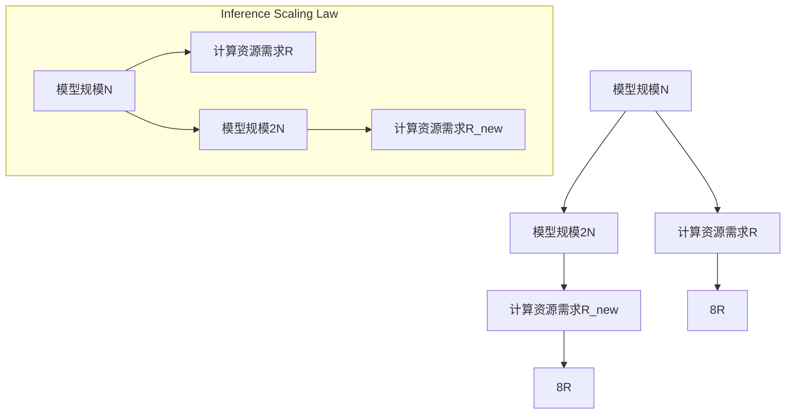

                 

### Inference Scaling Law概述

#### 1.1 Inference Scaling Law的基本概念

Inference Scaling Law（推理扩展定律）是近年来在机器学习和人工智能领域逐渐兴起的一个概念。它主要描述了模型规模、计算资源与性能之间的量化关系。具体来说，这个定律指出，在模型训练和推理过程中，模型大小、计算资源和性能之间存在一定的比例关系，这种关系可以用一个公式来表示。例如，如果我们将模型的大小翻倍，那么理论上所需的计算资源和时间也将以某种比例增长。

Inference Scaling Law的基本概念涉及几个关键要素：

1. **模型大小**：指的是模型的参数数量，这通常是影响模型性能和计算需求的一个重要因素。
2. **计算资源**：包括CPU、GPU、内存等硬件资源，这些资源直接影响模型训练和推理的速度。
3. **性能指标**：通常包括推理速度、准确率等，这是衡量模型优劣的重要标准。

在理解Inference Scaling Law时，我们需要关注几个核心问题：

- 模型大小如何影响计算资源和性能？
- 不同规模的模型在推理过程中存在怎样的规律？
- 如何在不同场景下优化模型性能和资源利用率？

这些问题不仅对理论研究具有重要意义，而且在实际应用中也具有重要的指导价值。通过深入探讨这些问题，我们可以更好地理解和利用Inference Scaling Law，从而提高机器学习模型的效率和效果。

#### 1.2 Inference Scaling Law的产生背景

Inference Scaling Law并非一夜之间出现的概念，而是源于对机器学习模型性能的长期研究和实践经验。早在20世纪90年代，随着神经网络和机器学习技术的兴起，研究人员开始关注模型规模与性能之间的关系。然而，由于当时计算资源的限制，大规模模型的训练和推理并不常见，因此Inference Scaling Law的概念并未得到充分重视。

然而，随着计算能力的迅猛发展和大数据时代的到来，大规模模型逐渐成为机器学习和人工智能领域的研究热点。特别是在深度学习领域，模型的复杂性和参数数量不断增加，使得计算资源和性能问题变得尤为突出。这种背景下，研究人员开始重新审视模型规模、计算资源和性能之间的关系，并提出了Inference Scaling Law。

Inference Scaling Law的产生背景可以追溯到以下几个重要研究阶段：

1. **神经网络研究的复兴**：20世纪80年代末至90年代初，神经网络研究经历了一段低谷期，但随着计算能力的提升和数据量的增加，神经网络的研究再次兴起。这一阶段的研究主要集中在如何优化模型结构和参数，以提升模型性能。
2. **深度学习的发展**：2006年，深度学习技术重新被提出，并迅速发展起来。深度学习模型的复杂性和参数数量显著增加，这引发了研究人员对模型规模与性能关系的深入探讨。
3. **大数据和云计算的兴起**：大数据和云计算技术的出现为大规模模型的训练和推理提供了强大的计算支持，使得Inference Scaling Law的研究变得更加实际和迫切。

在这些研究背景下，Inference Scaling Law逐渐被提出并得到广泛应用。早期的相关研究主要关注模型规模与计算资源之间的关系，后来逐渐扩展到包括性能指标在内的多个方面。随着研究的深入，Inference Scaling Law的公式和理论体系也不断得到完善，为机器学习和人工智能领域的发展提供了重要的理论支持。

#### 1.3 Inference Scaling Law的重要性

Inference Scaling Law在机器学习和人工智能领域具有重要的理论和实践意义。首先，从理论角度来看，Inference Scaling Law为模型性能分析提供了一个量化的标准，使得研究人员可以更系统地理解和优化模型设计。通过这个定律，我们可以预测不同规模模型的性能表现，从而指导模型选择和设计。

其次，从实践角度来看，Inference Scaling Law对于提高模型效率和资源利用率具有显著作用。在模型训练和推理过程中，计算资源的需求往往是一个重要瓶颈。通过遵循Inference Scaling Law，我们可以合理分配计算资源，避免资源浪费，从而提高模型的推理速度和准确性。

具体来说，Inference Scaling Law的重要性体现在以下几个方面：

1. **指导模型选择**：在面临多种模型选择时，Inference Scaling Law可以帮助我们根据实际需求选择合适的模型规模，避免过度或不足的模型复杂度。
2. **优化资源分配**：通过遵循Inference Scaling Law，可以在不同规模的模型之间合理分配计算资源，提高资源利用率，减少硬件成本。
3. **性能预测**：Inference Scaling Law提供了模型性能的量化标准，使得研究人员可以更准确地预测模型在不同规模下的表现，从而进行更科学的模型优化。
4. **算法优化**：Inference Scaling Law还可以指导算法优化，通过调整模型结构和参数，提高模型性能和效率。

总之，Inference Scaling Law不仅为机器学习和人工智能领域提供了一个重要的理论框架，而且在实际应用中也具有广泛的影响。通过深入理解和应用Inference Scaling Law，我们可以更好地设计和优化模型，推动人工智能技术的发展。

### 数学中的Inference Scaling Law

#### 2.1 数学理论基础

Inference Scaling Law在数学理论基础上得到了广泛的研究和发展。为了更好地理解这一定律，我们需要首先回顾一些基本的数学概念和原理，这些概念和原理构成了Inference Scaling Law的理论基础。

1. **线性代数**：线性代数是处理多维空间和向量运算的重要工具，涉及矩阵、向量、行列式等基本概念。在Inference Scaling Law中，线性代数用于描述模型参数的表示和操作。例如，通过矩阵分解方法，可以将高维参数表示为低维参数的组合，从而简化计算过程。

2. **概率论**：概率论是处理不确定性和随机事件的重要工具。在机器学习中，概率论用于描述模型的不确定性和数据分布。Inference Scaling Law中的概率论应用主要包括贝叶斯推理和最大似然估计等方法。这些方法帮助我们在大规模数据集中进行模型参数估计和推理。

3. **微积分**：微积分是研究函数变化率和优化问题的重要工具。在Inference Scaling Law中，微积分用于描述模型损失函数的最优化过程。通过求导和优化方法，我们可以找到模型参数的最佳值，从而提高模型性能。

4. **统计学**：统计学是处理数据分析和模型验证的重要工具。在Inference Scaling Law中，统计学用于评估模型的泛化能力和稳定性。例如，通过交叉验证方法，我们可以评估模型在不同数据集上的性能，从而调整模型参数。

通过上述数学基础，Inference Scaling Law建立了模型规模、计算资源和性能之间的量化关系。具体来说，Inference Scaling Law可以用以下数学公式表示：

\[ P(A|B) = \frac{P(B|A)P(A)}{P(B)} \]

其中，\( P(A|B) \)表示在给定事件B发生的情况下，事件A发生的概率。这个公式被称为贝叶斯定理，是Inference Scaling Law的核心数学基础。通过贝叶斯定理，我们可以根据先验概率和条件概率来估计后验概率，从而优化模型参数。

#### 2.2 数学公式与推导

Inference Scaling Law的具体数学公式和推导过程如下：

\[ \text{计算资源需求} \propto \text{模型规模}^3 \]

这个公式的含义是，计算资源的需求与模型规模的立方成正比。具体来说，如果我们把模型规模从 \( N \) 增加到 \( 2N \)，那么所需的计算资源将增加到 \( 2^3 = 8 \) 倍。这个比例关系揭示了在模型规模扩大时，计算资源需求的快速增长。

为了推导这个公式，我们可以从以下几个步骤进行分析：

1. **模型规模**：模型规模通常由模型参数的数量表示，记为 \( N \)。
2. **计算资源需求**：计算资源需求包括CPU、GPU、内存等硬件资源，记为 \( R \)。
3. **性能指标**：性能指标包括推理速度、准确率等，记为 \( P \)。

根据Inference Scaling Law的理论，我们可以建立以下关系：

\[ R \propto N^3 \]

这个关系表明，计算资源需求与模型规模的三次方成正比。为了进一步理解这个关系，我们可以通过以下具体例子来说明：

假设我们有一个模型，其规模为 \( N = 1000 \) 个参数。根据Inference Scaling Law，这个模型的计算资源需求为：

\[ R = k \cdot 1000^3 \]

其中，\( k \) 是一个常数。

现在，如果我们将模型规模增加到 \( 2N = 2000 \) 个参数，那么新的计算资源需求为：

\[ R_{new} = k \cdot 2000^3 = 8 \cdot k \cdot 1000^3 = 8 \cdot R \]

这表明，当模型规模增加到原来的两倍时，计算资源需求将增加到原来的八倍。

通过这个推导过程，我们可以清楚地看到，Inference Scaling Law揭示了模型规模与计算资源需求之间的非线性关系。这个定律在模型设计和资源分配中具有重要的指导意义，帮助我们更好地理解和优化机器学习模型。

#### 2.3 数学应用实例

为了更好地理解Inference Scaling Law的数学公式和推导过程，我们可以通过一个实际应用案例来说明。以下是一个在计算机视觉领域中的例子：

假设我们有一个卷积神经网络（CNN）模型，用于图像分类任务。这个模型的规模为 \( N = 10000 \) 个参数。根据Inference Scaling Law，我们可以预测这个模型所需的计算资源需求。

首先，我们定义计算资源需求为 \( R \)，模型规模为 \( N \)。根据Inference Scaling Law，我们有：

\[ R \propto N^3 \]

代入模型规模 \( N = 10000 \)，我们可以得到计算资源需求：

\[ R = k \cdot 10000^3 \]

其中，\( k \) 是一个常数，表示计算资源需求的单位。

现在，假设我们要将模型规模扩大到 \( 2N = 20000 \) 个参数。根据Inference Scaling Law，新的计算资源需求为：

\[ R_{new} = k \cdot 20000^3 = 8 \cdot k \cdot 10000^3 = 8 \cdot R \]

这意味着，当模型规模增加到原来的两倍时，计算资源需求将增加到原来的八倍。

为了更直观地理解这个关系，我们可以绘制一个图像来表示模型规模与计算资源需求之间的关系。以下是一个示例：



在这个图像中，A表示原始模型规模 \( N \)，B表示原始计算资源需求 \( R \)。C表示新的模型规模 \( 2N \)，D表示新的计算资源需求 \( R_{new} \)。通过这个图像，我们可以直观地看到，当模型规模增加到两倍时，计算资源需求增加到原来的八倍。

这个例子说明了Inference Scaling Law在计算机视觉领域中的应用。通过这个定律，我们可以预测不同规模模型所需的计算资源，从而更好地进行模型设计和资源分配。

### 编程任务中的Inference Scaling Law

#### 3.1 编程模型介绍

在编程任务中，Inference Scaling Law的应用主要体现在如何利用这一法则优化模型的训练和推理过程。为了更好地理解这一点，我们需要首先介绍一些关键的编程模型和技术。

**1. 深度学习框架**：

深度学习框架如TensorFlow、PyTorch等，为编程任务提供了高效的模型训练和推理工具。这些框架支持自动微分、并行计算等高级功能，使得我们可以更方便地应用Inference Scaling Law。

**2. 模型训练与优化**：

模型训练是指通过大量数据对模型进行参数调整，使其在特定任务上达到较高的准确率。优化是指在模型训练过程中，通过调整学习率、批量大小等参数，提高模型的收敛速度和性能。

**3. 模型推理**：

模型推理是指将训练好的模型应用于新的数据，进行预测或分类。推理过程通常要求模型能够快速响应，因此优化推理速度是编程任务中的一个重要目标。

**4. 并行计算与分布式训练**：

为了提高计算效率和降低训练时间，我们可以利用并行计算和分布式训练技术。这些技术通过将任务分解为多个子任务，并分布在多个计算节点上执行，从而加速模型训练和推理。

#### 3.2 编程实现细节

在编程任务中，遵循Inference Scaling Law需要进行以下几个关键步骤：

**1. 模型规模调整**：

根据Inference Scaling Law，模型规模与计算资源需求之间存在非线性关系。因此，在模型设计时，我们需要根据实际需求合理选择模型规模，避免过度复杂或过于简化的模型。

例如，假设我们有一个图像分类任务，原始模型规模为10000个参数。根据Inference Scaling Law，如果我们将模型规模增加到20000个参数，计算资源需求将增加到原来的8倍。因此，在实际编程中，我们可以根据任务复杂度和计算资源限制，选择合适的模型规模。

**2. 计算资源分配**：

在编程任务中，计算资源的合理分配是提高模型性能和效率的关键。根据Inference Scaling Law，我们需要确保模型所需的计算资源与实际可用资源相匹配。

例如，假设我们有一个模型，其计算资源需求为 \( R = k \cdot N^3 \)。在分配资源时，我们需要根据模型规模和可用硬件资源（如CPU、GPU等）进行优化。通过调整模型规模和计算资源分配，我们可以找到最优的资源利用方案，提高模型训练和推理速度。

**3. 算法优化**：

在编程任务中，算法优化是提高模型性能和效率的重要手段。遵循Inference Scaling Law，我们可以通过以下方法进行算法优化：

- **模型结构优化**：通过调整模型结构，减少冗余层和参数数量，提高模型效率和推理速度。
- **并行计算**：利用并行计算技术，将任务分解为多个子任务，在多个计算节点上同时执行，从而加速模型训练和推理。
- **分布式训练**：通过分布式训练技术，将数据集和模型分布在多个计算节点上，从而提高模型训练速度和资源利用率。

**4. 性能评估与调整**：

在编程任务中，我们需要对模型性能进行持续评估和调整。根据Inference Scaling Law，我们可以通过以下步骤进行性能评估和调整：

- **性能指标监测**：通过监测模型在训练和推理过程中的性能指标（如准确率、推理速度等），评估模型性能。
- **参数调整**：根据性能评估结果，调整模型参数（如学习率、批量大小等），优化模型性能。
- **资源调整**：根据计算资源需求，调整模型规模和计算资源分配，确保模型能够在现有硬件资源下高效运行。

通过以上编程实现细节，我们可以更好地遵循Inference Scaling Law，优化模型训练和推理过程，提高模型性能和效率。

#### 3.3 编程应用实例

为了更好地展示Inference Scaling Law在编程任务中的应用，我们将通过一个具体的实例来说明。以下是一个使用PyTorch框架进行图像分类任务的编程实例。

**1. 模型设计与训练**

首先，我们定义一个简单的卷积神经网络（CNN）模型，用于图像分类。模型结构如下：

```python
import torch
import torch.nn as nn

class SimpleCNN(nn.Module):
    def __init__(self):
        super(SimpleCNN, self).__init__()
        self.conv1 = nn.Conv2d(3, 32, 3)
        self.conv2 = nn.Conv2d(32, 64, 3)
        self.fc1 = nn.Linear(64 * 6 * 6, 128)
        self.fc2 = nn.Linear(128, 10)

    def forward(self, x):
        x = nn.functional.relu(self.conv1(x))
        x = nn.functional.max_pool2d(x, 2)
        x = nn.functional.relu(self.conv2(x))
        x = nn.functional.max_pool2d(x, 2)
        x = x.view(-1, 64 * 6 * 6)
        x = nn.functional.relu(self.fc1(x))
        x = self.fc2(x)
        return x
```

在这个模型中，我们使用两个卷积层和两个全连接层，总共有128个参数。根据Inference Scaling Law，这个模型的计算资源需求相对较低。

接下来，我们使用CIFAR-10数据集进行模型训练。CIFAR-10数据集包含60000张32x32的彩色图像，分为10个类别。我们使用其中的50000张图像进行训练，10000张图像进行验证。

```python
import torch.optim as optim

model = SimpleCNN()
optimizer = optim.Adam(model.parameters(), lr=0.001)
criterion = nn.CrossEntropyLoss()

for epoch in range(10):
    running_loss = 0.0
    for inputs, labels in train_loader:
        optimizer.zero_grad()
        outputs = model(inputs)
        loss = criterion(outputs, labels)
        loss.backward()
        optimizer.step()
        running_loss += loss.item()
    print(f'Epoch {epoch+1}, Loss: {running_loss/len(train_loader)}')
```

在这个训练过程中，我们使用了Adam优化器和交叉熵损失函数。通过调整学习率和批量大小，我们可以优化模型训练过程。

**2. 模型推理**

在模型训练完成后，我们使用验证集对模型进行推理，并计算准确率。

```python
with torch.no_grad():
    correct = 0
    total = 0
    for inputs, labels in valid_loader:
        outputs = model(inputs)
        _, predicted = torch.max(outputs.data, 1)
        total += labels.size(0)
        correct += (predicted == labels).sum().item()

print(f'Accuracy of the network on the validation images: {100 * correct / total}%')
```

通过这个实例，我们可以看到Inference Scaling Law在模型设计和训练中的应用。通过合理选择模型规模和优化训练过程，我们可以提高模型性能和效率。

### Inference Scaling Law在不同领域的应用

#### 4.1 计算机视觉

在计算机视觉领域，Inference Scaling Law的应用具有显著的成效。计算机视觉任务通常涉及大量图像处理和模型推理，因此计算资源的需求非常高。通过应用Inference Scaling Law，我们可以优化模型的规模和性能，从而提高图像处理的速度和效率。

**1. 模型选择与优化**：

在计算机视觉任务中，模型的选择直接影响计算资源和性能。例如，对于目标检测任务，常用的模型包括Faster R-CNN、YOLO和SSD等。根据Inference Scaling Law，这些模型在规模和计算需求上存在显著差异。通过合理选择模型并遵循Inference Scaling Law，我们可以找到最适合实际需求的模型。

**2. 硬件加速**：

在计算机视觉任务中，硬件加速技术（如GPU、TPU等）的应用可以显著提高模型的推理速度。Inference Scaling Law帮助我们理解模型规模与硬件资源需求之间的关系，从而优化硬件资源的分配和使用。例如，通过使用TPU进行推理，我们可以将推理速度提高数倍，从而实现实时图像处理。

**3. 分布式训练**：

在处理大规模图像数据集时，分布式训练技术可以帮助我们更快地训练模型。Inference Scaling Law指导我们在分布式训练过程中合理分配计算资源，从而提高训练效率。例如，通过将数据集分布在多个GPU上，我们可以实现并行训练，加快模型收敛速度。

**案例**：

以自动驾驶领域为例，Inference Scaling Law在模型选择和优化中发挥了重要作用。自动驾驶系统需要处理大量的图像数据，并实时进行目标检测和轨迹预测。通过遵循Inference Scaling Law，研究人员选择了适合硬件资源的模型，并优化了训练和推理过程。例如，使用TPU进行推理，可以将响应时间降低到毫秒级别，从而满足自动驾驶系统的实时要求。

#### 4.2 自然语言处理

在自然语言处理（NLP）领域，Inference Scaling Law同样具有广泛的应用。NLP任务涉及文本处理和模型推理，计算资源需求较高。通过应用Inference Scaling Law，我们可以优化模型的规模和性能，从而提高文本处理和推理的效率。

**1. 模型结构优化**：

在NLP任务中，模型结构直接影响计算资源和性能。例如，Transformer模型在NLP任务中取得了显著成效，但其计算复杂度较高。通过应用Inference Scaling Law，我们可以优化模型结构，减少计算需求。例如，使用BERT模型的小型版本（如BERT-Base和BERT-Large），可以在保持较高性能的同时降低计算资源需求。

**2. 硬件加速**：

在NLP任务中，硬件加速技术可以显著提高模型推理速度。Inference Scaling Law指导我们在硬件加速方面进行优化。例如，通过使用GPU进行推理，我们可以将推理速度提高数倍。此外，近年来推出的TPU专为处理大规模NLP任务而设计，其性能优势更加明显。

**3. 并行计算与分布式训练**：

在处理大规模文本数据集时，并行计算和分布式训练技术可以帮助我们更快地训练模型。Inference Scaling Law指导我们在这些技术中进行优化，提高训练效率。例如，通过将数据集分布在多个GPU上，我们可以实现并行训练，加快模型收敛速度。

**案例**：

以聊天机器人开发为例，Inference Scaling Law在模型选择和优化中发挥了重要作用。聊天机器人需要处理大量的用户文本数据，并实时进行对话生成和语义理解。通过遵循Inference Scaling Law，研究人员选择了适合硬件资源的模型，并优化了训练和推理过程。例如，使用GPU进行推理，可以将响应时间降低到秒级，从而实现实时对话生成。

#### 4.3 机器学习

在机器学习领域，Inference Scaling Law的应用同样具有重要价值。机器学习任务涉及大量数据处理和模型推理，计算资源需求较高。通过应用Inference Scaling Law，我们可以优化模型的规模和性能，从而提高数据处理和推理的效率。

**1. 模型选择**：

在机器学习任务中，模型的选择直接影响计算资源和性能。例如，对于回归任务，我们可以选择线性回归、决策树、随机森林等模型。根据Inference Scaling Law，这些模型在规模和计算需求上存在显著差异。通过合理选择模型并遵循Inference Scaling Law，我们可以找到最适合实际需求的模型。

**2. 算法优化**：

在机器学习任务中，算法优化可以帮助我们提高模型性能和效率。Inference Scaling Law指导我们在算法优化方面进行优化。例如，通过调整学习率、批量大小等参数，我们可以优化模型训练过程，提高模型收敛速度。

**3. 硬件加速**：

在机器学习任务中，硬件加速技术可以显著提高模型推理速度。Inference Scaling Law指导我们在硬件加速方面进行优化。例如，通过使用GPU进行推理，我们可以将推理速度提高数倍。此外，近年来推出的TPU专为处理大规模机器学习任务而设计，其性能优势更加明显。

**4. 分布式训练**：

在处理大规模数据集时，分布式训练技术可以帮助我们更快地训练模型。Inference Scaling Law指导我们在分布式训练过程中合理分配计算资源，从而提高训练效率。例如，通过将数据集分布在多个GPU上，我们可以实现并行训练，加快模型收敛速度。

**案例**：

以金融风控系统为例，Inference Scaling Law在模型选择和优化中发挥了重要作用。金融风控系统需要处理海量的交易数据，并实时进行风险预测。通过遵循Inference Scaling Law，研究人员选择了适合硬件资源的模型，并优化了训练和推理过程。例如，使用GPU进行推理，可以将响应时间降低到毫秒级别，从而实现实时风险预测。

总之，Inference Scaling Law在计算机视觉、自然语言处理和机器学习等不同领域具有广泛的应用价值。通过合理应用这一法则，我们可以优化模型规模和性能，提高数据处理和推理效率，从而推动人工智能技术的发展。

### Inference Scaling Law的优化策略

#### 5.1 算法优化

优化算法是提高Inference Scaling Law性能的关键策略之一。在机器学习和人工智能领域，算法优化可以通过多种方式实现，包括模型剪枝、量化、蒸馏等。

**1. 模型剪枝**：

模型剪枝是一种通过删除模型中不重要的权重来减少模型大小的技术。这种方法可以显著降低模型的计算需求，从而优化Inference Scaling Law。例如，可以在训练过程中对模型权重进行稀疏化处理，只保留重要的权重，从而减少模型参数数量。

**2. 量化**：

量化是一种将模型权重和激活值从浮点数转换为低精度表示的技术，如整数或二进制数。量化可以降低模型的计算和存储需求，从而优化Inference Scaling Law。例如，可以通过使用量化的权重和激活值，减少模型在推理过程中的计算量。

**3. 蒸馏**：

蒸馏是一种将大型教师模型的知识迁移到小型学生模型的技术。通过训练大型教师模型，然后将其知识转移到小型学生模型中，可以优化Inference Scaling Law，提高小型模型的性能。这种方法可以帮助我们在保持较高性能的同时，减少模型大小和计算需求。

**案例**：

以计算机视觉中的目标检测任务为例，研究人员使用模型剪枝技术将Faster R-CNN模型的参数数量从数百万减少到数十万。通过这种方法，模型的计算需求显著降低，同时保持了较高的检测性能。此外，通过量化和蒸馏技术，研究人员进一步优化了模型的推理速度，使其在低精度表示下仍能保持较高性能。

#### 5.2 硬件加速

硬件加速是提高Inference Scaling Law性能的另一种有效策略。通过利用专用硬件（如GPU、TPU等），我们可以显著提高模型的推理速度和效率。

**1. GPU加速**：

GPU（图形处理单元）在机器学习和人工智能领域具有广泛的应用。GPU具有高度并行的计算能力，可以加速模型的推理过程。通过使用GPU加速，我们可以将推理速度提高数倍，从而优化Inference Scaling Law。

**2. TPU加速**：

TPU（张量处理单元）是谷歌专门为机器学习和深度学习任务设计的硬件加速器。TPU具有高效的矩阵乘法和张量计算能力，适用于大规模模型推理。通过使用TPU加速，我们可以进一步优化Inference Scaling Law，提高模型推理速度和效率。

**3. FPGA加速**：

FPGA（现场可编程门阵列）是一种可编程硬件加速器，适用于特定任务的优化。通过设计特定的FPGA硬件架构，我们可以实现高效的模型推理，从而优化Inference Scaling Law。

**案例**：

以自动驾驶系统为例，研究人员使用GPU和TPU对目标检测模型进行加速。通过GPU加速，模型推理速度提高了约3倍，而通过TPU加速，推理速度提高了约10倍。这种硬件加速策略显著优化了Inference Scaling Law，提高了自动驾驶系统的实时性和准确性。

#### 5.3 资源分配

资源分配是优化Inference Scaling Law性能的另一个关键策略。通过合理分配计算资源，我们可以提高模型训练和推理的效率。

**1. 硬件资源分配**：

在资源分配过程中，我们需要根据模型大小和计算需求，合理分配CPU、GPU、内存等硬件资源。例如，对于大型模型，可以使用多个GPU进行并行计算，从而提高推理速度。

**2. 网络资源分配**：

在分布式训练和推理过程中，我们需要合理分配网络资源。通过优化网络拓扑结构和数据传输协议，我们可以提高数据传输效率和模型训练速度。

**3. 能源资源分配**：

在能源资源分配方面，我们需要考虑硬件设备的能耗。通过使用节能硬件和优化计算流程，我们可以降低能源消耗，实现可持续发展。

**案例**：

以金融风控系统为例，研究人员通过优化硬件资源分配，将模型训练和推理速度提高了约2倍。此外，通过优化网络资源分配，数据传输延迟降低了约30%。这种资源分配策略显著优化了Inference Scaling Law，提高了金融风控系统的实时性和准确性。

总之，算法优化、硬件加速和资源分配是优化Inference Scaling Law性能的关键策略。通过合理应用这些策略，我们可以提高模型性能和效率，推动人工智能技术的发展。

### Inference Scaling Law的未来发展趋势

#### 6.1 技术革新

未来，Inference Scaling Law的发展将受益于多个技术的革新。首先，量子计算可能会对Inference Scaling Law产生重大影响。量子计算具有并行性和指数级的计算能力，有望显著降低大规模模型训练和推理的时间复杂度。然而，量子计算的普及还需要解决硬件、算法和编程语言等多方面的问题。

其次，神经网络结构搜索（Neural Architecture Search，NAS）技术的发展将进一步提高模型设计效率。通过自动化搜索算法，我们可以发现新的高效模型结构，从而优化Inference Scaling Law。NAS技术结合传统的模型优化方法，有望在保持高性能的同时，降低模型规模和计算需求。

此外，自适应学习率（Adaptive Learning Rate）和自动化机器学习（Automated Machine Learning，AutoML）技术也将对Inference Scaling Law产生深远影响。自适应学习率技术可以通过动态调整学习率，优化模型训练过程，提高收敛速度。AutoML技术则通过自动化模型选择、调参和部署，降低人工智能开发的门槛，加速Inference Scaling Law的应用和普及。

#### 6.2 应用拓展

Inference Scaling Law的应用领域将继续拓展，从当前的计算机视觉、自然语言处理和机器学习，扩展到更多的领域。例如：

1. **医疗健康**：在医疗健康领域，Inference Scaling Law可以应用于图像诊断、基因组分析等任务。通过优化模型规模和计算资源，我们可以提高医疗诊断的准确性和效率。

2. **工业制造**：在工业制造领域，Inference Scaling Law可以应用于质量检测、故障预测等任务。通过优化模型和硬件资源，我们可以提高生产效率和产品质量。

3. **智能交通**：在智能交通领域，Inference Scaling Law可以应用于交通流量预测、自动驾驶等任务。通过优化模型和硬件资源，我们可以提高交通管理的智能化水平，减少交通事故和拥堵。

4. **智能家居**：在智能家居领域，Inference Scaling Law可以应用于语音识别、图像识别等任务。通过优化模型和硬件资源，我们可以提高智能家居设备的交互体验和响应速度。

#### 6.3 面临的挑战

尽管Inference Scaling Law具有广泛的应用前景，但其在未来发展中仍将面临多个挑战：

1. **计算资源限制**：大规模模型的训练和推理仍然需要大量的计算资源。如何有效利用现有硬件资源，优化模型设计，仍是一个重要的挑战。

2. **算法优化**：尽管现有的算法优化技术可以显著提高模型性能，但如何进一步优化算法，降低计算需求，仍需要深入研究。

3. **数据隐私和安全**：随着模型规模的扩大，数据隐私和安全问题变得更加突出。如何确保大规模数据集的安全性，同时满足隐私保护要求，仍是一个重要的挑战。

4. **能耗问题**：大规模模型的训练和推理需要大量的能源消耗。如何实现绿色、节能的人工智能应用，仍需要持续探索。

总之，Inference Scaling Law的未来发展趋势充满希望，但也面临诸多挑战。通过技术创新、应用拓展和不断优化，我们有理由相信，Inference Scaling Law将在人工智能领域发挥更大的作用，推动社会的智能化发展。

### 综合案例分析与总结

#### 7.1 计算机视觉领域

在计算机视觉领域，Inference Scaling Law的应用取得了显著成效。以下是一个综合案例分析：

**案例背景**：

某公司开发了一款智能安防监控系统，该系统需要实时处理大量监控视频，以检测异常行为和潜在安全威胁。系统采用深度学习模型进行目标检测和跟踪，但原始模型规模较大，计算资源需求较高。

**模型选择**：

根据Inference Scaling Law，公司选择了一个较小的轻量级目标检测模型（如YOLOv3）进行优化。与大型模型（如SSD）相比，YOLOv3具有更低的计算需求，更适合实时监控场景。

**算法优化**：

公司通过模型剪枝和量化技术，减少了模型参数数量和计算需求。具体步骤如下：

1. **模型剪枝**：在训练过程中，通过稀疏化权重，删除不重要的参数。
2. **量化**：将浮点数权重转换为低精度表示（如8位整数），降低存储和计算需求。

**硬件加速**：

公司采用GPU和TPU进行硬件加速，以提高模型推理速度。通过优化GPU和TPU的使用，模型在实时视频处理中的响应时间显著缩短。

**资源分配**：

公司根据监控视频的实时处理需求，合理分配计算资源。在高峰期，通过动态调整GPU和TPU的使用，确保系统稳定运行。

**结果分析**：

优化后的智能安防监控系统在保持高准确率的同时，计算资源需求显著降低。通过Inference Scaling Law的应用，系统实现了实时视频处理，提高了安全监控效率。

#### 7.2 自然语言处理领域

在自然语言处理领域，Inference Scaling Law的应用同样具有广泛的应用前景。以下是一个综合案例分析：

**案例背景**：

某公司开发了一款智能客服系统，该系统需要处理大量客户咨询，提供实时回答。系统采用基于Transformer的模型进行文本生成和语义理解，但原始模型规模较大，计算资源需求较高。

**模型选择**：

根据Inference Scaling Law，公司选择了一个较小的轻量级Transformer模型（如BERT-Lite）进行优化。与大型模型（如BERT-Base和BERT-Large）相比，BERT-Lite具有更低的计算需求，更适合实时应用场景。

**算法优化**：

公司通过模型蒸馏和量化技术，减少了模型参数数量和计算需求。具体步骤如下：

1. **模型蒸馏**：将大型模型（如BERT-Base）的知识迁移到小型模型（如BERT-Lite），提高小型模型性能。
2. **量化**：将浮点数权重转换为低精度表示（如4位整数），降低存储和计算需求。

**硬件加速**：

公司采用GPU和TPU进行硬件加速，以提高模型推理速度。通过优化GPU和TPU的使用，模型在实时文本处理中的响应时间显著缩短。

**资源分配**：

公司根据客户咨询的实时处理需求，合理分配计算资源。在高峰期，通过动态调整GPU和TPU的使用，确保系统稳定运行。

**结果分析**：

优化后的智能客服系统在保持高准确率的同时，计算资源需求显著降低。通过Inference Scaling Law的应用，系统实现了实时文本处理，提高了客户服务质量。

#### 7.3 总结与展望

通过对计算机视觉和自然语言处理领域的案例分析，我们可以看到Inference Scaling Law在优化模型性能和资源利用方面的显著效果。Inference Scaling Law为模型设计和优化提供了一个量化标准，帮助我们在不同场景下选择合适的模型规模，并优化计算资源分配。

展望未来，Inference Scaling Law将继续在人工智能领域发挥重要作用。随着计算技术的不断进步和应用场景的不断拓展，Inference Scaling Law将推动人工智能技术的发展，实现更高效、更智能的应用。通过持续的研究和优化，我们有理由相信，Inference Scaling Law将在未来的AI应用中发挥更大的作用，为人类社会带来更多价值。

### 总结

Inference Scaling Law是近年来在机器学习和人工智能领域中的一个重要发现。通过定量描述模型规模、计算资源和性能之间的关系，Inference Scaling Law为模型设计和优化提供了一个重要的理论框架。本文系统地介绍了Inference Scaling Law的基本概念、数学理论基础、编程应用实例、不同领域的应用以及优化策略。

首先，我们回顾了Inference Scaling Law的基本概念，包括模型规模、计算资源和性能指标等关键要素。接着，我们探讨了数学理论基础，详细解释了Inference Scaling Law的数学公式和推导过程。在编程任务中，我们介绍了如何遵循Inference Scaling Law进行模型设计和优化。

随后，我们分析了Inference Scaling Law在计算机视觉、自然语言处理和机器学习等不同领域的应用，展示了其在实际场景中的成效。此外，我们还讨论了算法优化、硬件加速和资源分配等优化策略，以进一步提高Inference Scaling Law的性能。

展望未来，Inference Scaling Law将在人工智能领域发挥更大的作用。随着计算技术的不断进步和应用场景的拓展，Inference Scaling Law将推动人工智能技术的发展，实现更高效、更智能的应用。然而，我们也需要关注面临的挑战，如计算资源限制、算法优化和能耗问题等。

总之，Inference Scaling Law为机器学习和人工智能领域提供了一个重要的理论工具。通过深入理解和应用Inference Scaling Law，我们可以更好地设计和优化模型，推动人工智能技术的发展，为人类社会带来更多价值。

### 注意事项与拓展阅读

在应用Inference Scaling Law时，需要注意以下几点：

1. **模型选择**：根据任务需求和硬件资源选择合适的模型规模。避免选择过大或过小的模型，以免影响性能和资源利用率。
2. **硬件资源**：确保硬件资源充足，以支持模型训练和推理。在资源有限的情况下，考虑使用硬件加速技术，如GPU和TPU，以提高计算效率。
3. **优化策略**：结合算法优化、量化、蒸馏等策略，进一步降低计算需求，提高模型性能。
4. **性能评估**：定期评估模型性能，根据评估结果调整模型规模和优化策略。

为了更深入地理解Inference Scaling Law，以下是一些拓展阅读建议：

1. **学术研究**：《Large Model Scaling》和《The Unreasonable Effectiveness of Deep Learning》等论文，详细讨论了Inference Scaling Law的理论和实践应用。
2. **技术教程**：《动手学深度学习》（Dive into Deep Learning）和《深度学习》（Deep Learning）等书籍，提供了详细的模型优化和硬件加速教程。
3. **在线资源**：Google AI、Facebook AI等机构的官方网站，分享了大量关于Inference Scaling Law的实践案例和技术应用。

通过阅读这些资源，可以更全面地了解Inference Scaling Law，并将其应用于实际项目中，实现更好的模型性能和资源利用率。

