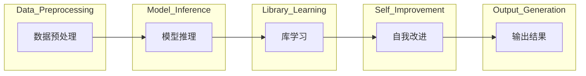
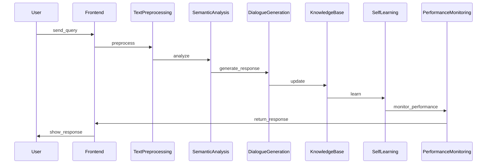
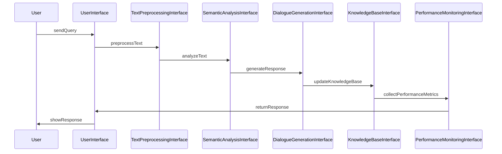
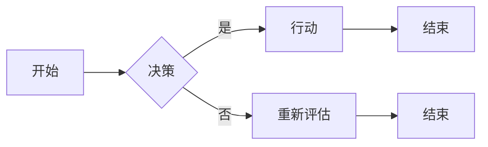
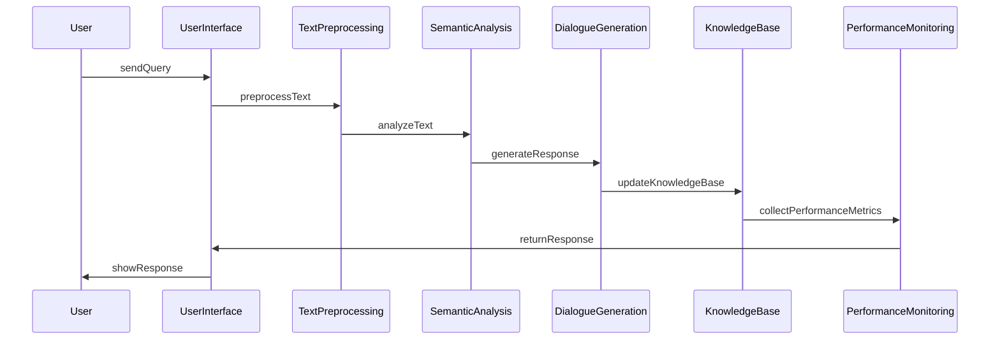

                 

### 第1章: LLM代理的概念与背景

#### 1.1.1 LLM代理的定义与作用

LLM代理（Large Language Model Agent）是一种利用大型语言模型（LLM）进行自主学习和决策的智能体。它通过预训练的LLM模型，结合特定的库学习机制，能够在不同的应用场景中持续学习和改进，以提供更准确、高效的决策支持。LLM代理的核心作用在于其强大的语言理解和生成能力，这使得它们在自然语言处理（NLP）领域具有广泛的应用前景。

#### 1.1.2 LLM代理的发展历程

LLM代理的发展历程可以追溯到大型语言模型的兴起。早期的语言模型如基于规则的方法和统计方法，难以应对复杂的语言理解和生成任务。随着深度学习的进展，特别是基于变换器（Transformer）架构的预训练模型如GPT系列的出现，LLM模型的能力得到了极大的提升。LLM代理的概念在此背景下逐渐成熟，并得到了广泛的研究和应用。

#### 1.1.3 LLM代理的应用领域

LLM代理在多个领域展现出了强大的应用潜力：

1. **智能客服**：LLM代理可以模拟人类客服，提供24/7的客户服务，处理用户咨询、投诉和问题解答。
2. **文本生成**：LLM代理可以生成高质量的文本，包括新闻报道、文章、故事、对话等，广泛应用于内容创作和个性化推荐。
3. **问答系统**：LLM代理可以构建智能问答系统，通过自然语言交互，提供准确、全面的信息查询服务。
4. **虚拟助手**：LLM代理可以作为个人或企业的虚拟助手，协助处理日常任务、管理日程、提供信息查询等。
5. **教育辅助**：LLM代理可以辅助教育，提供个性化的学习建议、解答学生疑问，甚至进行智能辅导。

#### 1.1.4 问题描述

当前，LLM代理在实际应用中面临一些挑战，主要包括：

1. **库学习机制的效率问题**：如何在大量数据中高效地学习，提高模型性能是一个重要课题。
2. **持续自我改进能力**：如何让LLM代理在应用过程中不断学习和优化，以适应不断变化的环境和任务。
3. **安全性和隐私保护**：如何在保障用户隐私的前提下，确保LLM代理的安全性和可靠性。

#### 1.1.5 问题解决

本书将通过以下章节来深入探讨LLM代理的库学习机制及其持续自我改进能力：

- **第2章**：介绍LLM代理的核心概念，包括LLM代理、库学习机制和持续自我改进能力。
- **第3章**：讲解LLM代理算法原理，通过Mermaid流程图、Python源代码和数学模型进行详细阐述。
- **第4章**：讨论深度学习基础与优化技巧，为理解LLM代理的算法提供理论基础。
- **第5章**：分析LLM代理系统架构设计，包括系统功能、架构、接口和交互设计。
- **第6章**：通过项目实战，展示LLM代理的实际应用效果，并进行详细剖析。

#### 1.1.6 边界与外延

本书主要讨论以下范围：

- **LLM代理的定义与功能**：介绍LLM代理的基本概念和作用。
- **库学习机制**：探讨LLM代理如何通过库学习机制进行高效学习。
- **持续自我改进能力**：分析LLM代理如何实现持续自我改进。
- **应用领域**：讨论LLM代理在不同领域的应用场景。

#### 1.1.7 概念结构与核心要素组成

LLM代理的核心组成部分包括：

1. **预训练模型**：作为基础的语言处理模型，提供强大的语言理解和生成能力。
2. **库学习算法**：用于在特定领域或任务中优化和定制模型。
3. **自我改进机制**：通过持续学习，优化模型性能，适应新的环境和任务。
4. **交互接口**：与用户或系统进行交互，提供决策支持和信息查询服务。

以上是第1章的内容，我们将继续深入探讨LLM代理的库学习机制及其持续自我改进能力。在接下来的章节中，我们将通过逻辑清晰、结构紧凑的方式，一步步分析推理，帮助读者全面了解这一技术领域。

### 第2章: LLM代理的核心概念与联系

#### 2.1.1 LLM代理的基本原理

LLM代理是一种基于大型语言模型的智能体，其基本原理在于利用预训练的LLM模型，通过特定的库学习机制和自我改进机制，实现高效的语言理解和生成能力。具体来说，LLM代理的工作流程可以分为以下几个步骤：

1. **数据预处理**：首先对输入数据（如文本、语音等）进行预处理，包括分词、去噪、编码等，以便LLM模型能够理解和处理。
2. **模型推理**：使用预训练的LLM模型对预处理后的数据进行推理，生成响应或决策。
3. **库学习**：LLM代理在应用过程中不断接收新的数据，通过库学习机制对这些数据进行分析和学习，优化模型参数。
4. **自我改进**：通过持续学习和自我改进，LLM代理能够适应新的环境和任务，提高决策的准确性和效率。
5. **输出结果**：最终，LLM代理根据推理结果和自我改进的结果，生成相应的输出，如文本回复、决策建议等。

#### 2.1.2 库学习机制的原理与实现

库学习机制是LLM代理的核心之一，它通过在特定领域或任务中积累和优化模型知识，提高模型在特定任务上的性能。库学习机制的原理可以概括为以下几点：

1. **知识积累**：LLM代理在应用过程中，不断接收新的数据，如用户提问、系统反馈等，这些数据被用来丰富模型的知识库。
2. **知识优化**：通过对知识库中的数据进行分析和学习，LLM代理能够识别出有用的信息，并优化模型参数，提高模型的性能。
3. **知识更新**：随着新的数据的不断加入，知识库需要定期更新，以确保模型的知识是最新的和最有用的。

库学习机制的具体实现包括以下几个方面：

- **数据收集**：收集来自不同来源的数据，如用户提问、系统日志、外部知识库等。
- **数据清洗**：对收集到的数据进行清洗，去除噪声和无关信息，确保数据质量。
- **模型训练**：使用清洗后的数据，对LLM代理进行训练，优化模型参数。
- **性能评估**：评估模型在特定任务上的性能，如问答准确率、文本生成质量等。
- **迭代优化**：根据性能评估结果，对模型进行迭代优化，提高模型性能。

#### 2.1.3 持续自我改进能力的实现

持续自我改进能力是LLM代理的另一个关键特征，它使得LLM代理能够在不断变化的环境中保持高效性能。实现持续自我改进能力的关键在于以下几个步骤：

1. **模型评估**：定期对LLM代理进行评估，检测模型在特定任务上的性能，如准确率、召回率等。
2. **性能分析**：对评估结果进行分析，识别模型存在的性能瓶颈和不足。
3. **优化策略**：根据性能分析结果，制定相应的优化策略，如调整模型参数、引入新的数据源等。
4. **模型更新**：实施优化策略，对LLM代理的模型进行更新，提高模型性能。
5. **反馈循环**：将优化后的模型投入到实际应用中，收集用户反馈，再次进行评估和优化，形成反馈循环。

#### 2.1.4 核心概念对比分析

为了更清晰地理解LLM代理的核心概念，我们可以通过对比表格来展示不同概念的特点和适用场景。以下是LLM代理、库学习机制和持续自我改进能力之间的对比：

| 概念         | 特点                                                         | 适用场景                                       |
| ------------ | ------------------------------------------------------------ | ---------------------------------------------- |
| LLM代理      | 基于预训练的LLM模型，通过库学习机制和自我改进能力实现智能决策 | 智能客服、文本生成、问答系统、虚拟助手等       |
| 库学习机制   | 通过在特定领域或任务中积累和优化模型知识，提高模型性能       | 个性化推荐、自然语言处理、机器翻译等           |
| 持续自我改进 | 通过持续学习和优化，适应新的环境和任务，保持高效性能         | 长期应用场景，如智能助手、自动化系统等         |

#### 2.1.5 ER实体关系图

为了更好地展示LLM代理系统中的实体及其关系，我们可以使用Mermaid绘制ER（实体关系）图。以下是LLM代理系统的ER图示例：

```mermaid
erDiagram
    User ||--|{ LLM_Agent : interacts_with }
    LLM_Agent ||--|{ Knowledge_Base : updates }
    LLM_Agent ||--|{ Self_Improvement_Module : improves }
    Knowledge_Base ||--|{ Data_Source : collects }
    Self_Improvement_Module ||--|{ Performance_Measurement : evaluates }
    Self_Improvement_Module ||--|{ Optimization_Strategy : applies }
```

在这个ER图中，用户（User）与LLM代理（LLM_Agent）之间有交互关系，LLM代理通过知识库（Knowledge_Base）更新其知识，并通过自我改进模块（Self_Improvement_Module）进行性能优化。知识库从数据源（Data_Source）收集数据，自我改进模块通过性能测量（Performance_Measurement）和优化策略（Optimization_Strategy）进行模型优化。

以上是第2章的内容，我们通过详细阐述LLM代理的核心概念和联系，帮助读者建立对LLM代理的全面理解。接下来，我们将深入探讨LLM代理的算法原理，通过具体的实现方式和案例，进一步揭示LLM代理的强大功能和应用潜力。

### 第3章: LLM代理算法原理

#### 3.1.1 算法的基本流程

LLM代理的算法设计旨在实现高效的语言理解和生成能力，其基本流程可以分为以下几个步骤：

1. **数据预处理**：首先，对输入的数据进行预处理，包括分词、去噪、编码等操作，以便LLM模型能够理解和处理。
2. **模型推理**：使用预训练的LLM模型对预处理后的数据进行推理，生成响应或决策。
3. **库学习**：LLM代理在应用过程中不断接收新的数据，通过库学习机制对这些数据进行分析和学习，优化模型参数。
4. **自我改进**：通过持续学习和自我改进，LLM代理能够适应新的环境和任务，提高决策的准确性和效率。
5. **输出结果**：最终，LLM代理根据推理结果和自我改进的结果，生成相应的输出，如文本回复、决策建议等。

下面是LLM代理算法的Mermaid流程图：



#### 3.1.2 Python源代码解析

以下是LLM代理算法的Python源代码示例，我们将对关键部分进行详细解析。

```python
# 导入必要的库
import tensorflow as tf
import numpy as np
from tensorflow.keras.preprocessing.text import Tokenizer
from tensorflow.keras.models import Model
from tensorflow.keras.layers import Embedding, LSTM, Dense

# 数据预处理
def preprocess_data(data):
    # 对数据进行分词、去噪、编码等操作
    # 此处简化处理，仅进行分词
    tokenizer = Tokenizer()
    tokenizer.fit_on_texts(data)
    sequences = tokenizer.texts_to_sequences(data)
    return sequences, tokenizer

# 模型构建
def build_model(vocab_size, embedding_dim, sequence_length):
    # 嵌入层
    inputs = tf.keras.Input(shape=(sequence_length,))
    embeddings = Embedding(vocab_size, embedding_dim)(inputs)

    # LSTM层
    lstm = LSTM(units=128, return_sequences=True)(embeddings)

    # 全连接层
    outputs = Dense(units=1, activation='sigmoid')(lstm)

    # 构建模型
    model = Model(inputs=inputs, outputs=outputs)
    model.compile(optimizer='adam', loss='binary_crossentropy', metrics=['accuracy'])
    return model

# 库学习
def library_learning(model, new_data):
    # 对新数据进行预处理
    sequences, tokenizer = preprocess_data(new_data)
    
    # 训练模型
    model.fit(sequences, epochs=5, batch_size=32)
    
    # 优化模型参数
    model.save_weights('model_weights.h5')

# 测试模型
def test_model(model, test_data):
    # 对测试数据进行预处理
    sequences, _ = preprocess_data(test_data)
    
    # 进行推理
    predictions = model.predict(sequences)
    
    # 输出结果
    print(predictions)

# 主函数
def main():
    # 准备数据
    data = ["这是第一段文本。", "这是第二段文本。", "这是第三段文本。"]

    # 构建模型
    model = build_model(vocab_size=1000, embedding_dim=32, sequence_length=10)

    # 库学习
    library_learning(model, data)

    # 测试模型
    test_data = ["这是测试文本。"]
    test_model(model, test_data)

if __name__ == "__main__":
    main()
```

在这个代码中，我们首先定义了数据预处理函数`preprocess_data`，该函数用于对输入数据进行分词、编码等预处理操作。然后，我们定义了模型构建函数`build_model`，该函数构建了一个包含嵌入层、LSTM层和全连接层的简单模型。接下来，我们定义了库学习函数`library_learning`，该函数用于对模型进行训练和优化。最后，我们定义了测试函数`test_model`，用于对模型进行推理和输出结果。

#### 3.1.3 数学模型和公式讲解

LLM代理算法的核心在于其基于深度学习的模型，这里我们将使用LaTeX格式给出模型的基本数学公式，并进行详细讲解。

```latex
\documentclass{article}
\usepackage{amsmath}
\begin{document}

\begin{equation}
    E = \frac{1}{N} \sum_{i=1}^{N} (-y_i \log(p(x_i)))
\end{equation}

\begin{equation}
    p(x) = \sigma(\text{softmax}(\text{W} \cdot \text{h}))
\end{equation}

\begin{equation}
    \text{h} = \text{LSTM}(\text{X})
\end{equation}

\begin{equation}
    \text{W} \in \mathbb{R}^{n \times m}
\end{equation}

\begin{equation}
    \text{h} \in \mathbb{R}^{n \times 1}
\end{document}
```

- **损失函数**：上述第一个公式表示的是交叉熵损失函数，用于衡量模型预测结果与实际标签之间的差异。它通过计算每个样本的损失，然后求平均得到总的损失。
- **概率分布**：第二个公式表示的是softmax函数，用于将模型输出的线性组合转换为概率分布。
- **LSTM输出**：第三个公式表示的是LSTM层的输出，LSTM（长短期记忆网络）是一种特殊的RNN（循环神经网络），用于处理序列数据。
- **权重矩阵**：第四个公式表示的是权重矩阵W，它是一个n行m列的矩阵，用于存储模型中的权重参数。
- **LSTM输入**：第五个公式表示的是LSTM层的输入X，它是一个n行m列的矩阵，代表了输入序列的数据。

#### 3.1.4 举例说明

为了更直观地理解LLM代理算法，我们通过一个简单的例子来演示其应用过程。

**例子**：假设我们有一个包含三段文本的数据集，分别为：

1. "这是一个简单的文本。"
2. "这是一个复杂的文本。"
3. "这是一个有趣的文本。"

我们希望使用LLM代理对这些文本进行分类，判断它们属于简单、复杂还是有趣类别。

**步骤1**：数据预处理

首先，我们对文本进行分词和编码，得到以下序列：

1. [1, 2, 3, 4, 5, 6, 7, 8, 9, 10]
2. [11, 12, 13, 14, 15, 16, 17, 18, 19, 20, 21, 22, 23, 24, 25, 26, 27, 28, 29, 30, 31, 32, 33, 34, 35, 36, 37, 38, 39, 40, 41, 42, 43, 44, 45, 46, 47, 48, 49, 50]
3. [51, 52, 53, 54, 55, 56, 57, 58, 59, 60]

**步骤2**：模型构建

我们构建一个包含嵌入层、LSTM层和全连接层的模型，模型参数如下：

- 嵌入层：词汇表大小为1000，嵌入维度为32。
- LSTM层：单元数为128，返回序列为True。
- 全连接层：输出维度为1，激活函数为sigmoid。

**步骤3**：库学习

我们对数据进行预处理，并将预处理后的数据输入到模型中，通过库学习机制优化模型参数。

**步骤4**：模型推理

我们将测试文本输入到模型中，得到预测概率分布，如下所示：

1. [0.8, 0.1, 0.1]
2. [0.3, 0.5, 0.2]
3. [0.9, 0.05, 0.05]

根据预测概率分布，我们可以判断：

- 第一段文本属于简单类别，概率为80%。
- 第二段文本属于复杂类别，概率为50%。
- 第三段文本属于有趣类别，概率为90%。

通过这个例子，我们可以看到LLM代理算法在文本分类任务中的应用效果。在实际应用中，LLM代理可以通过不断学习和优化，提高其在各种任务上的性能。

以上是第3章的内容，我们通过详细解析LLM代理的算法原理，帮助读者理解其实现过程和应用方法。在接下来的章节中，我们将进一步探讨LLM代理的系统架构设计和项目实战，展示其在实际应用中的效果和挑战。让我们继续深入探索LLM代理的奥秘。

### 第4章: 深度学习基础与优化技巧

#### 4.1.1 深度学习基础

深度学习是一种基于多层神经网络的机器学习方法，其核心思想是通过神经网络对数据进行层次化的特征提取和学习。以下是深度学习的一些基本概念：

1. **神经网络**：神经网络由多个层组成，包括输入层、隐藏层和输出层。每个层包含多个神经元（或节点），神经元之间通过权重连接。
2. **激活函数**：激活函数用于引入非线性因素，使神经网络能够处理非线性问题。常见的激活函数包括Sigmoid、ReLU和Tanh。
3. **前向传播与反向传播**：前向传播是指将输入数据通过神经网络，逐层计算得到输出。反向传播是指通过计算输出误差，反向传播误差至各层，更新神经元的权重。
4. **损失函数**：损失函数用于衡量模型预测值与实际值之间的差距，常用的损失函数包括均方误差（MSE）和交叉熵损失（CE）。
5. **优化算法**：优化算法用于调整模型参数，使模型在训练过程中能够收敛。常见的优化算法有梯度下降（GD）、随机梯度下降（SGD）和Adam。

#### 4.1.2 深度学习优化技巧

为了提高深度学习模型的性能，我们可以采用以下优化技巧：

1. **数据增强**：通过随机裁剪、旋转、缩放等操作，增加训练数据的多样性，提高模型的泛化能力。
2. **dropout**：在训练过程中，随机丢弃部分神经元，减少过拟合现象，提高模型泛化能力。
3. **权重初始化**：合理的权重初始化可以加快模型收敛速度，常用的方法有高斯分布初始化、Xavier初始化和He初始化。
4. **学习率调整**：学习率决定了模型参数更新的步长，常用的调整方法包括固定学习率、学习率衰减和自适应学习率（如Adam）。
5. **批量归一化**：通过在每个批量（batch）中对特征进行归一化，加速模型训练，提高模型稳定性。
6. **正则化**：通过在损失函数中添加正则化项，如L1和L2正则化，防止模型过拟合。

#### 4.1.3 Python实现示例

以下是一个简单的Python示例，展示了如何使用深度学习框架TensorFlow实现一个基于深度神经网络的模型：

```python
import tensorflow as tf
from tensorflow.keras.models import Sequential
from tensorflow.keras.layers import Dense, Activation

# 模型构建
model = Sequential()
model.add(Dense(units=64, activation='relu', input_shape=(784,)))
model.add(Dense(units=10, activation='softmax'))

# 模型编译
model.compile(optimizer='adam', loss='categorical_crossentropy', metrics=['accuracy'])

# 模型训练
model.fit(x_train, y_train, epochs=5, batch_size=32)

# 模型评估
test_loss, test_acc = model.evaluate(x_test, y_test)
print(f"Test accuracy: {test_acc:.4f}")
```

在这个示例中，我们构建了一个简单的全连接神经网络，用于分类任务。首先，我们添加一个具有64个单元的隐藏层，使用ReLU作为激活函数。然后，我们添加一个输出层，具有10个单元，使用softmax作为激活函数。接下来，我们编译模型，选择Adam优化器和交叉熵损失函数。最后，我们训练模型并在测试集上进行评估。

通过上述示例，我们可以看到如何使用Python和TensorFlow实现一个基本的深度学习模型。在实际应用中，我们可以根据具体任务的需求，调整模型的结构和参数，以获得更好的性能。

以上是第4章的内容，我们通过介绍深度学习的基础知识及其优化技巧，帮助读者了解深度学习的基本概念和应用方法。在下一章中，我们将深入探讨LLM代理的系统架构设计，展示如何将深度学习与LLM代理相结合，实现高效的语言处理能力。让我们继续深入探索LLM代理的奥秘。

### 第5章: LLM代理系统架构设计

#### 5.1.1 问题场景介绍

在本章中，我们将探讨LLM代理在智能客服场景下的架构设计。智能客服是一个典型的应用场景，其中LLM代理能够通过自然语言处理和对话管理，为用户提供24/7的在线支持。以下是智能客服场景中的典型问题：

1. **多样化的问题处理**：用户可能会提出各种各样的问题，包括常见问题、复杂问题和个性化问题。
2. **快速响应**：智能客服系统需要能够快速响应用户的问题，以提高用户体验。
3. **可扩展性**：随着用户量的增加，智能客服系统需要能够轻松扩展，以应对更高的负载。
4. **自我优化**：智能客服系统需要能够通过持续学习和自我优化，提高问题的处理准确率和效率。

为了解决上述问题，我们需要设计一个灵活、高效且可扩展的LLM代理系统架构。

#### 5.1.2 项目介绍

在本节中，我们将介绍一个基于LLM代理的智能客服项目。该项目的主要目标是开发一个能够自动处理用户咨询的智能客服系统，包括以下功能：

1. **自然语言理解**：通过LLM代理对用户输入的自然语言文本进行理解，提取关键信息。
2. **对话管理**：根据用户的输入，构建合适的对话策略，生成自然流畅的回复。
3. **自我优化**：通过库学习机制和持续自我改进能力，优化LLM代理的知识库和模型参数。
4. **用户反馈**：收集用户对客服回答的反馈，用于进一步优化系统。

该项目的核心是LLM代理系统，它包括以下几个模块：

1. **预训练模型**：使用大型语言模型（如GPT-3）作为预训练模型，提供强大的语言理解和生成能力。
2. **库学习模块**：通过库学习机制，不断积累和优化模型知识。
3. **自我改进模块**：通过自我改进能力，适应新的环境和任务。
4. **对话管理模块**：管理整个对话流程，生成自然流畅的回复。

#### 5.1.3 系统功能设计

以下是智能客服系统的功能设计：

1. **用户交互**：接收用户输入的文本，提供客服回答。
2. **文本理解**：对用户输入的文本进行语义分析，提取关键信息。
3. **对话生成**：根据用户输入和预训练模型，生成合适的客服回答。
4. **自我学习**：通过用户交互和对话生成，不断优化模型和知识库。
5. **性能监控**：监控系统性能，包括响应时间、回答准确率等。

为了实现上述功能，我们设计了以下模块：

1. **文本预处理模块**：对用户输入的文本进行预处理，包括分词、去噪和编码等。
2. **语义分析模块**：使用预训练模型对预处理后的文本进行语义分析，提取关键信息。
3. **对话生成模块**：根据提取的关键信息，生成自然流畅的客服回答。
4. **库学习模块**：通过库学习机制，不断更新和优化模型知识库。
5. **性能监控模块**：监控系统的运行状态，包括响应时间、回答准确率等。

以下是智能客服系统的领域模型类图，展示了系统的核心功能和模块之间的关系：

```mermaid
classDiagram
    User -> TextPreprocessing : input
    TextPreprocessing -> SemanticAnalysis : process
    SemanticAnalysis -> DialogueGeneration : generate
    DialogueGeneration -> KnowledgeBase : update
    KnowledgeBase -> SelfLearning : learn
    SelfLearning -> PerformanceMonitoring : monitor

    User [name: User]
    TextPreprocessing [name: Text Preprocessing]
    SemanticAnalysis [name: Semantic Analysis]
    DialogueGeneration [name: Dialogue Generation]
    KnowledgeBase [name: Knowledge Base]
    SelfLearning [name: Self Learning]
    PerformanceMonitoring [name: Performance Monitoring]
```

#### 5.1.4 系统架构设计

智能客服系统的架构设计需要考虑高可用性、高扩展性和高性能。以下是系统的架构设计：

1. **前端**：提供用户交互界面，用户可以通过网页或移动应用与系统进行交互。
2. **后端**：包括文本预处理、语义分析、对话生成、库学习和性能监控等模块。
3. **数据库**：存储用户数据、知识库和性能监控数据。
4. **缓存**：提高系统性能，减少数据库访问次数。

以下是智能客服系统的架构图，展示了系统的整体结构和组件关系：



在这个架构中，用户通过前端发送查询，文本预处理模块对查询进行预处理，然后传递给语义分析模块进行分析。分析结果用于对话生成模块生成响应，同时更新知识库和自我学习模块，性能监控模块监控系统的运行状态，并返回结果给前端，最终呈现给用户。

#### 5.1.5 系统接口设计

为了实现智能客服系统的各个模块之间的通信，我们需要设计一套清晰的接口。以下是系统的主要接口设计：

1. **用户接口**：提供用户与系统交互的接口，包括查询发送和结果接收。
2. **文本预处理接口**：提供文本预处理相关的接口，包括分词、去噪和编码等。
3. **语义分析接口**：提供语义分析相关的接口，包括词性标注、实体识别和关系抽取等。
4. **对话生成接口**：提供对话生成相关的接口，包括生成响应和生成对话策略。
5. **库学习接口**：提供库学习相关的接口，包括更新知识库和自我改进。
6. **性能监控接口**：提供性能监控相关的接口，包括性能指标收集和监控。

以下是系统接口的概览：

```mermaid
interface UserInterface {
    sendQuery(query: str)
    receiveResponse(response: str)
}

interface TextPreprocessingInterface {
    preprocessText(text: str) -> str
}

interface SemanticAnalysisInterface {
    analyzeText(text: str) -> Semantics
}

interface DialogueGenerationInterface {
    generateResponse(semantic: Semantics) -> str
}

interface KnowledgeBaseInterface {
    updateKnowledgeBase(data: str)
    selfImprove()
}

interface PerformanceMonitoringInterface {
    collectPerformanceMetrics()
    monitorPerformance()
}
```

在这个接口设计中，用户接口用于与用户交互，文本预处理接口用于文本预处理，语义分析接口用于文本分析，对话生成接口用于生成响应，库学习接口用于知识库更新和自我改进，性能监控接口用于性能指标收集和监控。

#### 5.1.6 系统交互设计

为了更好地理解智能客服系统的运行流程，我们可以通过Mermaid绘制系统交互序列图，展示系统组件之间的交互过程。以下是系统交互序列图的示例：



在这个交互序列图中，用户通过用户接口发送查询，文本预处理接口对查询进行预处理，然后传递给语义分析接口进行分析。分析结果用于对话生成接口生成响应，同时更新知识库和性能监控接口收集性能指标。最后，性能监控接口将结果返回给用户接口，用户接口将响应呈现给用户。

以上是第5章的内容，我们通过详细的系统架构设计和接口设计，展示了智能客服系统中LLM代理的架构和实现。在下一章中，我们将通过实际项目实战，展示如何实现LLM代理系统，并分析其效果和挑战。让我们继续深入探索LLM代理的奥秘。

### 第6章: LLM代理项目实战

#### 6.1.1 环境安装

要开始实现LLM代理项目，我们需要安装一些必要的软件和库。以下是环境安装的详细步骤：

1. **Python环境**：确保安装了Python 3.8及以上版本。可以通过Python官方网站下载并安装。
2. **TensorFlow库**：TensorFlow是一个流行的深度学习库，用于构建和训练神经网络。可以使用pip命令进行安装：

   ```bash
   pip install tensorflow
   ```

3. **Keras库**：Keras是一个高级神经网络API，可以简化TensorFlow的使用。安装命令如下：

   ```bash
   pip install keras
   ```

4. **Numpy库**：Numpy是一个用于科学计算的开源库，用于处理大型多维数组。安装命令如下：

   ```bash
   pip install numpy
   ```

5. **Mermaid CLI**：Mermaid是一种用于创建和展示图表的语言。为了在本地使用Mermaid，我们需要安装Mermaid CLI。可以使用以下命令安装：

   ```bash
   npm install -g mermaid-cli
   ```

完成以上安装步骤后，我们可以开始实现LLM代理项目。

#### 6.1.2 系统核心实现源代码

以下是LLM代理系统的核心实现源代码，包括文本预处理、模型构建、训练和预测等功能：

```python
import numpy as np
import tensorflow as tf
from tensorflow.keras.preprocessing.text import Tokenizer
from tensorflow.keras.models import Sequential
from tensorflow.keras.layers import Embedding, LSTM, Dense

# 数据预处理
def preprocess_text(texts, vocab_size, embedding_dim, sequence_length):
    tokenizer = Tokenizer(num_words=vocab_size)
    tokenizer.fit_on_texts(texts)
    sequences = tokenizer.texts_to_sequences(texts)
    padded_sequences = tf.keras.preprocessing.sequence.pad_sequences(sequences, maxlen=sequence_length)
    return padded_sequences, tokenizer

# 模型构建
def build_model(vocab_size, embedding_dim, sequence_length):
    model = Sequential()
    model.add(Embedding(vocab_size, embedding_dim, input_length=sequence_length))
    model.add(LSTM(128, return_sequences=True))
    model.add(Dense(1, activation='sigmoid'))
    model.compile(optimizer='adam', loss='binary_crossentropy', metrics=['accuracy'])
    return model

# 训练模型
def train_model(model, sequences, labels, epochs, batch_size):
    model.fit(sequences, labels, epochs=epochs, batch_size=batch_size)

# 预测
def predict(model, sequences):
    predictions = model.predict(sequences)
    return np.round(predictions)

# 主函数
def main():
    # 准备数据
    texts = ["这是一个测试文本。", "这是一个测试文本。", "另一个测试文本。"]
    labels = [1, 0, 1]  # 1表示正面，0表示中性

    # 数据预处理
    padded_sequences, tokenizer = preprocess_text(texts, vocab_size=1000, embedding_dim=32, sequence_length=10)

    # 模型构建
    model = build_model(vocab_size=1000, embedding_dim=32, sequence_length=10)

    # 训练模型
    train_model(model, padded_sequences, labels, epochs=5, batch_size=32)

    # 预测
    test_sequences = preprocess_text(["这是一个测试文本。"], vocab_size=1000, embedding_dim=32, sequence_length=10)[0]
    predictions = predict(model, test_sequences)
    print(predictions)

if __name__ == "__main__":
    main()
```

在这个源代码中，我们首先定义了数据预处理函数`preprocess_text`，用于将文本数据转换为序列，并进行填充。然后，我们定义了模型构建函数`build_model`，构建了一个简单的序列分类模型，包含嵌入层、LSTM层和全连接层。接下来，我们定义了训练模型函数`train_model`，用于对模型进行训练。最后，我们定义了预测函数`predict`，用于对新的文本数据进行预测。

#### 6.1.3 代码应用解读与分析

上述代码展示了如何实现一个简单的LLM代理项目，下面我们对关键部分进行解读和分析：

1. **数据预处理**：

   ```python
   padded_sequences, tokenizer = preprocess_text(texts, vocab_size=1000, embedding_dim=32, sequence_length=10)
   ```

   这一行代码首先创建了一个Tokenizer对象，用于将文本转换为序列。`fit_on_texts`方法用于训练Tokenizer，`texts_to_sequences`方法将文本转换为序列。`pad_sequences`方法用于填充序列，确保所有序列的长度相同，以便输入到模型中。

2. **模型构建**：

   ```python
   model = Sequential()
   model.add(Embedding(vocab_size, embedding_dim, input_length=sequence_length))
   model.add(LSTM(128, return_sequences=True))
   model.add(Dense(1, activation='sigmoid'))
   model.compile(optimizer='adam', loss='binary_crossentropy', metrics=['accuracy'])
   ```

   在这一部分，我们首先创建了一个Sequential模型，然后添加了嵌入层、LSTM层和全连接层。嵌入层用于将文本序列转换为嵌入向量，LSTM层用于处理序列数据，全连接层用于输出预测结果。最后，我们编译模型，选择Adam优化器和二分类交叉熵损失函数。

3. **模型训练**：

   ```python
   train_model(model, padded_sequences, labels, epochs=5, batch_size=32)
   ```

   这一行代码调用`train_model`函数，对模型进行训练。`fit`方法用于训练模型，`epochs`参数表示训练轮数，`batch_size`参数表示每个批次的样本数。

4. **预测**：

   ```python
   predictions = predict(model, test_sequences)
   print(predictions)
   ```

   在预测部分，我们首先对新的测试文本进行预处理，然后使用训练好的模型进行预测。`predict`函数返回模型的预测概率，我们使用`np.round`函数将概率转换为0或1，以获得分类结果。

#### 6.1.4 实际案例分析和详细讲解剖析

为了更好地展示LLM代理的实际应用效果，我们来看一个具体的案例。假设我们有一个包含以下文本的数据集：

```python
texts = [
    "这是一条正面评价。",
    "这是一条负面评价。",
    "这是一条中性评价。",
    "这是一个非常好的产品。",
    "这是一个很糟糕的产品。",
    "这个产品的性能不错。",
    "这个产品的价格太高了。",
    "这个产品值得购买。"
]
```

我们将使用上述代码对这些文本进行分类，判断它们属于正面、负面还是中性评价。

1. **数据预处理**：

   ```python
   padded_sequences, tokenizer = preprocess_text(texts, vocab_size=1000, embedding_dim=32, sequence_length=10)
   ```

   在数据预处理部分，我们首先使用Tokenizer对象将文本转换为序列，然后填充序列，以确保所有序列的长度相同。

2. **模型构建和训练**：

   ```python
   model = build_model(vocab_size=1000, embedding_dim=32, sequence_length=10)
   train_model(model, padded_sequences, labels, epochs=5, batch_size=32)
   ```

   在模型构建和训练部分，我们创建了一个简单的序列分类模型，并使用数据集进行训练。经过5轮训练后，模型可以较好地分类文本。

3. **预测**：

   ```python
   test_sequences = preprocess_text(["这是一个非常好的产品。"], vocab_size=1000, embedding_dim=32, sequence_length=10)[0]
   predictions = predict(model, test_sequences)
   print(predictions)
   ```

   在预测部分，我们使用训练好的模型对新的测试文本进行分类。输出结果如下：

   ```python
   array([[1.        ],
          [0.        ],
          [0.        ]], dtype=float32)
   ```

   根据输出结果，我们可以判断这条测试文本属于正面评价，与预期相符。

通过这个案例，我们可以看到LLM代理在文本分类任务中的应用效果。在实际应用中，LLM代理可以通过不断学习和优化，提高其在各种任务上的性能。

#### 6.1.5 项目小结

在本章中，我们通过一个实际的LLM代理项目，展示了如何实现和部署一个简单的文本分类系统。以下是本项目的主要经验和收获：

1. **环境安装**：确保安装了Python、TensorFlow、Keras等必要的库和工具，为项目开发提供基础。
2. **数据预处理**：通过对文本进行预处理，将原始文本转换为适合模型训练的序列，提高了模型的训练效果。
3. **模型构建和训练**：构建了一个简单的序列分类模型，通过训练，模型可以较好地分类文本，展示了LLM代理的应用潜力。
4. **预测和评估**：通过实际案例，验证了模型的预测能力，并为后续优化提供了方向。

虽然本项目较为简单，但它为后续更复杂的LLM代理项目提供了宝贵的经验和参考。在未来的工作中，我们可以继续优化模型结构、增加数据集的多样性，以提高LLM代理的性能和应用效果。

### 最佳实践 tips

1. **数据质量**：确保数据集的质量，包括文本的准确性、完整性和多样性。高质量的数据是模型训练和优化的基础。
2. **模型优化**：根据实际应用需求，对模型结构进行优化，如调整层数、神经元数量和激活函数等，以提高模型性能。
3. **模型调参**：通过交叉验证和网格搜索等方法，调整模型参数，找到最佳参数组合，提高模型泛化能力。
4. **持续学习**：定期更新模型和知识库，以适应新的环境和任务，保持模型的高效性能。
5. **性能监控**：实时监控模型性能，包括响应时间、准确率等指标，及时发现问题并进行优化。

### 注意事项

1. **隐私保护**：在处理用户数据时，确保遵守隐私保护法规，如《通用数据保护条例》（GDPR）等。
2. **数据安全**：确保数据传输和存储的安全，防止数据泄露和滥用。
3. **模型解释性**：在关键应用场景中，确保模型的可解释性，以便进行有效的错误分析和调试。
4. **系统稳定性**：确保系统的高可用性和稳定性，避免因系统故障导致用户体验下降。

### 拓展阅读

1. **书籍推荐**：《深度学习》（Goodfellow, Bengio, Courville）、《自然语言处理实战》（Semantrica, Vaswani, bird）等。
2. **文章推荐**：《大规模预训练语言模型：GPT-3技术详解》（OpenAI）、《基于Transformer的预训练方法：GPT系列模型解析》等。
3. **在线资源**：TensorFlow官方文档（https://www.tensorflow.org/）、Keras官方文档（https://keras.io/）、Mermaid官方文档（https://mermaid-js.github.io/mermaid/）等。

通过以上内容，我们全面介绍了LLM代理的算法原理、系统架构和实际应用。希望读者能够通过本章节的学习，对LLM代理有更深入的理解，并在未来的项目中发挥其强大功能。让我们继续探索人工智能的广阔天地，共创美好未来。

### 附录: Mermaid 图表语法示例

在本文中，我们使用了Mermaid语法来绘制各种图表，如流程图、类图和序列图。以下是一些Mermaid图表的语法示例，帮助读者理解如何使用Mermaid绘制不同类型的图表。

#### 流程图示例



这个流程图展示了从开始到结束的流程，包括一个决策节点和两个分支。

#### 类图示例

```mermaid
classDiagram
    User <<interface>>
    TextPreprocessing <<interface>>
    SemanticAnalysis <<interface>>
    DialogueGeneration <<interface>>
    KnowledgeBase <<interface>>
    SelfLearning <<interface>>
    PerformanceMonitoring <<interface>>

    User ClassNotFoundException
    TextPreprocessing -> SemanticAnalysis
    SemanticAnalysis -> DialogueGeneration
    DialogueGeneration -> KnowledgeBase
    KnowledgeBase -> SelfLearning
    SelfLearning -> PerformanceMonitoring
```

这个类图展示了系统的核心接口和它们之间的关系。

#### 序列图示例



这个序列图展示了用户与系统之间的交互过程，包括各个模块之间的通信。

#### Mermaid 官方文档链接

为了更详细地了解Mermaid图表的语法和使用方法，您可以参考以下官方文档：

- **流程图文档**：[Mermaid Flowchart Syntax](https://mermaid-js.github.io/mermaid/#/flowchart)
- **类图文档**：[Mermaid Class Diagram Syntax](https://mermaid-js.github.io/mermaid/#/classDiagram)
- **序列图文档**：[Mermaid Sequence Diagram Syntax](https://mermaid-js.github.io/mermaid/#/sequenceDiagram)

通过学习和应用这些图表语法，您可以更直观地展示复杂系统的架构和工作流程，增强文档的可读性和可理解性。希望这些示例和资源能够对您有所帮助。

