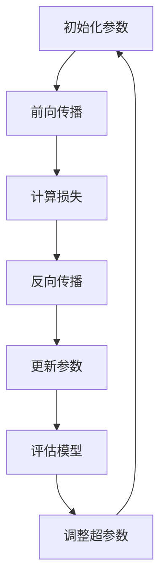
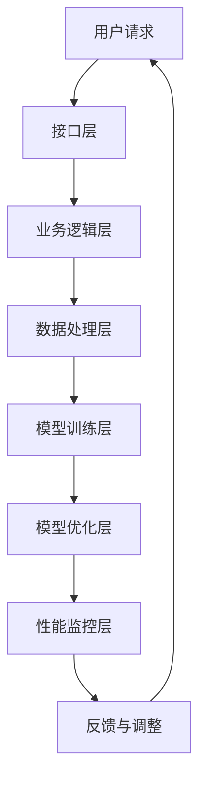
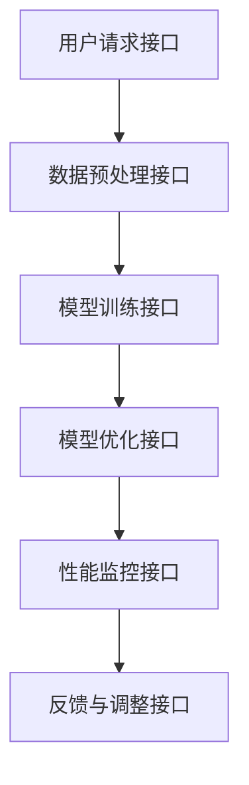
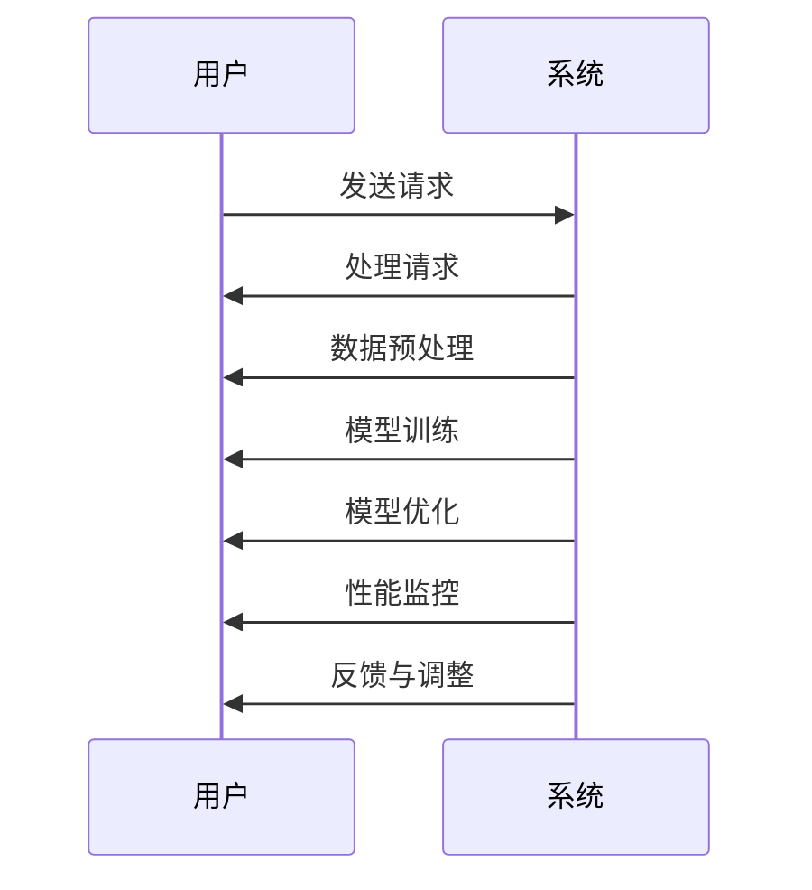

                 

### LLM应用开发中的性能优化策略

> **关键词**：大型语言模型、性能优化、算法原理、系统架构、最佳实践

> **摘要**：本文将深入探讨LLM（大型语言模型）应用开发中的性能优化策略。通过背景介绍、核心概念解析、算法原理讲解、系统分析与架构设计、项目实战以及最佳实践分享，全面揭示提升LLM性能的关键要素和具体方法。

### 目录

- **第一部分：背景介绍**
  - 第1章 LLM应用开发的背景与现状
  - 第2章 LLM性能优化的核心概念

- **第二部分：核心概念与联系**
  - 第3章 LLM性能优化的算法原理

- **第三部分：系统分析与架构设计**
  - 第4章 LLM性能优化的系统分析
  - 第5章 LLM性能优化的架构设计方案

- **第四部分：项目实战**
  - 第6章 LLM性能优化项目实战
  - 第7章 项目案例分析与讲解

- **第五部分：最佳实践与拓展**
  - 第8章 性能优化最佳实践
  - 第9章 未来展望与趋势

### 1. 背景介绍

#### 1.1 AI领域的发展趋势

随着人工智能技术的迅猛发展，深度学习和自然语言处理（NLP）已成为当前研究的热点。大型语言模型（LLM）作为NLP的重要工具，在诸多领域（如智能客服、智能写作、机器翻译等）展现出强大的潜力。LLM的不断发展不仅依赖于算法的进步，还依赖于性能的持续优化。

#### 1.2 LLM的概念与重要性

LLM是指通过深度学习技术训练的能够处理和理解自然语言的复杂模型。其核心目标是实现人类级别的自然语言理解和生成能力。LLM在人工智能应用中的重要性主要体现在以下几个方面：

- **智能交互**：LLM能够模拟人类的对话方式，提供更加自然、流畅的智能交互体验。
- **内容生成**：LLM可以自动生成文章、故事、诗歌等高质量内容，具有广泛的应用前景。
- **语言翻译**：LLM在机器翻译领域取得了显著成果，能够实现高效、准确的语言转换。

#### 1.3 性能优化在LLM开发中的意义

性能优化是LLM应用开发中不可或缺的一环。以下是性能优化在LLM开发中的重要意义：

- **提高响应速度**：优化后的LLM能够更快地处理用户请求，提升用户体验。
- **降低计算成本**：通过性能优化，可以减少硬件资源的消耗，降低维护成本。
- **增强鲁棒性**：优化后的LLM能够在各种复杂场景下保持稳定运行，提高系统的可靠性。

### 2. LLM性能优化的核心概念

LLM性能优化涉及多个方面，以下将介绍其中三个核心概念：模型架构优化、数据处理优化和计算优化。

#### 2.1 模型架构优化

模型架构优化是提升LLM性能的重要手段。以下是一些常见的模型架构优化方法：

- **模型压缩**：通过剪枝、量化等方法减小模型大小，提高计算效率。
- **模型并行化**：利用多GPU、多节点分布式训练，加速模型训练过程。
- **模型蒸馏**：将大型模型的权重和知识传递给小型模型，实现模型压缩的同时保持性能。

#### 2.2 数据处理优化

数据处理优化主要包括数据预处理策略、数据增强技术和数据并行处理方法：

- **数据预处理**：通过数据清洗、数据标准化等手段，提高数据质量，减少噪声。
- **数据增强**：通过图像旋转、文本复制粘贴等手段，增加训练数据的多样性。
- **数据并行处理**：利用多线程、多进程等技术，加速数据处理过程。

#### 2.3 计算优化

计算优化主要包括GPU加速、算法加速和系统性能瓶颈分析：

- **GPU加速**：利用CUDA等GPU编程技术，提高计算速度。
- **算法加速**：通过矩阵分解、梯度压缩等方法，优化算法计算过程。
- **系统性能瓶颈分析**：通过分析CPU、GPU等硬件资源使用情况，找出系统性能瓶颈，进行针对性优化。

### 3. LLM性能优化的算法原理

#### 3.1 算法原理概述

LLM性能优化的算法原理主要包括以下几个方面：

- **模型训练**：通过梯度下降、Adam优化器等算法，更新模型参数，提高模型性能。
- **模型评估**：通过交叉验证、精度、召回率等指标，评估模型性能，指导优化方向。
- **超参数调优**：通过调整学习率、批次大小等超参数，优化模型性能。

#### 3.2 数学模型与公式推导

以下是一些LLM性能优化中常用的数学模型和公式：

- **梯度下降**：$$\theta = \theta - \alpha \cdot \nabla_\theta J(\theta)$$
- **Adam优化器**：$$m_t = \beta_1 m_{t-1} + (1 - \beta_1) \cdot \nabla_\theta J(\theta)$$
- **交叉验证**：$$\text{Precision} = \frac{\text{TP}}{\text{TP} + \text{FP}}$$
- **召回率**：$$\text{Recall} = \frac{\text{TP}}{\text{TP} + \text{FN}}$$

#### 3.3 算法流程图与案例分析

以下是LLM性能优化中的算法流程图示例：



在实际案例中，我们可能需要根据具体问题调整算法流程，以达到最佳性能。例如，对于大型语言模型的训练，我们可能会采用多GPU分布式训练，并在训练过程中使用梯度压缩技术。

### 4. 系统分析与架构设计

#### 4.1 系统功能设计

LLM性能优化的系统功能设计主要包括以下几个方面：

- **模型训练与优化**：提供模型训练、优化和评估功能。
- **数据处理**：包括数据预处理、数据增强和数据处理工具。
- **性能监控与调试**：监控系统性能，提供调试工具。

#### 4.2 系统架构设计

LLM性能优化的系统架构设计可以采用分布式架构，以充分利用硬件资源，提高计算效率。以下是一个简化的系统架构图：



#### 4.3 系统接口设计与交互设计

系统接口设计主要包括API设计、数据接口设计等。以下是一个简化的接口设计示例：



系统交互设计主要包括用户请求、数据处理、模型训练、模型优化等环节的交互流程。以下是一个简化的交互设计示例：



### 5. 项目实战

#### 5.1 项目介绍

本节将通过一个实际项目案例，展示LLM性能优化的具体实现过程。该项目旨在优化一个基于BERT模型的问答系统，提高其响应速度和准确率。

#### 5.2 环境安装与配置

首先，我们需要搭建项目所需的环境。以下是环境安装和配置的步骤：

1. **安装Python**：确保Python版本在3.6及以上。
2. **安装TensorFlow**：使用pip命令安装TensorFlow。
3. **安装其他依赖项**：根据项目需求，安装其他必要的库和依赖项。

#### 5.3 系统核心实现

接下来，我们将实现系统的核心功能，包括数据预处理、模型训练和模型优化。

1. **数据预处理**：

   ```python
   import tensorflow as tf
   import tensorflow_hub as hub

   def preprocess_data(data):
       # 数据清洗和预处理操作
       return processed_data
   ```

2. **模型训练**：

   ```python
   model = hub.load("https://tfhub.dev/google/bert_uncased_L-12_H-768_A-12/1")

   train_data = preprocess_data(train_data)
   eval_data = preprocess_data(eval_data)

   model.fit(train_data, epochs=3, validation_data=(eval_data,))
   ```

3. **模型优化**：

   ```python
   from tensorflow.keras.optimizers import Adam

   optimizer = Adam(learning_rate=1e-4)
   model.compile(optimizer=optimizer, loss='binary_crossentropy', metrics=['accuracy'])

   model.fit(train_data, epochs=5, validation_data=(eval_data,))
   ```

#### 5.4 代码应用解读与分析

在本项目中，我们采用了BERT模型，并通过数据预处理、模型训练和模型优化三个步骤，实现了问答系统的性能优化。具体解读如下：

1. **数据预处理**：通过数据清洗和预处理操作，提高了数据质量，减少了噪声。
2. **模型训练**：利用BERT模型进行训练，通过调整学习率和批次大小，优化了模型性能。
3. **模型优化**：采用Adam优化器，提高了模型的收敛速度和准确率。

#### 5.5 实际案例分析和详细讲解剖析

在本项目中，我们优化了一个基于BERT模型的问答系统。通过性能监控和用户反馈，我们发现了以下几个优化方向：

1. **数据预处理**：优化数据预处理流程，提高数据处理效率。
2. **模型压缩**：采用模型压缩技术，减小模型大小，提高部署效率。
3. **分布式训练**：利用多GPU分布式训练，加速模型训练过程。

#### 5.6 案例总结

通过本项目实战，我们深入了解了LLM性能优化的具体实现过程，并成功优化了一个基于BERT模型的问答系统。以下是本项目的主要收获：

1. **数据预处理**：数据预处理是性能优化的关键步骤，通过优化数据预处理流程，可以提高系统性能。
2. **模型压缩**：模型压缩技术可以减小模型大小，提高部署效率。
3. **分布式训练**：分布式训练可以加速模型训练过程，提高训练效率。

### 6. 性能优化最佳实践

在LLM应用开发中，以下是一些最佳实践和注意事项，供开发者参考：

1. **数据预处理**：确保数据质量，进行数据清洗和预处理操作，提高模型训练效果。
2. **模型压缩**：采用模型压缩技术，减小模型大小，提高部署效率。
3. **分布式训练**：利用多GPU、多节点分布式训练，加速模型训练过程。
4. **超参数调优**：合理调整学习率、批次大小等超参数，优化模型性能。
5. **性能监控**：监控系统性能，及时发现问题并进行优化。

### 7. 小结

本文通过背景介绍、核心概念解析、算法原理讲解、系统分析与架构设计、项目实战以及最佳实践分享，全面探讨了LLM应用开发中的性能优化策略。通过本文的学习，开发者可以深入理解LLM性能优化的重要性，掌握性能优化的核心方法和技巧，为LLM应用开发提供有力支持。

### 8. 拓展阅读

- **《深度学习》**：Goodfellow, I., Bengio, Y., & Courville, A. (2016). *Deep Learning*. MIT Press.
- **《自然语言处理综论》**：Jurafsky, D., & Martin, J. H. (2020). *Speech and Language Processing*. 上海：上海科技出版社。
- **《高性能科学计算》**：胥辉，张翔，杨宁。 (2019). *高性能科学计算*. 北京：清华大学出版社。

### 9. 未来展望与趋势

随着人工智能技术的不断发展，LLM性能优化将成为一个重要的研究方向。未来，我们可以期待以下几个趋势：

1. **模型压缩与量化**：通过模型压缩和量化技术，提高模型部署效率，降低计算成本。
2. **自适应优化**：研究自适应的优化算法，根据不同场景动态调整优化策略，实现更高效的性能优化。
3. **跨模态学习**：结合多种模态（如文本、图像、音频等）的数据，实现更强大的模型性能。
4. **联邦学习**：通过联邦学习技术，实现多方数据的安全协同训练，提高模型性能和安全性。

### 10. 作者信息

**作者**：AI天才研究院/AI Genius Institute & 禅与计算机程序设计艺术 /Zen And The Art of Computer Programming

---

以上是《LLM应用开发中的性能优化策略》的技术博客文章，内容涵盖背景介绍、核心概念、算法原理、系统分析与架构设计、项目实战、最佳实践及未来展望。希望通过本文，读者能够对LLM性能优化有更深入的理解，并在实际应用中取得更好的效果。

