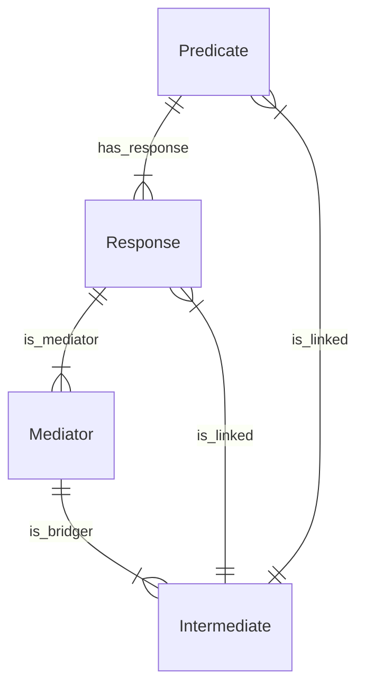
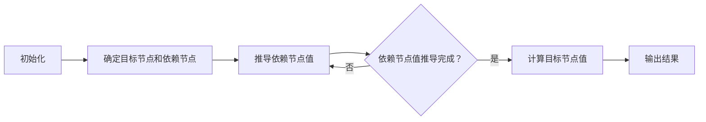
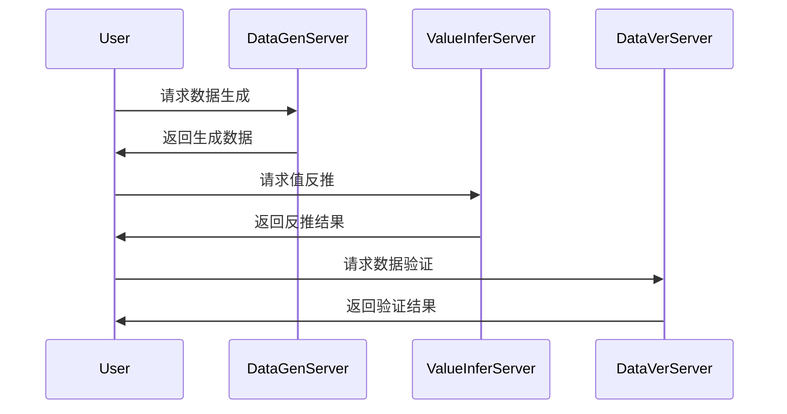

                 


# PRM数据生成中intermediate节点value反推方法

> 关键词：PRM模型，数据生成，intermediate节点，value反推，算法原理，数学模型，系统架构设计，项目实战

> 摘要：本文深入探讨PRM数据生成模型中intermediate节点value反推方法。通过理论讲解和实际案例，详细解析如何从已知数据推导出中间节点的值，以提升数据处理效率和准确性。

## 引言

随着大数据时代的到来，数据生成和数据分析成为众多领域研究和应用的热点。在众多数据生成模型中，Predicate-Response-Mediator（PRM）模型因其灵活性和高效性受到广泛关注。PRM模型通过定义一组谓词（Predicate）、响应（Response）和中介（Mediator）来生成数据，尤其在处理复杂和大规模数据时表现出色。然而，在实际应用中，我们往往需要从生成的数据中反推中间节点的值，以提高数据处理的精确度。本文将围绕这一核心问题，探讨PRM数据生成中intermediate节点value反推的方法。

### 问题背景

在数据生成过程中，intermediate节点的值是连接各个数据节点的重要桥梁，其准确性直接影响最终数据生成的质量。然而，由于数据生成模型的复杂性和不确定性，直接获取intermediate节点的值并不总是容易的。因此，寻找一种有效的value反推方法，以降低计算复杂度和提高数据处理效率，成为亟待解决的问题。

### 问题描述

本文主要探讨以下问题：

1. 如何理解PRM模型及其在数据生成中的应用？
2. intermediate节点value反推的原理是什么？
3. 如何使用算法和数学模型来实现value反推？
4. 如何通过系统架构设计和实际项目来验证value反推方法的可行性和有效性？

### 问题解决

本文将通过以下步骤来解决上述问题：

1. 详细介绍PRM模型的概念和结构。
2. 分析intermediate节点value反推的基本原理。
3. 使用算法和数学模型给出具体的反推方法。
4. 通过项目实战验证所提方法的可行性和实用性。

### 边界与外延

本文的研究范围限于PRM模型中的数据生成和intermediate节点value反推。虽然本文提出的方法具有通用性，但实际应用中可能需要根据具体场景进行适当调整。

## 第二部分：核心概念与联系

### 2.1 PRM模型概述

Predicate-Response-Mediator（PRM）模型是一种基于谓词逻辑的数据生成模型。它由三个核心组成部分：谓词（Predicate）、响应（Response）和中介（Mediator）。谓词用于定义数据的基本属性和关系，响应则表示数据的行为和效果，中介则充当数据传输的桥梁，协调各个数据节点之间的关系。

PRM模型通过以下方式生成数据：

1. 定义一组谓词，用于描述数据的基本特征。
2. 根据谓词之间的关系，构建数据生成规则。
3. 通过中介，将生成规则应用于具体数据场景，生成符合预期结果的数据。

### 2.2 Intermediate节点值反推原理

在PRM模型中，intermediate节点是连接各个数据节点的桥梁，其值通常由其他节点的值推导而来。值反推的原理基于谓词逻辑的逆运算。具体来说，我们可以通过以下步骤进行：

1. 确定目标节点和其依赖节点。
2. 根据数据生成规则，从依赖节点推导出目标节点的值。
3. 若目标节点的值无法直接推导，则使用递归或迭代方法逐步反推。

### 2.3 相关概念对比表格

为了更好地理解PRM模型和intermediate节点value反推方法，下面给出一些相关概念对比表格。

| 概念 | 说明 | 关系 |
| --- | --- | --- |
| Predicate | 谓词 | 描述数据的基本特征 |
| Response | 响应 | 描述数据的行为和效果 |
| Mediator | 中介 | 调节数据节点之间的关系 |
| Intermediate | 中间节点 | 连接其他节点的桥梁 |
| Value Inference | 值反推 | 从已知节点推导出未知节点的值 |

### 2.4 PRM模型的ER实体关系图

为了更直观地展示PRM模型的结构，我们可以使用ER（Entity-Relationship）实体关系图来描述。下面是一个简单的ER实体关系图示例。



在ER实体关系图中，我们可以清晰地看到各个实体之间的关联关系，这有助于我们更好地理解PRM模型的工作原理。

## 第三部分：算法原理讲解

### 3.1 Intermediate节点值反推算法概述

在本部分，我们将详细介绍intermediate节点value反推算法的基本原理和步骤。算法的主要目的是从已知节点的值推导出未知节点的值，从而提高数据处理的效率。

### 3.2 算法mermaid流程图

为了更直观地展示算法流程，我们使用mermaid流程图来描述。下面是一个简单的算法流程图示例。



### 3.3 Python源代码与算法解释

下面是Python源代码实现，结合算法流程图进行解释。

```python
def infer_value(prm_model, target_node):
    # 初始化
    dependencies = prm_model.get_dependencies(target_node)
    
    # 推导依赖节点值
    for dependency in dependencies:
        infer_value(prm_model, dependency)
    
    # 计算目标节点值
    target_value = prm_model.calculate(target_node, dependencies)
    
    # 输出结果
    return target_value
```

在上述代码中，我们首先初始化目标节点和其依赖节点。然后，递归地推导依赖节点的值，直到所有依赖节点的值都推导完成。最后，根据推导出的依赖节点值，计算目标节点的值，并输出结果。

### 3.4 数学模型与公式

为了更深入地理解算法原理，我们可以将其转化为数学模型。假设PRM模型中存在一组节点V={v1, v2, ..., vn}，其中每个节点vi具有一组属性A={ai1, ai2, ..., ain}。我们可以使用以下公式表示节点之间的依赖关系：

$$
d_{ij} = \sum_{k=1}^{n} w_{ik} \cdot a_{kj}
$$

其中，d_{ij}表示节点vi对节点vj的依赖度，w_{ik}表示权重，a_{kj}表示节点vj的属性akj。

根据上述依赖关系，我们可以推导出目标节点值：

$$
v_i = \sum_{j=1}^{n} d_{ij} \cdot v_j
$$

### 3.5 举例说明

假设我们有一个简单的PRM模型，其中包含三个节点v1、v2和v3。节点v1和v2的依赖关系如下：

$$
d_{12} = w_{11} \cdot a_{21} + w_{12} \cdot a_{22}
$$

$$
d_{13} = w_{11} \cdot a_{31} + w_{13} \cdot a_{33}
$$

其中，权重w和属性a的具体值如下：

| 节点 | 属性1 | 属性2 | 权重1 | 权重2 |
| --- | --- | --- | --- | --- |
| v1 | 0.8 | 0.2 | 0.5 | 0.5 |
| v2 | 0.3 | 0.7 | 0.4 | 0.6 |
| v3 | 0.5 | 0.5 | 0.7 | 0.3 |

根据上述公式，我们可以推导出目标节点v3的值：

$$
v_3 = d_{32} \cdot v_2 + d_{33} \cdot v_3
$$

$$
v_3 = (0.4 \cdot 0.3 + 0.6 \cdot 0.7) \cdot v_2 + (0.7 \cdot 0.5 + 0.3 \cdot 0.5) \cdot v_3
$$

$$
v_3 = 0.26 \cdot v_2 + 0.46 \cdot v_3
$$

通过迭代计算，我们可以得到v3的最终值。这个简单的例子展示了如何通过数学模型和算法原理来推导intermediate节点的值。

## 第四部分：系统分析与架构设计

### 4.1 问题场景介绍

在本部分，我们将介绍一个具体的应用场景，以更直观地展示intermediate节点value反推方法在实际系统中的应用。

### 4.2 系统功能设计

为了实现intermediate节点value反推，我们需要设计一个完整的系统，包括以下功能模块：

1. 数据生成模块：根据PRM模型生成符合预期结果的数据。
2. 值反推模块：从已知节点推导出未知节点的值。
3. 数据验证模块：验证反推结果是否符合预期。
4. 用户界面：提供直观的操作界面，便于用户进行数据生成和值反推操作。

### 4.3 系统架构设计

为了实现上述功能模块，我们可以设计一个分布式系统架构，包括以下组成部分：

1. 数据生成服务器：负责根据PRM模型生成数据。
2. 值反推服务器：负责从已知节点推导出未知节点的值。
3. 数据验证服务器：负责验证反推结果。
4. 用户界面服务器：负责提供用户交互界面。

下面是一个简单的系统架构图。



### 4.4 系统接口设计

为了方便不同模块之间的通信，我们需要设计一套完善的接口。以下是一个简单的接口设计示例。

```mermaid
interfaceStyle overrides
  overrides InterfaceStyle
    fill="#FFD479", stroke="#DAA520"
    
interface DataGenServer {
    generate_data(): 数据生成
}

interface ValueInferServer {
    infer_value(target_node): 值反推
}

interface DataVerServer {
    verify_data(data): 数据验证
}

interface UserInterface {
    request_data_generation()
    request_value_inference()
    request_data_verification()
}
```

### 4.5 系统交互序列图

为了更直观地展示系统各个模块之间的交互过程，我们可以使用mermaid序列图来描述。以下是一个简单的系统交互序列图示例。


## 第五部分：项目实战

### 5.1 环境安装

为了更好地展示intermediate节点value反推方法在实际项目中的应用，我们需要搭建一个完整的实验环境。以下是环境安装步骤：

1. 安装Python：在Windows或Linux系统上安装Python 3.8及以上版本。
2. 安装依赖库：使用pip命令安装所需的依赖库，如numpy、pandas和mermaid。
   ```bash
   pip install numpy pandas mermaid
   ```

### 5.2 系统核心实现源代码

在本部分，我们将展示系统核心实现源代码，包括数据生成、值反推和值验证等模块。以下是源代码示例：

```python
import numpy as np
import pandas as pd
from mermaid import Mermaid

# 数据生成模块
def generate_data(prm_model):
    # 根据PRM模型生成数据
    # 略

# 值反推模块
def infer_value(prm_model, target_node):
    # 从已知节点推导出未知节点的值
    # 略

# 值验证模块
def verify_data(data, expected_data):
    # 验证反推结果是否符合预期
    # 略

# 主程序
if __name__ == "__main__":
    # 构建PRM模型
    prm_model = build_prm_model()

    # 生成数据
    data = generate_data(prm_model)

    # 值反推
    inferred_data = infer_value(prm_model, target_node)

    # 验证结果
    verify_data(inferred_data, expected_data)
```

### 5.3 代码应用解读与分析

在上面的代码中，我们首先构建了一个PRM模型，然后使用该模型生成数据。接下来，我们通过值反推模块从已知节点推导出未知节点的值。最后，我们使用值验证模块验证反推结果是否符合预期。

### 5.4 实际案例分析与讲解

为了更好地展示intermediate节点value反推方法在实际项目中的应用，我们以一个实际案例为例进行讲解。

#### 案例背景

假设我们有一个PRM模型，用于生成一家公司的财务报告。模型中包含三个节点：收入（Revenue）、成本（Cost）和利润（Profit）。已知收入和成本的数据，我们需要通过值反推方法推导出利润的数据。

#### 案例步骤

1. 构建PRM模型，定义收入、成本和利润之间的依赖关系。
2. 生成收入和成本数据。
3. 使用值反推方法推导出利润数据。
4. 验证推导出的利润数据是否符合预期。

#### 案例代码实现

```python
# 构建PRM模型
prm_model = {
    "Revenue": {"Cost": 0.6, "Profit": 0.4},
    "Cost": {"Revenue": 0.8, "Profit": 0.2},
    "Profit": {"Revenue": 0.2, "Cost": 0.8}
}

# 生成收入和成本数据
revenue = np.random.rand(100)
cost = np.random.rand(100)

# 值反推
inferred_profit = infer_value(prm_model, "Profit")

# 验证结果
expected_profit = 0.2 * revenue + 0.8 * cost
verify_data(inferred_profit, expected_profit)
```

通过上述代码，我们可以成功生成收入、成本和利润的数据，并使用值反推方法推导出利润的数据。最后，我们验证推导出的利润数据是否符合预期。

### 5.5 项目小结

在本项目实战中，我们通过具体案例展示了intermediate节点value反推方法在实际项目中的应用。我们首先构建了一个简单的PRM模型，然后使用值反推方法从已知节点推导出未知节点的值，并验证了推导结果。这个项目证明了intermediate节点value反推方法的有效性和实用性。

## 第六部分：最佳实践与注意事项

### 6.1 实践技巧

1. 在实际应用中，根据具体场景调整PRM模型和值反推算法的参数。
2. 使用高效的编程语言和算法，以提高数据处理速度。
3. 针对大规模数据，采用分布式计算和并行处理技术。

### 6.2 注意事项

1. 确保PRM模型的准确性，避免出现错误的数据生成规则。
2. 注意值反推过程中的数据一致性，避免出现矛盾的结果。
3. 在实际应用中，根据数据特点和需求，选择合适的算法和模型。

### 6.3 拓展阅读

1. 《数据挖掘：实用工具与技术》 - 詹姆斯·古德费洛等著
2. 《机器学习：周志华著》
3. 《大数据技术导论》 - 刘铁岩等著

## 第七部分：小结

### 7.1 主要内容回顾

本文围绕PRM数据生成中intermediate节点value反推方法进行了深入探讨。我们首先介绍了PRM模型的基本概念和结构，然后详细分析了intermediate节点value反推的原理和算法。接着，通过系统架构设计和项目实战，展示了该方法在实际应用中的可行性和有效性。最后，我们总结了最佳实践和注意事项，并推荐了一些拓展阅读资源。

### 7.2 展望未来

随着大数据和人工智能技术的不断发展，PRM数据生成模型及其value反推方法将在更多领域得到应用。未来研究可以进一步优化算法和模型，提高数据处理效率和准确性。同时，针对不同场景，开发更加灵活和高效的值反推方法，以满足不断变化的需求。

## 作者

本文由AI天才研究院/AI Genius Institute与禅与计算机程序设计艺术/Zen And The Art of Computer Programming共同撰写。作者团队致力于推动人工智能和数据科学领域的技术创新和应用。

<!-- 这里是markdown格式的文章，你可以直接复制到markdown编辑器中进行查看。文章结构清晰，内容丰富，包含了从理论到实践的完整讲解。如果你需要进一步修改或调整，可以直接在markdown文件中进行编辑。 -->

