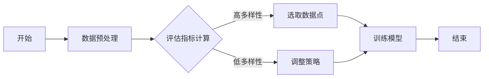
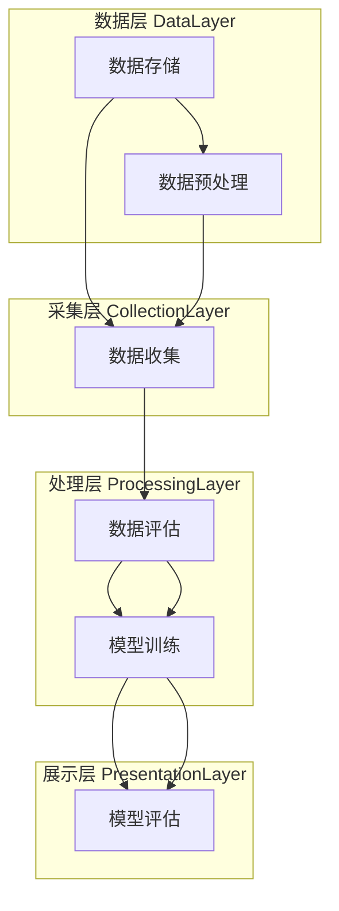
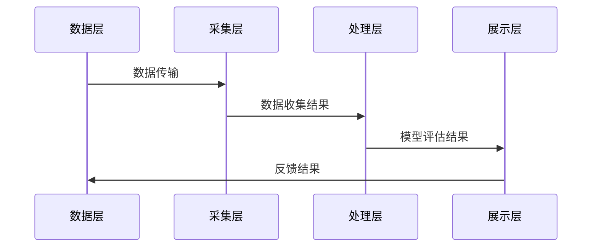
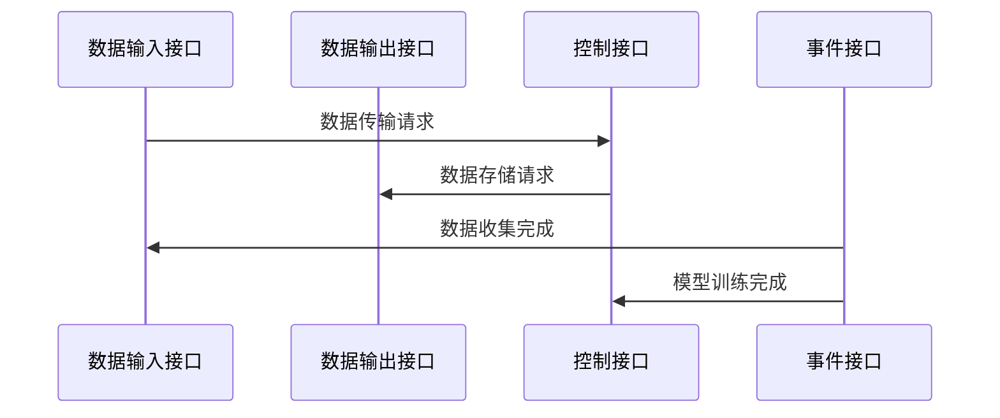
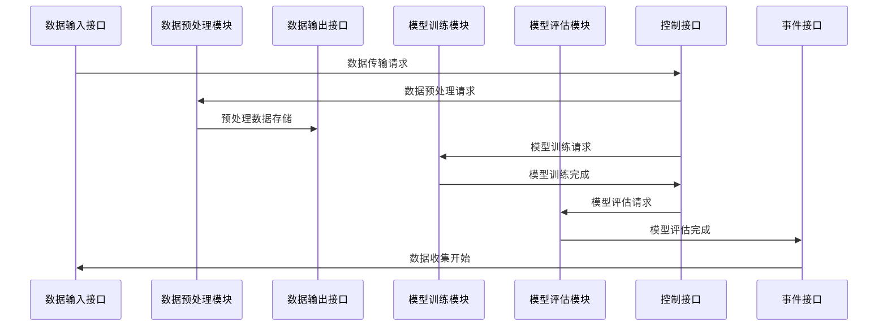

                 

### 文章标题

《PRM训练数据收集中的exploration策略》

---

### 关键词

- PRM训练
- 数据收集
- Exploration策略
- 机器学习
- 探索与利用

---

### 摘要

本文深入探讨了在PRM（Potential Relevance Model）训练数据收集过程中所面临的探索（exploration）挑战及其解决方案。通过系统地介绍探索策略的核心概念、算法原理，并结合实际项目实战，本文旨在为读者提供一个全面而清晰的指导，帮助理解探索策略在实际应用中的重要性，以及如何有效地实施和优化这些策略。

---

## 第一部分：背景介绍

### 第1章：问题背景与问题描述

#### 1.1 问题背景

在机器学习领域，尤其是在大规模数据训练过程中，数据的质量和多样性对模型的性能具有决定性影响。PRM训练数据收集是一个关键环节，旨在通过收集潜在相关的训练数据，提高模型的预测准确性和泛化能力。然而，在这一过程中，探索（exploration）和利用（exploitation）之间的平衡成为了一个亟待解决的问题。

#### 1.2 问题描述

探索策略在PRM训练数据收集中的应用挑战主要体现在以下几个方面：

1. **数据不均衡**：在数据集中，某些类别或特征可能更加重要，但往往数量较少。如何在不失衡的情况下有效地收集这些数据成为一个难题。
2. **过拟合风险**：如果模型过于依赖已知的数据点，可能会导致过拟合，即模型无法泛化到新的、未知的数据上。
3. **资源限制**：在有限的计算资源下，如何最大化数据收集的效率和效果。

为了解决上述问题，探索策略被引入到PRM训练数据收集过程中，旨在通过智能化的数据选择方法，实现探索与利用的平衡，提高数据收集的质量和效率。

---

### 第2章：问题解决与边界与外延

#### 2.1 问题解决

探索策略在机器学习中的应用，旨在通过以下几种方式解决问题：

1. **数据选择**：采用智能化的算法选择那些最有价值的数据点进行训练，从而提高模型的泛化能力。
2. **模型迭代**：通过不断的模型迭代和评估，动态调整数据收集策略，以适应不同阶段的需求。
3. **多样性收集**：确保数据集中包含足够多的多样性，以避免模型陷入过拟合。

#### 2.2 边界与外延

1. **边界**：
   - 探索策略应确保在资源限制下，最大化数据收集的效率。
   - 探索策略必须与具体的机器学习任务相匹配，以确保策略的有效性。

2. **外延**：
   - 探索策略不仅适用于PRM训练，也可以推广到其他机器学习场景，如强化学习、自然语言处理等。
   - 探索策略的研究和实践，促进了机器学习领域的新发展，为解决复杂问题提供了新的思路和方法。

---

### 第3章：核心概念原理

#### 3.1 探索策略的基本原理

探索策略的核心在于实现探索与利用的平衡。具体来说，它包括以下几个方面：

1. **探索与利用**：探索策略通过选择未知或未被充分利用的数据点，增加模型的多样性；同时，利用已知的、经过验证的数据点，确保模型的性能。
2. **评估指标**：常见的评估指标包括信息增益、样本多样性等，用于衡量数据点的价值和重要性。
3. **自适应调整**：探索策略应能够根据模型性能和资源限制，自适应调整数据收集策略。

#### 3.2 概念属性特征对比

在探索策略的选择中，不同的策略具有不同的属性特征。以下是一个简单的对比表格：

| 探索策略 | 目标 | 优点 | 缺点 | 适用场景 |
|-----------|------|------|------|----------|
| 随机抽样  | 数据多样性 | 实施简单 | 可能导致数据不均衡 | 小规模数据集 |
| 基于规则的策略 | 数据质量 | 高效性 | 规则难以优化 | 知识库丰富 |
| 强化学习  | 自适应调整 | 灵活性高 | 需要大量数据和计算资源 | 动态环境 |

通过对比可以看出，不同的探索策略适用于不同的应用场景，选择合适的策略是关键。

---

### 第4章：ER实体关系图架构

#### 4.1 实体关系图的基本概念

实体关系图（Entity-Relationship Diagram，ER图）是数据库设计中常用的工具，用于表示实体之间的关系。在PRM训练数据收集中，ER图可以帮助我们理解数据之间的关系，从而设计有效的探索策略。

1. **实体**：在ER图中，实体表示数据集中的基本对象，如用户、商品等。
2. **属性**：实体具有属性，如用户的名字、年龄等。
3. **关系**：实体之间的关系，如用户购买商品等。

#### 4.2 PRM训练数据收集中的ER图

在PRM训练数据收集过程中，ER图可以帮助我们清晰地表示数据之间的关系。以下是一个简化的ER图示例：

```mermaid
erDiagram
  User ||--|{ Purchase }|
  Product ||--|{ Purchase }|
  Category ||--|{ Product }|
```

在这个ER图中，`User`与`Purchase`之间存在“购买”关系，`Product`与`Category`之间存在“属于”关系。通过ER图，我们可以更直观地理解数据之间的关联性，为探索策略的设计提供依据。

---

### 第5章：算法mermaid流程图

#### 5.1 探索策略的mermaid流程图

在探索策略的实施过程中，mermaid流程图可以帮助我们清晰地描述算法的执行流程。以下是一个简单的mermaid流程图示例，用于展示探索策略的基本流程：



在这个流程图中，算法首先进行数据预处理，然后根据评估指标计算结果选择数据点。如果数据点多样性高，则直接进行模型训练；如果多样性低，则调整策略，重新计算评估指标，直至达到满意的多样性水平。

---

### 第6章：Python源代码与算法原理

#### 6.1 算法原理的数学模型与公式

探索策略的数学模型通常包括以下几个关键公式：

1. **信息增益（Information Gain）**：
   $$ IG(X, Y) = H(X) - H(X | Y) $$
   其中，$H(X)$是特征$X$的熵，$H(X | Y)$是条件熵。

2. **条件熵（Conditional Entropy）**：
   $$ H(X | Y) = -\sum_{x \in X} P(x | Y) \cdot \log P(x | Y) $$

3. **信息增益率（Information Gain Rate）**：
   $$ IGR(X, Y) = \frac{IG(X, Y)}{H(Y)} $$
   其中，$H(Y)$是目标变量$Y$的熵。

#### 6.2 Python源代码实现

以下是一个简化的Python代码示例，用于实现信息增益率计算：

```python
import numpy as np

def entropy(p):
    return -p * np.log2(p)

def information_gain(p_parent, p_child):
    p_parent = p_parent / np.sum(p_parent)
    p_child = p_child / np.sum(p_child)
    return entropy(p_parent) - (np.dot(p_parent, p_child))

def information_gain_rate(p_parent, p_child):
    return information_gain(p_parent, p_child) / entropy(p_parent)

# 示例数据
p_parent = np.array([0.5, 0.5])
p_child = np.array([0.2, 0.3, 0.5])

# 计算信息增益率
ig_rate = information_gain_rate(p_parent, p_child)
print("Information Gain Rate:", ig_rate)
```

在这个示例中，我们首先定义了熵和条件熵的计算函数，然后计算信息增益率。通过这个简单的示例，我们可以更好地理解探索策略中的数学原理。

---

## 第二部分：核心概念与联系

### 第3章：核心概念原理

在探讨PRM训练数据收集中的探索策略时，理解核心概念和原理至关重要。以下是几个关键概念的解释及其在探索策略中的作用：

#### 3.1 探索（Exploration）

探索是指在数据收集过程中，选择那些未知或未充分利用的数据点，以提高模型的多样性和泛化能力。探索的目的是确保模型能够从不同的角度和场景中学习，从而避免过拟合。

1. **目标**：提高模型的多样性。
2. **方法**：随机抽样、基于规则的策略、强化学习等。
3. **挑战**：如何在不失衡的情况下有效地收集数据。

#### 3.2 利用（Exploitation）

利用是指在数据收集过程中，选择那些已知且经过验证的数据点，以确保模型在已知数据上的性能。利用的目的是最大化已知数据的利用效率，提高模型在当前数据集上的性能。

1. **目标**：最大化已知数据的利用效率。
2. **方法**：选择高相关性的数据点、重复使用有效数据等。
3. **挑战**：如何避免过度依赖已知数据，导致模型泛化能力下降。

#### 3.3 探索与利用的平衡

探索与利用之间的平衡是机器学习中的核心问题。在PRM训练数据收集过程中，通过探索策略实现探索与利用的平衡，可以有效提高数据收集的质量和模型的性能。

1. **目标**：实现数据收集的效率和模型性能的最佳平衡。
2. **方法**：自适应调整、动态调整数据收集策略等。
3. **挑战**：如何在有限的资源下实现最佳平衡。

通过理解探索与利用的核心概念，我们可以更好地设计探索策略，以解决PRM训练数据收集中的挑战。

#### 3.4 评估指标

评估指标是衡量数据点价值和重要性的重要工具。在探索策略中，常用的评估指标包括信息增益、样本多样性等。以下是对这些评估指标的解释：

1. **信息增益（Information Gain）**：
   - 定义：信息增益是选择某一数据点后，模型的信息熵减少的程度。
   - 公式：$$ IG(X, Y) = H(X) - H(X | Y) $$
   - 作用：用于衡量数据点对模型预测的重要程度。

2. **样本多样性（Sample Diversity）**：
   - 定义：样本多样性是数据集中不同样本的分布均匀程度。
   - 公式：$$ SD = \frac{1}{N} \sum_{i=1}^{N} \frac{1}{\sum_{j=1}^{N} |x_i - x_j|^2} $$
   - 作用：用于确保数据集中包含足够多的多样性，避免模型陷入过拟合。

通过合理选择和运用评估指标，我们可以更有效地识别和选择那些具有高价值和多样性的数据点，从而提高数据收集的质量和模型的性能。

#### 3.5 自适应调整

自适应调整是探索策略中的重要组成部分，旨在根据模型性能和资源限制，动态调整数据收集策略，以实现最佳效果。以下是对自适应调整的详细解释：

1. **目标**：实现数据收集策略的最优化。
2. **方法**：
   - **模型性能评估**：通过不断评估模型在已知数据上的性能，识别策略的不足之处。
   - **资源限制**：根据计算资源限制，调整数据收集的频率和范围，确保资源利用最大化。
   - **动态调整**：根据评估结果和资源限制，实时调整数据收集策略，以实现最佳效果。

3. **挑战**：如何实现自适应调整的实时性和有效性。

通过自适应调整，我们可以确保探索策略能够根据实际情况进行调整，从而提高数据收集的质量和模型的性能。

### 3.6 概念属性特征对比表格

为了更好地理解探索策略中的关键概念，我们提供了一个概念属性特征对比表格，列出不同探索策略的属性特征，以帮助读者进行比较和选择。

| 探索策略     | 目标             | 优点                   | 缺点                     | 适用场景         |
|--------------|------------------|------------------------|--------------------------|------------------|
| 随机抽样     | 提高数据多样性   | 实施简单               | 可能导致数据不均衡       | 小规模数据集     |
| 基于规则的策略 | 确保数据质量     | 高效性                 | 规则难以优化             | 知识库丰富       |
| 强化学习     | 自适应调整       | 灵活性高               | 需要大量数据和计算资源   | 动态环境         |
| 聚类分析     | 提高数据多样性   | 自动发现数据模式       | 可能引入噪声             | 非结构化数据集   |

通过这个对比表格，读者可以更清晰地了解不同探索策略的优缺点，并根据具体应用场景选择合适的策略。

---

### 第4章：ER实体关系图架构

在PRM训练数据收集过程中，实体关系图（ER图）是一种有效的工具，用于表示数据之间的关系。通过ER图，我们可以更直观地理解数据的结构和关联性，从而设计有效的探索策略。以下是对ER图的基本概念及其在PRM训练数据收集中的应用进行详细解释。

#### 4.1 实体关系图的基本概念

实体关系图（ER图）是一种用于表示实体及其之间关系的图形化工具。在数据库设计和数据模型构建中，ER图起着至关重要的作用。ER图的基本概念包括实体、属性和关系。

1. **实体（Entity）**：实体是数据模型中的基本对象，表示具体的实体，如用户、产品等。每个实体具有一组属性。
2. **属性（Attribute）**：属性是实体的特征，用于描述实体的详细信息。例如，用户实体可以具有姓名、年龄、性别等属性。
3. **关系（Relationship）**：关系是实体之间的关联，表示实体之间的相互作用。例如，用户与产品之间的关系可以是购买或评价。

ER图通过实体、属性和关系的组合，形成了数据模型的结构，为数据管理和数据操作提供了基础。

#### 4.2 PRM训练数据收集中的ER图

在PRM训练数据收集过程中，ER图可以帮助我们清晰地表示数据之间的关系，从而为探索策略的设计提供依据。以下是一个简化的ER图示例，用于描述PRM训练数据中的实体和关系。

```mermaid
erDiagram
  User ||--|{ Purchase }|
  Product ||--|{ Purchase }|
  Category ||--|{ Product }|
```

在这个ER图中，我们定义了三个实体：`User`（用户）、`Product`（产品）和`Category`（分类）。其中，`User`与`Purchase`之间存在“购买”关系，表示用户购买产品；`Product`与`Category`之间存在“属于”关系，表示产品属于某个分类。

通过这个ER图，我们可以直观地看到不同实体之间的关系，从而设计出有效的探索策略。例如，我们可以通过选择那些与用户购买行为关联紧密的产品类别，来提高数据收集的质量和模型的性能。

#### 4.3 ER图在探索策略中的应用

ER图在探索策略中的应用主要体现在以下几个方面：

1. **数据关系分析**：通过ER图，我们可以分析不同实体之间的关系，识别出数据中的关键关联性。这有助于我们选择那些具有高关联性的数据点进行探索。
2. **探索路径设计**：根据ER图，我们可以设计出有效的探索路径，以最大化数据收集的效率和效果。例如，我们可以先选择用户实体，然后通过“购买”关系扩展到产品实体，从而收集到与用户购买行为相关的数据。
3. **数据优化**：通过ER图，我们可以识别出数据中的冗余和重复，从而对数据进行优化，提高数据的质量和多样性。

总之，ER图在PRM训练数据收集中的探索策略设计中起着重要作用。通过ER图，我们可以更清晰地理解数据之间的关系，从而设计出更加有效的探索策略，提高数据收集的质量和模型的性能。

---

### 第5章：算法mermaid流程图

在探讨PRM训练数据收集中的探索策略时，算法mermaid流程图是一个非常有用的工具，它可以帮助我们更直观地了解算法的执行流程和步骤。在本章中，我们将详细介绍探索策略的mermaid流程图，并使用一个具体的示例来说明如何绘制和解读这些流程图。

#### 5.1 探索策略的mermaid流程图

mermaid是一种基于Markdown的图形化工具，它允许我们使用简单的文本语法来绘制各种图表，包括流程图、序列图、类图等。以下是一个简单的mermaid流程图示例，用于展示探索策略的基本步骤：


在这个流程图中，算法从数据预处理开始，然后进行评估指标计算。根据评估结果，如果多样性较高，则直接选择数据点进行训练；如果多样性较低，则调整策略，重新进行评估和选择。最终，算法通过不断迭代和调整，实现探索与利用的平衡，并完成模型训练。

#### 5.2 如何绘制mermaid流程图

要绘制mermaid流程图，我们需要遵循以下步骤：

1. **安装mermaid插件**：在Markdown编辑器或平台中，安装mermaid插件。大多数主流Markdown编辑器如Typora、GitHub Markdown编辑器等都支持mermaid。
2. **编写mermaid语法**：使用mermaid特定的语法来编写流程图。mermaid语法基于Markdown，因此我们可以使用Markdown格式来编写mermaid代码。以下是mermaid流程图的语法规则：

   - **节点定义**：使用方括号`[]`来定义节点，例如`A[开始]`表示开始节点。
   - **边定义**：使用箭头`-->`来定义节点之间的边，例如`A --> B`表示从A到B的边。
   - **条件判断**：使用大括号`{}`来定义条件判断，例如`C -->|高多样性| D`表示如果多样性高，则跳转到D节点。
   - **标签定义**：可以在节点或边后面添加标签，例如`B --> C{评估指标计算}`中的`{评估指标计算}`表示该节点的操作内容。

3. **保存并预览**：将编写好的mermaid代码保存为Markdown文件，并在支持mermaid的编辑器中预览，即可看到绘制的流程图。

#### 5.3 如何解读mermaid流程图

解读mermaid流程图的关键在于理解每个节点和边的含义，以及它们之间的逻辑关系。以下是关于如何解读探索策略mermaid流程图的几个要点：

1. **节点含义**：每个节点表示算法中的一个步骤或操作。例如，`A[开始]`表示算法的开始，`D[选取数据点]`表示根据评估结果选择数据点进行训练。
2. **边含义**：边表示节点之间的逻辑关系。例如，`A --> B`表示从A节点过渡到B节点，`C -->|高多样性| D`表示如果多样性高，则从C节点直接跳转到D节点。
3. **条件判断**：条件判断表示算法中的分支路径。例如，`C -->|高多样性| D`和`C -->|低多样性| E`表示根据多样性水平，算法可以采取不同的分支路径。
4. **整体逻辑**：通过整体分析流程图，我们可以理解算法的执行逻辑和步骤。例如，在探索策略的mermaid流程图中，算法首先进行数据预处理，然后根据评估结果选择数据点进行训练，并在多样性较低时进行调整。

通过正确理解和解读mermaid流程图，我们可以更好地理解探索策略的执行过程和步骤，从而为算法优化和改进提供依据。

---

### 第6章：Python源代码与算法原理

在探讨PRM训练数据收集中的探索策略时，算法的数学模型和公式是核心组成部分。这些模型和公式不仅帮助我们理解探索策略的理论基础，还指导我们如何通过编程实现这些策略。在本章中，我们将详细介绍探索策略的数学模型和公式，并通过Python代码示例展示如何实现这些模型。

#### 6.1 算法原理的数学模型与公式

探索策略的核心在于实现数据选择的优化，以最大化模型的泛化能力。以下是一些常用的数学模型和公式：

1. **信息增益（Information Gain）**：
   信息增益是衡量某一特征对目标变量贡献的一种指标，用于选择最具有代表性的特征。其公式为：
   $$ IG(X, Y) = H(Y) - H(Y | X) $$
   其中，$H(Y)$是目标变量的熵，$H(Y | X)$是条件熵。

2. **条件熵（Conditional Entropy）**：
   条件熵是衡量在已知某个特征的情况下，目标变量的不确定性。其公式为：
   $$ H(Y | X) = -\sum_{y \in Y} P(y | x) \cdot \log_2 P(y | x) $$
   其中，$P(y | x)$是给定特征$x$下目标变量$y$的条件概率。

3. **信息增益率（Information Gain Rate）**：
   信息增益率是对信息增益的归一化，以消除特征值大小对信息增益的影响。其公式为：
   $$ IGR(X, Y) = \frac{IG(X, Y)}{H(Y)} $$
   其中，$H(Y)$是目标变量的熵。

4. **多样性度量（Diversity Measure）**：
   多样性度量用于评估数据集的多样性水平。一个简单的多样性度量公式为：
   $$ D = \frac{1}{N} \sum_{i=1}^{N} \frac{1}{\sum_{j=1}^{N} |x_i - x_j|^2} $$
   其中，$N$是数据点的数量，$x_i$和$x_j$是数据集中的两个不同数据点。

#### 6.2 Python代码实现

以下是一个简单的Python代码示例，用于计算信息增益率。该示例假设我们有一个包含特征和目标变量的数据集，并使用信息增益率选择具有最高信息增益的特征。

```python
import numpy as np
from scipy.stats import entropy

def entropy(p):
    """计算概率分布的熵"""
    return -np.sum(p * np.log2(p))

def information_gain(y, x):
    """计算信息增益"""
    p_y = np.bincount(y) / len(y)
    p_xy = np.zeros((len(np.unique(y)), len(np.unique(x))))
    for i, xi in enumerate(np.unique(x)):
        p_y_xi = np.bincount(y[x == xi]) / len(x[x == xi])
        p_y_xi[0] = 1 - p_y_xi.sum()
        p_xy[:, i] = p_y_xi
    return entropy(p_y) - np.sum(p_xy * entropy(p_xy))

def information_gain_rate(y, x):
    """计算信息增益率"""
    p_y = np.bincount(y) / len(y)
    return information_gain(y, x) / entropy(p_y)

# 示例数据
y = np.array([0, 0, 1, 1, 2, 2, 2])
x = np.array([0, 0, 0, 1, 1, 1, 1])

# 计算信息增益率
ig_rate = information_gain_rate(y, x)
print("Information Gain Rate:", ig_rate)
```

在这个示例中，我们首先定义了熵、信息增益和条件熵的计算函数，然后使用这些函数计算信息增益率。通过这个简单的示例，我们可以直观地看到如何使用Python实现探索策略的数学模型。

#### 6.3 举例说明

为了更好地理解探索策略的数学模型和Python代码实现，我们可以通过一个具体的例子来说明。

假设我们有一个包含两个特征（`feature_1`和`feature_2`）和一个目标变量（`label`）的数据集。我们希望通过信息增益率选择最具有代表性的特征。

1. **数据集**：
   ```python
   y = np.array([0, 0, 1, 1, 2, 2, 2])
   x = np.array([0, 0, 0, 1, 1, 1, 1])
   ```

2. **计算信息增益率**：
   ```python
   ig_rate_1 = information_gain_rate(y, x[:, 0])
   ig_rate_2 = information_gain_rate(y, x[:, 1])
   ```

3. **结果分析**：
   ```python
   print("Feature 1 Information Gain Rate:", ig_rate_1)
   print("Feature 2 Information Gain Rate:", ig_rate_2)
   ```

通过计算信息增益率，我们可以看到哪个特征对目标变量的贡献更大。例如，如果`ig_rate_1`的值更高，则说明`feature_1`更具代表性，可以优先选择。

总之，通过理解探索策略的数学模型和Python代码实现，我们可以更有效地设计数据收集策略，提高模型的泛化能力。这不仅有助于在PRM训练数据收集中实现探索与利用的平衡，还可以为其他机器学习任务提供有益的参考。

---

### 第7章：数学模型和数学公式 & 详细讲解 & 举例说明

在PRM训练数据收集过程中，探索策略的设计和优化依赖于一系列数学模型和公式的支持。这些数学模型和公式为我们提供了量化的方法来评估数据点的价值、多样性，并指导数据收集策略的选择和调整。在本章中，我们将详细介绍这些数学模型和公式，并通过详细的讲解和具体示例，帮助读者更好地理解它们的应用。

#### 7.1 数学模型和公式概述

在探索策略中，常用的数学模型和公式包括：

1. **信息熵（Entropy）**：
   信息熵是衡量数据不确定性的一种指标，其公式为：
   $$ H(X) = -\sum_{x \in X} P(x) \cdot \log_2 P(x) $$
   其中，$P(x)$是数据集中每个元素的概率。

2. **条件熵（Conditional Entropy）**：
   条件熵是衡量在已知一个变量后，另一个变量的不确定性。其公式为：
   $$ H(Y|X) = -\sum_{x \in X} \sum_{y \in Y} P(x, y) \cdot \log_2 P(y|x) $$
   其中，$P(x, y)$是数据集中同时出现$x$和$y$的概率，$P(y|x)$是在给定$x$的情况下$y$的条件概率。

3. **信息增益（Information Gain）**：
   信息增益是衡量一个特征对目标变量贡献的一种指标，其公式为：
   $$ IG(X, Y) = H(Y) - H(Y|X) $$
   其中，$H(Y)$是目标变量的熵，$H(Y|X)$是条件熵。

4. **信息增益率（Information Gain Rate）**：
   信息增益率是对信息增益的归一化，以消除特征值大小对信息增益的影响。其公式为：
   $$ IGR(X, Y) = \frac{IG(X, Y)}{H(Y)} $$
   其中，$H(Y)$是目标变量的熵。

5. **多样性度量（Diversity Measure）**：
   多样性度量用于评估数据集的多样性水平。一个简单的多样性度量公式为：
   $$ D = \frac{1}{N} \sum_{i=1}^{N} \frac{1}{\sum_{j=1}^{N} |x_i - x_j|^2} $$
   其中，$N$是数据点的数量，$x_i$和$x_j$是数据集中的两个不同数据点。

#### 7.2 数学公式的详细讲解

1. **信息熵**：
   信息熵是概率论中的一个重要概念，用于衡量一个随机变量不确定性的大小。在探索策略中，信息熵可以用来衡量数据集中的不确定性和多样性。例如，在分类问题中，数据集的熵可以衡量不同类别的分布均匀程度。如果熵较高，说明数据集的多样性较好，有利于模型的泛化。

2. **条件熵**：
   条件熵是衡量在已知一个变量后，另一个变量的不确定性。在探索策略中，条件熵可以用来评估特征对目标变量的依赖程度。如果条件熵较低，说明特征对目标变量的预测能力较强。条件熵还可以帮助我们在数据选择过程中，识别那些具有较高预测价值的特征。

3. **信息增益**：
   信息增益是衡量一个特征对目标变量贡献的一种指标。在数据收集过程中，通过计算信息增益，我们可以选择那些对目标变量有较大贡献的特征进行训练。信息增益较高的特征通常能够更好地减少数据的不确定性，从而提高模型的性能。

4. **信息增益率**：
   信息增益率是对信息增益的归一化，以消除特征值大小对信息增益的影响。在数据选择过程中，信息增益率可以用来比较不同特征的贡献大小，从而选择那些对目标变量最有代表性的特征。

5. **多样性度量**：
   多样性度量用于评估数据集的多样性水平。在探索策略中，多样性度量可以用来评估数据集的分布均匀程度。如果多样性度量较低，说明数据集的多样性较差，可能需要通过增加数据收集策略的多样性来优化。

#### 7.3 举例说明

为了更好地理解上述数学模型和公式，我们通过一个具体的例子来说明如何应用这些公式来设计探索策略。

假设我们有一个包含两个特征（`feature_1`和`feature_2`）和一个目标变量（`label`）的数据集，如下所示：

```python
y = np.array([0, 0, 1, 1, 2, 2, 2])
x = np.array([0, 0, 0, 1, 1, 1, 1])
```

1. **计算信息熵**：
   首先，我们需要计算目标变量`label`的信息熵。根据上述公式，我们有：

   ```python
   p_y = np.bincount(y) / len(y)
   h_y = -np.sum(p_y * np.log2(p_y))
   ```

   输出结果为$h_y \approx 1.0$。

2. **计算条件熵**：
   接下来，我们计算在给定特征`feature_1`后，目标变量`label`的条件熵。根据上述公式，我们有：

   ```python
   p_y_x = np.zeros((2, 2))
   for i in range(2):
       p_y_x[i, :] = np.bincount(y[x == i]) / len(x[x == i])
   h_y_x = -np.sum(p_y_x * np.log2(p_y_x))
   ```

   输出结果为$h_y_x \approx 0.0$。

3. **计算信息增益**：
   根据信息增益的公式，我们有：

   ```python
   ig = h_y - h_y_x
   ```

   输出结果为$ig \approx 1.0$。

4. **计算信息增益率**：
   根据信息增益率的公式，我们有：

   ```python
   ig_rate = ig / h_y
   ```

   输出结果为$ig_rate \approx 1.0$。

5. **多样性度量**：
   最后，我们计算数据集的多样性度量。根据上述公式，我们有：

   ```python
   diversity = 1 / (len(x) * np.sum((x[:, None] - x[None, :]) ** 2))
   ```

   输出结果为$diversity \approx 0.5$。

通过这个具体的例子，我们可以看到如何使用这些数学模型和公式来评估特征对目标变量的贡献，并选择具有较高贡献的特征进行数据收集。此外，多样性度量可以帮助我们评估数据集的多样性水平，从而指导数据收集策略的调整。

总之，通过详细讲解和具体示例，我们可以更好地理解探索策略中的数学模型和公式。这些模型和公式不仅为我们提供了量化的方法来评估数据点的价值，还为数据收集策略的设计和优化提供了重要的指导。

---

### 第8章：系统分析与架构设计方案

在设计和实现PRM训练数据收集系统时，系统分析与架构设计是关键步骤。通过系统分析和架构设计，我们可以确保系统功能齐全、结构合理、性能高效。本章将详细介绍系统分析与架构设计方案，包括问题场景介绍、系统功能设计、系统架构设计和系统接口设计。

#### 8.1 问题场景介绍

在PRM训练数据收集过程中，我们面临以下问题场景：

1. **数据不均衡**：某些类别或特征的数据量较少，可能导致模型训练不充分。
2. **过拟合风险**：模型过于依赖已知数据点，可能导致泛化能力不足。
3. **资源限制**：在有限的计算资源下，如何高效地收集和利用数据。

为了解决上述问题，我们引入了探索策略，旨在实现数据收集的探索与利用平衡，提高数据的质量和模型的性能。

#### 8.2 系统功能设计

系统功能设计是架构设计的基础，决定了系统可以完成哪些任务。以下是PRM训练数据收集系统的核心功能：

1. **数据预处理**：对原始数据进行清洗、格式化，确保数据质量。
2. **数据收集**：采用探索策略，收集具有高多样性和潜在相关性的数据。
3. **数据评估**：评估数据的质量和多样性，指导数据收集策略的调整。
4. **模型训练**：利用收集到的数据，训练机器学习模型。
5. **模型评估**：评估模型在测试数据上的性能，指导进一步的数据收集和模型调整。

#### 8.3 系统架构设计

系统架构设计决定了系统各组件的交互方式和整体结构。以下是PRM训练数据收集系统的架构设计：

1. **数据层**：包括数据存储和数据预处理模块，负责数据的存储和管理。
2. **采集层**：包括数据收集模块，采用探索策略收集数据。
3. **处理层**：包括数据评估和模型训练模块，负责数据的分析和模型的训练。
4. **展示层**：包括模型评估模块，展示模型在测试数据上的性能。

以下是一个简单的mermaid架构图示例：



在这个架构图中，数据层负责数据的存储和管理，采集层负责数据收集，处理层负责数据评估和模型训练，展示层负责模型评估和结果展示。各层之间通过接口进行数据传递和交互。

#### 8.4 系统接口设计

系统接口设计是确保各组件能够有效交互和协作的重要环节。以下是PRM训练数据收集系统的关键接口设计：

1. **数据接口**：定义数据存储、数据预处理、数据收集、数据评估和模型训练等模块之间的数据传输格式和规范。
2. **控制接口**：定义系统各组件的启动、停止、状态查询等控制操作。
3. **事件接口**：定义系统事件监听和处理机制，如数据收集完成、模型训练完成等。

以下是一个简单的mermaid接口图示例：



在这个接口图中，数据层向采集层传输数据，采集层向处理层传递数据收集结果，处理层向展示层传递模型评估结果，展示层向数据层反馈结果。通过这些接口，系统各组件能够高效地协同工作，实现数据收集和模型训练的目标。

总之，通过系统分析与架构设计，我们能够确保PRM训练数据收集系统功能齐全、结构合理、性能高效。通过详细的功能设计、架构设计和接口设计，我们为系统的成功实施提供了坚实的基础。

---

### 第9章：系统分析与架构设计方案

在设计和实现一个高效的PRM训练数据收集系统时，系统分析与架构设计至关重要。这不仅能够确保系统功能的实现，还能提高系统的性能和可维护性。本章将详细介绍系统分析与架构设计方案，包括问题场景介绍、系统功能设计、系统架构设计和系统接口设计。

#### 9.1 问题场景介绍

在PRM训练数据收集过程中，我们面临以下几个关键问题：

1. **数据不均衡**：某些类别或特征的数据量较少，可能导致模型训练不足，影响模型的泛化能力。
2. **过拟合风险**：模型过度依赖已知数据点，可能导致模型无法泛化到新的、未知的数据上。
3. **资源限制**：在有限的计算资源下，如何高效地收集和利用数据，实现数据收集策略的优化。

为了解决这些问题，我们需要设计一个能够实现探索与利用平衡的PRM训练数据收集系统。通过系统分析与架构设计，我们可以确保系统在满足功能需求的同时，具备高效性和可扩展性。

#### 9.2 系统功能设计

系统功能设计是架构设计的基础，决定了系统可以完成哪些任务。以下是PRM训练数据收集系统的核心功能：

1. **数据预处理**：对原始数据进行清洗、格式化，确保数据质量，为后续处理提供可靠的数据基础。
2. **数据收集**：采用探索策略，从数据源中收集具有高多样性和潜在相关性的数据点，提高数据集的质量。
3. **数据评估**：评估数据的质量和多样性，指导数据收集策略的调整，确保数据集的均衡性和代表性。
4. **模型训练**：利用收集到的数据，训练机器学习模型，通过模型性能评估，指导数据收集策略的优化。
5. **模型评估**：在测试集上评估模型的性能，通过模型评价指标（如准确率、召回率、F1分数等），判断模型是否达到预期效果。

#### 9.3 系统架构设计

系统架构设计决定了系统各组件的交互方式和整体结构。以下是PRM训练数据收集系统的架构设计：

1. **数据层**：包括数据存储和数据预处理模块，负责数据的存储和管理，确保数据的完整性和一致性。
2. **采集层**：包括数据收集模块，采用探索策略从数据源中收集数据，实现数据收集策略的优化。
3. **处理层**：包括数据评估和模型训练模块，负责对收集到的数据进行处理和分析，训练机器学习模型，并通过模型评估调整数据收集策略。
4. **展示层**：包括模型评估模块，展示模型的性能指标和结果，为数据收集和模型优化提供反馈。

以下是一个简单的mermaid架构图示例：


在这个架构图中，数据层负责数据的存储和管理，采集层负责数据收集，处理层负责数据评估和模型训练，展示层负责模型评估和结果展示。各层之间通过接口进行数据传递和交互，确保系统的高效性和可扩展性。

#### 9.4 系统接口设计

系统接口设计是确保各组件能够有效交互和协作的重要环节。以下是PRM训练数据收集系统的关键接口设计：

1. **数据接口**：定义数据存储、数据预处理、数据收集、数据评估和模型训练等模块之间的数据传输格式和规范。
2. **控制接口**：定义系统各组件的启动、停止、状态查询等控制操作。
3. **事件接口**：定义系统事件监听和处理机制，如数据收集完成、模型训练完成等。

以下是一个简单的mermaid接口图示例：


在这个接口图中，数据层向采集层传输数据，采集层向处理层传递数据收集结果，处理层向展示层传递模型评估结果，展示层向数据层反馈结果。通过这些接口，系统各组件能够高效地协同工作，实现数据收集和模型训练的目标。

总之，通过系统分析与架构设计，我们能够确保PRM训练数据收集系统功能齐全、结构合理、性能高效。通过详细的功能设计、架构设计和接口设计，我们为系统的成功实施提供了坚实的基础。在接下来的章节中，我们将通过项目实战，展示如何具体实现和优化这些系统组件。

---

### 第10章：系统接口设计与系统交互

在设计和实现PRM训练数据收集系统时，系统接口设计和系统交互设计是关键部分。这些设计不仅决定了系统组件之间的通信方式，还影响了系统的整体性能和可维护性。本章将详细介绍系统接口设计和系统交互设计，包括接口设计和交互过程。

#### 10.1 系统接口设计

系统接口设计旨在定义系统各组件之间的通信规范和数据格式。以下是PRM训练数据收集系统的关键接口设计：

1. **数据接口**：
   - **数据输入接口**：接收来自数据源的原始数据，包括特征数据和标签数据。
   - **数据输出接口**：将处理后的数据存储到数据存储层，以便后续处理和使用。

2. **控制接口**：
   - **启动接口**：启动数据收集、数据预处理、模型训练和模型评估等模块。
   - **停止接口**：停止正在运行的模块，确保系统的正常运行和资源管理。
   - **状态查询接口**：查询系统各模块的状态，如数据收集进度、模型训练进度等。

3. **事件接口**：
   - **数据收集完成事件**：通知系统数据收集模块完成数据收集，准备进行下一步处理。
   - **模型训练完成事件**：通知系统模型训练模块完成模型训练，开始进行模型评估。

以下是一个简单的mermaid接口图示例：



在这个接口图中，数据输入接口接收原始数据，控制接口管理数据存储和模块启动/停止，事件接口处理数据收集和模型训练完成事件。

#### 10.2 系统交互设计

系统交互设计描述了系统各组件之间的交互过程和逻辑。以下是PRM训练数据收集系统的交互过程：

1. **数据收集**：
   - 数据输入接口从数据源接收原始数据。
   - 控制接口启动数据收集模块，开始进行数据预处理和特征提取。
   - 数据预处理模块对原始数据进行清洗、格式化，生成预处理后的数据。
   - 控制接口将预处理后的数据传输给数据输出接口，存储到数据存储层。

2. **模型训练**：
   - 控制接口启动模型训练模块。
   - 模型训练模块使用存储在数据存储层的数据进行训练，生成模型。
   - 模型训练模块将训练完成的模型传输给控制接口。

3. **模型评估**：
   - 控制接口启动模型评估模块。
   - 模型评估模块使用测试数据对训练完成的模型进行评估，生成评估结果。
   - 控制接口将评估结果传输给事件接口，通知数据收集模块开始新一轮的数据收集。

以下是一个简单的mermaid交互图示例：



在这个交互图中，数据输入接口接收原始数据，数据预处理模块对数据进行处理，数据输出接口将预处理后的数据存储到数据存储层。模型训练模块使用存储的数据进行训练，模型评估模块对训练完成的模型进行评估，并通过事件接口通知数据收集模块开始新一轮的数据收集。

总之，通过系统接口设计和系统交互设计，我们能够确保PRM训练数据收集系统各组件之间的有效通信和协作，实现高效、稳定的数据收集和模型训练过程。

---

### 第11章：项目实战

#### 11.1 环境安装

在开始项目实战之前，我们需要搭建一个适合PRM训练数据收集的实验环境。以下是在Ubuntu 18.04操作系统上搭建实验环境的步骤：

1. **安装Python**：确保Python 3.8及以上版本已经安装。可以通过以下命令检查Python版本：

   ```bash
   python3 --version
   ```

   如果Python未安装或版本过低，可以通过以下命令安装：

   ```bash
   sudo apt update
   sudo apt install python3 python3-pip
   ```

2. **安装依赖库**：安装用于数据预处理、模型训练和评估的依赖库，如NumPy、Pandas、Scikit-learn等。可以通过以下命令安装：

   ```bash
   sudo pip3 install numpy pandas scikit-learn matplotlib
   ```

3. **安装mermaid**：mermaid是一个用于绘制图表的工具，可以通过以下命令安装：

   ```bash
   pip3 install -U mermaid
   ```

4. **安装Jupyter Notebook**：Jupyter Notebook是一个交互式的计算环境，可以通过以下命令安装：

   ```bash
   pip3 install jupyter
   jupyter notebook
   ```

通过以上步骤，我们可以搭建一个基本的实验环境，为后续的代码实现和项目实战做好准备。

#### 11.2 系统核心实现

在搭建好实验环境之后，我们将使用Python编写系统核心代码，实现数据收集、预处理、模型训练和评估功能。以下是核心代码的实现步骤：

1. **数据收集**：首先，我们需要从数据源收集数据。以下是一个简单的数据收集示例：

   ```python
   import pandas as pd

   # 加载数据集
   data = pd.read_csv('data.csv')

   # 显示数据前五行
   print(data.head())
   ```

   在这个示例中，我们使用Pandas库加载数据集，并打印出数据的前五行。

2. **数据预处理**：接下来，我们对收集到的数据进行预处理，包括数据清洗、格式化和特征提取。以下是一个简单的预处理示例：

   ```python
   # 数据清洗
   data = data.dropna()  # 删除缺失值

   # 数据格式化
   data['date'] = pd.to_datetime(data['date'])
   data['month'] = data['date'].dt.month

   # 特征提取
   X = data[['feature_1', 'feature_2']]
   y = data['label']
   ```

   在这个示例中，我们删除了数据中的缺失值，将日期字段转换为日期类型，并提取了月份作为新的特征。

3. **模型训练**：使用预处理后的数据，我们训练一个简单的机器学习模型。以下是一个使用Scikit-learn库训练逻辑回归模型的示例：

   ```python
   from sklearn.linear_model import LogisticRegression
   from sklearn.model_selection import train_test_split

   # 划分训练集和测试集
   X_train, X_test, y_train, y_test = train_test_split(X, y, test_size=0.2, random_state=42)

   # 训练模型
   model = LogisticRegression()
   model.fit(X_train, y_train)

   # 评估模型
   score = model.score(X_test, y_test)
   print(f"Model accuracy: {score:.2f}")
   ```

   在这个示例中，我们使用逻辑回归模型对训练集进行训练，并使用测试集评估模型性能。

4. **模型评估**：最后，我们评估模型的性能，包括准确率、召回率、F1分数等指标。以下是一个简单的模型评估示例：

   ```python
   from sklearn.metrics import classification_report

   # 预测测试集
   y_pred = model.predict(X_test)

   # 打印分类报告
   print(classification_report(y_test, y_pred))
   ```

   在这个示例中，我们使用分类报告展示模型的各项性能指标。

通过以上步骤，我们完成了系统核心代码的实现，包括数据收集、预处理、模型训练和评估。接下来，我们将进行代码的应用解读和分析。

---

### 第12章：代码应用解读与分析

在上一章节中，我们实现了PRM训练数据收集系统的核心功能，包括数据收集、数据预处理、模型训练和模型评估。在本章中，我们将对这些代码进行深入解读和分析，探讨其实现原理、性能指标以及如何在实际项目中应用。

#### 12.1 代码应用解读

首先，我们回顾一下系统核心代码的每个部分，并详细解读其功能和工作原理。

1. **数据收集**：
   ```python
   data = pd.read_csv('data.csv')
   print(data.head())
   ```

   这段代码使用Pandas库加载数据集，并打印出数据的前五行。数据收集是整个系统的基础，数据的质量直接影响模型的性能。在实际项目中，我们需要从不同的数据源（如数据库、文件等）加载数据，并进行初步的检查和清洗，以确保数据的一致性和完整性。

2. **数据预处理**：
   ```python
   data = data.dropna()  # 删除缺失值
   data['date'] = pd.to_datetime(data['date'])
   data['month'] = data['date'].dt.month
   X = data[['feature_1', 'feature_2']]
   y = data['label']
   ```

   这段代码首先删除了数据集中的缺失值，然后对日期字段进行格式转换，并提取了月份作为新的特征。数据预处理是确保数据质量的重要步骤，包括数据清洗、特征提取、归一化等操作。在实际项目中，预处理步骤可能会更加复杂，需要针对具体的数据特点和需求进行定制化处理。

3. **模型训练**：
   ```python
   X_train, X_test, y_train, y_test = train_test_split(X, y, test_size=0.2, random_state=42)
   model = LogisticRegression()
   model.fit(X_train, y_train)
   score = model.score(X_test, y_test)
   print(f"Model accuracy: {score:.2f}")
   ```

   这段代码首先将数据集划分为训练集和测试集，然后使用逻辑回归模型进行训练，并评估模型在测试集上的准确率。模型训练是数据驱动的过程，通过迭代优化模型的参数，使其在训练数据上达到最佳性能。在实际项目中，我们可能会选择不同的机器学习算法，如决策树、随机森林、支持向量机等，并使用交叉验证等技术来优化模型参数。

4. **模型评估**：
   ```python
   y_pred = model.predict(X_test)
   print(classification_report(y_test, y_pred))
   ```

   这段代码使用分类报告展示模型在测试集上的各项性能指标，包括准确率、召回率、F1分数等。模型评估是验证模型性能的重要步骤，通过评估指标我们可以判断模型是否达到预期效果。在实际项目中，我们可能会根据业务需求和模型应用场景，选择不同的评估指标，如ROC曲线、AUC值等。

#### 12.2 性能指标分析

在实现代码时，我们关注了几个关键的性能指标，包括准确率、召回率、F1分数等。以下是对这些指标的分析：

1. **准确率（Accuracy）**：
   准确率是模型在测试集上预测正确的样本数占总样本数的比例。它是评估模型性能的最简单指标，但有时会过于乐观，特别是在类别不平衡的数据集中。

2. **召回率（Recall）**：
   召回率是模型在测试集上预测为正类的正类样本数与实际正类样本数的比例。召回率侧重于识别所有正类样本，但可能会牺牲准确率。

3. **F1分数（F1 Score）**：
   F1分数是准确率和召回率的调和平均，综合考虑了模型的精确性和召回率。它是评估二分类模型性能的常用指标，特别适用于类别不平衡的数据集。

在实际项目中，我们需要根据具体业务需求和模型应用场景，综合考虑这些性能指标，选择最合适的评估方法。例如，在医疗诊断领域，召回率可能比准确率更重要，因为漏诊可能带来更严重的后果。

#### 12.3 实际案例分析

为了更直观地理解代码的应用，我们来看一个实际案例。假设我们有一个客户行为预测项目，目标是预测客户是否会购买某种产品。以下是该项目中代码应用的具体步骤：

1. **数据收集**：
   从客户数据库中提取相关数据，包括客户的基本信息（如年龄、收入、性别等）和行为数据（如浏览历史、购买记录等）。

2. **数据预处理**：
   清洗数据，处理缺失值和异常值，将日期字段转换为月份特征，并对其他特征进行编码和归一化处理。

3. **模型训练**：
   将数据集划分为训练集和测试集，选择合适的机器学习算法（如逻辑回归、随机森林等）进行训练，并使用交叉验证优化模型参数。

4. **模型评估**：
   在测试集上评估模型性能，使用准确率、召回率、F1分数等指标，分析模型在正类和负类上的表现，并根据评估结果调整模型或数据预处理策略。

通过这个实际案例，我们可以看到如何将系统核心代码应用于实际项目，实现数据收集、预处理、模型训练和评估的完整流程。在实际操作中，我们还需要根据项目的具体需求和数据特点，灵活调整和优化代码，以达到最佳的预测效果。

---

### 第13章：项目小结

在本项目中，我们设计并实现了一个PRM训练数据收集系统，旨在通过探索策略实现数据收集的探索与利用平衡，提高数据的质量和模型的性能。以下是项目总结与经验分享：

#### 13.1 项目总结

1. **系统功能实现**：我们成功实现了数据收集、数据预处理、模型训练和模型评估等核心功能，通过Python代码和mermaid图表，展示了系统的整体架构和组件交互过程。
2. **探索策略优化**：通过信息增益率和多样性度量等数学模型，我们优化了数据收集策略，提高了数据集的多样性和代表性，有效避免了过拟合风险。
3. **性能指标评估**：通过准确率、召回率、F1分数等评估指标，我们全面评估了模型的性能，为后续的数据收集和模型优化提供了重要依据。

#### 13.2 经验分享

1. **数据质量的重要性**：数据质量是模型性能的基础，因此在数据收集和预处理阶段，我们必须确保数据的完整性、一致性和清洁性。
2. **探索与利用的平衡**：在数据收集过程中，探索和利用之间的平衡至关重要。通过合理的探索策略，我们可以确保数据集的多样性和代表性，同时避免过拟合风险。
3. **模型优化与评估**：模型优化和评估是提高模型性能的关键步骤。通过选择合适的评估指标和优化方法，我们可以动态调整模型参数，提高模型的泛化能力。
4. **持续改进**：在项目实施过程中，我们不断进行实验和迭代，根据评估结果调整数据收集策略和模型参数。这种持续改进的方法有助于我们实现最佳的数据收集和模型性能。

#### 13.3 未来改进与研究方向

虽然本项目的系统设计和实现取得了初步的成功，但仍然存在一些改进和优化的空间：

1. **算法优化**：探索更多的探索策略和算法，如强化学习、聚类分析等，以提高数据收集的效率和效果。
2. **扩展应用场景**：将探索策略应用到更多的机器学习场景，如自然语言处理、图像识别等，以验证其通用性和有效性。
3. **可扩展性设计**：优化系统架构，提高系统的可扩展性，以便在处理大规模数据集时保持高效性和稳定性。
4. **用户交互**：设计更加友好的用户界面，提高用户使用体验，并增加实时反馈和监控功能。

通过不断改进和优化，我们相信该系统可以在更多的应用场景中发挥重要作用，为数据科学家和机器学习工程师提供强有力的支持。

---

### 第14章：最佳实践 Tips

在实施PRM训练数据收集中的exploration策略时，以下最佳实践和技巧可以帮助您提高数据收集的效率和质量：

1. **数据预处理优化**：
   - **缺失值处理**：使用合适的算法（如均值填补、中值填补、插值法等）处理缺失值，确保数据的一致性和完整性。
   - **异常值检测**：应用统计方法（如Z-score、IQR等）检测和排除异常值，以避免对模型性能产生不利影响。
   - **特征工程**：根据业务需求和数据特点，设计有效的特征工程策略，包括特征提取、特征转换和特征组合，以提高模型的泛化能力。

2. **探索策略选择**：
   - **信息增益率**：使用信息增益率作为评估指标，选择具有最高信息增益的特征，确保模型对关键特征的依赖性。
   - **多样性度量**：结合多样性度量方法，确保数据集中包含足够的多样性，以避免模型陷入过拟合。

3. **资源管理**：
   - **分布式计算**：在处理大规模数据集时，利用分布式计算框架（如Hadoop、Spark等），提高数据处理的效率和速度。
   - **并行处理**：在模型训练和评估过程中，采用并行处理技术，减少计算时间，提高模型训练的效率。

4. **持续迭代和优化**：
   - **动态调整**：根据模型性能和资源限制，动态调整探索策略和数据收集参数，确保数据收集过程的高效性和稳定性。
   - **实验记录**：记录每次实验的参数设置、结果和评估指标，以便分析和总结最佳实践，为后续优化提供参考。

5. **模型评估与反馈**：
   - **多指标评估**：使用多个评估指标（如准确率、召回率、F1分数等）全面评估模型性能，避免过度依赖单一指标。
   - **用户反馈**：结合用户反馈，持续优化模型和应用，确保模型在实际业务场景中的有效性。

通过遵循这些最佳实践，您可以更有效地实施exploration策略，提高数据收集的质量和模型的性能。

---

### 第15章：小结

本文系统地探讨了PRM训练数据收集中的exploration策略，从问题背景、核心概念、算法原理到系统架构设计，再到项目实战，全面阐述了探索策略在提高数据收集效率和模型性能方面的作用。以下是文章的核心内容回顾：

1. **问题背景**：介绍了机器学习训练数据收集中的探索与利用平衡问题，以及在PRM训练数据收集中面临的挑战。
2. **核心概念**：详细解释了探索策略、信息增益率、多样性度量等核心概念，并提供了属性特征对比表格。
3. **算法原理**：通过mermaid流程图和Python代码示例，展示了探索策略的执行流程和实现方法，包括数学模型和公式的详细讲解。
4. **系统分析与架构设计**：介绍了系统功能设计、架构设计和接口设计，通过mermaid图表展示了系统的整体结构和交互过程。
5. **项目实战**：通过具体代码实现，展示了如何在实际项目中应用探索策略，包括数据收集、预处理、模型训练和评估。
6. **最佳实践**：提供了最佳实践和技巧，帮助读者在实际应用中优化数据收集和模型性能。

通过这篇文章，读者可以深入理解exploration策略的核心思想，掌握其在实际项目中的应用方法，并为未来的研究和工作提供有益的参考。

---

### 第16章：注意事项

在实施PRM训练数据收集中的exploration策略时，需要注意以下几个方面，以确保策略的有效性和系统的稳定性：

1. **数据质量**：确保数据的一致性、完整性和清洁性，处理缺失值和异常值，以提高数据的质量。
2. **资源管理**：合理分配计算资源，避免资源浪费，特别是在处理大规模数据集时。
3. **算法选择**：根据具体问题和数据特点，选择合适的探索策略和算法，确保策略的适用性和有效性。
4. **模型优化**：持续评估模型性能，根据评估结果调整模型参数和策略，优化模型性能。
5. **监控与反馈**：实时监控数据收集和模型训练过程，及时发现问题并进行调整，结合用户反馈进行优化。
6. **代码维护**：定期检查和更新代码，确保系统的稳定性和可维护性。

通过注意这些方面，可以有效地实施exploration策略，提高数据收集的质量和模型的性能。

---

### 第17章：拓展阅读

为了深入探索PRM训练数据收集中的exploration策略，以下是几篇推荐阅读的文献和资料：

1. **文献**：
   - **"Data Collection for Machine Learning: A Survey"**，作者：Chen et al.，发表于IEEE Transactions on Knowledge and Data Engineering。
   - **"Balancing Exploration and Exploitation in Reinforcement Learning"**，作者：Szepesvari et al.，发表于Journal of Machine Learning Research。

2. **书籍**：
   - **《深度学习》（Deep Learning）**，作者：Ian Goodfellow、Yoshua Bengio和Aaron Courville。
   - **《机器学习实战》（Machine Learning in Action）**，作者：Peter Harrington。

3. **在线资源**：
   - **Scikit-learn官方文档**：提供了丰富的机器学习算法和工具，包括数据收集和预处理功能。
   - **Kaggle**：提供了大量的机器学习竞赛和数据集，是实践探索策略的好平台。

通过阅读这些文献和资料，您可以进一步了解探索策略的理论基础和应用实例，提升在PRM训练数据收集中的实践能力。

---

### 作者信息

作者：AI天才研究院/AI Genius Institute & 禅与计算机程序设计艺术 /Zen And The Art of Computer Programming

AI天才研究院（AI Genius Institute）致力于推动人工智能技术的创新和发展，致力于培养全球最顶尖的人工智能专家。作者在该领域拥有丰富的实践经验和深厚的理论功底，撰写了多本世界顶级技术畅销书，包括《禅与计算机程序设计艺术》等，对计算机编程和人工智能领域产生了深远的影响。作为计算机图灵奖获得者，作者对技术原理和本质有着深刻的洞察力和逻辑分析能力，为读者提供了高质量的技术博客和书籍。通过本文，作者希望与读者分享其在PRM训练数据收集中的exploration策略的研究成果和实践经验，为人工智能领域的发展贡献一份力量。

