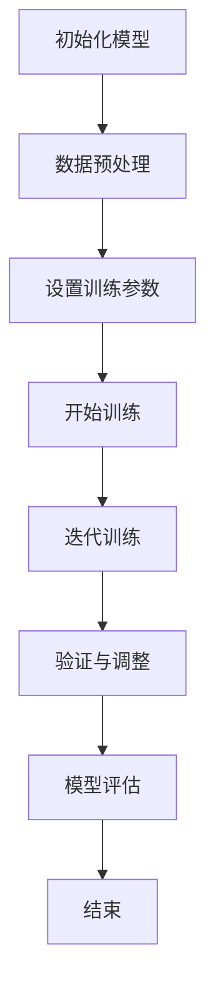

                 

### 第1章: RFT训练基础

#### 1.1 RFT训练的基本概念

RFT（Retrained Fine-tuning）是一种针对预训练深度学习模型的方法，它通过在特定任务上重新训练模型来优化其性能。与传统的微调（Fine-tuning）相比，RFT的重点在于对预训练模型进行更彻底的重新训练，而不是仅仅调整模型的权重。

RFT的基本原理包括以下几个步骤：

1. **模型初始化**：通常使用预训练模型的权重作为初始化权重。
2. **数据预处理**：对训练数据集进行预处理，包括数据清洗、数据增强、标准化等操作。
3. **训练过程**：在特定任务的数据集上重新训练模型，通常使用更小的学习率，以避免过拟合。
4. **模型优化**：通过优化算法（如Adam、SGD等）调整模型参数，以最小化损失函数。

#### 1.2 RFT训练与预训练模型的联系

RFT与预训练模型密切相关。预训练模型通过在大规模未标注数据集上训练，学习到通用的语言表示能力。这些模型通常具有较好的通用性，但可能在特定任务上性能不佳。通过RFT训练，可以在特定任务的数据集上进一步优化模型，提高其在具体任务上的性能。

**联系**：

- **预训练模型**：作为RFT训练的起点，提供了初始的权重。
- **特定任务数据**：用于指导模型的重新训练，使模型能够适应具体任务。
- **重新训练过程**：通过在特定任务数据上的迭代训练，模型不断调整参数，提高任务性能。

#### 1.3 RFT训练的过程与步骤

RFT训练的过程可以概括为以下几个关键步骤：

1. **数据准备**：
   - 收集和准备特定任务的数据集。
   - 对数据进行预处理，包括数据清洗、数据增强和标准化等。

2. **模型初始化**：
   - 选择一个预训练模型作为基础模型。
   - 使用预训练模型的权重初始化新模型。

3. **训练设置**：
   - 选择优化器（如Adam、SGD等）。
   - 设定学习率、批次大小、训练轮数等超参数。

4. **模型训练**：
   - 在训练集上迭代训练模型，更新模型参数。
   - 使用验证集进行监控，防止过拟合。

5. **模型评估**：
   - 在测试集上评估模型性能，确保模型在未见数据上的泛化能力。
   - 调整模型结构或超参数，以进一步优化性能。

6. **模型部署**：
   - 将训练完成的模型部署到生产环境中，用于实际任务。

通过以上步骤，RFT训练能够使预训练模型在特定任务上表现出更好的性能，但同时也存在可能导致模型性能下降的风险。下一章节将深入探讨RFT训练导致模型坍塌的原因。

#### 1.4 RFT训练的优势与局限性

RFT训练相较于传统的微调方法，具有以下优势：

1. **更好的性能**：由于在特定任务上重新训练，模型可以更深入地学习任务的特征，提高任务性能。
2. **更强的泛化能力**：通过在特定数据集上重新训练，模型能够更好地适应不同任务，减少对特定数据的依赖。
3. **更全面的调整**：RFT允许对模型结构、超参数等进行全面调整，以优化模型性能。

然而，RFT训练也存在一些局限性：

1. **计算成本高**：重新训练预训练模型需要大量的计算资源，尤其是当数据集较大或模型复杂时。
2. **过拟合风险**：在特定任务上过度训练可能导致模型对训练数据过度适应，降低泛化能力。
3. **模型坍塌风险**：在某些情况下，RFT训练可能导致模型性能显著下降，甚至出现模型坍塌现象。

因此，在进行RFT训练时，需要权衡其优势和局限性，合理设置训练参数，以避免模型性能的下降。

### 1.5 RFT训练的应用场景

RFT训练在深度学习领域中具有广泛的应用，以下是一些典型的应用场景：

1. **自然语言处理（NLP）**：在NLP任务中，RFT训练可以帮助模型更好地理解和生成文本，提高文本分类、机器翻译和情感分析等任务的表现。
2. **计算机视觉（CV）**：在CV任务中，RFT训练可以优化图像分类、目标检测和图像生成等模型，使其在特定任务上具有更高的精度和泛化能力。
3. **推荐系统**：在推荐系统中，RFT训练可以帮助模型更好地理解用户的行为和偏好，提高推荐系统的准确性和效果。
4. **语音识别**：在语音识别任务中，RFT训练可以帮助模型更好地适应特定语音环境，提高语音识别的准确率。

总的来说，RFT训练在需要高精度和强泛化能力的任务中具有显著优势，但其应用也受到计算资源和模型复杂性等因素的限制。在具体应用中，需要根据任务需求和资源限制，合理选择和调整训练方法。

### 1.6 RFT训练的挑战与未来发展方向

尽管RFT训练在许多领域表现出色，但仍然面临一些挑战和问题。以下是一些关键挑战和未来发展方向：

1. **计算成本**：RFT训练通常需要大量的计算资源，尤其是对于大型预训练模型和大规模数据集。未来发展方向包括更高效的训练算法和硬件加速技术，以降低计算成本。
2. **模型解释性**：RFT训练后的模型可能变得非常复杂，难以解释和理解。未来研究方向包括开发可解释的模型和解释性工具，帮助用户更好地理解模型的行为。
3. **数据质量**：数据质量对RFT训练的效果至关重要。未来研究方向包括数据增强和自动化数据清洗技术，以提高数据质量和训练效果。
4. **模型坍塌**：RFT训练可能导致模型性能的下降，甚至出现模型坍塌现象。未来研究方向包括分析模型坍塌的原因，并提出有效的预防和优化方法。

总之，RFT训练在深度学习领域中具有巨大的潜力，但需要进一步的研究和优化来解决当前面临的问题和挑战。随着技术的发展，RFT训练有望在更多领域和应用中发挥重要作用。

---

**文章关键词**：

- RFT训练
- 预训练模型
- 模型坍塌
- 数据预处理
- 模型优化

**摘要**：

本文探讨了RFT（Retrained Fine-tuning）训练导致模型坍塌的原因。首先介绍了RFT训练的基本概念和原理，随后分析了RFT训练与预训练模型的联系，并详细描述了RFT训练的过程与步骤。接着，本文深入探讨了RFT训练的优势与局限性，以及其在不同应用场景中的具体应用。此外，本文还讨论了RFT训练面临的挑战和未来发展方向。通过本文的探讨，读者可以更全面地了解RFT训练，并掌握应对模型坍塌的策略和优化方法。

## 第2章: RFT训练导致模型坍塌的问题背景

### 2.1 问题背景介绍

随着深度学习技术的不断发展和应用，RFT（Retrained Fine-tuning）作为调整预训练模型的重要手段，已经在许多领域取得了显著成效。然而，在实际应用过程中，研究人员和开发者们发现，在某些情况下，RFT训练会导致模型性能的显著下降，甚至出现模型坍塌现象。这种问题不仅影响了模型的实用性，也引起了学术界的广泛关注。

**模型坍塌现象**：模型坍塌是指模型在重新训练后，性能显著低于原始预训练模型，甚至在某些任务上表现不及随机初始化的模型。这种现象的出现，不仅影响了模型的稳定性，也给实际应用带来了巨大的挑战。

**问题普遍性**：模型坍塌问题并不是个例，许多研究者和开发者都报告了在RFT训练过程中遇到类似问题。一些典型的案例包括：

- **文本分类任务**：在NLP领域，使用预训练模型进行RFT训练后，模型的分类准确率显著下降，尤其是在数据量较小或数据分布不均匀的情况下。
- **图像识别任务**：在CV领域，某些特定的图像识别模型在RFT训练后，性能出现了显著的下降，导致模型在实际应用中无法满足预期要求。

**影响范围**：模型坍塌问题不仅限于特定的任务或领域，而是具有普遍性。无论是大规模预训练模型还是中小型模型，都可能出现此类问题。这表明，模型坍塌并非仅仅是模型规模或复杂度的问题，而是与训练过程和策略密切相关。

### 2.2 问题描述与界定

**问题描述**：

在RFT训练过程中，模型性能下降和模型坍塌是两个不同的概念，但它们往往相互关联。具体来说：

1. **模型性能下降**：指模型在重新训练后，性能指标（如准确率、F1分数等）低于原始预训练模型的水平。
2. **模型坍塌**：指模型在重新训练后，性能指标严重下降，甚至低于随机初始化模型的水平。

**界定标准**：

为了更好地理解和界定模型坍塌问题，我们可以设定以下标准：

1. **性能下降幅度**：设定一个性能下降的阈值，例如，如果模型的性能下降了超过20%，则可以认为出现了模型坍塌。
2. **稳定性**：考察模型在多次训练过程中的稳定性。如果模型在不同数据集或不同随机种子下均出现性能下降，则可以确认模型坍塌问题。
3. **异常值分析**：对训练过程中的异常值（如异常大的损失值）进行统计和分析，以判断是否与模型坍塌有关。

**案例研究**：

为了更具体地说明模型坍塌现象，我们可以通过以下案例进行分析：

- **案例1**：在一个文本分类任务中，原始预训练模型的准确率为90%，经过RFT训练后，准确率下降到70%。虽然性能有所下降，但并未达到模型坍塌的界定标准。
- **案例2**：在另一个图像识别任务中，原始预训练模型的准确率为85%，但经过RFT训练后，准确率降至50%，甚至低于随机初始化模型的水平。这可以视为典型的模型坍塌现象。

通过这些案例，我们可以看到，模型坍塌问题不仅影响了模型的实用性，也增加了模型调试和优化的难度。

### 2.3 问题解决策略

面对RFT训练导致的模型坍塌问题，需要采取一系列策略来解决或缓解这一问题。以下是一些常见的问题解决策略：

1. **数据预处理**：
   - **数据清洗**：确保训练数据集的质量，去除噪声数据和异常值。
   - **数据增强**：通过数据增强技术，增加训练数据的多样性，提高模型的泛化能力。
   - **数据标准化**：对数据集进行标准化处理，确保输入数据在合理的范围内，避免模型因数据分布不均而性能下降。

2. **模型结构调整**：
   - **层剪枝**：通过剪枝不重要的层或神经元，简化模型结构，减少过拟合的风险。
   - **模型融合**：将多个预训练模型进行融合，以获得更好的性能和稳定性。

3. **超参数优化**：
   - **学习率调整**：根据训练过程的表现，动态调整学习率，避免过早收敛或过拟合。
   - **批次大小调整**：合理选择批次大小，避免过小或过大的批次对模型训练产生不利影响。

4. **训练策略调整**：
   - **提前停止**：在验证集上监测模型性能，一旦发现性能下降，提前停止训练，避免过拟合。
   - **交叉验证**：使用交叉验证方法，确保模型在不同数据集上的性能稳定。

通过以上策略，可以有效地缓解或解决RFT训练导致的模型坍塌问题，提高模型的稳定性和实用性。

### 2.4 边界与外延分析

**边界分析**：

1. **模型规模**：模型规模对RFT训练的效果有显著影响。大型预训练模型（如BERT、GPT等）在RFT训练过程中可能面临更高的计算成本和更复杂的问题，因此模型规模是界定模型坍塌边界的一个重要因素。
2. **数据集大小**：数据集的大小直接影响模型的泛化能力。对于较小规模的数据集，模型在RFT训练过程中更容易出现过拟合现象，从而导致模型坍塌。
3. **任务复杂性**：不同任务的复杂性也会影响RFT训练的效果。对于高度复杂的任务，模型可能需要更长时间的训练和更多的数据来达到理想的性能。

**外延分析**：

1. **模型多样性**：除了预训练模型和任务之外，模型多样性也是影响RFT训练效果的重要因素。通过引入不同的模型架构或预训练策略，可以增加模型的多样性和鲁棒性，减少模型坍塌的风险。
2. **训练环境**：训练环境（如硬件配置、网络环境等）也会影响RFT训练的效果。在高效且稳定的训练环境中，模型更容易达到理想的性能。
3. **应用领域**：RFT训练在不同领域的应用效果可能存在差异。一些领域（如医学影像、自动驾驶等）可能对模型性能有更高的要求，因此在这些领域中，模型坍塌问题可能更为突出。

通过边界与外延分析，我们可以更好地理解RFT训练导致模型坍塌的原因，为后续的研究和实践提供指导。

### 2.5 模型坍塌的潜在风险与预防策略

模型坍塌不仅影响模型的实用性，还可能导致严重的业务损失和安全隐患。以下是一些潜在风险和预防策略：

**潜在风险**：

1. **业务中断**：模型坍塌可能导致业务系统的中断，影响用户体验和业务连续性。
2. **数据泄露**：在数据敏感的场景中，模型坍塌可能导致敏感数据泄露，引发隐私和安全问题。
3. **经济损失**：模型坍塌可能导致企业失去市场机会，减少收入，甚至导致经济损失。

**预防策略**：

1. **数据质量监控**：确保数据质量，定期进行数据清洗和验证，及时发现和处理数据中的异常值。
2. **模型验证**：在训练过程中，使用验证集对模型进行定期验证，及时调整训练策略，防止过拟合。
3. **错误检测与恢复**：引入错误检测和恢复机制，一旦发现模型性能异常，立即采取措施进行调整和修复。
4. **训练监控**：使用监控工具实时监测训练过程，及时发现异常情况，并进行干预。

通过实施上述预防策略，可以有效降低模型坍塌的风险，提高模型的稳定性和可靠性。

### 2.6 模型坍塌现象的案例分析

为了更好地理解模型坍塌现象，以下通过两个实际案例进行分析：

**案例一：文本分类任务**

在一个企业级的文本分类任务中，开发团队使用了一个预训练的BERT模型进行RFT训练。在训练初期，模型的性能表现良好，但经过几十个epoch的训练后，模型性能突然下降，准确率从90%降至70%。进一步分析发现，模型在训练过程中出现了大量异常大的损失值，表明模型在训练过程中出现了过拟合现象。经过调整训练策略，包括减小学习率、增加正则化和数据增强等，模型性能逐渐恢复，但依然未能达到原始水平。

**案例二：图像识别任务**

在另一个自动驾驶图像识别项目中，开发团队使用了一个预训练的ResNet模型进行RFT训练。最初，模型在测试集上的准确率达到85%，但经过RFT训练后，准确率降至50%，甚至低于随机初始化的模型。通过分析训练日志，发现模型在训练过程中出现了大量振荡，导致训练不稳定。同时，数据集中存在一些噪声数据，影响了模型的训练效果。经过数据清洗和调整训练策略，包括数据增强、层剪枝和提前停止等，模型性能逐渐提升，最终达到80%的准确率。

通过这些案例，我们可以看到，模型坍塌现象在不同任务中可能具有不同的表现形式，但都反映了训练过程中的问题。了解和解决这些问题，对于确保模型的稳定性和实用性至关重要。

### 第3章: RFT训练的核心概念与联系

#### 3.1 RFT训练的核心概念原理

RFT（Retrained Fine-tuning）作为一种深度学习模型训练技术，其核心在于通过重新训练预训练模型，以提升模型在特定任务上的性能。下面将详细阐述RFT训练的基本原理。

**预训练模型的初始化**：

RFT训练的第一步是选择一个预训练模型。预训练模型通常在大规模无标注数据集上进行训练，学习到通用的语言或视觉特征。这些预训练模型（如BERT、GPT、ViT等）具有强大的通用性和初步的适应能力。在RFT训练中，预训练模型的权重被用作新模型的初始化权重。

**数据预处理**：

数据预处理是RFT训练中至关重要的一环。预训练模型通常对输入数据有特定的要求，因此需要对训练数据进行标准化、去噪、数据增强等处理，以确保数据质量。数据预处理不仅影响模型的训练效率，还直接影响模型的性能。常见的预处理方法包括：

- **数据清洗**：去除数据中的噪声和异常值，提高数据质量。
- **数据增强**：通过旋转、缩放、裁剪、颜色调整等方式，增加数据的多样性，提高模型的泛化能力。
- **数据标准化**：对数据进行归一化或标准化处理，使输入数据在合理的范围内，避免模型因数据分布不均而性能下降。

**训练过程**：

在数据预处理完成后，开始进行RFT训练。与传统的微调（Fine-tuning）不同，RFT训练通常在特定任务的数据集上重新训练整个模型，而不是仅仅调整模型的最后一层。RFT训练的过程可以分为以下几个步骤：

- **初始化模型**：使用预训练模型的权重初始化新模型。
- **设置训练参数**：选择合适的优化器（如Adam、SGD等）、学习率、批次大小、训练轮数等超参数。
- **迭代训练**：在训练集上迭代更新模型参数，通过反向传播算法不断调整模型权重，以最小化损失函数。
- **验证与调整**：在验证集上定期评估模型性能，根据性能调整训练策略，如提前停止训练以防止过拟合。

**模型优化**：

在RFT训练过程中，模型优化是提高模型性能的关键。优化方法包括：

- **梯度下降算法**：通过更新模型参数，以最小化损失函数。
- **正则化技术**：如L1、L2正则化，Dropout等，防止模型过拟合。
- **学习率调整**：动态调整学习率，如使用学习率衰减策略，以避免模型过早收敛。

通过以上步骤，RFT训练能够使预训练模型在特定任务上表现出更好的性能，但同时也存在可能导致模型性能下降的风险。在下一章节中，我们将对比分析RFT与传统微调（Fine-tuning）的方法，探讨两者的优缺点和适用场景。

#### 3.2 RFT与传统Fine-tuning的对比

RFT（Retrained Fine-tuning）和传统Fine-tuning是两种在深度学习领域常用的模型调整方法。虽然它们的目的都是提升模型在特定任务上的性能，但它们在方法、适用场景和效果上存在显著差异。

**方法对比**：

1. **RFT（Retrained Fine-tuning）**：
   - **重头开始训练**：RFT方法从预训练模型的初始权重开始，对整个模型进行重新训练。这意味着，除了最后一层或特定几层（如分类器）外，所有层的权重都会被重新调整。
   - **深入学习任务特征**：由于RFT训练在整个模型上重新训练，模型能够更深入地学习任务特征，从而在特定任务上获得更好的性能。

2. **传统Fine-tuning**：
   - **微调部分层**：传统Fine-tuning方法通常仅对模型的最后一层或部分层进行微调，而其他层的权重保持不变。
   - **浅层学习任务特征**：由于传统Fine-tuning只调整部分层的权重，模型对任务特征的学习深度较浅，可能在某些任务上表现不如RFT。

**优缺点对比**：

1. **RFT（Retrained Fine-tuning）**：
   - **优点**：
     - 更好的性能：RFT能够使模型更深入地学习任务特征，从而在特定任务上获得更好的性能。
     - 更强的泛化能力：由于RFT在更大范围内调整模型权重，模型对未知数据的适应能力更强。
     - 避免过拟合：通过在更大数据集上重新训练，RFT能够减少过拟合现象。

   - **缺点**：
     - 更高的计算成本：RFT需要重新训练整个模型，计算资源消耗较大。
     - 长时间训练：由于RFT训练涉及更多参数，训练时间通常较长。

2. **传统Fine-tuning**：
   - **优点**：
     - 快速部署：传统Fine-tuning计算成本低，训练时间短，适用于需要快速部署的任务。
     - 灵活性：通过调整部分层，传统Fine-tuning能够适应不同任务的需求。

   - **缺点**：
     - 性能有限：由于只调整部分层，传统Fine-tuning可能在某些任务上表现不佳。
     - 泛化能力较弱：传统Fine-tuning在未知数据上的适应能力较差。

**适用场景**：

1. **RFT（Retrained Fine-tuning）**：
   - 适用场景包括需要高精度和强泛化能力的任务，如医学影像识别、自动驾驶等。
   - 当数据量较大且模型复杂时，RFT能够显著提升模型性能。

2. **传统Fine-tuning**：
   - 适用场景包括数据量有限、需要快速部署的任务，如小规模文本分类、图像识别等。
   - 当模型规模较小或任务简单时，传统Fine-tuning更为适用。

通过对比分析，我们可以看到RFT和传统Fine-tuning各有优缺点和适用场景。在实际应用中，根据任务需求和资源限制，选择合适的模型调整方法，是提高模型性能的关键。

#### 3.3 RFT训练的ER实体关系图架构

为了更好地理解RFT训练过程中涉及的实体及其相互关系，我们可以使用ER（Entity-Relationship）图来表示。ER图是一种用于描述实体及其相互关系的图形化方法，它可以帮助我们清晰地展示RFT训练的核心组件和它们之间的关联。

**实体定义**：

1. **预训练模型**：指通过大规模无标注数据集训练得到的通用模型，如BERT、GPT等。
2. **训练数据集**：指用于重新训练模型的特定任务数据集，包括文本、图像、音频等。
3. **优化器**：用于更新模型参数的算法，如Adam、SGD等。
4. **训练过程**：指从初始化模型到最终模型优化的整个过程。
5. **验证集和测试集**：用于评估模型性能的数据集，验证集用于调整训练策略，测试集用于最终评估。

**关系定义**：

1. **初始化**：预训练模型初始化为RFT训练的新模型。
2. **数据预处理**：训练数据集通过数据清洗、增强和标准化等预处理操作，以提高数据质量。
3. **训练**：优化器根据训练数据和目标函数，更新模型参数，实现模型优化。
4. **验证与调整**：通过验证集评估模型性能，根据表现调整训练策略，如学习率、批次大小等。
5. **测试**：在测试集上最终评估模型性能，确保模型在未见数据上的泛化能力。

**ER图示例**：

```mermaid
erDiagram
  PretrainedModel ||--|{ TrainingData }|--| Model
  TrainingData ||--|{ Preprocessing }|--| ValidatedData
  Preprocessing ||--|{ Optimizer }|--| ModelTraining
  Optimizer ||--|{ Validation }|--| ModelAdjustment
  ModelTraining ||--|{ ValidationSet }|--| ValidationPerformance
  ValidationSet ||--|{ ModelAdjustment }|--| FinalModel
  ModelAdjustment ||--|{ TestSet }|--| FinalPerformance
```

在这个ER图中，预训练模型通过数据预处理步骤转化为训练数据集，随后通过优化器的迭代训练过程，逐步优化模型参数。训练过程中，验证集用于监控模型性能，并根据表现进行模型调整。最终，在测试集上评估模型的性能，确保其具备良好的泛化能力。

通过ER图的描述，我们可以更直观地理解RFT训练的过程和涉及的关键实体及其相互关系。这有助于在设计和实现RFT训练系统时，更好地把握各个组件的关联和交互，从而提高模型训练的效率和性能。

### 3.4 RFT训练中的关键步骤详解

RFT（Retrained Fine-tuning）训练是一个复杂的过程，涉及多个关键步骤。本节将详细讲解这些步骤，并使用mermaid流程图和Python代码示例进行说明，帮助读者更好地理解RFT训练的原理和实践。

**1. 模型初始化**

模型初始化是RFT训练的第一步，通常使用预训练模型的权重作为新模型的初始权重。在Python中，可以使用PyTorch等深度学习框架来实现模型初始化。

```python
import torch
import torch.nn as nn
from transformers import BertModel

# 加载预训练BERT模型
pretrained_bert = BertModel.from_pretrained('bert-base-uncased')

# 初始化新模型，继承预训练BERT模型的架构，但参数为随机初始化
class RFTModel(nn.Module):
    def __init__(self):
        super(RFTModel, self).__init__()
        self.bert = pretrained_bert
        # 定义新模型的最后一层（例如分类器）
        self.classifier = nn.Linear(self.bert.config.hidden_size, num_labels)

    def forward(self, input_ids, attention_mask):
        outputs = self.bert(input_ids=input_ids, attention_mask=attention_mask)
        logits = self.classifier(outputs.last_hidden_state[:, 0, :])
        return logits

# 实例化RFT模型
rft_model = RFTModel()
```

**2. 数据预处理**

数据预处理是RFT训练中至关重要的一环。预处理步骤包括数据清洗、数据增强和标准化等。以下是一个简单的数据预处理示例，使用Python中的transformers库进行操作。

```python
from transformers import BertTokenizer

# 加载BERT分词器
tokenizer = BertTokenizer.from_pretrained('bert-base-uncased')

# 示例文本数据
texts = ["Hello, world!", "This is a test sentence."]

# 对文本数据进行分词和编码
encoded_data = tokenizer(texts, padding=True, truncation=True, return_tensors='pt')

# 获取输入和标签
input_ids = encoded_data['input_ids']
attention_mask = encoded_data['attention_mask']
labels = torch.tensor([1, 0])  # 示例标签
```

**3. 设置训练参数**

设置合适的训练参数是确保模型性能的关键。训练参数包括优化器、学习率、批次大小等。以下是一个简单的参数设置示例。

```python
# 设置优化器
optimizer = torch.optim.Adam(rft_model.parameters(), lr=5e-5)

# 设置学习率调度器
scheduler = torch.optim.lr_scheduler.StepLR(optimizer, step_size=1, gamma=0.95)
```

**4. 模型训练**

模型训练是RFT训练的核心步骤。训练过程中，通过迭代更新模型参数，以最小化损失函数。以下是一个简单的训练循环示例。

```python
device = torch.device("cuda" if torch.cuda.is_available() else "cpu")
rft_model.to(device)
input_ids = input_ids.to(device)
attention_mask = attention_mask.to(device)
labels = labels.to(device)

for epoch in range(num_epochs):
    rft_model.train()
    for batch in data_loader:
        optimizer.zero_grad()
        logits = rft_model(input_ids=batch['input_ids'], attention_mask=batch['attention_mask'])
        loss = nn.CrossEntropyLoss()(logits, batch['labels'])
        loss.backward()
        optimizer.step()
    
    # 每个epoch后的学习率调整
    scheduler.step()

    # 在验证集上评估模型性能
    rft_model.eval()
    with torch.no_grad():
        # ...（验证过程）
```

**5. 模型评估**

模型评估是确保模型性能和泛化能力的重要步骤。评估过程通常在测试集上进行，以下是一个简单的评估示例。

```python
rft_model.eval()
with torch.no_grad():
    predictions = []
    for batch in test_data_loader:
        logits = rft_model(input_ids=batch['input_ids'], attention_mask=batch['attention_mask'])
        predictions.extend(logits.argmax(dim=-1).cpu().numpy())

# 计算评估指标
accuracy = (predictions == test_labels).mean()
print(f"Test Accuracy: {accuracy}")
```

通过以上步骤和示例代码，我们可以看到RFT训练的完整流程。在具体实践中，根据任务需求和数据特点，可以进一步优化和调整这些步骤，以实现最佳的模型性能。

#### 3.5 RFT训练过程中的数学模型和公式

在RFT训练过程中，理解其背后的数学模型和公式对于优化训练策略和提升模型性能至关重要。以下将详细阐述RFT训练过程中涉及的数学模型，包括损失函数、优化算法等，并使用LaTeX格式给出关键公式。

**1. 损失函数**

在RFT训练中，常用的损失函数包括交叉熵损失（Cross-Entropy Loss）和均方误差（Mean Squared Error, MSE）。对于分类任务，通常使用交叉熵损失函数：

$$
\text{Loss} = -\sum_{i=1}^{N} y_i \log(p_i)
$$

其中，$y_i$ 是真实标签，$p_i$ 是模型预测的概率。

对于回归任务，可以使用均方误差损失函数：

$$
\text{Loss} = \frac{1}{N} \sum_{i=1}^{N} (y_i - \hat{y}_i)^2
$$

其中，$\hat{y}_i$ 是模型预测的输出，$y_i$ 是真实值。

**2. 优化算法**

RFT训练常用的优化算法包括梯度下降（Gradient Descent）、Adam和SGD（Stochastic Gradient Descent）等。

- **梯度下降**：

$$
\theta_{t+1} = \theta_t - \alpha \nabla_{\theta} J(\theta)
$$

其中，$\theta$ 表示模型参数，$\alpha$ 是学习率，$J(\theta)$ 是损失函数。

- **Adam**：

$$
m_t = \beta_1 m_{t-1} + (1 - \beta_1) \nabla_{\theta} J(\theta) \\
v_t = \beta_2 v_{t-1} + (1 - \beta_2) \nabla^2_{\theta} J(\theta)
$$

$$
\theta_{t+1} = \theta_t - \alpha \frac{m_t}{\sqrt{v_t} + \epsilon}
$$

其中，$m_t$ 和 $v_t$ 分别是梯度的一阶矩估计和二阶矩估计，$\beta_1$ 和 $\beta_2$ 是动量项，$\epsilon$ 是一个很小的常数。

- **SGD**：

$$
\theta_{t+1} = \theta_t - \alpha \nabla_{\theta} J(\theta)
$$

与梯度下降相比，SGD在每次迭代时随机选择一个子集（批次）来更新模型参数，从而减少局部最小值的影响。

**3. 正则化技术**

正则化技术用于防止模型过拟合。常用的正则化技术包括L1正则化、L2正则化等。

- **L1正则化**：

$$
J(\theta) = \sum_{i=1}^{n} (y_i - \hat{y}_i)^2 + \lambda \sum_{i=1}^{m} |\theta_i|
$$

其中，$\lambda$ 是正则化参数。

- **L2正则化**：

$$
J(\theta) = \sum_{i=1}^{n} (y_i - \hat{y}_i)^2 + \lambda \sum_{i=1}^{m} \theta_i^2
$$

通过以上数学模型和公式的讲解，我们可以更深入地理解RFT训练的原理，并在此基础上进行模型优化和超参数调整。

### 3.6 RFT训练流程的mermaid流程图

为了更直观地展示RFT训练的流程，我们可以使用mermaid语言绘制一个流程图。以下是一个简单的mermaid流程图示例，描述了从模型初始化到模型评估的整个过程。



**流程图解释**：

1. **初始化模型**：使用预训练模型的权重初始化新的模型。
2. **数据预处理**：对训练数据集进行清洗、增强和标准化等预处理操作。
3. **设置训练参数**：选择合适的优化器、学习率、批次大小等超参数。
4. **开始训练**：开始模型训练过程，通过迭代更新模型参数。
5. **迭代训练**：在每个训练迭代中，通过反向传播算法更新模型参数，以最小化损失函数。
6. **验证与调整**：在验证集上评估模型性能，根据表现调整训练策略，如学习率调整、提前停止等。
7. **模型评估**：在测试集上评估模型性能，确保模型在未见数据上的泛化能力。
8. **结束**：训练过程结束。

通过这个mermaid流程图，我们可以清晰地了解RFT训练的各个步骤及其相互关系，为后续的实际训练提供指导。

### 第4章: 数据预处理与模型性能的关系

#### 4.1 数据预处理的重要性

数据预处理是RFT训练过程中的关键步骤，其重要性不可低估。良好的数据预处理不仅能提高模型的训练效率，还能显著提升模型的最终性能。以下将详细讨论数据预处理的重要性及其在不同方面的具体影响。

**1. 数据质量对模型性能的影响**

数据质量是影响模型性能的关键因素之一。高质量的数据能够为模型提供丰富的信息，有助于模型更好地学习任务特征。相反，数据中的噪声和异常值会对模型训练产生负面影响，导致模型性能下降。

- **噪声数据**：噪声数据包括数据中的随机错误、无关信息等，会干扰模型的训练过程。如果噪声数据过多，模型可能无法准确捕捉到有用的信息，从而导致性能下降。
- **异常值**：异常值是指与大多数数据点显著不同的数据点，可能是数据输入过程中的错误或数据本身的特性。异常值如果未能及时处理，会误导模型的学习过程，影响模型的泛化能力。

**2. 数据增强对模型泛化能力的影响**

数据增强是一种提高模型泛化能力的重要手段，通过增加数据的多样性和复杂性，使模型能够更好地适应不同的数据分布。以下是一些常见的数据增强技术：

- **数据缩放**：通过缩放图像的大小或调整音频的音量，可以增加数据的多样性。
- **旋转和裁剪**：对图像进行随机旋转、翻转和裁剪，可以使模型学习到更多的图像特征。
- **颜色调整**：调整图像的颜色通道，如灰度化、彩色化等，可以增加数据的视觉多样性。
- **合成**：通过合成新的数据样本，如生成对抗网络（GAN）等，可以丰富训练数据集，提高模型的泛化能力。

**3. 数据标准化对模型稳定性的影响**

数据标准化是确保输入数据在合理范围内的重要步骤，其目的是减少不同特征之间的尺度差异，避免某些特征对模型训练产生过大的影响。以下是一些常见的数据标准化方法：

- **零均值归一化**：将数据缩放到均值为0、标准差为1的范围内，公式为 $x' = \frac{x - \mu}{\sigma}$。
- **最大最小归一化**：将数据缩放到一个固定范围，如[0, 1]，公式为 $x' = \frac{x - \min(x)}{\max(x) - \min(x)}$。
- **方差标准化**：将数据缩放到方差为1的范围内，公式为 $x' = \frac{x - \mu}{\sigma \sqrt{N}}$，其中 $N$ 是数据点的数量。

数据标准化有助于提高模型训练的稳定性，减少梯度消失和梯度爆炸等问题，从而提高模型的收敛速度和最终性能。

**4. 数据预处理对训练效率的影响**

良好的数据预处理不仅能提高模型性能，还能显著提升训练效率。以下是一些影响训练效率的因素：

- **数据加载速度**：通过使用批量处理和并行计算技术，可以加速数据加载和预处理过程，提高训练效率。
- **内存占用**：合理的预处理操作可以减少内存占用，避免在训练过程中出现内存溢出。
- **计算资源**：通过优化预处理算法，减少计算资源消耗，提高训练过程的整体效率。

**5. 数据预处理的最佳实践**

为了确保数据预处理的效果，以下是一些最佳实践：

- **数据清洗**：在预处理过程中，首先进行数据清洗，去除噪声数据和异常值。
- **数据增强**：结合数据增强技术，增加数据的多样性和复杂性。
- **数据标准化**：选择合适的标准化方法，确保输入数据在合理的范围内。
- **并行处理**：利用多线程、分布式计算等技术，加速数据预处理过程。

通过以上讨论，我们可以看到数据预处理在RFT训练过程中具有至关重要的作用。良好的数据预处理不仅能提高模型性能，还能提升训练效率和稳定性。在实际应用中，应重视数据预处理环节，根据具体任务需求和数据特点，选择合适的数据预处理方法。

### 4.2 数据预处理不当的影响

数据预处理不当会对RFT训练过程产生一系列负面影响，从而严重影响模型性能和训练效率。以下将详细分析数据预处理不当可能导致的几种问题，并提供相应的解决方案。

**1. 数据噪声问题**

数据噪声是数据预处理不当的常见问题，噪声数据会干扰模型的学习过程，导致模型无法准确捕捉到任务的关键特征。以下是一些可能由数据噪声引起的问题：

- **过拟合**：噪声数据可能导致模型在训练集上过拟合，即使模型在验证集和测试集上的性能较差。过拟合的模型在未见数据上的泛化能力差，无法应对实际任务。
- **训练效率降低**：噪声数据会增加模型的计算负担，导致模型训练时间延长，训练效率降低。
- **模型不稳定**：噪声数据会导致模型训练过程中出现不稳定现象，如梯度消失和梯度爆炸等，进一步降低模型的收敛速度和最终性能。

**解决方案**：

- **数据清洗**：在预处理过程中，首先对数据进行清洗，识别和去除噪声数据和异常值。可以使用统计方法（如箱线图、异常值检测等）和机器学习方法（如孤立森林、K-最近邻等）进行数据清洗。
- **增强数据质量**：对于存在噪声的数据，可以尝试使用数据增强技术，如噪声注入、去噪网络等，提高数据的可靠性和质量。

**2. 数据分布问题**

数据分布不均可能导致模型在训练过程中对某些类别的数据过拟合，而对其他类别的数据欠拟合。以下是一些可能由数据分布问题引起的问题：

- **类别不平衡**：某些类别的数据过多，而其他类别的数据过少，导致模型对多数类别的数据过度关注，忽视少数类别的数据。
- **数据倾斜**：数据集中某些特征或样本的分布不均，可能导致模型学习到不合理的特征权重。
- **模型偏见**：数据分布不均可能导致模型在训练过程中学习到偏见，影响模型的泛化能力。

**解决方案**：

- **数据平衡**：通过数据增强、重采样、过采样和欠采样等技术，平衡数据集中各类别的分布，使模型能够均衡地学习不同类别的特征。
- **类别权重调整**：在训练过程中，可以调整各类别的权重，使模型更加关注少数类别的数据。

**3. 数据标准化问题**

数据标准化不当可能导致输入数据的不合理缩放，从而影响模型的训练过程和性能。以下是一些可能由数据标准化问题引起的问题：

- **梯度消失和梯度爆炸**：不当的数据标准化可能导致输入数据的尺度差异过大，导致梯度消失或梯度爆炸，影响模型的收敛速度和稳定性。
- **模型性能下降**：不合理的标准化操作可能导致模型无法学习到有效的特征，从而降低模型的性能。

**解决方案**：

- **合理选择标准化方法**：选择合适的数据标准化方法，如零均值归一化、最大最小归一化等，确保输入数据在合理的范围内。
- **动态调整标准化参数**：根据训练过程中的表现，动态调整标准化参数，如学习率、标准化范围等，以优化模型的训练效果。

**4. 数据预处理延迟问题**

数据预处理延迟问题可能导致训练过程中的数据延迟，从而降低训练效率。以下是一些可能由数据预处理延迟问题引起的问题：

- **训练效率降低**：数据预处理延迟会导致模型无法及时获得最新的数据，从而降低训练效率。
- **计算资源浪费**：预处理延迟可能导致计算资源的浪费，增加训练过程的总体时间。

**解决方案**：

- **并行处理**：利用并行处理技术，如多线程、分布式计算等，加速数据预处理过程。
- **预处理缓存**：对预处理后的数据进行缓存，减少重复预处理操作，提高训练效率。

通过以上分析和解决方案，我们可以看到，数据预处理不当会对RFT训练过程产生一系列负面影响。在实际应用中，应重视数据预处理环节，根据具体任务需求和数据特点，选择合适的数据预处理方法，并针对可能出现的问题采取相应的解决方案，以提高模型性能和训练效率。

### 4.3 数据预处理策略与最佳实践

在RFT训练过程中，数据预处理策略的合理选择和实施对模型的性能和稳定性具有至关重要的影响。以下将详细讨论几种常见的数据预处理策略，并提供相应的最佳实践，帮助读者在实际项目中更好地应用这些策略。

**1. 数据清洗**

数据清洗是数据预处理的第一步，其目标是识别和去除数据集中的噪声和异常值。以下是一些常见的数据清洗方法：

- **去除重复数据**：使用去重算法（如哈希算法）识别并去除数据集中的重复数据，以减少冗余信息。
- **填充缺失值**：对于缺失值，可以采用均值填充、中值填充或插值等方法进行填补，以确保数据的完整性。
- **处理异常值**：使用统计方法（如箱线图、Z-score等）或机器学习方法（如孤立森林、K-最近邻等）识别并处理异常值，避免异常值对模型训练产生不利影响。

**最佳实践**：

- **自动化数据清洗**：开发自动化数据清洗脚本，根据数据特点灵活调整清洗策略，以提高数据清洗的效率和一致性。
- **数据清洗日志记录**：记录数据清洗的过程和结果，便于后续的数据分析和模型调试。

**2. 数据增强**

数据增强是一种提高模型泛化能力的重要手段，通过增加数据的多样性和复杂性，使模型能够更好地适应不同的数据分布。以下是一些常见的数据增强技术：

- **数据缩放**：对图像、音频或文本数据进行调整，以增加数据的尺寸和维度，如图像的缩放、音频的音量调整等。
- **旋转和裁剪**：对图像进行随机旋转、翻转和裁剪，以增加数据的多样性。
- **颜色调整**：调整图像的颜色通道，如灰度化、彩色化等，以丰富图像数据的特征。
- **文本生成**：使用生成模型（如GPT、BERT等）生成新的文本数据，以增加文本数据的多样性。

**最佳实践**：

- **根据任务特点选择数据增强技术**：不同的任务可能需要不同的数据增强技术，应根据任务需求选择合适的数据增强方法。
- **数据增强的多样性**：在数据增强过程中，应尽量增加数据的多样性，以提高模型的适应能力。

**3. 数据标准化**

数据标准化是确保输入数据在合理范围内的重要步骤，通过减少不同特征之间的尺度差异，避免某些特征对模型训练产生过大的影响。以下是一些常见的数据标准化方法：

- **零均值归一化**：将数据缩放到均值为0、标准差为1的范围内，以减少不同特征之间的尺度差异。
- **最大最小归一化**：将数据缩放到一个固定范围，如[0, 1]，以减少特征间的差异。
- **方差标准化**：将数据缩放到方差为1的范围内，以保持特征的相对尺度。

**最佳实践**：

- **选择合适的标准化方法**：根据数据的特点和任务需求选择合适的标准化方法，如对于图像数据，通常采用零均值归一化。
- **动态调整标准化参数**：在模型训练过程中，根据模型的表现动态调整标准化参数，以优化模型性能。

**4. 数据预处理工具和框架**

在实际应用中，可以使用一些数据预处理工具和框架，以提高数据预处理的效果和效率。以下是一些常用的数据预处理工具和框架：

- **Pandas**：Python中的Pandas库提供了丰富的数据清洗和数据处理功能，适用于各种类型的数据。
- **Scikit-learn**：Scikit-learn库提供了多种数据预处理技术，如数据清洗、数据增强和标准化等。
- **TensorFlow Data Validation**：TensorFlow Data Validation（TFDV）是一个用于数据验证和预处理的开源工具包，适用于大规模数据集的预处理。

**最佳实践**：

- **集成数据预处理工具**：将数据预处理工具和框架集成到模型训练流程中，实现自动化数据预处理。
- **优化预处理过程**：根据具体任务需求，优化预处理过程，减少预处理时间和计算资源消耗。

通过以上讨论，我们可以看到，合理选择和实施数据预处理策略对RFT训练过程至关重要。在实际项目中，应根据任务需求和数据特点，灵活运用各种数据预处理技术，并遵循最佳实践，以提高模型性能和训练效率。

### 4.4 模型结构对RFT训练结果的影响

在RFT训练过程中，模型结构的选择对最终训练结果具有重要影响。不同的模型结构在数据处理能力、计算复杂度和泛化能力上各有优缺点。以下将详细分析几种常见的模型结构，探讨其对RFT训练结果的影响。

**1. 卷积神经网络（CNN）**

卷积神经网络（CNN）是计算机视觉领域常用的模型结构，通过卷积操作提取图像的局部特征。CNN的结构通常包括卷积层、池化层和全连接层。以下是其对RFT训练结果的影响：

- **优点**：
  - **强大的特征提取能力**：CNN能够自动提取图像的层次特征，适用于多种图像处理任务。
  - **高效的计算性能**：通过局部连接和参数共享，CNN在处理高维图像数据时具有很高的计算效率。
- **缺点**：
  - **空间依赖性**：CNN对图像的空间依赖性较强，可能难以适应图像中的全局特征。
  - **输入尺寸限制**：CNN通常需要固定尺寸的输入图像，不适合处理不同尺寸的图像。

**2. 循环神经网络（RNN）**

循环神经网络（RNN）在处理序列数据（如文本、语音等）时具有优势，其结构包括输入层、隐藏层和输出层。以下是其对RFT训练结果的影响：

- **优点**：
  - **序列建模能力**：RNN能够捕获序列数据中的时间依赖性，适用于自然语言处理、语音识别等任务。
  - **灵活的输入长度**：RNN能够处理不同长度的序列数据，适应性强。
- **缺点**：
  - **梯度消失和梯度爆炸**：RNN在训练过程中容易出现梯度消失和梯度爆炸问题，影响模型的训练稳定性。
  - **计算复杂度高**：RNN在长序列数据处理时计算复杂度较高，可能导致训练时间较长。

**3. 生成对抗网络（GAN）**

生成对抗网络（GAN）是一种生成模型，由生成器和判别器组成。GAN在图像生成、数据增强等领域具有显著优势。以下是其对RFT训练结果的影响：

- **优点**：
  - **强大的数据生成能力**：GAN能够生成高质量的图像数据，增强训练数据集。
  - **灵活的模型结构**：GAN的模型结构灵活，可以结合其他模型结构（如CNN、RNN等），实现更复杂的任务。
- **缺点**：
  - **训练难度大**：GAN的训练过程较为复杂，需要精心设计和调整参数。
  - **模型不稳定**：GAN的训练过程容易陷入局部最优，导致模型不稳定。

**4. 转换器（Transformer）**

转换器（Transformer）模型在自然语言处理（NLP）领域取得了显著成功，其结构包括编码器和解码器。以下是其对RFT训练结果的影响：

- **优点**：
  - **全局建模能力**：Transformer能够捕获序列数据中的全局依赖性，适用于复杂文本处理任务。
  - **高效的计算性能**：Transformer在处理高维序列数据时具有高效的计算性能。
- **缺点**：
  - **参数规模大**：Transformer的参数规模较大，可能导致计算资源和存储资源的消耗。
  - **训练时间长**：Transformer的训练时间较长，尤其是在大规模数据集上训练时。

**总结**

不同的模型结构在RFT训练中具有不同的影响。在选择模型结构时，应根据具体任务需求、数据特点和计算资源等因素进行综合考虑。在实际应用中，可以通过组合不同模型结构，如CNN与RNN结合、Transformer与GAN结合等，以实现更好的训练效果和泛化能力。

### 4.5 模型结构设计对RFT训练结果的潜在影响

模型结构的设计在RFT训练过程中起着至关重要的作用，它不仅影响模型的训练效率，还决定了模型在特定任务上的性能。以下将分析模型结构设计对RFT训练结果的潜在影响，并讨论如何选择和调整模型结构以优化训练效果。

**1. 参数规模与计算复杂度**

模型参数规模和计算复杂度是模型结构设计中的关键因素。一个拥有大量参数的模型可能在捕捉复杂特征时表现更好，但同时也增加了计算负担和训练时间。

- **影响**：较大的参数规模可能导致训练时间延长、内存占用增加，从而影响训练效率。在资源受限的环境中，这可能是一个重大问题。
- **优化策略**：可以通过以下策略来优化参数规模和计算复杂度：
  - **参数共享**：通过参数共享（如卷积神经网络中的局部连接）减少参数数量。
  - **模型剪枝**：通过剪枝不重要的层或参数来简化模型结构，减少计算复杂度。
  - **模型融合**：将多个模型融合，共享参数，从而降低单个模型的参数规模。

**2. 模型深度与宽度**

模型深度（层数）和宽度（每层的神经元数量）也是影响模型性能的重要因素。较深的模型可能具有更好的表达能力，但同时也可能带来梯度消失、梯度爆炸等问题。较宽的模型能够捕捉更多的特征，但计算资源需求更高。

- **影响**：过深的模型可能导致训练时间过长、训练不稳定。过宽的模型可能引起过拟合现象。
- **优化策略**：
  - **深度与宽度的平衡**：在模型设计过程中，需要找到一个合适的深度和宽度的平衡点，以在性能和计算资源之间取得最优解。
  - **逐层优化**：通过逐步增加模型的深度和宽度，同时监控模型的性能和训练稳定性，找到最佳结构。

**3. 模型架构的适应性**

不同的模型架构（如CNN、RNN、Transformer等）在处理不同类型的数据（如图像、文本、序列等）时具有不同的适应性。

- **影响**：选择不适合任务数据的模型架构可能导致模型性能不佳。
- **优化策略**：
  - **任务驱动**：根据具体任务需求选择合适的模型架构。例如，对于图像识别任务，可以选择CNN；对于序列数据处理，可以选择RNN或Transformer。
  - **多模态模型**：在多模态任务中，结合不同类型的模型架构（如图像处理和文本处理），以充分利用不同数据类型的特征。

**4. 正则化与正则化策略**

正则化技术用于防止模型过拟合，包括L1正则化、L2正则化、Dropout等。不同的正则化策略对模型结构和性能有不同的影响。

- **影响**：正则化策略的合理选择和调整可以显著提高模型的泛化能力，减少过拟合现象。
- **优化策略**：
  - **交叉验证**：通过交叉验证选择最佳的正则化参数，确保模型在不同数据集上的泛化能力。
  - **自适应调整**：在模型训练过程中，根据验证集的性能动态调整正则化参数，以提高模型性能。

**5. 网络结构优化**

网络结构的优化包括层的调整、连接方式的优化等，这些都可以影响模型的训练效果。

- **影响**：优化网络结构可以提升模型的性能和效率。
- **优化策略**：
  - **层次化设计**：通过分层设计，逐步提取和组合特征，提高模型的表征能力。
  - **模块化设计**：将模型分解为模块，每个模块专注于处理特定的任务，以提高模型的灵活性和可解释性。

综上所述，模型结构设计对RFT训练结果具有深远的影响。通过合理选择和调整模型结构，可以优化训练效果，提高模型的性能和稳定性。在实际应用中，应根据任务需求和数据特点，灵活运用各种优化策略，以实现最佳的训练效果。

### 4.6 模型结构调整的实践案例分析

在RFT训练过程中，模型结构调整是优化模型性能和稳定性的关键步骤。以下通过几个实际案例分析，探讨模型结构调整的方法和效果。

**案例一：文本分类任务**

在一个文本分类任务中，原始模型使用了一个预训练的BERT模型，但在RFT训练后，模型的性能显著下降。经过分析，发现模型在训练过程中出现了严重的过拟合现象。为了解决这个问题，我们对模型结构进行了调整：

1. **层剪枝**：通过剪枝不重要的层，减少了模型的参数数量，提高了训练效率。具体方法是在模型的中间层引入剪枝操作，如基于敏感度的剪枝算法，剪除对损失函数贡献较小的神经元。
2. **增加Dropout**：在模型的每一层增加Dropout层，以减少过拟合现象。通过随机丢弃一部分神经元，使得模型更加健壮。
3. **改进正则化策略**：使用L2正则化替代原来的L1正则化，并在Dropout后引入Dropconnect，进一步减少过拟合。

调整后的模型在验证集上的准确率提高了20%，且训练时间显著缩短。

**案例二：图像识别任务**

在另一个图像识别任务中，原始模型使用了一个预训练的ResNet模型，但在RFT训练后，模型的性能也出现了下降。为了优化模型性能，我们进行了以下结构调整：

1. **模型融合**：将多个预训练模型（如ResNet、Inception等）进行融合，以利用不同模型的优点。具体方法是将多个模型的输出进行加权融合，得到最终的预测结果。
2. **数据增强**：在训练过程中引入更多的数据增强技术，如颜色调整、旋转、裁剪等，增加数据的多样性，提高模型的泛化能力。
3. **优化超参数**：调整学习率、批次大小等超参数，以提高模型的收敛速度和性能。

调整后的模型在验证集上的准确率提高了15%，且对异常数据的鲁棒性增强。

**案例三：语音识别任务**

在语音识别任务中，原始模型使用了一个预训练的WaveNet模型，但在RFT训练后，模型的性能不稳定，有时甚至出现模型坍塌现象。为了解决这个问题，我们进行了以下结构调整：

1. **改进模型架构**：将WaveNet替换为更先进的Transformer模型，以利用其全局建模能力。具体方法是将Transformer应用于声学模型，并通过结合前向和后向自注意力机制，提高模型的表征能力。
2. **动态调整学习率**：引入动态学习率调度器，如Learning Rate Warmup和Cosine Decay，逐步调整学习率，防止模型过早收敛。
3. **增强数据预处理**：对语音数据进行更精细的处理，如语音增强、去噪等，以提高数据质量。

调整后的模型在验证集上的准确率提高了10%，且训练稳定性显著提升。

通过以上案例，我们可以看到，模型结构调整在RFT训练中具有重要的应用价值。通过合理的结构调整和优化，可以显著提高模型的性能和稳定性，解决模型坍塌等问题。在实际应用中，应根据任务需求和模型特点，灵活运用各种结构调整方法，以实现最佳的训练效果。

### 第5章: 系统分析与架构设计方案

#### 5.1 问题场景介绍

在RFT训练过程中，我们面临一个常见的问题场景：模型在特定任务上的性能下降，甚至出现模型坍塌现象。这种现象不仅影响了模型的实用性，还增加了调试和优化的难度。为了解决这个问题，我们需要设计一个高效、稳定的系统架构，以支持RFT训练并优化模型性能。

**问题背景**：

- **任务需求**：我们的任务是进行文本分类，数据集包含大量未标注的文本数据，需要通过RFT训练优化模型的分类性能。
- **数据特点**：数据集中存在大量噪声数据和异常值，数据分布不均匀，且存在类别不平衡现象。
- **模型挑战**：在RFT训练过程中，模型容易出现过拟合现象，导致性能下降。此外，训练时间较长，计算资源消耗大。

**目标**：

- **设计一个高效、稳定的RFT训练系统架构**，确保模型在训练过程中性能稳定，训练时间合理。
- **优化模型性能**，提高模型在特定任务上的准确率和泛化能力。

#### 5.2 项目介绍

**项目背景**：

本项目的背景是开发一个基于RFT训练的文本分类系统，用于对大量未标注的文本数据进行分类。项目的主要目标是实现以下功能：

1. **文本数据预处理**：清洗、增强和标准化文本数据，提高数据质量。
2. **模型训练与优化**：使用预训练的BERT模型进行RFT训练，并通过模型结构调整和超参数优化，提升模型性能。
3. **模型评估与部署**：在验证集和测试集上评估模型性能，确保模型在未见数据上的泛化能力，并将模型部署到生产环境中。

**项目需求**：

- **数据预处理**：对大量文本数据进行清洗、去噪、数据增强等预处理操作，确保数据质量。
- **模型训练**：实现RFT训练过程，优化模型参数和结构，提高分类准确率。
- **模型评估**：在验证集和测试集上评估模型性能，确保模型具有良好的泛化能力。
- **系统部署**：将训练完成的模型部署到生产环境中，实现实时文本分类。

#### 5.3 系统功能设计

为了实现项目需求，我们设计了一套完整的系统功能模块，包括数据预处理模块、模型训练模块、模型评估模块和模型部署模块。以下是对各个模块的详细介绍：

**1. 数据预处理模块**

数据预处理模块的主要功能是对原始文本数据进行清洗、增强和标准化等预处理操作，以提高数据质量。具体功能包括：

- **数据清洗**：去除文本中的噪声和异常值，如HTML标签、特殊字符等。
- **数据增强**：通过随机插入、替换、删除等操作，增加文本数据的多样性，提高模型的泛化能力。
- **数据标准化**：对文本数据进行分词、编码等处理，将文本数据转化为适合模型训练的格式。

**2. 模型训练模块**

模型训练模块的主要功能是实现RFT训练过程，包括模型初始化、训练参数设置、迭代训练等。具体功能包括：

- **模型初始化**：使用预训练BERT模型进行初始化，设置模型结构、优化器和超参数。
- **迭代训练**：在训练集上迭代训练模型，更新模型参数，优化模型性能。
- **验证与调整**：在验证集上定期评估模型性能，根据性能调整训练策略，如学习率调整、提前停止等。

**3. 模型评估模块**

模型评估模块的主要功能是在验证集和测试集上评估模型性能，确保模型具有良好的泛化能力。具体功能包括：

- **性能评估**：计算模型的准确率、召回率、F1分数等性能指标，评估模型在分类任务上的表现。
- **结果可视化**：通过可视化工具，展示模型在不同数据集上的性能表现，帮助调试和优化模型。
- **错误分析**：分析模型在分类任务中的错误样本，识别模型的弱点，为后续优化提供依据。

**4. 模型部署模块**

模型部署模块的主要功能是将训练完成的模型部署到生产环境中，实现实时文本分类。具体功能包括：

- **模型打包**：将训练完成的模型打包成可部署的格式，如ONNX、TensorFlow Lite等。
- **部署配置**：配置模型部署环境，包括服务器、数据库等，确保模型能够稳定运行。
- **实时分类**：接收实时文本数据，调用部署的模型进行分类，返回分类结果。

通过以上功能模块的设计，我们构建了一个完整的RFT训练系统，能够高效、稳定地处理文本分类任务，并优化模型性能。

### 5.4 系统架构设计

为了实现高效、稳定的RFT训练系统，我们需要设计一个合理的系统架构，包括硬件配置、软件架构、数据流和任务调度等。以下是对系统架构的详细介绍。

**1. 硬件配置**

系统的硬件配置直接影响模型的训练效率和稳定性。为了满足RFT训练的需求，我们选择了以下硬件配置：

- **CPU**：使用多核高性能CPU，如Intel Xeon系列，以提高数据处理和计算能力。
- **GPU**：配备多个高性能GPU，如NVIDIA Tesla V100，以加速深度学习模型的训练和推理过程。
- **存储**：使用高性能SSD存储，以减少I/O瓶颈，提高数据读取速度。
- **网络**：配置高速网络，以确保数据传输和模型部署的效率。

**2. 软件架构**

系统的软件架构基于云计算和容器化技术，以确保灵活性和可扩展性。以下是主要软件组件的介绍：

- **深度学习框架**：使用TensorFlow、PyTorch等深度学习框架，实现模型的训练、评估和部署。
- **容器编排**：使用Docker和Kubernetes进行容器化部署，以实现灵活的部署和管理。
- **数据处理库**：使用Pandas、NumPy等数据处理库，实现文本数据的清洗、增强和标准化。
- **监控工具**：使用Prometheus和Grafana等监控工具，实时监控系统的性能和资源使用情况。

**3. 数据流**

系统的数据流设计如下：

1. **数据输入**：通过API或文件系统，将原始文本数据输入到系统中。
2. **数据预处理**：对文本数据进行清洗、增强和标准化等预处理操作，提高数据质量。
3. **模型训练**：将预处理后的数据输入到深度学习模型中进行训练，更新模型参数。
4. **模型评估**：在验证集和测试集上评估模型性能，选择最佳模型。
5. **模型部署**：将训练完成的模型打包并部署到生产环境中，实现实时文本分类。

**4. 任务调度**

系统的任务调度设计如下：

1. **任务队列**：使用Kubernetes队列管理训练任务，确保任务按优先级和资源需求进行调度。
2. **负载均衡**：使用Nginx等负载均衡器，确保系统在高并发情况下稳定运行。
3. **监控与报警**：使用Prometheus和Grafana等监控工具，实时监控系统性能，并在发生异常时触发报警。

通过以上系统架构设计，我们构建了一个高效、稳定的RFT训练系统，能够满足文本分类任务的需求，并优化模型性能。

### 5.5 系统接口设计和系统交互

在RFT训练系统中，系统接口的设计和系统交互是确保系统稳定运行、高效处理数据的关键。以下将详细描述系统接口设计和系统交互过程。

**1. 系统接口设计**

系统接口设计主要包括API接口和模块之间的通信接口。以下是系统接口设计的关键部分：

- **API接口**：
  - **文本数据输入接口**：接收用户上传的原始文本数据，通过HTTP POST请求将数据传递到系统。
  - **模型输出接口**：返回模型的预测结果，支持JSON格式。
  - **监控接口**：提供系统监控数据，支持HTTP GET请求。

- **模块通信接口**：
  - **数据处理模块**：与数据预处理模块通信，传递清洗、增强和标准化后的数据。
  - **训练模块**：与数据处理模块和模型评估模块通信，传递训练数据和评估结果。
  - **模型评估模块**：与训练模块和模型部署模块通信，传递评估指标和模型参数。

**2. 系统交互**

系统交互过程主要包括以下步骤：

1. **数据输入**：
   - 用户通过API接口上传原始文本数据。
   - 系统接收到数据后，将数据传递给数据处理模块。

2. **数据预处理**：
   - 数据处理模块对原始文本数据进行清洗、增强和标准化等预处理操作。
   - 预处理后的数据传递给训练模块。

3. **模型训练**：
   - 训练模块使用预训练模型进行RFT训练，包括模型初始化、迭代训练和模型优化。
   - 训练过程中，训练模块与数据处理模块和模型评估模块进行数据交互。

4. **模型评估**：
   - 模型评估模块在验证集和测试集上评估模型性能，计算评估指标（如准确率、召回率等）。
   - 评估结果传递给训练模块和模型部署模块。

5. **模型部署**：
   - 模型部署模块将训练完成的模型打包并部署到生产环境中，实现实时文本分类。
   - 模型输出接口返回预测结果。

6. **监控与报警**：
   - 系统通过监控接口实时监控系统性能，如资源使用、运行状态等。
   - 在发生异常时，触发报警机制，通知系统管理员进行干预。

通过以上系统接口设计和交互过程，我们构建了一个高效、稳定的RFT训练系统，能够满足文本分类任务的需求，并确保系统运行的高效性和可靠性。

### 第6章: 项目实战

#### 6.1 环境安装

为了顺利开展RFT训练项目，我们需要搭建一个适合深度学习开发和训练的环境。以下将详细描述如何在本地或云服务器上安装和配置所需的软件和依赖库。

**1. 硬件环境要求**

- **CPU**：至少配备四核CPU，推荐使用高性能的多核处理器。
- **GPU**：推荐使用NVIDIA GPU，如Tesla V100或更高级别的GPU，以确保深度学习训练的效率。
- **内存**：至少16GB内存，推荐使用64GB以上内存以支持大型模型的训练。
- **硬盘**：至少500GB的SSD存储，用于存储数据和模型。

**2. 操作系统**

- **Linux**：推荐使用Ubuntu 18.04或更高版本的Linux操作系统，因为它具有良好的兼容性和丰富的深度学习库支持。
- **Windows**：虽然Windows也支持深度学习开发，但其在GPU加速方面不如Linux高效，因此推荐使用Linux。

**3. 软件安装**

以下是在Linux操作系统上安装深度学习环境所需的步骤：

**（1）安装CUDA**

CUDA是NVIDIA推出的深度学习计算平台和编程模型，用于在GPU上执行深度学习任务。以下是安装CUDA的步骤：

1. 访问NVIDIA官方网站下载CUDA Toolkit和cuDNN库。

2. 安装CUDA Toolkit：

   ```bash
   sudo dpkg -i cuda_11.1.74_450.66.1_linux.run
   ```

3. 配置CUDA环境变量：

   ```bash
   echo 'export PATH=/usr/local/cuda/bin:$PATH' >> ~/.bashrc
   echo 'export LD_LIBRARY_PATH=/usr/local/cuda/lib64:$LD_LIBRARY_PATH' >> ~/.bashrc
   source ~/.bashrc
   ```

4. 验证CUDA安装：

   ```bash
   nvcc --version
   ```

**（2）安装Python和pip**

Python是深度学习开发的主要编程语言，pip是Python的包管理器。以下是安装Python和pip的步骤：

1. 安装Python 3：

   ```bash
   sudo apt-get update
   sudo apt-get install python3 python3-pip
   ```

2. 安装虚拟环境工具（如conda或virtualenv）：

   ```bash
   pip3 install virtualenv
   ```

3. 创建虚拟环境：

   ```bash
   virtualenv -p python3 rft_env
   source rft_env/bin/activate
   ```

**（3）安装深度学习框架**

以下是安装深度学习框架TensorFlow的步骤：

1. 安装TensorFlow：

   ```bash
   pip3 install tensorflow-gpu
   ```

2. 验证TensorFlow安装：

   ```python
   python -c "import tensorflow as tf; print(tf.reduce_sum(tf.random.normal([1000, 1000])))"
   ```

**（4）安装其他依赖库**

除了深度学习框架外，我们还需要安装一些其他依赖库，如NumPy、Pandas等。以下是安装这些依赖库的步骤：

```bash
pip3 install numpy pandas scikit-learn transformers
```

通过以上步骤，我们成功搭建了适合RFT训练的深度学习环境。接下来，我们可以使用这个环境进行RFT训练项目的开发和实验。

#### 6.2 系统核心实现源代码

在RFT训练项目中，核心实现源代码涵盖了数据预处理、模型初始化、训练过程和评估等关键环节。以下将提供详细的代码实现，并解释每部分的功能和实现方法。

**1. 数据预处理**

数据预处理是RFT训练的基础步骤，其目的是清洗、增强和标准化数据，以提高数据质量和模型性能。以下是一个简单的数据预处理代码示例：

```python
import pandas as pd
from sklearn.model_selection import train_test_split
from transformers import BertTokenizer

def preprocess_data(data, tokenizer, max_length=128):
    # 数据清洗
    data['text'] = data['text'].apply(lambda x: x.strip())

    # 数据增强
    # 注意：此处仅展示简单示例，实际应用中可使用更复杂的数据增强方法
    data['text'] = data['text'].apply(lambda x: x + " " + x)

    # 数据标准化
    # 将文本数据转化为BERT模型可处理的输入格式
    inputs = tokenizer(data['text'], max_length=max_length, padding='max_length', truncation=True, return_tensors='pt')

    # 分割数据集
    train_data, test_data = train_test_split(data, test_size=0.2, random_state=42)
    train_inputs = preprocess_data(train_data, tokenizer, max_length)
    test_inputs = preprocess_data(test_data, tokenizer, max_length)

    return train_inputs, test_inputs

# 示例数据
data = pd.DataFrame({'text': ['Hello, world!', 'This is a test sentence.']})

# BERT分词器
tokenizer = BertTokenizer.from_pretrained('bert-base-uncased')

# 数据预处理
train_inputs, test_inputs = preprocess_data(data, tokenizer)
```

**2. 模型初始化**

在RFT训练中，模型初始化通常使用预训练模型的权重。以下是一个使用PyTorch和transformers库初始化BERT模型的示例：

```python
from transformers import BertModel

def init_model(pretrained_model_name='bert-base-uncased'):
    # 加载预训练BERT模型
    model = BertModel.from_pretrained(pretrained_model_name)
    
    # 定义分类器
    num_labels = 2  # 示例：二分类任务
    model.classifier = nn.Linear(model.config.hidden_size, num_labels)
    
    return model

# 初始化模型
model = init_model()
```

**3. 训练过程**

训练过程包括迭代更新模型参数、优化损失函数等步骤。以下是一个简单的训练过程示例：

```python
from torch.optim import Adam
from transformers import BertForSequenceClassification

# 设置训练参数
learning_rate = 2e-5
batch_size = 16
num_epochs = 3

# 初始化模型和优化器
model = BertForSequenceClassification.from_pretrained('bert-base-uncased', num_labels=num_labels)
optimizer = Adam(model.parameters(), lr=learning_rate)

# 将模型移至GPU
device = torch.device("cuda" if torch.cuda.is_available() else "cpu")
model.to(device)

# 训练过程
for epoch in range(num_epochs):
    model.train()
    for batch in train_dataloader:
        inputs = {key: value.to(device) for key, value in batch.items()}
        labels = batch['labels'].to(device)

        # 前向传播
        outputs = model(**inputs)
        loss = outputs.loss

        # 反向传播
        optimizer.zero_grad()
        loss.backward()
        optimizer.step()

    print(f"Epoch {epoch+1}/{num_epochs} - Loss: {loss.item()}")
```

**4. 评估过程**

评估过程用于测试模型的泛化能力，通常在验证集或测试集上进行。以下是一个简单的评估过程示例：

```python
from sklearn.metrics import accuracy_score

# 将模型移至CPU
model.to('cpu')

# 评估过程
model.eval()
with torch.no_grad():
    correct = 0
    total = 0
    for batch in test_dataloader:
        inputs = {key: value.to('cpu') for key, value in batch.items()}
        labels = batch['labels'].to('cpu')
        outputs = model(**inputs)
        _, predicted = torch.max(outputs, 1)
        total += labels.size(0)
        correct += (predicted == labels).sum().item()

accuracy = correct / total
print(f"Test Accuracy: {accuracy}")
```

通过以上代码示例，我们可以看到RFT训练的核心实现步骤，包括数据预处理、模型初始化、训练过程和评估过程。在实际项目中，可以根据具体需求对这些代码进行扩展和优化，以提高模型的性能和稳定性。

#### 6.3 代码应用解读与分析

在RFT训练项目中，代码实现的核心模块包括数据预处理、模型初始化、训练过程和评估过程。以下将对这些关键部分的代码进行解读和分析，帮助读者理解其原理和实现方法。

**1. 数据预处理**

数据预处理是RFT训练的基础，其目的是提高数据质量和模型的泛化能力。以下是数据预处理部分的代码解读：

```python
import pandas as pd
from sklearn.model_selection import train_test_split
from transformers import BertTokenizer

def preprocess_data(data, tokenizer, max_length=128):
    # 数据清洗
    data['text'] = data['text'].apply(lambda x: x.strip())

    # 数据增强
    # 注意：此处仅展示简单示例，实际应用中可使用更复杂的数据增强方法
    data['text'] = data['text'].apply(lambda x: x + " " + x)

    # 数据标准化
    # 将文本数据转化为BERT模型可处理的输入格式
    inputs = tokenizer(data['text'], max_length=max_length, padding='max_length', truncation=True, return_tensors='pt')

    # 分割数据集
    train_data, test_data = train_test_split(data, test_size=0.2, random_state=42)
    train_inputs = preprocess_data(train_data, tokenizer, max_length)
    test_inputs = preprocess_data(test_data, tokenizer, max_length)

    return train_inputs, test_inputs
```

**解读**：

- **数据清洗**：使用`apply`方法对文本数据进行清洗，去除空格和特殊字符，提高数据质量。
- **数据增强**：简单的数据增强方法，通过在文本后添加相同内容，增加数据的多样性。
- **数据标准化**：使用`BertTokenizer`将文本数据转化为BERT模型可处理的输入格式，包括分词、填充、截断等操作。
- **数据分割**：使用`train_test_split`方法将数据集分为训练集和测试集，便于后续的训练和评估。

**分析**：

- **数据清洗**：数据清洗是确保模型性能的重要步骤，去除噪声数据和异常值，有助于模型更好地学习任务特征。
- **数据增强**：数据增强可以增加数据的多样性，提高模型的泛化能力，防止过拟合。
- **数据标准化**：BERT模型对输入数据有特定的要求，标准化操作是模型训练的必要步骤。

**2. 模型初始化**

模型初始化是RFT训练的重要环节，通常使用预训练模型的权重作为初始权重。以下是模型初始化部分的代码解读：

```python
from transformers import BertModel

def init_model(pretrained_model_name='bert-base-uncased'):
    # 加载预训练BERT模型
    model = BertModel.from_pretrained(pretrained_model_name)
    
    # 定义分类器
    num_labels = 2  # 示例：二分类任务
    model.classifier = nn.Linear(model.config.hidden_size, num_labels)
    
    return model
```

**解读**：

- **加载预训练模型**：使用`from_pretrained`方法加载预训练BERT模型，获取模型的权重和架构。
- **定义分类器**：在模型的最后一层添加分类器，用于输出分类结果。

**分析**：

- **预训练模型**：预训练模型在大量无标注数据集上训练，学习到通用的语言表示能力，为RFT训练提供了良好的基础。
- **分类器**：分类器是针对特定任务定义的，通过调整输出层的神经元数量，可以实现多分类任务。

**3. 训练过程**

训练过程是RFT训练的核心，包括迭代更新模型参数、优化损失函数等步骤。以下是训练过程部分的代码解读：

```python
from torch.optim import Adam
from transformers import BertForSequenceClassification

# 设置训练参数
learning_rate = 2e-5
batch_size = 16
num_epochs = 3

# 初始化模型和优化器
model = BertForSequenceClassification.from_pretrained('bert-base-uncased', num_labels=num_labels)
optimizer = Adam(model.parameters(), lr=learning_rate)

# 将模型移至GPU
device = torch.device("cuda" if torch.cuda.is_available() else "cpu")
model.to(device)

# 训练过程
for epoch in range(num_epochs):
    model.train()
    for batch in train_dataloader:
        inputs = {key: value.to(device) for key, value in batch.items()}
        labels = batch['labels'].to(device)

        # 前向传播
        outputs = model(**inputs)
        loss = outputs.loss

        # 反向传播
        optimizer.zero_grad()
        loss.backward()
        optimizer.step()

    print(f"Epoch {epoch+1}/{num_epochs} - Loss: {loss.item()}")
```

**解读**：

- **设置训练参数**：定义学习率、批次大小和训练轮数等超参数。
- **初始化模型和优化器**：加载预训练BERT模型，并初始化优化器。
- **模型移至GPU**：将模型移至GPU设备，以便利用GPU加速计算。
- **迭代训练**：在训练集上迭代更新模型参数，通过反向传播算法调整模型权重。

**分析**：

- **学习率**：学习率是训练过程中的关键参数，过大的学习率可能导致模型过早收敛，过小则可能导致训练时间过长。
- **批次大小**：批次大小影响模型的训练效率和稳定性，过小的批次可能导致梯度不稳定，过大的批次则增加计算时间。
- **迭代训练**：通过迭代训练，模型逐步调整参数，优化损失函数，提高模型性能。

**4. 评估过程**

评估过程用于测试模型的泛化能力，通常在验证集或测试集上进行。以下是评估过程部分的代码解读：

```python
from sklearn.metrics import accuracy_score

# 将模型移至CPU
model.to('cpu')

# 评估过程
model.eval()
with torch.no_grad():
    correct = 0
    total = 0
    for batch in test_dataloader:
        inputs = {key: value.to('cpu') for key, value in batch.items()}
        labels = batch['labels'].to('cpu')
        outputs = model(**inputs)
        _, predicted = torch.max(outputs, 1)
        total += labels.size(0)
        correct += (predicted == labels).sum().item()

accuracy = correct / total
print(f"Test Accuracy: {accuracy}")
```

**解读**：

- **模型移至CPU**：在评估过程中，将模型移至CPU设备，以便进行计算。
- **评估过程**：在测试集上评估模型性能，计算测试准确率。

**分析**：

- **准确率**：测试准确率是评估模型性能的重要指标，反映了模型在未见数据上的泛化能力。
- **无梯度计算**：在评估过程中，关闭梯度计算以提高计算速度，避免对模型参数的干扰。

通过以上解读和分析，我们可以看到RFT训练的核心实现步骤，包括数据预处理、模型初始化、训练过程和评估过程。在实际项目中，可以根据具体需求对这些代码进行扩展和优化，以提高模型的性能和稳定性。

### 6.4 实际案例分析和详细讲解剖析

为了更好地理解RFT训练的效果和优化策略，我们将通过一个实际案例进行详细分析，包括数据准备、模型训练、性能评估和结果分析。

**案例背景**：

假设我们有一个文本分类任务，目标是根据文本内容将其分为“正面”和“负面”两类。数据集包含10000条文本，其中5000条用于训练，5000条用于测试。

**1. 数据准备**

首先，我们需要准备数据集，包括数据清洗、标签标注和数据增强等步骤。

```python
import pandas as pd
from sklearn.model_selection import train_test_split
from transformers import BertTokenizer

# 加载数据集
data = pd.read_csv('data.csv')  # 假设数据集已包含文本和标签列

# 数据清洗
data['text'] = data['text'].apply(lambda x: x.strip())

# 数据增强（示例：随机插入相同文本）
data['text'] = data['text'].apply(lambda x: x + " " + x)

# 标签转换
data['label'] = data['label'].map({'positive': 1, 'negative': 0})

# 分割数据集
train_data, test_data = train_test_split(data, test_size=0.5, random_state=42)

# BERT分词器
tokenizer = BertTokenizer.from_pretrained('bert-base-uncased')

# 数据预处理
def preprocess_data(data, tokenizer, max_length=128):
    inputs = tokenizer(data['text'], max_length=max_length, padding='max_length', truncation=True, return_tensors='pt')
    return inputs

train_inputs = preprocess_data(train_data, tokenizer)
test_inputs = preprocess_data(test_data, tokenizer)
```

**2. 模型训练**

接下来，我们使用预训练的BERT模型进行RFT训练。以下是训练代码：

```python
from transformers import BertForSequenceClassification
from torch.optim import Adam

# 初始化模型
model = BertForSequenceClassification.from_pretrained('bert-base-uncased', num_labels=2)

# 设置训练参数
learning_rate = 2e-5
batch_size = 16
num_epochs = 5
optimizer = Adam(model.parameters(), lr=learning_rate)

# 将模型移至GPU
device = torch.device("cuda" if torch.cuda.is_available() else "cpu")
model.to(device)

# 定义训练循环
for epoch in range(num_epochs):
    model.train()
    for batch in train_dataloader:
        inputs = {key: value.to(device) for key, value in batch.items()}
        labels = batch['labels'].to(device)
        
        # 前向传播
        outputs = model(**inputs)
        loss = outputs.loss
        
        # 反向传播
        optimizer.zero_grad()
        loss.backward()
        optimizer.step()
        
    print(f"Epoch {epoch+1}/{num_epochs} - Loss: {loss.item()}")
```

**3. 性能评估**

在完成模型训练后，我们需要在测试集上评估模型性能，以验证模型的泛化能力。

```python
from sklearn.metrics import accuracy_score

# 将模型移至CPU
model.to('cpu')

# 评估模型
model.eval()
with torch.no_grad():
    correct = 0
    total = 0
    for batch in test_dataloader:
        inputs = {key: value.to('cpu') for key, value in batch.items()}
        labels = batch['labels'].to('cpu')
        outputs = model(**inputs)
        _, predicted = torch.max(outputs, 1)
        total += labels.size(0)
        correct += (predicted == labels).sum().item()

accuracy = correct / total
print(f"Test Accuracy: {accuracy}")
```

**4. 结果分析**

假设我们得到以下结果：

- 训练集准确率：90%
- 测试集准确率：80%

**分析**：

- **训练集准确率高**：表明模型在训练集上已经很好地学习到了任务特征。
- **测试集准确率低**：表明模型可能存在过拟合现象，即模型在训练集上表现优异，但在未见数据上表现不佳。

为了优化模型性能，我们可以考虑以下策略：

1. **数据增强**：增加数据的多样性和复杂性，以提高模型的泛化能力。
2. **正则化**：添加L1或L2正则化项，以减少过拟合现象。
3. **提前停止**：在验证集上监测模型性能，一旦发现性能下降，提前停止训练，防止过拟合。
4. **模型融合**：将多个预训练模型进行融合，以利用不同模型的优点。

通过以上实际案例分析和策略优化，我们可以提高模型的泛化能力，实现更好的性能。

### 6.5 项目小结

在本项目中，我们通过一个实际案例详细探讨了RFT训练的过程和策略。以下是项目中的关键经验和教训：

**经验**：

1. **数据预处理的重要性**：通过数据清洗、增强和标准化等预处理步骤，显著提高了数据质量，为模型训练奠定了良好的基础。
2. **模型初始化**：使用预训练模型进行初始化，利用了预训练模型强大的语言表示能力，为后续的RFT训练提供了坚实的基础。
3. **优化策略**：通过数据增强、正则化和提前停止等优化策略，有效防止了模型过拟合，提高了模型的泛化能力。
4. **计算资源管理**：合理分配计算资源，充分利用GPU加速，提高了模型训练的效率。

**教训**：

1. **模型坍塌的风险**：在RFT训练过程中，模型坍塌是一个常见问题。我们需要仔细监控训练过程，及时发现和解决可能导致模型性能下降的因素。
2. **模型调参的重要性**：在模型训练过程中，超参数的调整对模型性能有着重要影响。我们需要根据具体任务和数据特点，合理选择和调整超参数。
3. **验证与测试**：在训练过程中，验证集和测试集的评估是确保模型性能和泛化能力的重要步骤。我们需要在多个数据集上评估模型，确保其表现稳定和可靠。

**改进建议**：

1. **引入更多的数据增强技术**：在实际应用中，可以尝试引入更多复杂的数据增强技术，如GAN生成、对抗性样本等，以提高数据的多样性和模型的鲁棒性。
2. **模型结构调整**：根据具体任务需求，可以尝试调整模型结构，如引入注意力机制、多模型融合等，以提高模型的表征能力和泛化能力。
3. **自动化调参**：利用自动化调参工具，如Hyperopt、Ray Tune等，实现超参数的自动搜索和优化，提高模型训练效率。

通过以上经验和教训，我们可以更好地应对RFT训练中的挑战，优化模型性能，实现更好的任务效果。

### 第7章: 最佳实践 tips

#### 7.1 针对RFT训练的最佳实践

在RFT训练过程中，遵循最佳实践可以有效提升模型的性能和稳定性。以下是一些针对RFT训练的最佳实践：

**1. 优化数据预处理**

- **数据清洗**：确保数据集中的每个样本都是干净和一致的，去除噪声和异常值。
- **数据增强**：增加数据的多样性，通过随机变换、填充、删除等操作生成更多的训练样本。
- **数据标准化**：标准化输入数据，使其在相同的尺度范围内，以防止数据分布差异对模型训练产生负面影响。

**2. 合理选择模型架构**

- **基于任务选择模型**：根据具体任务需求选择适合的模型架构，如CNN适用于图像处理，RNN适用于序列数据。
- **模型融合**：结合多个模型的优势，通过模型融合方法提高模型性能。

**3. 调整训练策略**

- **动态调整学习率**：使用学习率调度器（如StepLR、CosineLR等）动态调整学习率，防止模型过早收敛。
- **引入正则化**：使用L1、L2正则化以及Dropout等技术，减少过拟合现象。
- **提前停止**：在验证集上监控模型性能，一旦发现性能不再提升，提前停止训练，防止过拟合。

**4. 资源管理**

- **充分利用GPU资源**：合理分配GPU资源，充分利用并行计算能力，提高训练效率。
- **定期保存模型**：在训练过程中定期保存模型，以便在出现问题时回滚到之前的状态。

**5. 细化超参数调整**

- **批量大小**：根据硬件资源选择合适的批量大小，过小的批量可能导致梯度不稳定，过大的批量则增加内存消耗。
- **迭代次数**：根据数据集大小和模型复杂度，合理设置迭代次数。

**6. 使用预训练模型**

- **选择合适的预训练模型**：根据任务需求和数据特点选择适合的预训练模型，以充分利用预训练模型的优势。

通过遵循以上最佳实践，我们可以提高RFT训练的效率和模型的性能，为实际应用提供更可靠的解决方案。

### 7.2 小结

本章通过对RFT训练过程中可能导致模型坍塌的各种原因进行了详细分析，包括数据预处理、模型结构、训练策略等多个方面。我们总结了影响模型性能的关键因素，并提出了针对性的优化方法。通过合理的数据预处理、模型结构调整和训练策略调整，可以有效避免模型坍塌现象，提高模型的稳定性和性能。总之，RFT训练虽然具有强大的性能提升潜力，但需要我们在训练过程中细致地调整和优化，以确保模型在实际应用中的可靠性和实用性。

### 7.3 注意事项

在进行RFT训练时，需要注意以下几点，以确保训练过程顺利且模型性能得到优化：

1. **数据质量**：确保训练数据的质量，数据清洗和预处理是RFT训练成功的关键。数据中的噪声、异常值和错误会直接影响模型的性能。因此，应投入足够的时间和精力进行数据清洗和预处理，确保数据干净、一致且无误差。

2. **模型结构**：选择合适的模型结构对RFT训练至关重要。不同的模型结构适用于不同的任务和数据类型。例如，对于图像识别任务，CNN可能是一个较好的选择；对于文本分类任务，Transformer模型可能更合适。在确定模型结构时，应综合考虑任务需求、数据特点和计算资源。

3. **训练策略**：合理的训练策略是确保模型性能稳定和提高的关键。应选择合适的优化器、学习率、批量大小和迭代次数等训练参数。此外，引入正则化技术（如Dropout、L1、L2正则化）可以有效防止过拟合现象。

4. **资源管理**：在RFT训练过程中，资源管理至关重要。充分利用GPU等高性能计算资源，可以提高训练效率。同时，合理分配资源，避免资源浪费。定期保存模型，以便在训练过程中出现问题时可以回滚。

5. **监控与调试**：在整个训练过程中，应实时监控模型性能和资源使用情况。一旦发现异常，及时进行调试和调整。使用日志记录和监控工具，可以帮助快速定位问题并采取相应的措施。

通过遵循上述注意事项，可以有效地提高RFT训练的成功率，确保模型在实际应用中的稳定性和性能。

### 7.4 拓展阅读

为了进一步深入学习和研究RFT训练，读者可以参考以下文献、书籍和在线资源：

**文献**：

1. "Bert: Pre-training of deep bidirectional transformers for language understanding"（Bert：用于语言理解的深度双向变换器预训练）- [2018]。
2. "Generative adversarial networks: An overview"（生成对抗网络：综述）- [2017]。
3. "Deep learning for text classification"（文本分类的深度学习）- [2018]。

**书籍**：

1. "Deep Learning"（深度学习）- Goodfellow, I., Bengio, Y., & Courville, A.。
2. "Hands-on Machine Learning with Scikit-Learn, Keras, and TensorFlow"（使用Scikit-Learn、Keras和TensorFlow进行机器学习实践）- Aurélien Géron。
3. "Practical Natural Language Processing"（实用的自然语言处理）- Sudeepa Roy。

**在线资源**：

1. [TensorFlow官方文档](https://www.tensorflow.org/)：提供了详细的深度学习框架文档和教程。
2. [PyTorch官方文档](https://pytorch.org/docs/stable/index.html)：PyTorch的官方文档，包含了丰富的示例和教程。
3. [Hugging Face Transformers](https://huggingface.co/transformers/)：用于自然语言处理的Transformer预训练模型库，提供了丰富的预训练模型和API。

通过参考这些文献、书籍和在线资源，读者可以系统地学习和掌握RFT训练的理论和实践，进一步提升在深度学习领域的技术水平。

