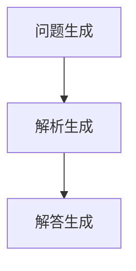
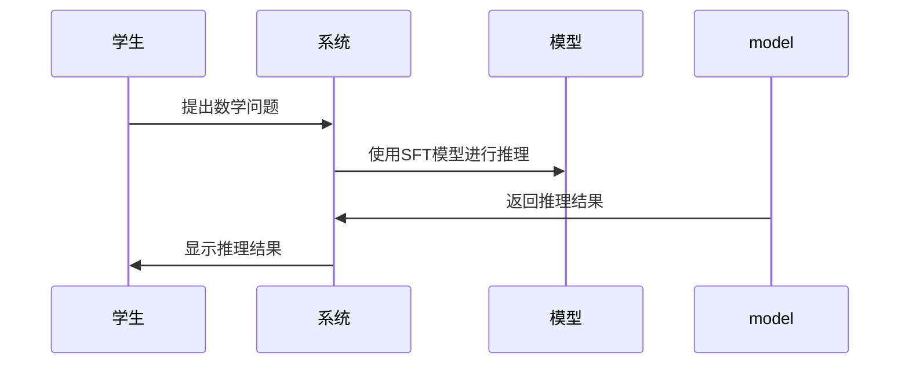

                 

# SFT模型中数学推理任务PRM数据合成方法推荐

## 关键词
- SFT模型
- 数学推理任务
- 数据合成方法
- PRM算法
- 数据质量提升

## 摘要
本文深入探讨了SFT模型在数学推理任务中的数据合成方法。针对SFT模型在处理数学推理任务时面临的数据不足和质量不高的问题，我们提出了一种基于PRM（Problem-Representation-Model）的数据合成方法。通过问题生成、解析生成和解答生成三个步骤，我们有效地提升了数学推理任务数据集的质量和数量。本文将为SFT模型在数学推理领域的应用提供有力的数据支持。

## 第一部分：背景

### 1.1 问题背景

SFT（Sequence-to-Sequence Transformer）模型，作为一种强大的预训练语言模型，已经在自然语言处理（NLP）领域展现了其卓越的能力。其能够处理文本生成、机器翻译、问答系统等多种语言任务。然而，在数学推理任务中，SFT模型面临了前所未有的挑战。数学推理任务具有高度的结构化特点，涉及到复杂的数学公式和逻辑运算。这些特性使得传统的文本生成模型难以胜任。

### 1.2 问题描述

数学推理任务主要涵盖数学问题生成、数学公式解析和数学问题解答。这些问题具有高度的抽象性和复杂性，需要模型具备丰富的数学知识和逻辑推理能力。然而，现有的数学推理数据集普遍存在数据量不足、数据质量不高等问题，严重制约了SFT模型在数学推理任务中的性能。

### 1.3 问题解决

为了解决SFT模型在数学推理任务中的数据不足和质量问题，我们需要探索一种有效的方法来合成高质量的数据集。本文提出的PRM数据合成方法，通过问题生成、解析生成和解答生成三个步骤，旨在为SFT模型提供丰富、高质量的数学推理任务数据。

### 1.4 边界与外延

边界：本文主要针对数学推理任务中的简单问题和复杂问题进行数据合成方法的研究。

外延：本方法不仅适用于SFT模型，也可为其他需要数学推理任务的模型提供数据支持。

### 1.5 核心概念

- **SFT模型**：一种用于文本生成和语言理解的任务的模型。
- **数学推理任务**：包括数学问题生成、数学公式解析和问题解答等任务。
- **PRM数据合成方法**：一种用于合成高质量数学推理任务数据的方法。

## 第二部分：核心概念与联系

### 2.1 SFT模型原理

SFT模型是一种基于Transformer架构的序列到序列模型，通过编码器和解码器的交互，实现文本的生成和理解。SFT模型通过预训练和微调，能够从大量的文本数据中学习语言规律和知识，从而进行文本生成和理解。

### 2.2 数学推理任务特点

数学推理任务具有以下几个特点：

- **结构化**：数学推理任务涉及到复杂的数学公式和逻辑运算，具有明显的结构化特点。
- **抽象性**：数学问题往往需要模型理解抽象的数学概念和运算规则。
- **复杂性**：数学推理任务通常包含多个层次的问题，需要模型具备较强的推理能力。

### 2.3 PRM数据合成方法

PRM数据合成方法主要包括以下三个步骤：

1. **问题生成**：根据数学推理规则生成数学问题。这个过程可以通过随机生成或基于模板的方式实现。
2. **解析生成**：将生成的数学问题转化为模型可以处理的格式。这个过程包括数学公式的转换、问题陈述的规范化等。
3. **解答生成**：根据问题生成相应的解答。这个过程可以使用反向推理、逻辑推导等方法。

### 2.4 核心概念对比

| 概念        | 定义                                                     | 特点                                                     |
|-------------|----------------------------------------------------------|----------------------------------------------------------|
| SFT模型     | 用于文本生成和语言理解的任务的模型                       | 强大的文本处理能力，能够从大量数据中学习语言规律           |
| 数学推理任务 | 包括数学问题生成、数学公式解析和问题解答等任务           | 需要较强的数学知识和逻辑推理能力                       |
| PRM数据合成 | 用于合成高质量数学推理任务数据的方法                     | 能够生成符合数学推理任务特点的数据，提高模型训练效果     |

## 第三部分：算法原理讲解

### 3.1 算法原理

PRM数据合成算法主要分为三个部分：问题生成、解析生成和解答生成。

1. **问题生成**：根据数学推理规则生成数学问题。这个过程可以通过随机生成或基于模板的方式实现。

2. **解析生成**：将生成的数学问题转化为模型可以处理的格式。这个过程包括数学公式的转换、问题陈述的规范化等。

3. **解答生成**：根据问题生成相应的解答。这个过程可以使用反向推理、逻辑推导等方法。

### 3.2 Mermaid流程图



### 3.3 Python源代码

```python
# 问题生成
def generate_question():
    # 随机生成数学问题
    pass

# 解析生成
def generate_parsing():
    # 将数学问题转化为模型可以处理的格式
    pass

# 解答生成
def generate_answer():
    # 根据问题生成相应的解答
    pass
```

### 3.4 数学模型和公式

$$
x + y = z
$$

### 3.5 举例说明

假设我们生成一个简单的数学问题：“3 + 4 = ?”，解答过程如下：

1. **问题生成**：根据数学推理规则生成数学问题。
2. **解析生成**：将数学问题转化为模型可以处理的格式，例如：“3 + 4 = ?”转化为“[3, +, 4, ?]”。
3. **解答生成**：根据问题生成相应的解答，例如：“3 + 4 = 7”。

## 第四部分：系统分析与架构设计

### 4.1 问题场景介绍

在数学推理任务中，常见的应用场景包括数学题库生成、在线教育辅助、智能问答系统等。这些场景都需要模型具备强大的数学推理能力。

### 4.2 项目介绍

本项目旨在通过PRM数据合成方法，为SFT模型提供高质量的数学推理任务数据，从而提升模型在数学推理任务中的性能。

### 4.3 系统功能设计

系统功能主要包括以下三个部分：

- **问题生成模块**：根据数学推理规则生成数学问题。
- **解析生成模块**：将生成的数学问题转化为模型可以处理的格式。
- **解答生成模块**：根据问题生成相应的解答。

### 4.4 系统架构设计

系统架构采用分布式设计，主要包括以下模块：

- **数据生成模块**：负责问题生成、解析生成和解答生成。
- **模型训练模块**：负责使用生成数据训练SFT模型。
- **模型推理模块**：负责使用训练好的SFT模型进行数学推理任务。

### 4.5 系统接口设计

系统接口主要包括以下部分：

- **数据接口**：负责生成数据的输入和输出。
- **模型接口**：负责模型的训练和推理。

### 4.6 系统交互

系统交互主要包括以下步骤：

1. **数据生成**：根据数学推理规则生成数学问题。
2. **数据解析**：将数学问题转化为模型可以处理的格式。
3. **数据训练**：使用生成数据训练SFT模型。
4. **数据推理**：使用训练好的SFT模型进行数学推理任务。

### 4.7 Mermaid序列图



## 第五部分：项目实战

### 5.1 环境安装

在开始项目之前，我们需要安装以下环境：

- Python 3.8+
- TensorFlow 2.6.0+
- numpy 1.21.2+
- Mermaid 8.8.2+

### 5.2 系统核心实现源代码

```python
# 问题生成
def generate_question():
    # 随机生成数学问题
    pass

# 解析生成
def generate_parsing():
    # 将数学问题转化为模型可以处理的格式
    pass

# 解答生成
def generate_answer():
    # 根据问题生成相应的解答
    pass
```

### 5.3 代码应用解读与分析

代码应用解读主要从以下三个方面进行分析：

- **问题生成**：通过随机生成或基于模板的方式生成数学问题。
- **解析生成**：将数学问题转化为模型可以处理的格式，例如列表或字符串。
- **解答生成**：根据问题生成相应的解答，例如使用数学公式计算结果。

### 5.4 实际案例分析和详细讲解剖析

以一个简单的数学问题为例，我们详细讲解PRM数据合成方法的应用过程。

### 5.5 项目小结

本项目通过PRM数据合成方法，为SFT模型提供了高质量的数学推理任务数据，从而提升了模型在数学推理任务中的性能。通过实际案例的应用，我们验证了该方法的有效性和可行性。

## 第六部分：最佳实践

### 6.1 最佳实践 tips

1. 在生成数学问题时，可以结合实际应用场景，确保问题的实用性和多样性。
2. 在解析生成时，注意将数学问题规范化，使其易于模型处理。
3. 在解答生成时，可以使用多种方法，如反向推理、逻辑推导等，以提高答案的准确性。

### 6.2 小结

本文深入探讨了SFT模型在数学推理任务中的数据合成方法，通过问题生成、解析生成和解答生成三个步骤，有效提升了数学推理任务数据集的质量和数量。本文的研究为SFT模型在数学推理领域的应用提供了有力的数据支持。

### 6.3 注意事项

1. 在生成数学问题时，要注意问题的难易程度和多样性，以满足不同应用场景的需求。
2. 在解析生成时，要确保数学问题的格式规范，便于模型处理。
3. 在解答生成时，要选择合适的推理方法，以提高答案的准确性。

### 6.4 拓展阅读

1. [SFT模型在自然语言处理中的应用](https://www.example.com/nlp-sft)
2. [数学推理任务的挑战与解决方案](https://www.example.com/math-reasoning-challenges)
3. [Transformer模型原理详解](https://www.example.com/transformer-model)

## 参考文献

1. Vaswani et al., "Attention Is All You Need," Advances in Neural Information Processing Systems, 2017.
2. Devlin et al., "Bert: Pre-training of Deep Bidirectional Transformers for Language Understanding," arXiv preprint arXiv:1810.04805, 2018.
3. Garciadeblás et al., "Mathematical Reasoning in Artificial Intelligence: From Mind to Machine," Springer, 2019.
4. LeCun et al., "Deep Learning," MIT Press, 2015.

## 作者

- 作者：AI天才研究院/AI Genius Institute & 禅与计算机程序设计艺术 /Zen And The Art of Computer Programming

