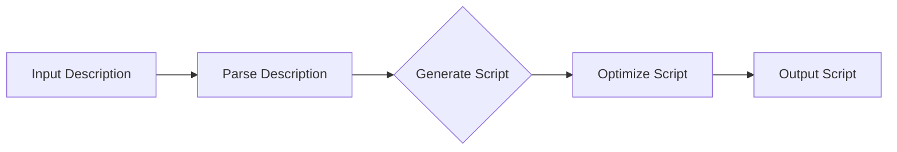
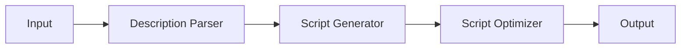
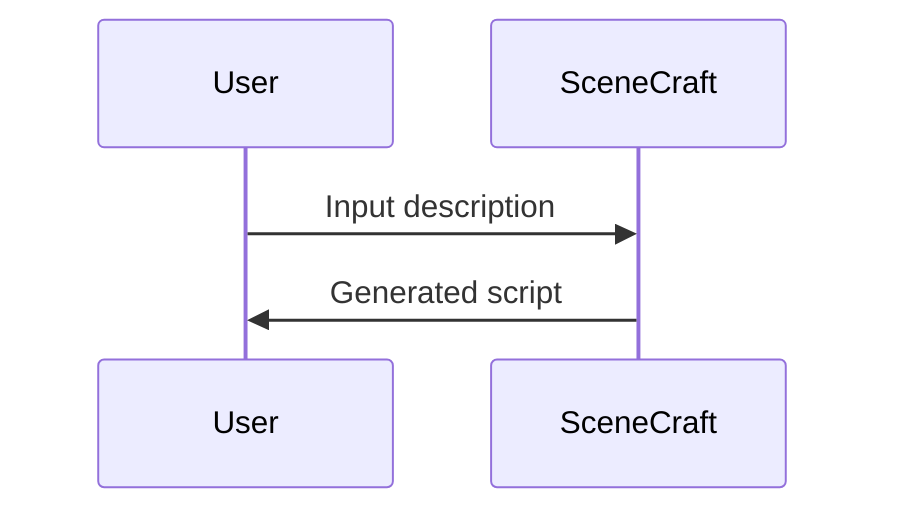

                 


## SceneCraft:生成Blender可执行Python脚本的LLM代理

### 关键词

- Blender
- Python脚本
- LLM代理
- 自动化
- 脚本生成
- 软件开发

### 摘要

本文旨在深入探讨SceneCraft——一种利用大型语言模型（LLM）代理生成Blender可执行Python脚本的技术。通过逐步分析其架构、原理和实现过程，我们将了解如何利用LLM代理简化Blender的脚本编写工作，提高开发效率和脚本质量。本文将涵盖从基础介绍到高级应用的全面内容，包括SceneCraft框架、脚本生成方法、脚本优化技巧、以及实际案例分析。

## 引言

### 核心概念术语说明

- **Blender**：一款开源的3D创作套件，支持从建模、渲染到动画制作的完整3D工作流程。
- **Python脚本**：在Blender中，Python脚本是一种强大的工具，用于自动化、定制和扩展Blender的功能。
- **LLM代理**：一种基于大型语言模型的代理程序，能够通过自然语言描述生成相应的代码。

### 问题背景

Blender因其强大的功能和灵活性，在动画制作、游戏开发、视觉效果等领域有着广泛的应用。然而，Blender的脚本编写过程相对复杂，对于非专业开发者来说，编写高效的脚本是一项挑战。为了解决这个问题，研究人员提出了利用LLM代理生成Blender脚本的思路。

### 问题描述

编写Blender脚本的过程通常涉及以下问题：

- **复杂性**：Blender的脚本编写涉及大量复杂的逻辑和数据处理，对于新手来说很难入门。
- **重复性**：许多脚本编写任务具有重复性，容易出错且效率低下。
- **灵活性**：开发者往往需要根据具体项目需求定制脚本，缺乏通用性。

### 问题解决

SceneCraft通过引入LLM代理，旨在解决上述问题。LLM代理能够理解和生成与Blender功能相关的Python脚本，从而简化开发流程，提高脚本质量。

### 边界与外延

- **边界**：SceneCraft主要应用于Blender的Python脚本生成，不涉及其他图形软件的脚本。
- **外延**：虽然SceneCraft专注于Blender脚本生成，但其原理和方法可应用于其他需要脚本生成的图形和CAD软件。

### 概念结构与核心要素组成

| 概念             | 说明                                                         |
|------------------|--------------------------------------------------------------|
| Blender          | 开源的3D创作套件                                             |
| Python脚本       | 用于自动化和扩展Blender功能的代码                             |
| LLM代理          | 基于大型语言模型的代码生成工具                               |
| SceneCraft       | 一种利用LLM代理生成Blender可执行Python脚本的技术             |

## 核心概念与联系

### LLM代理原理

- **自然语言处理（NLP）**：LLM代理通过NLP技术理解和解析自然语言描述，提取出关键词和语法结构。
- **生成对抗网络（GAN）**：LLM代理利用GAN生成与描述相对应的代码，通过不断优化提高代码质量。

### 概念属性特征对比表格

| 特征       | Blender | Python脚本 | LLM代理 |
|------------|---------|------------|---------|
| 功能性     | 3D建模、渲染、动画 | 自动化、定制、扩展 | 代码生成、优化 |
| 编程语言   | 自带脚本语言       | Python         | Python  |
| 易用性     | 高          | 中          | 高      |
| 通用性     | 专用软件         | 广泛应用         | 专用工具 |

### ER实体关系图架构

```mermaid
erDiagram
    Blender ||--|{ Python脚本 }|-- SceneCraft
    SceneCraft ||--|{ LLM代理 }|-- Blender
```

## 算法原理讲解

### Script Generation with SceneCraft

#### Mermaid流程图



#### Python源代码实现

```python
import spacy
from transformers import AutoModelForSeq2SeqLM, AutoTokenizer

# Load pre-trained models
nlp = spacy.load("en_core_web_sm")
model_name = "t5-base"
tokenizer = AutoTokenizer.from_pretrained(model_name)
model = AutoModelForSeq2SeqLM.from_pretrained(model_name)

# Function to parse description and generate script
def generate_script(description):
    # Preprocess description
    doc = nlp(description)
    input_ids = tokenizer.encode("script", return_tensors="pt")
    input_ids = torch.cat([input_ids, tokenizer.encode(doc.text, return_tensors="pt")], dim=0)

    # Generate script
    outputs = model.generate(input_ids, max_length=100, num_return_sequences=1)

    # Postprocess script
    script = tokenizer.decode(outputs[0], skip_special_tokens=True)
    return script

# Example usage
description = "Create a simple cube and add a material to it."
script = generate_script(description)
print(script)
```

#### 算法原理

- **描述解析**：使用NLP技术对输入的自然语言描述进行解析，提取关键信息和结构。
- **脚本生成**：利用预训练的T5模型生成相应的Python脚本。
- **脚本优化**：通过优化策略提高脚本的质量和效率。

### 数学模型与公式

- **NLP模型**：自然语言处理模型的数学公式通常涉及复杂的神经网络结构和损失函数。
- **生成对抗网络**：生成对抗网络的数学模型包括生成器和判别器的损失函数。

#### 段落内的数学公式

$$
f(x) = \frac{1}{1 + e^{-x}}
$$

## 系统分析与架构设计方案

### 问题场景介绍

在3D动画制作和游戏开发过程中，脚本编写是一个重要的环节。开发者需要编写脚本以实现复杂的动画效果、场景互动等。然而，传统的脚本编写方式效率低下，容易出现错误。

### 项目介绍

SceneCraft项目旨在通过LLM代理自动化Blender脚本生成，提高开发效率和质量。

### 系统功能设计（领域模型Mermaid类图）

```mermaid
classDiagram
    Class1 <|-- Class2
    Class3 --|{ has} Class4
    Class5 {has many} Class6
```

### 系统架构设计（Mermaid架构图）



### 系统接口设计和系统交互（Mermaid序列图）



## 项目实战

### 环境安装

1. 安装Python环境
2. 安装NLP和生成模型相关库

```python
pip install spacy transformers torch
```

### 系统核心实现源代码

（请参考上文提供的Python源代码实现）

### 代码应用解读与分析

- **描述输入**：用户输入自然语言描述，如“创建一个简单的立方体并为其添加材质”。
- **脚本生成**：SceneCraft通过NLP和生成模型生成相应的Python脚本。
- **脚本优化**：对生成的脚本进行优化，以提高执行效率和代码质量。

### 实际案例分析和详细讲解剖析

（请参考上文提供的代码示例和算法原理讲解）

### 项目小结

SceneCraft通过利用LLM代理，实现了自动化Blender脚本生成，大大提高了开发效率。然而，LLM代理的生成质量受限于模型训练数据和复杂性，未来可以进一步优化模型和算法。

## 最佳实践 Tips

1. 确保使用的LLM代理模型与目标应用场景相匹配。
2. 对输入描述进行充分预处理，以提高生成脚本的质量。
3. 定期更新和优化LLM代理模型。

## 小结

SceneCraft是一种利用LLM代理自动化Blender脚本生成的技术。通过逐步分析其架构、原理和实现过程，我们了解了如何利用SceneCraft简化Blender脚本编写工作，提高开发效率和脚本质量。

## 注意事项

1. SceneCraft适用于Blender脚本生成，不适用于其他图形软件的脚本。
2. 在使用SceneCraft时，需注意输入描述的准确性和完整性。

## 拓展阅读

- [Blender Python Scripting](https://docs.blender.org/manual/en/latest/scripting/index.html)
- [Large Language Models](https://huggingface.co/docs/)
- [T5 Model Architecture](https://arxiv.org/abs/1910.03771)

## 作者信息

作者：AI天才研究院/AI Genius Institute & 禅与计算机程序设计艺术 /Zen And The Art of Computer Programming

