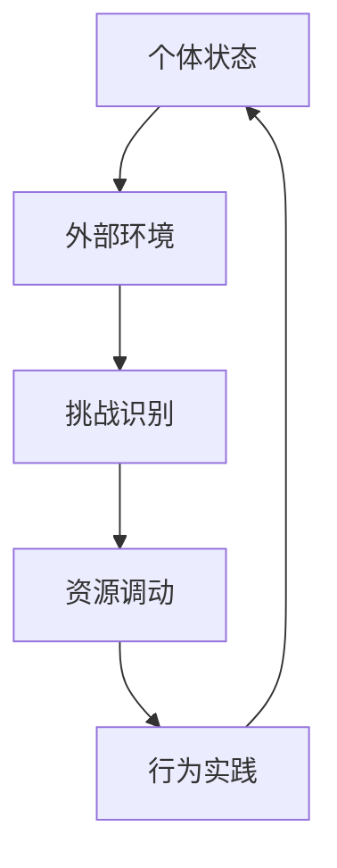
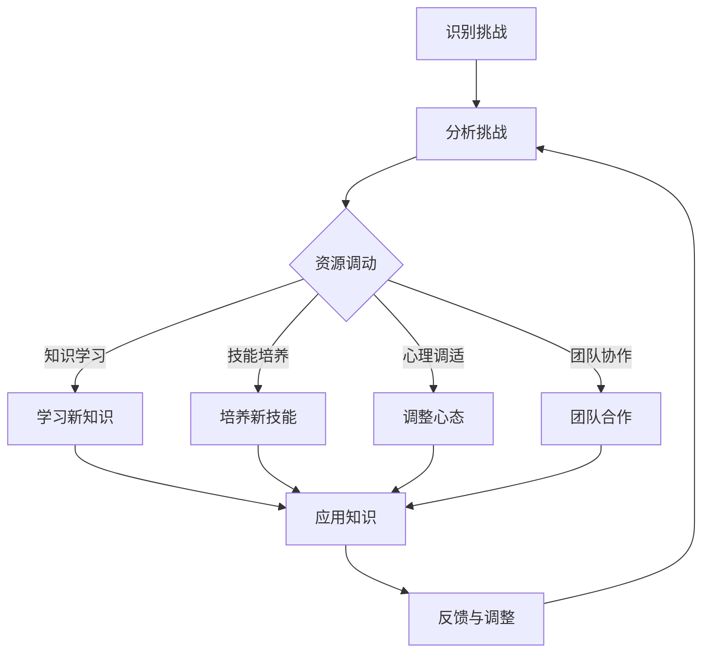

                 


### 引言

在现代社会的快速变化中，个人成长与自我提升变得比以往任何时候都更加重要。面对职业发展的瓶颈、技术更新的压力以及生活质量的追求，每个人都必须学会如何在变化中找到自己的成长路径。本文旨在探讨“comfort zone之外：通过挑战实现成长”的主题，以帮助读者理解成长的意义，并掌握走出舒适区的策略。

**关键词：**舒适区、挑战、个人成长、自我提升、策略

**摘要：**本文首先介绍了舒适区及其对个人成长的影响，然后深入探讨了成长与挑战的关系，通过解析核心概念与联系，提供了实用的策略和技巧，最后结合社会和文化层面的挑战，以及心理因素，为读者提供了一套完整的成长方案。通过本文，读者将学会如何识别和应对挑战，从而在成长的道路上不断前进。

#### 1.1 成长与挑战的关系

**1.1.1 为什么我们需要走出舒适区**

成长，本质上是一个不断突破自我、挑战自我的过程。舒适的区域，虽然可以给人带来暂时的安全感，但长期停留在舒适区内，会限制个人的发展。这是因为舒适区意味着熟悉、稳定和无压力，但同时也意味着缺乏挑战和新的机遇。

首先，舒适区限制了知识的学习。在舒适区内，人们往往依赖现有的知识和技能，缺乏对新知识的探索和尝试。这种状态下，个人的知识体系会逐渐变得陈旧和狭隘，难以适应快速变化的世界。

其次，舒适区阻碍了能力的提升。在舒适区内，人们很少面临需要应对的新情况和新问题，这导致他们的能力难以得到充分的锻炼和提高。能力的提升往往需要通过解决实际问题、面对挑战来不断积累经验。

最后，舒适区对行为习惯的培养具有负面影响。长期停留在舒适区，容易使人养成拖延、依赖他人、害怕失败等不良习惯。这些习惯会严重阻碍个人的成长和发展。

**1.1.2 挑战对个人成长的意义**

挑战，是成长的催化剂。面对挑战，人们需要调动各种资源，包括知识、技能、经验和心理素质，来应对新的情况。这个过程虽然充满压力和不确定性，但同时也是个人成长的最佳时机。

首先，挑战促进了知识的更新和扩展。在面对新的挑战时，人们往往需要学习新的知识、掌握新的技能，这有助于拓宽视野，提升综合素质。

其次，挑战提高了能力。通过面对挑战，人们可以锻炼解决问题的能力、团队协作的能力、沟通表达的能力等。这些能力的提升，对个人的职业发展和生活品质具有重要意义。

最后，挑战培养了坚韧的品质。在面对挑战和困难时，坚持不懈、勇往直前，是成长过程中不可或缺的品质。这种品质不仅能够帮助人们克服各种障碍，还能为未来的挑战奠定坚实的基础。

#### 1.2 成长过程中的舒适区

**1.2.1 舒适区的定义**

舒适区（Comfort Zone）是一个心理学概念，指的是一个人在心理和行为上感到安全和舒适的心理状态。在这种状态下，人们往往不需要面对新的挑战和压力，能够轻松地完成日常工作和生活。

然而，舒适区并不是一个绝对的好状态。虽然它可以带来短暂的安心和放松，但长期停留在舒适区，会使人失去对未来的期望和动力，从而限制个人的成长和发展。

**1.2.2 舒适区的影响**

舒适区对个人成长的影响主要体现在以下几个方面：

首先，舒适区限制了创新的思维。在舒适区内，人们往往依赖已有的经验和知识，缺乏对新事物和新方法的探索和尝试。这种思维模式容易导致创新能力的下降，难以适应快速变化的环境。

其次，舒适区影响了人际关系的深度。在舒适区内，人们往往倾向于与熟悉的人交往，避免与陌生人建立联系。这种人际关系模式限制了社交圈子的扩大，影响了人际关系的深度和质量。

最后，舒适区对身体健康也存在负面影响。长期停留在舒适区，容易导致身体活动减少、心理健康问题增加，从而影响整体健康水平。

总之，虽然舒适区在短期内可以带来一定的心理和生理上的舒适感，但长期停留在舒适区，会严重限制个人的成长和发展。因此，走出舒适区，主动接受挑战，是每个人都需要面对和解决的问题。

### 第二部分：核心概念与联系

在探讨“comfort zone之外：通过挑战实现成长”这一主题时，我们需要深入理解几个核心概念，包括成长的本质、挑战的属性以及成长与挑战的互动关系。通过这些核心概念的分析，我们可以为个人成长提供坚实的理论基础和实践指南。

#### 2.1 核心概念解析

**2.1.1 成长的本质**

成长（Growth）是指个体在知识、能力、行为等方面的进步和提升。成长的本质是一个复杂的过程，涉及多个层面的变化。

首先，新知识学习（Knowledge Acquisition）是成长的基础。通过阅读、学习课程、交流讨论等方式，人们可以获取新的知识，从而拓宽视野，提升认知水平。

其次，新能力培养（Skill Development）是成长的关键。能力的培养需要通过实践和不断的挑战来实现。例如，编程能力的提升需要通过编写大量代码、解决实际问题来实现。

最后，新行为实践（Behavioral Practice）是成长的保障。新知识和新能力的应用需要通过实际行动来体现。例如，在职场中，通过实际项目的参与，可以将所学知识转化为实际成果。

因此，我们可以将成长的本质概括为以下公式：

$$
成长的本质 = 新知识学习 + 新能力培养 + 新行为实践
$$

这个公式表明，成长是一个多维度、多层次的过程，需要从知识、能力和行为三个层面共同发力。

**2.1.2 挑战的属性**

挑战（Challenge）是指个体在成长过程中面对的新的、具有不确定性和压力的任务或情境。挑战的属性可以分为以下几个方面：

首先，新异性（Novelty）。挑战往往具有新异性，即与个体现有的知识和经验不完全匹配。这种新异性能激发个体的好奇心和探索欲，促使他们去学习新的知识和技能。

其次，不确定性（Uncertainty）。挑战往往伴随着不确定性，即个体无法完全预测挑战的结果。这种不确定性增加了挑战的难度，但也提供了成长的机会。

最后，压力性（Stressfulness）。挑战通常会对个体产生一定的压力，这种压力可以是心理上的，也可以是生理上的。适度的压力能够激发个体的潜能，但过度的压力则可能导致焦虑和疲惫。

**2.1.3 成长与挑战的互动关系**

成长与挑战之间存在着密切的互动关系。挑战是成长的催化剂，而成长是挑战的应对结果。具体来说，挑战与成长之间的关系可以概括为以下几个方面：

首先，挑战促进了成长。面对挑战，个体需要调动各种资源，包括知识、技能和经验，来应对新的情况。这个过程促使个体不断学习和进步，从而实现成长。

其次，成长是挑战的应对结果。通过挑战，个体可以积累经验，提升能力，最终实现成长。这种成长反过来又为面对未来的挑战提供了更好的准备。

最后，挑战和成长是相互促进的。适度的挑战能够激发个体的潜能，促使他们不断成长。而个体的成长又能够使他们更好地应对未来的挑战。

因此，我们可以将成长与挑战的互动关系概括为以下公式：

$$
挑战 \xrightarrow{\text{促进}} 成长 \xrightarrow{\text{应对}} 挑战
$$

这个公式表明，挑战和成长是相互依赖、相互促进的关系，共同推动了个体的发展。

#### 2.2 概念属性特征对比表格

为了更清晰地理解成长和挑战的概念属性，我们可以通过一个对比表格来展示两者之间的异同。

| 特征       | 成长         | 挑战         |
|------------|--------------|--------------|
| 定义       | 知识、能力、行为的进步 | 新的、具有不确定性和压力的任务或情境 |
| 目标       | 提升自我       | 应对新的挑战  |
| 属性       | 新知识学习、新能力培养、新行为实践 | 新异性、不确定性、压力性 |
| 互动关系   | 促进成长      | 成长是应对结果 |

通过这个表格，我们可以看到成长和挑战在定义、目标和属性上的差异，以及它们之间的互动关系。

#### 2.3 ER实体关系图架构

为了进一步理解成长系统中的实体关系，我们可以使用ER（实体-关系）图来展示成长系统中的各个实体及其之间的关系。

**2.3.1 成长系统中的实体关系**

在成长系统中，主要的实体包括：

- 个体（Person）
- 知识（Knowledge）
- 能力（Skill）
- 行为（Behavior）
- 挑战（Challenge）

这些实体之间的关系可以描述为：

1. 个体拥有知识和能力，并通过行为实践来体现。
2. 挑战可以激发个体的学习和成长，同时成长是应对挑战的结果。

以下是一个简单的ER图，展示了这些实体及其关系：

```mermaid
erDiagram
  Person ||--|{ Knowledge }  : 拥有
  Person ||--|{ Skill }     : 拥有
  Person ||--|{ Behavior }  : 实践
  Challenge ||--|{ Person }  : 应对
  Knowledge ||--|{ Challenge }  : 激发
  Skill ||--|{ Challenge }  : 培养的
  Behavior ||--|{ Challenge }  : 应对的
```

这个ER图清晰地展示了成长系统中各个实体及其之间的关系，为后续的分析提供了基础。

#### 2.4 成长模型与挑战应对策略

为了更好地理解成长与挑战的关系，我们可以构建一个成长模型，并探讨面对挑战的应对策略。

**2.4.1 成长模型的基本框架**

成长模型的基本框架包括以下几个关键部分：

1. **个体状态**：包括个体的知识、能力和行为水平。
2. **外部环境**：包括个体所处的社会、文化和技术环境。
3. **挑战识别**：个体识别和评估外部环境中的挑战。
4. **资源调动**：个体调动知识和技能资源来应对挑战。
5. **行为实践**：个体通过实际行动来应对挑战，实现成长。

以下是一个简化的成长模型：



**2.4.2 面对挑战的策略分析**

在面对挑战时，个体可以采取以下策略：

1. **知识学习**：通过阅读、学习课程、交流讨论等方式，获取新的知识，为应对挑战做好准备。
2. **技能培养**：通过实践、模拟和实际操作，培养新的技能，提高应对挑战的能力。
3. **心理调适**：通过心理训练、冥想和积极心态的培养，提升应对挑战的心理素质。
4. **团队协作**：与他人合作，共同面对挑战，发挥团队的力量。
5. **反馈与调整**：在挑战过程中，及时收集反馈，进行调整和优化。

以下是一个具体的应对挑战的策略流程图：



这个流程图展示了个体在面对挑战时，如何通过一系列策略来应对并实现成长。通过这个模型和策略，个体可以更系统地理解和应对成长过程中的挑战。

### 第三部分：通过挑战实现成长

在了解了成长与挑战的关系后，接下来我们将深入探讨如何通过挑战来实现个人成长。这一部分将详细讲解挑战驱动的成长路径，分析不同类型的挑战，并提供具体的应对策略和技巧。

#### 3.1 原理讲解

**3.1.1 挑战驱动的成长路径**

挑战驱动的成长路径是一个动态的、持续的过程，它涵盖了挑战识别、资源调动、行为实践和反馈调整等多个环节。具体来说，这个过程可以分解为以下几个步骤：

1. **挑战识别**：个体需要时刻保持对环境的敏感性，识别外部环境中的潜在挑战。这可以通过关注行业动态、参与社交网络、阅读相关书籍和文章等方式实现。

2. **资源调动**：在识别到挑战后，个体需要评估自身的知识、技能和心理状态，调动相应的资源来应对挑战。资源调动包括学习新知识、培养新技能、调整心态等。

3. **行为实践**：在调动资源后，个体需要将所学知识和技能应用到实际情境中，通过实际行动来应对挑战。这个阶段是成长的关键，通过实践，个体能够验证和提升自己的能力。

4. **反馈调整**：在行为实践后，个体需要收集反馈，了解挑战的应对效果，并进行相应的调整。这个环节有助于个体不断优化自己的策略，为下一次挑战做好准备。

**3.1.2 挑战类型与应对策略**

不同的挑战对个人的成长有着不同的影响。根据挑战的性质和特点，我们可以将挑战分为以下几种类型：

1. **知识型挑战**：这类挑战主要涉及新知识和新技能的学习。应对策略包括：

   - **主动学习**：通过阅读书籍、在线课程、参加研讨会等方式，主动获取新知识。
   - **实践应用**：通过实际项目、模拟实验等方式，将所学知识应用到实践中。
   - **求助与合作**：在遇到困难时，向他人求助或寻求合作，共同解决问题。

2. **能力型挑战**：这类挑战主要涉及新能力的培养。应对策略包括：

   - **目标设定**：明确自己要提升的能力，设定具体可行的目标。
   - **持续练习**：通过反复练习，提升能力水平。
   - **反馈与调整**：在练习过程中，及时收集反馈，调整训练策略。

3. **心理型挑战**：这类挑战主要涉及心理素质的培养。应对策略包括：

   - **心理训练**：通过冥想、心理训练等方式，提升心理素质。
   - **积极心态**：保持积极的心态，面对挑战时更加从容。
   - **情绪管理**：学会管理情绪，避免情绪对应对挑战的影响。

4. **社会型挑战**：这类挑战主要涉及社会关系和社交能力的培养。应对策略包括：

   - **拓展社交圈**：积极参与社交活动，拓展社交圈子。
   - **沟通技巧**：提升沟通技巧，增强人际交往能力。
   - **合作与共赢**：学会与他人合作，实现共赢。

通过识别不同类型的挑战，并采取相应的应对策略，个体可以更有效地实现个人成长。

#### 3.2 实战策略

**3.2.1 个人成长中的挑战识别**

在个人成长中，识别挑战是第一步。以下是几种常见的挑战识别方法：

1. **自我反思**：定期进行自我反思，分析自己在知识、能力和行为方面的不足，识别潜在的挑战。
2. **环境监测**：关注行业动态、技术趋势和社会变革，及时发现可能对个人成长构成挑战的新情况。
3. **他人反馈**：倾听他人的意见和建议，了解自己在他人眼中的不足和挑战。
4. **目标设定**：设定长期和短期的个人目标，识别为实现这些目标所需克服的挑战。

**3.2.2 挑战设定与实现路径**

在识别挑战后，设定具体的实现路径是关键。以下是设定和实现挑战的步骤：

1. **目标明确**：明确挑战的目标，确保目标具体、可衡量、可实现。
2. **资源准备**：评估自身资源，包括知识、技能和心理状态，确定所需的资源。
3. **计划制定**：制定详细的行动计划，包括学习、练习、实践和反馈等环节。
4. **执行与监控**：按照计划执行，定期监控进展，及时调整策略。
5. **反馈收集**：在挑战过程中，收集反馈，了解自己的表现和不足。

通过以上步骤，个体可以更有效地设定和实现个人成长中的挑战。

### 第四部分：社会与文化中的挑战与成长

在社会和文化层面，挑战与成长同样具有重要意义。社会变迁、文化背景以及社会文化的特点，都对个人的成长产生深远影响。在这一部分，我们将探讨社会和文化中的挑战，以及个人如何应对这些挑战来实现成长。

#### 4.1 社会层面

**4.1.1 社会变迁与个体成长**

社会变迁是现代生活的一个重要特征。随着科技的发展、经济的变化以及社会制度的改革，社会环境不断演变，对个体的成长提出了新的挑战。

首先，技术的快速进步带来了新的机遇和挑战。例如，人工智能、大数据等新兴技术的出现，不仅改变了传统的职业结构，还要求个体具备新的技能和知识。面对这样的挑战，个体需要不断学习和更新自己的知识体系，以适应新的技术环境。

其次，经济变化也对个体成长产生了影响。全球化带来了竞争的加剧，个体需要具备更强的竞争力才能在职场中脱颖而出。这种竞争不仅体现在专业技能上，还包括跨文化沟通、团队合作和创新能力等方面。个体需要在不断变化的经济环境中，提升自己的综合素质，以应对新的挑战。

最后，社会制度的改革也对个体的成长提出了新的要求。例如，社会保障体系的完善、教育制度的改革等，都为个体提供了更好的成长环境，同时也要求个体具备更高的社会责任感和公民意识。

**4.1.2 社会挑战与个人应对策略**

面对社会变迁带来的挑战，个体可以采取以下策略：

1. **终身学习**：社会变迁要求个体具备持续学习的能力。通过参加培训课程、在线学习、阅读相关书籍等方式，不断更新自己的知识体系。
2. **创新能力**：面对不断变化的环境，个体需要具备创新能力，能够灵活应对新的挑战。这可以通过实践、模拟和创新思维训练来实现。
3. **跨文化沟通**：在全球化的背景下，个体需要具备跨文化沟通能力，能够与来自不同文化背景的人有效交流。这可以通过参加国际交流活动、学习跨文化沟通技巧等方式来实现。
4. **团队合作**：在竞争激烈的社会环境中，个体需要学会与他人合作，发挥团队的力量。通过参与团队合作项目、学习团队管理技巧等方式，提升团队合作能力。

#### 4.2 文化层面

**4.2.1 文化背景与成长挑战**

文化背景对个体的成长有着深远的影响。不同的文化环境孕育了不同的价值观、行为规范和社会期待，这些都会对个体的成长产生不同的影响。

首先，文化背景决定了个体的价值观。不同的文化背景可能会强调不同的价值观，如个人主义、集体主义、功利主义等。这些价值观会影响个体的行为和决策，从而影响个体的成长方向。

其次，文化背景也影响个体的行为规范。不同的文化背景可能有不同的行为规范，如礼仪、礼貌、时间观念等。个体需要适应这些规范，才能在社会中获得认同和尊重。

最后，文化背景还影响个体的社会期望。不同的文化背景可能会对个体有不同的期望，如职业选择、教育水平、家庭观念等。这些期望会对个体的成长产生压力，但同时也是个体成长的重要动力。

**4.2.2 文化传承与创新中的挑战**

在文化传承与创新中，个体面临着一系列的挑战。

首先，文化传承要求个体在尊重传统文化的基础上，进行创新和发展。这需要个体具备跨文化的视野，能够在传承和创新之间找到平衡点。

其次，文化创新要求个体具备创新思维和创造力。在快速变化的时代，文化需要不断创新来适应新的社会环境。个体需要在文化传承的基础上，发挥自己的创造力，为文化创新贡献力量。

最后，文化传承与创新中的挑战也体现在个体与社会的互动中。个体需要在文化传承与创新中找到自己的角色和定位，与社会共同发展。

**应对策略**

为了应对文化传承与创新中的挑战，个体可以采取以下策略：

1. **文化学习**：通过学习不同文化的价值观和行为规范，提升自己的跨文化素养，为文化传承和创新做好准备。
2. **创新思维**：培养创新思维，学会从不同角度看待问题，寻找新的解决方案。
3. **社会实践**：通过参与社会实践，了解社会的需求和发展方向，为文化创新提供实际支持。
4. **文化传承**：在创新中尊重传统文化，将文化传承与现代社会需求相结合，实现文化的可持续发展。

通过以上策略，个体可以在社会和文化层面实现个人成长，为社会的进步和文化的发展贡献力量。

### 第五部分：心理因素与挑战

在成长的过程中，心理因素起着至关重要的作用。面对挑战时，个体的心理状态和行为方式会直接影响成长的效果。在这一部分，我们将分析成长动机与心理因素，探讨如何通过心理调适来应对挑战。

#### 5.1 心理因素分析

**5.1.1 成长动机与心理因素**

成长动机是个体追求个人成长和发展的内在动力。它来源于对自我实现的渴望、对成功的追求以及对生活品质的期望。不同人的成长动机可能有所不同，但总体上可以分为以下几类：

1. **自我实现**：追求个人潜能的最大化，实现自我价值。
2. **成功追求**：希望通过成就来证明自己的能力和价值。
3. **生活品质**：希望通过成长来提升生活质量和幸福感。

这些成长动机背后，都涉及一系列心理因素，如自我效能感、目标设定、自我反思等。

**5.1.2 挑战应对中的心理调适**

面对挑战时，个体的心理调适能力至关重要。以下是一些常见的心理调适策略：

1. **积极心态**：保持积极的心态，相信自己能够应对挑战并取得成功。积极心态有助于提升自信心，减少焦虑和恐惧。
2. **目标设定**：明确具体的挑战目标，分解为可行的步骤，制定行动计划。明确的目标有助于个体集中精力，有针对性地应对挑战。
3. **自我反思**：在挑战过程中，定期进行自我反思，评估自己的行为和策略。自我反思有助于发现问题，及时调整和优化应对策略。
4. **情绪管理**：学会管理情绪，避免情绪波动对应对挑战的影响。情绪管理可以通过冥想、放松训练、心理咨询等方式实现。

#### 5.2 心理技巧

**5.2.1 应对挑战的心理策略**

在应对挑战时，以下心理策略有助于提升个体的心理调适能力：

1. **认知重构**：改变对挑战的看法，将挑战视为成长的机会，而不是威胁。通过认知重构，个体可以减少焦虑和恐惧，增强应对挑战的信心。
2. **积极思考**：鼓励自己从积极的角度看待问题，寻找解决问题的方法和策略。积极思考有助于提升个体的应对能力，增强成长的动力。
3. **情绪调节**：学会调节情绪，避免情绪波动对应对挑战的影响。可以通过深呼吸、放松训练、运动等方式来调节情绪。
4. **心理支持**：寻求他人的支持和帮助，与他人分享自己的挑战和感受。心理支持可以提供情感上的安慰，增强个体的信心和勇气。

**5.2.2 心理素质培养**

心理素质的培养是长期的过程，以下是一些有效的方法：

1. **自我效能感**：通过不断的实践和成功经验，提升自我效能感。自我效能感高的个体在面对挑战时更有信心和决心。
2. **情绪智力**：培养情绪智力，学会识别和管理自己的情绪。情绪智力的提升有助于个体更好地应对挑战，提高心理调适能力。
3. **适应性**：培养适应性，学会在变化和不确定性中保持平衡。适应性的提升有助于个体更好地应对各种挑战，实现个人成长。

通过以上心理技巧和心理素质的培养，个体可以更好地应对成长过程中的挑战，实现自我提升和成长。

### 第六部分：面对挑战的方法与技巧

在面对成长过程中的各种挑战时，掌握科学的方法和技巧至关重要。在这一部分，我们将详细介绍应对挑战的方法与技巧，帮助读者更有效地应对挑战，实现个人成长。

#### 6.1 方法与技巧

**6.1.1 挑战识别与评估**

首先，要有效应对挑战，我们需要学会识别和评估挑战。以下是几个关键步骤：

1. **主动观察**：通过观察外部环境和自身的表现，主动识别可能面临的挑战。这可以通过阅读行业报告、参加行业研讨会、关注社交媒体等方式实现。
2. **自我反思**：定期进行自我反思，分析自己在知识、能力和行为方面的不足，识别潜在的挑战。自我反思有助于发现自身的盲点和弱点。
3. **他人反馈**：倾听他人的意见和建议，了解自己在他人眼中的不足和挑战。他人的反馈可以提供不同的视角，帮助更全面地识别挑战。
4. **目标设定**：设定长期和短期的个人目标，识别为实现这些目标所需克服的挑战。目标设定有助于明确挑战的方向和具体内容。

**6.1.2 挑战实施与监控**

在识别和评估挑战后，实施挑战并监控进展是关键步骤。以下是几个关键技巧：

1. **制定计划**：根据挑战的性质和目标，制定详细的行动计划。计划应包括具体的行动步骤、时间安排和资源调配。
2. **分解任务**：将大任务分解为小任务，逐步实施。分解任务有助于降低挑战的难度，增强实施的可操作性。
3. **监控进度**：定期检查行动计划的实施情况，监控进度和效果。通过监控，可以及时发现问题和调整策略，确保挑战的实施顺利进行。
4. **反馈调整**：在实施过程中，及时收集反馈，了解自己的表现和不足。根据反馈，进行调整和优化，以提高挑战的实现效果。

**6.1.3 挑战反馈与调整**

挑战的反馈与调整是确保成长效果的重要环节。以下是几个关键技巧：

1. **积极反馈**：鼓励正面反馈，重视他人的认可和鼓励。积极反馈可以增强信心，激发动力，促进持续成长。
2. **反思与总结**：定期进行反思和总结，分析挑战过程中的得失和经验。反思和总结有助于发现自身的不足，为下一次挑战提供改进的方向。
3. **调整策略**：根据反馈和总结，调整应对策略和行动方案。调整策略可以更有效地应对挑战，提高成长的效果。
4. **持续改进**：在成长过程中，持续改进和优化自己的知识和技能。通过不断学习和实践，提升应对挑战的能力，实现个人成长。

通过以上方法和技巧，个体可以更有效地应对成长过程中的各种挑战，实现自我提升和持续成长。

#### 6.2 实用技巧分享

**6.2.1 提升挑战应对效率**

在面对挑战时，提升应对效率是关键。以下是一些实用技巧：

1. **时间管理**：合理安排时间，确保有足够的时间来应对挑战。通过时间管理工具，如日历、提醒等，有效管理时间，提高工作效率。
2. **优先级排序**：将任务按照优先级排序，优先处理重要且紧急的任务。通过优先级排序，确保关键任务得到及时处理，提升应对效率。
3. **团队合作**：与他人合作，发挥团队的力量。通过分工合作，分担任务，提高整体效率，共同应对挑战。
4. **工具与资源利用**：充分利用各种工具和资源，如软件工具、在线资源、专业知识等，提高应对挑战的效率。通过工具和资源的有效利用，可以更快地获取所需信息，提高工作效率。

**6.2.2 跨越心理障碍**

在面对挑战时，心理障碍是一个常见问题。以下是一些跨越心理障碍的实用技巧：

1. **心理放松**：通过冥想、深呼吸、瑜伽等方式，放松身心，缓解压力。心理放松有助于提升心理素质，增强应对挑战的能力。
2. **积极心态**：保持积极的心态，相信自己能够克服困难，取得成功。积极心态有助于增强信心，减少焦虑和恐惧。
3. **情绪调节**：学会调节情绪，避免情绪波动对应对挑战的影响。通过情绪调节，可以保持冷静和理智，更好地应对挑战。
4. **心理支持**：寻求他人的支持和帮助，与他人分享自己的挑战和感受。心理支持可以提供情感上的安慰，增强个体的信心和勇气。

通过以上实用技巧，个体可以更有效地应对成长过程中的各种挑战，提升应对效率和心理健康。

### 第七部分：总结与反思

通过本文的探讨，我们可以得出以下几点结论：

1. **成长与挑战的紧密关系**：成长离不开挑战，挑战是成长的催化剂。面对挑战，个体需要不断学习和调整，以实现个人成长。

2. **舒适区的限制**：舒适区虽然能带来暂时的安全感和放松，但长期停留在舒适区内，会限制个人的发展。走出舒适区，主动接受挑战，是每个人都需要面对和解决的问题。

3. **挑战的类型与应对策略**：不同的挑战对个人成长有着不同的影响。个体需要识别和评估挑战的类型，采取相应的应对策略，以实现个人成长。

4. **心理因素的重要性**：心理因素在成长过程中起着至关重要的作用。通过心理调适，个体可以更好地应对挑战，实现自我提升。

5. **社会与文化的影响**：社会变迁和文化背景对个人的成长有着深远影响。个体需要在社会和文化环境中找到自己的角色和定位，实现个人成长。

**7.1.1 成长过程中的得失**

在成长的过程中，我们会经历各种挑战和困难，也会有成功和失败。得失是成长过程中不可或缺的一部分。成功给我们带来信心和动力，而失败则教会我们谦虚和坚持。通过反思成功和失败，我们可以更好地理解自己的成长路径，为未来的挑战做好准备。

**7.1.2 挑战应对的启示**

面对挑战，我们不仅要学会应对，还要从中吸取教训，不断优化自己的应对策略。以下是几点启示：

1. **积极心态**：保持积极的心态，相信自己能够克服困难，取得成功。积极心态是应对挑战的重要心理基础。

2. **持续学习**：不断学习和更新自己的知识和技能，以适应快速变化的环境。终身学习是应对挑战的关键。

3. **团队合作**：与他人合作，共同面对挑战，发挥团队的力量。团队合作能够提高应对挑战的效率，增强解决问题的能力。

4. **反思与总结**：定期进行反思和总结，分析自己的行为和策略，从中吸取教训，不断优化自己的应对方法。

**未来展望**

随着科技的不断进步和社会的持续变迁，未来的挑战将更加复杂和多样化。个体需要具备更强的适应能力和创新能力，以应对未来的挑战。以下是对未来的展望：

1. **科技驱动的成长**：随着人工智能、大数据、云计算等新兴技术的不断发展，个体需要掌握这些新技术，以实现个人成长。

2. **跨领域融合**：未来，跨领域的融合将变得更加普遍。个体需要具备跨领域的知识和技能，以应对复杂的问题和挑战。

3. **持续学习与成长**：面对快速变化的环境，个体需要具备持续学习的能力，不断更新自己的知识和技能，以适应未来的挑战。

通过本文的探讨，我们希望读者能够更好地理解成长与挑战的关系，掌握应对挑战的策略和技巧，实现自我提升和持续成长。未来的道路上，让我们勇敢地面对挑战，不断前行。

### 未来展望

在未来的发展中，成长与挑战将继续相互交织，推动个人、组织和整个社会的进步。以下是对未来成长与挑战的展望：

**1. 科技驱动的成长**：随着人工智能、物联网、区块链等新技术的不断进步，科技将成为驱动个人成长的重要力量。个体需要掌握这些前沿技术，以适应未来的职业环境，并在创新中找到新的机遇。

**2. 跨领域融合**：未来，不同领域的知识和技术将更加紧密地融合，形成新的产业生态。个体需要具备跨领域的视野和技能，以应对复杂的问题和多样化的挑战。

**3. 持续学习与成长**：面对快速变化的世界，持续学习将成为不可或缺的能力。个体需要养成终身学习的习惯，不断提升自己的知识和技能，以保持竞争力。

**4. 社会责任与伦理**：随着科技的发展，个体需要更加关注社会责任和伦理问题。在创新和成长的过程中，个体应秉持正确的价值观，推动社会的可持续发展。

**适应未来的成长策略**：

1. **技能多样化**：培养多样化的技能，提高跨领域能力，以适应不断变化的工作需求。
2. **积极应对**：面对挑战时，保持积极心态，勇于尝试新事物，不断突破自我。
3. **持续学习**：养成持续学习的习惯，关注行业动态，不断更新自己的知识和技能。
4. **心理调适**：增强心理素质，学会管理情绪，以应对成长过程中的压力和挑战。

通过以上策略，个体可以在未来的成长与挑战中找到自己的定位，实现持续的个人发展。

### 作者信息

**作者：**AI天才研究院/AI Genius Institute & 禅与计算机程序设计艺术 /Zen And The Art of Computer Programming

本文由AI天才研究院（AI Genius Institute）的专家团队撰写，结合了计算机编程和人工智能领域的最新研究成果，旨在为读者提供有深度、有思考、有见解的技术博客文章。同时，文章也融入了《禅与计算机程序设计艺术》（Zen And The Art of Computer Programming）的核心思想，旨在引导读者在技术探索的道路上，追求卓越与创新。通过本文，我们希望读者能够更好地理解成长与挑战的关系，掌握应对挑战的策略和技巧，实现个人和职业的发展。

