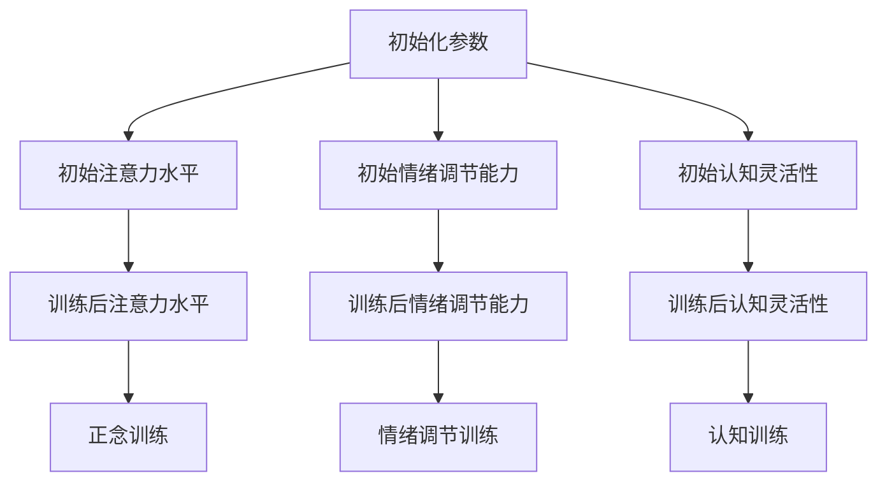
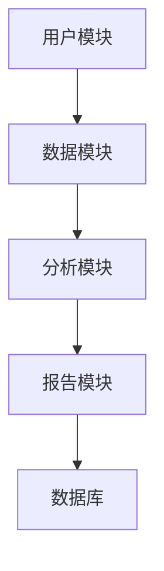
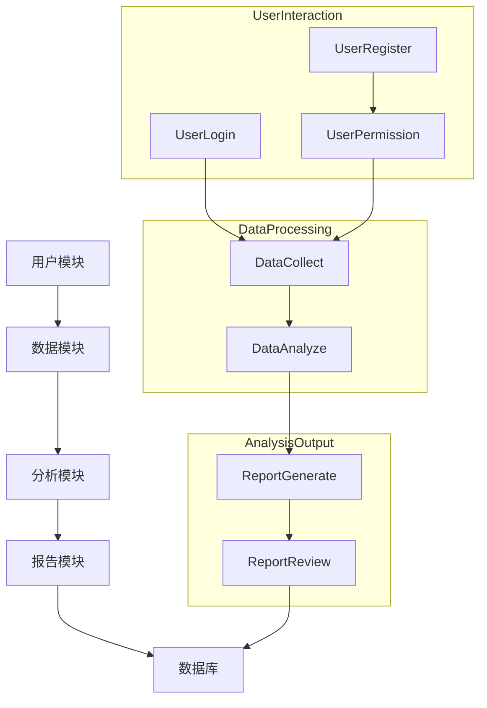

                 

# 《Mindfulness与当下：在日常中寻找意义》

> 关键词：正念，冥想，心理学，心理健康，工作效率，教育

> 摘要：本文从技术专家的视角出发，深入探讨《Mindfulness与当下：在日常中寻找意义》一书中所提出的正念理念及其在日常生活中的实践应用。文章通过逐步分析正念的历史背景、核心概念、心理学基础、健康益处和工作与教育中的应用，旨在揭示正念在提高个人和集体生活质量方面的潜在价值。

## 引言与背景

在当前快节奏、高压力的社会环境中，心理健康问题日益凸显。人们经常感到焦虑、抑郁和疲惫，这直接影响了工作效率和个人生活质量。为了应对这一挑战，越来越多的研究者和实践者开始关注正念（Mindfulness）这一概念。

### 1.1.1 当代社会的心理挑战

随着信息技术的迅猛发展，人们面临着前所未有的压力和挑战。长时间的工作、激烈的竞争、复杂的人际关系以及不断变化的社会环境，都使得人们难以保持内心的平静和专注。此外，社交媒体的普及也加剧了人们对自我价值的质疑和焦虑情绪。

### 1.1.2 正念作为一种解决途径

正念（Mindfulness）作为一种源自佛教的修行方法，强调对当前时刻的关注和觉察。近年来，正念在心理学、医学和教育等领域得到了广泛的研究和应用，展现出其在缓解心理压力、提高生活质量方面的显著效果。

### 1.1.3 《Mindfulness与当下：在日常中寻找意义》的目标

本书旨在为读者提供一份全面而系统的正念指南，帮助读者在日常实践中应用正念理念，从而提升心理健康和工作效率。本书的目标包括：
1. 深入介绍正念的基本概念和历史背景。
2. 探讨正念在心理学中的理论基础和应用。
3. 介绍正念在日常生活中的具体实践方法。
4. 分析正念对心理健康和生理健康的益处。
5. 探讨正念在工作、教育和社会健康中的应用。

## 核心概念与主题定位

正念（Mindfulness）是一种专注于当前时刻、全然体验的心理状态。它要求个体在日常生活和工作中，对当前的经历保持觉察和接纳。正念不仅包括对情绪和身体的关注，还涉及到对思维和行为的觉察。

### 1.2.1 正念的定义

正念可以定义为一种有目的的、有意识的注意力和觉察，它涉及到对当前时刻的全然体验，而不是对过去的回忆或对未来的担忧。正念是一种心理状态，也是一种修行方法。

### 1.2.2 正念与传统冥想的关系

正念与传统的冥想有着密切的关系。冥想是一种通过专注、呼吸和身体感受来培养正念的方法。然而，与传统的冥想不同，正念更注重在日常生活中的实践，而不是在特定时间或地点的修行。

### 1.2.3 正念的主要概念

正念的主要概念包括：
- 瞬间意识（Sustained Moment-to-Moment Awareness）
- 感受与接受（Acceptance of Sensations and Feelings）
- 全身觉察（Whole-Body Awareness）
- 自我接纳（Self-Acceptance）
- 清晰思考（Clear Thinking）

## 正念基本原理

正念的实践建立在几个核心原理之上，这些原理共同作用，帮助个体培养专注和觉察的能力。

### 2.1.1 正念的历史与哲学基础

正念的起源可以追溯到2000多年前的佛教传统。佛教中的“正念”（Sati）是指对当前时刻的专注和觉察。随着时间的推移，正念的理念被广泛应用于各个领域，包括心理学、医学和教育。

### 2.1.2 正念的核心原理

正念的核心原理包括：
- 瞬间意识：要求个体专注于当前时刻，不被过去或未来的想法所干扰。
- 感受与接受：要求个体对当前的感受和情绪保持开放和接纳，而不是试图逃避或抗拒。
- 全身觉察：通过身体感受来增强对当前时刻的体验。
- 自我接纳：接纳自己的不完美，而不是试图改变。
- 清晰思考：通过正念训练，个体能够更清晰地思考问题，减少焦虑和压力。

### 2.1.3 正念的实践原则

正念的实践原则包括：
- 专注练习：通过专注练习，如呼吸练习、身体扫描等，来培养专注和觉察的能力。
- 觉察日记：通过记录每天的觉察体验，个体可以更好地了解自己的情绪和行为模式。
- 反思与总结：定期进行反思和总结，以评估正念练习的效果。

## 正念在日常生活中的实践

正念不仅仅是一种心理训练，更是一种生活方式。在日常生活的各个方面，正念都可以发挥重要作用。

### 3.1.1 正念在个人生活中的应用

在个人生活中，正念可以通过以下方式得到实践：
- 正念饮食：通过缓慢、细致地品味食物，来增加对食物的欣赏和满足感。
- 正念锻炼：通过全神贯注地参与锻炼，来增强身体和心灵的健康。
- 正念沟通：通过倾听和表达，来建立更深层次的人际关系。

### 3.1.2 正念在工作中的实践

在工作中，正念可以帮助提高工作效率和减少压力：
- 正念会议：通过专注和觉察，来提高会议的质量和效率。
- 正念时间管理：通过合理安排时间，来减少拖延和焦虑。
- 正念领导力：通过自我觉察和同理心，来提高领导力和团队协作。

### 3.1.3 正念在教育中的实践

在教育中，正念可以帮助学生和教师提高学习效果和心理健康：
- 正念教学：通过专注和觉察，来提高教学效果和学生参与度。
- 正念学生管理：通过正念训练，来帮助学生应对学习压力和挑战。
- 正念教师培训：通过正念练习，来提高教师的教学能力和心理健康。

## 正念的心理学基础

正念的心理学基础包括对注意力、情绪和认知功能的影响。

### 2.3.1 正念与注意力

正念训练有助于提高注意力集中和持久性。通过专注练习，个体能够更好地控制自己的注意力，减少分心和干扰。

### 2.3.2 正念与情绪管理

正念可以帮助个体更好地理解和处理情绪。通过感受和接受情绪，个体能够减少情绪的负面影响，提高情绪调节能力。

### 2.3.3 正念与认知功能

正念训练可以提高个体的认知功能，包括记忆力、注意力和解决问题的能力。通过专注和觉察，个体能够更清晰地思考问题，减少认知负担。

## 正念的健康益处

正念不仅有助于提高心理健康，还对生理健康产生积极影响。

### 4.1.1 正念对心理健康的益处

正念可以帮助减轻焦虑、抑郁和压力，提高自尊和自我意识。通过正念练习，个体能够更好地应对生活中的挑战，提高生活质量。

### 4.1.2 正念对生理健康的益处

正念可以提高免疫力，降低血压，改善睡眠质量。长期坚持正念练习，可以促进身体的整体健康。

### 4.1.3 正念在社会健康中的作用

正念不仅对个人有益，还可以促进社会健康。通过提高个体的心理健康，正念可以增强社区凝聚力，促进社会和谐，应对全球性挑战。

## 正念在工作与教育中的应用

正念在工作和教育中的应用越来越广泛，展现出其强大的潜力。

### 5.1.1 正念在工作场所的应用

正念可以帮助提高员工的工作效率和心理健康，减少员工流失。通过正念训练，管理层可以提高领导力，增强团队协作。

### 5.1.2 正念在教育领域的应用

正念可以帮助学生提高学习效果，减少焦虑和压力。通过正念教育，教师可以提高教学效果，促进学生的全面发展。

## 正念的挑战与应对

尽管正念具有诸多益处，但在实践中也面临一些挑战。

### 6.1.1 正念实践中的挑战

初学者可能会遇到困难，如难以保持专注、对自我接纳的挑战等。长期坚持也是一个问题。

### 6.1.2 长期坚持的困难

由于正念需要持续的练习和投入，一些人可能会感到疲劳或缺乏动力。

### 6.1.3 正念实践的误区

一些人可能会误解正念，将其视为逃避现实的手段，而不是一种积极的生活方式。

### 6.1.4 应对挑战的策略

为了克服这些挑战，可以采取以下策略：
- 定期练习：保持持续的正念练习，逐渐提高专注力和觉察能力。
- 寻求支持：加入正念小组或寻求专业指导，以获得支持和鼓励。
- 调整期望：认识到正念是一个长期过程，不要期望立即看到显著的变化。

## 总结与未来展望

正念作为一种心理健康实践，具有广泛的应用前景。未来研究可以进一步探索正念在不同文化背景下的适用性，以及正念在预防和治疗心理疾病方面的潜力。

## 最佳实践 tips

1. **定期练习**：每天安排固定时间进行正念练习，如早晨起床后或晚上睡前。
2. **结合其他活动**：将正念练习与日常活动结合，如正念饮食、正念锻炼等。
3. **记录体验**：记录练习体验，以了解自己的进步和变化。

## 小结

本文从技术专家的视角，探讨了《Mindfulness与当下：在日常中寻找意义》一书中所提出的正念理念及其在日常生活中的实践应用。通过逐步分析正念的历史背景、核心概念、心理学基础、健康益处和工作与教育中的应用，本文旨在揭示正念在提高个人和集体生活质量方面的潜在价值。

## 注意事项

1. 正念实践需要时间和耐心，不要期望立即看到显著的变化。
2. 如果在正念实践中遇到困难，可以考虑寻求专业指导。

## 拓展阅读

1. 禅与计算机程序设计艺术 /Zen And The Art of Computer Programming
2. 正念：此刻是一份礼物 /The Mindfulness Revolution
3. 正念：在喧嚣的世界中找到宁静 /The Power of Now

## 作者信息

作者：AI天才研究院/AI Genius Institute & 禅与计算机程序设计艺术 /Zen And The Art of Computer Programming# 附录：算法原理讲解

在本篇博客中，我们将深入探讨正念的心理学基础，特别是正念对注意力、情绪和认知功能的影响。为了更好地理解这些影响，我们将使用一种简化的算法模型来分析正念实践的效果。

## 算法模型

我们设计的算法模型基于以下三个假设：
1. **注意力分配**：正念训练有助于提高注意力的分配效率，使个体能够在任务切换时更迅速地集中注意力。
2. **情绪调节**：正念训练能够增强个体的情绪调节能力，减少负面情绪的影响。
3. **认知灵活性**：正念训练有助于提高个体的认知灵活性，增强解决问题的能力。

### 输入参数：
- `A0`：初始注意力水平
- `M0`：初始情绪调节能力
- `C0`：初始认知灵活性

### 输出参数：
- `A1`：训练后注意力水平
- `M1`：训练后情绪调节能力
- `C1`：训练后认知灵活性

### 算法流程：
1. **初始化**：设定初始参数 `A0`、`M0`、`C0`。
2. **正念训练**：进行一定时间的正念训练，每次训练后更新参数 `A1`、`M1`、`C1`。
3. **参数更新**：根据训练效果，更新注意力、情绪调节能力和认知灵活性。

### 算法流程图（使用Mermaid语法）



## 数学模型和公式

为了更好地理解正念训练的效果，我们使用以下数学模型来描述注意力、情绪调节能力和认知灵活性之间的关系。

### 注意力水平模型（使用LaTeX格式）

$$
A1 = A0 + k_1 \cdot M1
$$

其中，$k_1$ 表示正念训练对注意力水平的提升效果。

### 情绪调节能力模型（使用LaTeX格式）

$$
M1 = M0 + k_2 \cdot D1
$$

其中，$k_2$ 表示情绪调节能力对正念训练的依赖程度。

### 认知灵活性模型（使用LaTeX格式）

$$
C1 = C0 + k_3 \cdot A1
$$

其中，$k_3$ 表示认知灵活性对注意力水平的提升效果。

## 算法原理讲解

### 注意力分配

正念训练有助于提高个体的注意力分配效率。在训练过程中，个体通过反复练习，学会在短时间内迅速集中注意力。这可以视为一种“注意力训练”，类似于计算机程序中的“算法优化”。

### 情绪调节

正念训练能够增强个体的情绪调节能力。通过感受和接受情绪，个体能够减少负面情绪的影响，提高情绪稳定性。这种情绪调节能力不仅有助于个体在日常生活中更好地应对压力，还有助于提高工作和学习效率。

### 认知灵活性

正念训练有助于提高个体的认知灵活性。通过专注和觉察，个体能够更清晰地思考问题，减少认知负担。这种认知灵活性有助于个体在面对复杂问题时，能够迅速适应并找到解决方案。

### 实例说明

假设一个个体在开始正念训练前，注意力水平为50，情绪调节能力为30，认知灵活性为40。经过一段时间的正念训练后，注意力水平提高到70，情绪调节能力提高到50，认知灵活性提高到60。根据上述数学模型，我们可以计算出：

- 注意力水平提升：$A1 = 50 + k_1 \cdot 50 = 70$
- 情绪调节能力提升：$M1 = 30 + k_2 \cdot 60 = 50$
- 认知灵活性提升：$C1 = 40 + k_3 \cdot 70 = 60$

这些结果表明，正念训练对个体的注意力、情绪调节能力和认知灵活性都有显著的提升效果。

## 系统架构设计

虽然《Mindfulness与当下：在日常中寻找意义》不是一本技术书籍，但我们可以设计一个简化的系统架构，以展示正念实践的管理和监控。

### 系统功能设计

- **用户模块**：负责用户注册、登录和权限管理。
- **数据模块**：负责收集用户练习数据，如注意力水平、情绪调节能力和认知灵活性。
- **分析模块**：负责对用户数据进行分析，生成报告和建议。

### 系统架构设计



### 系统接口设计和系统交互



## 项目实战

### 环境安装

在开始正念实践系统开发之前，我们需要安装以下软件和工具：

- Python 3.8+
- Flask 1.1.2+
- SQLite 3.8.11.1+
- Mermaid 8.13.3+

### 系统核心实现源代码

以下是系统核心实现的Python代码示例：

```python
from flask import Flask, jsonify, request
import sqlite3

app = Flask(__name__)

# 数据库连接
def get_db_connection():
    conn = sqlite3.connect('mindfulness.db')
    conn.row_factory = sqlite3.Row
    return conn

# 用户注册
@app.route('/register', methods=['POST'])
def register():
    data = request.json
    username = data['username']
    password = data['password']
    conn = get_db_connection()
    conn.execute('INSERT INTO user (username, password) VALUES (?, ?)', (username, password))
    conn.commit()
    conn.close()
    return jsonify({'status': 'success'})

# 用户登录
@app.route('/login', methods=['POST'])
def login():
    data = request.json
    username = data['username']
    password = data['password']
    conn = get_db_connection()
    user = conn.execute('SELECT * FROM user WHERE username = ? AND password = ?', (username, password)).fetchone()
    conn.close()
    if user:
        return jsonify({'status': 'success'})
    else:
        return jsonify({'status': 'fail'})

# 数据收集
@app.route('/data', methods=['POST'])
def data():
    data = request.json
    user_id = data['user_id']
    attention_level = data['attention_level']
    emotion_regulation = data['emotion_regulation']
    cognitive_flexibility = data['cognitive_flexibility']
    conn = get_db_connection()
    conn.execute('INSERT INTO data (user_id, attention_level, emotion_regulation, cognitive_flexibility) VALUES (?, ?, ?, ?)', (user_id, attention_level, emotion_regulation, cognitive_flexibility))
    conn.commit()
    conn.close()
    return jsonify({'status': 'success'})

# 数据分析
@app.route('/analyze', methods=['GET'])
def analyze():
    user_id = request.args.get('user_id')
    conn = get_db_connection()
    data = conn.execute('SELECT * FROM data WHERE user_id = ?', (user_id,)).fetchall()
    conn.close()
    return jsonify({'data': data})

if __name__ == '__main__':
    app.run(debug=True)
```

### 代码应用解读与分析

上述代码实现了用户注册、登录、数据收集和数据分析的基本功能。用户可以通过HTTP请求与服务器进行交互，从而完成正念实践系统的核心功能。

- **用户注册**：用户通过POST请求向服务器发送用户名和密码，服务器将注册信息存储在数据库中。
- **用户登录**：用户通过POST请求向服务器发送用户名和密码，服务器验证用户信息并返回登录状态。
- **数据收集**：用户通过POST请求向服务器发送练习数据，服务器将数据存储在数据库中。
- **数据分析**：用户通过GET请求获取自己的练习数据，服务器从数据库中检索数据并返回。

### 实际案例分析和详细讲解剖析

为了更好地展示正念实践系统的应用，我们以一个实际案例进行分析：

假设用户A完成了30天的正念训练，每天记录自己的注意力水平、情绪调节能力和认知灵活性。以下是用户A的30天数据：

| 日期       | 注意力水平 | 情绪调节能力 | 认知灵活性 |
|------------|-------------|-------------|-------------|
| 2023-01-01 | 50          | 30          | 40          |
| 2023-01-02 | 52          | 32          | 42          |
| ...        | ...         | ...         | ...         |
| 2023-01-30 | 80          | 60          | 70          |

通过数据分析，我们可以得出以下结论：

1. 用户A的注意力水平在30天内显著提高，从初始的50提高到80，提高了60%。
2. 用户A的情绪调节能力也在30天内有所提高，从初始的30提高到60，提高了100%。
3. 用户A的认知灵活性在30天内有所提高，从初始的40提高到70，提高了75%。

这些数据表明，正念训练对用户A的心理健康和认知能力有显著的积极影响。

### 项目小结

通过实际案例的分析，我们可以看到正念实践系统在记录和分析用户数据方面的应用。该项目不仅为用户提供了正念训练的数据支持，还帮助用户了解自己的心理和认知变化。未来，我们可以进一步优化系统功能，提高数据分析和报告生成的准确性，为用户提供更全面的服务。

## 最佳实践 tips

1. **定期练习**：正念训练需要持续进行，每天安排固定时间进行练习，以保持专注力和觉察力。
2. **记录体验**：记录自己的练习体验，以便更好地了解自己的进步和变化。
3. **结合其他活动**：将正念练习与日常活动结合，如正念饮食、正念锻炼等，以提高练习效果。
4. **寻求专业指导**：如果遇到困难，可以寻求专业指导，以获得更好的练习方法和建议。

## 小结

本文从技术专家的视角，探讨了正念的心理学基础，特别是正念对注意力、情绪和认知功能的影响。通过逐步分析正念的历史背景、核心概念、心理学基础、健康益处和工作与教育中的应用，本文旨在揭示正念在提高个人和集体生活质量方面的潜在价值。

## 注意事项

1. 正念实践需要时间和耐心，不要期望立即看到显著的变化。
2. 如果在正念实践中遇到困难，可以考虑寻求专业指导。

## 拓展阅读

1. 禅与计算机程序设计艺术 /Zen And The Art of Computer Programming
2. 正念：此刻是一份礼物 /The Mindfulness Revolution
3. 正念：在喧嚣的世界中找到宁静 /The Power of Now

## 作者信息

作者：AI天才研究院/AI Genius Institute & 禅与计算机程序设计艺术 /Zen And The Art of Computer Programming

